# 私域运营** **合集

如何做好私域引流、社群运营，提升转化变现效率

整理日期：**230720**

 

 

生财风向标系列单独用在线文档分享，地址见专属群q群消息。

往期的生财周报合集（含在线版和离线版），见专属群Q群文件和群公告。

希望大家有收获~

标题加了(精华)的表示精华贴，前面为截至今日的点赞数。

以下是目录，内容有些多。大家可以挑兴趣的内容阅读。

 

 

 

# **# **目录

私域运营** **合集

目录

【私域引流】**8**篇

(精华帖)(396赞)非常适合新手起步的项目，我是如何靠抖音上发资料轮播图引流并变现的？

(精华帖)(233赞)通过生财有术提升商业认知，我做付费成长社群实现月入 3W+ 的经验分享

(精华帖)(221赞)实操复盘：小红书资料号新玩法，深度运营月入 5W+(精华帖)(210赞)作为职场宝妈兼团长，我是如何从卖包浆豆腐到营业额超100w的？

(精华帖)(207赞)我做小红书垂直 IP ，第 1 个月变现 10 万的经验分享(精华帖)(197赞)全网精准引流 300W 的底层逻辑和方法论分享

(精华帖)(179赞)从创业失败到低成本获客过百万，我是如何摸索出自己擅长的引流打法的

(精华帖)(62赞)分享一个电商转私域流量的小案例：  手机壳商户

【私域裂变】**3**篇

(精华帖)(233赞)通过群裂变10天精准涨粉10w，他是怎样做到的？

来，欢迎  开始今天的分享

(精华帖)(79赞)动员 80 万宝妈，一起做童书社群分销，2 年成为行业头部的打法经验分享

(精华帖)(29赞)训练营3天裂变1000人的小分享

【私域转化】**1**篇

(精华帖)(82赞)2人运营团队，在30+群同时开营的情况下，如何完成40%以上的转化率？

【私域变现】**3**篇

(精华帖)(227赞)零基础全职妈妈如何通过社群团购月入过万，实现经济独立？

(精华帖)(135赞)一场微信群活动，单个群变现47万，3500字大白话全拆解(精华帖)(107赞)自营牛肉品牌如何运营团购平台？通过私域运营实现稳定营业额40-50w

【社群运营】**13**篇

(精华帖)(605赞)20个步骤：再小的个体，也可以从0到1，打造出你的个人品牌(精华帖)(402赞)社群运营的秘诀，其实就20句话

 

 

(精华帖)(276赞)7000+人单价365元-年的高格调女性社群运营思路分享(精华帖)(152赞)芷蓝：做付费社群几年，我都有哪些心得跟技巧

(精华帖)(133赞)运营研究社是怎样结合三级火箭模式，运营 100 万私域用户的(精华帖)(112赞)关于陪伴式社群运营的二三事

(精华帖)(91赞)付费社群的 5 个避坑指南

(精华帖)(89赞)拆解了 6 个微信社群，我得出了这 19 点社群方法论(精华帖)(87赞)一个设计师创业者，在 8 月份的 100 条复盘

(精华帖)(75赞)一个转化率 40% 的乌托邦式的社群团购是如何做到的(精华帖)(73赞)3天搭建精细化母婴社群，开业当天实现60万+的业绩(精华帖)(69赞)嘉宾问答-“想做社群运营，又不想显得像微商，怎么办？”【付费社群】**2**篇

(精华帖)(165赞)如何从 0到 1，打造出盈利 10W+ 的育儿社群(精华帖)(101赞)运营新手从0到1将家居类社群免费向付费转型，并深度变现的经验【线下案例】**6**篇

(精华帖)(157赞)以面包店为例，实体店如何通过私域运营实现扭亏为盈？

(精华帖)(144赞)实体茶叶转型小红书引流，一年变现 100W+

(精华帖)(120赞)线下案例：我通过点位布局无人售货机和运营实现单台机器月入2W+

(精华帖)(109赞)搭建自己的私域流量池，从人货场分析冲出重围的线下店铺(精华帖)(97赞)靠着抖音 1.7W 粉丝能月盈利小 3W ，实体店如何搭上抖音这个顺风车

(精华帖)(52赞)小团队通过做矩阵短视频，卖汽车用品单月直接变现 10W+【**IP **运营】**2**篇

(精华帖)(297赞)电商创业抖音 IP，一条视频引流 500+ 私域，2 天变现 2 万+(精华帖)(99赞)通过明确个人 IP、输出优质内容、根据粉丝特点打造产品，8 年拥有 6W 私域流量，实现百万变现

【精细化运营】**1**篇

(精华帖)(156赞)3 分钟看懂增长 10 倍业绩的实操

【朋友圈运营】**7**篇

(精华帖)(172赞)如何写出既能吸金、又能深入人心的心金文案

(精华帖)(134赞)26种原因：别人为什么要转发你的海报到朋友圈？

(精华帖)(127赞)巧用「逻辑线」发圈法，让用户越看越上瘾

(精华帖)(123赞)怎样提高朋友圈文案的质量，从而达到不刷屏也能高效成交的目的 

 

(精华帖)(116赞)我是如何在30天内用朋友圈剧本＋快闪群成交，给我的新舞蹈室赚了6万块钱的？

(精华帖)(112赞)如何打造自动成交的朋友圈系统

(精华帖)(104赞)靠朋友圈精准营销，6 个月变现 14W+ 的实操方法【自动化提效】**3**篇

(精华帖)(242赞)如何利用 RPA 实现自动化获客，让项目提效躺赚？

(精华帖)(169赞)每天稳定新增 150+ 好友，用技术让私域流量实现主动引流(精华帖)(74赞)如何利用企业微信实现社群运营自动化

【**CRM**系统提效】**3**篇

(精华帖)(153赞)抖音无人直播引流本地代办业务，1 个月成交 50-100 单，客单5000+ 的变现经验分享

(精华帖)(140赞)年营收从 0 到 6000W，我是如何通过近 8W 名私域用户做到的(精华帖)(96赞)以二手奢侈品为例，如何通过私域运营提升顾客粘性，  实现 74%的转化？

【团队管理】**6**篇

(精华帖)(360赞)引流团队如何做到小红书单月引流 13000＋，全年变现 1000W＋(精华帖)(290赞)我是怎么把作坊式的微商管理模式,转变为流程化、标准化的运营模式的？

(精华帖)(239赞)微商团队的培训，我是怎么做的？

(精华帖)(64赞)私域做团队管理如何从 1-100 把规模放大？

(精华帖)(59赞)不同行业私域如何搭建社群体系及运营团队

(精华帖)(51赞)从 0 到 1 搭建 To B 售后团队的一点点经验总结

# 【私域引流】**8**篇

 

 

# **# ****(**精华帖**)(396**赞**)**非常适合新手起步的项目，

# 我是如何靠抖音上发资料轮播图引流并变现的？

作者：  胖猫

日期：2022-07-29

大家在星球上看过不少图文轮播的项目，比如童装轮播、中老年服装轮播，今天给大家聊聊我在教育行业的图文轮播项目。

我是2019年5月加入的生财有术，在此之前完全没有想过商业、甚至是副业的事情，给自己规划的路也是在职场上打怪升级，不断晋升。

但是出于对金钱的渴望，因为一个偶然的机会，加入了生财星球。

从此之后，世界的另一扇门被打开了，看到了各种各样的赚钱机会。

当然也在不断的尝试各种项目，淘宝客、抖音小程序、书单号、知乎好物、闲鱼无货源、线下拉新、摆地摊、外卖cps等等，但凡自己觉得能试一把的，都试了一遍。

不出意外，这些项目都没成。

在我即将放弃副业赚钱这个想法的时候，碰到了现在这个项目，终于有了一点正反馈。

真正开始做这个项目是今年2月初，2月11号就收获了第一个付费用户。

 

 

客单价很低，只有19.9元。但正是因为这19.9元，让我有了做下去的动力。

截止到4月30号，靠这个项目带来的直接收益在2万7左右，同时加到微信号人数3000+。

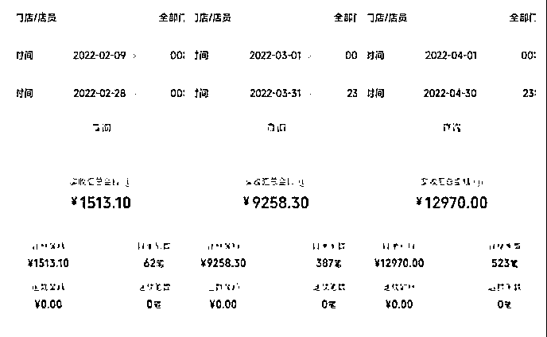 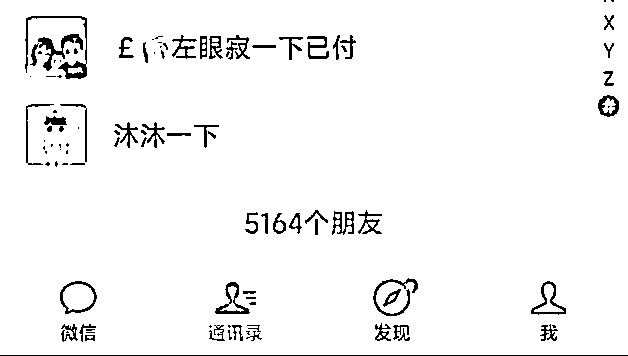

 

 

这个收益对于星球内大佬来说，不值一提，但是对于一个在迷茫中摸索了很长时间的人来说，却是极大的鼓励。

如果你仍在迷茫中摸索，如果你看得上每月赚几千块钱的小项目，那么这个项目值得一试。

**1. **这个项目简单说就是，在抖音上发小学资料的轮播图，引导用户加微信，然后付费进资料群。

“双减”之后，抖音上不允许明目张胆的进行K12培训了，但是家长渴望孩子取得好成绩的需求还是存在的，所以卖学习资料这个项目是可行的。

**2. **这里多说几句，我为什么选择做这个项目？

一是，我觉得自己有能力做。

我本身是硕士毕业，上学的时候一直是学霸。自己对搜集资料、整理资料、解答学习问题这些事情不抵触，有能力做好。而且做过视频号和抖音，掌握基本的剪辑技巧和抖音运营套路；

二是，我看到同行在做这个项目，看到他们挣钱了，这极大刺激了我；

三是，在我看来这个项目是有积累的，可以把家长粉引流到私域，这是很值钱的一批人，未来的想象空间很大；

 

 

四是，这个项目正反馈很及时，只要坚持发视频就能有收益，更容易做下去。

**3. **接下来重点说一下，项目具体该怎么做。

这个项目有两条线，一条线是流量获取，另一条线是资料库维护；

**1**）先看流量获取这条线，这条线需要进行的操作是：

设置抖音账号，

抖音发图片轮播，

引导用户加微信，

微信私聊进行成交，拉用户进**QQ**资料群；

**2**）再看资料库维护这条线要进行的操作：

建立**QQ**群，

在同行处获取电子资料，

对资料进行整理，

定期将整理好的资料上传到**QQ**群。

咱们逐个说明，先说流量获取这条线的几个操作

设置抖音账号

账号包括几部分：名称、头像、背景图、简介、粉丝群。

名称一般是：小学资料分享、小学资料库、一年级学习资料分享、李老师分享小学资料等。

 

 

可以让人一眼看出账号的定位。

 

 

 

 

头像一般是名称的文字图片。

背景图一般是“需要电子资料佳  微心 XXXXX”，利用谐音留下自己的微信号。

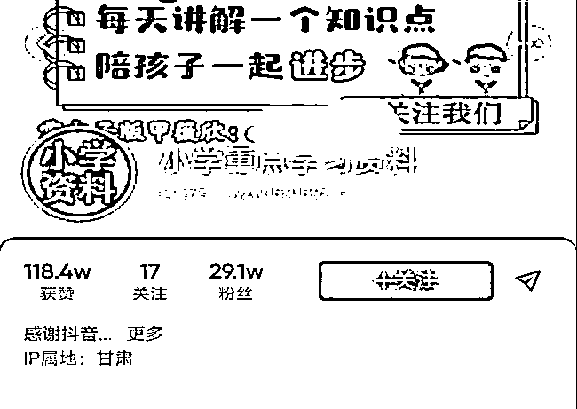

经过我的测试，只要不被人举报，在背景图留微信号是不影响流量的。但是企业号背景图不能留微信，会被系统检测到。

 

 

所以，我的猜测是，我们在抖音上的任何动作系统都是可以监测到的，只是系统会不会处理我们的问题。

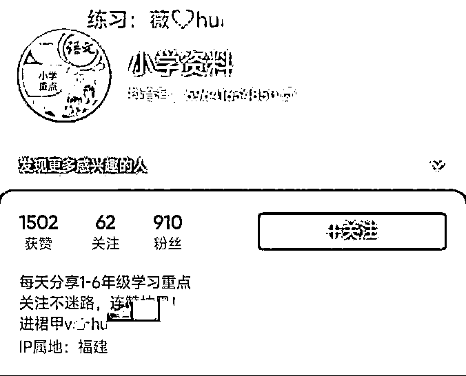

简介一般是写：每天分享电子资料，需要资料请+V：XXXX。

粉丝群，开一次直播后可以建粉丝群。建粉丝群的目的不是为了在抖音进行私域运营，而是为了更方便的进行引流。

我现在的路径是把人引到抖音粉丝群，然后在粉丝群内引导用户加微信。

 

 

我的操作是，用户进群后会自动@他，并发送欢迎语“更多资料在付费资料群（24.9一学期），进群请加V：XXXXX”，从而引导用户加微信。

抖音发图片轮播

这一部分决定了你的视频能获得多大的流量，也决定了你能赚多少钱。

目前我的视频播放量基本稳定在2万以上，最高的是120万左右。单视频带来的最高收益在4000元左右，播放量是70万左右。

发什么样的图片容易火？

一种方法是靠感觉，当你发的多了，就能感觉出来什么样的资料容易受家长喜欢，他们会疯狂点赞、收藏、私信你；

另一种方法是“什么火发什么”。

看抖音上的同行在发什么，哪个视频点赞多，下载下来处理一下，就是自己的视频了。

当然这种方式不鼓励，而且有风险。

针对这种情况，有两种处理方式，一是你找到它视频中对应的资料，然后直接把电子文档资料生成图片，这时候的图片就是原创了，可以放心上传到抖音。

如果你找不到他发的这个资料怎么办呢？那你就发类似的资料，比如别人火的视频是看图写话相关的资料，那你就找一份看图写话的资料做成图片或者是视频，发到抖音上。

 

 

看小红书上近期哪个资料比较火，点赞、收藏比较高，把资料下载下来，做成图片轮播，发到抖音上，大概率也能火。

总起来说，这类似于电商选品中的跟品。当你不知道什么内容容易火的时候，“跟品”是最有效的方式。

关于如何下载无水印的视频，可以在微信小程序上搜“去水印”，有很多。随便找一个用起来就行。

这里需要说明的一点是，学习资料类账号是有周期性的。

比如现在是期中考试刚刚结束，现在再发期中考试的内容是不太容易火的，如果你赶在期中考试前一周，发一些期中考试的练习题、知识总结是很容易爆的。

给我带来4000收益的那个视频就是踩中了期中考试的节点。

这也是这个项目需要的一个技能点，你得知道学生学习的进度，发的内容和学生的学习进度相匹配才更容易火。

除了周期性对得上的资料容易火外，还有一类资料容易火，“让用户看起来有满满的获得感”的资料容易收获点赞、收藏和评论。

比如：一年级上册数学必须掌握的50个知识点和一年级上册数学第二单元课时练。这两个资料一对比，大概率前者更受欢迎。

 

 

除了参考同行图片外，还有一种自己制作图片的方式。如果你有一份PDF的资料，觉得特别好，有火的潜质。可以直接用WPS把PDF生成图片，然后选取6-9张图片，直接发到抖音上就行。

这里有个小技巧，在制作轮播图片时，我们可以适当的用一些文字或者贴纸盖住一部分资料。

一是为了防止别人直接下载我们的资料。因为盖住了一部分文字，即使下载下来也不能使用，只能找我们要；二是为了引发用户的吐槽，增加评论区的热度，更有助于视频上热门；

再有就是，视频的标签最好是加固定的几个，而且要和视频内容匹配。

比如你发的是一年级看图写话的资料，那标签可以是一年级、一年级语文、一年级下册、看图写话。同时我也会加上知识分享、图文来了，这两个标签。因为这两个流量很大。

最后是发视频的时间点，这个主要看自己粉丝的活跃时间，我自己粉丝的活跃时间是晚8点-11点。所以我一般选择下午或者晚上发。

引导用户加微信

这块需要注意的是，不能直接说微信两个字，要用违心、微心、胃新等谐音代替。

我留微信的地方有3个，一个是背景图，一个是粉丝群内的欢迎语，还有一个是合集的名称（合集名称改成需要资料+VX）。

 

 

同行还有在简介处留微信的。内容都差不多，“需要电子版资料请+VX：XXXX”。

见过最牛的是直接把微信号留在资料上，居然也能有几千点赞。

这几个地方，我个人觉得粉丝群是最好的。安全性高、效率更高一些。

多说一句，有些家长不会看背景图，有些家长不知道怎么加粉丝群，有些家长不知道+VX、+违心  是什么意思，还有些家长不会添加微信好友。但是他们都想给孩子找学习资料。

微信私聊，进行成交

这部分是最费时间的，因为需要对每个用户进行一对一沟通。

我现在的流程是这样的：他添加我之后，我先给他发一份资料，然后问一句“请问需要进付费资料群吗”。

如果他不回复或者是回复不需要，我就不再理会。

如果他表现出感兴趣，比如他回复“要进，好的，什么样的群，多少钱”等，我会把群介绍的话术发给他，同时把录的资料群的视频发给他。

如果他继续回复好的，可以。就把付款码和QQ群二维码发给他，他付款后，给他通过加群申请即可。

 

 

这部分需要注意的是：

视频爆了后，微信加人比较多，消息回复过于频繁的话会被限制聊天功能。所

以加人特别多的时候，要控制回复消息的频率；

最好不要直接用微信红包、转账的方式收钱。量大了，对方会收到风险提示。

不利于用户付费。最好的方式是办一个微信商业收款码，安全稳定，可持续。

**4. **接下来说资料库这部分

**1**）建**QQ**群

这一步需要说明的是，普通账号最多可以建500人的群，要想建1000、2000甚至3000人的群，需要开通超级会员，可以官网直接买，也可以淘宝、拼多多。一二百块钱可以搞定。

我目前建了一个2000人群，里面有1300+人，这学期大概率不会突破2000人了。所以新手的话，建个2000人群就够用了。

**2**）获取电子资料

获取电子资料的途径有很多：淘宝、拼多多、小红书、公众号等等，最简单高效的就是找同行，直接用同行的资料。

 

 

在抖音上找一个同行，花几十块钱进到他们的QQ资料群，把群中资料都下载下来就行。

如果是持续更新的，那就他上传一个，你下载一个就行。

**3**）整理资料

在同行那获得的资料一般都会带他的微信号。这时候，需要把他的水印去掉。

一般可以直接用WPS把页眉页脚、水印等删除，然后再加上自己的就行。

我一般是加上页眉“需要更多资料加微信 XXXXX”，既不影响用户使用，也留了自己的钩子。

稍复杂一点的情况是，用户资料加密了，无法进行编辑。这种也容易解决。

一种方法是在淘宝、拼多多上找人帮忙把密码破解了；另一种是用WPS把资料转成图片格式，然后再把图片生成PDF，最后再通过“编辑-擦除”功能，把水印擦除就行；第三种方法是搜索破译密码的工具，直接用工具暴力破解。破解后文件就能编辑了。（懒得自己找工具的，可以找我要）

**4**）上传资料

我现在是固定每周六上传资料，而不是随时有随时传。一方面是为了节省自己的时间，另一方面也是为了不过多干扰大家；

 

 

另外，QQ群文件要分类整理好，比如不同版本要区分开，一课一练和单元测试要分类清楚。这样做更方便用户找资料。

如果你不知道怎么分合适，就直接照抄同行的就行。

以上就是这个项目的整体流程和一些注意事项

**5. **一些其它问题

**1**）做这个项目需要具备哪些条件？

时间相对自由。这样才能及时回复用户，提高转化率；

基本的剪辑技巧；

**WPS**基本操作，调整格式、生成图片、图片生成**PDF**等基本技能；

一定的文化水平。确保能回答家长关于学习的一些问题，偶尔进行具体题目的

答疑；

搜集整理资料的能力；

个人觉得大学生、宝妈比较适合这个项目。

 

 

**2**）播放量起不来怎么办？

坚持持续发；

试着发一些话题范围更广的内容。

比如你的账号是“三年级小学资料分享”，正常来说只发3年级资料就行，但是3年级资料的受众人群是很少的，你可以试着发一些针对整个小学阶段家长的内容，比如“小学生必须要养成的10个好习惯”，这个内容针对的人群基数更大，更容易破量。

当然，你账号内绝大部分视频还是围绕着定位去发。

**3**）** **抖音粉丝群如何维护？

抖音粉丝群除了要定期发点资料外，还有一个问题是，要不要设置全员禁言。设置禁言的好处是，避免了同行或者其他人乱发东西。

不设置禁言的好处是，大家可以交流，在大家交流过程中，会有好心的用户告诉其他人，该如何加我们的微信。

虽然我们设置了进群欢迎语，但是有一些人是看不懂欢迎语的。这时候他就会在群里问，该如何加我们微信，然后会有其他用户回复他。

还有一种方式就是，设置禁言，然后定期群内发消息，告诉大家如何加微信。

 

 

我没有具体测算，但整体感觉是不设置禁言这种方式，转化效果更好一些。

**4**）这个项目竞争程度怎么样？是红海吗？

我感觉是介于红海和蓝海之间吧。网上一搜也有很多人在做，有竞争；但是我作为一个新手，操作了几个月也赚到了钱，说明还有的做。

而且，我感觉资料这种项目和别的项目可能还不太一样。它的竞争性没有那么强（当然还是有竞争的）。

什么意思呢？就是父母给孩子找学习资料永远不嫌多，用户可能既买了我的资料群，也会去买你的资料群，他想看看你有哪些不一样的资料，他想让孩子学的更多。我的付费用户中确实有几个是买了多个这种资料群的。

**5**）** **最后一句

不会做的时候就去看同行，同行是最好的老师。

评论区：

额滴神 : 同行是最好的老师。[强][强]

慢飞 : 这种主页直接留微信，是不是容易被同行举报

奥特之父 : 真详细。

胖猫 : 有这种风险

雨辰 : 我目前在做公考项目，图文版➕视频结合，每个月轻松的过千。方便留个微信交流一下[握手]

新世界 : 公考的我也有一些流量，不好变现，卖资料可以是可以，最直接，但是我不知道你的这种资料是不是别人机构的。还是自己有版权的

新世界 : 写的很详细的，小项目不错

 

 

白奇杉 : 第一年疫情的时候，某平台就一万多粉丝了，后来疫情结束上班了，好多人找我问这个资料，我都没回过，错过了好多啊。

# **# ****(**精华帖**)(233**赞**)**通过生财有术提升商业认

# 知，我做付费成长社群实现月入** 3W+ **的经验分

# 享

作者：  🔥逆熵增者💰

日期：2022-11-17

生财有术的圈友们，大家好，我是逆熵增者，一位逆变成长的90后，目前副业做自媒体和社群。

这是我在生财有术第一篇帖子，希望对大家有帮助。

今天主要分享一位普通人是如何通过阅读写作，2年赚到40W的经验。

下面是我这两年按照时间线的成长轨迹：

❶2020年前，还是一条咸鱼，下班后每天沉迷6小时王者荣耀的网瘾少年；

❷2020年初，疫情来了，居家隔离了2个多月，没什么事情就开始看书，没想到从此养成了阅读的习惯。

那一年总共读完170本书，蜕变成另外一个人，后来把网名改成了【逆熵增者】，一位试图对抗熵增的猛人；

 

 

2021年继续大量阅读和各种学习，读完130本书，也就是两年时间读完300本书。

这300本书里面，一半和个人成长领域相关，三分之一和搞钱相关，包括投资理财，财商思维等等书籍，这些对我后来做知识付费帮助都非常大。

边看书的同时边输出读书笔记，2020年1月第一次在互联网上写点东西，那时候开通了简书和微信读书，写了10个月，但依然没有多少粉丝，阅读量也是两位数。

2020年10月份加入阿猫读书的成长星球开始日更写作100天打卡活动，同步开通了公众号。

❸2020年12月底，创建付费成长社群，到今天为止，一年零10个月，总共有1000+小伙伴加入一起学习和成长。

❹从2020年10月到2022年10月，两年时间，靠日更公众号700天，涨粉1.5W，变现40W；

❺1年多时间，通过微信读书APP和公众号引流到个人微信10000人，开了两个微信。

❻2022年，一个人，在5天时间里成交114单，拿下剽悍私域成交高手实战营冠军。

以上就是我这两年多的一个经历，我确实是从一个**“**三无**”**的普通小白开始做起来的，没背景、没人脉、没资源。

 

 

不过我也有一些优势，比如我有超强的自律能力，不错的学习能力，一定的阅读写作能力，对自己够狠，够拼，有极强的目标感等等。

然后通过两年多的努力，拿到了副业月入3万的成绩。

所以今天来分享我是如何通过生财有术赚到前20万+的。为什么说是在没有加入生财之前呢？后面会揭晓谜底。

分享框架如下：

一、我是如何通过生财有术提升商业认知的？

二、我的项目是如何从零开始做起来的？

三、做付费成长社群的经验分享

四、新人想做有什么样的门槛？

五、我和生财有术的缘分

六、后续如何优化？如何做大？

一、我是如何通过生财有术提升商业认知的？

 

 

# **# ****1. **亦仁的亦无所知、生财有术公众号所有公开文章

这也算是一种白嫖大佬的智慧，因为生财有术公众号每周会分享一些精华帖内容，对于当时没什么钱，也没付费学习意识的我来说就是最佳的学习方法。

从亦仁大大那学到了以下几点

**1.1 **你要增加自己的表达和输出。

你要让别人知道你在做什么，你的价值观是什么。

** **

所以我开始在微信读书、公众号和知识星球日更分享，输出自己的学习和成长心得，以及自己的价值观。

**1.2 **第二个就是你要沉下来做一件事。

这件事情是什么不重要，但是你要沉下来开始做，开始迭代。有成果出来之后，加上你有表达，其实是一个双向的叠加。

我就是沉下心来阅读和写作，然后运营社群，虽然每天需要花很多时间和精力在这几个方面，但是很有收获，也算值了。

**1.3 **如果真的有流量红利，如何看见并抓住它？

 

 

最重要的三点：赚钱的欲望、敏锐度与执行力。

赚钱欲望是发动机，敏锐度是方向盘，执行力是油门。

这个比喻简直太精准了，目前我有赚钱的欲望和执行力，缺的就是敏锐度，所以需要加入生财有术这样的搞钱圈子，提升敏锐度。

**1.4 **从算账和概率的角度去理解问题

比如写一篇文章从长远来看是不是值**1000**，比如计算自己的时薪，算一下我们的一个小时值多少钱。

这个方法我用了，比如日更公众号600天，变现30万，相当于每篇文章给我带来500，未来可能还会更值钱，所以这是我可以持续日更的一大动力。

因为形成了正反馈循环回路，再做这件事就比较顺心了。

在此，特别感谢亦仁大大的这4条赚钱建议，总结一下，主要包括利他、长期主义、会算账、深耕一个领域、知行合一、持续输出等等。

亦仁还有一句话对我影响挺大，虽然和赚钱没有直接关系，但这一点很重要。

他说，认知上的最大竞争，其实是信息输入量的竞争。

 

 

原因很简单：你输入的信息越多，你看待问题的视角会更多元，分析问题也会更有深度，也就具备了洞察力。

所以我就大量阅读输入，每天输入3小时，目前已经持续1000+天，没有间断过一天，哪怕大年三十那天我还在看书学习。

我现在的阅读速度得到了飞速增强，初步统计，每小时可以读完2万字，所以平均每天至少输入6万字，一年下来总输入超过2000万字，这两年基本上都是这个量，每年花在学习上超过1500小时。

再回到这句话，输入的信息越多，你看待问题的视角会更多元，分析问题也会更有深度，也就具备了洞察力，以上这些能力在不知不觉中真的会得到提升。

**2. **明白老师：赚钱兵器库

赚钱4要素：需求、流量、营销、变现。

**2.1 **需求

别人都有什么痛点、痒点、爽点？

别人都有哪些需求和待解决的问题？

什么类型事情能赚钱？为什么？怎么做？

**2.2 **流量

 

 

获取流量的方式和渠道有哪些？为什么？怎么做可以更好的精准引流？

**2.3 **营销

如何推广产品，能更容易卖出去？为什么？怎么做？

什么样的文案更容易成交？如何增加我们的信任感？

**2.4 **变现

不同类型的产品，

该如何赚钱？为什么？怎么做？

如何更好的交付我们的产品或内容？

上面这个清单，就是高手的「赚钱兵器库」。

从这个兵器库学到了想要赚钱，就得了解别人的痛点和需求，还需要搞到相应的精准流量和用户，做出相关的产品，比如课程或者社群，然后加上一定的营销技巧进行转化。

以上就是赚钱的通用法则，我就是按照这四个要素去搭建自己的付费社群。

想要在互联网赚钱，主要就是搞流量和搞产品，然后加上转化方法就可以变现了。

后面我会详细分享我的搞流量方法。

 

 

# **# ****3. **曹大：赚钱的本质

这是《生财日历》里面的一篇内容。

赚钱的本质是什么**?**

赚钱的核心思想是交易，只有交易才能给你带来金钱。所以要先建立一个认知基础，理解一切皆交易。

交易的核心，不外乎两点：

第一，你掌握的资源；

第二，你所能找到的买家，也就是愿意为这个资源付费的人。

在此过程中，等价交换可能是不存在的，但互惠交换永远存在。

从中了解到要想赚钱就得有东西和人交易，这个东西可以是自己产品和服务，我也一直在思考自己有什么价值可以提供。

因为我在一年时间里看完**170**本书，学习能力得到了提升，个人成长也一年顶三年，所以我萌生了将自己一年多以来学来的东西总结出来形成一套方法论，打包成课程。

 

 

这就相当于一个知识付费产品，然后再找到有这方面需求的用户就可以啦，所以我去各大学习平台分享自己的读书笔记和心得，主要包括微信读书和简书，还有后来创建的公众号。

**4. **肖厂长私域**5**力模型

这个模型非常厉害，对我帮助极大，能做到现在这个规模，也得益于运用了这个模型。

总结为五句话和一个公式：

001 第一性原理

和粉丝保持长远而忠诚的用户关系，把粉丝当做朋友一样来相处。

002 两大主阵地

公众号和朋友圈。

003 内容三要素

①真实真诚

②持续分享

③干湿结合

004 成交四步法

①引导加好友

②发圈建信任

 

 

③活动造势能

④私聊促成交

005 “五力”模型：

①个人IP力

②加微力

③产品力

④运营力

⑤内容力

私域变现核心公式：

私域资产 = IP力 x 加微力 x产品力 x 运营力 x内容力²。

想要做好个人品牌就得持续打造这“五力”，尤其是内容力，这是唯一一个带平方的要素，可见内容的重要性。

内容是私域的核心能力，内容是1，其他是0。引流需要优质内容、建立信任需要内容、成交同样要靠内容、最后的交付也需要内容。

而我这两年多一直在做内容，比如日更公众号已经700天，每天大概花2小时。持续给读者提供价值，通过好内容慢慢积累了1.5万粉。

比如在微信读书持续分享书评，每看完一本书就输出一篇，分享出去，目前已经有2万关注。

 

 

两年不到，通过微信读书和公众号引流到个人微信将近10000人，这些都是比较精准的老铁。

比如从今年1月1日开始，每天更新3-4条朋友圈，雷打不动，截止目前已经发了1200+条朋友圈。

然后通过朋友圈的持续建立信任，一年零10个月时间，有1000+老铁付费加入我的成长社群。

以上就是持续分享带来的结果，所以猫叔的金句“持续分享，黄金万两”确实很有用。

因为持续分享就是在输出价值，建立信任，有了这个基础，才能有后端的私域成交。

凡事先给出去，才能有收获，利他才是最好的利己。

二、这个项目是如何从零开始做起来的？

**1. **我为什么要做成长社群？

 

 

建社群的想法应该是在20年8月份，那时候刚了解到有付费社群这东西，觉得挺好奇的，就去参加了一个些，然后觉得自己未来也可以做这一块。

我就思考要想做一个付费社群需要具备哪些条件呢，第一肯定需要在某个领域特别强。

第二肯定需要大量支持和信任我们的粉丝。当时这两样东西都不具备。

只不过那时候已经看了100多本书，尤其在个人成长、时间管理、高效阅读等方面积累了不少，也在这些领域建立了自己的知识体系。

后来在20年的年末做年终复盘总结的时候，发现自己一年以来学习成长和收获巨大，统计了阅读、写作、复盘、健身、早起和投资理财收益等等。

这时候我就在想，我是不是可以将自己这一年所学的所有知识和以及成长过程梳理一下，将其整理打包成一系列课程，教给有需要成长和改变自己的朋友。

也就是

一个人阅读不如带着大家一起阅读；

一个人写作不如带着大家一起写作；

一个人成长不如带着大家一起成长。

基于这个初心，我就启动了此项项目，通过帮助别人的同时，顺便赚点钱。

**2. **提供什么样的产品和服务？

年度成长社群，定位是阅读写作和个人成长方面，客单价365/年。

 

 

主要在微信群里交付，每周末一场分享，一年至少52次分享，另外也会组织内部共读营。

共读自己的《逆熵增成长之路》这本书，或者其他好书，比如《纳瓦尔宝典》《财富自由之路》《认知觉醒》等等。

除了微信群，还有知识星球，主要用来沉淀每周的分享内容，以及引导小伙伴在星球写作打卡，锻炼读和写的能力。

我为什么选择微信群做交付？

虽然说用微信群，运营成本非常高，需要花很多时间和精力维护群，但是和用户接触更近，粘性更好，而且每周都有固定时间一次分享。

**3. **用户从哪里来？

我的公域流量来源比较单一，主要来自微信读书和简书，通过爆款书评和读后感引流到公众号和私域微信。

下面详细拆解我是如何通过微信读书这个APP进行引流的。

引流就是“要到有鱼的地方去钓鱼”。

 

 

而微信读书就是适合我的“鱼塘”，2年前开始使用这个APP进行阅读，目前累计3000+小时的阅读时长，现在马上突破2万粉丝关注。

**3.1 **我总结了一下， 微信读书共有**3**个地方可以引流。

# **① **自我介绍栏

可以留下自己的公众号和微信，但不能出现这几个字，所以就用谐音代替了，比如公主号、薇信等方法。

** **

此处可以留下一个钩子促进添加微信，比如可以加入自己的阅读交流群，或者电子书，学习资料等等。

可以用一些微信读书还没有上架电子书作为引流资料，因为有很多人需要。

 

 

# **② **每本书的评论

我有个习惯，每看完一本书，就要输出一篇读书笔记或者书评，然后发在微信读书里，顺便在底部留下我的公众号，目前至少发了200本书的书评。

其中有一篇算是爆款，我在《认知觉醒》这本书的评论点赞数已经破2.4万了，目前应该是微信读书最大的一个点赞量。

 

 

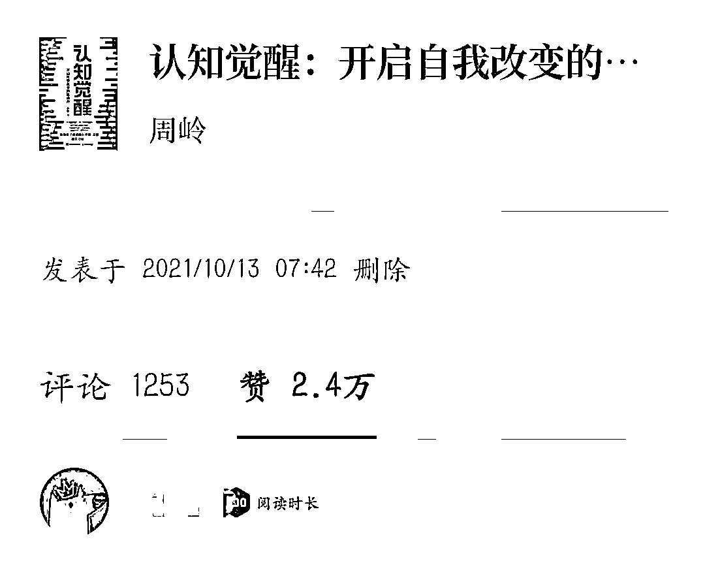

因为这篇书评，每天都会给我带来200+的点赞和评论，以及关注。

如果这篇评论的流量不错的话，还可以在这篇书评底下评论，再次引导加微信或者关注公众号。

比如：我有这本书的电子版，需要的小伙伴可以添加我的微信领取☞xxx

再比如：两年读完300本书，我们还有一个免费的读书交流群，想加入的小伙伴可以加个好友☞xxx

 

 

# **③ **在微信读书里关注自己的公众号

我每天都会把文章精华部分同步在自己的公众号评论里，这样关注我的书友都可以看见我的评论，同时就会关注的公众号。

就这一波操作下来，每天可以给我的公众号带来20个左右粉丝，同时每天也有10几个书友添加微信。

同时还得将公众号粉丝引流到个人微信，这一块生财圈友肯定比我更熟悉了。

**3.2 **今天简单分享 **3**个可以引流到个人微信的位置。

# **① **文章底部

可以留下一个钩子，比如加我微信，可以免费领取价值999的《个人成长52条干货笔记》，目前用这个资料两个月时间引流1000+小伙伴加微信。

# **② **关注后的自动回复

除了留文字，还可以直接上一张图片，所以我设计了一张带着我个人二维码的图片。

 

 

这一个方法也是参考了许多大佬公众号，然后做了一个优化和调整。

这个作用是，减少粉丝添加微信的难度，不用复制粘贴微信号，然后去添加，直接扫码就能完成这个动作。

# **③ **自定义菜单栏

可以在某个栏里加上自己的个人微信，也可以加上自己的产品，比如我们的知识星球和成长社群等等。

**3.3 **如何转化和变现？

通过做知识付费变现，用日更公众号和朋友圈建立用户信任，一年多时间靠私域成交1000付费用户。

三、私域运营和转化变现经验

**1. **关于朋友圈的重要性

 

 

这一块主要靠朋友圈，因为朋友圈真的太重要了，宇宙的尽头是铁岭，私域的尽头就是朋友圈，朋友圈就相当于是我们自己开的一家店。

以前我还没有意识到朋友圈的重要性，所以第一年没怎么发朋友圈，大部分靠公众号转化，而且还是一周发一次成长社群和知识星球的二维码。

一篇公众号推文，最多的一次才转化了6位加入社群，但有时候我发一条朋友圈就可以成交10几位，我记得最好的一次是，一天内有25位小伙伴从朋友圈加入。

再分享一个数据，2021年一整年才200多付费用户，但是从今年开始，每天发4条朋友圈，持续260天，截止目前今年已经发了1100条朋友圈。

也就是说这10个月时间靠朋友圈转化了600位老铁，是去年的两倍还多。

可见私域朋友圈的威力。

下面就详细分享关于发圈内容和发圈时间。

**2. **朋友圈应该发什么内容？

**2.1 **日常生活圈

个人品牌首先要是个人，所以一定要有自己的生活圈⭕，用户是跟人打交道的。

 

 

任何成交都建立在信任的基础上，如果你的朋友圈没有生活状态，你的微信好友会认为这仅仅是一个营销号，无法对你有更深入的了解，也就很难跟你发生金钱关系，起不到潜移默化宣传的效果。

优秀的成交者，都是在生活中将产品卖给他的用户。生活内容可以从学习、情感和休闲等角度，去分享正向的生活态度、价值观、专业知识等。

让你的微信好友在翻看你的朋友圈时感到有趣、有用、有能量，这是与好友建立信任感的重要一步。比如我会偶尔晒晒哇，偶尔晒晒出去旅游拍的美景，偶尔晒晒好吃的，好喝的。

**2.2 **专业价值圈⭕

就我个人而言，我经常会在朋友圈发读书和写作心得、学习方法和时间管理等内容，让用户了解自己的专业程度。

毕竟用户觉得我们有价值，才会留下来，成为我们的忠实粉丝。

同样，我们分享的专业知识也要和自己的定位相关，建议分享的内容要能为用户解决问题，真正有实用价值。

给用户直接可以吸收的知识点，比如自己付费内容也可以截取一部分分享出来。

**2.3 **用户反馈和成交截图

 

 

这个非常关键，其实我以前不好意思发成交截图，感觉有点营销味太浓，但是我看朋友圈很多人都会晒，所以后来我也试了试，发现效果很好。

如果你的朋友圈里都看不到有人下过单，又怎么能够让人相信你的产品真的卖出去过呢？

所以，一定要发用户转账的截图、用户好评的截图、用户加入社群之后的前后对比变化等等。(此处提醒：记得打码，或者征求本人同意再截图发朋友圈)。

这些截图就类似淘宝的买家秀一样，是站在用户的角度去证实产品的效果，用户说好才是真好。

人都是有从众心理的，适当地发一些用户的反馈，有利于激起潜在用户的消费欲望。

当然这些的内容不宜发布得过于频繁，造成刷屏的现象。在推出新品或进行某个活动的时候可以发多一点，让用户感受产品或活动的火爆程度，刺激用户的消费欲望。

这里可以用上浪潮式发售的方法，目前正在学习中。

**2.4 **产品圈

我们在朋友圈发布内容的终极目的还是为了带货，把产品卖出去。

产品内容的发布并不是简单地发产品图，更应该是产品的用户口碑、故事、用户在社群里面的改变，比如养成阅读、写作、复盘等习惯。

 

 

还可以适时地发布优惠活动、促销信息等，我一般都会借着各种节假日推出优惠活动。

**3. **朋友圈发布时间

朋友圈发布的时间也是有讲究的，规划好了朋友圈的内容之后，我们就需要规划内容发布的时间。

我们可以根据人的认知规律、生活习惯，例如每天玩手机的时间和规律，来规划我们每天的信息发布时间。

根据朋友圈用户活跃的数据分析，有四个时间段是大家浏览朋友圈的高频时间段。

**3.1 **第一个时间段是早上**7**点到**8**点。

这个时间段大部分人刚起床或者在上班的路上，是一个工作时间的空白点。很多用户早起第一件事就是去刷朋友圈，看看有没有新鲜的事情。

早晨更加适宜发布一些正能量话题，为好友打气，给他们一天的好心情，所以这个时间点我通常是发一张早起打卡图+一个金句，或者关于读书和学习的内容。

**3.2 **第二个时间段是**11**点到**13**点。

这个时间段是大多数人的午餐时间，我们可以选择在这个时间段发布一些与个人专业、知识、技能相关的内容。

 

 

也可以展示我们已有的成绩、案例和口碑，将我们的个人IP与用户需求、产品价值结合起来，形成真正有用、有价值的内容。

我基本上在中午时间段转发自己前一天的公众号文章，加上一句介绍语，相当于给公众号二次触达和曝光。

**3.3 **第三个时间段是**17**点到**19**点。

这个时间段大部分人都在摸鱼或者下班通勤路上。在这个时间段，我们可以以生活化内容为主，展示有趣的段子、诱人的美食，展示我们的休闲生活。

这个时候我一般晒晒娃，或者出去玩的照片。

**3.4 **第四个时间段是**21**点到**23**点。

这个时间段是用户使用手机的高频时间，这个时间段发布的内容，要主打福利相关，比如用户互动、优惠活动、促销等。这个时间段用户最容易产生冲动消费，然后睡前我一般会发一条今日复盘的朋友圈。

每天发朋友圈的频率多少比较合理？

我觉得找到最适合自己的推送频率就行，没必要强求。

 

 

逆熵增成长社群权益

一、微信群内一年至少进行52场分享

主要分享一套【成长体系课程】：

成长=阅读输入+深度思考+极致践行+写作输出+复盘反思+持续迭代

包括以下内容：

①如何高效阅读？

②如何精进写作？

③如何构建知识体系？

④如何保持自律成长？

⑤如何做好时间管理？

⑥如何运营公众号？

……

我自己基本上是雷打不动每天3-5条，就在介绍的那几个时间点发圈，现在已经养成习惯了，每天到点就发圈，其实我连闹铃都没有设置，就是产生条件反射了，到了什么时间点自然会想到该发什么圈了。

其实，有很多生财圈友的朋友圈都运营的很好，比如王子冯老师，梁靠谱老师等等。

**4. **成长社群的招募文案

文案也是成交非常关键的一环，我没有专门报班学过，基本上就是看书，然后看同行的朋友圈文案，以及他们的产品发布文案，不断模仿和改进。

但总得来说，离不开《影响力》这本书里面提到的几点社会心理学，制造稀缺、限时限量、权威、从众效应这些。

我的社群文案如下：

 

 

二、一年共读12本个人成长好书

三、免费体验一期共读营(价值66)

四、赠送我的书《逆熵增成长之路》

五、知识星球：50万字个人成长干货

六、可以链接800位优秀的小伙伴

价格：原价465/年，现在加入可优惠100，只需365/年，一天一块钱就可以享受以上所有权益，马上就要涨价咯。

只限前20个优惠名额，目前已经用完15位，仅剩最后5位，抓紧时间哦。

【社群使命愿景】以生命影响生命，点燃更多人的改变“引信”，让10000人爱上阅读和学习，通过自律和行动获得富足人生。

欢迎你的加入，和800+优秀小伙伴

一起学习，一起成长；

一起阅读，一起写作；

一起行动，一起自律；

一起提升认知和思维！

四、新人想做会有一些什么样的门槛

 

 

①需要持续内容输出能力

②需要引流加微信的能力

③需要一定文案转化能力

④需要持续输入学习能力

要真的能做到日拱一卒，功不唐捐，肯下日日不断之功，每天进步一点点，每天输出一点点！

因为通过做个人IP赚钱，本身就是一个赚慢钱的活，需要花比较长时间积累用户信任，最后才能成交。

如果问这个项目最大的门槛是什么，我觉得就是耐心！

需要持续输出内容，那么下面就分享一下我是如何做到日更的，以及我是如何生产内容的。

做内容的经验分享

首先，我在做自媒体之前没有一点写作基础，高考语文作文还不及格，800字作文对我来说就是一场噩梦，每次写作文就像挤牙膏一样，而且还挤不出来那种。

所以，像我这种没有基础的小白，依然可以做出内容，我总结了一个方法，那就是去借。

第一，向书本借。

 

 

我在最开始的写作，全部是通过阅读书籍，然后把书中的重点内容摘录出来，形成一篇读书笔记，做知识的搬运工，这是第一步。

第二步，升级为书评。

这就不仅仅是摘抄了，需要加入自己的思考，关联自己的经验，还得形成自己的逻辑结构，最后再加上自己的践行清单。

分享一个写书评的模板：

开头：今天看了xx书，分享一下我印象最深刻的3个点。

中间：分别写①②③三个感触点，把书本内容和自己的感悟写出来。

另外，再加一两条下一步的践行清单。

结尾：总结一下内容，抒发感情。

我的很多文章都是这么出来的。

第三，构建自己的知识体系。

 

 

这是我能够日更写作最为关键的一步，因为写作并不是从一张白纸从0开始写的，必须基于已有的写作素材。

因为我两年看完300本书，所以积累了大量的写作素材，我主要用手机备忘录进行知识管理，目前已经积累3300+条笔记，大约300万字。

大的分类主要有：

①阅读类

②写作类

③时间管理类

④学习类

⑤个人IP类

⑥思维类

我的公众号更文和成长社群也主要围绕这几个方面进行，所以前端的内容和后端的交付也是统一的定位。

做知识体系还有一个小妙招：

可以先列出该领域100个问题，再根据问题寻找解决的方法，拓展阅读和学习。

构建知识结构就像搭建乐高城市一样，有一个大的框架，再根据每一个小的知识点拓展相关的内容，把这个小的知识点汇集在一起就是一个大的知识结构。每个人掌握的知识不同，演化出来的结构也是不同的。

 

 

第四、学会混剪。

乔布斯说，创新就是把各种事物整合到一起。把旧的元素重新组装在一块也算是一种重新。

所以，做内容也可以套用这个思维，当然并不是完全抄袭别人的内容，还需要用自己的话重新表述，再加入自己的逻辑结构。

在写作这一块我们最应该原创什么呢？

猫叔说，每个人的经历都是独一无二的，必然也是原创的。

你最有可能也最应该原创的，是你自己的故事。尤其是你不断突破自我，取得优异成绩的故事。

这些故事，很能给你的个人品牌加分。

所以，你的经历，你的故事，你的践行，你的案例，你的经验都是最好的原创。

第五、提前规划好每周要输出的内容。

比如每周天更新周复盘文章，总结一周的收获；

 

 

比如每周两篇书评，推荐好书；

比如每周分享一篇关于阅读主题，一篇写作主题，一篇学习主题，一篇时间管理主题的文章。

以上就是我做内容的经验分享。

五、我和生财有术的缘分

我是在一年多之前通过明白老师的公众号才知道有生财有术这么一起谈钱不伤感情的圈子。

因为明白老师经常提到生财有术和其他一些圈友，包括每年的418会员日之前都会做一波宣传。

我就是今年418才通过明白老师加入的生财有术。

之前一直通过生财有术公众号和生财日历进行学习。

后来看了100位大佬的《2021赚钱建议》，以及买了一本《生财日历》，真是大开钱眼，非常哇塞，虽然每篇字数不多，但是非常精辟，对我帮助很大。

从中了解到花爷、曹大、涛哥、芷蓝、盗坤、狗哥等大佬，后来关注了他们的公众号，也进了一部分知识星球。

 

 

那段时间就一直浸泡在这些生财大佬的圈子里，每天学习一点，慢慢提升了一些搞钱方面的认知，后来才不断优化自己的付费社群。

六、后续如何优化？如何做大？

花爷前些天一篇文章中说，对普通人来说：

稳定月入3万是一个硬门槛。基本上，这是普通人单干自媒体的天花板了。

我现在的收入状态基本上就是稳定月入3万，持续9个月了，确实快到天花板了。

所以，也想借着这个机会向亦仁大大和各位生财大佬请教一个问题，基于我目前的情况，如何进行优化和做大做强，赚更多。

首先，我自己也思考过以下几点，可以帮忙参考一下是否可行，谢谢啦！

# **# ****1. **搭建产品矩阵

 

 

因为产品比较单一，就一个365的成长社群，所以可以新增一个低价的引流品、1000左右的训练营产品，再加一个万元级别的高价产品，比如私教、合伙人等项目。

# **# ****2. **拓展引流渠道

目前主要靠微信读书公域引流，渠道过于单一，可以将内容分发到多平台，比如开始做小红书和视频号，增加流量来源。

# **# ****3. **搭建一支团队

目前已经在做这一块了，因为想要完成两个优化，靠一个人单打独斗肯定完不成，所以需要团队协作。

# **# **不知道这些想法是否可行，希望大家帮忙参考参考，谢谢啦！

评论区：

 

 

文林 : 优秀

宋大刀 : 优秀～

🌲乐乐 : 叶老师，太了不起了！

感恩分享！！！

西昂 : 看到过这个书评！写的很好~

🔥逆熵增者💰 : 这么巧啊，谢谢鼓励

🔥逆熵增者💰 : 感谢乐乐的夸奖

也谢谢你的校稿呀/:heart

🔥逆熵增者💰 : 谢谢大刀鼓励

🔥逆熵增者💰 : 谢谢鼓励

# **# ****(**精华帖**)(221**赞**)**实操复盘：小红书资料号新

# 玩法，深度运营月入** 5W+**

作者：  九京

日期：2022-12-13

各位圈友好，我是九京，轻资产创业玩家，目前深耕7年私域变现。

我从2015年开始在微信变现，前后经历过多个玩法，关于个人的具体介绍就不讲了，感兴趣的朋友可以看我前几期的文章。

今天我所分享的小红书资料号玩法，可以说是未来十年的轻创业指南，无论你是副业新手、自由职业者，还是企业老板，接下来的内容都可以听得懂、学得会、用得上、赚得到。

想象一下：

**1. ** 假如你搭建了一个自动盈利系统，每天源源不断现金入账，是怎样一个场景？

 

 

**2. ** 假设你每天有超级多的精准流量，早上一睁眼，就是上百人主动添加微信，是怎样一个场景？

**3. ** 假如你的客户主动给你付钱，并且推荐自己的亲朋好友都来买单，又是怎样一个场景？

如果你在经验不足、资金不多、时间很少的情况下，做到了上面3点，是不是一个令人激动的事情？

OK。如果你愿意的话，那我接下来分享的小红书玩法落地指南，或许可以帮助你。

早在2021年9月，我们团队就开始实操小红书流量变现，当时就可以做到单账号单月纯利润10000+，关键每天也就花1-2小时操作。

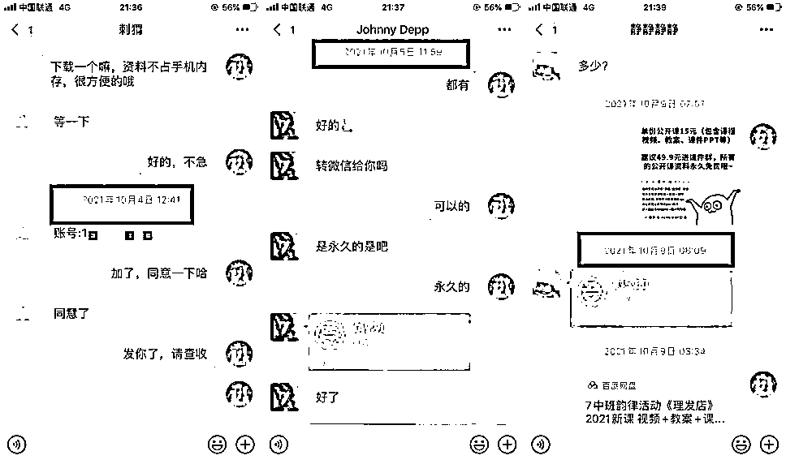

为了验证这套方法，是否对更多普通人有用，我在2022年5月开启了内测，有10个信任的老朋友，参与报名，其中8个人都轻松做到了单日盈利300以上……

 

 

很多人在抱怨现在大环境不好，但是我认为，现在正处在人类历史上最好的时代，这个时代崇尚创业，不问出身，给很多草根创业者，提供了无数的机会。

尤其是像生财有术这样的平台，涵盖了市场上绝大多数项目的一线玩法。并且领先市面上1~2年，可以说是普通人创业搞钱的藏经阁。

其实在去年，我们刚开始操作小红书玩法，当时对规则不了解，各种各样的疯狂测试，导致封了很多账号，但是我们没有放弃，直到今天单日可以做到很不错的收益，这中间离不开埋头苦干，日夜探索，好在我把它整理成一套系统的方法，可以帮你少走弯路。

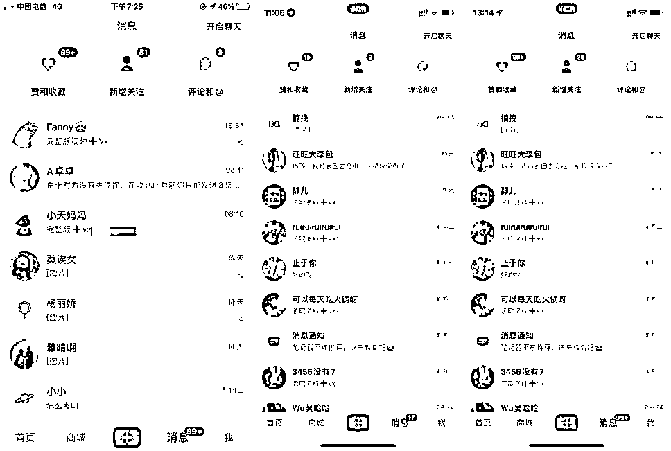

下面是我分享的大纲：

一、玩法定位

二、玩法准备

 

 

三、账号注册、养号与信息完善

四、内容获取

五、图文制作

六、上传分发

七、获客策略

八、转化成交

九、后端盈利模式

# 一、玩法定位

我们具体做的是什么玩法呢？

简单讲，就是通过在小红书发布内容，吸引潜在客户添加微信领取资料，单份资料依据行业不同19.9-199不等，转化率30%-40%，小红书的客户消费能力很强，另外后端其他变现也极为可观。

 

 

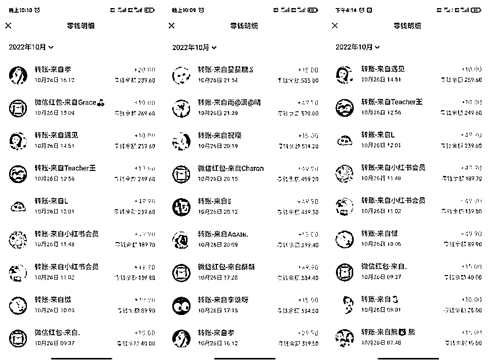

# **# ****1**、核心商业导图

 

 

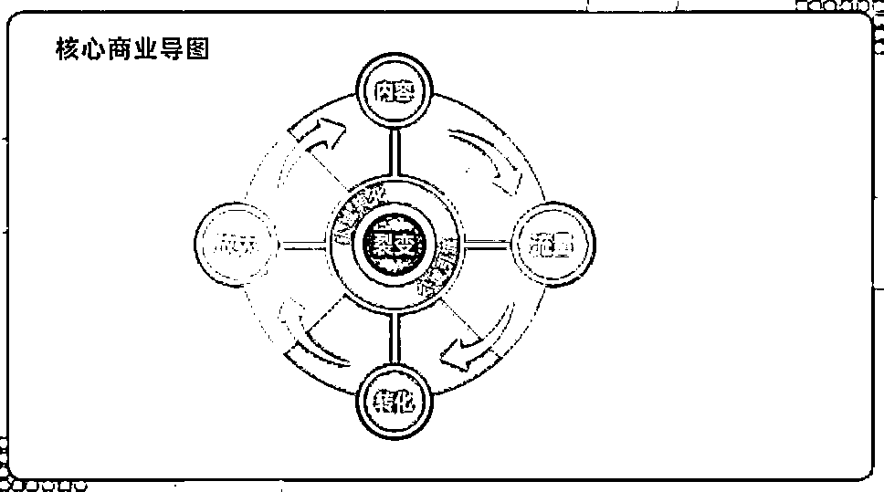

这7年创业，其实我们就做的一件事情，从公域平台引流获客，导入微信私域反复多次成交，上面这张图是我们7年创业的核心商业导图总结，也是今天这篇文章的指导思想。

以我们正在实操的幼师/小学领域玩法来看，通过小红书/抖音/快手/视频号/知乎/微博/b站/西瓜视频等平台，发布潜在客户感兴趣的内容，当对方产生兴趣之后，通过多种隐蔽且相对安全的引流手法导入微信，在微信端销售资料，并且通过后端盈利模式反复成交。

整个项目的5句核心心法：

**1. ** 定位即人群

**2. ** 人群即内容

**3. ** 内容即流量

**4. ** 流量即转化

**5. ** 转化即模式

 

 

什么样的定位，决定了你的潜在客户人群；潜在客户群决定了你输出什么样的内容；输出内容决定了你吸引来的人群层次；人群层次决定了转化效果；转化方法又决定了整套商业模式。

以上心法不止应用于小红书，可以说是整个内容商业模式的底层逻辑和核心。

好了，在达成基础逻辑共识后，接下来我将百分百拆解我们的核心玩法，毫无保留，直接照着我的流程1:1操作，保证你可以拿到结果。

# **# ****2**、为什么选择小红书？

互联网流量平台这么多，比如抖音、快手、视频号等等，为什么我们重点操作小红书？

主要是因为小红书有4大明显优势：

# ⑴女性流量聚集地，付费能力强。

美团的创始人王兴曾经表达过这样一个概念：“按照付费能力排名，女性，大于狗，大于男人。”

 

 

小红书70%的客户都是女性，所以决定了它的购买力非常强，经过实测，成交转化率能够达到40%。这个数据相比于其他同类型平台来讲非常高，相当于有100个人加你微信，40个人都会付费。

# ⑵不露脸出镜、不囤货拉人头

小红书账号的打造，不需要你做IP，也不需要出镜露脸，单纯只是制作素材，发内容，同时也不需要注重粉丝数量的积累，可以从第1个粉丝就开始变现。

与传统的社交电商、微商等项目相比，这个玩法并不需要你引导身边的亲戚朋友，也不需要拉人入伙，只需要自己闷声做就可以。

# ⑶难度小、成本低、上手快

相比于其他项目，小红书资料号玩法难度低很多，只需要一个手机起步，账号无异常的情况下，1~2周就会开始进账，不限制能力，也不限制学历。

其他项目动辄上万甚至几十万的前期投入，这个玩法堪称零成本，不需要做什么大的投资。

# ⑷后端变现空间可观，可放大

 

 

目前市面上的竞争对手，基本都是靠资料盈利，模式单一领域窄，而我接下来讲的玩法，拓展了全品类的选品方法，同时打磨出多种后端盈利模式，可以全方位帮助你提升整体营业额和收入。

另外，在你起步之后可以从账号、流程等多角度拆分放大，让你的后端利润拓展5~10倍以上。

# 二、玩法准备

这个项目的成本非常低，只需要准备手机、卡、微信号就可以。

# **# ****1**、手机

安卓或者苹果，新机或者二手都可以，根据自己的情况选择，我们会在手机上下载抖音、快手、小红书等平台，所以建议最低32G内存，否则会比较卡。

 

 

关于手机的具体购买渠道，可以去闲鱼或者当地市场，生财内部也有很多专门做手机的朋友。

# **# ****2**、准备手机卡

小红书平台，属于一机一卡一账号，所以每一个手机要对应一张手机卡，不要连WiFi（并不是连接WiFi一定会封号，而是一个违规可能会连累其他号）直接去营业厅办卡就可以，每个人可以办15张卡，移动，联通，电信各5张。

具体买什么资费套餐？这个不限制，可以同时办理主卡+副卡，单卡的月流量10G以上就可以，实操中流量不够再升级。

# **# ****3**、收款的微信

前期准备1个就够了，具体账号的设置和专业人设打造，会在后面部分详细讲。

# 三、账号相关

 

 

# **# ****1**、小红书注册

注册本身非常简单，直接去应用市场下载“小红书”app，手机号注册。

我单独说一下注册中的细节：

**1. ** 不要用**170**、**171**等虚拟号段注册

**2. ** 一机一号一**ip**，不要频繁切换

**3. ** 注册新账号，如果之前有老账号，老账号作为观察账号研究同行

**4. ** 尽量不要用虚假人设，比如是男生用女生性别

# **# ****2**、小红书养号

注册完账号后，不建议直接发作品，建议养号以增加权重。

小红书最新养号**sop**流程：

第一天：养号1次

第二天：养号1次

第三天：养号2次

第四天：养号2次

第五天：养号2次

第六天：养号2次，发布1个图文笔记

 

 

第七天：养号2次，发布2个图文笔记

第七天后：每天发布2条图文笔记

养号的定义：随意刷内容20-30分钟

养号的最高境界就是不养号。什么意思呢？在操作小红书的时候，不要把它作为营销任务一样完成，而是完全忘记养号这件事，正常用就是最好的养号。

有的老师说，养号期间必须刷相关领域内容，比如你做公考资料，就只刷公考，关于这一点我持不同意见。

平台体系中，内容生产者和内容消费者是两个维度，刷相关领域内容，只会用大数据给你推荐更多类似内容，对于后期账号流量爆发，没有一点用处。那我天天刷好看的小姐姐，是不是我发美女视频就一定上热门？

所以，关于养号，建议平常心看待，不要人云亦云，也不要把它的作用神化。

# **# ****3**、小红书信息完善

小红书的信息设置包括头像、名字、简介等，最好的方式就是参考同行，同行是最好的老师。

# ⑴头像

 

 

头像比较简单，直接百度搜索：卡通头像。

选择一个比较高清的换上就行。

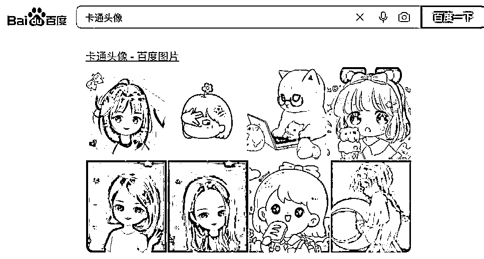

# ⑵名字

名字建议设置：昵称+领域。假设你做公考资料，名字就可以设置为：琳琳公考资源。假设你做ppt资源，名字可以叫娟姐ppt资源等等。

# ⑶简介

简介可以参考同行，设置3-4行就可以

内容中有一句万能语分享给你：“所有内容均有电子版/完整版”

 

 

这句话的目的，是通过暗示的手法，告诉客户：我的资料很多，你看的只是一部分，想要完整的来私信我。

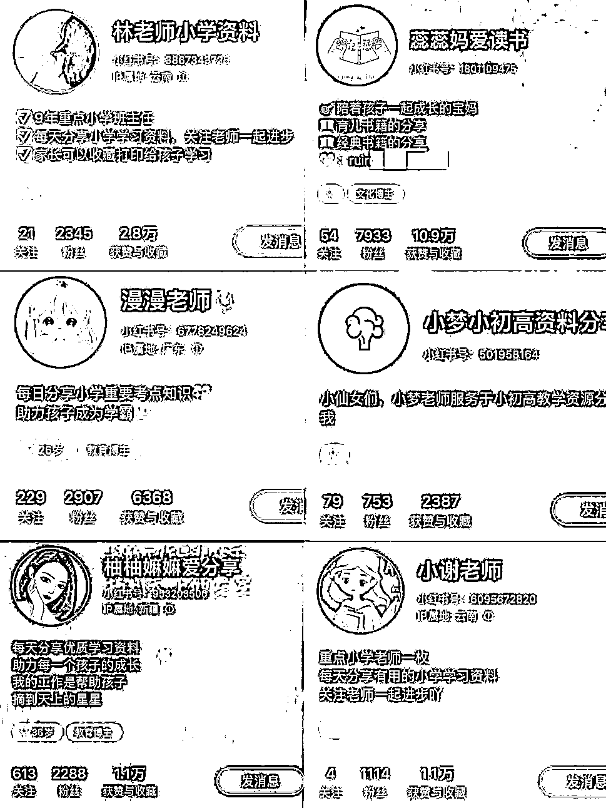

 

 

其他的生日、地区、职业随意填写，并不重要。

# **# ****4**、微信注册与养号

接下来说下微信养号的细节，因为在实操中会频繁用到微信收款，所以一个无风控的微信很关键。当然，持续用微信收款会收到风控，建议使用小鹅通、快团团、支付宝等多个渠道收。

具体微信注册方法就不说了，注册完成后完成实明认证和银行ka绑定，目前一个人可以实明5个微信。

细节：

**1. ** 手机号码不要选择：**170**、**171**这些虚拟号段，选择正常手机实卡号段**2. ** 手机卡一定要实明卡，选择大流量套餐，不建议使用**WiFi**，多用流量**3. ** 一机一卡一号

**4. ** 注册不要用**WiFi**，使用流量

# ⑴基本信息设置

头像设置有3种方式：真人出镜、淘宝手绘、卡通头像

名字：常见的名字是昵称+业务。比如：杨杨｜小学资料、桃子｜幼师资料等

签名有3种选择：展示核心价值、新客户引导、传递价值观

 

 

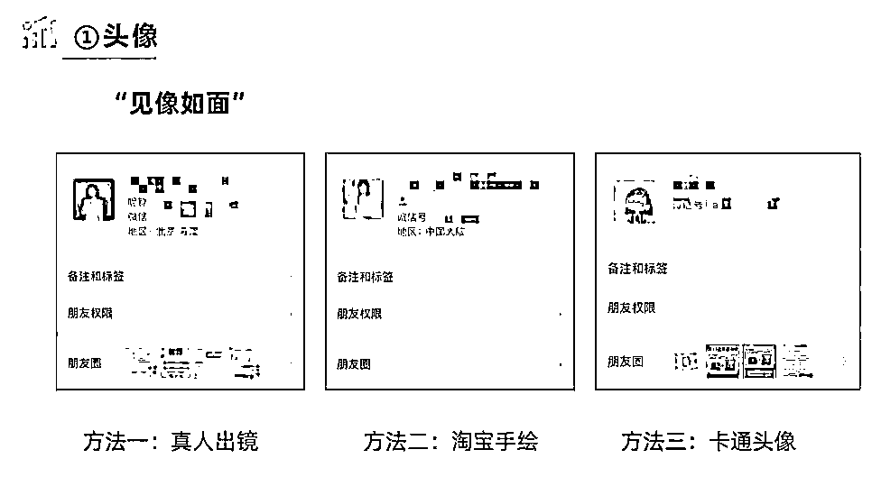 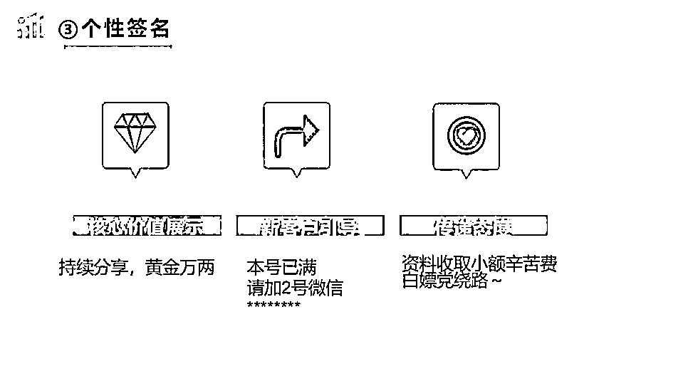

# ⑵养号细节

微信号是私域从业者最大的资产。

刚注册的微信权重比较低，如果频繁加人，很容易被限制，所以我们需要用1-2周来养号，具体养号方式，我整理了“7做5不做”

 

 

7做：

**1. ** 完整填写资料

**2. ** 跟老号**/**朋友**/**微信群聊天

**3. ** 平均三天**1**条原创朋友圈（生活、随笔、感想等等）

**4. ** 公众号文章**·**阅读、点赞、评论、转发

**5. ** 绑定银行卡，适当收发红包购物

**6. ** 开启定位，多带微信出去转转

**7. ** 多使用微信功能（视频号、搜一搜、看一看、直播、购物、游戏、小程序、手机充值、生活缴费、腾讯公益、医疗健康、火车票机票、滴滴出行、酒店）

5不做：

**1. ** 不能使用第三方软件

**2. ** 不做任何的营销操作

**3. ** 多设备不要来回切换

**4. ** 聊天不发违法违禁词

**5. ** 养号期不要大量加人

关于快速养号，给你分享一个独家小妙招，带着手机去菜市场买菜（不是超市），你买不同的菜就可以扫不同的二维码支付，同时避免了微信放在一个地方不动弹，权重上涨很快。

# 四、内容获取

 

 

小红书资料号前两层变现模式就是卖资料、卖会员。既然要卖，你肯定要准备好货源和渠道，那具体从哪里获取资源呢？九京提供两种方法：

# **# ****1**、找同行购买

在小红书平台找到同行之后，最简单的方式就是直接买同行的资料，然后拿过来复制，价格一般在几十块钱不等，我们做的小学和幼师资源没有版权，如果你做的是其他领域，要注意这个问题。

# **# ****2**、淘宝拼多多购买

除了找同行购买之后，还可以直接在淘宝和拼多多搜索，买过来放在自己的百度网盘就可以了，如果资料太多放不下可以考虑开超级会员

 

 

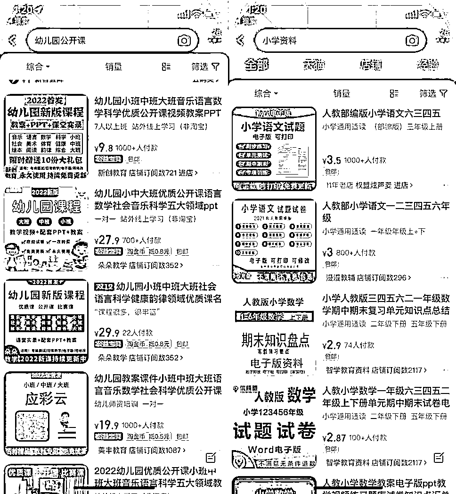

# 五、图文制作

 

 

小红书的内容有两种形式，视频和图文，因为视频容易查重，制作较为繁琐且对新手不友好，所以我们重点做的是图文。具体制作的方法也比较多，比如：ppt、ps、美图秀秀、黄油相机、创客贴等等。关于软件的具体操作就不写了，这都比较基础。

# **# ****1**、引流类

引流类内容是最核心的部分，因为我们运营小红书的目的就是为了引流到微信，对不对？所以采用发一半留一半的方式，暗示手法告诉客户：这只是一部分。想要完整版，加我微信。注意是暗示，不是明示。

看一下常见的形式：

 

 

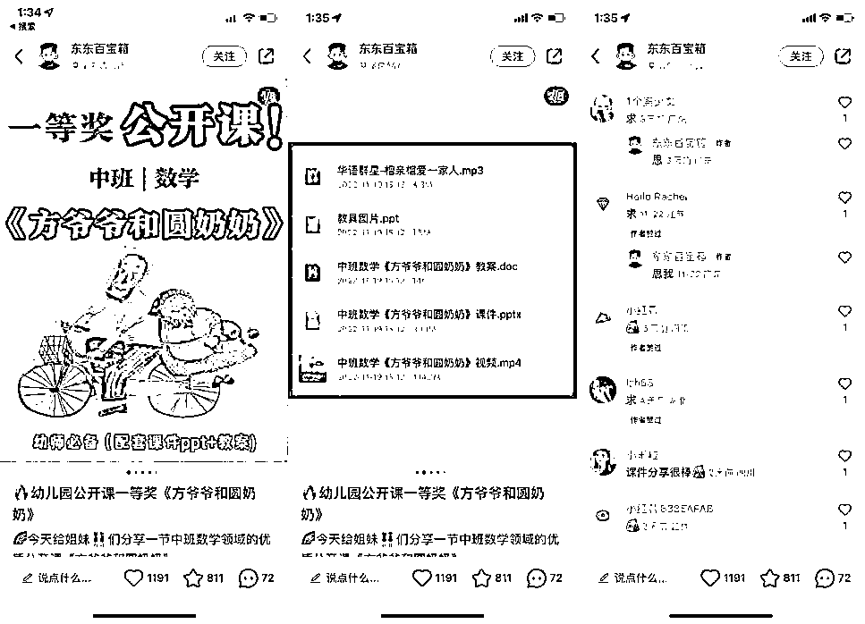 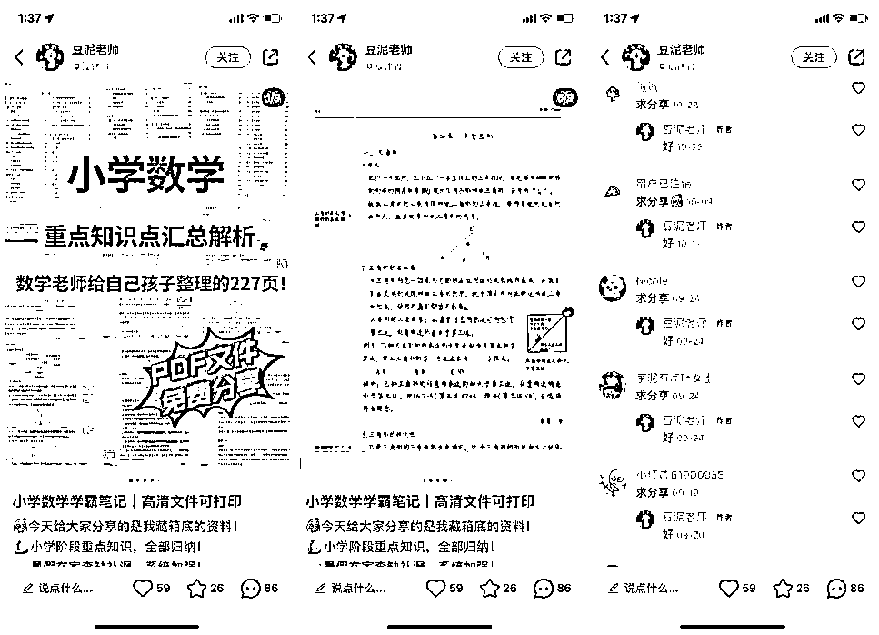

 

 

注意看截图中，露出百度网盘截图、pdf完整版文件，引导客户私信评论获取，这是小红书资料号引流最常见的形式。

# **# ****2**、干货类

干货类内容，其实对于我们引流没有太大帮助，因为用户只会点赞收藏，并不会来私信你，那为什么还要发呢？核心原因是每个人都有收藏的底层心理需求，看到好东西就想要，尽管拿回去也不看。

通过发布干货类内容，可以在短时间增加账号的“获赞和收藏”，提高账号的权威感和权重。

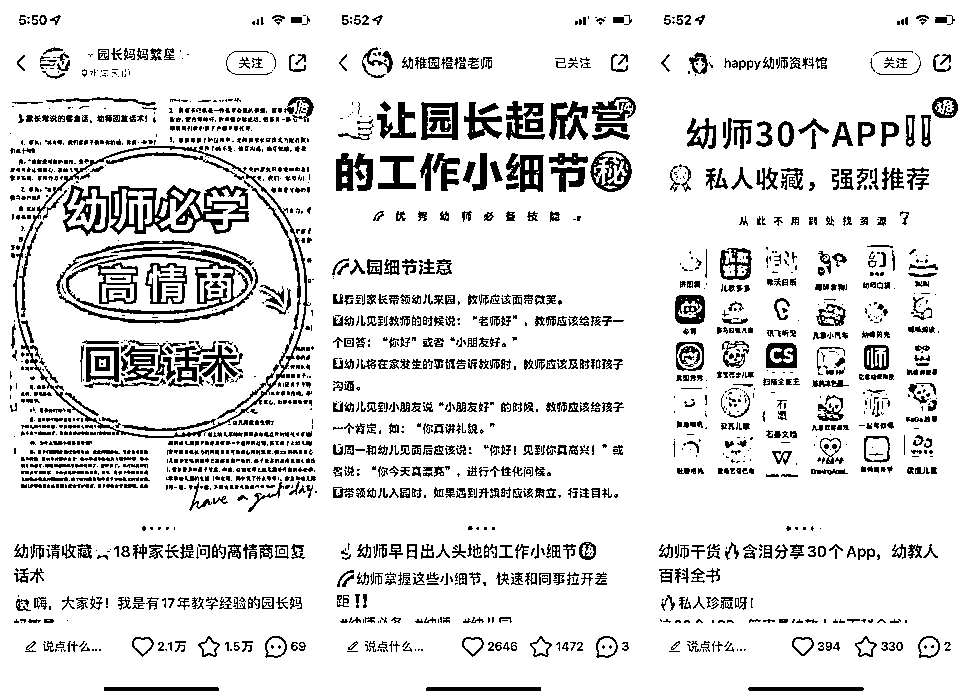

 

 

# 六、上传分发

# **# **** **

# **# ****1**、发布时间

具体的发布时间，可以定在上午12:00~1:00，下午5:00~7:00，晚上8:00~10:00，这都是潜在客户刷小红书的时间，按照正确的时间发布，内容上热门的概率会提高。

# **# ****2**、发布数量

那每个账号每天发几条呢？我个人建议是两条，最多不超3条，如果超过3条有可能会被判断为营销号，影响整体的权重，如果发布一条又会浪费很多流量。

 

 

幼儿园公开课｜小班语言《营救汪汪队》

‼ 码住  小班音乐《营救汪汪队》

（新手）幼师必备｜幼儿园优质公开课《营救汪汪队》

火速收藏｜园长都很赞的一节公开课《营救汪汪队》

我打赌！这节小班课绝对不会冷场《营救汪汪队》

# **# ****3**、发布细节

下面看一下发布过程中的具体细节。

首先看标题，我找了几个幼师领域的案例，你可以作为参考：

# ⑴标题

# ⑵正文

正文一般包括：活动目标、活动准备、活动过程、活动重点和难点。具体的内容在幼师资料里面教案中都有，直接复制粘贴拿过来就好

 

 

#幼儿园公开课

#幼儿园优质公开课

#幼儿园优质课

#幼儿园教案

#幼儿园大班课件

#幼儿园大班优质课

#幼儿园大班公开课

#幼儿园中班公开课

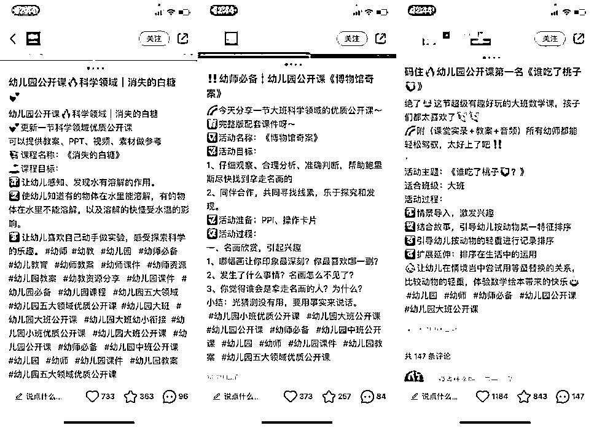

# ⑶标签

我整理了一些常用标签，同样直接送给你：

 

 

#幼儿园小班公开课

#幼儿园小班优质课

#幼儿园小班优质公开课

其实这些内容都很简单，最好的方法就是对标同行，根据你所做的领域，寻找适合的同行对标。

# 七、获客策略

# **# ****1**、公域流量和私域流量

公域流量是指通过入驻各大平台获取的用户关注，比如：抖音、知乎、小红书、豆瓣、微博、贴吧、b站等等，而私域流量是指沉淀在个人微信渠道的、可以实现一对一精准运营的流量。

 

 

那公域和私域有什么区别呢？

核心区别是：公域流量属于平台；私域流量属于自己。小红书大v的流量本质上属于平台，可以给你曝光，也可以不给你曝光，所以我们整套商业模式的目的只有一个：把所有公域平台的流量导入微信私域。

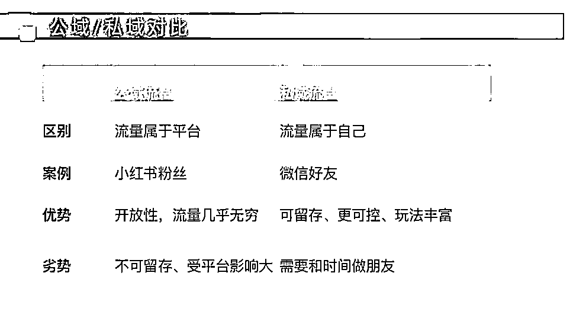

# **# ****2**、如何选择流量平台？

互联网公域流量平台很多，如何判断重点操作哪个平台呢？经过长期实战，我总结了四个核心关键点：流量精准度、对手竞争度、内容生产难度、平台容忍度。

流量精准度，是指平台上有没有匹配的潜在客户。比如你会去天涯发布小学资料干货引流家长粉吗？你会去虎扑发布幼儿园公开课引流幼师群体吗？可能上面也有潜在客户，但是付出同样的成本，小红书的回报一定大于天涯和虎扑。钓鱼的核心法则，就是去有鱼的地方钓鱼。

 

 

对手竞争度，是指平台上有没有现存的竞争对手。如果一个平台上没有竞争对手，那我觉得这个平台不值得入手，如果你非要做，要么成为先驱，要么成为先烈。多段创业过程中，我认为同行是最好的伙伴，有竞争的地方才会有市场。

内容生产难度。内容引流的本质是通过发布内容获取精准客户，考核的是内容生产的效率和成本，如果无法用低成本、高效率的方式完成内容生产，那么引流难度会非常大。

比如抖音知识IP，为什么成才率非常低，核心原因就是内容成本问题。

平台容忍度。每个平台成立初期，都需要大量内容生产者贡献内容，建设社区，所以都会有一定的规则弱化和引流容忍度。但是随着同质内容的饱和，平台对于引流的管控也会越来越严格。

# **# ****3**、**10**种引流方法

正常情况下，我们发完内容之后，会有人在评论区发送“求分享”之类的，而我们的目标是把他们引流到微信上，那具体要怎么操作呢？

下面分享10种引流方法，帮你顺利通过小红书平台获取精准客户。

讲策略之前，首先明确一点：没有**100%**安全的引流方法。

从平台的角度出发，小红书也不希望自己的流量被导微信，所以任何形式的导流/引流行为，都不被平台鼓励。

 

 

对于账号的安全性，保持平常心态就好。把账号直接作为消耗品，没了就换，没什么大不了，我们当年做闲鱼流量，封了几百上千个账号，封了就总结经验，最后高峰期一天能做上万粉。

# **①**小红书号引流

小红书号引流是指直接把小红书号设置为微信号，当潜在客户私信你的时候，你就可以说：茄我小红书号。

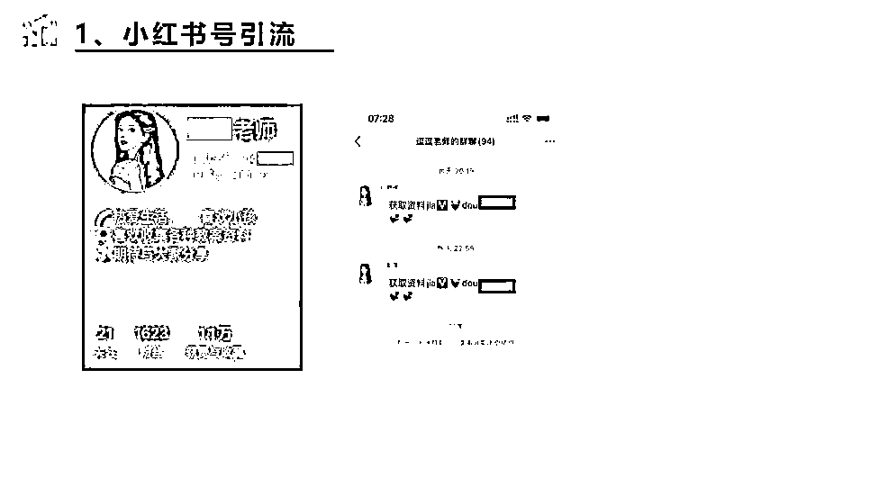

# **②**邮箱号引流

 

 

这种方式有两种操作方法，第一种是在邮箱中设置自动回复，当有人给你发邮件，直接自动回复发话术引导加微信，不过路径比较长；第二种方法是留qq，然后把qq绑定微信。

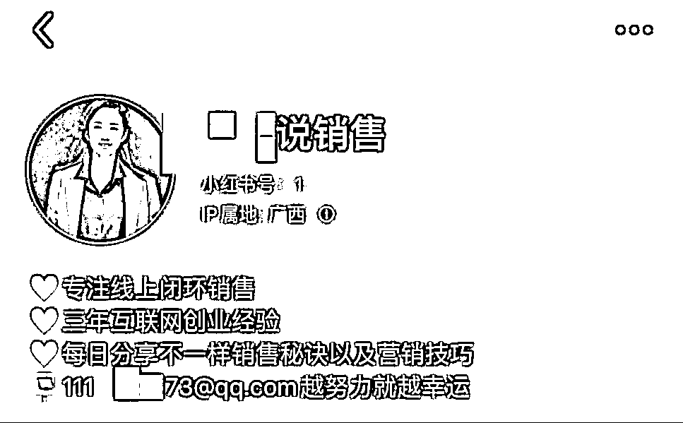

# **③**全网同名引流

这种方法适合于后期做大之后使用，比如知乎、抖音、微博等多渠道矩阵化操作。潜在客户可以去其他平台找你

# **④**简介艾特小号引流

 

 

首先用小号直接发引流信息，直接大号在简介中艾特小号，引导潜在客户关注小号，进而添加微信。

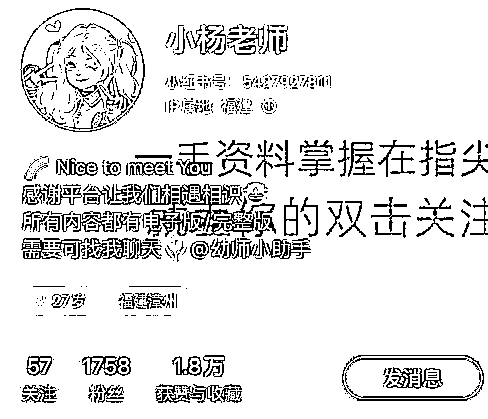

# **⑤**瞬间引流

瞬间引流是把微信号拆分，然后通过打卡的形式引导客户添加微信。当然，不建议新账号这样操作，容易被平台风控。

 

 

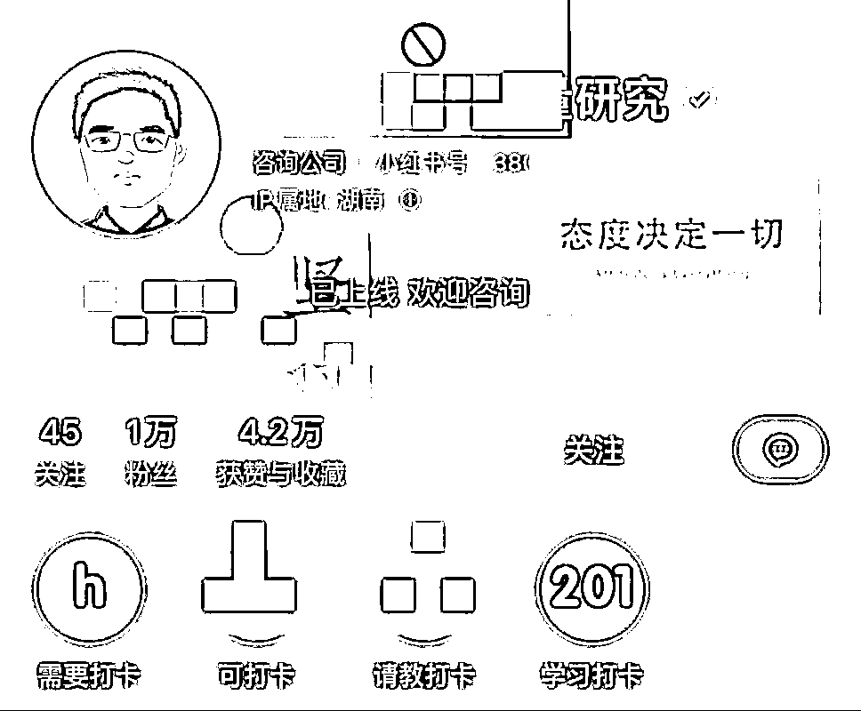

# **⑥**评论区小号互动

评论区小号互动，是指当有潜在客户在评论区回复“想要”、“求分享”这样字眼时，通过小号引导他私信或者添加微信。这种方法有比较大的封号风险，需要多准备小号。

 

 

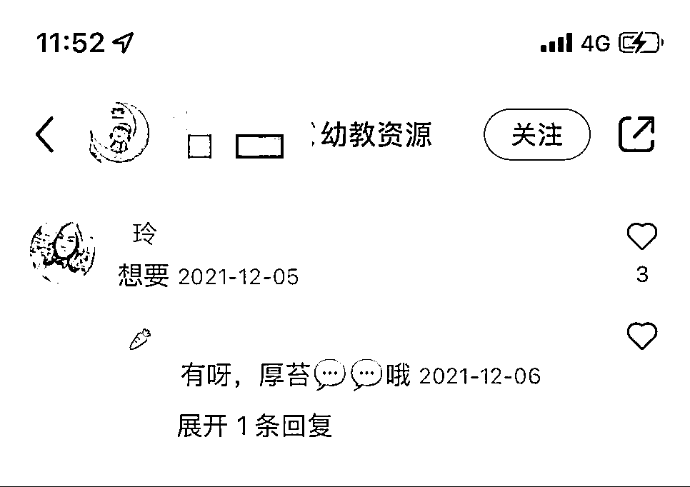

# **⑦**钩子引流

钩子引流法，是指通过发布秘诀、绝招、干货、文档、集合等形式的内容，暗示的手法告诉客户我有“好东西”，想要这个好东西，你来私信我。

 

 

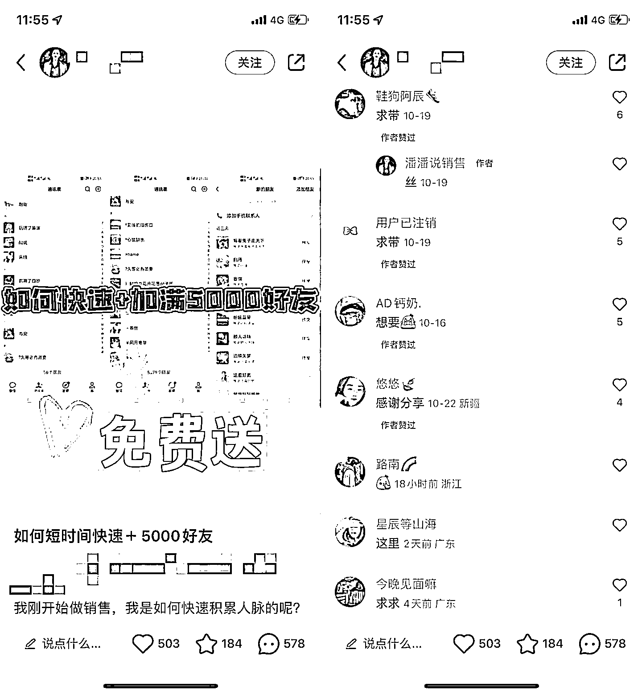

# **⑧**私信引流

私信引流是指引导客户后台私信，当客户私信时，发送引流话术。比如：领取完整版，+\/ 123456

这种方法需要规避敏感词，采用谐音的方式，常见的敏感词：加、私信、私聊、微信、公众号等。

 

 

# **⑨**群聊引流

群聊引流相对比较宽松，直接留微信的容忍度大。具体如何建群呢？进入小红书后，点击选择“消息”、然后点击“开启聊天”、“创建群聊”就可以了。

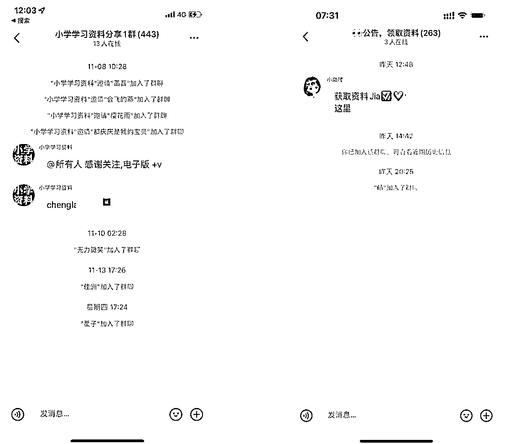 

 

 

 

 

# **⑩**收藏夹引流

收藏夹引流，是指大号通过收藏小号发布的广告帖，达到引流的目的。当有客户私信时，你可以说“看我收藏”

 

 

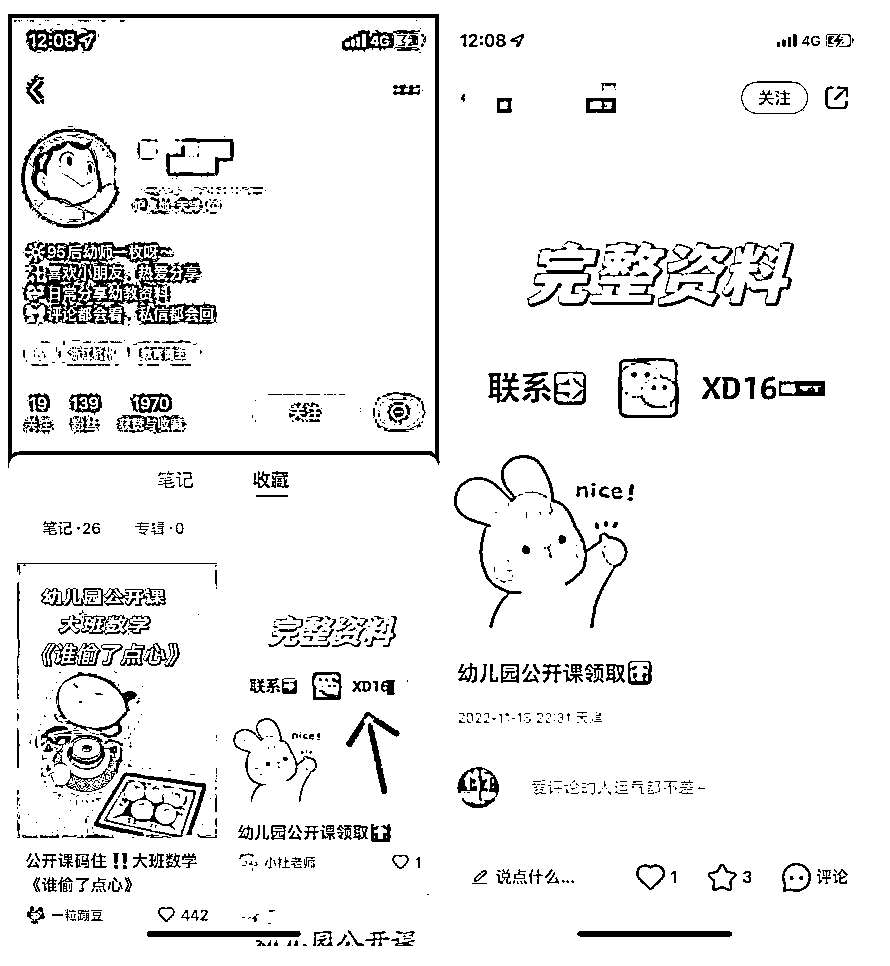

以上10种方法，可以单独使用，也可以组合灵活使用，对于新手比较推荐的方法是：

1、4、7、8、9、10

 

 

# 八、转化成交

获取到精准客户，下一步就是通过私域成交转化，真正把流量变成钱。

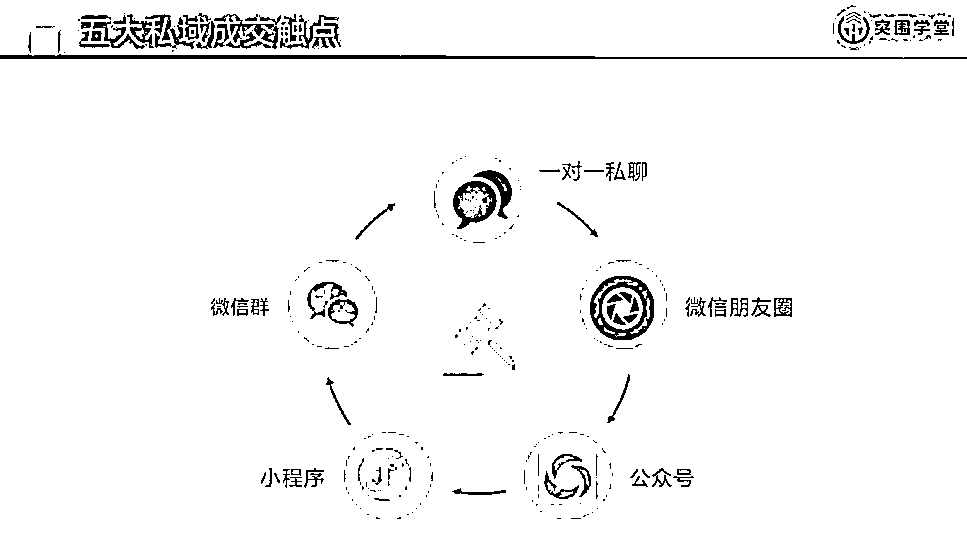

私域成交的场景就是微信，所以微信的每一个触点，都是成交机会。包括：一对一私聊、微信朋友圈、公众号、视频号、直播、微信群等，因为这个玩法太过于简单，也根本用不了这么大的系统，有点高射炮打蚊子。

所以我们只讲一对一私聊极限成交。

 

 

# **# ****1**、成交**3**问

7年互联网创业过程中，我们操盘过很多玩法，一直实战在私域一线，积累了大量的销售转化经验，其实多数犹豫不决的客户，究其根本都是因为三个原因：

为什么必须买？

为什么跟你买？

为什么现在买？

潜在客户虽然没有直接问这几个问题，但是实际上，阻碍他们下单的都是这三个原因。

如果你没解决这三个问题，他们就很难下单

# ⑴为什么必须买？

先思考第一个问题：客户为什么必须买你的产品？

你提供的资料或者服务，对她来说，有什么具体的作用？能把她解决什么实际的问题？

因为赚钱的本质是帮助客户解决问题，解决的问题越多越大，赚到的钱也就越多。对吧？

 

 

不过，既然她已经从小红书加到你的微信，就已经证明了她有这个需求，所以不要浪费一个精准流量。

# ⑵为什么跟你买？

市面上做的资料号的同行也有不少，那这个客户为什么非要找你买？而不是找其他人买呢？在你这里买，有什么打动她的点吗？

是你的价格更优惠？服务更到位？还是效果更好？想明白这个问题，你才能抓住客户的心。

# ⑶为什么现在买？

解决前两个问题后，就迎来了最后一个问题：为什么现在买？

想解决这个问题，就要思考：客户现在买和以后买，有什么不同？现在买会获得什么？

以后买会损失什么？

心理学领域，有一个专业的名词“损失厌恶”。损失厌恶是指人们面对同样数量的收益和损失时，失去的损失要大于得到的快乐。

 

 

想象一下，你捡到1000块钱更快乐，还是损失1000更痛苦？

从这个角度来看，在产品宣传上，多突出「现在不买的痛苦」，会比宣传「现在买的收获」更有效。

其实，以上这三个问题，可以总结为：产品价值、渠道价值、机会价值。

# **# ****2**、五位一体成交飞轮

私域成交有逻辑、有章法，并不是看天吃饭、也不是随缘成交。

我把整套成交逻辑整理成了五位一体成交飞轮：

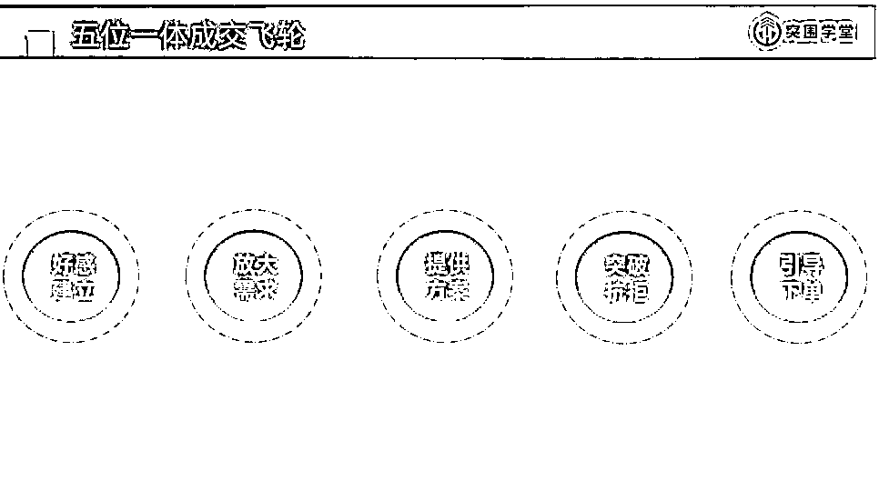

 

 

# **①**破冰**——**好感建立

加客户第一件事，首先是破冰，而不是上来就报价。就像两个人初次见面，是不是应该先有个简单的了解，对方怎么称呼？大概的基本情况等等。把客户当朋友就是成交的核心。

参考话术：

你好，我是多多，专注**资料收集整理。很高兴认识你，请问您需要哪个？

# **②**诊断**——**放大需求

了解完基础信息后，下一步就是挖掘客户的需求并且进行放大，因为赚钱的本质就是帮助客户解决需求，如果连客户的需求都不明确，怎么成交呢？

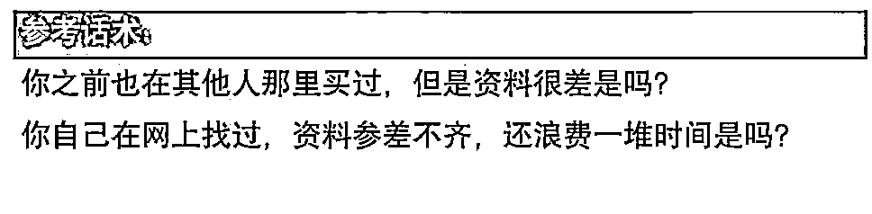

# **③**方案**——**成交铺垫

 

 

我常说一句话：价值不到，价格不报。

了解完客户的需求，下一步就是提供解决方案，并且塑造方案的好处，告诉客户能帮他解决什么具体的问题。

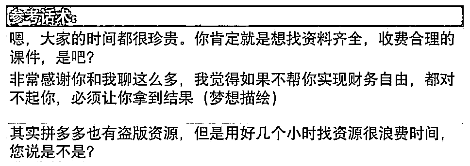

# **④**信任**——**突破抗拒

提供完解决方案后，就是最重要的一点，很多人容易在这里掉以轻心，导致辛苦获取的客户跑单。客户听完你的解决方案后，其实并不会马上下单，因为他心中还有抗拒，在这部分的聊天中，最重要的就是解除客户的防御心理。

那具体如何解除呢？方案很多，但是最好的方法就是晒之前付款的客户的截图以及对方的反馈和感谢。

# **⑤**成交**——**引导下单

 

 

最后一部分是临门一脚，有些人也会卡在这里成交不了，明明客户的问题都帮他解决了，为什么她还不付款呢？我一般会用3个方法搞定：

利用限时福利或者赠品

提供零风险承诺

清晰明确的下单指令

具体话术参考图片

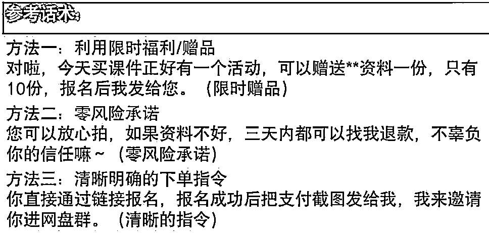

 

 

# 九、如何把玩法放大**10-100**倍？

市面上的大多数从业者，到上面其实就已经结束了，说实话，这样操作卖资料/教程/素材也能赚一些钱，但是是辛苦钱，而且赚的不是太多，一天也就五六百块钱，最多1000-2000，很难突破天花板……

那具体如何把这个玩法放大10-100倍呢？九京提供以下思路供各位圈友参考：

# **# ****1**、搭建后端收入模式

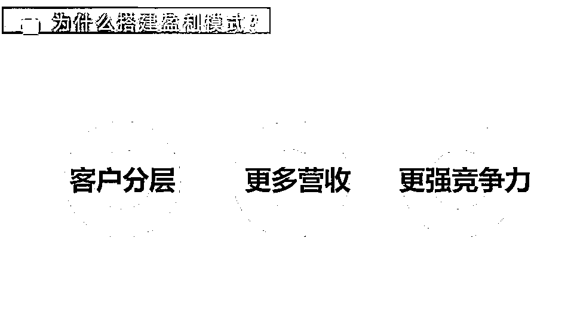

 

 

为什么要搭建后端盈利模式呢？

同样的产品或者服务，不同的客户支付意愿/支付能力不同，有的人愿意花9.9、有的人愿意花99、有的人愿意花990、有的人愿意花9900、有的人愿意花99000……当然，还有人想白嫖。

通过搭建后端模式，就可以按照客户的不同需求及支付能力进行分成，最大化提高营业额。

下面我讲解一下基本的逻辑：

首先看“信任-价格模型”，横坐标代表客户对我们的信任，从左往后逐渐增强；纵坐标代表产品的单价，从下往网逐渐提高。

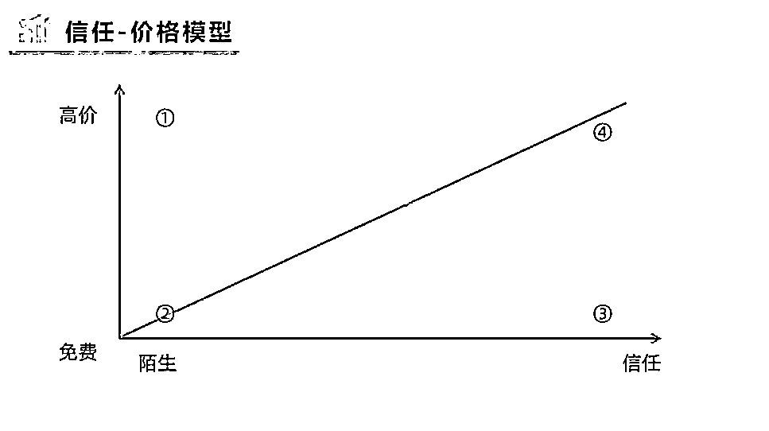

然后分析4种情况：

 

 

情况1：弱信任高价格。比如客户刚加你微信，你告诉她“我们又一款售价10万的私董会产品挺适合你”，你觉得客户会加入吗？

情况2：弱信任低价格。这种情况符合基本的逻辑。

情况3：强信任低价格。客户已经成为了你的死忠粉，你卖什么她都买，而且推荐亲朋好友都来买，但是你的最高客单价只有9.9……是不是有种暴殄天物的感觉？

情况4：强信任高价格。这种情况是所有私域运营的最高追求，高价值客户、超优质产品/服务、超预期交付。

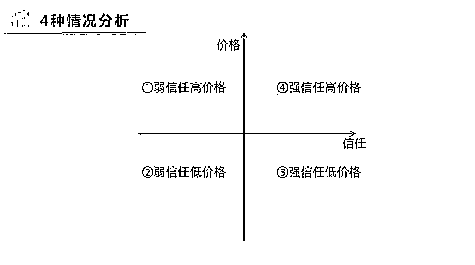

了解了以上逻辑后，就可以搭建完善的产品体系模型：

1、针对刚加入的客户，赠送免费的资料或者售卖低价资料，先建立基本的信任。

2、建立第一次“金钱关系”后，转化中低客单价产品，比如单价70-200的资料会员，进一步建立信任

3、建立中度信任后，销售实物u盘、招代理、卖3000-8000元正价课等等 

 

4、建立铁杆信任后，考虑分公司、加盟商、合伙人模式，实现深度利益绑定

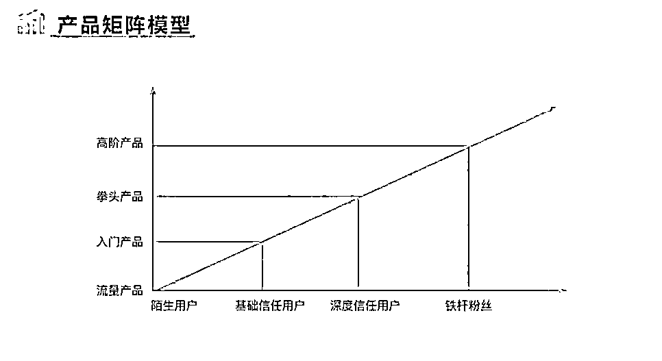 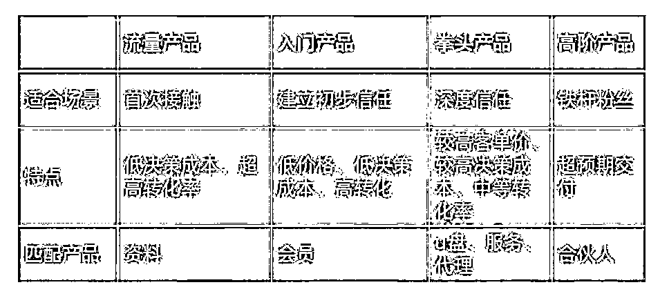

私域万能掘金公式：

销售额**=**流量*****客单价*****转化率

在总进粉数量不变的情况下，要想每个月扩大10倍收入，就必须在客单价和转化率上下功夫，而转化率其实整个行业比较平均，没有太大提升空间，所以只能在拓展不同客单价产品上面下功夫。

 

 

# **# ****2**、挖掘更多蓝海产品

我们目前主要操作的有幼师资料、小学教辅、中医资料等领域，看完今天的复盘之后，大家不必要都去做这两个领域，而是可以拓展自己的思维，挖掘更多蓝海产品。

那具体如何拓展更多选品呢？我想先给你讲透玩法的逻辑，只有深刻理解玩法的底层逻辑，才能做到举一反三，拓展更多的选品，看到更到更多的可能性。

在生活中很多人每天都在想着赚大钱，但是费了很多心思，依旧没有如愿，为什么呢？

因为他们都不理解一句话：钱不是赚来的，而是满足市场需求之后，市场给你的馈赠。

假如你在公司上班，那你的价值就来自于帮助老板解决问题，解决多大的问题，拿到多少的钱。

假如你是自己创业，那你的价值就在于帮助客户解决问题，帮客户解决的问题越多越大，能够获得的市场回馈也就越多。

赚钱的核心是解决客户的需求，那如何去挖掘客户需求呢？

这里就需要提到马斯洛需求层次理论，这套经典理论从下到上，列举了人的5大需求层次。生理需求，安全需求，归属需求，尊重需求，自我实现需求。

 

 

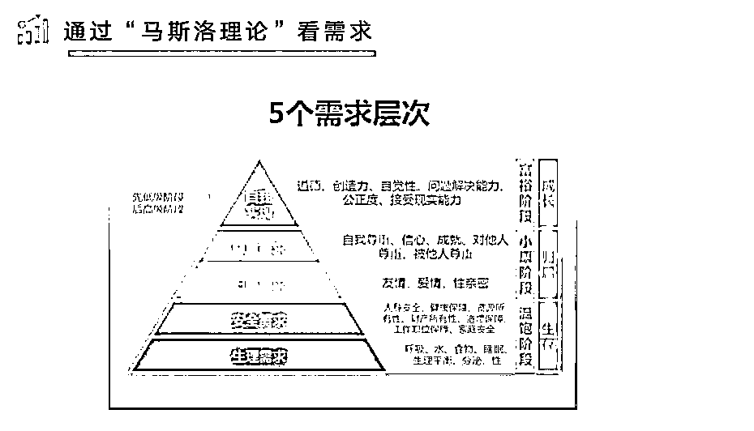

无论社会发展到什么样的程度，市场中总会存在未被满足的需求，而一个合格的商人，就是嗅到这些需求，然后找到对应的解决方案，在帮助客户解决问题的同时赚到钱。

赚钱=通过……方案，帮助……客户，解决……问题。

比如：

科学育儿课程，满足了新手家长育儿方面的生理需求；

保险理财，满足了中产阶级财产增值保值的安全需求；

情感挽回，满足了饮食男女对情感维护的归属需求；

考试考证培训，满足了自我提升成长的需求

360行都存在未被满足的需求，所以本质上都可以通过小红书重新做一遍。关于虚拟资料选品，我们实操了7年，总结了不少经验，如果大家确实感兴趣，可以给本篇复盘点个赞，过百赞的话，我会另开一篇文章，专门分享虚拟方向选品全攻略。

 

 

写在最后：

我个人认为这个玩法的底层逻辑是通用的，**“**公域引流，私域变现**”**，能把这个玩法玩明白，其实可以延伸到各行各业，所以它是一个极度长期的玩法，至少未来10年不会过时，丝毫不夸张。

OK，关于这个玩法我就分享到这里，其实像现在红利期依旧非常大，所以如果你看到这篇文章对这个玩法感兴趣，可以按照我的完整复盘直接1:1去操作就可以，实操过程中遇到问题，欢迎留言讨论交流。

其他分享：

全网精准引流300w的底层逻辑和方法论（精华）

《我如何在闲鱼一天引流1.5w精准母婴粉》（精华）

从农村穷学生，到年入150万

评论区：

SKY : 图片没加载出来

九京 : 正在修改中……编辑器bug了

入微 : 图破了！！！

九京 : 抱歉久等了，已经搞定

拱卒 : 干[强]

九京 : [抱拳]

小沫 : 👍

美德布耀布耀德 : 赞

 

 

# **# ****(**精华帖**)(210**赞**)**作为职场宝妈兼团长，我是

# 如何从卖包浆豆腐到营业额超**100w**的？

作者：  小野

日期：2023-07-04

大家好，我是小野，一个职场宝妈，在国内Top5药企做医药互联网营销，同时也在不停折腾自己的副业。

可以一边做好主业、一边陪伴育儿、一边坚持副业的六边形妈妈，大概就是我本人了。

事业和孩子陪伴得以兼顾，我觉得这是这个时代的礼物，是互联网和生财有术给了妈妈们多一种人生选择。

目前我运营了2个快团团账号，一个美食团、一个母婴团，团购GMV累计近150w；另外也在做大健康方向的产品服务。之前分享过一次我的2年副业经历复盘《新手宝妈，职场副业两不误，跑通小红书引流和私域卖货，累计利润 30 万+的经验复盘》。

今天我想分享下我卖包浆豆腐的故事。因为我做团购，就是从小小的包浆豆腐开始的。

这个经历对我来说意义重大，不仅是我做团购的起点；复盘时，我自己也从中再次受益，所以希望也对圈友们也能有所启发。如果你也想要启动做团购、或者做团购时遇到了一些瓶颈，可以参考实践。

一、做美食** IP**，是我一直以来的梦想

 

 

我是云南昆明人，从出来上大学到现在已经十几年。作为家乡宝，我一直有个梦想，就是想把云南美食大声安利给身边的所有人。于是，我从 2015 年就开始写「小野食堂」公众号，写关于各种云南美食和好吃的店，只是后来工作太忙断更了。

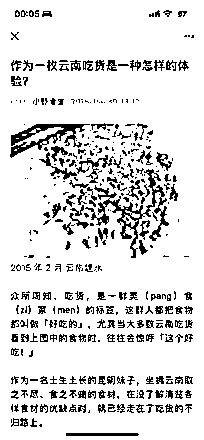

2021 年初，在我生完孩子的 2 个月后，觉得带孩子这件事很轻松了，于是盖洛普优势「成就」第一的我闲不住，开始想要做副业卖货。我第一想法就是，卖云南美食。

闺蜜帮我找到了云南建水的包浆豆腐货源，我认为这个产品很有云南特色，虽然当时很多人对它还没什么心智和了解，但是它足够好吃、足够猎奇，我抱着试试看的心态，开始卖货了。

我记得特别清楚，1 月 19 日那天，我发了一条朋友圈，拉了个「小野食堂云南美食」群，还厚着脸皮把亲戚朋友全私聊拉进群里，有 100 多人，我自己把素材凑了凑，草率地编辑了一个团文，然后就正式开团包浆豆腐了。

 

 

回头看，刚开始我做对了一件事，就是给自己做了个很垂直的定位：一个云南美食团长。

一方面，我之前就断断续续有在写美食公众号；另一方面，基于我是云南人的地域背景，我也一直在朋友圈表达自己对美食的热爱。所以，朋友圈对我已经有美食的定位和印象了，那么我以这个定位开始卖货，是很丝滑的。

刚开始做团购，定位很重要。我个人建议是，做快团团私域的第一步，不用着急去推很多品，而是先想好自己的定位。

二、如果你只有一个团品，如何把它卖爆？

**2.1 **讲好一个团品的故事** **

开团以后，就要去推广了。我发的第一个包浆豆腐朋友圈广告，是一篇小作文，跟闺蜜合作写的。追了当时过年期间比较火的电影《送你一朵小红花》的热点。

 

 

这篇小作文收获了第一批好评。

 

 

也收获了第一个团的 63 个订单。

 

 

好好讲一个团品的故事，比单纯做硬广，更能吸引人。

那么，到底怎么样去讲一个团品的故事？

分享我自己喜欢用的几种方式：

**1**、结合当下热点讲。比如我最开始推包浆豆腐时，就是抓住当下电影热点，通过影评引出产品；

**2**、结合产品优势卖点讲。产品优势和卖点是要反复去告诉用户的，不要指望发过一次用户就会都知道。可以在一段时间内集中360度展示一个团品，但不是机械地去讲卖点，而是把卖点融在场景里来讲。

 

 

**3**、结合用户痛点讲。除了产品卖点，更关键的是要结合用户痛点。即使是吃的，每个人吃它的理由都是不一样的。比如讲玉米，就不能只讲玉米的香糯和甜脆，要讲吃玉米粗粮可以让你瘦10斤。比如这条朋友圈，发了以后就秒开了十几单，这款玉米也是后来卖爆的一个小单品。

 

 

对每个团品，要思考什么用户在什么场景下可能会用到/吃到它，然后去把那个场景描绘或者展示出来，说到痛处了，用户自然就会下单了。

**4**、结合自己的经历讲。团购跟其他业务场景不同的地方在于，团长有着天然的好物分享官的属性，核心推广的团品一定要自用/测品，并且把自用的场景和获益展示给用户看，这样去推荐才更有说服力。

**2.2 **要持续反复推一个好团品，植入心智** **

后来，凭着我对包浆豆腐这个品的热爱，接下来的一段时间，我几乎每天都在朋友圈和社群里全方位给大家讲包浆豆腐有多好吃、怎么吃、有多受欢迎。

 

 

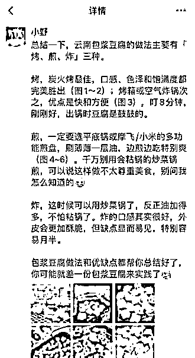

也收到了一片好评，以至于到过年那几天不能发货，群里一片“哀嚎”。

 

 

其实那段时间，我也开团了其他云南美食，但是包浆豆腐我是去花了最多心思、最多时间的，销量自然也是最高的。

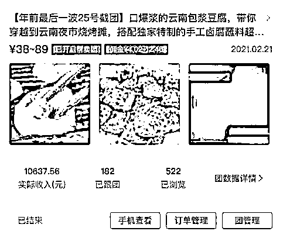

这就告诉我们一件很重要的事，想要推出一个爆品，我们首先要讲好团品的故事，然后要持续反复的去推，这样才能在你私域的用户心里植入好产品的心智。

除了过年两个月卖了 200 多单之外，后来我每个月都会开一个包浆豆腐的团，我后来发现团不能一直开着，一直开的话大家就失去了兴趣，觉得它很容易获得。所以，后来每个月只开一个星期，有限的时间里反复去推。

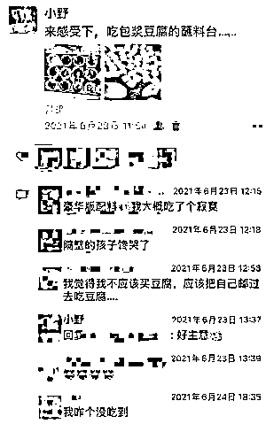 

 

 

后来因为产假结束开始上班了，投入时间变少了，每个月包浆豆腐只卖了几十单。但是，很有意思的是，当我长时间在朋友圈反复去推这个品的时候，每次都有新用户来下单，大家会有猎奇心态。

同时，反复推同一个品，老客户复购也超级高，我很多网友如果想吃包浆豆腐，第一时间来找我。可以说，我应该是把云南包浆豆腐「代言人」的这样的人设在私域里立住了哈哈哈哈。

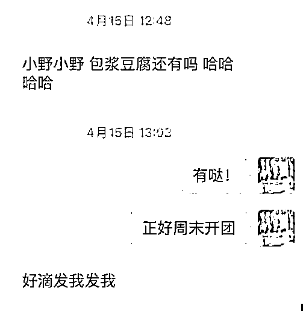 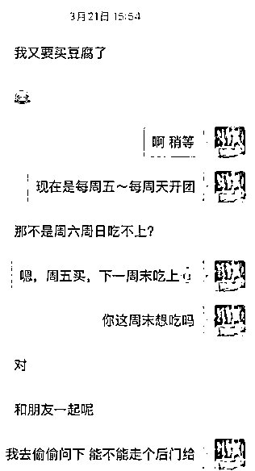

后来我的供应链发货太慢，我就很久没开团。直到我在去年 12 月航海里遇到了生财有术推荐的忘忧惠团，当我看到星宇他们开团了包浆豆腐，我眼睛立马亮了！！！立刻朋友圈发了一条。好在我的客户们没有忘记我，后来又卖了 70 多份包浆豆腐。

 

 

 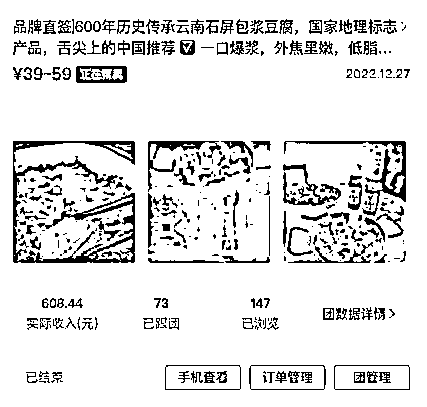

定位和心智这件事在私域里一旦立住了，就等于收获了客户的喜欢和信任。

**2.3 **把团品当奖品或礼物，既是运营、也是种草

大家应该都知道团购社群里免不了做一些抽奖、送礼物的运营动作。那么到底选择什么礼物作为奖品呢？

我觉得最好的运营方式，就是把我们要推的团品，当作奖品或礼物。当我们把要推广团品作为奖品时，其实也是多了一次触达用户的机会。抽奖前，总要介绍下奖品是什么吧，那么就等于我们再一次向用户去介绍了团品。而参与抽奖的人，哪怕没有抽中，但他也再次被种草了，就可能去下单。

此外，也可以把团品送给想要维护的 vip 客户试吃/试用，继续种草。我今年 5 月份就把忘忧惠的云澜挂耳咖啡，作为礼物给我 60 多个 vip 客户都分别送了一份，后来的确也带来了不少心智植入和复购，现在不少客户在等着云澜咖啡复团。

 

 

 

**2.4 **收集好评反馈，别人说好才是真的好** **

最早开团包浆豆腐时，我是没想到能收到很多好评的，但我知道，好评和反馈图一定要存好，反复利用起来。因为好评反馈是促进新用户下单和老客户复购的很重要的证据链。

 

 

 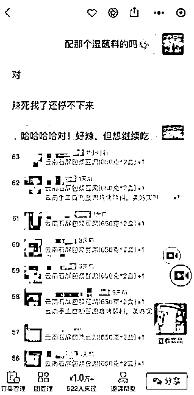

团购这件事的底层逻辑在于信任团长和从众心理，因此，除了产品价值以及团员对团长信任外，好评反馈对于促进下单占了非常大的影响比重。毕竟，别人说好才是真的好  。

所以在集中推一个团品时，一定要收集客户对团品的好评反馈然后截图。

如果没有好评怎么办？没有好评，那就想办法创造好评。方法有很多种：

方法一：有客户下单后，主动去问问收货情况，表达关心，同时收集好评；

方法二：擅用小号，上个月我让家人用他们的微信号在我团里下单云南小芒果，然后收货以后去群里发图和好评，每次他们一发反馈，就能带动好几个客户下单。真的，好评促单，亲测有效；

方法三：我带荔枝到办公室给同事分享，然后让关系好的几个同事，每人在微信上给我一个好评反馈，素材和证据这就有了（当然，前提是产品本身足够优秀）。

 

 

**2.5 **有了自己爆品后，再去做选品拓展和领域延伸** **

刚开始，我的美食团定位只做云南美食，也做出过自己团里的几个小爆品，除了包浆豆腐，还有咖啡、鲜花饼、西双版纳玉米、云南米线……分别都自己开团卖了一两百单。

但因为我自己一个人又做供应链开团、又要做营销，实在忙不过来，而当时做云南美食供应链的大团长并不多，能帮卖的团很少，于是我决定做选品拓展和领域延伸，我把定位从云南美食拓展到了全国特色美食。

我那会儿纠结过到底要不要做定位的延展，后来想明白了，在有了自己私域定位和爆品后，再去做延展其实是不突兀的。只要讲清楚你为什么要做、有什么立场去做就可以了。

前面说，刚开始不要着急推太多品，要集中去推属于自己的爆品；而当有了爆品后，也不要怕去拓展选品和领域，大大方方做生意，兢兢业业去挣钱。

 

 

三、不仅要拓展选品、也要引流扩大用户数

决定社群团购业绩的，除了复购率，还有用户数量。那么，团长必不可少的一个运营动作就是持续引流。

大家可能都有这个困惑，做社群团购到底怎么引流？我分享几个自己用过的引流方法：

**1.**、从公域里吸引同频的人

我从小红书引流，是从备孕就开始的。在真实记录自己生活的同时，可以把自己关心的事情，用心加工输出成为对别人有价值的内容。我认为这是我们普通人做引流这件事最容易做到的了，因为选题、素材就在你的生活里，吸引来的也是同频和精准的流量。虽然我的小红书目前为止只有 700 多粉丝，但引流到微信私域的粉丝应该有一两千人，也让我成功变现了近 40 万利润。

举个例子，我在生孩子之前，发现鼓楼医院竟然没有官方孕妈交流群，于是我发了一篇小红书笔记「南京鼓楼医院助产士才会告诉你的待产注意事项」，就这一篇帖子，帮我建了一个近 500 人的鼓楼医院孕妈交流群。后来我的母婴团购群，就是这样建起来的，孕妈交流群里大多数人，后来理所当然地都成了我母婴团购群的客户。

 

 

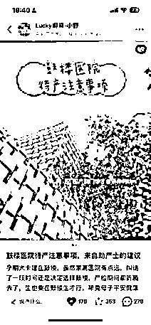

**2. **从自建的主题交流社群引导到团购群** **

围绕某类用户的需求和周期，是可以建很多种主题交流群的，比如围绕母婴这个群体，从备孕群、怀孕群，到妈妈交流群以及二手闲置群等等。

当有了自己的群以后，怎么引导到团购群里呢？

一种方法是，通过正式发布告知大家群主做了一个团购群，并且以分享的方式讲清楚为什么要做团购群、自己有什么优势/背景可以做好这件事、可以为大家提供什么价值和服务，这样应该能转化一批人进群。大多数情况下，用户是不会排斥群主做这件事的。就算有人排斥也没关系，这也是个双向选择的过程。

 

 

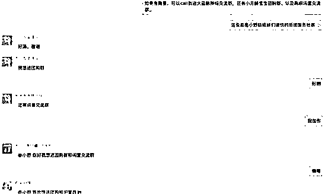

一种方法是通过群公告让进群这件事成为日常，在正式发过一次另建团购群的分享后，可以把这件事挂在日常群公告里，本来的主题交流群在运营过程里，只要有人进群就需要再次发公告，那么就有人会看到你还有团购群这件事，感兴趣的人自然会找你进群。

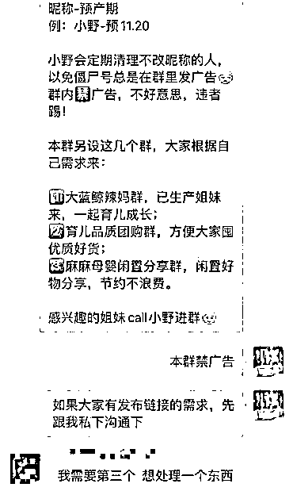

**3**、从你线下的圈子引流

 

 

做团购社群还有个很天然适合引流的场景，就是线下圈子，例如跟你同一个小区、跟你孩子同一个学校、跟你参加了同一次活动……

我前几年办了一场线下行业会议，当时建了一个现场群用来给大家发现场讲者的 PPT，我把个人二维码放在了大屏幕上，只有加我微信才能进群，于是那场会我加了 300 多个同行业的人。

类似思路都可以用起来。比如积极参与组织线下活动，找个契机加到参与活动所有人的微信；比如在小区做一次试吃活动、或是公益玩具赠书，然后加到同小区的邻居微信；

甚至直接建一个小区团购群，虽然现在每个小区很多团购群，但有差异化的好产品和好服务依然是稀缺的。

四、当用户和团品多了，也不要忘记初心

我做团购 2 年多，无论是美食团、还是母婴团，每天会保持一定数量的团品上新开团。

可有段时间我开始迷茫，每天开团、每天发素材，都在机械化地运营，离当初那个充满热情、卖家乡美食的自己越来越远。

后来当我在回顾复盘当初怎么卖包浆豆腐、怎么把团购做起来时，我突然意识到，团购的特点决定了团品品类繁多，但我们的团购爆品不能只有几个，团购的销量业绩是由无数个细分领域的爆品组成的。

不管每天能开团多少个品，我们都应该在一段特定时间内，抓住主要的核心团品作为主线去推，集中、密集地给用户植入心智，这样才能去让用户持续去信任你，形成持续的口碑，然后团购这个雪球得以越滚越大。

 

 

日常推广核心团品的节奏可以是这样：预热种草-开团宣传-自用分享-客户好评-促单复购。按照这个节奏一步步走，很难不爆单。

五、最后总结一下，如何通过一个小小的团品来启动并扩大快团团这个项目？

第一点：打造属于你的爆品。

对新手团长来说，结合好你的私域定位，先集中打造出几个爆品。爆品不一定非得是成百上千单才可以，而是在你的选品中跑出来数据是相对比较优秀的，形成口碑，让客户信任你。

第二点：拓展丰富你的选品。

有了属于你自己的爆品后，可以大方地去拓展选品，通过更多细分领域的爆品，让客户继续对你有粘性。如果需要，甚至可以重新定位你的私域 IP。

第三点：持续引流、持续爆单。

找到属于自己的同频流量，输出内容也好、线下沟通也罢，引流这个动作始终要持续去做，把流量持续注入到团购群里，然后持续爆单。

第四点：不忘初心，保持热爱。

把每一个值得的团品都当作爆品去推，用户会感受到你对团品的重视、用心、和热爱。

当无数个小小的团品汇在一起，终将成就属于团长的口碑和财富。

最后，感谢从去年到今年生财的快团团航海项目，遇到了有趣又厉害的教练@星宇、@深藏blue…以及有趣的领队和志愿者，@筱媛、@九儿…收货满满！

 

 

感谢 @梁靠谱、@张亚萨和@芷蓝对这次复盘分享的修改建议和指导，也感谢@亦仁大大给团长提供了那么多好的团购资源！团购这条路还很漫长，也非常值得深耕，让我们一起走下去啊。

评论区：

小田 : 第二个链接没有权限

小野 : 我把内容重新放文章里了，现在可以看到了吗？

小田 : OK了

小野 : 😊

芷蓝 : 哈哈，太牛了！

做团购卖的就是生活方式，让商品在场景里出现，让自己的风格在卖货的过程中展现。

卖货要有一个目的，一个目的就是一个故事，一个故事就是自己的背书

小野 : 嘿嘿，蓝姐说得对！团购就是在卖自己的生活方式[害羞]

自律更自由 : 写的太好了，我也想买

梁靠谱 : 野总yyds啊

# **# ****(**精华帖**)(207**赞**)**我做小红书垂直** IP **，第** 1 **个

# 月变现** 10 **万的经验分享

作者：  芳园朋友圈

日期：2023-02-24

谈到小红书引流变现，很多人脑海里第一想法肯定是“先做流量、先涨粉”，那“一个低粉  IP ”要怎么做才能高质量变现呢？ IP 怎么设计才能吸引流量，  当流量来了怎么承接，如何转化到私域变现？这才是做好小红书的关键，

想实现“低粉高变现”，最关键的逻辑顺序，先需要设计好私域的变现产品，其次搭建好私域基础建设（也就是流量来了如何快速做成交），最后再放大小红书流量，引流到私域成交。

 

 

我将结合我做小红书垂类 IP ，月变现 10 万的自身案例，从“如何打造低粉高变现的小红书账号”这个维度，毫无保留的分享我经验，希望给想做“低粉高变现”的你带来一点启发，少走弯路。

生财圈友好，我是芳园，6 年亿级私域操盘手，之前在大厂带领近 10 人团队负责私域业务，22 年 4 月底从某互联网大厂裸辞创业，6 月底正式做小红书，定位私域 IP 顾问，专注帮创业者提供私域变现和精准引流服务，做到了小红书 4 千精准粉，第 1 个月变现  10 万， 3 个月变现 20 多万。

很多做小红书的人容易犯一个错误，就是以为只要把小红书流量做起来，引流到私域，就能变现，甚至有的人认为把小红书流量做起来了，只要接广告变现就行。

但是现在竞争很激烈，“把流量做起来”这件事情并没有那么容易，要是好不容易把流量做起来了，结果私域却没有成交能力去承接，甚至只等着接广告来变现，那就会白白浪费很多原本可以变现的流量。

千万不要在不知道如何做好私域成交的情况下，就大力做流量，更不要只等着流量做起来接广告变现，两者都会导致你的变现周期会非常漫长......

接下来我结合自身案例，从“如何设计好私域的变现产品”、“流量来了如何做成交”、“如何在小红书精准引流”这 3 个维度的变现步骤，来和大家具体分享，我是如何做到小红书第一个月就变现 10 万的。

一、如何设计好私域的变现产品

 

 

首先我想问你一个问题，光是看我的这次分享的标题：做小红书第 1 个月变现 10 万你觉得，如果我卖的只是几十块钱，或者几百块钱的课程，我有可能做到第一个月就变现 10 万吗？对于当初我这样的自媒体小白来说，几乎不可能，对吧？

所以这也是我想要和你分享的第一个变现的关键要素：首先你得有高利润产品

请不要只卖低利润产品

请不要只卖低利润产品

请不要只卖低利润产品

这句重要的话我要重复三遍！

甚至，用户量越少，你就越应该卖高利润产品！如果你用户量很少，你还在那边只卖低利润的产品，那你几乎不可能赚到大钱！

我那时候给自己设计了3款付费产品：

1 V 1咨询 500 元

28 天训练营 1980 元

全年私教 9800 元

 

 

可以看到，刚开始做，我的产品价格设置就都不算便宜。而且，告诉你个实话...我当时重点就是卖 9800 元私教产品的，所以这也是为什么我能这么快速做到 10万  变现的核心原因

那如何设计高利润产品呢？

如果你是做知识付费的，那么，你不要只卖训练营、1V1 咨询之类的中/低价格的产品，更不要只卖几十块、几百块的课程...

因为这三类产品，并不是真正帮你赚利润的！

这三类产品，更多是为了建立客户对你的信任的，是为了让客户体验后，得到超预期交付，从而认可你，愿意为你付费更高价格的产品

所以，除了低价格、中价格的产品以外，你可以再设置私教、私董、弟子班之类的高价格产品

私教常见的交付周期和定价有：

2 个月：3980 元

3 个月：4980 元

6 个月：6980 元

一年：9800 元 / 12800 元

这四档交付周期和价格，不用四档全做，任选其中 1 到 2 档即可

 

 

当然每个人情况都不一样，这里我无法一概而论，具体的得根据你的赛道和交付情况来定，我只能给大家做个大概的参考

私董和弟子班更适合已有一定成功案例基础的人做，这里我就先不展开介绍了

所以，你的产品设计应该有三个梯度：引流产品、信任产品、利润产品

那么，不同行业具体该如何设计产品梯度？我继续给大家举3个例子（注意，以下只是举例子，并不局限于此，不以偏概全哈）

如果你是做知识付费类的，那么常见的产品形式为：

引流产品：比如免费资料、9.9 公开课、99 元年度会员、知识星球等，作为用来引流的钩子，同时让客户对你建立初步的信任，愿意付费更高价格的产品

信任产品：比如 1V1 咨询、训练营、年度付费社群等，这类中等价格的产品，客户体验后，觉得超预期，愿意付费更高价格产品

利润产品：如私教、私董、弟子班等高价格产品，是帮你真正做利润的，不可或缺！

就像我当时给自己设计的 3 个梯度产品：

引流产品：免费的私域干货资料包、15 分钟轻咨询

信任产品：1V1 咨询 500 元，28 天训练营 1980 元

 

 

利润产品：全年私教 9800 元

如果你是做零售类产品的，比如护肤品，那么产品形式有：

引流产品：比如小样/中样体验装，一方面能作为引流的钩子，另一方面，客户体验后觉得不错，就很容易购买正装产品

信任产品：比如面膜、面霜等口碑很好的爆款产品，客户体验后，觉得超预期，不断回购，且愿意付费更高价格产品

利润产品：比如精华、套装、胶原蛋白肽等，利润高，且容易形成周期复购

如果你是做微商的，比如减脂类产品，那么产品形式有：

引流产品：比如小样/中样体验装，或者 99 元减脂打卡营，可以获得一份体验装产品，同时在社群里，会分享减脂干货，用户在群里满 30 次一日三餐的减脂餐打卡，可以退还 99 元，同时还可以获得一份赠品，购买正价产品可以带走这份赠品信任产品：比如减脂产品套餐，客户买回去后，你可以给到一些针对性指导，他体验不错，就很可能升级你更高价格的产品，甚至升级为代理商

利润产品：比如代理商，成为事业合伙人，这是主要的利润来源，也是你应该重点花精力的地方

 

 

总结一下 5 个关键点：

（1）如果你的流量有限，想做高变现，那么得要有高利润产品，不要只卖低利润产品（2）产品设计要有三个梯度：引流产品、信任产品、利润产品

（3）引流产品的目的：作为用来引流的钩子，同时让客户对你建立初步的信任（4）信任产品的目的：客户体验后，觉得超预期，愿意付费更高客单产品

（5）利润产品的目的：帮你真正做利润的产品，不可或缺

二、流量来了如何快速做成交

这是一个很大的话题，这次主要和你分享，高客单产品如何快速做成交

首先，用户刚加你好友时，他对你的信任感是非常弱的

所以，你是不可能，在他还不信任你、不了解你的情况下，就成交他的，毕竟人都不是傻子，钱也不是大风刮来的，别人怎么可能轻易就从兜里掏钱给你呢？

 

 

但是，我经常遇到，刚和我学习的学员，发给我她和刚加的人的聊天记录，然后问我：

老师，我是不是哪里说错话了？为什么对方不理我了？

结果，我一看聊天记录，果然，聊不到几句就直接给对方报价、推销产品了...给大家欣赏一张我学员的聊天记录

 

 

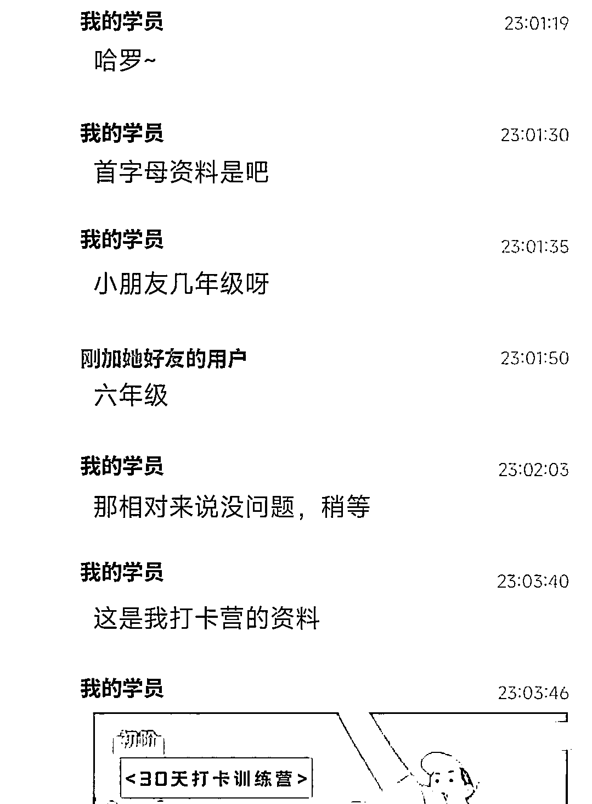

你看了有什么感受？你会愿意直接给她掏钱吗？不太愿意，对吧？

 

 

你都还不了解对方的需求到底是啥，你也还没有给对方提供价值，让对方信任你，你是不能直接就给对方推产品，指望着对方立马付费给你的。记住一句话：给对方报价和推产品，是最后的底线。

那么，正确的成交思路应该是怎么样的呢？

这里我重点给大家分享一下小红书引流来的用户如何做高价格产品的私聊成交

首先，你要先筛选对方是否为你的潜在精准客户，如果当下不是的话，那你其实不用多花时间，在微信里通过社群、朋友圈、直播慢慢养着就行，说不定在未来的某天能成为你的精准客户

那如何筛选精准客户呢？

我拿我举例子，我前面有提到，我们在引流前，可以先准备一个引流产品，比如我选择送免费资料，《私域干货资料包》，作为用户加我好友的噱头和理由

然后加了好友后，我会先问对方：某某某你好呀，你是想领取免费资料，还是想了解私域、引流相关项目？

对方通常都会回答：先领取资料吧（如果对方一上来就回答，想了解私域、引流相关项目，那通常有两种可能，要么是非常精准的客户，需要重点维护，要么就是同行来打探情况的）

这时我会问他：那你目前有遇到什么困难点吗？我看下哪个资料更适合你，有不同的资料类型

 

 

通常这个时候，对方会直接告诉你他遇到的困难，你可以从他的回答，就大概能判断你是否能帮到他，他是不是你的潜在客户，

如果这个时候他的回答，你觉得你帮不了他，不是你的潜在客户，那么你直接把资料发给他，后续在微信里通过朋友圈、社群、直播等方式养着就行

如果这个时候他的回答，你觉得你能帮到他，那么你就给他一个大概的方向建议，注意，这里只给大概的方向建议，不要给具体的解决方法。因为这里的目的，是为了吊他胃口，引发他想要进一步了解的好奇心。

如果这时候你直接给他很具体的方案，那么他就会很有获得感，觉得已经得到了，不需要再继续和你咨询了。这点很重要，一定要注意！给大家举个我的例子

 

 

 

 

你看，我给到对方的是大方向的建议，当你给了他大概的方向建议后，他会忍不住想知道，那具体该怎么做呢？

这时，重点来了！！！

你不要再在微信里和他继续聊了！是的，你没看错！

当时我第一个月做小红书变现了 10 万，主要就是用的以下这一招！只要你用好以下这一招，你的高价格产品成交，就成功了 80 % ！

这时，你要直接和他约电话聊

为什么？因为从建立信任的深度来看，  依次排序是：见面>直播>电话>私聊所以电话聊比私聊更容易建立信任。

注意：我这里讲的是高价格产品的成交方式，如果你的产品只卖几百块、千把块的低价格产品，那不需要电话聊，因为电话聊的时间成本很高，如果你的利润很低，就很划不来当然这个具体得根据每个人的情况具体分析

还是拿刚才的聊天举例子，

 

 

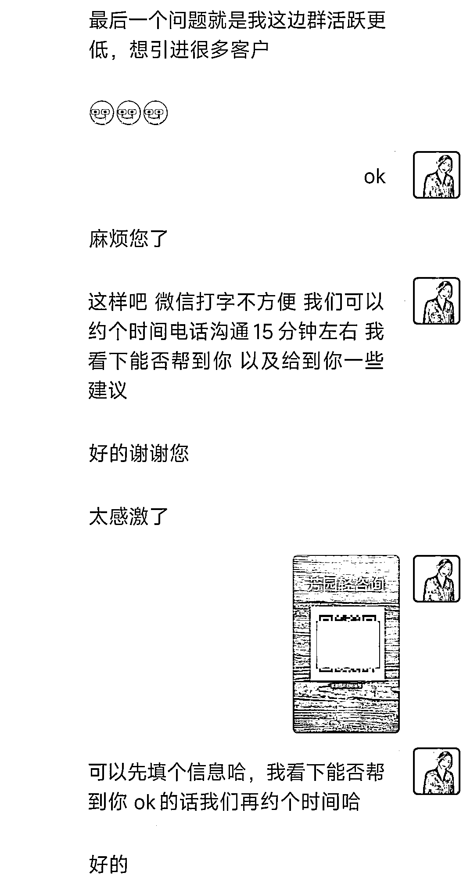

 

 

当我给对方大的方向建议后，我会说，“这样吧，微信打字不方便，我们可以先电话沟通  15 分钟左右，我会给到你一些相关建议”

然后，让对方填一份问卷。注意，问卷这一步是很关键的！

一方面，你可以筛选掉不符合你要求的人如果他连问卷都懒得填，或者随便乱填一通，那么你放心，他基本也不会为你付费

如果他填了一些信息，你发现他不是你的精准客户，那么你也没必要再和他电话聊了。

比如我就不收负债的，如果他填了他是负债的，那我就不会继续和他聊了。

这时你可以说：

亲爱的，很抱歉，我刚才看了你填的信息后，发现我暂时无法帮到你，实在很抱歉，我会送你一份资料，以表我的歉意，我们可以保持联系，或许将来我有机会能帮到你如果你看了对方填的资料，初步确认你能帮到他，那么你可以约他 15-30 分钟的电话时间

接下来，又到了非常重要的环节了！

 

 

如何电话成交对方呢？这也是我一个月变现 10 万的核心秘诀

首先，我建议大家用飞书 app 或腾讯会议与对方约视频会议，然后你开摄像头，这样的效果是最好的，一方面你露脸了，能更加强对方对你的信任感，另一方面，方便录制下来，做复盘回顾

然后，有 3 个关键步骤：

第一步：提前准备

是的，你要根据你们之前私聊的情况，以及对方填写问卷的情况，来判断他目前遇到的问题，然后提前准备好你能提供给他的相关建议

（注意，这里的建议也是同样，只给大概的战略方向建议，而不是给具体解决方案，否则你直接给了具体的解决方案，对方会觉得没必要再为你付费）

第二步：了解需求

是的，虽然之前你们私聊和问卷有初步了解需求，但是你其实还是不了解他的具体情况的，所以这时候你可以补充问他一些问题，一方面是进一步了解他的情况，以便你更好地给他相关建议，另一方面，通过让他回忆，其实是在放大他的痛苦和需求

第三步：给到建议

当他说了自己的痛苦和需求后，你可以给到他相关的大方向的建议，同时强调痛苦和好处，也就是说，如果他不解决这些问题，他将面临什么样的后果，如果他解决了这些问题，他将会得到哪些好处

 

 

比如，拿刚才的截图举例子，我会这么说：丽丽（最好称呼对方昵称或姓名，更拉近距离），你目前核心要先解决的，是用户对你信任度的问题，

你现在直接在群里推商品广告的方式，用户对你的信任感是很差的，如果你持续按现在的方式在群里直接只推商品，那么用户对你的信任感就会越来越差，你的业绩是不可能做得起来的。

但是如果你解决了信任感的问题，那么用户就会很关注你在群里推的商品，很容易被你种草，自然而然会更容易成交，那么你的业绩很快就能做上去了

当他认同以后，你再提你能够如何帮助他解决这些问题，并且这里可以举 2~3 个你的成功案例，更吸引对方，同时加强对方对你的信任感

（注意，在对方没有进一步问你产品时，你不要急于介绍自己的产品，否则推销感就会很重，对方会有防备心理）

当对方进一步问你产品，或者问你如何得到你的帮助时，你再和他介绍具体产品以上就是电话销售的 3 个关键步骤

当你做好以上 3 步后，有的爽快的客户，会立马选择购买，但是，绝大多数客户其实是没那么爽快的，毕竟你的产品价格不便宜，他也才加你好友不久，你们建立的信任感，还没有那么强，想要让对方当下立马做出决策没那么容易

接下来，有个很关键的步骤来了，就是回访，可以这么说，电话成交的客户，有 70% 左右，其实是通过回访成交的

 

 

因为你电话结束后，对方是需要思考时间的，他会思考自己到底需不需要你的产品？你到底是不是真的值得他信任？

所以在电话结束后，你需要在 15 分钟内，趁对方热度还在的时候，微信私聊给到他你的成功案例、个人故事、销售信（产品介绍），让他了解一下，这一步很关键，能进一步帮助他了解，加强他对你的信任，以及对你产品的需求度

然后，如果当天客户没有做出决策，你可以在第 2 天的时候做个回访（选个对方休息的时间，比如中午、晚上）

注意！这个回访不是让你去问对方“你考虑的如何了？”

千万别！这是大忌！你这么一问，对方只会觉得自己在被推销，就会有抵触心理，大概率前功尽弃！

所以第 2 天的回访，你应该再次进一步提供价值，然后放大痛苦和好处，最后给对方留一个钩子

回访公式：进一步提供价值**+**放大痛苦和好处**+**留个钩子

回访我建议你可以给对方发语音，因为你们之前电话沟通过了，所以相对来说信任感会更强一点，这时候你发语音，对方不会反感，反而能拉近距离。

我举个话术的例子（为了你们内容阅读的完整性，这里我就不一句一句发了）

 

 

“丽丽，昨天和你沟通完后，我后来又想了一下，你这个情况我建议你第一步可以先把社群的内容安排优化好，你现在社群里全都是广告，以你目前的社群情况，如果没有把内容安排这块优化好的话，你就很难成交客户，这也是为什么你目前客户成交率很低的其中一个重要原因”

“但是如果你先把社群内容安排这块优化好了，客户看了你社群种草内容后，就会很心动，很想要购买，那你的成交率就会大大提升，当你社群内容安排这块优化好后，你再去重点做活动成交，这样你的变现速度就会变得很快”

“我这里有一份社群运营资料，你要的话我发给你参考”

然后，你就等对方回复吧，至少 90% 以上都会回复的哈哈哈

（剩下的 10% 没回复，要么就是对方忙忘了，要么就是电话沟通完后，对方完全没兴趣，那你也不用在意，说明当下他不是你的目标客户）

当对方说需要这份资料时，这时，你把资料发给他，然后说，有问题可以随时联系我，我可以给到你一些相关建议

你看，我在干嘛？我在“处处埋钩子”哈哈哈，你发给他资料，他看了资料后，又对你的产品再次心动，（当然，资料也是需要设计过的，资料里除了干货分享外，还要留你的成功案例、产品介绍、微信二维码）

然后呢，因为你还说了一句“有问题可以随时联系我，我可以给到你一些相关建议”，所以当他再次联系你的时候，你们不是又建立了继续沟通的机会了吗？那不就等于是再次有了成交机会了吗？

 

 

绝不绝？哈哈哈

当然，如果有的客户刚开始确实有顾虑，不敢一下子买高价格的产品，那你可以退而求其次让他先买中价格甚至低价格的产品，逐渐培养信任，再成交高价格产品，这叫“环环相扣”

所以最好的成交方式，是日常的时候，你筛选一遍潜在客户，如果是低价格、中价格的产品，直接私聊成交就好，如果是高价格的产品，电话成交，然后定期再做直播成交、批量发售，这叫“多线布局”，这样的变现效果是最好的

总结一下 5 个关键点：

（1）用户刚加你好友时，他对你的信任感是非常弱的，千万不要一上来就给对方报价，“给对方报价和推产品”是最后的底线

（2）新加的用户，先筛选对方是否为潜在的精准客户，只有筛选出对方是精准客户，才进行下一步成交动作

（3）筛选出精准客户后，用“电话成交”的方式，成功率会更高

（4）电话沟通完，要创造下一次沟通的机会，毕竟电话成交 70% 左右，都是通过回访成交的

（5）回访公式：进一步提供价值+放大痛苦和好处+留个钩子

 

 

# 三、如何在小红书精准引流

这是一个很大的话题，篇幅有限我没法都讲清楚，但我这次想分享一个对你更有用的大招！只要你掌握了这一招，你再去做小红书，那你的引流效果，就会比别人好 10 倍以上！

我就是通过这招，小红书 4000 粉，就引流了近 1000 人到我的微信！很多没有掌握这个方法的人，即便做到 4 万粉丝了，引流量和精准性也没有我高

那么，想知道我是如何引流，能做到这么好的效果的吗？

哈哈哈，不卖关子了，直接告诉你吧，一共有 3 个关键步骤。

首先第一步，你小红书发布的选题内容，要能吸引精准用户，比如像我的账号，

 

 

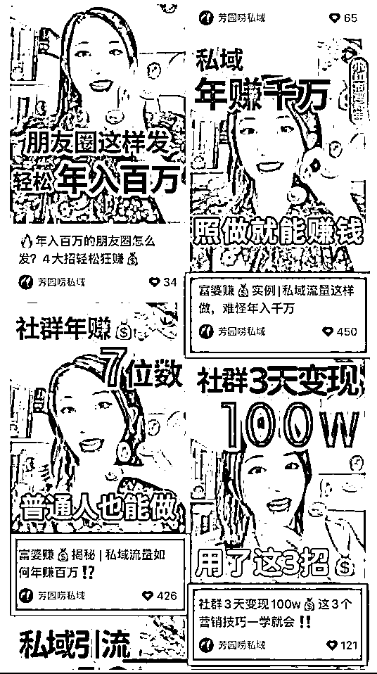

 

 

 

 

都是我的目标受众很喜欢的内容，所以我的转粉率、引流率都很高，很能吸引精准客户。

当然，你可以有 20%~30% 左右的笔记内容，是为了蹭当下热门话题做流量，或者讲个人故事做人设的，但是至少，你 70% 的内容，一定要垂直、吸引你的目标受众。

第二步，如何写出容易爆的短视频文案？

我拿我干货型的短视频文案举例子，在选题吸引精准用户的基础上，你的短视频文案内容，需要给用户带来新的认知，也就是，这个知识点，是颠覆他以往认知的，或者，这个方法，是他此前不知道的。

这一点很重要。如果你提供给他的东西，他发现他以前就听过，那很有可能，他对你的内容就不感兴趣了。

 

 

如果，你给他非常具体的，他直接就能拿去落地的方法，那他就会非常有获得感，忍不住就想要收藏关注。

比如我有篇视频笔记，是讲“私域年赚 8 位数，做对了什么？”

 

 

 

 

里面我分享了 3 个方法：

第一步，每个销售每天至少找 50 个客户聊天；

第二步，每条朋友圈，都必须有用有趣有共鸣；

第三步，如果这条朋友圈你不愿意出现在你自己的朋友圈里，那这条内容，也决不允许出现在客户的朋友圈里

重点是，这三步的每一个方法都非常具体，我甚至连话术都直接提供了，用户可以直接参考着我的话术去做，这么一来，用户的“干货获得感”就会很强，就很容易吸引收藏点赞。

那么第三步，也是非常非常非常关键的一步！当我的目标受众关注到我的内容了，那我该如何吸引他们加我微信呢？很多人引流效果差，就是这一步没做好！想知道吗？

哈哈哈，不卖关子了，直接告诉你吧

目前小红书最安全、引流效果最好的方式，就是群聊，目前群聊里你直接发微信号，也是安全的，不会影响你的账号，所以你一定要创建群聊，并且在群聊里引流到微信，如果私信发微信号的话，账号很容易被封，那么群聊里具体该如何引流呢？

注意！接下来我讲的这三步很关键，很多人就是因为没做好这三步，所以引流效果才这么差！

 

 

那首先，第一步，你要先准备一个你目标受众感兴趣的钩子，比如我的钩子是免费送你《私域干货资料包》，我知道你们很多人都是被我这个资料包吸引来的哈哈

那么第二步，当有人进群了，你要第一时间@他，欢迎他进群，为什么呢？因为人都是渴望被关注到的，当你@他，他就会产生好奇，咦，我被@了，那我要去看看，你看，这样他不就被你吸引过来了吗？哈哈

为什么要第一时间呢？因为如果你隔了好几天才把他邀请进群，或者隔了好几天才@他，那人家早把你忘了，也没兴趣加你了

就像我昨晚分享提到的，用户加你的那刻，是对你最感兴趣的，同理，用户关注你的那刻，对你是最感兴趣的。

给大家发个我的话术案例做参考：

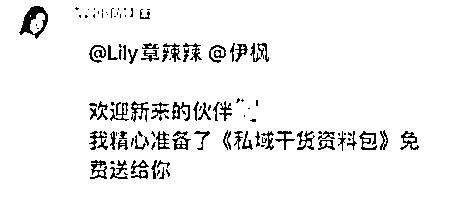

 

 

那么第三步，非常关键的一步来了！注意，第三步比第二步更关键！我有个学员之前引流效果很差，主要原因就是出在这一步没有做好！后来我帮他们把这一步做了优化，引流效果立马翻了 3 倍以上，这一步就是：

（1）你要明确告诉他，想要得到这份资料，就要加你微信。如果你不告诉他，很多人是不知道的，你也别指望让用户来猜你的心思，人家没那闲工夫

（2）你要把你的微信号，单独发出去，方便对方复制粘贴！注意！这一步是重中之重！

很多人引流效果不好，就是死在了这一步，为什么？

因为他们把一条上面有微信号的图文笔记发在群聊里，或者直接把微信号写在一张图片上，然后把这张图片发在群聊里，让用户自己去微信里一个字母一个字母输入他们的微信号加好友...

这样很多人就懒得加了，因为你又不是什么大咖，别人为啥要为了你搞得那么麻烦？

所以，给用户提供方便很重要，这个是我群里引流的完整话术，发给大家参考

 

 

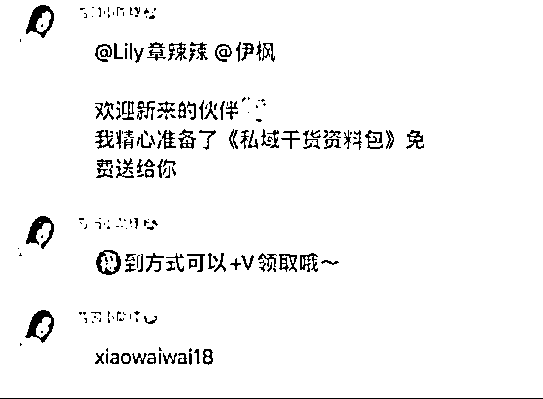

总结一下 3 个关键点：

（1）你小红书发布的选题内容，要能吸引精准用户，内容比例参考：70% 的内容，一定要垂直、吸引你的目标受众； 20%~30% 左右的笔记内容，蹭当下热门话题做流量，或者讲个人故事做人设

（2）如何写出容易爆的干货型短视频文案？两个关键：①能给用户带来新的认知，不要老生常谈；②给他非常具体的、能直接拿去落地的方法

（3）“群聊”是目前小红书最安全的引流方式，在群聊里，用户进群后，你要第一时间@他，并用他感兴趣的钩子，明确告诉他加微信号可以得到，吸引加微

ok~以上就是我结合着自己的变现案例，和大家分享的，关于做小红书如何实现“低粉高变现”的三大步骤，相信按照以上三大步骤来做，你的私域变现价值能放大 N 倍以上。

 

 

感谢你耐心看完本文，希望能给你带来启发，如有问题咨询、合作、深入交流，欢迎联系我。

评论区：

强哥手记 : 写的非常详细了，忍不住为你点赞。1、目前小红书更新频率是怎样的？2、怎么批量生产这类目标用户视频？

强哥手记 : 怎么联系你？特别棒

金彩 : 可以留个联系方式不

小花 : 太良心了，立刻去关注你小红书领资料[呲牙]

芳园朋友圈 : 感谢老铁支持。您的这两个问题，需要根据赛道来看哈，不同赛道有差异  芳园朋友圈 : 我的v：xiaowaiwai18

芳园朋友圈 : 我的v：xiaowaiwai18

芳园朋友圈 : 哈哈，谢谢[呲牙]

# **# ****(**精华帖**)(197**赞**)**全网精准引流** 300W **的底层

# 逻辑和方法论分享

作者：  九京

日期：2021-03-30

思路分享  案例分享

大家好，我是九京。

主题：全网精准引流300w的底层逻辑和方法论

为什么推荐你看下面的文章？三点好处：1、彻底解决精准流量问题；2、超越你90%的同行；3、帮助你赚到一般人赚不到的钱。

哈哈哈，看完一定不会后悔系列！

 

 

下面是我分享的大纲。

一、个人从业经历介绍

二、为什么要学习精准引流？

三、精准引流获客的三大底层思维

四、精准引流获客的具体方法

一、个人从业经历介绍

（词云）：95后  、深圳创业者、连续6年互联网创业者、微商团队长、公众号主、自媒体人、知识付费从业者、视频号探索者、个人商业ip教练、精准引流培训师、山西人、突围学堂创始人

这是一张词云，是我对自己的概括性描述。我是一个喜欢探索不拘束的人，这些年做的事情比较杂，但归根到底其实是一个事儿：内容商业。

通过持续输出有价值的细分行业内容，获取曝光，进而把流量导入微信，转化成交。

从2014年到现在，我们累积通过内容引流获取到超过300万用户，全部积累在微信私域生态，当然其中大部分流量都出给了甲方客户，剩余一部分我们自己转化。

目前我们合作的客户有：樊登读书会、花生日记、粉象生活、宝宝树、京东芬香等等。

下面是我的正式介绍：

我是九京，突围学堂发起人，95后深圳创业者，目前专注个人商业品牌咨询和精准引流教学

【个人经历】

1、微商：大学操盘护肤品微商，团队人数1400人，月流水128万。

2、毕业后专注私域运营成交，服务50➕企业用户，帮助他们搭建私域营销体系，解决流量和转化问题。

主要的合作行业：微商、社交电商、淘宝客、在线教育、知识付费。

二、为什么要学习精准引流？

相信你曾遇到过这样的问题：

手里有很好的产品，但是因为缺乏流量，卖不出去；

公司有不错的加盟项目，但是缺乏潜在意向客户导致经营缓慢；

在朋友圈做微商，经常给微信好友群发信息，但是都石沉大海。

 

 

其实这些问题本质上都是流量问题，解决了精准流量的问题，任何产品都能轻松的卖出去让你赚到盘满钵满。

2015年我入局微商，当时刚做了产品代理，每天像打了鸡血一样，不停的在朋友圈狂暴的发广告，有时候做活动还会给微信好友群发信息，当时的微信好友都是一些老师同学亲戚朋友，不到三个月的时间，我发现至少有三分之一的人把我屏蔽拉黑，还有人说我在搞传销。

我当时心里特别难受，于是做了一个特殊的决定，直到今天还是还是会为这个决定感到非常的激动，那就是把生活号跟业务号进行分开。接着，我开始在团队的带领下，再加上自己的摸索，系统的学习精准引流方法。

我曾经也为缺乏精准流量，而痛苦不已，尝试了市面上很多方法，包括各种黑科技，但基本没什么卵用。

目前市面上有很多引流方法，但是这些方法大多都是表面的「术」，而想掌握真正精准引流的精髓，一定要掌握背后的逻辑，也就是「道」。当你了解了底层思维，任何一个平台都能轻松如鱼得水的去获取流量。

从2020年初开始，我们进入流量交易这个行业。累积到现在一共引流了3,00w以上的精准粉丝，除了免费引流之外，付费投放也是一个很好的获取渠道，我们曾经投了1500块钱的广告费获得了30多万的收入。

当然以上方法在我身上奏效没有用的，还要能够复制给其他人。很多朋友知道我在引流方面比较擅长，所以都来请教我如何搞定流量。

其实我一直觉得精准引流真的太简单了，这有什么好学的呢，但事实上经过很多人找我请教之后，我才发现其中的信息差比我想象中要大得多，利他是最好的利己，我想很多人都有流量方面的困惑，那我何不把它整理成系统的内容呢？于是有了今天的分享。

掌握了精准引流的方法，具体有什么好处呢？

1、流量是一切项目的本质，只要你掌握了精准获客的方法，任何项目你都可以轻松操盘。

2、建立鱼塘思维，随时随地获取流量，只要你想，你就可以从任何平台搞到流量。

3、业绩至少提高三倍以上。在产品和转化率都OK的情况下，提升流量就相当于提升营业额和利润。

 

 

4、如果你不想创业，也可以和其他有项目的团队公司进行合作，目前市场上流量操盘手非常紧缺。

OK，今天的分享建议一定要认真看，相信对大家肯定会有所收获。

三、精准引流获客的三大底层思维

目前市场上大部分引流方法都是具体到某一个平台，都是引流的术。但往往会出现这样的情况，当一个平台的规则发生改变，那么你原来学习的玩法就会失效，又要重新学习新的平台，然后新的平台还会失效，如此往复，就陷入了学习-失效的怪圈。

其实不是不努力，只是努力用错了方向。

学习精准引流，最重要的是掌握底层逻辑，也就是背后的“道”，当你掌握思维和逻辑，相当于把握了引流获客的本质，无论迁移到任何平台都可以适用。

在讲解底层思维之前，我们先讲解一个万能的转钱公式：销售额=流量转化率客单价。

一个公司产品的客单价基本上是固定的，那如果想提升销售额怎么办呢？肯定要提升流量和转化率对吧？而转化率在整个行业内基本上有一个平均值，提高转化率的难度是提高流量的10倍以上。

所以提升流量就等于提升销售额，提升利润。

假设你是一家培训机构客单价3000块钱，转化率5%，一年想做1,50w营业额，那你需要搞多少流量呢？每年需要做10,000个精准流量，每天27个。

如果你比同行能够每天多做一倍的流量做54个，那么你一年的营业额就可以达到3,00w，听起来很简单是不是，实际上做起来更简单，还是那句话，只要掌握了背后的底层逻辑和方法，引流是一件很轻松的事情。

1、流量池思维。

在这里推荐一本杨飞老师的流量池，里面系统阐述了私域流量池的概念。我们先来说一下公域流量和私域流量，公域流量就像大海，私欲流量好比池塘。当你想吃鱼，一种方法是在大海里钓鱼，另一种方法是在池塘里捕鱼，哪种更方便呢？

相比于公域流量的不可持续、复购低、无法留存，私域流量的特点是可留存、可反复成交、可持续增长。

 

 

我们以淘宝和微信举例，假设你在淘宝开店，客户购买了你的产品后，基本上就断了联系，我跟很多做淘宝的朋友沟通过，他们说复购率非常低，但是假设你把所有成交的客户都加到微信上了，这是一个非常可怕的动作，因为你的营业额很有可能一不小心就翻五倍以上。

在淘宝开店，你的流量是淘宝给的，可以给你也可以不给你，随着竞争对手的增加，你的流量获取难度只会增加，而当你把客户都加到你的私人微信上，这就相当于你们公司的私域流量池，你可以持续的通过朋友圈、小程序、公众号、微信群、私聊触达。

当你们公司有新品上线，你可以在朋友圈去做宣传，展示你们的设计理念、设计风格、原材料选购、团队价值观。只要你不断地在朋友圈输出内容就可以，很轻松拥有一群铁杆粉丝。

2、投资思维

先说一个案例，我们在2020年在闲鱼App进行引流，单个流量我们卖给甲方客户的价格是5块钱上下，假设单账号每天引流40个客户，那么利润就是200块钱。

当然平台会进行风控，不可能无限制的去进行获客，经过我们的测算，单帐号在两周左右的时间会进行限流。两周的时间可以做1400块钱。

在这种情况下，我在思考：如何快速扩大产能，提高利润呢？答案就是账号租赁。因为每个人只能注册三个账户，所以想扩大的话一定是租赁别人的帐号，市场价格大概在50块钱一个月。

在不考虑人工成本的情况下，一个帐号可以赚1350块钱的利润，如果是你，你会怎么做呢？肯定是大量租赁帐号对吧。

当时我们带了一些学员做这个事情，其中一部分同学账号被限制之后就特别沮丧，觉得天都要塌下来一样。实际上的就是没有掌握投资思维。

在我们的投资理念里面，所有的成本都是可以被估算的，我们会把帐号计算到成本里面，只要营业额减去成本不为负数，那我们就是赚钱的，快速扩大产能就对了。

如果说因为一个帐号被限制，就觉得没有办法继续去做流量，这种思维非常的狭隘，注定很难做大。一定要有一种「万物皆非我有，万物皆为我用」的想法。我常说当一个人把帐号看轻的时候，是他真正学会精准引流的开始。

我们目前各平台累计被封禁的数量多达上千个以上，但是丝毫不影响，就是因为我都把这种封禁计算成了成本。只要有利润，干就完了。

 

 

我们用专业的话来总结一下投资思维：

用投资思维来获取客户是最快的方法，把每笔成交的毛利润作为基准点，按照成交率测算出精准引流的成本，并把这个成本作为参照，就可以无限的放大自己的生意。

3、对标思维

对标思维是一套通过获取竞争对手信息，优化自身行为的底层思维模型。

在我六年的创业过程中，对标思维对我的帮助非常大，我常常说：没有枪，没有炮，同行给我们造。

如果你没有项目，可以通过对标找到合适的项目。如果你有项目缺乏流量，也可以通过对标获取精准流量。如果你有流量不会转化，更可以通过对标思维，找到适合自己的转化模型。

总之学习，并且进行对标思维，你在互联网上就可以如鱼得水。

在这里不得不提一下腾讯，我看完了吴晓波老师写的《腾迅传》，深受感触。在整个腾讯初期的发展历史上，参考了市场上很多的同行和玩法，然后进行微创新，实践到自己的项目上，比如QQ秀、QQ会员、QQ飞车、QQ炫舞、王者荣耀等等。

腾讯的战略就是在模仿基础上的创新，让同行先去走弯路，然后依靠自己强大的基础和实力，要么进行收购，要么进行超越，大量减少了试错成本。

像这么大的企业前期都是通过这种方式来进行创新，作为我们小创业者更应该践行这种思维。

对标思维就是建立一套情报体系。俗话说太阳底下没有新鲜事，在互联网上所有的信息都是公开透明的，只要你掌握了正确的方式，就可以时刻关注对手的动态，调整自己的框架和体系，始终保持在市场的领先地位。

我们还是通过案例进行讲解，回到我们上面的那个例子做抖音培训的这个同学，我当时让他去对标全网的同行，具体是如何做的呢？

第一步：挖掘同行信息。

通过抖音、公众号、百度竞价等渠道找到做抖音培训的同行。具体研究以下几个信息 

 

同行的课程是如何设计的？

同行的人设是如何打造的？

同行的朋友圈是怎么发的？

同行的客单价是多少？

同行的流量来源是什么？

同行的转化话术是什么？

互联网营销只有三个关键词：产品、流量、转化。只要从这三个角度去进行挖掘和整合，就能够得到同行的一切信息，甚至当时他遇到一些好的同行，直接付费给他们，然后进行学习，亲身感受整个流程。

第二步：挖掘同行负面信息。

为什么要研究同行的负面呢？这里要提一下淘宝的差评机制，实在是我们优化产品的利器。之前我有一个做淘宝的朋友，他的淘宝店是排在行业前三，我问他为什么能够把店开得这么好，他告诉我，其实就一个绝招，每天关注对手的差评区。

那反过来要思考，我们自己在这个方面做得好不好，如果做得不好，那么就去修正。客户的投诉就是客户的痛点，也是我们优化产品的方向。

如果你把同行的痛点全都解决，那么排在行业前三，只是一个水到渠成的结果。

回到我们的案例中，挖掘同行的负面信息，把同行的客户投诉都拿过来，对标我们自己的现状，有则改之，无则加冕。

其实你会发现，当你做了以上的动作，对于同行的情况就一清二楚，对整个行业也有了更清晰的认知，用来指导自己的行为是完全没有任何问题的。

别人做得差的地方，你可以做好别人做得好的地方你可以做得更好，那么行业前三非你不可。

四、精准引流获客的具体方法

1、经典鱼塘理论

这张图片被称为经典鱼塘理论，最早由中国营销人刘克亚老师提出。这个理论把引流的过程比喻为钓鱼。

在讲解这个理论之前，我们必须先达成一个共识，就是我们想要的流量，其实都在别人的鱼塘里面。也就是说，我们想获得的客户，别人那里已经有现成的了，我们只要找到这个关键的人就可以。

 

 

经典鱼塘理论认为，首先找到别人的鱼塘，然后抓取潜在客户，成交之后再进行追销，最后引流到自己的鱼塘。

这个理论被人用了很多年，但其实里面有一个比较致命的缺点。很多人抓潜之后，成交率很低，就是因为缺乏了一个关键环节：信任！

我根据经典鱼塘理论推演出，另一种框架：引流-信任-成交-复购-转介绍

在引流之后，有一个信任环节，只有把信任做足所透，成交才能变得简单。甚至于我认为99%的精力都应该用在打造信任上面，只有客户认可你，才会买你的产品。

以上的五个步骤是一个非常典型和完善的微信赚钱系统。

那么常见的互联网流量平台有哪些呢？我列出了一些App：

腾讯系：微信、QQ、公众号、小程序

阿里系：淘宝、闲鱼、支付宝

百度系：百度贴吧、百度文库、百度知道、百科

除此之外，还有微博、知乎、豆瓣、小红书之类的平台。

其实引流很忌讳一点，就是什么平台都做，但是什么都不精通。当你什么都做的时候，注定你在任何一个平台，都做不好，因为一个人的精力非常有限。

所以如果你要在一个平台引流，先把这个平台做到极致，再去考虑其他平台。

我在写文章和发朋友圈的时候，经常会提到一个字精准引流，那么究竟怎么样才能精准引流呢？其实核心就是9个字，找鱼塘，造诱饵，设钩子。

仔细回想一下，你在其他平台有没有看到过别人的引流案例？是否符合这九个字的逻辑？

其实引流真的不难，关键是找到细节和方法。

我们所需要的流量已经聚集在互联网平台，所以我们只需要找到这个关键的平台，然后用一定的方法去把流量导入我们的微信，不需要我们去闭门造车或者重复造轮子。

思考一个问题，当你找到对方之后，他凭什么要你的微信呢？从人性的角度来讲，他要主动加你的微信，一定是这个动作对他有一定的好处对不对？

所以精准引流最核心的，其实就是思考你能给对方带来什么价值，别人凭什么要立刻加你的微信，把这个问题想明白你就不会再缺流量。

 

 

可能聪明的你已经想到了，我们可以在平台发布内容的时候留下诱饵，那诱饵具体如何去设计呢？

一般来讲设计诱饵，我们要关注几个原则：成本低、可复制、相关性强。

之前有一个学员设计了一个方案，他是开餐饮店的，每一个加他微信的客户直接发五块钱红包。这个方案行不行？

当然不行，因为成本太高了。我们引流首先要考虑的就是成本问题。

诱饵主要分为两种，实物类产品和虚拟类产品。实物类产品的特点是交付感强，但是成本稍高；虚拟类产品的特点是成本为0，而且可以不断复制。

实物类：试用装、试吃装、产品小样、实体书、小礼品等等。

虚拟类：电子版、PDF文档、爱奇艺会员、微信交流群等等

思考一下：你的业务能够设计什么诱饵？

诱饵设计完成之后，下一步就是留钩子。比如加微信赠送某某资源。加微信这个动作就是我们的钩子。对方想获取这个资源，就必须按照我们说的来。

这样我们就顺利完成了被动引流

2、微信群被动引流

可能有的朋友听说过微信爆粉，通过软件或者手动的方法进群，直接批量加别人，但是这样添加的效率很低，通过的人很少，而且非常不精准。所以这种非常不推荐。

首先思考一下，为什么我们要通过微信群引流？每个人的微信上都有很多的微信群，如果我们掌握了微信群引流的底层逻辑和方法，那么就会有源源不断的流量。

具体如何操作呢？

首先要思考用户画像，找到我们的目标用户之后，再匹配适合的微信群，在微信群中释放价值，通过被动吸引对你感兴趣的客户。

接下来看一下微信群的分类，从场景上划分，比如有学校群、兴趣群、地区群、行业群等等。从价值角度可以分为免费群和付费群。当然，我建议最好多加一些付费群，因为付费群首先设置了门槛保证了用户的质量，客户会在别人的群里付费，同样也可能会在你这里付费。所以你只需要思考你的目标用户，他们可能会加入哪些付费群？

 

 

微信群引流的优势在于操作简单、易上手、成本低，对于小白非常友好，但同样劣势明显，速度慢且难以复制。微信群引流比较适合平时时间很多，而且愿意在群里活跃和聊天的小白朋友。

下面我们看一下微信群引流的具体步骤，我把它分为三部分。首先寻找目标鱼塘，其次，群内活跃，最后，通过诱饵被动引流。

寻找目标鱼塘

微信群的质量越高，这种方法引流的效果也就越好，那么去哪里找高质量的微信群呢？

1、知识付费平台。市场上有很多知识付费平台，比如千聊、荔枝微课、喜马拉雅、唯库等等，大多数课程都有配套的微信群。我们可以通过这种方法混入群里。

2、付费社群。愿意添加付费社群的，都是已经被市场教育过的用户，转化起来非常简单。所以要多加入行业相关的付费社群。相对来讲，免费社群广告比较多，而且成员信息参差不齐，引流难度比较大，客户质量也很低。

3、知识星球。知识星球是一个专门帮助微信kol做社群变现的工具，上面有非常多的社群，基本都有匹配的微信群。有免费的也有收费的，先讲一下免费的如何玩。

下载app之后，直接搜索你所在领域的关键词，比如我选择营销和赚钱领域，就出现了很多免费的星球，这里面的都是我的潜在客户。我可以通过送资料、发干货等方法引流。

当然，付费的星球比免费的星球质量更高。我在一个知名的星球分享了一篇文章，阐述了我如何从零赚到第一个100万。文章发出后，两周的时间累计有658人加了我的微信。

4、行业公众号。我们可以通过新榜或者西瓜数据这样的平台，搜索行业相关的公众号，然后进入匹配的行业相关微信群。

5、互动吧。这上面很多线下的活动，同样也有匹配的微信群，这个比较适合线下传统行业的玩法。

6、微信好友。每个人或多或少都会有一些优质的付费微信群，可以了解其他好友的群，然后进入进行资源互换。

7、短视频渠道。通过抖音快手等短视频平台，找到和你行业匹配的大v，然后进入他们的粉丝群。

8、qq群。QQ群有一个功能就是可以直接通过关键词搜索相应的QQ群，同时部分QQ群也有对应的微信群，这个方法也可以用来借鉴。

 

 

9、电商粉丝交流群。在淘宝天猫京东等电商平台，搜索行业相关的店铺，进入店铺的粉丝交流群。

上面我们介绍了九种方法，但是并不一定每个都要去使用，适合自己的才是最好的。方法不在多在于精，能把一两个渠道做到极致，你就不会缺流量了。相信大家经过大量实操和优化之后，就能得到很多的优质微信群，那么进群之后下一步要做什么呢？

群内活跃养熟

微信群被动引流的核心本质就是价值展现。之前教了一些同学通过这样的方式引流，有一部分人在引流的时候被群主踢了出来。这就是因为在引流的时候方式不对，导致群主和群友反感。

想在别人的微信群里引流，首先一定要搞定群主，不要和群主作对。在双方都舒服的情况下再进行引流。最高超的引流方式就是无痕引流，任何人都感受不到你的营销动作。

进入微信群之后，一定不要直接发广告，或者你的诱饵，这样的痕迹过于明显，引流效果大打折扣。要多在群里展示自己的价值，多给群友分享，多在群里冒泡，刷脸熟。

举一个例子，之前突围学堂有个群友叫光哥，他是做财经领域的公众号。每次社群嘉宾分享完成之后，他都会主动发出一张自己整理的思维导图，大家就会觉得光哥非常用心，而且很利他和无私。同时光哥，还在坚持每天输出财经相关领域的内容干货。思考一下，假设群友想学习理财知识，是不是第一时间就会考虑光哥呢？

这就是奉献的价值和意义。

诱饵设计

在微信群引流情商很重要，假设群友在讨论一个问题，你可以说关于这个问题的答案，我在昨天已经发了朋友圈，你可以在我朋友圈看一下，如果对方没有加你好友，是没有办法看你朋友圈的，我们的言外之意就是引导对方添加微信，但是没有明说。

诱饵的设计有很多方法，我们具体讲解。

1、群昵称修改。群昵称是最好的广告位，在群昵称可以展现自己的价值和行业。比如我在一个微信群里的群，昵称是「九京-专注精准引流」，我每次发言是不是就相当于在打广告，当群友对引流有需求的时候，第一时间就会找到我。

2、解答问题。积极其他群友的问题，有干货有数据。利他是最好的利己。

3、干货输出。比如制作行业相关的文章或者电子书，在最后留下自己的联系方式，分享给群友，或者在社群里给群友做分享。

 

 

在互联网赚钱，混群是一项很重要的能力。说实话，我的第一批会员都是我混别人的社群，然后转化过来的。因为他加了别人的群，说明他第一有消费能力，第二有相关需求。

那么，如何混群让别人信任你，然后心甘情愿被你转化呢？这就需要你有一个利他的精神。坚持为群友带来有料、有趣的干货和内容。时间长了，别人自然愿意为你付费。

有一次群响社群邀请我做分享，一共4个群，每个群300人，在我一小时的分享后有接近200人加了我的微信，后续还有300人慕名而来，而且他们基本都是各个互联网的CEO或者市场总监，价值巨大！

写在最后：

其实所谓的精准引流，无非是把握人性的需求和痛点，然后针对性给出解决方案。我们所能赚到的钱，都是对自己认知的变现，也是对市场贡献的变现。

能给市场解决问题越多，市场奖励你的钱也就越多。

我是九京，欢迎留言讨论，我们一起进步。

提问一下：你们公司/组织在运转的过程中，有遇到什么流量问题吗？具体是如何解决的？

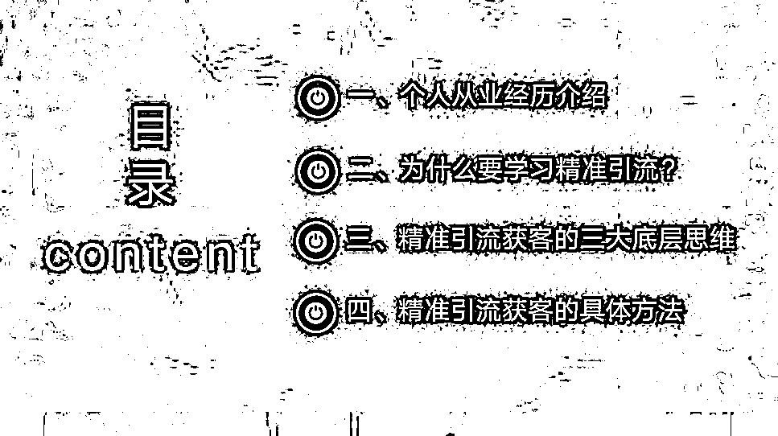

 

 

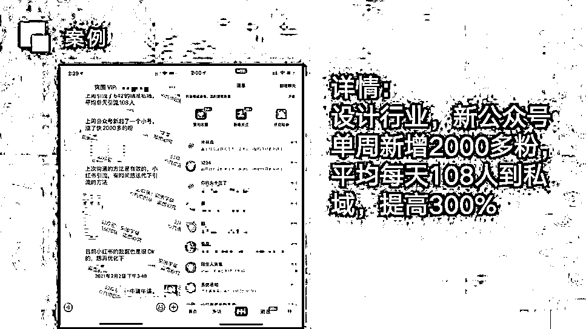 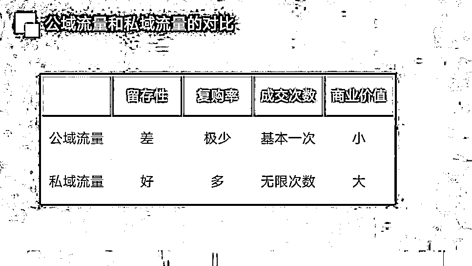

 

 

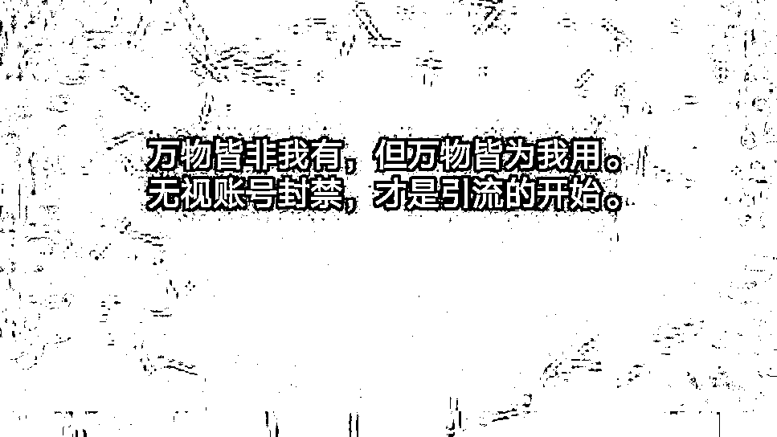 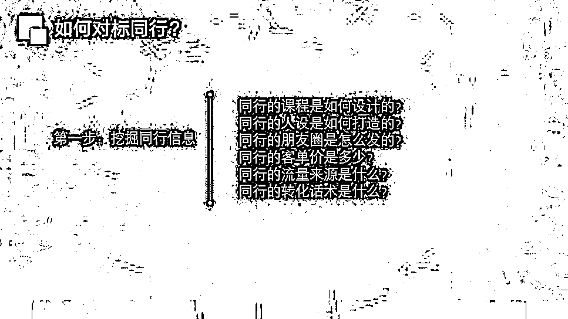

 

 

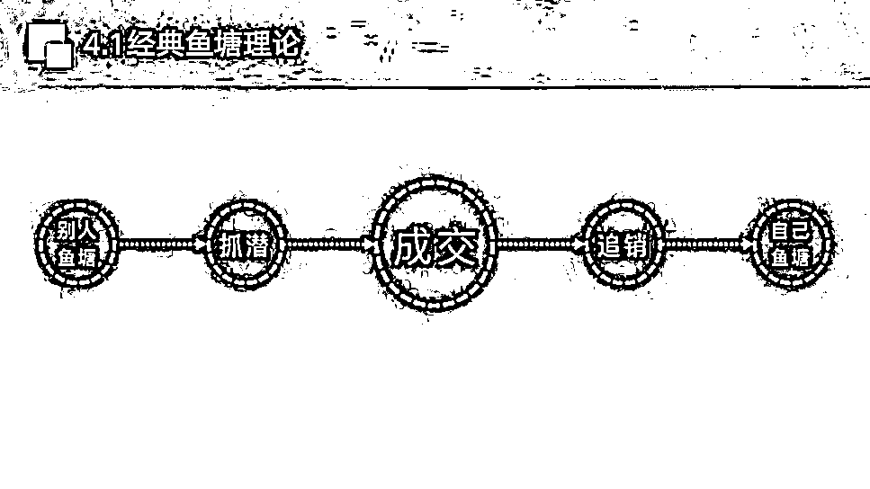 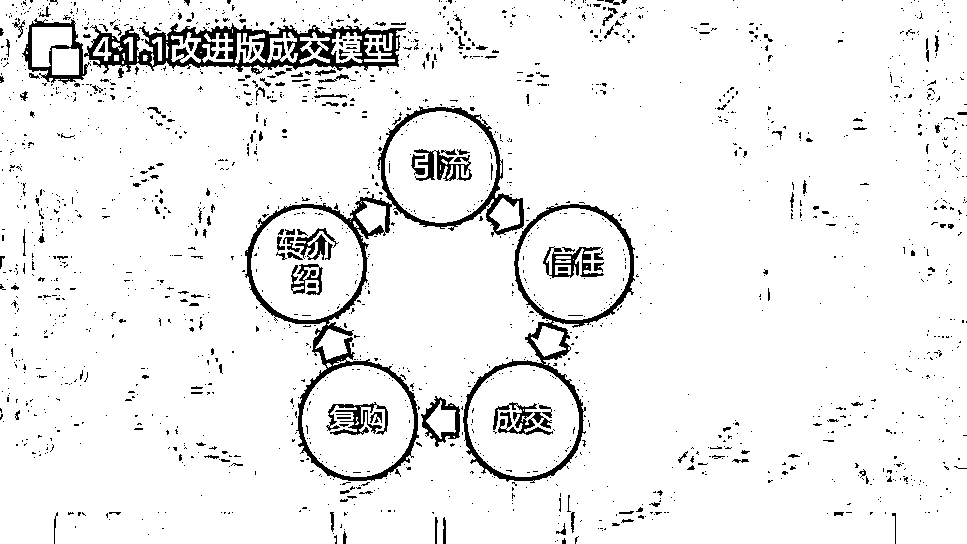

 

 

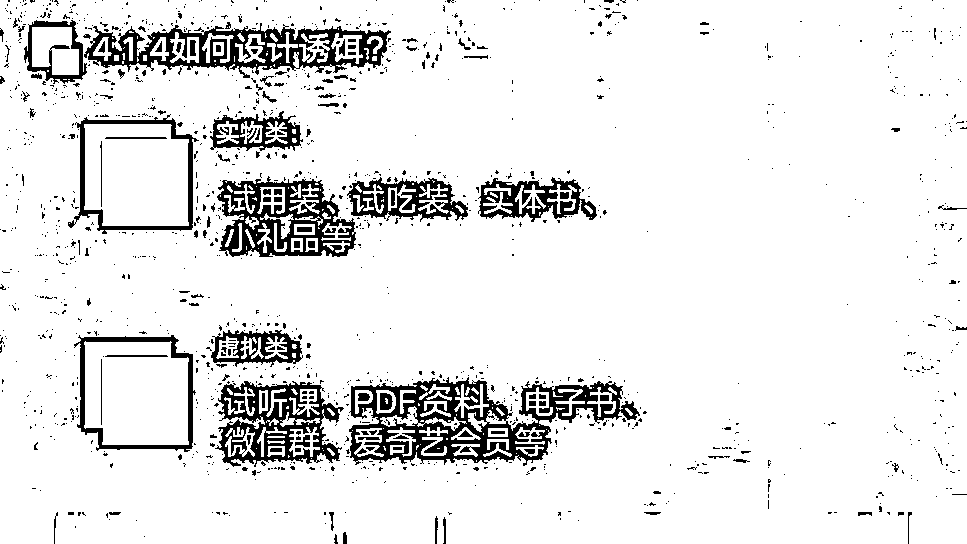 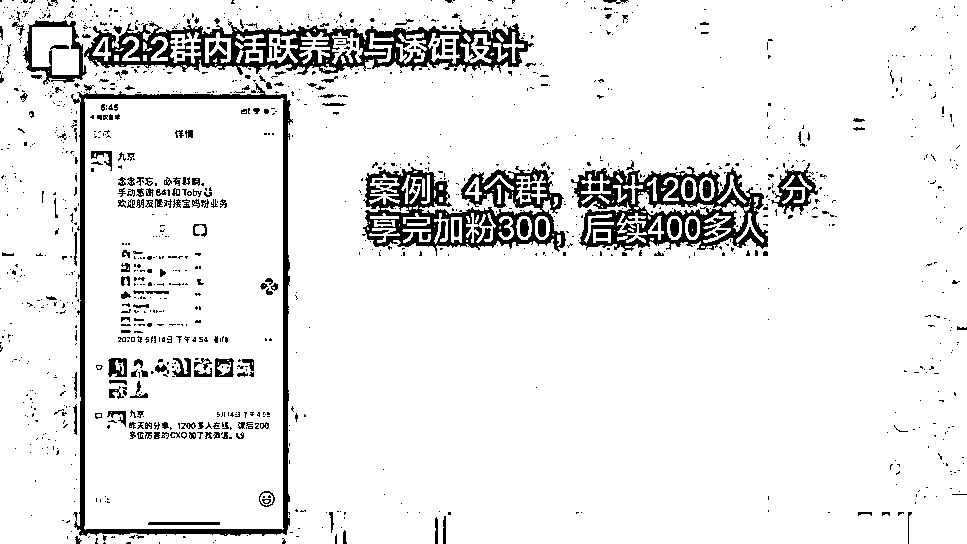

评论区：

焦波 | 水镜 : 牛逼，都是干货，学习到了 [强]

九京 : 明显没有讲赚钱的贴子点赞多，哈哈哈。

焦波 | 水镜 : 这都是心法，懂的人自然懂 [嘿哈]

月夜之瞳 : 逻辑清晰，引流思路整理的明明白白的，学习了~~~

九京 : 谢谢老铁👍

 

 

李俊辰 : 能加个微信交流不，我的Junchen-，  我这边主要是做精准垂直流量这块的  ，有主营的业务

九京 : 好的

和尘007 : 一看就是行家，直接从底层逻辑入手[鼓掌][鼓掌][鼓掌]**# ****(**精华帖**)(179**赞**)**从创业失败到低成本获客过

# 百万，我是如何摸索出自己擅长的引流打法的

作者：  鱼丸|亦仁助理

日期：2021-07-21

今天周三，「生财合伙人」照常更新啦。

今天给大家分享一位创业者在引流方面的成长和思考。他之前在北京互联网大厂， 2 年前回到长沙做职业教育方面的创业，结果做了不到 2 个月，就以花了 60 多万买个教训结束。之后通过学习长沙的流量玩法，在多个平台接连尝试，逐渐找到了擅长的打法，低成本地获取了上百万的客户。

这位创业者就是今天的「生财合伙人」嘉宾@Kosan 老师。他这篇分享的重点，在于复盘他一路是如何跌跌撞撞地摸索出来自己适合的引流获客打法的，如果你当前遇到了业务困境，可以借鉴一下他的探索思路。

目录

一、创业失败后，我开始学习更接地气的长沙流量玩法

 

 

二、从基层到高层，我把潭州和潭州系聊了个遍

三、被疫情所迫去置换流量，结果我们吃了知乎的第一波红利

四、被业务推着走，抖音信息流投放的爱恨情仇与不成功尝试

五、找回擅长处，惊险一跃，终于开启引流获客的人海战术

1\. 如何一个月打透虎扑、豆瓣

2\. 如何一个月打透小红书

3\. B站和知乎的爆款引流逻辑

4\. 怎么管理人数庞大的流量团队

六、我的流量方法论：4链路模型

---正文---

文章较长，讲故事前，先分享一个干货，吊着大家能继续看下去。一般教育企业，引流分 2 种号：老师 / 机构号、资料号，但其实，还有一个场景大家都没怎么留意，或者是觉得它不能规模化，那就是学员间的交流学习。在我的团队长期探索下，我们第一次把这「学员号」这个引流方式给 SOP 化了。下面我分享的这张图，一共有 307 条回复，大家也可以猜一猜，引流到微信大概是多少人。

 

 

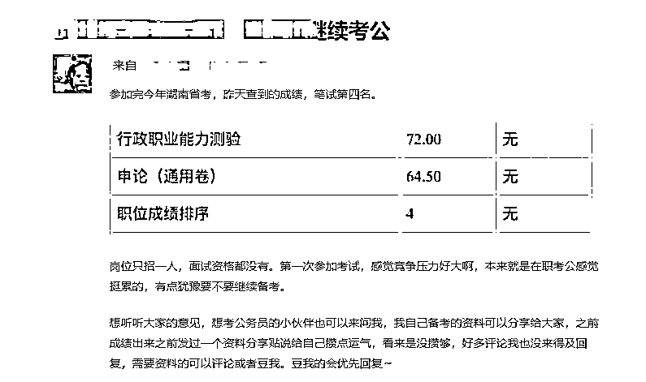

一、创业失败后，我开始学习更接地气的长沙流量玩法

我是 2019 年 5 月回到的长沙，第二天旋即创业，那时候，自以为是天之骄子，长沙这些土包子，做运营、搞流量都不如我，创业做了不到 2 个月，以花了 60 多万买个教训结束。创业失败后痛定思痛，开始接触到长沙的圈子。

在陆续聊了长沙 40 多个本土的投资人、创业者后，有一天，我忽然聊到一个人说，他们工作室搞流量很厉害。我是北京互联网大厂出身，在当时的我眼里，什么样的搞流量能厉害过我？

他镇定地拿出手机，给我示范怎么在社交平台上引流男粉的，然后另外一台，再一台，再一台...我当即惊呆，我从来没见到过这样的玩法，在我的思维里面，线上获客，还停留在裂变、投放顶多再加个短视频引流。

 

 

当时，我进入了第二段  、也就是现在的公考创业的项目，正愁不知道该怎么打开流量局面，于是在2个月内，我陆续聊了很多搞流量的同学，我把他们大致总结为 3 个流派：

技术流、人海流、 IP 流。

技术流的意思是，通过找到平台的某个漏洞，不断去私信用户，引流到微信。比如说，抖音某个版本比较好私信，那段时间就有团队跑脚本疯狂去私信用户；又比如说，我知道一些创业者，在全民 K 歌导粉，每天买 500 个账号，疯狂私信给人导流，只要引流效果高于封号成本， ROI 还可以，那就干。

人海流，顾名思义，就是堆人，搞流量团队，通过堆人来解决流量规模化问题。这里面需要解决以下几个问题。

第一：堆人是否能做到流量规模化

答案肯定是能，我们想想，传统线下教育公司，不就是靠扫楼，扫街等等拉过来的客户吗？而这些企业只不过是把这种方式，放到线上来了而已。

第二：人海流的流量效率问题

投放毫无疑问是非常快的，但是堆人不同，它的产能是需要熬的，也就是说，你得等团队成熟了之后，才会有产出，前期得养，这是最痛苦的，怎么压缩工期，让新人尽快熟悉引流方法，就先得特别重要，也特别考验企业的功力。

第三：转化率问题

毫无疑问， SEM 和信息流投放转化周期是非常快的，转化率在各个渠道是比较 OK 的，但人海流的转化率就不一定差，只要你控制好前端的引流渠道和 SOP 话术，你还是可以引过来非常精准的流量，而且，项目越垂直，流量就越精准，再辅以私域运营，从长期来看，效果甚至比投放好。

 

 

第四：**IP**流

IP 流需要企业有强大的IP名师，通过这个 IP ，老老实实做内容，进而形成转化，这种很适合考研等具备名师特性的行业，而考公因为没有全国性有说服力的名师，打造起来难度偏大。

二、从基层到高层，我把潭州和潭州系聊了个遍

在梳理完这 3 个流派之后，我就初步确定了我们的获客战略，前期人海流，后期人海流  + IP流。技术流找平台技术漏洞，一方面是我们认为这样的机会可遇不可求，另外一方面，我觉得这种东西平台堵住了，公司就会很难受，且平台一定是特别厌烦这样的方式的。

既然是人海流，那肯定是找行业最牛逼的团队学习，挖行业最牛逼的人，所有的目标都指向——潭州教育！可能大家对潭州不太熟悉，这是一个特别神奇的公司，创始人之前做过传销，所以整个公司都很有传销气质，特别打鸡血（这几年好些了）；做兴趣教育，能把一插画这么小一个品类做到单月 2000W 营收（最近数据）；这家企业影响了整个长沙的在线教育，可以说是「黄埔军校」，从里面出来一个小 team ， 4 个人，就能成立一个公司，最多的时候，长沙差不多有 800 多家潭州系企业；这家企业免费获客团队曾高达数千人，几乎长沙所有人才市场的人都收到过它的面试通知；这家企业的人，出来收入至少翻倍...

我是怎么找潭州的人的呢？总的来说就是，勤快，像投资人一样聊，把能聊的都聊了。

基层当然是通过面试，直接在 Boss 直聘上扔炸弹，  招聘「新媒体运营」或者「网络推广」，但不能写「流量运营」等专业性词汇太高的，因为他们真的会不知道这个岗位是干嘛的。

 

 

大部分潭州的基层员工，其实是不可以聊的。因为他们被潭州洗脑得比较深，我一开始聊的时候，完全是不知所云，完全聊不到一块去。他只懂潭州这种玩法，他很认潭州里面某个牛逼的人物。所以在多聊了几个人之后，我直接说，我是潭州某某（潭州系比较认的一个人）的好朋友，我前几天和她刚吃过饭云云，这样他们才会和你聊起来。

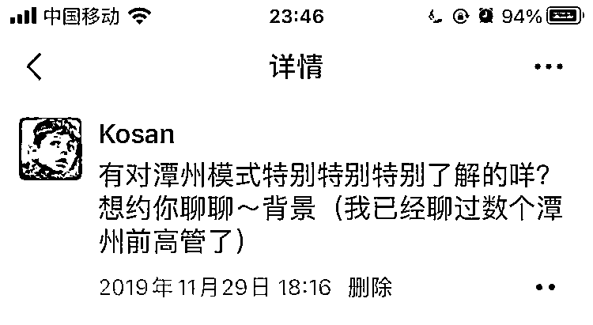

中层不能通过面试了，得通过熟人介绍。因为他们的简历来不及流通到市场上，人就被抢光了。这个时候，我在前段时间聊的 40 多个长沙本地创投圈的朋友就产生了作用。

直接找他们推荐，没想到还真找到了几个，然后，拔出萝卜带出泥，攻破了一个，基本上就能攻破他的整个圈子。

当然，真正实践的时候，还是出现了问题。因为中层要么出来自己开公司，要么出来加入一个公司任合伙人，他真的是不缺机会。我曾拿 3W 月薪，想一把砸死一个 20 岁小伙子，让他来我们公司，结果拒绝了。因为他创业能收入更多。后来实在没办法了，我就只好说自己是投资人，想看看他们项目，想投他们，这才真正攻破这道线。

至于高层，  就必须得是朋友介绍了。幸好那段时间，认识了一个朋友，他正好认识潭州原来的 2 号人物，马上请客吃饭，当场请教。然后又通过她，进入了这个圈子。

 

 

偷师完了，肯定是招人，于是我花了大价钱，在潭州找了 2 个操盘手过来（都是推荐过来的），其中一个，来自潭州赫赫有名的黄埔。

三、被疫情所迫去置换流量，结果我们吃了知乎的第一波红利

但好景不长，在刚确定完流量团队负责人人选，公司刚融完 Pre-A 后，疫情来了。我们的战略部署马上被打乱。本来决定 20 年后，马上大规模招人，走人海流，但公司都不让进了，必须在家办公，而我们核心的几个人员，则租了一栋民宿办公。但是公司盘子已经推起来了，再没流量进来，公司生死都成问题。没办法，到处找流量。

然后那段时间，正巧通过一个渠道知道，知乎在放量，开通了教育行业的合作通道。于是就满朋友圈找知乎的人，结果还真给找到了。于是马上推进合作，要分润 30% ？好，没问题，要先进知乎的账？好，没问题！要有 ROI 考核？好，没问题，知乎要求的，通通答应。实在不是我们一开始有先见之明，而是垂死挣扎，快要溺死的人了，哪管那么多，先抱跟大腿再说！

 

 

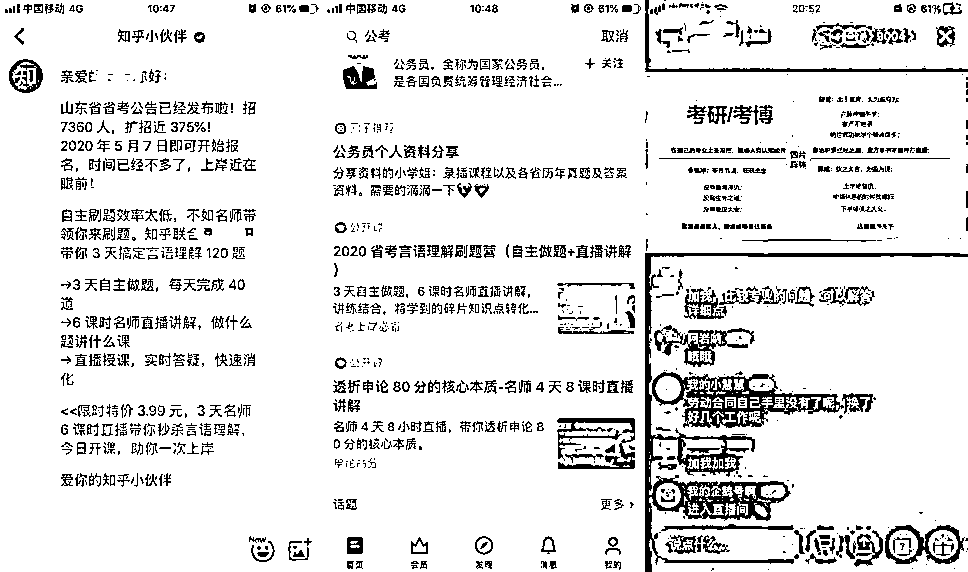

上图就是那段时间知乎给我们推的部分资源截图。那段时间也是我们最爽的一段时间，知乎给过我们全量 push ，知乎站内一搜「公考」、「省考」、「国考」最先出来的就是我们的课程，我们每次直播，知乎都通站内资源推、甚至是我们的账号的文章，都会单独给我们加量。

一开始我们也不知道流量有多大，只想抱大腿，结果真的一推，根本忙不过来，知乎的流量滚滚而来，前期我们有大量的流量浪费，因为销售团队那时候我们甚至都没搭建，是我和老师在转化！这也给我们另一个教训，前后端一定要协调发展，特别是教育公司，流量一多，没办法转，真是很奢侈的一件事情。

此后，我们也把和知乎的合作方式用到了和 B 站的合作上，于是我们又成了第一个和 B 站合作的公考机构。

四、被业务推着走，抖音信息流投放的爱恨情仇与不成功尝试

 

 

随着业务进展，单个渠道已经不能满足我们了。我们在 20 年 2 月份就开启了抖音信息流投放。那时候我对信息流，一窍不通，完全交给山东直营中心在打理。但是好在疫情期间，投放的同行很少，导致表单获客成本并不高，当时我们的表单成本，是不超过 30 的。

但是因为例子消化不完的缘故， 3 月份我们并没有做大启动。随着销售团队的扩大，不得已又开启了投放。结果到后面，越来越贵。我不断问人，问代运营，问朋友，都不知道是什么原因。其实一直到最后，我都没有特别解决好这个问题。

倒是因为投鲁班，让我第一次感觉到钱哗哗出。那次我们是投了鲁班的 9 元课，然后不到半天，一下子爆单了，直接烧了 10W ，例子呼呼呼进来，就见销售不断地和我说，打不完了打不完了。结果还是来不及了，那些例子我们花了一周才消化完，而且，鲁班来的例子质量确实差很远。

不过从这里面，我们倒是总结出了一条诀窍，广告就是要吸引眼球，这是第一要义。我们代运营方当天推这个视频，做了一个特别魔性、沙雕的视频，就是不断地重复重复，还配折搔首弄姿的舞蹈。

在之后，我们做广告投放，就都是这条路子，我自己特地搞了一个短视频团队，专门拍这些沙雕视频做投放素材，然后很多视频都上了抖音的行业热门素材。当然，这是后话了。因为在这期间，我们又发现了新的投放玩法。

因为我们的课程是 49 元打卡 7 天全退的，但是在信息流平台，你没法一下子说清楚这个事情，但是假如说，我们找一个中间的信任节点，也就是在用户那有信任度，在我们这也有信任度的 KOL / KOC ，让他去和用户讲这个事情，这个效果就非常不错。

 

 

于是我们就尝试跑了几个 B 站 UP 主和公众号个人属性很强的博主，没想到效果还非常好。当然，可规模化的属性就差很多。一方面，得选个人 IP 属性非常强大的号，另外一方面，每个广告主都告诉你我的用户是忠诚的，可靠的，对选号的要求非常高。

纵观我们整个信息流投放的过程，都没有特别成功，我一开始因为疫情期间便宜，我以为之后都会很便宜，没想到越到后面，表单成本一骑绝尘，已经到我们难以忍受的地步。

最终让我断了再投抖音信息流的是两点，一是我有一次找来我们一个代理商，让他直接给我看竞品后台，结果我以为我们做得已经很便宜了，人家一个表单最高才 18 ，我一问代运营，为什么他们这么便宜，代运营说不出所以然，我觉得这里面是个玄学，我不太可能一下子搞清楚；另外一块是随着我们后来免费流量的跑通，我们对信息流就没那么大依赖度了，后来慢慢也停掉了。

五、找回擅长处，惊险一跃，终于开启引流获客的人海战术

差不多与抖音投放同期，我们开启了养流量团队之路，也就是通过新媒体获量。到了 3 月份，随着疫情缓和，终于可以开始在办公室办公。我们把在线上办公的两个潭州来的操盘手，拉来公司，正式开始招人。

当然，一开始真是抓瞎，首先是入职第二天，另外一个操盘手就走了，人创业去了......所以到后面只剩下 1 个；然后另外一个同学她只做过韩语品类，对于公职考试，她也不知道流量该怎么做。没办法，身为老大，只能自己带着小伙伴先探索。

 

 

然后是不知道从哪儿开始，一开始做各种号，头条号、抖音号、西瓜视频、 B 站都做，做了之后发现不起量，然后才开始养号；有了阅读量播放量之后，发现引不来流量，然后才发现，方向搞错了，有些内容只是量大，但引不来流量；然后发现不同的钩子，引流效率差别极大；还有就是用户来了之后不会不知道怎么把用户拉到训练营中来......不过终于，在养了团队差不过 3 个月左右，量开始批量化出来了，团队的平均每天加微，能到 30 个左右了，并且很快，我发现虽然每天加微在涨，但我都不需要考核加 V 了，我直接考核训练营的转化数量。一开始的批量化产能，它来自一个很垂直的平台，叫做 QZZN 。不过很快陷入瓶颈，因为它太垂直了，团队人超过 3 个去做，就会出现流量重复。于是，我们开启了主流平台的征伐之路。

**1. **如何一个月打透虎扑、豆瓣

虎扑和豆瓣并不是我们一开始着重打的平台，甚至我一开始都没看他们。因为觉得平台很垂直，量应该很小。直到后来，我们的账号在微博上被限制得很厉害，我随口和团队说了一句，你们关注下豆瓣虎扑这样的平台，去试试。

然后真有几个小伙伴去试了，他们用的方法，也就是我最开始说的那三种：机构号/老师号、资料号和学员号。这其中，最快的是学员号，最难的是老师号。因为虎扑和豆瓣的社区属性都特别强，所以找同好也变成一件极其正常的事情，「组团备考互相监督」。

可能很多人有疑问，学员号魅力当然大，但你引流过来之后，微信号作为一个传播中心节点，你是需要对你的信誉负责的。怎么解决学员的信任问题呢？其实很简单，我一开始的流量团队成员就是在备考公务员的人，所以他们是真的需要备考，需要一起学习一起监督，他们只不过是刚好在我们机构工作或者是兼职，他们可以推荐自己喜欢的我们机构的老师，也可以推荐别的机构的老师。

 

 

不然，我们也发现不了学员号这块这么强大的流量，只有你自己是用户，你才会发现这块有这么大的流量。还有就是，来了的流量，我们绝对不会对学员过度骚扰，我们拿出来做训练营的老师，真的是行业里面排名前几的名师，学员听了之后，一般不会有什么问题，因为教研质量过硬，你给他推荐的，真的就是好东西。

我们在一开始做虎扑和豆瓣的时候，就是不到 4 个人上去了。但第一波人吃到红利之后，团队其他人几乎就不用我说，全部扑上去了。

因为每个人都有任务，都想拿提成，那要拿提成，他就得去找流量。所以基本上跑通不到半个月，我 40 多人的团队就全跑到上面去了。搞了不到 1 个月，因为平台小的原因，又出现了流量重复问题，还因为引流过于生猛，让平台封了我们很多账号。

一开始我是这么看流量重复问题的，小平台，我们要么不做，要做，就要把平台内我这个品类 80% 的内容都做了，也就是说，在这个平台，你只要搜我的品类关键词， 80% 的内容都是我出的，从而达到饱和攻击的效果。我把它称之为「品类占领」。

当然，你骤然上那么多人，平台肯定是会采取措施的。他的流量就那么点，全被你搞没了，他还怎么卖广告？所以我现在也在修正我的品类占领的决策，小平台它只能接受那么多人，那我就只放那么多人，以免平台突然出整顿政策，或者流量大规模重复，从而影响用户体验和转化率。

**2. **如何一个月打透小红书

不过，到了小红书这，我又换了种玩法。因为到了今年 5 月份，我们原有主流平台的流量，出现青黄不接的情况，必须要去突破新平台了。我看了下周遭，能快速出效果的，只剩下小红书了，于是决定，压 20 个人下去铺小红书，差不过 50 多个账号。

 

 

一开始也是吭哧吭哧做了好多账号。因为我也不知道什么方向会火，所以我干脆所有方向都做。做了半个月，跑出来一批账号，我们差不多知道玩法了，于是就集中去跑那几个领域的账号。

小红书的玩法和虎扑豆瓣又不同，我们到目前为止，是没跑通学员号的，不过把资料号给跑通了，我们把公考知识做成美美的图片分享出来， 20 个人每天发的图片上，文字内容都是一样的（知识都是来自老师整理），文案会各自去拟写。然后总能火那么差不多一半左右，而且有些账号，非常莫名其妙但是又非常规律的，每周末爆一篇，我们唯一能从里面得出来的结论是，官方拉出来「鞭尸」了。

当然，在小红书，丑是原罪，数据是不可能起来的。这点，务必留意。

**3. B**站和知乎的爆款引流逻辑

B 站和知乎，是我倾注非常多心力的两个平台。B 站我前后大概布了接近 50 个 UP 主上去，知乎更是铺了不计其数的账号。

我们这个品类，除了名师免费课程外，在 B 站最容易火，最容易带流量的内容是学长/学姐经验分享视频。我们甚至出现一条视频从去年火到今年，带来 1000 多加微的情况。

 

 

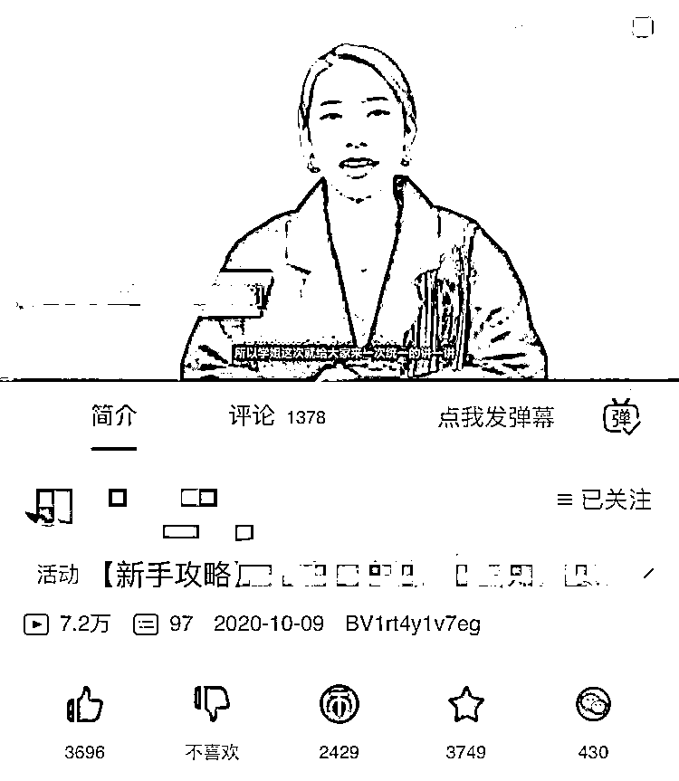

当然，在此我们我们得解决 2 点：一是怎么做爆款；二是怎么引流。我先讲引流： B 站引流其实并没有多少诀窍，我们主要是通过视频内嵌入式口播或者通过资料截图贴片的方式，另外就是被关注之后的评论回复以及评论区置顶；而知乎我们之前玩的是引导用户关注同名公众号，或者谐音词、图片、石墨链接换着法子私信用户，现在玩的则是通过知 + 引导用户加微信。

 

 

我重点讲讲我们怎么做爆款。因为引流方式其实都差不多，最重要的差别在与你的视频/文章爆不爆。首先我们得有敏感度，说实话，搞流量的都得有点敏感度，包括这几个方面的敏感度：

**1**）热点敏锐度

包括时间节点热点，行业热点，热点来了就得上，不要犹豫。

**2**）平台敏锐度

平台规则一直在变，像知乎这样变得慢的比较少，所以，团队老大得自己去摸索，去亲身实践。

**3**）项目敏锐度

项目节点很重要，项目节点一来，流量哗哗来，得提前有方案，能兜住。

其次，不管什么热点，一定要和行业相结合，一定是热点+行业，不然，即便是火了也没有什么意义。比如说粉丝看到刘昊然考编，是舔他的颜值，而我们看到刘昊然考编，就想去分析编制有什么好处。

最后，如果上面都太难，没关系，还有一招，一定可以学会。那就是，一个热点诞生后，它是一个平台一个平台去感染的。所以你大可以把微博热搜的热点，跑到知乎去，提一个问题，然后自己回答，然后再邀请其他人来回答，这样子的问题大概率在知乎也会火爆起来，至少这个问题的第一波流量，都是被你所吃。

当然还有一个就是，每个行业都有自己的行业热点，这个热点，平台不一定知道，他就知道某天怎么流量忽然涨了，但是作为行业从业者，你一定是知道的。你可以提前预设好问题和回答，然后等行业热点以来，就马上左手提问，右手回答，下一秒再邀请知乎全站人去答。

 

 

举个例子，每年国考公告出来，一定是会上微博热搜，也是一定会上知乎热门的。国考的公告时间公布不确定，但肯定每年都会公布一次。于是我每年就提前 1 个月准备好一个问题 + 一个回答。等国考公告一公布，我就马上去知乎提问 + 第一个回答。

我的提问都特别简单，每年都是「如何看待20**年国考公告」，然后我就把早就准备好的文章更上去，然后就去邀请全站人回答，就可以了。可能很多人都想不到，竟然这么容易，但它就是这么容易，而且，至少在过去 2 年，我们整个行业，就我一个人在干这事。

这个事情，第一年给我带来了 2W+ 精准客资，第二年也给我带来超过 8K+ 精准客资，之所以第二年少了，是因为我在嵌入小程序图片的时候，当时我们的小程序忘了开裂变，如果开了裂变，那估计又能有几万的客资。

 

 

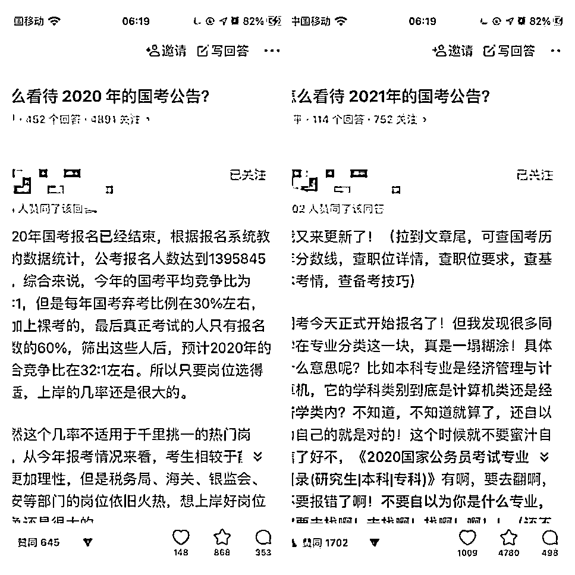

我们在沉淀了很多微信号之后，有一天忽然想，这些用户沉淀在微信上，每天只做做做转化有点浪费，没发挥流量一定是流起来的特性。于是就想试试，我要是把沉淀在微信号里面的学员导到公众号去，那岂不是触达次数又多了？之前光顾着导微信号去了，原来做的流量有巨大浪费，何不试试？

当然也有忧虑，要是用户没导过去，反而把我们给删除了，那就得不偿失了。不过可以小规模试试，于是我们就拿出来了 20W 粉来试，一开始就找名师设计好引流物料，再提前大约 10 天搭建公众号内容（公众号主打名师个人IP），结果发现，当然就导了 1W 粉过去，用户删除私域的也在可控范围，最重要的是，在公众号推送了名师训练营之 

 

后，转化率明显提升！

**4. **怎么管理人数庞大的流量团队

一直有很多朋友问我，管这么多人，怎么管，管得来啊？说实话，它在我这一开始都不是个问题，我甚至从来没想过。我的团队现在有 40+ （最多时候 70+ ），目前直接管理的是 7 个人左右，但团队很多事情，我都是亲力亲为的。我是今年才开始思考管理这块的问题的。

第一：选人真的很重要

我的团队，我只要应届生或者刚毕业不久的，平均年龄 21 岁，有经验的有自己的固有思维，反而搞不起来；我不要本科毕业的，只要 ≤ 专科的，因为很多本科生事儿逼还觉得自己有多了不起；我们的作息是单休，每天晚上 10 点下班，所以，不能接受的直接别来。我的这群小朋友，能干，耐操，不墨迹。这是我喜欢的团队。

第二：培训很重要，因为是白纸，必须强培训

培训培3个东西：企业文化；业务流程；未来规划，给以未来期许。并且，必须是老大培训，其他人一定不行，我在最开始吃过这上面的亏。交给操盘手去培训，然后发现入职  10 个人，到 1 个月后，可能 5 个人都留不下来，甚至会出现留存率只有 20% 的情况，后来我自己接管了培训，每天给小伙伴们先讲故事，讲未来，然后再讲业务，他对我认同感强了，对团队、对公司认同感也就强了，也就知道自己是在做什么事情，处于什么位置了。

第三：一定要以身作则

团队一定是，上之所好下笔随之，老大怎么样，他就怎么样。当我每周周末都准时过来加班，给他们开站会，培训，讲故事的时候，团队其他人都没啥话说了。

 

 

第四：也是最重要的，分好钱

我的团队试用期基本薪资 2500 ，转正后 3500 ，在长沙这样的地方，优势并不明显，所以我们在提成方案，特别是超额完成目标后的提成方案就特别刺激。最开始，我为了让流量跑通，甚至出现过只要拉 200 个注册就给 7000 块奖金奖给小伙伴的情况。我的小伙伴，说实话家庭出身都不算太好，但他一毕业，他就能知道，它只要付出，他就能得到丰厚的也是他应得的报酬，那他的积极性当然很足了。

自从用上流量团队的人海战术后，我们的流量焦虑症终于减缓一点了。最主要的原因是，流量团队的工资成本比花在投放上的成本，实在是小太多了。而加上私域运营与训练营服务之后，我们的转化率并没有减少，反而有一定提升。

六、我的流量方法论：**4**链路模型

我在过去 2 年，差不多把线上的获客方式都摸了一遍，经验教训都非常多。总结下来，基本上就这 4 块。

**1. **做流量，通过新媒体等渠道获客

这里面最难受的是最前面的几个月，因为流量团队生效是需要一定时间的，假如你想通过人工做量来获客，那一定要耐得住寂寞，前几个月，是必须要走一些弯路，积淀一些东西的；另外就是，通过人来获得增长，是没办法指数增长的，增长一定是线性的，因为你不可能指数级找人。当然，只要跑通了之后，获利也是非常丰厚的，我们算了一下，我的流量团队获客成本，只有我们做投放时的八分之一左右。

**2. **换流量，异业合作

 

 

换流量的玩法适用于有专长且在流量平台有人脉的小企业，比如说我这样的北京互联网出身的。我在各个大企业都有人脉，我只要朋友圈吆喝一声很多情况就能找到对应项目的负责人。而我又有大企业没有的专业性内容，流量平台有流量，我上去卖低价课就好了，只有分成，没有流量购买费用，甚至这个低价课营收流量平台全部拿走都没关系，我只要客资。

**3. **买流量，即投放

我去年花了数百万在这上面，最终总结出来我认为比较核心的一点：投放，一定要投关键信任节点（当然，这个我的引流课是付费的有关系），也就是说，用户 A 不信任机构  C ，那么好，找一个 A 和 C 都信任的节点 B ，我们和用户在节点 B 相逢相知，这可以节省很多成本，且有利于后端转化。

然而这种投放最大的问题在于只有很小的适用范围。当然这里多一句嘴，目前很多教育公司，包括职业教育公司，靠投放来获客，说实话，这是饮鸩止渴。因为大家都知道，投放永远是今天最便宜，但事实上，投放没有便宜的；另外，职业教育和 K12 不同，  K12 首单不赚钱，逻辑是是成立的，逻辑是它最长可以服务用户 12 年，但职教不同，职教甚至很多品类都没有复购，比如说考研、公务员，它考上没考上都不会再找你了，你首单不赚钱，那你怎么赚钱？妄想通过转介绍赚钱？那你倒是做好教研呀！

**4. **裂变和转介绍，好口碑自有万钧之力

做强服务端，总有人相信你的坚持。不过，口碑是能做出来的，这点，需要慢慢体会。

以上，我给它取了一个名，叫做「4链路模型」。在初步跑出这个模型之后，我发现，似乎它已经囊括了市面上大部分的获客形态，所以，在这之后，我的团队，几乎都是围绕着这个模型在扩展，在做纵深。

 

 

目前我的流量形态是，做流量为主，另外就是换流量和转介绍，不做投放。当然，做教育，获客的终极形态，一定是裂变和转介绍，也就是基于教研口碑的老带新。这一点，在任何职业教育企业，都任重道远。

P.S. 如果你也想在生财有术专栏分享你的经验和认知，请点击链接

http://form.shengcaiyoushu.com/f/HA1G1g  填写表单，我们会陆续邀请有赚钱相关经验和案例的嘉宾做分享。如已填写表单请忽略。

评论区：

鱼丸|亦仁助理 : 感谢  老师的分享，大家如果有什么问题。可以在评论区留言~ 吴大白 : 潭州教育的玩法一直很野。

Kosan : 对职教、职教流量、职教训练营训练营以及教育MCN朋友，欢迎找我交流！希望可以帮助大家少走弯路，一起进步~

Kosan : 是的。你公司所在的楼就有潭州系的哈哈~我微信和你讲~

西猫仁 : 看完了，很多经验看起来轻描淡写，仔细想想，执行的时候是特别煎熬的，真的牛，感谢分享[强]

123 : 感谢分享，人海流[强]

Kosan : 大家有需求也可以加我微信：hushiyu2012

商家岛旭教练 : 感谢，太赞了，学员高引流打开了我的思路

# **# ****(**精华帖**)(62**赞**)**分享一个电商转私域流量的小

# 案例：** **手机壳商户

作者：  污力想想

 

 

日期：2020-03-06

分享一个电商转私域流量的小案例：

手机壳商户

之前快递箱里放卡片，说加微信给2-5元红包，微信好友转化率1-5%

后改成送优酷爱奇艺视频会员月卡，最低3-5元，转化率提高到50-70% 成本差不多，但是用户的价值感不同，对标后用户觉得这个值至少9-18块，觉得占到了便宜，加微信转化变高。

另有朋友说：

淘宝用红包或者小恩小惠方式转化到私域的，都是贪便宜来的用户，没什么价值。

But这个手机壳商户略有不同。

本来目标用户小女孩居多，日常换手机壳相对频繁，而且有颜控倾向。

用这种方式转化微信好友后，商家运维微信朋友圈，就日常更新又有哪些漂亮的手机壳上新了。本来手机壳客单价又不高，小女孩又觉得这些是易耗品，多几个也没问题，所以这个类目的复购和转化就还行。

结论：

1.引流私域的钩子，低成本做高价值感

2.并不是所有类目都适合这类低沉本引流私域的方法

3.找对目标用户群和后续运营方式，能提高私域运营转化率

评论区：

Imoos : 一些平台禁止商户在快递盒塞二维码，随机抽查，被查到就处罚  污力想想 : 这里主要说的是淘宝

阿狸 : 淘宝的小卡片还是很常见的，基本小卖家都会做，不过我自己的店没有做小卡片，是自己手写的小纸条。我是做原创手绘的，就会说让加微信发高清原图，然后晒图好评还可以领红包。不过这个爱奇艺会员成本怎么算？是出租的账号么

污力想想 : 高清图引流 我之前做过画手平台不过没干下去。爱奇艺这个是有这样的供应商能拿到合格价格，批量购买价格更低。

阿狸 : 其实我之前是想送一些母婴相关的电子资料，比如辅食课啥的，我的买家都是妈妈，但是没有找到很好的东西提供，也没花时间去整理

阿狸 : 怎么拿？私聊下？13147002160

 

 

唐葫芦 : 钩子真的很重要

杨明峰  嘴哥 : 同求月卡渠道

# 【私域裂变】**3**篇

# **# ****(**精华帖**)(233**赞**)**通过群裂变**10**天精准涨粉

# **10w**，他是怎样做到的？

作者：  鱼丸|亦仁助理

日期：2020-11-16

每周一，我们会邀请一位圈友来分享 TA 的生财之术。

今天邀请到的这位圈友  ，目前主要做大学生国际游学项目，主要获客方式来自公众号&线下校园团队，曾经通过群裂变的方式，0 成本公众号涨粉 6w+，因为涨粉太快，这个账号被封了。在掌握目标客户的消费心理后，通过 10 天精准涨粉 10w 粉丝，后来陆续涨粉到 50w。

将会和我们分享如何用最小的成本涨最多的粉丝，以及他在旅游行业里看到的机会。

# **# **来，欢迎** **开始今天的分享

大家好，我是 Joe Shi，今天和大家分享我在旅游行业里摸爬滚打赚到第一桶金的故事。

不像那些大佬亿万级的惊心动魄，我不过是最普通的人之一，也正是如此，我的故事可能会更具有参考性，共勉！

不算成功的创业故事

 

 

我是 2017 年 7 月毕业回国，当时在课上被一句话击中“Why join the navy, if you can be a pirate”（你有当海盗的天分就别加入正统海军），我便开始找朋友一起大大小小地折腾，甚至学校教授还主动找我参与留学生相关的项目。当然期间基本没有赚到钱，但是搞事情就很快乐哈哈。

因为是在墨尔本，那里适合居住、适合生活，但绝不适合创业。整个澳洲一共 2000 多万的人口不过是一个上海的体量，而且无论硬件还是软件基本都是跟着美国的步伐，内部缺乏创新。加上那时国内双创看到有身边朋友的融资疯狂，我丝毫没有犹豫就决定回国！

娃娃机生意

可是回国做啥我是茫然不知的，还记得那时我注意到娃娃机生意，就是在电影院、游乐场吊娃娃的机器。那玩意本质上就是概率游戏，商家可以明确设置抓 30 次中 1 或是抓  100 次中 1，而玩家却认为是自己的实力展现。当时我跑去上海最繁忙的地铁站人民广场，站在那里 1 小时观察娃娃机的收入情况。当时周末下午 2 点-3 点，1 小时时间单个娃娃机收入在 200 元左右，周末一天运营时间 16 小时，有效时间 10 小时，一排 6 台机器，周中工作日算打 3 折，6 台点位月营收 17w+。人力成本 6k2，娃娃成本 5 元/个，机器设备 3k/台寿命 2 年即月折旧 150/台，场地占地 61.5 平米成本未知，估计这个点位月盈利 10w。

测算这一组数据后我就开始干，当时不过回国 2 周，在还没有注册公司的情况下我就直接印了名片跑去 KTV&电影院谈点位，甚至还跑到银乐迪杭州总部和他们副总谈，现在想想真的是冲劲十足，执行力爆表。当然后来发现点位是核心资产，且缺乏复制性，便作罢了，成为了美好的回忆哈哈。

4500 一个月加入到旅游行业，为创业奠定基础

正好那时在看了创投类节目《合伙中国人》，我看到一个创业者在旅游行业创业 3 年做到了 2000w+营收，还获得了徐小平和姚劲波的投资，2000w+让当时的我实在是感到佩服！加上我自己也算是旅游达人，陆陆续续去了 30 多个国家，还写过专栏等等，自然对旅游行业抱有期待。我立马打开了各大求职软件，在 BOSS 直聘里找到了这家公司，正巧也在上海，我非常诚恳地寻求是否可以面试。

与那位创始人的面试沟通过程我已经不太记得了，我只记得他问我，对薪资有啥要求，我说没要求，他问，那就 4500 吧，我说没问题。就这样，我一个硕士毕业生就以 4500 元一个月进入了旅游行业.....

 

 

我进公司后从对接客户的销售干起，到产品部对接供应商，再关心着新媒体部同事的工作，想法子出谋划策。因为我清楚地知道自己在这里工作就是为了以后创业，所以尽一切可能接触核心岗位。在经历了整个  淡季 - 旺季 - 淡季  的过程后，从获客到供应链，以及行业中所可能遇见的困难与问题，我都接触了一遍。我知道自己是时候自己做了，便离开了那家公司。

做县级城市的本地号

当时 2018 年 4 月离开后，我陆陆续续花了几个月找新项目。6 月的一天在知乎上搜索社工而认识了一位技术大牛，正巧他也是在上海，感谢上海这座城市汇聚了无数人才，当晚就约了见面吃饭。交谈中他告诉我他在 17 年前东家时用公众号”任务宝“裂变，一晚上涨粉 1w，很赚钱。我自己做的公众号靠内容涨了几千粉丝花了近半年，听到日涨 1w 粉简直是不可思议。当时可以算是情投意合打算两人一起干，我们初步想做县级城市的本地号，批量生产放大到 1000 个县级，干到百万级矩阵号接广告变现。后来合作了大约 2 周，因为他本职工作的原因这事也黄了，涨粉停留在 20 人，哈哈哈。

旅游行业创业

7 月的时候当时的世界杯激战正酣，经常和朋友出去看球喝酒。也是正巧一次看球时一位新认识的朋友说起他是在旅游行业创业，做的是大学生国际游学。起初我并没有很在意，因为我知道旅游行业并不是暴利行业，创业其实赚个辛苦钱的也是大有人在。但随着喝了几杯后他聊到刚买了辆 A6，我看他不过是 24 岁就可以买 A6，我就意识到这事不简单。我用了些沟通技巧获得了几个关键信息：大学开始创业 3 年，营收 180w，毛利 40，一个人干。

当晚，即便我喝了不少酒，仍然打开了电脑开始研究。当天晚上我就得出结论：这事我也能干。

当时他主要以欧洲、美国市场为主，我与他沟通之后，我决定主攻东南亚以及澳洲市场。8 月份注册了公司，到 9 月份便正式开始了第一次创业。带着 10w 元一股脑地就向前冲，当时真是 1 元钱当 100 元在用，就连办公室的办公桌都是我在淘宝 700 元买来自己花了一下午搭起来的 6 人座。也招不起正式员工，就直接招了 4 个实习生跟着我。

创业开始了就特别简单，把自己思考的事去一一执行，根据反馈再优化。当时 6 月份积累的公众号裂变经验，以及第一份工作时积累的供应商资源，都成为了我第一次创业的基础。

 

 

很快我在 10 月份时就成功裂变了一次活动，不知道还有多少朋友记得 2018 年 10 月时那疯狂的锦鲤推文，当天我 0 成本精准涨粉达 6w+，直接让我兴奋的睡不着。而第二天微信把我 6 个公众号不同时段逐一封号清粉，直接让我怀疑人生，含恨发了朋友圈：

当然营销这事只要掌握了目标客群的消费心理，就一定能够再次成功。后来陆陆续续涨了 50 多万精准公号粉丝（其中被封了 10 多万），算是用知识付费（高利润行业）的打法下沉到旅游行业，杀出了一条血路。当时 10w 元启动资金其实花了 5w 就开始正现金流了，第 5 个月就回本盈利，一年多的时间  售卖旅行产品+广告，让自己赚到了第一个  100 万。直到 2020 年 1 月份的新冠疫情，让整个境外旅行行业直接归零。

分享下压箱底的技能干货

说完了自己不算成功的创业故事，再聊一下自己压箱底的技能干货。

公众号在 2019 年底前真的是普通人创业的最佳平台，只要有粉丝，不管什么内容都会有人阅读，都会有人付费购买。除了早期用优质文章内容吸粉，更多的营销号开始用活动来暴力加粉。最早在 14/15 年就有人开始用礼品进行裂变，当时的路数基本是在公众号后台回复关键词，随后让用户分享链接至朋友圈，再吸引更多粉丝。17 年时开始出现了“任务宝”送礼送书，在朋友圈转发海报，扫码关注公众号后提示邀请 30 位好友关注便可包邮送书。早期涨粉之暴力令人瞠目结舌，纯流量的泛粉日涨 10w，月达百 w 都是有所听闻，这当然破坏了微信的生态平衡，便重拳打压。随着公众号诱导分享封号趋紧，18 年开始群裂变占主流，以及同一时期的分销裂变与小程序裂变。

我主要和大家分享群裂变的干货，我自己设计的这张海报在去年 10 天涨了 10w 一二线城市女粉，当时卖号价格大约在 15-20w 人民币，我自己旅行产品变现会更多。所以我没在任何地方拆解过自己的“财富密码”，在生财有术是第一次哈哈。食用起来有些干燥，对微信营销不感兴趣的小伙伴可以跳过哈。当然在末尾也会提到目前仍可复用的一些运营技巧。

其实我们做公众号裂变的唯一目的就是涨粉，粉丝留存公众号里未来付费购买产品，所以一切核心思路都在于：用最小的成本涨最多的粉丝。

简单介绍一下群裂变的流程：

在朋友圈看见朋友转发的海报&文案 → 感兴趣后扫码关注公众号 → 根据提示回复关键词  → 跳出群二维码入群 → 进群后机器人每1分钟自动发布通知要求转发海报才可获得抽奖名额 → 转发后在群里等待开奖

 

 

这繁琐的进群流程主要是为了规避微信官方对诱导分享的打击，在公众号后台的自动回复中“转发”“分享”“朋友圈”都成了敏感词，所以将强制转发的文案放置微信群内，与公众号隔离，从而规避风险。

流程这么繁琐，就意味着每一步都有流失。我拆分成三块：

**1. ** 让更多的人关注公众号 - 海报吸引力

**2. ** 让更多的人进入微信群 - 进群流程优化

**3. ** 让更多的人转发海报 - 文案及社群运营

**4. ** 让更多的人关注公众号 - 海报吸引力  如何提升？

a. 【活动力度】 - 测试过非常多礼品，最有效的还是最为广泛认可的，比如迪士尼门票的客观价值。不一定是刚需，但一定要有逼格，朋友圈转发无压力，让我转发领洗衣服可不行，但是冰岛极光旅行我很愿意。

b. 【信息量】 - 这活动究竟是否是真实的，是否可信呢，之前有没有人参与过，是第几期了？我如果中奖了，我啥时候可以去迪士尼呢，中奖了可以领几张票呢？海报上的文字信息都是根据用户与客服的对话过程中优化的，好多人问我们不在上海可以参加活动吗？我们便在海报上添加了“无地区限制均可参与”

c. 【美观度】 - 海报设计千万不要想着自己原创，创客贴、图怪兽  海量模板等着你。之前有位同事花了一整天自己原创了一张海报，惨不忍睹。之前有尝试过用反差色调在朋友圈吸引眼球，即朋友圈为白底，那么将海报设置为黑色进行强烈对比。而事实上由于文字&按键都是黑色，用户对黑色脱敏，真正反差最强烈的还是正红色以及艳丽的彩色。

**2. ** 让更多的人进入微信群 - 进群流程  如何优化？

a. 【不要让用户思考】 - 流程这么长，每一个细节都有可能让用户分心。比如很多公众号做活动时会贪心一点，说自己还有 8 个活动等着你参加。用户手抖一点进新链接，3 秒后就忘了自己原本的目的，大大降低参与活动的热情。

b. 【不要让用户等】 - 频繁地使用关键词引导，“点击直接参与”，“还差最后一步即可参与”，“恭喜你，进群后即可参与” 。

 

 

说几个实践下关键词的转化率提升数据。加上引导语“恭喜你，进群后即可参与”，进群率从 25%提升至 50%，转化率提升 100%。之前还做过一个旅行“体验官”的活动，由于输入法默认输入为“体验馆”，所以我将公众号后台回复多词语“体验官”“体验馆”“体验关”“體驗官”“體驗館”等等，用户无论回复怎样的词语都可以跳转出我设置的内容。几个月后我看着电视突然想到，把“体验官”改为“体验”，本质上并不影响我的目的啊。随后进群率从 50%提升至 75%...改了一个字提升了 50%的效率... 文案转化率太恐怖了。在此强烈推荐陈勇老师的《超级转化率》

**3. ** 让更多的人转发海报 - 文案及社群运营

a. 【稀缺性】 - “仅限 5 个名额” “越早转发中奖概率越高哦” “还剩最后 2 个名额” 让人看了就着急，赶紧转发分享到朋友圈。

b. 【趋同性】 - “转发完成后将截图发回至群内才有效” 如果群内没有普通用户的转发截图，用一个托的力量就能撬动 3-5 个素人的转发，跟风效果拔群。

c. 【权威性】 - “本次活动是由 xxx 举办的第 8 期迪士尼赠票粉丝福利” 旅游平台的粉丝福利可信度一定比某个个人送票更高。

在此强烈推荐世界神作《影响力》

那么回过头来看，裂变效率已经尽可能地极致优化了，而我的初始种子用户哪里来呢？

最早就是在知乎、贴吧、豆瓣这些论坛发帖，零零散散大约加了 2000 人在微信个人号上，后来这 2000 人基本就是用来测试不同版本的海报效果，当转发率达到预期效果时，便会在外部采买流量。

因为我们做的是大学生类，所以最直接的便是大学生校园公众号投放和线下发传单&张贴海报。公众号投放一般 1 元 1 个阅读，当时测试下来转化到我们公众号的单个粉丝成本大于 3 元/个，太贵了干不了。后来找了学生兼职在大学城线下发传单，当时传单设计&活动流程都是初级阶段现在看来问题百出，但是那时我大约花了 1000 元最终看到公众号粉丝增加了 60 个，那个阳光明媚的下午我的笑容都凝固了。

之后机缘巧合接触到了微信裂变最强的鉴锋团队，认识了@文林。了解到新的采买途径：大学生社团里进行“朋友圈转发”赞助。通过和社团负责人的沟通让整个社团成员进行指定的朋友圈转发，从而辐射至整个校园。当时活动之火爆甚至有大学老师联系我们让我们确保活动的安全性。后来我逐步优化了流量采买流程，手上有了 200+高校社团负责人联系方式，并且增加了社团负责人的积极性，以及细化转发规则进行约束，大大降 

 

低了获客成本。并且发展出线下校园团队，以梯度返佣激励让校园团队推广我们的产品。

2019 年时通过微信官方广告 - 广点通转公众号粉丝大约是 6 元/粉，我们通过活动导流精准用户粉丝最低达到了 0.06 元/粉。

到了 2020 年，公众号已经不再是主流的用户新增渠道，不仅是抖音的迅猛，还有公众号规则的进一步严苛。但这事里面依旧充斥着大量的财富机会，给大家一个思路，也是我小规模测试实践可行的案例——球鞋抽奖。

关注几个球鞋类公众号你就会发现，这事依旧疯狂。把海报内容换成球鞋抽奖，这事依旧能成。

我在旅游行业翻滚时看到的几个机会

微信公众号本质上是我们用来获客的流量入口，那么再说一下这几年我在旅游行业翻滚时看到的几个机会。旅游行业是个极为传统的行业，除了预定的线上化（携程、飞猪），几乎看不见任何创新。也正是如此，一个互联网人的逻辑进入这个行业就能轻松吊打，是真实的“降维打击”。不过也是因为缺乏创新的入口，所以这个行业很难有新的巨富机会，但是一年赚个几十上百万，人生快活，这样的机会当然是存在的。

旅游行业有哪些可以年赚 100 万的机会呢？我看到 2 个机会：

**1. ** 依托 OTA（携程、飞猪、马蜂窝）低价流量入口，做亲子/蜜月  定制旅行**2. ** 自建平台（网站、公众号、微博等等）  做小众高利润产品（滑雪、军事、野外等等）

先科普一下旅游行业的运营规则。旅游行业比较广泛，像酒店、用车甚至旅游用品商店都属于旅游行业。这次主要讲的是旅行社业务，因为这是最轻资产，只需要付出人力即可，最适合我们普通人。

盈利模式：

通过资源整合或是整体采购，将酒店、用车、导游、门票等服务打包后卖给消费者，从而赚取差价。

获客：

OTA（携程/飞猪）接业务 - 相当于淘宝

自建平台 - 公众号+网站+微博+抖音+等等

 

 

资质：

旅行社资质：境内旅行社保证金 20 万，出境社保证金 140 万。

出境社需境内社满 3 年后申请。资质可以通过挂靠的形式完成，年费 1-3 万元（出境社）

供应链：

a. 自己拼搭组合特色线路，比如加上某种特色餐食或是小众景点

b. 直接采购地接社现成线路

一般而言供应链参加一次行业展会就可以获取，或是通过当地旅游局推荐地接社。

在 OTA（携程、飞猪等）中比如搜索西藏，出现的旅行团高度同质化，只能比拼价格，很难展现出产品溢价能力。但是有一个低价的流量入口被大家忽视了 —— 定制旅行。

定制旅行的本质是让“旅行规划师”特别定制一条专属线路，从而获得更深度更友好的旅行体验。其消费群体主要为  带父母旅行，亲子旅行、蜜月旅行等等。在携程的定制旅行系统中，当用户发布了“欧洲 10 日游”的需求，2 日内就会有 3-5 位旅行规划师与用户联系，通过定制行程方案与用户沟通，导入微信做转化，定制旅行消费者客群收入高，商务舱&包车出行比例不小，这样毛利可以达到 40%以上。之前认识一个同行，做话术特别牛，招了 10 个员工短期话术培训，在携程、马蜂窝上专做东南亚亲子团和蜜月度假的定制旅行，月净利 20w+。

去年我姨妈到我家来玩，分享着她刚从巴厘岛游玩归来的经历，是在途牛上选择的定制旅行，还对那位旅行定制师小伙子赞不绝口，称其准备周到下次依旧会选择他。出于职业使然我问了行程和价格，7 日 4 星级酒店含早不含餐经济舱 1.2w/人*12 人，我算了一下成本大约是 7-8k/人，当时我用僵硬的笑容告诉她：“玩的开心就好，旅游最重要的就是开心，钱不钱的不重要。”

自有平台的本质在于旅行产品有极高的差异化。甚至在 OTA 平台中找不到类似产品。比如主打年轻人的跟团游，军事野外生存旅行，海钓、滑雪、甚至还有猎艳团。

自建平台最终大多是在微信端成交，因为微信端的公众号、朋友圈可以极高地增强信任感。即微信个人号朋友圈打成交主力，公众号专业内容文章打辅助。同时加上官网作为搜索流量的信任背书。

给大家分享一个我自己工作时操刀过的东南亚豪华别墅预定项目

 

 

项目背景：亲子游一般 5-12 人，度假别墅有着私人泳池、客厅，弥补了酒店客房离的远又没有客厅的劣势，对于预算高的消费者有着极大的吸引力。普吉岛 3 卧别墅旺季可达到 5k-10k/晚，所以一般最低的客单也是 2w+，含机票平均客单在 10-15w，最高经手客单 100w+。

获客：早时公众号红利期，公众号因为社交关系链，通过优质的旅行内容获取精准用户。后来公众号增长乏力，转战网红聚集地 - 小红书，通过女性对“网红打卡”的吸引人，依旧通过优质内容获客。同时找到携程端定制旅行获客，精准导流到微信，后期培养转化。

供应链：实地考察以及行业内交流。还有些更直白简单的方式，但有些敏感，可以私聊哈哈。

利润：毛利为 15-20%，由于客单价足够高，10w 的单子毛利即 1.5w 起。（机票毛利比较低）

衍生：高端酒店预定，比如一晚价格高达 2w 的索尼娃贾妮（马尔代夫），商务机预定，曾经接手个一个客人一家 6 口人十一国庆假期预算 100w。

————————————

今年因为疫情影响境外旅游直接归零了。消费者的需求依旧存在，等待着疫苗的普及以及行业的恢复。当然今年我也在逐步地测试新项目，学习→测试→反馈→优化→结果→赚钱，这是最令我享受的过程。感谢生财这么多优秀的朋友一起分享，一起生财有术！共勉！

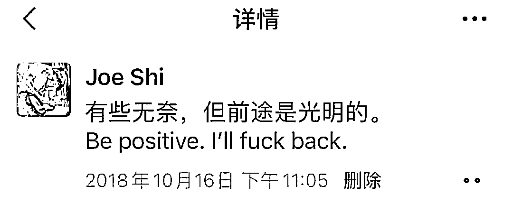

 

 

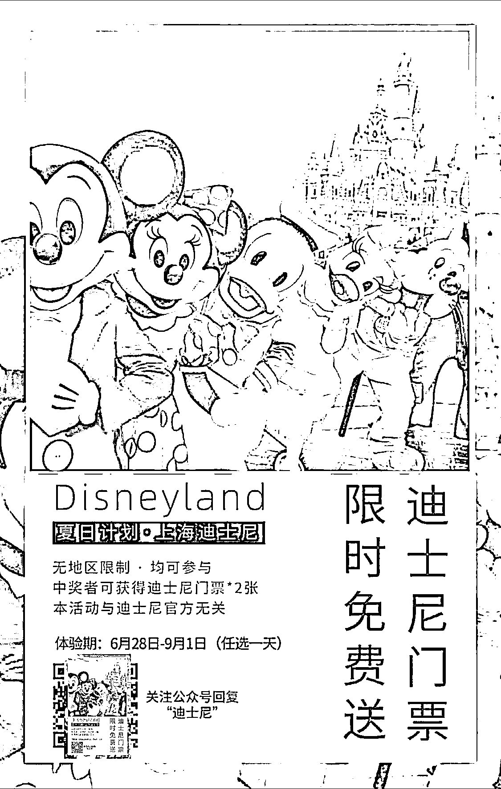

 

 

评论区：

Will : 很棒

lujy : 真棒

漆菲特 : 10天涨粉10万，牛[强][强]

北纬64度 : 厉害    

冰雨幻天 : 厉害 

三月 : 求大学社团转发朋友圈联系方式

Fly : 厉害，感谢分享[强]

芬哒哒 : 这个真的好帅啊

# **# ****(**精华帖**)(79**赞**)**动员** 80 **万宝妈，一起做童书

# 社群分销，**2 **年成为行业头部的打法经验分享

作者：  陈欢

日期：2022-11-28

宝妈一直都是商家最想争夺的人群，社群分销大家普遍感觉增长很猛但是比较重，比较复杂。

行业里很少有人出来讲社群分销，一来是这个打法太猛，头部的厉害的都在埋头挣钱，动不动就是百亿GMV（比如蜂享家）出来分享没有任何动力。

二来，小的那些，很多设计不正规，也不敢公开宣传。所以我自己在学习摸索的过程中，很少在外部发现相关内容的干货。

 

 

而且大家现在都关注短视频、直播这些流量风口，社群这块属于平稳发展，关注点不多。

生财圈友好，我是新人陈欢，书里有品联合创始人，14年商业顾问，《新零售进化论》作者。

书里有品属于童书社群分销平台，2020年4月上线，第一个月没有花一分钱投放，进来10万宝妈和老师做分销员。

目前是行业头部的童书分销平台，80万+的分销员（我们称为阅读推广人），200多家出版社入驻直发，1.5亿销售额，4轮融资（掌阅集团等图书产业上下游）。今年开始给蜂享家，万物心选，云货优选、喜马拉雅供货。

接下来我会毫无保留的把书里有品，0预算单月10万分销员，30人组织80万+宝妈卖书2年内成为行业头部的打法经验分享给大家，希望能有帮助和启发。

 

 

 

 

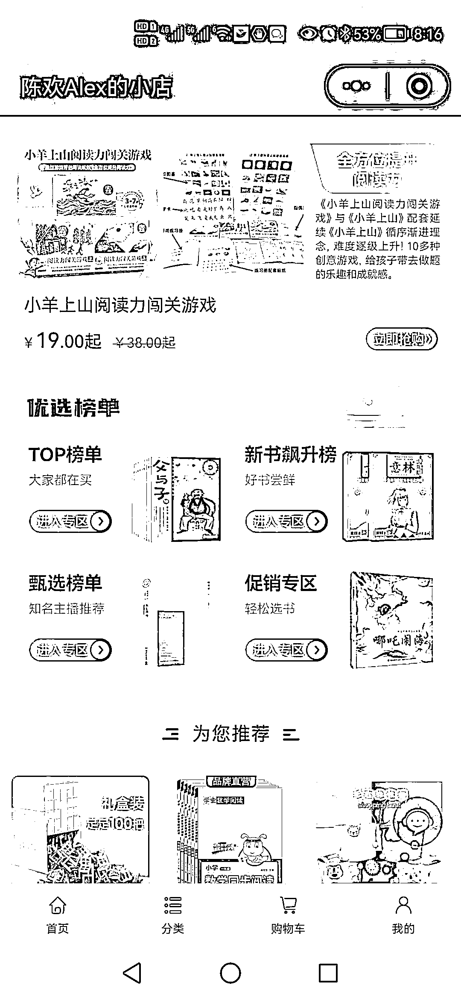

 

 

 

 

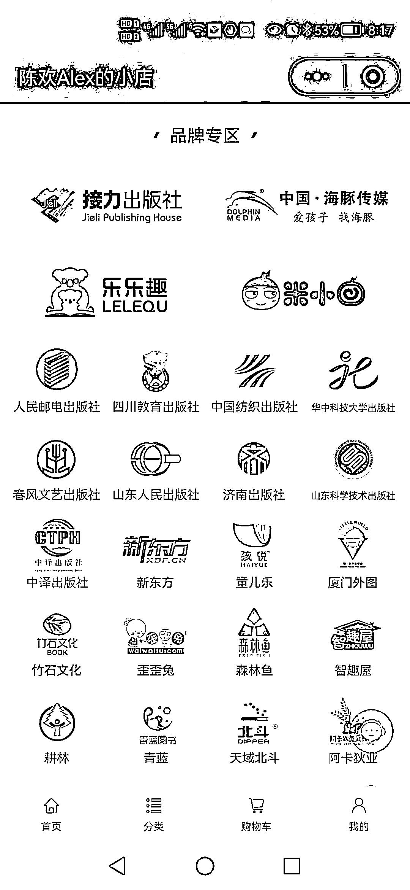

这块的内容可能对三类人有些许帮助，你可以对照下：

第一类人：做女性、宝妈生意的人，几乎是脱不开社群，那么，宝妈的业务如何设计和组织？

第二类人：有私域流量的人，你的生意如何嫁接社群分销杠杆快速放大？由自己卖变成大家卖。

第三类人：有优质货源的人，以什么样的姿势跟社群分销生态做生意，能快速起飞远超同行？

老实说，社群分销这块，我们也踩过很多大坑，交了几百上千万的“学费”，甚至差点全军覆没。

 

 

有些我之前看过的分享说得天花乱坠的内容，实际操作中完全没效果，甚至还埋了很多雷，但是听着逻辑上很顺。

我的内容有些和主流说法不同，请自己批判性甄别。仅为个人观点，不接受理论上的掰扯。

另外分享中的成绩仰仗合伙人靠谱，团队给力，我仅作为代表发言而已。

为了方便大家，这是全文的目录：

**1**、冷启动怎么做：**0 **预算一个月进来**10**万分销员，怎么做到的

**2**、社群分销如何设计：核心增长公式

**3**、去哪里找分销员和团长？

**4**、如何调动团长的积极性？

**5**、快速增长期如何把握关键？

**6**、你的业务如何嫁接社群分销？

*名词解释

 

 

分销员：以分销作为副业的用户；

团长：组织分销活动的团队负责人，分销员达到一定业绩升级成为团长。

# 一、冷启动怎么做：**0 **预算一个月进来

# **10**万分销员，怎么做到的

书里有品是 2020 年 4 月上线，正值疫情期间，当时公司只有 4 个全职员工，两位合伙人，一位有多年的图书行业经验和供应链资源，另外一位来自阿里多年有电商运营经验。

最开始找到一些性价比很好的图书货源，通过有赞平台自带的分销体系，4个员工发朋友圈，很快有几个专门做图书的群主也跟着发，1个月不到就进来10万分销员（那时人人都是分销员）。

这就是社群分销的特点。只要触达到了一两个核心节点，应该是将会引起指数级裂变。

当时疫情很多线下的绘本馆没有生意，老板正愁着如何养员工，突然发现可以在线上卖书，毫不犹豫地加入，带来了第一批优质用户。

 

 

通过复盘分析，10 万人里大部分都没有做过其他分销副业，属于儿童教育赛道内的意见领袖。比如南京有一位知名的作文老师，这个发了一条朋友圈后续带来了过万的用户。

回过头来复盘社群分销冷启动的关键：

# **# ****1.1 **社群分销最重要的不是运营，而是产品，

# 是供应链的强度和差异化

冷启动阶段一定要选择标品，大家奔着性价比进来，明显的优惠无需解释。

如果你选择的是需要教育客户的高客单产品，分销这把火很难点起来。我们选择的儿童图书这个赛道，有一定差异化，没有巨头。

试想一下，如果你卖的是百货、水果等产品，市面上已经有大量相关的平台，但是如果是这样子，大家只会购买，并不愿意加入成为推广员。

# **# ****1.2 **要做社交形象加分的产品，让用户发朋友

# 圈私聊没有压力

发圈动力=佣金/设计交压力。

 

 

社群分销主要依赖推广员发朋友圈、发社群和私聊。挖掘产品的社交货币价值。

发朋友圈介绍好书，展示出的是爱阅读爱学习爱教育的好妈妈形象，正向价值观，所以大家都疯狂发圈。

如果你的产品是服装、美妆、食品等品类，也可以尝试从健康生活方式的角度挖掘，而不是单纯发产品。

# **# ****1.3 **初始流量要求并不高，关键是找到核心人

# 群的传播节点

很多人以为社群分销需要有很高的私域流量积累。事实上。最关键的是找到那么几个意见领袖作为传播节点。

我们尝试过把同样的模式复制给其他有私域流量的社群，效果相差很大。

有一些社群人数多，但全都是普通消费者，只有购买转化，没有裂变传播。

而有一些社群虽然人不多，但能够筛选出意见领袖，裂变效果就很好。

 

 

# 二、社群分销如何设计：核心增长公式

# **# ****2.1 **收入增长**=**供应链强度**X**顶层设计**X**动员能

# 力

供应链强度：你的产品是否有优势。标准品=更低的价格。非标准品=发圈转化率（同样是发一条朋友圈，有多少人看完以后愿意购买）

顶层设计：如何确认关系绑定，商品销售的流程，佣金分配机制，分销员升级机制等。

动员能力：你对分销员团队的影响力。在群里发一条信息，有多少人会做动作。

我结合书里有品的案例，具体来拆解。

# **# ****2.2 **供应链强度

 

 

供应链强度没什么好说的。先有鸡先有蛋的问题。销售能力不强，没人愿意给低价，拿不到低价，无法吸引分销员。

怎么办呢？

我们的做法是通过集中力量卖爆品，向供应链证明实力。

前期假设一个月可以卖 100 万，如果分配在 100 个单品上，每个产品只能卖 1 万，供应商没啥反应。

但是如果你把其中 80 万的销量集中在 8 个产品，每个产品有 10 万的销量，虽然总销售额没有变化，但供应商马上愿意给更好的价格政策。大家都需要做爆品。

怎样找出爆品？

发掘爆品需要对行业  对用户的深度洞察。

如果是复杂品，需要讲故事。

比如课程、保健品、不够出名的美妆个护。这个故事一般不需要分销平台来讲。但你需要鉴别出，这个故事消费者是否买账。

举例来说，东奥会前夕，我们卖一套冬奥主题收藏邮票，这个故事就很应景，销量不错，押中了爆品。

 

 

如果是简单品，也是消费者一眼能看懂的超高性价比产品，比如15元对标市面49元的积木，根据心理价位和实际价格的价差，越大越爆。

另外我们会提供低价买样和免费送样的机会给大团长，看看反馈。

当然，更省事的做法是，从市面上已经爆过一次的产品中，第一时间谈回来  ，效果非常好。这种需要靠销量和平台实力才能拿得到好价格。

# **# ****2.3 **顶层设计

**1**）关系确认机制

关系是分销的基础。一般都设计为一旦绑定，永久绑定，且无法解绑，这样分销员才有动力去拓展客户。

绑定形式有两种：

一种是点击绑定，另一种是购买绑定。

建议选择购买绑定，更公平。目前技术上可以实现，用户最后一次点击的谁的链接下单之后就会绑定谁。不管隔多久再哪里下单，都会绑定。

为了防止滥用绑定机制，平台最便宜的产品也在 9 块 9 以上。避免推广员用超低价产品批量地去绑定客户。

 

 

**2**）商品销售机制

一件代发，每销售一件结算佣金，平台解决所有售后问题。

**3**）佣金分配机制

想要采用分销模式产品利润至少要在25%上。

国家法律规定不能超过三级分销。只有一级佣金和二级佣金。

一级佣金就是推广员直接销售的佣金。二级佣金是运营管理团队的佣金。一般来说一级佣金要比二级佣金高。另外还需要留一定的营销费用。

我们自己采用的比例大约是一级佣金：二级佣金：营销费用=5:3:2

对这种市面上其他社群分销平台，佣金比例大同小异，说明这个比例相对比较平衡兼顾。

底层设计逻辑：

一级佣金高，普通分销员卖货的意愿强，但是很难吸引到大的团长。

二级佣金高，团长很积极招商和拓展团队，但普通分销员带货的意愿不足。

也有一些平台把一级佣金设计得比较低，吸引分销员升级团长。具体看平台的发展。

 

 

一般来说，调高二级佣金，招商裂变更快。调高一级佣金，平台发展更稳健。

除了一级佣金、二级佣金以及平台本身的利润，还需要留一定的营销费用。用来推爆品。给予额外的激励。这些激励是一次性的，不与关系绑定，一般是奖品，积分等。

**4**）升级机制

什么情况下从消费者能够升级为分销员。

我们设计的机制是自购满 99 元升级，且不能自动升级，需要就是主动申请开通。

背后的逻辑是

1、满99元，提高新用户的ARPU值

2、主动申请开通，提高了推广员身份的门槛。来之不易的身份，更加珍惜。

**5**）提现完税

佣金是按月提现，平台需要帮忙完税。

小细节，不要从分销员到手的佣金里扣税，而要先扣税，再结算佣金。

分销员非常反感到手的钱还需要打折扣，哪怕只有1%，都会引发不快。

 

 

因此在计算佣金时，已经提前预留好税务成本。

**6**）开店礼包

平台为了方便推广员招商，会打包一系列产品，购买后可以自动升级为推广员。

开店礼包一定要谨慎。有一些平台为了提高利润率和招商动力，设置了价格虚高的开店礼包。

导致业务空心化，所有人都去卖开店礼包。结果，变成了卖空气币。平台很快崩塌。

**7**）其他很重要的机制

1\. 复杂的佣金机制建议不要碰，容易踩线，不好理解。如果激励不够，统统用营销活动来解决。

2\. 顶层设计要想清楚，定了以后中途千万不能改，会动摇推广员的信心。

# **# ****2.4 **动员能力

参考下图，下文具体展开

(模式参考图，实际操作需定制）

 

 

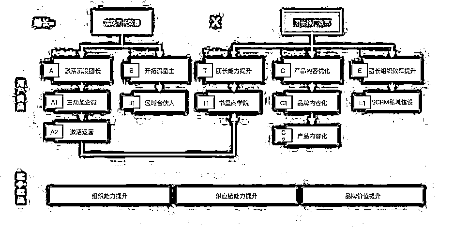

# 三、去哪里找分销员和团长？

# **# ****3.1 **总体思路

流量池本身一个一个的私域小水洼，分销要做的事情是把水洼串联起来，百川汇海。

不要妄想从头培养团长。我们试过效率实在太低了。

 

 

我们尝试过各种培训方式，最终发现没有做过社群分销的普通推广员成长为优质团长的比例太低。大部分优秀的团长都有两年以上的社群运营分销的经验。

做好团长的画像。比如我们书里有品团长的画像是无外乎就是读书教育类的群主，教培机构的老师，做过其他消费品社群团社区群分销业务的团长。

一般大团长都会活跃在各个学习社群。通过合伙人下场找人，多做分享，很容易找到。

团长都在一个社交圈里，彼此渗透。一起物色好项目。只要产品有优势和顶层设计合理，几个团长能铺开整条业务线。

去年我们有一条产品线前期就私聊了4个团长，一个月裂变了几千人，卖了大几百万。

# **# ****3.2 **如何吸引优质团长？

**1**）躺赚机制

鼓励普通分销员找大团长。团长完成制定销售业绩后，给予一次性奖励。分销员只需要拉群联络，平台提供专人讲解转化。

**2**）平移机制

有资源的团队长，满足一定条件，直接提交团队信息，平台后台配置好，直接整个团队平移过来。

 

 

# **# ****3.3 **如何说服团长加入？

把握团长最关心的问题

①产品是否正规，比如我们的书是不是正版；

②产品有没有优势，比如我们的书价格是否有优势；

③挣不挣钱，需要告知和她类似团队规模的团长，目前的收入情况；

④麻不麻烦，所有团长都想躺赚。需要告知有专门的素材提供，有新人培训，售后客服不用管；

⑤和自己的主业是否冲突。鼓励团长会把图书作为引流品，增值业务。如果你的产品可以成为所有其他平台团长的辅助产品线，推广效率非常高。

# 四、如何调动团长的积极性？

 

 

这点上，我们走了弯路。

我们以为

1）需要给团长大力赋能，减小他们运营社群的难度。

2）需要通过培训提高团队凝聚力，设计丰富的活动提供附加价值。（因为书的佣金对比其他赛道佣金不算太高，希望通过额外的附加价值留住用户）

所以我们从2020-2021年，一、扩充社群运营团队。二、做了大量阅读专业类的培训。

结果增长在放缓，数据下滑。

复盘

**1. **不要**“**赋能**”**太过。团长运营只需要管头部的就可以了。

团长有矛盾的心理，一方面出于保护资源不希望平台企业微信加人，另一方面自己忙不过来，希望平台进入社群帮忙运营。

后来拉了大大小小的团长群，团队群，找了很多社群运营岗，运营压力很大，但收效甚微。

 

 

**2. **团长的注意力是有限的，所有消耗团长注意力的活动不要组织。

很多活动初衷是提供附加价值，提高认同感。最后大家注意力都分散了，把握不好容易带货组织变成学习组织。

我们组织的读书会，反馈很好，但是精力占用过多。

后来吸取教训，改为每周五组织直播连线作者，既可以推广新书，又可以方便推广员发展新用户，还节约时间。

**3. **扛住团长的压力，不要增加盲目**SKU**。

团长经常抱怨说产品不够丰富，其实是产品不够挣钱。我们听到最多的抱怨就是，“有些书没有，所以招不来客户。” 于是平台上架了更多的书。结果书越多，销售越差。

平台主要靠爆品挣钱，严格服从二八定律，20%的产品贡献80%的利润。产品多了，优势不明显，大家各自为政。没发形成声浪。转化效果差。因为挣不到钱，错误归因成书不够多。

后来调整成  爆品+长尾模式。由每天推4-5个品，改为一个爆品推几天。转化率大大提高。一个品能带来过百万的销售额。

团长一天躺赚1千多。动力满满，愿意跟着平台干。

 

 

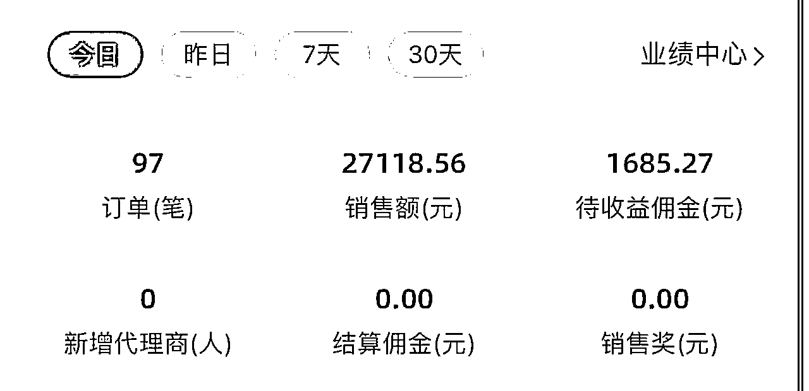

# 五、快速增长期如何把握关键？

如果供应链给力，顶层设计合理，分销业务会进入快速增长期。

需要重点关注。

**1. **动力是没有办法通过培训提升的。

打鸡血效果长期来看没效果。真正有效果的扶持致富典型。让一部分团长先富起来。

基础的新人培训需要提供。制作知识库，定期开展培训。

 

 

再往上走，培训的效果不大。经常沟通更重要。在沟通中介绍先进典型，分享方法，提供各个团队的战斗力。

真正对团长激励最大的，是爆品带来的佣金反馈。

**2. **只抓大团长。

核心大团长拉群放在一起，老板亲自带着推爆品，晒收入，效果最好。

 

 

 

 

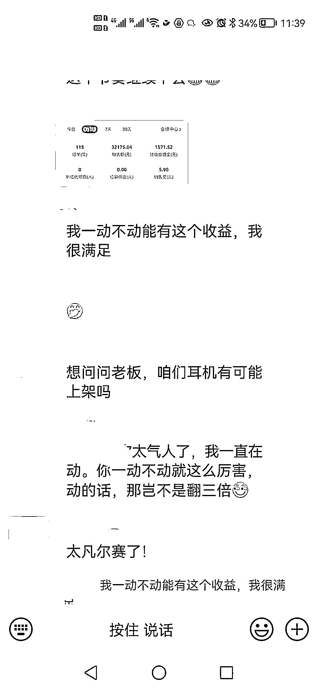

为什么不花精力管理分销员呢？

很多人都疑惑，平台应该要多花时间推动分销员成长成为团长。是的，我们也是这样想。

但经过一两年的试错之后，我们发现，平台放花很多精力管理运营普通分销员，其他他们成为团长，效果不佳，原因如下：

1）团长最清楚团队里谁有潜力。团长有动力，自然能带好核心骨干成长。

2）平台花精力亲自下场做分销员的成长活动，大团长就躺平，适得其反。

3）投产比不高。平台花精力建立好中台和激励机制，多和大团长互动，四两拨千斤。

 

 

**3. **机构也需要分销，机构流量是隐藏的蓝海市场。

偶然一个机会，有一个千万级用户体量的大公众号，但是找过来希望通过图书引流，然后在帮他把公众号上的用户加到企业微信上。

最终用来销售他们自己的课程。双方一起设计引流方案，跑通运营 SOP ，最后公众号，每个月能走一百多万的货。

如果你的产品也能通过分销起到引流的作用，公众号是很好的流量池。

后来，我们的思路打得更开了，直接把供应链提供给其他分销平台，挣供应链服务的钱。

当你通过分销把市场打开了之后，供应链才是核心竞争力。

目前已经在和蜂享家，万物心选，云货优选等百亿体量的社交电商平台合作。供应链的收入快赶上超过分销业务的收入了。

# 六、你的业务如何嫁接社群分销？

 

 

如果你的客户是宝妈，也想采用分销模式，

一定要把分销设计成副业身份，而不是行为。需要有一个完整的概念。

比如我们说的是开一个线上书店。而不是说卖某本书能挣多少钱。只有变成副业身份，才能大规模招商，偶尔为之的行为没发形成自组织的。

尽量把产品设计百搭副业，在做其他副业的团长都可以增加你产品作为补充产品线。

比如，很多主做其他产品分销（比如课程、美妆个护）的团长，喜欢拿我们的图书做补充产品线。引流+活跃社群。

如果你本身有很好的私域流量基础，

先做好产品规划和顶层设计，

然后通过推文或者是直播，发布团长招募信息，有分销经验的团长筛选出来。

发动团长对外招商，介绍其他团长，拓展团队，自然流量进来的小团长交给有经验的大团长管，作为额外的福利。

你不需要投入太多的人力物力，但是就可以把原来中心化的流量转化为网格化的流量。

 

 

如果你是供应商，有优质的货源，

在理解以上分销基础知识的基础上，积极接触大团长，通过他们找到平台，选择利润率在 25% 以上，销量转化没问题的少量爆品给与平台合作。（最近我们刚刚把一款学习机在两天内卖了100万）

 

 

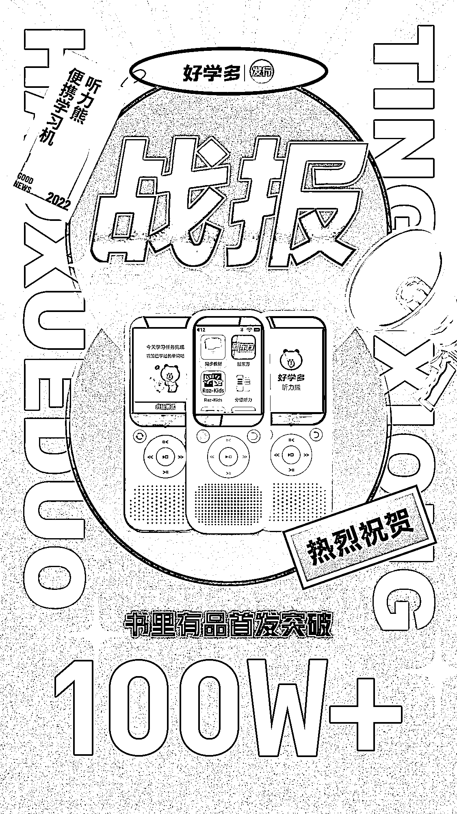

 

 

另外还有一个小诀窍，十分好用。

分销平台的团长大多是女性，品牌方创始人或者老板娘亲自下场，自己成为团长，和其他的团长打成一片，搞好关系。这样，团长甚至会主动要求平台上架你的产品。

不知不觉写了6000字，还有一些细节没法展开，补充一张用户体验流程图+核心指标。

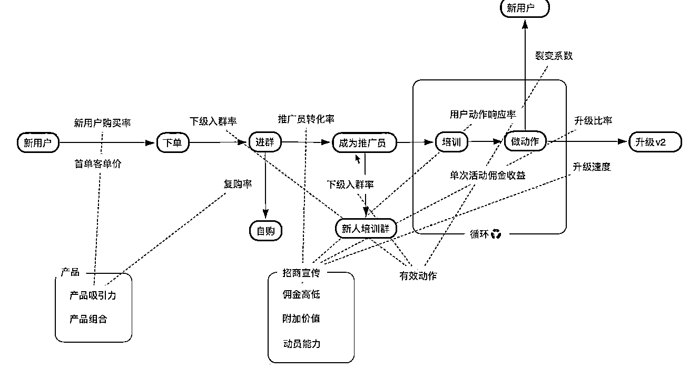

第一次在生财发文，感谢大家的点赞鼓励，希望这篇文章对你有启发。

评论区：

 

 

付小鱼 : 怎么做图书分销?

陈欢 : 私信

生财纪检委 : 高质量

争游 : 悦拜app看看有没有合作机会，麻烦加我vx 6242122

陈欢 : 好的

阿Lin : 有收获，谢谢分享

亦仁 : 感谢分享，已加精华。

欧爸 : 怎么联系，私聊你也不回

# **# ****(**精华帖**)(29**赞**)**训练营**3**天裂变**1000**人的小分

# 享

作者：  莲子丨Jeen

日期：2020-09-11

《训练营3天裂变1000人的小分享》

来星球5个月了，一篇帖子也没敢发，天天看大佬们的案例和经验分享，受益匪浅。

[爱心]本篇文章带来的分享是关于我操盘的一个线上项目裂变成交的拆解，比较适用于有一定基础用户的伙伴们～

项目背景：黑天鹅事件

项目第一次裂变时长：6天

项目名称：就暂且称之为女神XX计划吧~

一、种子用户

1、核心高价值学员：约70余人，预计40人参加裂变

2、外部：招募约40人，实际参与分销计划约15人

3、公司员工：实际参与约5人

（外部分销社群启动时间若提前，诱饵部分增加，这部分实际产生数据会增加不少） 

 

二：宣传触达

1、预热直播（XX秀直播，一个新兴的成都直播平台，原有流量较小）

2、朋友圈

3、公众号

4、原有社群

直播平台：

因为第一次签约此平台，如果当时是小鹅通或者其他原有渠道去做第一次直播引流，效果应该会更好，宣传触达部分，可以考虑更多的渠道、合作方等。

朋友圈：

（朋友圈话术、私聊话术及方案准备）

公众号：

软文推送

原有社群：

海报+文案推送，小分享+活动群发售

PS：分销途中，一定记住多次刺激用户去产生裂变

（晒单、现金奖励、荣誉激励、后端其他激励等）；

并寻找更多有能量的人来推动课程

（你去推动一个有影响力的人走得更高，比你推动一个什么都不会的人轻松10倍）在后续的一些其他案例中，有做类似的激励，譬如有一个案例是“520”启动发售的，承诺了520的现金奖励、会员卡、签名书籍和价值不菲的个人咨询，整个裂变启动的种子用户不多的情况下，依靠推手们，都取得了一个新品牌线上的首次成功。

靠近更有影响力的人，你赋予他们价值，他们赋予你价值，彼此共同认可，携手前行!三、二次裂变

课程内设置变现测试，一期学员二次裂变完成（设置学员学-练-评-赛  闭环学习模式）其中优秀学员，邀请分享，再次提升学员积极性

依据我目前操盘的案例综合来看：

二次裂变的循环体系让整个训练营的名声扩散更快，更容易获得用户的认可，因为：用户在完成作业的同时，受到大众的认可，获得的荣誉让她愿意去为这个品类做更多的自传播，学员自身的影响力也不断提升。

 

 

【关键是奖章上面有她名字有她头像的尊享感】

想要别人去分享，那就给她价值认可！

四、阶梯式方案

1、定价：29.9-499；2、追销，追销999女神大学，补差价即可获得，转化达到33%，当时我负责的全部转化的999学员~转化这么高的原因在于：

设计好每一个环节，一定是一环扣一环，我们在设计这个活动之前，在进行新年七天乐的打卡免费活动

当然还存在很多灵活应变的地方，当时考虑到要推动此项目，在新年七天乐打卡完成的时候，第八天结营活动做了第一次测试发售。

第一环是免费7天打卡活动，

第二环是第八天结营活动（让学员参加分享），当天晚上参加了七天感悟分享的学员，全部成交了引流课程。

第三环是推出重磅产品（引流产品，第一波抢到的超值，赠送喜马拉雅等大优惠）。

第四环是告诉大家，我们3天营，实际上有5天课程，并且每一环节可以拆解自己线上线下绝对落地可用。

第五环（重点）：课程跟踪。

从开营的仪式感到结营的仪式感（优秀学员点评、分享），我们的全程导师、班主任一对一点评陪伴（完成我们的学练评赛模式）

课程期间，需要玩得好，学得好，还能赚钱  赢取大奖品每一次复盘拆解的学员，还能直接现金红包奖励6.6-66-100元，或者其他超值大奖品（周大福小金猪等）引导学员在复盘的时候，写上我们的平台名字、创始人名字。他们做脑图、写简书、发圈等等

第六环，转化

课程最后一天+结营当天，转化课程XXX（原价几乎半价）（同时赠送699其他产品）仅限疫情期间

第七环，追销，买了转化产品，补XXX元，可以直接升白金会员（享受前所未有的6大福利，合计价值接近4000元）

 

 

这是引流营涉及到的简单环节，而在后续过程中，针对我们参与后端产品的学员，进行三次裂变，其中一个在昨天通过成交分享，在她33人的小群内，转化了26人  （更多的环节不在此赘述，包含后续第八环，第九环等）

其中也包含后续的每期复盘及线上线下会议沟通

SOP，让社群运营更简单

但是：好的运营团队，是社群成功的基石

（没有好团队的配合和训练营的持续提升迭代，再完美的SOP也是一句空话）【用户沉淀逻辑】

环节到此结束，接下来简单分享一下在此期间我采取的用户沉淀办法：

用户沉淀：3~4次较佳，至少3次，目前测试~

客服第一层触达、筛选：客服第一层接触到学员，专业倒计时提醒、拉群、专业系统答疑等

班主任第二层沉淀（你们可以考虑其他）我要求每位班主任在拉班级群的当天添加每一位学员，简单自我介绍、沟通及带领班级做预热活动、入营提醒等，班主任是绝对的温暖陪伴，就像老母亲一样

导师第三层沉淀：专业点评、答疑，给你温暖之后，我们还给你专业干货，并且，刺激点在加餐和其他奖励（并未提前告知的）

第四层沉淀：

大咖链接（营长、专业大咖等）可能是翻到作业发现你，群内艾特你点评后也可能是，刺激添加打招呼办法~

学员的感受是：原来大神也可以这么亲切，哇塞，绝对宠爱感（学员添加XXX就会很开心，我们偶尔会做这块引导）

这样子，训练营期间，保证只要是有可能的学员都会100%收到我们的信息，全方位包围结营后，未转化的学员，也还是会持续看到我们的信息，被我们完整包围，铺天盖地看到信息，就很有可能再次激起兴趣（其中好几个学员都是在结营后1-7天内才付款转化的）

客服让你没顾虑，班主任晚上贴心问候，导师贴心答疑，大咖社群跑爆点

其中很重要的一点是，老客户很有可能比你的新客户（泛客户）重要100倍，甚至1000倍~

 

 

买了你1次单突破了信任高山的那个人，很容易再跟着你继续走下去。

付过一次费，再付费就变得相对容易，前提是：你要把付款当做服务的开始，而不是销售的结束！

感谢每一个你打开这篇文章，希望以后，我们还能继续相遇。

营销可以更简单，我是莲子，希望以后大家有更多的链接

案例分享

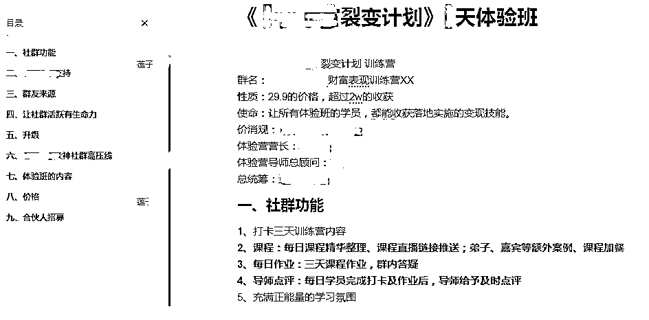 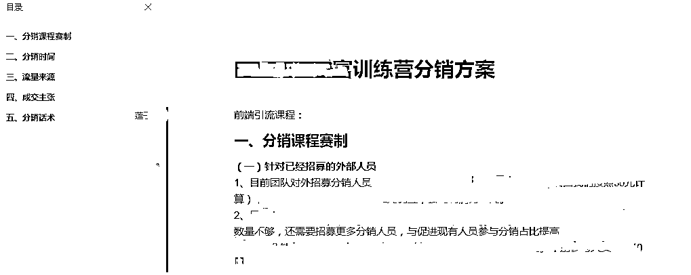

 

 

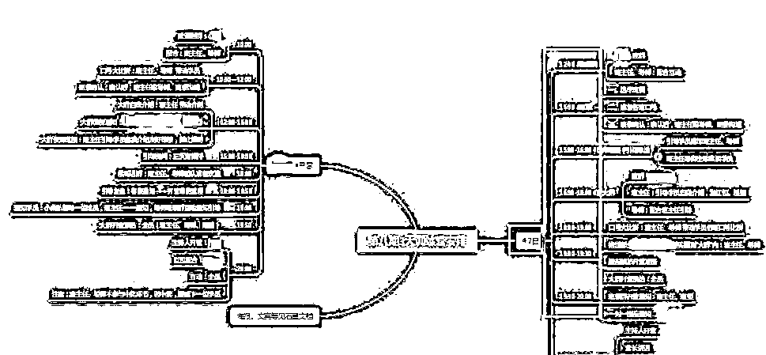 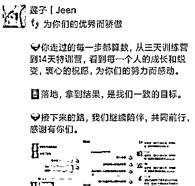

 

 

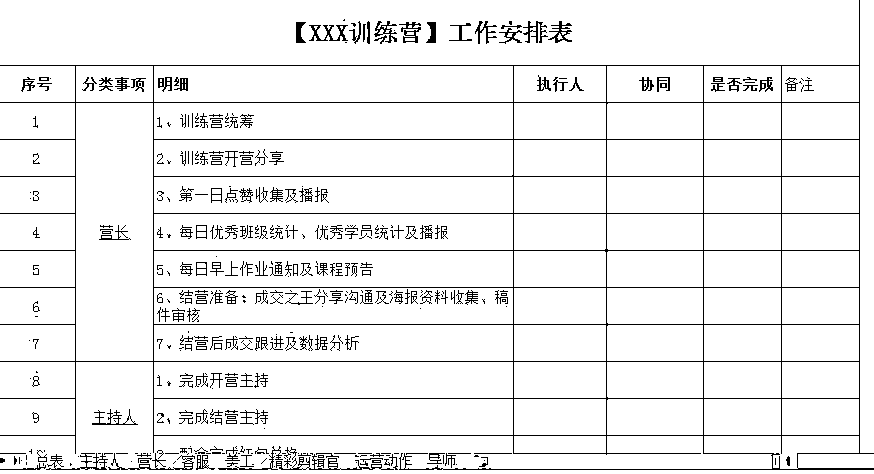 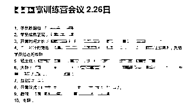 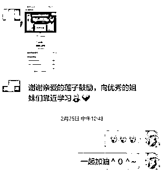

 

 

评论区：

Easy : 你要把付款当做服务的开始，而不是销售的结束！

莲子丨Jeen : 嗯٩(•̤̀ᵕ•̤́๑)ᵒᵏ

是哒

亦仁 : 加精华了。联系方式是什么

莲子丨Jeen : eugenia1103 感谢亦仁老大，我以为看错了🙊  亦仁 : 加下我 446888513

莲子丨Jeen : 我加你了  老大

+龙 : 优秀，学习了

微微妈妈在大厂 : 真是太害怕这样的加群方式了，已经被这样的方式洗脑了好几次，现在回想起来，氛围太猛了

# 【私域转化】**1**篇

# **# ****(**精华帖**)(82**赞**)2**人运营团队，在**30+**群同时开

# 营的情况下，如何完成**40%**以上的转化率？

作者：  旺小哥

日期：2020-07-06

社群  社群搭建  训练营 # 轻享

【2人运营团队，30+群同时开营，带动粉丝40%以上转化率】

生财圈友们好，前天在广州跟几个朋友聚会聊tiktok，闲聊时候聊到社群运营，我讲了讲我对社群搭建的一点理解，讲完后，大家鼓励我写一写分享出来，于是，我来了 

 

最近咱生财也正好在搞训练营，生财的一些朋友也在将训练营的玩法套用在自己的项目中，今天我分享的内容，也可以理解为是一个训练营的拆解，不过是30多个群同时启动，一起进行的长期可循环的训练营

有部分企业，积攒了一些粉丝，也尝试运营过社群，发现运营社群太累了，自己两三个员工似乎根本不够用，更重要的是这么累，却好像没有什么实质的结果，于是说做社群没用，将粉丝搁置着，这样的情况，应该怎么办？

我一直以来的思考方式是：让粉丝参与管理社群，设置奖励机制，进阶机制，让粉丝来为了自己，同时也为了自己的小群来参与进社群的运营中来，而总部只需要管理好头部的粉丝即可

我一贯的写作风格，就是结合具体案例来讲背后的逻辑和理念，今天聊聊我之前给一个企业搭建的社群体系，线上运营人员只有2人，却充分带动了上万粉丝，实现了持续转化率40%的成绩

这个搭建思路未必适用于所有的行业，不过当中的思维，逻辑，是可以或多或少给到正在考虑或者正在结合社群做事情的圈友，请阅：

1 调研分析

2 策划思路

3 后续改进

4 避坑感悟

5 要点总结

【调研分析】

这是一家卖编织线材的企业，粉丝是喜欢动手编织的年轻女性，通过包裹卡片吸引了几万的对手工编织感兴趣的粉丝，一年前拉过10个满500人的粉丝群保持着日常维护，也眼睁睁看着这些群逐渐变得不再活跃，开始出现广告......

【策划思路】

在这样的情况下，应该怎样思考整个体系？

a 价值观层面：

粉丝都有着相同的兴趣爱好，我们有没有办法围绕兴趣爱好给大家营造一个有目标的感觉，让大家有比日常消遣层面更高的追求？有，把爱好发展成事业！

 

 

于是，"将编织爱好发展成事业" ，成了我们经常要在群里强调的一句话，大多数爱好编织的仙女们也只是喜欢而已，如果能将它发展成事业，每天做着自己喜欢的事还有钱赚，想想就非常美好！

然而，在这个过程中还有很长一段路需要走，不管是技能层面，还是管理层面，都还需要很大的提升，而我们这个平台，可作为大家实现更高追求过程中的必经之路！

b 团队层面：

粉丝上万，但可以调出来做社群运营的同事只有两个人，而且还是从其他岗位临时调过来兼职做，要让这两个同事带起来上万人几乎不可能，怎样调整？

设置进阶制度，让粉丝参与管理，根据之前的活跃度和消费金额筛选出30位社长，经过一对一沟通后，让30位社长想出自己的社团名称，介绍，和口号，官方协助每位社长组建自己的社团

给予权限，在预热并发出官方通告之后，让社长们在已经不活跃的大群通过介绍自己，展示自己作品的方式激活并招募自己社团的30个基础粉丝，后期培训外部引流方式，让社长去抖音，豆瓣等外部平台引流继续扩大自己的社团

【图一：30个群同时创建】

通过群接龙的方式限定时间，保证高效率，48小时内做完以上动作后，社长开始启动社团，在各个社团欢迎新成员，介绍自己的社团，向社团成员讲出自己的社团理念和介绍社团之后的活动计划

【图二：社团启动】

c 社群活动层面：

活动分为大活动，小活动和福利活动，每个社团社长组织社员在同一时间段内根据官方发布的活动规则制作相应的作品并打卡做记录，活动结束时，统计打卡记录，根据大家的完成情况给每个社团计分，分数最高的三个社团可获得诱人的奖励，其他社团获得下次购买线材的优惠折扣

每个活动时间为7天（小活动和冲分活动）或者15天~25天（大活动）两次活动之间的空闲时间为3~7天供大家放松，互相打气，为下一次活动摩拳擦掌

 

 

除了团做活动之外，我们还需要帮助社员将她们做好的作品销售出去，让大家短期内能看到钱，才会有持续的参与动力，于是我们在社群举行了拍卖活动，让少部分人先看到钱，带动更多社员踊跃参与

【图三：拍卖活动进行中】

d 转化层面：

参加活动不需要付费，但有一个硬性要求，就是必须用官方的线材，并且在打卡的时候要出示自己所用的线材，确定是官方品牌的线材，即可参与打卡，不然将会被请出社团【图4】社群团购火热报名

活动转化：正因如此，每次参与活动，必将有一波购线热潮，在活动正式开始的前两天，发起阶梯式团购活动，购买人数越多，单价越优惠，在第一团购活动开始时，社团总人数：732人，社团总成交298人，线团数成交1325卷，转化率：40.7%，平均每人消费124.5元

日常转化：如果团购期间准备的材料不足，则可以用95折的社团成员专属优惠在店铺购买（这个优惠在大群享受不到，只有社团成员可以享受）

原先一周内日常优惠券使用次数20张左右，社团计划启动后，当人数800人左右时，总优惠券一周内领取199份，使用131张，使用率：65.83%。累计支付数：797对比可知，小群训练营对产品转化效果显著

e 进阶层面：

怎样让社长能有一直有动力做事？如何让社员也有奔头努力参与活动？除了梦想外，还要有实质性的可累积的刺激，这里，我们用到积分统计：

对小群的社员来说，连续三次不参与社团活动，将会被毫不留情地移出社团，每次参与社团活动，会根据活动规则获得不同的分数，个人累计活动29分，可申请成为社长，另起小组，自己独立门户做社长

对社长来说，小组总分数达到299分之前，不能获得社团的分成收益（也可以看成是社长的试用期），社团总分数累计达到299之后，可拥有10%的社团销售分成不定时会有一次冲分活动，在冲分活动中，官方会放松分数的获取难度，冲分活动短暂而有效，如果有社长分数长时间起不来，可在冲分福利活动中快速涨分，实现分成梦 

 

f 日常层面：

最开始提到大群，我们将大群的活跃粉丝引导入了社团，大群就不管了么？当然不是，自从小群社团计划启动之后，大群活跃度一路上涨，因为社团组长前期要去大群冒泡，活跃，来为自己社团扩增，社员也会帮社长去大群展示自己社团的强大，优秀，如此一来，大群已被自然激活

【图5：社长激活大群招兵买马】

官方日常在大群发布早晚知识点，也会得到社团成员的响应和参与，而官方也仍然是两个运营人员，没有因为工作量增大而招聘新同事，乐哉，乐哉！

【后续改进】

a 奖励改进：

开始时，我们会从所有人中，找出最优秀的社员和组长颁发16枚奖章（最佳社长奖，最佳作品奖，勤劳付出奖）+3个证书+其他奖励，后来发现有部分社员在小组很努力，但是放在整个体系中，也并不是很突出，几次活动都没拿到奖，有点泄气

于是，在第二个阶段，我们给每个社团的社长一个选择奖章获得者的名额，他可以从自己的小组里选择一个人来颁发奖章（优秀社员章）这样又激发了这部分成员的努力劲头b 排名优化：

前面几次活动排名我们采取公开排名和分数，排名靠前的社团美滋滋拿奖，排名在中间的社团暗暗为自己加油，排名靠后的社团成员对自己社团有些失望，劲头也不是很足，这样很危险

于是我们后面采取了不公开分数的排名，每次只公开前三名优秀社团的名字，将其他社团归为潜力社团，不公开具体排名和分数，他们都有机会成为优秀社团！

c 分成收益：

在整个体系稳定进行了3个月之后，迎来了一次转折，也正是因为这个，使得我们没能敢持续按原计划快速扩散而采取了相对稳定的运营方式，有的社长翅膀硬了想自己飞，有的社长因为赚的少有些灰心（这个也是在做类似训练营中似乎不可避免的现象，有的成员做得好，考虑自己单干，有的成员始终见效慢而逐渐失去动力）

对于想自己飞的社长，我们约定给到一次性批发价75折优惠，自己现有社团自己拿走运营，其他资源一律不能有冲突性占有的动作

 

 

对于因为能力不足而有些灰心的社长，我们允许她与其他社团合并，分成自己协商，活动仍然紧跟着官方的步伐持续稳定运营

【感悟】

这个体系是去年9月份创建的，截止现在已有10个月，整体仍然在稳定运转中，官方只管理核心社长，社长跟随官方的脚步做着自己社团的活动，团购分成；

与最初不同的是，社长们都已经全部有了分成权限并且都赚到了钱，社长们也都已经开始用官方教授的方法从抖音，豆瓣等外部平台引流为自己的社团做扩增

挺好！

【几个关键点】

1 如果有大群不活跃了，可以考虑不解散，只要能想办法让当中的小部分人活跃起来，大群就能被重新激活，上面案例中，大群已沉寂了一年多，后面靠社长们的积极带动，重新循环了起来

2 一个人是群里的1/30 和  这个人是群里的1/500 感觉是完全不同的，当群里人数越少，粉丝越能感受到自己的重要性，而在500人大群，自己似乎可有可无，所以，如果大家的项目是可以设计活动让粉丝拥有参与感的时候，可以考虑创建小群

3 在需要相互pk的训练营或者活动中，奖励机制要认真设计，不仅要考虑到团队，还要考虑到团队中的个人，比如上面提到的要给小群群主指定群内获奖者的改动

4 仪式感很重要，在活动启动时候，我们给到每一个群主的需要在群里发送的每一句话，需要做的每一个动作都要推敲一下，就好像一年级小朋友刚刚开学做到教室里，新老师要在进入办公室后做自我介绍，引导大家互相认识，发发福利，讲讲规划，鼓鼓士气等

在活动中，给每个优秀粉丝设计海报，颁发实实在在的大徽章和邮寄证书，让大家感受到荣誉，归属感，也会对这个组织更加在意

5 自己运营能力不足时，多多放权给粉丝，让粉丝一起来管理，除了塑造梦想外，还要有短期内的即时奖励和回馈，上边提到的不定时拍卖活动，就是帮助一起做事的粉丝在没有分成之前，先赚到一笔钱，开心了，也就有了动力继续跟进

6 管理多个群主时，要定时邀请优秀群主分享心得感悟和技巧，相信这肯定是最接地气最有带动性的分享

 

 

【图6：优秀社长分享，真诚满满】

我是旺小哥，一年来一直在帮各个企业做社群策划和指导，圈友们在社群的搭建和运营技巧上有任何疑问随时来交流探讨，微信  ：awangev8 , 备注“生财有术”知无不言，言无不尽

如果感觉写的不错要转载的话，希望能跟我提前说一下，感谢

社群相关帖子回顾：

社群服务是个很好的创业机会么？我用一年的实操经历为您解答 →

服装社群详细方案展示说明，碰到这种社群应该怎么分析（附带话术方案） →30+个小众平台引流指南，热门平台挤不进去，冷门平台了解一下 →

一场微信群活动，单个群变现47万，3500字大白话全拆解 →

从0开始还可以做群裂变么？可以，但是要做到接地气儿 →

 

 

会销企业线下会销洗脑转化，如何用社群助力裂变成交？ →

https://t.zsxq.com/mMNRbMj https://t.zsxq.com/rjIeYb6 https://t.zsxq.com/7uVVjYJ https://t.zsxq.com/YBQ7Mnu https://t.zsxq.com/VfmYJuZ https://t.zsxq.com/N7eme6e

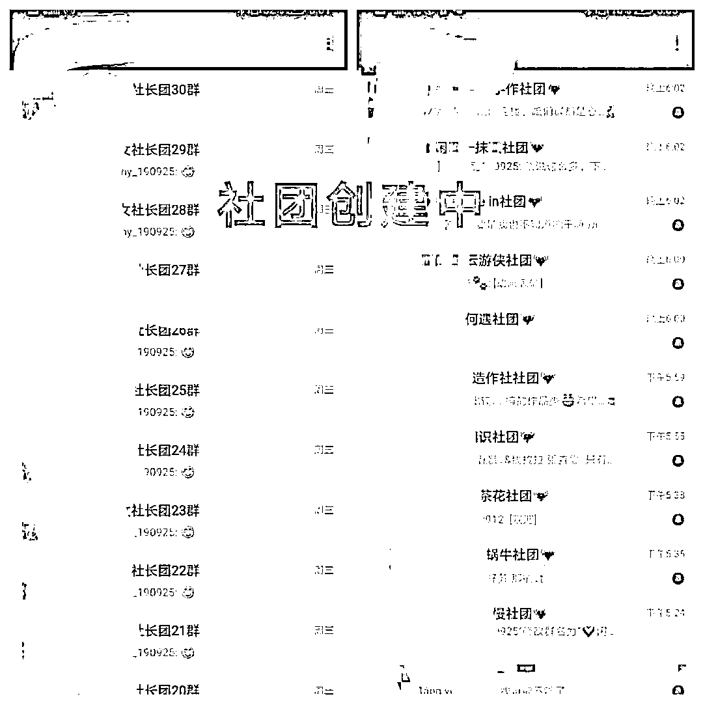

 

 

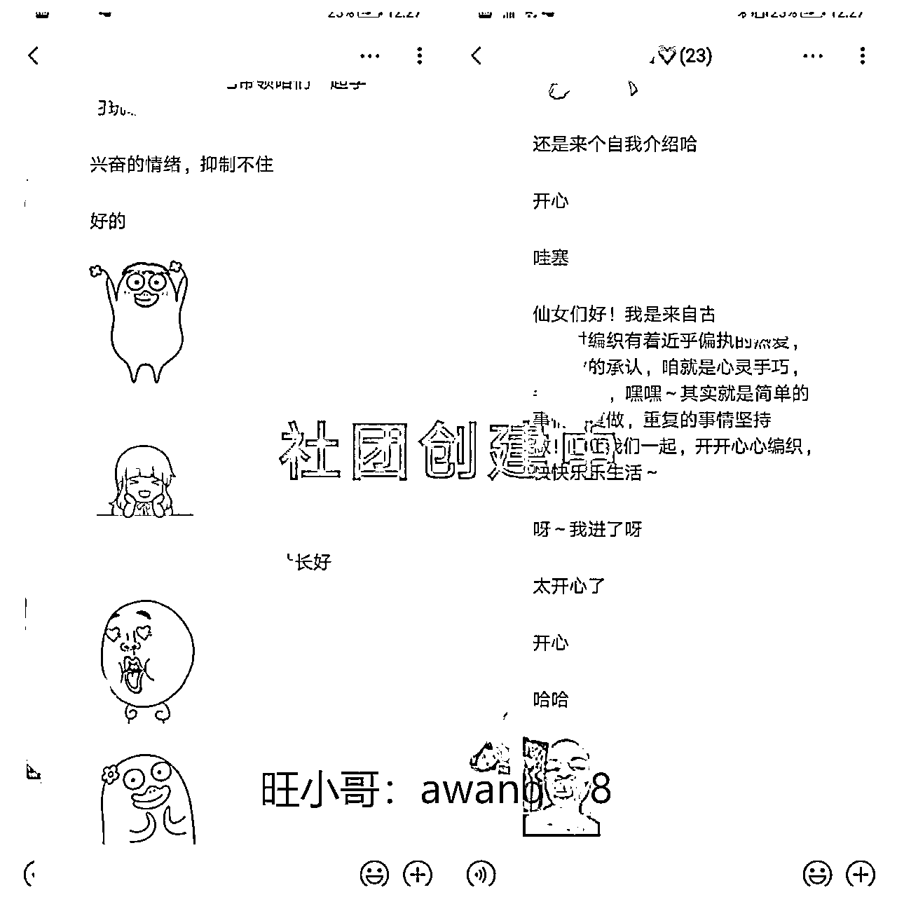

 

 

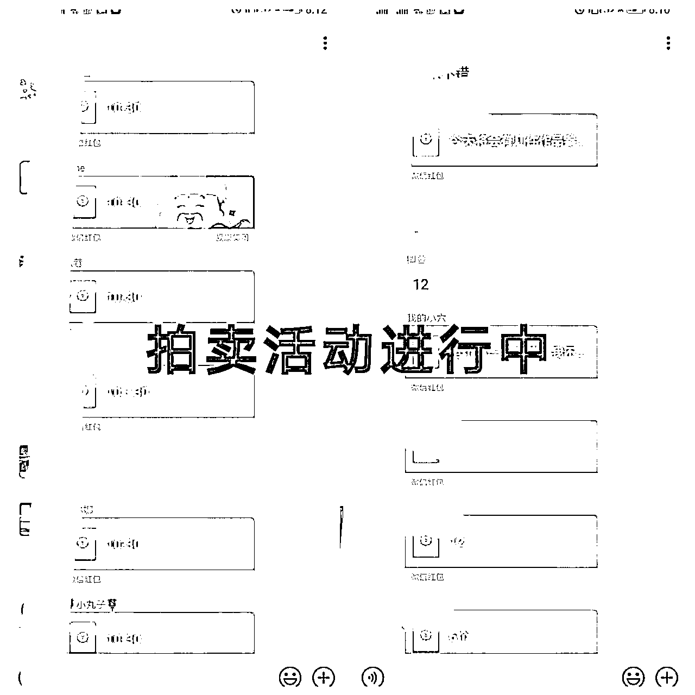

 

 

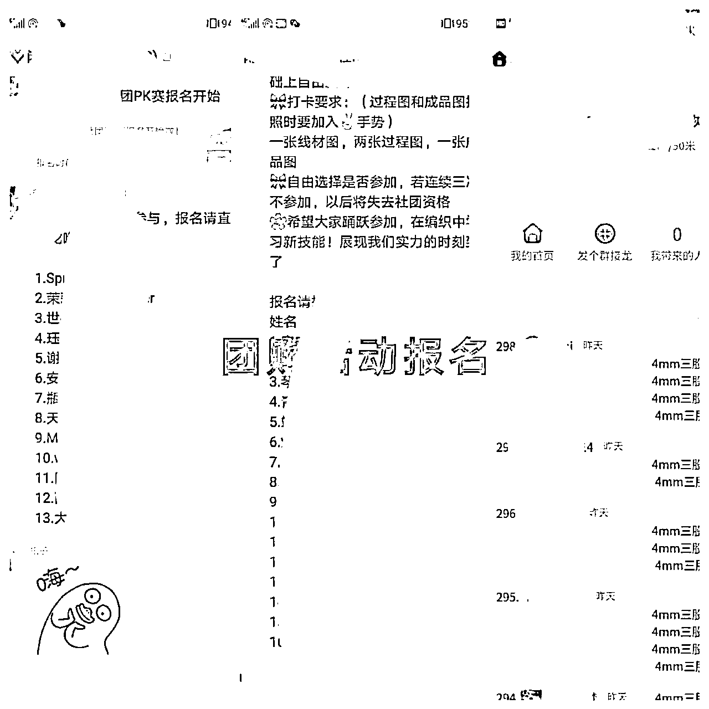

 

 

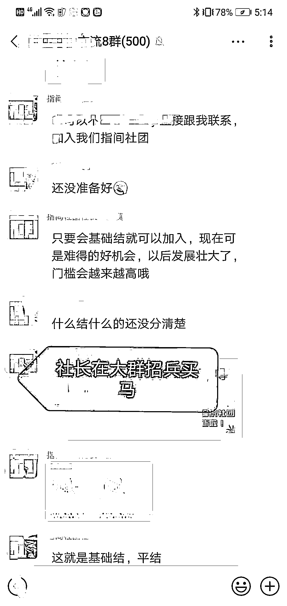

 

 

 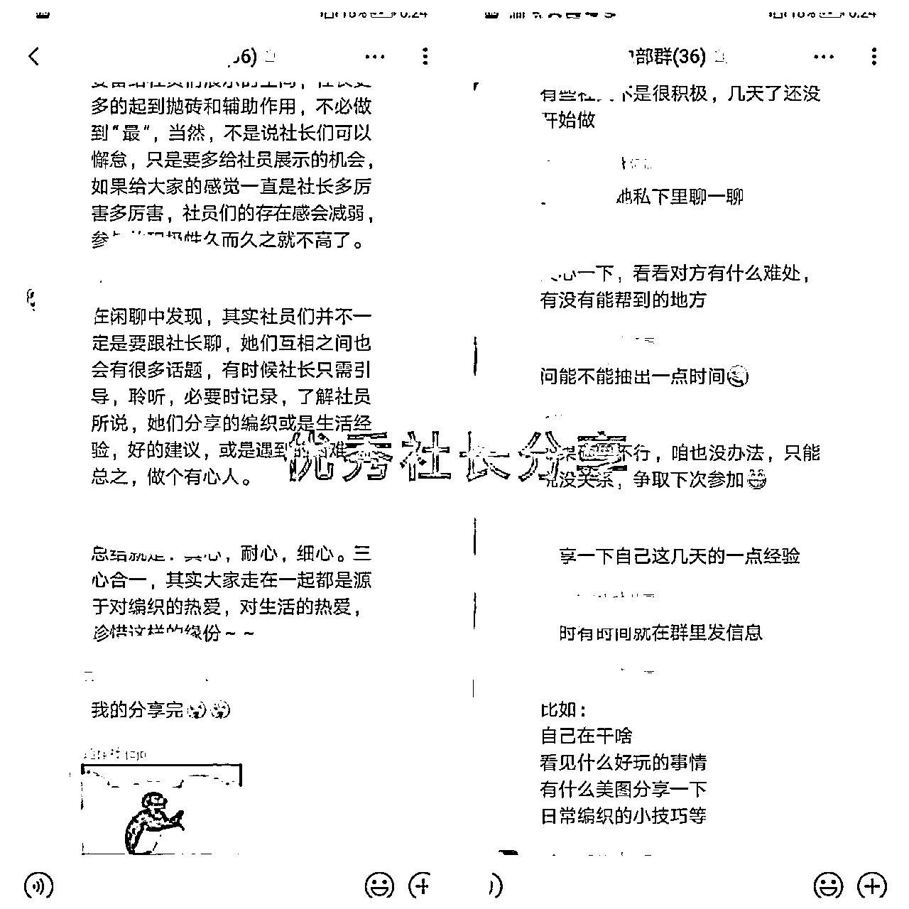

 

 

评论区：

商家岛旭教练 : 厉害了

王先生【快手电商】 : 厉害

旺小哥 : [抱拳]

旺小哥 : [抱拳]

良辰美 : 旺小哥，了不得

F先生 : 厉害厉害

张浩楠 : 好文已收藏

旺小哥 : [OK]谢谢认可

# 【私域变现】**3**篇

# **# ****(**精华帖**)(227**赞**)**零基础全职妈妈如何通过社

# 群团购月入过万，实现经济独立？

作者：  泳怡

日期：2021-06-15

大家好，我是泳怡，一个94年的全职妈妈，今天想给大家分享一篇关于零基础全职妈妈通过经营自己的母婴团购社群，年销售额破120万，卖出了1台保时捷、2台奔驰，月入过万，还收获了几百个深圳当地有房有车的精准妈妈用户，身为互联网小白的我是如何冷启动做社群、突破个人瓶颈，又是怎么和客户相处成朋友知己呢？

 

 

在旭教练、老K、文林等一众龙珠前辈的鼓励下，我决定把这一年的工作都做一个复盘。

目录：

一、社群如何冷启动

二、你还需要几款爆品

三、我的变现路径

四、我遇到的瓶颈

五、社群差异化

六、加入生财的改变

七、未来的愿想

写在前面的自我介绍：

我是泳怡，在2019年尾生下了宝宝后，面临了没有工作没有社交的囧状，喜提产后抑郁，大概有四个多月都是抱着绝望和悲观的心态在生活，在第五个月的时候，我痛定思痛下定决心，决定搞点小事业。

如果你想看的是一篇普通人逆袭一个月赚几十万的案例，那让你失望了。

在努力了一年后，我目前的收入是月入15k-20k，就一个经理级别的月薪而已。

但对于一个全职妈妈，有限的时间和能力，能突破自我在一个新领域实现一个不错的经济独立，在我看来，也是很了不起的事情了。

 

 

在这里我想先说说我的工作背景，第一份工作去五八到家深圳分公司做市场经理做地推，我们每天的工作就是去跑各个社区，分析地段人流以及找地方铺设摊位就开始干活，上岗第一个星期就喜提销冠，大概能日产50几单。

 

 

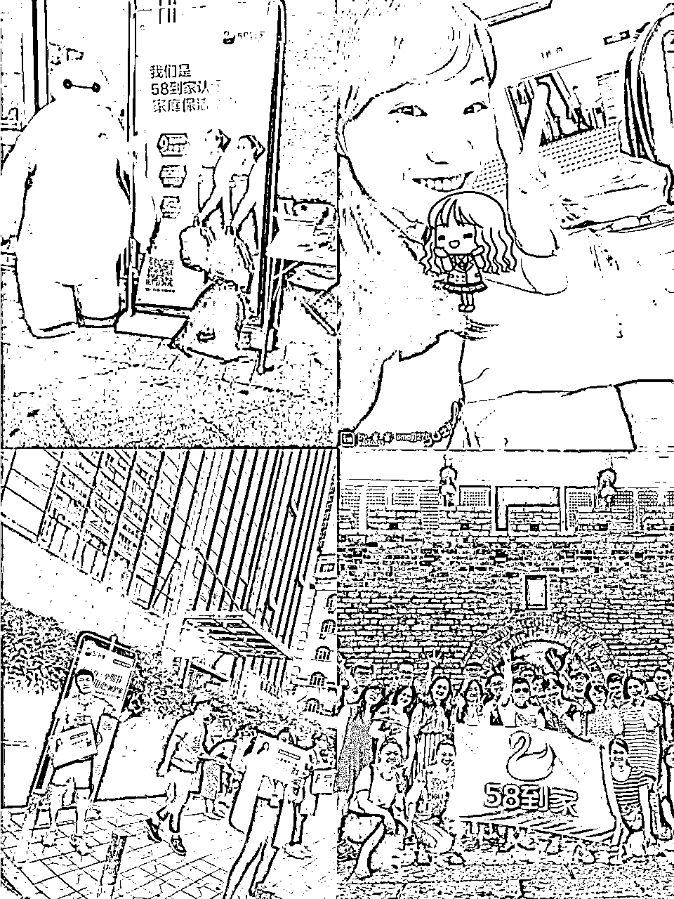

嗯，这应该算是我与互联网行业挂钩的第一份工作了。

 

 

第二份工作在一家文化公司做商业活动策划及演出统筹，最高级别做到四万人的商演，写策划方案、现场执行、讲标、跟供应商砍价、做导演、求着公安大哥给我报批批多点观众等等等等，压力和工作强度极大，现在回想起来，这依旧是我最爱的工作。

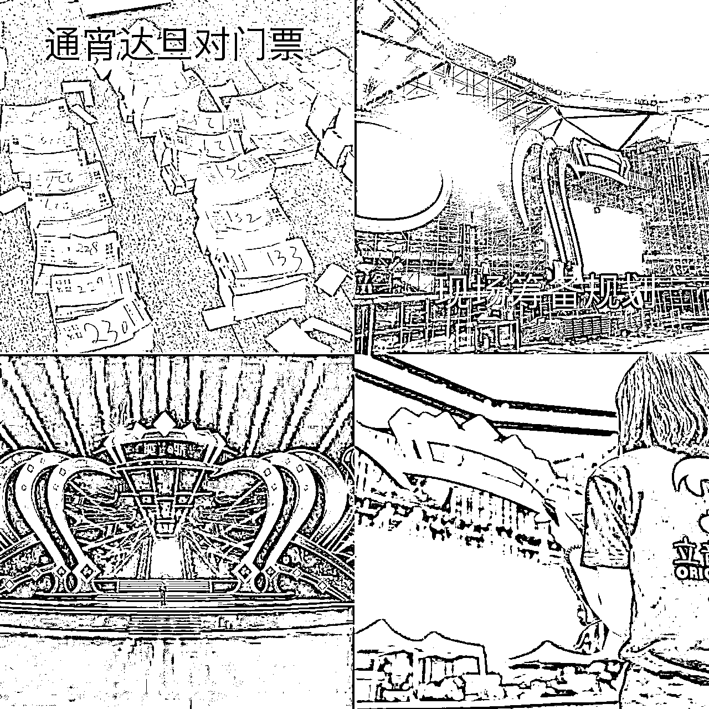

综上所述的两份工作，给我现在的小事业打下了深厚的基础，我的亲和力、和陌生人打交道的勇气、负责的工作态度都和这有关。

但女生总是要面临结婚生子的状况，为了身体健康着想，我辞职了，

 

 

然后，我成为了一名妈妈。

我在产后第五个月，抛弃对微商原有的偏见，勇敢开启了社群团购这条道路。

先在这里汇报一下成绩，一年的时间，做到了营业额破**120**万，社群人数不多，从起始40个用户扩展到800人左右，但客户粘性非常高，总购买次数在**16000+** 

 

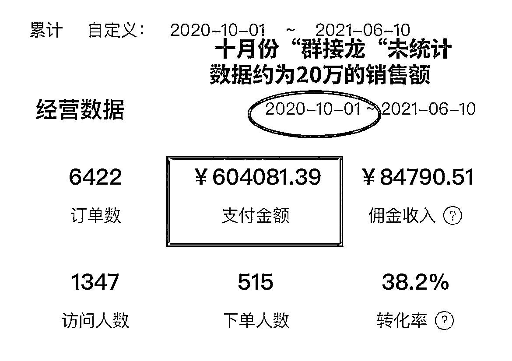

 

 

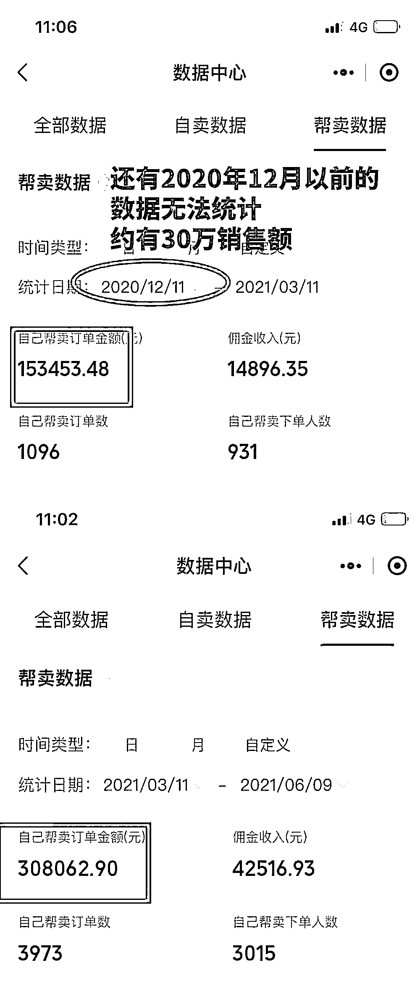

 

 

图片是两个小程序加起来的销售额，还有部分久远数据后台无法计算，加起来差不多**120**万那么我是怎么做到的呢。

今天，我就把我的所有操作方法分享给大家，希望可以帮助到更多想实现经济独立的全职妈妈。

一、如何冷启动

如果你想开一个社群，第一步，首先你一定要筛选自己微信好友里的目标用户。

 

 

从用户画像的角度出发，找一个时间，认真地把好友列表从A-Z看完，把你觉得是潜在用户群体的人标记，如果有40人以上，那么恭喜，你的社群可以立马开起来了。

以我的案例来说明一下，一开始我打算开一个母婴好物的推荐及卖货社群，而我自己给宝宝用的东西也基本是价位偏中上的牌子货，所以客单价会偏高些，这时候我认真地筛选了将近40名社群初始目标客户，都是认知程度高且消费力强的妈妈，而这些客户我又是从哪里认识的呢？

我在孕期的时候报了一个孕妇学院，上孕妇瑜伽课，最低6000元最高2万元年卡的收费，孕妇学院有开一个妈妈会员群，可想而知这样的高客单价，里面的会员都是很优质的。

通过孕期和产后的聊天（当时还没有做社群的想法），我积累了一批跟我投缘的朋友，而她们都是我开社群后的第一批客户，到现在一年过去，我们也从线上到线下成了非常好的朋友。

 

 

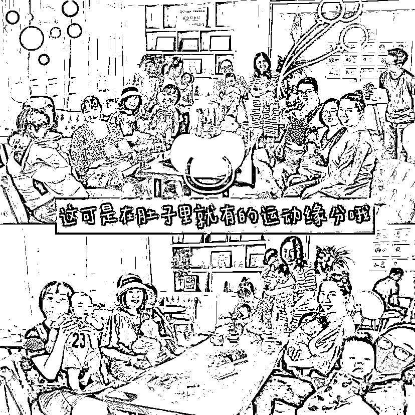

所以，如果目标客户不够，是可以去混一些圈子，以母婴圈为例，你产检医院的孕妇群、小区的妈妈群、二手群、或者高客单价的孕产妇产品（例如我的瑜伽学院）的社群，如果找不到入口，你可以去淘宝对应的和你匹配度高的产品客户群。

比如Nestdisign的睡袋均价在300左右算是市面较贵的睡袋产品：

 

 

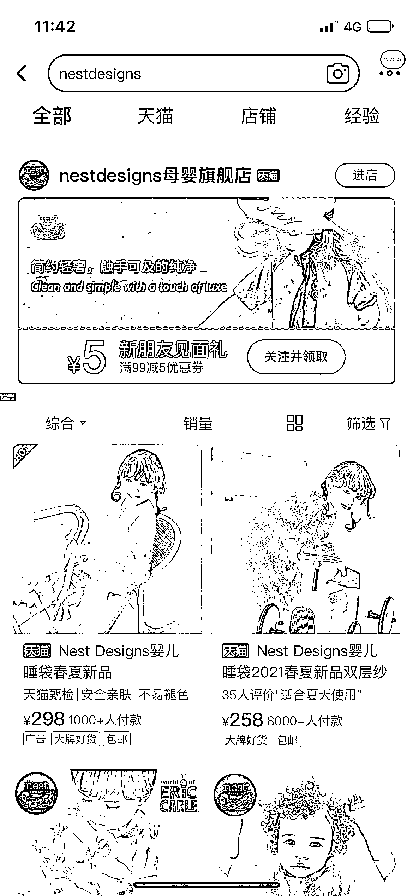

 

 

这个产品跟我的客户匹配度很高，我当时通过购买产品，从包裹上的引流卡片加入了他们的用户微信群，聊了一段时间下来发现里面的用户跟自己的消费水平都比较吻合，普遍精准，我通过适当混群，聊天，提高存在感，找机会加好友，也增加了一波异地客户。

甚至你还可以去闲鱼找用户，但这个我没实操过，我就不具体展开了。

这里提到一个很厉害的同行案例，深圳有一家私立孕产医院叫美中宜和，生一次孩子的收费大概在8-10万，那位同行就是在医院的社群里结识了非常多经济优越的妈妈客户，除了母婴用品，同时也会售卖高客单价的珠宝产品，转化率很高。

我的社群一开始只有40个人，但能每个月给我产生将近2000左右的利润，互动率也非常高，基本每天的楼都在999+，所以客户的精准度是非常重要的，在社群刚开启的一个阶段，我都在追求社群的人数，盲目引流来了一波"僵尸客户"，最后都被清理了，浪费了很多时间精力，而现在看来，一个精准用户能秒杀**20**个非精准用户。他能给你带来的后续价值也是不可估量的。

 

 

二、你还需要几款爆品

开社群之后，我也在寻求一个突破点，如何能把手上的优质妈妈群里的精准用户吸引过来并有个正当理由加微信，这时候我看到有个妈妈在分享一款非常漂亮的婴儿被子，大家都留言说很好看，但价格偏高。我在阿里上找到了一个代工厂的渠道，买回来对比，果然质量手感是很接近的，价格上能省100+

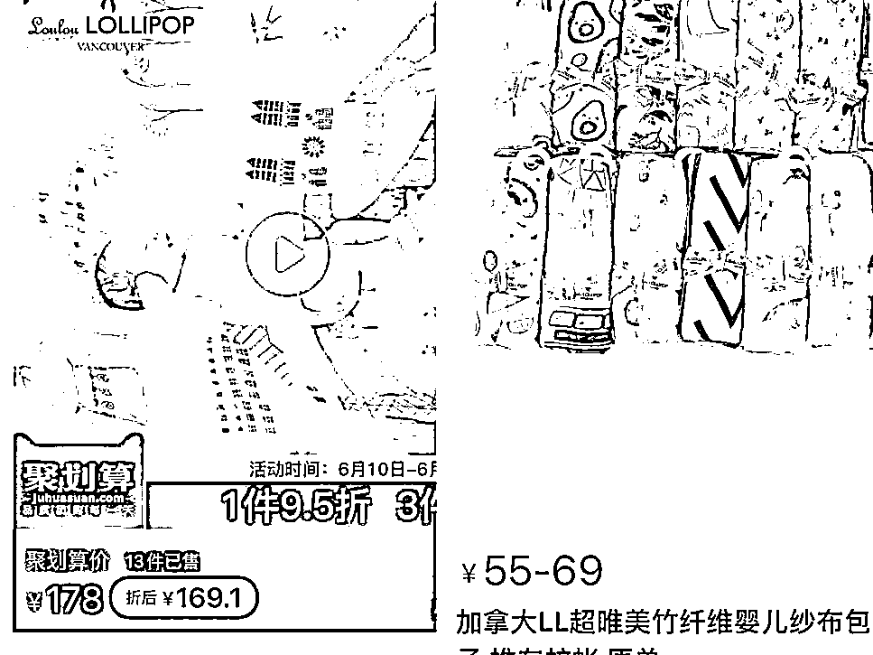

这时候我也立马给我宝宝拍照，发去几个关系比较好的社群里，也大概透露了价格，是旗舰店的三分之一，这时候引发了非常多的询问，我趁机搞了一个团购福利，但需要加我微信购买，大概一晚上我加了将近60个精准客户的微信。

 

 

这里我还做了一件事，当时谈的批量采购价是50一条，后来厂家愿意每条被子再降2元，给每个客户都相应退回了差价，并且告诉她们，说好的团购福利不能多拿一分钱，虽然金额不高，但这个操作赢得了客户进一步的好感。

第一批收货后我还得到了20+转介绍的精准用户，里面有一位妈妈当时是高风险孕妇，我卖被子的时候顺带发现我们很合得来，一路陪她度过了待产、生产、产后到现在宝宝一岁了，我们甚至成为了闺蜜，在事业上也有非常多的合作，这也是一条被子给我带来的缘分。

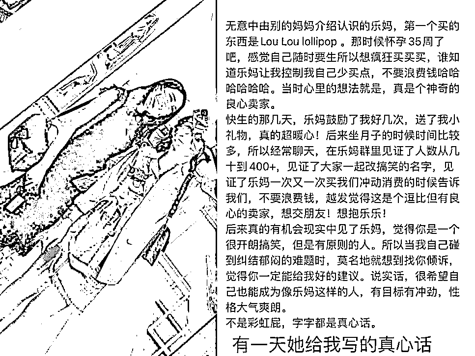

这款被子到现在陪伴了那一批初始客户的宝宝长大，将近一年半，并且还持续在跟我复购，后来我也一次性买了很多送给生二胎的客户做礼物，口碑非常好。

 

 

第二款爆品出现在一个月后，我买了一张可折叠的便携餐椅，方便出门的时候用，刚好在吃饭的时候发了一个朋友圈，大概留言十几条都是问我什么牌子，哪买的，我立马去我的渠道商那要了最低价，拿出淘宝的价格（淘宝280+，我们拿货158）以及同行社群里的售卖价格做对比，我搞了一个比同行价格再低5元的福利团购，但仅限我社群内的客户，同时找了几个关系熟络的妈妈去帮我做宣传，这时原本有好些个不愿意进群在观望的客户听说进群有福利价也纷纷进群了，从其他精准社群里引流来的客户又多了30+。

当时身边的同行也有挺多，包括瑜伽学院里也有几个妈妈跟我是同行，但他们发展都没有我快，这里我要感叹一句，真的多亏了这两款爆品，奠定了我社群的用户基础。

三、我的变现路径

开社群之后，就开始做抽奖、发红包等常规运营手段，再加上群里有非常多的KOC，十分能聊和热场，这里注意了！社群的KOC真的非常重要！这些可都是社群的灵魂宝藏人物，每天可以在群里挑起各种有趣话题，一开始你可以自己充当这个角色，但时间久了难免像单口相声，建议可以去挖掘很能聊的用户或者找亲人朋友当托，社群刚开启的时候建议一定要把氛围托起来，能增加信任度，不然群很快要沉下去了。

有了一批精准用户和自带搞笑属性的一群KOC，我的社群一开始是做的不错的，基本每个月靠老客户推荐都能新增用户，而我是一个人运作，利用群接龙小程序，选好团品，写图文链接，在群里跟客户介绍商品，更多时间是在社群里和用户们一起聊各种家常，同时还开始经营自己的朋友圈，重点是我还得照顾宝宝，整体来说还是比较繁忙但也能胜任的阶段。

 

 

 

 

 

 

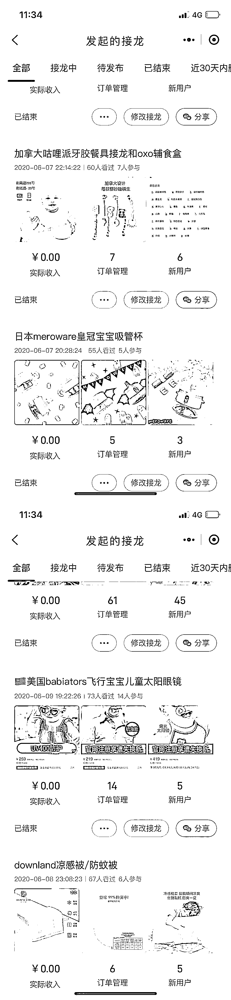

 

 

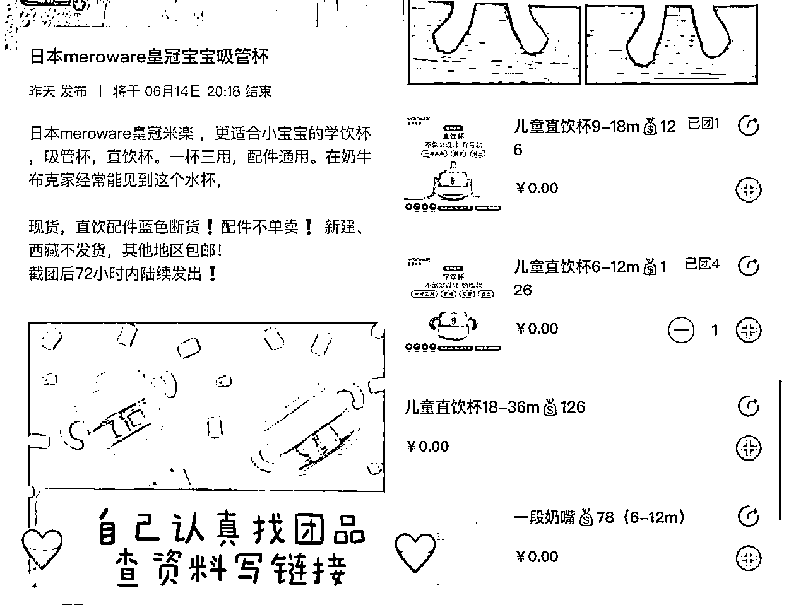 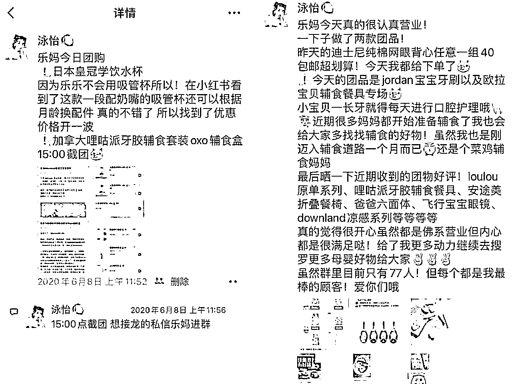

 

 

（这里小程序显示收入为**0**，是因为平台提现手续费**1%**，为了节省成本我都让客户私信跟我下单，也能跟客户有更多互动）

两个月之后，群接龙和快团团开始出现了**"**一键帮卖**"**的新模式，就是有一群供货商，他写好图文链接，我们只需要一键转发形成自己的主页，社群里只要有人购买，我们就能拿到他设置好的佣金，供货商直接在后台收订单发货，客户收到货物且没有售后的话，这一单就算完成了。

 

 

 

 

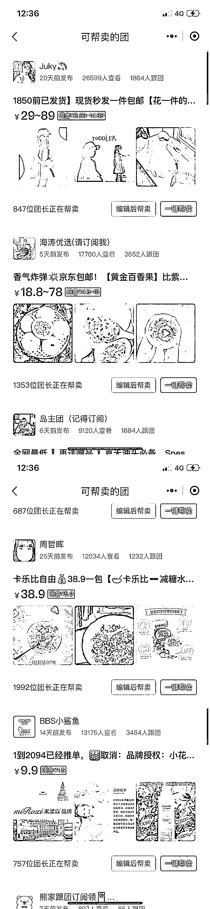

 

 

 

 

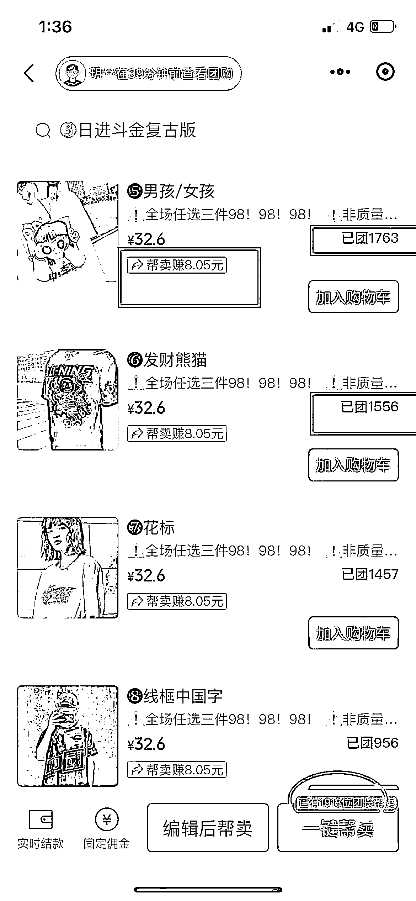

 

 

而我付出的成本就是时间，回复客人的售前咨询、收到货有售后问题我需要去跟进并且安抚客服，如果遇到品质很差的商品，供货商不肯退款，为了保护信誉，我也只能自掏腰包给客户解决，一路下来也遇到了不少坑，但总体是比较好操作的。

这样的模式其实很大节省了我的时间，提高了我的效率。我每天能提供三十款左右的团品给到社群用户，而当时运作这类模式的人并不多，我利用了信息差，以及团品的价格的确实惠，每天都能创造3000左右的营业额，现在每天能固定每天在5000以上营业额，有爆品的话能上一万，因为大部分团品属于生活类用品，客单价不高，所以利润基本保持在8%-10%，最开始每个月能受益3000多，对于一个社群刚上手的小白来说，已经很满足了，尤其我还是个全职妈妈，在带娃的同时用手机操作赚钱，与我的时间还是很符合，到后期社群用户越来越多，每个月的收益都在上涨。

这里继续介绍另一个模式，上述我的身份是一个“帮卖团长”，模式就简单地帮卖赚取佣金，而我也在去年尝试了“供货商”模式，大家可以看到数据，一个衣服团能有近2000人帮卖，一款T恤能有1500+销量，快团团上数一数二的供货团长每个月给团长发放的佣金超过百万。

 

 

我在去年八月份也和两个妈妈一起合伙开了供货品牌“卡乐园”，主营复刻版的小众国外童装，供货给很多像我这样有自己母婴群体的团长，我们的定位比较垂直，就主攻童装，品类偏服饰方向，成绩虽做不到数一数二，但一年下来也吸引了500+团长，流水将近150万，发放佣金超过50万，货源主要来自自家联系的工厂、1688以及我们每年都会去几个规模很大的母婴展联系品牌资源。

所以如果你有靠谱的低价供应链（快团团上的竞争非常激烈，很多供应链自己也开始做，所以一定要保证价格低）或者独家好产品、有靠谱的团队能做好选品、文案和售后服务，可以尝试走这个模式，加上找官方助推，我相信也能带动很多销量。

深耕“群接龙”、“快团团”两个小程序卖货一年下来，深深感受到有越来越多的人被改变了消费习惯，他们在像我这样的团长的努力经营下，开始不依赖淘宝京东，因为信任，直接选择在你的私域下单。

这里提一些后话，每天看着琳琅满目的团品，我也开始进行筛选，不会进行盲目刷屏，每周固定做数据分析，分析什么类型的产品最好卖，浏览次数最多，收集客户近期的集中需求，例如夏天大家都需要防蚊水、防蚊裤，冬天大家开始需求宝宝的睡袋、护肤霜等等，观察客户的每个订单，分析喜好、偏向，记在心上，客户跟我提的需求如果暂时没货我会后台进行登记，有货了第一时间私信发过去，成交率也是很高的。

一年下来我也有了许多选品思维，学会了从用户角度出发，什么样的文案和图片最能抓住消费者痛点，再升级到会习惯性用不同维度去分析母婴类品牌和短时间内出现的爆品，没想到做社群团购还能培养我的品牌思维，也是意料外的收获，这块心得日后再专门整理一篇文章吧这里就不细述了。

四、我遇到的瓶颈

 

 

一段时间后，身边也越来越多的人开始参与进来做团购，毕竟是非常好上手的项目，开个群发个团几个按钮的事情，佣金就到口袋了，好几个客户同时来问我说可不可以把资源分享给她们，而我要是分享给了她们，也就代表我将一并失去她带来的客户，身边同行越来越多，客户开始分散消费，而我一个人疲于各类售后信息处理和带娃，精力有限，有时候客户等不到我回复就跑去别家下单了，营业额开始下降，甚至因为群聊信息过多，有不太熟悉的客户开始退群···

 

 

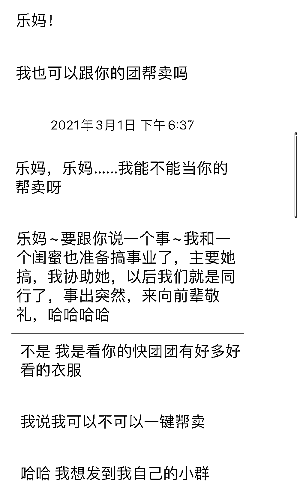

 

 

这段期间我开始反思，甚至一段时间处于低气压状态，我在想为什么一直在我这里消费的客户就突然跑隔壁同行那里了，而我是不是也应该做出改变？

但我一筹莫展，毕竟我的经验太少了，都靠我自己在摸索，此时此刻我需要一个突破，这时候我看到了一个社群运营的付费课程，抱着绝望的心态上课了，结果却让我领悟到了很关键的一点：

**"**你一定要能提供给社群用户有用的价值，这才是她们能一直留下的关键**"**让我恍然大悟，一直以来我只是做一个纯卖货和聊天的社群，而忽略了我能给他们带来的价值，一开始她们可能会觉得在我的社群里能省钱，也能跟投缘的群友们聊天，但是时间长了，同类型的社群也多了起来，我的社群根本没有可替代性。

这时候刚好我在抖音看到一个凯格尔五分钟练习视频（这是非常针对产后女性的修复运动），我灵机一动，马上找了个打卡小程序，邀请社群用户进行每日五分钟打卡，坚持30天我会奖励50元现金红包，这意外得到了将近30个群友的响应与支持，毕竟她们也很需要去做这个运动且需要有人督促。

我每天会定点提醒每一个参加的群友，趁着提醒的机会，加了很多在社群里但没有微信的客户，除此之外，提醒完客户，我还会找话题跟她们有更多的私聊，关心她们的近况，很大程度拉近了我和一些不熟悉客户的距离，也得到了很多的正面反馈，她们觉得我举办这个活动，不仅让她们直接受益，还觉得我是一个很正能量的人，让我一下子看到了希望，没想到这个看似简单的公益活动，是我社群的一个重要转折点。

 

 

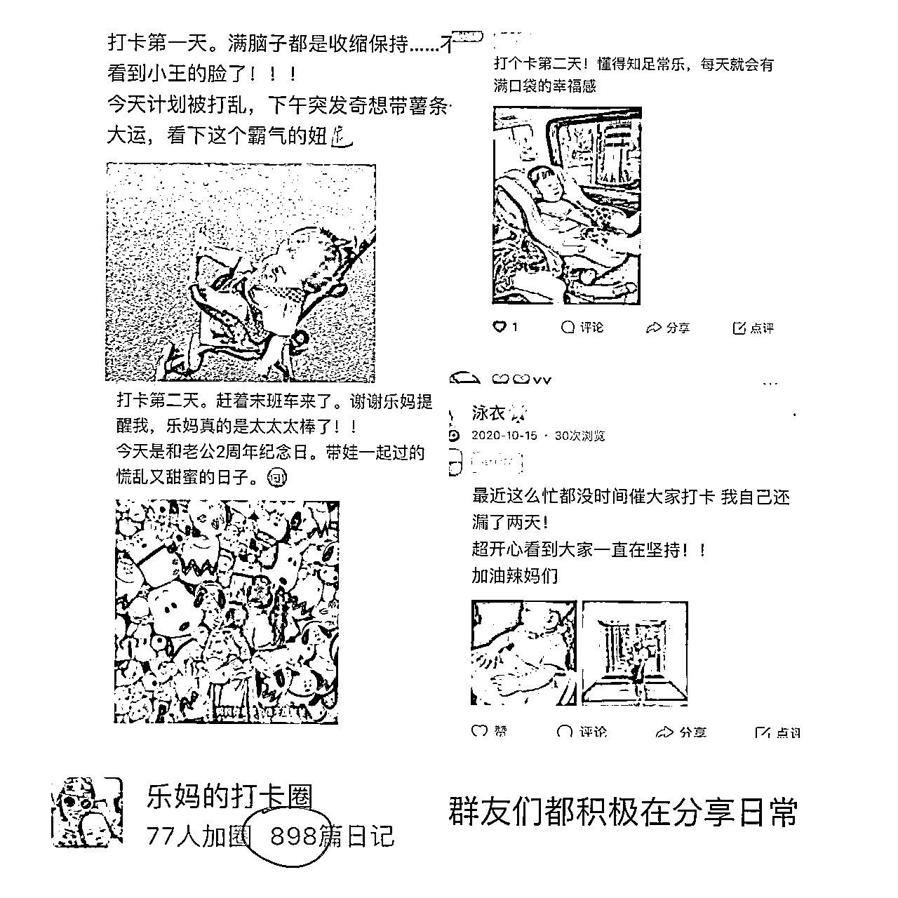

 

 

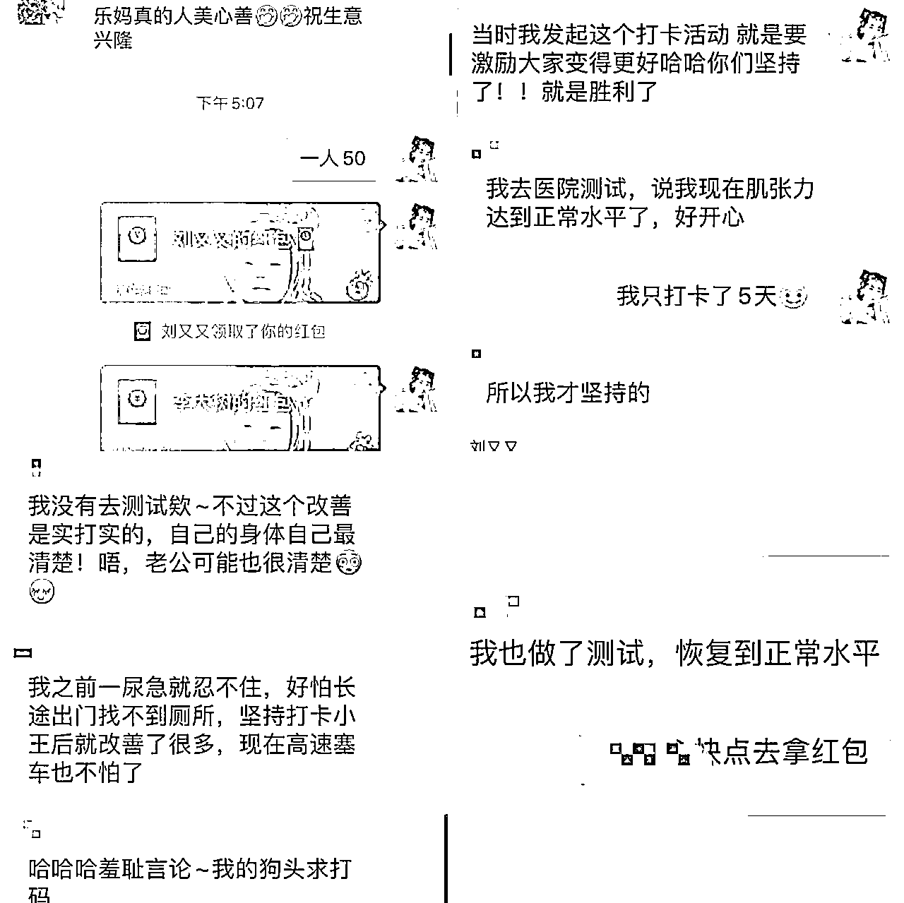 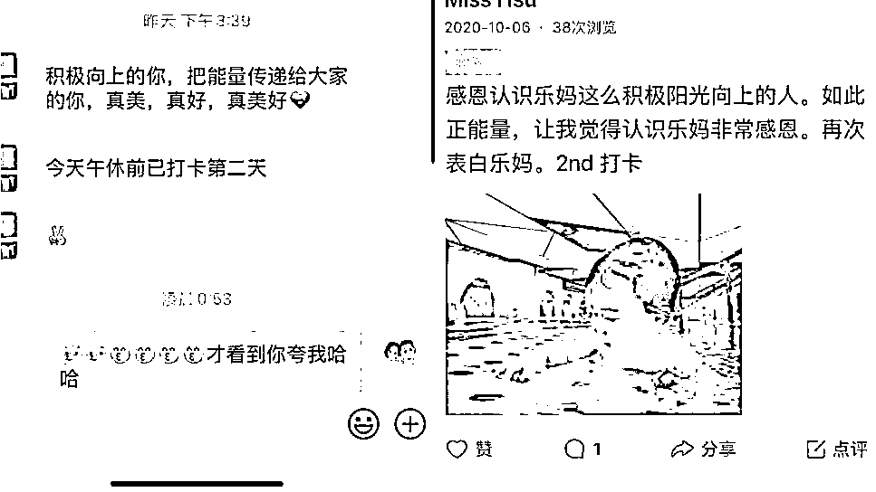

 

 

而这项打卡活动从2020年10月份至今依旧有妈妈一直在坚持，很多客户通过我发起的活动，身体变得更加健康，心情也好了许多。

我一下子打开了思路，开始举办各式各样的活动，包括我选几款慈善品，大家抢购后我把营业额全线捐给轻松筹、选一本好书一起来做共读营、邀请很多育儿专家来社群进行专题讲座，甚至最近我还在玩相亲角活动，把客户的优质弟弟妹妹看看能不能凑一对等等等等，而我也同时开展各类线下聚会，把群里活跃和私下聊得来的客户都约出来见面，我本身比较话痨，亲和力也很足，所以聚会每次都能举办的很热闹，不仅如此，社群用户通过我的牵线，也互相认识，大家都做了朋友。

这里我感悟很深，做一个积极和正能量的人，你的光芒和磁场，真的能影响很多人。

在这段期间，我逐渐发现，做社群和个人IP其实是同步的，现在每个人手上最少几十个群，你要怎么样让用户愿意留下，甚至把你的群置顶，除了利益驱使，能不能是因为你的群对用户来说很真实可靠，能不能是因为你的群能感受到温暖有爱和互助，能不能是因为你很真诚有趣所以用户喜欢你？

做IP也是一个道理，都需要在用户心里留下属于你或社群的标签，而真诚利他才是留住人心的关键。

 

 

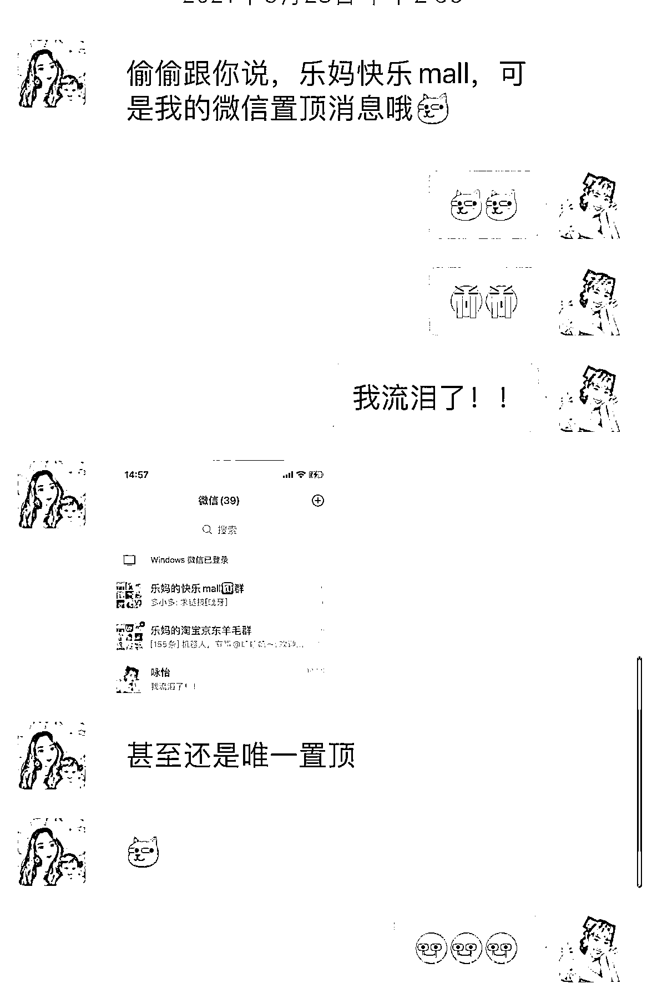

 

 

最值得感动的事情，是我通过这段时间的经营，除了收获了金钱、做社群的经验，最珍贵的是收获了一群真心跟我做朋友的客户，她们会驱车二十几公里跨越一个深圳来找我下午茶，会特地从惠州赶过来给我送工作室的开业红包，会在跟老公吵架的时候来找我喝酒聊天，还会为了跟我聚会特地把周末的时间空出来，甚至还举办了一场27个宝宝的联合生日会等等等等，真的倍感珍惜能收获这份情谊。

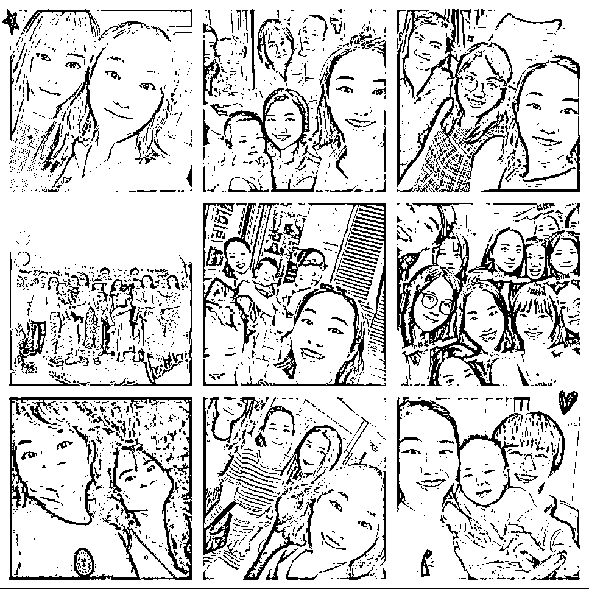

（篇幅原因，只选了**9**张合照，关于我和客户发生的好玩故事，日后再写一篇专题）

这段时间，我的社群数据总算又在慢慢好转起来。

 

 

五、社群差异化

最开始我想的社群差异化，就是服务，毕竟同行这么多，而且我的资源也没有特别好，除了打价格战，就只能做服务了，于是我打出"售后无忧"的理念，只要在合理范围，售后问题我都会给客户解决好，尤其是消费多的vip，有时候我自己亏损我也要保证她有一个愉快的购物体验，争取做的比淘宝七天无理由服务还要好，并且我要让她们一买东西就想到我，改变她们的消费习惯。

第二个关键核心就是**"**认真做事真诚待人**"**，我从一开始建立社群开始，就把功利性放在最后，最开始的想法是通过社群找到社交的窗口摆脱产后抑郁，社群里除了定点卖卖货，所以主要都是分享自己和儿子的搞笑日常以及给大家安利好用的产品为初衷，在利润方面我也比较佛系，一天到晚在群里喊着"哪里便宜去哪买"，淘宝京东618便宜就让人去上面买，同行能便宜也不强求她们一定在你这下单，但只要在我这里消费的，出现问题我第一时间解决，有时候供应商不靠谱出问题我还会自己送点宝宝的小礼物补偿给客户，客户从一开始的不够信任到能成为我的粉丝，定点看我的视频号、公众号更新，朋友圈都第一个点赞，这也是我用心待人的好结果。

后来我举办了一个真心话红包活动，很多客户都觉得我是个很真实不做作的人，不会一直把钱放在嘴边，从来不强买强卖，所以会选择一直相信我。

 

 

 

 

 

 

 

 

 

 

 

 

 

 

这里关于服务和维护客户这一点，是我想重点深挖的。

1  我通过跟客人售前售后的过程中，我会观察她的朋友圈，看看她的喜好和最近去过的地方，在聊天的过程找共同话题，增加彼此的熟悉感和信任度，本身我共情能力很强，如果她最近朋友圈心情比较沮丧，我还会给她安慰，我基本不会放过每一个跟客户私聊的机会。

（但这里不是为了和客户故意聊天，我的功利性也不强，有时候是真的心疼做一个妈妈要面对的苦难实在太多，我也希望能用我的积极能量去让她们开心一些）

 

 

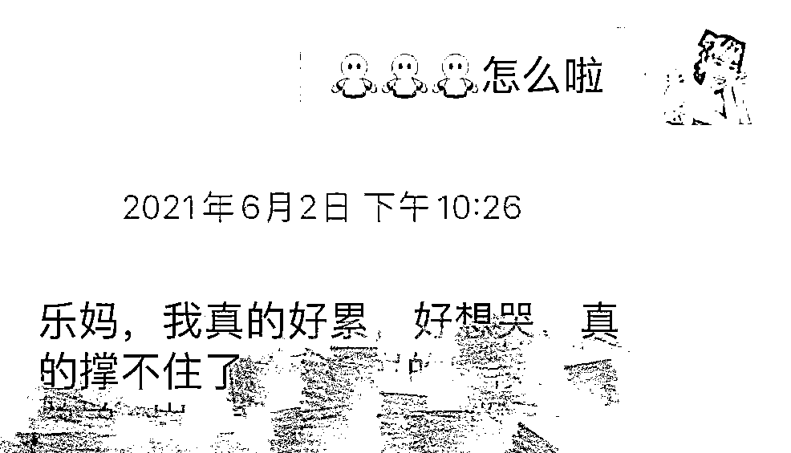 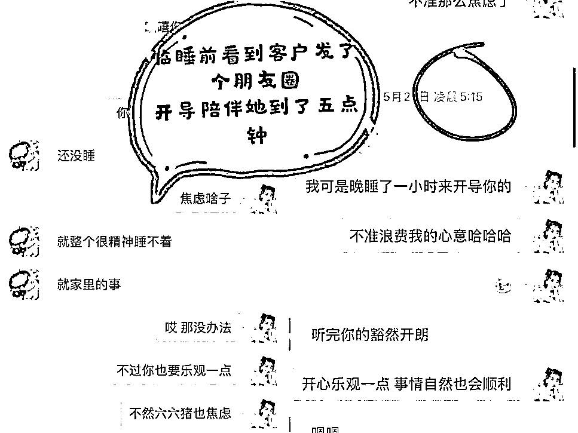

这位就是特地从惠州开车过来给我送开业红包的神仙客户

所有的真心都是相互的，你对人付出真心，客户也会真心回报于你。

 

 

2  坚持给客户的朋友圈点赞和评论，大部分妈妈的朋友圈都是自己的美照和宝宝的图片，基本我都会评论"天啊！宝宝超可爱！""这哪里来的少女！太好看了！"，基本能引来很多客户的好感，毕竟她们也是希望被点赞和夸奖的，通过评论能增加互动，而我们的共同的好友刷到这条朋友圈也会对我留下记忆。

3  认真留意客户的信息和状态，客户的朋友圈我都会认真看，不仅记住她们的样子，从穿着打扮分析个性，宝宝的样子、名字、和性别，爽快和消费多的客户我都会特别留意。

 

 

因为从我的角度出发，如果有人能专门记得我和宝宝的名字，我会感觉被重视，体验感会很好。

而且我很喜欢给客户制造惊喜，比如有一次，一个vip客户发了朋友圈说"好想拥有一个跟我女儿一样可爱的吸管瓶"我立马淘宝选了一个款式类似的吸管瓶寄去客户家，收到的时候老公还吃醋了哈哈。

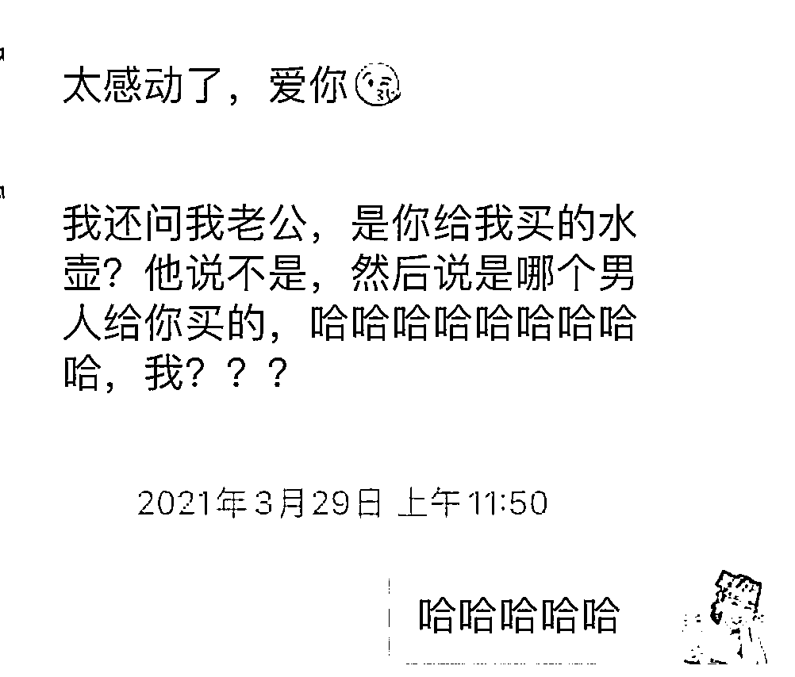

3  记住每一个重要的节日，春节、母亲节、端午、中秋，尤其是VIP客户的生日，以及宝宝的生日，我都会给她们私信祝福和红包，这里提到一点，宝宝的生日我都会发两个红包，一个88元的给宝宝，一个52给妈妈，祝宝宝生日快乐健康成长的同时，也一定不能忘记妈妈在这一天也是受难日，我都会在52.0红包上写妈妈这一年辛苦了，大家一般都只记得宝宝生日忽略了妈妈。

 

 

 

 

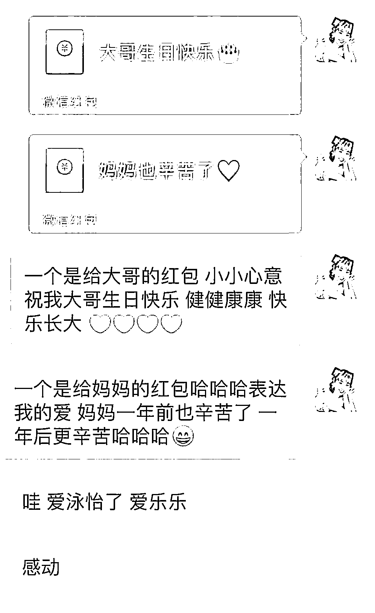

这里可以跟大家分享一个前几天发生的例子。

有一个关系很好的客户生日，我看到了朋友圈就立马给她点了份麦当劳桶外卖，她收到的时候就猜到是我送的，跟我说她正愁跟老公没宵夜吃，我的礼物就送上门了。

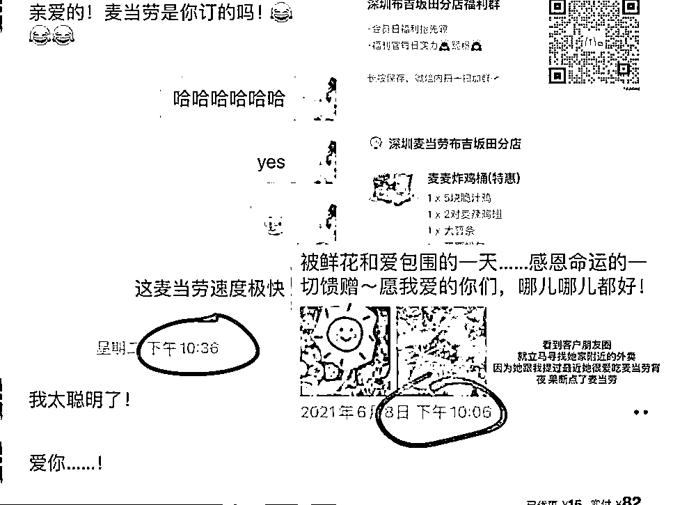

受到启发，我要将我的服务模式规范化，整理表格登记好客户和宝宝的基本资料，客户和宝宝生日的时候我们的礼物能提前或当天送达，给予更大的惊喜。

比如老纪分享的vip权益，我也会根据消费金额将客户划分金卡银卡等级，每个等级都享有不同的权益，同时参考京东plus和淘宝88会员，例如每月享有免费退货券、专属生日礼物和红包、每月喜茶2杯、影视会员免费享用等等，给予客户很多实在有用的服务。

 

 

去年我的第一份年终大礼，是送出了五份价值600元的娇兰镜面新年口红礼盒（总价值3000元）给消费前五的VIP，都是悄咪咪送的，客户都惊喜的不行，因为资金有限，剩下的消费前十的客户全部都采购了人均150+的年货礼包，并全部配上了我的手写感谢信。

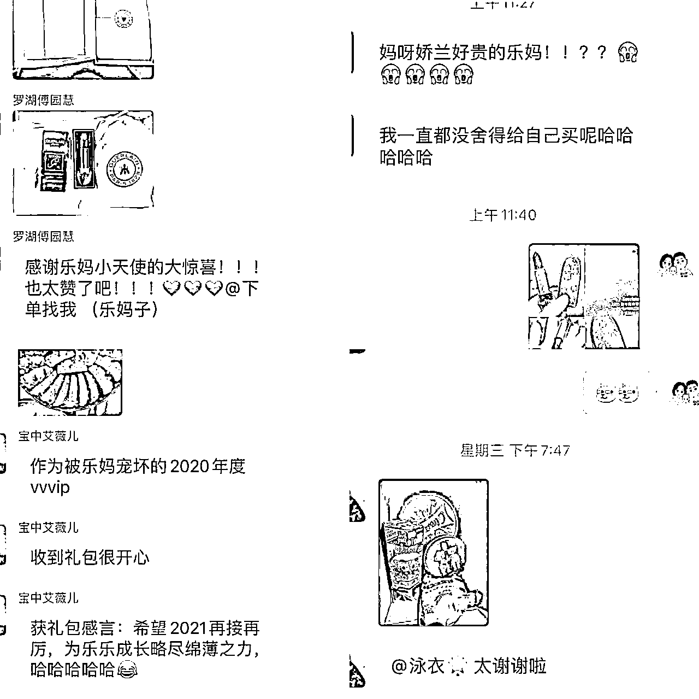

 

 

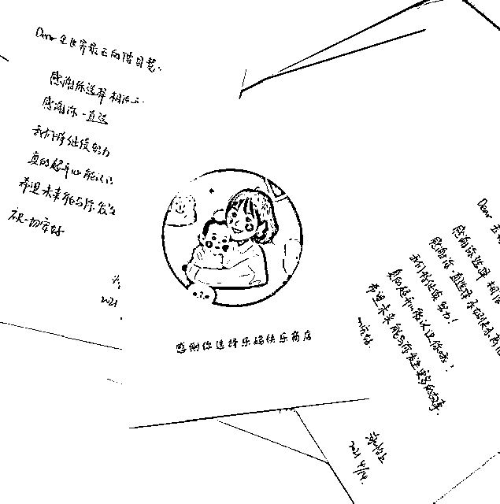

至今我也在坚持给客户送礼的时候配上手写信

今年母亲节，我直接定了十束花送给VIP，母亲节当天她们起床就收到了上门的鲜花，还配上了贺卡，比她们老公订的花还要早，剩下的客户我按照消费金额的排行准备了不同的礼物，全部是找的能贴身用且很实际的礼物，比如家居裤，漂亮的发夹，洗护套装、面膜、睡衣等等留存很高的居家用品，提前让我团队的小助理一个个联系客户确认好收货地址，发货后提供单号，签收后也进行咨询反馈确保都收到礼物，整个流程下来客户的体验感非常好。

 

 

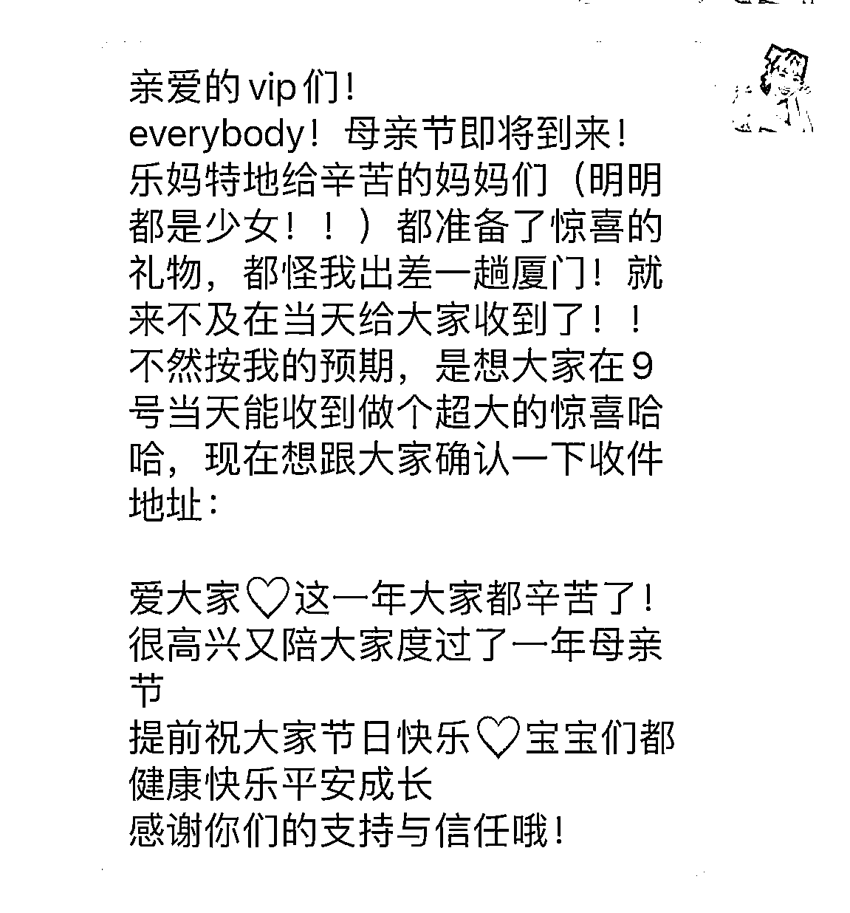

 

 

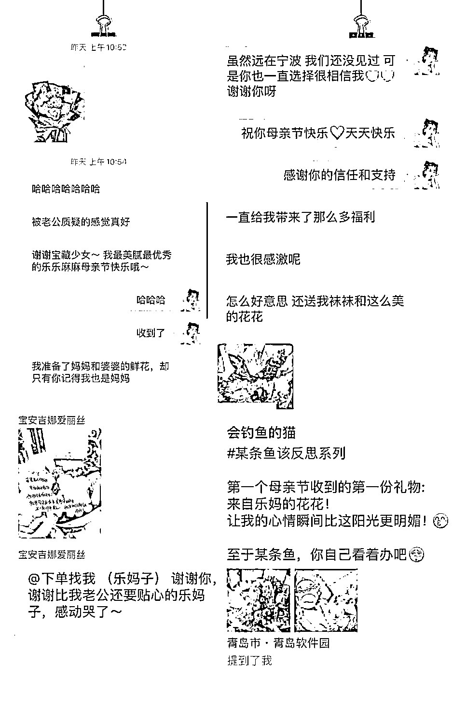

 

 

5  这里再说一个很容易被大家忽略的点，就是互利，你的很多客户里，一定也有自己做点小生意但和你业务不同的人，比如会卖卖女装、洗护用品、或者是做代购的等等，我有一个客户是做外贸女装的，客单价在500左右，本身我们交往不多，但她是我几个关系不错的客户的好朋友，我本意想着人家在我这买了这么多东西，我肯定也要在她那里消费一些，大家要互利才能长久，于是买了一套裙子，在交易的过程中发现我们有很多共同话题，意外地拉近了我们之间的距离，她还在自己的女装社群里跟客户推荐我，我也因此增加了很多精准客户，而我也意外打进了腾讯的妈妈圈子，原本那几个关系不错的客户跟我的距离也更近了。

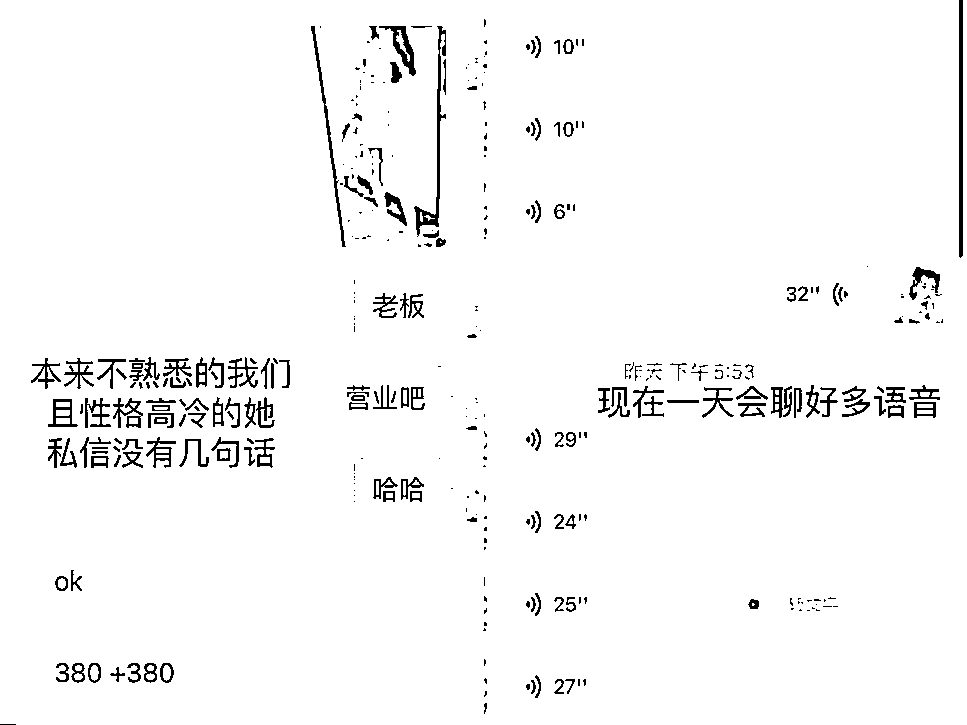

 

 

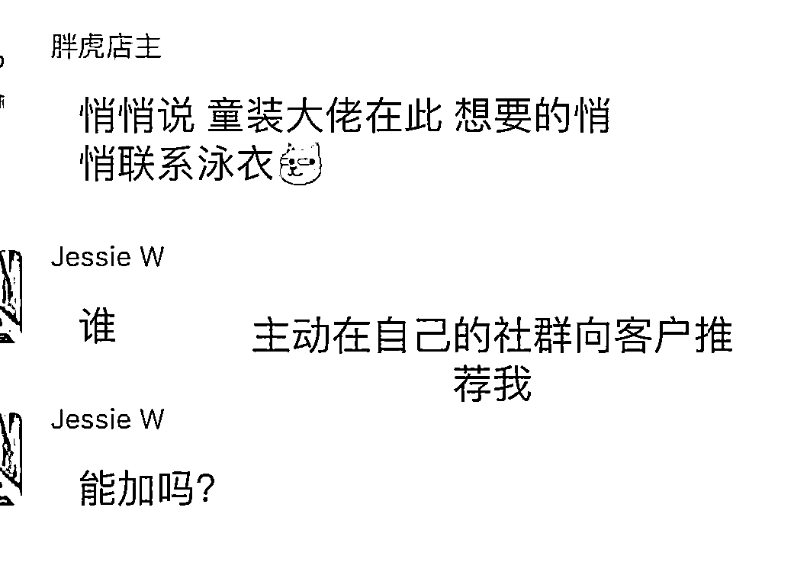

有时候客户自己有业绩压力或者需要在群里求助，千万不要小气，只要没有太大利益冲突或者不正规涉风险的都可以，比如有一位客户是4S店店长，月底还差一点业绩，我帮忙做了宣传，居然还成交了2台奔驰，后续通过我的转介绍，还成交了一台保时捷卡宴。

比如一位客户是做香港保险理财，非常靠谱，我们私交也非常好，我介绍给了群里很多的用户，也举办过线下的保险科普沙龙，帮助她做了很多业绩和链接了不少人脉。

比如一个藏族客户是做滋补品的，我也了解过是正规的渠道，每次群里一问燕窝花胶这类，我都直接让她们找这位客户，没有抽取佣金，就大大方方介绍，客户非常感谢，每年我都能收到她送来的各类补品礼盒。

但涉及有风险的高价医美整容领域、来路不明的微商产品，高风险的投资等等，我都是明确拒绝的，我不能坏了自己的声誉，我在做推荐之前，都会提前调查。

我也不是谁都无私帮助，一些非精准用户，消费低，只想薅羊毛的我一律拒绝。

 

 

换取的回报，就是每次我需要帮助，我的很多客户都经常无私分享各类资源和人脉给我。

所以，不能老想着自己赚钱，你也得光顾一下客户的生意，互利才是长久的。

6  俗话说"线上聊千遍不如线下见一面"，我一直心存感恩，觉得素未谋面能一直在你这里消费以及跟你推荐朋友真是一种莫大的信任，而我也一直在现实链接这些信任我的客户，请她们吃饭或者喝下午茶，带着宝宝一起聚会或者是我们单独出来聊天，每一次跟客户的链接都让我们的距离变得更近，基本每一次与客户的第一次见面都能熟的像认识很多年的老朋友，导致在旁边的爸爸们都会问"你们是以前就认识的朋友吗？"

而今年我更是开启了个人工作室，把线下聚会搬到工作室，定期举办各类亲子和女性成长主题的讲座，例如婚姻法普法讲座、心肺急救课程、花艺、亲子摄影、亲子收纳、女性心理健康专题讲座等等，还有各类茶话会。

还有一个重要初衷，妈妈们缺少对外倾述的窗口，而我能让她们在我这里链接更多同频的伙伴，给大家一个社交的平台，让她们在做妈妈的旅程中也绝不孤单。

就算做了妈妈，也不要忘记实现个人成长，我希望能帮助到更多的女生。

日后会做资源整合，努力经营一个强有力的本地妈妈圈子。

 

 

 

 

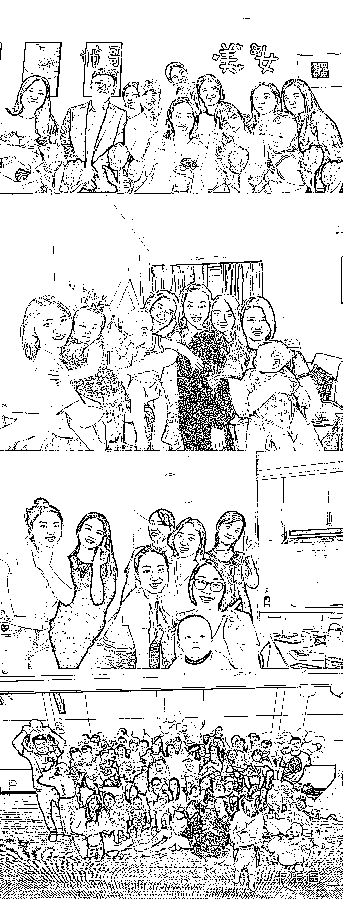

六、加入生财的改变

再说说我加入生财后的一些改变吧！

在机缘巧合下知道了生财，当时的自己对于2300的门票还是很犹豫的，但为了改变自己的认知，我还是立马赶了末班车并且报名了生财深圳见面会！现在来看这件事真的太正确了！我不仅认识了很多给予我很多帮助的小伙伴，更是很大程度上提高了我的认知水平和格局。

 

 

在生财看到"龙珠"的概念，也启发我做社群货币的想法，我也在我的社群里开启"乐币"模式（我的宝宝叫乐乐）想了很多刺激消费的行为，比如将购买截图发到群里，获得10乐币，发三张买家秀，得30乐币，推荐好友进群得50乐币等等，第一个月实行的时候群里直接炸了900+张买家秀，都给我整懵了，客户直接说：乐妈你已经占据了我们生活的方方面面，哪里都是跟你买的东西。第二个月增加了一些玩法，比如连续消费打卡会触发双倍乐币等等，丰富了游戏规则，社群货币变得更好玩了。

当时的心态是无所谓亏不亏钱，也没去计算成本，先做了再说，大不了少赚点。

没想到效果这么好，隔壁同行也纷纷开启同步操作，可以说我算是走在前面的母婴群主了。

最重要的一点是，我不搞套路，多数人做积分都是抵用券，还是得客户做二次三次消费才能抵用，我觉得很没意思，我直接把乐币换成等价人民币，微信转账给客户，当月结算，乐币的数据之多直接把统计的小助理搞晕了，最后花了几天才统计出金额合计2000RMB、参与用户150+的表格，光是转账我都转到手软，还得配上文字感谢客户的支持。

第一个月的乐币KING直接拿走了200+现金，第二个月我改善了规则，降到了55+，总金额没变，但参与人数更多了。后期我会继续改进更多乐币玩法，赋予更多的价值和意义。

 

 

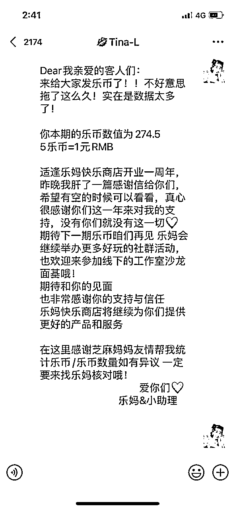

 

 

通过北野老师的启发，我还举办了荣耀之夜给积分榜的客户们颁奖，提前两天在社群和朋友圈预热，制作颁奖海报，并且活动开始前10分钟不间断发红包炒热气氛，我把流程和内容提前编辑好，当时还有点紧张，不知道会不会冷场，到了活动开始，我讲完一系列的祝词之后，群内的客户们争先恐后打起了烟花和鞭炮帮我一起庆祝，刷屏刷到停不下来，越来越多的人融入了我们这个环节，还是我用好几个红包才喊停，才能让乐币KING发表感言，当晚的社群真的非常热闹和好玩，我在那一刻也深深感受到了社群凝聚力，一小时的聊天记录999+，也没有人退群。

 

 

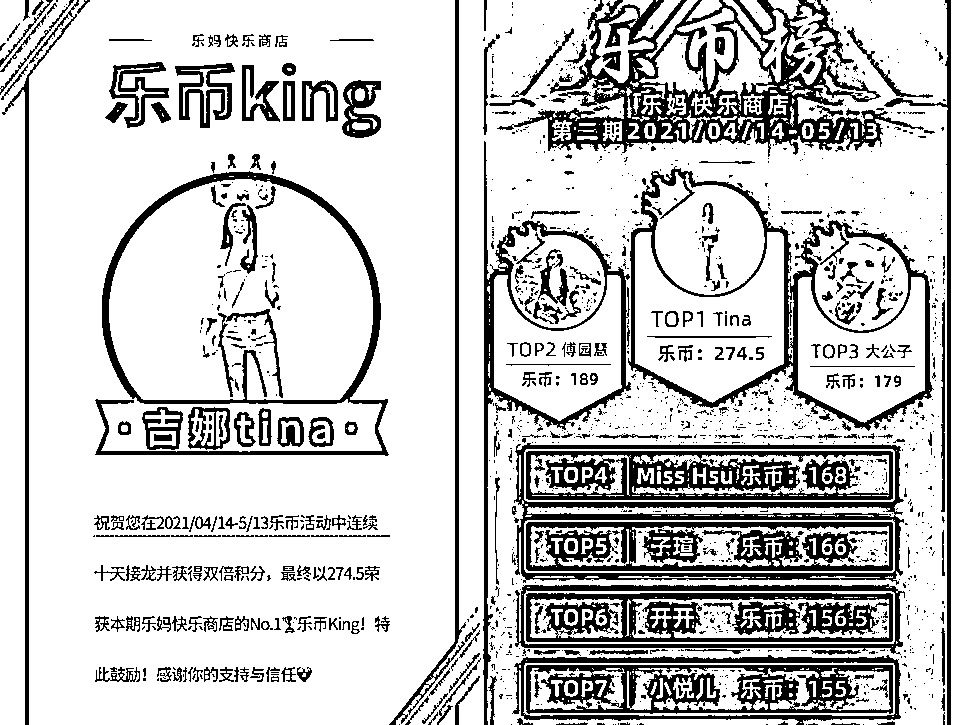

 

 

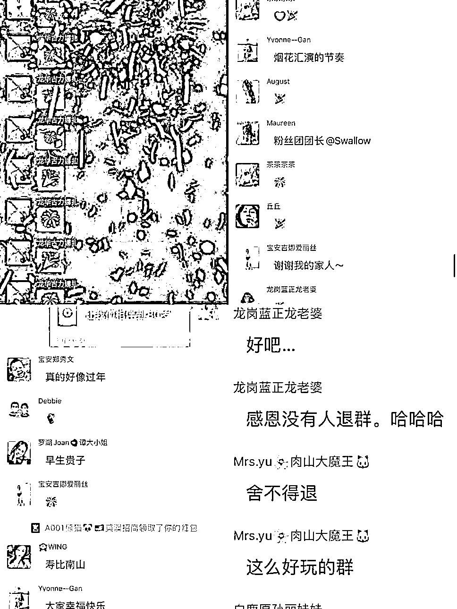

同时期我还搞了很多会员日抽奖、社群夜话的活动，效果都非常好。

加入生财真的受益良多。

 

 

七、未来的愿想

虽然我目前的社群收益很稳定，但危机共存，而我的野心不仅如此，通过加入了许多像生财的优质星球，我获取了非常多优质的信息源，我发现这个日新月异的世界太值得我去学习了，尤其是抛家弃子飞去杭州生财，听了老纪的分享，更是让我受到了莫大的启发，我开始做个人IP，利用我现有的私域客户资源，做视频号、写公众号分享我的经验、玩直播，继续用我擅长的服务思维，吸收更多优质的精准用户，同时在寻找匹配我的高客单价产品，未来还打算开启合伙人模式，把生财里看到的外卖cps、闲鱼无货源店铺、淘客等非常适合全职妈妈的副业研究清楚，帮助更多想实现经济独立和个人价值的全职妈妈去创业，获取经济独立，脱离产后抑郁的阴霾，重获积极向上的自己。

这篇复盘其实并不能像很多月入百万、千万的的大佬文章看的波澜壮阔，而我也是想写给很多像我一样从职场退下的全职妈妈或者想做自由职业者的人士，如果能力和认知并不能支撑自己做很多大额的项目（我也很想突然流量暴涨月入十几万，但我目前的认知水平是很难做到的，我更愿意稳扎稳打，踏实走好每一步）我的模式是非常适合参考和复制的，想做副业，并不是只能靠传统的微商，压货钱做代理，只要愿意花时间和心思，用心做一个自己的社群，找到靠谱的变现模式，细心认真维护每一个精准用户，也一定能收获属于自己的财富。

一年下来我每个月已经能纯利润在15k，而我相信下半年我通过个人IP利润也会给我带来更高的收益。

最后我想说一点精神感悟，这一年下来，我的状态从产后抑郁到恢复往常的正能量，期间的改变让身边人都非常感慨，很多客户见证了我一路的成长，总结下来，有几点对我来说意义重大：

1.行动力，当你想做，就立马去做，一直观望只会让你止步不前，我每当吸收了新的知识或者灵感，我会马上去执行，例如我在生财看到很多大佬的分享，我都会实操到自己的板块，所以我的进步是持续不断的。

 

 

2.努力，世上没有免费的午餐，世上无难事，只怕有心人。

做社群从来不是拉群发发红包就简单完事的，比如我一天到晚除了带孩子，就是一直眼睛盯着手机，心思都放在社群和客户；比如我现在写复盘写到了凌晨四点，我坚持要写完；比如我只有宝宝睡了才有时间工作，我就缩短睡眠时间，保证把事情处理完,有时候一天只睡3小时；比如不懂就学，除了熬夜看书，为了学习，还能抛家弃子飞去杭州参加生财见面会。

客户对我最多的评价，就是用心和努力。

3.格局，这一年我也试过被同行排挤抹黑，我从来不因客户跑了生气，眼睛里不能只放着这些小事，目光要看长远些，留不住的客户自然不是我的客户，是我的就不会走，我不能因为那点小利益影响自己，而我今年的目标也不再是社群团购，而是利用手头积累的资源和能力，做更多的商业布局。

4.积极乐观的心态，我在写公众号输出的时候，本来只是想记录生活，没想到影响了很多人，她们都叫我鸡血少女，说看完我的文章总是能精神满满工作，而我也一直保持积极乐观的心态，坚信方法总比困难多，也许是为母则刚，为了孩子，我想做好他的榜样，就算做了妈妈，我也不能放弃继续实现我的个人价值，不服输的我要继续努力，我要变的更优秀！！也希望能影响更多的人！

 

 

 

 

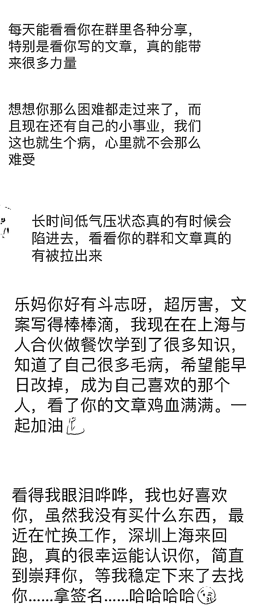

不忘初心，真诚待人，这一年收获最大的不仅是成长，还有这一批真心喜欢我的客户朋友。

我叫泳怡，一个94年的全职妈妈，外号鸡血少女，新的一年希望能破圈成功，链接更多优秀的圈友！

感谢大家的观看！

 

 

评论区：

商家岛旭教练 : 特别棒的生财妈妈——泳怡

杭州生财大会见面，这不到几个月的时间，又进行了成长蜕变，为你点赞

文林 : 见过几次面，一个特别不一样的宝妈！加油，泳衣

king老K : 听过泳怡两次线下分享，十足干货，一直要求泳怡将经历写出来。分享给更多妈妈圈友。

林童熙🚿 : 你的经历值得点赞！

商家岛旭教练 : 👍  👍  👍

猫头鹰🦉 : 猜猜我是谁

 

 

马时珍 : 好厉害  的宝妈呀

俊 : 非常不错的分享，

# **# ****(**精华帖**)(135**赞**)**一场微信群活动，单个群变

# 现**47**万，**3500**字大白话全拆解

作者：  旺小哥

日期：2019-04-29

【一场微信群活动，单个群变现47万，3500字大白话全拆解】

相对于在场的各位大佬们来说，自己实在没什么资格为大家分享赚钱的思路，赚钱的经验，我献丑分享一个自己之前带队做过的一场社群活动，希望或多或少对大家有点帮助，这场活动在一个母婴群中变现47万元

这个活动，在4月份生财有术的深圳线下聚会中分享给过圈友，没想到得到大家一致的赞同，我想着其他没有去现场的朋友肯定也会有用，拿出来分享给大家，3500字左右的大白话文稿，茶余饭后猫一眼就可以看得很明白的，有问题随时交流哈，希望大家点点赞，我想要龙珠哇[可怜]

由于篇幅比较大，我以石墨文档的形式发出来，请过目：

《生财有术分享 - 旺小哥：一场母婴社群活动，深度营销，单群变现47.7万，流程全拆解》，可复制链接后用石墨文档 App 或小程序打开

https://shimo.im/docs/Uxfiud7JIUQVUa4K/评论区：

旺小哥 : 各位大佬们路过麻烦留个赞[强]

雄俊 : 赞，🐾

旺小哥 : 谢谢帅锅

朝天阙 : 很厉害[呲牙]

旺小哥 : 谢谢[抱拳]

小白兔 : 厉害

 

 

旺小哥 : 谢谢[抱拳]

大为 : 学习了

# **# ****(**精华帖**)(107**赞**)**自营牛肉品牌如何运营团购

# 平台？通过私域运营实现稳定营业额** 40-50w**

作者：  深藏blue（chu*

日期：2023-03-06

通过这篇分享，尝试帮助想在私域卖货的大家解决以下4个问题：

1.怎么了解客户需求？

2.怎么围绕自己的客户群，寻找合适销售的产品？

3.怎么和供应链合作，怎么选择靠谱的供应链？

4.怎么拉新？怎么提高复购率？

我是一个 10 多年的英国海归，回国后在一家 500 强企业做 IT 项目主管，一次偶然的计划，进入了牛肉进出口行业，负责 C 端零售渠道，目前通过私域运营自营牛肉品牌，实现疫情期间月销 60-70w，日常稳定在40-50w 。

在短短的 1 年的时间，我们从零开始打造品牌，建立天猫旗舰店和私域有赞商城，布局抖音和视频号，并且快速入局拼多多的团购渠道。

 

 

在半年时间销售就差不多做到 1000 万，其中快团团社区团购方面，我们在月销单团做到了 50W+

加入生财已经差不多 2 年多了，最近有幸做了快团团大航海的教练，也借此机会，在这里给大家分享一下社区团购和私域运营这两个方向的经验。

因为今天生财很多同学都在尝试参与“快团团”这种类型的团购，所以我想从怎么做好团购的方向来告诉大家。

本来我想给大家分享的是站在品牌方的角度，一个新零售品牌负责人怎么来入局团购以及通过社群运营实现销售额的快速的增长？

但是因为很多生财同学是以个体团长的形式来参与团购的，所以我想还是从几个对大家做团长有帮助的角度来结合实战来讲讲我的快团团运营经验。

全文分为上下两个部分，上半部分侧重于定位，通过自我定位和客户定位来寻找匹配的大团长，以及设计和寻找和自己客户匹配的产品，

 

 

下半部分侧重于社群运营，讲一讲怎么做好自己客户的私域运营，主要就是微信群的运营，包括拉新，活跃社群以及复购。

上篇：定位

（1）自我定位 - 我的优势是什么？

（2）团长定位 - 我能给客户提供什么？

（3）产品定位 - 怎么寻找或设计差异化的产品

下篇：私域运营

（4）拉新 - 怎么拉新找到新用户

（5）微信群 - 怎么让群变得有价值提高客户活跃度

（6）复购 - 怎么让用户买买买

读完这篇文章，你能收获什么？

怎么对自己的客户定位？了解客户需求？

 

 

怎么围绕自己的客户群，寻找合适销售的产品？

了解怎么和供应链合作？怎么选择靠谱的供应链？

怎么拉新？怎么提高复购率？

上篇：定位

# **# **（**1**）自我定位

先讲讲第一个问题，如何对自己的客户定位？真正了解自己的客户要什么？

首先对每一个想做快团团的朋友来说，我觉得在做客户定位之前，先要做一个自我定位。

如果你是一个个人团长，你首先要了解你的优势是什么？并且你能给你的客户提供什么价值。

 

 

是以一个美食家的身份为客户提供美食选品建议，还是以时尚买手的角色给大家提供服装穿搭选择，或者以一个妈妈的角色，提供各种优质母婴产品的经验选择。

但不论你选择什么方向，要记住有两点：

① 尽可能结合自己的优势

② 寻找垂直的领域和方向

如果你是一个品牌方来说，你要对自己的品牌有个清晰的定位，了解自己的精准客户，并对自己的客户有精准画像。

举个例子，我们的牛肉是以美国谷饲中高端大厂的进口产品为主，客单价一般都在 200 元以上。依据我们的目标消费者画像来看，我们的客户群是：

No1 : 30 岁以上有家庭的女性群体为主，

No2 : 喜欢自己烹饪的

No3 : 文化水平较高，对牛肉尤其是牛排有一定认知，

No4 : 经济收入可观，生鲜产品的购买支出每月可以 2-3 次，每次支出金额在 300-500 之间。

 

 

# **# **（**2**）团长定位

有了自己的清晰定位以后，就可以思考寻找怎样的供应链和大团长，为客户提供匹配的产品服务了。

这里我要结合我们品牌方的思路，来看看如何寻找合作的团长了。这里主要有两个步骤：

第一个是在哪些渠道找？

第二个是怎么筛选？

找团长和找对象一样，不能光看颜值看长相，其实走到最后你会发现“门当户对”其实最重要。

先说渠道，和我们做电商一样，我分为线上渠道线下渠道，线上渠道我是去找一些供应链公众号，他们会定期公布一些团长的排名，帮你建立一个认知。

比如说下面这个公众号：快团帮  https://mp.weixin.qq.com/s/2xnSwbH53-0AAbMF_MlnKA

他们会定期公布一些团长卖货的数据，然后还有一些团长销售排名。

 

 

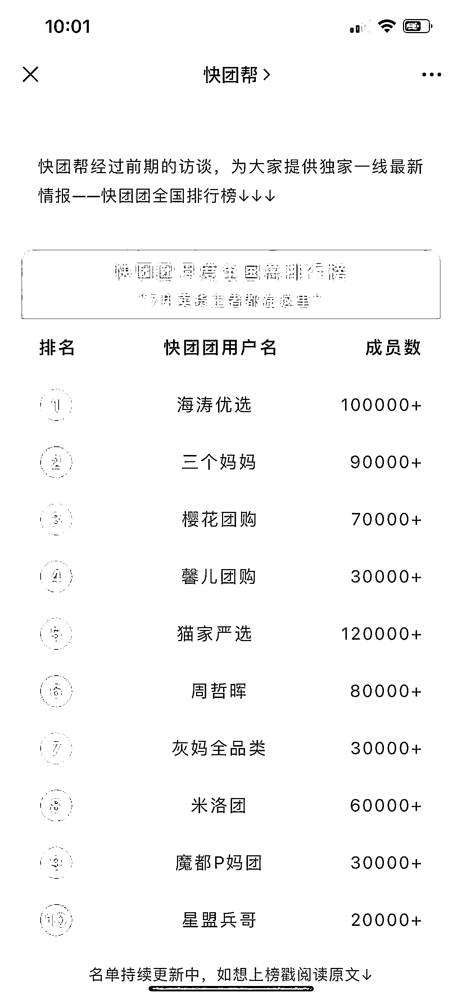

 

 

上面这是 2021 年的数据，新数据的话，魔都 P 妈早就是稳坐第一名了同时，你也能找到这些团长的二维码，有了二维码你才能有机会联系到团长。

 

 

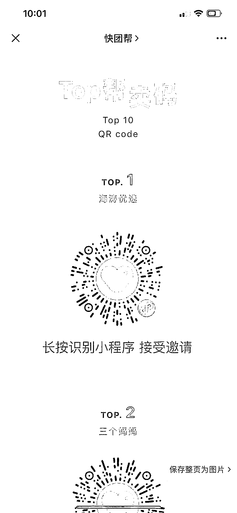

 

 

通过扫描二维码，你就能找到这些团长在快团团上的首页链接了，这样你就能够看到详细的团长信息，包括他们的联系方式，帮卖要求，以及最近团购活动等等。

 

 

 

 

这个就是目前一直都稳居全国团长头牌的“魔都 P 妈”，据了解，目前每月流水就差不多  2 个亿，着实让人感叹团购市场的巨大。

大家看到，这里就有 P 妈的微信号和品牌联系方式了，不过说到这里，这个加微信可不是简单的活，我可以分享一些经验给大家，也是一些有趣的内容啦。

因为大家知道，这些大团长的商务，其实是非常忙，每天大大小小各种品牌方和供应链都会去联系他们和加他们的微信，繁忙的时候，他们其实根本看不过来，

所以为了能加上微信，大家是想尽各种方法，用上各种话术，据说最夸张一个案例，加了 100 次才通过，

最后他加上微信的话术是： “姐，我从冬天加您到夏天，再不通过，  一年就过去了”，结果这一次大概是商务被他感动了，终于通过了。

 

 

不过实际的情况，我必须说，几乎 90% 以上都不会通过的。

首先越大的团长他们的供应链其实很全的，而且他们已经有固定的供应链合作方，供应链定期给他们推品就可以，新品牌如果不是很有特色有差异性的，基本都不会理你了。

说到这里，我必须要说说我们后来的策略，之前我讲过，越是头部的团长，其实你的成功概率越低，  （如果你不是很有品牌知名度的大厂商或者拥有当前最火的产品资源，能引起他们关注是非常难的）。

如果按照我的“门当户对”理论，就是说，你要么自己是“大户人家”，你要么是个让人一见钟情的“绝代佳人”，否则就不要想着高攀什么“大户人家”了。

所以后来我们基本的方向就是中腰部的优质团长了，为了让这个寻找团长更有效率，当时我安排了几个同事，专门对市场上的团长做了人物画像以及数据化的分析，下面给大家讲讲我的经验：

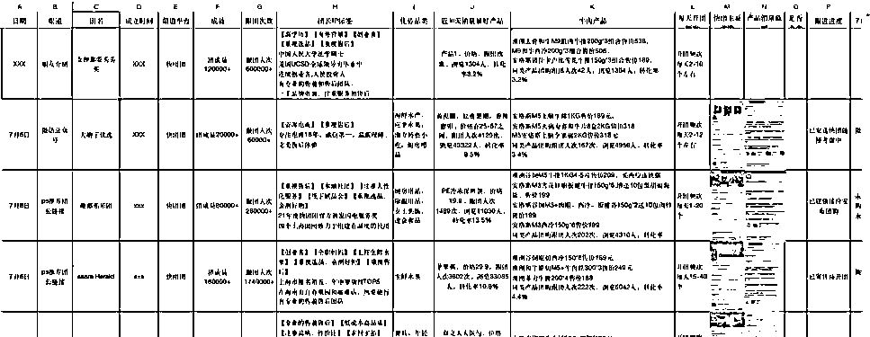

先看一张表，这张表我们把团长的开团数据做了几个维度的重点分析：

 

 

【团长个人 IP 】

其实每个团长因为个人的背景情况，其 IP 形象是有差异的，其中比较多的是宝妈形象，还有小资女性，电器达人，装修达人等等。

因为牛排的背景和高客单价，在宝妈这个大目标方向下，我们会更细分关注：高知女性（高学历），喜欢烹饪。

【成员数量和跟团次数】

成员数量和跟团次数主要反映的是规模，数量越多，次数越多，规模越大。

【优势品类】

品类方面，我主要看团长的选品喜好，团长是否有卖过生鲜食品类，是否卖过满足同目标类型客户的产品。

① 是否有同类产品，如牛肉牛排海鲜类等生鲜肉品

② 所开团产品是否有母婴类（如儿童玩具，读物，服饰等）、健身类（运动器材，运动衣等）、厨房用品等所属目标客户群体一致的产品。

【近 30 天销量最好的产品】

帮助我们了解目前团长最近推的品的销售情况和趋势

 

 

【是否有过牛肉产品销售】

如果有过牛肉产品的销售，我们要看销售的产品是否和我们有重叠，我们有没有差异化的东西。

【开团频次】

开团频次主要是每天开团的频率，一般从 1 次到十几次不等，越大的团开团频次越高。

但是我们要找少而精，如果开团频次很高，但是人气和转换率一般的团长，并不是我们追求的。

我们一般的标准是：开团频次每天至少 10 个以内优质开团链接，跟团人气高（大于  100 次），销量较好（转化率在 2% 以上）

结合上面的数据，我们按照这样的条件进行来了筛选：

客户群体比较精准符合我们的画像，

团长对品质有一定要求，

团长的客单价比较高

 

 

团长的最近开团人气度高，转化率符合要求

最后，我们筛选出来差不多二十几个团长：

上海女神团/小荷才露尖尖角 /miu 家万能团 /Winky/ 等等十几个团长 

 

 

 

接下来就是沟通，寄样以及再沟通这样的繁琐过程。

这个过程非常重要的一点，就是双方的认知和价值观是否能一致，整个标准就和我说的谈恋爱是一样的，双方需要有个相互熟悉和磨合的过程。

# **# **（**3**）产品定位

社区团购的渠道有其差异性，追求商品的极致性价比是所有团长的需求点，所以很多品牌商都被要求在这个渠道提供更具性价比的商品。

我们其实也面临这样的挑战，我们当时已经开设有天猫这个渠道，当时我们天猫的最火爆的寿喜烧产品因为我们的高品质要求，整个毛利并不是很高。

如果要按照这个品的价格给更低的优惠，在社区团购来推的话，我们应该要给很高的补贴，其实大家知道，商业行为如果没有利润，依靠补贴是很难持续的。

所以后来我们产品团队对整个社区团购的商品，做了差异化的设计，具体做了下面几个方向的调整：

① 在保留寿喜烧套餐的核心品种的同时，我们更换了 2 个产品，也就是换上了 2 个重新设计的新品，新品的毛利更高，这样我们也能提供出更低的价格给到团长。

 

 

② 新品的设计上我们调整两个思路，一个是场景的设计，一个是规格的重新设计。

场景的设计，我们当时我们观察到一个趋势，牛肉消费人群中追求低脂健身人群很多，针对这种需求，我们推出了低脂牛肉套餐。

然后在规格的设计上，我们推出了一款小包装产品（ 100g 独自美丽包）。

小包装产品可以让客户从心理上感觉到，花同样的价格买到的盒数更多，所以当时我们推了一款 99 元 10 盒的限时福利抢购。

 

 

 

 

③ 和牛产品引导高端客户，当时我们在社区团购比较早的推出了和牛产品，而且我们一开始就主打最高等级的和牛产品（ M9 等级），直接吸引了很多高端客户的注意力。

 

 

大家可以看到下面我们开团的效果，在女神团，我们的产品非常短的时间获得消费者的好评。

 

 

在第三次开团的时候，我们的产品总共卖出 2000 多个订单，有点小小爆了，当时在女神团开团的食品类目中，我们排到了前三名。

按照我们客单价 200 元来计算的话，2000 个订单，也就是 40W 左右的销售额。

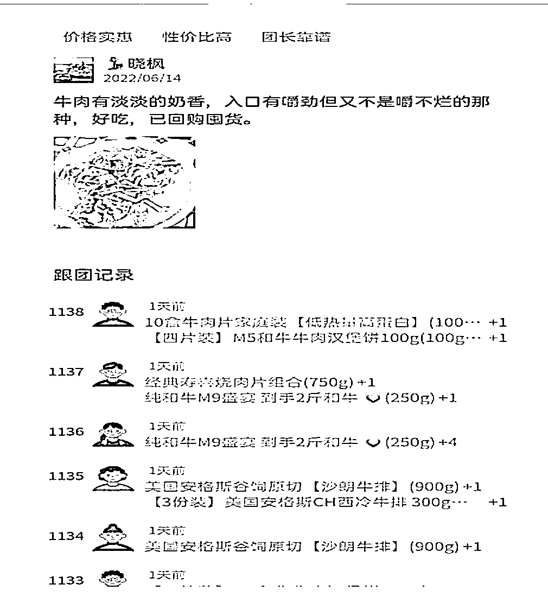

总结一下，我一直认为在社区渠道如果能为社区团购定制化差异化的新品是最好不过的。

 

 

差异化的产品包含很多个方向的思路，差异化的品类，差异化的产品规格，以及差异化的场景，这些都能让你避免同样的一类产品在不同渠道被反复进行比价。

下篇：私域运营

在我们社群团购中，除了和团长合作以外，我们也设立了自己的私域团购渠道，也就是品牌方以团长的身份直接销售产品给终端客户，并且取得了很好的增长效果。

私域运营中最重要的 2 个环节是拉新和复购，简单来说，就是两句话，如何用低成本找到新用户，然后持续地让客户买买买。

# **# **（**4**）活动拉新

寻找新的客户，以及源源不断寻找新的客户永远是私域运营最重要的部分。

拉新的方法有很多种，熟人介绍，朋友圈拉群，活动拉群，以及小红书等其他公域引流都是很好的方法。

 

 

因为很多线上的方法在生财都有介绍，我就重点讲一下不一样的，也是我们做的比较多的方式 —— “线下活动”拉新。

做食品类的产品，其中有个很大的逻辑就是如何低成本让客户去尝试，因为只要你的东西够好，客户尝试以后，就会很容易发展成为你的客户。

因为我们的产品价格偏中高端，考虑到要寻找精准的客户，我们经过很多次的测试，最后定位于针对一些目标社群的活动。

这里要解释一下我们的目标社群，我们的目标社群主要是指集中聚集我们的目标客户的社群，主要包含以下社群活动：

① 青少年体育俱乐部活动

② 企业工会组织的活动

③ 中高端社区活动

④ 其他活动

大家知道，线下活动要投入不少人力和物力，还有时间成本，所以找到精准客户，提高转化率非常重要。

但是找到客户只是第一步，后期的转化和留存也非常重要。

 

 

最早的时候，我们是让客户关注我们的公众号，然后推送我们的产品优惠券，但后来发现，这个路径太长了。

因为客户关注了公众号，但是后期你很难持续跟踪客户，从而导致客户流失。

后来我们的改进策略是：客户试吃满意后，我们用个人微信（企业微信）加客户，然后直接推送优惠券给客户，同时对客户做好分类标签，后续就能做个性化的推荐和跟踪。

这里同时我们会对客户做邀请加入微信群的动作，为后面的持续运营做好准备。

# **# **（**5**）微信群运营

虽然大家都有意识把自己的客户拉到自己的群里，但是实际上微信群的运营是个非常复杂的工作。

考验微信群运营的好坏，我觉得只有两个指标：客户互动率和客户下单转化率。

这两个指标是相互关联的，只有做好了客户互动，才谈的上下单转化率。

客户互动率是考察微信群活跃度最重要的指标，其实就是看客户对你的群的信息的关注情况，你发的消息或链接的点击进入率有多少，试想一下，你在群里发的消息都没有人看的话，你还有什么奢望客户能在你的群里下单呢？

 

 

在做这些之前，我觉得首先要思考一个定位问题，也就是你的群对客户的价值是什么？

大家知道，现在是信息爆炸时代，过多的群的，过多的信息，导致的结果就是客户只能有精力关注自己喜欢的东西，如果你的群的价值不够，最后的结果就是慢慢变成死群。

经过思考，我们对于我们的微信群做了以下的规划：

① 围绕牛肉定期发布一些有价值的内容，包括美食分享，烹饪经验，购买小知识等等。

高价值的内容永远是吸引客户的关键要素，所以找到客户的兴趣点，发布一些对客户有价值的内容永远是关键。

所以自己不断整理有价值的内容，然后分享到群里，制造话题，引发大家的讨论，是提高客户活跃度的重要手段。

所以我们重点做了两件事情：

第一，每周都会发布一些有意思的话题，同时带动大家讨论，  到目前为止，我们引发大家参与比较有意思，互动率比较高的话题包括：

Top1 : 你最喜欢的火锅蘸料是什么？自己怎么制作的。

Top2 : 到底牛肉是否可以反复解冻？

Top3 : 低温慢煮怎么操作，有什么低成本的低温慢煮的方法？

 

 

我放了一些我们互动做的比较好的话题的讨论的截图，大家可以参考了解，看一下我们怎么来激发客户参与的热情。

 

 

可以看到，只有客户对你的群的内容感兴趣，才会更加关注群里的信息，参与群里的互动，也才能提供互动率。

② 定期只有在群里才能够享受的优惠。

其实客户加入群，肯定有一个目的就是希望能够在群里享受到专享的福利。

这个福利本质上就是一种特权，因为这也是让客户觉得加入群的“价值”。对于这种群内的福利，我们做了这样的设计：

每周发布一次群内专享折扣福利

不定期做一些有趣的互动活动福利，包括新品试吃福利，抽奖福利等等

这里我需要强调的一点是，福利很重要，但是发布福利的形式也很重要，大家记住有趣好玩，还能有便宜才是最好的福利活动方式。

我们在群里设计的比较成功的福利活动包括以下两种：

【半价拍卖活动】- 选择一个产品，在群里做零元起拍卖，在 1 分钟内，最后一个出价最高者获得，最高出价可以规定为正常销售价格的半价，保证客户的权益。

 

 

【现金券膨胀活动】- 规定一个时间，客户出 10 元购买抵扣券，第一名购买者，可以  10 元当 50 元使用，第 2-5 名购买者，可以 10 元当 30 元使用.，第 6-20 名购买者，可以 10 元当 20 元使用。

以上两种活动可以让福利变得不确定，从而利用大家“博一博”的心理，提高参与度，对群的活跃度有很大的帮助。

# **# **（**6**）复购转化

提高了客户的参与度，那么就可以在复购转化上下文章了，但是在这里我特别想强调的是，提高复购转化，绝对不是一天到晚不断给客户推送下单的链接，其实这一点我是觉得不合适的，给客户推送产品信息是要讲究两个方面的：

① 推送的时间节点

大家要意识到，产品的推送时间绝对不是越多越好，而是要结合客户的消费频次，最好的节奏是在客户上次购买的产品差不多消耗完了，才推送你的产品。

举例子我们的牛肉产品，一般客户购买牛肉的频次周期大约为一个月 2 次。这样的话，最好推送产品信息的节奏是 1 周 1 次，最多不超过 3 次。

② 推送的内容

 

 

推送的内容大家一定不要简单做群发，结合客户的实际情况做定制化的产品推送是效果最好的。

举个例子，我一般的做法是先询问客户之前的产品感觉如何，有没有什么反馈信息，然后了解客户的要求和想法之后，再来做精准的推荐。

比如客户反馈说想吃瘦一点的牛肉，然后你就可以推荐后腿牛肉，客户说下周要请朋友吃火锅，然后你就推荐火锅套餐。

大家一定要记住，越是精准的推荐，成功率才会越高。

完结篇：最后想说的话

结合上面这两点，我想再总结一下，社区团购要做的好的话，离不开两个核心要素：

一个产品选的好，满足客户的要求，价格有竞争力

第二个是拉新和复购做的好，保证源源不断有新用户，并且不断买买买。

做好了这两个，销售额增长就是时间问题。

 

 

不过如果反思当时我们的发展过程，我们在三个月内能够快速增长，其实还有一个很客观因素就是疫情，疫情期间让团购变得非常火爆。

但是当时，我们却要面临一个最大的挑战就是配送问题，我记得当时顺丰的配送也遇到很大问题，很多网点没有办法配送，我们的产品被顺丰退回。

当时我们没有坐以待毖，而是做了一个现在看来非常难而正确的决定，这个决定在我看来，对于我们后来品牌销售增长起到了很大的作用。

所以在文章的最后一部分，我想和大家分享一下我们当时怎么在极端困难的情况下，完成服务和履约。

因为在我看来，给客户提供超过他预期的，别人做不到的服务，也是一个核心的竞争力。

当时我们面临配送的巨大困难，每天大概有 150-200 多个订单，其中顺丰能完成 50% 不到的订单，我还记得在临近上海封城的后面几天，每天情况是变得越来越难。

有一天我们积压了几乎 150 个订单。当时我和我的小伙伴说，如果这些订单我们无法配送导致客户退款，我们就浪费了好不容易积累的巨大流量，这对后期我们品牌是非常不利的。

于是，我们下定决心，要不惜一切代价，把订单履约完成。

为了履约，我们做了三套方案：

 

 

① 货拉拉配送

② 骑手配送

③ 私家车配送（也就是我自己开车去送）

我们按照上海的区域，把宝山杨浦虹口分为一个配送区域，黄埔静安徐汇作为一个区域，长宁闵行一个区域，浦东一个区域，松江一个区域，每个区域我们再去找相应的货拉拉和骑手来配送。

 

 

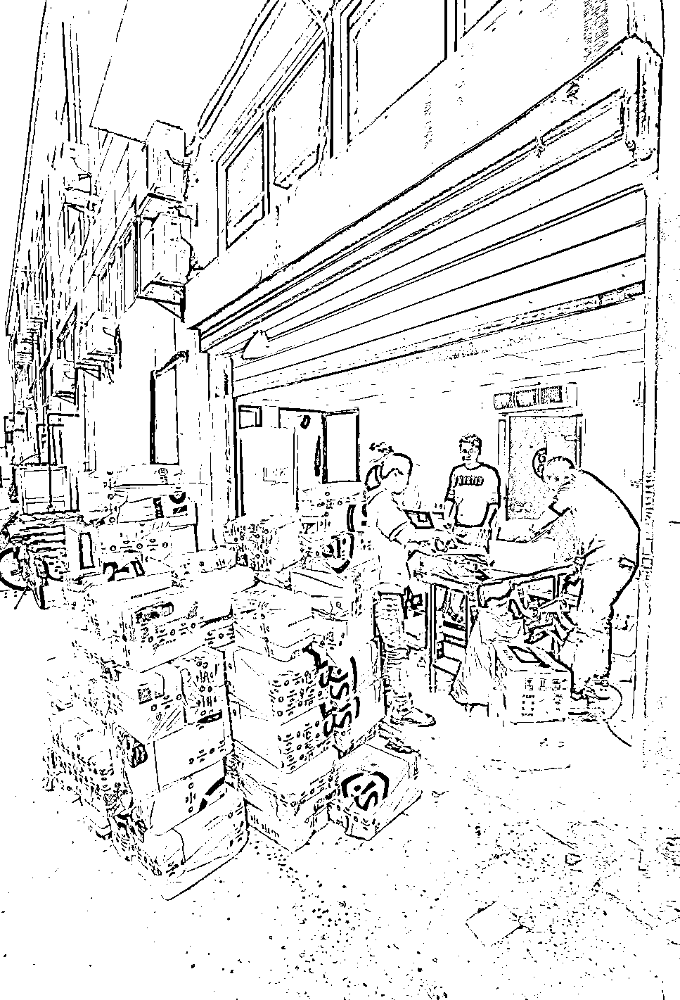

 

 

 

 

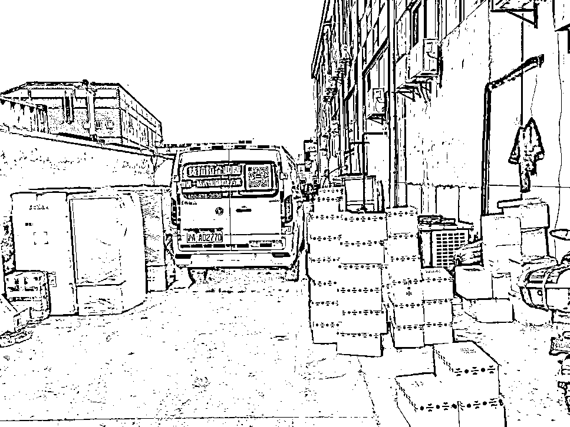

因为当时有很多小区有疫情，要无接触送货，对于每一个司机和骑手，为了确保他们能保质量送到客户手里，我们要求他们拍照留底。

 

 

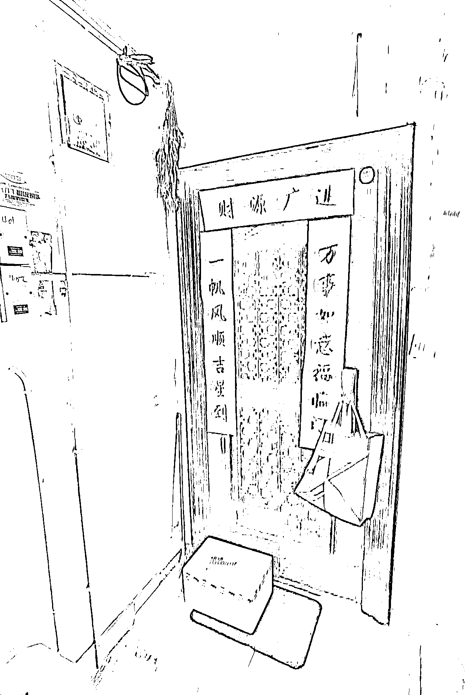

 

 

就这样，我们当时一天最高完成自己配送 150 个订单的最高纪录，当然我们也付出了很大的配送成本，平均每一个订单的配送成本在 30 元左右，比日常的物流配送高出 1 倍。

不过也正是因为，我们当时不计成本的投入保证配送履约，让我们赢得了团长和客户的认可，当时有很多竞品是无法配送到客户手里的，所以这也让我们在后来疫情后面的销售额做到了飞速增长。

回头来看，无论团购是怎样的变化，还是要回归到商业的本质。

借用最近很火的刘强东的话，你不要跟我扯那些乱七八糟的，你们这些管理层不要跟我说那么多花的、新理念的、新词，别跟我说这些，你们要回归常识，回归到商业本质的5个要素（产品、价格、服务、成本、效率）。

 

 

与大家共勉！

评论区：

Unstoppabl* : 福利活动的设计真心不错

许锐 : 特别精准的人群规划和复购提升，学到了~

深藏blue（chu* : 哈哈  还有很多实用招数有机会给大家分享

安神 : 共勉

亦仁 : 感谢分享，已加精华。

倪大胖 : 借用最近很火的刘强东的话，你不要跟我扯那些乱七八糟的，你们这些管理层不要跟我说那么多花的、新理念的、新词，别跟我说这些，你们要回归常识，回归到商业本质的5个要素（产品、价格、服务、成本、效率）。

光子郎 : 你这个产品的毛利率大概多少区间

芷蓝 : 这篇好详细，太厉害了

# 【社群运营】**13**篇

# **# ****(**精华帖**)(605**赞**)20**个步骤：再小的个体，也

# 可以从**0**到**1**，打造出你的个人品牌

作者： V先生

日期：2019-04-24

20个步骤：再小的个体，也可以从0到1，打造出你的个人品牌

新媒体专栏  个人品牌  思路分享

有个朋友问我：张小龙说，再小的个体，也可以有自己的品牌。可是，作为一个普通的宝妈，我没有什么拿手的绝活，怎么打造个人品牌呢？张小龙是不是骗我的？[捂脸] 

 

于是，我给她出了一道思考题：如果定一个栏目，每天输出一段话或者一篇文章，连续输出60天，你准备做什么栏目？

她说：如果定个栏目，我想写关于宝妈在带孩子时如何管理自己情绪的内容。我自己在这条路上走得特别艰辛，也因为艰辛得了些感悟与经验，现在就想拿出来卖卖，但又不知道该怎么做。

于是，我就给她写了20个步骤，这些事并不复杂，都是她可以做到的，不需要什么特殊的技能，只是需要一段时间，需要这段时间里面的努力和耐心。

以下20个步骤适用于从0到1，高手可忽略。供星友们参考~

——

01、确定你的主题，如：宝妈在带孩子时如何管理自己情绪。这个主题就非常好，具有“高频、刚需、痛点”三个特点。

给主题起个名字，比如：宝妈情绪管理（当然，这个主题也不是随便定的，最好是你有这方面的经验或知识储备）

世上有一万招，你不必全会，只要“一招鲜，就可以吃遍天”；你不必和别人比，也不必追求高大上，降龙十八掌和一阳指可以练成绝顶武功，蛤蟆功虽不好看，但依然可以让欧阳锋成为四大高手之“西毒”。

就宝妈情绪管理来说，你就足够专业了，找个男人过来，即便他是大教授，也没你专业。而且，这还不是可有可无的知识，是解决痛点问题的经验。

定位非常非常重要，所以放在第一条说。定位是1，其他的事情都是后面的0。

瞎写也有复利，但写一段时间，你会发现难赚钱，慢慢就没有信心继续写了；明确定位的写作，便于后续做成内容产品，便于为自己打造标签，便于制造成就事件，产生滚雪球效应。

02、把这个主题列一些要点，比如拆成60个要点，要点可以是一个关键词，也可以是一两句话。

03、先随便列，不要受拘束，围绕这个主题做头脑风暴，不要在意是不是要点，不要考虑排列顺序，尽管写下来，建议写在幕布笔记上（如果喜欢用纸写也可以，然后再记录在幕布上）。

 

 

04、把幕布上的要点分为几个模块，假设你列了120个要点，可以分为六个模块，每个模块放20条。

05、把每个模块下面的20条合并，因为有的词或者话，表达不同，但说的是一件事。这样，六个模块，每个模块下面有10个要点。

06、每个点写一篇1000字文章，除了写你的故事、经验、方法、工具，还可以搜一下每个要点的关键词，找些书、网络资料深入读一下。

07、每篇文章写完，发在公众号、简书、头条三个地方，然后找一些知乎相关问题，去回答。同时，还可以制作一些知识卡片，每天发在朋友圈，让人知道你是干嘛的。

08、持续写60天，60篇文章，讲60个点，就是6万字，这就是一门课程了。根据这6万字为底稿，做一门课出来。

09、想好放在哪个平台上，比较常用的是荔枝微课、千聊、小鹅通。但是小鹅通你要有公司开通，比较麻烦。（互联网运营和技术类课程，还可以考虑易灵微课）

10、联系平台的工作人员，如果朋友圈有，那最好，让你微信中朋友介绍平台课程负责人。介绍你和你的课程，如果平台愿意给流量推，那是最好。

11、同时，做一个引流课，简版的，可以做一个引流海报，通过你的内容平台、你的朋友圈、你的群、别人的群、别人帮转朋友圈，来引流。

12、引流来之后，进群，你进行分享，分享是为了吸引后续买课，不是把课全讲了。讲几次之后，以此建两三个五百人微信群。

13、根据这几次群分享的心得和群成员反馈，来修改、完善自己准备放在平台上的课。

14、课程推出后，设置分销，通过这几个微信群来带动传播。

15、聚起来的这几个群，不要解散，因为都是宝妈，有大用处。（比如从宝妈情绪管理，扩展主题到亲子教育，还可以做淘宝客，还可以发展做微商的团队）

16、课程推出来之后，要用尽各方力量去推，做销量。

17、这个销量就是一个成就事件，一方面，可以写进个人标签和履历，另一方面，拿着这个销量数据，再去和其他课程平台谈，也推这门课。（此时，还可以进一步升级一下课程，因为这期间你应该又有新的经历和思考了）

 

 

18、课程内容中，以及课程宣传文案中，可以留下钩子，让人找到你：加你微信，进群。这样，扩展增量，并把公域流量转化为私域流量。

19、这些学员和群，后续可以设计初阶训练营、高阶训练营、线下私房课、会员群等产品，进一步挖掘存量。

20、后续把之前课程的稿子进行扩充，写一本书。推书的时候，就可以拿几个平台的课程销量、训练营多少学员、多少人因为你的课而改变的案例，这些作为背书。同时，书上留公众号二维码，把买书的人引到公众号。

——

从上面可以看出，写作是有复利的，尤其是【集中一个主题、带着框架、切分知识点去写作】，把这个主题写透，发在多平台给更多人看，并把写的做成不同内容产品（一鱼多吃），复利非常大。

——

基本路径是：

定主题-列要点-分模块-读书-写作-内容平台-朋友圈-引流课-种子群-课程-多平台课程-个人微信-学员群-初阶训练营-高阶训练营-书-公众号-线下私房课/会员群

上面说的这20个步骤是可迁移的：

一方面，可迁移到你我他身上，即便没有名气、没有大量粉丝，也可以有自己的个人品牌；

另一方面，可迁移到其他主题上，不管你是做亲子教育、或是健身、或是网赚、或是教英语...

按照这个路径，即便你没有名气，也可以通过努力和耐心，做出自己的内容、知识类产品和个人品牌。

可以大胆去尝试，这件事有百利而无一害，试成了，赚大了，试不成，也没有损失。

——

除了这个从0到1的基本路径，还有些技巧，可以帮助你加速，如果有余力，可以做，如果没余力，做好基本路径就够了。

 

 

12个步骤：如何做出一门体系化网课？

👉

个人品牌：30个增加知名度的宣传方法

👉

社群运营的秘诀其实就20句话

👉

最会赚钱的一帮人，给了我20条启发

👉

——

Written by：V先生

Wechat ID：QQ191286541

ChangeLog：20190426

——

老板，点个赞再走呗？

https://t.zsxq.com/UNNByFi https://t.zsxq.com/2vjQnuj https://t.zsxq.com/EimAaEA https://t.zsxq.com/FamEiur

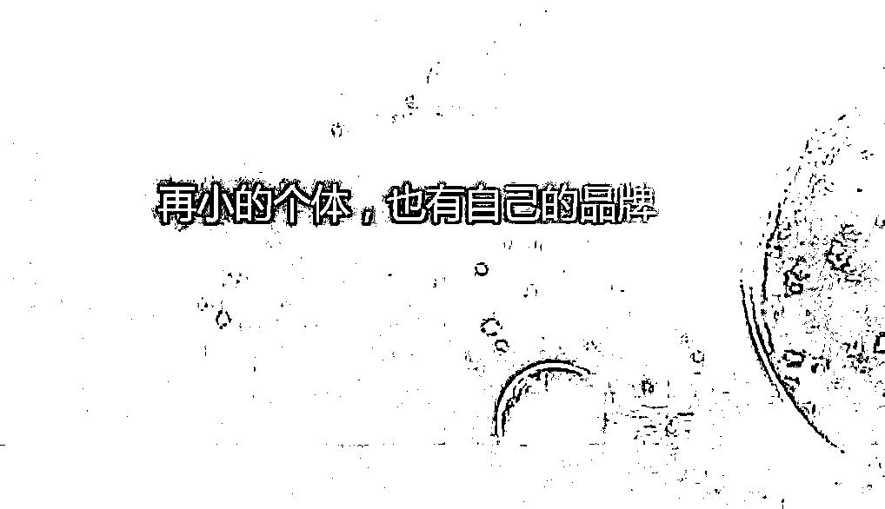

评论区：

 

 

C小调 : 很详细[强][强][强]

Wendy张 : 很详细[强]

雄俊 : 一整套流程，很赞，重要的是根据自身的条件，与优势爱好。定个主题。剩下的就是执行力。

A🔱阿舜 : 干货，模式很方便新手模仿操作，谢谢分享[强]

丁邱洁律师团队 : 先收藏。

一点甜 : 感谢分享，想去试试[愉快]

吉光 : 对我们这种新手来说，简太有用了，谢谢V大！

姣|深圳|自由主义者 : 谢谢分享

# **# ****(**精华帖**)(402**赞**)**社群运营的秘诀，其实就**20**

# 句话

作者： V先生

日期：2019-04-27

社群运营的秘诀，其实就20句话

新媒体专栏  社群  思路分享

01、一定要明确办群目的，定位细分主题，有截止日期，不随便承诺，挖了大坑会埋了自己。

02、说清楚价值：实现什么目标，实现目标能解决什么具体问题，解决了这个问题对各人有哪些好处。

03、如何帮助成员更好地实现进群目标，是设计社群的核心问题，也是衡量社群成功的核心指标。

04、不是你想进就进，限定人数、限定报名日期，最好收费，不收费也要列条件。不设门槛就是浪费时间。

05、全程排期，每天要干啥做成“课表”，让大家可预期。

06、进来后破冰游戏，自我介绍，先让场子热起来。

 

 

07、Cosplay，设定几种角色，突破现实中的角色让人感到新鲜。

08、如果平时不知道做啥，那就定几件事每天打卡，定几个问题每日一问。

09、创造话题和氛围，让大家自己聊起来，没人聊咋办？找几个托、美女或者话唠。

10、搞些小活动，创造多种链接，让陌生人认识陌生人，比如分组、技能交换、互评文章、给对方写一封信、给对方打一个电话、给对方送一份礼物、打卡PK、同城涮火锅、穿越大半个中国去睡你...

11、屁大点活动都要起个响亮的名字，要分环节，要隆重，搞得有仪式感、有参与感、有获得感。

“三感”看似是形式，其实是为了让成员对这件事有感知。因为我们在日常生活中，经常糊里糊涂的，你得告诉他在做什么事、得到了什么，他才会从无意识中惊醒：原来我在做这么一件事。

同样的动作，命名和不命名、起个普通的名字和起个给人深刻印象的名字，参与者的感知不同，对他的影响也不同。

12、动作要简单，给模板，降低参与成本，让傻子也能照着做。

13、你想要什么样的行为，就奖励什么样的行为；你不想要什么样的行为，就惩罚什么样的行为。以奖励为主。

14、群规是鞭子，几条就好，太多了会烦人，沦为摆设。

15、红包、优惠券、礼物、奖金、排行榜、荣誉称号、勋章是蜜糖；大奖要设定必要难度，小惊喜要高频。

16、晒精华群聊、晒成果、晒成员故事。可以写成文章、做成海报、录成语音、拍成视频。最简单的方式是截图发朋友圈。

17、结束的时候，激励大家做总结并输出到各个内容平台，谈收获、谈成果、谈改变。

18、每天记录运营日记，进行复盘，记下问题点，思考如何改善。核心问题是两个：有没有帮助社群成员更好地实现进群目标，有没有创造人与人之间的多种链接。

19、不要一个人干运营，会累死的。找助手、建团队，越早越好。绘制流程图、积累知识库，可以支撑团队打更大的仗。

 

 

20、社群品牌的十位一体：创始人、社群名字、Logo、一句Slogan、目标群体、核心价值、原则、元经典、成果、成员故事。

要天天说，反复说，对内说，对外说，写成文章说，做成海报说，做成gif表情包说、做直播说，录成视频说，唱成歌曲说。

——

以上20条的关键词分别为：

主题、价值、目标、门槛、排期

破冰、角色、打卡、话题、链接

仪式、模板、奖惩、群规、惊喜

晒图、改变、复盘、团队、品牌

——

20个步骤：再小的个体，也可以从0到1，打造出你的个人品牌

👉

12个步骤：如何做出一门体系化网课？

👉

个人品牌：30个增加知名度的宣传方法

👉

——

Written by：V先生

WeChat ID：QQ191286541

ChangeLog：20190427

——

老板，点个赞再走呗？

https://t.zsxq.com/jiEa2zj https://t.zsxq.com/UNNByFi https://t.zsxq.com/2vjQnuj

 

 

 

 

评论区：

亦仁 : 无所不知的V神，佩服。  没做过社群的感觉不强，我做生财有术到第三年，对这20个关键词感受很深，每一个关键词都能讲出正反例来。

公子京 : 亦仁大佬，你得赶紧来点猛料啊，不然风头都被V神抢了[奸笑] 亦仁 : 一年长的很，慢慢来。

V先生 : 作为社群的创始人，亦仁最重要的是设计玩法、激励共同输出内容、整合资源~这个#新媒体专栏#就是亦仁邀请开设哒，不像你们会玩技术，我只能在这方面做点力所能及的事~[偷笑]

V先生 : 抱住亦仁大腿，好好学习#生财合伙人#和其他精华帖，我要在技术、流量、电商这块补补课~[玫瑰][玫瑰]

瓜神 : 你真的好厉害，每天的文章都能给我很大触发

在路上 : V先生是位高人，却不高高在上，和蔼可亲。

瓜神 : 太厉害了，太厉害了，太厉害了！！

# **# ****(**精华帖**)(276**赞**)7000+**人单价**365**元**-**年的高

# 格调女性社群运营思路分享

作者：  亦仁

日期：2020-07-29

每一个人都有被关注的需求，每一个群体都有互相链接的需求，而垂直付费社群是这样一个很好的方式，它可以摒弃噪音，让真正同频的人聚集到一起，深度交流与链接。

生财有术是这样一个垂直社群，设计师日记是这样一个垂直社群，知识星球的每一个小星球都是这样的社群。

如果你发现，与你有某个共同兴趣爱好的群体，还缺乏高质量的交流的地方，注意了，一个新社群的机会。

今天的  ，我带大家认识一位高格调女性社群的创始人  ，听听她是怎么认知以及如何运营这样的社群的。

一起欢迎  👏

 

 

对了，顺便提一下，下午预告帖，很多人好奇  的性别，TA后来回帖说，圈友有兴趣的可以私下约 TA 吃饭交流，（龙珠圈友优先，这句我补的），嗯，我就帮你们到这了。

———

生财有术的星友们大家好，我是花神妙的Juan，非常感谢亦仁邀请，来这里做一次关于运营高格调女性社群的分享。

目前我有一个7000+人、单价365元/年的知识星球【花神妙华云境】，十万粉丝情感公众号【花神妙】，以及一个女性生活方式类的付费千聊直播间。收入构成是:星球⻔票收入、星球付费提问收入、公众号广告收入、直播收入、私密咨询收入。

年收入七位数，我只当零花钱，我的主业是做家庭主妇。

【明暗线交织的个人经历】

在说社群之前，先说说个人经历。我个人的经历分两条线，一条是明线，一条是暗线。

明线里，我来自江苏的普通家庭，求学经历正常而平淡，18岁就读南京大学本科，是亦仁的校友，后来去上海戏剧学院读戏剧文学的硕士，毕业以后呆过几家大公司，后来做自媒体。

以上是明线，都是事实，但是从明线简历里，看不到一个人身上存在的另外一面的灵魂。

这也是我对人性的复杂面有兴趣的地方。我虽然在做情感公众号和情感社群，但是情感只是表象，内在对人对探索才是精髓。

因为我作为个人，就有着很多面，这些多面同时存在，丰富了我的生活和人生体验，让短暂的一生有几世的丰富度。

暗线里，我从初中起就非常喜欢阅读，从阅读中领悟到了很多学校、老师和家⻓不会告诉我，或者他们自己也不知道的很多世间规则。很多试卷只是一遍遍重复去做，并没有太大意义，一两次模拟考的分数也不会让我产生情绪波动，于是我腾出时间来保持自己的阅读习惯。表面上，我还是乖乖遵守学校规则，老老实实完成学业，老老实实去读大学，但内里，按照自己的进度去自我学习。

到了大学，我还是一遍跟着文学院的步伐学习，一遍去学其他学科的知识(只要能看得懂)。

很多人会对一个情感博主本人的情感经历有兴趣。因为我在初中起由于阅读量大，就很早熟，所以我知道初高中的恋爱不是我想要的，初高中阶段我就应该做两件事“在学校层 

 

面考上好大学，在内在层面抓紧时间自学知识”，所以早恋是不存在的。

事实上，谈很多次恋爱并不能增加一个人对恋爱的洞察，但跟谁谈恋爱则非常重要。当你站的位置越高，看到的⻛景不同，跟你谈恋爱的人也会不同，你对世界和人心的感受也会不同。

回首来看，因为读了南京大学，这个大学提供的高平台，让我认识了后来对我产生重大影响的男士，由此从暗线上改变了我的命运。当然，一个20岁女生能清晰知道自己要什么，跟12岁起的内在阅读是相关的。

南京大学提供的教育很严格，但是靠着南大校友层层介绍而认识的男士，却给了我另外一种独特、稀有、私家、立体的商学院式教育。他给我权限，可以使用国内顶级商学院的图书馆，参加一流企业家的讲座，去全世界各地的公司参观，这些都是暗线的成⻓。

许多年以后，我还是一遍遍对他说感谢:感谢你，给了我另外的瑰丽一生。

因为切身体会过一个好的伴侣，能对一个女人的成⻓有多重要，所以这也是创建一个女性情感社群的初衷之一。

选择那个能带给你瑰丽人生的人，或者起码是能带给你更丰富生活的人。当然这里面很复杂，涉及对方方面面领域内的了解。

举个例子，很多女生喜欢投行男，觉得投行男高学历、帅、体面、收入高，但是如果放一个互联网大公司的战投男到她们面前，她们就会觉得“噢，在互联网公司打工的啊，不如投行男!”

这就是对行业的不了解导致判断失误，事实上，互联网大厂战投男的含金量，不逊于、甚至某种程度高于传统投行男。一个女孩子得掌握科技、商业、文化等的知识，才不会被忽悠，才会从一个男人的行业履历里倒推其性格特质和未来前景。

婚恋如此的复杂，在于越是高层面，社会人的属性越强。所以，仅仅我一个人的力量还不够，整个【花神妙华云境】的星球，来自各行业的星友们交流对行业的信息，对其他星友有重要参考价值。

【创建社群缘起】

创建知识星球【花神妙华云境】社群的具体缘起，是因为当时做公众号【花神妙】已经2年多，公众号的商业化就是接广告。但是，当时阅读数并不算很高，而且我还坚持只接次条广告，所以广告费也不高。对于内容精品、非大流量的公众号，接广告的方式带来的收益有限。

 

 

2017年，当自媒体圈中人都在开始尝试用小密圈的时候，我虽然不知道小密圈是什么，但也跟着创建了一个小密圈。

当时的小密圈创建非常简单，几分钟就创建完毕，不需要像后来那么复杂。创建了一个小密圈以后，我没有想好能在小密圈做什么、怎么做，没有规划。只是创建了，然后等等看会发生什么。

对于很多新事物，我都保持着一种开放的、尝试的态度。如果凡事都要做详细的调查再去做，我觉得会错过很多机会。

创建了小密圈以后，我就把海报放微博上去。当时小密圈最低定价50元，我看其他一些大咖定价在99元、129元左右，心想自己不算大咖，就定个66元的保守价吧。

然后发生了什么?我的手机不断有提示有新人加入了小密圈，很快小密圈钱包里就有六七千块钱。

当时我的想法是:天啊，已经这么多人交了钱入社群，可是我还完全不知道应该怎么做这个社群啊!虽然对怎么做这个社群一无所知，但是我从做【花神妙】公众号起，就有一个心法:随顺众生。我不用想我应该怎么做这个社群，让大家来告诉我应该怎么做这个社群。

用户真的比我聪明。很快，就有星友发现了小密圈的提问功能，她们用这个功能向我提问，这启发了我，为什么不可以做成一个纯问答社群呢?

后来在【花神妙华云境】星球之内，内容分为3个部分:提问内容、回答内容、评论内容。

星主和嘉宾都会严选提问内容。只有有价值的提问、带着真实个人情况或思考的提问，会得到回答。这就屏蔽了那些随意的、带着强烈情绪的、对其他星友阅读体验差的提问，这就让每一个提问内容本身都有可阅读性。

星主和嘉宾回答星球问题，也会非常认真、具有可阅读性。目标是:回答内容本身单独拿出来，也如同一篇篇独立精彩的文章。

整个星球的严谨气质，也影响了评论区。评论区的读者评论往往带着深度思考，经常有几百字以上的评论。那些在评论区活跃、具有真知灼⻅的星友，会选拔成为嘉宾。

华为的任正非任总有一句话:资源是会枯竭的，唯有文化生生不息。

 

 

【花神妙】的公众号和知识星球【花神妙华云境】，追求“随顺众生、严谨”的文化氛围，用隐形的精神追求来团结志同道合的人。

目前星球的收入主要就是⻔票收入和付费提问。【社群的内在逻辑和文化属性】1.【随顺众生】。在创建【花神妙】公众号之初，我对方向还比较茫然。那时候我去了一趟宜兴的大觉寺，看到一句话“随顺众生”。

与传统的、历史悠久的寺庙相比，宜兴的大觉寺是一座新的寺庙。之所以能在很短的时间内就建立起这么宏伟、大规模的寺庙，因为它团结了千千万万愿意为它的降生而付出的人(众生)。那里的气场是“温暖”。

那个气场带给我启发，我应该把做一个线上的温暖气场聚集地为方向。

随顺众生，尊重众生心中的一朵朵花，试图去理解她们为什么有那样的想法，让她们表达欢乐、迷醉、痛苦，随她们的喜悲，顺她们的细思。

常⻅的女性情感博主会输出自己的价值观，她们是意⻅领袖，是光圈的焦点，那是一种模式。但是我的核心逻辑是“随顺众生”，众生在我的前面，充分尊重众生的表达欲。

在知识星球内，星友们可以发布不同的看法，但是不能触碰“伤害星球生态”的红线。如果有人出现对其他星友的人身攻击，那么会立刻拉黑。过于情绪化的表达。也会受到相应的遏制。

2.【隐秘的高⻔槛:“人间文化”】。

【花神妙】系列文章本身就是一种筛选，用词严谨、理性分析，并且每一期推文都会引入经济学、投资学、历史学、文学甚至园艺学等各学科的知识、概念，用查理芒格的格栅理论，让情感问题不仅仅是情感问题，而是通过情感问题来举一反三，对生活工作的其他方面进行思考。简称为“人间文化”。

这一种严谨的文章，必然对读者的阅读力有一定的考验。筛掉了那些文化水平欠缺，或者不愿意进行深度思考的读者。

这样筛选的结果，就是【花神妙】的粉丝里面高社会地位、高学历的女性比例非常高，她们都是喜欢从阅读启发中得到快乐的人。

之所以【花神妙】系列文章呈现出这一种独特的气质，跟我本人的偏好有关。虽然身为情感博主，但是我的兴趣爱好主要在文化方面。写情感文章的时候，夹带各个学科里面我有兴趣的私货，一开始只是无意为之，后来我发现，有同好的读者不少，于是逐渐形成了这独特的文章气质。

 

 

追求“文化”的需求非常隐秘，藏在很多人心里。一旦你开始用真知、文化去跟这些人交流，大家会通过“文化密码”彼此认出。

文化认可是一种隐秘的高⻔槛。因为一个人有文化，是需要禀赋、多年的刻意练习、发自内心的热爱，这些无法假装。一旦她们能彼此认出，互相之间会珍惜这样的关系。

与纯学术研究型的文化相比，花神妙主张的“人间文化”，并不拘泥于学科之内，而是能应用到日常生活之中，并且带着变身一般的魅惑力。

比如，提到三星堆的经典人像，是一层⻘铜面具外另加一层⻩金做的面具，花神妙会用来比喻当一个女生想营销自己时，普通女生只知道通过医美等方式让自己戴一层漂亮的“⻘铜面具”，而更加用心的女生则会用“创业成功”等更稀罕的标签，来给自己再加上一层”⻩金面具”。

3.【积累质地高级的品牌资产】一个聚集着很多女人的情感社群，很容易被想象成“聚集着女人们的情绪”，或者“一起为一个现实的目标努力”，这些也都很好，但是我希望在功能性之外，积累质地高级的品牌资产。

“质地高级”的意思是，能引起人们心中的“敬意”。

花神妙系列虽然由我主理，但是知识星球的嘉宾、千聊直播间的嘉宾们也很重要。选择嘉宾的条件是:她们一定是在各个领域内让人“尊敬”的，她们通常有着世界一流的教育背景、非常肯吃苦，有真知灼⻅。

起心动念的正派，也是得到人们敬意的前提。人性中有很多缺陷和弱点，尤其在情感世界中，掌握了一定人性规律的女孩子，稍加使用就能得到很多她想要的结果。但是花神妙系列只是指出人性中的复杂面，却绝不鼓励星友们加之邪恶使用。因为，那不高级，那样做的人不会得到社会的尊敬，鼓励那样做的社群也不会得到星友们的尊敬。

在“我能帮助星友们得到多少好处”之外，还有”我能让多少人尊敬这个花神妙这个品牌，以及让她们自身时时刻刻意识到被尊敬的价值”?

以上分享的内容可能偏务虚，不过这些确实是我的真实心声。我亲眼看⻅来自起心动念的种子，放到互联网的土壤里，如何迅猛⻓出一朵朵花。

【庭下如积水空明，水中藻荇交横，盖竹柏影也。

何夜无月?

何处无竹柏?但少闲人如吾两人者耳。】

 

 

苏轼在《记承天寺夜游》里，写眼前的实景:月亮、松柏都很寻常，难得的是当夜两个人的心境之闲。

对我来说，运营社群的技巧虽然重要，但是更难得的是，技巧背后的心境。

评论区：

Juan : 非常感谢亦仁！

很高兴能和生财的朋友们进行这样的分享。

很多话是我没有公开说过的，但生财社群就是有这样奇妙的魔力，能让人真诚分享自己的道路、脆弱和追求。[爱心]

Mike : 这文风，牛逼

阿佐 : 哈哈，还没看完，忍不住先评论一下。为什么亦仁要用「TA」? 为啥不直接用「她」呢？

亦仁 : 感谢Juan真诚分享[呲牙]

亦仁 : 完了，被你破案了

Don : [玫瑰]

官敏 : 感谢分享！[玫瑰]

随顺众生、利他——这些在佛教中看到的词，在大神们的分享中、演绎中，我们都被植入了一颗，善的种子。

Zhong阿钟 : 那条看不见的暗线，构成一个人的精神与灵魂

# **# ****(**精华帖**)(152**赞**)**芷蓝：做付费社群几年，我

# 都有哪些心得跟技巧

作者：  芷蓝

日期：2021-03-04

这几年做付费社群，有一些小心得和小技巧，芷蓝给大家分享一下。不一定适合所有人，但都是自己实践出来的，希望对你能有一些小启发。

一、做社群之前要想明白哪几个问题？

 

 

无论做啥事，动手之前，需要想明白 3 个问题，做社群也一样。

1、我为什么要做社群？

我自己做社群的原因，是因为之前在公司从事相关业务领域，并且 4 年前我离职的时候，正好赶上知识付费兴起，我想把社群运营作为我创业初期变现的一个重要渠道。

2、我要把社群做出什么样的结果？

我做的是付费社群，我要的结果有2个衡量指标，一个是用户数量，一个是变现程度。现在一年基本上可以新增 1000 个付费用户，已经做了6个社群，社群这块每年可以带给我50万左右的收入。（刨去一年的各种花销总算也能存下写钱了，图123）

3、我要怎么开始去操作？

这个问题后续会在各种具体的实操细节中展现，这里就不讲了，大家只要知道以上 3 个问题是你在做社群之前要想明白的就行了。

二、怎么给社群做定位？

想明白自己为什么要做社群之后，就该琢磨自己要做一个什么社群了？

这个问题困扰着很多新媒体人，甚至有的人因为这个问题，一直拖着自己的行动计划，最终不了了之。这里我给大家分享一下自己总结的社群定位思考方法，不能说适合所有人，但还是有一定的实操性。

1、这事能赚钱

谨记新媒体营销第一法则：不赚钱的事儿，一定干不长！

所以，无论你的社群定位在哪个市场、哪个人群、哪个领域，都要保证在未来某一个时间段内可以通过社群变现。

只有持续的物质正向反馈（不是说精神反馈不行，有个例，但极少数）才能让你把这个社群运营的更好、更长久。

2、内容可持续

作为一个社群创始人，一个社群运营者，一个群主，你要清楚你的社群到底为用户提供了什么价值？想不清楚这个事情，你的社群肯定走不远。

 

 

在社群运营初期（1.0阶段）我认为，内容即价值。也就是说，你要不断地给群里输出内容，才能维持社群地运转。

我相信，大部分用户，在社群创建初期，都很难请来一些嘉宾或者大咖为你站台，为你分享！所以，前期只能靠自己，那么你给自己定的输出门槛就不能太高，太高你抗不住，坚持不了多久就歇菜了。

说说我自己吧，我当时建群的时候，正好知识付费行业正火。我发现了一个问题，即很多课程和海报宣传的不一样，内容良莠不齐，价格还挺贵，很多人买回来学习了一两节就后悔。

于是，我就想，能不能建个群，把我自己学习过的，觉得靠谱的课程，推荐给大家呢？

未来社群发展起来后，能不能发动大家都来分享呢？（图4）

变现方式可以是会员费，后期也可以赚取课程分销佣金。想清楚这些之后，我果断建群，输出内容定位用户运营（和自己之前从事的工作有关），每天的动作就是挑选并拆解自己购买过的优质课程中的重点内容给大家，并加入自己的实操心得。（图5）每天大概占用1个小时的时间，而且难度也不高，大家也挺喜欢。

虽然现在社群的定位已经改了两回，但是【好课笔记】这个栏目，我一直坚持了下来，也因为这个栏目，我一年通过分销课程的佣金就超过了10万以上.

而且，现在社群里有越来越多的人加入了这个项目中，并且还增加了课后作业、脑图制作、点评等新的动作元素。

3、这事我喜欢

不多解释，一个人无论是创业还是岗位职责，都是想把自己喜欢的事情，做成一份事业。长久地去坚持一件事情，除了物质激励，一定还有理想和热情。

我做付费社群这几年来，每次看到电脑里沉淀下来的嘉宾分享文稿，看到社群里一次次地用户喜报，看到大家一起交流一个问题时的热情和气氛，都会下定决心把这个社群做的更好更长久。

三、社群定位可以修改吗？

可以！咱们都知道，完成大于完美！

定位是在操作过程中一次次迭代和修正的，而不是光靠想，就想到完美的！

 

 

拿我来说，初建社群时的定位是『用户运营』技能、知识和资料的分享，主要画像为互联网行业相关岗位1-3年经验的用户。

但是，在后期的运营过程中，我发现这类用户的需求必须在实际的项目操作过程中才能被满足，而刚好知识付费行业的风口逐渐转向新媒体营销、副业变现这个领域。

于是，我修改了社群的定位，发现引流文章的效果和社群变现周期都提高了很多。所以，不要把定位想成一锤子的买卖，只要你能在大脑里想出一个社群架构和行动路径，就别犹豫了，开干！

四、社群有哪些变现的方式？

1、付费会员

2、社群淘客

3、社群卖货（自有品牌等）

4、已加入会员的增值付费

5、资源对接，赚取手续费。

基本就是以上这些了，如果你还有新的玩法，欢迎在评论区给芷蓝留言，我会补充上去。在后续的问题中，我会逐个把每一种变现方法分享给大家。

五、付费社群一开始怎么收费？

之前有很多会员问过我这个问题，俗话说万事开头难，我自己刚开始建立付费社群的思路分享给大家作为参考。

1、自带 IP 光环

这种情况很好办，因为用户已经购买过你的产品，或者认可的内容。你想做社群，只需要列出一个会员的权益清单即可。

平台类型的社群，多突出链接价值。（群里有各行各业的大咖，每周分享巴拉巴拉之类的）

这里举个例子，比如我前段时间加入了老胡的知识星球『淘客公园』就是典型的自带光环做社群的案例。胡总在淘客圈混这么多年，已经是这个领域非常大的知识 IP 了，之前一直没有做社群，这回创建自己的淘客圈子，几天时间就有几千人加入。（图6） 

 

服务类型的社群，多突出交付价值。（XXX天内，可以帮助您达成什么样的收益或者效果）

2、  你还没有名气

这种情况，我建议分阶段设置。第一个阶段，主要是丰富你的社群资源，包括人和内容。

所以前几个月，你可以不收费，为社群用户提供一些有价值的信息和工具，目的是刺激用户 UGC 的产出。

举个例子，我当时在社群刚建立的时候，就是免费的，而且我还自己购买了一些社群裂变工具，例如小鹅通、一起学堂等，然后免费提供给社群里的用户做活动裂变。

做完后，让用户把整个活动的复盘分享到社群里，不断地积累原创素材。

当你的社群度过了原始积累状态，就可以对外去做推广了，这时可以设置一个较低的会员费。

然后等会员进来后，再次用这种方法去鼓励新用户做原创内容，而且之前已经分享过的朋友，可以作为嘉宾来影响新用户。

到此为止，付费社群的基础模型就出来了。

六、怎么构建社群的吸引力系统？

做付费社群的朋友，肯定经常思考这个问题。就是怎么才能让人愿意加入你的社群，怎样才能让自己的社群更有吸引力呢？

你需要一个巫师麻瓜系统，这也是我以前听得到 APP 的某一期节目后，想明白的。什么意思？

就是你的社群永远不能只有一种属性的人。

比如，你只招小白，收他们的会员费，进群？别忘了，小白最不愿意的就是跟小白一起玩，不要觉得大家都愿意找认同感，愿意每天和自己一个段位的人交流，免费群可以，人家是付费的啊。

所以，你要去免费请，或者付费请一些某个领域的大咖，来你的会员群里做客。（图7）OK 上面说的是麻瓜，麻瓜需要学习，需要去链接优秀的巫师，需要成长，那巫师需要什么呢？大咖需要什么呢？

 

 

他们需要更多的粉丝，需要心理上被崇拜，需要为他们的产品做更多的曝光，需要连接更多的群主！这是大咖来你群里的意义。

我的群里邀请过很多垂直领域的 IP 来做分享，当然，分享结束后，肯定要推荐一下他们的付费教程、训练营或者其它产品。

只有不断的利益交换和利他行为，才能碰撞出价值。

你的社群要不断地维持这种吸引力系统，不断地保持二八原则，让优秀的人处于少数，普通的人处于多数。一旦这个平衡被打破，吸引力就会下降。

而作为一个社群运营者，你要时刻注意用户的成长，某些有天分或者非常努力的用户，要去帮助他们更高频次的链接更好的资源和人脉。

当你在一个小白的成长期帮助他，就想是一个投资行为，未来他的 IP 增值，也会为你带来源源不断的流量和钱。

七、社群不活跃怎么办？

这里我给大家一些自己运营社群的小技巧，都是比较实用的，没有方法论。当然，每个人的社群情况不同，制作参考，欢迎补充交换意见。

1、新人进群，尽量多给他一些聚光灯，让一个新用户充分感受到社群的温暖和力量。如果一开始就悄悄的进群呢，后面的破冰一定不好操作。

所以，每次新人进群都会发固定额度的红包，引导大家列队欢迎，并且单独@新会员发自我介绍。如果新会员的地理位置、垂直技能、工作领域，有和之前会员相同的，我会再次单独@他们，鼓励相互连接。

这样能让用户快速找到归属感和小圈子，社群里需要小圈子，这样才能永远有话题。

（图8）

2、如果你觉得群里某一个时刻没有话题，没有人说话，或者很冷清。你可以主动@群里的某个会员来制造话题，注意，重点是@某个会员。这样，只要他看到，就不好意沉默下去。

3、要不断地去人为制造话题。社交活动是以话题为导向的，当群里没有了自然话题时，作为运营者就要去主动制作话题。

制造话题要符合社群的调性，举个例子，你的社群定位是关于新媒体营销的，你就不要为了气氛而去制造两性情感的话题。

 

 

但是，你可以把热门话题和社群定位想结合，比如“群里有多少做新媒体岗位的同学，还是单身？”这样，就能很轻松的把话题引向新媒体收入这个方向，从而回到正轨。

4、社群一定要舍得发红包，而且不能太小，宁可少发几个，也要保证单个红包的金额。

5、用小调查＋红包的形式。比如，我经常在自己的淘客社群里做小调查，类似于大家早餐吃什么这样的问题。尽量不要设置开放性内容，毕竟用户不想思考，不想多打字，懒是天性。设置好 A B C 这样的答案，让大家自己去选，顺便发个红包。当用户回答了你的问题，在某种程度上，他心理就认可了你的行为和动作。你再去推广相关的产品，他也比较好接受。（图9）

八、社群怎么去中心化？

在我的意识里，社群有 2 种形态，一个是点状发散，一个是网状互联。

什么意思？

第一种类似于明星群，整个社群全部围绕着群主或者一个大 IP 转，平时所有话题，所有活动也都是由群主来发起。

第二种就是平台类型的群，群主提供这个社群这个平台，群友互相链接价值，合作项目，共产内容。

我本人更倾向于第二种模式的社群，这也是去中心化的社群，由于群里用户之间的链接，整个社群关系呈现网状，社群关系更加紧密。

第一种社群，会随着群主的懒惰，慢慢消失能量，因为一个人的精力有限，你很难保证在未来几年内不停地为群里输送源源不断的价值。

而第二种社群，即使群主不在，群里的用户也能共同维护这个平台，维护社群的良好发展。

那怎么去中心化呢？

1、运营一个活动，让一篇社群用户尽可能地参与进去。比如，像咱们生财的大航海项目，就让很多之前不相识的圈友，因为一次合作，成为了朋友。

比如，我自己的社群也会搞这种内容共产的项目，把群友带进一个具体的项目流程操作过程中，在这个过程中互相写作，互相链接。

 

 

（这里有张图，是社群里同学一起做的一期新媒体锦囊，封面设计的还挺好看，因为星球只能9张，就算了）

2、制作和不断更新自己社群的运营 SOP

比如我群里每天的好课笔记，每周2次的实操分享等等，把这些运营动作固定下来，成为社群的一种仪式。在这个过程中，社群就不慢慢地自己转起来。

会有更多的人，愿意参与到整个社群运营的流程中来。

九、怎样让社群不断地自动裂变新用户进来？

利益驱动＋荣誉感。

一个人愿意去分享的原因就这2个，一个是分享我有钱赚，一个是分享后，大家会觉得我是XX的一个人。

所有推荐我社群的会员，只要用户加入，我都会给到 50% 的红包返现，推荐加入50个以上，我会给到 90% 的会员费返现，并邀请成为合伙人。

钱＋荣誉感=自动裂变。

我的群里有20几个人，每个月都会固定给我推荐过来很多会员。

十、有哪些好用的社群运营工具？

1、知识星球

首推肯定是知识星球啦，大家都熟悉，就不多说了。3年的时间里，知识星球帮我沉淀了太多会员社群的精华分享，还有大家的学习和实操心得。

对于我们做社群运营的人来说，用户的原创内容非常重要，这是你社群最重要的一笔资产。而知识星球不但可以帮你沉淀社群内容，还有发作业、打卡、赞赏和分销等功能，可以帮助你提高社群中用户的互动率。

知识星球是免费的，没有用过的同学可以下载一个看看，感觉的话可以搜索『玩赚新媒』来看看芷蓝的知识星球。

2、星云留客

星云留客最爽的一个功能是可以批量登录多个微信号，实现营销信息的统一管理和发送。这个功能非常适合知识付费团队的运营！

 

 

另外，它的群发功能也很强大，支持文字、图片、语音、链接等各种内容形式的发送，深度嵌入微信的营销系统内。

同时，如果你团队里有很多微信号，也可以利用星云留客来统一同步朋友圈，定时发送朋友圈信息等。我最早是看到媒老板团队一直在用，感觉很强大，自己也体验了一下，确实不错。

3、一起学堂

如果你的社群经常会组织嘉宾分享，那建议你使用一起学堂这个工具。

它可以帮你实时同步每一个微信群内的语音、图片、链接和小视频等内容，嘉宾只需要在一个群里做分享就行了。

而且，它还有直播＋录播＋重播的功能，即使有些社群用户错过了直播分享，还能看重播，算是很方便了。

4、小鹅通

我之前也是通过咱们龙珠俱乐部的一位朋友买到了优惠的专业版，6000多元，其实说实话，大部分功能都没用到，因为小鹅通的营销功能实在太多了。

如果你没有自己的知识付费平台，我觉得个人版本就够用了。我最近在通过小鹅通的内容分销功能＋公众号＋视频，做课程分销，刚有点起色，未来再给大家分享。

好啦，以为星球只有9张图，后面有些内容，就传图，但是意思大概就是那个意思。

希望这些内容，可以帮助到想做社群的同学。如果有啥关于社群运营的问题，也欢迎随时和我交流。我的微信（3154465626）记得备注下生财。

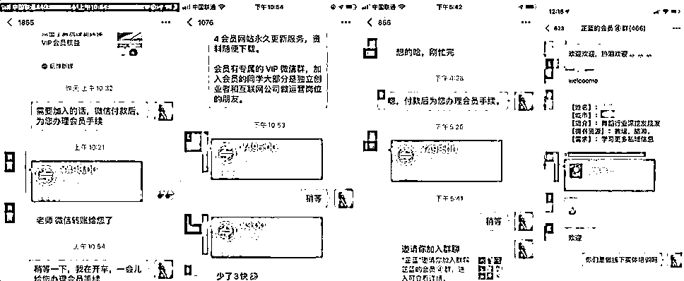

 

 

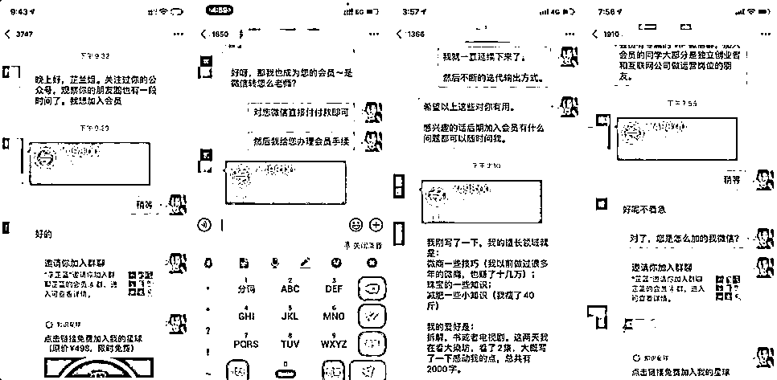

 

 

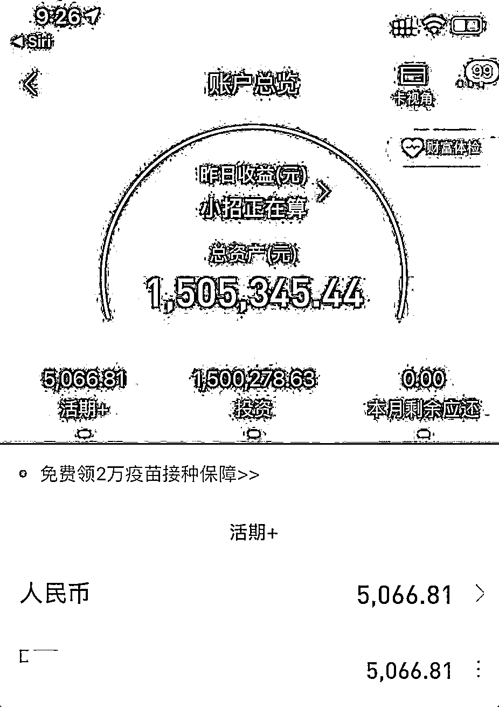

 

 

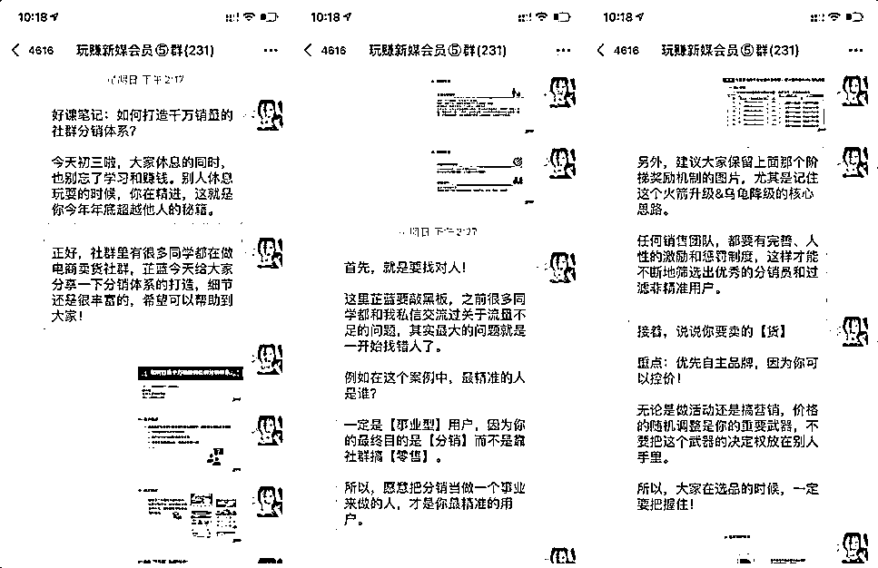 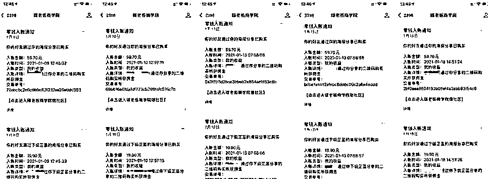

 

 

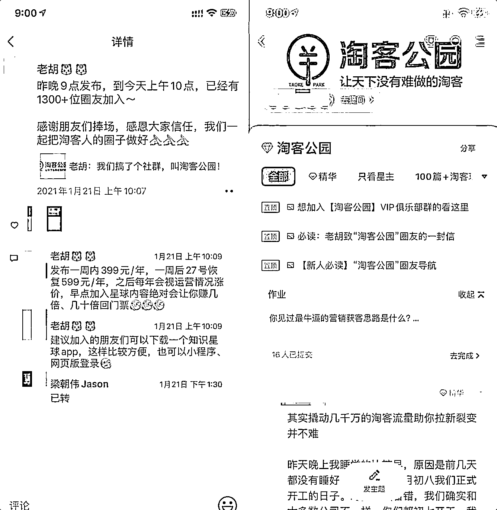

 

 

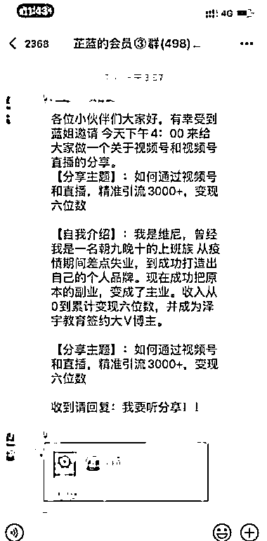

 

 

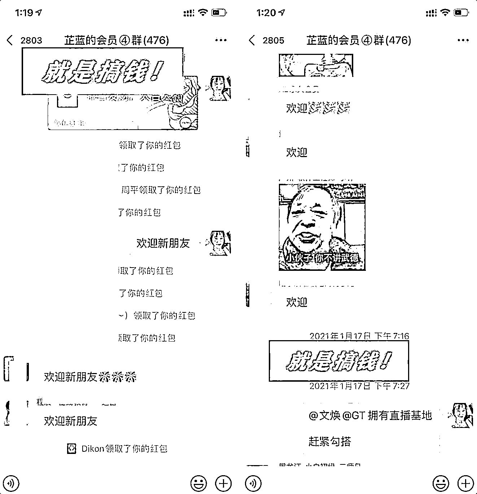

 

 

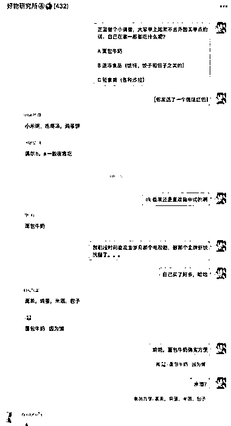

评论区：

多米妈妈 : 优秀

白酱油 : 给蓝姐打卡[呲牙]

云豪私人号 : 我也是会员之一，越分享越幸运。我今年准备花30万加入各种付费社群。

提高认识，链接人脉！

芷蓝 : 👍👍

 

 

芷蓝 : 哈哈，感谢关注~

裴瓜瓜 : 优秀

Lee : 求推荐付费社群

Lee : 太棒了，刚想学做一个tk社群，感谢大佬分享[色]

# **# ****(**精华帖**)(133**赞**)**运营研究社是怎样结合三级

# 火箭模式，运营** 100 **万私域用户的

作者：  鱼丸|亦仁助理

日期：2021-06-09

看过那么多篇分享私域流量的内容，系统讲流量汇聚——搭建商业场景——做转化交付这整套方法论的还挺少。

今天这篇「生财合伙人」分享，就既有做私域流量的理论框架，也有落地的案例，适合正在做私域相关业务的朋友看一看，对照梳理一下自己的业务。

分享的嘉宾是「运营研究社」的创始人、《跟着小贤学运营》的作者陈维贤老师，他的公司已实现千万营收，其中《运营技能地图 2.0 》更是 2 天卖出 2 万份，全网曝光量  1000 万+。

他是如何通过私域的运营做到这样的业绩的呢？来，现在他就会为你分享。

 

 

目录

一、私域的两组赚钱模式

第一组：漏斗型赚钱模式

第二组：私域循环赚钱模式

二、运营研究社是怎样结合三级火箭商业模式，运营100万私域用户的

1）私域引流触点，做流量汇聚

2）私域沉淀触点，搭建商业场景

3）私域商业触点，做转化交付

---正文---

各位生财圈友大家好，在生财有术谈钱不伤感情，我看了很多圈友分享的「我是如何赚到第一个100万」以及「我是如何赚到第一个1000万」的精华帖，受益匪浅。

今天我向大家分享下，我对私域的趋势思考（看事能做多久），以及自己的实操（怎么怎么把握机会）。毕竟私域帮助我从 0 开始创业，实现在上海买房以及把公司做到千万营收。

希望我的思考能对大家有所帮助。

下面，咱们就是正式开始。

 

 

一、私域的两组赚钱模式

前些天有位在餐饮行业 SCRM 公司做项目经理的同学，好奇的问我：

「贤哥，私域真的是风口么，如果是的话，它能持续多久？现在我们公司逢人就推企业微信，推私域概念，说私域是风口，能让他们赚钱。其中，有少部分连锁餐饮老板愿意花小钱尝试下，但是，大部分老板是各种推拖，免费才愿意尝试，把我们当骗子看了。」

关于私域到底是否真的能赚钱，先来看一组 2021 年最新的私域案例数据：

1）通过全国 1.2 万名导购，波司登在企业微信上积累了超过 1200 万顾客，成为服装行业第一家超千万私域用户的品牌，私域GMV超十亿；

2）  百果园目前通过 2.5 万个群，覆盖了数百万会员，其中包括 1% KOC 和 KOS（Key Opinion Spreader，关键意见传播者），线上 GMV 占比达到 20%；

3）  国内第一大产险服务机构 —— 中国平安产险，客户添加通过率超过 80% ，积累了千万级别保险私域客户，同时，通过私域里的体系化内容培育与讲座知识型社群相结合的方式，百人群投保率最高达到 5.2% ；

④4）2021 年 2 月 12 日奈雪的茶递交赴港 IPO 申请，自小程序上线以来，每月会员增长量 200-300 万，目前会员数量超过 3000 万；

…..

 

 

可以说这些都是非常好的私域赚钱 ShowCase 。

那么，私域到底是风口，还是一个骗局，看两组赚钱模式就知道了。

第一组：漏斗型赚钱模式

简单来说，就是用筛选逻辑，从海量的用户里边，一层层的筛选出最有可能掏钱的那一批用户，然后集中火力做成交。当下，比较典型采用漏斗型赚钱模式，就是在淘宝上的商家们。

我们以淘品牌「玛咖」咖啡以例，它想要在淘宝上多赚钱，就需要增加产品曝光度，而增加产品曝光度的关键则是购买淘宝首页，或是在直通车上投更多的广告。通过广告筛筛选出对咖啡感兴趣的人群，引导点进落地页，快速转化，让流量讯速变现，完成整个漏斗型赚钱的路径。

 

 

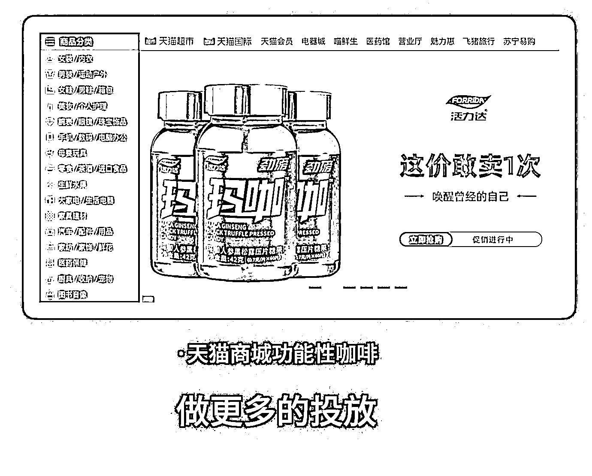

我们把此漏斗型赚钱模式做一个抽象，可以得到这样一组公式：

业务收入=流量*转化率*客单价

流量、转化率、客单价，是漏斗型赚钱模式的关键指标。用漏斗型赚钱模式的好处是很销售路径短，赚钱速度快。不过，随着流量成本越来越高，客户心智的成熟，以及产品同质化的严重，这种模式会遭遇遇极大的挑战。

第二组：私域循环赚钱模式

 

 

换句话，就是把用户圈在自己的池子里，持续、循环的赚他们的钱，而且在过程中不需要重复花钱买流量。这种可重复触达，可多次营销用户，是私域最吸引人的地方。

你可能会好奇，把用户圈到私域里，就能够赚钱到钱了吗？

其实这只是私域第一步，想要通过私域赚到更多的钱，接下来理解私域背后真实的赚钱逻辑：从销售，变成用户价值挖掘。

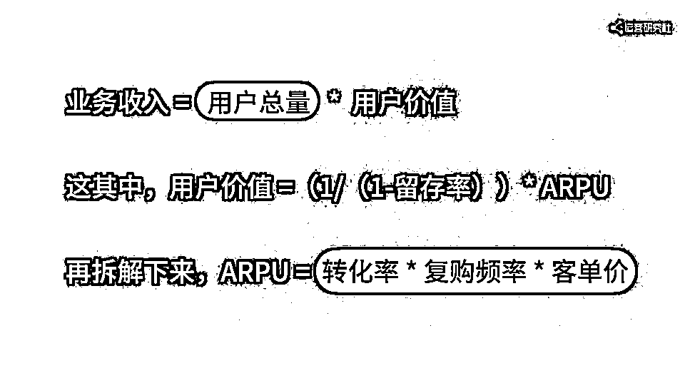

用户价值=用户生命周期*ARPU。

其中，用户生命周期=1/用户流失率，假设你的月用户流失率是 20% ，你的平均用户生命周期就是 5 个月。（用户流失率=1-用户留存率）

ARPU 值是衡量用户质量的重要指标，在私域中，ARPU 值指的是用户完整生命周期里的能够贡献的价值和产出，可以拆解为转化率*复购频率*客单价。

 

 

综上，我们可以看到私域循环赚钱模式，相比漏斗型赚钱模式，它是在流量和转化的基础上，新增出来了两个增长点：「留存」、「复购」，这是种向存量要增长的全新赚钱思路。

基于此，我认为私域不是简单的信息红利，而是实打实的在提升企业经营的效率和收益。而且，可以判断的是，私域会是一种长期存在的经营业态，就如代理商、会员制等商业模式一样长期存在。

那么，问题来了，到底怎么做私域呢？

现在很多人在做私域时，面临的问题是，用户不活跃，也不愿意多掏钱，这些问题怎么解决，接下来，我会分享一些自己的实操思考和案例。

二、运营研究社是怎样结合三级火箭商业模式，运营**100**万私域用户的

运营研究社是我在 17 年发起的项目，起初只是个运营人的交流社群，大家分享运营经验，链接人脉资源，同时，我用自己写的《跟小贤学运营》这本书找投资人融了 100 万来做社群，当时投资人的投资逻辑还蛮简单，觉得 26 岁能写书的小伙，值得交个朋友。

在我们社群招募了 5 期的会员后，就出现了经常在重复的回答一些老问题现象，比如如何拉新，如何写文案，如何做活动，如何做投放......

 

 

当时我觉得这效率太低了，为何不把一个事儿聊透，讲透，然后重复利用呢。所以，也就有了投入做运营课程和做公众号的想法，我把课程内容理解为体系化的解决运营技能问题，公众号内容理解为热门话题和新知识的解读服务。

自此，运营研究社正式开启创业之路。18 年上线第一门技能课程，同年 4 月拿到千万级融资， 19 年 4 月运营技能地图刷屏，课程收入过千万， 20 年在做 C 端业务的同时，也在往企业服务试探，成为企业微信、中国平安、东风日产等行业标杆企业的内容服务商。

在私域数据表现方面，目前，运营研究社在订阅号、服务号、企业微信等触点上沉淀了百万级别的私域用户，其中我们用户量最多的触点是在订阅号（ 70 万+）和企业微信（  10 万+）上。

那么，我们是怎么做私域的用户获取和留存、变现，以及我们的未来的商业规划。（ps. 这里的触点指的是你跟用户连接的载体和工具）

这里我想先引入一个商业概念：三级火箭商业模式，它能够解释绝大部分私域项目的运作逻辑。

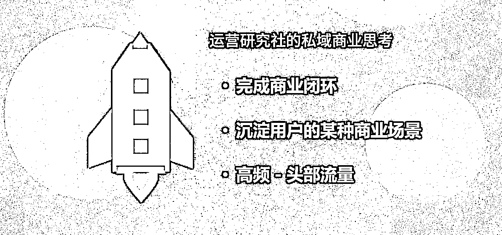

 

 

第一级，拥有高频且头部流量；第二级，沉淀用户的某种商业场景；第三级，完成商业变现闭环。目前，不少互联网公司平台，有不少是用这种模式在变现，比如被人熟知的就是 360 ，通过杀毒软件获取用户，再通过软件管理助手分发包括浏览器、播放器在内的应用，最后在浏览器和播放器做广告变现，完成商业闭环。

接下来，我会解析运营研究社是如何结合三级火箭商业模式做私域设计的。

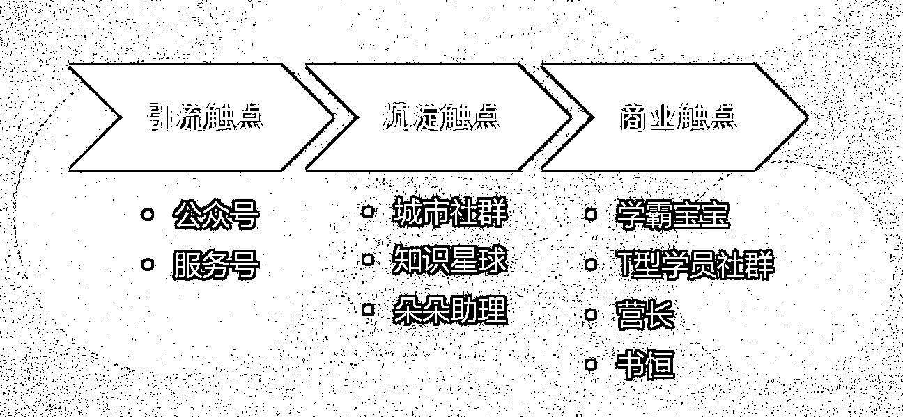

**1**）私域引流触点，做流量汇聚

在微信生态里边，最适合用来做引流获客的工具是订阅号和服务号，它们易关注和具备二次开发、可多次触达用户特性。因此，在实践当中我把它们定位为私域引流触点，所有的对外投放和裂变活动，都会基于公众号和服务号来做，让它们尽快成为为行业里的头部账户。

目前，订阅号有 72 万+关注用户，让它成为运营垂类头部账号这件事，我们主要集中在内容和活动两个点发力，可复用性强，这里我展开讲讲。

 

 

第一：内容

运营社是为数不多，在订阅号多次乱序改版后，依旧保持阅读量往上涨的。订阅号要做得好，关键在内容，而且是原创内容。

在内容这块，我们算是积累蛮久了，在 17 年创业之初，就开始组建内容团队，并且不断地沉淀属于我们自己的内容方法论。下面是几篇我们写的内容相关的文章和方法论，你们可以感受下，我们对内容的思考和专注。

阅读量暴跌后，我总结出 8 个起标题雷区

想提升阅读量，看这一篇就够了

小红书爆红背后，有可复制的内容运营策略

第二：活动

公众号外投获取一个粉丝差不多 10 块钱左右。实践下来，裂变活动是涨粉成本最低的手段了，能控制在 1-2 元块钱。那么，如何做到裂变活动效果又好，用精准呢？

我们做法是做精品内容裂变，我们自研了在线课程、实操手册、技能地图、知识日历、运营百宝桌垫等等精品内容来做裂变。它们很有吸引力，同时也具备运营研究社特色，所以吸粉的效率和质量都相对较高

 

 

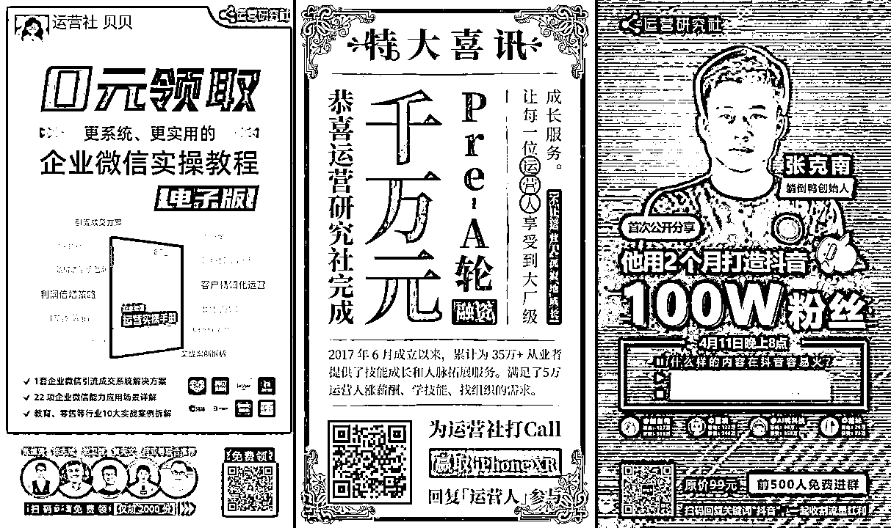

由于运营研究社主要用内容来获客，用户认可度比较高，在过去我们纯靠在公众号上写文案就能卖出 1000 万的课程，从引流到变现，直接一步到位。

不过，随着我们的课程价格的提升，以及服务类目的增加，于是就不得不面对，如何在公众号推文位置有限的情况下，去向用户种草这些服务，也就有了沉淀触点的思考。

**2**）私域沉淀触点，搭建商业场景

私域沉淀触点主要是根据用户需求，搭建出有商业价值的留存场景，说人话就是，把符合某个特征的用户汇集在一起，我能够更精准的给他们推荐服务，实现更高效的变现。

现在，运营研究社的私域沉淀触点，有满足用户同城交流需求的城市社群，有满足用户一手信息获取需求的知识星球，以及满足用户经验交流的行业社群。

 

 

目前，城市社群覆盖了北京、上海、深圳、广州、武汉、成都、重庆、合肥、西安，知识星球是今年年初刚开始做，已经聚集了近 7000 人（小目标是 3 万人），行业社群我们有一个运营3年的教育行业群，今年会复制性的快速的拓展出金融、汽车、零售行业社群，这样我们就能城市社群 + 行业社群 + 星球，形成有效内容和活动、人力共享。

当然，在私域沉淀方面，你可能会关注的问题是，怎么引流到企业微信个号、怎么社群不活跃怎么办，怎么做转化。所以，这里我会展开讲讲我们在这方面的实操：

关于给企业微信个号引流：

我们是直接从现有用户池里往企业微信个号导量，采用的方式是自动回复、菜单栏的导流。目前测试下来从新增关注到加企业微信的比例在 20% 左右，我觉得还做得不够好，目前至少是要到 30% - 40% 的，所以在引流这块需要持续的优化。

关于社群的活跃问题：

我们认为解决核心策略是话题策划，我们需要先让拥有共同话题的人在一个社群里，这样的群才有可能活跃。我们做城市群、行业群，也是在践行这个策略，所以我们行业社群和城市社群做了 3 年以后，还是非常的活跃。

关于私域转化问题：

最有效的是拉快闪群，把在私域里面对某个服务和产品感兴趣的人，统一拉到社群里用制作悬念、销讲和氛围引导的方式做转化，用这种方式我们做了不少成功实践，包括运营技能地图的发售、新课的发售，年终聚会的大会发售等等。

说完你关心的问题，我这里还想讲下，企业微信个人号、社群，以及知识星球等私域沉淀触点的运营侧重点，无论你做的是什么项目，这些都是你必须知道「常识」。

 

 

私域要做得好，本质是需要获得用户是信任。然而，私域信任的建立，核心需要做三件事：社交互动、内容推荐、内容创作（思考启发来源快手 2021 年光合大会）

微信生态里的不同触点，各自的连接能力的不同，对落地这三件事的适用性是不一样的，所以每个触点的运营侧重点（优先级）也不一样。

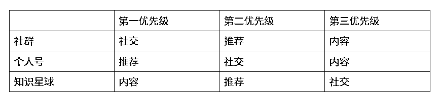

比如社群触点：

它是即时互动的，且更容易做社交，也更容易沉淀社交关系，所以它建立信任的的第一优先级是做社交互动，因此它的运营重点做话题策划，第二优先级是做推荐，将好的内容在社群里做推荐，第三优先级才是内容创作，引导用户共创内容然后做沉淀。

比如知识星球触点：

它的第一优先级一定是内容，其次，是推荐，最后才是社交。在大家对知识星球都已经蛮不好奇的时候，能用半年时间做到 7000 人，并且被知识星球官方采访推荐，很重要的一个运营策略就是我们在冷启动阶段就在做重点投入做内容，做内容填充，内容创作者「小火苗」社群，做内容引导，做内容栏目，可预见的我们在知识星球运营上，会继续在内容方面投入。

 

 

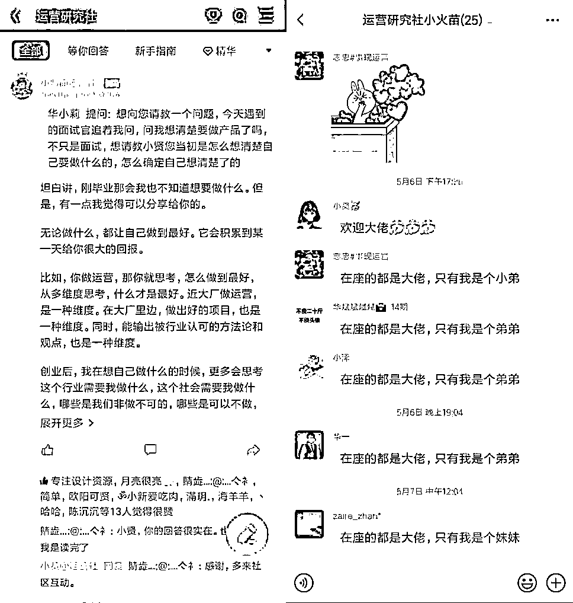

触点的运营侧重点不同，折射实操上就是我们的精力分配，以及招对人来做对的事儿。

坦白讲，我个人很享受这种推演和落地实操的过程。

 

 

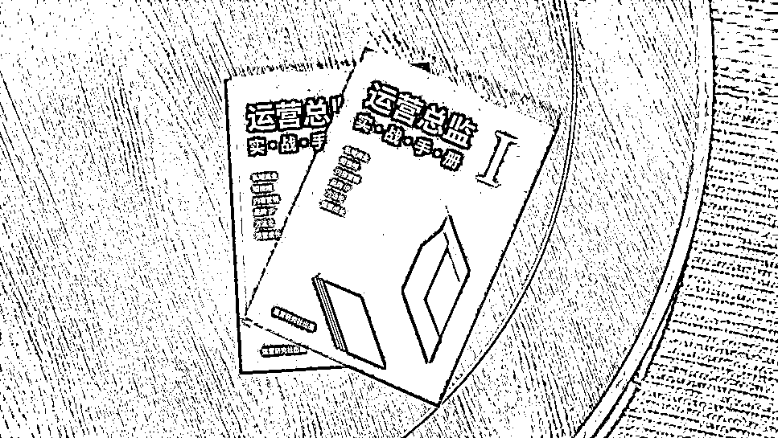

手册包含了 12 位来自阿里、腾讯、丁香医生、凯叔讲故事等新经济头部企业的运营大咖对私域商业、短视频、内容营销、用户增长、海外市场等热门话题的思考和分享。

**3**）私域商业触点，做转化交付

商业触点在三级火箭商业模型里边，是做商业闭环，他们更多的是对用户进行精准的转化，以及服务的交付。

目前，运营研究社的私域商业触点设置，主要围绕我们的产品线展开，针对在线教育产品，有学霸宝宝、社群、营长，其中学霸宝宝主要做学员登记，教务通知，社群主要做教学服务落地，营长主要做学习辅导。

当然，他们的运营侧重点也不同，学霸宝宝，做教务通知，运营追求是稳定性和高效。

社群做教学服务落地，主要是学习氛围营造，营长做学习辅导，主要是督学和作业点评，突出专业性。这些侧重点，都是我们通过用户满意度调查分析得出来的。

 

 

私域商业触点里，我们有一个隐藏的，负责线索转化的触点-体验营，它们是把 9.9 元线索转正价课的社群，这是在 2020 年做的一个重点调整，为了让往私域变现能力上更进一步，我们组建了一支有销售能力的社群运营团队。

作为内容出身的创业团队，我们在过去一年多时间里，在体验营上做不少探索和踩了不少的坑，比如，在招聘上有尝试招懂运营，有招懂销售的，有招纯小白的，但最终做下来他们都不是合适的人选。

那些擅长转化的运营，其实是有目标感的人，他更专注，更容易影响到用户。再比如，转化团队是高流转的，在设置提成奖励的同时，也要设置淘汰线，并且提前招聘补位，做好人员流动的准备。

那些高产出的社群运营，都是剩出来的。另外，做转化就是强执行，就是要激情，佛的人不适合。

以上内容，希望你能作为我们彼此的思维碰撞。私域的机会，我把它等同为 10 年前的移动互联网。它足够的大，也足够的多样化，不同行业有不同的私域打法。即便是在同一行业，不同发展阶段和竞争优势的公司，私域玩法也会不同，这也正是私域最吸引人的地方。

本来到这里应该就结束了，应生财有术的要求，我需要聊聊运营研究社的规划，以及未来商业思考。

我最近的一个感悟是，我们绝大部分人，包括企业的能力是有限的，我们需要思考的是如何在有限的能力和时间里，探索更大商业机会。

 

 

所以，未来运营社会把自己的能力边界限定在内容策划和创作、营销上，通过内容来创造价值，用运营来传递价值。围绕c端运营从业者，继续提供能帮助他们变得更好的内容产品和服务。同时围绕企业客户，提供运营项目外包和人力资源服务，我们认为运营深入产业才能发挥更大的社会价值。

今天的内容，也尽量从我在实践过程中，背后决策的思考出发，希望对你有所启发。最后用一个伙伴招募信息做收尾：

2021 年我们会服务 10 家优质的企业客户，为他们提供运营咨询、运营项目外包、运营人力服务，目前我们已经合作的客户有中国平安、企业微信、雀巢中国、东风日产，如果你或者身边的朋友有需要，亦或者你也想跟我们一起服务产业头部客户，都欢迎添加我企业微信，我们聊聊，交个朋友。

P.S. 如果你也想在生财有术专栏分享你的经验和认知，请点击链接

http://form.shengcaiyoushu.com/f/HA1G1g  填写表单，我们会陆续邀请有赚钱相关经验和案例的嘉宾做分享。如已填写表单请忽略。

评论区：

芷蓝 : 小贤老师也来啦[呲牙]

鱼丸|亦仁助理 : 感谢  老师的分享，大家如果有什么问题，可以直接在评论区留言~ 权宇凡 : 先赞后看[嘿哈]

小贤去哪儿 : 感谢亦仁的邀请，这篇文章主要分享的是我自己从16年底做的一个200人不到的运营人交流社群，到现在的100万私域用户过程中的思考和选择，希望对你的创业和做私域有所启发。

 

 

也欢迎对私域和对运营社感兴趣的同学，加我微信chenweixian2013，多多交流。[呲牙] Carrie  : 买了两年的运营地图。一份给自己，另一份送朋友。

读旅世界 : 看完我的行动清单

001.做快闪群，读书分享活动

002.信任的核心是社交互动(社群）、内容推荐（个人号）和内容创作（公众号和兴趣）  003.三级火箭：

引流触动（免费PDF文档、公众号心法、读书笔记）

沉淀触动（微信号）

商业触点（读书营，读书写作营）可能还需要新增9.9元的复利产品

小贤去哪儿 : 赞

大江 : 三级火箭🚀我的理解：1.引流(抓潜)；2.养鱼；3.捞鱼；私域讲究不要养的逻辑，而不是割的逻辑，所以要有长远眼光，合理捕鱼。

# **# ****(**精华帖**)(112**赞**)**关于陪伴式社群运营的二三

# 事

作者：  敏敏是个小太阳🔆

日期：2021-07-15

圈友好，我是敏敏，97年的水瓶座女孩，生财CP女团活跃分子、生财线上志愿者。

我平常周末喜欢参加活动和办活动，独立组织过50+场青年成长类线下活动、协助举办过5场100+人的商务活动。现在是北辰YES GO行动广州校友理事会副会长，曾是北辰青年YES GO行动的运营志愿者（第九期广州营）、三节课的校园合伙人、公益职涯项目Jobinn的营员。

作为一个社群活动持续关注者，

 

 

今天我想跟大家分享陪伴式成长社群「**YES GO**行动」的运营玩法以及思考这样的运营模式对生财的一些意义。

这篇文章的产出，有幸得到@杨涛  、@杨星城  和@丽丽曾  的提点，非常感谢。

目录

一、**YES GO**行动介绍

** **1\. 定位与发展脉络

2\. 创新性

3\. 价值倡导

L1 打破

L2 探索

L3 重建

4\. 内容交付

5\. 运营团队

6\. 用户画像

二、**YES GO**行动介绍亮点

1\. 终身学校概念

2\. 重品控

3\. 由浅入深建立关系

 

 

三、**YES GO**行动运营模式于生财有术的一些意义

1\. 扩大会员基数的手段

1.1 加强分销物料支持

1.2 加大对夜话官的培育

1.3 设计线下宣传物料

2\. 管理用户期待

3\. 打造社群黏性的方法

4\. 增加品牌曝光

4.1 增加品牌投放

4.2 设计便于传播的物料

4.3 邀请龙珠圈友给生财打call

4.4 增加圈友发朋友圈的动机

5\. 官方与民间有机结合

6\. 官方资源协助项目孵化

7\. 里程碑事件记录

8\. 关于新手村的探索

为了更好的阅读体验，建议点击下方链接  🔅

https://shimo.im/docs/q99vq9Drj6cCHx9c/  《关于陪伴式社群运营的二三事》评论区：

 

 

芝士快乐天 : 优秀的敏敏

西西 : 优秀～

奇点 : 图片无法查看，注意重新上传下～

肖广德D🔥D : 北辰趴友来捧场啦！写得很棒！！

敏敏是个小太阳🔆 : 谢谢奇点提醒[爱心]已更正

Gemini : 哇，看到老朋友了！

修 : 信息量好大啊

敏敏是个小太阳🔆 : 修哥来提点几句么[社会社会]

# **# ****(**精华帖**)(91**赞**)**付费社群的** 5 **个避坑指南

作者：  西门吹花

日期：2021-03-31

《人人都可以做社群，人人也都可以做付费社群》  思路分享

这次全国见面会做了两期夜话官，一次同城一次社群，和十几位圈友深度聊了以后，我最想说的就是标题这句。

很多圈友都是在做出结果以后，看到另外一种赚钱模式，又赶着去试，连续赶路，看似不同程度都赚到了一些钱，但我觉得反而弄丢了金矿。

在生财里有很多已经实践并且践行了可以赚钱的模式，这个模式在生财圈子里大家习以为常，但是在圈外，十几亿人并不知道。很多圈友的思维限制在，我才刚开始，我是菜鸟，所以我怎么可以带领大家呢，我怎么有能力帮助大家呢。

其实，具备一定专业的常识并且能够自己去实践并得出良好的结果，把流程标准化就已经胜过身边大多数人。我一直说，三人行必有我师。在生财圈友中尤其贴切，随便一位说起经历都在某方面做了尝试。

社群是向下兼容，不是要去和大咖比，你不需要很厉害，你只需要确保结果就可以。你不需要领先社群会员一大步，半步领先就已足够。

所以如果尝试了有结果能标准化为什么不开始做付费社群呢，因为你的能力可以帮助到更多人。哪怕每个月能帮会员多赚1000块都是很好的社群，不是非得几万几十万。

 

 

但是在聊完有些圈友在做的社群，有几个坑希望大家可以避免：

第一，如果不是强输出的ip或者资源型社群不要做年度付费。生财是强内容资源输出型，还有的社群是商学院人脉渠道资源，人家是为了交友整合资源这种。

在社群组里有位圈友做妈妈教育服务，收年费，每周提供课程，因为时间跨度太久，这种服务必然是边际效益递减，开始一两期觉得不错，后面每周上课，人的惰性开始，就觉得这个付费课程不咋的。

我的建议是同样价格做短期收费服务，但是把服务内容延续全年，在用户认知中，就会有占便宜的想法，我交了一个月的钱，居然全年都可以听课，赚到了。

第二，别不敢定价，社群的定价是困惑很多人社群价值提供方的问题。

不要因为担心卖不出去，所以承诺了无数服务。如果你的主诉求利益点够好，不需要多余，其他的服务留着超值交付的惊喜就好了。

不要以为便宜就会来，便宜和贵，都是同样的说服过程。如果不敢定价，是因为你对自己社群提供的价值打磨和交付不够自信。一个社群有这主打的承诺点就应对得起社群价格。

第三，超预期服务是社群留存关键

上次夜话会一位圈友是做政府业务合作，to g的业务，好做也不好做，但是我们去关注他们的需求，拆解下来就会比较简单。

政府职能部门合作最重要的是业绩，这个业绩不是指效益，而是影响力和政绩，如果我和某个政府部门合作某项软件系统开发，我会交付后，找各家媒体，权威网媒，发新闻通稿，最后和产品一起交付的是一本新闻宣传成果合集，这一本会成为这个政府部门向上汇报最好的业绩证明。至于怎么去找这些媒体，业内还是比较简单。

社群运营除了标准化交付，功夫在诗外，要跳出业务交付本身，去关心他背后或者企业团体背后深层次的需求。

有一位圈友做的是企业家俱乐部，刚开始做，课程准备主要围绕目标管理，企业管理这些，我不建议，一是这些内容数十年都有咨询公司在做，二是这些培训内容都是锦上添花，不是雪中送碳。

那么企业最根本的需求是什么，业务增长，没有企业不焦虑业绩的每年新增长点，而现在企业尤其传统企业对于互联网层出不穷的玩法和新营销是陌生的畏惧的，那就用一个个新型案例去拆解，开拓视野和对标。这些内容是雪中送炭，比之前传统内容好做。

 

 

别关注自己的产品，去关注用户真实的需求。

第四，付费社群可以从陪伴十个人二十个人开始。

小也是组织，是组织就会有制度，有流程，可以打磨自己从0到1的过程。

别看不上眼，大也是从小开始。

第五，如果有成熟付费社群，死磕渠道。

没有别的办法，多一个渠道就多一些付费会员。

以上。在车上想起来手机打字，跟圈友们交流。

评论区：

老王头 : 手机码了这么多内容，牛批

胡哲Hugo : 我说说企业家俱乐部这个部分，每个企业的成熟度不一样，需求就不一样。

生存期的迷你或者小型企业，会对营销特别的看重，对于这类企业活下去就是第一需求。而对于盈利模式清晰稳定，经历过5到10年的考验，公司在500人以上的企业，营销并不是排在第一位，反而经营管理才是重中之重。

要做企业家俱乐部的圈友，一定要对不同行业不同企业的成熟度有深入的了解，要清楚的知道自己要做的是小老板俱乐部还是标杆企业家俱乐部。这两种人虽然都叫企业家，但是需求和圈子都有很大的差异，甚至玩法都有很大的不一样。

企业家俱乐部不是不能做，而是如果看不懂我在说什么，那就真的不能做，如果看得懂还有能力落地了，那就去开干，毕竟培训咨询可以说是最低成本的创业了。

西门吹花 : 说的是

亦仁 : 多多分享

亦仁 : 感谢分享，已加精华。

西门吹花 : 开心，谢谢亦仁大大

胡哲Hugo : 好的，没问题

上海  龚宇皓 : 学习了

# **# ****(**精华帖**)(89**赞**)**拆解了** 6 **个微信社群，我得出

# 了这** 19 **点社群方法论

 

 

作者：  佩奇

日期：2021-04-15

《1万5千字，拆解了6个微信社群，我得出了这19点社群方法论》

众所周知，社群是私域的重要组成部分，但同时，做社群也是一个技术活、精细活。

就像大家总是听到的一句话：群会有生命周期，所以，要想让群保持长久的生命力，达到“逆规律”，这绝非易事。

所以，我就从这段时间参与或了解过的一些“逆规律”的社群说起，拆一拆这些社群都有哪些经营哲学，最终抽象出一套社群方法论（不一定对，供参考）。

前前后后写了好几周，全文14500字，是我这阵子对社群的思考和总结，希望对大家所有帮助（石墨阅读体验更好，全文点击查看）：

https://shimo.im/docs/KV5aXSslW8YnS4qZ/评论区：

郑韩 : 先赞后看

佩奇 : 哈哈，爱了

藤蔓 : 随手一个赞 [强]

佩奇 : 哈哈，谢谢

修 : 好厉害1万45字

佩奇 : 断断续续写了一阵了

陶宝 : 每篇都是深度长文[强]

佩奇 : [呲牙][呲牙]比较长，所以看的人可能会少点，可以收藏有时间慢慢看**# ****(**精华帖**)(87**赞**)**一个设计师创业者，在** 8 **月份

# 的** 100 **条复盘

作者： Sky🏹（表哥）

日期：2021-09-09

 

 

各位生财圈友好，上月在生财分享一篇作为一个设计师创业者，关于设计，生活，品牌，成长，创业相关的思考  ，亦仁鼓励我坚持每个月复盘，8月的来了，也希望生财的每个圈友，再忙也记得迭代自己，多思考复盘。随手点赞，手留余香。

1、关于设计的反思

2、关于品牌的反思

3、关于成长的反思

4、关于生活的反思

5、关于产品的反思

6、关于运营的反思

7、关于创业的反思

8、关于乱七八糟的反思

关于设计的反思** **

 

 

1、很多新人设计师很多都不要具备原创设计能力，必须要不断去提升审美力眼界。做设计前找到一个好的参考方向，把这个优秀的设计精华（图形，色彩，字体，构图，质感）提炼出来尤其必要，有参考方向和无参考方向盲目做原创，特做出来设计是天然之别。

2、自律是非常难的事情，分享一个10分钟小方法，如果要做设计练习1小时，对很多人很难，可是如何只看10分钟，是不是容易很多。虽然10分钟很短，但是至少好过努力几分钟就放弃要好。一般来说，努力了10分钟后，我们很可能会继续坚持下去，结果练习了15，20分钟，如果中间不想坚持了，也没事。至少努力了10分钟，休息一下，再继续10分钟，我最近写作也是运用这个方法的。最后，如果你真的很难自律，可以去下一个app：forest，简单来说就是番茄时间，只不过加了游戏玩法，可以把消失的时间种树，当你想放弃时候，树就会死掉。这样我们更有仪式感去运用番茄工作法。

3、一个设计师是否还有创造力？就是看他是否还有强烈的好奇心？我们是否还愿意每天去尝试新鲜事物，对于新的技术，新的趋势会去研究。比如最近比较流行的设计工具figma。

 

 

4、记得之前阿里入职第一月，领导让我把全球电商所有的交互框架，视觉框架都默写出来，然后再做需求，当时不理解。后来特别感谢这段痛苦的经历，因为只有这样你才能真正的站在巨人肩膀上去思考问题。

5、设计驱动商业一直觉得是设计行业伪命题，资源，信息的不对等，很多公司对于设计师定位就是一个资源方，就是产品一只手。驱动难上加难，但是设计师又不得不去“抢”业务的活，因为你不主动去做一些设计师，在晋升面试时候，面试官一句“这个项目成功，你觉得哪些是因为你而不同的？”。很多人晋升就卡在这里，在国内之前有一家设计驱动的公司有一家，叫锤子。

6、设计看灵感，现在看dribbble和behance比较少了，现在更喜欢这个网站https://mobbin.design/  不仅仅可以看见全部截图，而且如果喜欢，直接可以下载下来体验，这里面的设计更多都是落地的，更值得大家参考学习。

7、最近发现了一个韩国鲁班，比国内哪些搞定设计好用多了，最主要模版质量高，效果牛逼。国内哪些花花绿绿多实在看的很累。https://www.miricanvas.com/design  8、最近突然NFT就火了起来，相信未来对于艺术创作会有很大的推动作业。今天原阿里设计总监善牧老师和我说的一句话非常认同：设计师真的的创作保护，未来的启发性不是来自组织，而是社群。

9、不要去崇拜一些设计大神，而是要去研究哪些事情让这个人变的厉害。抓住他成长的关键路径和本质，去模范去学习，按照这个路径走，你也可以成为高手，而不是高手的粉丝。

 

 

10、专业上一定要有长板，并且长板是与时俱进的。当我们在讨论金属质感和玻璃质感，哪个风格效果更好时候。却不知道他们已经被扫进了历史垃圾堆。所以，当身边的人都在关注讨论一些趋势和技术时候，你听不懂了。很危险

11、马云讲课也被挑战，也没有人听，被老板们挑战“你不在一线，我在一线。”创造终身学习，学习很重要，如何学习才是最重要。以伴为师，以身边真正伙伴去学习。向你身边真正优秀的设计师去学习。

12、设计师要改变学习方法，之前听得到训练课时候，罗胖就说过，传统案例学习方法过时了，而是结合实际场景，从用户问题出发给解决方案，因为时代发生太快了，每个设计师都要随时保持警醒，从后视镜到前视镜头，包括创业也是如此，随时想着公司明天会挂，今天怎么做？

13、努力让自己变成U盘人生，  钉耙形人才，一精多专。怎么样培养我们多元综合性能力，是非常重要的。设计师要多了解新的趋势的技术，技不压身。

14、很多人都觉得技多不压身，，屯了一堆没有用的免费的课程。从来不看，于是慢慢变成了收藏家，要知道今天互联网所有知识内容都已经变成了检索，你输入什么样的关键词就能快速找到答案。最核心如何去学习，却没有几个人真正做到。应了那句话：当你开始做的时候，已经跑赢90%的人。

15、不要玻璃心，我们经常做了一个作品，发到网上或者给到业务方，得到负反馈时候，就很容易反弹。完全没有必要，把时间花在让自己变牛逼的行动上，不断用行动用结果为自己说话。当然如果你做的就是正确，该捍卫的还是要捍卫。

 

 

16、设计师都有个毛病，什么事情追求完美。很多时候大可不必，当你房子都没有盖起来去纠结地板铺什么瓷砖没有什么意义。完成比完美重要，宫崎骏说过一句話：「遇见的一切都是天意，拥有的都是幸运，不完美又何妨，万物皆有裂痕，那是光照进来的地方」

关于品牌的反思** **

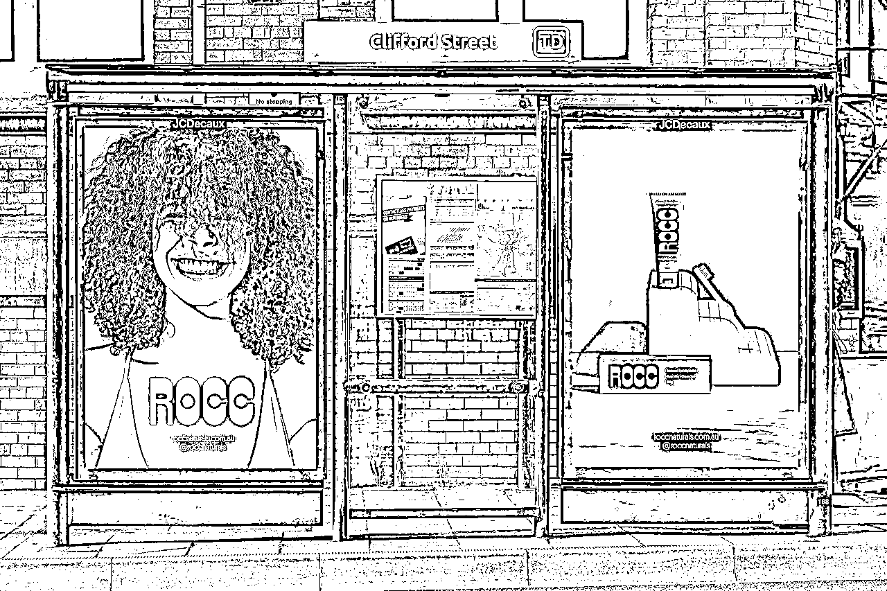

17、没有一夜成名的品牌，背后都是长时间付出和积累，只有风口来了才能等到。做个人IP也好社群也是如此，珍惜自己身上的羽毛。

 

 

18、最近一直在思考，品牌是什么？品牌本质是让我们获得用户更简单。设计日记品牌是什么？用户记住的是什么？颜色LOGO只是很少一部分，用户最终记住的还是价值。帮助用户解决他某个领域的价值，才是品牌内核。产品也分几个阶段，第一个阶段像我们这样不断曝光，让更多人知道，目标是获得用户。但是对于品牌终极，比如可口可乐，他们品牌已经不是为了曝光，而是社会价值，用户好感度。再比如劳斯莱斯的品牌，我们普通人很少看见，那是因为他们的广告在私人飞机，高端会所上所出现，真正的精细化投放。

19、现在大家提到品牌都是图形，视觉，色彩。其实有两个点被忽略了，一个是文案，一个是音效。比如苹果的文字仔细看，都有苹果味。再比如淘宝早期的''亲，你好。''，支付宝肯定就不能用亲，而是你好，所以不同的品牌，文案都是不一样的。音效也是如此，我们最熟悉的QQ的滴滴，微博下拉那个声音，你在地铁上听见就知道是什么品牌，再比如早期的hellomoto，诺基亚开机铃声。但是目前这两点是越来越被一些企业糊了。

20、之前在支付宝时候做过一个高端理财项目，目标用户支付宝存款100万以上，想当然觉得这些人喜欢一些奢侈风格，于是设计师深色，玫瑰金都怼上去了。结果被总裁一堆批，他讲了一个故事，他和朋友去迪拜那边游玩，迪拜那边女孩都带着黑色面纱，那么如何判断哪些是有钱的哪些是没钱的？其中遇见一个女孩，也是蒙着黑纱，但是黑纱旁边一根非常飘逸的红线，整体气质和感觉就完全不一样，而且总裁的财务自由的朋友，平时穿的衣服都是没有LOGO，注重裁剪的设计。所以其实品牌表达，不一定大LOGO，大色块，很多时候一个小小的细节都是品牌表达。

21、目前很多时候，我们体验好的品牌还不够多，说几个百元就能提升生活品质的，有品牌的产品。比如音乐软件我一直在用的Spotify，无论从设计还是体验，还是歌曲版权，特别无损音乐，用完后你会发现之前音乐都的白听的。另外一个就是Netflix奈飞，能看很多优质电影资源。能提升生活品质很多。

 

 

22、用户能记住的每个领域品牌为数不多，应该说只能记住第一第二，比如碳酸饮料，就记得可乐雪碧，时尚衣服品牌无印良品和优衣库，超市家乐福和沃尔玛，手机联通和移动。虽然有第三第四，但是人潜在是很懒的，所以在做产品时候，特别我们创业，并不是产品线越多越好，越聚焦越好，能不能磨尖很重要。

23、如果一个品牌有很多子品牌，如何保证所有子品牌和母品牌一致性，同时又有自己个性。这点可以参考下谷歌，阿里还有腾讯，举例腾讯，旗下有QQ，QQ音乐，腾讯视频，腾讯游戏，微信，浏览器，安全浏览器等等。他们是如何统一：1、色彩：腾讯产品，基本都是蓝色，绿色，黄色搭配。当然色相有些区别。2、图形Q：QQ浏览器，腾讯地图，全民K歌，图形部分都有Q的轮廓；3、企鹅运用。当然我觉得做的最好的还是Google，一致性极强。一眼看出谷歌家族，阿里的做的一般，基本就是字体。

 

 

24、如何快速打造一个新品牌？只要产品不差，设计做的洋气点，抖音，小红书找些达人推一推，最好上几次李佳琦，薇娅，老罗直播间。ROI跑正后，全网投放。

25、苹果的产品生态做的真的好，拿我每天用的最多的Airpods，比如我现在电脑上听一个歌，这时候打开手机刷抖音，耳机也自动链接过来了。它会围绕你苹果设备声音场景去设计，非常贴心。但是苹果产品也有体验差的，前几天买了一个苹果新款电池Magsafe，一个移动电源700多，虽然使用携带方便，但是和手机充电基本充不满，最重要慢冲，边充边用可以直接把手机干没电，鸡肋。

 

 

26、百度的品牌是越来越难用了，前两天想下载一个苹果字体，前3页基本都是广告，能理解广告位为了维持技术更新，公司盈利，但是什么事情都有个度，否则用户习惯转移很可怕。

27、竹子用了4年才长了3厘米，第五年开始每年以30厘米速度快速增长，用六周长到15米，今天很多产品你看到的一夜出名，其实背后是摸摸的付出，以我熟悉的生财有术开始，用户爆发也是第四年，前3年，亦仁一直默默无闻打磨内容做好服务。所以真的没有什么速成，该走的坑一个少不了。产品如此，品牌也是，在市场没有任何你之前，你没有品牌，你唯一竞争力就是你服务和内容产品。

关于成长的反思

 

 

28、每个月一定要定好规划，无论个人成长还是公司，总是感觉自己很年轻，时间还很多，觉得很多事情都可以慢慢做，减肥啊，见重要的朋友啊，下个月吧，明年吧，把自己弄的很忙，其实浪费了很多时间，其实就是没有规划好。时间用错了，顺序用错了都是损失。

29、今天去一个朋友公司分享，一个同学问我，创业这么苦，离开阿里后悔么？其实一点不后悔，因为我不想我每天努力目标就是成为我主管那样的人，没有生活，只有工作，一个被资本蒙蔽的人，每天如履薄冰的生活，当然有人有人喜欢那样的工作，能有体面工作，很高的工资。公司没办法去改变，但是我可以改变我自己的选择。试想一下，如果全世界的工作都是一个工资，你会选择什么，有时候当你没法选择的时候，follow you heart

30、怎么提升格局？认同猫叔说的敢花钱，会花钱，现在很多优质的大佬都是圈子，付费加入就能快速链接到，如果有机会进他的群，大方发几个红包大家就记住你了。但前提是你有价值，你有你值得别人学习地方，很多人我说我看见大佬说话会怂，有句话叫什么来着田忌赛马。大佬也有不懂的地方，你完全可以用长处去弥补。比如我微信上有很多大公司设计总监，我专业能力肯定不如他们，他们运营能力，个人品牌能力肯定不如我，所以一些适当契机，我帮他们解决一些运营，团队影响力问题。彼此互相帮助，互相成就。早期我看见亦仁也会很怂，后来亦仁找我当设计顾问，慢慢的就熟悉了。所以要学会主动利他。

31、抱怨当下很爽，长远不爽。漫威电影中的角色们，他们最后能解决问题，依靠的绝对不是抱怨，对吧？而是不断去采取行动，慢慢的事情才得到了解决。

32、一定要把“及时止损”列入人生信条。辞去不合适的工作，退出不合群的圈子，告别不合适的感情，离开不合适的人，如此种种，不要过度怀念沉没成本。坐错车并不可怕，不能因为已投了币上车，就舍不得下去。生活中，学会凡事都不做毫无寓意的内耗是一种大智慧。身处沼泽，待得越久，陷得越深。一些小事，越是纠结，输得越多。

 

 

33、最近教育裁员，包括字节在内，其实哪有什么大厂关怀，在快速资本变化过程中，如果你没有很稀缺的能力，也会被淘汰。如何让自己掌握稀缺的能力，并且不断中某个领域叠加增长才是竞争力。

34、之前看过一句话，什么是竞争力，“人无我有，人有我优，人优我全，人全无不要命”虽然有些段子，但其实还是有很多值得启发的地方？的确，每个人都要给自己构建自己的护城河，工作如此，生活也是如此。还好在工作期间，我找到了写作这个点，逐步把它构建成我的护城河，因为设计师不擅长写作，比较排斥写作，刚好这个点我把他放大了，逐步变成了我的优势。

35、职场里面做自媒体，一定要低调，这个世界上除了父母，没有几个人真正希望你过的比他好，当时我在阿里时候做自媒体时候，和做贼一样。天天怕同事看见我写文章，企业永远是企业，只考虑公司利益第一，如果同样两个人，一个每天只公司工作，一个经常写文章，你是老板你会重用哪个？所以，大家如果想做点副业，或者写作，记住，一定屏蔽你的哪些傻x同事。

36、今天和几个朋友吃饭，大家聊到一个话题，现在这个时代，有哪些能力是非常重要但是大多数人没有？最后大家总结了几点：

让别人舒服的能力，当你和某人相处非常舒服，什么耿对方都能接住，无话不

谈，你觉得你遇见了知己，其实不是，是他情商非常高，对你在向下兼容。

读懂一个人能力，这个读懂不是看你说了什么，而是看你的行为，去判断这个

人。

坚持做一件事情的能力，没背景没资源的人，坚持做一件事情能让你超越**90%**的同龄人。这句话非常认同，当时就是坚持写作，才有了现在做的事情。

坚持早睡早起的人，大佬说清晨的白粥，比深夜的酒好喝。

执行力强的人，其实未来大家接受知识能力都差不多，核心执行力，对于商业

敏感程度，和长期执行力是拉开差距和关键。

接受自己的平庸，接受无法改变的现实，我们很大痛苦其实就来源于预期和现

实差太多，其实遇见这些痛苦事情，接受就好了。无论企业家还是明星，其实

大家追求的就是那么几样东西，赚钱追求想要的生活，明星赚钱也是买大房子

 

 

啊，和我们普通人都一样。我们都是一个有灵魂猴子罢了，没有必要觉得自己

不如别人。

37、陆奇当年在百度时候，是如何激励百度人：我们现在在做智能驾驶的同学，你们要选择前进路上，选择一个跑的快的高速路。在跑的快的赛道上，选一个好的交通方式。

我们现在做的业务就是一个高速路上，一个跑的快的赛道。

38、人生几个阶段：1）第一阶段：靠的是你的聪明才智 2）拼的关系网络和赛道，你的关系网络决定你走多高多远。3）过程中创造价值，不在乎年纪高低。

39、设计师到了30岁，如何提升竞争力？首先要建立自己的网状体系，不断打破自己舒适圈，了解新的技能，当别人用技术和你竞争时候，你有设计思维；当别人用设计思维和你竞争时候，你有数据思维；当别人用数据思维和你竞争时候，你有商业思维。你脑子里有一张网，别人只有一根线，哪个会赢？

40、稻盛和夫:人是怎么废掉的，假装式努力，持续性幻想、做梦言语上的巨人，行动上的矮子，睡前给自己打鸡血，醒来还是老样子。总感觉自己还年轻，时间还很多，每天总是找各种理由拖延晚点再做吧、明天再做吧、下个月吧、明年吧。每天把自己弄的很忙，告诉自已没有虚度光阴，其实，很少分析自己做的工作是否值得，很少做职业规划。时间80%都用错了，改掉浪费时间的习惯，获取正向反馈，明确做事的顺序等等，这些才能让你离成功越来越近。

41、延迟享乐能力  一直在锻炼，要想做成某些事情，就必须学会延迟享乐，先追求目标再享受成果。我们身边有不少引诱，但你该有能力拒绝它们，并保持自律专注目标，直到自己实现理想为止。就像你在写作时期，考试前该专心读书，先拒绝身边朋友的约会，等考完了再去跟朋友一起享乐。凡事要以长远利益为重，只有做别人不愿做的，才能有他们没有的成就。

 

 

42、什么是活的真实？不再害怕别人评价，好的也是你，坏的也是你，你比你自己更了解你自己优缺点。也没有必要为了不太证明片面评价否定自己。只要你心中有光，觉得那个方向正确，坚持就对了。时间加长来说，所有人都只有30000天而已，我们在宇宙面前只是一粒灰尘。做好自己很重要。

关于生活的反思** **

43、束缚大家的不是认知不足，决定认知的是我们的心力不足。需要对身体能量管理，心力衰竭，为什么左晖会那么悲惨，看起来很繁忙压力大。这是表象。如果我们学习之余我们去锻炼身体，给自己充能，保证续航。很多事情不会发生。

 

 

44、在这个政策下，很多人都感觉艰难，上班觉得上班不稳定辛苦，创业觉得政策变化快，都能难，其实随便走在街上看看外面，看看你身边每个人，谁不难，学习觉得难不想吃苦，那只能吃生活苦。创业如果不想吃苦，那么只能吃失败的苦。总之，这就是一场修行。建议大家去看看之前俞敏洪之前一个采访，他是如何看人数大起大落的。

45、改变自己是很难的，那可以不可以每个月改掉一个坏习惯。比如熬夜，刷抖音，懒散饮食不控制，肥肉乱飞，周末死宅，关上了世界的一扇门。这些改掉了就能收获，早睡早起，热爱读书，健康身体，热爱生活。只可惜，难度有点大，下月复盘来看看。

46、珍惜身边的人，人很容易对朋友特别好，但是对父母爱人脾气缺很差，因为内心觉得他们不会离开你，其实是自私的行为。

47、这几年喝水时间特别少，天天喝咖啡对身体很不好，前几天老罗直播间，买了一个超大水壶，上面还有刻度，有水位线，几点应该喝到什么地方。然后喝水频率就高很多，人性都是懒的，很多成功产品就是充分把握住了这些需求，获得了成功：小罐茶，三顿半，小仙炖。

48、爱商是我们这代人最需要的学习的一堂课。

49、要学会和自己心灵对话，复盘，最近在复旦读书，老师分享的这个《灵魂11问》复盘方法，很受用。找一张纸，把下面几个问题写下来。

在过去几天里？你发生了哪些变化？

在你人生旅途中，谁是你源源不断给你力量的人？

在你当前工作中，你感觉自己的未来在哪里？

在你工作和生活当中，什么事情让你最纠结，最消耗你的能量。

在你目前工作中，你最佳快乐源泉是什么？

我们一起坐上时光机，回到**10**岁，**18**岁的自己对现在的自己会说什么？

我们继续穿越，即将离开这个世界。在此刻，你想给当下的自己有什么建议。

 

 

我们回到当下，未来当下**3-5**年，你的愿景目标是什么？如果是一幅画，画面会有哪些元素，越具象越好。

为了实现这个愿景，哪些需要放下？哪些需要继续保持？哪些需要立即开始。

在把愿景变成现实过程中，谁是你最佳核心助力着，谁是把愿景变成现实的那

群人？

如果要立马行动，在未来**3**天，你会做什么？

50、哈佛有一个幸福课：人生每过7年，当你有一个高质量的朋友圈。幸福才会非常好，需要有高质量朋友圈，才不会孤独。很庆幸身边有几个这样的朋友，这里要和亦仁表白，之前我的朋友圈都是设计师，是他带我朋友圈进行了升级。

51、生活中有时候也需要一些浪漫，之前一个朋友女朋友过生日，让他准备礼物，出了难题，礼物不能超过10块钱，同时要有创意。于是我朋友去711买了一个三文鱼寿司，一朵向日葵，一双筷子，一瓶生日快乐。很多时候，对着手机时间久了，都没有去真正发现生活中的美。

52、最近微信很卡，在清理的时候，发现和我聊的最多的朋友，竟然是文件传输助手，看来是一个刚需需求，为什么没有一款产品出现，可以比官方这个更好用呢？

53、短信这个产品会不会在未来消失，每天早上醒来打开收集，发现除了APP通知推送以外，几乎没有任何人给你发消息，记得上学时候每月500条短信都不够用，总觉得现在我们科技发达了，但是人和人之间少了很多温度。包括坐在工位对面的同事，可能交流工作也都在微信上。

54、什么时候发现工作快被淘汰了？身边的人讨论的东西听不懂了。什么时候发现自己老了？爸妈已经放弃催生孩子了。

 

 

55、我读过最有力量的一段文字：每当遇到我自己不敢直视的困难时，我就会闭上眼睛，想象自己是一个80岁的老人，为人生中曾放弃和逃避过的无数困难而懊悔不已，我会对自己说，能再年轻一次该有多好，然后我睁开眼睛。砰！我又年轻一次了

56、感觉年纪大了后，再也不敢发一些负能量朋友圈了。怕把不好的信息传递给别人，快乐的也只有自己熟悉的圈子里面去分享，不知道大家是不是也一样。

57、减肥和熬夜中年男人两大伤，不知道为什么年轻时候身体吸收差，怎么吃不胖，现在年纪大了，每顿饭身体都吸收特别好。减肥和熬夜哪个戒掉更难？感觉都挺难，最难还是减肥，吃了一个月的蛋白棒，断断续续，真的难熬。

关于产品的反思** **

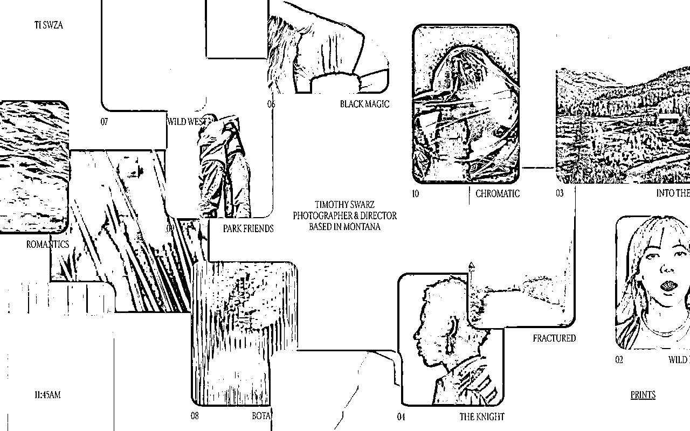

 

 

58、为什么B站比大哥爱奇艺值钱？根据市场占用率，客户黏性占比高，也要看增长数。爱奇艺用户增长下滑，10亿互联网用户不可再增，互联网已经从增量到博弈就变成了价格战。所以爱奇艺发展不如B站，可惜没有持有它的股票。

59、人变的越来越像机器，因为算法的推荐会原来越智能，但是我们社群运营还是靠CRM系统去私聊，对用户的服务还有很大的提升空间。

60、要学会经营自己，我们每个人本身就是一个产品，你的优势是什么？现在做什么事情能让自己不断增值和福利，比如我离开阿里后，我花了很多钱去读书，去报更高端的课程，目标就是投资自己让自己成长。

61、一个创业的朋友叫大黄，他们公司有一个企业文化叫迭代，非常认可，人也是一样需要不断迭代自己，给自己设定成长路径，每个月都不一样，每月完成一个小目标，另外完成时候要讲究学透，切忌学一个东西半瓢水，反复学，这样浪费时间。

62、最近去了杭州两个出名的餐厅，一个是A，点餐时候会让你选一个很好看的茶杯子（杯子都特别小，最多装一口茶），然后会给你来一杯他们店里最新茶叶的茶，仪式感非常足。然后你觉得茶不错，想要续杯不好意思茶128一袋，然后那好吧，换成水，不好意思，我们水是泉水18一杯。非常套路，虽然后面的服务不错，但是前面这些“精心”设计过的转化过程，非常让人觉得不爽。另外一家餐厅，是一家牛肉馆，一个典型的苍蝇馆，没有啥服务，简单粗暴。进去后直接点餐，上菜速度快，味道好吃，虽然环境差点，但是味道好，服务响应也快。所以两个不同产品策略，一个想办法用一些巧妙免费套路让用户买单，一个是用原材食料让用户买单。就像我们做产品，注意力是放在用一些套路去让用户转化，还是用心做好内容去吸引用户。值得思考。

63、最近教育行业地震，明白一个道理。做事情时机很重要，哪怕事情正确，如果时机不对也难。选好赛道，选对时机，以及一个强大的内心，相信能成的信心。因为没有这个，当你遇见挑战时候就会去怀疑自己。

 

 

64、社群经常有同学提问我，如何快速了解产品，了解移动互联网。其实很简单，去把苹果商店20几个分类的前3名下载下来，然后逐个体验，找出三个优点和三个缺点，尝试按自己理解能不能给出解决方案，或者比他做的好。当你研究完一遍，你自然而然对行业有了解。设计如此，其他行业也是如此，掌握拆解能力非常重要。

65、前两天，看见曹大一篇旧文章，现在互联网所有信息内容都已经被设计成检索次条了。以前的才华可能是博览全书，现在的才华可能就是你网感，你搜索能力，你输入什么样词语获得什么样的信息？为什么亦仁和涛哥能通过一篇文章，甚至一个截图，能抽丝剥茧的找到项目全貌，而我们很多人不可以，就是检索能力不够，没有办法获得一手信息。

66、这几年好像都没有出来眼前一亮的产品了，包括那些昙花一现的产品也很少出现，是大环境真的变化了，还是说现在大家创新力少了。在经济寒冬里，大家都聚焦去做利国利民的好事没错。但是企业的创新也是发展很重要的环节。百花齐放才能百家争鸣。

67、今天在使用某个输入法时候，打了一个花，结果跳出来一个陌生手机号码，而且是在我imac电脑上，并没有通讯录。不知道是之前输入法记忆功能，还是现在的厂商真的无接触到底线，用户输入场景都植入广告。个人隐私在大数据下，都是裸奔。

68、最近在社群组织了一个打卡，去留意身边好的产品细节，一个好的产品，一定是点滴细节组成的，一定不是某个大招决定的，就像我们去海底捞吃火锅，从排队有人递毛巾，安排女生做指甲油男生擦皮鞋，到上餐时候主动送饮料热毛巾，生日时候生日个，拉面的仪式感，正是这些细节让你觉得服务好体验号。产品也是如此，试想你去到一个特别高大上商场，一楼都是LV，奔驰宝马这些大牌，然后走到厕所里面，没有办法下脚。你还会觉得商场高大上吗？

关于运营的反思** **

 

 

69、亦仁前几天群里发了一条干货，训练营游戏化运营，非常认同。学习是很枯燥的过程，非常反人性，如何保证学习效果，很好的完成目标，及时正反馈很重要。

70、最近在社群开发了很多新的打卡，以为会有很多人报名，其实并没有。有时候我们觉得很好，未必用户想要的。你永远没办法用一个产品去满足不同人的需求，购物，理财都可以做到千人千面。哪社群运营是否能做到千人千面，同时能体现个性化？这个局如何破？需要好好的思考

71、为什么我们喜欢玩游戏，因为游戏给我们爽感，在游戏里面碾压对手那种感觉很爽。怎么让用户使用你产品，学习有爽感？如何运营爽感。特别是训练营过程中，因为无论训练什么，都很容易遇见挫折就放弃。但是公开给予正反馈，公开夸奖是很有效一个方式。最近在尝试让私塾班训练营小伙伴在万人社群去复盘，完全不一样。因为他的文章被很多人看见，有很多人收藏和分享，会得到很多的爽感，成就感。有了这些，也就有了动力继续学习，去练习。

72、做社群运营，真的挺难的，每天很多事情处理，感觉永远处理不完。遇见难题时候，虽然可以随时请教亦仁，但是还是想自己解决。最近在尝试遇见问题，反问自己，尝试寻找答案。1、如果这个问题，亦仁遇见，他会如何看待这件事情，他会如何应对？

这样能让自己做事情跳出感性，用理性方式解决它。

 

 

73、文字能力在做运营非常重要，“唯有爱与美食，不可辜负”“我们不生产水，我们只是大自然的搬运工”怎么两三句话抓住用户的痛点，痒点，卖点，让人感同身受。和做设计一样，好的文案能让人耳目一新，真诚。所以一定要进行训练，一定要去系统提示这方面能力。最近在补奥美首席文案那本书，收获还是蛮大。

74、社群运营，一定要把用户所有可能出现的场景，突发情况，都应该提前写出来。团队穷举出来，然后想好对应措施，这样才能做到遇见事不慌，哪有什么精细化运营，都是一个一个话术，一个场景梳理出来给出解决方案罢了。

75、做社群真的蛮难，每个月都要推翻自己，可能前一个月用户很喜欢的内容模板，一个月后可能就疲惫了，就需要不断有新的活动去刺激自己。这月开始，部门周会增加了一个栏目，就是大家每周分享一个这周你觉得业内做的比较好的营销案例，只有我们看到足够多，才能跨界结合，去运用到工作中。

76、运营微信群很难，因为大家群太多，如何让这个群有活跃度。话题非常重要，群难的不是大咖放进来，而是你的内容，每天讨论的话题对大家有没有诉求。所以群主话题和审美能力尤其重要，这块生财龙珠群做的非常好，新人加入后的欢迎仪式，亦仁和秀儿每天话题推荐，另外就是圈友问题解答都是很棒的点。当然最重要的点，就是退出机智，拒绝小透明。

77、个人IP和小助理角色如何互补？这些年做IP一直打造SKY的人设，但是太高了太冷了，用户会感觉沟通有压力，因此有了叮当猫，但是叮当猫不能只是一个服务角色，需要有自己特点，需要输出干货，和IP互补，怎么打造？如何让她有血有肉，成为用户真正的好朋友，这一点要好好的反思和思考。

关于创业的反思** **

 

 

78、这月去复旦上课时候，在解决某个同学企业经营问题时候，老师用到了一个七步法，有用。这里记录一下。

a、躬问：完整了解你的情况，你企业问题？

b、探究：用开放性提问，帮找到问题实质

c、澄明：最真实问题是什么？打破砂锅问到底

d、定见：帮忙确定问题，明确一个真问题

e、解析：这个背后的影响因素是什么，罗列出来，找到核心因素，帮助我们系统思考，找到核心杠杆因素问题

f、精思：给出真正建议

g、心得：下一步的方向是什么

79、如何判断一家企业？了解创始人背景，人背后因素指导了企业走向。

 

 

80、新能源，大家对于能源获取一定水涨船高。市场在增加，替代也会增加。另外一个行业是生物医药。原来健康安全觉得不重要，现在变的很重要。生物技术未来发展是一个非常重要的里程碑。

81、推荐一本书《终极智慧》机器在引进，人也会慢慢往机器迭代，变成机器人，把人变成超人。机器变的越来越像人，不停迭代更加智能化。人越来越像机器，迭代少。这个过程中，人和机器未来会是什么关系？有三个阶段：1）帮助人类做的更好，变的更好。2）共生阶段，和平和谐共生，当机器可以完成大部分生产，人类可能慢慢变成无用阶层。工作变成对人最重要的奖赏。3）机器的发展很快超越碳级生命，人的存在会变成一个能源，有点像黑客帝国。

82、最近教育的变革，不得不让人反思，符合大势的企业一年可以十倍二十倍，行业限制的，疲态的会跌70%或者腰斩，背后是国家的政策，要看天要趁大势，要看到行业巨变。

83、企业原来从创始到IPO越来越短，比如拼多多18个月。互联网每天都充满了未知数的变化。

84、做社群需要不断革命自己，推崇出新，很多套路，专业知识就只有几个月。不能学那些会衰变的知识，我们要去学千古不变的逻辑，基本那个法则，再去延展新的知识。

85、人在一个大的环境下，要做布局，深度布局。把远见和你热爱做布局，伟大企业能兴衰不久，比如阿里巴巴希望可以活到120岁，其实是企业家人生背后思考。海尔创始人说过：没有夕阳的行业，只有夕阳的企业。

 

 

86、以前总是觉得不上班的人真的在混日子，但是最近了解到一些身边上班朋友情况，真的上班才是混日子。因为没得选择，你只能当一颗螺丝刀，问我有没有建议?我只能说赚钱和自律，才能慢慢延缓焦虑吧，创业也难，从领工资到发工资，心态是完全不一样的。

87、生活从来都不容易，当你上学生活很容易时候，一定是你父母在后面承担不容易。

上班时候，当你觉得工作轻松无压力，一定是老板在背后承担不容易。创业后深有感触。

88、创业过程中，贵人很重要，真正贵人并不是直接把钱给你，而是给你机会和资源，开拓你眼界，纠正你格局。给你雪中送炭，有困难时候对你伸出援手。那个为你提供力量，让你少走弯路，还愿意花时间和精力去帮你的，这就是贵人，如果你看到这里，身边有这样的朋友，一定要珍惜。这里我要表白亦仁了。

89、创业为了什么？核心还是生活，不能因为创业忙失去了看世界机会。最近感觉一直忙有点失去目标，尝试周末去挖掘一顿美食，看一场电影，让自己完全换  一个环境去看看。有时候会发现不一样，不能因为创业这扇窗口打开了，而忽略了发现生活之美的窗户。

90、要学会控制自己的阈值，之前上班时候觉得月薪一万就可以躺平，当月薪一万被生活摩擦后觉得月薪三万就可以躺平，当月薪三万后觉得年薪百万是不是可以躺平。然后当你达到时候，你发现身边那些赚几千万的大佬，每天都还是在工作。最后发现，我们要提升的不是自己赚钱能力，而是你对生活预期的阈值，为什么我们在刚工作，一月5，6千时候容易满足开心，现在反而会没那么容易开心，就是预期阈值提高了。如何去平衡，需要去好好反思。

91、创业后才发现，什么时候都要全力以赴，另外要学会消化自己的情绪，无论好的还是坏的。另外不要把别人对的好，当做理所当然，要学会感恩，感恩社会，感恩政策，感恩身边对你有帮助的朋友。特别那些和你说真话的朋友。

 

 

关于乱七八糟的反思

92、最近看了一部老电影《进击的巨人》，如果你没有看可以去看看。透过电影可以看待主角是如何去应对人生的黑暗时期，如何去面对很痛苦的事情，如何带着力量去应对，去解决这些事情。在这个电影快结束时候，能感受到巨人的威力正想被科技崛起削弱，在过去，人类根本无法和巨人对抗。但是科技发展，有很多厉害的武器基本能秒杀巨人。所以每一个技能，能力都是有红利的。虽然现在没有巨人，但我们每天都生存在弱肉强食，适者生存的环境。红利还没有消失之前，我们要学会创新，迭代自己。

93、怎么提升学习能力，有几个小方法：1、可以把学到的知识，教给别人；2、能力提升后再去学新的；2、思考如何去实践这个知识。

 

 

94、最近在黑珍珠群里有个话题很有意思，分享一个你认为很棒的应对烦劳的方法？收到一些讨论很有意思：

我喜欢写下来，用文字和自己沟通，再看一看是不是我想多了。很多时候真的

是自己想多了。

用旁观者角度看待这个问题。

马上解决，要不然就忘掉这件事情。

当烦恼来的时候，就让自己冷静下来以后，开始慢慢审视自己的问题，再看看

有没有改善错设，如何再避免同样情况反复发送。总结后开始反向思考，再花

一两天把自己心情平复。

骚扰好朋友，运动，读老子道家的树，以及回想以往的困难后来都得到解决，

便觉得无需为当前困难过分钻牛角尖，因为只会消耗自己的精力。尽人事安天

命。

95、今天和一个北京认识十年朋友聊天，目前大厂一个经理角色，说压力很大。马上奔着40了，感觉互联网的不稳定，如履薄冰，问我未来想出来做IP，可以吗？他专业足够支撑几年输出。我说，要做就是现在，而不是等离职后。互联网变化很快，现在你看好的事情，说不定明年后社群IP就不那么好做了，这个行业最大的不变就是持续变化。如果当初我没有在职时候就有意识，输出写作，在很大阻碍下坚持，也不会顺利转型。所以做任何事情，时机很重要。正确的时机错误的时间也不成。

96、要学会拒绝，创业后，经常很多人找我，有的都一面之缘。但有时候碍于情面都见了，很浪费时间，一天什么时候做不了。后来请教了亦仁，亦仁说，如果你目标你一年后赚100万，那么你现在每个小时就是2000块钱，这个人一个小时觉得值不值2000块钱，如果值就见，听完后恍然大悟。成年人要学会拒绝。

97、最近无意看了一个电视剧，里面有个片段，儿女陪老人少。老人被骗子盯上，然后天天生活上虚寒嘘暖，最后老人花钱买了很多保健品和玉床，让我不经想起我母亲之前一模一样的骗局，我性格不善于表达，这些年习惯一个人在外面，很少在家，都是妹妹在陪伴。很惭愧，天秤座就是这样对爱自己的人关心自己的人会很苛刻，对其它人就会 

 

很大方。所以有空回家看看，你给多少钱对他们来说意义不大，想一想，我们一年在家10天，假如他们还可以活30年，其实就300天一年不到，珍惜身边人。

98、我喜欢把经典的电影看两边，《泰坦尼克号》看了不下10遍，每次看都会看一些之前没有关注到的细节，歌曲也是，现在听的也是老歌，不同阶段听心态感受都不一样。

大家平时看剧也好，看书也好，一定要看经典的，书也不用读那么多，读透几本，真正有用的很重要。

99、人真的不能太闲，闲下来就会想太多，矫情，然后看什么事情都不顺眼。忙碌会让你精力充沛，一方面忙起来就没有时间想那么多，之前的一些烦恼困惑，忙着忙着就解决了。

100、最后用之前帅张卫衣上的一句话：“愿你历遍山河，仍觉得人间值得。”来结束8月份的复盘，愿各位朋友历遍山河，仍觉得人间值得。

评论区：

蒸包包 : 写得很好  感觉有许多的业务思考和人生思考

Sky🏹（表哥） : 笔芯笔芯

维意手作|手工导师 : 谢谢分享

老黄牛 : 一字一句看完，喜欢看这种实战经验分享。创业，生活，习惯，都仿佛看到自己的对照，再细读，思考，找到答案，一步步改变，迭代。

例哥 : 点赞

勒布朗·詹姆斯 : 盖哥  看了分享很受益，太棒了[强]

Sky🏹（表哥） : [爱心]一起共勉，一起生财有术

Gary : 写得很细致，引起了很多思考，触达的点很多，已经收藏起来，偶尔拿出来阅读**# ****(**精华帖**)(75**赞**)**一个转化率** 40% **的乌托邦式

# 的社群团购是如何做到的

 

 

作者：  刘梁

日期：2021-12-28

目录

一、  创建一个乌托邦社群的螺旋式思考

二、  团购的供应链解决和如何选品

三、  如何运营社群

1\. 如何引流

2\. 朋友圈私域如何打造

3\. 如何赢得群友的信任和认可

4\. 如何建立社群矩阵

四、  运营乌托邦式社群的困难和应对

五、  大家如何学习创建一个乌托邦式的社群

六、  我对乌托邦社群的规划和建议

七、  我做社群团购的收获

---正文---

看了一下最近一个月团购的数据统计，访问人数 731 人，下单人数 295 ，转化率 40.3% ，纯销售额 21 万多，客单价 94 块多，这个数据大家都说比较高了，事实上，我只有一个群，接下来，我把我这一年做团购的心得和体会都无私分享下。

 

 

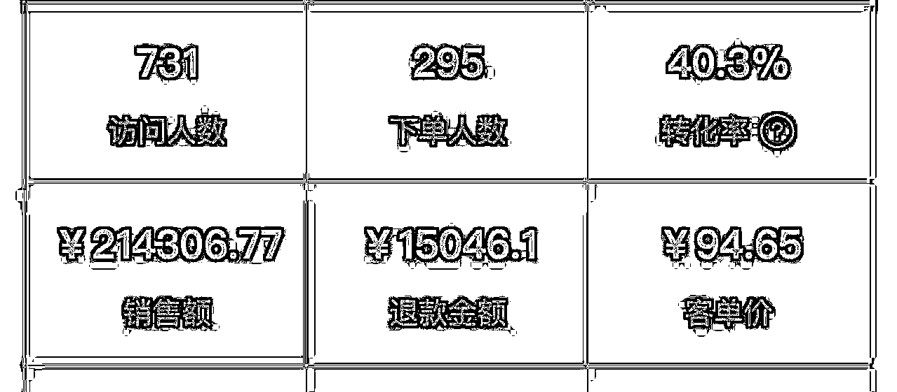

**-01-**

创建一个乌托邦社群的螺旋式思考

**1. **为什么决定做一个乌托邦式的社群

建立这个好物分享群之前，我和很多中产的父母一样，为孩子的学习焦虑，因为我清楚地认识到，我们的孩子，到了初中毕业，将不得不面临“只有50%的人可以上公立高中”这样的现实，所以我们每天在一个学习群里分享学习资料，讨论学习方法，还组织一起各种打卡，譬如古诗打卡，英语分级阅读打卡。

然后发生了一系列的事情，大家应该也都听说了，深圳这边，在短短时间里，听说了好几起孩子跳楼的事件，震惊，惋惜，我开始反省我自己，一心想着自己的孩子学习启蒙，想着超前学，想着不要被分流到职业高中这样的道路，我们都身不由己被裹挟着前进，有没有这样一个地方，它可以给予我们心灵上的抚慰，感官上的愉悦，有没有一种方式，把生活过好了，让自己没有那么焦虑，让一颗紧张的心得到放松抚慰。让参与者感受到生活的美好，留恋这个美好的世界。

 

 

正好同事介绍我用了群接龙这个小程序，这个小程序可以作为品牌方发起团购，也可以帮卖其他人发起的团购，于是，我在我们邻居群里，试着分享了几次团购，反响还不错，于是我着手建了一个生活群，群名叫“刘家凉凉美食健身旅游好物研究所”。

**2. **理想中的乌托邦式的购物场所是怎样的

我的理想是，建立一个乌托邦式的社群，在这个社群里，你所需要的好东西都可以找到，你所有的问题可以得到回应，你买到的任何东西都可以在群里和大家分享讨论，而且社群里的东西价格要比公域的价格更划算，任何东西不满意都可以得到妥善的售后。

 

 

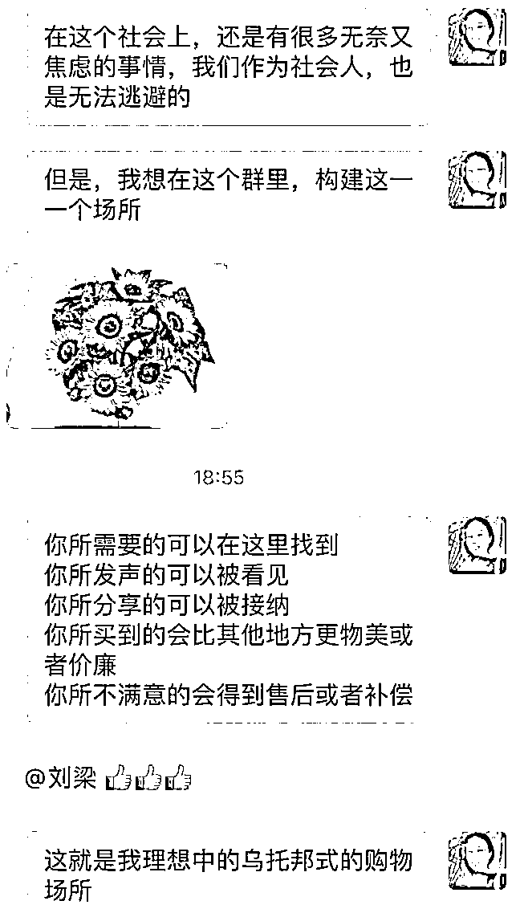

 

 

**3. **我为达到一个乌托邦社群所做的创造和升华

社群团购天然就带有解决大部分购物痛点的属性，而我在这个基础上，为达到一个理想化的乌托邦式的购物场景，又做了一些改进和升华，具体我是这么做的：

**1) **构建社群文化，每天早上，我会给大家发一首诗歌和音乐，和一幅绘画，让艺术滋养人心，人在世上，唯有爱和艺术是最美好的东西，我们要享受艺术，享受爱，人生意义不只是赚钱和奋斗，在爱和艺术的滋养下，我们的人生是兴致勃勃的，也是精神饱满的。

**2) **每个人在群里的反馈都会得到回馈，无论是好评和差评，都有人回应，而且允许群友分享差评的东西，告诉其他人，这个东西不能买，真实的反馈，让每个人都得到了尊重。每个人在群里的精神是自由的，无忧无虑的。

**3) **大部分团品我都自己亲测过和比较过，保证团品的品质。亲测的过程中发现了大量优质的，物美的东西，这样也有底气分享给群友了。

**4) **群里每个人都可以分享自己的生活经历，健身心得，去过的好地方，吃过的好东西，在这个群里，大家都是朋友，亲人，强关联的关系。

 

 

**5) **所有团品如果不满意，都可以得到售后，我也是很真实地告诉大家，做团购我是有一点利润的，我愿意把利润拿出来，给大家做好售后保障，所以，所有团品退货，是可以报销运费的。很多人退了货后，不收我的运费，我就会告诉她们，这是群规，大家都要遵守的。

**6) **控制价格的竞争性，让大家感受到物超所值的喜悦感。

这样运营了一阵子，大家越来越喜欢我的社群，很多人买到好东西后，又自发地分享给身边的亲朋好友，或者拉她们进群。我心里非常感动于大伙儿对我的信任，于是又在群里执行了这样一个抽奖方法：  任何人邀请朋友进群，我们都会抽一个奖，来欢迎新朋友进群，手气最佳的，可以得到一份奖品，奖品选择在 30-40 元之间的爆品。

为什么不是直接给拉群的和进群的群友发奖品呢，我是出于这么考虑的：

-因为是乌托邦式的社群，我们崇尚顺其自然，要真的发自内心喜欢，才拉朋友进群，如果用奖品的鼓励，来鼓励人拉人，事实上是违背了初心了。

-抽奖让进群的人感受到一种仪式感，而且觉得自己很重要

-群里热闹热闹，让大伙儿都喜欢新朋友进群，有机会抽到奖品。这种发自内心的欢迎气场很重要。

**4. **乌托邦式的购物社群是如何扩大的

我群里的人越来越多，越来越多，从去年 10 月份一开始建群时候的 100 多人，到现在的 400 多人，大部分都是人拉人进来的，有时候，我也会清理一些群里的人出去，譬如从来不发言的，从来也不参团的，或者连红包都懒得抢的。

 

 

我想着乌托邦式的社群嘛，肯定是一群志同道合(喜欢美好的东西，追求美好的东西，用好物来滋润自己，感受到生活愉悦）的人在一起的地儿。而有些人对好物不敏感、无追求，那么他们其实也是根本没有关注这个社群的，或者是不好意思退群而已。

**-02-**

团购的供应链解决和如何选品

**1. **为什么群接龙的供应链是源源不断取之不尽的

解决了人的问题，气场的问题，那么来到了我们社群最基本的核心，物的供应链。群接龙这个平台，也是非常符合我的乌托邦购物场所的理想的。

在团购这个生态里，人人可以是供应链，也可以是团长，还可以是大团长让团长们帮卖，每个人可以选择自己的所长来选择自己的角色，非常自由。因为这样，就有了千团千面，给了消费者更多的选择。

因为可以自由开团，所以平台上聚集了全国各地甚至世界各地的好东西，而一个活跃的社群，对吃喝玩乐，衣食住行都是有需求的，所谓的万物皆可团。

之前的社交电商平台，譬如云集有个很大的局限性，就是供应链受限，如果只靠平台自有的采购体系，没有源源不断的持续不断的新品更新，社交电商的生命力是有限的。而群接龙平台的供应链是生生不息，源源不断的新品涌入的。

**2. **我是如何选品的

 

 

在选择团品方面，我也是下了很多功夫。我自己热爱美食，曾经在家带娃的时候也写过一个美食类的公众号，所以我总是去寻找好吃的东西，分享团购，像是给我打开了一个新的世界，我可以找到全国各地开团的好东西，正因为这样。

当我找到一个新品类，新美食时，我的内心是喜悦的，欢乐的，这也是我坚持团购的其中一个方面吧，而我在朋友圈的展现，也是鲜花，音乐，诗歌，还有美食，因为这种美好生活的磁场，也吸引越来越多的人进群团购。

在寻找团品方面，我是这么做的：

-自己平时在其他平台购买到的好东西，如果品质是过硬的，经得起考验的，那么我会去找卖家，谈团购价开团。

-在群接龙平台上寻找，自己试吃，试用，然后和大团长对接，进入大团长的社群，观其言，查其行，看大团长的风格是否靠谱，自己也试着拍几次，看看售后反应速度，如果为人靠谱，东西一致，售后反应迅速，那么就可以试着引到社群里销售了。

-有一些群友会提需求的，她们在其他平台上找到了不一样的美食好物，也会要我去找来开团，先有需求，再去找合适的团品开团。

-也有一些是朋友和团长介绍的靠谱供应链。

** **

**-03-**

如何运营社群

下面我来和大家谈谈今天分享的第三部分：如何运营社群。

 

 

**1. **我社群里的群友都是哪里来的

1) 一开始是亲朋好友，身边熟悉的人。

2) 朋友圈分享美食好物后，有些人购买后，我就会去询问，要不要进群。

3) 群友们会自发拉一些亲朋好友进群，这一步裂变非常重要，因为她们都是精准粉丝。

**2. **朋友圈私域如何打造

1) 在朋友圈里，每天早上我都会发诗歌和歌曲。

2) 分享每天团到的团品，当然是喜悦的，享受的气氛3) 真实的生活分享，有时候也会吐槽一下。让大家看到一个有血有肉有灵魂幽默的我。

3) 朋友圈也会有鲜花啊，健身啊，旅游啊，这些情绪价值的东西，让大家看到一个积极的，热爱生活的我。

 

 

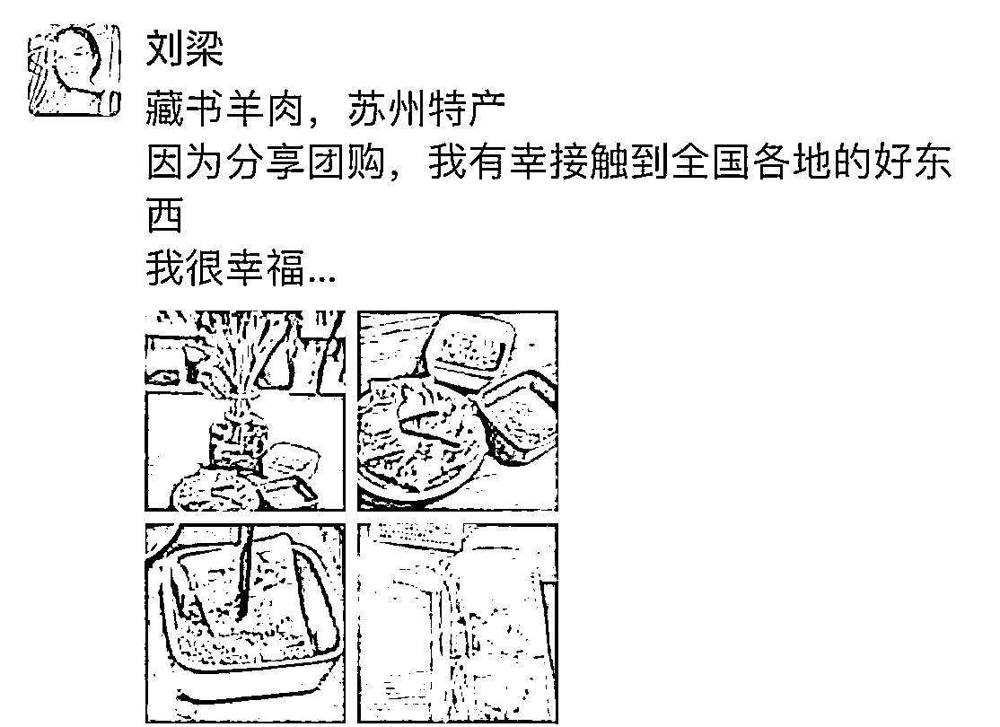

**3. **如何赢得群友的信任和认可

1) 真诚，还是真诚，真诚分享，好的地方分享，不好的地方也都坦诚告诉大家。

2) 品质，永远还是品质，品质是社群的基石，离开了品质的团品，只能是灾难，所以，在选品和选供应链这块，严格谨慎，毕竟，不好的东西，很快就会在群里传开，臭名远扬了。

3) 责任心，是社群的保障，如果选品不小心踩雷了，一定要积极面对，改售后的售后，改补偿的补偿。譬如有的衣服，供应链不让退换，我就会让群友给我，自己留着穿或者送朋友，不能光想着赚钱对吧，也要拿出一部分做好保障的，让群友知道，即使我在你这里买到的东西不好，也是有人兜底的。

 

 

**4. **如何建立社群矩阵

除了好物分享群，还可以建立其他社群，加大社会联系触角，譬如我还有 1 个社群是分享学习的，有 1 个社群是断舍离群，还有 1 个社群是专门卖有机菜群的，这些社群矩阵都可以为团购群引流。在那些群里的无私公益付出，也是为我在好物分享群里做了背书，并且团购群里的人都是强链接的，很少有人退群。

**-04-**

运营乌托邦式社群的困难和应对

**1. **在运营乌托邦式社群所遇到的困难

1) 时间，因为我还上着班，所以只能用碎片时间来分享，或者是早起，中午休息时间，或者晚上孩子睡觉后。不过还好，我群友们基本也熟悉和适应了我的群里工作时间。

2) 千人千面，每个人的需求不一样，所以对团品的理解就不一样，有的人从来不退货，有的人买一样退一样。有的人喜欢吃辣，有的人喜欢吃甜，每个人对这个世界的感知是不一样的。

3) 像我们团的农产品，譬如水果啥的，一棵树上，都可能结的果子不一样，更不要说一个山头上不同地方的树了，所以在品控和客户需求方面总是会有偏差的。

4) 供应链的寻找。

 

 

**2. **我是如何解决运营社群的困难的

1) 提高单位时间的工作效率，后续如果团购事业扩大，也考虑把副业变成主业。

2) 对于千人千面，我们首先要明确，咱们做社群是在做服务业，是需要有服务精神的，是一种精细化的服务，这个时候，千万不能有玻璃心，有了这个前提，你才能游刃有余地面对各种各样的人和各种各样的需求。

3) 对农产品的品控和客户需求之间的偏差，可以一开始就和大家说好，不同的水果是会有差异的，降低预期。

4) 在供应链的寻找上，是需要时间和耐心来挑选和沉淀的。

**-05-**

如何学习创建一个乌托邦式的社群

1\. 每个社群是要有文化构建的，你的群是一个怎样的基调，是需要你在群里灌输熏陶的的，譬如我的社群文化底蕴就是：  寻找好物，享受好物，享受这生机勃勃的人间。还有你个人的 IP ，是你作为一个社会人的呈现，但是我觉得，利他，多给予，大度大气总是最基本的。

2\. 寻找供应链和团品，这个需要时间的沉淀，要多试，多看，多听，多交流，选择适合自己社群的团品。

 

 

3\. 每个社群就是一个小社会，而这个小社会的整体气氛，是由群主来营造的，你的社群是温暖的，包容的，有趣又料的，还是死气沉沉，枯燥乏味只卖货的，决定了社群的活跃度和群友的留存度，所以我的思路就是运营一个有灵魂，灵动又有灵气的社群，当然每个人个性和特点也不一样，可以根据自己的特点来。

**-06-**

我对乌托邦社群的规划和建议

**1. **我的**2022**年规划

新的一年里，我会改变过去一年的佛系团购。打算做以下改变：

Ø 复制我的1群，把1群的方法论也用到 2 群上，形成一套体系。

Ø 到公域做一些突破，摸索公域引流

Ø 增加线下地推引流

Ø 可能会开一个社区精品店，就用社群里沉淀下来的爆品

希望在来年还可以把我的心得体会继续和大家来分享。那么下一年，我的分享主题，可能就是“社区团购精品店+社群团购全品类的闭环之路”了。

**2. **我对大家的建议

我想每个人，还是做自己擅长的，有正反馈的事情，只有做适合自己做的事情，才会乐在其中，在收获了乐趣之后，也得到事业的发展。

 

 

但是，社群运营是属于精细化运营，像罗永浩老师的“交个朋友”是比较虚的，而且听说他现在也要退出“交个朋友”了。但是乌托邦式社群团购运营是真正的落到实处的“交个朋友”，和每一位群友交朋友，了解他们的需求，听到他们的心声。所以你如果想做社群团购前，你能不能真的沉下心来“交个朋友”。

**-07-**

我做社群团购的收获

做社群团购，扩大了我的眼界，让我见识到全国各地，甚至全世界的好东西。而每次得到群友们的认可，更是增加了自己的信心和幸福感，这些是部分群友的反馈：

 

 

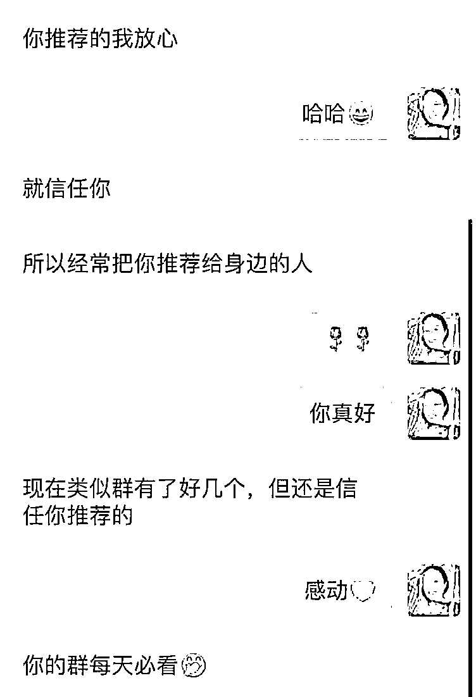

 

 

分享社群团购一年多，我们社群也沉淀了很多爆品，有时候一件爆品被大伙儿认可的  feeling 实在是太棒了，看着订单数哗啦啦往上走，会有一种深深的成就感，而且在不断尝试和实践过程中，我自己也沉淀了一套比较完善的选品方法和供应链名单，让我自己在开团中可以随时找到我需要的供应链和品类。

 

 

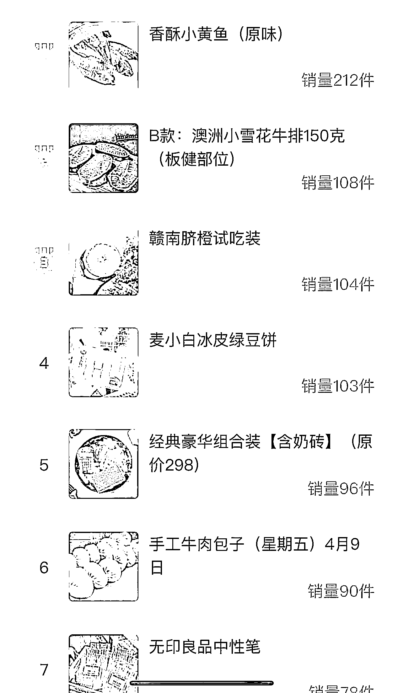

 

 

社群团购不但滋养了自己，也滋养了家人，让自己的孩子也见识到物的丰富和美好，因为享受过好东西，就会对这个世界充满了向往和留恋，觉得“人间值得”，而我，也会坚守我的初心，那就是：感受爱，感受美，感受这兴致勃勃的美好人间。

评论区：

Jim : 能悄悄地问下利润有多少吗[微笑]

小末 : 我有货源，能合作吗

刘梁 : 可以啊

msft : 我有货源可以合作吗，我的微信CGCGUC

IT谷 : 方便留v学习交流吗？

刘梁 : 46812506

亦仁 : 感谢分享，已加精华。

刘梁 : 谢谢老板

# **# ****(**精华帖**)(73**赞**)3**天搭建精细化母婴社群，开

# 业当天实现**60**万**+**的业绩

作者：  俗人九儿

日期：2020-12-24

3天搭建精细化母婴社群，开业当天实现60万+的业绩。一步一步实操版本

看了生财有术圈里的朋友们都热衷于赚钱，  自己也来分享一个如何通过3天搭建精细化用户运营体系，并在开业当天实现高鹗盈利。

也是在@旺仔的催促下，我终于完成了第二篇在生财的分享稿。

 

 

当时接手一个XX产后恢复中心项目【深圳最大的母婴公司】  三天内搭建精细化运营体系。

运用线上线下以及游戏化思维相结合的方式实现当天业绩60万+的业绩。当时只有我和另外一个小伙伴。人力和资源都非常紧张的情况下，还是以个人之力搭建了精细化母婴运营体系，且收获了不菲的业绩。

我还原一下当时的操作流程，过程中有不明白的大家可以在下面提问

【话不多说，我们直接进入主题】

第一天：启动原有流量池

第二天：调整运营策略，让用户紧跟你的设计的运营路径动起来并构建粉丝池

第三天：游戏思维深度维护社群超预期完成开业指标，另类手段，收获颇多

【第一天：  启动自身流量池】

首先：盘点流量

微信群： 2个 300人。

销售部：享有公司所有渠道的用户体量。

客服部：近2个月付费服务过后的用户：300-500人不等

公众号用户触达： 30000人。

俗话说：只要是公司的流量都可以启动，管他什么部门的。  我开始筹划几个渠道流量的整合以及启动的话术和需要的资源，微信群300人有些杂，但是客服部门的客服非常整齐，而且该有的数据都有。  而且非常方便做分层。

所以：  启动流量分为三步走

第一步：  冷启动

第二步：  官宣+ 邀约

第三步：  构建流量池

【怎么冷启动呢？  剪刀+浆糊=创新】

记得当时看过的一个海报【对不起】我直接可以用来做活动策划。  一举两得，可以作为社群一个非常好的启动仪式，而且公众号的发文当中也可以直接运用这个方式邀约用户进入社群。

通过公众号的传播和客服端口的配合，当天晚上加上我们原有的社群，我们的用户量达到了1000多人。对于冷启动来说是一个非常好的开始。

 

 

【操作步骤】

19：30 ：群内公告：  大家好，我是XX，也是本群的群主。  今晚主要是给大家说一声【对不起】

20：00 ：【对不起】红包

20：02：  对不起，小伙伴们。由于之前业务重心的转移导致没有时间管理我们的产后妈妈微信群。

从今天开始  我将每天12小时都会在群内全天候解答大家的问题：当然是育儿和产后的相关问题哈。谢谢大家支持。

20：03：  【我们来晚了】

一直持续到： 20：30分整个道歉活动结束

【总结起来三步】

第一步：道歉

第二步：红包：  当时发了6个红包，寓意开业66大顺，但是今天我并没有说开业的信息。

第三步：每个红包上都有字（根据字的不同发送不同的红包）并告知用户明天会有更大的红包，统一时间大家继续围观奥

当天的反馈并不是特别好，其实用户根本不买你的帐，你发你的我领我的，根本不理会。晚上我把自己关在会议室里面一直在想：哪里错了呢？

我一遍一遍的看微信群的动向，晚上做的非常简单只是想激活用户，而没有做很多实际性让用户可以感知到的内容

但是唯一兴奋的是：  用户领红包的速度超过了我的预期。基本上都是在30s之内左右的红包全部领完，随之而来的是谢谢两个字，再无其他。

【第二天：调整运营策略，让用户跟随运营路径走起来，构建粉丝池】

由于第一天出现的冷场现象，我在第二天调整了运营策略和路径：  做了运营矩阵：  朋友圈+ 私聊+社群活动活动统一进行

当天下午3点钟：公告群内的活动

18：00 ：  朋友圈统一发送今晚20：00点社群活动主题，并告知用户前10名签到者都可以获得项目的体验资格，并可以获得现金。

 

 

19：00：  私聊群发信息：  您好，我是XX社群今晚的邀约官，你今晚20：00可以准时参与我们的XX活动么？前10名签到者有机会可以获得XX现金奖励以及XX项目的体验资格，我现在可以邀请你进群么？

19：30：  【新】群内公告：  告知用户活动还有30分钟即将开始。  谢谢大家的等待，如果你想参与，我会邀请您进入我们活动的微信群。

19：50：  【新】群内公告：  亲爱的小伙伴们，我们的活动还有10分钟开始，开始之前我们做一个有奖游戏，参与者有机会获得我们的XX元现金奖励奥还可以获得项目的体验资格奥，大家在的都扣1呦。

预热活动保持8-9分钟的时间即可。

【总结】

第一步：  还是红包直接开路，  预告我们的活动正式开始，以及今晚参与的小伙伴都可以获得什么价值和礼物

第二步：  在红包的玩法上面，  我们做了尾数的动作【尾数是双数的用户可以获得X礼物，  尾数为单数的用户可以获得X礼物】  红包的玩法上面做了3次，每次5分钟，开始之前做了我们的品宣、产品简介、项目简介、  以及本次项目开业活动

第三步：  剪刀+浆糊  运用直播的玩法，通过手机截屏的方式挑选幸运用户可以获得我们的XX礼物

玩法：  我们先提一个问题，然后把答案告知用户。  让用户复制并发出来，然后我们截频，即可作为幸运用户

第四步：这一步最重要：针对每一个用户都发送了最真诚的邀请，  邀请用户进入另外一个新建立的微信群，并且在进入的时间层上面我也做了活动

例如：  活动发出去之后  前10名进群用户可以获得xx礼物，都涉猎在内

这里我们当时做了一个非常精细化的动作就是：  要用户的联系方式和地址。话术很简单：  妈妈带孩子很辛苦，我们会将礼物快递到家里，等等的话术。

看似我们失去了这一次邀约到门店的机会，  但是对于我们后期的深度运营提供了很大的帮助，我做的不是完成开业的目标，而是真诚的给到用户价值和服务

这一步最重要的就是分清楚精细化运营和混合运营。

当天晚上的用户的参与度以及活跃度都达到了高点，虽然我们最后就只有2个社群，但是玩起来大家都非常开心，而且当晚就有人开始咨询项目的体验活动以及几号开业，已经达到了我们想要的目的。

 

 

当天统计并登记：可以体验活动并想要了解服务的用户达到了56人。并不是为了活跃而活跃，而是一定要紧靠自己要达到的目标和靠近自己想要达到的目标

【第三天：  游戏思维深度维护社群达成目标】

今天我们已经慢慢步入精细化运营了，前两天我基本上是每天就睡4个小时，不断的碰到问题解决问题。  深度维护社群，除了日常的维护之外，我们还做了一个非常规的操作，也是深夜吸根烟才想出来的。

早上9点：我们在社群发布了茶话会，目的是为了让用户自己产生价值，当然肯定有游戏规则，玩法是话题带动着【第一名发言】  和话题终结者【最后一名】随机可以获得XX。

这下群里炸锅了。总是想做最后一名，但是总是有人说话，很多人就不开心了，也导致了退群，所以每个环节没有设定好都有利有弊。  需要不断实践不断优化和更新迭代。

等到后面玩的时候就设定了时间：5分钟之内最后一名即可获得XX项目和礼物。其实当时在设计链路的时候，我还担心会出现用户不回复，所以提前安排好了小号来唱双簧，还准备了剧本，没想到群炸锅了哈哈哈。

下午3点：  开专题讲座模式【解决用户这个阶段存在的疑惑-- 宝宝的问题是最多的。

所以我邀请了我们的医生答疑】：  对于这个阶段用户最关注的问题集中答疑解惑，给到用户集中的价值。【当时因为公司是8小时制度，所以晚上我根本找不到人哈哈哈】不是我不想8点而是~~~擦

晚上8点：  持续的活动，一般需要进行三天时间，用户才会有这个社群的概念，所以我们当天晚上继续做了一波，玩法也调整了一些。

8：00-8：10分：普及项目以及项目对用户的好处以及什么时间段做什么样的服务和好处（定点定时8-10分钟之间完成即可）

8：10分之后：  我们玩了一波猜猜猜的游戏。主要是猜这个项目多少钱（会给到一个区间范围，但是相差不能超过9.9元）---猜中的用户可以获得免费体验项目的资格，参与本次活动的用户即可获得本项目的体验价

总共持续时间40分钟，用户的积极反馈度真的很高，在参与活动的用户中，我仔细核对用户都是从客服端口过来的新用户占比最大、公众号次之、之前的微信群最次。

晚上9点：  会发送宝宝催眠曲。  也就是适合这个时候宝宝的晚间故事，采取的形式以语音为主

 

 

截止今天晚上，我们统计可以引导到线下的用户已经达到了89人，在原有流量的基础上面我扩大的客服端口用户的邀约动作，在开业之前储备更多的用户流量池。

【另类手段，收获颇多】

因为当时邀请进群的时候有用户的电话和地址还有宝宝的生日，所以我们在第三天做了一个非常规动作：我当时做了一份非常漂亮的纸质邀请卡：真诚的感谢妈妈们加入我们XX产后恢复的大家庭。

这个时候就已经可以提及了【这也是为后端转化铺垫的重要一环】

这个需要考量运营预算，我们当时快递了516份，当时记得的用户在我们寄出去之后的第二天收到：群内除了晒照片就是感谢【XX有心了】  等等。

当天晚上我就做了一波活动：  项目拍卖会，用户这个阶段的感知力是最足的，既满足了用户的需求，也满足了我们线下项目的开业用户数的保证。

最后直至开业的时间，运营社群的活动和游戏化的思维策略，以及项目打包的活动、拼团、减免优惠等策略。

在当天产后恢复中心的人流量当天有100+ 实现60万+的业绩。我也因此一战成名。  入职15天成功获得总监、老板信任，也就是因为这一个项目：我拿到了公司第一个半个月转正以及所有掌握了所有的流量入口和资源。

细节还是要多看看每一步的操作，都有可推敲的部分，这套逻辑适合于每个行业，如果大家有疑问可以随时交流。

【最后的最后我们搞运营的时候一定要：真诚付出，用心观察】  我是玉米，谢谢大家。

思路分享  运营管理  案例分享

评论区：

旺小哥 : 牛[强][强]

俗人九儿 : 你最积极了小伙伴👍  👍

刘叶子 : 厉害，讲的很详细

国庆Roy : [强]

俗人九儿 : [害羞]谢谢

俗人九儿 : 早，小伙伴

 

 

老师好，我有一个困扰，想询问一下老师建议。

我经营着一个轻奢小众品牌，想学习社群运营来增加产品销量，但又担心社群运营会像微商，伤害品牌形象和消费者体验，怎么办？

彭英锋 : 非常牛，感谢玉米姐分享[强]

俗人九儿 : 🐳谢谢小伙伴认可

# **# ****(**精华帖**)(69**赞**)**嘉宾问答**-“**想做社群运营，又

# 不想显得像微商，怎么办？**”**

作者：  刀姐Doris

日期：2021-11-09

感谢你的提问。

先讲清一个前提：不能单纯把社群当成一条新的销售渠道来看。社群作为私域流量的一种表现形式，不仅是企业可以随时随地多次触达免费利用转化的流量，更是由一个一个鲜活的用户组成的集合体。

如果选择做社群，需要在经营思维上，从关注单个订单的投入产出比和利润率，转变成关注单个用户的获取成本和生命周期价值。说白了，就是“把用户当人看”。

 

 

想运营好一个社群，首先要做好思维上的转变。在电商平台上卖货，追求的是“流量就地转化”。而在社群卖货，追求的是**“**用户多次转化**”**。

如果用电商卖货的思路来做社群，很可能你会用优惠福利吸引用户加个群，之后天天在群里发广告和产品信息，这样社群很快就会变成一个商家自嗨的广告群。不仅达不到通过社群提升销量的目的，同时会让用户觉得品牌的吃相难看，直接伤害到品牌形象和用户体验。

建议你在做社群运营之前，先判断下你的业务是否适合做社群。单就“轻奢”和“小众”这两点来粗略判断下，轻奢代表客单价中上，有一定的利润空间和决策门槛；小众代表受众群体小而精。如果你是一个复购率还不错的业务的话，其实很适合做社群，或者往更大的范围来讲：适合运营自己的私域。

给你一个自我判断是否适合做社群的方法。

一般通过四个纬度进行判断：利润空间、复购率、话题感、信任需求。高毛利、高复购、可以频繁上新、话题度较高，且有高信任需求的品类最适合做社群。

社群是个养成游戏，对于私域流量池中的用户维护是持久战，需要消耗不少时间和人力成本，这就需要你有较高的毛利和复购来覆盖这部分运营成本。

同时，高复购说明单个用户能够被挖掘的潜在价值高，值得被企业养成。话题感的强弱，影响品牌产出内容能力的强弱，而内容是品牌在私域中和用户建立关系的桥梁。比如美妆产品，女性在种草这件事情上天然就可以聊起来，聊着聊着就被转化了。

高信任需求往往代表着高决策门槛，而社群运营就是在构建和用户的信任关系，比如母婴产品、教育产品，天然适合在私域成交转化。

 

 

如果你的品牌可以做社群，你首先需要将自己的品牌具化，打造成一个**IP**，让用户获得真实感，从而可以顺利地从了解品牌过渡到喜欢、推荐品牌。这个IP相当于品牌的“虚拟代言人”，必须符合品牌的定位和调性。

同时，他还要符合目标用户的期待和需求，是用户愿意与之构建关系的对象。为了保障IP人设不崩，企业需要打造自己的人设手册和话术库，里面包括IP的基础信息，比如姓名、性别、年龄、职业、收入等，还包括兴趣爱好、性格、心理特征、行为特征等，甚至还约定好了口头禅。

比如高性价比国货品牌完美日记，为自己打造了一个私域IP“小完子”。这是一个22岁左右爱美爱生活的女孩子形象，经常在朋友圈晒美食、晒追星、晒自拍。小完子就是完美日记用户的种草闺蜜，用户也会因为跟小完子变成好友而更信任品牌。

在社群内，为用户提供有价值的内容。内容不仅要围绕你的品牌形象，更要迎合目标用的诉求，帮助他们解决问题。

在微信这种社交平台里，大家都是靠不断地交换信息来构建关系。试想下，如果你是一个宝妈，会更喜欢看单纯的母婴产品图，还是另一个宝妈分享「怎么让宝宝可以吃的更香」的育儿经？大部分人应该都选择后者。而且只要育儿经言之有物，后面跟上产品推介，宝妈们很可能会被直接转化。

打造好IP，并具备输出有价值的内容的能力后，获取信任用户就是水到渠成的事情了。

但是需要注意一点，在输出内容获取用户信任的过程中，不能一味密集地输出，而是需要有节制、有节奏地输出内容给用户。比如针对新加入的用户，不要一上来就1对1介绍产品和业务，而是简单介绍自己后，和用户多聊天互动了解用户的需求，再根据需求选择之后的转化策略。

 

 

利用好朋友圈。可以在朋友圈设计各种产品的软植入和买家秀，不断给用户种草，让长草的用户主动来跟你咨询，这样的转化率会比你主动跟用户推荐高1-2倍。你还可以通过一些“边缘互动”，比如点赞和评论用户的朋友圈，来刷一下存在感，保证基础的曝光。

评论区：

周周大王 : 从问题上看，没搞清楚什么是社群，社群的本质和核心等基本概念，搞清楚了，这个顾虑自然就没有了

新龙 : 刀姐的回答真的是很用心和真诚。

很多人出于各种目的让别人来做私域，只告诉他们做私域的好处，但是对于人员要求、精力、各种成本闭口不提，给人灌输万物可私域的错觉。

# 【付费社群】**2**篇

# **# ****(**精华帖**)(165**赞**)**如何从** 0**到** 1**，打造出盈利** **

# **10W+ **的育儿社群

作者：  儿科黄伊森

日期：2023-03-23

大家好呀，我是立志成为生财首席儿科医生，为咱们生财 2.0 们（生财球友的下一代）服务的黄伊森，在临床摸爬滚打 18 年，服务超过 10 万个宝宝，生财社群第 6 期新人，目前供职于上海三甲儿童专科医院，主业是儿科医生，副业是医疗自媒体+健康科技公司医疗顾问+母婴好物电商。

 

 

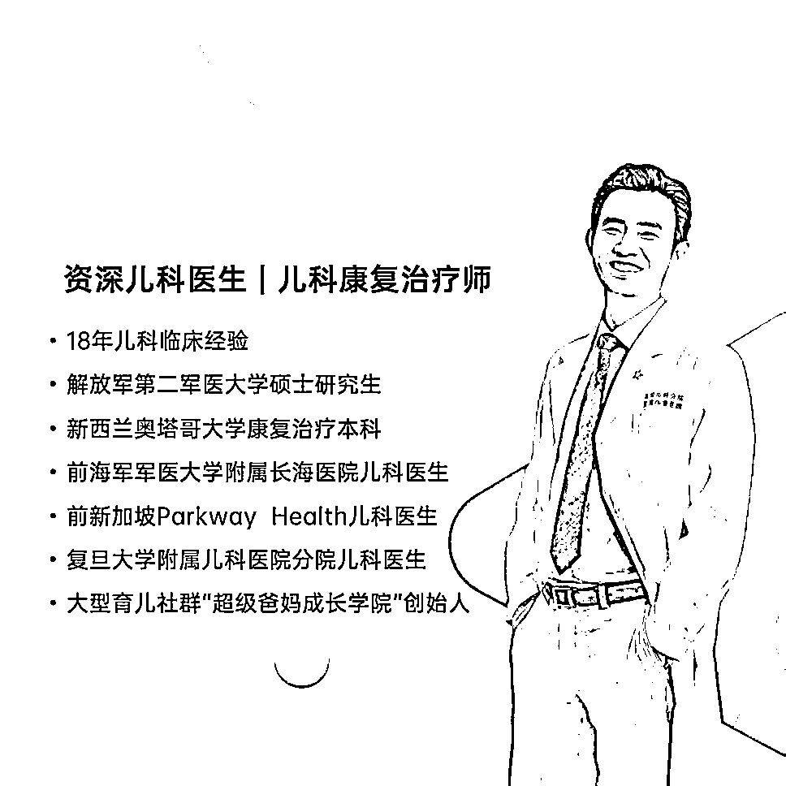

今天要跟大家分享的是我作为一个社群素人，如何把自己的第一个社群做到 600 人+，保持高活跃度，打通商业闭环，成功变现 10w+的。

我是2020年从新西兰留学回到国内继续做医生，在这之前没有经营过自媒体，也没有做过任何的社群。回国之后从2021年中开始，做短视频和图文输出，2022年初才开始准备建自己的第一个私域社群。

因为我的主业是儿科医生嘛，所以我想到的建立的第1个社群自然是宝妈育儿群。在建群之前也没有任何的运营经验，我就先去听了咱们生财星友@北大苏姐  的一堂社群运营踩坑课，这堂课我至今记忆犹新，我从她的分享里面，学到了社群运营的几个坑。这边也先分享给大家。

 

 

大家都知道那个著名的消费能力链条：孩子＞女人＞宠物＞男人，由此可知，育儿 + 宝妈群消费能力强，变现空间大，宝妈群永远是各种社群中最活跃的，但如果运营不当，很容易会变成日常聊天 + 吐槽群。

我认为一个好的社群应该把大家集合起来去做一个共同的事情，让大家喜欢待在这里面，每天有收获和成长，而不是每天无意义的“活跃”。

加入生财之后，看到很多球友在卖生财的日历，并运营生财日历共读群，可以把同频的人集合在一起，分享自己的见识并共同成长。由此，我确定了我私域社群的主题和方向：育儿日历共读群，群规就是“抱团取暖，互惠利他，保持同频，鼓励链接”。把育儿日历做成一个类似于生财日历那样一个形式的共读群，每天分享一个育儿知识，这样群里的宝妈们每一天都有新的内容可以学习并围绕这个主题展开讨论。

铁粉初代：

社群虽然是付费社群，但最初的一部分成员其实是免费的，是我门诊的一些铁杆粉丝，我把这些小朋友的家长们邀请进来，作为第 1 批的友军和基础支持者。

他们在群舆论的把控方面给了我很大的支持，同时我隔三四天就会询问一下她们，关于社群分享的内容和社群运营给我一些反馈，因为之前累积的良好的信任基础，所以她们给了我非常中肯和非常坦率的反馈，我听取并非常及时的做了相应的调整，事实证明这些调整对于社群整个的运营是非常有效的，让内容的分享更加的高效及时。

在这之前，我没有任何的互联网产品销售经验，可以说我是一个互联网素人。记得有一次我的自媒体合伙人@梁靠谱医生，在她的生财日历共读群里分享过：对于一个互联网素人来说，要闯出名堂，一要靠持续的内容输出能力，其次要有属于自己的互联网标签。

加入生财之后，看到了视频号直播风头正劲，也看到粥左罗老师的连续直播 100 天挑战，当时我就在想，我是不是也可以发起一个自己社群的连续 100 天直播挑战。好处如下：

其实刚开始定下这个连续直播 100 天挑战的时候，我自己心里也是没有底的，不太确定我自己能不能完成这个挑战。也许连续 10 天是没有问题的，但如果是连续 20 天，50 天，100 天呢？

为了防止自己被自己的惰性打败，我做了几件事情，来促使自己完成这 100 天的挑战：

 

 

第一，我在我打理的付费的育儿社群里面，放出话去，跟大家说，黄医生会每天直播，分享育儿科普，并在线答疑，作为对付费用户的一个承诺，那你就要每天去做到，这是一个内容付费产品的基本的要求。

其次，我跟好几个自媒体的伙伴说，我要去做这个连续直播 100 天的挑战，把话放出去，大家都在拭目以待，希望我能够完成这个挑战。

我也在自己朋友圈里每天直播打卡，每天都发一个倒计数：#连续直播 100 天挑战之第  N 天，让朋友圈的好友，一起来监督我完成这个挑战。开弓没有回头箭，既然我自己已经把包扔过墙了，那就不得不翻过墙头去！

但连续直播 100 天挑战，难度不仅在于保持时间的连续性，更在于保持内容的优质。你不能只是每天到了点之后把直播间打开跟大家瞎聊天，而是让大家来到你的直播间之后能够有所收获，能够对你这个产品和对你这个人有更深的了解。所以我做了一个详细的直播选题的规划。

大家知道其实关于育儿科普，有很多话题可以讲，但每个话题的热度是不同的，而且这个话题是否适合拿来用直播的形式分享？所以我结合了自己十多年的临床积累以及这么多年在门诊跟家长们打交道的经验，选择了近 100 个不同的涵盖育儿方方面面的选题，在直播间跟大家分享，每天聊一个主题。

但其实，我自己的专业是有局限性的，我不可能所有东西都懂，所以在确定了选题之后，我还要去查最新的资料，请教我的同事。确保我在直播间跟大家分享的是最新的、靠谱的、实用的育儿知识。

我报名参加了几个视频号直播训练营，学习直播间的准备，运营，话术，互动和转化技巧。学习怎么选封面，挂福袋，上链接，发红包，和粉丝互动等等，然后平常多去那些场观数据比较好的大 V 的直播间去学习人家是怎么做直播的。有了一定的理论知识储备之后，再去开始实操，心里会比较有底。

现在一个育儿社群，除了在儿科方面会有需求之外，家长也非常关注孩子在其他方面的健康问题，比如说眼睛，口腔，儿童心理等方面。所以我邀请了我口腔科的，眼科的，以及儿童心理学方面的专家，过来做视频号连麦分享专业内容。

同时，我也注意到了宝妈们本身的需求，所以我还邀请了医美科的医生，以及妇产科的医生，过来聊医学美容和产后康复。这些过来做分享的嘉宾，一方面满足了社群成员的不同需求，另一方面增加了我们社群内容分享的深度，还可以互相引流，提高了个人 IP 的影响力。

 

 

因为这些是我自己业内的人脉和资源，这个是别的育儿社群做不到的，这也是我们打的一个差异化的点。

众所周知，宝妈群是属于消费能力最旺盛的群体，其中，婴儿用品占了很大一部分。但是市面上的产品琳琅满目，而且有不少是智商税，那么从儿科医生的专业角度出发，帮宝妈看成分表，筛选合格靠谱实用的育儿产品，让社群里的宝妈少踩坑，少交智商税，这个是很大的一个吸睛点。

在我直播过程中，有不少育儿电商平台找到我想要合作，后来通过沟通和筛选，选定了一个我认为靠谱的母婴用品平台进行合作，我们新建了一个“伊森严选母婴好物群”，主推靠谱实用，有专业背书的母婴用品。

目前我的销售已经超过了 10w+，我的个人佣金也达到了 10000 多块钱，这还是在疫情期间上海的物流受到很大限制的情况下。虽然这个销售额并没有很高，但是我相信，任何一个 100 万都是从第 1 块钱开始的。而且随着口碑和影响力的不断增加，这个增长肯定不会是线性的。

 

 

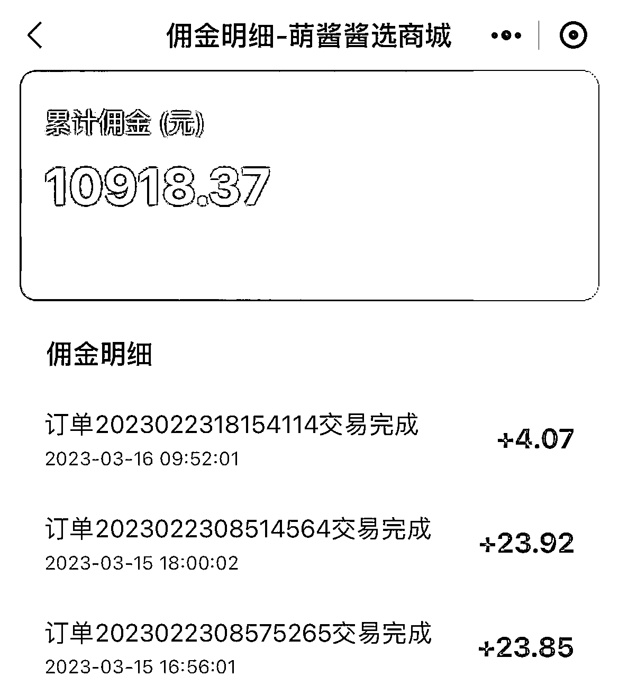

社群运营到一定阶段，就需要在适当的时机迭代更新，由低转高。以下是我做的几个事情：

随着社群的增长，社群成员的需求是在增长的，所以，我们要去敏锐的观察到社群需求的变化，甚至去挖掘社群成员潜在的需求，根据这些需求升级产品，这样才有可能把客单价由低转高。

 

 

在我刚开始运营这个育儿社群的时候，只是一个低客单价的引流产品，跟很多其他的育儿社群一样的，我也是一个人包打天下，所有的群里的问题分享都是我一个人在做。本身我在临床干的时间也很长了，所以基本上 90%的问题都可以搞定。

但是随着社群的成长，你会逐渐发现一个儿科医生，他的专业知识再丰富再全面，他也没办法覆盖儿童健康的所有领域。现在的宝妈们对孩子的健康关注，越来越多了，不光是看病，还包括喂养，睡眠，儿保，视力，口腔等等。另外还要去挖掘宝妈本身的需求，比如说产后康复，女性成长，宝妈副业等等都是可以作为社群的潜在增长点。

当发现或者挖掘出新的需求的时候，而你又没有办法去满足这个需求的时候，怎么办？

我的策略是，放弃创始人 IP，找同行当医疗合伙人，打造一个“小而全”的团队。

医生这个行业比较特殊，因为除了要求医生本身的专业过硬，而且同时要有他们一定的互联网思维和商业思维，他们有这个能力并且乐意去在互联网上去输出专业的知识，同时，他们能够跟上节奏，一起去运营社群，去做产品的打造和升级。

比如说当小朋友后面有眼科，口腔，睡眠，喂养，身高这方面的需求的时候，我就会留心在各个社群里面，去寻找这样的优秀的同行。当有合适的候选人的时候，我会邀请他们做个直播连麦分享，或者是一个社群的图文分享，在这个分享过程中，去观察他的专业能力，以及他的互联网输出能力。

经过筛选之后，我终于找到了 6 个医疗合伙人，可以同时覆盖儿童心理，喂养，睡眠，口腔，眼睛，以及宝妈产后妇科问题的健康需求。把我们的社群的护城河进一步的挖深挖宽，提高专业能力。

 

 

 

 

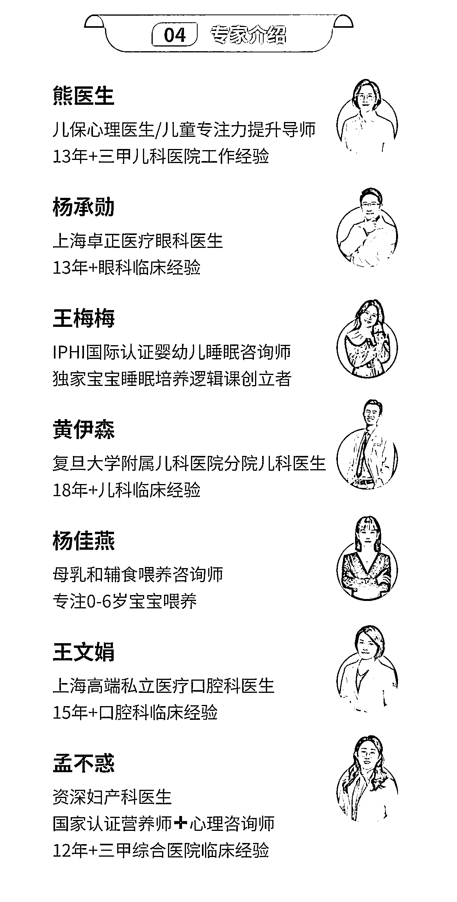

当合伙人团队确定之后，我写了一份合伙人手册，在里面明确的跟大家详细说明了，作为合伙人，你需要在社群里面，输出哪些内容？什么时候需要你去做什么事情，做到分工明确。

手册里还明确说明了你可以通过哪些渠道赚到钱，这个社群所有的利润，我的原则是，进四出六，把利润的大头给到各位合伙人，这样子大家才有充分的动力，去拉新，去做好社群服务，去成长，这个团队，才能会是一个有凝聚力的团队。

 

 

 

 

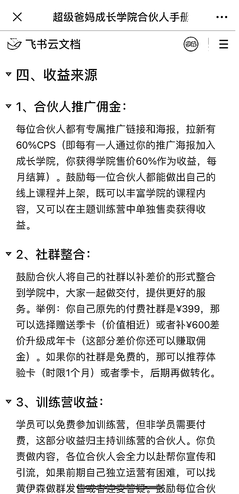

做知识付费的人大多数最讨厌的都是那种双手朝上的白嫖党，但是，在社群升级的时候，我设置了一个体验卡制度，就是说，如果是对我们的社群不是很了解的新用户，可以免费体验 28 天，在我们社区里面，无限次提问，同时可以参加在这个期间举办的实操训练营。28 天是免费的，同时 28 天到了之后，你可以选择退出，如果你觉得我们社群的服务达不到你的预期值的话，我们分文不取。

之所以会设立这个体验卡，是因为我们是一个育儿社群，我们是做一个长期服务的陪伴型的社群，那么 28 天对于一个宝宝来说，其实是一个非常短的一个时间，而我们只是提供了一个机会让宝妈了解这样一个与众不同的，具有很专业的服务团队的社群。

我们不担心她会白嫖 28 天，因为她一旦体验过我们的专业服务之后，我们很相信，她在 28 天之后会选择成交，而不是选择退出社群，因为她在别的地方找不到这样的育儿社群，这点我对我们的产品非常有信心。

而且付费用户是一个双向筛选的一个过程，如果我们觉得这个宝妈的育儿理念实在跟我们不符合，那我们就会劝退。28 天之后就可以退出我们的社群，因为你跟我们不是一个育儿理念的，那大家还是好聚好散吧。

3.8 正好是我们社群运营一周年的纪念日，我在我们的育儿星球，开了一个会员日抽奖，然后参与方式是让大家写一段，在这一年中跟黄医生的社群，发生的故事，同时晒一张宝宝的照片，然后可以参加抽奖。

 

 

这个活动的目的，是为了造共同回忆，同时，可以让宝妈们给我们提供，正反馈和社群宣传资料，效果还是不错的，我们收获了，挺多的好评，而且是真情实感，真实发生的故事。这些宣传资料都可以反复用在朋友圈及社群升级的过程中。

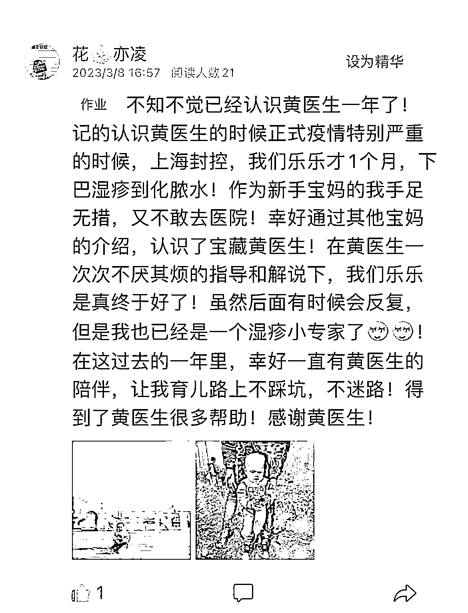

 

 

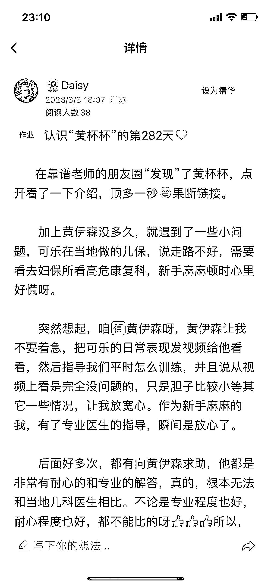

 

 

以上，就是我，一个社群素人，从0到1，开始运营人生第一个大型育儿付费社群的故事，希望对大家有所帮助。

有育儿需求，想做母婴赛道或者母婴好物电商的圈友，欢迎多多交流！大家一起生财有术！

评论区：

执  笔  写  洪  顺 : 太牛了

张可粒 : 赞呀

阿甘｜豪华车买手 : 厉害

小米 : 好厉害👍

小鹿 : 厉害了！！

轨迹LLC : 黄帅

💪Chrys : 太有收获了~

马热爱 : 黄医生太牛了👍

# **# ****(**精华帖**)(101**赞**)**运营新手从**0**到**1**将家居类社

# 群免费向付费转型，并深度变现的经验

 

 

作者：  爱折腾的土豆妈

日期：2023-06-01

运营新手，从0到1将家居类社群免费向付费转型，并深度变现的经验

作为一个体制内幼教，爱折腾房子的土豆妈，在社群运营方面完全是个新手，曾经创建过宝妈购物群、装修围观群，副业赚钱经验分享群等等，但经过3月社群运营大航海深入学习之后，才发现那些群都称不上真正意义上的社群。

经过了四个月的努力，终于把一个【免费装修围观群】升级到了【家居陪伴年度社群】，，邀请了14位群友分享，4次大咖讲座，已沉淀46000字精华内容，跑通了好几个变现闭环，实现了稳定变现。

这些无门槛的免费群都遇到了一系列共通的问题：

加入的新人很多是引流为目的地爆粉，拉低老群友的体验感。

群内聊天以闲聊、吐槽为主，没有价值，甚至充满负能量。

购物群变成广告发布群，销售额不增反而降低。

群内以群主发言为主，持续输出耗费大量时间、精力，得不到反馈，难以坚持输出。

群内活跃度越来越低，甚至发10个红包半天都没抢完。

……

如果你的微信群，也遇到了同样的问题和困扰，不妨看看土豆妈是如何运用一些小技巧、小话术，一步步解决以上这些问题，把一个装修围观免费群转变成有活跃度、有价值、有变现的家居陪伴付费社群。

 

 

以下内容经过浓缩提炼，保证字字干货无废话，担心回看找不到，不妨先点个赞。

图文内容4200字，请移步飞书阅读。

https://sebz0gwoxb.feishu.cn/docx/FCekdjKiYoqbe6xUOxVcooOUnCb

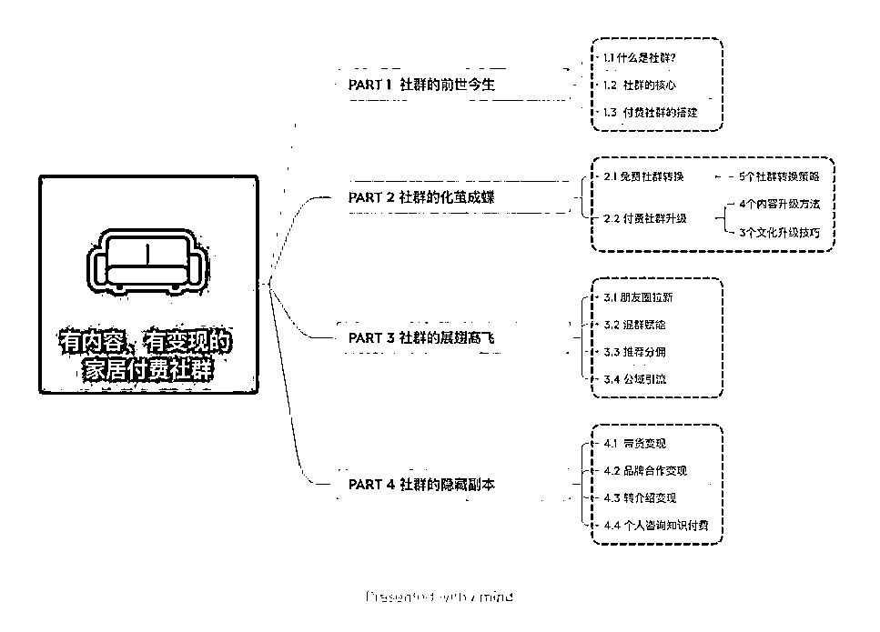

评论区：

小沫 :  超会做社群表情包的小沫在这！

土豆妈做社群真的超用心的，这篇文章更适合做社群的小伙伴反复阅读，真的讲了很多方法，装修避坑找土豆妈准没错！

曲直 : 我就在土豆妈的社群里，真心超牛逼！不仅能提升生活品质，而且还能学到很多社群运营经验，真是太厉害了[强]

爱折腾的土豆妈 : 感谢曲直的认可

飞扬 : 土豆妈真优秀[强][强][强]

爱折腾的土豆妈 : 感谢认可！

云珞YunL : [玫瑰][玫瑰][玫瑰]好厉害

唐葫芦 : 土豆妈越来越厉害了  实践出真知

爱折腾的土豆妈 : 感谢认可

 

 

# 【线下案例】**6**篇

# **# ****(**精华帖**)(157**赞**)**以面包店为例，实体店如何

# 通过私域运营实现扭亏为盈？

作者：  沙拉

日期：2022-06-02

大家好，我是来自深圳的沙拉，国家高级烘焙技师，一个从外贸跨界到烘焙行业的斜杆青年。

2021年11月1号，我接手别人转让的一家实体面包店，一二月份，受疫情，寒假，过年多种因素影响，门店人流减少，经营惨淡。

最差的时候，我银行卡里的周转资金只剩下7000元，面对高昂的房租，水电和人工成本，内心是极度焦虑，压力山大的。

3月疫情变严重，中旬深圳封城，我在这期间通过调整运营，拓展线上客户微信群，做配送，让实体门店营收增加。

如今，门店通过线上社群订单，线下散客订单，团体茶歇订单，线下烘焙授课，亲子**diy**多渠道带来的营收，实现扭亏为盈。

在这半年的开店过程中，我初步学会了招聘，沟通，管理，学会了算成本，利润，人效，坪效，产能，学会了采购，生产，研发，销售。

 

 

创业很难，但是当我们具备反脆弱性的特征时，外界的变化混乱和波动，反而能促进我们的成长和进步。

疫情时代，实体门店如果一直保持传统的坐等顾客上门模式，比较被动。这时如果我们可以主动出击，把线上做起来，线上结合线下，多渠道销售，门店经营就会轻松一些。

感谢生财律师球球的鼓励，写这篇文章，是我的反思总结，也希望给做实体门店的圈友们带来一点帮助。

更详细的阅读，请移步飞书文档：

https://ooldqbgx5t.feishu.cn/docs/doccnHxwAIEOxO8CSFkjWeACoOf评论区：

奔跑的小枪 : 感谢分析，内容很细致，虽然我不是从事这个行业的人员，但是文章中现实反馈问题、解决方案、避坑指南读后都有收获。

丁邱洁律师团队 : 沙拉姐真的很棒

大龙哥 : 沙拉姐棒棒哒

岳嘉 : 深圳女孩，加油

放开那芒果 : 写的好棒！

放开那芒果 : 我也是深圳的，可以加个好友吗？

施总|向下扎根|深圳 : 好棒  深圳如果是南山区方便私信店铺不  我去办个卡消费支持走一波

咕咕 : 沙拉姐牛逼

# **# ****(**精华帖**)(144**赞**)**实体茶叶转型小红书引流，

# 一年变现** 100W+**

 

 

作者：  绅沐

日期：2022-12-20

这两年实体行业不好做，茶行业亦是如此，无数的同行关闭门店另谋出路。

我及时求变，选择从线上获客，通过小红书的粉丝群和店铺来吸引泛粉，提升账号权重；再通过公众号垂直输出吸引精准粉，下单购买茶叶。

2021年我通过小红书引流变现了**100W+**，成交率大约在**10%**。目前小红书主账号粉丝6W+，是茶领域的TOP博主，点赞/收藏比例差不多1:1，属于干货型博主。

今天我将主要分享如何制作优质的小红书图文内容，以及我在变现过程中的一些感悟。

 

 

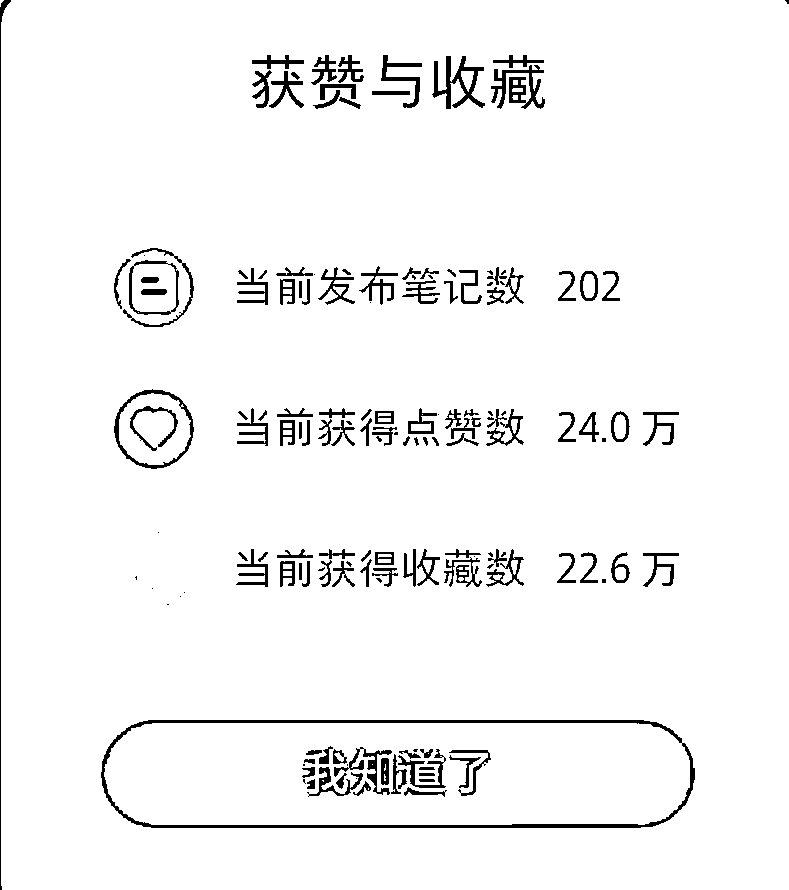

目录

一、项目介绍

二、图文内容创作技巧

三、私域运营

四、结语

 

 

# 一、项目介绍

时不时都有会人（粉丝、同行）问我，你的图文都是用什么工具制作的，有什么技巧吗？当我回复他们是PPT时，对方略显错愕又觉得合理。工具不在多，找到合适的一个深入研究，照样能让你玩出花来。

下面这些笔记，均是我仅用PPT制作出来的，数据表现良好，也有粉丝私信我要原图。

 

 

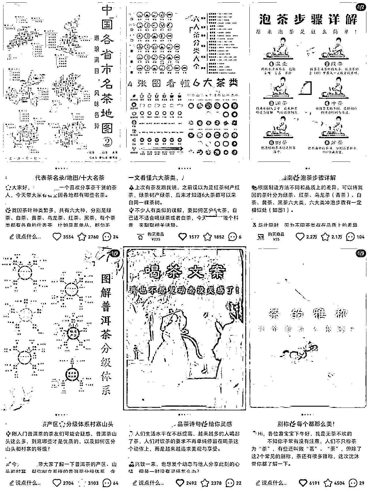

下面我分享如何巧妙利用PPT制作小红书图文，以不同案例分析＋我个人实操的经验分享。

 

 

# 二、图文内容创作技巧

# **# ****2.1**确定统一风格，设置基础模板

确定统一风格有什么好处？账号图文如果有统一的视觉化观感，能让你与其他账号区分开，也就是让用户一看到作品风格就能联想到你，进而赞关评。

比如下面这个账号内容采用中国风基调，与茶叶的属性相对吻合，差异化风格明显，账号数据自然可观。

 

 

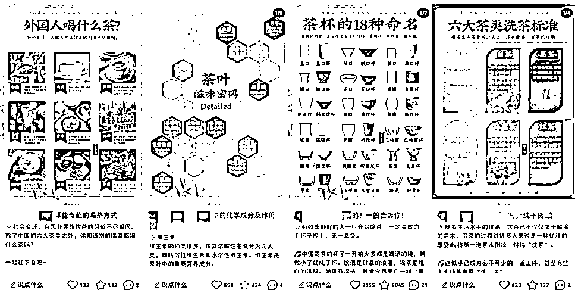

有一种统一的风格，会让人觉得你是在认真做内容，不是搬运党，也不是发着玩一玩，给用户的第一印象就不错。

下面这位成长干货型博主走的是真实分享的路线，图片是实拍自己的工作室，文字设计有统一模板，这位博主笔记底下的评论明显高于其他人。

 

 

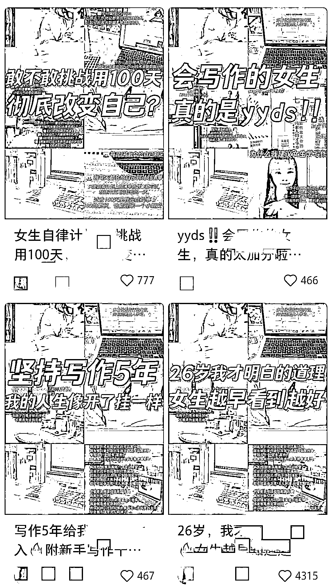

 

 

# **# ****2.2**封面大于一切

封面对笔记打开率的影响程度要占到80%以上，也就是说，如果笔记无法通过优质的封面来传达精准的内容信息，用户就不会点进来观看，像下面这两篇笔记，孰优孰劣，一目了然。

 

 

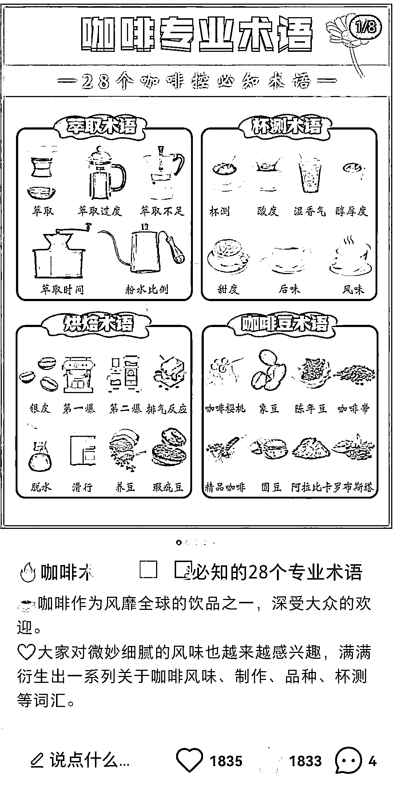

 

 

 

 

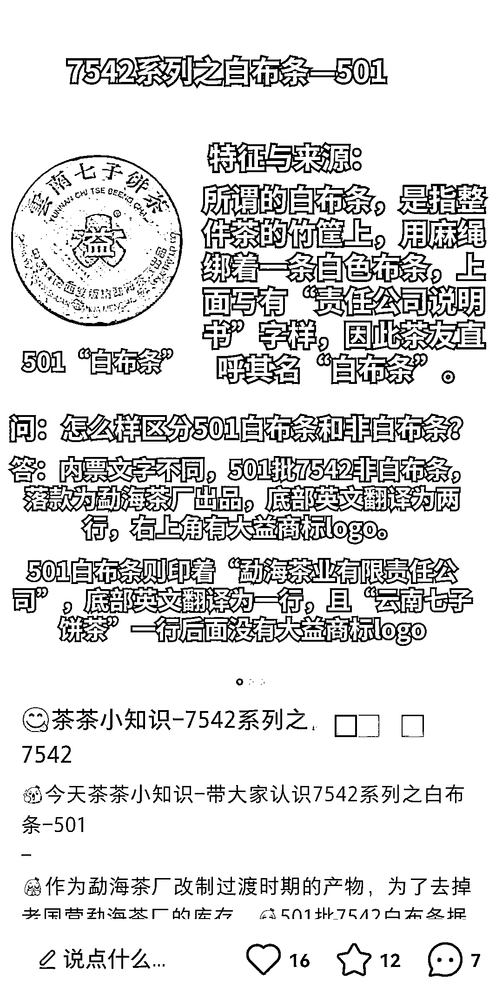

 

 

要在**1-2**秒内吸引用户点进来，制作优质的封面就尤为重要了。

# **2.2.1**真诚分享，露脸打造真人人设

小红书用户大多数是颜值控，如果你对自己的颜值有信心，不妨露脸吸粉。

 

 

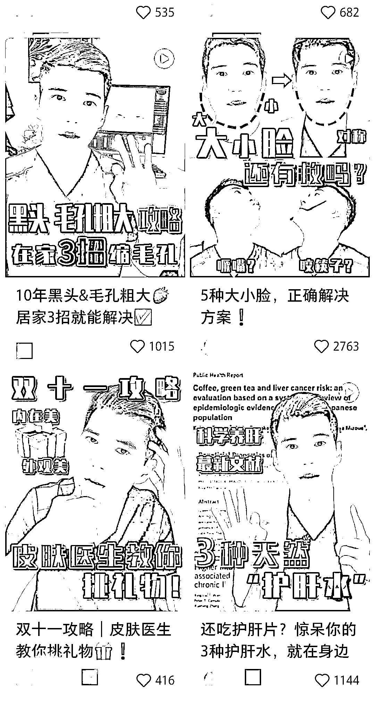

 

 

# **2.2.2**突出笔记卖点，多标题展现

用3-4个标题简单、重点呈现笔记的亮点，非常吸睛，但是要合理排版与配色，谨防花里胡哨，主次不分。

 

 

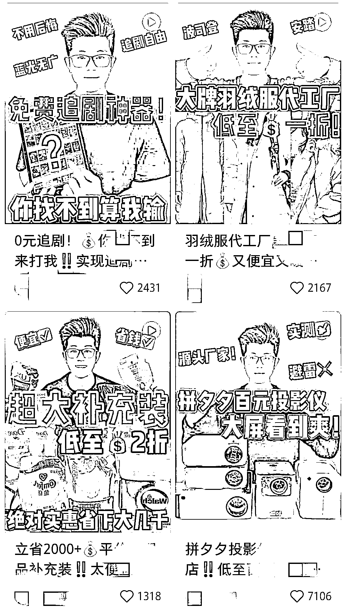

 

 

# **2.2.3**对比反差

胖子→瘦子，颜值平平→帅哥美女，凌乱不堪→井井有条，有反差感的首图，会让用户产生好奇感，想点进来验证文案真假。

 

 

 

 

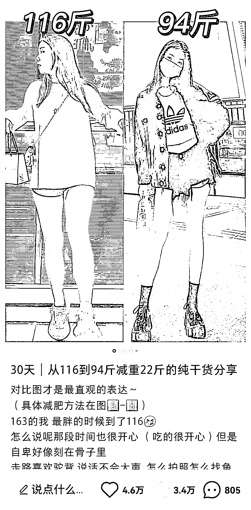

# **2.2.4**丰富感强烈，内容详尽

我的笔记封面的主要风格便是这种方式，不管我要分享什么方面的内容，一定会在封面上将所有内容（图2-9）展现出来，可以通过拼图法、PNG图排版法来制作。

 

 

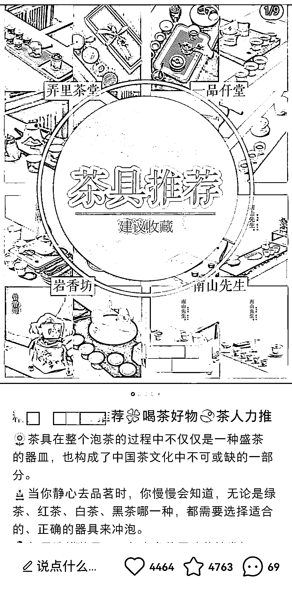

 

 

比如这篇点赞量超过2.7万的“茶相关”笔记，如果只看封面，用户是很难清晰获取完整内容信息的，因此不得不点进来刷图**2-9**；另外，丰富感很强的封面，能给用户预览效果，第一印象会认为这篇笔记内容好详尽，很值得一看，我这就点进去看看到底怎么样。

 

 

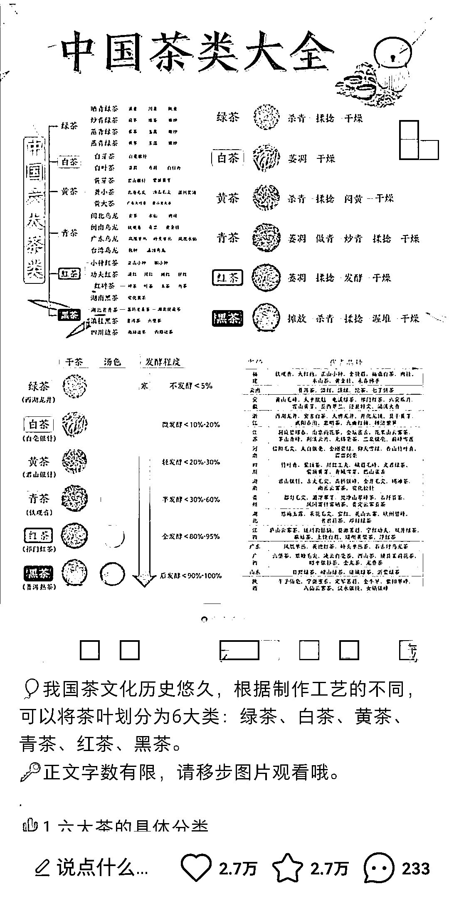

 

 

# **# ****2.3**合理排版，善用**“**减法原则**”**

关注我小红书账号的用户会明显感受到笔记排版很整齐，一看就是下功夫认真创作的内容，那么我是如何用PPT排版的呢？

# **2.3.1**各种对齐

图片格式和形状格式中的各种对齐，是让排版描边高大上的神奇功能，居中对齐、左对齐、横向分布……总之，你想怎么对齐，就怎么对齐。

至于具体怎么对齐，网上搜一下教程就有了，这里不细说。

 

 

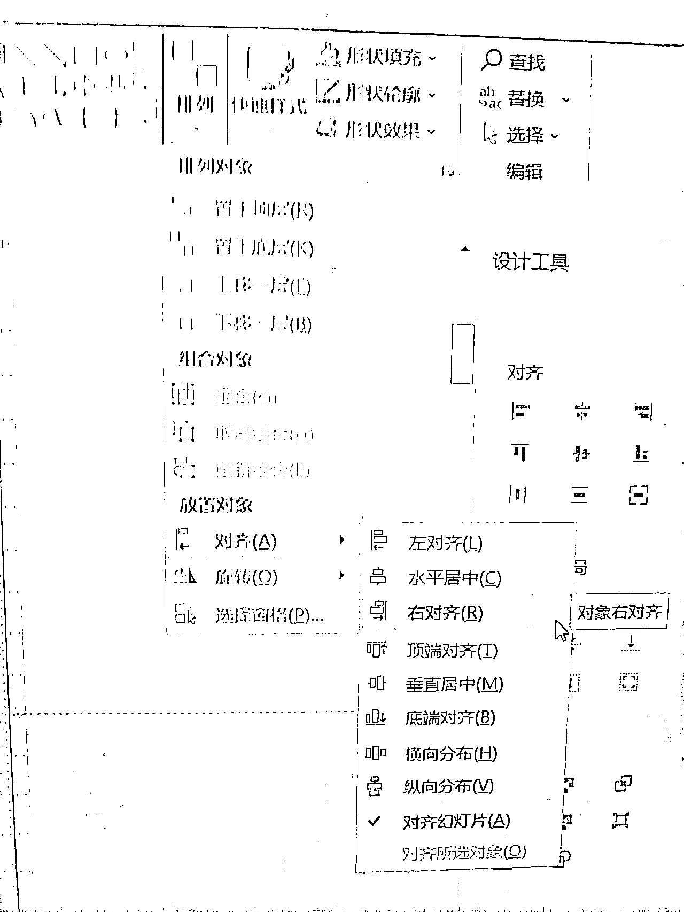

看看下面两篇笔记的整齐度，你是不是会更喜欢图一呢？

 

 

 

 

 

 

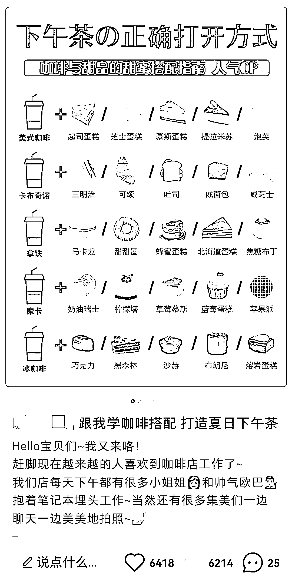

 

 

 

 

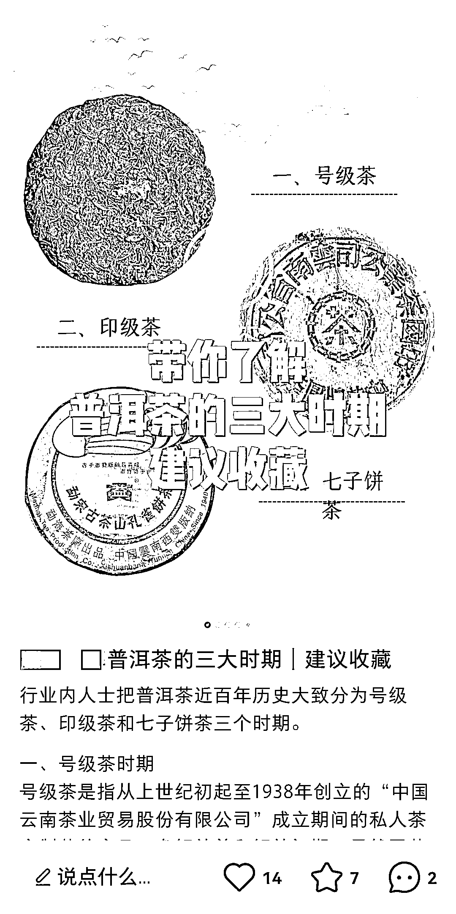

# **2.3.2**遵循**“**减法原则**”**

**less is more**，这是20世纪30年代著名的建筑师路德维希·密斯·凡德罗说过的一句话，意思是"少即多"这是一种提倡简单，反对过度装饰的设计理念。简单的东西往往带给人们的是更多的享受。

做图文内容忌讳一股脑地将所有内容搬上去，仿佛在傲慢地对用户说“我准备了这么多，你还不赶紧吃”。用户犹如刚上学的小学生，你要做的是把食材烹饪好送到他们的嘴边，而非指着一堆原材料说你直接吃吧。

在有限的图文里，将你要表达的观点有趣、形象地展现出来，就要用到“减法原则”，比如一张图片里的字体最好不超过**3**种；页面颜色到合理搭配，不要搞成圣诞树风；

排版风格**1-2**种为宜**……**

 

 

# **# ****2.4**工具不在多，在精

# **2.4.1**吃透**PPT**

一开始运营小红书的时候，也用过各种各样的工具，如黄油相机、美图秀秀、青柠手账等等，但是个人使用体验不佳，一来要紧紧盯着手机操作，眼睛容易疲劳；二来我又是个细节控，有些操作手机没法完成；最后，我较为擅长使用PPT，那为何要舍近求远，不将优势扩大化呢？

分享这点的原因不是让你也非要使用PPT制图，如果你习惯使用PS、创客贴或者其他制图工具，就深入研究好这些工具，甚至有时候不借助其他工具照样能做出来。

比如下面这张旭日图和地图，如果让你来做，你是不是会去搜什么样的工具能做出来。

然而通过我对**PPT**的熟练使用，轻松搞定了。

 

 

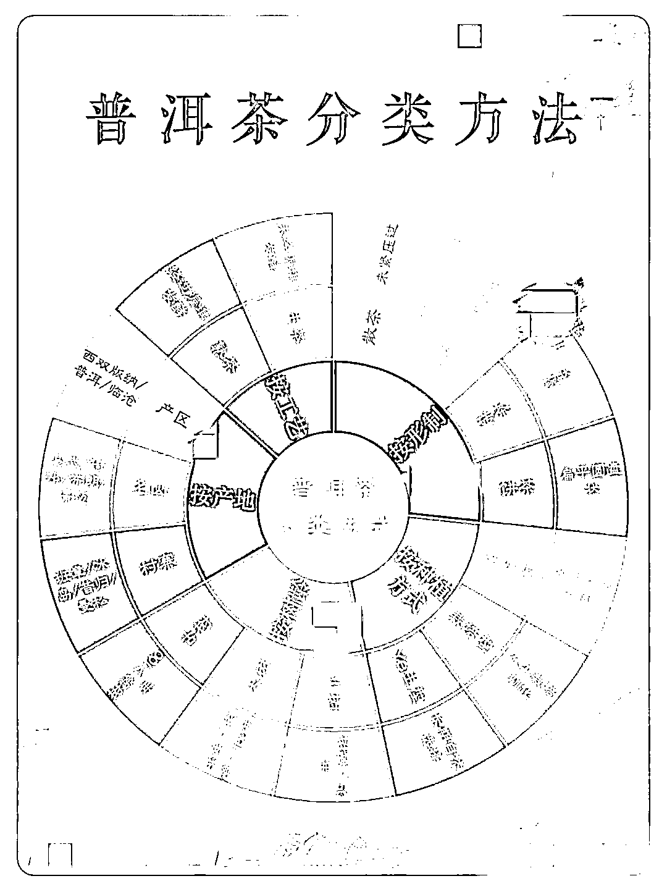

 

 

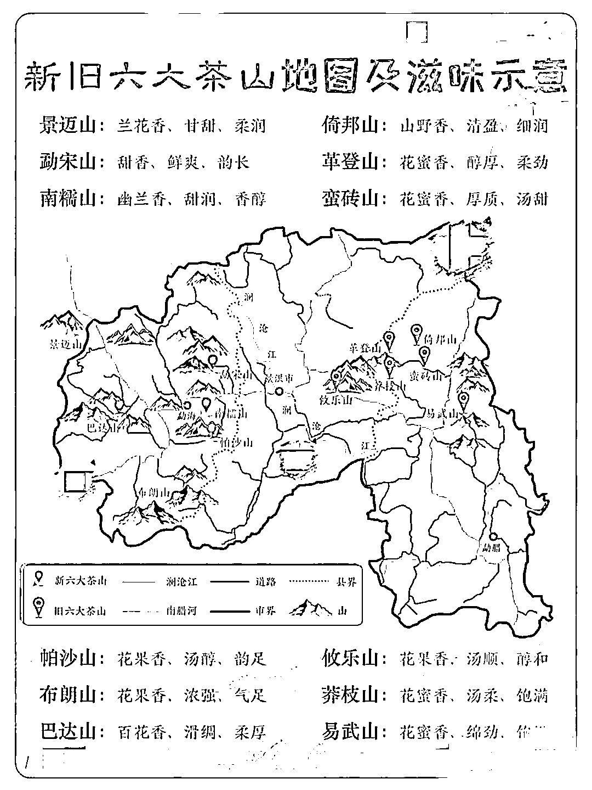

# **2.4.2**巧用插件

 

 

推荐我在使用的一款PPT插件——islide，它有**38**个**PPT**设计的辅助功能，还有8大在线资源库超20万专业PPT模板/素材，其中我比较经常使用的是图标库和色彩库。

如果你对色彩搭配不敏感，或者想找个模板套用，都能使用这个插件轻松搞定。

每个账号一天有定量免费使用次数，双十一我花了159元买了3年会员，可以用非常久了。

通常情况下，大家比较常用的是iSlide中的资源库功能，其实iSlide还有很多高效的工具，比如一键换字体、一键换**logo**、一键统一图片大小等等，让你从繁琐的传统操作中解脱出来，提升工作效率。

找素材的渠道琳琅满目，有时候反而略显累赘，不妨找到一款好用的工具使劲薅羊毛薅到极致，榨干它的价值。

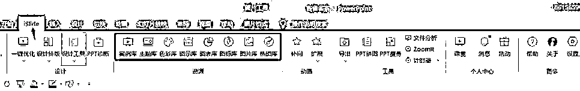

如果大家想系统学习PPT教学课程，网上随便一搜，就能get海量资源。

# **2.4.3**其他工具

 

 

分享下我在制作图文过程中偶尔会使用的其他工具，都是亲测好用的~

# **2.4.3.1**凡科快图

我给产品抠图使用的就是这款工具，**AI**抠图非常干净，试过多款抠图工具还是这个最好用。

除此之外等分图片、批量给图片加水印、压缩图片等等功能，看你的使用需求。

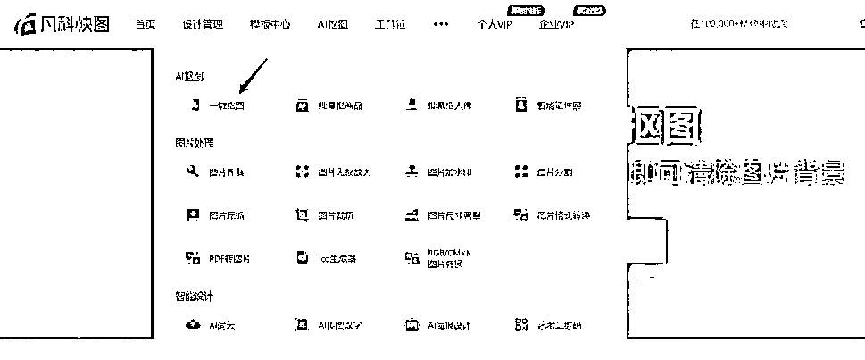

# **2.4.3.2**千库网

我找PNG图片最常逛的一个网站，这是一个超全的PNG免抠图网站，应该是国内目前涵盖范围最广的PNG图片网站了。

 

 

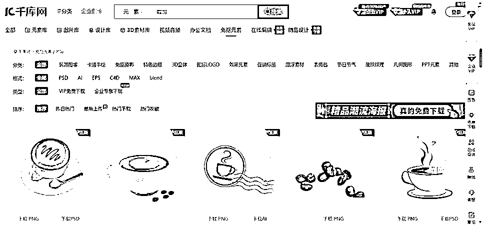

除了拥有海量的PNG图片，还有GIF动图、摄影图、电商设计、配乐音效等素材。

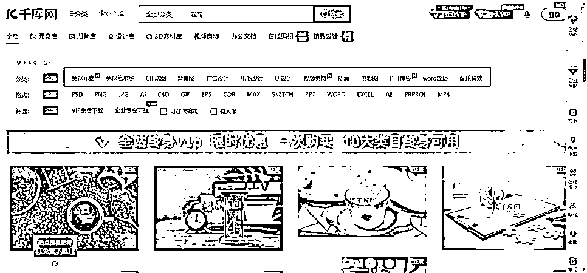

# **2.4.3.3**零克查词

 

 

这是一个查询小红书违禁词、敏感词、广告词、医疗词的网站，每次发布笔记之前，我都会先把文字内容扔进去查一下，如果是不符合平台规定的词，可以通过用近义词代替，表情包代替、拼音代替，或者直接删除来解决。

如果你不知道哪些词会不会违规，使用这个工具准没错。

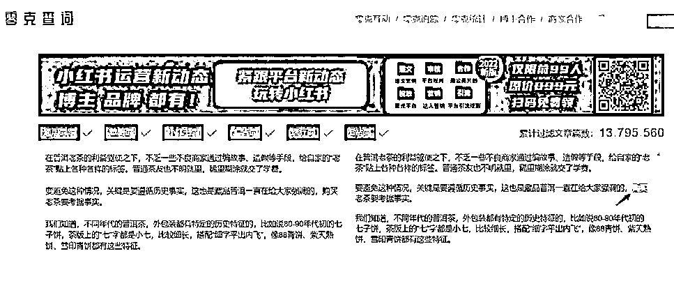

# **# ****2.5**引流方式

关于规模引流的技巧，之前已经有圈友输出了精华帖。

杨星城｜水水《小红书日引流200+，简单粗暴！从博主玩法迭代矩阵玩法2.0版》https://t.zsxq.com/08zu1rhhG

Ben《从女鞋企业号矩阵开始，我如何规模化的在小红书选品、引流并变现？》 

 

https://t.zsxq.com/08w5ONAye

今天我分享2种比较少有人分享，且相对保险的引流方式。

# **2.5.1**粉丝群引流

在主页个人资料、置顶笔记、评论区发布邀请粉丝加入群聊，接着小助理（注意：不是博主本人账号）在群内发布引流信息，可以用资料引流，免费抽奖作为钩子将用户导流到私域。

但是粉丝群引流有个缺点，同行可能恶意举报或者用户也会举报，群会被封，但是影响不大，重新建一个或者多账号建群来应对，兵来将挡水来土掩咯。

 

 

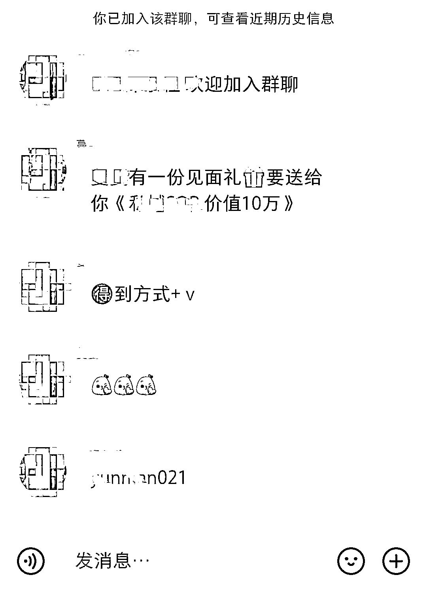

# **2.5.2**店铺引流

 

 

如果你开了小红书店铺，可以设置**1**毛钱超低价咨询的商品，目的是让用户在下单过程中联系你，你可以在店铺私信里引导用户加你微信。

 

 

 

 

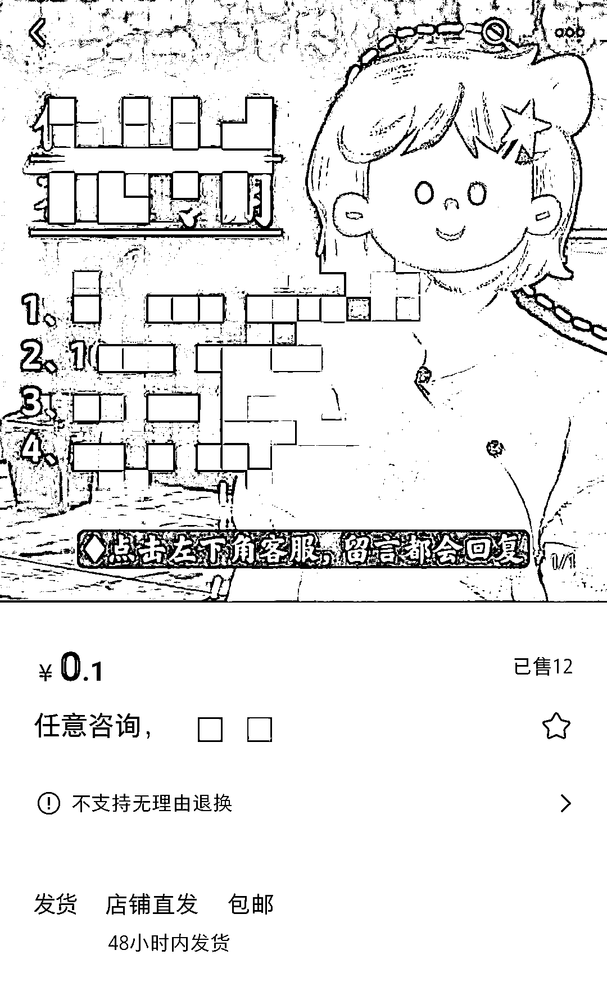

为了不让主账号因为引流被平台惩罚，同样可以设置小助理充当客服的角色（注意：

不是博主本人账号），这样能降低被抓的风险，目前也看到有些博主在这么干，而且目前跟我反馈说暂时没收到违规通知。

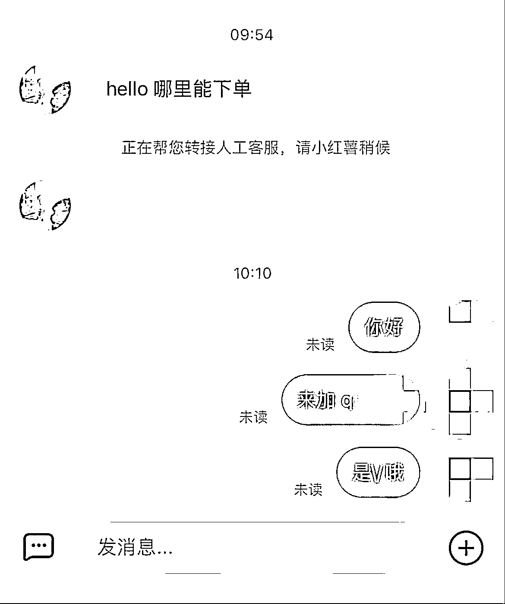

 

 

# **# ****2.6**账号内容布局

什么样的内容离变现更近呢？

在我的理解里，是泛领域内容涨粉，提升账号权重；垂直领域吸引精准粉，下单购买茶叶。

我是这么布局账号内容比例的，以**3**篇为一个周期，其中包含一篇普洱茶内容（垂直领域）；一篇茶类大向的内容（泛领域）；一篇普洱茶产品宣传文。

茶叶大向的文容易出爆款，吸引泛流量；普洱茶笔记出爆款相对难点，但是来的大多是喜欢普洱茶的用户；而普洱茶产品文吸引的是更精准的茶友，一般是有较强成交意愿的用户，会在评论区、私信端询价或者咨询如何购茶。

# **# ****2.7**批量复制

 

 

一个账号能让你一个月变现2K，那么10个账号能变现多少呢？

当你摸清了内容创作的技巧，矩阵化运营是效益最大化最有用的方法，一来不将风险全部压在某一账号上，避免树大招风，减少被同行恶意举报的风险，万一哪天被封号禁言损失就大了；二来，多账号运营能多方面测试内容的受欢迎程度，不同引流方式的风险性。

认识一位做新媒体培训的博主，时常刷到她不同账号的视频，保守估计有10+个账号。

如果哪天账号权重不行了或者引流太多人被平台限流了，对号主来说影响不是很大。

前两年我的主账号引流得比较凶，今年被平台重点盯上了，比如强制我开小红书店铺，官方人员多次微信私信我如果我不开店账号就会被限流或封号。

一开始我不愿开店，被平台禁言了一个月，当下感受非常不舒服。后面我乖乖交了押金，把店开起来了，即便开店效果远没有引流到私域成交的效果好。

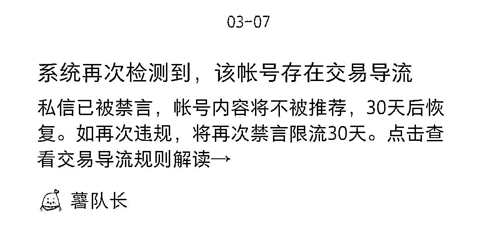

 

 

经过这一系列的骚操作，我更加坚定了搞矩阵号的决心，目前我拥有多个账号，并且经过我的新媒体培训，团队小伙伴的账号也陆续在更新、引流和出单了。

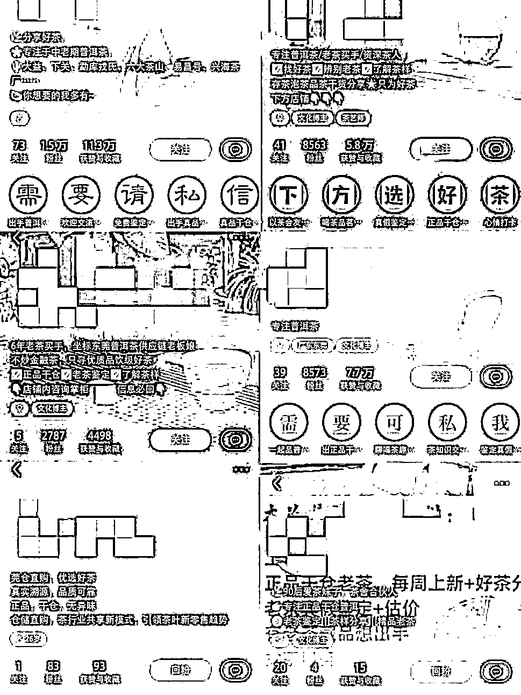

 

 

所以真心奉劝想all in小红书的圈友，如果精力有余，要多运营几个号，尽量降低风险。

# 三、私域运营

# **# ****3.1**定位

关于如何定位的问题，已经有圈友给出了优质解答，这里就不再细说了。

吴一村《14天从零变现1000+，适合新人的小红书赚钱定位攻略分享及避坑指南》https://t.zsxq.com/08P1MeecA

梨云《定位一换涨粉过万，如何利用数据分析在小红书精准定位》

https://t.zsxq.com/084CKASYR

分享下我给自己的定位，用3个关键词概括：专业、给力、略高冷。

 

 

专业指的是我对普洱茶有深入的研究，如果找我咨询相关问题基本能得到相对专业的解释；

 

 

给力指的是我有海量正品的品牌普洱茶，也能淘到稀缺茶，是领先于多数同行的，找我买茶很靠谱；

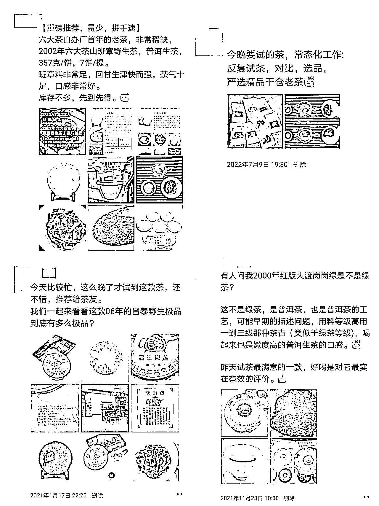

 

 

略高冷指的是我是茶老板的身份，不能随叫随到，要稍微端着，倘若一直主动联系用户要不要买茶，效果反而打折扣。

如果用户认为你是专业的茶人/茶老板，说话也会更客气，有些甚至会称呼我为“老师”、“前辈”。

 

 

 

 

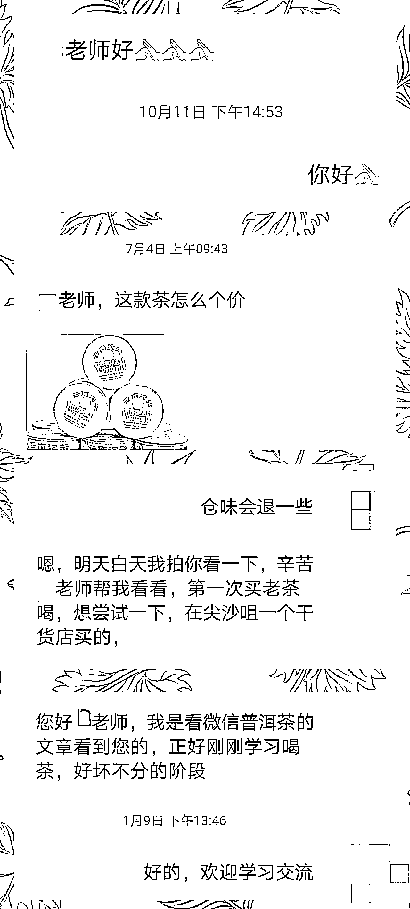

# **# ****3.2**公众号沉淀

引流过来的用户，大部分不会马上成交，为了尽快在他们心中建立信任感，我还会将用户引流到公众号沉淀。

公众号里的内容是垂直领域相关，文章专业度很高，对外行的人来说可能味如嚼蜡，但是对资深茶友来说却是如获至宝。

有些茶友看到我是在认真做茶、做内容，给予我充分的信任，未见一面就将数万元的货款直接转进来，这样的例子还有很多。

 

 

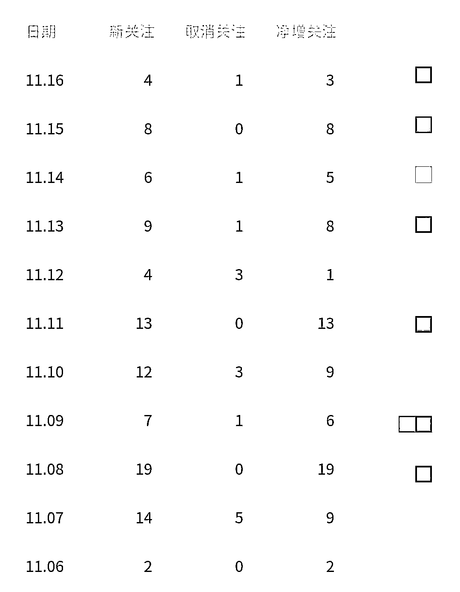

此外，我还会通过公众号做产品营销，这比朋友圈微商式、一天发数十条文案的效果好不少。

 

 

有些茶友可能在默默观望，阅读公众号或者观察我的朋友圈一年半载才下单。

# **# ****3.3**活动策划

# **3.3.1**买茶即送茶样、付费茶样、限时优惠等

就像女生买化妆品送小样一样，通过赠送/付费茶样让茶友低成本品尝到优质好茶，为日后出单或者复购打基础。

# **3.3.2**接受白嫖，利用免费咨询吸引目标用户

不同于其他茶类，中老期普洱茶有真有假，价格飘忽不定，有些茶友会担心自己手中的茶是否物有所值。我则提供了这方面的免费咨询，促使这类茶友主动联系我，不仅能巩固我的专业人设，有机会也能出单。

# **# ****3.4**私信营销技巧

 

 

# **3.4.1**礼貌问候、耐心回答

用户一加过来，我们要先打招呼。

如果对方有问题，给予耐心的解答，但是不宜太过主动；有些人加好友的目的可能不纯，同行摸底、伸手党想免费获取专业咨询等，这些需要综合判断。

# **3.4.2**针对性推荐相关产品

偶尔主动联系老客户，推荐对方可能感兴趣的新品，有活动也要第一时间告知，让TA感受到你在意TA，提高复购率。

# **3.4.3**脸皮厚

做私域销售很重要的一点就是不怕拒绝，如果离出单仅剩一步之遥了，那就厚着脸皮主动联系客户。

 

 

# 四、结语

从我2020年开始运营小红书到现在，它依旧是个值得深耕的蓝海平台，创作成本相对低，入局门槛也不会很高，如果你也想在线上变现，那我非常推荐你试一试小红书这个平台。

最后感谢杨爽（ID：Tough Gir*；成员编号：34758）和鱼丸，提供建议、敲定大纲、细节打磨、持续跟进写作进度……每一步都有他们的帮助，才有这篇分享文的诞生。

本人认知有限，难免挂一漏万，欢迎赐教。

不卖课，不收徒，欢迎学习交流哈～

评论区：

芷蓝 : 一口气读完，有意思＋有知识，尤其关于小红书封面这块真的是研究透了👍👍👍

NicoJIANG : 太厉害了，一口气读完，根本停不下来[呲牙]

以前一直觉得茶行业这样的传统行业似乎不容易结合互联网，最多是有个围炉煮茶的热点，原来只要平台对了，方法对了，精耕细作，一样能做得风生水起，红红火火。真是天外有天，人外有人。感谢您的分享！！[强]

Charles : 关于ppt做图，期待开一贴专门讲解一下

璇、千金 : PP做图人同感…必须整齐，对齐，页边距，行距都要那标尺啦一下。导致一张图做好久[流泪]

Sophie : islide真的超级提升PPT效率！用PPT来做图真是打开了新思路[强] 绅沐 : 谢谢支持[呲牙]

绅沐 : 可以呀[呲牙]

绅沐 : [呲牙]感谢肯定

 

 

# **# ****(**精华帖**)(120**赞**)**线下案例：我通过点位布局

# 无人售货机和运营实现单台机器月入** 2W+**

作者：  泊林家

日期：2022-06-13

无人售货机大家想必不陌生吧？公司园区里、散步球场旁、医院过道、商场拐角…基本上在生活区域内都非常常见。

有没有圈友好奇过这样的无人售货机到底赚不赚钱？

生财小伙伴好呀，我是红明，2021 年 4 月 18 会员日加入生财。5年前机缘巧合下进入了现在的无人售货机行业，主要从事售货机的生产销售和自已运营，经手的实际案例一台一拖一的机器，一个月销售售 4W+，利润 2W+。

我一直认为，无人售货机行业是一个小众行业，没有暴利，但是一个不用花多少精力，可持续赚钱，进入门槛比较低的行业，特别是在人力成本越来越高的情况下。

这个项目的天花板比较低，赚钱有限，如果能对一小部分人有帮助也是件有意义的事。

 

 

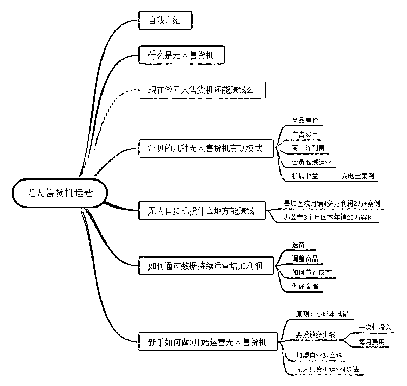

一、什么是无人售货机** **

无人售货机也叫自动售货机，自助贩卖机等，可以简单理解为一个能帮你收钱，帮你展示商品，存货，卖货的机器人。

无人售货机集很多技术于一身，比如像钣金，电子技术，机械，移动支付，软件，服务器等。

 

 

无人售货机的购买方式有两种，一种是先付钱再取商品，像很多售卖饮料、零食的弹簧售货机，成人用品格子柜售货机等；另一种是先取商品，再根据你拿的商品进行扣费，像蔬菜水果称重柜售货机，视觉识别售货机等。

**1. **先付款再取货工作方式** **

通过无人售货机屏幕或按键选购商品，或者用手机微信（支付宝）扫机器上的二维码选购商品。然后通过微信/支付宝/现金/会员卡等进行支付。支付完成后，无人售货机就会自动将你所购买的商品移到取货口。

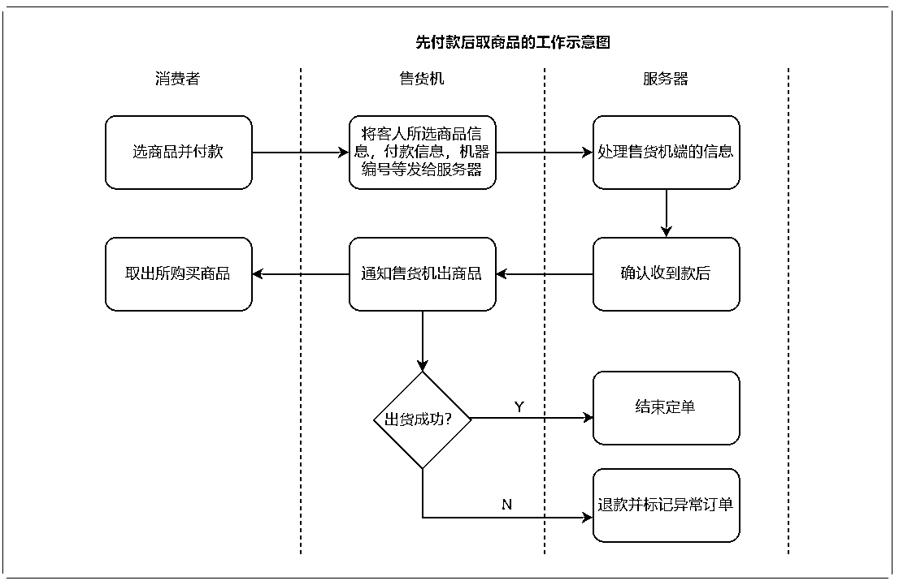

**2. **先取货再扣款的工作

先取货再扣款是借用微信/支付宝的信用分方式。第一次开门取货时，会进行实名认证以及开启免密支付等。

 

 

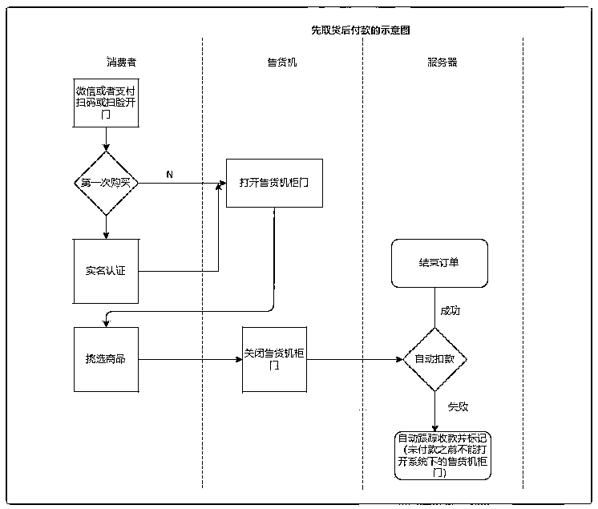

二、现在做无人售货机还能赚钱吗

我们运营无人售货机的目的是为了赚钱，有很多朋友问，在很多地方都能看到无人售货机，现在做无人售货机会不会太晚。不会的，现在做无人售货机还是有很多的机会。

据公开数据显示，在日本平均每 25 人就拥有一台无人售货机，美国是每 50 至 60 人一台，欧洲是每 50 至 120 人一台，而我国人均自助售货机拥有量仅仅约为 2200 人一台。

 

 

疫情过后，无人售货机的无接触购买和快速便捷购买方式越来越受到年青人的追捧。

而无人售货机所能售卖的商品也一直在扩展，向垂直、细分领域发展。

我们之前看到的很多机器，都是卖饮料、零食、成人用品之类的商品。而现在很多细分领域在用无人售货机来解决触达消费者，比如像食品类、预制菜、糖葫芦、礼品、文具、蔬菜、水果、玩具、盲盒、数码产品、口罩、槟榔、旅游用品、酒店一次性用品、自助茶室、无人酒店等。

普通人想在无人售货机赚钱，就要朝细分领域扩展，或者在点位上进行扩展。

 

 

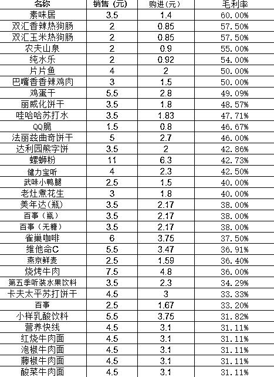

饮料零食的一些参考利润（不同城市，不产产品会有差异）

 

 

三、**5 **种常见的无人售货机赚钱方法** **

**1. **商品低买高卖赚差价** **

目前 90% 的无人售货机都是在这种方式来获取利润，饮料、零食这些高频消费的商品，平场利润在 40%，矿泉水、苏打水的利润会更高一些。而成人用品这些消费频率不高商品，利润会更高。

商品这块，如果你有自已的一些商品，也可以通过售货机来扩展，比如就有过定制售货机来卖鸡爪，卖火锅食材等。

在商品差价这块，有利润更高的方法，合规合法但对运营要求比较高。那就是，利用无人售货机售卖临期食品，一般都要卖保质期在 6 个月以上的，而且对售货机在售商品的保质期需要严格控制，这块就不多说。

在为无人售货机挑选商品上，我们着重看利润去，不要看销售额。就拿香烟来说，虽然售货机上卖烟是没有问题的，但卖烟要办烟草证，而一包烟的利润也见得比其它商品高。

**2. **收取广告费用** **

无人售货机就是一个展示窗口，与消费者接触的每个环节都有展示广告的机会，现在用得最多的就是机身广告，主要无人售货机的正面，两个侧面，背后一般是靠墙，不会展示广告。

如果无售货机带多媒体屏，一般都会有一个广告展示区域，可以展示图片、视频广告。

 

 

在消费者选购商品、付款界面、付款成功这些地方都可以展示广告。但这个要看软件商那边，有些是开放出来让你自定义广告，有些是不开放的。

广告变现如何收费？这个只要你有机器，可展示即可收费，收费高低有 4 个决定因素：

你机器投放点位的人流量（不是一定要在售货机上购买过东西的人）；

在售货机的哪个地方展示，比如在机身上和在购买界面展示，是有比较大的差

别的；

你拥有的机器数量；

展示不同的商品，价格也是有差异的，单台机器从几十到上百不等。

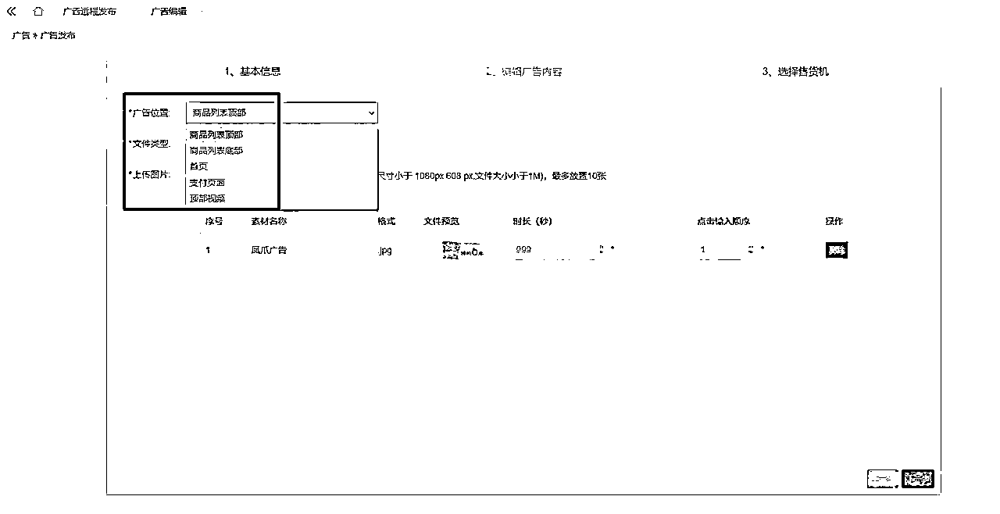

**3. **商品陈列费 ** **

商品陈列费，就跟超市的陈列费一样。比如百世可乐和可口可乐，同类商品我就只卖其中的一种，那么品牌方就会给你陈列费用。

 

 

这个陈列费有两种支付方式：

折算成商品，直接给你送商品；

直接付钱，比如一台机器一排货道每个月付给你多少钱。

**4. **会员私域运营** **

很多朋友都在做私域，无人售货机作为跟消费者接触的一个入口，我们可以把购买过我们商品的用户导入到我们的私域流量池，进行多次变现。因为售货机的摆放位置是固定的，粉丝的地域属性更精准。

会员运营是比较重要的，特别是对于一些需要经常使用的，像牛奶这种，每天都需要，我们就可以通过会员运营，让客人提前预定，我们统一配送到售货机上，给客人一个取货码，让客人自已到机器上提取（现在很多售货机都能实现和美团对接）。

会员和私域运营这块，要求比较高，要么你机器所在地方的人流量特别大，要么你的机器比较多。不建议刚开始就运营这个，但这个一旦做起来，可以操作的空间大。

通过无人售货机导入私域有两种方式：

**1**）消费者主动加入

消费者从自动售货机购买商品，你有很多跟消费者接触到的机会，在这些界面上你可以引导消费者加你的公众号或者个人号，还有一些售货机销软件，你是可以设定用户付完款后自动添加的。

 

 

引流到私域，通过无人售货机来加粉，还有很多种操作方法，生财圈友如果有懂程序的圈友对这个感兴趣的可以好好的研究下。

 

 

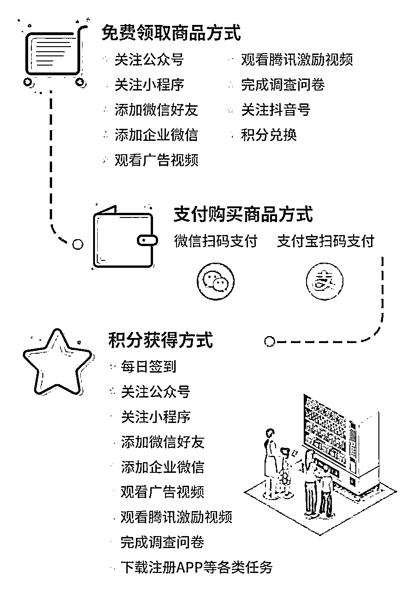

**2**）自已根据无人售货机后台数据去导入

 

 

先拿货后付款这种模式，消费者在购买前都会进行预授权实名认证的，不管是用支付宝，还是微信，后台都可以看到他真实的电话号码的。

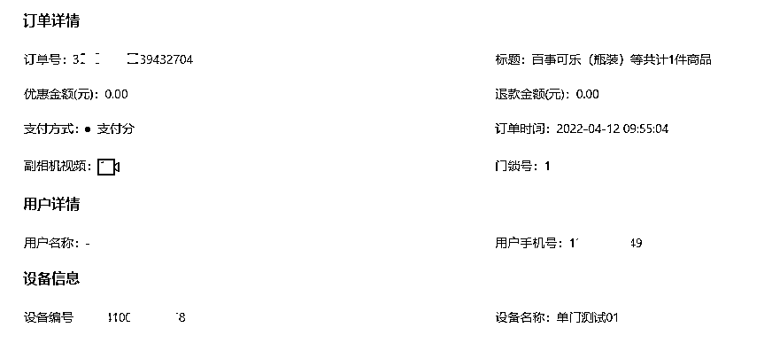

在使用过程中要注意合规性

**5. **其它** **

可以通过无人售货机来解决用户的需求，问题来增加收益，比如说在类似于医院、政务中心、驾校、景区这种场景，可以和共享充电宝相结合，而且现在共享充电宝的投放都是免费的，你不需要花钱，一般可以分到 50% 到 70% 的利润，而你需要做的就是在售货机上提供一个窗口和供电即可。

类似的共享充电线也可以用在酒店客房售货机上。在与共享充电宝合作时，要尽量挑选一些大品牌，他们的点位多，借还时都会更方便些。

这个当你的场景选对好了，就要去往这方面扩展，因为有些需要你的无人售货机支持，比如充电宝就需要在机器留一个窗口，我预留线路。

 

 

四、无人售货机投什么地方能赚钱** **

无人售货机投放在什么地方能赚钱，跟我们线下开小卖部，便利店一样。售货机投放的位置直接决定了我们能不能赚钱，能赚多少钱。

在售货机点位的选择上，有两种方式：

一种是大流量的地方，比如地铁站，机场，车站等地方，这些地方投放无人售货机时，都会选择竞标的方式，对于我们个人来说，刚开始并不适合。

另一种方式就是一些小场景，但利润并不低，可以算着售货机点位的蓝海吧，而且这种点位非常的多，你只要平常多留意下就会发现很多的机会。

无人售货机要赚钱有两个方向：

一是走客单价，比如说像成人用品，利润非常高，3.5 块的进货成本，可以卖到 18 元，但这个走不了量，像居民点，小区周边等地方。

二是高频，比如说像饮料、零食、方便面这些，利润没有那么高（具体可参照上面表中的例子），这个量能走得比较快。车站，工厂，学校，景区，商业中心都是比较适合这种方式。

我们把点位选好了，也就决定了我们卖什么商品。

 

 

**1. **一个小县城医院医月销** 4W+ **利润** 2W+ **的案例** **

像医院这种地方投放无人售货机相对来说是比较优质的，一些大医院都已经有投放售货机，但还有很多稍小一些的地方没有人投放。

有一个客户就是在一个县城的医院，投放了一批售货机，主要是售卖饮料、零食以及一些日常用品。

这个点位的机器一台主机拖一台副柜，主机是一台 60 货道的弹簧机，副柜是一台格子柜。

主柜弹簧机带有制冷功能，主要是售卖需要饮料、零食、方便面等。

副柜是常温的格子售卖一些不规则，大小不同的商品，在医院这种场景  ，像成人纸尿库、拖鞋、奶粉、母乳存储袋等一些高利润的产品。

 

 

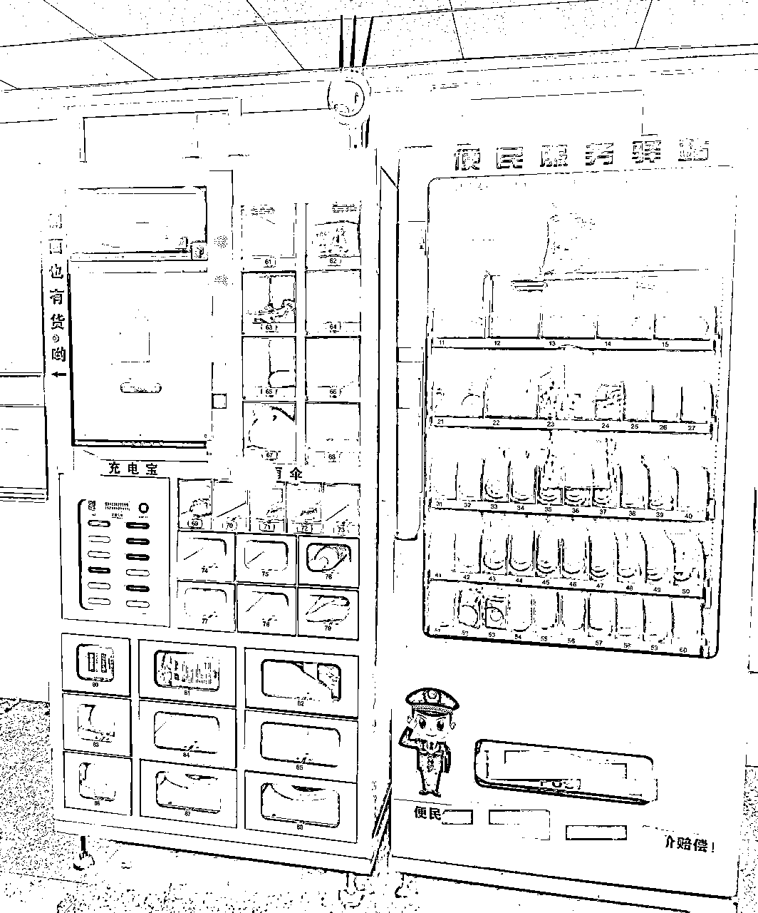

这是一个月的销售数据（这个不包括广告利润，以及充电宝租借带来的利润）

 

 

 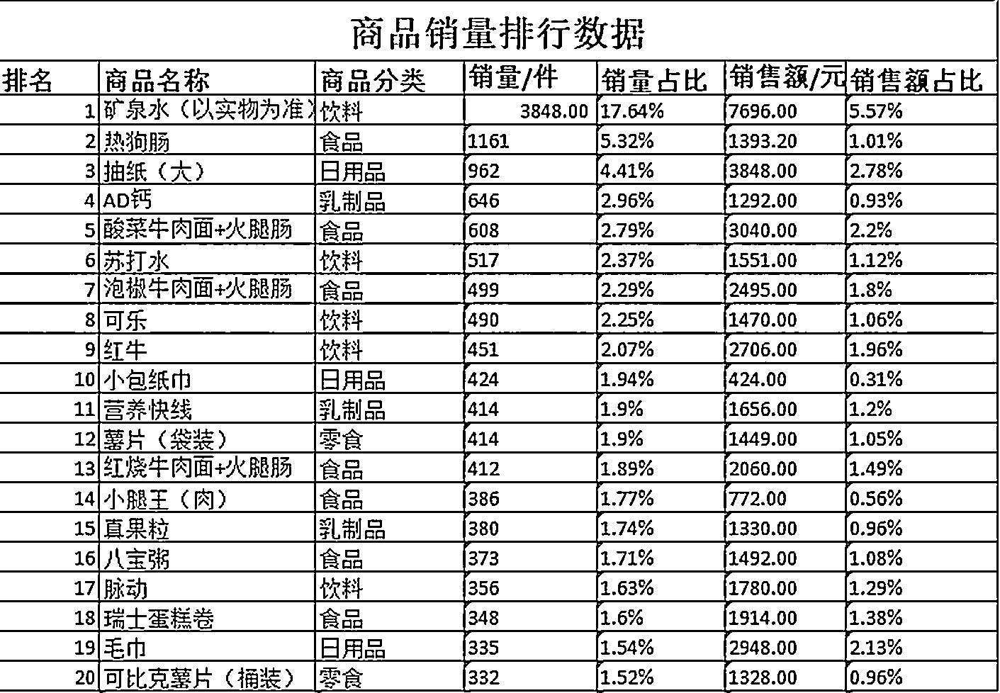

一些热销商品

**2. **办公室年销** 20 **万的案例** **

办公室也是投放无人售货机比较好的场景，办公室售货机的产品，主要就是饮料、零食、方便面这些商品。

 

 

这个案例中，刚开始是投放的，也就是这个公司只提供场地和电费，然后别人提供机器，上货，以及售后维护，运营了一段时间后，这个公司负责对接的人就自已把这 4 台机器买下来，自已运营，她 4 个月就把买机器的钱赚回来了。

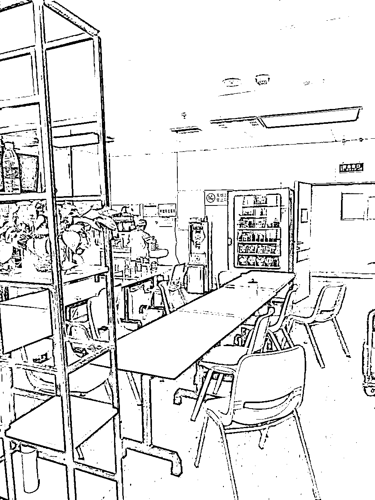

 

 

无人售货机办公室点位销售数据例子

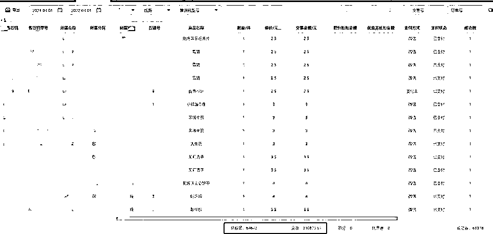

办公室无人售货机产品销量

 

 

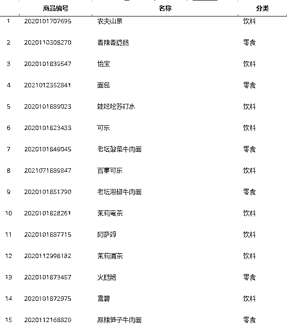

比如：像一些培训学校，艺术学校，很多都在 50 人以下，这些学校为了方便管理，一般都会选择周一至周五封闭管理，在这种点位投一两台售货机，也是有稳定的收益，而且可持续。

 

 

其实，如果对无人售货机这个项目感兴趣，平常多注意观察就会发现有很多小机会。比如我有一次带娃去公园玩，每个公园都会有那种养鱼、喂鱼的地方，你去找别人买包鱼饲料 5 元一包，但有人就想到跟无人售货机结合起来，用自动售货机一包卖 5 元，成本批量在 1688 只要 5 毛钱一包。

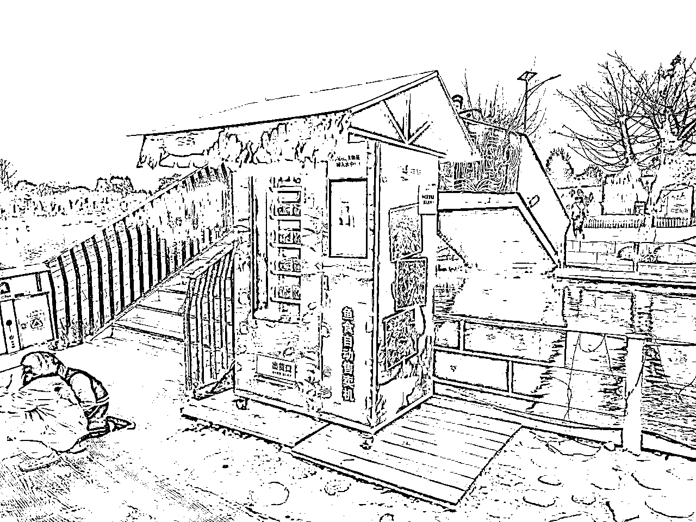

还有一次和家人去一个景区玩的时候，通过用盲盒的形式来售卖景区纪念片，将娱乐、，纪念品和无人售货机很好的结合起来，一共有 8 款产品，每款产品不同，但同样的价格，你都不知道你这次能买到啥，是不是你想要的、喜欢的，我看到有人一次买多个。

 

 

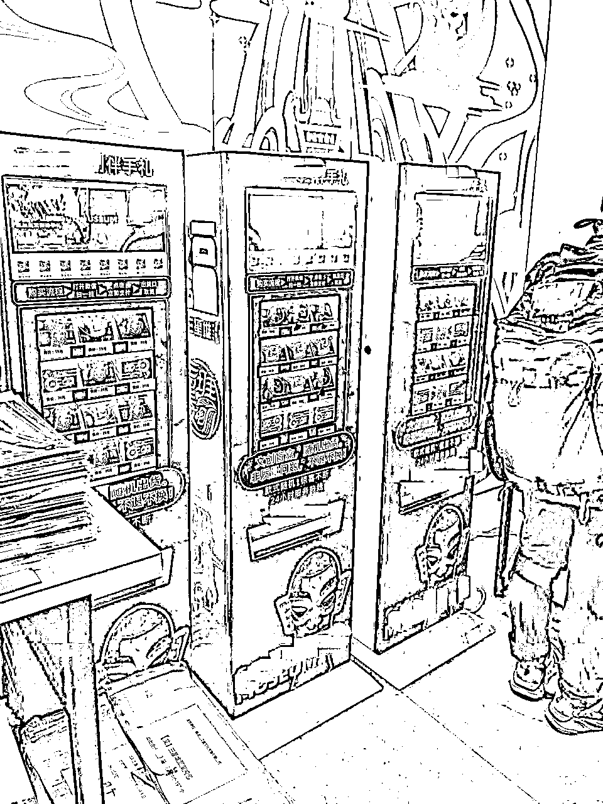

五、如何通过数据持续运营增加利润** **

 

 

无人售货机和传统的小卖部相比，除了可以节省人工以外，最重要的是我们的每一笔交易记录，后台数据都有清晰记录，那我们就可以通过这些数据来不断的调整，降本增效实现利润最大化。

**1. **根据数据来调整商品** **

我们在投放一个新点位的时候，只能根据之前的经验来设定售卖商品。但，不同的点位，就会面对不同的人群，就会有不同的消费习惯。

一台售货机能摆放的商品的数量是固定的。我们刚开始设定的商品并不一定合理，我们就需要根据后台销售数据进行调整，对销量好商品增加数量，把销得不好的商品下架，增加利润高的商品。

不同季节商品的需求也是在不断变化的，比如夏天饮料就走得比较好，冬天零食就走得比较好。这些你都可以通过分析你后台数据来获得，提前准备，提前调整，让无人售货机运营更赚钱。

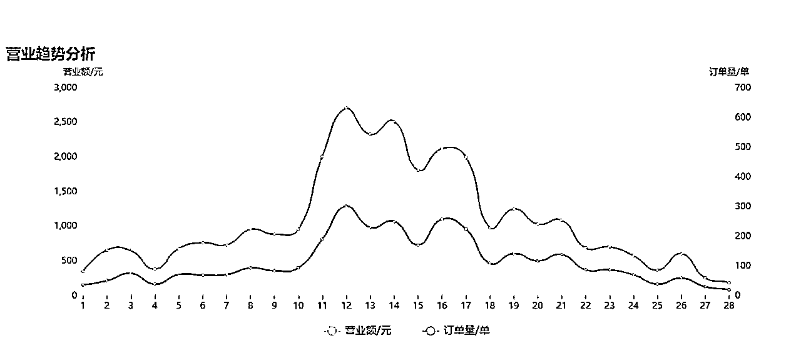

 

 

**2. **根据数据来降低运营成本** **

在无人售货机运营中，人工成本、运输成本、电费都是不小的开支，特别是你运营数的机器数量比较多的时候。

比如说卖饮料零食的售货机都会带有制冷功能，一开制冷功能就电费就会比较贵，那我们就可以通过后台数据分析，这个机器什么阶段卖得好，比如说晚上 8 点到早上 7 点基本上没人购买，那么我们就可以通过一个定时器，让售货机在晚上 8 点自动关机，早上  7 点自动开机。

 

 

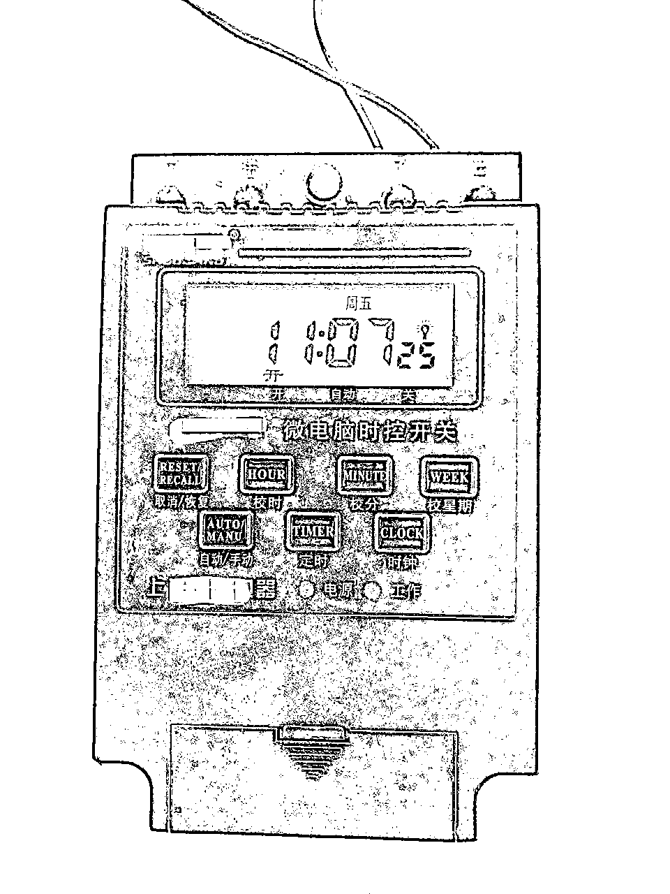

在上货补货方法也可以通过后台数据来判断，什么时候补货才能更省人工和运输成本。

 

 

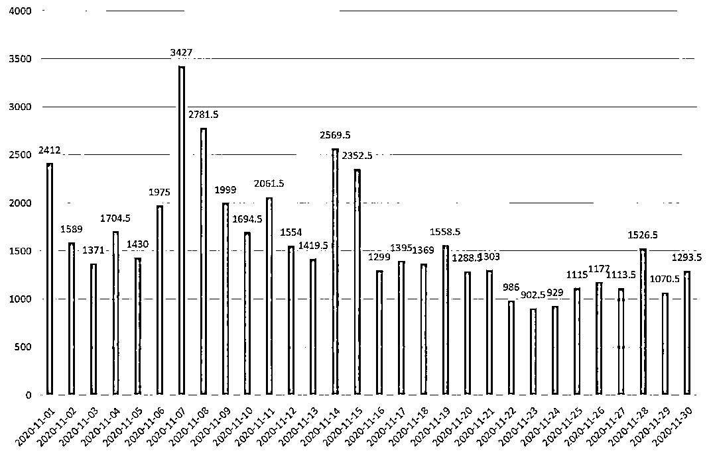

分析每日销售报表

**3. **根据后台数据来调整点位** **

有些点位能赚钱，有些点位不能赚钱，不能赚钱的点位可以从后台数据及时判断，不能赚钱就早点换点位，及时止损，不要陷入沉没成本牢笼。

六、新手如何从** 0 **开始运营无人售货机** **

对无人售货机不了解的朋友如何开始呢？我个人觉得主要做好 4 个方面。

**1. **原则小成本试错** **

 

 

生产和运营售货机这几年，看到很多人把这个事情想得太美好了，在没有测试没有正反馈的情况下，猛买设备（有些设备现在还在我们仓库里），以为售货机买了就把钱赚到手了。

先拿几千块来自已实际运营下，获得一手经验和正反馈后再去扩展。

**2. **刚开始运营要投多少钱** **

开始运营一台售货机主要有这几个方面的费用：

**1**）机器的费用

无人售货机本身的费用，建议从视觉识别柜，或者小型售货机开始，市场价都在 4000 以内。

在挑选机器的时候，要先算帐。需要特别注意，不但要关注机器本身多少钱（很多人只关注到了这一块），这个是一次性费用，还需要考虑后续的使用费用，比如每笔交易是否需要费用（视觉识别售货机每笔交易都会有算力费用的），提现到银行的手续费多少（一般行业是千分之六）。每年的系统是否收费，物联网卡收费多少等。

**2**）商品的费用

进货商品刚开始你没有量，也不太好去谈价格，找当地批发市场去进货即可，要注意保质期，以及是否可以退还货，一台机器准备 1000 元就足够了。

**3**）场地费用

 

 

这个没有一个参考价，有些地方比较贵，有些地方比较便宜。如果是自已的点位最好，如果是别人的点位，最好是给他谈合作，一般是对方出场地和电费，你出机器以及机器维护，售后和上货，这个方面谈得好基本上不用出钱的。

**3. **加盟和自营要怎么选** **

很多人因为对无人售货机不太了解，一直纠结是加盟好还是自营好。

目前售货机的技术已经非常成熟，使用起来也比较简单，自已稍花点时间，不懂的直接问生产厂家即可，加上网络搜索，没有必要去加盟。加盟有很多的坑和限制，特别是成人用品加盟。

**4. **无人售货机运营**4**步曲** **

1）找点位，点位决定了你能不能赚钱，能赚多少钱，以及能赚多久的钱。

2）挑选商品，点位确定了，无人售货机的人群属性就确定了，你就大概知道卖什么商品了。

3）挑选机器，在选机器的过程，越简单越好，越复杂的机器成本越高，出问题的概率也就越大。现在可以考虑视觉识别柜，以及扫码版的弹簧机，这两类机器能满足大部分的需求。

4）运营调整，哪怕你有丰富的经验，在一个新点位投放售货机也是需要调优的。

评论区：

 

 

泊林家 : 售货机选型和运营方面都可以来交流

Echo鱼蛋 : 好详细，感谢分享，又打开了新视界！[强]

梦里秦淮 : 接触了几年无人售货机行业。以下是个人拙见。

无人售货机，几乎随处可见。不排除一些18线的小县城，还有机会。

在一  二  三线城市，自己买机器，目前很难找到好的点位铺设，竞争太大。人流集中的地方几乎都已经铺设了。回本周期过长～

如果点位过于分散，补货也是一个很大的问题。

大的柜机几千，上万块一台，小的机器（酒店成人用品无人零售），几十块，大部分还在用蓝牙协议，不太稳定。

辛苦活，不太适合创业小白做。

赚钱的大部分是生产机器的厂家和招商公司。[憨笑]

泊林家 : 从后台数据和实际运营来看，还是有是些机会，包括像成都这种大城市，以及绵阳这种小城市，重点是点位，比如像成人用品机，一台机器一个月赚2000元左右还是比较容易

亦仁 : 感谢分享，已加精华。

泊林家 : 非常感谢

Mr——Jie : 感谢分享[强][强]已分享

超级发有话说 : 分享的很细致，👍

# **# ****(**精华帖**)(109**赞**)**搭建自己的私域流量池，从

# 人货场分析冲出重围的线下店铺

作者：  佳佳

日期：2022-01-27

大家好，我是佳佳，曾在母婴及大健康行业工作过，培训(主要是产品培训)及访问过上百家实体门店，主要实体店位于江浙沪、四川、河南、山东、海南...等地，曾经协助过上海母婴门店举办周年庆活动平均单店日营收 30 多万元，多个合作代理商年销售额突破上亿元。

 

 

目录

**1. **实体行业背景介绍

**2. **线上运营：流量怎么来？线上流量如何变现？

**3. **线下运营：人、货、场

**4. **其它收益：延伸服务、知识付费、招商加盟

很多人唱衰实体行业，包括开实体店的老板自己可能也不看好，今天收到鱼丸的约稿邀请，我想和大家分享一下我所看到的实体店都有哪些玩法破圈，我将以多个线下店铺为例，从线上线下两个为大家分享这个话题。线上运营主要内容是，如何在线上多平台获得流量，并搭建起自己的私域流量池；而线下运营则会从人、货、场三方面分析目前冲出重围的线下店铺，它们都有可以借鉴学习的点。

**—01—**

实体行业背景** **

**1**、实体店目前的发展情况

自从淘宝、拼多多等电商平台出现以来，大量线下中小实体店的生意变得越来越难做。

 

 

尤其近两年来，疫情突发，对线下实体行业的冲击就更大了，许多地方出现了关店潮。

比如，近期爆出沃尔玛中国今年已关闭 31 家大卖场；海底捞宣布今年关闭 300 家左右门店，大概相当于门店总数的 20%，等等关店新闻。

大家似乎都对线下实体店唱衰，其次产品同质化、获客成本提升、营销效果下降等种种原因，也让「行业内卷」成为商家共识。不过反过来想，行业内卷其实也并不是一种「唱衰」的论调，任何行业的发展都是螺旋式上升的过程。

众所周知，线上店铺如果做得好，一个网上商店服务全国，效率更高，但是现在线上的竞争反而更加激烈，获客引流的成本也越来越高。

相对以前，现在线下实体店又一次涌现出许多新的机遇，不过经营模式需要完成由传统向创新的大转变，才能真正拥抱新的消费模式下的核心用户群体。比如伴随着市场需求的多元化发展，亦是让不少新锐的品牌和实体门店抓住机遇，破局出圈。

所以，今天想要和大家聊的是：实体店如何实现线上线下多渠道引流变现？

**2**、开家实体店需要投资多少钱？** **

开实体店主要有三种方式：直营、加盟和代理，无论哪种方式加入，都希望大家根据自己的资金、能力、市场情况来慎重选择，毕竟创业有风险，入行需谨慎。

因为我之前在母婴行业工作过，对母婴店比较熟悉，下面就以母婴店为例，分享一下开一家母婴店到底需要投资多少钱？

 

 

**1. **租金：不同的城市，经济水平不一样，不同大小的经营面积，它所需要的房租租金也是不一样的。一般来说，一间 60-100㎡  左右的店铺，它的租金每月大概在 5000-20000 元不等。关于租金问题，店主可根据自身条件选择。

**2. **装修：母婴店的装修不需要太豪华，主要能突出温馨、舒适的亲子主题就可以。根据母婴店的经营面积不同，60-100㎡  的经营面积，装修费用大概要 3-5 万元。如果再加上一些儿童玩具、婴儿洗澡等设备的话，建议店面面积在 100㎡  以上。

**3. **加盟费用：不同品牌的母婴店，它所需要的加盟费用不一样，但是没有真正意义上的免费加盟或者 0 元加盟，加盟费用的多少要根据加盟的品牌来决定，正规品牌店加盟费一般是 7-15 万元。

**4. **设备费用：设备费用也是一笔不小的投资，一般来说根据店铺大小的不同，它的设备投资费用大概在 1-3 万元。

**5. **员工工资：要根据店铺的工作人员数量来决定，现在的人员工资至少每月 2000-3000 元，大城市的人员工资可能还要高一些，一二线城市大概 4000-6000 元。

**6. **进货成本：母婴店基本每平方要储备 1000-1500 元的商品，80㎡  的母婴店基本上要摆放及囤储的铺货量在 5-10 万元。

**7. **流动资金：流动资金主要是用于货品周转，以及门店其它开支，一般预留 3-5 万流动资金。

 

 

举例：一间** 80**㎡** **左右的母婴门店，需要投资多少钱？

人流量多** ≠ **客流量多！！！

人流量：指的是除了经过店铺的顾客数量，还有其他不属于门店目标客群的数量。

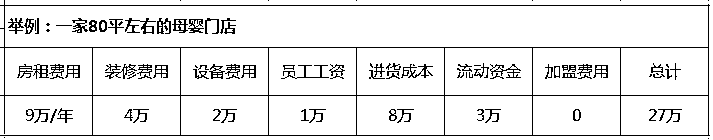

开一家 80㎡  的母婴门店，预算至少在 20-30 万会比较合理，这是自营店铺，没有加盟费用。

具体投资多少，也要看你想做多大规模，规模大费用自然就会更多，同时也是要分地区城市，如果资金充足可以考虑大面积店铺，在店铺内增加一些引流的增值项目，如母婴店中的游泳馆、游乐场等。

实体门店的选址直接关系到生意的成败，甚至决定着店铺的生死存亡。位置不好的地方，即使房租再便宜也不能租，没有客流量和市场需求。

随着线上引流变现渠道增多，门店的位置不一定要金角银边这些黄金位置，可以将租金成本节省放到线上来获客引流，后面会有详细分享这块。

注意，这里有个很重要的问题，也是大家容易忽视的：

 

 

客流量：指在一定时间内经过店铺的顾客数量。

私域流量是指从公域（internet）、它域（平台、媒体渠道、合作伙伴等）引流到自己私域（官网、客户名单），以及私域本身产生的流量（访客）。

私域流量是可以进行二次以上链接、触达、发售等市场营销活动的客户数据。私域流量和域名、商标、商誉一样属于企业私有的经营数字化资产。

所以，人流量大的地方，并不表示客流量就大，店铺位置得谨慎选择。

传统的客流量都是线下的到店顾客，想要实现实体门店营业额增长，最好的方式是：线上** + **线下多渠道引流实现变现收入。

**—02—**

线上运营

流量是一切生意的本质，线下门店不仅仅是成交的场地，更是导流到线上进行持续服务的窗口。

这两年特殊时期让更多的实体门店认识到了「私域流量池」的重要性，但究竟是怎样重要呢？实体门店为什么一定要搭建私域流量池呢？

根据杭州电子商务研究院定义：

 

 

在传统实体店的经营模式下，一般都是通过发传单在门店进行促销活动、线上团购等方式增加曝光度和招揽客户，这些方法局限性太大，传播范围有限。特别是如果遇到特殊时期很容易导致因到店客流量的大幅减少而出现资金周转不灵。

因此：

对于实体店来说，只有做好私有领域的流量，才能保证门店经营的可持续发展。

做好私域流量池，把门店线上化，再通过一对一、朋友圈、微信群、直播等方式去增加我们与顾客之间的黏性，经营好客户流量池是一本万利的事情。

**1**、流量怎么来？ ** **

第一类「线下流量」：门店本身就是一个流量载体，在数字化时代，线下场景有大量的用户等待被「私域化」。

**1**）门店自然流量

不同加盟品牌、不同装修门店、不同门店位置的自然流量用户群体都是有差异的。可以通过门店活动促销为宣发、相关行业知识类分享作为引导诱饵，强调添加微信后的深度服务价值。

**2**）种子流量

种子流量泛指店内老顾客或者回头客，通常他们对门店品牌、产品有基础信任，或是相信店长及店员的人品。这部分用户在导入私域时的难度较低。

 

 

在具体运营上，我们更多会以朋友圈宣发、1v1 私聊关怀等常规形式触达用户、引导入群，强化用户的品牌与产品认知，提供更多高附加值服务，吸引他们二次到店或带新用户到店。

**3**）转介绍流量

由于线下门店本身的社交特性，老客户转介绍推荐的流量也是非常大的。他们都有潜在的消费需求，但对门店与品牌本身的认知还比较弱，通常抱着相信朋友、来试试看的心理。

这类用户导入私域后，有较高的概率发展为深度用户，成为新一波的种子流量。

**4**）活动流量

实体门店可以举办各种线上线下活动，如周末活动、节假日活动、店庆活动等（活动可以做常规节日活动，也可以自己制造活动噱头，比如天猫双十一就是从无到有人为制造出来的）。

通常我们会以店铺海报、社群邀请等方式触达用户，同时可以引入裂变手段获取更多流量，并以通过充值优惠、抽奖等诱饵，将更多的流量导入个微、企微、社群。

 

 

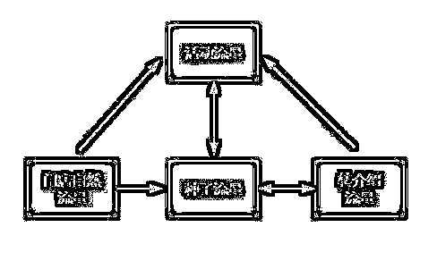

比如实体门店做店庆活动，那么到店的自然流量、种子流量、转介绍流量都可以作为活动流量，而活动流量（线上/线下）经过持续深入的私域运营，在对门店及店员有一定信任度的情况下就会成为我们的种子流量，持续的运营产生源源不断的种子流量，而种子流量又会源源不断的裂变出转介绍流量。

实体门店只有私域化用户以后，才有各种流量之间的转化承接。

第二类「线上流量」，具体如下：

**1**）公域流量

目前小红书、抖音、微博及微信公众号是时下最热门的自媒体，门店可通过拍摄经营日常、行业经验、专业科普干货、撰写推广软文等方式达到曝光的目的。

因为这几款自媒体用户众多，能够使门店在一定程度上得到非定向的、大范围的推广。

随着曝光度增加，自然产生一定的消费者。

 

 

1\. 目前主要宣传平台是在小红书、微博这两个平台，也是最早 2018 年就开始宣传的，小红书粉丝有 3.8 万，收藏 24.9 万，微博粉丝 1.9 万，客户有很多都是这两个平台引流过来的。

如果有内容输出能力的强烈建议做个人 IP，可以在小红书、知乎上输出图文内容，在抖音、快手等短视频平台输出视频内容，甚至可以直播，既可以卖货，还可以引流获客。

母婴门店在公域引流做的不多，这里以一家花店为例，这家花店在 2018 年就开始持续在公域引流，各平台输出图文或短视频内容。

举例：林子小间

这家网红花店是摄影师出身的林子和日语专业的华先生 2018 年携手开的花店，小小的一间花店，所以叫做「林子小间」，店如其名。

一家花艺和摄影相结合的温暖小店，这家花店可以自己做花环、相框等手工 DIY 作品，自制鲜花、干花装饰品，同时也接受花礼定制，还开展各种手作课程，户外花艺沙龙，小型婚礼定制，文艺复古的格调吸引了很多慕名而来的人。

 

 

2\. 「林子小间」也在各团购平台、点评网站、旅游攻略 APP、豆瓣等平台引流。

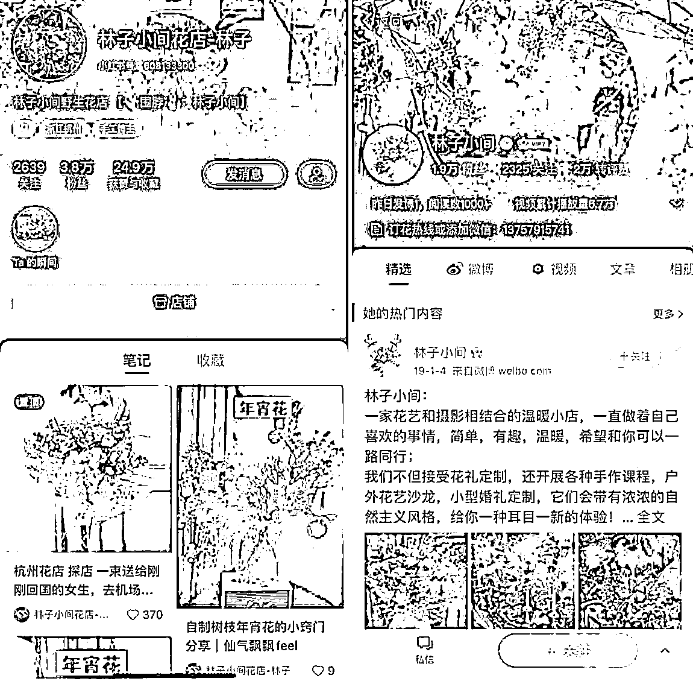

 

 

3\. 短视频平台，抖音、B站、快手等也有「林子小间」的账号，但是目前短视频远远没有图文运营得好，林子小间也在提高短视频制作和运营能力，可能还没从之前图文的内容制作思维转换到短视频。

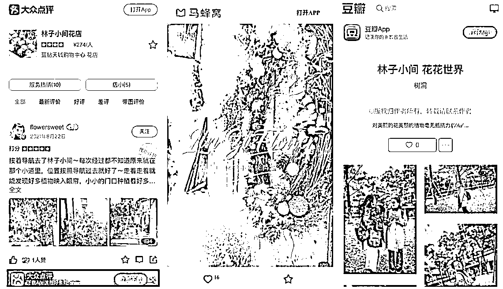 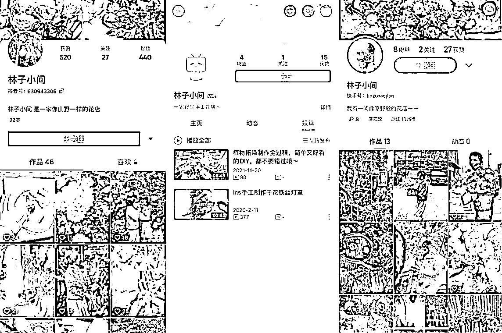

 

 

4\. 除了自己制作内容外，林子小间还找了达人探店，可以以小红书为主要输出平台，同时分发到大众点评、抖音等平台。

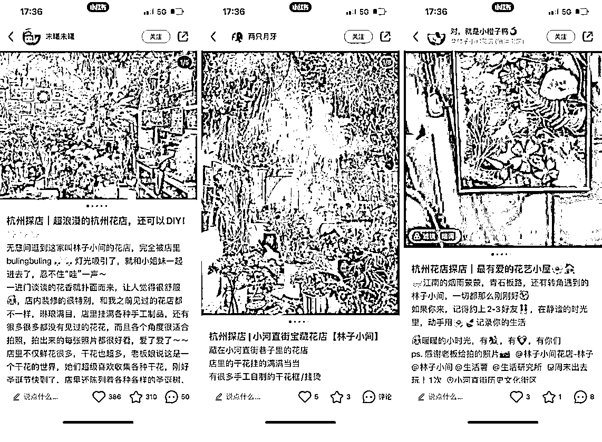

对于实体门店来说，如果没有内容制作能力，最有效的方法就是达人探店。

当然，现在的探店也不再是以前主要看达人粉丝量了，最主要的是转化率，这一点抖音团购达人的带货分可以作为参考。

**2**）抖音同城号

 

 

强烈推荐实体店做抖音同城号，抖音日活已突破 8 亿，流量那么大，再加上抖音目前对同城有流量扶持，免费的流量为何不要呢？既可以作为宣传平台，也可以引流到门店或者私域成交。

一般说到抖音，大家很容易进入误区就是去看粉丝量，但可能大几十万粉丝的搞笑账号还没有几千粉丝的垂直细分账号变现能力强。

抖音同城号也不是说只有餐饮、美业这些才适合，任何实体门店都适合做。而且抖音同城号不要求你拍多精美的视频，拍的一般也没关系，只要能引流或者能变现都行。

目前母婴门店还很少有把粉丝引流到线下门店，大多都是直接在抖音进行直播卖货，或者做个人 IP 涨粉接广告。但同城餐饮店在抖音的团购功能已经很成熟了，短视频可以定位 POI 地址，直接线上团购线下消费，类似大众点评和美团。

举例：红料理串串有瘾

上海有一家餐饮连锁店，叫「红料理串串有瘾」，11 月份在抖音上做了一个红料理双红节的活动，抖音团购 1 元的代金券，只要 11.17 当天身上有 2 个红色元素，去红料理吃饭每人立减 117 元，上海 20 家门店通用，这次活动直接将「红料理串串有瘾」做到上海串串好评榜第一名。

当然，在 11.17 日当天由于活动太火爆，有些门店桌位号都发到 700 多号了，排队到晚上 9 点多还有很多人没叫到号，所以这一点体验感会有降分，这里提醒实体门店做活动千万不要放在同一天，毕竟门店的容纳空间是有限的。

 

 

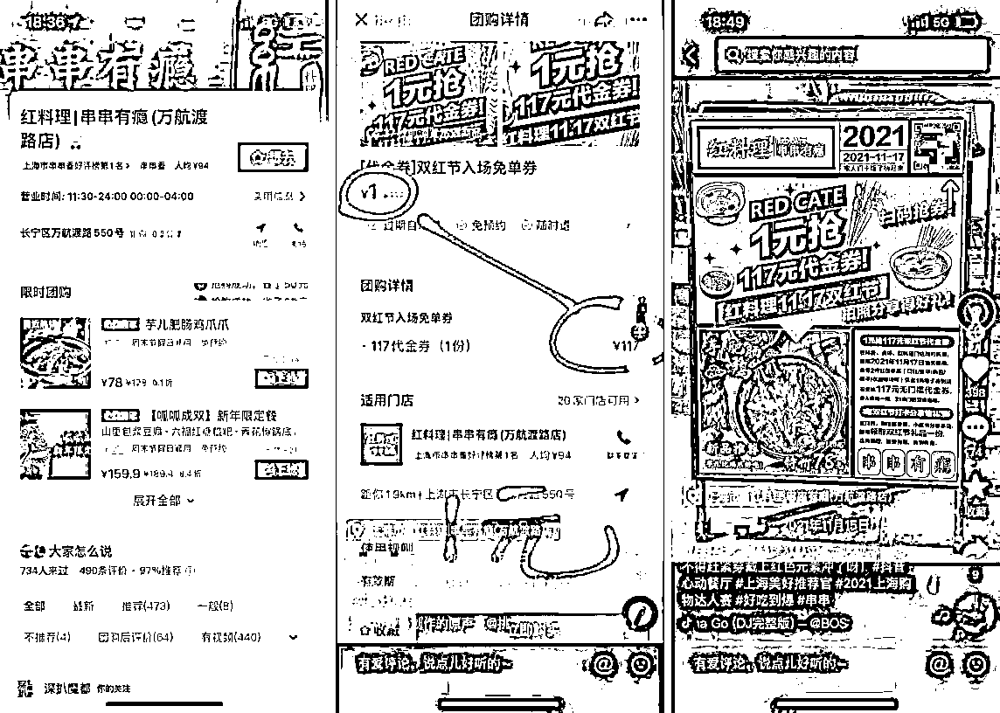

https://internal-api-drive-

stream.feishu.cn/space/api/box/stream/download/video/boxcnvfz6bt17F3XWugxORd99vV/?quality=720p&data_version=7050330828248727556&mount_point=doc**3**）同城美食号

最为成熟的模式，也是目前最火的方式，流量大，餐饮类是竞争最激烈的行业，如果商家没有出色的运营能力，那是比较难出头的。

**4**）同城宠物号

同城宠物，宠物售卖，宠物培训，宠物暂时代养等等。

 

 

**5**）同城招聘号

去同城里面探寻各类各行业的工作单位，留下这些单位的联系方式和工作场地，作为一个面试者的角度去看这些公司的待遇和工作环境等等。

**6**）行业技能

给同城想要学习某些技能的人展示技能。

**7**）房屋装修

这个也是非常精准的一个需求，日常提供的干货就是去考察一些装修公司做的如何，有哪些公司是比较好的，规模如何等等。

**8**）同城旅游

探查体验本地的一些旅游景点，替旅游朋友踩踩雷，避避坑。

**2**、线上如何变现？** **

这里说的线上变现主要是私域运营，门店店长和店员将到店顾客或者潜在顾客加到私人微信上，然后进行深度服务和多渠道变现。

 

 

门店到店顾客一定要记得加微信，流量还包括前面说到的在各个平台、微信群、线下引流过来的，这些流量都可以在私域进行变现。越来越多的商家开始将私域作为精细化运营和降本增效的核心阵地，实现破旧立新、加速迭代的新零售转型。

私域流量是不用付费，可以在任意时间、任意频次直接触达到用户的渠道，比如用户群、微信号、企微个人号、企微用户群等，可以在任何时间段内向这些客户传播我们想要传播的信息，比如店铺的新品、折扣、活动等等。

**1**）售卖实体店产品

所有的实体门店都可以线上卖货，比如母婴门店可以售卖店门店里的母婴用品，与婴幼儿、宝爸、宝妈相关的其它非门店产品；餐饮门店可以在线上卖门店自制的半成品或即食品；宠物门店可以在线上卖宠物用品相关的产品.......

**2**）售卖行业相关产品

除了可以售卖门店自身的产品，还可以售卖行业相关的产品和服务。

比如，母婴门店除了售卖门店用品，还可以顺便在线上卖女性用品、儿童用品，甚至一些店员也卖微商产品。

卖女性相关：化妆品、减肥产品、保养产品…

卖宝宝相关：婴幼儿营养品、日用品…

 

 

「建立私域流量需要时间沉淀，因为人与人之间的信任不是一步就能达成的，

特别是母婴行业，更需要深层次的信任，才可以进行成交和转化。」

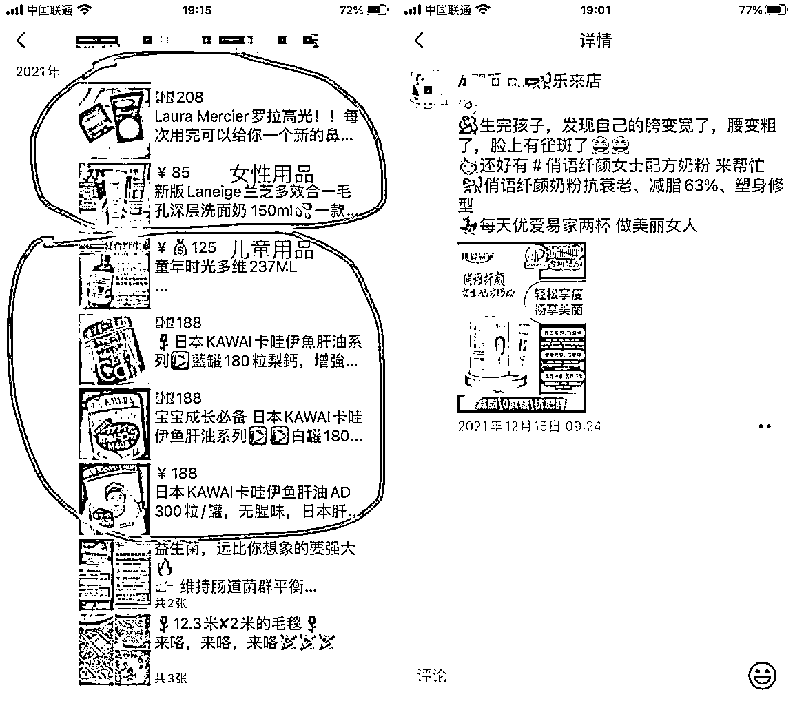

**3**）卖货渠道

将目标客户群体都引流到私域，在 1V1、朋友圈、社群、直播、微商城都可以进行转化，在多个场景进行私域变现，比如朋友圈直接树立 IP 人设卖货；社群可以进行建立各种快闪群或者服务群；视频号的短视频和直播也是可以变现的。

举例：婴乐会母婴店

 

 

这是来自一家开在沙县步行街叫「婴乐会」的母婴门店老板分享的私域感受。

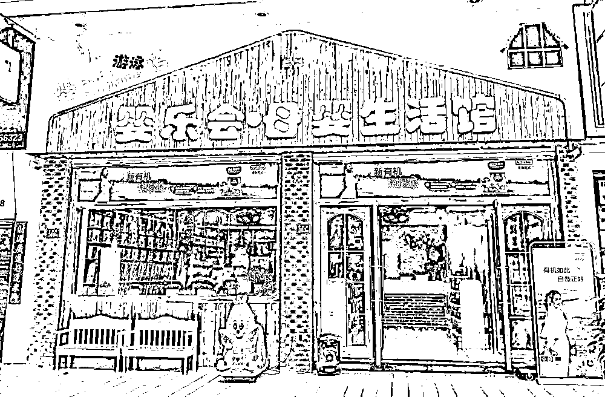

 

 

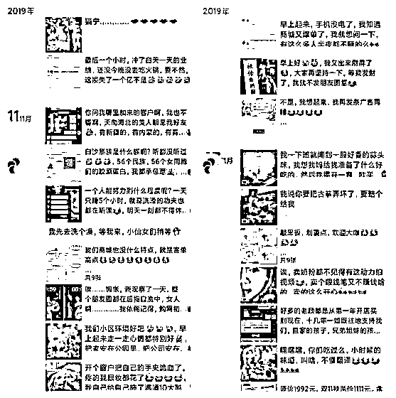

她第一年亏了 30 万，第二年仍旧亏损，第三年终于盈利，年营业额近千万，曾经一场活动当天单个微信收款达到 20 万。

据老板称，目前婴乐会线上经营额比例占 70%，线下经营额占 30%。而线上主要就是通过微信内的朋友圈和微商城等私域平台，并且没有做淘宝等公域流量。

婴乐会目前有 12 个微信号、几万活跃好友，但是老板表示他们「从来没有主动加过一个客户」，都是被动引流。

 

 

「微信在很大程度上扩展了我们销售区域。如果开一家实体店，开在沙县，你

只是固定在一个点，但借助微信，你可以做全国的生意。我微信上有许多很远

很远地方的人，黑龙江的，内蒙古的，新疆的**……**这些人都是客户把我的名片

推送出去，裂变来的。」

吸粉的常规操作是把到店消费者加到微信上；裂变活动也很有效，比如一款零售价 6 元的纸巾，客户加微信号转账 1 元就能买到。因为很实惠，客户还会分享给朋友，又介绍很多人来加她们的微信。

布局微信个人号矩阵，极大地拓展了婴乐会的销售覆盖范围。

通过层层转介绍，婴乐会母婴店的客户遍及全国。

而这一骄人业绩主要就源于门店积累的私域流量和精细化运营。

**—03—**

线下运营：人、货、场

为什么现在很多线上电商平台纷纷开设线下实体店？

因为门店顾客可以看得到，摸得着，更容易获取用户的信赖。

线下实体店的私域流量想要引流，实际上相比于只做线上的企业来说要简单不少，如果是线上店让顾客「加群领红包」，顾客肯定是会有一些抵触心理。

 

 

顾客上门消费时引导顾客加入门店的私域流量群，加入后可以赠送小礼品、折扣券等，例如食品店加群送小零食，奶茶店加群免费升级大杯，饰品店加群送八折券等，用户考虑到下次可能还会再来复购的情况，对于这种加群申请就不会过于排斥，成功率会大很多。

实体门店的线下运营，也是有很多细节需要注意的地方，下面分为人、货、场三部分来详细剖析一下。

**1**、人** **

尽管线上购买更快捷方便，但服务的核心是人，店员值得信赖、服务周到，足够专业，解决了顾客的问题，就可能成为顾客选择门店的标准，顾客才会愿意来店里买东西。

实体门店就是做人与人之间的生意，所以专业性和热情度是服务必不可少的两大武器。

**1**）专业值得信赖

优秀的门店都离不开优秀的店员，像孩子王的店员，除了热情，对产品的熟悉程度更让人瞠目，特别是妈妈们关注的营养素，对营养素的含量和种类都如数家珍，疫情后为了消费者更是亲自送货上门；有些孕婴店员不仅熟知产品优劣，还很乐意帮助顾客，比如帮忙抱一下宝宝或喂奶粉等。

 

 

虽然大环境让不少店员感到消极，但仍然有做得好的金牌店长、店员。努力提升自己才是硬道理，多学习专业知识，提升销售技巧，站在顾客的角度推荐商品，充分利用且及时更新自己的专业知识，打造自己的、门店的口碑，让客户之间口口相传，打动人心，就不担心客户被抢走。

**2**）店员的服务态度

店员自己要拿出亲和、积极、有精神的态度，才能感染消费者。

当你作为消费者，进门看到导购们都情绪消极、垂头丧气的，你还会选择且信赖这家门店吗？答案肯定不会的。

想要提升业绩，总要先把消费者吸引进门吧？将心比心作为消费者时，怎样的门店才会吸引我们进去？进去后，怎样的服务与陈设会让我们想要购买商品？尝试站在消费者的角度看问题。

**3**）送货到家的服务力度

不论任何行业，任何时候，只要能够为消费者解决问题就是产生价值的机会。

对于门店来说，店与店的竞争越发激烈，这时候的服务就显得尤为重要了。很多宝妈可能会因为带孩子有不方便出门的时候，如果能够有贴心上门送货的服务，那你的竞争优势就加分了。所以我见到的母婴门店，绝大多数都能够提供上门送货服务。

**2**、货

 

 

**1**）产品是核心

我们经常说线上能不能出爆款产品，能不能用产品打爆市场，就看选品能力了，直播最重要的也是供应链的能力。

那么，对于线下实体门店来说，选品的能力也会直接关乎门店生意的好坏。

比如，同一条街都是做餐饮门店的，有可能在这条街上卖火锅比卖中餐生意好的多，为什么呢？因为这里是吃火锅比其它餐饮吃的人更多，所以火锅店生意更好。

同样的，母婴店产品段位、品类是否齐全，品牌力是否强，想买的奶粉是否日期新鲜，价格是否透明，是否有活动等都是顾客选择母婴店的指标。

门店产品尽量全一点，持续调整和优化门店的陈列、品牌和服务等各方面是关键。

此外，母婴店规模大小，是否连锁，是否能一站式购物，陈列是否让人舒适，灯光是否明亮等，也关系到顾客的进店率。

此外，店员也很积极地给进店的客人提供各种奶粉试饮，可能本意没有想买奶粉的客人，在尝过以后也想买，或者将来需要买奶粉的时候，想起在这家门店试饮过奶粉，会潜意识选择来这家店购买。

**2**）增值项目

实体门店的空间是有限的，如何能够在有限的空间创造出更多的价值，这也使很多实体店家发挥奇思妙想了。

 

 

母婴店增加的有儿童玩具、婴儿游泳池；

美容店除了做面部护理，还可以做身体护理、身体调养、卵巢私密等项目；

餐饮店除了可以在店就餐外，还可以唱歌蹦迪......

比如：母婴店** + **儿童游乐场** + **游泳馆

一般情况下，如果我们没有去过母婴门店，头脑印象中可能觉得母婴店就是卖宝宝的东西，母婴货品包括：奶粉、辅食及零食、营养品、宝宝日用品、妈妈用品、宝宝鞋服、玩具、车床等。以上是比较日常的配比，当然一站式母婴从妈妈到小孩的货品更多。

当你去过母婴门店，你会发现如果是大面积店铺，还可以在店铺内增加一些引流的增值项目，如游泳馆、游乐场、儿童玩具车等，有些甚至是免费的游乐设施，宝宝们可以在门店玩玩具，父母之间也可以互相聊天解闷，店员就可以和这些宝爸宝妈们加强沟通与联系了。大人轻松，宝宝开心，客流量自然就大了！

 

 

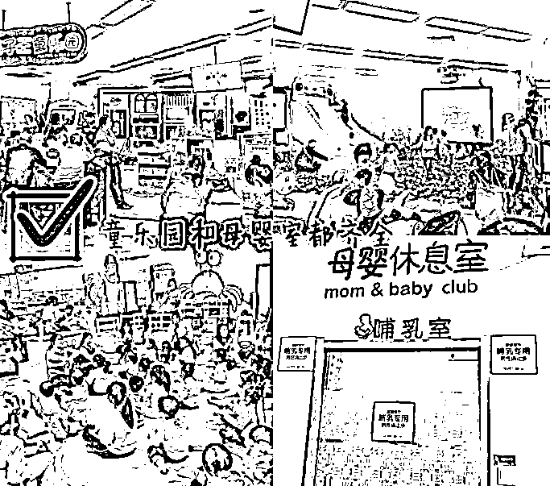

比如：烧烤店** + **唱歌** + **蹦迪** + **单身墙

餐饮行业有一家连锁烧烤店，叫「M-MIX电音烤吧」，这家烧烤店就是将烧烤更加好玩化，活动设置也非常有意思。上海首家店开业不到半年，就已经在抖音做到上海市音乐餐厅人气榜第 1 名。

活动怎么玩的呢？

晚上八点下大雪，十点下樱花的网红打卡地，一家把蹦迪和烧烤结合在一起的神奇存在，煽情演唱与劲歌热舞交替进行，是一家汇集的潮流科技与浪漫氛围的打卡圣地。

 

 

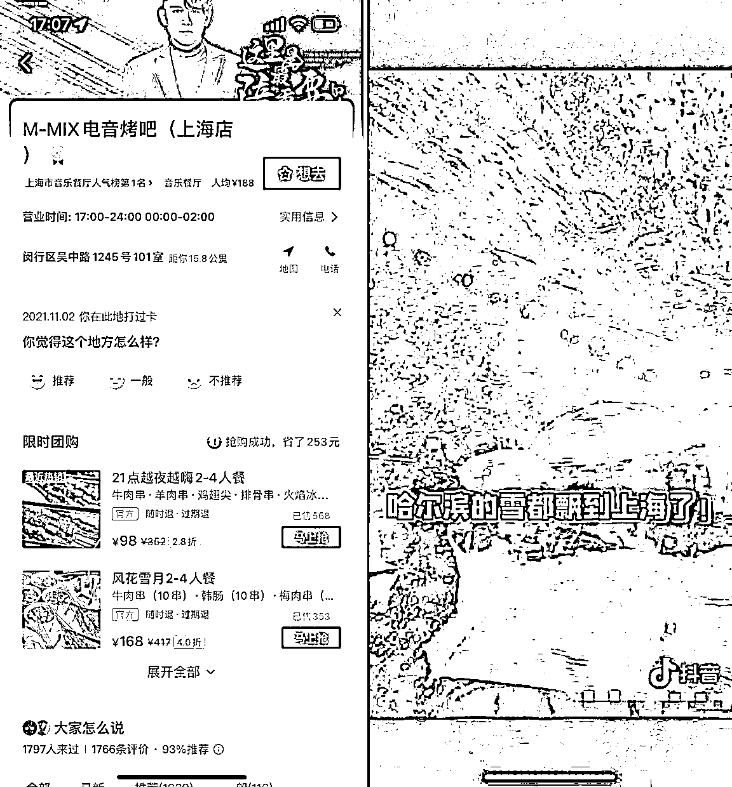

https://internal-api-drive-

stream.feishu.cn/space/api/box/stream/download/video/boxcntGABQdcaSZwqYkkER5Ninh/?quality=720p&data_version=7050331658549215236&mount_point=doc**3**、场** **

 

 

**1**）门店视觉形象

之前圈友有分享过一个实体店餐饮店逆袭成网红店的案例，这个就是依靠门店视觉形象和好记的店名在抖音火起来，甚至因为突然爆火生意好到关门调整，这个案例适合所有开实体店的参考一下。

这家开在武汉的餐饮店店名叫做「被树挡住的烤肉店」，两年前的店名叫「三和记炭火烤肉」。店铺虽然不大，只有四五十平方米，只能放十张桌子，但生意相当不错。不过就在今年4月份开始，烤肉店的生意开始冷清了。

随后店主也发现，现在大家越来越喜欢打卡网红店。而自己的店铺面积小，无设计无风格，还没钱打广告。更惨的是，店铺门口还有个大树遮挡，更加降低了曝光量。

所以，店主决定做出改变，不如先给烤肉店换个名字，据说门店的店名和招牌是店主女朋友设计的。因为被树挡住，不如就叫「被树挡住的烤肉店」。因为本身烤肉味道好有一定的口碑，再加上绿色鲜艳引人注目的门店形象，上口好记的门店名字，这家店今年  9 月份在抖音和小红书突然爆火起来。

 

 

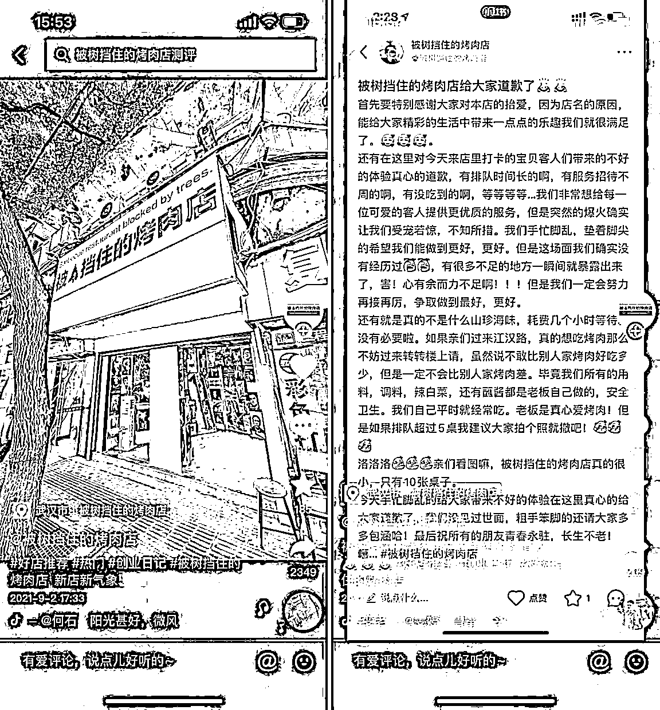

**2**）活动运营

前面提到的餐饮门店举办红料理双红节的活动，有些门店举办过的盲盒活动等等都是可以参考的。

 

 

母婴门店除了基础的服务，根据季节的属性，也会举办一些恰当的活动，比如夏天的小型水上乐园。这样的活动不仅让爸妈遛娃变得省心省力，可玩时间长，还能清凉过夏季，边玩边增大宝贝的肺活量，增加血液循环，促进新陈代谢！

有些门店还联合品牌方开展当下宝爸宝妈们感兴趣的门店活动，例如插花、手工等活动，这些也是年轻消费者更喜欢和「对口味」的互动，让消费者感受到母婴店不仅是卖奶粉的地方，更是陶冶情操、增加亲子关系的友好场所！

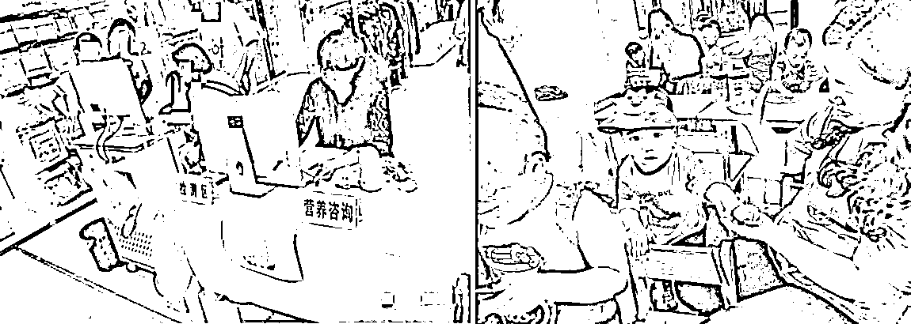

**3**）跨界营销合作

所有的实体门店都可以进行跨界合作，比如星巴克、麦当劳做的很多跨界合作值得参考学习。

下面是肯德基KFC与泡泡玛特、元气森林跨界合作案例：

 

 

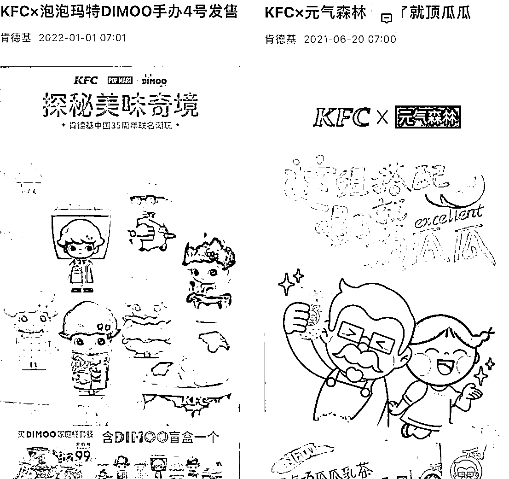

**—04—**

其它收益

**1**、行业延伸服务

如果自己有实力，行业周边服务就可以自己转化了，如果店小实力不够的可以对接别人服务，转介绍给有实体有口碑的其他人，轻轻松松就可以获得分润。

 

 

这个在很多行业都有的，比如美容院做不了医美的、干细胞的项目，可以转介绍给医美医院，这一块比美容院自己做项目的收入都占大头，低价引流过来，后期转化高价的医美项目。母婴门店的产品和周边服务就太多了，实体门店也可以和相关的教育、医疗、娱乐、硬件设备等等相结合。

下面以母婴市场为例：

母婴市场可以分为母婴产品和母婴服务两个大类：

**1**）母婴产品

针对孕产妇以及各个年龄段的婴童在衣、食、住、行、教、娱等各个需求方面的产业，主要涵盖奶粉、营养辅食、尿裤湿巾、喂养用品、洗护用品、童车童床、安全座椅、玩具书籍、童装童鞋和服饰寝具、智能硬件等类别。

**2**）母婴服务

包括教育、医疗、娱乐等服务产业，产品及商业服务类别：

智能硬件：温奶器、消毒器、哄娃神器、智能胎教仪、智能体温计等；

孕育管理：备孕工具、经期管理工具；

母婴社区：交流社区（母婴微信群）、照片分享社区（宝宝树、亲宝宝等）；

母婴医疗：育儿专家、儿科医生平台；

母婴电商：平台**/**垂直**/**跨境电商；

母婴内容：母婴知识付费、短视频、技能培训等。

 

 

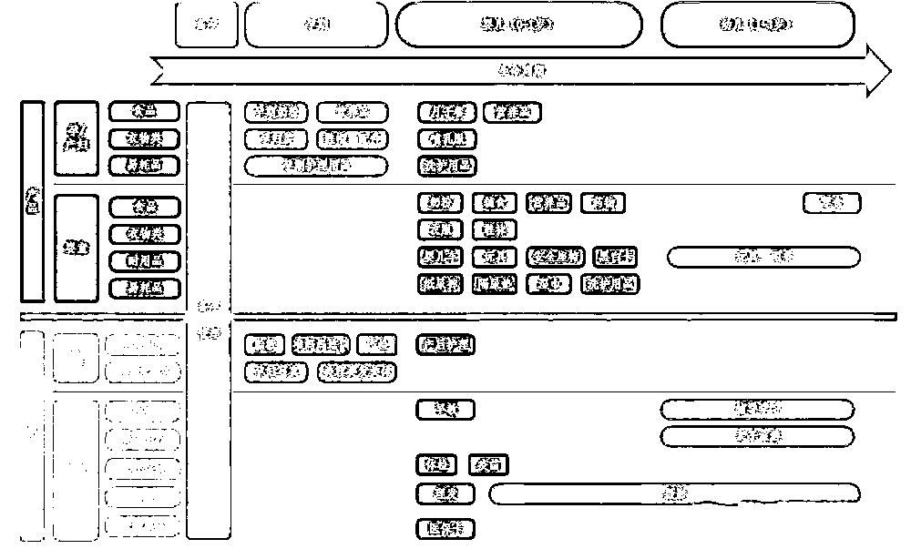

**3**）母婴生活护理服务

婴儿基本护理，包括喂养、洗澡、换洗尿布、洗婴儿衣物、拆洗被褥等**;**

婴儿专业护理，包括新生儿抚触、测体温、大小便观察、脐带护理等**;**

产妇基本护理，包括饮食起居、调配产妇营养结构、衣物洗涤等**;**

产妇专业护理，包括传授母乳喂养的方法及婴儿喂哺常识、做好产妇的健康护

理及产期常见病的预防、指导产妇做产后操等；

医疗生活护理，包括婴儿口腔、皮肤、眼、耳、鼻以及脐带的护理，婴儿意外

伤害的紧急处理，产妇恶露观察处理和哺乳前后乳房护理等。

**2**、知识付费** **

**1**）付费课程或付费社群

 

 

任何行业的知识只要有需求的市场存在，都可以售卖，关键还是看个人选择的问题。.你擅长什么 or 你对什么行业有兴趣，你就定位在哪个行业。比如，可以分享行业专业知识，分享自己的开店心得和经验教训，也可以建立一个社群，让自己的同龄人或行业背景相似的人一起交流学习。

母婴门店，知识付费案例：

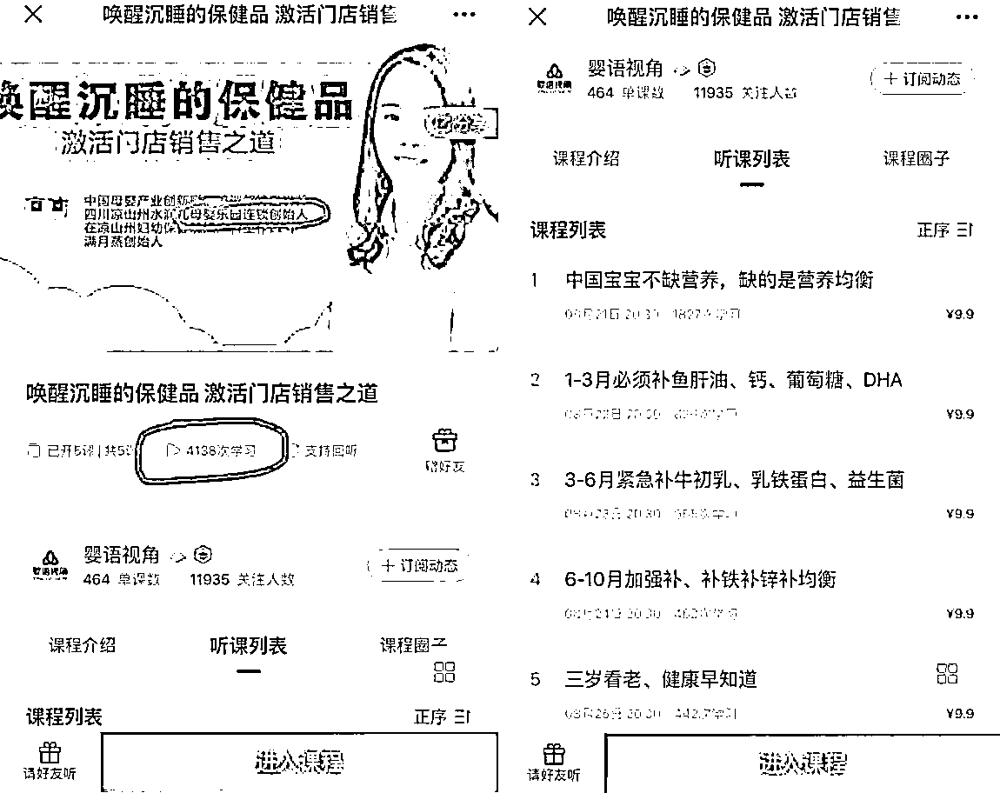

餐饮门店，招学徒案例：

 

 

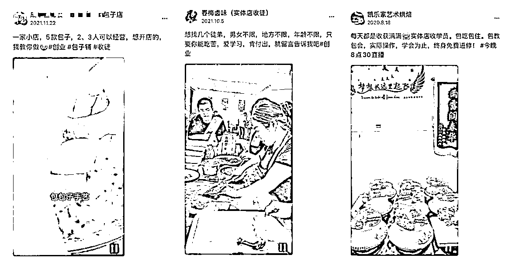

**3**、招商加盟

当你有一套完整的开店方案，包括选址、选品、运营、策划等等一系列走通了以后，任何实体店都可以进行招商加盟，这也是很多实体店自己走完了从 0-1 流程，然后采取招商加盟完成 1-100 的迅速裂变扩张，所以连锁门店大多是直营+加盟的形式。

服装店，加盟案例：

 

 

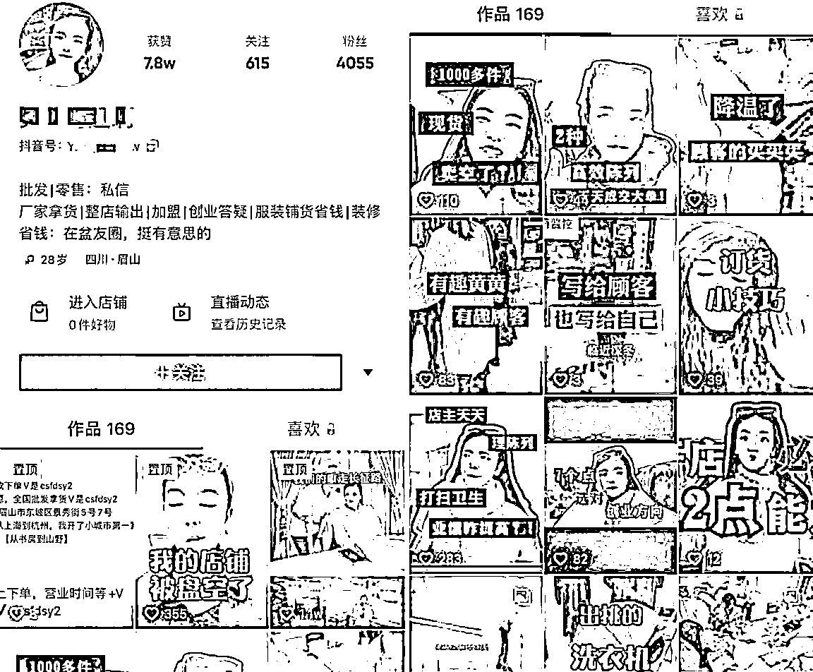

最后，不管线上如何快速发展，如何唱衰实体门店，要相信实体门店总有其存在的意义，很多服务项目都是要在实体门店才能完成的。最后，希望所有的实体店家都能够乘风破浪、破圈生财！

我是佳佳，一个总是在线上业务和线下实体的跨界人。从事过母婴行业、大健康行业、电商行业，线下也有母婴门店、美容养生门店项目。近期，也在短视频和直播行业探索。所以当生财的数列老师让我写自我介绍时，我内心是很复杂的，说实话不知道怎么介绍，恩，今天先聊到这里吧。

哈哈哈，非常感谢生财小伙伴的小皮鞭，让我倒逼自己复盘出一些实体店玩法和想法，如果有想交流的宝们可以私信我，添加好友请备注生财有术，同时欢迎大家在评论区留言哈，如果觉得对你有收获的话，不妨点个赞支持一下，谢谢～

 

 

评论区：

Marco : 同为新零售人，方便加v交流一下吗

佳佳 : [握手]握爪~~加V：jiajia001000

Barbara : 我也想要加您  请帮忙通过  我是Barbara

佳佳 : 已通过，不好意思下午在忙刚看到[捂脸]

亦仁 : 感谢分享，已加精华。

佳佳 : 感谢亦仁大大！

郑小焦 : 谢谢详细分享，真的是刷新目前对于实体店的“偏见”，用实体店打造信任基础，结合线上引流沉淀到私域，真的不错呀

佳佳 : 🤝🤝

# **# ****(**精华帖**)(97**赞**)**靠着抖音** 1.7W **粉丝能月盈利

# 小** 3W **，实体店如何搭上抖音这个顺风车

作者： silence

日期：2021-12-29

目录

1\. 实体店 + 抖音前景分析

2\. 抖音号定位

3\. 变现闭环规划

4\. 实操运营小技巧

5\. 抖音0.01元/1只鸡腿活动案例分享

6\. 结尾建议

---正文---

 

 

大家好，我是 silence ，在老家运城有一家猪蹄店，起初店是抵押车贷款开起来的，现在靠着抖音 1.7W 粉丝能月盈利小 3W ，也算是迈出了第一步。今天聊聊重点，实体店如何搭上抖音这个顺风车。

**-01-**

实体店** + **抖音前景分析** **

开始做抖音主要是因为店铺租金有限，开在了犄角旮旯里，自然人流量指望不上，只能自己想办法引流。发过传单，找过当地自媒体，开过美团、饿了么。折腾到最后还是发现抖音比较靠谱。

因为从某种意义上来说，流量的本质就代表着消费者的注意力，代表着用户关注度。想要引起全运城人的注意，最省钱最高效的办法就是抖音。

相比发传单而言，抖音的优势很明显，算法自动过滤了对吃不感兴趣的人，视频对人的冲击力也比传单图片大，而且抖音上可以互动，评论口碑一形成，很容易形成人传人的现象，尤其是在小地方，街坊邻居的都认识，这种传播比在大城市要快一些。

再看一条数据：21 年年初据接近抖音人士称，抖音三个端口 DAU （日活跃用户）的峰值极为接近 7 亿。而国家统计局最新公布的第七次全国人口普查人数是 141178 万，也就是说平均每 2 个人中，至少有一个人刷抖音。还没考虑目前国内人口老龄化的因素，60 岁及以上人口 2.64 亿占 18.7% 。所以说现在做抖音，就好比前几年做淘宝，虽然有时候可能会感觉杂乱无章，但大方向不会错，做着做着，可能就成了别人口中最先吃到肉但那拨人了。

 

 

还有一点，抖音势必会从美团的碗里分一杯羹，目前的同城团购、心动外卖就已经很明显，这对我们实体商家是个机会，趁早入驻积攒影响力，把抖音上推出的新功能尝试一遍（企业号、团购、抖店），等抖音跟美团一样布局稳定下来，我们也好有一席之地。

**-02-**

抖音号定位** **

我的想法是让附近的人看到我家猪蹄、鸡腿，最好是能私信下个单，实在不行留个印象也行，下次路过就好奇进店了。

后来看林奕老师的《抖音商业IP定位篇》课程，才明白其实是蒙对了定位。好的定位是垂直**+**精准。

判断账号定位是否垂直精准，有个很简单的方法：能清晰的归纳出一句话解释这个账号：「他面向什么人群、提供什么样的服务、解决什么样的问题」，那这个账号就有清晰的定位，否则就是不够清晰。

比如我的账号就是面向附近的吃货人群，提供现卤现卖香喷喷的猪蹄，让顾客联系下单并吃到，增加店里的销量。

定位有个大前提，就是确定自己能坚持下去。刚开始不要对自己有太高要求，大家都是普通人，在能力范围内表达出自己的意思，让看到的人明白就行，剩下的慢慢优化。

不能上来就定张同学的标准，然后坚持了 2 天放弃更新。

 

 

实体店的定位拆解成 2 个点就是：展示出能提供的服务，获取用户的信任并促成消费。

**1. **展现自己的服务

也就是根据自己的能力确定自己的展现形式和内容。建议移步大航海学习手册，用一下“归纳九宫格”和“发散九宫格”这两个工具，我截了 2 张图。

大航海学习手册：

https://shengcaiyoushu01.feishu.cn/docs/doccn7JXHWlNv84Sq8hXWEEwBSg#ft7izr

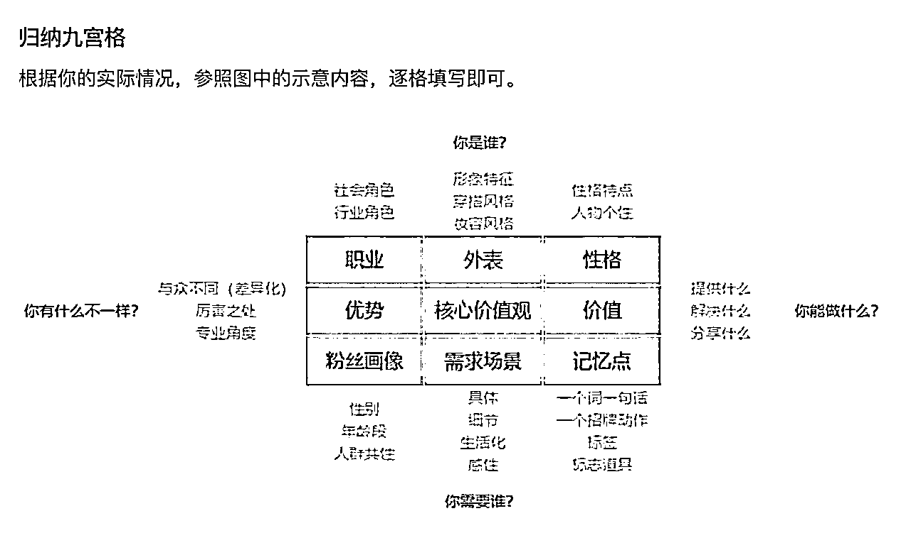

 

 

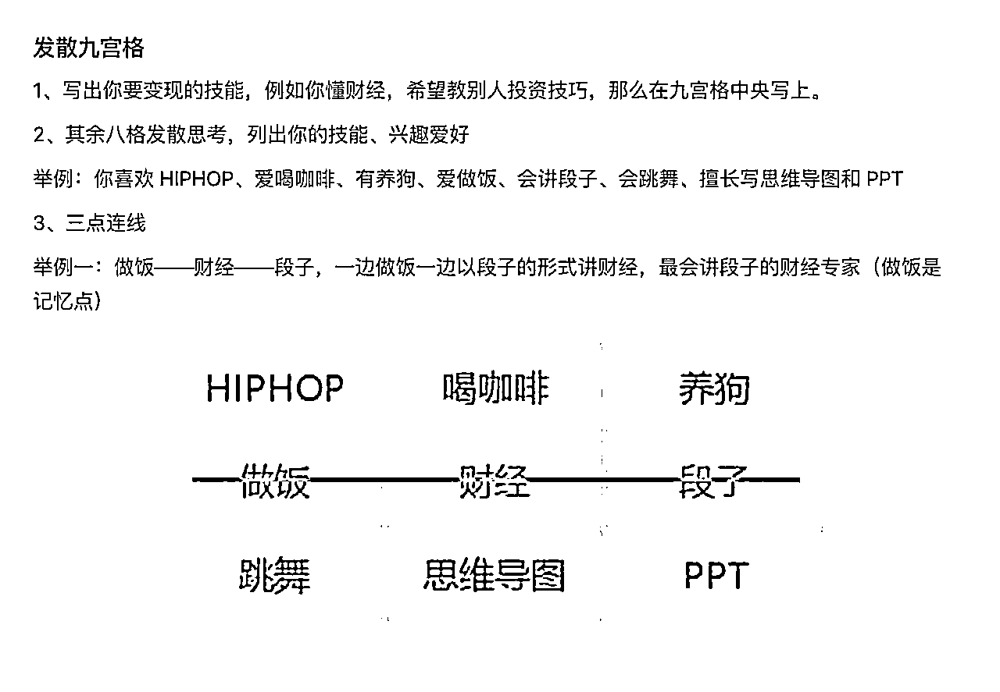

**2. **获取用户的信任促成消费

我用了 4 个小方法：

**1**）用几个小号自问自答

果很明显，或找亲朋好友当托，发完视频就各种夸、各种问：看着很好吃，店在哪里呀？上次去了没买到，一般几点营业几点关门？总之想让顾客知道的都可以以自问自答交流的形式表现出来。

**2**）拉拢信誉值高的人推广

必要的情况下可以找当地的自媒体适当的宣传，我是找了当地的自媒体“灵通资讯”推广，还找了几个小网红付费推广。

**3**）展示下店里人多、商品不够卖的情形，适当的制造一点饥饿营销的感觉

 

 

比如理发店，宣传文案可以这样写：“一定要记得提前预约哦，别像这兄弟似的大老远跑来了没安排上”，即使没顾客也这样发。

**4**）讲故事

用 A 账号拍一个感人的故事，比如拍一个“我的十年”，然后用 A 账号推荐 B 账号的促成消费。我是找了当地一个故事派账号，做了一期视频。

下面贴 2 张我的图：

 

 

 

 

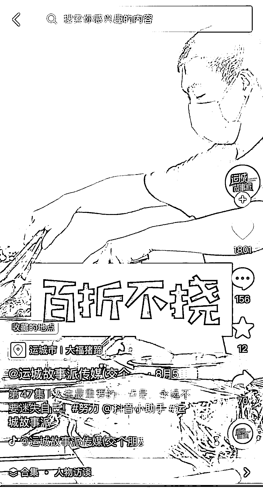

 

 

 

 

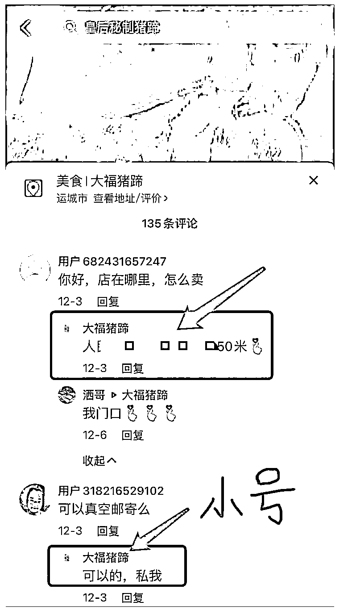

**-03-**

变现闭环规划** **

变现的目标人群分 2 种，一种是 To C 端普通顾客，有意向买猪蹄吃的人；一种是 To B 端商家顾客，有意向学习、开加盟店的人。针对 2 种不同的顾客，变现策略有所不同。

C端用户喜欢看什么？

好看、好  吃，价格优惠，干净整洁，大家都在吃，大家都说好。

B端用户喜欢看什么？

好看、好吃，顾客多，老板赚钱多，投资小、操作简单，大家都在排队，学员、加盟店开始盈利了。

我们要做的有** 4 **步：

-针对性的拍视频，投其所好，提高视频播放量。

-引导顾客互动，找到店铺，找到消费入口，这一步很重要，也很容易被忽视。

-消费成交。

-小闭环形成后的优化。包括产品、短视频、变现逻辑、投放扩大。

 

 

这里分享下容易被忽略的第 2 步：重视顾客看到视频和消费成交之间的链接。首先要知道并不是播放量高，店里人就会多就能赚钱。引导不好，很可能会事倍功半。

拿我们账号举例：单条视频 5W-10W 的播放量不算低，但系统显示的日平均消费单数只有 70 左右。而且经常有顾客说：“终于找到你家店了”。这就意味着很多顾客因找不到消费入口而流失了。

优化方案：

**1**）全网铺：

高德、百度、腾讯地图，微信视频号、小程序、公众号，美团，饿了么，大众点评，小黄车，抖音小店，团购小风车，评论区留言置顶，粉丝群，主页地址、联系电话，百度等，只要有人的地方搜索都能联系到我们。

**2**）小号主动邀约：

评论区有购买意向的，用小号主动回复或者私信，告诉其购买联系方式。

尽可能的满足不同的人的 App 使用习惯，在顾客的舒适区内完成链接。最好是能引流到私域成交。至于引流到私域后的二次营销，可以精华帖里搜一搜，之前看到好几篇私域运营的高手分享。

下面贴几张图：

 

 

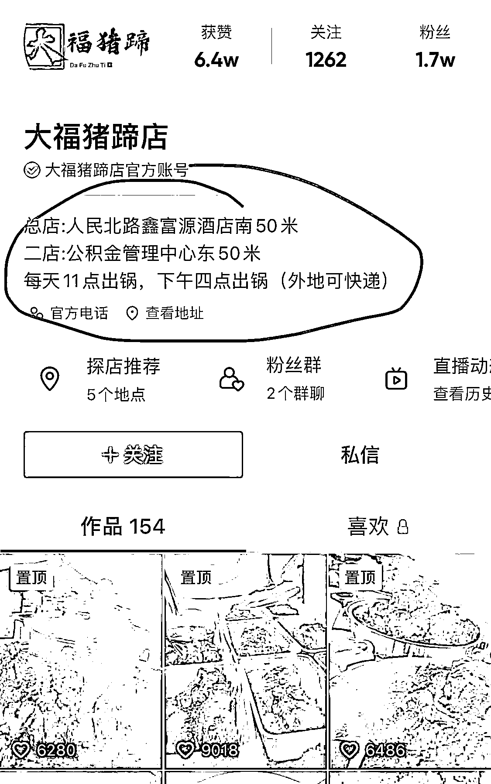

 

 

 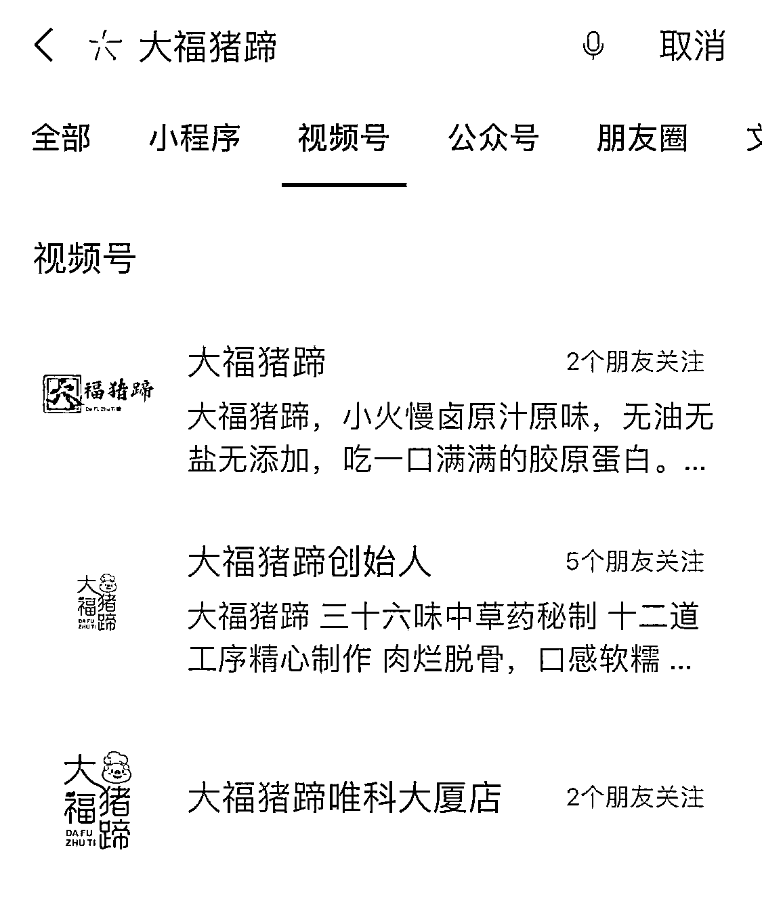

 

 

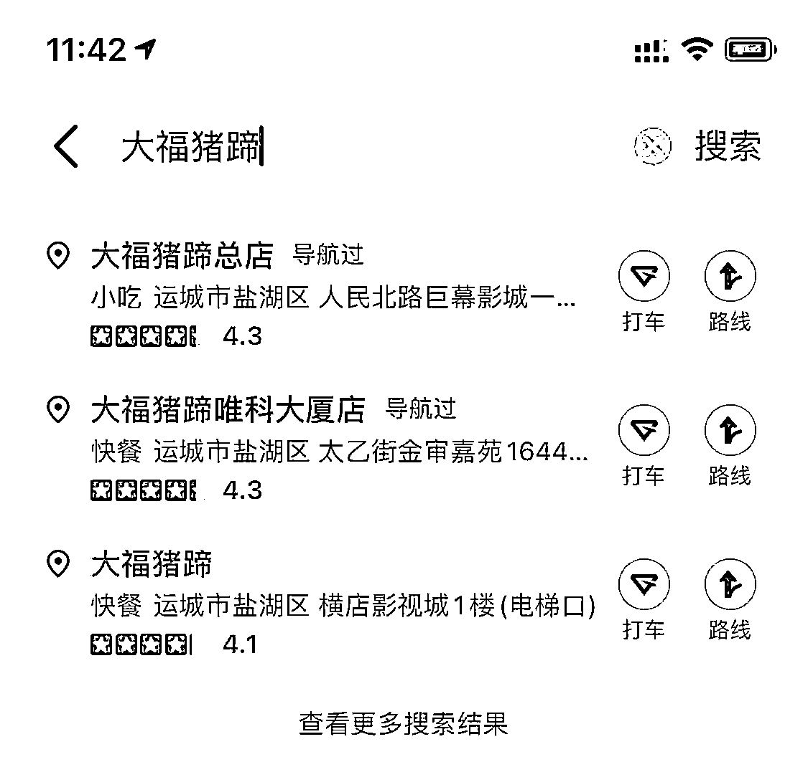

 

 

 

 

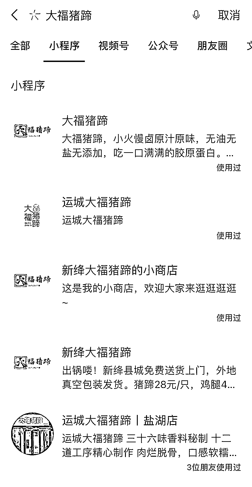

 

 

 

 

 

 

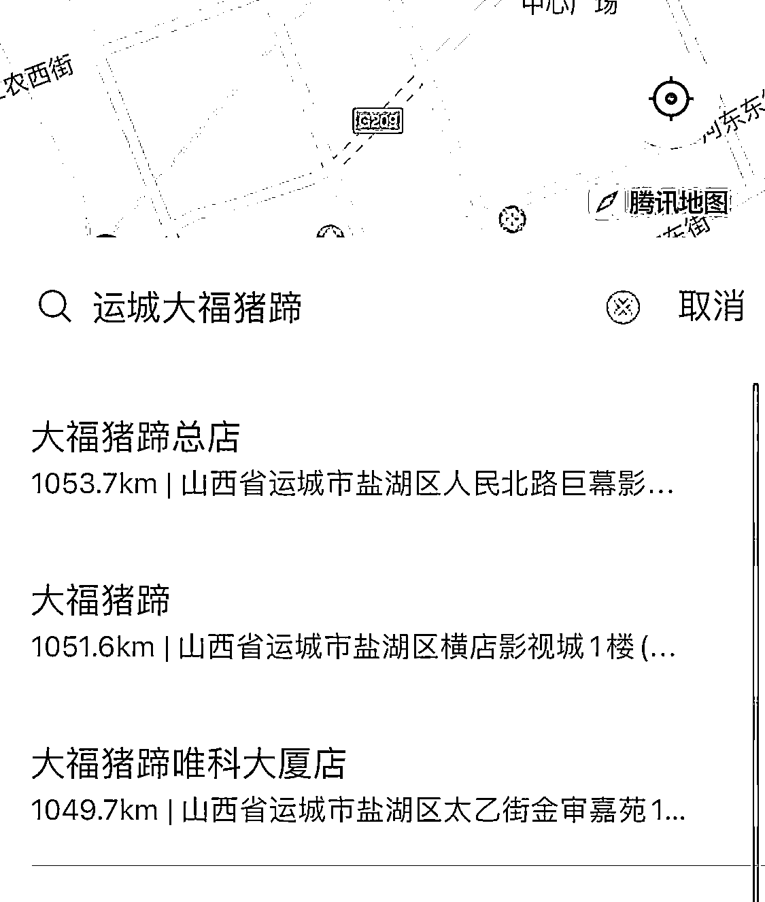

 

 

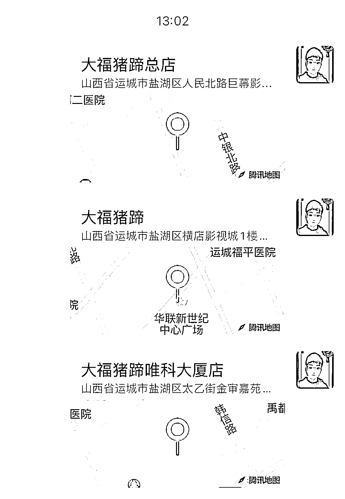

上图腾讯地图这个尽早加上，这样在微信里发位置的时候就能搜索到。

 

 

完整的变现闭环：产品上架** ——> **分析目标人群** ——> **运营引流** ——> **引导消费成交** ——>**复盘优化

**-04-**

实操运营小技巧** **

**1. **上互联网平台

比如美团、饿了么，在没私域流量、没知名度时，不挣钱也要上，甚至亏钱也要上，免费的流量不用白不用。然后店内想办法转私域，培养私域。比如美团，一般商家抽成20%以上，我是在淡季适当加点价格上美团维持生意，旺季或店忙时直接关掉。

**2. **开抖音团购

佣金开高一点，少赚不赔钱就行，把利润分给帮我们推广的人。这样就会有赚佣金的达人主动上门拍照。

 

 

 

 

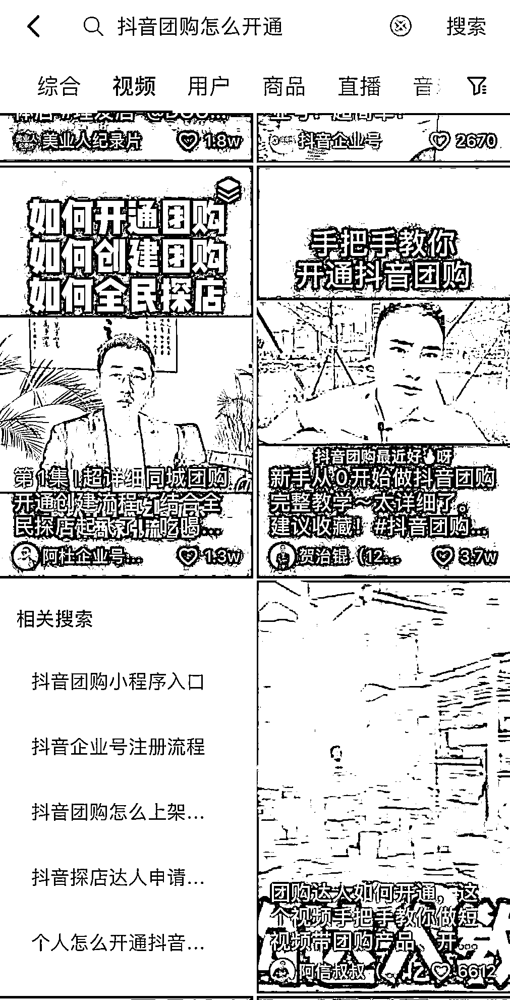

 

 

 

 

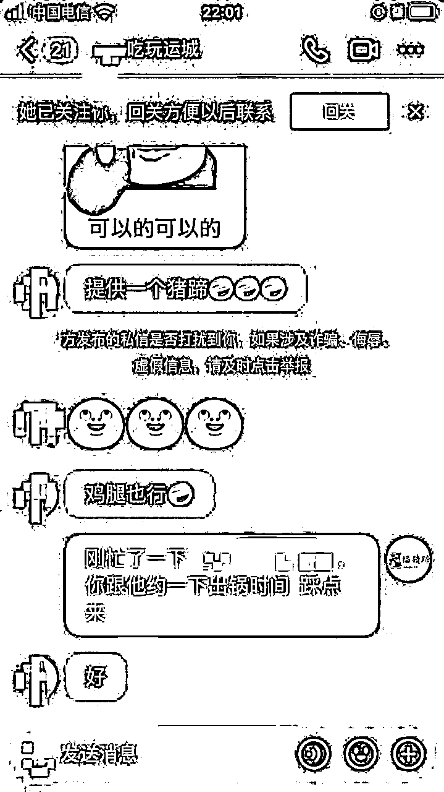

**3. **主动找达人推广

每个地方都有大大小小的美食博主、公众号等新媒体团队，想办法跟他们合作，那些  1W 以下甚至 10W 以下的小地方博主没那么难勾搭。想办法联动起来，人多了形成连动力量也不容小觑。给人营造一种氛围：“大家都在吃他家猪蹄，应该能好吃”。

 

 

 

 

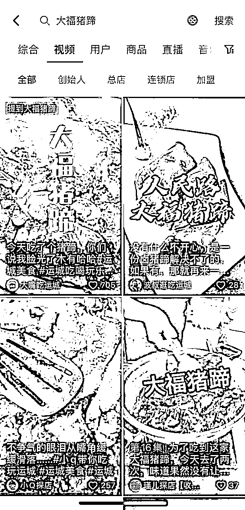

 

 

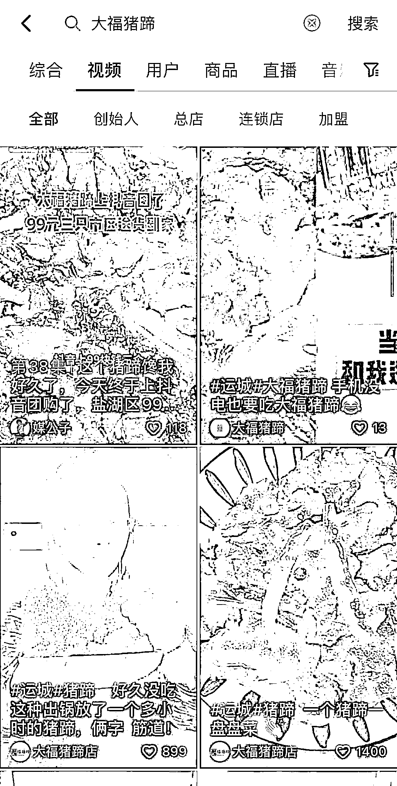

 

 

如何找靠谱的达人（以餐饮为例）：

-抖音搜索“ 地点 + 吃喝玩乐 ”

-点击头像，点击更多，打电话、加VX联系、或关注再私信。优先打电话。

-私信话术：您好，我是XXX地点的XXX店的XXX，我们店是XXXXXX，看了您的作品感觉很赞，想了解下合作事宜。（若是私信就加一句：方便的话给我留个联系方式。） 

 

 

 

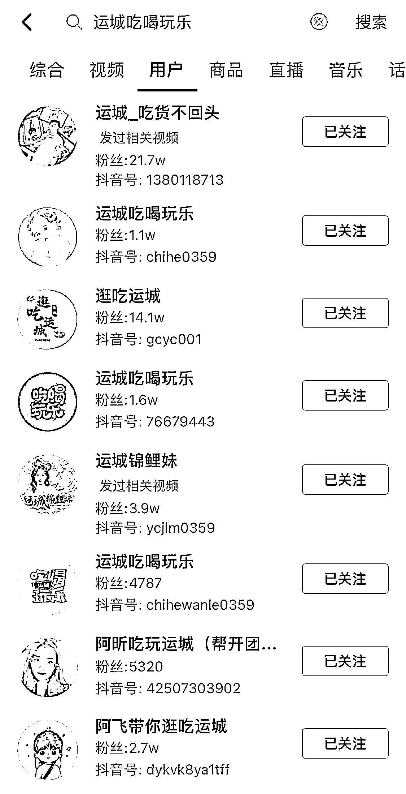

 

 

 

 

找到达人需要了解几个关键点： **IP**定位、粉丝量、播放量、收费机制（团购抽佣？

坑位费？），看这个账号的定位跟自己的商品是否匹配。后两个咨询达人，根据自身实际情况决定是否投放：

1）带坑位费/坑位费偏高的一般不合作，粉丝量大除外；

2）粉丝量大，点赞评论低的不合作；

3）加微信备注好名称 + 粉丝量 + 账号特征，多了容易混乱；

4）做好跟踪，投放费用多少，播放量多少？出了多少单？同城浏览量多少？计算好投产比，如果产出比高，在店铺服务允许的前提下，考虑加大投入。

5）价格，1W 以下的账号基本是团购抽佣合作，不给坑位费，最多提供拍摄餐食，如果餐食价格高，也可不提供。 1W～10W 的账号会适当收费，几百到几千不等。因为没有严格的收费标准，价格都可以谈，记得多问一些，总有提供高性价比服务的好人。

 

 

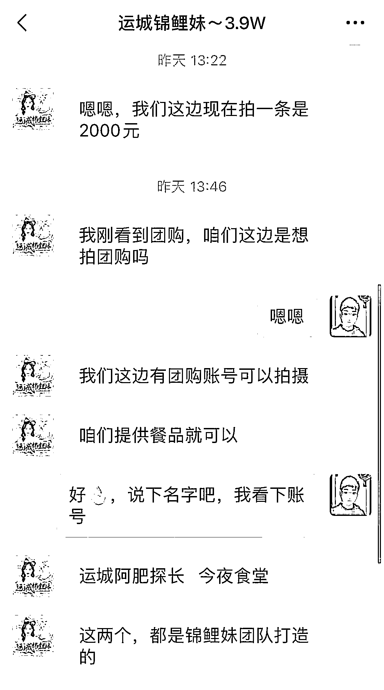

 

 

 

 

 

 

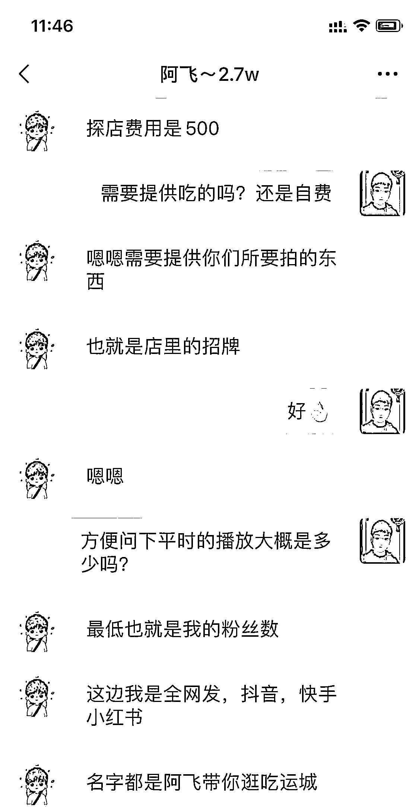

 

 

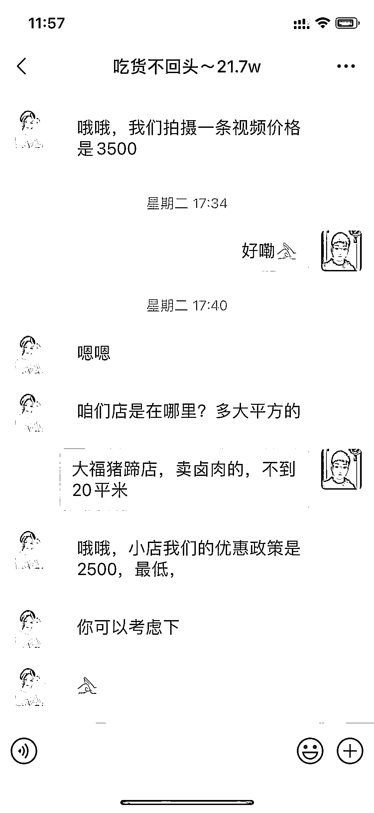

 

 

上图这种，如果要选果断选 2、3，还有个找达人的方式是抖音搜索“团购达人广场”：筛选方式同上。

 

 

 

 

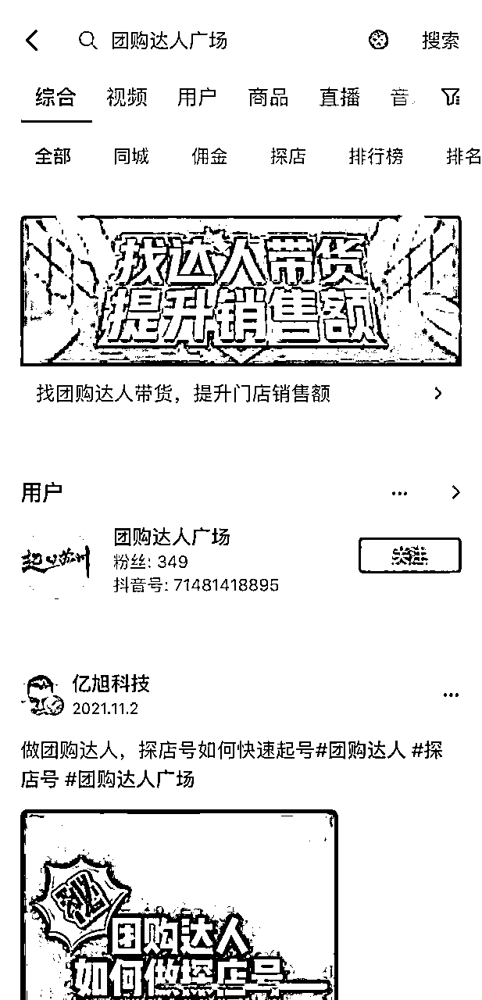

 

 

 

 

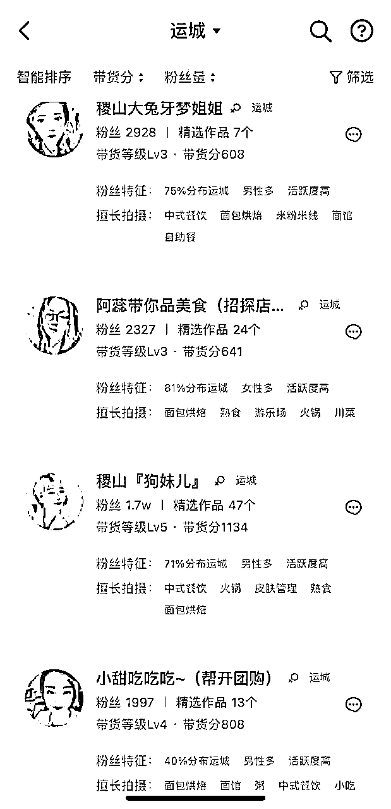

**4. **做抖音矩阵

据说 21 年 7 月份开始抖音扶持同城流量，可能是给未来的心动外卖打基础。想想发一个视频差不多就是 500 播放，那如果 10 个号 10 个视频，一天就是 5000 左右的播放，这么便宜的流量肯定要抓住。微信同理。

 

 

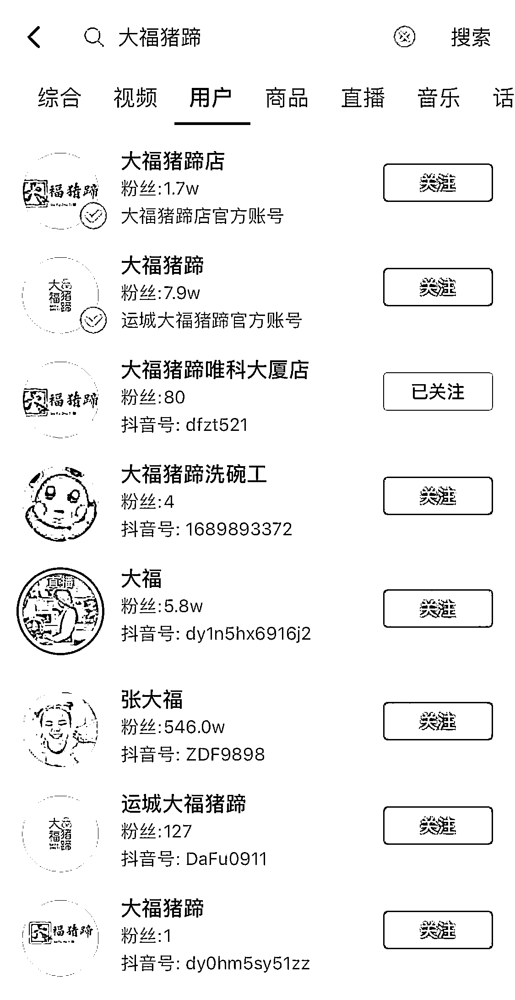

 

 

 

 

 

 

不把过多的心思放在粉丝量上，有播放量，能起到引流的作用，已经实现了初衷。

**5. **搞引流活动

我搞了一个 0.01 元抢 1 只鸡腿的活动，团购链接一发，好几个美食博主发了视频，2 天卖了将近 600 份，一个鸡腿的成本大约是 2 元，2 元引一个到店顾客也很划算，而且到店领鸡腿的人大部分买了猪蹄。此处需要规定到店每人只能领取 1 个，不然 1 人拿 10 个二维码过来领取，就失去了活动的意义。

 

 

 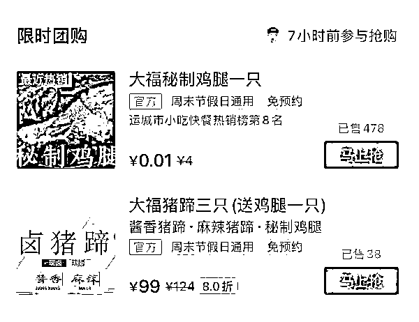

 

 

**6. **全网铺

尽可能把所有有人的平台都铺上，然后往一个地方引流，苍蝇再小也是肉，每个小平台背后都有人在卖力的运营，挂招牌留个钩子，再引流到微信成交变现。

**-05-**

抖音**0.01**元**/1**只鸡腿活动案例分享** **

店铺里有鸡腿和猪蹄 2 种商品，鸡腿是专门用来引流的产品，卖 10 元 3 个，基本不赚钱。量控制在一天一锅33个左右。前段时间上了一个 0.01 元/1 只鸡腿的团购引流活动，这里简单分享下发布活动前的考虑，和活动后的数据以及反思。

活动前

目的：

天气转冷到店人数减少，想在承受范围内激活新老用户，增加到店人数。

活动内容考虑：

1）打折的活动不做，打折一开始就停不下来了，不仅损失利润，等价格恢复正常，店里也会冷清一段时间。容易给顾客造成心理不平衡。

2）优惠券的活动不搞，一个原因是同1，还有一点是现在遍地优惠券套路，被玩坏了，顾客信任感低，若不是很明显的满减，起不到吸引的作用。优惠力度太大我们也承受不起。

 

 

3）活动要真切的让用户感觉到是占了便宜，最好是能分享产生裂变。

4）不能亏太多。

然后就有了“0.01元/1只鸡腿”团购活动。

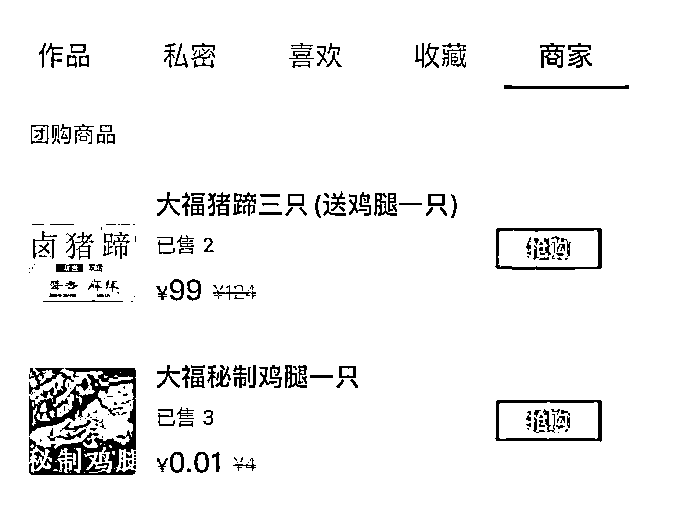

1 只鸡腿成本 2 块，引一个到店顾客，还能加上微信。而且到店的顾客还能买猪蹄，这样算下来，我们搞活动不仅不亏，还可能会赚。

团购链接上了之后，我用小号私信了一些美食探店号。

 

 

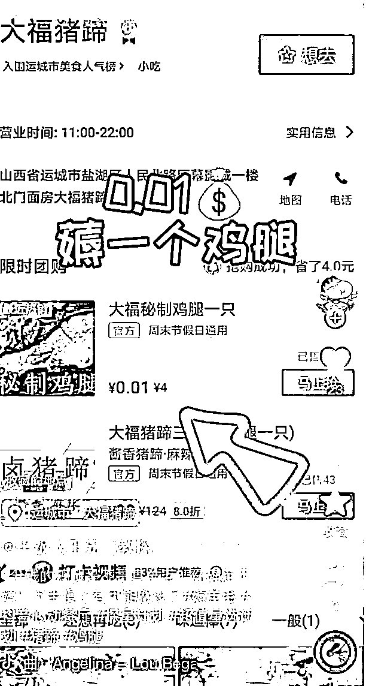

 

 

 

 

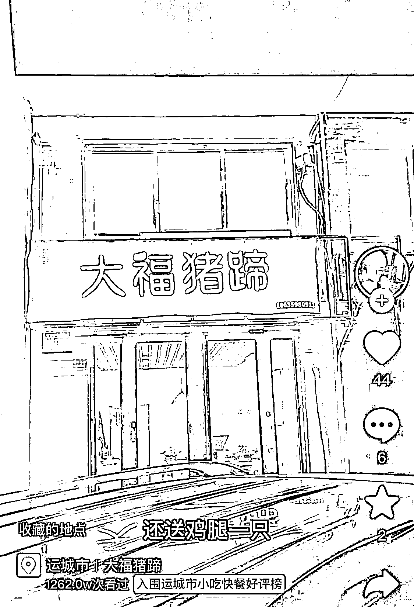

 

 

像这种薅羊毛的活动，他们能吸引粉丝增加流量，也能帮我们宣传店铺，顾客还能薅羊毛。有点像淘宝客里的 0 元购刷单。很快就有一两千粉丝的小达人开始挂链接发视频，也陆陆续续开始有顾客到店领取。

搞这个活动还有个意外惊喜：抖音“挖坟”挖出了好几个视频，流量开始增加，顺带着小吃快餐的榜单排名也开始上升，像是被激活了一样，店里生意火了好一阵。

 

 

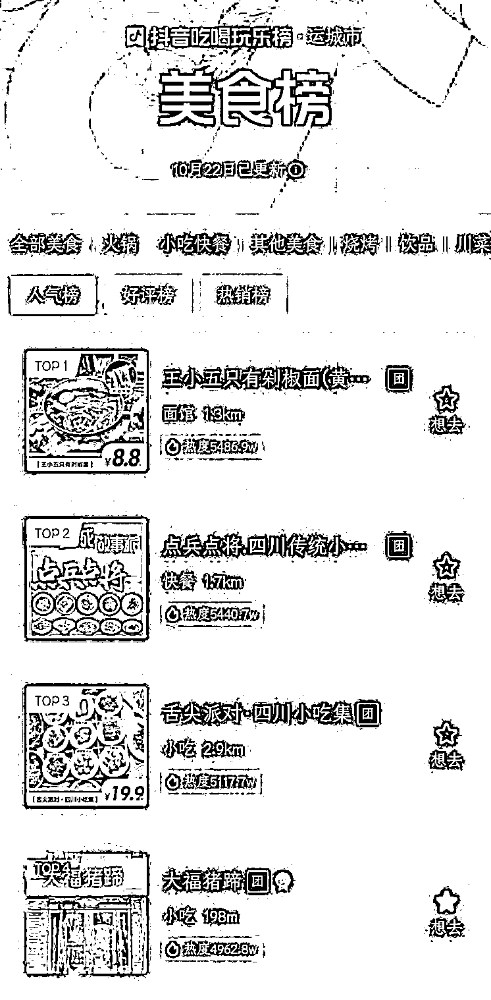

 

 

等活动热度退去，我们下架链接的时候大概卖了 600 份，99 元的猪蹄卖了五六十个。

600 个鸡腿亏损 1200 ，99 元猪蹄按 50 个算，还能赚一些。这里没算到店的消费，还有购买未到店领取的鸡腿。

活动后反思：

1）刚开始没限制 1 人 1 份，有 1 人领了五六个鸡腿的情况，可能是找家人或异地的朋友帮忙，起不到引流到店，或者拉新的作用；

2）没设计裂变，应该再加一层，转发再送鸡腿一个，这样的话效果会更好一些。

具体操作流程都很简单，就没有写详细步骤，大家可以抖音里搜索，或者私下交流。

 

 

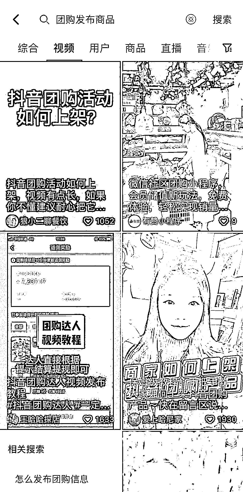

 

 

**-06-**

结尾建议** **

1、越早开始越好，大家都是普通人，90%的人没想象中那么专业，都是慢慢学起来的。

我500左右播放量持续有一个多月，一两千播放量持续也有一两个月，1.5W播放持续了5个月。不嫌丢人的说，我粉丝到3000用了9个月。

2、拍视频的时候不要卖惨，拍一些店里没有生意的视频，再配上凄惨的音乐，希望大家可以可怜你去店里消费。千万不要去考验人性，连我们自己平时出去吃饭都不会去没人的饭店。其他实体店也一样。

3、做抖音就利用好抖音搜索，90%的问题在抖音里搜索能找到答案。

4、如果是做餐饮，一定要把菜品做好吃，最好有自己的特色，服务一定要好，短视频是一个放大器，店里的优缺点都会无限放大，顾客满意度高，给你好评，你的生意继续翻倍，如果口碑崩塌，也会让你彻底的凉凉。

 

 

5、模仿，一定要学会模仿。火了的视频，模仿翻拍火的几率很大。

6、大航海的学习手册里干货很多，适合时常回顾翻阅，建议多看几遍。

评论区：

张静伟@生财有术 : 优秀，大福猪蹄店，啥时候开到杭州来啊

silence : 😄，努力💪努力

北鱼 : 优秀[强]

平凡 : 很多实体店可以直接抄作业了[愉快]

silence : [呲牙][呲牙]

顺道 : 老乡😂

silence : [呲牙][握手]

大嘴师迪 : 流弊  王老板

# **# ****(**精华帖**)(52**赞**)**小团队通过做矩阵短视频，卖

# 汽车用品单月直接变现** 10W+**

作者：  米戈

日期：2023-03-28

我卖汽车卖不过人家，那我就转成卖燃油宝、轮胎，卖能够解决汽车疑难杂症的用品，是不是就更有机会。

你想一想车主会怎么去解决汽车漏气、掉漆等问题，在保修期内还好说，可以去 4S 店，过了保修期呢？是不是得购买这些产品替换？

 

 

我刚开始做汽车行业时入局晚，加上单单卖汽车的门槛很高，根本竞争不过头部达人，后来在大家都在卷汽车的时候，我带着小团队转型做解决汽车各种症状的业务，为用户提供能够替换的产品。

我就发现这些产品利润非常高,，也很容易让用户多次复购，是一个很不错的市场，如果你做短视频进入瓶颈期时或者新人加入不知道怎么选择时，其实可以考虑考虑小类目的市场，会是一个新的赚钱赛道。

各位圈友好，我是米戈，汽车自媒体创业者，账号主做用车类知识分享，抖音过百万粉丝，快手近百万粉丝，目前主要通过抖音和快手直播卖货。

这次我结合账号运营的情况，分享下汽车类垂直细分小类目，三五人小团队模式，如何获取流量并逐步实现流量的自动供给，流量来了如何快速变现，并持续变现的经验和教训。

具体目录如下：

一、流量如何获取并实现自动供给

二、如何变现：知识付费、卖货、其它

三、不主动推销如何做好私域

四、项目教训与建议

 

 

一、如何获取流量：全网铺内容，实现流量自动供给

铺内容，到底要铺哪些内容？

这里就用了一招：围绕产品做内容！

咱就卖燃油宝的，重点就围绕燃油宝能解决啥问题来做内容，把燃油宝能解决的车辆症状，也是车主普遍关心的。

比如油耗高、抖动、烧机油、尾气超标等，全部整理成话题，以汽修专家解疑答惑的方式拍摄视频，全年不断围绕

这些话题生产内容。

此处以刘团长的视频作为案例，燃油宝清积碳，这种实景拍摄效果更好。

 

 

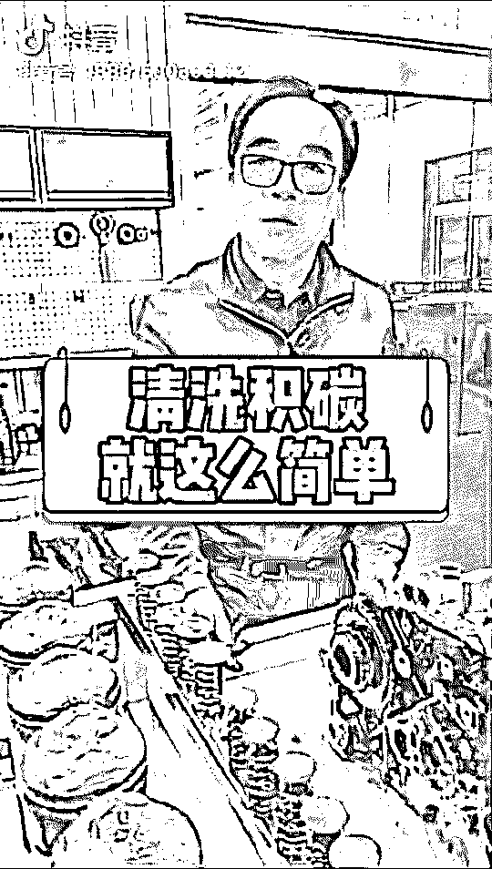

 

 

小团队运作，内容形式咱就秉承一切从简，数量大于质量的原则，把内容复用做到最大化，混剪为主，实拍为辅，

内容不够，直播切片来凑。

有了内容，铺到哪里有效果？

能发布的地方都先试试，哪里引流效果好，最后就重点运营哪里。

懂车帝、汽车之家、易车、爱卡、太平洋、车友头条、汽车头条、今日头条、抖音、火山、快手、秒拍、腾讯、优酷、UC 大鱼号、爱奇艺、凤凰网、一点资讯、趣头条、知乎、百度、搜狐、新浪、搜狗、网易、A 站、B 站、公众号、视频号等渠道都发布下，量大出奇迹。

至今各个平台累计发布了 10000+ 部作品，对比来看还是抖音和快手流量最香。

找到适合内容的最优平台，就重点运营这些平台，持续不断的发布内容，就能够逐步实现流量自动供给。

 

 

二、如何变现：知识付费、卖货、其它

流量来了，如何变现？

同行就是最好的老师，模仿学习！

# **# **（**1**）知识付费

天干三年，饿不死手艺人。

有手艺，培训要搞起来！

从抖音或者快手搜索：烧机油、镗缸、电喷、二手车等与汽车行业相关的关键词，都有人在做培训。

 

 

 

 

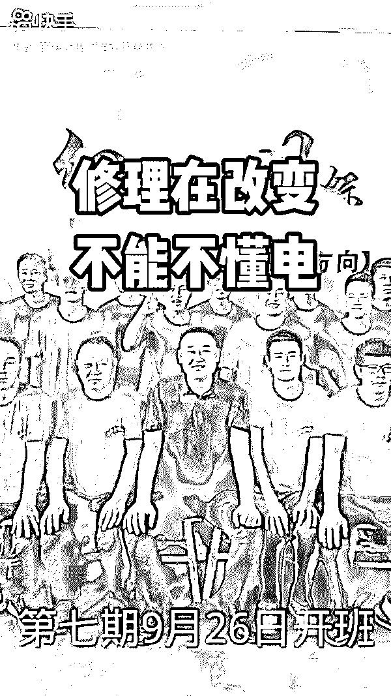

以视频中电喷账号为例，常年招募学员，线下开课，同时卖解码器等维修设备，月营业额能做到 100W+（根据线下设备代理商提供数据推测）。

如果这类培训做不了，可以做相对简单的付费问答、付费诊断修车，入驻 大家车问、汽车大师** ** 这类平台，利用行业专业知识和技术，为付费用户及时提供服务。

 

 

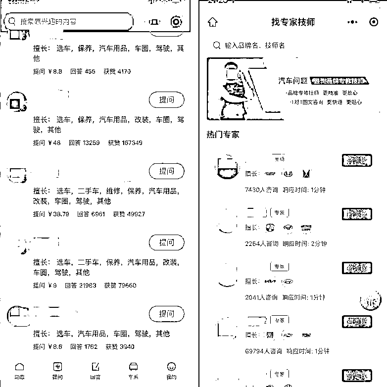

# **# **（**2**）卖货

IP 已成，卖货不停~~

抖音、快手两个平台同步直播。

 

 

直接开播，是否有流量？

前期围绕产品已经铺了足够的内容，车子有问题的车友，看到视频进入直播间，开播就会有流量，客户精准度也有保证，剩下的就是重点转化。

目前我们的做法就是，直播间一对一连麦，为咨询问题的车友，提供免费诊断；

遇到咱上面说的，车子如果出现了油耗高、抖动等症状的，这类客户就是我们的精准客户，需要做重点做转化，针对性的推荐小黄车里面的自营产品。

这里选了抖音和快手同一天的直播数据，供各位圈友参考。

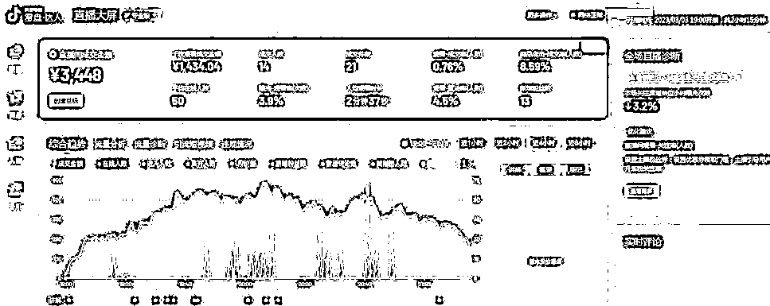

 

 

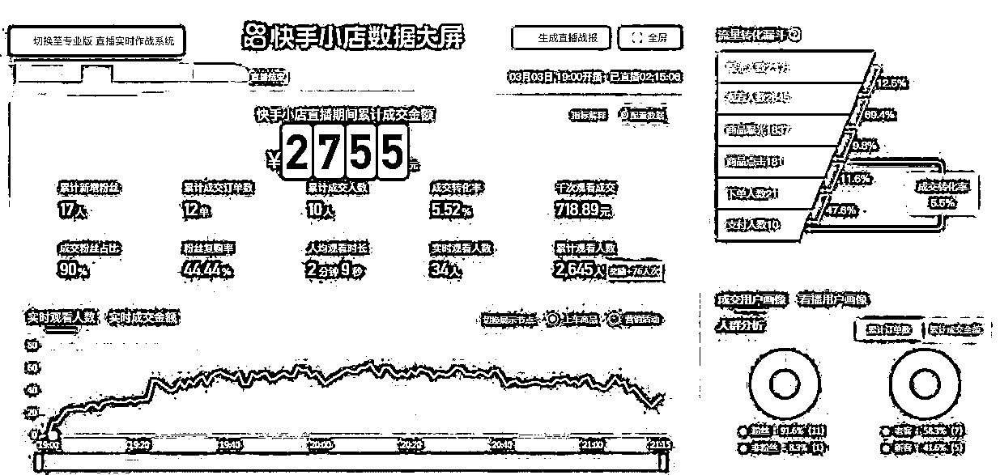

面对大量用户群体，一对一连麦的方式，效率还是比较低，那如何在现有的条件下，进一步提高收益？

做无人直播和短视频带货，实现自动赚钱。

无人直播：我们每天基本都会真人直播，素材不缺，把直播回放作为无人直播的视频素材，播放 2 个小时左右也能

达到正常直播的效果。

真人直播是连麦方式，开展无人直播时记得关掉连麦，人进来就只让他负责听就行，一样会主动下单购买。

目前这么操作还没有收到过违规通知。

短视频带货：自营产品的，把直播回放，稍加处理，每天发布用来带货；

 

 

合作产品的，哪个视频带货数据好，就参考哪个，1:1 复制拍摄，一次拍摄，反复混剪。

抖音精选联盟和快手快分销中的汽车用品，一般都会给到 40% 以上的佣金，如果没有自营产品，就找这种合作产品一件代发，自己专心做内容就可以。

 

 

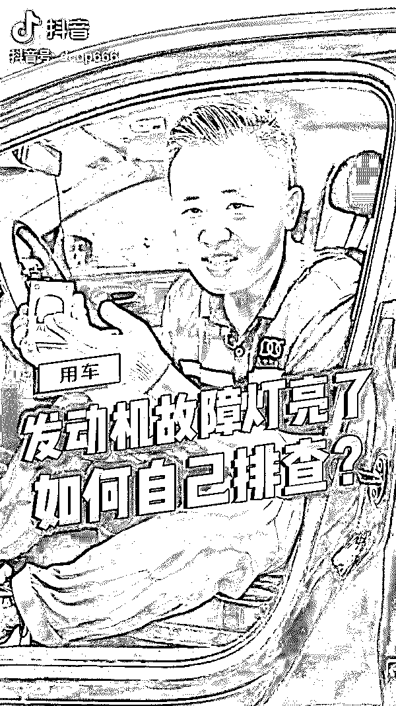

 

 

能付费推广的产品就重点做，小店随心推、千川、磁力金牛都用上，持续付费推广，即使打不爆，也能持续带来收益。

 

 

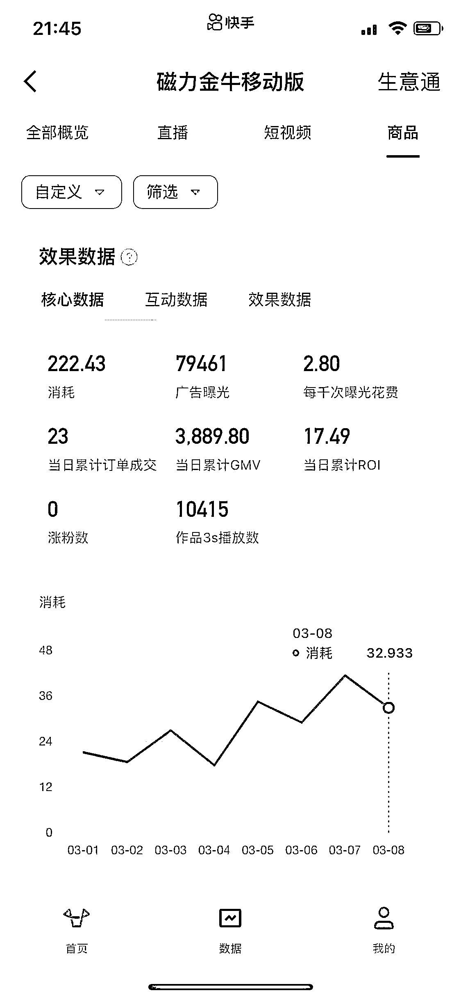

 

 

 

 

 

 

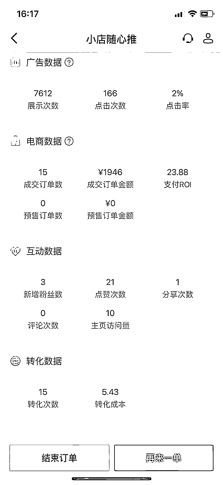

# **# **（**3**）其它

汽车行业，没有资源，就尽量做大粉丝体量；有体量，就不会缺广告。

靠广告变现就是多、快、好、省的一种方式，汽车广告单价相对也高，巴适得很。

跨入百万粉丝体量，后台谈合作的就会多起来；有汽车品牌投放广告的，有汽车用品合作推广的......

除了广告，靠平台福利，遇到合适机会，有时也能狠狠撸一波。

 

 

以头条系为例，当年刚推出 PICK 计划时，传 1 部视频就给 100 元；直播推广懂车帝  APP，新车线索可得 XX 元；中视频、问答、文章、付费专栏、图文或者视频带货、微头条......

之前圈友分享风向标时，其中提到过山水重庆这个头条号，这类账号的佼佼者山东也有一个；

这里就不说账号了，也是全平台发山水重庆的这类文章，一天至少发布七八条，每年各种变现超 1000 万以上。

有收益的地方深入进去，总能发现生财的快乐~~

这里用我后台收益数据供大家参考，友情提示：该收益不代表现在的收益情况。

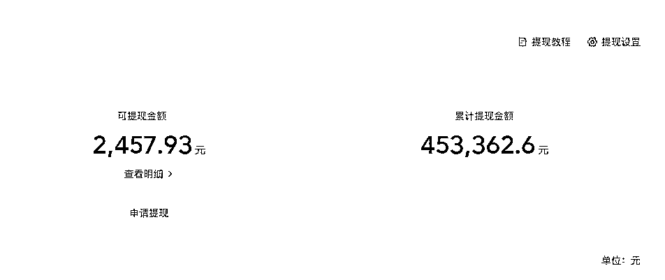

 

 

三、私域运营和代理分销

# **# **（**1**）私域运营

重点做好朋友圈的运营；

通过短视频和直播，吸引车友关注加微信之后，通过朋友圈从早到晚地宣传产品和活动；

用其它车友的订单评价和真实反馈，做好价值勾引。

不做主动推销，让用户自己决定买不买。一旦买了体验了，都是老司机，立马试车感觉不错，大多都会成为高

粘性高复购用户。

 

 

# **# **（**2**）代理分销

用好一招：自用省钱，分享赚钱！

产品好、利润足，借助有赞分销员和分销商功能，构建代理分销体系，和更多人一起做好服务和变现。

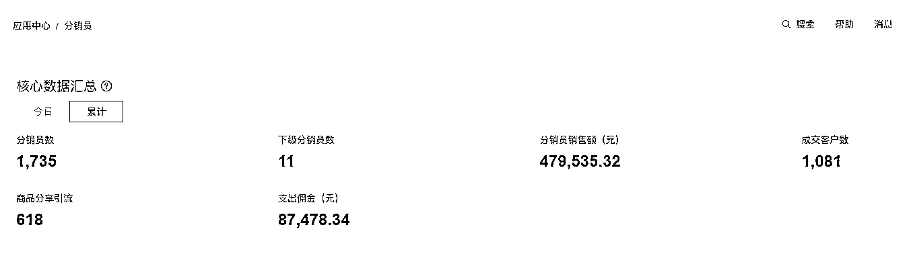

四、项目教训和建议

切入细分领域，选择有积累性的项目，这套流程操作下来，不需要过多的人力，也可以做到半自动赚钱的程度。

但依然还是没有逐步放大到想要的水平，向上突破就成了难题。

 

 

机油、清洗剂这类汽车产品有一定的特殊性，虽然利润高，复购率也高，但是有些平台难以付费推广，就很难快速放大。

最后还是回到了选品的重要性，选择高粘性、高复购、高利润产品，自播的同时，发展更多达人带播，借助付费流

量来放大，线下有汽修厂的，结合本地生活服务，会达到更高的收益水平。

最后给大家来个参考账号：小阿兰修车，邻家修车小妹，贴心微笑服务；

内容产出形式流量好，内容复用持续爆款，带货能力十分强悍，不愁流量和变现；

每天一群老爷们，夜夜围着直播间，有事没事跑到小妹汽修厂，给车子来个大保养~~评论区：

雨林 : 写的好，有几个问题请教，咋联系呢

浅念临风（济南） : 活塞环释放剂  除碳剂高利润产品

A孟世扬 : 我是做汽修行业的[微笑]

Jia : 写的真好

小谢先生 : 我是开汽美店的，想开始做抖音了

亦仁 : 感谢分享，已加精华。

思牧宝宝 : 写的太好了，就是不知道怎么开始，我是做润滑油和汽车用品品牌代理，以及自己有养护店，想向大佬请教，怎么联系呢？

米戈 : 自己有养护店，可做的方式更多些能，可以参考文末提到的案例账号，结合店内实拍剧情类视频，吸引用户进店做保养维修。代理的品牌产品销售，可以参考文中卖OBD的账号方式，普及汽车类知识顺道带货

 

 

# 【**IP **运营】**2**篇

# **# ****(**精华帖**)(297**赞**)**电商创业抖音** IP**，一条视频

# 引流** 500+ **私域，**2 **天变现** 2 **万**+**

作者：  木易Troy

日期：2021-06-28

大家好，我是木易，是这一次抖音商业IP小航海的成员，感谢生财的组织和孤狼老师的带领，学到了特别多的干货，跑通了一次闭环，也取得了一点小小成绩。

在这接近30天的小航海中，注册了0粉丝的新号，发了20条作品，涨粉5700+，豆荚投放总共1700元，2天变现2万元。

文章稍长，主要分为以下四个部分来讲：

抖音起号的底层逻辑

抖音公域引流至私域

私域运营及变现

小航海的复盘感悟

这里我想结合自己的经历，分享这一次抖音小航海中的收获，和自己对于抖音变现的理解和思考，希望能够对大家有帮助。

 

 

**01 **抖音起号的底层逻辑

关于抖音的介绍我就不用多说了，它是如今日活数量最多的短视频平台，日活数接近7亿，也就是说中国14亿人口里面，除了0-10岁的小孩和65岁以上可能不会使用手机的老人，绝大多数人都在抖音这个平台上，这个商业价值有多大不言而喻。

有流量的地方就会有生意，就会有变现。而这一次孤狼老师带领我们的小航海的目的，就是做出自己的商业IP，利用IP的方式变现。

结合他自己过去起号0失败的经验，总结了一套商业IP的起号打法，大致分为以下四个阶段：

第一阶段：账号注册及定位

账号注册：如果老号长时间没有使用，直接注册一个新的手机卡，注册一个全新的抖音号，保证账号是绝对干净的，在之后操作的过程当中会更加得心应手。

账号定位：在做账号之前，应该结合自己所处的行业和技能，找到可以10个对标的同类账号，看一下他们的账号内容以及变现方式，这样有利于我们后期快速起号。

起号之前一定要思考清楚日后的变现方式，引流方式，这样你的内容才会更加精准的获取你的目标人群，转化率会相对较高。

毕竟我们做商业IP，最终的目的都是为了变现，而不是所谓的粉丝数量多少，一定要围绕核心的目的死磕到底。

 

 

名称和头像设置：因为是在公域平台获取流量，所以在个人展示面上一定要让别人看到的时候第一眼就知道你是做什么行业的，能提供什么样的干货，对他们有什么样的帮助，最好是在简介上添加一些钩子，只有这样，通过作品转粉丝的转化率才会高一些，引流到私域的势能才会强一些。

我拿我的账号举例，现在专职电商，淘宝蓝海和店群领域，所以我的ID名称叫：木易电商创业。

账号介绍如下：

 

 

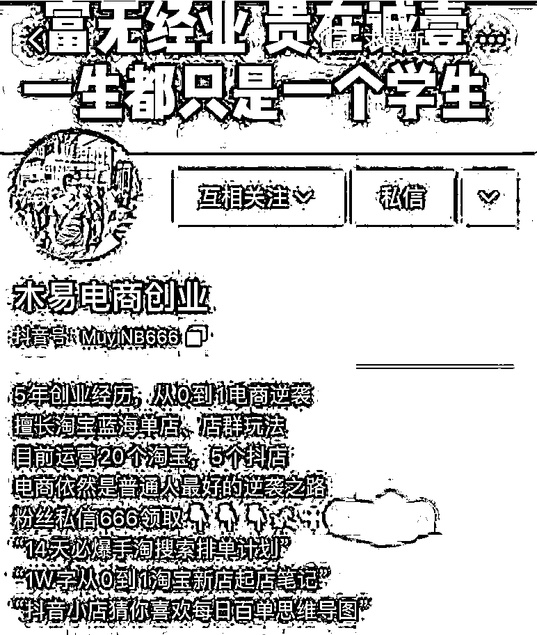

10个对标账号准备:

 

 

起号之前一定要找到同行业的做的比较好的对手账号，至少10个，全部关注起来，这样做的目的有两个。

一是研究分析他们的头像，简介和作品是怎样做的，后期我们才能有的放矢进行像素级别的模仿。

二是最为重要的一点，当我们在进行豆荚投放拉粉丝人群属性的时候，他们都是我们投放的主要目标，因为他们的粉丝也是我们最想要获取的精准人群，这样可以更快速的把自己的账号标签拉的更加精准。

第二阶段：文案撰写，视频拍摄

在前5天的时候，我们需要撰写10条文案，拍摄10条作品，连续5天每天发布2条，再进行定向人群豆荚投放，将账号的人群标签拉精准。

前期撰写文案的时候，我也十分头痛，根本不知道选题从何下手。按照自己的想法拍摄了3条作品，结果数据惨不忍睹，5S的完播率都达不到10%，更别提点赞率和涨粉了，一时间觉得十分气馁。

思考了很久，进入一个全新的领域时，作为小白还是不要自由发挥。世界上最快出成绩的方法，那就是先“抄袭”再“超越”---先抄后超，毕竟跟随着有结果的人学习才是最快的成长路径。

后来我直接在对标账号里面分别选取了10条1000+点赞以上的作品选题，将他们文案全部用题词大师导出，用EXCEL表进行记录分析，重点关注选题类型和前5S的文案。

 

 

选题决定了你的作品是不是目标人群所感兴趣的，前5S的文案决定了你的完播率，完播率越高的作品才更有机会进入下一个更大的流量池。

确定选题之后，前5S的文案你可以保持和原作者一摸一样，后面的内容自己结合实际情况进行二次创作，这样出来的内容大概率不会表现太差。

不要选择全部抄袭，一摸一样，这样不利于账号的长期发展，没有粉丝会喜欢一个连30S文案都写不出来的博主。

但是借鉴选题是完全没有问题的，毕竟每个人都有对同一个问题发表看法的自由。后期我发了十来条作品，都是别人之前爆过的选题，例如：

新手做电商该卖什么？

月入过万的产品该如何寻找？

上架就出单的产品都是什么样的？

直通车如何拉爆搜索?

.....

通过这一些选题借鉴，我才慢慢找到了自己的感觉，后面的作品完播率基本都能达到25%左右，豆荚投放涨粉也能慢慢做到平均1：1.4了。

最好的一条作品是讲述抖音小店底层逻辑的视频，那个时候测试的一些新方法在小店上有明显的效果了，没有稿子，就随意的让同事录制了访谈类型的作品，没想到这一下就直接爆了，抖音免费给了十几万的播放，豆荚投放也做到了0.8：1。

 

 

抖音整个平台是内容为王，归根到底，数据好不好，还是由内容决定的。所以我们可以在前期不懂得时候直接参考别人的选题和文案，等到自己找到了一些感觉，再慢慢的自行创造内容，做到先抄后超。

第三阶段：豆荚投放，数据反馈调整，获得基础粉丝

抖音上的新账号发布作品的时候，基础播放都是500左右，如果你的作品在500个播放里面的数据特别优秀，比如：完播率，停留，点赞，转粉等等，就有机会进入下一个更大的流量池，这也就是抖音的赛马机制。

基础的500播放是随机分配的人群，如果你只讲述某个领域的专业话题，没有定向的人群标签，那么数据表现一般都会特别差，很难有机会进入下一个流量池。

就像我这种专业讲电商知识的账号，对于那些非电商从业者而言，基本2S都不会停留，会直接划过去。

投放定向人群豆荚的目的就是用钱去换时间，尽快的把自己账号打上精准的标签，根据孤狼老师的标准是要做到5000基础精准粉丝，之后你发送的主题作品才能大概率被抖音精准分发给你需要的人群。

其次就是，拥有5000粉丝以后，你的基础播放池子会更大一些，日后爆发大热门的机会也会多一些。

理解了这个逻辑之后，你就会明白为什么前期会需要投放豆荚，虽然不投放豆荚也能做起来，账号标签随着后来作品越多，会越来越精准，但是这个时间会比较漫长，有可能是3个月，也有可能是半年，对于每一位做商业IP的小伙伴来说，时间一定是更宝贵的。

 

 

豆荚数据分析，涨粉数据能跑到**1**：**1**就使劲砸。

豆荚投放系统推荐是100元可以获得近5000的播放，定向人群投放是100元2500播放，数据评判标准就是投放金额：增粉数量如果能达到1：1的话，说明这个视频内容数据比较优质，基础投放100元出了人群画像之后就可以继续追投了。

我有条一天涨粉5000的作品，数据跑到了基本0.8:1，我就一直追投，总共投放了将近1500快，抖音免费流量推送了近15W的播放。

 

 

 

 

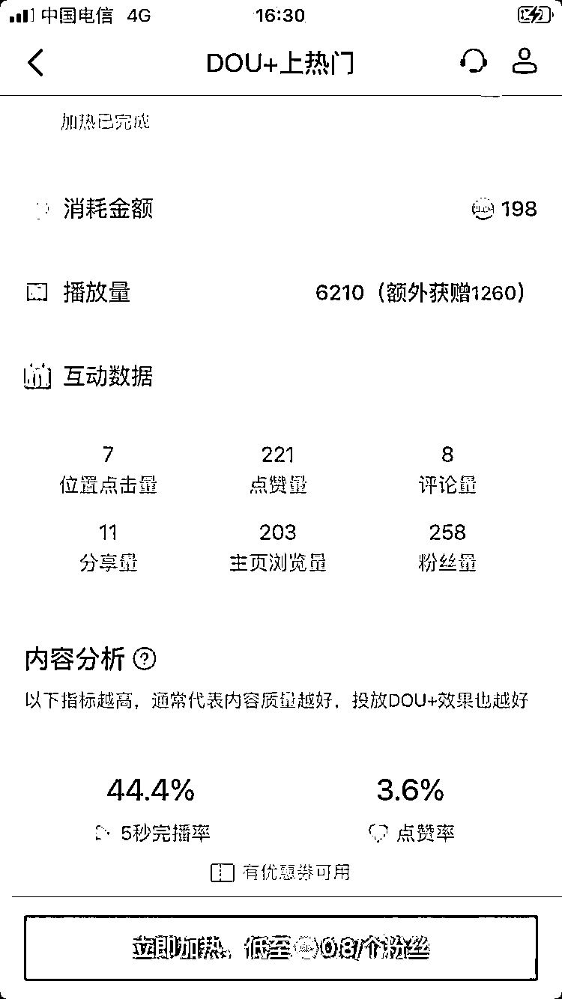

在投放的时候我是这样操作的，每次发布新作品的时候都投放100元的豆荚，效果选择涨粉，时间选择12个小时，2个小时之后去服务中心看一下实时数据，如果投放效果达不到2：1，我就会把这条视频隐藏，这个时候豆荚费用就会自动返回到你的账户里面来，然后你再选择公开视频，让他继续把基础播放跑完。

我们投放豆荚的目的都是为了更快的拿到基础粉丝，与其把1000元均匀投放到10个不同的视频上，还不如集中精力投放到一条数据特别好的作品上，一次性打爆这条视频，效果事半功倍。

一般来说，发布的几十条视频里面，数据表现差的，消耗到20就可以让他停止，如果有跑出接近1:1数据的作品，就继续200-400-800-1200的追投进去，直到拿到5000粉丝为止。

在投放的过程中，到了2000粉丝节点的时候，可以花少部分钱尝试选择智能投放渠道，如果跑出来的数据和定向投放一样，那么就代表你的账号标签已经相对精准了。

第四阶段：持续创作输出，保持日更，等待大热门的来临。

 

 

抖音是一个内容为王的平台，有了5000基础粉丝之后，基础播放和几万粉，几十万粉丝的大号基础播放没有特别大的差别。只要你的内容足够硬，数据表现足够优异，赛马的流量池的上限，也就是爆几十万，几百万播放的那种大热门的机会也相差无几。如果作品内容不够强，几百万粉丝的账号可能也就几万的播放。

尤其是过了5000基础粉丝的门槛，人群标签拉得精准了，剩下的就全靠作品质量说话，豆荚投放就不是我们最主要的手段了，有时候发现作品刚发出去，点赞，评论数据都表现的不错的话，准备个几百块推一下它，让它更快的跑入下一个流量池，获得更多播放。

孤狼老师说过一句话，我觉得很有道理，抖音要想做得好，就要像生产队的驴一样，持续不断的生产高质量的内容。最好是能保持日更2条作品，持续个一年半载过后再看，你肯定能成为你这个行业里面的头部。除此之外，其他手段都是扯蛋。

**02 **抖音引流至私域

在做抖音的时候，我们都要有清晰的认知，抖音的粉丝数量只是一个数字而已，并不像公众号粉丝或者快手粉丝那么值钱，毕竟抖音上每条作品的粉丝触达率太低了。如果你没有持续生产优质内容的能力，那么几百万粉丝的账号和一个几万粉丝的账号的基础播放量并没有什么差别。

我们要将抖音当成一个公域获取流量的入口，如果在爆了热门，流量来临的时候你没有及时引流到私域，之后你要再想导入私域，那就真的比较困难了，毕竟之后这些粉丝也很难保证会持续刷到你的新作品。

我做抖音IP账号之前，就已经准备了四个微信用来承接流量，所以爆的这一条十几万播放的视频，1天就引流了500+人导入微信。

 

 

抖音引流的几种方法：

**1. **账号简介中留微信

简介中留联系方式，抖音查的不是特别严格，但我们要注意避免微信，VX这种字眼，可以用符号代替，比如地球，卫星这种自带的符号，后面写上+的符号及自己的微信，没有被封过。

个人简介每天可以修改三次，也就意味着可以替换3个微信，如果被加频繁了，可以再次修改即可。

2\. 留下钩子

你想让别人加你微信，就必须要给人家一个加你微信的理由，至少你要能给他提供价值，或者是一份特别想要的东西，这个就要每个人根据所从事的行业提前准备好，我的电商账号准备的是一张关于抖音小店的思维导图，淘宝拉爆手淘搜索的排单计划表格，对于一些电商新人而言都是干货。

3.视频中引流添加

视频结束的时候可以晒一下你这个领域的干货思维导图，XX文档之类的东西，可以说：

需要的直接评论区留言，私我666之类的话语。有时候这一类话语可能会导致作品不能投放豆荚加热，需要仔细打磨话术，不要被系统检测到。

4.评论区引导

 

 

有时候我们很多作品爆了，但却没有留下钩子，这个时候我们就要快速的在评论区留言，并且将自己的评论置顶。

很多人看完视频都会有点开评论区查看的习惯，这个时候就能看到你的引导话语，进一步提升转粉率。

话术和视频导流差不多：有需要XX东西的铁子们可以私信我666领取！

一条不行的话，还可以多发条。

5\. 私信回复微信

抖音对私信是有监测的，不能反复的发同样的引导话术，不能提及微信，VX等谐音字太多次。我们需要多变的调整自己的话术。

**1. **你好，可以查看我主页的联系方式哦！

**2. **你好，被加频繁了，你的联系方式**/**电话是多少？

**3. **家我**XXXX**，佳我**XXX**，用错别字来代替加我这样的字眼。

**4. **表情包，可以制作一个带有**+**我**:XXXXXX **这种格式的表情包，直接发送表情包给对方，简单明了。

....

等等，上述很多方式都可以，每次话术我都只会持续发送5个人左右，就要修改自己的相关的话术，以免抖音系统会识别出来，禁止私信功能，这样就很惨了，7天之内根本没办法回复，只能看着流量擦肩而过。

 

 

**03 **私域变现

**1. ** 变现产品设计

流量不等于粉丝

粉丝不等于变现

归根到底，做商业IP我们的终极目的还是变现，如果不能变现，那有再多热门，再多粉丝，那又有何作用呢？君不见，当年这么多的千万级别的剧情号都停更许久了，就是因为没有明确的变现方式，生产内容的成本又特别高，就这样活生生被淘汰掉了。

在做抖音商业IP前，你必须要思考清楚，你的变现产品是什么，可以是课程，可以是实物，也可以是服务（例如：情感咨询，心理咨询等等）。

只有这样，你才能在商业IP这条道路上获得正反馈，有持续生产优质内容的能力和资金，单纯的为爱发电是走不长远的。

我的账号定位是电商，所以我的产品就是针对于新手的电商课程，主要是抖音小店和淘系无货源。小航海之前，我就准备好了相关课件，流量爆发的当晚，我就马不停蹄的花了4个小时，把抖音小店的课程录制完成上传小鹅通了，虽然有些匆忙，难免会有一些纰漏，但是已经顾及不了这么多了，完成总比完美要好。

第二天通过1对1的咨询，加上之前朋友圈一直在做运营，很快就有5个学员报名了，直接变现2万。

 

 

这一点大家要尤其重视，千万不要临时抱佛脚，没有人知道下一条视频会不会爆，万一爆了呢？你连你的产品体系都没有搭建好，那么多的精准客户人群不就全部浪费了吗?

人的注意力是有限的，何况在抖音这个百花齐放的平台上，任何形式的知识付费领域都有大量的对手存在，用户能刷到你，也就能刷到他们，不要期待你的客户会停下来给你时间等你准备好。

**1. ** 私域运营本质

私域这一块，尤其感谢ZEN老板的指点，让我开了天眼，收获颇多。

很多人做私域，账号一上来就给用户发广告，朋友圈每天十几条都是营销文案，这样的账号你让觉得转化率会高吗？（卖货除外）没有人希望朋友圈天天都是硬广吧。

私域的本质是什么？

信任与专业，你只需要给用户传递这两种感觉就可以了。

成交就是：你刚好专业，而我恰好需要，这就是一件水到渠成的事情。

IP要传递给别人温度，你就是一个活生生的人，而不是一个冰冷的营销机器号。我见过很多在这一块做的比较差的品牌，把用户当成流量，肆意的骚扰，动不动就是每天几条群发，朋友圈连续十几条疯狂的刷屏，最终取得的结果却事与愿违。

 

 

**2. 1**对**1**沟通，珍惜每一次被需要的刚觉，针对客户分类，以便后期跟进

我们都要珍惜被需要的感觉，当一个用户开始向你咨询的时候，一定是对你感兴趣的，或是带着问题来的，不要敷衍他的每一句话，尽量做好专业回答话术，让他感受到你是真诚的想帮他解决问题。

当然，这里涉及到你付费核心领域知识的时候，你可以跟对方说明，因为我在从事相关的培训，这一些服务是提供给付费学员的，很抱歉，不过有其他方面的问题，我们可以多多交流。这样一来，稍微正常一点的人都能理解。

**3 **朋友圈运营，做一个真实的**“**人**”**

只要是人，就会有喜怒哀乐，朋友圈除了相关的专业知识，应该多分享一些你对生活的看法，你对某些问题的思考，你对这个世界的认识，只要是真实的就好。

我们不应该生硬的给自己打上很多标签，其实你们看看自己的陌生好友列表扪心自问，哪些人你为什么愿意信任他，哪些人你又为什么不愿意信任。

思考过后，你会发现，标签这东西，应该是用户给我们贴的。

我们内心其实会不由自主的给每个人贴上对应的标签，而这些标签，大多数来源于他呈现给我们的“真实”感觉，而这种“真实”感并不是常年的营销广告所能带来的。

我们都知道朋友圈要精细化运营，但很少人能持续做到一直分享。

 

 

好的IP，应当不止一面，真正的强者应该可以将自己化为任何一种形态去穿越人间，穿越偏见，能强硬，能柔软。能打散，能重塑。

**4 **有温度的互动

互动，是朋友之前才会有的行为。

你如果把你的用户当成朋友，就应该跟他保持一定的互动，让他感觉到你参与到了他的生活当中，分享了他的喜怒哀乐。

朋友圈的互动体现在2种行为上，点赞和评论。而这两种行为，不是盲目的，随机的，不是要你疯狂对用户每一条点赞，评论，而是要有温度和共鸣的。

打个比方说，用户转发了一条广告，你给他点赞，那这个明显就是跪舔了，不走心。

我们要对于他们真实的生活分享和感慨进行一些互动，假设，宝妈用户，晒了她的宝宝，那这个时候你可以点赞，评价：宝宝这么美，脸上肉嘟嘟的，看到之后都想马上结婚生小孩了。

接下来你们的故事可能就开始了，遇到一些愿意聊的用户，可能就跟你抱怨结婚别这么早，还是单身好，巴拉巴拉一大堆.....

这些互动，一方面可以让用户增强你的信任，另一方面可以让用户加强对你的认知。

你们有没有发现，当有陌生人给你点赞，或者跟你聊天的时候，你会去翻一翻对方的朋友圈或是聊天记录，来看一下你是做什么的，什么时候加的你，等等....

 

 

而通过这一些行为，用户从内心会主动给你打上标签，之后如果他有相应的需求，那成交就是水到渠成的事情了。

关于私域的运营，还有提升触达率，用户分组，连带率，让用户看你的朋友圈有像追剧的感觉...

这里涉及到的大多数都是基本常识，有很多小细节值得我们去思考优化，就不展开讲了，未来做出了更好的成绩，再来给大家汇报。

**5 **投放思维

免费的永远是最贵的，伟大的商业模式一定离不开付费推广。

跑通了闭环之后，我们就要学会仔细算账，看能否通过付费推广的方式持续放大，一旦ROI能够跑正，那这是不是就成为了我们“钞”能力？

我仔细计算过我这一条视频的数据，12W播放的时候，差不多后台有600多条私信，转化到私域有500人，2天内转化了5人，然后这一部分精准粉丝以后还留在你的账号内，通过长期的运营，后期的转化率肯定会高很多。

从客单价，转化率倒推出来最低投放价格，20块以内的用户，有多少就可以接多少，这样你的投放逻辑就很清晰的展现在你眼前。

12W播放-600条私信可以承接到私域  转化率：0.005%

 

 

500人加到微信-转化5人，  即时转化率 1%，长期转化率未知。

然后抖音的付费豆荚系统智能是100快，5000播放，也就是如果视频是0免费流量，12W曝光全部是付费推广的话，那么只要花费2400元，ROI可以接近1：9

由于这一条我投放的是定向推广，100块只有2500播放，只花了1500元，产出了2W，综合算一笔账下来，你就会发现，抖音的流量太他妈便宜了，单次曝光只要0.02，如果你的产品ROI能跑正，那么这不就变成了一个无限游戏吗？

算清楚帐之后，当天本来计划烧完1500之后，直接投放5000，看看接下来的数据会不会一如既往的好，如果还能保证，那么就1W,2W,3W，直接拉满。

但我运气很差，这条视频只火了18个小时就因为账号之前讲了关于S单的视频被判违规了，直接屏蔽账号十天，不能发布新的作品，也不能投放豆荚，这个实验就戛然而止了。

不过没关系，我已经跑通了这个闭环，日后再多准备新的账号，新的内容，新的产品，大不了就是从头再来嘛。

**04 **小航海复盘收获

**1 **短视频时代，我们必须要拥抱变化

 

 

毫无疑问，短视频时代已经全面普及，上到九十九，下到刚会走，大家都沉浸在短视频平台上，消耗的时间都在这里，其他各类平台流量都有下滑趋势，不论是电商淘宝还是微信公众号朋友圈，都很难再有往日之繁华。

反观抖音每个作品都有500基础播放，小店的猜你喜欢宝贝都能疯狂出单来看，你就知道，这个流量有多么恐怖了，溢出到都没办法承接了。

公众号的打开率很多都不足1%了，朋友圈的触达虽然没有公众号这么惨，但也不是特别活跃。

还记得老胡大佬上个月做过一个朋友圈触达的实验，让所有看到这条朋友圈的人配合给他点赞，5500人的朋友圈，也只有近500人看到点赞，触达率不足10%，侧面也反映出，大家刷朋友圈频率也越来越低了。

抖音就如同老纪所说，这是一座金矿，懂得人自然能挖到金子。抖音的播放折算成钱，也就是0.02元一次，你再看看淘宝的直通车，或者公众号的广告，整个互联网上哪里还能找到这么便宜的流量？

有流量的地方，才会有变现。

流量越大的地方，才会有未来。

** **

**2 **不要脸一点，每个人都是**60**分的人，同时也是**100**分的人

很多人害怕真人出镜，原因就是怕身边的亲戚朋友看到，觉得丢人，我以前也是这样想，后来看到各行各业的大佬现在都在入主抖音，亲自上场为企业卖命吆喝，雷军，罗永浩都已经这样了，你觉得你还有什么放不开的吗？

 

 

花爷在IP课里面说到，不要怕表达，不要怕发朋友圈宣传，不要怕收别人的钱，不要怕被人质疑，不要怕别人不理解。

不要脸，不是说抛弃良心的底线，而是不要让害羞、胆小、畏畏缩缩，限制了你。

每个人在自己的领域，都既是60分的人，也是100分的人，就拿做电商的举例，现在一个月才10多W的利润产出。说句实话，我这个成绩在专业电商大佬面前，只是个弟弟。

按照他们的利润标准，我这可能连及格线都达不到。

但在刚入行的小白面前，或者是非电商从业者面前，我这个成绩已经算挺牛逼了，人的评价都是相对的，动态的。

如果按照我过去的理解，只有100分的人才能有资格去分享，去教学，那这个世界上的专业老师根本不够啊。而且往往100分的老师时间成本极高，大多数小白都不可能承担得起这样得学费。

价值流动的本质应该是，100分的去教那些90分的，90分的去教那些80分的，80分的去教那些70分的....这才是世界运转的真相。

**3 **相信自己的能力，敢于去卖

如果你已经具备了某个领域的专业能力，并且做出了一些成绩，跑通了闭环，那么其实你就可以开始尝试，看能不能将这样的能力复制给别人。

 

 

在抖音七亿日活这个江湖里，三教九流，无奇不有，有人教炒粉可以做到年入百万，像我们这样的互联网从业者，身上难道真的找不到一丝亮点吗？

只要之前通过任何一种方赚到过钱，不论金额大小，你都可以去思考一下，是否存在放大的机会？是否有人群需要这样的服务？再小众的受众经过7亿用户的杠杆放大，都是一个天文数字。

你做一件事情能赚到钱，这件事情的价值并不是特别大，如果你能让别人做这件事也赚到钱，那这件事的价值就大了。将自己有限的价值释放出来，流动起来，自己的价值就有可能得到指数级的提升。

小航海课程里孤狼也说：“抖音上凡是出来做商业板块内容的人，大家都是出来卖的，无非是产品不同而已。”话糙理不糙。

我们想想，当今时代，如果你身上真的没有什么值得拿出手去卖的东西，那不是一件很可悲的事情吗？

**4 **注重私域资产，长期主义运营

在公域竞争越来越激烈的时代，要注意私域资产，秉承长期主义运营，绝对不要去做短期蝇头小利的事情。

要珍惜那些愿意给你付费并且信任你的人。

 

 

我在设计我的电商课程时，我是这么给他们说的。我会把我服务的一年周期内，我所学到的任何电商平台玩法，电商技巧，凡是我跑通流程做出成绩的，毫无保留的教给他们。

然后市面上每年出来的新玩法，新平台，我都会去先付费学一遍，跑通闭环，做出成绩，这样踩过的坑和经验都能让他们少走很多弯路，争取给他们提供长期价值。

这样他们都觉得特别值，很快就报名了。愿意付费跟我一起玩，一起成长，如果未来我带他们都赚到钱了，实现了当初的目标，他们愿意给我再次续费那也是自然而然的事情了。

长久的来看，任何平台，项目终有一天都会走向灭亡。唯独只有人们的信任，拥有穿越时间长河的力量。

待人以真诚，保持长期输出有价值的内容，让别人觉得你更加靠谱，这样你拥有的势能才会与日递增。

以上就是我从这次小航海中，抖音公域引流，结合IP做私域运营，变现的一些思考。

评论区：

郭耀天 : 图看不到

木易Troy : 换了

蛋小叔 : 👍

CD : 😱大哥太猛了

一酷杂谈 : 木易大佬太强了

木易Troy : 现在号被封了10天 10天之后才放出来搜索到😂

 

 

大家好，我是李菁，很荣幸在生财有术做分享。我有 3 个标签，畅销书作家&女性个人品牌商业顾问&生活美学摄影师，我在 8 年时间拥有了 6W 私域流量，实现了百万变现。

看到这里，或许你会很好奇，个人微信号也能实现百万变现？普通人也可以做到吗？借着这篇内容，我想跟大家分享，我通过明确个人 IP 、输出优质内容、根据粉丝特点打造产品，实现知识付费百万变现的完整经历。

冰蓝色 : 牛

珍珍 : 小鹅通上卖视频课是吗？

# **# ****(**精华帖**)(99**赞**)**通过明确个人** IP**、输出优质内

# 容、根据粉丝特点打造产品，**8 **年拥有** 6W **私域

# 流量，实现百万变现

作者：  李菁女性个人品牌顾问

日期：2022-02-21

 

 

 

 

第一个标签是畅销书作家。

 

 

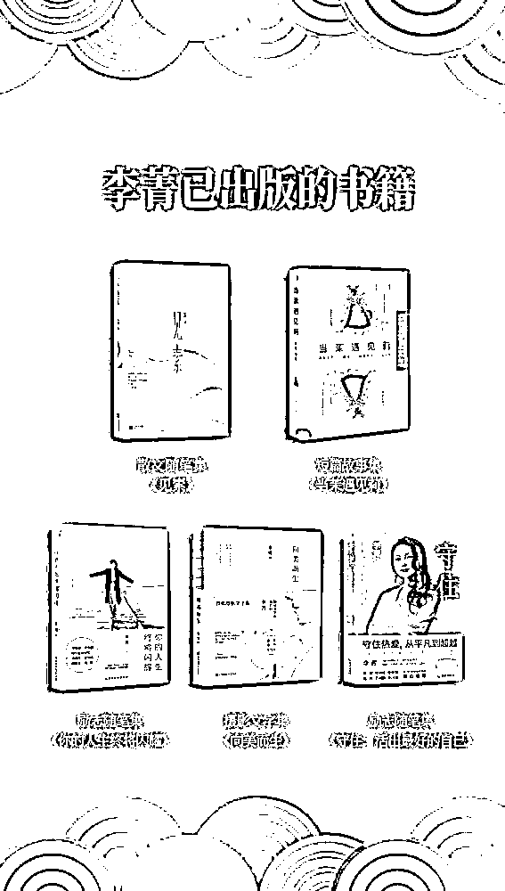

 

 

深耕线上知识付费领域 6 年。

积累 11 个个人微信号，私域流量 6 万粉丝。全网粉丝 50 万+。

帮助 10000 + 女性通过打造个人品牌实现创富。

已经出版散文随笔集《见素》，短篇故事集《当茉遇见莉》，励志随笔集《你的人生终将闪耀》，摄影文字集《向美而生》，励志随笔集《守住：活出最好的自己》。

爱书如命，藏书三万余册。

第二个标签是生活美学摄影师。

艺术硕士，曾是大学老师。

摄影作品格调唯美，意蕴深长，被选作梁实秋、雪小禅、张晓风等名家著作的专用插图，累计为 100 名女性拍摄个人写真。

#视频号：遇见李菁，荣获 2020 年度金视榜文化博主 TOP10，现在有 2.6 万粉丝。

第三个标签是女性个人品牌商业顾问。

今天我将给大家分享，素人如何 8 年拥有 6 万私域流量，通过知识付费实现百万变现。

 

 

目录：

**1. **为什么说个人微信号价值百万？

**2. **私域涨粉实战经验

**3. **想要实现个人品牌变现的几个步骤

**—01—**

为什么说个人微信号价值百万？

我目前所做的行业是知识付费行业。通过知识产品服务收费，本质上是知识 IP 商业化操作。在微信生态创建菁凌研习社知识服务平台。为素人提供从 0 到 1 打造可变现的个人品牌的一系列知识服务产品：网课、训练营、会员、高端会员、咨询顾问……

我从个人 IP 发展为平台 IP，从自己一个人授课到邀请多位老师大咖老师在我们平台一起授课，从一个人活成一支队伍到创办公司、搭建团队，一起把这份事业做大。

我是从 2016 年 7 月辞去了大学老师的工作，转型到线上知识付费行业，做自己的手机摄影训练营。持续三年的时间每年年营收都只有 6 位数，我一直在探索如何提升影响力与财富力。

在 2020 年，我的年营收突破了百万。2021 年，年营收突破了 200 万。

 

 

你有几个微信？

你的微信粉丝数有多少？

为什么这两年赚钱的速度加快了？两个原因。

一方面，我升级了自己的定位，从手机摄影美学导师升级成了个人品牌商业顾问，当我能够帮助学员赚到更多钱的时候，我的收入自然也就提升了。

另一方面，我的流量池越来越大，从之前的 1 万微信好友到现在的 6 万微信好友，学员自然也就更多，我的财富就得到了什么增长，所以说升级自己的商业模式与涨粉对一个创业者来说是非常重要的。

如果你有一个个人的** IP**，能够拥有** 1000 **个铁杆粉丝，就可以保证你一辈子衣食无忧。流量的本质就是人，私域的本质是去链接人吸引人，让人去服务人。

我想请你回答两个问题：

为什么会问这两个问题呢？

我想给大家分享一下我自己的例子。

 

 

2013 年 7 月，我申请了自己的第 1 个微信号「吧啦」，那时候我还在读研，是学生，只是一个穷书生，没有挣钱的能力，在西安读研三年，中途去了宝岛台湾中国文化大学研修半年，家里一起欠下了十几万助学贷款。

你是不是也跟我一样经历过这种至暗时刻？特别穷。

基本上我读研毕业时，就背负了十几万的外债，我不想父母还，就想着自己如何挣钱还债。

2015 年 9 月，我申请了自己的第 2 个人微信号「作家李菁」，那时候我已经辞去了大学老师的工作，在互联网上开设了自己的第一期摄影美学课程，年收入只有五位数。

2016 年 8 月，我申请了自己的第 3 个微信号「摄影者李菁」，那时候我已经可以靠摄影美学课程年入六位数。

之后这几年，我陆续有了自己第 4 个号，第 5 个号，第 6 个号。

如今，我有 8 个个人微信号，3 个助理号，加在一起 11 个微信号，粉丝有 5 万多。今年已经实现了七位数的营收。

你可以看出来，我微信好友增加的同时，收入也在不断增加吗？

现在微信版本升级，好友最高限量从以前的 5000 到 10000，对我们来说，是一个福音，这就意味着我们可以用微信积累更多的好友。

这一年，当身边的朋友都在焦虑事业和工作因为疫情出现停滞或者入不敷出的时候，我却通过知识付费已经做到了年入几百万。

 

 

虽然我生活在偏远的湘西小镇，但是我依然可以在互联网上通过打造个人品牌实现知识变现。从个人 IP 到公司商业化运营，我仅仅是通过深耕微信朋友圈这一个平台，就实现了又富又美的生活。

一个个人微信号好比一家线下的店铺，你多一个微信号就是多开了一个门店，而且是低成本的门店。

用心经营的个人微信号价值百万。

**—02—**

私域涨粉实战经验

接下来我就来给大家揭秘私域涨粉的方法，这些方法都来自我的实战经验，每个方法你们都能用。

**1**、在自媒体上持续输出优质内容

自媒体平台是什么意思呢？我们每一个学员其实在整个互联网有非常多的这种展现自己的平台，这个展现自己的平台是你自己在经营的，比如说公众号、视频号、抖音、小红书、简书，等等。

 

 

我希望每个人都要确定你自己最长花时间经营的自媒体平台是哪一个，可能是你的朋友圈，可能是你的公众号，可能是你的抖音。哪个都行，你要设立一个最重要的一个平台，然后把其他平台的流量全部引到这个最主要的平台里。

为什么要这么做呢？因为你自己不可能所有精力都分散得那么散，而且你这样的一个思维可以把某一个自媒体的平台经营到数量比较好的这样一个状态，那这个又成为你自己的一个背书了。

比如我自己就会把所有的粉丝都积累在微信朋友圈，做一个长期的沉淀。

我微信上早期加进来的朋友大部分是通过看了我的文章添加的。

我是 2014 年 1 月开始做我的写作公众号，以前叫做「吧啦原创文学」，现在叫做「遇见李菁」，已经有 8 年的时间，一天都没有停止过更新。

早期是我自己在更文，我自己每天都会写，但是现在我已经有了 4 万多的粉丝，组建了一个签约作者的团队。我专注写书，很多时候就是我的签约作者在公众号上面发表文章，我给他们打造了一个平台。

我是从 2020 年四月中旬开始做视频号的。

腾讯推出视频号时，直接设定为微信内嵌的应用，不断改版加大视频号曝光机会。

视频号是平行于公众号和个人微信号的内容平台，是一个人人都可以记录和创作的平台。

 

 

你好，很开心认识你。感谢你关注我的视频号哦 。

如果你愿意的话，可以加我微信，进入我的视频号读者交流群，我会第一时间分享我的直播信息，相信一定对你有帮助。

你可以直接复制我的微信号搜索添加，如果你备注暗号「视频号」，我通过好友后会送你一份我的成长规划课。我的微信号是：zuojialijing，如果你已经有我微信我相信它将成为非常适合普通大众去创作的短视频内容方式，前景广阔。

于是我先后运营了五个个人视频号。每个定位都有所不同。目前我聚焦运营「遇见李菁」，这个视频号已经经过黄 V 认证， 2.6 万粉丝，并且持续打造了多条 10 万+ 阅读量短视频。

通过一条 100 万阅读量的短视频，视频号增涨了 8000 粉丝，视频号上也有几千人加我微信。

在这里要强调一点，当你有了视频号之后，不要想着别人主动来加你的微信号，而是你要想如何才能让视频号的粉丝来到你的个人微信。

我每天都会做一件事情：私信视频号 15 个粉丝，给她们留言，邀请她添加我的微信号，进入到我的专属社群。

视频号后台私信留言是这样的，如果是你们之前还没有对话，是不能够直接发二维码的，所以如果是还没有说话的粉丝，你可以给她发一段文字，文字里面写上微信号。

我把我的话术发给你们，供你们参考：

 

 

了，就私信我视频号，我把成长规划课给你哦。

通过这个动作，每天都有新的流量从视频号加到我的个人微信。

**2**、社群分享，吸引精准粉丝

付费加入优质社群，并且积极去展示自己，提供价值。在付费的社群你才能找到有能力为你的产品付费的人。

我几乎每周都会去一个朋友或者老师的社群做分享。在分享过程中去提供价值，吸引潜在粉丝，我最后就会引导大家可以加我的微信我会给大家送一个课、电子书。不管是电子书，还是说这种音频课，视频课都是你提前需要做准备的。

对，你不要觉得不好意思，你就直接发微信二维码，因为你这个时候不是推课，你这个时候是为了让别人跟你链接，你去给他们送礼物，所以你要多多在各个群分享。前提是你已经跟群主有沟通过，可以发自己的二维码，这也是对群主的尊重。

你要相信，分享力就是影响力。

**3**、表达自己的思想，吸引同频者

想要打造自己个人品牌影响力最佳的方式，就是多做分享，线上加线下结合的方式去做分享，输出自己垂直领域的内容，去播更多的种子，你会发现自己的能量会传递给更多的人。

 

 

并且，你的潜在用户会在你分享的过程中被你打动，她们很有可能会转化成你的付费用户。

现在线上分享的形式与平台越来越多，可以真人出镜做公开免费直播，用视频号、小鹅通、一直播、千聊、腾讯直播、快手、抖音等直播平台，一边直播还可以一边卖产品，比如书籍，自己的课程。

如果不愿真人出镜，也可以使用语音的方式，在各大 APP 上分享，或者直接在微信群分享。

我们可以做事件营销，这也是自我营销的过程。有时候可以约一群有能量的人一起发动一些分享活动，彼此可以赋能，这样影响到的人也会更多。

我们也可以结合一些热点来做分享，比如之前乘风破浪的姐姐这档节目很火，有一位做个人品牌咨询的老师就约了身边一些女性 CEO 做了一个系列「乘风破浪的女 CEO」的真人直播，以访谈的形式来分享这些优秀女性创业的故事，这个系列直播为这位老师吸引了很多粉丝，甚至有客户主动联系她，想要跟她签约打造自己的个人品牌。

这就是借势。

多去做一些分享，不断地分享，让你的潜在用户记住你。分享能展现你的个人魅力，你的语言表达力、思辨力都会提升。

不管是线上分享还是线下分享，都需要做一个动作，就是把这些听众拉到一个微信社群里，这样才能产生更多价值。

** **

 

 

**5**、坚持互推，吸引优质用户

2020 年 2 月份，我申请了一个微信号，短短一个月不到的时间我就增加了 4000 个优质好友，我使用的方法就是互推。

就是去找一些她们微信粉丝也比较多，而且跟我的调性比较相符合的朋友，我在几个微信朋友圈推她，她在几个微信朋友圈推我，有时候一天最多加了 500 个好友进来。

现在如果是微信互推，一天只能被动添加 50 个好友左右，所以会比以前管控更严格。

如果你现在的微信好友，只有一两千人，或是只有几百人，也没有关系，你可以去找微信粉丝和你差不多的人进行互推。

别人在推你的过程中其实已经给你做了背书，她的朋友会建立对于这个人的信任，加你的微信，这个时候你就要把自己的微信朋友圈打造好，这样才能把他们留下来。

互推的效果是根据对方的粉丝数与黏性来决定的，如果对方的粉丝数很多，那他给你带来的微信好友就会多，如果对方的粉丝数只有几百个，那家里的人也就只有几个而已。

比如说我自己的微信好友有 6 万，我在朋友圈推荐合伙人，一般会有 100~300 人去添加她。

往往你提供的照片越好看，提供的文案写得越好吸引来的粉丝就会更多，因为大家都会被美的人，优秀的人所吸引。

 

 

另外，你可以提前准备一个免费的音频课作为礼物送给新加你的朋友，让他们通过你的音频课加深对你的认知，也能够让更多的人因为想得到这份礼物而想要与你链接。

我们去找互推的人，不能够一上来就在微信上问她愿不愿意互推，这样就会显得很唐突，我建议你可以先跟她微信语音约聊一次，加深一下彼此的认识和了解，在约聊的过程中委婉的提出来，是否有互推的意愿，如果对方有这个意愿再给她相应的文案。

互推文案参考：

 

 

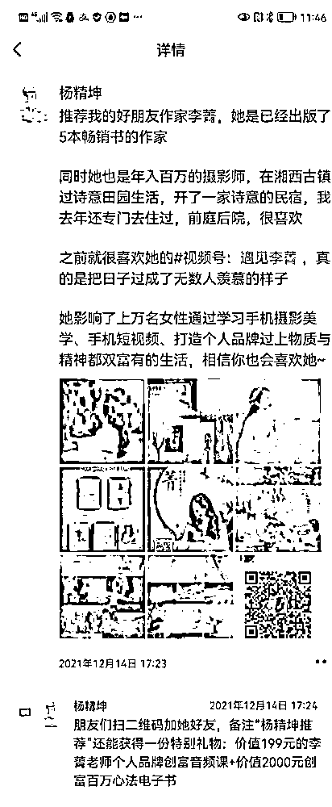

 

 

**—03—**

想要实现个人品牌变现的五个步骤

** **

第一步：要找到个人** IP **的标签。

传播者总会有意识的把他的符号标签植入内容中，既然内容记不住，那记住标签就可以了。标签就是告诉别人你是谁，你代表什么，你是做什么的，为什么你可以做好这件事情？品牌就是你和多少人就某一件事达成了共识，传播就是反复不断的和很多人去说一个事情。

比如我的私教班学员露露的定位是瘦身营养教练，我就会让她在朋友圈，视频号，公众号一直去输出这方面的知识，这样她朋友想要健康瘦身的时候，就会想到她。

第二步：要输出优质的内容。

持续的更新，让大家了解你的擅长点，发光点。

这几年我一共出了 5 本书，累计为 100 名女性拍摄写真，主编了三个公众号，「遇见李菁」公众号长达 8 年时间实现日更。持续更新，让大家了解你的擅长点发光点，好比是花粉，用户是蜂蜜，想要收获什么样的蜜就要先去种什么样的花，然后把蜜蜂喂饱了才会有蜜。

 

 

在一个方向上持续努力的程度，决定了你最后到达的高度。

第三步：积累你的精准粉丝。

大家要思考一下几个点，你的用户是谁？？？逃避什么？焦虑什么？迷茫什么？找到你的精准的用户很重要。

我用了 8 年的时间，已经有了 11 个个人微信号 6 万微信好友。昨天有一位老师说我的个人微信号价值百万，他为什么这么说呢？因为我现在能实现年入百万全靠自己个人微信，社群。只要我研发新的课程就会有铁杆支持者购买学习，好口碑又带来了新的用户，这样持续耕耘，就会让自己的个人品牌越来越值钱。

第四步：根据粉丝的需求点打造你的产品。

产品有着属于你的核心竞争力，粉丝会基于对你的信任，对你的喜欢，购买你的产品，实现更多的收益。

产品分为有形产品与无形产品。在有形产品方面，我打造了一款传统手工小饼 “菁凌见素小饼”，原材料用得很好，所以得到了好的口碑，复购率高。

在无形产品方面，我打磨了自己的知识服务体系。

**1**）网课

 

 

比如我的手机人像摄影美学课 199 元，一般网课没有后期社群的服务，买了只是听一下。这种网课的优势是便宜，大家没有犹豫的成本，看到之后喜欢你，而且对他有帮助就马上下单，一般网课是 199 元左右。劣势是没有办法与你产生强联系、进行互动。

**2**）训练营

比如我的手机摄影美学班 899 元，个人品牌训练营 999 元，视频号变现训练营 899 元。好处是让用户有更深的链接，产生强信任，劣势是运营的成本很大，时间成本很大，做训练营之前你要把整个社群服务规划好。

**3**）会员

比如菁凌年度会员 299 元。建立自己的年度会员，有两种目的：一种目的是为了增加自己的收入，这个时候你可以定高一点，另一种目的是让更多人可以加入到平台，让平台更有人气，我不是为了增加收入而是人气，所以我把费用设置的低一点 199 元。

除此之外，我还有一个菁凌合伙人会员，7900 元一年的收费。我的菁凌研习社平台所有的课程都可以免费听，一直跟我走下去，与我有强链接，得到我 1 对 1 的辅导。这个也可以链接到很多优秀的女性朋友，因为我吸引来的也是很多热爱美好生活的女性，这也是我服务的一个体系。

你要把整个产品体系搭建起来，如网课、训练营、会员的体制。

会员制度一个很大的优势是让你的产品使用者变成你的产品推广者、传播者，这个是非常厉害的。我们如何让自己的产品让更多的人知道，产生一种裂变，或者让老用户给我们带来新用户，这个时候就要用到会员体制，因为会员你可以给他佣金。

 

 

我是这样设置的，介绍一个朋友过来上我们平台的课程，年度会员分佣 30%，菁凌合伙人终身会员分佣 50%，他们会先得到好处和变现，所以才会在他的朋友推我们平台课程，所以一定要学会分钱、分利润。

目前我的合伙人已经招募了 300 + 名，仅仅是这个产品就为我带来了几百万的营收。

**4**）顾问

顾问是一个超高标准的产品，如个人品牌私教班，一年是付费 29800 元，私董两年  49800 元，属于高付费的产品，这个产品主要是打造成功案例。

我从 199 元到 49800 元，是有一个产品体系的，漏斗的模型。

对于知识 IP 来说，你的经验越丰富，资历越深厚，成功案例越多，你的收费就会越高。

第五步：搭建自己的团队，找到适合自己的商业模式。

你只有找到适合你的商业模式，你才会，少走很多的弯路，实现更多的营收。一个人永远都不如一群人的力量强大。就像以前我是一个人干活，但是现在我有了自己的团队，有了自己的事业合作伙伴，我们彼此汲取能量，才会走得更远。

在搭建团队的过程中，一定要注意选人比培养人更重要，我自己现在是线下 4 名全职助理线上有一个百人的运营团队。

 

 

我生活与工作的地方，在湘西一个很偏僻的小镇，我的 4 名全职助理都是从大城市千里迢迢来到小镇跟我一起共创这份事业。相比于大城市，我在招人上会显得更加的困难，但是我很庆幸我找到了贴心的全职助理，在助理方面我很重视她们的价值观是否与我相匹配，是否具备基本的文字功底，是否对社群运营有着极大的热爱。

线上我还有一个百人的兼职运营团队，我搭建了一个社群运营中心晋升体系，从学姐团到志愿者助教再到金牌助教，我会从老学员中选拔出优秀的人才到学姐团，再通过培训与社群的实际操练，继续选出价值观同频做事靠谱的人，成为我们的志愿者助教，当她在我们平台运营超过一年之后，我会将她升级为金牌助教，金牌助教在线上兼职带班的时候会有项目的薪酬，这样我就搭建了自己的一个运营人才库，并且这些运营人才都是对我们有感情的老学员，会对我们怀有更多的爱。

这是一个互联网时代，现在的趋势是社交新零售，每个人都是一家公司，要打造属于自己的个人 IP，左手卖课，右手卖货，你会拥有更多财富，并且在自己赚到钱的同时影响更多的人，让他们实现自我的价值与突破，这样你也获得了这个社会对你的认可与尊重。

很多人手里其实都缺现金流。我做民宿的时候每个月还会想着各种支出，淡季就需要自己垫资给员工发工资。

现在我有了互联网思维，打造个人品牌，左手卖课，右手卖货，一个月最高的时候收入就是几十万，并且没有淡旺季之分。

今天分享的内容就到这里，都是实操的方法，希望大家用起来。

最后我把我的座右铭分享给你们：虽然我不是最好的那一个，但是我可以做最努力的那一个。

 

 

评论区：

青悦 : 优秀的CEO，佩服[强]

野外的风 : 绝对精华

有800亩茶园的茶公* : 优秀啊

亦仁 : 感谢分享，已加精华。

心灵去旅行 : 学习了

[玫瑰]

空想错视 : 正在操作中，有用

Naonao : 读+笔记+写自己的感悟，一共用了4个小时才精读完全篇文章。

谢谢李菁老师的分享，我理解为您就是在奉行个人IP的长期主义吧。慢即是快，扎实走好的每一步，都算数。

看好你 : 上次看到你和王一九老师连麦

# 【精细化运营】**1**篇

# **# ****(**精华帖**)(156**赞**)3 **分钟看懂增长** 10 **倍业绩的

# 实操

作者：  老黄

日期：2021-07-02

背景：

14年汽车销售，单天活动成交新车300多万；

17年驾校招生，创业从0到1000万的年突破；

20年电商女装，客服转大客户销售团队复制成功。

 

 

这套可行性实操，放在当下，应该叫做精细化的私域运营，但是我更喜欢叫  强销售管理  ！

因为即使是0销售基础的客服，运用这套实操方法，也可以快速的转型成强销售，并且业绩稳步提升！而且是完全可以复制的，适用于任何需要销售的行业！

不讲过多的废话，直接上干货！

全文分上下两篇：

上篇  ：原理介绍

下篇  ：业绩增长

上篇：原理介绍

**7**种卡片、四大类型、六大级别

按日期管理：3张年卡、12张月卡、4张周卡、31张日卡；

按客户管理：24张姓式首字母卡

按跟进记录：期间跟进记录卡、潜在客户档案卡

按成交级别： S O H A B C

3张年卡：以3年为周期来培养客户感情，增大LTV； 12张月卡：以月为周期提高培养客情效率，防止漏空；

 

 

4张周卡：以周为周期提高成交效率，尽快转化； 31张日卡：以日为周期建立初步信任，同时成交。

24张姓式首字母卡：相同姓式统一管理，方便抽取；  期间跟进记录卡：每次客情培养登记在册，方便管理；

潜在客户档案卡：傻瓜式背调+每次回访记录+管理效率+快速成交+客情培养

S级别：已成交并且建立感情基础、后续增大LTV； 0级别：已成交客户，待加深感情联系； H级别：3天内要成交客户； A级别：7天内要成交客户； B级别：15天内成交客户；C级别：25天内成交客户

（  同时H A B C级别附带回访日期频率属性，这个要根据当天回访来定  ）

图1~ 图7 分别为：年卡、月卡、周卡、日卡、姓式卡、期间跟进记录卡、潜在客户档案卡

 

 

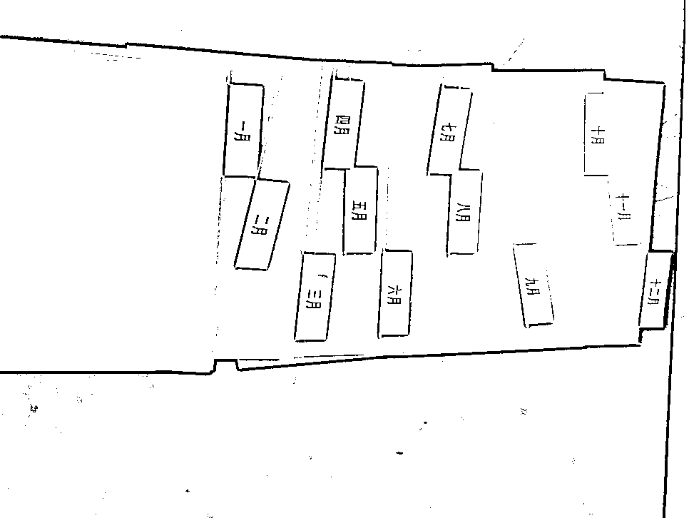 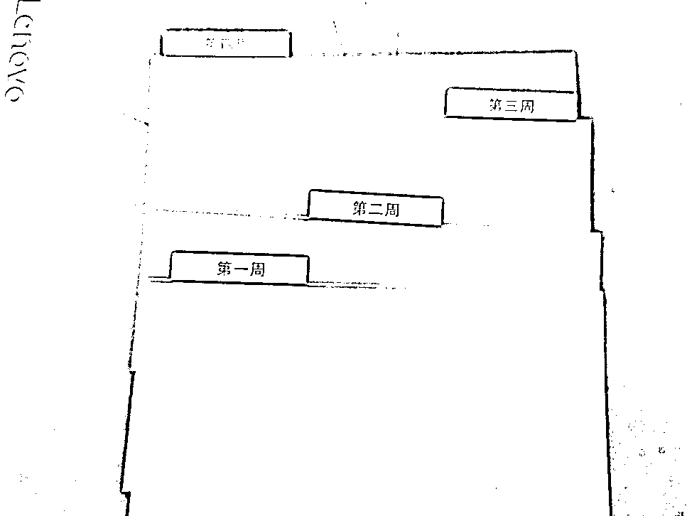

 

 

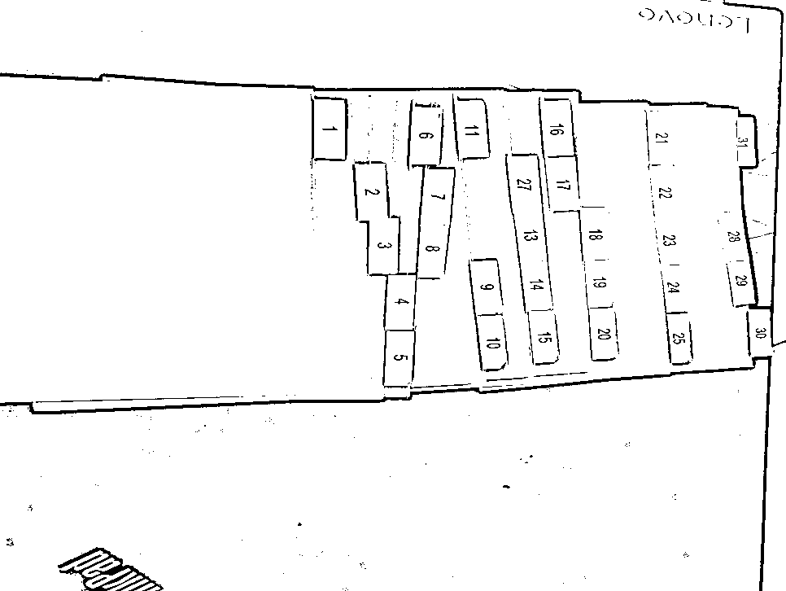

 

 

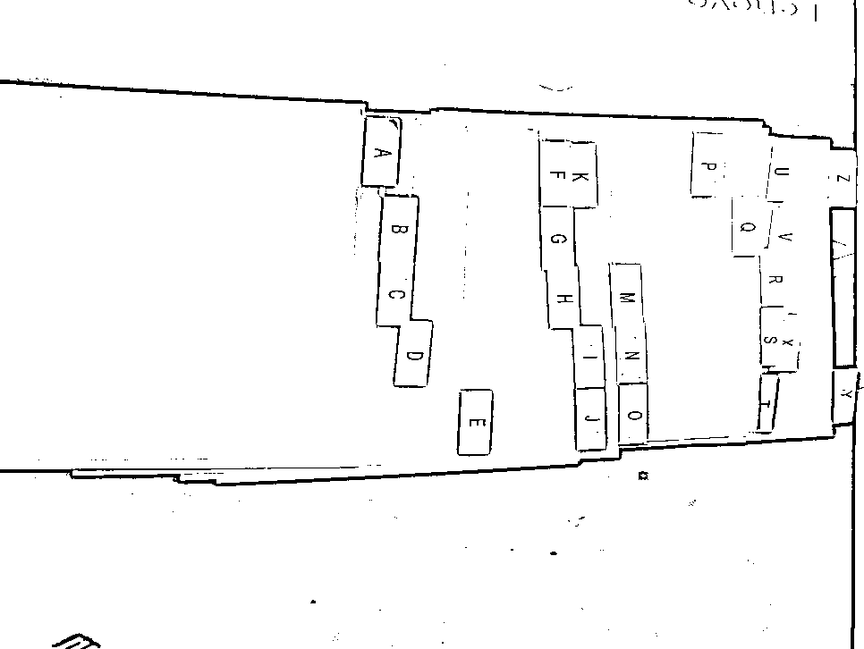 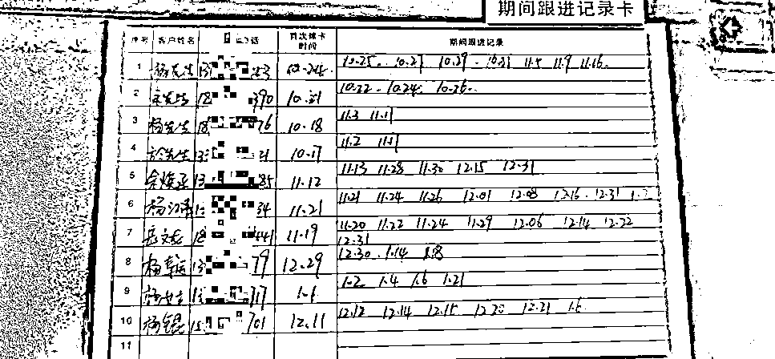

 

 

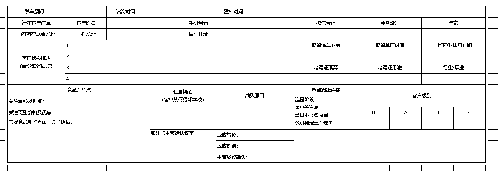 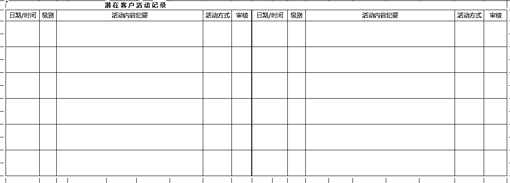

（  当然现在有SAAS工具可以代替，但是对于大客户或者O基础上手，我更喜欢这种简单直接以及培养团队系统思维方式  ）

下篇：业绩增长

七种卡片运营步骤：

（方便阅读，暂把潜在客户档案卡为X卡，期间跟进记录为Y卡，姓式首字母卡为Z卡）1、完善潜在客户档案 X卡

2、把相同姓式的X卡简单信息登记在Y卡，并在Y卡上写下X卡的每次回访日期，上级检查和自检

 

 

3、记录了不同姓式Y卡，分别放在对应的Z卡后，方便销售下次登记日期和管理，以及上级检查

4、把不同日期得X卡，按根据级别定的下一次回访时间，放入对应的年月周日卡后面5、每到一个日期，销售只需抽出当日的X卡，进行客情回访、定级别、成交，同时完善X卡、Y卡，和调整下次回访的日期卡位置

这里着重要讲“六大成交级别、潜在客户档案卡完善和记录”，因为这才是0基础上手并且快速增长业绩的关键！

下图是两张卡片正面，分别是驾校客户档案卡，汽车客户档案卡，从下面卡片可以看到基本的客户背调都有，不知道问什么，按上面做就可以了，有了背调才能更好地开展客情，更有利于成交。

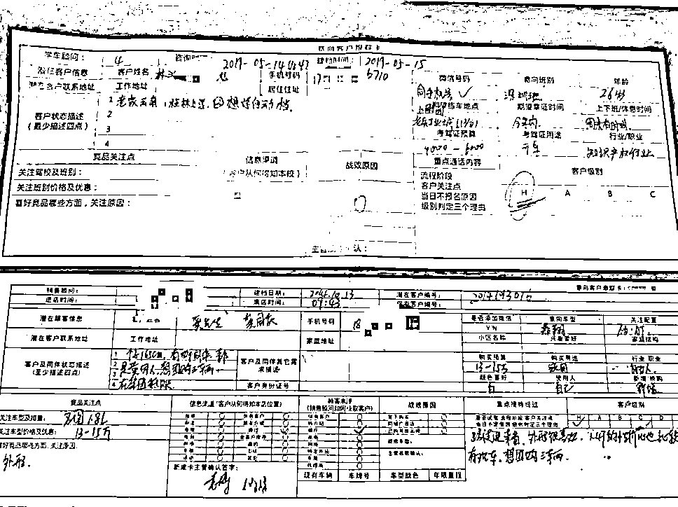

 

 

下图是两张卡片的背面，分别是驾校客户档案卡，汽车客户档案卡，对应的分别是日期时间—级别—活动内容纪要，

日期时间：根据级别定的下次回访时间；  活动内容纪要：本次活动（电话见面网络等）具体情况记录，方便下次回访拉进距离，同时防止员工离职损失客户；

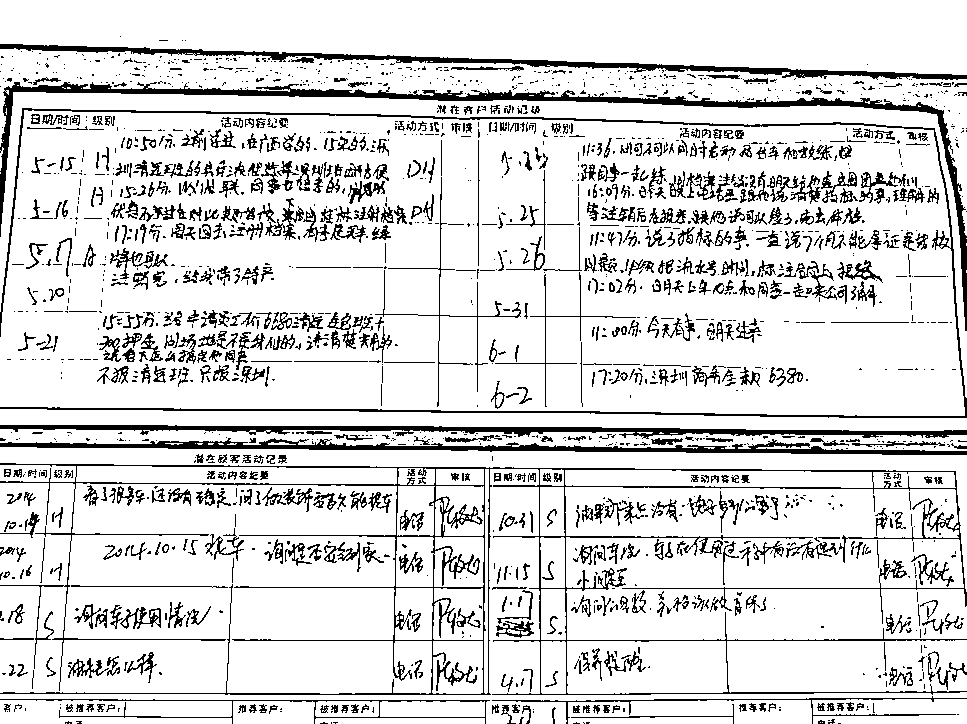

级别：根据每次的回访内容来定级别，如果拿不准就定的高一点，日期近一点，防止丢单

 

 

H级别：3天内成交客户，我要求1天回访一次，甚至一天不同形式回访多次，要见钱了！

A级别：7天内要成交客户，只比H级别意向稍微弱点，但是也要成交了，我要求间隔1~2天回访一次，不可以丢单！

B级别：15天内成交客户，这种一般就是很犹豫，或者有意向但是不是很急的客户，间隔3~5天回访一次，时刻把握客户动态

C级别：25天内成交客户，这种就是打酱油的，不急但是以后会买单的客户，10~15天回访一次，转介绍+长久战

O级别：已成交客户，待加深感情联系，已经付过钱的客户，先服务好当下，同时发展转介绍

S级别：已成交并且建立感情基础、后续增大LTV，这种很简单，当朋友相处就可以了。

如果是公司，可以快速打造出SOP的强销售团队；如果是个人，直接套用，提高效率，快速增长业绩！

以上就是我做销售、创业以及代运营，这8年来业绩增长的核心秘诀，毫无保留的分享给各位生财朋友。

感谢生财有术！我们一起生财！

评论区：

老黄 : 从凌晨3点写到早上7点，新的一天，一起生财！

柴大大 : [强][强][强]

亦仁 : 这套工具厉害，值得学习[强]

you raise * : 有时候一篇文章就值星球门票

闫小林 : 南哥好厉害，看了一遍文章，有点没看明白，收藏起来，细细拜读， 

 

销售我觉得是人人都需要学习的技能。

成义 : 学习到了，感谢分享

富饶大地 : 厉害👍学习了

老黄 : 谢谢

# 【朋友圈运营】**7**篇

# **# ****(**精华帖**)(172**赞**)**如何写出既能吸金、又能深

# 入人心的心金文案

作者：  李思念

日期：2023-01-10

《如何写出既能吸金、又能深入人心的心金文案》

大家好，我是李思念，是一名9年的创业老玩家。

我身上被人广为记忆的个人IP标签中，首当其冲的应该就是我的文案力。朋友圈坚持更新，累计输出百万字，写的文案在微商圈/创业圈疯狂传播，在小红书上也通过文案吸粉无数，变现超过7位数。

我有时候会觉得，文案，它真的是一个逆天改命的武器。

当你开始亲自原创文案时，你会发现，自己学会了在字里行间思考，自己慢慢拥有了核心思想，这种思想，通过文案的传播，吸引、影响、感染了更多同频的人。

而这种影响力，也反之加持了你的个人IP，会直接作用于你的事业成绩。

写作多时，去年我给我的文案风格，终于敲定了一个名字，叫做「心金文案」，寓意是既能吸金、又能深入人心的文案。

文案不同于文章，文案本身就带有一层商业变现属性，所以能够吸金才是关键，而文案又需要蕴藏感情、给人能带来触动，所以深入人心的写法，也是必要。

那么接下来就来分享下，我是如何写出既能吸金、又能深入人心的心金文案的。

 

 

全篇将分为以下四部分：

一、写文案前的3重思考

二、文案写作的道与术

三、写作方法论

四、如何培养文案持续输出能力

欢迎大家移步飞书详细阅读

→https://b80fa9wrsf.feishu.cn/docx/JPRAdLgGFowUE7xargGc8YNjnzh评论区：

安可果儿 : 感谢分享

Aimmon : 用文案生成工具吗

李思念 : 自己写文案的。工具能拼凑字词，但永远替代不了思维。

Aimmon : 厉害了

小花 : 先赞后看，感谢大佬分享

Benjamin : 学习了

冰点 : 硬实力

陈真 : 想看看你朋友圈文案[呲牙]

# **# ****(**精华帖**)(134**赞**)26**种原因：别人为什么要转

# 发你的海报到朋友圈？

作者： V先生

日期：2019-05-18

26种原因：别人为什么要转发你的海报到朋友圈？

新媒体专栏  营销  思路分享

01、铁粉：有人是你铁杆粉丝，你搞事，人家什么不说，直接支持。当然，首先要让他们知道这个事，比如公众号推送、微信群公告。这一类铁杆粉丝往往来自于内容，包括文章、书、摄影作品、绘画、视频。

 

 

02、产品发烧友：也许你个人不是那么有名，但是做的产品好，无论质量、功能、设计、运营，给用户优质体验，有一些用户就成为“发烧友”，到处推荐。这一类粉丝不是冲着人，而是冲着产品去的。

比如实体产品，我以前就推荐过德国灯塔的手帐、猫王音箱、乐高积木等产品给周围朋友；在知识类产品这块，梁宁的产品课、生财有术星球也让我放心推荐。

03、捆绑：你和这个海报宣传的产品、课程、活动、项目有关，最直接的关系就是这是你的产品，当然你要转发；此外，如果你的身份是合伙人、团队、嘉宾、讲师、代理，一般也会转发，因为利益捆绑。

04、强关系：私聊要好的朋友，发红包，请人帮转。强关系就是需要互相麻烦，不过次数不要多，关键时刻用，不然次数多了朋友也难做。

05、人情：你和有人吃过饭、送过礼、或者帮助过对方，人家要还一个人情。人情这一类指的是有见过过打过交道，但还没到强关系的程度。

06、回转：别人搞事时，你转发过对方的文案或海报，你搞事，别人回馈。这其实也是人情的一种，因为许多网上认识的人，并没有线下见过面，所以回转一下情况比较多，所以单独列出来。

07、信任：在你自己的群里，发红包，请帮转。这是你自己的群，通过一段时间的运营、交流，已经建立了足够的信任。

08、红包：在别人的群里，你在里面互动比较多、或经常提供有价值信息、或经常发红包，请帮转。这种最好做得巧妙一些，由群里的另一个人把你海报发进群，然后你说几句这是干嘛的，发个红包，这样群主也不会觉得难为。

09、KOL：在别人的群里，你和群主关系特别好，群主出面助推。

10、朋友圈话术：在朋友圈发海报时，加几句话术引导，请人求转。话术中可以加一句，帮转的每个人私发一个红包。

11、面子：群发消息，这种我不喜欢，但有些人还是会做，并且也确实会有人碍于面子给他转发。

12、投放：选定几个在朋友圈有些影响力的人，直接问发朋友圈的报价，投放广告，拿钱办事，两不相欠（一般价格在500~1000之间）。

13、赚钱：设置分销，这种可以让人自发转发。

 

 

14、虚荣：在分销之外，还可以加上分销排行榜、前几名有大礼包或者发勋章，物质激励和荣誉激励相结合。

15、省钱：不设分销，但设置其他利益点，比如转发可得优惠券、转发可减价100元、拼团、砍价。这些利益点都和价格相关，当然还有一些价格之外的利益点。

16、资料包：转发海报，并截图发送公众号后台或小助手微信，可以得到资料包。

17、进群：转发海报才能邀请进分享群或课程群。

18、升级：老群里的人转发海报，可以进新的升级群；或者老群里的人转发海报，可一带一个或多个朋友进群。

19、炫耀：个性化生成海报，转发朋友圈来炫耀，比如之前在朋友圈刷屏的军装照、能力雷达图、面相研究院的面相解读报告、网易出的第五人格报告。

20、解锁：还有一类报告，通常是性格测试类，只有转发海报才解锁报告。

21、从众：办线下活动，建一个对应的线上群，这个时候，趁热打铁，有什么需要助推的可以在这个时候做，不然一旦热度消退，再激活都难。如果群里助推的人不够多，可以设置几个托。

22、求胜：在线下活动中，让现场参加活动的人转发海报到朋友圈集赞，可以是选单个人前几名，也可以分组PK，然后发奖。

23、集赞福利：单纯的转发集赞，满多少个赞送福利，一些餐饮店喜欢搞这个，集赞送一份菜，或者减免几十块钱，或者送一张优惠券。

24、分享新奇：这种不是为了炫耀你自己，单纯觉得新鲜、好玩、炫酷，想分享给朋友。比如故宫出口红时、腾讯办创意大会做了h5时，我就单纯觉得酷而分享。

25、价值观共鸣：这种海报上的文案写得好，比如奥美的《我害怕阅读的人》、一首短诗如海子的《面朝大海春暖花开》、一段励志的话（NBA的宣传片就经常出这样经典励志文案）、有故事的金句（网易云音乐评论区有好多）、三行诗，引起和一些人的共鸣，让人忍不住想转朋友圈，为他的价值观代言。

26、图个吉利：转发锦鲤、平安符、财神图、考试通过之类的海报，上面有图、符、话，保发财保顺利保平安，让人求个心安。

——

 

 

以上这些，来自我的经验总结，不一定对，供星友们参考。如果觉得哪一条对你有用，可以去试一试。

这篇帖子说的，仅限于“海报”，如果是公众号文章，或者海报放在公众号文章里，那还有更多的玩法。以后再细说。

这些经验怎么总结出来的呢？不是来自书，也不是来自课，你只需要翻翻朋友圈和群聊，然后问自己两个问题，就可以从你的经历中挖掘出来：

1、你之前推产品、搞活动时，别人都是为什么转发你的海报？列出12345 2、别人之前推产品、搞活动时，你为什么要转发他们的海报？列出12345人同此心，心同此理。把人看作一颗洋葱，人与人的区别，越往里面剥，差异就越小。

你越了解自己，也就越容易了解别人。所以，老子在《道德经》说：知人者智，自知者明。

——

社群运营的秘诀，其实就20句话

👉

再小的个体，也可以从0到1，打造出你的个人品牌

👉

12个步骤：如何做出一门体系化网课？

👉

个人品牌：30个增加知名度的宣传方法

👉

四问四答：打造个人品牌和做社群，你不一定要成为完美的高手才能开始

👉

从杜子建的一张课程海报，学到了十点启发

👉

这里有60个做抖音的思路，你可能用得着

👉

 

 

最会赚钱的一帮人，给了我20条启发

👉

——

Written by：V先生

ChangeLog：20190518

——

点赞这篇帖子，保佑老板们发财

~https://t.zsxq.com/EimAaEA https://t.zsxq.com/jiEa2zj https://t.zsxq.com/UNNByFi https://t.zsxq.com/2vjQnuj https://t.zsxq.com/UFUnUb6 https://t.zsxq.com/VrfmU7A https://t.zsxq.com/zr7QJqV https://t.zsxq.com/FamEiur

评论区：

 

 

武冬青｜摄影 : 赞👍很全面，点赞打赏分享收藏学习运用一条龙

男宾 : 精髓！

森淼 : 一如既往优秀 [强][强][强]

瓜神 : 我V老师也开始跟着大潮流发美女图片了[憨笑][憨笑]

于洋 : 太细致了，赞[强]

V先生 : 谢谢冬青支持~[玫瑰][玫瑰]

V先生 : 厉害，抓住重点了

V先生 : 谢谢森淼老师 [呲牙]

# **# ****(**精华帖**)(127**赞**)**巧用「逻辑线」发圈法，让

# 用户越看越上瘾

作者：  李思念

日期：2023-03-31

生财的小伙伴们，大家好，我是这次朋友圈运营航海的教练李思念。

我是一名9年的创业者，也是清醒派个体创业导师，目前主要聚焦私域创业指导，擅长朋友圈文案、小红书引流获客、个人IP打造，帮助无数创业者完善从0到1的事业闭环，并且持续迭代升级商业模式。

很高兴今天能在生财朋友圈运营航海中跟大家进行分享，今天分享的主题，是关于我的一个独门策略——「逻辑线」发圈法。

在帮无数私域创业者诊断过朋友圈之后，我发现很多人有一个通病：会过于追求外在的「形」，而忽略了内在的「神」。

要么是朋友圈常乱发，要么是太重用发圈模板，很多模板化的发圈貌似美观，实则条与条之间的逻辑性不够强。

所以今天分享的重点，就是带大家学习逻辑，感受逻辑，朋友圈的魅力不止来源于每一条的精彩，也来源于整体的串联。希望今天的分享能帮你打造出充满吸引力的朋友圈，让用户越看你的圈越上瘾。

 

 

发圈一定要有规划性，但这个规划绝不是“几点什么时间发什么内容”，也不是按照什么样的字符模板格式去发，而是你要站在一个用户的角度，去思考怎么规划能让你的朋友圈更容易促成成交，以及更强烈地塑造你的个人IP。

顶级的规划，是站在用户视角浏览习惯的规划。你明白这个原理，才能塑造出来真正具有吸引力的朋友圈。一定是要让用户先看得过瘾，他才会顺着你的逻辑，产生购买欲，层层深入，才会下单。

举个例子，我帮一个学员改朋友圈，她本身的发法是：

看上去似乎规律，但其实非常刻板，千篇一律固定的内容，无新意，很快就会被人屏蔽。而且每一个板块是分裂的，没有一个连贯性，就无法让人持续上瘾的看下去。

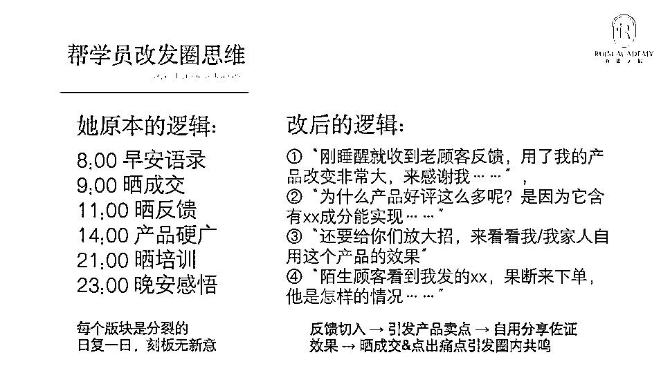

而我教她的方式是：

①先去掉所有时间节点，把一天要发的内容打散。

——让别人看到你每天的布局都是不同的，有新鲜感，才会对你的圈感兴趣。

②接下来，找到一条「逻辑线」串联起要发的内容。

「反馈切入-引发产品卖点-自用分享进一步佐证效果-晒成交&点出痛点引发圈内共鸣」，这就是一条简单的小逻辑线，成功串起来了4条朋友圈，而且如同讲故事一般，循序渐进的展开了。

 

 

③再在圈里加上一些出其不意的灵感性内容，比如你的生活故事、你的突发奇想、你看到一个新闻引发的观点，让你的圈整体灵活生动起来。

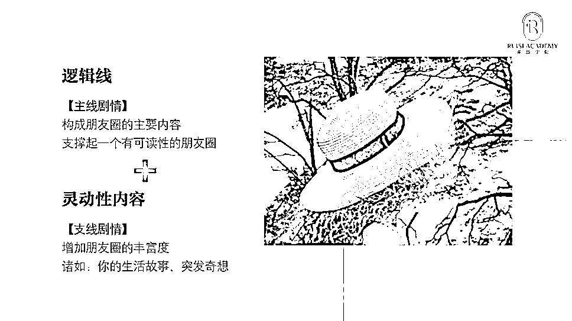

所以大家会发现，逻辑线发圈，其实是你需要先找到一根线，去把一个或者多个事件串联起来，按照一定的逻辑呈现，就像电视剧的展开一样。

那电视剧也有主线剧情和支线剧情，所以我们发圈也是，不能只发主线，也要有些其他的生活穿插，也就是在串联之后，再加一些灵动性内容的点缀，就会让你的圈变得多彩。

在之前的生财精华帖里，我曾经给大家讲过连续剧式发圈，大家发现是不是有点像，这里为了避免大家概念混淆，要给大家讲一讲区别。

（精华帖指路 大家也可以看一下这篇文章，学习下自动成交型朋友圈。）

连续剧式发圈是什么呢？是可以在朋友圈里进行一个连续剧式的内容连载，比如记录一个顾客来你这里购买产品的过程，你就可以分几个时间段儿去分别的记录：

第一条是晒成交，是这个顾客小A他成交了这个产品；半个月后呢，再说小A收到了这个产品，试用后觉得效果不错，来给了你一个反馈；再过一个月之后，又来复购；再过两个月，觉得产品不错而且还能赚钱，于是来做你的代理。

大家发现了，这个连续剧式发圈，它是跳跃性的，可能遍布在【不同时间节点】的朋友圈里，但是从时间的长河上看，它是一个连贯的剧情。这就和我们去看视频平台的电视剧，它可能是每周末固定更新新的剧集一样。

 

 

而逻辑线发圈是什么呢，是强调我们【每一天】的朋友圈的整体逻辑性。是为了让你的朋友圈提升可读性，让用户看你每天的朋友圈，都看得入迷。每天都有每天的逻辑线，每天都有每天的精彩。

连续剧式发圈：不同时间节点的朋友圈剧情连载

逻辑线发圈：一天内朋友圈条与条之间的逻辑串联

所以从这个点我们可以得知：这个逻辑线，它绝对不是说一成不变的，每天是可以有不同的逻辑线的。

所以你每天发圈前，需要想想，今天的「逻辑线」要围绕什么【目的】去展开呢？

比如说今天你的品牌有一个活动，这个活动呢可能是需要你集中力量去推一款爆品。那么，去宣传透彻这个爆品，就是你今天最主要的目的，那你今天的朋友圈，就得围绕这个爆品去设计一个逻辑线了。

接下来我们讲讲该如何设计逻辑线？

逻辑线是可以用在很多的场景之上的：比如产品宣传、事件宣传，先铺垫再层层推进；

比如晒反馈、晒成果，让用户被你的反馈深深吸引，越看越感觉被戳到了痛点，忍不住也想下单；比如讲一个观点，可以顺着这个观点引导到你的产品上，让用户深刻感知到你产品的好，等等。

那么这里我拿我朋友圈，给大家举几个例子。

①

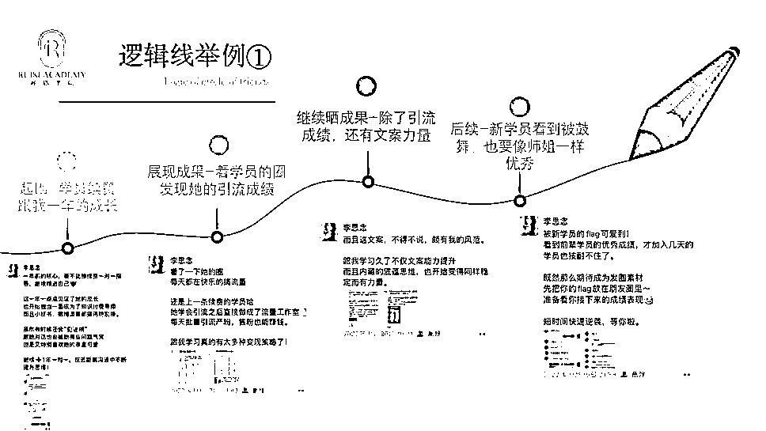

 

 

第一个，属于一个反馈型事件，是先发生了「学员续费」这件事，这名学员是跟了我一年，一步步陪伴她的成长，然后今天选择了续费。

接着逻辑线就要展开讲讲她怎么成长的了，这里属于一个成果展示：每天都在快乐的搞流量，而且还做成了流量工作室。

学员不止是学引流的，所以另一层的成果是她的文案进步，写的文案充满了力量感，这样就等于多方位、全面地展示学员成长。

这个发完了之后，其实我本身是没打算有后续的了，但是这种逻辑线朋友圈的好处是，非常吸引人，结果刚发完就有一个新学员来跟我说，“看到前辈学员的成绩被鼓舞了，也要努力去做，争取被我晒出来”——于是我又发了最后一条。

这一天朋友圈的逻辑就是非常圆满的，既成功地宣传了我这里能够带学员做出来的成绩、又让大家感受到了我这边学员整体状态的积极性，会被这种向上的能量所感染。

这是我通常晒反馈的一大技巧，我晒反馈不是单独一条去晒的，而是像这样，把反馈形成一个事件去晒。有起因、有经过、有结果、有后续。

这个中间的过程，不要刻板，要根据具体情况来，如果当天有随机事件发生，这个事件恰好能跟你的主逻辑是连上的，那么就可以加上一起发。

②

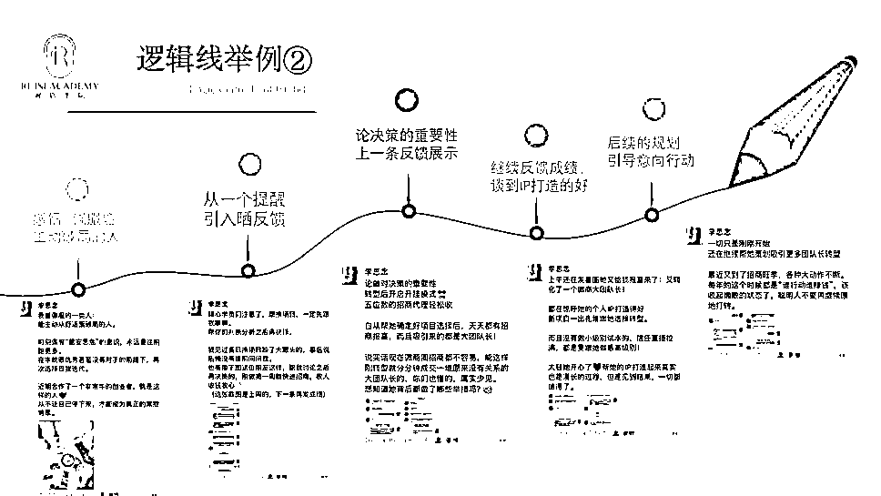

 

 

再比如这一天的朋友圈，我早晨是先发了一条自己的观点文案，说“最佩服能主动从舒适圈破局的人”，在写这一条文案的时候，我心里就已经定下了这一天的主逻辑线，是要讲一讲「主动的效果」。

接着，我发了一条圈，提醒学员遇到问题需要判断选择的时候，一定要多来找找我，然后从这一条，引入一位学员的成绩。

从这里开始，具体地阐述成绩，谈到我帮助这位学员敲定转型之后她的改变。

晒完这几条之后，我又提到，我还在继续帮这位学员做规划布局，到了招商的旺季，一定要行动起来。这里就扣回了这条逻辑线的主题，引导大家主动行动。

也就是说，我们去设计的逻辑线，一定是围绕着一个主旨的，然后在这个主旨之下，你可以通过各种案例去进行佐证，案例必须是真实并且紧扣主题的，层层递进，这样当用户看完你这一天的朋友圈，就仿佛看了一篇爽文，情绪就被拔高起来了，也会忍不住想要跃跃欲试。

③如果当天有一个重要事件，可以直接围绕事件展开朋友圈。

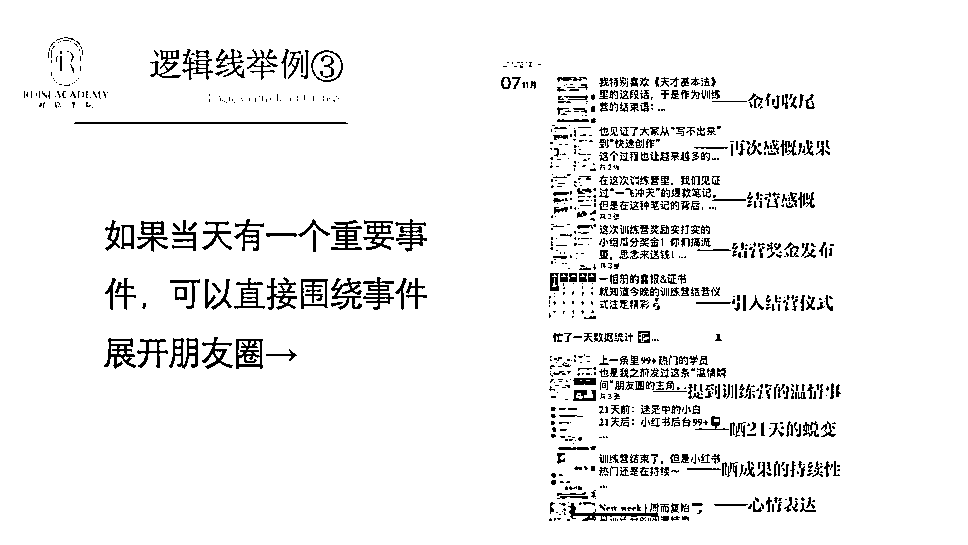

这个案例是我之前开的一个训练营结营那天的朋友圈。那天的圈发出去之后，无论是参与了还是没参与这次训练营的小伙伴，都看得很激动，都对下一次的训练营充满了兴趣，还有很多想要提前预定下一期的。这种促进成交的效果，也是可以通过朋友圈的营造实现的。

 

 

虽然结营仪式在晚上，但是要早早做起铺垫。所以早晨先进行了一次心情表达，说“训练营的结束，刚好是双十一周的开始，每一个运营节点都卡得刚刚好”，这样首先能让用户感受到我做事的规划性。

接着开始铺垫成绩：“训练营虽然结束了，小红书热门还是在继续”，这里是为了展示一个整体成果的持续性。然后再晒具体细分的成果，晒了其中一个学员，21天前和21天后的变化，从这一点就能体现出给学员带来的成长，而这个学员，正好还是之前发生的训练营温情事件的主角之一，这样一下子就加深了大家对他的印象，既能体现真实性，又能体现温度。

到了晚上，引入结营仪式，满满的喜报和证书，一张截图发出来，哪怕没参与训练营的朋友，也能感受到今天这里有大事发生，成功勾起来受众的好奇心。然后宣布了不仅有奖励还有奖金，这是属于营造惊喜，到这里把大家的情绪引向了一个高潮。

最后是发表我对训练营的感慨，感慨大家做出成绩背后的不易，是大家的坚持努力和训练营共同的结果，这是比较低调的一种表达，因为我也不喜欢那种疯狂晒成绩很自嗨式的发法。咱们做事的时候，记得一定要让你的圈子好友感受到你的态度，这样才会有同频的人愿意来学习，因为价值观而吸引来的人粘性往往是更高的。

在感慨的结尾，还引用了当时比较火的一个电视剧，《天才基本法》里的一段金句，作为那一天朋友圈的收尾，一下子就把朋友圈的高度拉上来了。

等于既能结合热点时事，又能表达态度，给大家一种内心燃起的感觉。

所以大家发现了吗？虽然是围绕事件去展开发圈，但本质还是得想明白主旨。

咱们是要去单纯地发一个结营仪式吗？其实不是的，训练营都结束了，宣传结营仪式还有什么意义呀？之所以我要构建逻辑线去用心地宣传结营仪式，最终的目的其实是想让更多的朋友被成果、温度所吸引，所以通过这一天的圈，就有很多人迫不及待想参与下一次我的训练营。

所以，这个逻辑线其实是，「围绕结营仪式宣传我训练营的效果」。

发圈不止是为了此时此刻的成交，也是为了铺垫未来的成交。

④逻辑线一定要长吗？不一定的。

逻辑线可长可短，短则2条，长则多条。

有时候你写不出那么多条，也觉得没必要写那么多条，能不能贯彻逻辑线呢？

也是可以的，你能表达清晰才是最重要的。

 

 

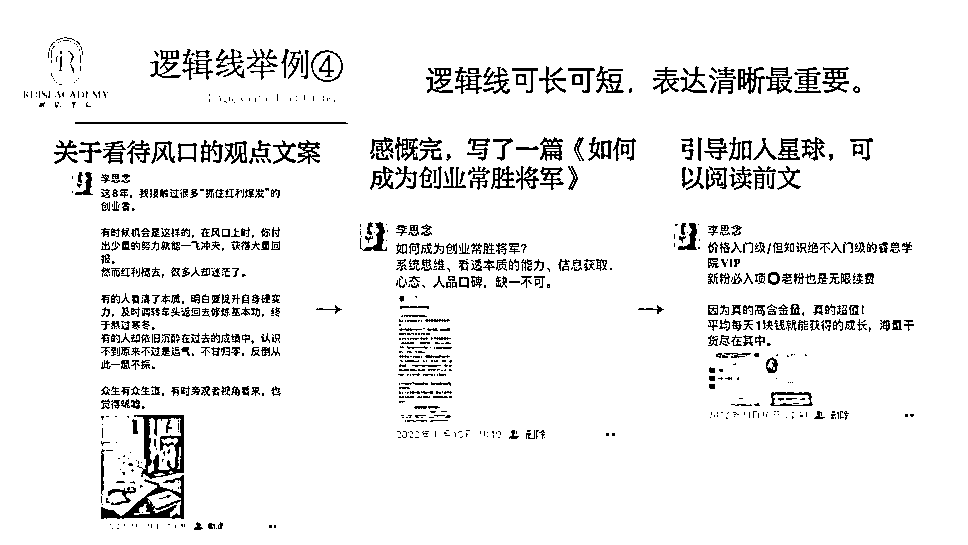

这里再举一个例子，我用3条文案，就完成了一个「引导大家付费我的星球」的逻辑线。

首先，我是写了一条关于看待风口上的创业者的观点文案，就是说“很多人在风口时赚到了，但是红利褪去之后却迷茫了，沉浸在过去的成绩中，结果最后什么都没有”。然后这条文案当时获得了非常多的点赞，能感受到，有很多创业者是有共鸣的。

于是我就趁热打铁，赶紧围绕这个主题写了一篇《如何成为创业常胜将军》的文章，这篇文章是发布在我的星球上的，需要付费才能看到，所以我会先发一条关于文章半屏截图的朋友圈，这是一种间接引导付费的方式。之后再晒一个加入星球的成交订单，直接的引导付费。

观点文案+提供价值间接引导+宣传产品直接引导，这个小逻辑线非常简单，大家在宣传自己的产品的时候都可以用起来。

想在朋友圈引导成交，千万别直接硬生生的去发广告，你不先给别人价值，谁会被你吸引呢，对不对？比如你有什么产品，你可以先围绕着这个产品相关的某个知识点去写写，比如你是卖减肥产品的，你可以写写错误的减肥方法有哪些，再写写正确的减肥是怎样的，再引导到你这里是如何帮助用户去减肥的，最后提到你的产品，引导成交。

这种逻辑线还有很多很多，我特意不给大家总结太多的公式，是因为我从不认为发圈是一件模板化的事情，一旦你用某种发圈模板套用习惯了，就形成了思维定式，朋友圈再难产生新意，用户也会逐渐看腻。

 

 

发朋友圈是需要你每日随机应变的，不要试图去总结规律，因为你每天手中的发圈素材是灵动的，学会巧妙的组合才是王道。

就像拼积木一样，一堆积木能拼成各种不同的图案，呈现出不同的效果，这种朋友圈，你越发会越觉得有趣，也会给看的人带来惊喜感。

而内在永远有一条主线去串联着，这条主线就是你的发圈目的，就是你的逻辑线。

通过这种充满逻辑的布局，让你的朋友圈变得“越看越上瘾”。

而其他人根本摸索不透你的规律，只会觉得一个字——绝！

当然，在做逻辑线设计之前，有一个前提，就是修炼好发圈的基本功，先去写好每一条文案，让每一条文案充满吸引力，然后再进行逻辑串联。这方面在我们这次朋友圈航海的学习手册里，子冯老师也为大家进行了非常详细的讲解，大家一定要认真看、感悟不同类型朋友圈的发法。

然后最重要的——行动起来，做永远比想更重要，先行动，再调整。

这个过程中有任何遇到的问题，我们航海的教练们都会非常乐意为大家提供解答和帮助，所以趁着航海的机会，冲起来~ 一起运营好朋友圈，感受自动成交的魅力吧！

评论区：

A孟世扬 : 不错不错

李思念 : 谢谢[玫瑰]一起进步

momo : 围绕着一件事／一个观点，从各个不同的角度去切入，展现这件事的不同角度  非哥非也 : 如何链接？有课程吗

李思念 : 欢迎交流～微memor777

亦仁 : 感谢分享，已加精华。

精灵 : 我听过类似的营销课，你的更细致一点。有感想

Zcy : 优秀的朋友圈运营思路

# **# ****(**精华帖**)(123**赞**)**怎样提高朋友圈文案的质

# 量，从而达到不刷屏也能高效成交的目的

 

 

作者：  王一书丨王叔笔记

日期：2020-11-09

【实战经验分享：朋友圈不刷屏，如何高效成交？】

大家好，我是王一书，是一名自媒体人，原创公众号【王叔笔记】，专门分享我个人的创业经验与见解。

曾经营社交电商，做到了年入百万，靠这套朋友圈技巧，实现了在不刷屏的情况下，高效成交，口碑与业绩双丰收。

这篇文章，会把个人经验毫无保留地分享出来。

能帮你打开思路，或提供另一种赚钱的可能性，文章的价值就足够了。

01

与你无关的，都是广告；

与你有关的，才是分享。

首先你要知道什么是“广告”，什么是“分享”，很多人连这个概念都没有分清楚，发圈文案都是无脑照抄。

人都是厌恶广告的，但不厌恶你真诚的分享，这两者直接存在这一个微妙的分界线——是否与你有关。

举个简单的例子你就明白了，以下两条发圈文案，考一考你，哪条是广告，哪条是分享？

朋友圈A：

XX饭店全新升级，菜品丰富，实惠又好吃，5.1-5.7期间，均可享受8折优惠，欢迎新老顾客前来品尝。

（配图：三张饭店照片）

朋友圈B：

很早就被朋友推荐来这家店吃饭，这家的小龙虾简直是味道一绝，正好碰到五一期间还能打8折，超赞！

（配图：一张自己吃饭的照片，一张菜图，一张饭店全貌）

同样的信息点，哪条是广告，哪条是分享；哪条遭人厌，哪条效果好，应该高下立判。

 

 

这其中的分界线就是——是否与你有关。

你去迪士尼乐园玩发了朋友圈，会有人觉得你是在给迪士尼打广告么？

你买了新衣服发了朋友圈，会有人觉得你在给网店打广告么？

……

因为这都是跟你有关的东西，说白了，你朋友圈里的好友，更喜欢看发生在你身上的一切，他们关注的是你在做什么，在想什么……

回到实际项目中来，以王叔做的项目举例，公司也会提供发圈素材，但我从来不原文照抄，都会尽可能的先把它们变得与我有关。

比如公司两周年庆典，这是公司提供的素材：

（图一）

这是我改良后发的：

（图二）

并不是说公司的文案不好，公司必须站在更大的层面去给所有人提供素材，但我们作为个体，不能直接照抄照搬。

个体与个体之间，也无法照抄照搬。把我这条发到你的朋友圈，这当然就相当违和。

这就是专属于我的文案，因为它只与我有关系，这个项目坚持了2年，是发生在我身上真实的事。

还有很多素材就不举例了，明白核心的一点即可——打造个人品牌，与你无关的不要发。

02

只有真诚的分享，才能产生吸引力

打造个人品牌，前两年还是热词，到今年都已经是老生常谈了，这是所有以微信生态为根基的个体创业者，必须要走的一条路。

说的高端一点，叫打造个人品牌；

说的接地气一点，其实就是拉进与用户的距离。

 

 

无论是李佳琪，还是罗永浩，这些个人风格特别明显的网红，虽然没有什么歌曲、电影之类的代表作，但不妨碍他们受欢迎。

李佳琪能让大部分女性觉得，这是一个特别懂化妆的男闺蜜，他推荐的我都相信。

罗永浩能让大部分理工男觉得，这是一个特别幽默的哥们，他的相声我得去捧捧场。

能够形成成交，就是因为他们所做的努力，都是在极力拉进与用户的距离。

一旦距离近了，成交就更容易了。

这是大部分明星所不具备的。明星更多是接代言，突出品牌调性，而网红则是简单粗暴地带货。

能够拉近与用户的距离，很重要的一点——就是真诚分享。

真诚分享，就必须要与你有关。

李佳琪不管推荐什么，绝对不是直接念广告词，而是亲自试用，真诚分享自己的感受。

只有真诚分享，才能产生吸引力。

也只有真诚分享，才能形成个人品牌。

朋友圈的主要作用，就是制造吸引力，打造个人品牌。

03

微信生态里最好的成交手段——社群与长文案

能看到这里，你应该很好奇——分享我学会了，但朋友圈光有吸引力还不够啊，怎么赚钱呢？

光有吸引力当然不够，但朋友圈不是直接变现的地方，至少在我的玩法里不是。

我发的每条朋友圈，最终都会指向一个目标——进社群，或者与我私聊。

（图三）

社群的重要性不言而喻了，在朋友圈不方便发的，社群都可以尽情分享，可以开课，可以做活动，可以发福利……

学会了怎么做社群，你的变现能力会提升10倍不止。

大部分时候，成交的过程还有一个环节——长文案。

 

 

文案的黄金法则——短文案吸引，长文案成交。

朋友圈的字数限制，注定了只能用来发挥“吸引”的功能，想要成交，必须要依赖于长文案。

打个比方，短文案就像商品首图，长文案就像商品详情页。首图决定了我是否点进来，详情页决定了我是否购买。

举个例子，还是2周年庆典的故事：

（图四）

我的大部分朋友圈，评论区都会放一个长文案，让别人更进一步的了解。

如果他被我分享的故事所吸引，肯定想更进一步了解我在做什么，以及做的怎么样，这是正常的思维逻辑。

如果连吸引都没有，直接就是广告刷屏，想表达得越多，越弄巧成拙。

前端吸引靠朋友圈，后端变现靠社群与长文案，让微信的功能各司其职，团结起来，更能发挥巨大威力。

04

刷屏与不刷屏，无分高低，都可以赚钱

不刷屏的好处在于——可以通吃任何人。

不论你在哪里加的好友，主动加人也好，被动引流也罢，都可以被具有个人魅力的朋友圈所吸引。

朋友圈是精心包装过的，发力点都在吸引上，而不是一上来就想成交。

很多人通过免费送xx，被动加了一些人，但朋友圈刷屏的广告，毫无个人品牌可言。

大部分人都是领完礼品就删，留存率极低。这显然是非常失败的，朋友圈留不住人，引流永远是无底洞。

我这套运营思路，不仅不会让人反感，反而能吸引住人。

完成吸引之后，进一步通过长文案、通过社群运营，促成转化。

从偶然认识，到朋友圈吸引，到深度了解、成交。

 

 

以上就是我在微信变现的操作思路，即便朋友圈不刷屏，不发广告，也能拥有不错的收入。

其实这几年我一直在好奇，我也经常接触到一些很赚钱的同行，其中不少人的朋友圈，都是每天刷屏十几条。

甚至有人主张应该多发朋友圈，一天30条起，通过刷屏来筛选目标人群。

在我的认知里，刷屏应该是遭人反感的；但实际结果却告诉我，刷屏也是能赚钱的。

所以我在写这篇文章之前，其实非常纠结，毕竟刷屏或者不刷屏，真的没有标准答案，也无高低之分。

但转念一想，也许我的操作思路，能给那些不喜欢刷屏的人，提供一个新的方向，赚钱并不一定要用自己不喜欢的方法。王叔就不刷屏，但丝毫不妨碍他赚钱。

如果业内还没有人主张不刷屏，那就让我来开个头吧。

最后总结一下：

①朋友圈是否是广告，取决与是否与你有关，是否在真诚分享。

②朋友圈主要目的吸引与培养信任；成交则需要社群与长文案。

条条大路通罗马，不刷屏这条路，我已经帮你走通了。

能帮你打开新的思路，或提供另一种赚钱的可能性，这篇文章的价值就足够了。

 

 

https://mp.weixin.qq.com/s/Kos9cIR1xoRzVyjLarwcsw

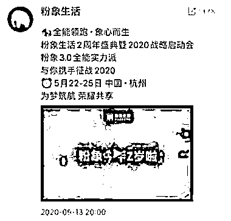 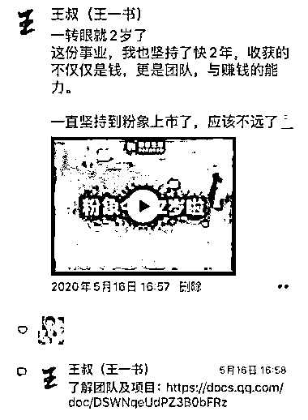

 

 

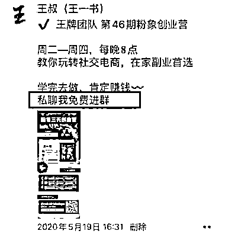 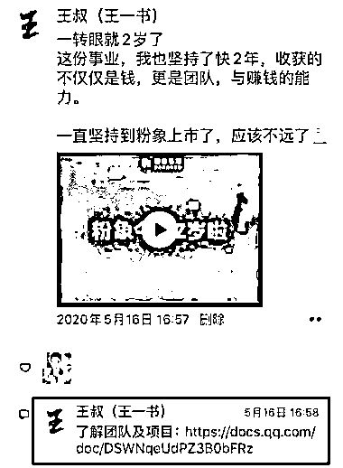

 

 

评论区：

王一书丨王叔笔记 : 欢迎与各位大佬交流[抱拳]

天枢 : 王叔[得意]

王一书丨王叔笔记 : 你也在[呲牙]

唐葫芦 : 不错不错

心理諮詢師 - 根源 : 先被标题吸引进来了，先点再赞在看

vince : 优秀

王一书丨王叔笔记 : 好习惯[得意]

王一书丨王叔笔记 : [握手]

# **# ****(**精华帖**)(116**赞**)**我是如何在**30**天内用朋友圈

# 剧本＋快闪群成交，给我的新舞蹈室赚了**6**万块

# 钱的？

作者：  芷蓝

日期：2020-11-18

龙珠  复个盘！我是如何在30天内用朋友圈剧本＋快闪群成交，给我的新舞蹈室赚了6万块钱的？

有个美丽的姑娘曾经说过，一切线上的教程和方法，如果能在线下被玩上一遍，都是值得喝彩的。没错，我就是那个美丽的姑娘！

好啦，不开玩笑了，今天芷蓝给大家分享一些新店开业的引流和营销技巧，希望可以帮助到做线下实店的朋友。

先简单说下我的情况，之前与朋友合作经营了2家舞蹈室，我属于投资者，不参与运营。

虽然年利润还可以，但我总觉得不过瘾，毕竟自己是做线上社群运营的，于是决定自己独立开一家舞蹈室。

我属于说干就干的人，9月下旬开始找商铺，选址过程就不细说了，反正26号搞定了一切手续，拿到了钥匙。从这一天开始，就要正式进入我的朋友圈营销了！

 

 

一  朋友圈3＋1剧本

1 一个调查

当你打算推出一个新的课程、服务或者任何商品，千万不要直接在朋友圈发布，因为用户不喜欢被【告知】那样会感觉自己被强推了广告，尤其是在朋友圈是这样一个私密的社交平台。你要尽可能一步一步地把用户带进你的营销场景，让用户感觉自己参与了你产品的整个制作流程。

所以，当我租下舞蹈的第一天，就在朋友圈发起了一个小调查。（图1）

征求了大家关于舞蹈室装修等事情，评论区大家回复很快，还有人咨询了一些课程的问题，并给出了自己的意见。

这里顺便跟大家分享个朋友圈营销技巧，就是多用问题跟好友互动！

例如你今天要去做演讲，可以询问大家穿什么衣服比较好，再比如你做产品，也可以针对某一个功能交互，让用户帮你做个参考等等。这样做的目的，一个是让用户能关注到你，另外借此机会也能体现你的技能专业度和业务水平。

但有一点需注意，最好是给用户出选择题，尽量不要设置开放性问题，用户的参与度会降低。

2 产品剧透

当你做完小调查几天后，就可以在朋友圈里陆续为大家透露一些新产品的细节。

注意！一定要让用户感受到你很重视他们的意见，这样能够有效地增加用户的参与感，未来你在向他们销售产品的时，他们才不会反感。这个套路大家应该很熟悉，小米当初进入手机市场时，就是给产品定位的【发烧友】这个关键词，才锁定了第一批种子用户。

所以，我在朋友圈陆续发了一些内容，比如公布了大家的主要需求，比如为了设计好课程体系，专门飞到深圳去请教行业里的一些牛人等等。

所有这一切，就是为了让用户看到你产品打造的过程，增强信任感。（图2）

顺便说下，很多在朋友圈卖货的朋友，都会强调自己的产品有多好，但是很少有人会把这个【好】字给展示出来。就像卖生财日历，如果你能把生财日历从0-1的过程给展示一下，例如团队怎么去筛选内容，怎么一次次的修改排版等等。

 

 

这个打造的过程，就是用户的信任增强器！这里顺便问下生财团队，不知道在做日历产品的时候，有没有留下一些影响记录，比如开会选内容，比如每一次的修改，比如产品经理的辛苦等等，如果能做出一个视频，还是不错的。

3 神秘福利

记住，我们做营销是有目的的，所有的流程，都是为了达成这个目的而设定。

我的目的很简单，就是在舞蹈室开业之前找到一批潜在用户，完成初期的种子裂变以及后期的意向转化。

所以，针对这个目的，我设计了一个开业大礼包，并提前在朋友圈【神秘】了一下，先吊起大家的好奇心并利用评论区和大家互动。（图3图4)

这里顺便再给大家分享一个朋友圈技巧！当你想在朋友圈做个营销活动，例如抽奖或者其它动作时，除了要提前一天预告，还要尽可能的让用户在评论区留言或者点赞。

为什么？因为只要他留言了，等活动开始时，你只需在评论区里回复你的活动信息（链接文字都可以）所有点赞和留言的同学就都能收到朋友圈提醒了。

这里有个重点，千万不要让用户回复复杂的内容，尽可能的降低用户的操作门槛，比如【扣1】只需要1秒就OK了，用户看着内容，顺手就操作了。

4 限定裂变

如果你前一天在朋友圈给大家挖了坑，第二天一定要马上填，时间一长用户的关注度就会降低，千万别学郭德纲老师。

所以，我第二天立刻扔出了我的神秘礼包＋预售海报。（图5）

这里要跟大家说下，海报里的几个重要元素。

首先“预付199元，直抵999元”的字体一定要大，这个用来锁定用户的注意力。

其次，要让用户看到价值亮点，也就是那个新店大礼包，我在文案里是用了现在知识付费最流行的权益合集方法。

通用句式就是199元=XXX（价值999元）＋XXX（价值XXXX元）＋XXX等等，让用户看到自己只需要花很少的钱，就能买到很多东西。

你不用担心用户是否会去琢磨那些东西到底值多少钱，只要让用户【觉得】很值就行了，并且占了你便宜就行了！

 

 

注意力和价值都有了，最后当然要“逼”一下用户了，全网通用的方法就是“限定名额”，目的就是在于让用户看到之后快速行动。

说到这里，大家可能会问，福利是有了，有成交吗？裂变又在哪呢？其实，之所以海报上不做裂变提示，也是为了减少用户路径，降低用户行动成本。裂变方法很简单，就是如果想获得大礼包，只需要把海报转发到朋友圈即可截图给我就就行。（图6图7）这里需要注意，针对一些非互联网用户群体，尽量不搞什么扫描回复关键词之类的复杂动作，因为你不知道用户群体是什么，比如我的这次活动，还有很多年龄偏大的用户购买，她们都是本地事业单位或者国企之类的员工，对互联网玩法了解的很少。

最终，当天一共有48个人购买这个199元的大礼包，收了1万多块钱，后面的几天也陆续有一些被裂变过来的人咨询购买，效果还可以吧。毕竟我的这个微信号都是本地的亲朋好友，也就200多人。

最有趣的是，有几个人一次性还购买了2个礼包，说是觉得特别值，给她朋友占个位置。

说明，这个海报本身还是有吸引力的。

到此为止，朋友圈3＋1剧本的营销动作就结束了，我基本也完成了自己的冷启动需求，最终一共积累了65个付费用户，这65个人，就是未来转化的目标。

二  快闪群成交

说到快闪群，做微信营销或者专注社群卖货的朋友，一定不会陌生。它的好处是周期短、易上手、效果好，其实就是利用优惠刺激＋情绪引导＋气氛烘托促使群内用户在短时间内成交的一种玩法。

不过，快闪群一般比较适合快消品或者知识付费产品的成交，我这次是打算卖舞蹈会员卡，心理也是没底。不过想想，社群运营就是一个试错的过程，谁也不敢保证每次操盘都成功，试试呗。

1 活动预告＋红包雨

之前预售卡活动结束后，购买的用户就开始陆续上课，我观察了数据，第一周大家的到店率还挺高。

11.8号（周日）我看了下时间，正好下周三是双11，而且当天上课的气氛很好，于是决定趁热打铁，就在今天晚上（周日）进行快闪销售，活动期限是从周日到下周三。

 

 

周日晚上6点左右，开始发活动预告，先告诉大家晚上9点有优惠活动和红包雨，让大家注意看群。到了时间后，直接开始连续发包。记住，红包不要太小，也不要太个数太多，确保能抢到的人有获得感，没抢到的人有期待感。

我在9点的时候，一开始连续发了5个红包，等待了几分钟，让群里没有看到的人都反应过来，继续又发了10个红包。这时候，一定要用小号引导大家把话题转移到优惠活动上面。（图8）

2 活动公布＋引导话题

本次活动我是采用了送礼品（筋膜枪）＋购卡打折的优惠，发完红包雨后，找小号引导出活动话题，就可以直接把优惠活动扔到群里了。（图9）

活动公布之后，大部分用户其实是沉默的，大家都在观察，卖货社群就是这样，需要有人第一个站出来引导情绪。所以，小号这个时候又该出场了。

一般情况下，你可以用2-3个小号，提出不同的问题，注意不要太刻意。而且，小号不能连续说话，A提出问题后，可以稍等一会，看有没有其它用户咨询，如果没有，等群主回答问题后，B再继续问。（见图9）

3 订单接龙

这里注意下，你的活动一定也要有限时和限量，否则你没办法在群里制造稀缺感，没有稀缺感，订单接龙这个动作就没意义了。

我这次活动公告是准备了10个筋膜枪，日期是限定在11.1之前，一共有2天半的时间留给用户。

当话题引导完后，如果有咨询付款的是最好了，如果没有，这个活儿还是得交给小号来做。提前准备好一个付款成功的截图晒到群里，然后群主就可以说“还剩XX个名额了，想要购买的朋友要抓紧了”。（见图9）

幸运的是，这次活动效果还行，可能是因为这一周大家过来上课的体验不错，又加上送筋膜枪和打折，直接就有2个人咨询付款了，我让付款的用户在群里晒下截图，大家也很配合。

结果当天晚上就有6个人办理了课时卡和年卡，第二天和11.11最后一天，又陆续有几个人办卡，当然筋膜枪我准备了很多，只要能付款的，聊一聊，我都会送。

 

 

好啦，到这就基本结束了。这个复盘一直想写，自己老是犯懒，总算是在今天弄完了，如果你正打算新开一间实体店，或者新店刚开业，都可以用这个方法试试。

只要有了冷启动的流量，配合后期的大众点评到店刷单（每个来舞蹈室的用户，我都让她们给我大众点评上刷一个体验课）效果还是不错的。

如果大家有什么问题，或者对新媒体营销以及私域流量变现感兴趣，欢迎链接我。我的VX 3154465626 记得备注知识星球。

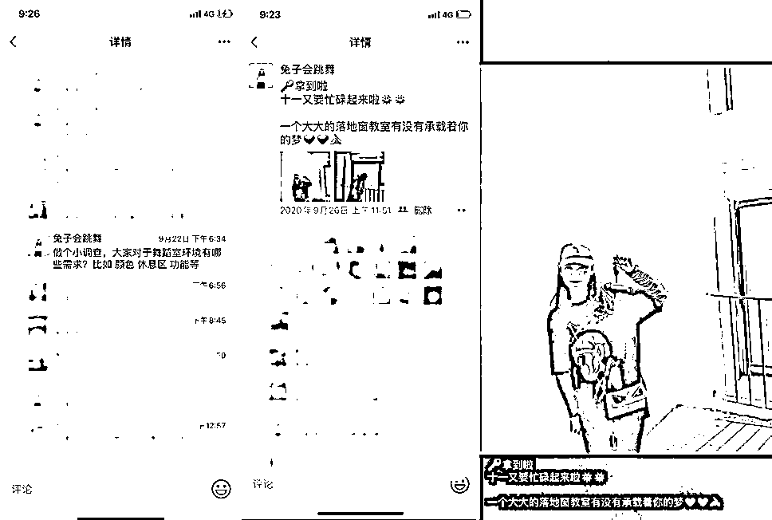 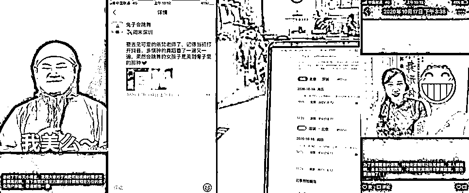

 

 

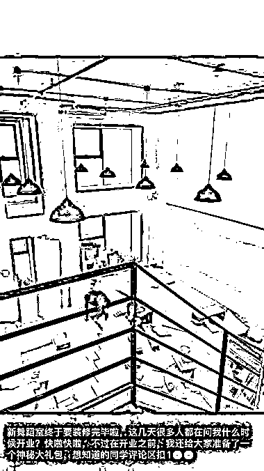 

 

 

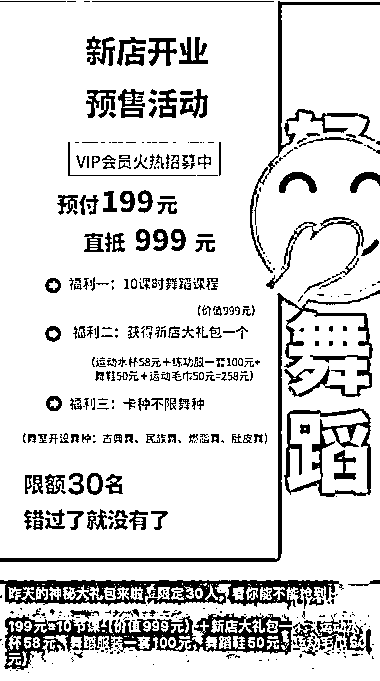

 

 

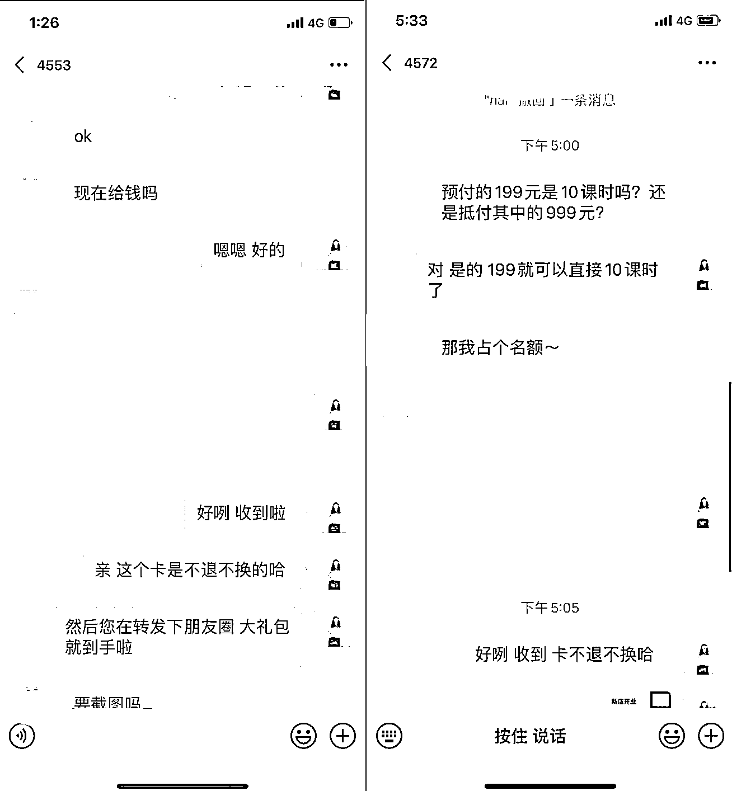

 

 

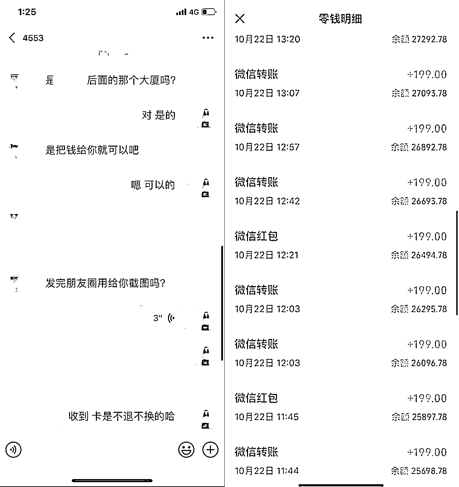

 

 

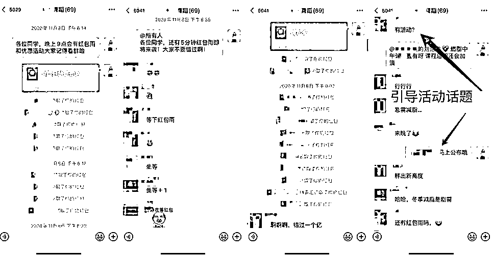 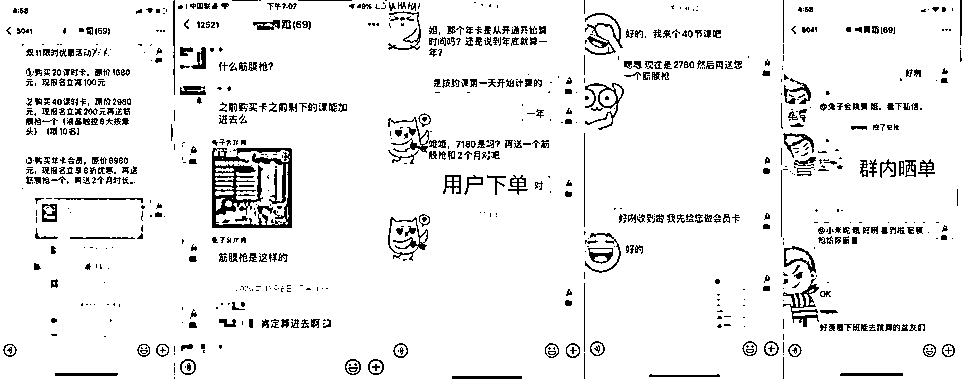

评论区：

阿润 Aaron : 学习了[强]

芷蓝 : 他哪是第二天忘了填…😂

兽医路 : 超级实用，真的是可以拿过来就用的那种。

今天看了紫菜的生财日历运作，知道有意思，但看完了，是懵懂以为可行。

但是看完您的了，觉得细化一下规则，把事往提前两三天弄一下。

基本我也是可以操作的。

感谢分享

芷蓝 : 哈哈，有用就好[愉快]

Vivi|每日成长 * : 虽然不在北京，但也好想去上一堂你的舞蹈课😂   

 

芷蓝 : 哈哈，欢迎来北京的时候过来玩，跳完舞，吃个火锅，顺便聊聊赚钱的事😄  Hope : 芷兰明目张胆的“勾搭”啊，哈哈

# **# ****(**精华帖**)(112**赞**)**如何打造自动成交的朋友圈

# 系统

作者：  李思念

日期：2022-10-21

《如何打造自动成交的朋友圈系统》

生财的小伙伴们，大家好，我是思念。

感谢生财团队静伟的邀请，让我有机会在这次垂类IP的航海中进行分享，在分享中成长，不断碰撞出更多的灵感。

这次我分享的主题是：打造自动成交的朋友圈系统

这套自动成交的方法，非常适合需要配合私域营销的朋友们，各行各业都适用。

如果你是本身流量做得好的高手，更得重视朋友圈的打造。

巨额流量+高效转化结合，相信会成为你事业强有力的助推剂。

分享目录如下：

一、自动成交的底层逻辑

二、通过文案力塑造个人IP

三、自动成交的朋友圈布局

四、朋友圈的发圈绝招

详情欢迎移步飞书阅读：

https://b80fa9wrsf.feishu.cn/docx/Eo9PdqcNJowSN8x9mPQcb3hFnKe评论区：

 

 

雷子 : 正缺这个呢，如何深入学习下

春秋 : 写的太好了！

诗农Hope : 手动666

邓煌弋丨蛋黄 : 今天正好学习了，很有收获~

亦仁 : 感谢分享，已加精华。

嘉嘉 : 写得太好了，收获特别大

# **# ****(**精华帖**)(104**赞**)**靠朋友圈精准营销，**6 **个月变

# 现** 14W+ **的实操方法

作者：  小鹿

日期：2023-07-06

从分销到有自己的定位和产品，靠朋友圈精准营销，6个月变现14w+的实操方法复盘大家好，见贴欢喜，我是生财圈友小鹿。

有幸在5月航海，受官方邀请在“朋友圈运营航海”船上，作为嘉宾分享“朋友圈广告这么发，用户不反感还想追着看”，给大家带来朋友圈广告的正确发法。

本篇分享，我将在此基础上，从朋友圈变现三步走，到朋友圈基本框架布局、故事发圈法、朋友圈文案万能写作模板、朋友圈广告怎么发、朋友圈防折叠小技巧等6方面。

全方位分享从分销到有自己的定位和产品，靠朋友圈精准营销，6个月变现14w+的实操技法。

为方便阅读，辛苦大家移步飞书：

感谢 @梁靠谱@理白  两位老师带我加入生财，感谢静伟老师、范磊领队、九儿老师的暖心引导，感谢理白教练、子冯教练、思念教练的无私分享，以及航海所有志愿者、工作人员的辛苦付出。感谢生财有术的邀请，让我能够有机会和大家分享我朋友圈变现的成长历程。

祝我们都能厚积薄发、生财有术。

https://bokm2adr1g.feishu.cn/docx/KzUMduAqLo5y21xgihUclePjnMe 

 

评论区：

清一 : 小鹿最棒！！！

是微光吖 : 吼！小鹿太棒了吧

小沫 : 好酷小鹿！朋友圈变现找小鹿！

凌心 : 终于等到你，感谢分享

小王子 : 小鹿最棒，一起生财有术

饭饭 : 小鹿厉害！

Andrew : 小鹿厉害 

理白 : 小鹿是朋友圈文案专家！

# 【自动化提效】**3**篇

# **# ****(**精华帖**)(242**赞**)**如何利用** RPA **实现自动化获

# 客，让项目提效躺赚？

作者：  子木（二哥）

日期：2022-05-16

大家好，我是二哥，加入生财好几年了。前高级技术专家 & 增长黑客，现一枚爱折腾的小小创业者，专注于 RPA & SaaS 软件这块。这次给大家带来如何利用 RPA 实现自动化获客一、**RPA **是什么？难吗？

RPA 对大家来说，可能挺陌生的，其实它很简单。

 

 

Robotic Process Automation（简称 RPA ）机器人流程自动化，是一种技术，是以软件机器人 + AI / OCR 等科技能力结合，在软件上的某些业务操作场景中，达到机器替人，实现重复的工作自动化。

RPA 通过模拟人在电脑、平板和手机上的操作方式，包括  Web 自动化、桌面软件自动化、手机 APP 自动化、鼠标键盘自动化等等，实现不需要人工，替人将操作流程自动化。

RPA 的应用场景是在线上的。类比线下机器人的场景。如图，在车间里的一位工程师，正在排查机械手臂的问题。

线下车间上的非主观决策工作，比如特斯拉造车，利用物理机器人（机械手臂）释放蓝领的生产力。那线上呢？软件上的非主观决策工作，可以利用软件机器人（通过 RPA 实现）释放白领的生产力。

软件上的非主观决策工作，有很多常用的场景，比如：

 

 

运营场景：运营的数据日报统计、运营的批量操作等等

客服场景：售后客服批量发消息、批量评价回复等等

办公场景：人事批量招聘、考勤统计、财务批量通知工资单等等

RPA 的应用场景有以下特征：

非主观判断

高频或单次工作量大

工作流程繁琐，机械，重复并且容易出错

任何行业、任何部门都有大量的场景，涉及重复、有规则逻辑的工作，都可以用** RPA **开发一个软件机器人帮助完成。

二、**RPA **自动化获客实战

同样，关于 RPA 这个技术可以在很多部门场景中实战，这里分享下在帮助朋友或者企业中，关于「获客」相关的实战案例。希望能给圈友们带来一点点启发，帮助圈友们利用** RPA **这个工具能够降低成本** & **提高发财的效率。

**2.1 **实战前准备

就像电脑上设计个海报，你用 PS 还是 Sketch 还是创可贴工具。同样设计一个 RPA 自动化机器人，跟之前大家玩过爬虫工具或按键精灵类似。RPA 工具推荐如下：

影刀 RPA：情景化教学课程非常适合小白。winrobot360.comuiBot：uibot.com.cn

 

 

阿里云 RPA：aliyun.com/product/codestore还有国外的 uiPath 等等

怕大家不知道链接，我已经给大家准备好了链接，方便你取用

任何东西就像学 PS 一样，初级玩家简单学一下，改个图片尺寸，P 个小图一样是很容易上手出结果的。RPA 工具上手也是这样的，简单学一下上手还是很快的：

像程序员背景或者经历的圈友，估计研究几天，完全轻松就能上手

像纯技术小白的圈友，推荐大家学习并使用影刀。我这边安排了一批 CS 的大学生，大概花了 2 周多一点的时间，每天花费 2 个小时左右，就能考出影刀 RPA 高级使用证书。并轻轻松松写一些 RPA 机器人。

以小白 & 影刀 RPA 为例，快速入门参考资料如下：

软件介绍&下载：

https://www.winrobot360.com/

软件使用教程

帮助中心：https://www.winrobot360.com/yddoc/课程学院：https://college.winrobot360.com/学好了大致的基本操作就基本够了，因为基本核心操作就可以让你搭建很多 RPA 机器人了，下面可以开始实战分享

**2.2 **自动化选品** - **电商选品

 

 

大家知道蓝海词选品，就是选蓝海词的流量，就是获客。举淘宝生意参谋来说，一般选品的流程：

在生意参谋上输入某个关键词：比如「女王的世界乳胶」

筛选时间、支付转化率、商城点击占比等筛选项

然后查看对应列表的数据

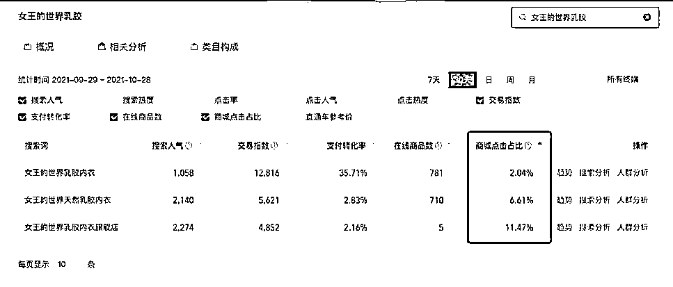

如图，生意参谋的「商城点击占比」只要低于 70% 左右的品，基本上都是蓝海品。然后看看支付转化率还可以，基本上确定这个品就可以做。

那如何用 RPA 实现自动化选品？分为两个步骤：

**1. ** 利用  影刀 RPA 等工具，搭建一个「生意参谋选品工具」数字化机器人**2. ** 开启这个程序，导入对应输入的词根列表（比如：乳胶、手套、温岭等），并预设「商城点击占比」最小值，「支付转化率」最小值。

**3. ** 运行 RPA 数字机器人，就会输出对应的「蓝海品表格」

 

 

蓝海品表格，包括了乳胶相关的蓝海品表格、手套相关的蓝海品表格、温岭相关的蓝海品表格等等

下一步就是人工去主观判断这个蓝海品适不适合做：包括有一定真实的流量，蓝海品稳定且足够蓝海，这样投资回报率指数足够高

同理可得，可以搭建更多的选品机器人：「亚马逊选品机器人」「抖音**-**考古加选品机器人」「抖音**-**抖查查选品机器人」等等

如图，就是词根「欧莱雅」，输出的抖音蓝海品「欧莱雅蓝海品表格」：

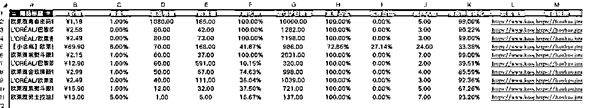

**2.3 **自动化获客** - **百度地图获客

一键轻松获取百度商家信息：

1、自动输入关键词

2、自动选择地区

3、自动选择数量

 

 

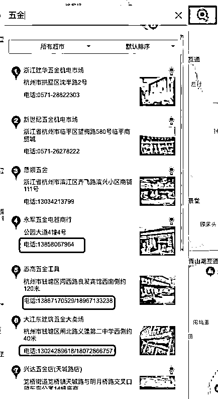

如图，运行「百度地图获客 RPA 机器人」，自动选择「杭州」城市，自动输入「五金」，最后自动输出对应的客户手机号。RPA 流程其实就是个输入和输出，你只要批量的输入城市列表、关键词列表，然后运行完后，输出的就是你想要的分好类的客户号码列表。

那怎么处理手机号呢？RPA 机器人也可以自动处理：

自动化清洗手机：过滤非手机号的类似 0571-xxx

自动补全客户信息：RPA 通过手机号用支付宝转账或者钉钉加好友，获取客户关键信息，并补全「客户名称」

最后输出到表格，然后配合「RPA 主动加人机器人」通过企业微信或者微信，自动化主动加人到微信，沉淀到私域做成交。

 

 

同理可得：

比如你想要「建材」公司老板的联系方式：通过「建材」行业的关键词，上企查查网站 RPA 自动化获客

比如你想要「服装」公司老板的联系方式：通过「服装」行业的关键词，上1688网站 RPA 自动化获客

**2.4 **获客思路拓展

根据每个商业模式不同，所需要的客群不同，想象一下客户画像，客户在哪？你去就哪里获客，先手工操作获客，后面让 RPA 助你一臂之力。

比如生财有术缺的是创业者伙伴（虽然不缺哈），那就可以去「企查查」平台，自动找到新注册的公司，并且实现自动化获客

比如卖电商软件的缺少的是电商客户，那就可以去「1688」等平台自动化获客比如卖制造企业生产过程执行管理软件，那就可以去「企查查」，通过关键词搜索对应的公司，实现自动化获客

等等

为了帮助大家拓展这块的思路，我思考了这个问题：用户是否可以拓展？比如在「企查查」通过词搜索获取电话号码？将三元素拆开：

「企查查」拓展出 -> 「微博主页」、「小红书主页」、「公众号主页」、「知乎个人首页」、「抖音主页」等等

「词搜索」拓展出 -> 「相关推荐」、「搜索词关联推荐」、「竞品粉丝列表」等等「电话号码」拓展出 -> 「微信号」、「QQ 号」、「微信二维码」、「群二维码」等等仅列出来的拓展项，就有很多种组合。  抽几个比较牛的组合看看：

 

 

通过相关推荐进入「小红书主页」，批量获取主页博主微信号

通过「公众号主页」，进入文章页面，批量获取号主微信二维码

等等

三、小结

还有很多大量的场景，涉及重复、有规则逻辑的工作，都可以用 RPA 开发一个数字化机器人帮助完成。比如：

店群运营的，需要 RPA 批量商品上下架机器人

图文内容运营的，需要 RPA 图文群发机器人，一键群发到各个图文平台：今日头条、知乎等

短视频内容运营的，需要 RPA 短视频群发机器人，一键群发到各个短视频平台：抖音、视频号、快手等

私域运营的，需要 RPA 微信群发&主动加人机器人

人事的，需要 Boss 直聘机器人：自动发送面试要求，自动发送问候语，自动交换微信等等

RPA 的目标：让人在机械的工作时间中解放出来，把时间留给做更有意义的事情。时间就是价值，那些机械的软件工作太多，通过招人解决，招人还有管人 & 发社保多累。

那就用 RPA 数字化人帮你解决，希望这次的分享能给圈友们在生财路上提高生财的速度，让团队的时间放在最重要的事情上。

最后，RPA 有什么问题，都可以找二哥一起交流学习，共同成长。共同富裕，一起生财有术 ~ 

 

评论区：

亦仁 : 一个合格的生财人思维是：rpa学不学不重要，重要的是如何赚rpa相关的钱，背后有哪些赚钱机会。

一个技能学不学不重要，重要的是是背后的赚钱机会有哪些，我不会某样技能，但不影响我能从中赚到钱。

子木（二哥） : 欢迎圈友评论多交流哈 [太阳][太阳]

阿愚呱呱RPA : 二哥666

子木（二哥） : [抱拳][抱拳] 呱呱一起 RPA 生财有术

林丁薇 : 在实际工作中很多场合都可以通过RPA，降本增效。

子木（二哥） : 是的哈  一把利剑看用在哪

Juge : 先赞后看，好运不断

子木（二哥） : 一起生财有术 ~

ted : rpa获取网页上的信息  是模拟键鼠操作？会被算作爬虫吗？

# **# ****(**精华帖**)(169**赞**)**每天稳定新增** 150+ **好友，用

# 技术让私域流量实现主动引流

作者：  乔帮主

日期：2023-02-16

任何生意的本质都是流量，搞定流量，赚钱就搞定了一大半，本文主要教你用技术怎么搞定私域流量。

大家好，我是乔帮主，一名互联网技术创业者，一直热衷于用技术探索商业价值。我做过黑客，写过代码，出过书，当过老师，干过阿里云技术总监，也创过业，擅长技术引流和技术搞钱，以及技术的成长和赋能！

 

 

1、私域主动添加，一个被大家容易忽视的引流方式

2、常见主动添加的5个业务场景

2.1、同城门店老板主动引流

2.2、抖音主播/创业粉主动引流

2.3、知识星球社群内引流（不推荐）

2.4、投资机构主动引流

2.5、各种微信群主动引流

2.6、总结

3、微信号采集（爬虫）技术的选型

加入生财两年多，平时一直潜水居多，今天起来冒个泡，跟大家分享一篇自己最近技术引流的实战内容，感谢生财**@**杨爽  对本文的一些宝贵建议。感谢**@**塔塔  对内容的一些探讨支持。

这也是我在生财分享的第一篇内容，希望对大家有所帮助！

读前须知：

1、本文主要是针对网页内容中爬取微信号（最为常见业务场景），再去批量自动添加，实现私域主动引流。本文主要从技术角度探讨可行性，提供给大家一个技术主动引流的解决方案参考。

2、由于采集微信号和自动添加技术还是有点敏感（其实这种采集公开的联系方式是没啥问题的，但在微信公众号里面发布采集微信号相应内容，直接被系统判定为违法内容），请大家自行遵守平台及我们生财社群的规则，避免触犯平台和社群规则被拉黑、被封号等。技术虽好，可不要贪杯哦！

3、欢迎圈友来补充完善更多案例场景，以及对技术引流、技术赚钱感兴趣的圈友，可以跟我进一步深入交流。

文章目录：

 

 

4、怎么把微信号给过滤筛选出来？

4.1、微信号筛选匹配原理

4.2、脏数据匹配清洗

4.3、八爪鱼数据格式化配置

4.4、导出Excel结果

4.5、用Python对结果进一步清洗

5、微信号批量添加的技术选型

5.1、技术的选择和调研

5.2、自动添加的MVP测试

5.3、压测及稳定性相关问题

5.4、关于微信养号

5.5、总结

本文**7245**字实战干货，干货内容较长，建议用电脑浏览器阅读更加高效（文章包含图片内容较多，第一次打开有点慢）。

正文移步飞书：

https://w91h2gmtrn.feishu.cn/docx/Ayx6d3Uqsobu13xvBw2c2Htgnrf评论区：

乔帮主 : 内容格式有点问题，重新发布下。

二两 : 原来微信营销工具这么便宜啊[尴尬]

乔帮主 : 主要做微信营销工具的太多了，也有贵的，一个月一两千的，产品上看起来专业些，用户案例和后期技术维护都能跟上。淘宝上这类工具实践情况其实不清楚，靠谱性和安全性不知，软件出了技术问题也应该没技术支持的。

木头人 : 个微才是最难解决的，想稳定不出异常的加人太难了[流汗]

亦仁 : 感谢分享，已加精华。

庆 : 受教了，感谢分享[抱拳][抱拳][抱拳]

古月良仔 : 帮主，可以+V联系吗？

乔帮主 : 在个人主页里有哈

 

 

# **# ****(**精华帖**)(74**赞**)**如何利用企业微信实现社群运

# 营自动化

作者： king老K

日期：2020-12-21

社群  如何利用企业微信实现社群运营自动化

大家好，我叫King老K，主要业务以微信生态营销系统为主，主打产品以个人微信管理系统、企业微信SCRM系统、小程序直播等。运营过社群的朋友都比较清楚，社群建立之后，就会有人进群打广告、发链接、发小程序、发各种图片，特别的烦人，群主在线还可及时T人，如果不在线T人的话，就会频繁的发各种广告骚扰群友，久而久之我们辛辛苦苦建立起来的社群就被这些打广告的人骚扰成废群了。

大家都知道，自从wetool被封了之后，我们对社群的运营缺少了有利的工具。不再有自动踢人，不再有关键词回复等。

那么以后我们该如何做社群运营呢！还能不能在微信里做！

答案是可以的，我们没有了wetool这款强大的第三方软件，但是我们拥有了企业微信这款官方的免费安全管理工具。

许多人可能在疑惑，为什么说企业微信适合做社群运营，随后企业微信发布3.0.24版，最新版本进行了大幅更新，包括增强了群管理功能，入群欢迎语、群管理新增防广告、防刷屏功能，群发助手等；

在群管理功能方面，对新进群、解散群、群发、入群欢迎语等功能都有更新，有许多可以自助添加的功能，用户可以在企业微信群新建企业规则。

企业微信是什么?让信息流转高效对外连接14亿微信用户
腾讯定位数字化助手，企业微信做企业专属连接器，帮助企业连接内部、连接产业、连接消费者。

企业微信成为企业沉淀用户的最终平台（私域流量池）
用户关注服务号，成为的是粉丝;
用户添加员工企业微信好友，成为的是客户。
企业通过企业微信向意向客户提供售前咨询、在线交易和售后服务，实现的是拉新、管理、转化和复购。

 

 

这里我挑几点出来说明：

1、企业微信、公众号等好友无上限，个人微信好友上限为5000

2、企业微信自带活码系统，公众号、个人微信没有。

3、企业微信带社群管理功能，个人微信没有。

一、企业微信自带活码群系统：

我们都知道，微信个人号的群聊上限是500人，而且群满之后不能换下一个群，企业微信的外部群聊人数上限是200人，而且还有个群活码功能，能帮助企业更好的运营社群。

我们可以在企业微信后台设置群活码，客户通过扫描二维码加入群聊，当群内人数满200人后，系统会自动创建一个新群，而且群码永久不过期。

管理员可以企业微信管理后台的【客户联系】-【工具】-【加入群聊】中，配置入群欢迎语素材。选择群主，设置好自动创建的群聊名称，设置好群序号，就是代表从1群开始，保存好之后就会生成一个二维码活码。下载二维码活码放到宣传的文章、海报上面即可。

群活码功能可以适用于群裂变上，可以解决群满后自动切换下一个群，而且二维码不过期。

这样就不会出现微信个人号那样群满员之后，需要换个新群，但是粉丝无法在扫描之前的推广码进群了，白白流失了粉丝。

二、企业微信入群欢迎语配置方式：

当有粉丝进群时，必不可少的就是欢迎语了，欢迎语可以拉近我们和粉丝之间的距离，让粉丝觉得这个群是有温度的。

企业微信也是可以在后台设置入群欢迎语的，而且入群欢迎语可以添加图片、网页、小程序。

由管理员添加入群欢迎语素材，再由群主将欢迎语素材配置到群聊中。  这时管理员可以企业微信管理后台的【客户联系】-【互动服务】-【入群欢迎语】中，配置入群欢迎语素材。

入群欢迎语的4个设置技巧:

技巧1：告知用户服务

就是通过入群欢迎语告知用户这个群是做什么的，让用户做到心中有数。

 

 

技巧2：制定社群规则

社群规则就是告诉用户，这个群什么能做，什么不能做。社群规则是整个社群运营的行为准则，需要按照实际运营情况不断地完善和填充，并且在新人入群时第一时间，让他们熟知社群规则。

技巧3：赠送福利

用户入群赠送福利，在第一时间吸引用户，让用户感受到社群的价值。如：限时优惠券及满减券，可提升成单率及客单价。

技巧4：收集用户需求

把欢迎语设置成文案+问卷形式，收集用户需求，并根据问卷结果给用户打标签，做用户的精细化管理，针对群体需求做转化。

入群欢迎语常见配置规则：

1、一般情况下每个客户入群都会收到欢迎语，若客户群刚发送过欢迎语，新客户入群后，需等待与上条欢迎语的间隔满设置时长，才会再次发送。

2、若无新成员入群，不会定时发送。

3、若短时间内多个客户同时入群，欢迎语将合并为一条发送。

4、初始状态下，「欢迎语最小间隔时长」为10分钟，管理员可更改默认时长，最短是间隔3分钟；最长间隔120分钟。群主也可在“外部群”-“入群欢迎语”中设置。

5、客户群欢迎语可插入“客户昵称”，欢迎语发出后，“客户昵称”将转为新入群成员的微信昵称或企业微信姓名；

6、管理员最多可以添加20条入群欢迎语素材供员工使用；入群欢迎语单条文字字数上限为3000字；

7、使用入群欢迎语需要注意：

①入群欢迎语不得出现违反法律法规或侵犯他人合法权益的内容，企业应对其制作、发送的消息内容承担全部法律责任。

②不得以任何方式滥用入群欢迎语实施恶意骚扰用户、开展过度营销等行为。

三、防骚扰（发广告自动踢人）

由管理员设置好规则，再由群主将规则配置到群聊中。

管理员可以企业微信管理后台的【客户联系】-【安全管控】-【防骚扰】中，配置社群发那些广告行为会被踢出群，然后列为黑名单，永久加不进群。

防骚扰常见配置规则：

 

 

1、防广告

包含关键词踢出群聊：添加对应的关键词，只要触碰了关键词就会被踢出群。

踢发网页\踢发小程序\踢发文件\踢发视频\踢发名片\客户昵称包含关键词踢出群聊。

2、防刷屏

消息长度超过多少个字将踢出群聊

消息换行超过多少行将踢出群聊

多少秒内连续发送多少条信息将踢出群聊

3、踢人方式

踢出群并加入黑名单

警告并踢出群加入黑名单

四、自动回复

管理员在后头配置规则后，客户在群里@小助理或服务人员提问，小助理将根据关键词自动发送消息内容。只要是一个企业内的所有群都通用。

管理员可以企业微信管理后台的【客户联系】-【聊天工具】-【自动回复】中，配置好后再社群内只@小助理就可以了。

添加关键词自动回复配置规则：

1、规则名

2、关键词

3、回复内容，文字+图片\小程序\链接\视频

五、群成员去重

做社群裂变活动的时候，偶尔会有一些人，同时进入多个微信群，我们有时候没办法去一个个筛选出来，企业微信提供了群成员去重，可选择多个客户群，筛选出其中重复的群客户，并可将他们从重复的客户群中移出。

管理员可以企业微信管理后台的【客户联系】-【安全管控】-【群成员去重】中，选择群主名，然后选择群名包含的关键词筛选，这里可以写某个群友的名字，然后就可以筛选出来，把他踢出群。

六、群发消息到企业的客户群

企业微信后台自带群发功能，管理员可以从后台，选择选择所有的群，设置好群发的消息内容，比如文字+图片\链接\小程序\视频等群发所有企业微信群。

 

 

管理员可以企业微信管理后台的【客户联系】-【群发工具】-【群发消息到企业的客户群】中，新建群发消息，

七、群管理（可直接在PC端软件操作，个人微信版本不行）

假设你有很多的群要管理，如何快速设置群管理内容，可以在创建好企业微信群之后，在某个指定的群右键，就会显示出各项操作：群管理、禁止修改群名、写群公告、人群欢迎语、自动回复、防骚扰等操作。

以上是企业微信对于社群运营的基础操作，下来给大家分享几个实体门店从线下转到线上，开始做社群营销案例。

1、德克士的社群营销方式，在店铺的收银台放置社群二维码，引导客户进群可以领取优惠劵下单。通过欢迎语赠送优惠券话术，引导客户到小程序购买下单。

2、乐凯撒的运营方式是，通过个人号欢迎语推送，一句对粉丝的欢迎，一句对客户说进群，简单粗暴。

3、复盘-瑞幸咖啡是怎么做社群运营

首先利用公众号推文，用优惠券形式吸引粉丝下载APP，App【我的】界面折扣券形式【戳我领3.8折券】引导加入企微号，基于LBS H5页面定位，定位位置推送附近门店的社群二维码，邀请进入指定社群。

比如我公司在深圳优城A座附近，他就给我推送了这个门店社群二维码。

第一步：社群名称建立

社群名称：品牌名XXX店群

社群类型：福利群

运营人员/群主：首席福利官xx（对外名片中标明职务：

首席福利官）

运营目标：商品促销，引导社群用户消费

面向群体：门店周边的住户，工作人群等

第二步：群欢迎语、群规、群公告设置：

与福利群属性相结合，告知群规，使得社群得到有序运营。

 

 

① 群欢迎语

@新人  欢迎加入福利社+领取入群福利；

让进群用户第一时间知道入群福利如何领取，以及群日常内容有哪些，

明确社群用处，可以每天进群参加活动。

②群公告、群规，告知群基本信息和规则；

告知入群福利，与群规范，明确福利群定位，管理群氛围。

第三步：社群留存与转化

① 每日商品推荐（文案+商品图片）

每早8点半发布：早安打气文案 + 早餐推荐 + 图片，上附小程序二维码，扫码进入附近门店点餐下单。

② 公众号推文分享（文案+公众号推文）

跟随公众号内容，下午3点左右发布，内容包括新品上架、直播预约、折扣福利等。

③ 社群专属价商品推荐（文案+小程序）

上午场10点左右发布，下午场2点左右，特定商品以零售价和社群专享价的大对比，吸引用户下单，显现社群福利价值。

④ 抢抵用金、抽饮品券（文案+小程序）

不定时发布，抢优惠券形式，吸引用户参与，促进下单。

⑤ 抢抵用金、抽饮品券（文案+小程序）

不定时发布，抢优惠券形式，吸引用户参与，促进下单。

再给大家普及一下公众号、个人微信、企业微信的关系区别。

总结：企业微信的基础功能，利用群欢迎语、防骚扰、自动回复、群发消息等功能自动化操作，能大大程度上减轻我们对于社群运营的压力，让我们能高效管理社群的日常信息。我的微信号是：bf65141 欢迎找我聊天，交流运营思路。

《如何利用企业微信实现社群运营自动化？》图文操作指导：

过往分享的文章：

#爬虫  无需代码爬虫，小白也能操作采集各行业数据

#视频号  视频号直播推流教程

#企业微信  利用好评返现将电商老客户留存企业微信

#知乎好物  小白如何简单操作快速三天升到4级开通知乎好物

 

 

#企业微信  关于企业微信批量导入好友玩法

https://shimo.im/docs/Wr3DVenKM6F6lzkJ/ https://t.zsxq.com/MfAmYJu https://t.zsxq.com/iq3bqje https://t.zsxq.com/n27QJqr https://t.zsxq.com/BYfuj6u https://t.zsxq.com/BMnamaa

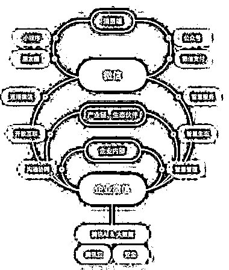

 

 

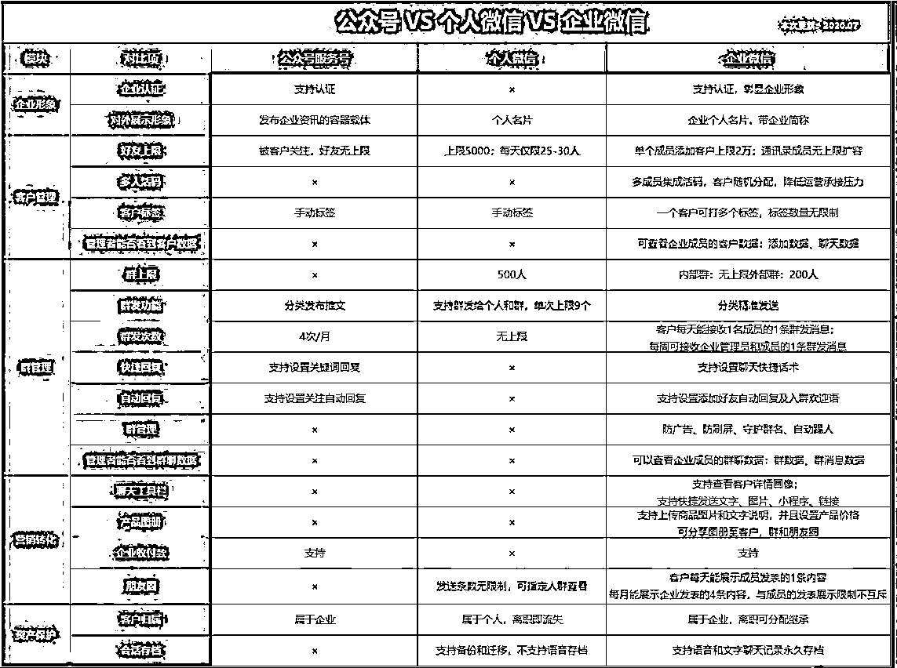 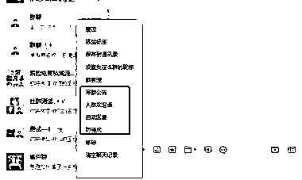

 

 

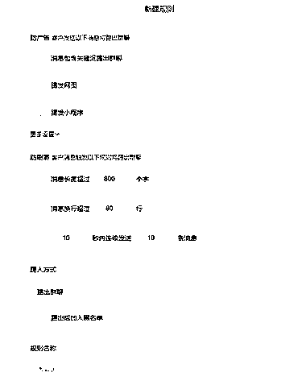 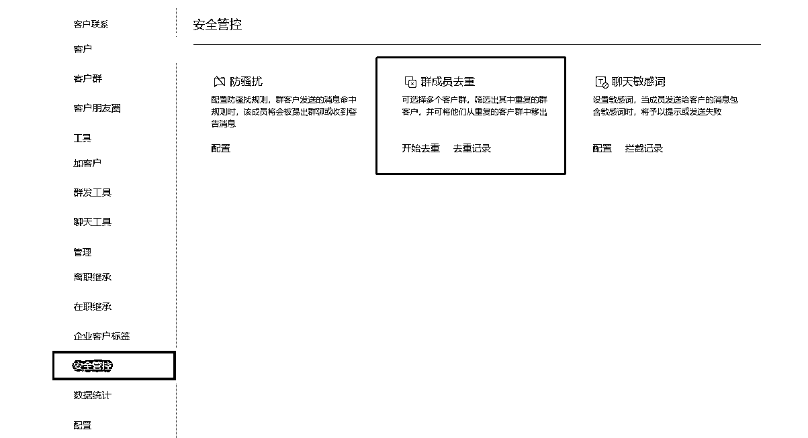

 

 

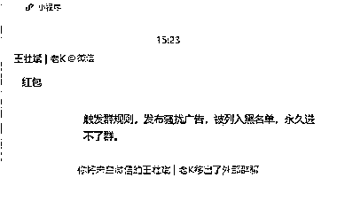

 

 

 

 

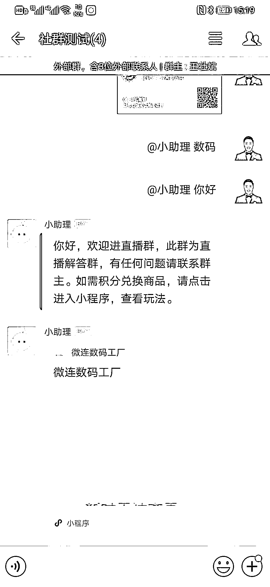 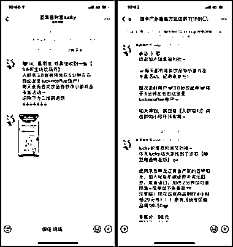

评论区：

 

 

荔枝小一萌 : 优秀

king老K : 感谢[抱拳][抱拳]

杨小军 : 赞

梁文斌 : 厉害[强]

莲子丨Jeen : [强][强][强]

毛利个喵 : 很不错，感谢分享

king老K : 感谢梁大佬的支持[握手]

吴陆柒 :    

# 【**CRM**系统提效】**3**篇

# **# ****(**精华帖**)(153**赞**)**抖音无人直播引流本地代办

# 业务，**1 **个月成交** 50-100 **单，客单** 5000+ **的变

# 现经验分享

作者：  大成

日期：2022-10-19

今年4月，我发现很多虚拟直播无人直播很大的流量，当时全国范围内还没有本地代办行业的无人直播，我们团队就模仿的卖书直播间，打造了本地服务类无人直播，到目前已经做了四次升级，非常适合免费引流。

目前取得的成绩：直播间单日留电话200+，只靠直播单日涨粉1000+，月成交50-100单。

今天分为2个部分重点给大家介绍这个玩法：

 

 

1\. 抖音无人直播间搭建：优化技巧增加直播间留存率，获取更多客户留资。

2\. Crm系统自动分配抖音线索：系统管理导流到私域转化成交。

大家好，我是大成，90后，互联网老兵，在上大学期间就做引流，QQ群排名，百度排名。20年之前还是做自媒体图文方面的账号，最近这2年一直在做抖音短视频，下面是我做抖音无人直播引流的一些成绩截图。

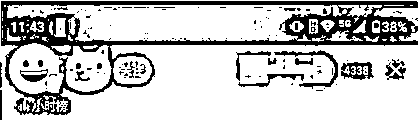

直播间最高4000人在线

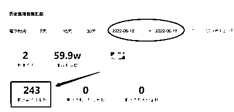

6月的最高数据，单日留电话243人

 

 

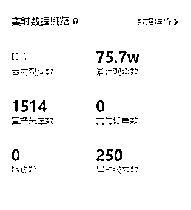

单日涨粉1500

初次分享，欢迎对引流感兴趣的圈友，多多交流。

分享目录：

 

 

一、底层逻辑

二、具体运营

三、借助工具

四、经验总结

一、底层逻辑

**1.**选择大于努力，学会借势，做自己擅长的领域

我们团队虽然是做房产，但是我不懂房产，我只负责新媒体引流，成交转化是交给后面的房产团队，我的合伙人是从业10年的房产人，有2家房产中介门店，业务方面非常专业。

**2.**最好的引流就是抓住用户白嫖免费的心理

拿成都落户来举例：我们在抖音上发的短视频，直播间讲的内容，都是说的基本信息不会全部说完。

留住最核心的内容是为了让这些人主动联系私信留电话，在私域里转化成交。

术业有专攻，专业的事要专业的人去做。很多人都没有时间精力去研究这些，都会选择找个专业的公司快速办理解决问题。

**3.**顺应平台机制，做好考核数据

 

 

目前抖音的流量往直播倾斜，所以现在是做直播的好时机。

抖音直播数据考核标准：

1）留存率

2）互动率

二、具体运营

**1.**抖音无人直播的前提是有**1000**粉丝，先发视频涨粉再开直播

1）确定账号定位，目标群体

拿我自己举例：账号定位是落户，目标群体是有买房需求，子女上学需要的成年人。

2）确定视频类型

为了提高转换率，真人出镜是最好的，能建立信任。我们最后确定的是真人出镜口播。

3）内容文案方向

前期主要是蹭本地流量热点，账号起来后，就穿插发业务相关的。

我们是前期发了很多成都的热点新闻，后面主要发房产和教育相关的，1周时间就涨了1200粉丝。

 

 

**2.**抖音无人直播搭建：

1）准备物料

抖音号（粉丝1000+，实名认证，上传营业执照开通企业账号，付费蓝V可不开）。

电脑，直播伴侣软件：

https://www.douyin.com/falcon/webcast_openpc/pages/streamingtool_download/index.html

2）直播间视频素材制作

用剪映制作5-10秒的视频。

内容文案为标题/攻略/干货/福利（滚动字幕）

目的是拉长用户在直播间的停留时间，增加留存率，想全部看完要看3遍以上才可以。

 

 

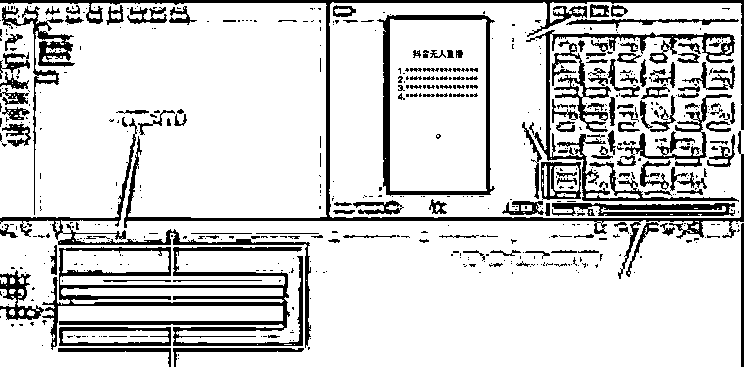

3）电脑下载“直播伴侣”登录抖音号，添加视频素材，设置循环播放。电脑打开音乐播放器，播放背景音乐。

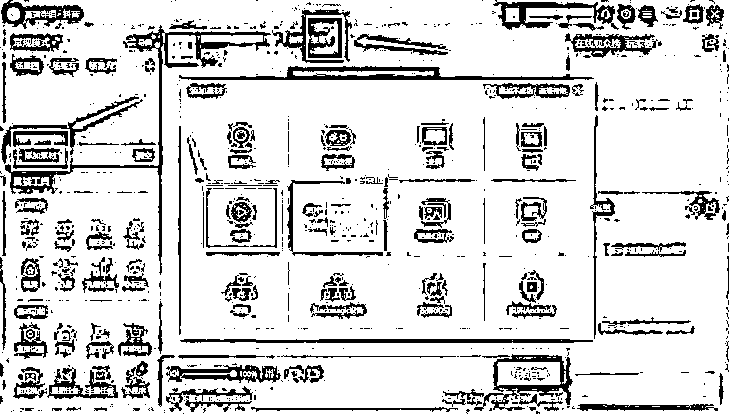

 

 

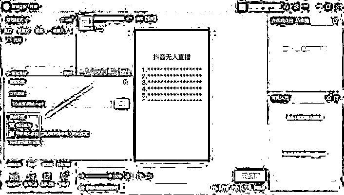

4）登录网页办企业号后台，在直播管理中添加----小风车

https://e.douyin.com/site/

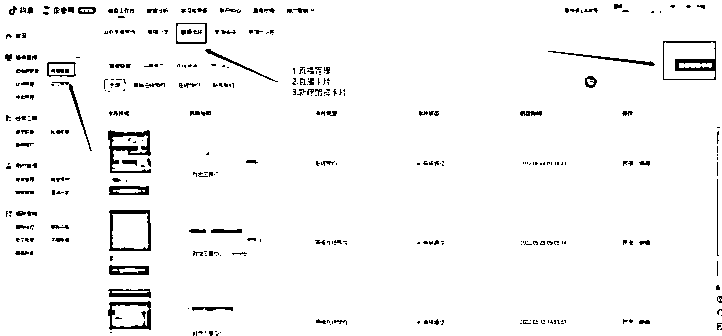

三、借助工具提高线索转化效率

 

 

**1.**飞鱼**CRM**客户管理系统

这是免费的工具，是抖音官方的，数据不会泄露，有几点好处：

1）自动分配客户电话

2）自动去除从重复电话

3）即时收到短信通知，第一时间联系跟进

4）手机，电脑通用，使用方便

软件设置：

1）注册账号  https://feiyu.oceanengine.com/pc/login  2）绑定企业微信：设置----审批与授权---授权管理--添加数据授权---企业号 

 

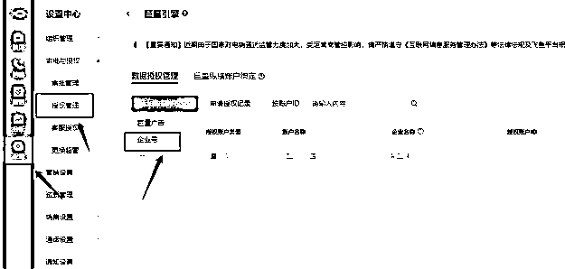

3）添加员工账号：设置--组织管理--员工与分组

4）设置线索自动去重+分配：设置--销售设置--线索设置

5）设置短信通知：设置--通知设置--短信

**2.**微信辅助软件电脑版

1）导入手机号自动筛选是否开通微信号

2）自动添加好友

某宝搜：通讯录软件

**3.**客服话术软件**(**手机版**+**电脑版**)**

 

 

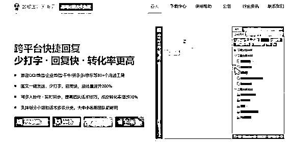

四、经验总结

**1.**前期直播间没有人怎么解决？

直播间前期人都是很少，可能是0或者个位数，这个非常正常!

是因为你的粉丝不多，因为账号权重不高。

解决办法是：多发蹭流量的短视频，去增加直播间曝光。

**2.**直播间进人多，但是停留的时间短，怎么办？

可能是这几个方面的原因：

 

 

1）文案不够吸引人，没有利他的方面，单纯对你自己有好处。

2）直播间没有人互动

解决办法：

① 修改文案，故意留槽点(序号故意少写一个，直接从4跳到6，故意写错别字，故意写某个方面不好，故意留个动态图像比如苍蝇等等)。

② 用小号进直播间互动评论，最好能争吵起来，增加互动率。

**3.**直播间流量瞬间**100**或者**1000**人，持续不到半小时就掉到**10**以内，是被限流了吗？

电脑上的直播伴侣只要没有提升违规，就不是限流；直接关播，等一会再重新开播就可以。

**4.**直播间有人，但是无人留电话怎么办？

1）视频素材中添加箭头引导点右下角的小风车。

2）在直播间显眼的地方打字：免费送东西，免费咨询等等，满足白嫖党的心理。

3）优化小风车里面的主图+详情页，展示实力，利他利他。

 

 

**5.**常用的小技巧，可以在流量不好的时候试下

1）制作视频素材时间要短，滚动速度要快，让想看的人，重复去看，拉长用户停留时间。

2）数据不好的时候，试下挂豆包知道这类小程序，有一点推流效果，但是不要挂小黄车。

3）测试下哪个时间段直播间人最多（我们的直播间是早上8点-9点，晚上9点-24点，周六周日节假日）

这套无人直播引流方法不适合带货，不适合带货！因为带货需要真人出镜，不能录播。

这套模式我们做了四次升级，正在做第五次升级中--------真人出境。

各位圈友加油，目前无人直播还可以搞，不管是引流，还是增加粉丝都可以！

评论区：

亦仁 : 真牛逼，本地代办的业务很聪明

小飞 : 这个本地代办业务意思是为本地线下实体商家提供抖音引流服务是这样理解吗？

比如本地餐饮店能套用这个无人直播吗？或者这种代办业务比较适合哪些服务项目  孟繁国 : 轮播视频的内容是最后引导观众在直播间评论区留下他们的联系方式吗？

大成 : 1.抖音引流获客方法——无人直播

2.变现项目——本地代办跑腿服务

大成 : 是的，留下钩子，免费送，免费咨询

大成 : 跟老大比，都是些小聪明[可怜]

 

 

代码君 : 本地代办业务，很好的思路

陈远清 : 6

# **# ****(**精华帖**)(140**赞**)**年营收从** 0 **到** 6000W**，我是

# 如何通过近** 8W **名私域用户做到的

作者：  鱼丸|亦仁助理

日期：2021-06-23

今天周三，#生财合伙人  专栏照常更新。

每一期，我们都会邀请圈友分享自己创业成功的心法和思维模型。本期，将会由@damo 老师，为大家分享他的创业经验。

在流量越来越贵的当下，用户精细化运营，逐渐成为了私域增长的强大引擎。

今天「生财合伙人」嘉宾 damo 老师，就分享了他是如何解决「数据打通」和「用户精细化服务」这两个私域运营痛点的。我先给大家分享内容中两个最大的亮点：

1\. 通过持续不断的新资料和用户发生浅层次的联系，并围绕考试设计活动，建立清晰详细的用户画像，把所有的小细节转变成自己的竞争壁垒。

2\. 通过 unionid 和微信号的绑定，实现用户数据的科学管理，使用户身份在微信生态的身份统一。

 

 

分享嘉宾  damo 老师，他在 2014 年的时候做了一个公众号「美国考试日报」（现在改名叫「TD北美留学进化论」），在积攒了四五万的关注用户以后，他逐步升级产品，赚到了 100W 的流水，后来又花了四年的时间做到 6000W 的年营收。白手起家的他，是如何在用户规模增加 3 倍左右的情况下，实现变现业务规模增长几十倍的目标的？

现在，把话筒交给  damo 老师。

目录

一、创业历程：公众号从起步、积攒用户、升级产品变现到年营收6000W

二、我们的用户是谁

三、我们的用户从哪里来

四、用户如何留存下来

五、用户如何转化

1\. 通过持续不断的新资料和用户发生浅层次的联系

2\. 围绕考试设计活动

3\. 一对一促单

4\. 良好交付，带来复购

六、怎样把数据打通，精细化地做业务

---正文---

 

 

今年是第三届加入生财有术，但是之前一直是透明人，今年想通过生财结交更多的朋友，也拓宽一下视野，所以试着写一写过去几年创业的心得，希望能对大家有帮助、对生财有贡献。

不过先说明一下，标题其实是有些标题党的，这个成绩背后是因为有大量的工作在做，而不仅仅是因为有了「  8 W私域用户」这么简单，希望对大家不要有误导。

一、创业历程：公众号从起步、积攒用户、升级产品变现到年营收**6000W**

先简单介绍一下自己的情况。我个人职业生涯开始的起点是 2012 年大三的时候开始在北京新东方任托福老师，然后在 2014 年的时候做了一个公众号「美国考试日报」（现在改名叫「TD北美留学进化论」），主要面向打算到美国留学的考生，把我个人的教学心得和整理的备考资料通过这个公众号来分发。因为懂教学和用户，也略有些文笔，所以公众号在红利尚存的时候获得了不错的增长。

到 15 年的时候攒了四五万的关注用户以后，就试着聚集用户做一些社群活动、做一些几块钱十几块钱打卡对赌活动，收到积极的反馈之后又逐步升级产品，在第一年的时候赚到了 100W 的流水，后来又花了四年的时间做到 6000W 的年营收，目前公司 100 余人，坐标中关村。整个过程白手起家，没有一分钱是用的别人的， 2019 年的时候还因为公司的股权问题给了前老板将近 500W 。

需要说明的是，在积累用户的前两年我们是没有做任何变现动作的，那时候没有遇到像生财这样的社群能给我们初步的商业和变现启蒙，导致错失了至少两年的时间。从积累到五万左右的用户以后我们才开始学着变现，后来业务规模增长了几十倍，但用户规模也只增加了 3 倍左右。后续的增长更多地来自变现业务的拓展，而不是用户规模的增加。

 

 

情况大概就是这样，不过这篇文章的重点不是讲创业历程，而是讲讲我的公司如何维护了不到 8W 的用户，做出了 6000W 的营收的，希望对大家有帮助。

二、我们的用户是谁

我们主要是围绕「高中毕业打算到美国念本科」的这部分同学和家庭来做事，这群人非常小众，整个中国大陆每年也就是大概 4W 左右的学生会选择走这条路，从大的视角来看，他们算是全国每年几百上千万高考生中没有走寻常路的那一小批。

另外还有两个特点需要说一下，一是付费能力比较强（本科出国 4 年基础花费大概要  200W ），二是思辨能力比较强（父母大多是中产及以上阶层，孩子很多出自优秀普高国际部或者知名国际学校，我们服务的学员大部分能拿到美国 TOP50 的名校 offer ）。

因为人群非常小众，所以从单纯的流量的角度切入的话，是很难有机会的，得经过好几层的漏斗才能筛选出目标用户，而他们关心的头等大事如「托福、 SAT 、 AP 、 IB 、  Alevel 、早申、夏校」等等等，在流量大盘里都是几乎可以忽略的存在（托福还稍微好一些）。

三、我们的用户从哪里来

因为上面讲到的那些特点，所以这部分用户最有可能消费的场景其实是线下。留学机构最常规的选择，是在一线城市最核心的地段租气派的办公室并做花费不菲的装修，而对同学们 VIP 式的「多对一」服务几乎也是行业标配，想要把这部分用户聚集到线上社群并提供服务，并不是一件容易的事，我们之前也没有先例。

 

 

但同学们总是有备考需求的。我们从一开始的时候整理了很多备考资料，有原创的、有二次整理别人的，通过持续不断地分发资料，以及每次考试结束之后我们在第一时间整理总结考试的情况等工作，逐步把用户积累起来。

比如托福考试里有一个叫「机经」的材料，是根据过去考情的回忆和整理，来作为后面考生的练习材料，因为有一定的概率后面的考试会重复之前考过的旧题，从而达到所谓的「预测」的效果。

一年大概 40 多场托福考试，我们每一场都不会拖拉，都会在考试结束的当天立即根据同学们的反馈整理出大概的考试内容、并对口语和写作部分做原创的解析和答案，积少成多就形成了自己的「机经」。

每次考试前同学们都很需要，在早期的时候帮我们拉取了大量的用户。这件事我们到现在还在坚持做，以至于我们顺道正式出版了三本书，都是受益于平时的积累。

 

 

类似上面「机经」的事情我们做了很多，简单来概括就是通过免费的资料和备考内容换取用户的关注。虽然说起来简单，但为用户持续提供价值、建立口碑的过程是非常孤独和难熬的，在不同时期我们都经历过一些同行竞争给我们带来的压力，但是几乎没有人能像我们一样一年 365 天更文，一口气坚持 5 年，还持续做了大量的免费资料分享给大家。所以我们内部开玩笑说「不是我们打败了竞争对手，而是我们把他们熬死了」。

四、用户如何留存下来

大概 14-15 年的时候我们有意用「公众号回复关键字调取资料」的形式把用户留存在公众号（道理很简单，关注公众号以后才能回复关键字），虽然当时完全看不到赚钱的可能，但看着用户不断增长还是一件很开心的事。

 

 

大概在 15 年后半期开始，我们开始有意识地把用户从公众号引导到更容易触达的地方。当时用 QQ 群，几个月之后就全面迁移到微信个人号和微信群。

当时所谓「私域」的概念还完全没有出现，我们也看不到把用户留存在离我们更近的地方除了增加了维护的压力以外还能有什么赚钱的可能，但只是单纯地觉得，能更方便地触达到用户是有好处的。

到 16 年之后我们就越来越娴熟地利用备考资料和活动把用户往个人微信上导，那会儿用户对于加微信领资料这件事还挺新鲜，他们也很乐于参加这样的活动，所以大部分情况下效果都不错。

因为团队当时只有我加上两个实习生，我们经常被蜂拥加过来的用户炸到晕，时不时就会经历一天到晚都在通过好友的事情。和上面讲的一样，我们并不知道加这么多好友有什么用，只是单纯地觉得爽，以及将来可能会有用。

把公众号获得的外部流量持续不断地沉淀到个人号的思路一直到现在都没有变过，到现在为止我们大概积累了十七八个这样的个人号，好友总量是 7.8W ，撑起了我们 6000W 的年营收。

 

 

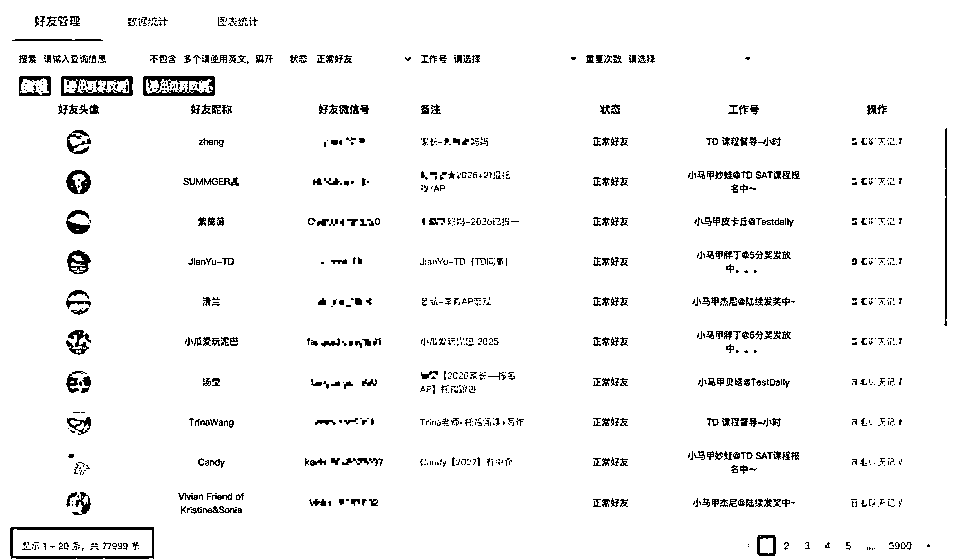

以现在的眼光来看，当时做的事情就是在「搞私域」，玩法和思路都很清晰。但在当时的背景下，且我个人除了会写一写文章以外，对互联网运营一无所知，是这种懵懂的直觉帮我们选对了方向。

五、用户如何转化

转化当然需要足够优质的产品和服务，这是另外一个话题，在这里不展开。在我们提供的产品足够好的前提下，我们大体的转化思路是这样的：

**1. **通过持续不断的新资料和用户发生浅层次的联系

这个在前面已经讲过，就不再赘述。总结一下就是，持续做好的、免费的内容触达用户，建立口碑、影响心智。

 

 

这里放几张我们销售发资料的日常：我们持续做优质的能解决用户需求的备考资料，既是从公众号转化用户到私域的钩子，也是引导用户不断主动和销售发生互动的钩子。

 

 

 

 

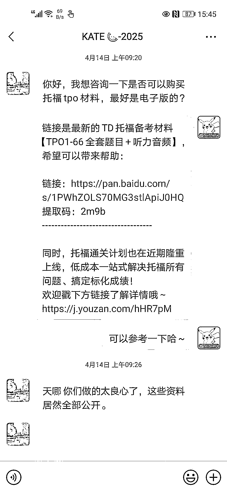

 

 

 

 

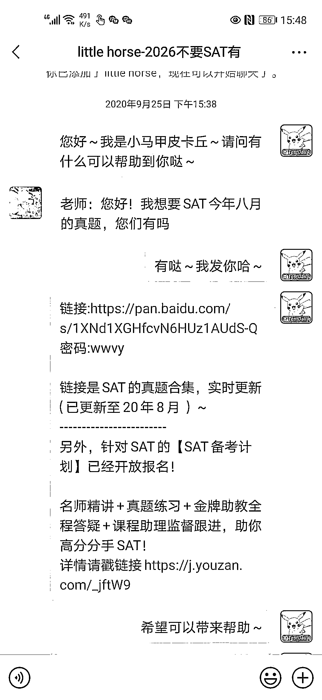

 

 

 

 

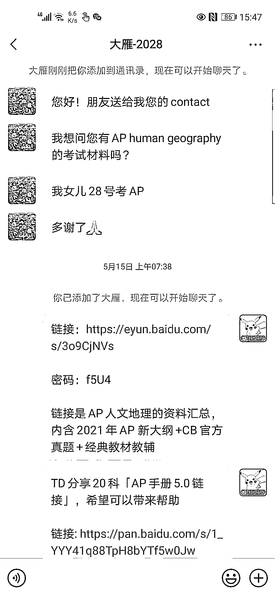

**2. **围绕考试设计活动

将用户邀请到我们各种各样的轻量级的备考活动快闪群中。经常送教研和备考资料是能获得用户的初步好感，但教育作为重决策产品，仅仅有资料是不够的，所以我们围绕考试，会在关键的备考节点举行各种各样的群活动。

可能是备考周期开始前的规划讲座，可能是考前冲刺的一起刷题等，以痛点将学生聚集到一个专门新建的群中，设计一个 3 - 7 天的活动，由我们的老师在群中进行互动和讲解。

一方面是进一步建立口碑影响心智，另一方面是把我们的课程实力做进一步的外漏，增加用户对我们的了解。当然，还有一个好处就是筛选用户：以特定备考主题建立起来的群，里面的用户需求是非常明确的，销售便于跟进。

以我们的 AP 课程运营为例：

1）在 AP 考试报名之初，会举办「 AP 全科科目解读讲座」，进行科目扫盲，帮助学生了解科目特点，有效选课。

 

 

 

 

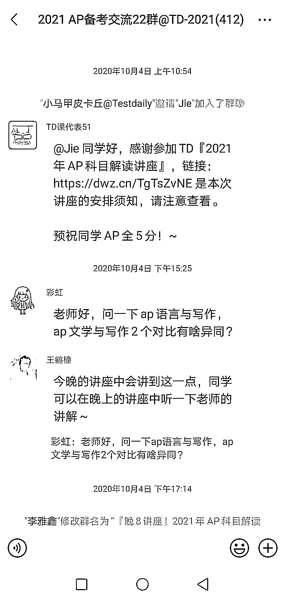 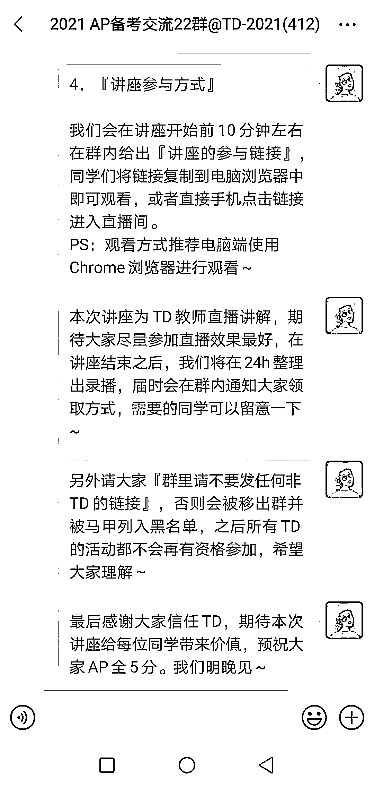

 

 

2）  在学生备考中期，会举办各种科目的备考规划讲座。

 

 

 

 

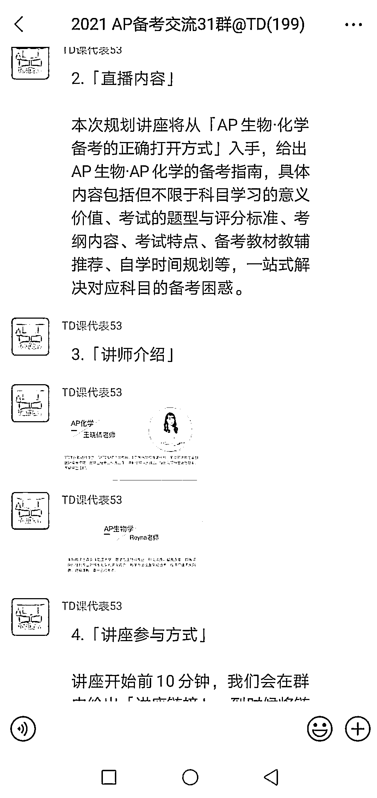 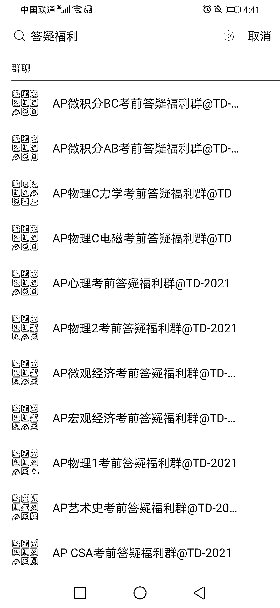

 

 

3）在考试有新变化，新政策时，会根据实际情况举办相应的「考试新变化解读」活动，帮学生分析考试形式，安抚学生对未知情况的焦虑。

 

 

 

 

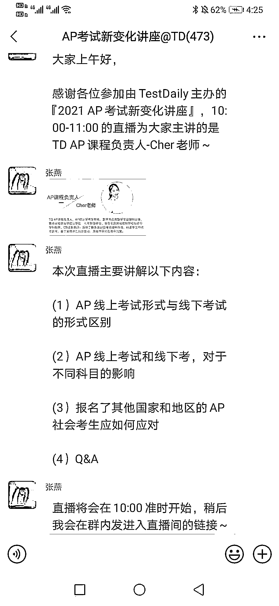

 

 

 

 

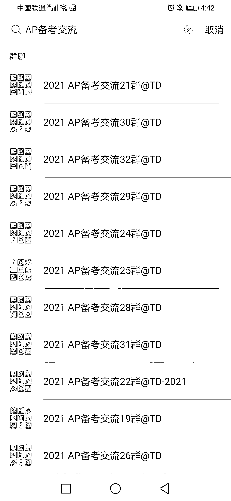

根据备考科目和阶段大量做群可以有多个好处，比如：

a. 参加一个科目的群的用户，一定是有对应需求的，用户就筛选了出来；

b. 在不同备考时期参加特定主题的群活动的用户，需求是可以更精细的；

c. 群活动交付的过程，可以对所有用户展示我们的老师和课程服务，增加用户对产品的了解程度和信任感。

当然，好处多多，唯一的问题就在于会带来大量的工作。但对于没有什么资源的我们来讲，把脏活儿累活儿做好就是最大的竞争壁垒。

**3. **一对一促单

通过第一步和第二步的大量动作，用户画像在我们这里就非常清晰了：几年级、什么时候考试、大概什么程度都很明了，销售就可以穿插进行一对一攻单。这就是涉及到销售的环节，和运营关系不大，就不展开了。

 

 

**4. **良好交付，带来复购

经过几年的发展，我们逐步把业务从备考到申请，甚至到申请结束以后和大学衔接的课程领域，因为我们的产品交付做得足够好，所以大概率的情况下有后续需求的学生都会在我们这里持续复购，一些典型的客户能够在申请季前后购买 10 - 20W 产品服务（我们在行业里是以性价比高而著称的）。

同时也因为圈子比较小，有一些热心的同学家长会帮我们积极传播口碑，典型的一个案例是曾经一个上海的一个家长很认可我们的一个销售顾问和后续的产品服务，陆续将他们半个班的家长推荐给了这个顾问。这里就不展开了。

六、怎样把数据打通，精细化地做业务

在私域里精细化地做业务，除了思路和勤奋外，最困难的问题之一就是数据打通。

我们的课程付费主要是用有赞来承接的，那么有赞里的一个付费用户和微信里的一个好友应该如何对应上？我们要做上课和作业提醒，那么服务号的模板消息怎么能发到对应的微信用户上？

销售每个月的预算和业绩要算的清清楚楚，彼此之间用户也有重合，那么如何把一个客服微信号上卖出的业绩精准地记录到对应顾问的名下？十个人的销售团队运营着将近 20 个工作号，流量要合理分配，那么如何统计到各自微信好友的增长以平衡流量分配？如果这个问题勉强可以用手工来解决的话，那么彼此之间的好友重合度该怎么统计？

 

 

这里面有非常多的坑，庆幸的是我们作为一个互联网圈外出身的团队，比较早地搭建了自己的开发团队，在踩了无数的坑之后自己解决了安全地从微信拿数据的问题（ PC 和安卓都搞定了），从而补上了数据的关键一环，再结合对有赞的二次开发，把整体的运营数据化了，这也是持续精细化运营的一个重要的支持。

这里面稍微从技术的层面展开来讲一讲底层的东西：要实现用户数据的科学管理，最核心的事情之一就是用户身份在微信生态里的身份统一。

简单来讲，用户可能在 H5 商城付了钱，然后跑去公众号留言，也可能随便抓一个他有的客服微信和你对话，到后期服务的时候他可能需要看直播、需要作业打卡，甚至课程结束三个月后他复习录屏的时候还需要回看自己曾经在直播时候的留言......如果没有一个统一的「微信身份证」，那么不要说数据科学管理，哪怕是最基本的用户服务交付都让人抓狂，因为在每一个场景下我们都只能凭着用户的头像昵称和微信号人肉比对。

而「微信身份证」在我们看来有两个： unionid 和微信号，二者统一才有精细化数据管理的基础。

具体如下：

当一个用户在访问有赞（或者其他在微信打开的的 H5 页面）页面的时候，我们是可以得到他的 openid 的，而一个用户关注我们的订阅号或者服务号或者小程序的时候，我们也是可以获取到对应的 openid 的。

一般来讲同一个用户在有赞或者服务号或者小程序的 openid 是都不一样的，而当有赞（或其他在微信打开的 H5 ）授权的开放平台和我们的订阅号/服务号/小程序在一个开放平台上的时候， openid 就可以在不同场景间打通了，统一成一个 unionid ，从而可以定位到一个具体的人，也就是一个身份证的作用。

 

 

比如说，如果一个用户在我的有赞买了一份课程，那么我可以引导他关注我的服务号，因为服务号和有赞共享同一个 unionid 所以我就可以通过服务号下发上课提醒和作业打卡提醒。而如果他扫码登陆或者微信直接访问课程中心，我们就也能识别出同一个  unionid 从而展示他对应购买的上课内容。

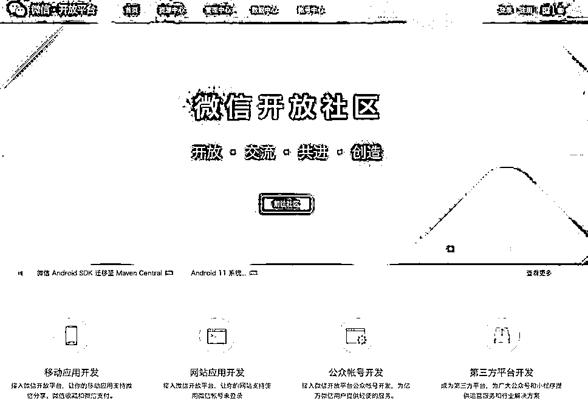

那这只解决了 unionid 在微信生态里不同场景下的用户身份统一的问题，接下来还有一个很麻烦的事情，就是当这个用户买完课以后跑过来微信和你沟通的时候，你怎么知道正在微信上和你聊天的用户买了什么课，从而有针对性地回答他的问题呢？尤其是如果你的用户会频繁复购，甚至会在不同的客服微信上复购，我们怎么知道这个用户历史上的所有订单呢？这就涉及到另一个核心： unionid 和微信号的绑定。

这块我们采用的是比较笨但是安全的解决思路：对于每一个第一次发生购买的用户，我们都会通过微信沟通核实订单，并随手在订单管理页面将用户的微信号手动填上，而用户购买的时候本身就记录了他的 unionid ，所以二者的绑定就通过这个手动的填写完成了。因为 unionid 是确定，微信号也是确定的，所以只需要绑定这一次，当用户之后再 

 

在我们这里发生任何购买行为的时候，系统都可以自动将二者进行匹配，从而可以逐步积累勾画出用户在我们在这里的全貌。

简单概括一下，就是通过将微信生态里的不同场景（ H5 商城、小程序、服务号、订阅号等）绑定在一个微信开放平台下从而实现同一个用户 unionid 身份的统一，再通过一次手动的订单绑定从而实现 unionid 和微信号（手机号）的绑定，最终就实现了一个用户在我们整个微信生态里的身份唯一性确认。

以此为基础，一个微信用户在我们这里付过多少钱、都是什么时候付的、关注了几个公众号、在用我们哪些小程序，以及后端服务场景里的有没有上直播课、上了多久、直播课上有没有发言、有没有写作业打卡等等等，甚至如果搭配一些自动群发的技术方案，都可以实现根据业务需求定向一对一私发消息了。

因为唯一身份的确认，一个用户在我们这里留下的所有踪迹就都可以统一起来，数据就变得立体和丰富了。

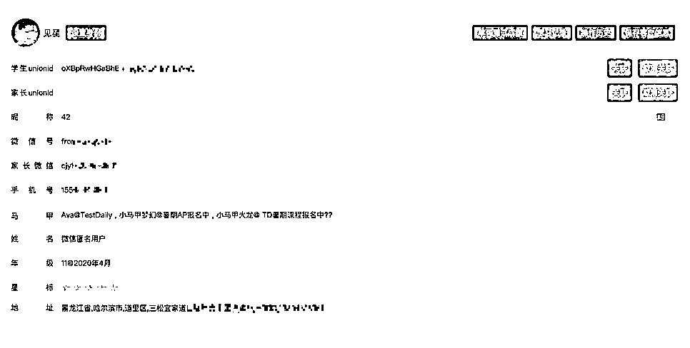

 

 

上图一个用户信息管理界面，这里实现了 uinionid 和微信号的绑定，同时可以跳转到学习记录、单词测试等后端服务场景。我们实际的业务要比我上面讲的更复杂一些，因为还涉及到家长付费、学生学习、家长要了解学生学习数据的情况，所以截图里还有一个「家长 unionid 」的绑定，以帮助家长随时可以查看学生的上课和作业情况。

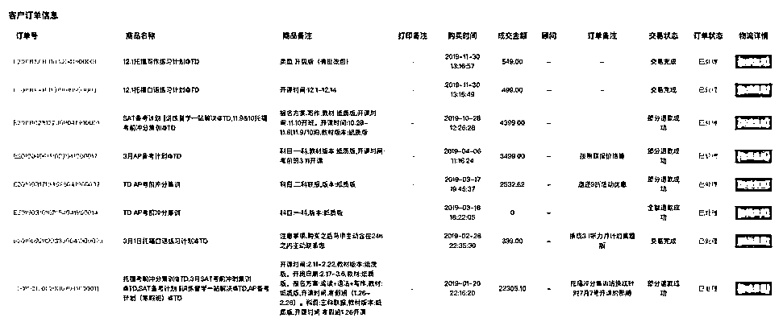

一个用户在我们这里历史上的部分订单

有了上面的统一，绝大部分的业务场景就都可以解决了，销售管理这个天坑除外。销售是最吃数据科学性的，而以微信私域为基础的销售管理其实并没有很好的系统来解决。

除了最基本的记录业绩之外，销售管理还有非常复杂的场景，只靠上面的「微信身份证统一」就不够了，我们还设计了一些微信 PC 和安卓的数据解析方案，从而在保证安全的情况下实现了更复杂纬度下的用户数据管理，这里就不展开了。

 

 

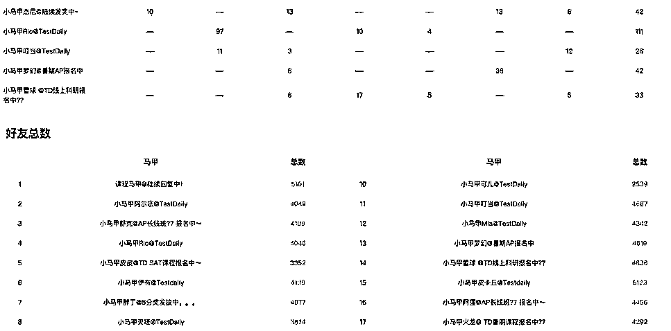

微信每天新增用户和好友总数统计

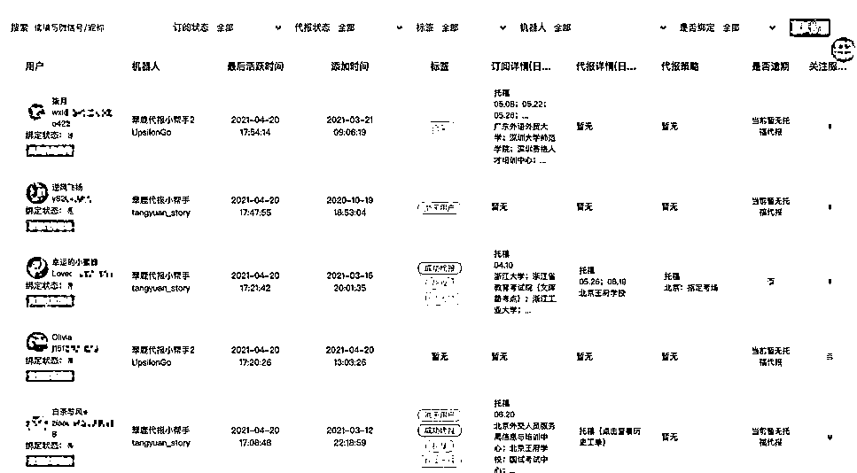

微信用户CRM业务管理

 

 

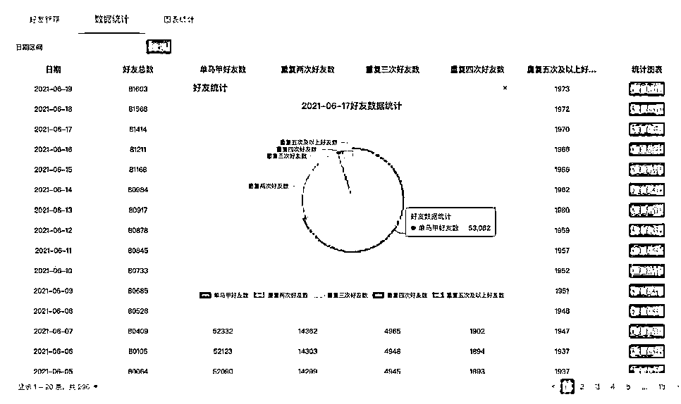

客服微信号彼此之间的好友资源重复统计

今天就先聊到这儿吧，再有的话题以后再聊。我们持续需要有留学尤其是美国留学意向的流量资源，最近也在关注少儿端的业务，有母婴资源的朋友也欢迎对接交流。另外我个人对技术驱动的用户增长很有兴趣，正在学习中（比如公众号排名、小程序排名等，都是跟生财的大佬学习的），我们也有一定的开发资源，有兴趣的朋友也欢迎交流合作，我的微信：zengdamo。

P.S. 如果你也想在生财有术专栏分享你的经验和认知，请点击链接

http://form.shengcaiyoushu.com/f/HA1G1g  填写表单，我们会陆续邀请有赚钱相关经验和案例的嘉宾做分享。如已填写表单请忽略。

评论区：

 

 

鱼丸|亦仁助理 : 感谢  老师的分享，大家如果有什么问题。可以在评论区留言~ damo : 希望能为大家提供价值，有更多问题的话一定知无不言。

如先生 : 已加大佬微信~

Zz : 大佬这个软件是什么呀

damo : 自研的，工作后台。

damo : 嗯嗯

阿宇 : 深度好文  感谢

90后老中医徐慢慢 : 用户精细化服务落地是一项知易行难的事儿，做到的人都成了大佬[强][强]

# **# ****(**精华帖**)(96**赞**)**以二手奢侈品为例，如何通过

# 私域运营提升顾客粘性，** **实现** 74% **的转化？

作者：  美德布耀布耀德

日期：2022-05-23

大家好，我是美德，一名奢侈品培训师。副业是利用自己积累的一些资源，在微信社群里带货。由于我主业副业的关系，我也算跑通了一套带货的闭环。同时，也把奢侈品品牌的玩法，拆解整合，运用在了社群的运营上面。

美德先分享一下我这两年运营社群，在顾客粘性和贡献率上面的一个成果：

我只有 887 个精准** C **端客户（带货社群成员），去年成交过的顾客为 656 人，转化率为 74%。

**2021 **年到** 12 **月初** C **端客户一共发生交易 4589 次，平均每位** C **端客人年消费次数是 6 次，**C **端客户年消费最高次数是 67 次。

最高** C **端客户个人消费在 20 万左右。

 

 

带货社群，尤其是高客单价产品的带货，不仅需要良好的销售技巧，真诚的利他心态，还需要一点相对成熟的技巧去运作。

奢侈品行业 80% 的客群贡献了 20% 的销售额，我曾经看到过某高奢珠宝品牌的 VIP 名单，这个名单占顾客总数的 6%，这 6% 的客户，帮助品牌完成了多少的营业额大家知道么？

65%！没错，就是这么厉害！顾客的粘性是高客单价产品售卖好坏的重要指标。

那么我到底做对了些什么？** **

咱们都知道，营业额**=**流量*****转化率。我将会从两个方面分享：一是流量的获取，二是流量获取后的运营。运营会作为本文核心分享的部分。

**—01—**

高客单价社群的流量哪里来？

首先，我想表明的是，高客单的产品其实需要的客户不一定要那么多。虽然客流越大越好，但如果你只是想把营业额和利润维持在一个自己比较舒适的范围，那么找到一群精准的客群就够了。

凯文凯利曾说过一个理论，一千个铁粉可保你衣食无忧。我是这条理论的真实践行者。

所以，我分享的引流方法可能没有那么好的绝对数据，不过如果是高客单价的产品也许可以借鉴试试。

 

 

我主要用了最基础的四个方法。

**1. **利用好人品红利期

如果是开始一个新项目，这点非常重要，因为这是支撑你信心的关键。

这一点有三个方面要注意：

1）平时为人需要靠谱，让人信任。这样开始一个新项目的时候，朋友圈总是会有信任你但也不那么熟悉的朋友愿意支持你。

2）选择的项目或者产品一定要非常靠谱，做私域生意，产品或者项目本身有问题是绝对做不下去的，总不能天天换圈子。

3）要抓住初期的客户，让大家帮忙转介绍，形成初期裂变。

如果产品足够好，一般的朋友是会帮忙的，不要羞于开口。另外可以引导客户晒单，帮你写点，用来发朋友圈，影响还在观摩的朋友。

在让老客户介绍新朋友的时候，要表达感谢，可以设置积分给介绍者和被介绍者，这样双方都会很开心。

有些朋友只给介绍人福利，但是很多时候介绍人反而会有心理压力，感觉如果介绍好朋友过来就好像是为了从好友身上得到点福利。给双方都给予一定的感谢，可以消除大家的一些小顾虑。

 

 

社群初期的裂变给了我很大继续坚持下去的信心，也给了启动的基础流量。

**2. **线上参加付费社群

我报名付费社群的时候，90% 是真的想要了解或者学习相关信息，在这个过程中，稍微用心经营一下同学关系。比如每个社群的第一节开营课，都会给学员机会做自我介绍。

那么一个让人过目难忘的自我介绍就要提前写好。另外课程中，我几乎不会主动加人，都是找准时机用一些小技巧，让群里的精准人群加我。

什么小技巧呢？其实就是利他原则加上有自己的专业支撑自己的价值。如果有可以帮助到大家的就尽量帮助，大家都会记住那些给自己带来价值的人。同时要做好朋友圈的个人IP打造，这样吸引来的线上的朋友才比较好转化。

参加什么样的线上社群，需要根据实际情况去规划。

比如，我是做时尚相关的高客单价产品，那么我就会去和“美”相关的社群，比如美容保养的微商代理学习群；穿搭化妆相关的学习群。

另外还可以去有钱人会去的相关的社群，比如下午茶活动群，理财相关的社群，高端保险相关的社群等等。

**3. **线下参加付费活动或者课程

 

 

一般我也是优先选择自己喜欢的活动，一边享受活动本身或者安心去上课，一边寻找精准人群。

这个方法效率不高，一场活动或者线下课程最多十几个人，需要在活动上释放个人魅力，吸引别人主动加微信。

疫情后，活动也少了不少。虽然效率不高，但是因为线下见面过，有过接触，转化率是更高的。另外，由于一开始去的时候也没有那么强的功利心，因此整个过程不会有压力，是会比较快乐的。

**4. **异业合作

上面提到的线上，线下的课程或者活动组织方，都可以成为你的合作对象，可以交换流量，或者互相推荐等。

这里有个基本的法则就是，人都不会拒绝一个首先认可自己的人，认可对方的最佳方式是先给对方付费，尤其是自己的影响力还没有对方强的时候，是需要先主动的。

如果对方有产品，有付费服务就先去买，熟悉了，再谈合作，分成谈好即可。此方法的好处是不用太费心思，做起来不累心。

**5. **招募及培养合伙人

当整个转化的流程跑通后，如果想再扩大点规模，招募合伙人是最佳的方法。合伙人政策，一方面可以用自己跑通的模式帮助别人赚钱，另外一方面可以培养自己的忠实  VIP。

 

 

但是到这一步，其实也可以把知识付费模式纳入其中。即，给合伙人交付的是课程。课程是根据自己的成功经验，总结出来的知识和技能。再帮大家提供货源，就形成了完美的闭环。

以上方法用来解决流量的问题。

**—02—**

如何提高顾客粘性

精准流量获取之后，更为核心的部分就是后续的运营。这一板块我会围绕如何提高顾客粘性这一目的给大家做重点分享。** **

奢侈品或者高客单价产品与大众消费品最大的区别是，这些产品的溢价非常高，如果想要客户能够为高溢价买单，那么必然要提供产品本身以外的价值。

产品以外的价值包括，品牌本身带来的身份认同，社会地位的认可，虚荣心的满足。还包括消费的体验，以及让顾客感受到产品或者品牌背后的精神价值。

这两点做到了，那么就能够提供其他人无法提供的价值，就能够提升顾客的粘性。围绕这两点，我尝试了很多方法，总结下来，有以下三个方面可以和大家进行分享：

**1. **整体服务流程需要打造仪式感

 

 

**2. CRM**体系提升管理效率

**3. **学会造梦，提供精神价值

**1. **整体服务流程需要打造仪式感

** **

奢侈品这个行业最需要仪式感的打造，也是仪式感打造的最好的行业。外界听起来似乎是非常高大上，但实际上，奢侈品行业并未发明什么特别的操作，它们只不过是把每个环节做到极致。

在奢侈品行业，我们把顾客从进店到离店过程中的每个环节，设置为不同的接触点。每个品牌都是围绕顾客的这些接触点去做设计。

根据顾客的动线，接触点无非就包括以下几个环节：欢迎**-**探索**-**介绍产品**-**体验产品**-**处理问题**-**结束销售**-**送别**-**售后维系。

这些接触点里“欢迎”“介绍产品”在线上是最重要的提供仪式感的环节，下面我将详细和大家拆解线上如何通过这两个环节做好服务体验。

**1**）欢迎环节仪式感打造** **

欢迎这件事，是由 3 个小细节组成的。

橱窗

欢迎的话术和动作

破冰话术

**01 **橱窗的仪式感打造** **

 

 

在奢侈品店铺，从你看到店铺外观的那一刻就开始了。举个最简单的例子，奢侈品每一次的橱窗设计都不单单只是产品的堆放，每一次都会是有主题的故事。

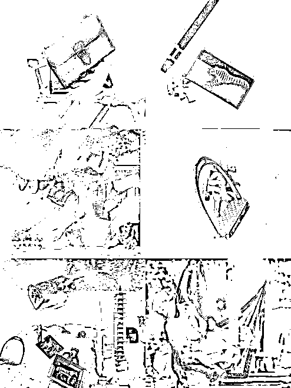

 

 

这是爱马仕的橱窗，这已经不仅仅是橱窗了，而是一个个的艺术作品。任何顾客走到橱窗附近就会多看几眼，而且是以欣赏艺术作品的眼光。

比如，这组橱窗就融合了希腊神话故事和美感，还展示了产品。这是品牌的做法，那么平移到个人线上，如何在“橱窗”上，增强仪式感和美感呢？其实就是注意设计我们的朋友圈。

朋友圈封面，朋友圈的每个文案和图片，我们的头像，个性签名，都需要特别设计。因为，这些，就像奢侈品的橱窗一样重要。

 

 

 

 

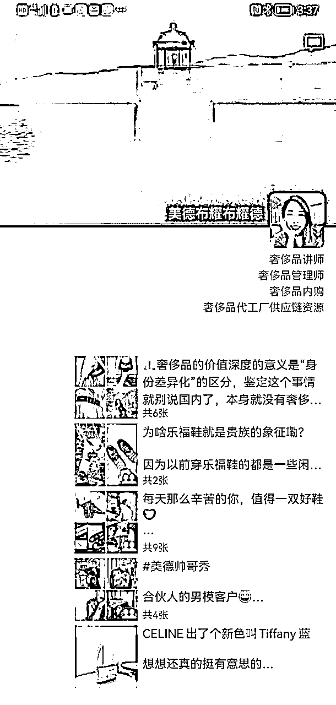

美德的朋友圈背景图，会放奢侈品的秀场视频；个性签名表明自己的专业性及自己的资源；每张图片都精挑细选，放最好看的。这个意识相信每个人都有，但不是每个人都能把它们像布置橱窗一样精心且讲究美感。

**02 **欢迎话术的仪式感** **

当我们走进奢侈品店铺，我们会发现，不同的品牌她的欢迎语是不一样的，员工微笑露几颗牙齿也是和其它品牌不一样的。哪怕是简单的欢迎语，奢侈品品牌怎么说的呢？

Gucci：欢迎来到 Gucci。

Graff：欢迎来到钻石王国的世界。

店员当然也不会非常热情地服务你，他们只会做到礼貌周到，微笑都不会露出 8 颗牙，大多被要求 6 颗。因为 8 颗过于殷勤不够优雅矜持。奢侈品的历史大多都是和服务皇室贵族有关，那么优雅矜持是第一要位。

 

 

有没有发现，每个品牌在你进去的那一瞬间，仪式感就来了，你会不自觉的觉得高级。

明白了以上的底层原因，美德也会去设计属于我自己的欢迎仪式感。首先每位新朋友加上我的微信后，我都会先做自我介绍，再邀请他进群。群里也设置了邀请须经群主同意。如果是群里朋友邀请新朋友，我也会先告知这位群友，需要新朋友加我微信。当我们友好的互相介绍完，我再通过。

以上的准入门槛，就是一种仪式感。亮明身份，提升自身价值，互相了解，平等对待。

高客单价产品的售卖，做到最高级，你应该和客户的平等交流的状态，而不是一个小客服。那么从第一步，就很重要了。

**03 **破冰话术的仪式感** **

打完招呼后，就可以聊聊天，以达到破冰的效果。在奢侈品的销售里，我们会让员工准备 100 个破冰话术，用于欢迎完毕后和顾客聊天。

那么线上其实也非常需要设计这个破冰的语言。具体聊什么，线上来说，其实客户的头像，微信签名，自我介绍里的内容都可以作为破冰话术来聊一聊。具体大家也可以上一下线上沟通课。需要注意的是，聊天的内容氛围需要和你的社群格调保持一致。

美德这里还有一个小技巧，一定要去和每个加了好友的人打招呼。打招呼不要太官腔，而是把客户真正当成一个真正的人去沟通。

很多时候我们私域流量进来了，如果不打招呼这个人就不会和我们有链接。那么光打个招呼还是不够的。还必须在初始的聊天中，展示出自己的价值，但又不能让客人感觉你是在“显摆”。

 

 

之前这个问题一直困扰着我，加入生财后，这个问题立马就解决了。因为我发现生财的朋友们都会对自己的个人情况编辑好固定的自我介绍，发给新认识的朋友。那么这个方法在我们进行产品售卖的时候也非常好用。

因为如果不做价值展示，那么对于新客户来说，你就是个服务员，对你的信任度和认可度都不会太高，可能需要后期在朋友圈不断的进行个人 IP 的打造。

但是如果自我介绍发出来，自我介绍又写得能够为客户提供不一样的价值，那么在顾客心中的价值感就能得到迅速的提升。

**2**）介绍产品的仪式感** **

最后我们再来看看关于，产品介绍的仪式感。

第一步，奢侈品品牌就不会把自己的产品叫做产品，而是叫做作品。她们也不会把生产产品的工人叫工人，而是叫工匠。

我们有一节课程叫做《奢华表达》专门教员工各种替换词。这是从上到下贯穿的培训，员工会很习惯这样讲话。

花一两万买到的是作品，什么东西是被称为作品？那都是花了心血，具有艺术价值的东西，那么如果贵，就能很坦然的接受了。美德在做线上运营的时候，也会抠字眼。为的就是给顾客打造这种特别的体验。

第二步，就是员工做产品推荐的时候需要讲求方法。这套方法是我在公司培训的时候独创的公式。也可以分享给大家。这套方法可以用于任何产品推荐。叫做“1+2+1”原则。

 

 

什么是“1+2+1”原则呢？

第一个 1 是指品牌的故事，设计师的灵感理念；2 是指，至少 2 个产品的 FAB（FAB 是一种介绍产品的公式，重点一定要站在顾客角度，思考产品本身的属性所具备的优点，重点描述这个优点对于顾客的好处），最后一个 1，是指，顾客的使用场景，需要帮他营造出来，需要有美图。

每一个产品，它都有很多很多个 FAB，我们在描述的时候，是通过前期对顾客的了解之后，针对性的去谈的几个点，一般来说我们描述两个即可，最多不超过三个，那方向是从哪几个方向来看呢。

一般我们是从颜色、风格、款式、细节、材质和剪裁这样几个方向去跟顾客做介绍。

在颜色上面来说，奢侈品在介绍颜色的时候，对于颜色的称呼会和普通的产品是不一样的，他不会用黑色、白色、绿色这样的词，反而是会给所有的颜色取一个非常好听的名字，目的是为了通过有仪式感的词汇表达，增加产品的价值。

比如上图的颜色，普通品牌把它叫姜黄色，而奢侈品会取名叫草地云雀黄，一听这个名字就感觉这个产品贵的有道理。

那么大家就可以看到，就是在一些用词上面，奢侈品是会非常有讲究，为的就是能够从各个方面去展示出这个仪式感。

 

 

我们在社群上新的时候，主要是图文展示，其实这时候用词就很重要，既要让客户感受到你的情绪温度，还要注意这些用词保住格调。

跟大家分享一下，一加二加一原则的最后一个一，最后这个一非常的重要，上文有提到它是指一个使用场景，但是注意，这个场景一定要结合着客人本身的需求去展开描述的。

我们不要自自说自话的告诉顾客噢，这个产品他设计的多么好，剪裁的多么好，细节做的多么好就结束啦。

而是应该重点告诉他，他穿上之后，在什么场景下可以得到什么样的一个效果。就是这个场景描述出来之后，让客人更有代入感，而且他会幻想自己穿上这个产品以后的样子，那么他购买的几率就会更大。

举个例子，假如是一件黑色绸缎的衣服，在上新的时候如何用文字描述出“场景呢”？

如果你是去参加朋友婚礼，这件衣服再适合不过了！低调经典，能够在不经意间让人对您的气质过目不忘。

如果你是去去参加小姐们聚会，这个丝绒的泡泡袖设计和复古可爱，一定能让你成为姐妹中的亮点。

如果你是上班穿这件衣服也不会太过，因为她虽是丝绒质感，但是黑色非常低调，设计也不浮夸，剪裁利落，能够把您衬托的非常大气！

 

 

这就叫有场景感的描述。

综上“1+2+1”这个公式可以在线上上新的时候使用，也是为了营造仪式感，能让客人体验干巴巴的产品刷屏外的另一种销售感受，在这个过程中还能收获精神内涵，谈资，以及欣赏搭配。

**3**）售后仪式感的打造** **

我设定了每年的 11 月，顾客生日，12 月圣诞月，这三个重大时间点，为美德重要的顾客时间。

特别是 11 月这个时间也没有其她商家和我争抢哈哈，大部分商家都会把活动放在圣诞或者跨年。

11 月为感恩月：美德是绝对的回馈客户，这时候的任何操作都不会冲业绩。

会认真告诉每一个客户：我是真的对我的所有客户充满感谢，信任无价，常常让我感动。

所以，每年 11 月份，我会送 VIP 顾客一份小礼物。除此之外，也会在每年的 11 月举行一些互动小活动，让所有客户参与活动，赢大奖。

 

 

（感恩节晒单活动，客户都会写长文来描述她们买到产品时的惊喜）

圣诞月：一般我会设置一些非常有意思的互动小游戏和群里的客户进行互动，活动既要有意思，又要和群里的货品相联系。

 

 

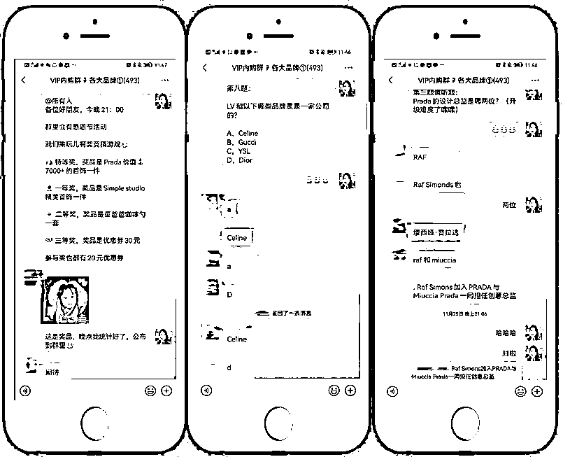

（有趣的圣诞节有奖竞猜）

生日月：每位顾客生日都赠送不同的礼物，手写祝福等，具体就不晒记录了，具体的礼物是我和每个客人间的小秘密。顾客生日提醒目前是通过系统去统计。

其它一切营销活动都不参与，目的就是为群里客户养成属于我们有特色的购物习惯。同时坚持群里的一贯格调，不在原有价格上面打折，不做大促销。

顾客分类的目的是为了方便管理，我们应该把更多的钱和时间花在重要的人身上。

顾客分类如何分，一般公司都是根据销售数据去分类，美德认为这个是基础，但其实不要只看消费频次和消费的数量，还要看她对你的信任程度。

 

 

如果一个客户非常信任我，认可我，但是她的消费实力并没有很强，我也会把她分类到我的 VIP 里面去做维护。因为信任你的人，会帮你增加你的能量，这个也很重要。

**2. CRM **体系提升管理效率** **

CRM 其实就是 Customer Relationship Management 的缩写，在每个奢侈品品牌都会有一整个部门，来进行顾客关系管理的相关事宜。这件事有多重要，我刚刚给大家分享的数据也证明了一切。

CRM 一般包括后台系统管理，以及一对一的顾客管理两部分内容，一个部门要做的事，真的有点复杂，美德只分享，我平移到我的顾客管理系统的时候，我做了些什么。

**1**）** **用好微信后台统计系统**“**微信转账助手**”**

另外的收款平台也同理，除了微信我还会用银行卡转账，道理一样，这里讲微信转账助手。

这个工具，可以帮助我们去统计每位顾客的消费动态。比如我们点进去转账助手，会发现有“顾客管理“”这个选项，这个地方的设计就能帮助你做 CRM 管理的基础工作。

 

 

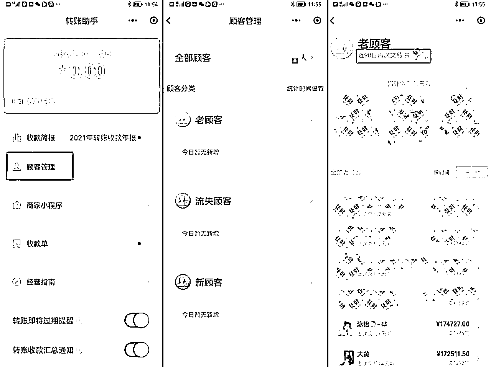

点进去之后，你就能看到，你全部的顾客数：老顾客多少个，流失的顾客多少个，新顾客多少个。同时能看到她们分别是谁，这样就方便后续的管理。

老顾客就是每三个月都会一直购买的顾客，没有断过；流失的顾客就是之前他一直在买，但是近三个月没有购买了。

新顾客就是近三个月内才开始购买的客户。这个时间是可以设置的，由于我们都是高客单价产品，我觉得三个月内只要有消费就已经算很好了。

知道了以上的信息，我们就可以开始去分析。老顾客有哪些人，她们交易了多少钱，多少笔。这些人肯定是我们重点关注的对象，我们可以根据数据分析出她们的下单频率，购买的平均客单价，就能代表大部分客群的消费能力，那么我们在产品定价和选品上面就能有一些参考。

 

 

另外一方面，再配合后面我们会讲的顾客信息搜集，我们就能针对性的判断她的购买喜好，以及个人情况，那么作用就是，在选品的时候可以大概知道老顾客喜欢什么。在做顾客维护的时候，也能知道她会喜欢什么，送到心坎里。

一般，流失的客户也会是我重点跟进的，这些人里，消费金额特别高的会是我重点跟进的对象。三个月没有消费了，是为什么呢？是不小心得罪了这个客户，还是她家里出现了变故，现在买不了了？还是什么原因，要去一个个分析。

分析完后，需要用一些方法，唤醒客户。

唤醒顾客的方法：

（1）朋友圈多互动，人都需要被关注，如果顾客流失了，那么多去评论点赞她的朋友圈，让她感觉到被关注，有时候顾客自己就好了。

（2）可以偶尔给顾客送个惊喜，流失的顾客一定是消费过才能谈得上流失，那我们可以给客人偶尔送束花，送个下午茶。如果顾客不是本身出现什么变故导致消费不起了，一般以上两个方法足以唤醒。

（3）如果唤醒不了，那么一定要想办法在新客户上面下功夫，要补足流失的部分，把新客户发展成老客户或者发展更多新客户，才能保证营业额一直是稳中向上的。

当然这里面的数据还有更多可分析的，在这里我就不做深入讨论了，大家如果感兴趣可以私下探讨。

 

 

高客单价，代表着相对来说的高利润。所以值得我们这样花时间去分析，去想办法。另外一方面，数据是不会骗人的，如果只有一个人运营社群，单靠感觉很容易有时候遗忘了有些重要客户。数据统计，可以提醒咱们注意管理重要人员。

当然，这个只是个工具，对于客户的服务等，是需要一对一进行的，要把每个顾客都当成独立的个体的。这也是为什么奢侈品行业里，现在已经不把顾客管理叫做顾客管理了，因为每个人都有个体差异，都是活生生的人，其实是很难管理的。

现在我们都叫“Clientelling”，意思其实就是现在私域领域倡导的，用真心对待我们的客户。

OK，那么这个工具分享了之后，我来给大家分享更细致的操作：

**2**）**    **需要搜集顾客信息** **

**2.1 **记录每笔订单信息** **

和微信转账助手相互配合，这个更精细，如果时间不够，用微信转账助手即可。

Excel列好如下信息：顾客姓名，下单日期，所购买的产品名称，图片，数量，拿货价，售价，购买品类。方便日后进行数据分析。

同比，环比，哪些品类卖的比较好，哪些品类是比较缺失的等等。以便后续选品。当然很多人会靠日常积累的感觉进行决策。可能由于我是零售管理出身，我喜欢用数据+详细分析进行决策参考。

 

 

**2.2. **收集记录顾客信息如下：** **

**1**）第一类数据：年龄（生日），性别，职业及职务，工作单位，常见场合，家庭结构，配偶信息，子女信息等** **

以上信息的搜集是为了方便寻找共同话题，以及提供不一样的价值。

知道顾客的职业和职务，工作单位及常见场合，是为了推荐的产品更加能符合她的身份和出席的场合。同时，其实我们运营的高客单价社群，群里每个人本身就是很好的资源，说不定多做留意就能帮大家互相链接，提供更多的价值给到大家。

再比如，知道顾客的家庭架构，配偶信息，可以在选品的时候起到作用。比如我群里98%都是女性客户，那么她们的配偶的吃穿用基本上她们都可以帮忙买。

当我知道大家配偶大概情况后，我推荐的男士产品销量肯定也会不错。另外，我群里客户大部分都和我年纪差不多，都开始有了宝宝，那么，可能高客单价的宝宝母婴产品就会是我未来将要嫁接的方向。

比如，知道顾客子女的出生信息，就可以在顾客子女生日的时候送上祝福或者礼物，因为子女的破壳日，就是母亲的母难日，这个体贴的点做到了顾客的感受肯定非常不一样。

**2**）第二类数据：顾客的个人风格资料** **

个人基础风格（优雅，时尚，性感，浪漫等），偏好，发色，肤色，妆容偏好，体型 

 

这部分信息，具体可以根据群内所售卖的商品进行细微的调整。不过这项数据的整理，除了能够帮助自己带货，还能帮助挖掘顾客其它隐形需求，我整理客户的这些信息，除了对我卖品牌的包包衣服有帮助，还会有其它更好的作用。

比如，之后我要开服装店，售卖自己的服装，我就有了具体的客户风格画像了，会非常有助于我选品。假如我要开美容院，我就知道我的客户可能喜欢哪一种类型的。

总之，数据样本量够大的话，这些数据对后续做其它方向的创业也会有帮助。

以上信息如何得知呢？我们有句行话叫做“非销”，从客户的闲聊中获取，另外就是从客户的朋友圈中获取。

以上都是 CRM 的基础数据信息管理。拿到数据后的分析，措施是第二步，第三步的管理。

这个方法的好处，首先是，有个思考方向，作为运营社群的群主，不管你是什么性格，你都可以做，起码做到及格分。

有些群主社交能力非常强，可能她根据自己的感觉就能把群做的非常活跃，每个客户都照顾好。但是肯定有人没有这种能力或者没有这个时间的，那么方法和 SOP 就可以相对来说不那么考验个人性格和能力的。甚至，变成 SOP 复制后，让员工完成，解脱出你自己的时间。

**3**）把顾客进行分类管理** **

 

 

很多公司会根据顾客的消费能力把顾客进行分类，每类客人会有不同的待遇。美德现在的顾客基数还没大到进行顾客的深度层级分类。

我的顾客，购买 10 次以上都算老顾客，年消费 3 万以上都是我的 VIP，都会认真真心对待。新客户，只要沟通是礼貌的，是否购买都不重要，也会耐心对待。

有了基础的分层之后，就可以设定属于 VIP 客户专属的仪式感，具体上文仪式感打造部分已经详细分享，此处不再赘述。

**3. **学会造梦，提供精神价值** **

**1**）要有造梦的能力** **

奢侈品本就不是必需品，如何让普通人想要拥有？那么造梦的能力就很重要。

我们看看奢侈品品牌都是如何造梦的呢？不断的培养你可以拥有更好的东西，通过各种高级大片，广告，告诉你。进入店铺后，你会发现店铺营造的各种氛围：灯光，香水，陈列，甚至服务员的微笑露出几颗牙齿，都是在给你造梦。

这种造梦十分重要，这就是在勾引起人们内心的欲望，渴望。

那么作为线上，私人运营的高客单价产品销售，要如何实现造梦呢？

美德主要是通过以下关键词：品牌产品分级，图片，以及顾客惊喜，来进行造梦。

 

 

**A**：选品要布局，选品也是造梦的一部分。** **

品牌产品分级其实也是奢侈品在玩儿的，比如大部分一线奢侈品品牌都会有高定系列，这些系列非常非常贵，其实并没有太多人能买得起，全世界就 500 人左右吧，但是大部分一线大牌都要做大秀，都要做高定；再比如，主要做包包和服装的，香奈儿，LV，迪奥等大牌也要抢着做高级珠宝。为什么？

其实以上所有操作都是为了提升逼格，抬高其它产品的品牌溢价能力。让顾客花小的钱，感觉到更高级的梦。

针对这一点，美德在社群里上新选品的时候，也会有所涉及，群里一定会保留一定量的爱马仕，以及硬奢，比如卡地亚，江诗丹顿等几十万甚至百万级别手表的内购资源。

虽然几乎很少有客户买，可能一年就几次吧，美德也基本上每个月至少会上新 3-4 次，差不多保证一周一次的频率。

同样的理由，反过来，顾客也需要培养，有很多客人现在虽然对奢侈品有向往，但是买不起。没关系，美德有很多奢侈品的美妆内购资源，有很多平价但也比专柜购买更加优惠的资源。

不赚钱，也会群里上新，为的就是养成客户在美德群里，想买好东西就能想到我的购物习惯。那么等到她真的想要拥有，有能力拥有的时候，也会想到我。

**B**：图片是梦想实现的第一步。** **

 

 

图片很大程度上会决定顾客的购买欲。可能促使客人不再犹豫，直接下单的就是某一张图片。

关于这一点，其实就是奢侈品广告，明星穿搭的重要性。在实体店铺，客人只能看实物，看镜子里自己的上身图。

而线上有巨大的优势，在于可以看长得好看的人的上身图，好看，天然就有吸引力。

为了提高效率，以及前期的投入产出比计算，美德没有选择自己去拍专业的图。而是组织了图片搜集团队，专门找高清的，高级的图片。

全部是官方高清图还不够，因为太过于高端，对我的客群来说，会有距离感。因此小红书上好看的素人图，也很重要，也会是美德上新的一部分。

再有就是到货的实拍，美德自己的上身图等等，都会发出来，以此增加亲切感，起到带货的作用。

** C**：顾客惊喜：顾客最终梦想的实现。** **

具体就不展开了，总之是让一部分客人能有“哇”的感觉。大家感兴趣可以来做我的 VIP 客人体验一下。

**D**：为顾客创造惊喜的使用场景。** **

 

 

卡地亚每年都会举行高级珠宝展。每年这个展览期间，负责店铺大客户管理的员工都会邀请有购买实力的客户去现场看展，并引导大家消费。这个展的安排一定会有晚宴等很隆重的场合。

目的是什么呢？其实很多高级珠宝价值都是几百万几千万，客户很多时候买回去是搜藏的，也没有太多的机会“展示”，那么为客户创造这样的“展示”机会就很重要。

这个借鉴起来的话：比如，减肥的可以搞走秀走红毯，拍形象照等活动，肥都减完了，当然要给客户展示的机会啦！

而美德，平时也会举办一些活动，让顾客能够穿着她们在我这里购买的服装背着在我这里购买的包包，美美的展示拍照留念。

办活动，有一招，就是利用你所在城市的活动或者展览资源，把格调做起来，这个其实也是造梦的一部分。

美德经常会利用各个品牌的展览资源来办活动。给大家分享一下我们上一次活动的图片。反馈也都特别好。

 

 

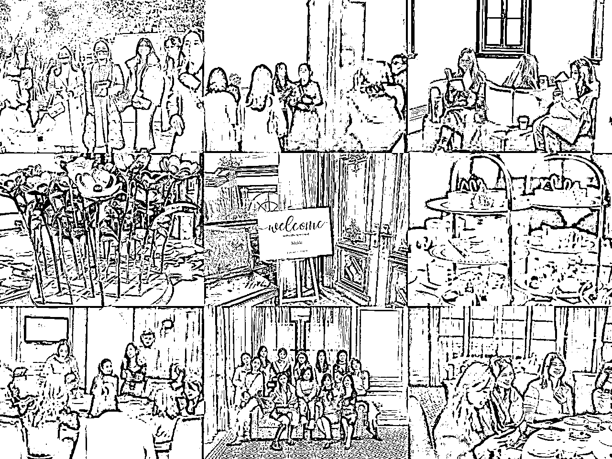

**2**）**    **会讲故事，提供精神价值** **

我们经常听到营销课里讲奢侈品的营销，就会说他们很会讲故事。这个故事的最终目的其实就是为了让消费者心甘情愿为自己的感觉而付费给品牌方。也叫用好“价值定价法”。

比如卡地亚的猎豹系列。这个系列最出名的就是翁莎公爵夫妇的爱情故事。翁莎公爵爱美人不爱江山，为了娶翁莎公爵夫人而放弃王位，并让卡地亚给这位夫人设计了猎豹元素的很多经典珠宝。从此，卡地亚的猎豹系列成为了爱情的象征，也是品牌的经典系列。

这个故事太过于经典和典型，以致这个系列到现在还是卡地亚的经典系列。奢侈品的每件作品，都有它的故事，灵感，还有设计师想要传达的理念。

 

 

再比如香奈儿，这个品牌的故事相信大家都不陌生，对香奶奶和 14 个男人的故事大家也肯定都很好奇。但这个猎奇的故事之所以为大众所知，不能说不是商业运作的的结果。

香奈儿历经 100 多年，品牌延续到现在靠的早就不是香奈儿和她的后代，而是后面的资本，维德摩尔家族。却有很少的人听过这个家族。

品牌就是专门让背后的资本神隐，而让香奈儿的故事成为传奇，这样才能让品牌故事流传下去。那些风流韵事，本来也是香奈儿的品牌公关宣传之一。

假如我是运作一个新品牌，那么在这方面我一定会研究一下，如何讲好我的品牌故事和我的产品故事。

但我目前售卖的是别人的品牌产品。所以我所做的就是，讲好这个产品的故事即可。

我们很少会像代购或者其它奢侈品的卖家在朋友圈或者群里发产品细节，反而更多的是倾向于讲解背后的故事。以此来和其它的卖家区别开来。

这里美德分享一个案例，是最近我分享的品牌故事。

 

 

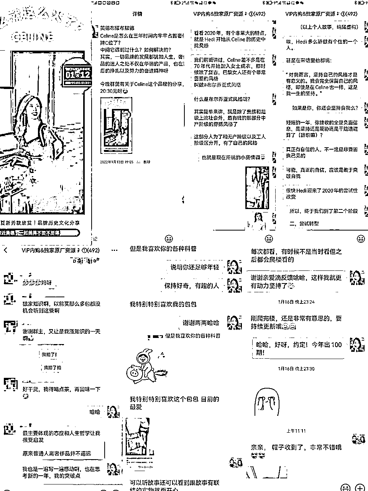

左上角第一张是分享的宣传海报，海报就要有故事性；第二章是宣传文案，尽量和每个人的生活相结合；但三张和第四张是分享的内容节选，需要有干货知识的传递还能有个人感悟的抒发；最后三张是客户的反馈。

 

 

讲故事，也是为了提升客户对于产品的鉴赏力，并且通过课程，我们好好来教大家，怎么去享受。每一个故事，在讲解的时候都会有情感上面的共鸣和享受。这样客户在购买商品后这个产品就不单单是个产品了，它被赋予了意义，同时还附加了谈资价值。

客户如果只能在你这里享受到这种附加服务，那么粘性自然就增强了。粘性增强就会有源源不断的复购，以及转介绍。

以上就是关于高客单价产品提升顾客粘性的一些方法。谢谢大家！** **

评论区：

亦仁 : 二手奢侈品的生意模式和其中的一些坑，方不方便展开讲讲？利润核心来源是利润还是合伙人？

婷婷 : 写的太好了

小酱 : 棒棒的美德~学习啦

郭  嘉 : 学习了

若水 : 专业、精准，提供了高客单价社群运营的方法，厉害👍！

麦麦 : 1+2+1，造梦提供价值，还有细致的客户管理，学到了

宋大刀 : 美德yyds～

心理諮詢師 - 根源 : 人美能力又强，还给不给人活！

来了张伊森 : 进一步的了解了私域运营，之前想的还是太简单了，每一个动作都是有价值的。

# 【团队管理】**6**篇

 

 

# **# ****(**精华帖**)(360**赞**)**引流团队如何做到小红书单

# 月引流** 13000**＋，全年变现** 1000W**＋

作者：  佳能

日期：2023-06-13

引流团队管理分享：如何做到小红书单月引流13000＋，全年变现1000万＋㊙大家好，我是佳能，生财潜水新人，谢无敌老师的关门弟子，目前在做线上教育类目，今天主要给大家分享一下我做小红书以及团队管理的一些经验。部分知识来自于谢无敌老师的实战营  。

先做个自我介绍，今年是我工作的第 6 年，这 6 年期间我打过杂，带过项目，当过运营主管，也自己创过业，目前是公司的合伙人。目前我和另一个朋友共同管理着15人的团队，通过0成本获客，我们在45 天内做了 100 多个账号，引流了 3 万多人到微信，单月变现80w+，全年变现1000w+。

我现在的岗位名称是全栈运营，或者叫全域运营，知乎、b站、公众号、微博、抖音都有做过，运营种类也很广，活动运营、产品运营、增长运营、内容运营和社群运营，也全都做过。

一、先聊实战，结果倒推

首先问大家 3 个问题：

你有没有制作流量热点地图？

你的矩阵号有没有进行分类？

流量爆了之后，成单率是不是也变高了？

大家可以带着这三个问题，再来看我接下来的分享：单月引流1w3，我做对了哪些事情？

1.抓住热点，提前2个月布局

我觉得不管开展什么业务，新业务也好，老业务也好，最好是赶紧去把全年的流量热点地图做出来。

比如大学四六级考试，永远是考前一个月流量最多。减肥类目，春天和夏天需求是最旺盛的，因为冬天大家都爱吃火锅，而且天气比较冷，不愿意动。

 

 

再比如考研行业，它的热点是2月出分，3月国家线，这些就是自然热点，自然热点是什么意思？就是平时可能默默无闻，突然在2月3月的时候，考研就炒上了微博热搜。而微博热搜是大家评判行业热点的一个标志，有了热点，就要提前2个月甚至 3 个月开始布局起号，热度一来马上就有流量了。

我的经验是，热度前的 2 个月是最忙的时候，等到热度一来只需要及时回私信，跟进爆款就好了。哪怕你这个行业没有明显的淡旺季，也一定要总结出来，这样你的工作才能有节奏。才能提前两个月布局，布局工作一定要做到位，而且要做准，如果做不准的话，来的流量一是没办法变现，二是流量不够。

2.矩阵做号，分类要到位

做流量矩阵，不能为了矩阵而矩阵，比如你做 10 个账号，不是说随随便便注册好了就直接发了，一定要有分类。

我们做流量是为了赚钱，赚钱就要从产品去倒推：产品的受众人群是谁？向往人群和势能人群分别是哪些？有什么样的特点？在哪些平台上？会看哪些内容？

举个例子，比如我的产品受众是 40 ~ 50 岁的男性，这些男性不太可能玩小红书，他们玩手机一般会看一些国家大事，爱用的平台可能就是头条和抖音，他们会把头条当搜索引擎来用。

刚好头条是文字类，抖音是视频类，这两个平台直接把我们输出的内容分类好了，我们可以以此为方向去做矩阵号。

做矩阵号的话一定要对账号进行分类，无敌在实战营课里也有讲到过，账号要从咨询类、晒单类、官方类、 IP 类，还有行业细分类去做。

①晒单类

最左边的这个就是晒单号，这个账号也是无敌老师在实战营群里分享的，你看一个蛋糕才1000，但是花了 2000 配送，激起了好奇心，就很想点进来，对吧？

晒单号就是直接把和用户的聊天截图，发到公域平台上，因为人都有偷窥欲，在这个过程中，让用户的嘴夸你的产品：这个蛋糕虽然只要1100，但是它值 2000 的配送。

那用户就会想到两点：1 这个用户怎么这么有钱，是不是冤大种；2 我想看一下这个蛋糕长什么样。

 

 

②咨询类

第二张图：运营小白必看 16 个书籍，这个就是资讯类的账号，这个不用多讲，我觉得大家应该都知道，其实就是合集类。

③官方类

第三张图为官方号，如果大家做个人 IP 的话，我觉得没必要做官方类，但如果是在公司里面做账号的话，有一个比没有好，不过官方号是要认证的。

④ IP 类

第四张：xx学姐，个人 IP 很强。个人和机构号相比的话，肯定是个人的吸引力会更强一些，我们去小红书看内容，更多也都是看个人IP。

⑤ 垂直细分类

第五张图，是我找的一个穿搭博主，她身高165体重 59 公斤，分享的内容都是针对她这个身高体重的，那么同样体型的用户就可以参考她的穿搭。

大家也一定要去思考，怎么去做你自己行业里面的细分赛道。我的个人经验是：个人 IP 号和行业细分号是很香的，反而资讯类的不太香。 IP 类和晒单类，更多属于一种品宣，可能平时私信流量很少，但是一来一个准，所以不同账号带来的结果是不一样的。

所以，你要去思考每个月的 KPI 是什么？你想要涨粉？还是想要引流？根据你的需求去做对应的账号，每个账号大概做多少个，矩阵就出来了。

不同类型的账号成交率和用户信任度也不一样，具体哪个效果好，需要从用户角度去测试，其实我们是一个需求供应方，而不是给用户创造需求。

其实矩阵的意义和赛马机制是异曲同工的，东边不亮西边亮，如果我们能把每个平台、每个类型的账号都能运营好，当然是最完美的，但是做到二八定律也很好，把握好最重要的20% 的账号就能得到 80% 的结果。

3.一定要从产品出发，不要掉进流量陷阱

这张图不知道大家有没有看过，我们可以把产品分为四大类：引流品、裂变品、利润品和价值品。

我以在线教育为例，给大家详细说一下每个品的特点。

①引流品

大概是 0 到 49 元的区间，它没有信任感，用户只需要出一笔很少的钱，就能体验你的课程和服务，如果不好的话，用户亏的也是很少的一笔钱。

 

 

比如K12 经常有那种 9.9元的课程，他会投入很多精力，为什么？因为他不是赚你 9 块9，他是通过 9 块 9 的课程让你去续费他 349 的课程。

②裂变品

价格区间在 50- 200 元，它有一定的信任感，但是信任感一般。用户和机构或老师建立了一个基本的信任，用户有意愿把你的课程推荐给其他人的，而且价格不会特别贵，方便用户的好友能够快速做决策。

如果加入分销机制，比如说 3 人拼团多少钱，那用户的推荐意愿会更强，再加上实时到账，用户对机构会更有信任感。

③利润品

利润品就是 200 到500，或者说是 500 到 1000 元，比如 999 元，利润品就是你能挣到一部分钱了，而且用户和老师建立了高信任感，愿意在你这里消费。

机构应该把重点工作放在这部分用户运营上，不断提升复购率，让这波用户能够再提升一个档次到闭环品上。

④闭环品

也叫价值品，它的客单价在 1000 元以上，是超高信任感，用户和老师之间建立了强绑定的关系，不管是利益上还是情感上。

此时的用户不仅是你的用户，更是一个渠道，它能帮你源源不断的带来高净值的用户，他就是你的口碑。

我们做运营，做流量，肯定是为了把产品卖出来，那在设计产品的时候一定要把每一块都给做好，你可能这 4 块做不全，但是最起码也要有利润品和闭环品，或者说能让你赚钱的必须要有。

前期可以加一个引流品，我建议百元以下，或者是 10 元以下，筛选愿意在你这儿付费的用户，哪怕掏 1 块钱也比直接过来白嫖要好很多，要香很多。

做运营一定要学会算账。比如说你要赚到 10 万元，或者你公司这个月业绩指标是多少万，那你首先要测算成本，其次要拆解到各类产品，流量品、引流品、利润品，每个品大概要卖出多少，才能达到业绩指标？算成单转化率，再根据转化率去算要加到多少线索，就是一个倒推。

 

 

不管做什么都是倒推，从结果倒推我们现在要做的动作，而不是说我有 10 个账号，我这 10 个账号能带来多少流量？转化率多少？我能赚多少钱？并不是这样的，是我要赚到多少钱，倒推出我要做什么样的动作，这个思维一定要转换过来。

4、私域高客单的转化

①SOP 话术一定要设计好

用户的疑问点可能也就 10 个、 20 个，通过沟通，了解用户需求和可承受产品的价格区间，然后给用户打标签，后续维护起来，就能更好地切中用户痛点。

高客单的产品一定是需要时间来养的，不可能加了马上成单，所以说转化路径的设计是很重要的。

②意向人群的锁定

我引了1万 3 的用户，成单大概是 80 多个，剩下的 12920 可能都不是我的意向用户。

但是我能保证这 13000 都是我这个业务的，就是考研的学生，但不能保证这些都是能消费的起我的产品的学生。

所以说用户分层很重要，能够极大的节省时间，针对不同层级的用户去推荐不同层级的产品。

③做好长期维护和服务的准备

我觉得 5000 以上就算是高客单价，一定要沉下心来做长期维护。像我这边1万以上的产品，成单时间最短转化周期都是一个月，一般是 1- 3 个月。

④人设

人设就等于信任，你的朋友圈，你的头像，你的签名，还有你的社群维护，这些细节都是很重要的。

我建议大家坚持发 5 条朋友圈，时间要定好，分类要定好。朋友圈配图一定要考究一些，一张好的宣传图，是用户没有点开放大时，就清晰的知道大概有哪些东西，然后被吸引进来。

其实跟咱们小红书封面设计是一个道理，你打开小红书，信息流一个页面是 4 篇笔记，你怎么做到在这四篇笔记里，让用户点到你的笔记里，而不是其他人的笔记。

要把这个思考点也用到你的朋友圈里，因为朋友圈也是一个信息流。

二、再聊管理，承上启下

 

 

接下来是团队管理这块，它其实是一个承上启下的动作。我觉得我们在座的每个人，多多少少会涉及到管理这方面，因为不管在公司上班还是自己创业，你不可能一直是一个人。

关于团队管理，也是先问大家几个问题，然后我们再来聊团队管理sop。

你觉得管理最重要的工作是什么，人or事？

从月度、周度、日度来看，管理sop如何制定？

工作流、业务流、绩效、培训是否都定好？

1、会不会做

①工作流

从早上 9 点上班到晚上 6 点下班，具体的工作安排。工作安排最好以半个小时为单位去规划，上图是我们公司内部的一些工作流。

因为我们的引流路径已经跑通了，所以没必要按照半小时去卡点，但是新业务或新创建的团队，最好以半小时为单位去规划。

②业务流：

相当于咱们星球以及实战营的课程，教给大家平台规则、发文要求、爆文技巧，以及引流方法这些硬核技能知识。

我每周都会带着部门 20 多个人去听课，听完课我要求每个人都输出手写的笔记和思考，这里就涉及到了培训。

③培训

培训又分为四块：

1  部门内部的业务能力培训，比如我让他们听课，听完课后运用到日常工作，提高工作效能。

2  外部的跨部门协作培训，比如职场上你怎么沟通，怎么说话。

3  公司层面的培训，你要对这个企业有一定的认同感，而不是说和公司是对立的。

4  职场技能层面的培训，比如职业礼仪、职业素养等。

这样从各个方向把员工的素质打造起来，他就不是一个单纯的引流工具人。我们做矩阵账号，不管用的兼职还是全职，它都是一个可复制的岗位。但我还是希望成员能在工作中找到一些意义，学到一些东西，而不只是简单的工具人，在这个过程中他能知道自己的不足，也知道该往哪个方向去弥补自己的缺陷。

 

 

④学习氛围

运营岗位一定要不断输入，比如说我们加入无敌的星球，是因为对知识有一定的渴望，这种品质我们要去影响给团队其他成员。这里要注意一点，就是培训之后一定要有考核或者审查。

记住一句话：员工只会做你检查的事，不会做你安排的事。

就跟学生做作业一样，你不规定明天要交，他今天肯定不做，但你说明天要交，而且还有打分制，达不到几十分，就会怎么样？他就会更上心。

培训也一样，一定要让员工自己去思考如何优化手上的工作，不能为了培训而培训。

2、如何自主做

①要设置有增长空间的薪酬绩效

包括可量化的、不可量化的、关键指标、绩效考核等。

绩效这块，我是按照可量化的发文量和爆文量，达到多少才可以拿到对应的爆文提成。

除此之外还要有个浮动奖励，比如我这个月给他定的目标是一个月引流 2000 个，如果做到 2500 或者3000，我会额外给一笔钱。你要刺激他不断地做更多，而不是说拿个底薪就 OK 了。

在做绩效的时候，建议大家用阶梯去奖励。比如说你单月引流 1000 以下是 5 毛钱一个， 1000 以上是 1 块钱一个，阶梯标准具体定多少，要根据大家的Roi去定.②月度和年度的奖项设置

针对可复制的工种，也就是专注引流的员工，建议做短期奖励，也就是月度奖励。

对于比较出色的员工，那种不可复制、很牛逼的，你想留住他，就要做年度奖励，比如说年终奖或者 13 薪，或者你跟他做项目合伙，项目分红，但千万不要直接提拔成公司合伙人，项目合伙就可以了，要一点一点去满足。

③打造互帮互助的氛围

我会在开早会的时候，把昨天的引流数公之于众，做得好的点名表扬，让大家鼓掌，然后让他分享一下经验，整理成文字，发到运营群，把引流效果好的笔记链接也直接发到群里，供大家参考。

做得好的一定要当众表扬，做得不好我觉得没必要当众批评，但是要一对一的批评。

 

 

3、如何有效地做

其实就是工作计划、工作执行和工作总结复盘。

目的是确保工作的饱和度，月度、周度、日度都需要盘点，工作饱和度这块，我觉得大家可以自己去测试一下。

我们自己的运营团队，有的负责 5 个小红书账号，有的负责 10 个，我是根据不同的账号种类以及素材量去敲定的。

负责 5 个的，就是精细化运营，内容可能偏干货一些。负责 10 个的就是追热点。

还有一点要注意，就是小红书做得越久，你的速度会越快。

所以工作流这块，我建议半个月更新一次，如果你精力 OK 的话，一周更一次都是可以的。如果你不更新你的工作流，员工的划水时间就会越来越长，工作效率就会越来越低。

除非他特别聪明，会在工作中不停地思考如何做爆款，如何把流量给做起来，但是这样的人 10 个里面可能只有一个，甚至一个都没有。所以我们把底线给定好，至于能不能往上走，就要看能不能找到这种人。

4、如何落地

首先是数据分析，不同平台、不同账号、不同内容、用户意向度这些都要分析，因为我不是只做小红书，我还做抖音、公众号、知乎、微博，包括我现在也在布局 b 站。

要根据结果去投入人力、成本、精力，带领每一个运营梳理工作流和饱和度，明确好引流的有效方法。

然后整理培训资料，制定好月度、周度、日度的培训计划。并且每天都要汇总工作完成情况，通过结果去抽查过程，也就是说通过引流数据去抽检账号，引流数据做不起来，要么是账号的问题，要么是人的问题。

我们上周发现一个运营数据特别差，每天只引 4 、5 个，跟他聊了聊，问他是怎么做的，他说直接抄对标账号。问他抄的哪几篇？他说就是 12345 这几篇，再一看他抄的那些都是点赞连 10 个都没有的。

所以，员工在做的过程中，他接收的信息可能和我们传达时是有偏差的。通过抽检动作去审查他的工作过程和思路是很重要的。

 

 

可能他觉得按照你的想法去做了，但没做出来，就是账号的问题，但事实是吗？并不是。然后你还去怪他：我给你培训这么久，在你身上花了这么长时间，你没做出结果来，为什么其他人可以，你不可以？

所以这个中间是有误差的，遇到问题不应该先去问责，而应该去解决问题。

5、管理原则：向内找

在开展项目前，或者每月初，一定要定好规则，定好打法，然后赏罚分明，通过数据去抓过程。结果做不出来，过程肯定是有问题的。

我们做小红书时，怎么去看过程呢？按照三驾马车的原则。

三驾马车是什么？选题，主图还有标题。

把员工按照会不会做和想不想做分类一下，如果会做想做，但我们的支持没到位，就是说没有给到培训，那么作为管理，肯定要反省自己的问题，如果他不会做不想做，就涉及到态度层面的问题，需要一律优化掉。

大家看这个四象限图，有才有德的员工就是右上角的明星，他是团队的榜样。对待明星的核心态度是捧，物质上要慷慨，精神上要表扬，

那有才无德的员工是什么？是野狗，就是左上角的，对于野狗的话要限制地用，甚至消灭掉。如果这个人不能为你所用，那他到底还是不是人才，是需要打一个问号的。

第三个是能力差一点，但是任劳任怨的员工，叫老黄牛，老黄牛可以放心用，但是黄牛容易随风倒。如果你公司或者团队明星比较多，那他就会学明星，如果野狗比较多，他就会学野狗。

第四个是无才有德，无才有德就是右下角小白兔，小白兔态度很好，但是业绩不好，我觉得可以多培训，但如果变成常年的老白兔，就一定要清理，否则公司就是白兔成窝，人效会很低很低。

一句话总结：捧明星，消灭野狗，清理老白兔，放心用黄牛。

还有一点，管理团队时，其实是可以适度放养的，只要确保培训到位，必要的部门协同支持到位，工作饱和度也能安排到位。那就用结果说话，你做的越好就越自由，干涉得越少。

 

 

三、TO: 0- 3 年的运营人

也是三个问题：

你了解自己吗？

你了解运营吗？

行业变动下，如何建立自己的护城河？

1、你的优势是什么

这个跟咱们做小红书账号选赛道是一样的，可以通过测试，比如霍兰德、MBTI测试，或者通过身边的朋友、领导、同事的评价，他们觉得你的优势是什么？你的缺点是什么？

也可以从你自己的一些高光时刻、记忆最深的、最有突破的事件中，多个方向去考虑，千万不要只从一个方向去看自己，尤其是上面的测试，比如你现在是INTJ型，但它只是你的一个阶段，不同阶段你要重新去测试，它不是定死的。

认识自己，是为了取长补短，而不是单纯的扬长避短。大家一定要注意是取和补，而不是扬和避。

我觉得短板还是要补的，因为我们作为运营，你不是单纯只做运营这个工种，你要知道产品是什么，你甚至要学会研发产品，你要知道销售如何转化的，这样你在做流量的时候，才能切中用户痛点，我希望大家多方位去发散，把自己的优势去扩大，或者说把自己的短板给补齐，至少作为运营是这样。

2、从0-1的“秘诀”

①流量意识

我觉得流量是一个公司的根，你连用户都没有，你怎么成单，做运营不能只服于内容，品宣工作固然重要，但是光有口碑没有用户的话，我们是赚不到钱的。

②不断迭代

比如 15 、16年的公众号裂变， 17、18年的抖音，还有22、23年的小红书，都是风口。

“站在风口上猪都能飞”这句话大家应该都听过，其实做生意是这个道理，做流量更是。

说实话，如果我没有带团队去做小红书的话，即使碰上考研热点期，我可能也搞不出现在的结果。

③抓住机会

很多人说找工作一定要进到公司最重要的那条业务线，但是哪条是重要业务线，你光靠面试是无法准确判断的。

 

 

如果这个公司和领导都不错，那可以先进来，在做好本职工作的同时，再去观察，观察最重要的业务线在哪里？业务线里你适合的工作岗位有哪些？这些岗位需要什么样的工作能力，然后沉下心去学以致用，做出结果。

让重要业务线的领导先看到你，接下来就需要一个时机了，等到岗位空缺，这个位置肯定就是你的。所以抓住机会的真实意义在于做好准备。

④变现意识

变现按理说是销售的活，我不知道大家有没有看过运营的书籍，它们都会强调运营是产品和用户之间的纽带，也就是说你吸引用户过来是为了卖出产品，不是为了吸引而吸引，这也是我上面强调的，用户一定要做分层，要精准获客。

虽然我们不是销售，我们不背业绩，但是销售业绩是和我们运营动作是息息相关的。

3、工作6年才知道的事

第1条：

迷茫。

我觉得大部分人都会迷茫，不管是刚工作，还是做了 1 年、 2 年、 3 年，甚至 5 年、 6 年，你都会迷茫。

我觉得迷茫是常态，当你迷茫时可以用丰田生产法，这也是我经常用的，方法就是不断追问自己为什么，不断向下深挖。

举个例子，你觉得你自己掌握了一些运营技能，但依旧不自信，原因可能有以下几点：

你可能引流了几百几千，但和同事大几万的引流成绩相比，显得太少了。

你知道了引流的具体操作手法，但这个能力没办法复制。

引流不能证明你做项目拿到了成果，项目关注的是用户的留存和转化。

像这样多问自己为什么， 1 个问不出来，问 2 个， 2 个问不出来，问 3 个，不断向下挖，挖到你觉得找到迷茫的答案为止。

如果是自己的问题就取长补短，如果不是自己的问题，就放过自己，想想真正能够带给你发展的是什么？而不是陷入这种迷茫的状态。

再来看第7条：

事物的发展是曲折的。其实我们每个人的职场生涯，我觉得也是曲折的。职场生涯有一个名词叫做生涯四看，分别是向上看、向内看、左右看和向外看。

 

 

向上看什么？看你在这个企业内可能的职业发展路径，比如你现在是一个运营专员，那么你的职业发展路径就是运营主管、运营经理、运营总监，这是大部分都能联想到的一条路径。

向内看什么？看在原有领域往深了走，成为专家型的人才有哪些细分方向。比如同样是做运营，你可以做活动运营、内容运营、增长运营、产品运营、用户运营、社群运营，你可以选一个方向去深耕。但是这条路其实很考验大家对于这件事情本身的热爱程度。

左右看，指的是不同岗位上的变化和尝试。比如以前是做销售的，现在可能想尝试一下公司运营、市场公关这些岗位，当然，这条路是有一定风险的，做得好也许可以成为跨界创新者，但也可能错过工作上持续的积累和精进的机会。

最后是向外看，就是一个人已经不满足于现有的职业，把一部分精力转移到家庭，或者自身的兴趣发展上，类似于我们常说的斜杠青年。这条路的好处就是除了本职工作以外，还可以获得额外的成就感和幸福感，但是要平衡好主业和副业是有一定难度的。

也是我说的第2点：没有平衡，只有取舍。工作和生活是这样，主业和副业也是一样。经过这样一番梳理和盘点，我觉得大家应该能从迷茫中走出来，知道自己接下来往哪个方向去发展。

其实没有一份工作是完美的，不能百分百满足你所有的要求。只要大部分满足你最想达到的东西，那就是最适合你的，就是一份好工作。

所以不要看到别人涨薪升职就去羡慕，然后自己很痛苦。我觉得每个人的花期不一样，做好自己是最重要的。我在第 3 点也说到：不要轻易贴标签，什么意思呢？作为运营，你要全方位的发展，全方位开花，做一个斜杠青年。

第4和 5 条：没有喜欢，只有擅不擅长。你如何把你的擅长点从 20% 发挥到50%，就是你接下来要做的，你要学会把你的工作做成你喜欢的，自发性的，主观能动的，而不是公司给我这个岗位，给我指派这些活，我就只能这么做。其实我也不喜欢我的工作，但是我每天都会在中间去找乐趣。

第6点，利他思维、向上管理。我们应该都听过“屁股决定脑袋”，你坐在管理或老板的位置上，你能不知道基层员工赚的不多吗？但是基层员工如果不每天 8 小时或者加班 10 小时，公司是无法正常运转的。

 

 

学着把屁股挪到领导或老板的位置上，去思考我应该怎么做工作，才能最大化让领导和老板获利，这个就是利他思维。向上管理并不是你要仰头去向上管理，而是把你的思维魂穿到领导和老板的脑袋里，从领导的角度去做这件事情，能不能帮你的领导或老板解决一些问题。

最后一点：躺躺卷卷，是躺平还是卷呢？我觉得如果实在很累，你就去躺一躺，休息休息，这样你的状态会更好，这个过程中你也会有更多启发。与其一直不停地在岗位上卷，各种担忧，状态特别特别不好，不如适度躺一下，结果反而会更好。

希望大家也能越来越好，不论是小红书，还是你自己。

最后，再次感谢我的贵人，无敌老师~

 

 

 

 

 

 

 

 

 

 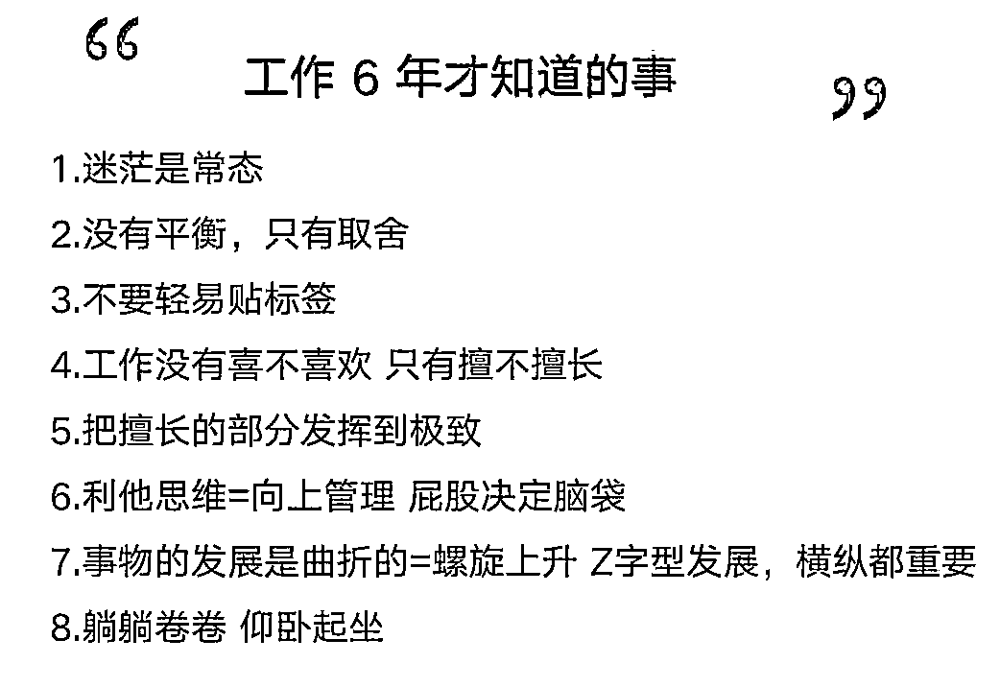

评论区：

 

 

万青 : 感谢分享，全程高能干货[拳头][拳头]

夏汉九 : 感谢分享，从管理者的角度剖析了工作中的问题，不管是打工人还是创业者都很有用。

周周Mia : 宝子太棒啦~一个月就成长的这么快速

Sherry💎谢无敌 : 实操派写的文章，只说干货，不带废话的[呲牙] 大闵 : 感谢分享，很干

嗡嗡嗡起JoyBoy : 我也是无敌老师的关门弟子[呲牙] 无敌老师yyds 佳能 : Yyds

佳能 : 不好意思，第一次发言不知道从文章入口进，附上飞书链接，方便阅读：

https://v4y8yg9y6n.feishu.cn/docx/QRLidI7zHoJxWix3Dr1csKObnsc**# ****(**精华帖**)(290**赞**)**我是怎么把作坊式的微商管

# 理模式**,**转变为流程化、标准化的运营模式的？

作者：  亦仁

日期：2020-06-15

今天的轻享预告点赞不达预期，大家对微商团队管理没有兴趣？

但实际上，不仅仅是微商团队管理，我觉得只要涉及到大规模线上团队的管理和协调，都可以学习这个模式，拿来主义，为我所用。

今天这篇来自  的轻享，实际上干货很多，而且是实战总结出来的经验，我相信仔细看，一定会有一些点启发到你。

废话不多话，来看分享，欢迎小王子👏

——

大家好，我是小王子，很高兴能够在生财有术再次分享，我今天的分享主题为：我是怎么把作坊式的微商管理模式，转变为流程化、标准化的运营模式的？

这是经过我几年微商团队管理实战总结出来的经验，希望能够对大家有一点帮助。

**1. ** 建立自己的运营团队

 

 

我在做微商两年的时候，开始对团队大刀阔斧的改革，目标：把作坊式的微商管理模式，改成流程化、标准化。

作坊式的微商管理模式，就是谁带进去的人，谁负责到底。比如，我招到一个代理，那从他的文案培训一直到他的回购升级，我都要负责。不管我有没有这个能力，有没有这个时间，我都要带人。

当然，有责任心一点的微商会带人。没有责任心的，收完钱就消失了，这种占多数。

曾经我这边在一年之内，裂变了大约30个微商团队出去。但是在接下来的一年里，陆陆续续的伤亡大半。我分析了一下原因：

1，不是每个裂变出去的团队长都有时间带团队。他们可能本职工作太忙，也可能家庭发生变故，导致没有时间在这个上面。

2，带销售团队跟自己做销售，还是有天差地别的。很多团队长没有这个能力来带。主要是原创能力不足。他们不会做社群运营，也调动不了大家的积极性。

3，很多微商团队长只想赚短期的钱，先赚一波就跑了。他们并没有长期规划的格局与眼光。

4，团队长们都活成了服务员，事事亲力亲为，要做海报、做课程、讲课、做社群运营，长期下来，非常累。

所以，我意识到作坊式的危害之后，我开始大力推行标准化、流程化。说人话就是：代理们只需要把人送进来，把他们送进微商学院（也就是我的运营系统）这座大机器过一道，他们出来之后就是合格的微商人。也就是，我们统一培训代理，专人专事，不要代理们费时间费精力带人了。

这个微商学院，每一期大约招募90人，他们专门为我微商团队服务的。这些人员来自本团队级别较高的代理。

先贴上我的运营地图：图1

一方面，我们作为微商，除了卖货，我还希望他们学会线上运营。尤其是微商团队的线上运营。

一方面，团队是大家的，不是我一个人的。我希望大家能有主人公精神，一起把团队做的更好。

于是我开始了微商学院的招募，一共分为三个学院。

 

 

导师学院：（两个院长负责）

销售培训组（负责我们新人培训、销售实战培训、朋友圈特训、故事课，等等）  产品知识组（讲产品知识，以及招商会的产品答疑）

朋友圈组（朋友圈培训、日常大型活动出文案模板、点评代理们的朋友圈）

运营学院：（两个院长负责）

公众号组（把我们大群以及大型活动更新上去，几乎是日更）

海报设计组（日常分享、大型活动的海报设计）

统计组（也就是财务，活动经费记账）

社群运营组（各大群，每次培训以及线上招商会，只要组建社群，都是他们去运营）流量学院：（我本人负责）

讲流量获取的方法，让代理们去学习

微商学院的人都是来自我们团队的最高两个级别的代理，他们对团队的粘度更强，也更忠诚。他们锻炼了技能，也对自己的业绩提升有帮助。

目前我们微商学院运作了一年半，一直在更新迭代。我们三个月招募一次，这样也给了新人很多机会，也给了老人带新人的机会。整个团队，实现了自动化运营。也把我脱离出来，我可以去做更高level的事情。

同时，微商学院，是为我团队发展保驾护航的。只要代理们去招募代理进来，我们随时可以承接。去年下半年，我突然发现如果一个微商团队没有流程化标准化，是承接不到大流量的。没有哪个大IP愿意亲手带人做微商的，但是如果我这边能解决这个后顾之忧，那就没有问题了。

**2. ** 建立社群体系

基础群：我们的基础群一共有5个，所有级别的用户都在里面。

目的：让大家用产品用的开心、放心、有信心，每日有课程安排，这样他们在大家的带动下，会自动升级以及回购。减轻了促单压力。

社群运营组会提前一周安排好下一周的课程。这样方便大家拿去朋友圈宣传。

（我们基础群的分享海报，每日不一样）

代理群，就1个。只讲销售与财商。只有最高两个级别的人能进来。

 

 

目的：让基础群的人升级进来，做代理。所有关于销售的疑难杂症，都可以发群里，大家互帮互助。出单就在群里打卡，相互刺激，让金钱与能量一直涌动。同时，每半年，我会请专业的财商课老师，带大家做一次基金定投。

微商手里现金流多，我希望他们不是验钞机，而是经过思维过滤网以后，真的变成自己的钱。而不是买豪车豪宅的糟蹋了。

（图2这是我们代理群的海报，分享较少）

全国总代群，就1个。都是对我们团队忠诚且业绩很好的最高级别的代理。有一些对外讲了会引起误会的话，我会在这里讲。这里是进行价值观教育的。一两周启用一次。

每个群的功能分明，职责分明，免得混乱。

我们这么设置，当时是考虑到有的人只想当个用户，并不想看见任何关于销售的内容，如果我们在群里发销售的东西，他们会认为自己被销售了，从而不舒服。

所以我们干脆分开。基础群就不讲销售，代理群就只讲销售与财商。

那么这么多社群，是谁在运营呢？就是我们微商学院的社群运营组在做。他们自己也分工很明确，每周有人提前安排好。

各种训练营的群：先由一个统筹发起项目，招募运营官以及小助手，安排好导师以及课程，接下来让海报组去做海报，由社群运营组来运营。各司其职，共同完成我们所有的训练营项目。

**3. ** 建立培训体系。

针对新人，也就是最低级别的代理，我们提供新人培训，内容包含：价值观教育（我亲自讲的）、产品知识、资料库的建立、出道文怎么发、如何加人、怎么开口讲产品、微商常用的APP使用等等。

作业是针对课程内容来布置的，文字、图片类型的就提交到打卡小程序，导师会打分。

开口讲产品的这个作业是：代理去跟自己的上级模拟一段买卖产品的对话。

新人培训一个月一次，滚动开班。

针对最高的两个级别，提供销售实战培训。价值观输出特训。

因为最高的两个级别，就是冲着赚钱来的，所以得有文案训练、销售实战训练。大家去实战，有导师来点评。大家在线共同学习。

 

 

还有其他的训练营，比如日进斗金训练营、瘦身营、美妆营等等。

我们的训练营收取的押金都很高，在500-1500之间，这是为了保证完成质量。

因为我做过六年英语老师，其中有三年半在机构做培训，我写过成千上万份教案、教学计划、作业设计，所以我会参与我们团队的课程设置，我忍受不了稀巴烂的培训。我知道什么课程适合什么样的学员，他们学了会有什么样的结果。

**4. ** 线上招商会。

我们2-3个月举办一次。关于线上招商会，我感觉又能写一万字了。我就简单说下吧。

一般是由导师学院年初做好规划的，提前半个月开始准备，先找一个统筹人，也就是项目经理。然后她牵头成立工作组：宣传、海报、审核、统计、答疑、故事、场控、公众号等等。

在正式开始之前，我们会彩排1-3次。一个是看时间卡点，一个是看大家的配合度。

我们以前搞过三天的，也搞过两天的，最近两次尝试的是一个小时搞定。我发现大家更喜欢快闪式的。最近线上招商会成交的客户，他们基本都是被我们运营吸引来的。

内容设置上，如果是一小时的，就没有专门的产品介绍，会在正式开始之前在群里要大家接龙产品的疑问，然后答疑组就开始工作了，他们会很快把那么多问题的答案写下来，等着活动答疑环节用。

那么我们一开场就是团队长讲团队规模、业绩、价值观。接着就是2-3个人讲故事。再接着，就是产品答疑。最后是促单环节。

我们会提前订制很多礼物，我们快闪式的招商会，一个群，一个小时成交额在36万左右，这是最近的数据。

招商会结束的时候，会有很多新人进来，在接下来的一周之后，我们会举办新人培训（大概为一周）。这个时候，新人往往学会了朋友圈框架、怎么开口谈单、如何整理资料、如何加人，也会出货，他们就会考虑升级。

再过一周（让新人升级），我们会举办销售实战培训。专门练硬核技能，就是出货。

从招商会到最后两次升级，基本不需要邀请人操心，我们微商学院的运营团队全搞定。

**5. ** 心法

 

 

看到这里，大家应该能看出来，我们一切活动都是运营团队在做。组建一个这样的运营团队，特别简单，但是难点在于如何让90多名运营成员除了卖货之外，还愿意义务做事情，还必须做的非常好。

接下来我重点讲讲这部分的心法。

01，  价值观教育。

我这边有个12字的价值观：克制务实、极致利他、长期主义。

这个就像公司的企业文化，给员工洗脑。心在一起，做事才不会累，才更容易出成果。

微商手里现金流多，一不小心就去赚能力圈外的钱，什么P2P啊，各种盘的，倾家荡产的多的是，我不希望我的代理们去干这些。所以，必须克制务实。克制自己的贪欲。

同时，也不要去链接一些不靠谱的人，因为这些人说不定哪天就爆雷了，我们容易受到牵连。

我一直提倡大家去做个人影响力，这是一个长期的过程。所以要耐得住寂寞，每日耕耘。打造个人品牌的核心就是长期且持续做一个靠谱的人。同时，我们项目还不错的，也是快消品，一直做，一直有客户回购，其实是一本万利的。我不希望他们今天做这个，明天做那个，做一辈子，还是个低层销售。

另外就是，我们要团结一致，互帮互助。比如，一起来做线上运营，共同运营我们的团队。

我们的价值观就是这么产生的。

如果你们也有做销售团队，一定要有价值观。不管是你们公司的，还是你们自己的，要把价值观挂在嘴上，从上到下，知行合一。这样你们的团队凝聚力才会越来越强。

02，在运营团队招募的环节设置上——竞争上岗。

首先，大家是通过竞争来的。这样大家会更加珍惜。

我们会提前半个月发出招募通知，并且做一张表格，内容包含：以下的8个工作组，你愿意进入哪个组？你曾经的成就是什么？你愿意在这件事情上花费多长时间？为了做好这项工作，你愿意付出怎样的努力（不低于三点）？

通过这样的提问设置，我们大致能了解他们的想法以及行动力。

 

 

第一轮挑选那些积极认真填写问卷的人。第二轮会筛掉那些平时不在群里出现的人，因为我们对TA的才华不了解，也不清楚为什么这次会冒出来。

确定名单后，我们的4个院长会分别去通知自己的队员，告知他们被录取了，并且附上一张精美的录取海报，上面会有我团队公众号的二维码。

大家一定会发圈，非常开心得到这个来之不易的运营机会。那么我们团队的公众号就被传播出去了。

03，运营团队的开营、结营仪式。

仪式感很重要。

作为团队长，我不会参与这些细节的。开营、结营仪式是社群运营组的工作范畴，全部交给他们自己去策划就好。

在开营仪式上，最先出场的是我，我会隆重介绍这四位院长，因为他们都是我的左膀右臂，在我们团队改革中，他们立下了汗马功劳。

我一一介绍他们，一方面是让他们四位以及所有人看到，我这个团队长没有居功自傲，也没有夺取他们的劳动果实，我是发自内心欣赏并且尊重他们的；同时，我也从侧面暗示新一期的运营成员：请你们尊重他们四位，并且配合他们的工作。

尽管他们很厉害，但是该给的情绪价值，要给到位。

接下来就是他们四位出场。接着是各个工作组的组长出场介绍自己。

开营仪式以及其他的社群活动，我总是能发现我们团队中的运营奇才。所以，如果你们觉得自己团队没有可以用的人，一般来是说你没有发现而已。

在结营仪式上，对功臣大赏，物质+情绪价值都不会少。

04，我每个月会给他们做一次分享。

这个分享不是培训，因为在运营上他们比我更厉害，轮不到我来培训。我主要是讲讲成长类的东西。

在招募之前，我们有许诺过：进微商学院，一个是可以获得技能，比如公众号编辑、销售培训、社群运营等等，我愿意给他们万人团队的背书，方便他们出去卖技能。

一个是可以优先获得我的成长经验，我今年的学费差不多有45万了。

 

 

一个是如果他们愿意转型的话，我会对接一些微商团队代运营的项目，他们要是在我们这里做的很好，我可以推荐出去帮别人做运营赚钱。

05，团队长的角色

我一年多没有参与过群里任何运营了，我都是在旁边静悄悄的看。我想要什么效果，运营团队去帮我实现。

团队里的定海神针。

说起来我只是团队的吉祥物，也是他们说的定海神针，就是随便他们怎么折腾，有我顶着。

团队长是引领者。

我作为一个团队长，坚决不做服务员、老妈子，坚决不养巨婴。我在前面走，愿意跟着的人就一起走。

我愿意让优秀的人更优秀，让牛逼的人更牛逼，而不是把精力放在末端。

团队长要出圈学习，链接圈外人脉。

我曾经组团大约40个人去学习社群运营课，回来之后我们一个眼神，大家都懂了，工作效率极大提高了，质量也更高了。

同时，作为团队长，也要花钱出圈学习。不要把自己框死在微商领域。

一年前，我在这里只分享了做法，那会我们的运营体系还不太成熟；一年后的今天，我在这里分享我们这么做的背后逻辑以及心法，因为这个体系目前非常完美且运营流畅，希望能对大家带来不一样的视角。

 

 

还是那句老话：纸上得来终觉浅，绝知此事要躬行。如果我的分享对你有用，那，就去练起来吧！

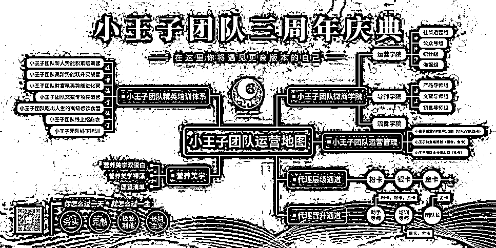

 

 

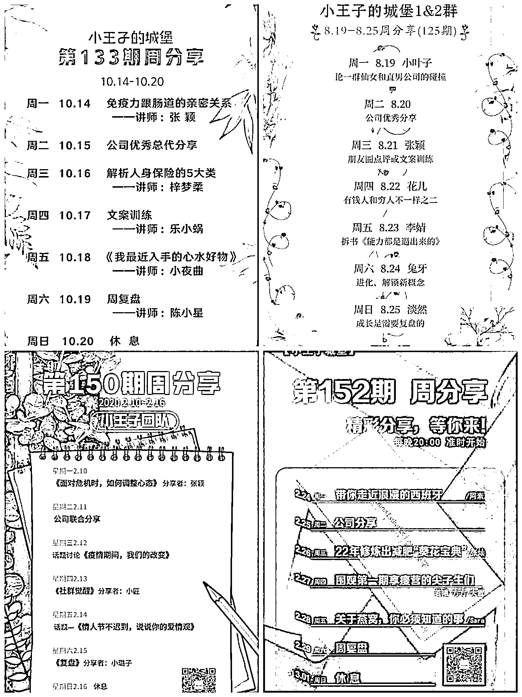

 

 

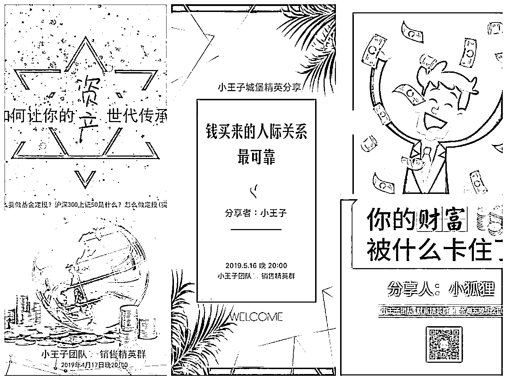

评论区：

张静伟@生财有术 : 王子姐姐[强][强][强]

星允 : 很专业，感谢分享

王燕楠Nancy : 非常好，感悟很深，准备借鉴，王子姐姐棒棒的

安神补脑爷 : 请问小王子姐姐，以微商模式做选品和一般的2c形式的选品有什么不一样？面膜您认为还有可以做的空间吗？

王子冯 : 面膜竞争非常激烈。我感觉很鸡肋。

王一的爸爸 : 学习了  太赞了

加油丫头💝 : 写的不要太好，Mark下来慢慢看

商家岛旭教练 : 感谢分享，真的是无保留分享啊

# **# ****(**精华帖**)(239**赞**)**微商团队的培训，我是怎么

# 做的？

 

 

作者：  亦仁

日期：2019-04-29

每周一，邀请一位圈友分享TA行走江湖的独特技能，谓之  。

本星球有很多人在做社交电商相关的业务，其中一大痛点是类微商团队的培训，今天我邀请了一位圈友  来做一场分享，她有很丰富的微商团队培训实战经验，也是咱们生财有术星球的老圈友了。

以下是本次分享的内容，enjoy！

微商团队的培训，我是怎么做的？

分享者：

大家好，非常感谢星主亦仁的邀请，很荣幸来做这个分享。我今天分享的主题是：微商团队的培训，我是怎么做的？

我是微商小王子，女，坐标北京。我是湖北人，之前在武汉上学四年，接着做了6年英语老师。于2016年11月中下旬，我来到北京。开始全职微商，算起来也有两年半了。

我做微商，最开始是被创始人的理念吸引：你们一定要在朋友圈打造个人品牌，赚钱只是顺便的事情。我是第一次听到打造个人品牌这个说法，就在朋友圈践行了两年半，现在看来，创始人无比聪明。所以，我们从一开始，不暴力刷屏，不无脑粘贴，全部原创，不断更新迭代。

这两年半以来，我一直做一款产品，是胶原蛋白类的。去年10月我才加了一款中高端面膜。由于客单价较高，所以客户群体基本是一二线城市的高知女性。因为他们有变美的需求、有个人成长的需求。我个人月收入从开始到现在，一直持续10万上下。在微商队伍里，不算多，只是比较稳定。

我旗下的团队，据不完全统计，现在是8000人左右。因为中间整合了好几次，每次整合，都会损失大约20%的人，就是他们趴在群里不动，我就默认为他们不想跟我们一起走了。

在微商团队发展初期，我们有一个目标就是：复制、裂变。这是什么意思呢？就是我们先从公司社群里学习一套社群运营的模式，随后我带着自己的人独立出来，组建自己的群——小王子的城堡。当时我独立的时候，只有200多人。

 

 

随着我这边独立强大，不断吸引销售高手进来。他们势必会带进来一支团队。当我的群满了500人，做的最好的那个总代就会带着TA的人马独立出去，复制我的社群运营模式。当我的群再次满500，那个最强的总代就又独立出去了。就这样，不断复制、裂变，最终，就像雪花一样满天飞。

两年半以来，我这边裂变出去20多支独立团队。但是还在正常运转的，只剩下一半了。

这是一个必然结果。总有人因为这样那样的事情，社群无法运转了，这是我不断调整的原因。

我中间做过很多调整，从来没仔细梳理过，真要写起来，我才发现这是一个庞大的工程。我们的培训是线上与线下相结合的，那我就从这两方面来分享一下。

线上培训

我们线上培训是最多的。我之前是一个人活成了一个团队，后来经过不断学习、调整、摸索，我弄了一个工作组，像公司那样去运营。调动大家的积极性，让大部分人都参与进来。

同时，我把群分成了两类，一类是基础群，所有级别的代理都在里面，当然，也包含了所有纯消费者。一类是销售精英群，全部都是最高级别的代理，大家就是来赚钱的。

第一步：设置工作组，七个，都是团队必不可少的。

1、  产品知识、代理制度组。

工作内容：建立本团队产品和制度相关的资料库。包括产品知识、反馈图、代理制度等，每个月及时更新。基础群内每个月保证两次产品知识的分享，每个月培训一次制度。辅助每月一次的新人培训。

2、  销售培训组。

职责：负责每月一次的新人培训内容设置、销售精英群每周一次的谈单训练。

3、  朋友圈组。

因为我们团队从一开始，就要大家在朋友圈打造个人品牌，要求大家文案都原创。所以，这个组是必不可少的。

职责：建立本团队灵魂文案资料库，搜集发的好的朋友圈，分类保存。组织基础群内每周一次的文案训练和朋友圈点评，以及新人培训中的文案训练。

 

 

4、  海报组。

职责：负责我们团队的各种海报制作。基础群每周一张课表，每日分享的主题海报设计；销售精英群的海报设计；我们一个季度的招商会海报设计。

5、  社群运营组。

职责：负责群互动、安排群分享。每个月的28号，联合各个工作组，提前提交下个月群分享安排框架，比如值周群主的安排、月主题、互动话题玩法等等。

每周四提交下周分享安排，周四的时候收海报。

6、  公众号组。

职责：收集群里每天的分享，编辑好，再发在团队公众号上。

7、  督查统计组。

职责：1）统计团队每日，每月，季度，年度出货，完成月度，季度和年度统计表，并做数据分析。2）统计监督销售精英群打卡，一个月不互动不参与的抱出群。3）团队财务管理。包括各个级别的培训营和线下培训时，参与人员的财务表格记录和存档；团队招商会备用金记录和存档；团队日常备用金记录和存档；

监督和提醒出货的代理，上缴备用金，发红包，并作记录和存档。

第二步：具体的社群运营。

上面有提到我把团队分成两类，一类是基础群，一类是销售精英群。

基础群里一部分人是纯粹消费者，这部分人的比率很大。我们团队成员是集中在一二线城市的高知女性。她们爱学习，爱美丽。那这个群的目标就是让大家消费产品的时候，吃的开心、聊的开心、学的开心。那我们就提供一系列的课程给到她们。

这个群还有个重要的功能，就是把消费者转化为代理。

针对这个群，我团队提供的课程有：拆书（每周一本）、朋友圈点评、原创朋友圈文案训练、产品基础知识、常用APP的使用、育儿、如何用手机拍出好看的照片、女性如何在婚前婚后保住自己的财产、化妆系列、女性保养系列、经济法律系列、两性关系系列、男士/女士穿搭与色彩搭配系列、职场系列、时间管理系列、代理故事等等，非常丰富，每天晚上都有。

这些分享者，大部分都是来自群里的代理以及客户。因为她们有医生、职场白领、全职妈妈、在读研究生与博士、好几个小语种的翻译、老师、企业管理人员等等，他们就发挥自己的职业优势以及个人爱好，到群里分享，引起同类人的共鸣，同时，也是给他们提供一个发挥自我的空间。

 

 

很多人不缺钱，但是缺爱、缺乏价值感、缺认同感，我这里能给到你。

很多人缺钱，但是缺少方法与认知，我这里也可以给到你。那就是第二类群了：销售精英群。

销售精英群的人，目标非常明确：赚钱。这群的日常就是每天打卡5条原创朋友圈文案、每周一次思维碰撞。这个群的格局要稍微高一点。因为我们要培养能带团队的leader、还要培养挖掘销售能力厉害的代理出来。同时，他们是我的左臂右膀，不管在任何场合，都能一呼百应。所以，给到他们的，除了赚到实实在在的现金流，还有就是思维：

比如财商思维，让我们赚的钱，不断增值，而不是拿去买豪宅豪车瞎霍霍。推荐一些非常好的课程，大家一起去学习，让我们无形中凝聚力更强。

在某个程度上来说，这个群的人，其实是我的人生朋友，而且是非常重要的朋友。即使以后不做这个品牌了，我们依然很铁。

第三步：三个代理级别的培训。（假设这三个级别分别是：市级代理、省级代理、全国总代，看字面意思就知道，这三个级别依次升高。）

新人培训。

培训对象：最低门槛的代理，也就是市级代理，投资4200或者6600\. 这个级别的代理定位是：只卖给消费者。无法招商（招代理）

我们每月一次新人培训，内容一直在更新迭代。但我们的内容主体大同小异，主要包括：我团队的发展史、产品基础知识与代理制度、资料库如何建立、微商常用APP的使用方法、心态建设、如何引流、如何开口谈单、新人如何发朋友圈。

销售实战培训。

培训对象：省级代理、部分状态不好的全国总代。他们手中有货，既可零售，也可招商。

一般来说，我们新人培训的时候，就会给大家灌输一种思想：升级快，不被动。鼓励大家升级，不管是自己消费，还是做代理。

那么，新人培训结束三四天，是我们促升级的好时机。重点对象就是参加新人培训的这些人，打铁趁热。我会在销售精英群提出要求：大家都去促升级，参加我们的销售实战培训。

随后，就进行销售实战培训。一般在14天，我们尝试过21天，太累了！不管是学员，还是导师，都非常非常累。所以，改来改去，确定10-14天比较合适。

 

 

我们内容有以下形式：

1）  给出模拟场景，俩俩搭配，先模拟销售，随后相互点评。晚上八点，导师在线点评，大家共同学习。

2）  直接实战。要求每天至少跟三个人聊天，不少于十句。晚上八点，导师在线点评，大家共同学习。

3）  灵魂朋友圈的发圈方法。尤其是要大家注意招商文案这一块。

全国总代培训

培训对象：团队里的全国总代。我们大约一个季度来一次。时间12天左右。一般我们是联合其他大团队一起来做。

培训内容包括：销售力的提升、领导力的提升、陌生市场的开发等等。我们中间会穿插销售实战，以小组为单位，大约30个人一个小组，搭配成15对。这里就没有模拟销售的环节了，全是实战。搭档先相互点评，晚上八点导师在线点评，大家在线共同学习。

在线招商会。

一个系列的培训下来，一个季度了，就会办一次线上招商会。瓜熟蒂落，检测我们培训效果，一个是代理平时出单情况，还有代理的状态，一个就是我们招商会了。

线上招商会的具体操作，可以见下面的链接，我前段时间写的。我们每次成交额在100万左右。

线下培训

这个我们分好几条线了。

其中一条主线是我们品牌方，差不多每个月都会去一个城市举办线下分享会。以前在线下分享会上，会讲解产品知识、代理制度、总代故事。

后来讲的有总代故事、销售技巧等等。

品牌方去现场，其中一个原因就是想增加代理的凝聚力。能量这个东西，对于销售人员来说，非常重要。

一条线是大团队的全国巡回线下分享会。内容有激活你的能量、财商思维、销售实战演练等等。有时候也会邀请大咖人物。这是收费的，价格在1000元左右。两天。

 

 

还有一条主线是品牌方有一个培训学院，我也是第一梯队的导师。只培训全国总代，从报名的人中挑选一批。一般也是两天。内容包括朋友圈、销售、带团队、开发陌生市场等等，特别实操的内容。有理论、有实战演练。

最后就是我们自己代理，线下搞的小型培训会太多太多了。有五人的，十人的，二十人的，主题各不相同。形式也是多种多样的，可以某一个代理自己办，也可以几个团队的人联合举办。

最后，我说一下，我们各个级别的培训导师，尤其是销售实战培训以及全国总代培训，都是团队里做销售最厉害的那一批。因为他们一直在销售第一线，他们永远知道客户最需要的是什么，读者喜欢看什么，也知道代理在想什么，所以他们做培训导师，是最合适的。

有的微商团队，说是花几百万请的营销专家。我觉得很可能是个噱头而已，纸上得来终觉浅，绝知此事要躬行。不在销售一线经过千遍万遍的锤炼，很难把培训做起来。

 

 

我的分享到此结束，感谢亦仁，感谢生财有术的各位老板。关于微商团队培训希望深入交流的圈友，也欢迎加我微信wangzi9735，备注生财有术，谢谢大家。

https://mp.weixin.qq.com/s/cPhZP16b45LZwtVsKStU2Q

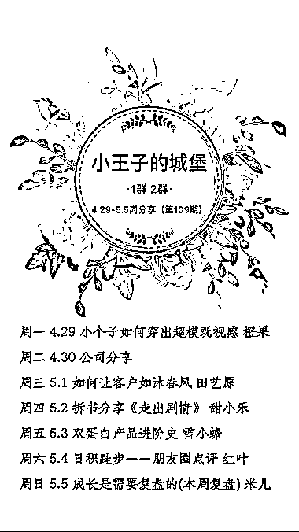

 

 

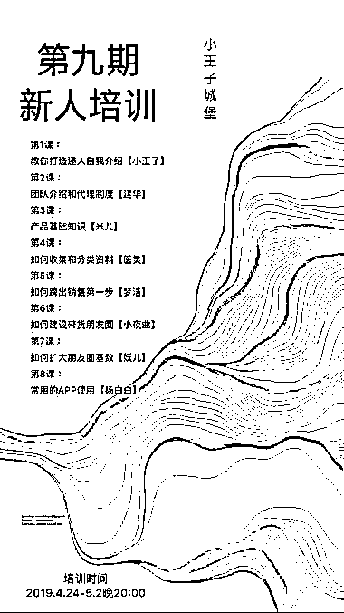

 

 

评论区：

Auroraaa : 6666666

于洋 : 先赞后读[呲牙]

小炳同学 : 胜读四年书啊…[强][强]

森淼 : 厉害 

亦仁 : 本篇分享收到的赞赏将全部转给  。

杨涛 : 来了啊厉害的小姐姐^_^

wier : 666

张秋兴 : 刷新了我对微商的看法，佩服

 

 

# **# ****(**精华帖**)(64**赞**)**私域做团队管理如何从** 1-100 **

# 把规模放大？

作者：  郭威

日期：2023-06-21

哈喽，大家好，我是郭威。目前私域主要经营母婴大健康，销售团队总人数 500+，中后台人员 50+，年零售端营销亿+。

要想把私域经营好，拥有长期效益，团队管理是最重要的，尤其是对于已经完成 0-1 阶段的团队，怎么从 1-10 和 10-100 把团队规模放大也是一个重大难题。

团队从 0-1 发展，重点是在于把团队模型建立好，通过算流量、人工成本以及其他成本去把利润最大化。而从 1-10 就要结合业务的发展情况去做标准，筛选优化，比如要拥有一个完整的人才培养标准化流和业务模型的标准化流程等。

接下来的分享主要针对已经完成 0-1 的团队如何少走弯路，和从 1-10、10-100 的规模放大两方面，希望这次分享对大家做私域团队管理能有一定帮助。

一、个人介绍

坐标：湖北武汉；

 

 

13 年大学毕业开始创业至今，做过 SEO、淘宝、淘客、竞价单页、14 年全力做竞价+单页结合 QQ 经营。

15 年开始接触直营，做过大健康保健品、护肤品等 7、8 个细分赛道，17 年团队 50 人左右，日消耗 10w+，年营收 3-4k.

17 年底政策原因团队放弃原项目，砍掉团队。转型做其他相对阳光的赛道继续直营，陆陆续续投产了 2 家食品加工厂，主营特殊膳食营养补充剂、片、膏、固体饮料等等功能性保健食品，合计万平。

二、私域运营大概情况

我个人认为私募屯粉是相对其他任何公域流量拼杀之中相对更稳定持久的。价值很大，所以自己团队也一直在深耕。

建议大家有客户，有流量的，一定要多多囤积精准客户，做好 0-1。没有开始囤的，马上开始囤起来。有囤起来的，只要成本能接受，放大量去囤。

关于私域的选择

 

 

（1）赛道我认为比较关键：选行业选赛道，花同样的时间精力，不同赛道结果差距很大。

选择赛道可以根据流量获取难易情况以及流量价值多少来综合衡量。有一些赛道单粉成本 300-500，也能干，不看成本只看价值和能否稳定获得流量。

比如工厂我们的客户成本 300-500 就是能接受的。猛上 1688 店群，超级工厂等。成本能接受的范围就猛干。

（2）选品核心：高毛利、高复购，部分产品毛利不够高，客单价足够高也可以。如果只做一次生意，那就想办法针对客户人群去挖掘客户需求，提供更多的产品和服务给客户，深耕客户，挖掘客户价值。

（3）微信囤积。前期做好微创新就可以了，在流量成本不高的时候，或者利润还不错的时候，一定要勇于大量囤积资源。资源=钱。

有了资源后续在逐步挖需都来得及。小团队多加同行，多看同行，前期做复制加上微创新就行。团队成规模后，在来结合自己项目情况，专门组建文案、策划、供应链等等服务团队。

三、关于团队

 

 

关于 0-1，核心是看赛道选择，和执行力，多看同行标杆学习。今天我们所有的分享的提前是流量自己能想办法解决的前提。

我一直认为，限制私域做大的核心是流量。流量有多大，团队就能有多大，这个是前提，其他的都是我们相对可以内化解决的。

关于从 1-10，是我 14-16 年踩过的坑，没有什么社群，没有什么交流，闷头干活。也没有接受系统化培训、训练。所以现在有这么好的分享平台，能够学习到很多东西，相较于当年，少走 N 多弯路。

团队放大的过程，其实就是使用杠杆的过程。我认为需要用上三个杠杆：信息差，人才资源，资本资源。

第一个最简单的杠杆，就是信息差，我们能够完成 0-1，就是因为信息差；我们可以完成 1-10，也是因为信息差，资源差。

抛开这个信息差，我们来谈 0-1 迈出去比较核心的，是人！

人的资源放大，个人的时间精力有限，开始要学会发钱买时间，买解决方案，买结果。

先算一下自己的项目，如果是请人来看，投资回报率怎么样，如果自己干一个月利润只有 3k，那只能请兼职。

兼职花 1k，自己赚 2k，10 个兼职，也是 2w。自己干利润 2w，花钱请人 5-6k，找 10 个人能干，理想状态下，利润就是 10w+；

 

 

当然这就是类比的例子，对管理，财务控制等都有要求，但是完全靠自己，天花板永远有限。

这也是我提到的人才资本。其实迈出去的第一步，就是大量面试和招聘人事。花钱买结果，在人身上舍得投资，花钱。

投资人以后给一定的时间周期，团队初期要计算单人投产，杀伐果断，有利润或者觉得未来能有利润的人留下，及时清理没有利润的人（负债），不停筛选人，人提高人均利润。

这个阶段就是打团队模型的阶段，对个人来说是 1-10，对团队来说其实也是 0-1。

通过不停的优化人，优化项目细节，来使得人均产出逐步提高，最后可能有一些能有利润的人也要被替换，因为产出比还是不够，资源是有效的，把有效的资源尽量发挥出最大价值。

最后一个是资本资源。很多人在模型非常好的情况下，最后发现可能现金流不够，因为广告费、账期的原因，没有及时的放大团队。

尤其是模型打磨好，流量渠道也可以，优质且便宜，但是基于现金流或者其他原因，没有及时放大规模。这时候就考虑资本资源，自身可以想办法协调抽、借资金。

第二个项目模型好，可以寻找资方，开放式的思维看待问题，资金永远都是缺项目的。

基于资金为提前，找到能够为项目本身赋能的团队来投资效果会更好。少走弯路，及时放大。

 

 

很多项目都是有红利，周期，及时抓住机会很重要。团队 0-1，1-10 其实相对比较简单，模型 ok，流量需求也不算大，舍得花钱就可以。10-100 的时候基本上就要有一定的中后台搭建能力，需要在 2 个层面做流程机制。

第一个是人才培养标准化流程（**SOP**），第二个是业务模型的标准化流程。

人才培训 SOP，从入职，培训，到销售团队；需要的学习内容、接受训练内容、成长路径，不同阶段的内容跟进团队情况及时优化调整。

这一段话看着简单，其实要付出很多努力，但是每一个团队放大的必经之路，看视投入大，实际回报更大。

业务模型的标准化流程，这个字面意思。将需要操作的内容，合理分工，专人负责，常态化进行，也就是中后台搭建。

以上 2 点，一点是人，一点是事，配合起来缺一不可，两者结合威力很大。

关于私域标准化，重点来讲一下：

（**1**）销售模型的标准化：引流进微信以后，我们主要是从 3-4 个版块来对客户进行营销。

1、朋友圈

2、群（部分项目可能没有）

 

 

3、私聊跟进

4、客户的朋友圈

所谓的标准化，就是员工进来以后按照我们的基础要求去做，就能达到我们的保底的数据要求。

核心点：达不到就淘汰洗人。

举例子：未购买客户、意向度不同客户、已购客户、已知高净值客户标签等统一设计要求，不同类型的客户不同的维护标准，朋友圈发布的内容都阵针对性做好区分。

私聊版块，从进粉以后打招呼，到人设背书，产品背书的内容都需要公司提前做好设计。甚至如何报价，如何逼单等都需要用流程，团队放量的过程之中坚决不让普通员工随意发挥，先模仿，在超越，慢慢的可以可以让一部分优秀的人来尝试，并且把优秀的人的方式想办法提炼，来做模板标准。

公司需要设计好对应的流程和提前准备好工具。只需要培训员工如何去按照要求执行。

并且结合实际情况及时复盘，优化调整标准化的内容。

（**2**）员工培训标准化：从入职，到培训，员工成长计划等，下销售团队以后前中期学习内容，考核内容，淘汰标准都提前做流程设计，和前面营销端的要求相呼应。

（**3**）另外的核心点：根据资源的总量，做好分配，保护强者。

做好人均成本核算，人均产出，根据产出比优化资源分配机制，人才筛选。

 

 

最后团队继续上台阶，其实就是分蛋糕。独行快、众行远，做好利润分配才能更好团结优秀的人持续干。

利润分配永远都是为了给能持续提供价值的人，做好价值交换。

私域团队的核心人员，很多时候都是销售团队负责人。这个时候就是 10-100 了，把公司平台化。

四、关于利润分配的几种模型和方式

仅供参考：

按照团队进行独立核算，销售团队核心负责人分红自己团队利润一部分。可以定目标分红，不同目标不同阶段的分红比例。比较独立自主的，可以直接前期固定一定比例份额。

根据自己团队的中后台，把销售和中后台切割核算。分红、虚拟股权、实股、超额分红，等等玩法也挺多的。

 

 

讲到这里，感觉还是要结合项目模型的不同来具体设置，玩法比较多，我们自己团队也有很多需要优化的地方，总之核心在于，价值越大，我们要逐步放利，以增量利益分配为主。

回顾：

0-1，重点是模型，算流量成本-人工成本-其他成本-利润产出情况。

1-10，结合业务情况，做标准化，批量上人，筛选优化。最后公司平台化，拆分业务单元，设计合伙人体系放大。

欢迎大家多多交流。同时也希望对部分兄弟有所帮助。

最后：

欢迎有母婴、功能护肤流量团队联系合作，有产品生产需求的兄弟合作，有 0-1 已经成形，需要放大的兄弟合作联系。

评论区：

佳能 : 太干了兄弟，可以链接一下吗！给个方式

阿鱼 : 怎么联系

亦仁 : 感谢分享，已加精华。

苏生 : 感谢分享

23岁的王小熊 : 文章写的太棒了，想问一下下一步应该如何平台化呢？

 

 

# **# ****(**精华帖**)(59**赞**)**不同行业私域如何搭建社群体

# 系及运营团队

作者：  红师私域椰子青青

日期：2021-12-20

目录

1\. 不同社群的分解和团队搭建方式

2\. 如何搭建社群

1）门店私域（餐饮、产康、超市连锁）

2）电商（直播/电商、品牌）

3\. 总结

---正文---

非常高兴应生财邀请分享我的私域操盘框架搭建经验，写文章的原因是我在做项目服务的过程中发现，很多老板或者操盘手都希望知道自己的业务究竟是怎么样搭建的，需要有什么样的结果。

这次介绍的分两个部分，第一部分介绍的是框架搭建的方法及团队如何组建，第二部分会分享实操的项目全案拿去就用。希望给生财各位朋友带来的是超级、超值的干货。

（篇幅有限，如果讲完整可能写不完，大多数取精华搭建部分，不过多赘述执行及数据）

 

 

**-01-**

不同社群的分解和团队搭建方式

作为一个经历过知识付费、门店私域、电商私域、社交电商经历的操盘手，我很负责任的告诉大家，每个不同种类其实有不同的搭建框架。比如 1V1 销售的注重朋友圈和销售话术，社群团购注重产品的迭代和团长的招募，门店私域则是拓客和用户维系，电商的则需求也不一样。不同品牌如何搭建自己的私域团队需要的是不同的方法。

哪些品牌要筛选，哪些要精细化运营，哪些就是暴力方式。精细化怎么做，粗放的怎么做。负责人需要有一定的经验或者框架思维，能理解顶层的逻辑以后，不管是操盘哪些类型的方案，都会信手拈来。

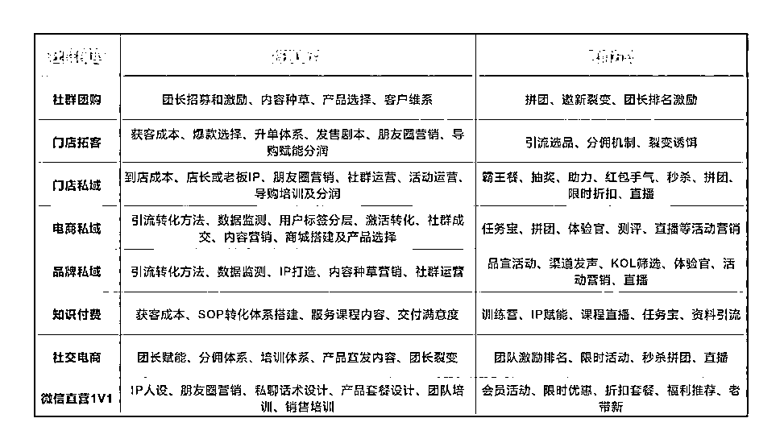

（每种私域的不同、相同罗列）

** **

同时，客单和消费频次、需求、渠道也会决定客户的搭建方式。** **

 

 

举例：如快消品、高客单的产品、低客单高复购的产品等不同的搭建模型。如果你正好想搭建私域项目，可以在一开始就想好自己在哪个象限并且用什么样的方式做私域。

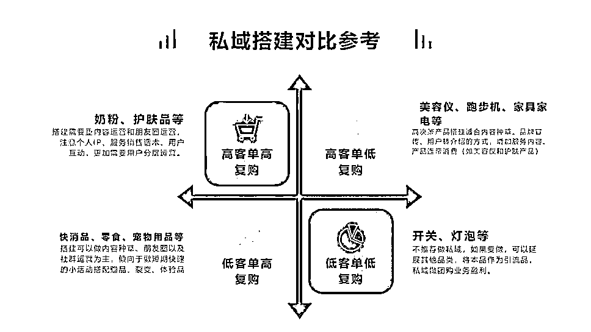

（四象限图举例）

搭建方式有两种：小团队，大团队。

**1**）小团队** **

小团队最重要的是：缺人！很多小团队甚至是 1 个人单独运营，因为老板在招人的时候很喜欢直接找一个社群运营想解决所有的社群搭建问题，这很难！所以，1 个人的团队要怎么做社群搭建呢？

可以从：IP、朋友圈、社群运营、内容运营、活动运营、商城搭建来顺序进行。

 

 

这里需要注意的要点是：如果精力有限，先挑重点的话，老板一般喜欢先看效果，因此一定要记得先做引流和转化的闭环，也就是先建立人设，做引流动作，同时转化到社群里，搭建好（或者直接快团团之类的）开始卖货。先动起来，再慢慢完善比如活动、内容、朋友圈，都是来得及的。

**2**）大团队** **

大团队最大的难度就是：分配任务和时效性管理。人多并不是力量大，如果大家都没有明确的分工和职责，很容易产生吃大锅饭的思维，推卸责任。

这时候大团队——3 人以上的团队一般开始先要明确项目分工，明确任务责任到人，同时也要做好利润分配和激励政策。让每个人都有动起来的动力并且知道自己要做什么。

激励机制的奖励方法参考：以部门奖金池的方式季度或年度进行奖励，个人奖励以一线员工——部门负责人线路进行业绩激励，设计中一定要独立到个人，一线社群销售可以以基础薪资+提成方式进行，这样一线员工在进行社群销售的时候能够发挥出更大的积极性。

搭建的过程可以从：  团队搭建、团队管理、分工，IP、朋友圈、社群运营、内容运营、活动运营、商城搭建开始做。因为大团队人多、完善，一开始就可以做好内容赋能。这样有效可以增加转化率并且提升人效。

 

 

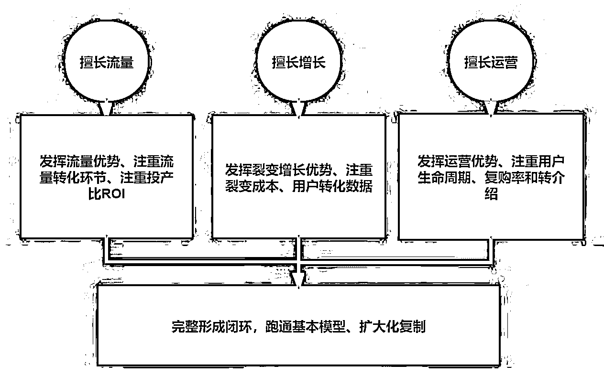

因为不同的私域需求，也产生了不同的体系搭建方法，跟团队的基因也非常有关系，擅长流量的团队建议以流量优势发挥出 ROI 的投产比即可，多关注获客成本和转化成本。

如果是擅长增长的团队可以设计好裂变诱饵，多注重裂变成本和客户转化活动。而擅长运营的团队需要发挥出运营的优势，精细化运营客户，挖掘客户的长期价值，注重客户的生命周期。

讲完不同社群的分解和团队搭建方式，可能大家会觉得很复杂，并且无从下手。

所以以下我分享的是，以实操的门店和电商私域为例讲讲如何搭建社群方案。

**-02-**

 

 

如何搭建社群

**1. **门店私域（餐饮、产康、超市连锁）** **

拓客是很多行业的干货需求，因为拓客相对来说短平快有效果，对门店来说就是刚需品，因此私域有一大帮操盘手都是以门店拓客作为切入点、一直在讲发售的。那么门店拓客的类型也很多，并不只有一种，所以下面介绍三种有代表性的。

**1**）餐饮** **

关键词：到店需求、转介绍、品牌口碑效应、**KOL**筛选** **

餐饮需要的是运营人员有极强的营销意识的，因为餐饮大多数属于客户数量多但服务较重的项目。以下我以一个连锁餐饮的门店私域搭建方案为例展示私域方案的方法和思路。

搭建框架：模拟用户进入私域的路径，搭建私域。通过入店的流程、接触点，再到与店员的接触点，用户产生的行为及结果，我们通过这样的模拟，就可能很快的做出一份社群的门店方案，思路如下：

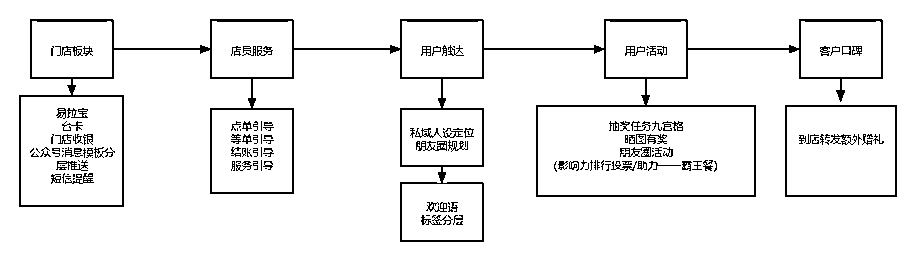

 

 

在门店方案中，也需要按照顺序进行方案的调整，我们曾操盘过的一个餐饮门店项目方案如下：

 

 

 

 

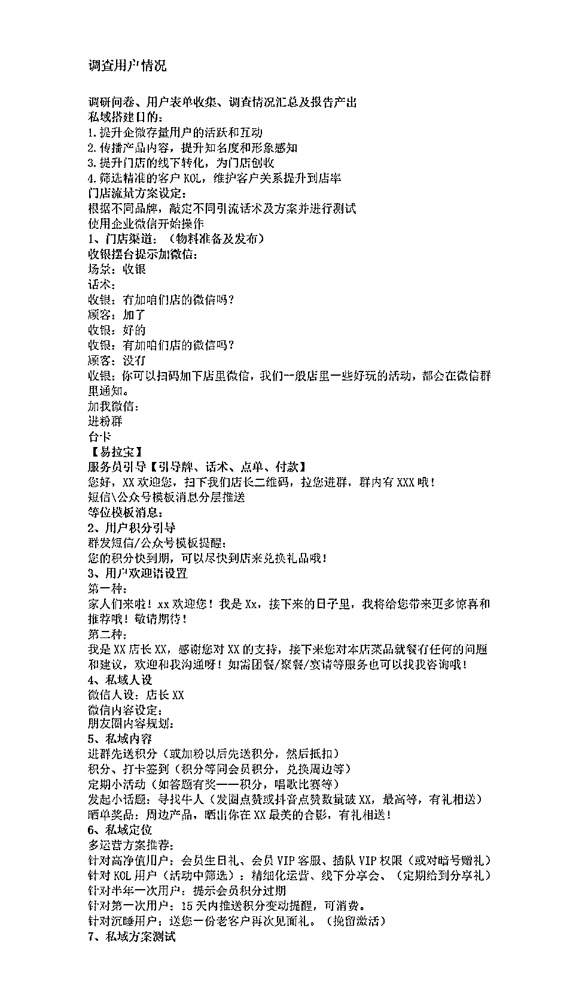

注意：餐饮拓客注重引流诱饵选择，运营注重用户的长期维护和到店。

整体思路中，标注好方案的节点、时间、人员安排、统筹、执行，即可形成相应的项目管理图。在搭建的过程中，同时注意要有闭环意识，比如我在做方案的时候，会从引流，承接人设、私域内容、话术、私域定位来确定方案，并且需要做AB测试，及时关注数据变化，进行分析来调整方案。

没有谁的方案是一次性过掉的，所以总会有调整优化的空间，有些方案在这里行得通，但是换一个时间、换一个人甚至换一个条件，都有可能产生不同的效果。

作为操盘者和项目参与者，预期好这样的心态，随时改进和迭代就好，也是互联网人必须具备的心理素质要求。

**2**）产康拓客** **

关键词：客单高、充值升单、导购激励和培训、用户转介绍裂变。** **

短期的拓客活动方案展示如下，大多数的高客单门店经常有拓客的需求，利用社群邀请、任务宝、分享卡等形式进行拓客非常有效。因此，有很多公司会专门以拓客为业务点进行合作。

这种门店因为客单较高，需要及时的动员导购来进行销售，对店内服务人员的激励必不可少，这样后期升单的空间和效果特别好。（谁用谁知道）但是门店导购一般文化水平有限，活动方案也需要先进行培训告知操作方法。

 

 

门店的拓客利用就是人性，贪婪、虚荣、炫耀等情绪去做分享和裂变的转介绍，因此，在做方案的时候尽量多考虑人性，多考虑人的心态，并设身处地想一想如果是自己会不会有兴趣参加，如果能打通这个关键节点，方案一般不会太差。

拓客方案最重要的就是如何利用好现有门店的资源（如没有会进行地推、线上投放等形式获取流量），进行用户的二次分享裂变或转介绍。基于社群的多层裂变会产生波纹效应，从而达成 1+1 大于 2 的结果。以下就是门店的拓客活动方案，方案最终数据结果是社群转化率 20% 到店进行消费，并且充值数十万元。

 

 

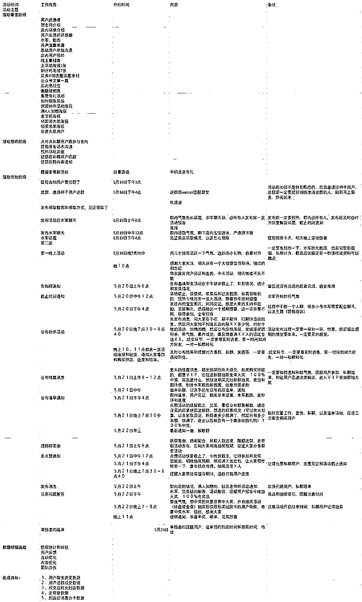

 

 

长期的产康社群需要利用 IP 人设着重搭建，着重服务和态度，人性化顾问。因此，在做社群的时候一定要注意利用好每次和客户接触的机会，并且给客户打好标签。做框架方案的时候就需要把这些注意点写明，这样的方案才是完整的。

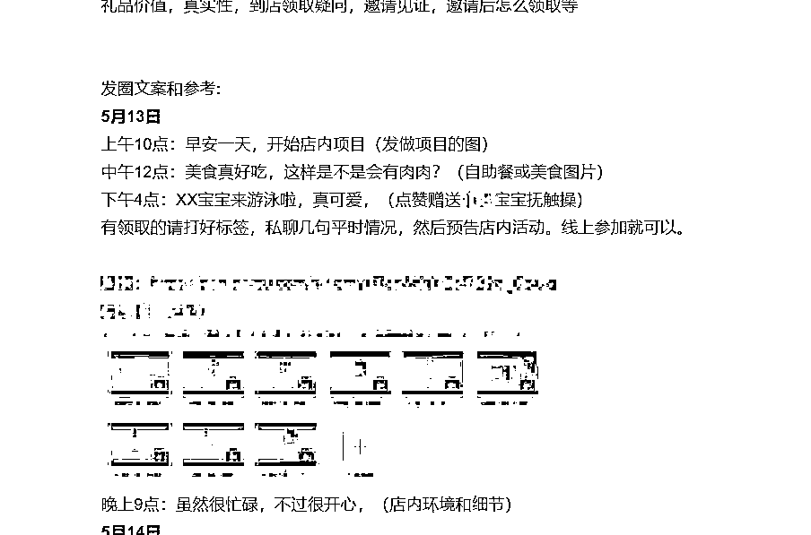

**3**）超市** **

关键词：客单低，利用门店导购，注重导购赋能、宣传效应。** **

在搭建方案的第一步，我会先做一个思路导图，来梳理清楚方案的框架思路，一般会按照基础流量的运营、用户运营、活动运营、平台支持等内容做一个闭环导图，通过以下这个图我们可以看到方案的雏形，有了这个框架图，做方案也就是优化流程和内容即可。

 

 

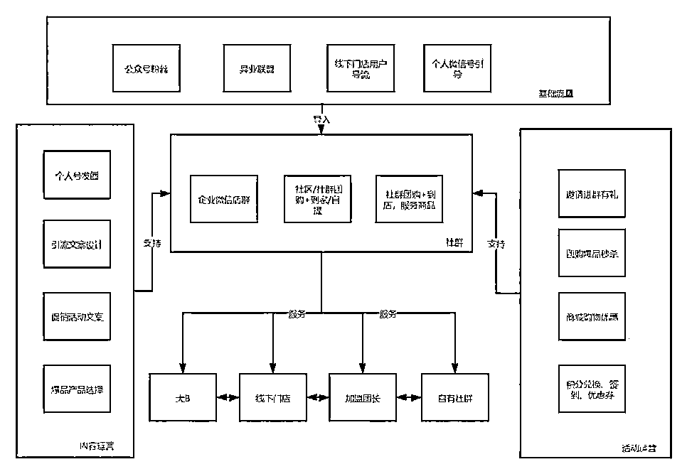

因为有了以上的框架思维，就需要做活动的方案了，以下是活动方案呈现：

 

 

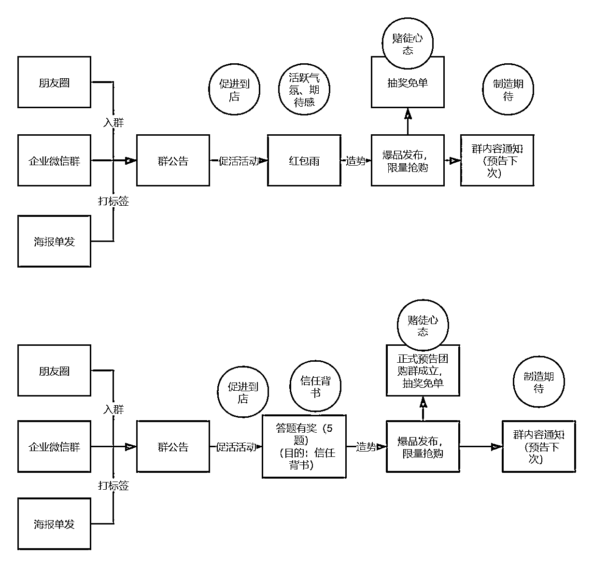

将活动的进入路径如餐饮门店项目一样进行解析，利用用户进入的触点和路径设计好两套不同的方案以供测试或讨论。通过以上的方案设定，我撰写了如下的活动整体方案。

 

 

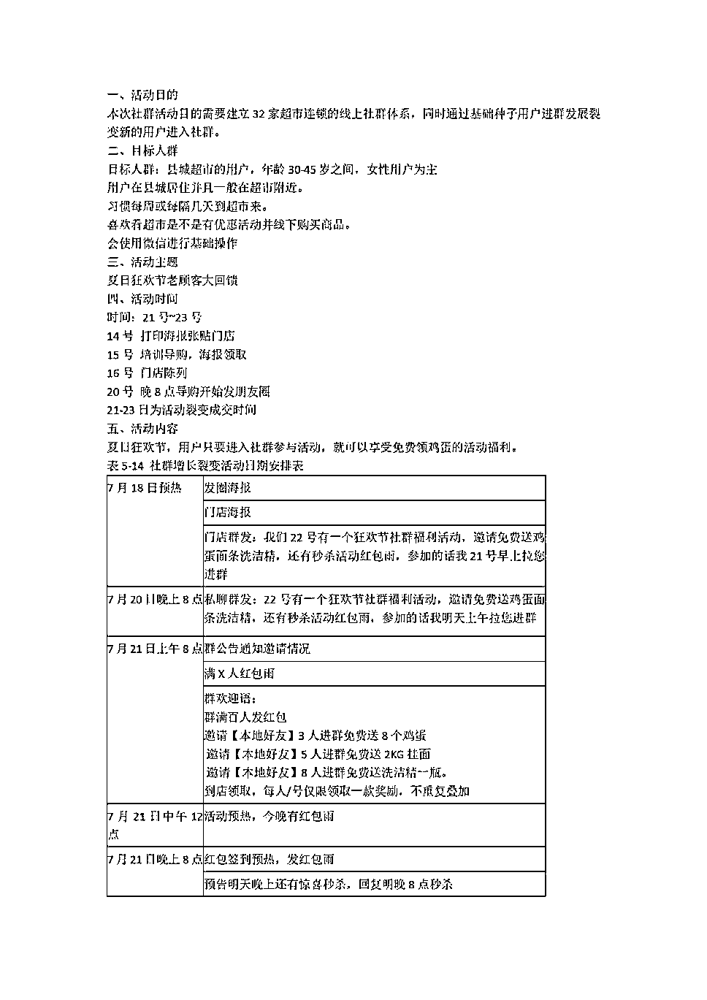

 

 

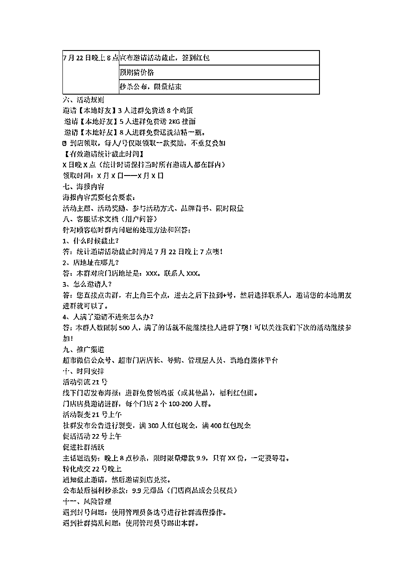

 

 

整体方案中包括了细节的比如：邀请话术、邀请时间、活动节点、培训计划、风控计划等，以上方案经过二次讨论和确认就可以进入到执行的项目甘特图中了。

活动方案最终执行结果：3 天 1.5 万线上社群流量，100 万线下充值消费额。

**2. **电商（直播**/**电商、品牌）** **

**1**）直播**/**电商** **

关键词：抖音、淘系电商转私域的体系搭建方法（引流、承接、转化、内容）** **抖音电商母婴直播转私域案例：这里需要模拟的是用户的全生命周期流程，把自己当一个消费者，来去演示这个流程和找到合适的对策。

举个例子，如果是一个母婴用户进来，那么首先，从进入这个板块就要开始想，这个妈妈是从什么地方了解我们的？我用什么样的方式能和她快速建立联系并且让她很快明白我们是谁，我们要做什么。

其次，就是进来以后，她有什么样的心态，是好奇？惊喜？无聊？还是负面，每一个不同的心态，我们要用什么样的方式来做回复、提醒的话术，让她留存呢？

再次就是成交转化，通过一段时间的激活和运营，她会产生什么样的感受，会不会购买成交，在什么场景和氛围之中，她会买什么样的产品、做什么样的购买决策呢？

最后，就是链接和再成交，通过一环扣一环的方式，一边模拟用户进入、一边去撰写你的方案话术，就会起到事半功倍的效果。

 

 

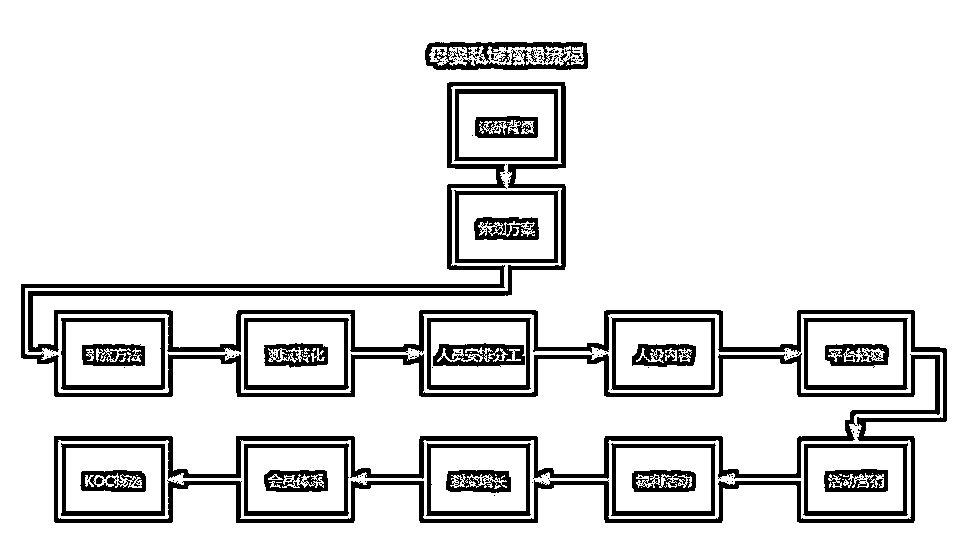

步骤一：策划方案** **

方案策划分为几个大部分：社群搭建体系、时间推进表、人员分工安排等，其中又会细分成每个板块的执行和配合、推进进度时间，同时也有关于社群运营中的时间节点的把控。

比如一个社群如果是初期阶段要怎么进行社群的活跃和链接？到中期又如何进行群成员的促活和话题活动？到后期又要怎么样做用户的留存和激活？这些都是需要考虑进项目的。

步骤二：引流方法** **

我们引流是通过和一个本身就在抖音做母婴绘本项目直播卖货的 IP 合作，他们一天能出一两千单，通过包裹卡的方式，每天引流一两百人到私域。

我们的流量来源都是特别精准的母婴粉，所以我们在包裹卡上会以母婴绘本直播间的 IP 形象来让宝妈们加微信进行育儿交流、福利分享，这样这个卡片的来源、产品和链接都是宝妈所熟悉的，她们也会希望能加微信、进群来获取后续更多交流。

 

 

我们测试过很多不同版本的包裹卡效果，最后我们用的包裹卡几乎做到了0成本引流，这个包裹卡被设置成一个刮刮卡的样式，结合奖品、优惠券、现金红包三种不同的奖项进行抽奖刮卡，通过刮刮卡引流私域的转化率能达到11.9%。

后面我们也有做其他类型的测试，发现还有一种方式也有非常不错的转化方式，就是不直接做刮刮卡，而是把奖品设计好以后，直接告诉客户可以扫码抽奖，100% 必中，这样的方式只要大奖设计的够吸引人（比如每日黑巧设计的大奖是海蓝之谜的面霜价值大几千）。那么也有很好的转化效果，并且来的人购买产品概率也有增加，删除会减少。

步骤三：刮刮卡的转化方法** **

用户刮奖后，一等奖是一个小礼品，二等奖是 20 元的无门槛优惠券，三等奖是现金红包。

我们设置中奖率最高的是二等奖，因为采用了优惠券为主，因此用户添加好友以后还会选择连带购买优惠商品，大家扫码进商城后会看见 29.9 的一套绘本，减去 20 元的无门槛优惠券后，也就是用户能够以 9.9 的价格购买绘本，这其中我们还有利润空间，能赚到钱。

这里的消费转化率已经达到了 20% ，整体在包裹卡部分我们几乎就能做到 0 成本转化了。

步骤四：人员分工** **

在管理中有一个模型，叫做“责权利”模型，也就是责任、权力、利益的简称，这三者是管理者实施管理的“三要素”，缺一不可。

 

 

人员分工的过程也是明确“权责利”的过程，每个人都要明确自己的职责、工作范围和效果考核，这样才方便后面的工作开展的时候，不会出现有人不知道做什么的情况。

步骤五：人设内容** **

我们设计人设的时候，用了这个 IP 本身的宝妈身份，定位在分享好物种草上，来给大家送福利、推荐好物，增强和用户的黏性，让我们的形象更加亲切、更加容易被接受。

私域内容创造最重要的环节，还有朋友圈的内容体现，我们现在加上自己感兴趣的好友，第一时间肯定是看翻看对方朋友圈，从中了解对方的情况、性格、爱好等等，因此我们打造朋友圈的内容一定是多样化的、乐观向上的、种草的。

搭建朋友圈体系的时候，就给到了朋友圈内容的思路框架，通过思路框架来进行文案的撰写和图片编辑就会更简单。如何写朋友圈有非常多的技巧和思路。

步骤六：平台搭建** **

平台搭建中，建议用大品牌的，因为系统比较稳定且适合进行私域的社群成交。

步骤七：社群的活动成交** **

利用社群活动进行成交，先从活跃开始，我们做了很多如红包抽奖、限时秒杀、拼团的活动。

步骤八：裂变增长** **

当销售额趋于稳定，裂变增长就显得尤为重要了。增长作为一个社群常见的痛点，往往伴随着各种活动一起进行，比如我们会进行拼团促进用户销售转化，利用邀请助力的方式进行裂变分享。

 

 

步骤九：会员体系和**KOL**管理** **

针对 KOL 的筛选，除了判断用户的消费金额，也需要根据用户的活跃、关注程度来进行筛选，KOL 经过精准的沟通和维护，能自主的协助我们来进行社群的管理和话题活跃、推荐好的绘本产品，这也是 KOL 非常大的一个价值所在，是属于外围的“雇佣军”。

会员分层的过程其实比较简单，按照消费金额享受不同层级的会员折扣体系和积分兑换体系，我们在群内设置好群签到积分功能，让用户能够通过社群活跃获得更多的积分来兑换礼品，同时也可以通过社群活跃获得更多的销售关注。

**2**）品牌** **

关键词：某社交电商品牌私域搭建，体系，朋友圈内容，运营方式（团长赋能）** **品牌私域最大的特色就是需要突出品宣的作用，并且要有品牌的价值和意义，不能一直以打折、促销、便宜来做运营，需要更多的加入和粉丝的互动，品牌的宣传内容，品牌的活动进入。

基于某品牌的社交电商项目，赋能 200 位团长带动数十万每月的社群销量。

社群搭建方案如下：

一、流量来源搭建体系

1、流量搭建方法：

2、流量裂变方法：

二、社群整体运营流程

1、进群欢迎语

2、进群活跃（聊天剧本设计、话题设计、群促活活动设计）

 

 

3、转化成交推品活动流程

1、选品环节：引流款、复购款、高利润款

2、推品环节：产品素材、产品包装、产品推广方式

3、成交环节：成交流程、成交话术

4、内容体系打造

1、人设打造

2、朋友圈打造

3、朋友圈互动方法

5、社群运营体系

1、日常内容运营

2、活动运营

3、活动产品预算：

6、精细化用户分层

1、流量用户群

2、快闪活动群

3、VIP地区用户群

4、团长招募体系

7、第一波活动运营SOP

1、引流阶段

2、起群阶段

3、促活阶段

4、转化阶段

5、长期运营

 

 

根据以上社群搭建的方案可以看到，思路是按照：引流、承接、运营、转化、内容、分层来搭建的，框架方案中实际操作的时候，员工就只需要按照里面分配的固定内容撰写方案话术和细节，进行社群的运营执行即可。

比如其中社群运营的时间参考就进行了优化如下：

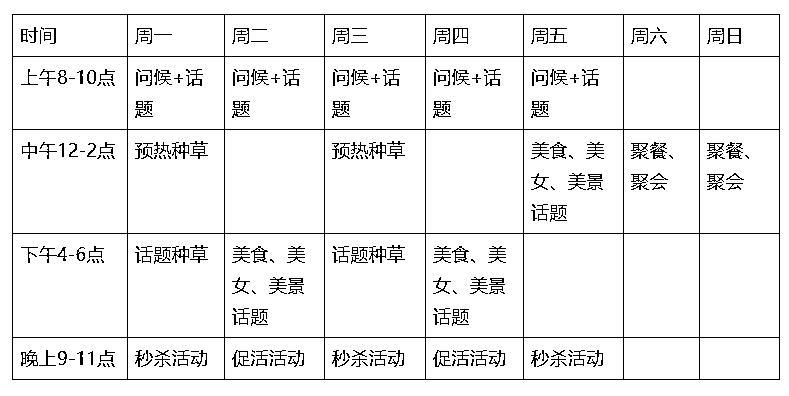

（延展，目前品牌有几种玩法，大体量的品牌可以主要以筛选忠实粉丝为主，未来很多品牌的需求已经延伸成为做KOL和VIP客户的筛选，让用户创造和产生内容、持续消费成为了品牌的首要目标）

**-03-**

总结

 

 

以上是部分案例操作的方案和展示，实操方案的时候，只要按照类似的框架搭建，我相信大家也可以从中找到一些相同或者不同点，总结各种不同案例的搭建方法，就很容易总结出自己的一套方法论，剩下的只要多进行实操，和同行、大咖交流，很快就能搭建出自己的操盘体系。

在实际应用中，还有更多的行业和方法，作为操盘手或者老板，更需要找到自己行业的特性，通过行业来搭建自己的私域体系方法。（如果掌握的够多，顶层逻辑打通，就能够操作很多不同行业的案例，而不是局限于一种模型）

非常感谢大家的收看，篇幅有限，私域电商、社群团购等项目没有进行方案搭建的展示，很欢迎和我交流私域项目的经验，一起在生财多多发财。感谢！

评论区：

惠子 : [强][强]，你好，我想请教下，像线下的实体门店，我们主要做板材地板五金材料的，零售批发都有，这个怎么做社群运营呢？

嘉应岛主 : 足够干货`~

亦仁 : 感谢分享，已加精华。

黄林风 : 学习了

阿良 : 专业！

君途-👾 : 想学习门店私域运营，可否留个联系方式？

红师私域椰子青青 : 可以的AARRR18

# **# ****(**精华帖**)(51**赞**)**从** 0 **到** 1 **搭建** To B **售后团队的

# 一点点经验

作者：  黑小喵~🍀

日期：2022-01-17

《从 0 到 1 搭建 toB 售后团队的一点点经验》

 

 

做 SaaS 或者做 2B 服务的朋友，我来替你还原几个“案发现场”：

拉的客户服务群没有统一的名字，成交负责人找不到服务群，使用产品小伙伴完全不知道这个是什么产品；自己客服小伙伴 A 知道这个客户叫啥名，B 不知道。

客服号的昵称不统一，不拉群单聊的时候没什么问题。但在售后群，会导致客户不知道找谁问问题，艾特谁都不知道这体验肯定好不到哪去。

回答问题时，就更乱了。有些问题专业度过高当下不知道怎么回复，能回复的又解答的十分生硬，甚至在被投诉边缘徘徊。

同一个问题，这个客户问了，下一个客户继续问又得手输一次。爆单的时候效率低还容易错。

消息太多点过一次，消息不再提醒，意念回复了客户，实际上压根消息没回。

标签杂乱，无法系统的检核打的是否正确。很难形成有效的用户画像，会间接的影响到产品的更新方向以及引导客户复购的决策。

发朋友圈、日常活动消息群发。各种情况都能出现，忘发了、发错了、少字多字、图片模糊等等。增加了无效沟通。

没有任何流程，问流程，只会说“在心里”。

在发现以上部分问题的时候，我就开始尝试招聘专门的客服人员。目的是确保服务底线消息的及时、准确回复。

好处是话术库快速的丰富起来，人多之后，话术库搭建的更快；消息回复速度及时性有保证。

然而，更多的是带来了反面效果，客户服务群对比官网在线客服的区分特征就是工作强度弹性大，可能周五没有任何问题反馈，但周一群活跃度高，问题也相对复杂，就需要专门的排班平均工作量；群内问题会存在延续性，bug 也不一定是当天就能优化上线，交接班调休，工作如何对接；产品更新如何组织学习如何考核等等问题，管理成本和难度蹭蹭蹭的上升。

不过方法总比困难多，踩了坑就要快速调整，最终效果是 8 人客服团队优化到了 5 人，专业度服务意识在线，流程清晰。简单来说，随便拎 1 个人都能独立接得住。这就是我一开始预想的效果。

今天就主要来抛砖引玉，说说我具体的调整方法。

一、优秀员工和普通员工，怎么复制？

 

 

有个来自美团的小伙伴，把美团的经验带了过来，在美团，方方面面都十分强调「可复制性」，20%优秀的小伙伴将自己的工作内容沉淀，形成方法论，分享给另外 80%的同学，如果能把这 80%的人中的一部分提升到最高水平，那么回报是巨大的。

分享能够锻炼团队的沟通能力，也能展现每个人的多样性，还能增加彼此间的信任等等一举多得。

普通员工的人数总是多于优秀员工。给一线提效最快，最贴合工作场景的就是完善的话术库，答案放考卷旁边。即便没有人力支撑，部门培训频次较低的情况下。也能够保证响应速度，直接的提高对话水平，让客户有更好的服务体验，是成单/复购的关键节点之一。

目前以微信来沉淀私域用户池的商家对这个功能需求点很高，除了快捷回复的部分，机器人自动回复的伪装智能感，在促销爆单的情况下也能有高质量的服务，完美应对。

二、在都拿到解题思路后，如何拿高分？

公域流量的门槛倍速上涨，搭建自己的私域池是现在大多数企业最优的选择，一边持续补充新流量，另一边服务运营，稳固现有资源。

快速、准确的触达新流量，怎么精准引流、添加了客户是否通过等流量部分的问题，这里不详细展开来讲，这些也无法直接通过某个人来控制并达到一个结果。

那么，能靠个人把握的节点就要做到最好。不管是哪个团队，获取有效客户资源后，添加的操作都可以交给系统，把数据导入、配置好添加话术、定好添加时间。解放人力，原本需要人工一个小时的工作，通过系统可以简化到 10 分钟。节约下来的时间，可以去进行更有价值的业务拓展。

三、运营手法随处可见，圈粉能力怎么更进一步？

如果把私域运营进行最简单的定义，那就是对随时可触达的客户进行多次反复运营。可是一个客户在你的流量池内也同样在其他的私域池内，常见的沟通方式大差不差。

怎么更近一步，像意向客户更靠近一点。还能学习成本低，短时间出效果。

我们需要突出两个因素：粉丝触达率以及产品种草能力，抛开产品本身的影响因素，会更加考验运营人员的内容运营，有了好的内容就是要展现给客户，那就涉及到了机器自动化，定时、定量、分组的去给客户呈现专属的朋友圈；消息的批量发送，最新活动在最短时间交到客户手上。

 

 

圈粉能力这个因素，其实真正比拼的是技术水平。当下无论是社交电商、私域电商还是社区团队等，都离不开技术层面的支持。跑出 SOP 后，技术和工具驱动，沟通会更流畅。

四、认真观察对话，解锁赢得和失去收入的黑匣子。

检核团队的日常工作，也是让他们变得优秀的方法之一。

**1. ** 及时发现聊天过程中的问题

有些对话完全没响应，有些答非所问，有些需要建议或调整，当然也会有需要表扬和分享。只要客户进入私域池，我们就需要关注他所处的生命周期，避免人为导致的不必要线索流失。永久聊天记录的留存，标签的标识都能让用户画像更加饱满。

**2. ** 及时清理无法无法胜任本职工作的员工

如果从这些关键的谈话时刻得到的指导和反馈不起作用，那么很难看出会发生什么。你可以快速找到答案。通过尽早剔除那些不可补偿的人，可以减少工资和支持资源方面的不必要成本，因此尽早发现这些问题以及采取补救措施具有巨大价值——同时在下次招聘中将可塑性作为前提和重点。

**3. ** 加快员工在成为最佳表现者的道路上的进度条

日常内容的反复循环，再加上频繁的指导，是在尽可能短的时间内将员工从一开始就迅速提升到最高水平的关键。在这个过程中，不可忽略的是数据支撑，直观见证普通员工成长为最佳表现者。

五、防飞单，就是把你的私域池真正的沉下来

有了前面新流量导入和带温度的售后服务，基本搭建起了属于你的私域用户池。但需要真正的沉淀下来仍需继续努力，聊天记录无法每时每刻都有人查看抽检，小一点的问题没有给到客户良好的服务体验，讲大一点，可能会带走整个渠道的客资。

每个公司多多少少都会遇到这样的情况，相信方法总比困难多。管理层加强对一线员工的日常管理，多方位针对性的进行考核，赏罚分明；小伙伴们之间更多的是营造良性竞争的氛围；人事在招聘时多方位的考量，拉高门槛，入职后相关制度的培训以及保密协议的签订；敏感操作的相关功能，实现实时监督把控。

六、日常基本工作考核制度需完善

 

 

日报、周报、每周组内问题沟通、临时会议以及月度复盘，都需要按时按量的去提交汇报。在总结的过程中，员工对问题会再度思考、总结沉淀。

管理侧，对日常工作的监督和 KPI 的考核。更重要的是，能够对每一个客户的情况有更完整的了解。私域的最终目的是转化，在运营过程中，承载着服务、营销的双重任务，一个被动、一个主动。多了解一点这一家客户-客户的行业-行业中的客户竞品，一个渠道就变成三个维度了。

内部人效的问题是初创团队必须正面解决的问题，人员招聘、日常制度还有很容易忽略的技术工具。它不仅能降低运营成本、提升客户体验，或许还是协助推动服务团队从成本部门向价值部门转移的小彩蛋。

以上，主要是针对服务团队提效的一点点小的经验，希望能帮助到大家。

评论区：

亦仁 : 感谢分享，已加精华。

黑小喵~🍀 : 感谢亦仁哥

m : 这不是之前卖VX号的大佬吗[呲牙]

黑小喵~🍀 : 哈哈，转型了。做好人

清影 : 有幸刷到喵哥的文章了[胜利][胜利]

# 总结

大家可以根据目录里点击直达跳转。

风向标小懒也都如数整理给大家了，到咱们专属群的消息就可以看到。

希望大家从中找到商机，赚到钱~

 

 

本周生财周报除了离线版，小懒也会整理到在线版合集里，方便大家检索和手机上查看。

 

 

 

 