# 同城引流** **合集

线下实体店老板如何通过同城引流实现增收

整理日期：**230706**

懒人专属群的群友大家好。小懒继续给大家带来一份同城引流合集

本文档为懒人专属群内部分享，懒人手动整理。

生财风向标系列单独用在线文档分享，地址见专属群q群消息。

一些帖子跳转飞书查阅，如需破解复制权限，见这篇文章：

解除复制限制！

往期的生财周报合集（含在线版和离线版），见专属群Q群文件和群公告。

希望大家有收获~

标题加了(精华)的表示精华贴，前面为截至今日的点赞数。

#  

以下是目录，内容有些多。大家可以挑兴趣的内容阅读。

懒人专属群更新记录（点此跳转）

# 【目录】

同城引流** **合集

【目录】

【项目认知】**3**篇

(精华帖)(85赞)不同的人群如何切入抖音本地生活的操盘方法论

(40赞)楚川：2023 年如何获得抖音本地生活的十倍增长的红利

(25赞)关于实体门店做引流的一些简单思考

(精华帖)(150赞)如何通过抖音同城号，把自己的门店打造成网红店？

【详细教程】**1**篇

(精华帖)(367赞)月稳定盈利 2 万元的棋牌室案例复盘

(精华帖)(121赞)20 天帮助实体书画门店收款 160 万

(精华帖)(110赞)以虎头局半年 3000W 流水为例，分享线下餐饮门店如何在抖音上引流推广？

(精华帖)(89赞)同城相亲  五年行业心得分享

(精华帖)(83赞)家居类目短视频引流变现，单人一天 100+ 精准流量，月收益15000+（可放大）

(精华帖)(76赞)3000粉丝月变现5W，同城眼镜店短视频拆解

(63赞)实体店同城线上短视频保姆级教程

(45赞)同城相亲月入10W+，现在入局还有机会吗？

(41赞)人人可复制的同城号方法论

(32赞)美业获客8大有效玩法

(14赞)民宿酒店探店号，怎么做？

【细分行业】**11**篇

(精华帖)(222赞)3 公里内最少有 500 人看到，抖音同城号做到热榜第一，132W 播放

#  

(精华帖)(134赞)从亏损 8000 到盈收 3W+，轰趴别墅通过精细化运营实现转介绍率 70%

(精华帖)(120赞)同城号蓝海领域如何半个月获 500 个精准客户，成功变现 15 万(97赞)通过 1700 万的搜索关键词，看抖音 SEO 蓝海机会

【小红书引流】**3**篇

(精华帖)(222赞)小红书 10 大传统行业，引流获客模板

(精华帖)(142赞)利用商场优惠活动，3 天引流私域 2000+ 人，变现五位数(85赞)同城高客单在小红书玩法分享

【美团运营】**2**篇

(精华帖)(82赞)区域排名第一的美团店铺是如何运营的

(17赞)如何在美团上靠卖这个运营思路迅速实现月入过万！真正的实操分享！纯正的干活！这个方式可延申很多项目、领域

【小众渠道】**1**篇

(19赞)被忽略的公转私阵地，搞透它，无论实体还是线上同样稳定地获客

【导流技巧】**1**篇

(24赞)教大家几招快速从抖音上导微信进私域

【引流细节】**1**篇

(精华帖)(160赞)实体店如何有效互联网化，90% 的老板容易忽略的细节【视频创作】**1**篇

(7赞)实体店越来越难做，2023 年如何抓住同城流量红利，用抖音引流获客？

【踩坑经验】**2**篇

(99赞)价值百万的抖音本地生活创业血泪史

(38赞)7 年实体门店引流得出 3 个经验教训

# 【项目认知】**3**篇

#  

# **# ****(**精华帖**)(85**赞**)**不同的人群如何切入抖音本地

# 生活的操盘方法论

作者：  楚川

日期：2022-08-30

抖音本地生活现在市场现状怎么样？现在入局有哪些建议？有哪些可以复用的完整方法论？

我在抖音本地生活赛道已经耕耘两年，抖音本地生活去年的 GMV 是接近 200 亿的规模，今年上半年已经达到去年一整年的数据 220 亿。

在数据核销方面，去年抖音本地生活的核销数据只做到了 32% ，今年推测核销率是  35%~40%，在我看来，本地生活做短视频和直播还是很有增长空间的，今天我来分享一下不同的人群切入这个赛道的方法论。

大家好，我是楚川，一个从大二开始创业的连续创业者，到现在已经是 11 年了，先后从事校园传媒、淘系运营、电商品牌、直播供应链和短视频本地生活，算是经历互联网的风风雨雨，2 年本地生活创业拿到 2.6亿+GMV 的结果。

我是一个爱总结、复盘、改进和强执行的人，也非常乐意去分享我们的方法论、经验，希望更多人加入到短视频本地生活赛道，共建完善的服务体系。

下面我将进入正题，正式从五个部分来展开我的分享：

一、行业经历和结果

#  

二、抖音本地生活的几点逻辑共识

三、抖音本地生活的市场现状

四、抖音本地生活的完整方法论

五、抖音本地生活的从业总结

一、** **行业经历和结果

我们团队从2020年10月正式开始从事短视频本地生领域，自建短视频工厂，孵化5W+素人分发矩阵，100W+文案，1000W+短视频，10亿+曝光量，4000+商家，2.6亿+GMV.。

**1. **团队搭建的过程

2020年8月，我作为直播电商供应链公司的负责人清晰知道流量在吃紧，行业从蓝海快速变成红海，自己捞金的机会很快就会没有了。所以一直在找新的机会，新的赛道，这也是互联网人的创业日常。

那时候我们团队在运营品牌和IP账号的时候，发现带抖音地址（POI）和不带POI有差距。经过反复验证，发现即使是一个白号，在热门POI下发布作品，流量也会比平时更快突破1级流量池，并且曝光数更高，在这个时候我们就萌生出转型做本地生活的念头。

**2. **爆店码的增长期

#  

关于爆店码的开发，我们是基于2020年的视频号霸屏技术的底层逻辑，大概就是借助自身私域的优势，拿视频矩阵进行分发，从而在视频号中获得足够多的曝光，从而完成转化，主要是游戏、营养品类目比较多。

但是这项技术在视频号没有真正推起来，所以在2020年9月我们就向CTO提出想法，我们想在抖音做一个类似的，于是就有了爆店码的概念雏形。

于是就倒逼技术去做研发，去对接他的行业资源，差不多在2020年10月份，我们跟其他团队同期落地了爆店码技术。

爆店码的逻辑：扫码自动转发抖音短视频，并且带上固定**POI**。

我们从一开始就成立了自己的素人矩阵，经过2个月的数据分析，摸清了抖音本地生活流量的推荐逻辑，就是下图。

#  

所以后面我们的内容创造方向和运营方向，都是去吃本地生活这块流量，那就是一定是把矩阵运营好，将流量的性价比做到最高，ROI拉高才是我们的目标。

爆店码的疯狂是从2021年1月到3月，那时候抖音团购还没有真正形成闭环，所以我们都是用爆店码形成半闭环在做一些事情。

以下就是一些特殊的行业，统一动作就是：招募素人矩阵，扫爆店码分发视频获得基础曝光，再让门店引导顾客扫码转发视频&领取满减券，鼓励商家把所有咨询和核销券的用户转为私域，做后续成交或者二次成交。

**P.S**：这里要注意一个点就是服务的客户，交付内容或者方式有区别。哪怕是到了今天有团购了，也要从多个维度去定服务**KPI**，单纯的销售目标或者以抖音平台单方面考核肯定是不合理的。

全程一共4个BD，加上我们4个创始人两个月拓展到400商家，服务的内容调整为：爆店码**+AI**云剪辑**+**营销事件策划。

#  

服务过的客户如：OPPO和VIVO（销售扫街分发视频，领取300优惠券和自拍杆）、海尔空调和台铃电动车（领取500优惠券分发视频，保留一星期找客服领取88元红包）、老火锅（朋友圈裂变扫码转发，播放量前三名分别送霸王餐）。

这个时候是本地生活流量擦边球和禁入行业的最佳获客时间，应该也有不少同行完成了满意的增长，我们其实这段时间也打出了很多骚操作，赚了一些舒服的钱。

但是这套思维，我觉得是很多要进来这个赛道的人要好好领悟学习。多方位去思考问题，下面我举两个例子，虽然是最后没有执行的案子。

第一，净水器行业。因为分销商很多，但是没有内容制作能力。当时对接到一个品牌叫“诺百纳”，他们每个月烧信息流预算挺高，并且是以cpm为主，销售线索很低。

所以我的建议是把分销商和员工成为素人视频，用我们内容生产能力，一个人2天分发一条视频，曝光指标和销售线索是肯定上去的。

这个案子是因为我们做爆店码开单太快太猛，根本没有精力来跟一个客户耗很久。但是这套思路，我个人是认为可以做到很多行业。

第二，银行的生活节。长沙建行每年都有66生活节，宣发预算其实挺足，但很多时候都是用于大屏广告和电梯广告，很难做到数据统计。

当时我的提案就是在长沙IFS周边放很多海报和传单，参加活动的商家放福利进来，消费者转发视频就领取代金券，直接到IFS进行消费和核销，同时所有用户可以做到默认关注建行官方账号，长期沉淀用户。

#  

这一块没有合作起来的原因是因为我们公司没有做过银行业务，我们暂时没办法作为竞标单位，只能提案，但是他们营销口是很认可这个方案。我个人也会认为这种方式到现在也不算过时，小城市可能还可以玩开。

**3. **小程序服务商

在2021年元旦过后，我们团队技术重新提到：抖音小程序即将开通本地生活**SaaS**服务商资格。拿到服务商资质的，可以给二级服务商或者运营服务商做系统的**OEM**。

2021年3月份与标点云达成深度合作，是他们最高级的OEM服务商，享受到的权利跟入围的本地生活SaaS服务商没有区别。在这也特别感谢标点云的全力支持，能让我们在市场上喝到第一口汤。

#  

其实这一步算是大家要注意平台的调性，真的不能被牵着鼻子走。我们在前期开发阶段投入有**50**万，基本上打水漂，我记得还有一个山东的兄弟**20**多个人的开发团队花了**300**万也没成功，最后气炸。

抖音小程序可以与抖音POI进行融合，即地址可以带团购套餐。当时我们团队都非常兴奋，因为这意味着抖音本地生活进入到团购阶段，所有的曝光可以跟销售结果匹配，也能让服务商做到更高的GMV。

2021年5月我们也开始选了一些商家来做抖音团购，推爆了不少商家，这也是我们团队扩张的开始。其中蹦床是我们做爆的第一个行业，并且快速在其他城市复制。

使用的打法比较简单粗暴：KOC+素人+直播（你没看错，我们**5**月份就做了直播，直接本地推流）。这家蹦床当时在衡阳的郊区，老板极度焦虑，一个月只能做到2-3万元的销售额。找到我们的时候，几乎是恳求的语气。

于是我们用30天的流量轰炸，让这家店开始爆满。到2021年6月，累计曝光1000W+，单月销售到50万元，我们每周安排到2场本地达人直播。最后这家蹦床长居本地玩乐榜TOP1。

#  

在这段时间也是抖音的热门POI的红利期，我们大部分素人账号从50-200粉丝增长到1000粉以上，因为：带一些网红店、网红景区地址的视频，就能获得流量加持。

等到7月份抖音推出团购带货达人的板块后，我们的素人账号顺势就开通了达人CPS的功能，一条视频可以获得基础费用+2-5%的CPS。

后面我们对于1000粉丝以上的素人要求也更加严格，比如要2000播放量才给基础费用，慢慢的100人的矩阵可以做到20万播放量，我们跟客户签合同基本上是15万，收费价格在20-50元，保持毛利在30-40%。

2021年6月，我们在增长的同时也推出“爆店码**+AI**剪辑**2.0+**抖音小程序”，所有流程的SOP也完善。因为这个阶段我们人数已经从15人激增到60人，为了提高人效就直接把运营SOP推出。

#  

从文案、拍摄、素材审核、剪辑、分发全部规范，直接将短视频成本控制在5元/条，让我们最大的杀器：素人矩阵做到品类封杀。

以下就是我们的SOP介绍，另外关于BD、后台运营这些则需要另外花不少时间沟通，这个我们可以私下交流。

这套SOP也有做视频的同行在使用，基本上能够满足大部分人的需求。

**4. **品牌全案服务

这个阶段，我们已经做到2亿GMV的级别，团队一度膨胀到100人。旗下站点有满天星精选、祝融严选、出来玩等80个直营站点。

我们过去沟通的100家KA客户， 99.9%的人愿意给100万+的预算到全案服务，也非常不情愿给到10万到抖音本地生活一个渠道。

#  

所以我们就开始布局抖音探店作为其中一项服务，增加了公众号、小红书、大众点评、视频号和外卖。

后面也想通了这些事，渠道整合能力、对于本地生活的理解能力、策划能力，这是KA品牌全案服务一定要具备的水准，这依旧是在倒逼团队进步。

其实我们还是算市场上收费比较贵的服务商，但一直没有缺客户。我们也慢慢发现本地生活，重要的是商家运营，而不是技术本身有多牛逼。不过可惜的是在我们团队快速膨胀的时候，没有继承和放大这个优势，这也是我2021年最大的遗憾。

下面我就贴几张当时的全案服务内容，大家可以参考，也不算太好，欢迎大家提建议和吐槽。

P.S：这就是150万案子和43万案子的差别，第一个更加全面，也是很多品牌方想看到的。

#  

P.S：这就是线上的全案服务，各渠道都有规划。

**5. **官方直营和服务商管理部先后下场

2021年11月，字节宣布在主要的城市开城，长沙就是其中之一，团队架构跟我们90%相似。因为团队太相似，没有办法进行深度合作，他们只会快速蚕食我们的市场。

字节还是那个字节，在开城后，我们的重点客户都收到了官方的合作短信，邀约到公司见面。他们的服务就是：商家给到极限性价比套餐，再让出**10%**佣金，官方不拿一分钱提成。这对**90%**的服务商就是降维打击。

那会我们还是觉得这个生意还可以做，也在苦苦坚持。但没想到，在11月份到12月，一个多月时间直接对服务商卡审，无限拉长套餐上架。基本上大量团队原地解散，我们团队要做的也就是遣散和优化，以及业务调整。

#  

这种情况一直拖到2022年3月，官方成立了服务商管理部，抖音本地生活呈现三角之势，分别为：本地生活小程序事业部、服务商管理部和直营中心，关系比较微妙。

在我们团队的努力下，又拿到了官方服务商的身份，隶属于服务商管理部，使用了群峰系统。

**6. **供应链和流量服务

2022年4月，我们团队继续痛定思痛，想着怎么先人一步找到更好的赚钱方式。我们分析到大量的做爆的客户的一个共同点：他们有爆品，产品本来就自带流量，我们运营和推广都是辅助行为。

现在疫情之下所有门店亟需解决的问题是流量问题，其次是爆品的打造的能力，这两个点是可以做一个很好的结合。

所以我们就想彻底的抛弃品牌服务，直接以爆品供应链接入商家，再搭配我们的流量服务。于是就真的大刀阔斧的测试起来了，构思出这样一个商业闭环。

#  

第一个我们选择的就是马上要在长沙爆发的品类，那就是小龙虾。于是我们选择了一家300平，具备接待能力的商家，但是从未做过口味虾，作为我们的样版。

第一，与商家共同制定了一款团购套餐；第二，安排摄影师拍摄素人素材+30-40名达人探店，总共投入约3000元

#  

截至2022年5月22日，一共销售1084份小龙虾套餐。按照平均50%的核销率，一星期时间预计到店190-200桌，商家投入产出在1：10 。

#  

#  

#  

#  

#  

#  

接着我就做了财务模型的分析，发现是盈利的，然后我们立马找了20家商家合作，最后在4-6月实现单项目20万净利润，日均小龙虾消耗在2000斤以上。

但随着6月开始，小龙虾开始泛滥，项目的盈利能力就减弱了，我们也还没有真正找到合适稳定的供应链。有供应链资源优势的朋友可以深度沟通，来项目合作。

**7. **品牌孵化和投资

#  

我们现在盈利的打法：品牌孵化/投资-爆品供应链-品牌服务的组合拳，保证我们短期实现供应链盈利，长期实现品牌的增值。孵化落地千万级别的品牌有4家，最成功的案例就是以下展示的虾浪。

#  

#  

#  

#  

 

通过数据的多向分析，品牌单月营收120万，抖音核销14万，总GMV30万，美团系核销45万，大头还是实际到店为主。但是从线上的很多数据比较，引流效果明显，只是一部分人不会直接下单，而是直接到店消费。

所以如果在生财的朋友自己有品牌，想一起合作的话，我们可以深度沟通。如果我们团队评估没问题是可以直接入股，后续的品牌服务都拿下，品牌方只需要负责实体运营。

二、抖音本地生活的几点逻辑共识

**1. **抖音本地生活流量的逻辑

#  

#  

第一，要有一个很清晰的认知，上榜了就有额外的流量加持，所以第一时间就是需要知道4个榜单的评选规则。

第二，四榜都有推荐度，其实就是用户的评价，有效评价以为评价要有一定基数，那么就告诉你一定要有视频数量、用户数量为基础。

第三，那就是商户质量，其实无非就是适不适合打卡拍视频，有没有运营能力，折扣可不可以跟上，那这也可以作为你筛选客户的基础。

其余的指标看起来重要性都没有那么强，因为推荐度和商户质量做好了，其他都不是事。

第四，本地生活的流量推荐机制我已经分析了，那么无非就是再结合矩阵运营，那还有什么难事。

**2. **短视频会对图文的降维打击

“短视频&兴趣电商”是对“图案&文字”的降维打击。

场景化是最好的消费引导，千言万语不及视频一句：卧槽，真香！这个其实我们已经通过抖音证明了这一切，所以也说明我们在想做好本地生活之前就是做好短视频即可，直播如果在自己的能力范围以外，就先不要考虑这个问题。

那么这一块在做商家服务的时候，就是要脱离图文的思维。怎么样构建场景，让视频看起来更出色，更加有吸引力，这是我们要做的事情。

#  

虽然抖音有图文，这条路也许短时间让你受益，但是终究走不远，也没有太大的未来。

**3. **电商和本地生活最大的差别**—**核销率

核销率非常非常重要，这样再大的ROI也不堪一击。我们去年的GMV这么大，但是核销率只有32%，产出直接干掉三分之二，我说我亏钱了，那现在应该是信了吧。

去年整体情况应该是在30%左右的核销率，意味着电商里面是70%的退货率，那只能高客单可以跑。但是本地生活只能是低客单，这就是一个商业悖论，这需要很多人去做仔细的思考，怎么提高核销以及降低退货。

当然也因为核销率，我也是无数次劝退做本地生活直播，虽然抖音有很多人因此私信骂我，说我什么不懂，但我还是祝福这些人不要上头，不要破产，这年头赚钱不容易。

**4. **客户的内容需求不一样，没有标品服务

抖音本地生活用短视频重构了这块市场，这是毋庸置疑。但是平台的属性是基于内容为出发点，并且内容的需求是不一样，多元化的，所以基本上就没有标品服务。即使有，那也可能是短暂的。

如果做抖音本地生活的基本盘仅仅是抖音团购、内容服务，那么基本盘是建立在不稳定的基础。因为内容和流量没有绝对的相关，同时转化也是做不到公式化输出，那大概率是亏本生意。

#  

按照生意的逻辑，当没有标品服务存在，就不能盲目扩张，拓大批量的商家，因为商家越多，交付的难度会越来越高，管理成本会越来越高。

在我们团队的发展中，我们犯过两次这一块的大错。

第一次就是我们以一个固定的服务套餐，去拓商家，当只有60%的有效，剩下40%的商家就会投诉或者找麻烦。

我们以全流程SOP化的方式推动工作，最后发现交付质量越来越差。的确是在说明一个问题：内容就是不能以一个标品来做，行业不一样，需求不一样，太容易踩雷。

当然交付的环节可以做到一部分是标品，但不成成为全部，就像我们的交付中素人视频和技术运营就是固定的流程。

第二次就是我们的品类服务，今年的餐饮供应链和足浴商家，都是以一个差不多的套餐去做推广，到后期的商家转化效果会很差。

其实就是缺乏商家运营环节，需要将自己的服务和产品跟客户进行调和，达到一个达人、顾客和商家都能接受的状态。

**5. **抖音本地生活的运营全景图

#  

这就是抖音本地生活的运营全景图，所有的服务环节和生态环节都在这里，基本上入局的话可以从里面的一些角度切入，或者是自己的服务涵盖里面所有的内容。

当然在这一块，基于抖音的生态还可以衍生出其他的业态，比如投资、孵化和行业供应链。当团购业务不是很赚钱的阶段，就可以将生意赢利点转移到其他角度上。

三、抖音本地生活的市场现状

**1. **市场体量

（**1**）抖音本地生活：**2021-2022**年的战绩

#  

抖音本地生活2021年的GMV是接近200亿的规模，2022年上半年是220亿，其中短视频占70%，直播占30%，个人预测2022年整体的核销率是35-40%。

按照7月36氪的报道，可知今年抖音本地生活需要将直播的份额拉高到50%，那可能核销率也是很难高起来。

因为直播属于冲动型消费，很难达到刚需高频，所以这块会限制所有的服务商和流量主达到真正的突破。这也是所有入局者需要注意的点。

到目前为止，抖音直营中心超过50个城市，商家70万以上，4万以上的服务商（官方服务商未统计），320万达人。整体的生意逻辑相对来说比较简单，大部分都是达人撮合、服务商和商家互动的链接，普遍佣金为10%-15%。

2022年6月，字节在巨量网发布的《2022年生活服务软件服务费标准说明》，只要商家在抖音平台发布商品或服务信息，如商品名称、价格、门店地址等，并与用户产生交易，就要向抖音缴纳软件服务费。

其中，软件服务费以“消费者实付金额+除商家自行补贴外的其他补贴金额”为基数，并且根据不同类目商品的服务软件服务费率计算。

收费标准共计区分8个类目，费率从2%~8%不等。预计6月抽佣过千万，7月可能突破5千万级别。

#  

（**2**）抖音和美团真的是兴趣电商和需求搜索的抗衡吗

从最理想的角度分析，美团属于10年代的互联网产物，本地生活服务是基于需求到搜索，呈现形式是以图文的方式，商家之间的内卷以比价体系、烧流量进行。

而抖音属于20年代的互联网产物，兴趣电商的算法，让推荐变成唯一，并且是以短视频的方式冲击用户心智，从传播速度和广度都会远高于美团系。这也是大部分人对于抖音本地生活的期待。

#  

从2021年3月抖音本地生活形成闭环起，已经接近一年半，发展速度相对来说也会比较快。但是现在的生态下，平台并没有十分有利于从业者。

商家端的来看，大部分竞争点在于破价引流，还存在一部分同品类的“猜你喜欢”推荐，是不太利于商家发展。服务商的话会因为商家的佣金太低，而没办法产生满意的交付。

流量主逐渐在商家眼里成为要饭的，职业素养较低。这些都是抖音需要自己去引导，去解决的问题，不然产业很难发展起来，这也不能靠几家服务商就可以搞定。

另外我们分析一下美团系和抖音之间的异同点，来真正认识这两个平台。

相同点的话，无非都是撮合与推荐服务，都需要付费换来效果。

不同点需要从几个角度来看，从宏观的角度来看，抖音和美团系存在维度的差别，那就是短视频和图文间的感官差距，其次在传播深度和速度也是巨大，最后就是流量的密度差距；

从供需关系来看，美团系是C端有需求，主动去搜索满足需求，抖音是兴趣电商的逻辑来勾引C端消费；

从内容上来看，美团系重在网罗一切商家，突出评价和排名，不同城市站点大同小异，抖音把站点入口和排名入口藏得很深，核心就是推具备传播性的商家。

所以在这个阶段两个平台之间的抗衡还没启动，因为抖音还需要时间去成长，让自己得到消费者、服务商、流量主和商家的认可。

#  

（**3**）抖音和美团的差距

2021年抖音GMV接近200亿，假设按照抖音平均抽佣3%，预测2022年抽佣15亿。

美团到店和酒旅营收325亿（经营利润141亿）。2021年，美团GTV为7021亿，营业收入1791亿。

其实这两组数据就已经证明平台之间的差距还挺大。抖音还需要时间去理解本地生活，行业的需求，平台怎么去真正赋能，推动赛道的进步和发展。不然可能就是泯然众人矣，几年后新的平台出来，夺走这一切。

**2.**服务商的生存现状

（**1**）大环境

第一是随时会变的平台，从2021年的直营中心下场，小程序几乎瓦解。其实小程序的变化每个月都有，只是最后突然间来了剧变，很多人一下接受不了。

2022年的群峰，服务商还没有玩明白，6月就迎来了抖音来客，未来还有外卖平台，也可能还有新的后台出现，然后从2022年7月小程序又可以开始运营了，这一切都在变化，充满了不确定性。

第二核销率是竖在所有人心头的刺，产出比不再稳，因为随时可能是腰斩，让一个看上去很好的生意变成没有盈利。如ROI为6，核销率为40%，投入产出就是2.4，算下最终成本大概是不挣钱，甚至亏本。

#  

第三，服务商现在至少4万家，达人超过300万，整体质量是鱼龙混杂，需要很长一段时间去让市场随着竞争而形成好的生态。

（**2**）服务商一定是平台刚需

有一个点，大家一定要达成一个共识，那就是只要你想在抖音做本地生活，想成为服务商，你就可以。

因为这是一个刚需的问题，官方用很多行为已经证明自己没办法完成，必须要用到服务商，这就是你的价值，至于你怎么赚到钱，他们管不了。

我先来说下抖音一定需要本地生活服务商的原因：抖音是内容为核心的平台，是创造美好生活。

本地生活的土壤和环境都不一样，这块的活又脏又累，你要跟认知度不高的商家来回周旋，你要让自己的内容接地气（上门拍摄，你要你用尽全力吃喝玩乐并表演者），这个是字节没办法去尽心尽力做。

当然字节也用行动证明了，他们这块很难干下去，如本地生活直播，2021年11月开始的本地生活直营，10%佣金给出去的结果就是探店内容低品质，本地生活流量全部吃紧。

再比如2022年3月成立服务商管理部，就是在告诉全天下，我需要服务商。

（**3**）官方服务商

#  

现在官方正儿八经的服务商一共有本地生活SaaS服务商、抖音来客服务商，这是大家可以去申请，可以去抱官方大腿的，具体的准入要求直接百度或者去字节官网查看就可以。

大概的流程基本都是报名，跟官方的同学对接，拿出你的计划和资源展示，最后10万保证金，根据你们制定的KPI往前走就行。

我们团队是两种身份都有经历过，现在是属于去字节化的一种发展方式，所以我们为了摆脱官方的约束就退了服务商，这个就是得看你们的团队生意模式，来选择跟官方的合作方式，这一点可以私聊沟通。

当然你也要清楚知道服务商的价值体现，摆正自己的位置，也不妄自菲薄：

第一，本地生活短视频化是板上钉钉，行业需要人去把各项服务丰富起来；

第二，市场有20多万亿，美团也才吃到8%的市场，那么需要庞大的服务商群体去割；

第三，本地生活需要更多服务商去刺激商家进化、更新和换代，去掣肘资本制做的餐饮垃圾，真正把消费升级做起来。

（**4**）短视频和直播

我个人觉得做服务商还是一定要先想好怎么做好短视频，再去考虑做直播。

以下是我们的经验总结，按照ROI为10的投放和70%核销来计算，所以这块并没有那么好做，大家一定要好好掂量。

#  

（**5**）入局建议

第一就是一定不要铺BD，你们可以合作的渠道很多，如行业协会，本地朋友圈意见领袖，商会等，每个人都有资源，那都是你的业务员。

第二好好选品比什么都重要，选对了就有流量，如小龙虾，冰面包等。

第三矩阵是一定要做的，千万不要重视，这是可以真正拉高你产出的工具。

第四就是学会拆解流量底层逻辑，从而完善你的运营方式和技巧。

第五销售渠道要多元，学会做全案，赚团购之外的钱。当你不会做全案，就去淘宝买以前别人的案子，学习好就去改，去抄。

第六是抱紧官方大腿，要方法论、资源和案例。但是不要成为狗腿子，唯命是从，不然团队会很难。

未来发展：同步参考电商行业就可知，短视频、直播、策划服务、品牌陪跑、达人派遣、战略咨询和投资管理，未来5年绝对会非常精彩。

#  

**3. **达人的生存现状

（**1**）大环境

第一现在达人市场泛滥，粉丝量在1000以上就会去做探店达人，导致商家对达人的印象很差，动不动就会说是要饭的、乞丐。

第二达人撮合的链条变短，通过拉群可以快速召集本地大部分达人，让这块生意变成不可能的生意，因为价格和资源都变得非常透明。

第三好的内容不代表有大宗流量，所以很多达人也慢慢没有那么热衷于创造好的探店视频。当然有稳定产出的账号在市场上还是很受欢迎，不过只要出现翻车，本地的圈子就会开始传播出效果一般的信息，后期收费的难度就是提升。

第四本地生活的流量属性忠诚度并不高，KOL做不到一呼百应。因为每个区域的人都会对本地吃喝玩乐有基本认知，做不到博主一呼百应，大家都下单。

（**2**）收益情况

第一普遍佣金在6-12%，如果按照核销率的影响，佣金至少要折半。

第二长沙本地V6级别的达人基础收费约1500-2500元/次，其实前置收费一直在往下走。

百万粉丝的账号需求不是特别旺盛，属于比较尴尬的局面。

#  

（**3**）入局建议

策划力很重要，需要流量主去学前人的经验。如各种地产、餐饮的营销案例，转化核心的部分在抖音，这种是有机会形成裂变传播。

一旦有，那就是你的案例，成名之战。现在市场上具备内容策划能力，可以策划出营销事件的流量主稀少，只要做到收费拉高是必然的。品牌方是愿意为创意买单。

不要为了探店而探店，所有的文案都是程序化，表演没有功底，表情僵硬，跟商家和服务商的沟通没有很好的交流，这些都会让你的口碑下降。

因为现在竞争很激烈，所以一旦风评不好，商单就会下降。建立自己的专业度和职业素养很关键，也是能力的体现。

团队越小越好，小而美才具备盈利的可能。以下是我做的团队模型。

#  

同时还是特别建议大家不要去接纯佣单子，一旦开始就是恶性循环，以后的价格拉不起来。

找服务商的品牌不一定有钱，但是主动找达人的品牌一定是有预算。那你要做好的事情就是，做好自己的专业，匹配对应价格。

**4. **品牌方的现状

（**1**）困境

第一品牌方自己去组织达人探店的效果是高于直播，因为交付在别人手里，可以提要求。

第二现阶段的大部分品牌最需求的就是到店客流量，但是自己又不知道怎么挖掘自己的核心爆品，怎么实现增长。

第三基本上都没有私域运营的能力，但是这一块私域流量获取的难度又是很低。

第四抖音引流到店的比例约15-25%，怎么样延续流量的价值是很多品牌方的难题。但是抓到抖音这波机会的品牌方，只要是没有上头去做GMV，都应该是有盈利的。

（**2**）入局建议

第一抖音外卖是可以考虑的一个点，多方面去触达用户。经营好就是自己的私域流量，当疫情到来时，自己的流量储备就是最大的底牌，至少保证不会亏损太多。

#  

第二要学会做店内爆品，如果不会就找到自己品类的头部，跟着学，跟着抄也行。因为好的产品是自带流量进场，让你做生意事半功倍。

第三，创始人IP至关重要，有能力和时间一定要去做。因为这可以获得加盟、门店引流、吸引投资和技能培训等。

第四可以去白嫖服务商，实现纯佣合作。当然我前面也让服务商不接纯佣业务，这就是一个商业博弈的过程，看双方的合作怎么落地。

第五，电商品牌的本地化大有可为，这需要你们去深思，想好怎么构建新的场景。一旦落地，那就会拿到好的结果。

四、抖音本地生活的完整方法论

**1. **如何选品和组品

在选品这个角度上，我以餐饮为例子。

第一就是要挖掘出自己的核心产品，也就是行业的硬通货。

当门店平平无奇，那就是走超高性价比的方式推，那肯定菜品组合就是硬菜多，配合了蔬菜、汤之类的。

#  

#  

#  

#  

以上就是我们设计，我们会让套餐看上去很多，性价比超级高，看了以后很有冲动屯卷。

这种组合还会有好处就是那些不会视频制作的人，可能就是很差的画面+超高性价比的信息传播出去，一样能形成转化。

所以在选品阶段，是这种情况那就是空好成本，菜品上菜快，容易标准化，口味不多变，那就具备爆的可能性。

第二就是当门店具备单品特色，那就是单点打破，单菜品打爆，所有的营销动作围着来。

#  

#  

#  

#  

第三就是做应季或者是假日产品，这是商家基本上具备的思维能力，或者是服务商需要掌握的本领。

我举几个例子来说明：

案例一：所有情侣需要过的节日，鲜花店可以做特殊的产品，比如情人节的玫瑰花束、520的草莓花、圣诞节橙子苹果花等，这些都可以通过控制供应链做出对应的产品，并且可以短时间内做出不错的销量，对于小团队来说其实是一个很不错的机会。

#  

#  

#  

#  

案例二：应季产品中可以选择每个月或者一个阶段的硬通货、爆品。秋冬季的羊肉汤、羊肉火锅和大闸蟹，这些都是很成熟的供应链体系，无非就是组建产品的能力。

在组货中，就是跟商家沟通，选品一定是有价格锚定的东西，下面的截图就是羊肉、大闸蟹，这些产品都是供应链产品或者是中央厨房供应的方式在合作。

#  

#  

#  

#  

第四就是当你的餐厅做不出高性价比，也没有特别好的硬通货，那再提供一个思路，就是蹭品牌或者是相关硬通货的热点。

我将举例来说明

案例：酒吧/小酒馆，直接选择百威、科罗娜等这些，在年轻人当中有知名度的品牌，组合店内的小吃做到一个高性价比的产品，话题可以带 #品牌词  ，从而去白嫖品牌流量和用户；

其次就是酒类2022年的大爆类目，精酿啤酒，大家都会认为这个品现在很高端、很贵，那么就可以做进套餐中，以一个流量套餐来推广。

#  

#  

#  

#  

第五就是当你的行业很内卷，从美团、抖音和其他渠道信息流都没有办法做出高性价比的引流动作，那么一定是要想着怎么用一个流量产品来加持流量进来，并且做到留存。

如洗衣咖啡店，用咖啡用户来做引流，从中筛选洗衣用户，并且拉高储值水平（咖啡店会员一般200元，洗衣店是1000起步），长沙有一个品牌—爱欢洗就是这么做的，并且我们帮这个品牌完成了抖音的冷启动（因为现阶段该品牌刚好换了套餐，当时的冷翠+洗鞋套餐没做到截图留存，所以此处就没有贴图示例了）。

以上就是5个我们一直常用的方式去做抖音推广，当然这其中可能还要配合场景出片好、流量到了能服务上、出品可以稳定供应，这些都是大家做大量增长要注意的点。如果我们是抱着拿结果，赚钱的方向，最好是不要偏离这几个选品和组品策略。

至于还有一些点可以做快速增长，但是不建议大家去采用，相对来说意义不大。如低价套餐，1元喝可乐桶，1元一只小龙虾套餐，这些都会引起用户反感，你在光明正大下钩子，秀智商下限去做引流。

#  

如果实在是想通过这种方式触达用户，获取私域流量，那么可以拉高客单，严控供应链去获取流量，下面的小龙虾案例就是这样操作，并且每个月都拿到不错的结果。

#  

#  

#  

#  

**2. **如何将**POI**加热

前面有说到抖音榜单现阶段比较核心的因素是用户推荐度和评价，其次是GMV和收藏等。并且在抖音本地生活有一个不成文的规定，那就是一个地址成为热门地址，你随便发一个视频，会比其他POI的流量更高，这是大家都心照不宣的秘密。

所以我们要把地址做成热门地址，其实无非就是视频足够多，那就是素人视频矩阵了。

一般建议在100-200条视频分发下去，一个地址的基本热度就上升了，好评率在90%以上。

这一点上“空卡打酒站”就是按照我们思路做了调整，热度一下就上来了，这其实就叫POI加热，意义也在这里。

#  

#  

#  

#  

推广前后的对比其实特别明显，后期上达人效果会更好。这里也要提醒大家，当你的POI没加热，不要去贸然上达人，效果会很差，这也是我们成千上万次的经验总结。当曝光基数上去了以后，销售额也往上走，那么热度就是滚雪球。

这个阶段只要是靠着比较强的运营能力：

第一就是要注意推广的POI地址是没有问题的；

第二是确认团购套餐没有问题，每个套餐的标题也很重要，一定是一目了然，看着就有冲动点进去做选择；

第三是组织素人的视频发布；

第四是监督数据的发布情况，以及及时跟出错的素人联系，同时出现爆量的素人可以做一些投放加持。

这里说到的素人问题，肯定很多人会问到素人从哪里来。那就是涉及到招募问题，我们这边是一条视频的发布5-10元，没有设计分佣环节。

#  

每个公司的运营基础不一样，那么跟素人的合作模式也可也有变化。前面有说到，我们是通过爆店码做了分发，但是我们现在已经换成账号托管和自动发布，这一块就是全程模拟人工在电脑端的发布。

至于为什么做的话，原理我这边就不做解释，归根结底还是为了素人的管理和发布及时性，还有就是流量相对比爆店码分发更加稳定。

当然这里还可以做一个拉升打爆几率的操作：在素人推广中，我们组织一批人购买团购套餐，大概是20-30单。

第一是做到有基础销量，第二是让系统知道产品在跑，是有流量转化。这个是我们现在运营相对来说比较细的点。

原理也有点像电商运营补单的逻辑，同理在后期的推广增量有限时，那可以在私域中做一部分导流，重新引发流量加持。

**3. KOL**和**KOC**的招募

达人的招募主要是看我们整体的想法，基本上可以从抖音私信、本地达人群里招募，最后一起拉到一个微信群做具体沟通，结算也可也在群里进行，文案如下。

#  

#  

#  

#  

#  

#  

这属于一家店从0到1招募的一个阶段，基本上招募好，做好反选后，运营一定是规定达人给到视频审片，保证视频是没有做到糊弄。

这一点很重要，因为我们的客户很多，达人撮合也非常多，有些门店的审片没有做好，导致客户的不满，以及转化有限，这些都是很严重的问题。

这个环节我建议大家一定是要让商家运营的同事跟投放效益产生关联，有绩效的牵动，他们才会对视频质量本身提出要求和想法，最后的结果对大家都负责。

一般的矩阵组合是：100-200素人矩阵+10-20个V3-V4达人+2-3个V6或者V5达人，这样有顺序的一套打下去是有声音的，经过我们这边的测算，流量持续周期大概20天，最长30天。当这一波流量结束了以后，也是需要采取下一步的动作，比如官方IP的运营、素人和KOC的持续更新。

#  

矩阵推送的顺序为素人-KOL-KOC，其实这个过程经常会出现突发问题。下面从几种意外情况，需要做一些调整。

第一素人阶段门店就爆火，但是不能评估什么时候结束。

我们这边的操作就是判断素人的流量增长变化，一般素人矩阵平均是跑到600-800，当达到2000以上时，大概率就是流量触底了，那立即安排KOL冲一波，等到4-5天，流量缓慢，再次以KOC的方式打爆。

这种情况，运营是可以让所有的账号都“@官方账号”，完成IP账号的一些流量和粉丝增长。

第二素人-KOL阶段，大概是两块流量接近时，就会说明KOC必须上了。并且如果在KOL的阶段，ROI没有跑到2以上，那就需要至少补单到这个水平，再安排KOC的轰炸。

另外说到门店达人招募从1到10，文案和方式都一样，但是运营的顺序有要调整。

第一就是我们需要看此时的好评率大概是多少，POI下面有多少视频，少了的都按照以上的标准进行补充，然后再按照正常的KOL和KOC招募，在运营选好的时间节点发布视频，在3天左右的时间，安排KOC的视频发布。

**4. **策划一场营销事件

事件策划一定需要提上日常，让更多人愿意主动进来陪你做传播，扩大话题热度，将你的流量性价比做到极致，以下是我们策划的两个营销事件：

#  

 

营销事件的策划有几个角度去构思或者是提升。

第一就是你的想法和雏形从哪里来，如果我们不是大的营销策划公司，做这一块是非常吃力的，我的建议是需要及时抓抖音以前官方策划了那些很成功的事件营销，做一些留档，随时根据客户和季节的属性做一些匹配、调整，那这些就是你的一项很重要的能力。

#  

第二就是可以多渠道获取这种营销思路，如从淘宝去买很多行业的营销策划案，还有一些内容分享平台的灵感，多收集一些，组合在一起就很容易找一个很适合客户的营销事件，并且这些都是经过大公司的验证，所以给出的东西，客户大概是满意的。

第三就是一定要根据客户的特点，核心卖点，以及季节或者是节日的属性，做一些对于的事件，让所有人都参与进来。

第四就是要结合每个时间节点，群众最爱什么爆点，你的营销思路往这块靠，视频发出去就能引发全员拍摄，你也能获得额外的流量加持。

**5. **素人持续铺量转化和维持好评率

当然随着视频的数量越多，消费人次也越来越多，当一个店火了以后，服务和菜品能不能跟上就是一个很大的问题。我们之前服务的很多商家99%都会出现问题，包括我们现在投资的品牌。

那这个时候又会体现出素人视频的价值，主要是将好评率可能就是70%的水平再次拉高到85%以上，引导更多的人下单。好评率太低是会影响转化，并且产生退单，这一点很多品牌方都吃亏了，所以在最后的环节一定需要加一个素人持续铺量的阶段。

另外就是前期打出声量了以后，素人视频是可以持续做到转化，因为大家对品牌有基础认知了，当时不时刷到素人视频，可能就直接下单了。

#  

说句题外话，这个环节也是需要多方面考虑。我举个例子，我们投资的虾浪因为上菜慢好评率只有75%，转化影响很大，退单也高，但是我们没有太多餐饮实战经验。只能慢慢调整，好评率就一直没有拉高，等消化完这波流量，内部调整好以后再用同样的方法推爆。

所以这里就是5个抖音本地生活最重要的环节，结合我前面分享的经验，我会认为只要是互联网人都能领悟，都能明白怎么去完成前期的冷启动了。

五、抖音本地生活的从业总结

**1. **赛道深耕很重要

以上是我今年年初在群响做分享的时候PPT的一个预测，关于2022年哪些行业可能会火。也没出什么意外，在上半年其中很多品类通过抖音完成了不错的增长。

如美甲美睫，特色民宿，特色糕点，堂食&外卖、大型连锁、自助餐、脱口秀、特色演出、咨询加盟和IP打造。

#  

赛道深耕真的很关键。2022年2月-3月，我们3人的BD团队，做足浴店的签单速度飞快，平均一天签单6家，我们2021年BD团队的招募平均三天签单1家，所以效率拉满。

下面我将从几个角度分析为什么值得大家去深耕一些赛道。

第一是见效相对做全类目更快。

因为做好了单店模型，团队就会形成初步的方法论，对行业有一定的了解了。类目刚上抖音团购，我们当时担心素人和KOC的账号限流，当时就选择让一个80人的服务团队的足浴店，全员成为我们的素人矩阵。素材也相对简单，就是每天拍漂亮技师小姐姐的跳舞视频，瞬间就在区域吃到了流量，并且完成增长。

第二是容易形成系统的方法论。团队在做成这件事情以后，就会拿着案例去BD其他门店，于是拓展到3-5家基本上方法论就形成了，那么你就成为行业奇兵，拿下业务就是理所应当了。

第三是赛道深耕是可以突破地域的限制。

因为在服务端很多时候都是可以在线上进行，因为工作就是拍摄、达人撮合、团购套餐设计和上架，只需要BD做好客情关系维系。这种就可以让BD逐渐往外跑，不断的拓店、复制，突破地域限制，并且不用担心一个城市客户太多，流量分散，导致一个都没有服务好的情况。

以上三点都是赛道深耕最快最直接的效益，大家想明白了就可以切入。

#  

赛道深耕的变现途径多元，并且持续。赛道深耕其实真正做的是行业的解决方案，最终就是行业的营销专家，这一点对于服务商来讲意义大于做一个简单的本地生活服务公司。在变现层面上，这种方式走的更远更久。

第一行业做深了以后，全产业供应链的蛋糕是可以吃到。

因为这条线上可以涉及到品牌服务、金融供应、设备供应、原材料供应，你只需要在某个环节切入，并且做到跟商家的深度绑定，那这种效益就是长久的。如烘焙店，你的流量服务是配套设备，那增长点是做好设备的收益，补贴品牌服务，这一点的想象空间无限大。

基于本地生活的流量红利，吃喝玩乐只是很少的一部分，还有很多高毛利的行业可以去渗透，一定要打开思维。

第二规模化可以很迅猛。目前阶段实体行业的类目服务商，很多还处于比较初级阶段。当你掌握新媒体端的营销方法论，可以去绑定这类服务商，他们的客户资源和行业沉淀是一个很好的互补，这种新型的商业模型是很快做到分公司经营，快速起量。

第三垂直领域链接到的资源无法想象。如果你的团队走过了第一个阶段，真正在垂直领域发力的时候，你所链接到的基本上是行业协会、商会、头部企业和分管部门的资源，这一块你去建立盈利模式、拿资本放大的机会都会挺大。

**2. **策划能力很关键

策划能力很重要，其实我已经说过不下100遍。这种能力是需要互联网思维，传播角度和营销思维都要融合一起的，一家公司有这样一个人，那就可以孵化出一个本地的头部传媒公司。

#  

这种策划的能力主要是体现在宣发端，比如餐饮这一块，就需要这块的负责人去解析品牌的亮点、故事和爆品，然后结合你的打法做一个事件营销。

在长沙有一家老牌机构，头等传媒，他们的创始人就具备这个能力，做出了很多漂亮的案子，所以经过多年的深耕，成了本土最大最久的本地生活广告传媒公司。

另外长沙的五溪红小子，今年在做宣发的时候就是简单策划出“#麻辣小龙虾变装”，配合场景化的冲击，其实就获得了千万级别的流量加持，以及不错的销售增长，这一点也不用在新的灵感上想太多，而是可以从前人当中学习、改进，一样能够获得流量。

#  

#  

#  

#  

#  

#  

以上的策划还是停留在初阶的水平，但已经是可以做到给品牌方不错的交代，这也是可以作为很不错的案例。

如果从更高维度上去延申，那就是品牌策划的介入，互联网策划公司转型在这一块是有机会的，传统媒体是需要这种能力的加持。

第一，在品牌方的合作内容中，可以根据品牌特点，做全年的营销策划，品牌定位、传播和规划，这些都是现在的新消费品牌的弱点。

第二，很多品牌只会做大曝光和传播，但是在流量的转化是存在问题，流量的运营、留存，渠道和平台的规划都是没有清晰认知。

第三，策划的能力还包括品牌营销闭环的调整，你在做好所有的营销策划，一定要给他们方法或者是建议去让他们有更好的商业闭环。

#  

行业类目：美甲美睫

品牌人群：18-30岁女性，学生、白领为主

盈利方式：短期做美甲美睫和美容项目维持基本营收，中长期是从这块流量入口中转化一部分做医美项目，实现大增长。

人群需求：爱美，喜欢CBD远望的景色，喜欢拍照打卡，爱吃但希望是健康

匹配到的场景：写字楼靠窗的门面，有座位看到外面的车水马龙，服务套餐是美甲美睫搭配养颜茶饮和高颜值轻食糕点，配合拍照服务。

**3. **场景构建值得去深思

场景构思很关键，非常重要，这是新消费品牌下次增长的关键。因为涉及到电商品牌的本地化，老品牌革新等，举个例子现在的洗衣咖啡店就是构建了新场景，tea stone构建了产业链的新消费场景，这种推起来就有机会，而你只需要在这里去想怎么突破。

有了基本的场景构思，那就需要去做一些落地的事情。

第一，你需要了解品牌的客群是谁；

第二，了解到这部分客群的需求，看怎么嫁接新的流量产品进来；

第三，那就是按照以上POI加热和达人撮合的方式推爆；第四，如果有能力，那就是私域的运营了。

关于这一块场景构建，我举个例子。

这是一个新的美甲美睫品牌，方法马上落地，我提前给大家分享这个价值百万的概念。

#  

获客方式：抖音、美团、高德，后期全程私域运营。

这种组合拳的一套打下去，肯定是有声音，并且是对传统美甲美睫行业的降维打击。个人的预测，这种类似的场景组合会越来越多，完成增长，拓店速度会越来越夸张，并且互联网的下半程，一部分人就会扎根在类似的赛道中疯狂吸取流量。

抖音的本地生活红利很难超过3年，现在已经过去1年了，那么入局的你，一定要想好了。

评论区：

老张运营 : 哈喽，楚总，方便留一个联系方式建联一下吗？我们公司在长沙目前刚入局抖音本地生活这块。

楚川 : 抖音榜单的组成已经有更新，我在朋友圈有更新，后面在生财也发一份。另外poi质量分也出来了，都是能够拿到一些意想不到的惊喜。

楚川 : 私信我

Kuki : 楚总真的太厉害了，膜拜，要是能收徒就好了[玫瑰]。

楚总，我们这边也是做抖音本地生活的，但是做了两年，交付能力太差，可以再跟您细聊吗？

楚川 : 深度沟通一下

雪樵 : 内容非常实用，如何联系您？向您学习[抱拳]

楚川 : chuchuan2020

亦仁 : 感谢分享，已加精华。

# **# ****(40**赞**)**楚川：**2023 **年如何获得抖音本地生活

# 的十倍增长的红利

作者：  楚川

#  

日期：2023-01-09

**2022**年年末，我们终于迎来了共存时代，搞钱成了每个人的生存基调。当下实体门店价值降到波谷，抖音本地流量性价比接近波峰，赛道将迎来最大增速的一年。不管你有没有入局，还是正在这个赛道里厮杀，都不能错过这最好的机会，在**2023**年放开马力跑。

**——**楚川

**Part 1 **本地生活成长的一年

**1**、自我介绍

大家好，我是楚川。

一个10年的连续创业者，3年本地生活创业经历，先后分别服务过4700个实体商家，覆盖了吃喝玩乐衣食住行的细分类目。

经过3年的摸爬打滚，终于建立起”不管平台的变化、市场的恶化，也必须盈利”的能力，团队也在2022年实现净利润破千万。

**2**、分享的原因和初衷

#  

我们团队经历了本地生活的加盟IP和信息流投放、达人孵化、品牌孵化、供应链、官方服务商、技术服务商等阶段，基本上大家每个过程遇到的问题、踩过的坑都有经历，所以也算是有底气能够给到同行、即将要入局的人一些中肯的建议。

2020-2021年的两年，我个人也基本上在一线实战，没有任何时间去思考外出做分享。经历了2021年的至暗时刻，我调整了公司的运营体系和结构，把自己释放出来了，逐渐对外做一些个人的行业经验和方法论分享。

我想说一件事就是：当下阶段，本地生活最大的坑就是信息差！

我**2022**年**2**月的分享，不少内容到现在过去一年了，整个市场和平台已经迭代了**n**次，已经跟我年初描述的极不一样。

# **3**、**2023**年所有人需要达成的共识点

**1. ** IP内容、电商品牌内容不等于本地生活内容。

**1. ** 本地生活的人群大部分都是对本区域的吃喝玩乐（轻决策且高频，超级高客单除外）有基本上的认知，所以只需要内容能够做好团购产品信息传播出去就

好。

很长一段时间探店视频被喷的体无完肤，但是这些看似low的视频往往能卖出产品。因此原来的内容刻板印象，牛逼的电商和IP内容都没有那么适用，这一块一定需要认清。

**1. ** 短视频的呈现和传播效果高于图文。

#  

当下阶段做本地生活一定是需要做好抖音，拉新和流量成本最低的平台，传播速度和广度都高于图文平台。那为啥不做好，就先不用去考虑其他平台太多的布局了。

我们团队过去3年，各个平台都有尝试，发现还是抖音香，坑已经替大家踩过了。

**1. ** 本地生活存在一天，视频矩阵就一直在

抖音本地生活还是基于3-5公里的优先推荐，所以传统一条视频流量打满的时代已经过去了。我们现在就是需要100条甚至更多的视频，用1-2级流量池反复触达5公里以内的用户。

所以只要抖音不完全颠覆算法，改变同城的流量推荐，那矩阵就必须存在。玩矩阵也就意味着是玩本地生活的基本技能！

**1. ** 做抖音就一定要有抖感。

很多人找我要做好抖音本地生活，我基本上要这些人先培养自己的抖感。对从没有做过抖音的小伙伴经常说，没有抖感不要焦虑，去学习，去培养，一切都来得及。

那要怎么做，每天花2小时，了解抖音，去刷视频，去别人直播间学，低于这个时间长度大概率是失败的。等到你真的能说出抖音当下的生态组成，抖音本地生活的商业闭环就说明初步具备抖感了。没有必败！

**1. ** 本地生活就是做又脏又累的活，用实操保持体感。

#  

本地生活实操大于一切，当长期没有实操，你会很陌生，因为更新太快了，千万不能因为其他诱惑脱离实际，脱离实操！

同时大家要清醒的认识到吃喝玩乐的门槛低，红利大，要想在里面真正掘金，那最后比的是谁愿意去做又脏又累的活，躬身入局的人一定是可以吃到肉的，习惯赚快钱的人很难接受这种节奏。

# **Part2 2023**年如何破局搞到钱

# **1**、抖音本地生活还有**10**倍增长空间

**1. ** 本地生活图文和短视频平台的竞争刚刚开始：据美团**2021**年年报披露，美团平台活跃商家数量达到**880**万家，基本覆盖全国全部地级市，而抖音本地生活仅覆盖了一线及新一线全部城市，但在二三线城市覆盖率较低，还有巨大的增长空

间。因此并不用担心商家不够做的问题，市场足够大，另外视频号和快手都在

虎视眈眈。

**1. ** 投放入口全面调为本地推，意味着：直播必须有，GMV要疯狂爆发。

#  

年底了，现在抖音本地生活的投放入口会逐渐全部收缩在本地推，最大加持的地方一定是直播。所以接下来是考验团队投放效率和单场产出，因此短视频的辅助至关重要，直播运营决定最终ROI。

同时外卖也会在2023年彻底打开，客单价100以上的外卖也会疯涨，两大块的组合才能完成10倍以上的增长。

# **2**、用更加系统的思维去理解抖音本地生活

**1. ** 2023年的抖音本地生活慢慢会开始比拼精细化操作，那必须要清楚生态的组成。

**1. ** 培养和保持抖感是第一步，其次最重要的是对本地生活生态的了解。

**1.    **因为抖音本地生活经过**2**年多的发展，商家、达人、服务商的认知都已经完成了**2**轮以上的教育，再次按照初期单纯的收割市场，怼商家数量，纯怼**GMV**的方式已经过时了。

**1.    **现在本地生活的商业模式，初期就必须盈利，不然后期不可能维持，因此就需要对生态有足够多的了解。

**1. ** 在2022年11月我基于前面3年的经历，公司运转和经营SOP画出了抖音本地生活运营全景图，个人认为这是接下来从业者需要非常熟悉的一张图，并且在从业一段时间后结合自己的特点，再进行调整和优化。

#  

**1.    **我会认为这是一个优秀的从业者必须具备的能力，只有充分了解生态每个组成部分，才会知道行业和赛道中的钱在哪里，团队的发展在哪里。

**1. ** 抖音平台现在就是所有大平台当中流量成本最低的平台，所以我们需要把自己的流量获取入口放在这里。这就是在全景图当中，强调：拉新**-**留存的概念。

**1.    **本地生活团队现在跑的最凶的服务商是联联周边游、千千惠，这是因为他们具有私域流量，因此我们在起盘的过程是不能忽略本地生活流量的留存。未来谁

能抓住这次机会，完成流量转化，谁就是爸爸。

**1. ** 在流量运营端，2023年一定是要学会短视频和直播的组合拳。

**1.    **当下阶段，我接触到**90%**以上的服务商要么只做短视频，要么只做直播，其实这一块是不能完全割裂的。短视频是直播的基础，电商的发展过程，前面的阶

段也是通过短视频种草或挂车的方式完成增长。

**1.    **因此本地生活中，一样也是需要做好短视频的前期，再做直播，在服务客户的过程是需要组合一起去交付。**2023**年，算法会无限加大这一块的化学反应，具体的短视频和直播的组合打法，铁子们可以私下交流。

**1. ** 不要神话工具的作用，也不要妖魔化现有的工具。

**1.    **从爆店码、抖音小程序，再到现在的外卖小程序，无论是商家还是服务商都被割到体无完肤。但是我还是想说，做抖音本地生活，终究是一件讲：商家运

营、流量运营、用户运营和平台运营的事情，工具只是很少一部分。

**1.    **没有工具的加持，并不会让生意停止了，也没有什么工具能让你一本万利实现赚大钱。当下阶段能行之有效的工具依旧是我列举的这几类，爆店码目前就是

#  

适用于服务商，不太建议去给商家单独使用；在未来的时间，比拼运营细节就

需要大家好好掌握本地推、矩阵管理工具。

**1. ** 在本地生活的平台运营层面上看，主阵地一定是抖音，其次就需要整合线上其他平台，以及实体广告。

**1.    **虽然有大半年我们没有做过整合营销的全案，但是我们依旧是建议小团队可以尝试做这件事，我们当时在这一块是盈利的状态。一个全案是能够造价百万以

上，超出团队能力的部分做外包。

**1.    **一个团队入局一定也需要了解所有的平台特点和价值，并不是对团队要求高，而是因为本地生活掌握的技能和方法就那么多，多出的时间和精力是需要大家

去了解全貌的。谁先走的早，谁就能提前吃到这一块的红利。

**1. ** 4700个商家的服务经历，让我总结出短视频本地生活的热门法则，5步打爆门店。

#  

**1. ** 我今年反复在自己和朋友的社群反复提到这个热门法则，因为这是我们做的过程一直遵循的SOP。现在有很多人拿去抄，在直播间卖，但是能够帮助到人就好，这张图的**1.0**版本其实是我**2022**年**6**月创作出来的。

**1.    **现在我在整个流程中加了**4**点说明，帮助大家更深的理解。 一个门店的从0到1打爆，保证这个方式，再按照我之前分享到的推广流程，基本上就没太大问题。

**1.    **接下来的一年，也会持续把这些做下去，第一是为初入者指明方向，第二是为入局者及时了解自己做的事情，第三是让我自己随时保持清醒，当然我也会持

续在这个赛道保持实操，维持这种体感。

**1. ** POI加热是从业者的第一课。大家可以理解为我们开一个实体店，开张当天都会邀请朋友过去捧场，充当人气，而**POI**也是一样。当我们开通地址认证，上架产品，也是需要把**POI**烘托成繁荣的场景，这就是**POI**加热，做成热门地址后，转化一切都上来了。

**1. ** 没有爆品就别做推广。前面有说到，爆品就是生命，选对品成功**80%**。那前期的动作就是选出门店的爆品，做事就事半功倍。

**1.    **一定不能做逆流而上的事情，没有爆品去做强推，转化会一言难尽，甚至适得其反。铁子们这一块就遵循一个原则，没有爆品就不做抖音推广的动作，否则

一切动作就是在赌博。

**1. ** 玩转短视频矩阵和直播运营就能发财。在这里还是会强调：短视频矩阵是第一位，一定要学会整套落地流程，再去搞直播。我在**2022**年上半年以前都不会推荐大家做直播，因为行业的生态还处于要先做好短视频的阶段。但是现在已经

需要双管齐下，做**”1+1**＞**2”**的事情。

#  

**1. ** 好评率的维护极其重要。抖音流量的速度快，一天可以打出百万级的流量，那一定会面临好评率下降，以及差评，那就需要做好舆情维护，这是持久战。动

作路径就是去学习美团和点评的方式，不做转化率会直线下降，退单率成倍增

长。

**1. ** 这**2**张图就是我站在当下抖音本地生活的视角考虑到的各个流程和环节，大家要做的事情，做了每个环节的拆解，大家可以放心学习。我个人觉得实操久了，

能够把这两张图复述出来，一定是真正理解这个生态，并且能拿到结果。

# **3**、楚川视角下的**8**个必赚的小方向

我现在已经有很多次成功预测抖音本地生活必火的行业，成功率做到了90%。所以每次分享大家都会期待我这样的预测，一些团队有心就会真正去落地，提前部署，然后拿到结果。以下我就站在2023年整年的角度来做分析。

**1. ** 文旅，不要问我怎么爆，组品**+**大力出奇迹。共存时代来了，明年上半年发酵一下，下半年会疯涨，**100**倍增长都有可能。

#  

**1. ** 交友，**2023**年依旧是疯狂爆发。**3**年的社交封闭，已经让人太渴望交友的感觉了。**IP**打造、矩阵推广、私域承接，比较看好，高客单能搞到爆炸。

**1. ** 同城零售，结合达达、顺丰同城、饿了么的运力，做高客单，一切新奇特组合，我们今年已经验证成功，明年系统丝滑后，会给所有团队福音。

**1. ** 演出，包括脱口秀，演唱会和电影院。素材质量高并且可以多，混剪可能性多，分发账号多，就是大力出奇迹。

**1.  live house**。长沙在**2022**年已经给所有城市打版了，现场好的歌手，热歌**+**视频切片传播，基本上就能起飞。

**1. ** 小模型的社区店，满足居民的高频刚需餐饮品牌。这也是做到了验证的模式，大有可为，最好的私域入口。

**1. ** 实力强劲的服务考虑品牌孵化。目前我已经孵化出**4**个千万级以上的品牌，其中餐饮品牌十三烧跑的最好，已经在**36**氪发文天使轮，年后将完成**A**轮。所以我也希望**2023**年能乘势而为，孵化**2**个以上的品牌。

#  

**1. ** 垂直类目服务商。一套吃下抖音整块的流量，如鲜花、美业、家政、便利店等，认领**1000**家以上的门店，研究爆品和垂直打法，是能快速搞钱。

# **4**、我会做什么：复制**70**分的楚川

今年分别在群响、淘客公园、生财有术、中国区域互联网大会、航加、猪八戒网、美团核心高层有做过分享，收到的反馈都是正向的，所以一直想去让一些团队复制我的能力，那就是复制70分的楚川。

**1. ** 目前本地生活最大的限制是：信息差。

**2. ** 最大的制约就是：缺乏实操经验。

#  

所以我会今年跟团队互相选择，把我们的经验和能力嫁接到对方身上，从而加速在本地生活的大赛中拿到结果。让有能力的团队尽量在初期减少信息差带来的时间和资金损失，以及实操经验缺乏导致的战略失误。

以上，就是楚川关于**2023**年本地生活的预测和建议，希望大家都有能力去迎接赛道大爆发！

有需要链接的团队和个人，可以加我个人微信。【跟对的人，一起在**2023**年拿结果！】

评论区：

张焕谷 : 怎么联系

楚川 : 微信：chuchuan2020

rd : 引流分享？

楚川 : ？？

济州服装定制狮Ben : [强]

#  

# **# ****(25**赞**)**关于实体门店做引流的一些简单思考

作者：  东山老师

日期：2023-02-09

最近2023年开年了嘛，开年新气象，很多干实体店的老板都摩拳擦掌准备好好大干一回，把去年，乃至前年的损失统统赚回来。

可以想象到：今年线下实体门店的流量竞争真的会很大。当门店老板自己搞不定的时候，就会依赖于外面的专业引流团队。

当然，也有很多专做实体店引流的大咖们也看到了这个机遇，纷纷想捞一杯羹，毕竟有需求，就会有人去满足需求。

于是五花八门的实体店引流课程，实体店引流社群，实体店引流线下课等等都推出来，我也看了一些大咖的简介，几乎也是把线上那一套直接搬进去了，无非就是怎么利用抖音为门店引流，利用百家号，闲鱼，小红书，视频号等平台为门店引流。

这些技巧有没有用？

当然有用！

能不能直接用？

#  

个人就觉得，要看你是什么实体门店了！民宿酒店，大型的医美等或许有用，但是我们能看到的绝大部分门店几乎做不来，例如：某一条街（某个社区门口），某个商场店等的奶茶店、咖啡店、服装店、餐饮店、小美容院、烘焙店等等，几乎很难把这些看似有道理的方法窍门用起来。

因此，做实体店引流，一定要站在一个标准的线下实体店的角度去思考，要针对某一个具体的场景去设计引流方案。

举例：杭州拱墅区的某一条街的（某个大社区附近）的某个美容院店或者餐饮店，我们站在这个店老板的角度去思考。他们可能就是100来平方米的小店，3-10个员工！

1：他们需要全网铺开公域平台吗？

2：他们有那么多人去做这些公域平台吗？

3：你作为一个用户（顾客），你在滨江区看到这些公域的信息，你会去拱墅区找他们体验吗？体验完了，你会进入他们的会员或者购买更贵的（几千元以上）的服务套餐吗？

4：你这次体验完了，你会经常去吗？你会介绍朋友去吗？

很难，我见大部分人大不了就是去打卡一次，拍个照发个朋友圈证明自己来过，已经很了不起了！

如果你是更远的萧山区呢？估计只是看了羡慕一下，去都懒得去了，除非出差刚好路过.....

#  

因此，当你回到具体的门店经营场景，你会发现，作为一个实体门店，真正的引流，就是靠周围3-5公里的街坊撑起来的，他们90%的业绩都是做街坊生意。

街坊生意的核心是复购！持续稳定的复购，就像一些餐饮店能做成周围写字楼或者家庭的"饭堂“。

饭堂是什么概念？就是一日三餐了！

因此，如果给这些门店做引流策划，我更多的思考是：如何针对这个门店的具体人群画像，设计针对性的引流体验方案，然后要跟后面的会员转化和高阶套餐转化相关联。

例如帮一个餐饮门店做策划，能想办法帮她们多引流200个对面写字楼的白领，让这200人在这里吃习惯，当成饭堂，那贡献远远高于从公域里引流2000人，甚至20000人过来。

我办公室楼下，我小区附近，我观察90%的实体门店人都不多，个个忙的跟鬼一样，连准时准点发朋友圈都很难做到，因此，你让她们死操公域流量池其实真的很难，理想很完美，但是做不到！

至于那些探店的，我问过一些找网红做过探店的店老板，效果不大，一阵风就没了！很多实体店不愿意找探店的做第二次，就知道有问题了。

至于那些抖音同城团购的，也是差不多！我最近观察了很多店家，她们也不太愿意做了，甚至一些店家连美团都不想搞，太烦了，又没钱赚！

#  

因此，做线下最最重要的流量来源就是周围几公里，绝大部分的实体门店还是要根据自己的需求选择合适的引流方式，以及不要舍近求远

如果不这么认为，那么你可以假设一下：你自己开了一个实体店，或者你的家人开了实体店，你会如何指导他们去做？

你会自己死磕十个八个公域平台吗？你会让你的家人去死磕十个八个平台吗？

这些只是锦上添花而已，实体门店真正要做起来，还得是靠周围一两公里，甚至几百米的街坊邻居们。

因此，站在实体店老板的角度去看，比实体店引流更重要的有2点：

1：产品打造

尖刀口碑产品，利润产品的打造才是核心。

人都是靠产品吸引而来，靠产品进行反复复购的，核心就是四个字：物美价廉！

同一条街上，十多家快餐店，有些拍长龙，有些打苍蝇，你去对比过就知道，好的门店就是好吃一点，实惠一点。

2：会员的维护

简单的就是加微信，建微信群，能把这2个做好的，已经超越80%的同行了！

#  

又要去吃饭堂吃饭了，就写到这里！

评论区：

瑾糖 : 目前在做一家门店接下来也会进入实体门店服务，我来对这几点讨论下。

1.人手不够的情况下他们不太需要全网铺设，但是他们需要借助抖音或者小红书的流量的。

2.没有所以只能专注一个

3.在滨江区的看到不会去那么拱墅区的看到就会去呀，体检完要看是否值得去开这个会员

4.产品好，价格合适有需求就会复购，没需求咋回头。

门店确实大部分需要的就是三五公里内的商家，而且能过来打卡一次已经足够了，这是在周围圈额外的客户。

实体门店肯定是需要有竞争力的产品不然就算有获客也没复购。

美团都不想做的那些是因为没钱赚而且广告费又贵。

做抖音的前提是借抖音来放大流量，从而获客，靠体验获得复购。

打磨好产品一直是核心不然就不会有回头客（复购）

如果一家店选址本身没有人流咋搞？不借助平台能怎么办呢？

封伟-自动化变现 : 没必要专门区分线上线下，根据自己的资源选择性运营即可；另外不同业态产品特别是标品比如周黑鸭，可以突破服务半径，也有很多餐饮品牌针对游客做快递外卖服务。

灯火阑珊 : 1产品物美价廉

2拢好周围5公里的客户

这两点做好了也不容易，好多实体店都做不到，所以开始找捷径，一股脑的上平台各种宣传，有的投产比还可以，有的还要亏广告费。

岂不扯呼。 : 现在在做餐饮店。人均200左右。在省会城市这种店真的就得靠全城的客流。

Eason友勋 : 很不错的分享呢

#  

最近和做餐饮的老板们聊了聊。我自己的最大感受：小餐馆还是从抖音美团投流量到私域最靠谱。同时，私域主要经营的也是周边几个小区的用户。太多渠道太复杂的操作，对于大部分做餐饮的小老板，真的是忙不过来

# **# ****(**精华帖**)(150**赞**)**如何通过抖音同城号，把自

# 己的门店打造成网红店？

作者：  蛋解创业蛋蛋

日期：2021-12-21

大家好，我是蛋蛋，上次生财有术的同学邀请我来大航海做一次直播分享，讲的是怎么做抖音账号、做内容。

这次我讲一讲，如何通过抖音同城号，把自己的门店打造成网红店？

先问一个问题，生财有术的圈友有多少是线下开店的？不管你是做餐饮的，还是做美容、足疗、教育的，我觉得接下来的内容，应该对从事线下行业的朋友极为重要。

为什么呢？因为同城号可以帮助很多线下的老板降本增效，极大地降低你的成本结构。

话不多说，大家移步到飞书文档阅读：

《如何通过抖音同城号，把自己的门店打造成网红店？》

https://shengcaiyoushu01.feishu.cn/docs/doccnRbxnjGBSKw5Cj5M3OZKoHf评论区：

F欧阳 : 不得不说，蛋蛋老师讲的太好了👍

王燕楠Nancy : 喜欢这个分享，线下实体店做抖音同城号，听了蛋总的课，我觉得自己又行了

厄米 : 蛋蛋老师讲的内容太有感触了

惠子 : 想请教下老师，板材地板五金类的实体门店怎么做抖音同城呢？

三月 : 干货满满

大白流量卡运营 : 只能看到第一条，第二条没了

张静伟@生财有术 : 没太理解，

#  

可以说下啥意思吗？

大白流量卡运营 : 就是我点击链接，进去只能看到第二点，底下没法看。直接没了【详细教程】**1**篇

# **# ****(**精华帖**)(367**赞**)**月稳定盈利** 2 **万元的棋牌室

# 案例复盘

作者：  周先生

日期：2023-05-25

月稳定盈利2万元的棋牌室案例复盘

大家好，我是周先生，7年连续创业者，16岁当兵，20岁开始创业，做过家用电器代理，年营收500W+;干过美团操盘手，年GMV5000万+;抖音本地生活创业三年，是第一批入场的玩家；期间做贡献充电宝“躺赚了50W(截至目前）" ，多年来已为多家实体店做线上赋能，实现业绩倍增。

我非常喜欢猫叔的一个词：践写者，我是军人出身，执行力很强，我写的东西，都是我下场实践过，并拿到结果的。我厌恶那些假大空的理论，那些所谓专家给你一堆自己都没实践过的垃圾教程。

借用李笑来的一句话：只说、只写自己做过或曾经做到过的事。

今天继续来给大家分享一个少有人关注的小项目——棋牌室。  线下实体  美团  私域流量  https://t.zsxq.com/0eglSQjQV https://q6rpgbg9y1.feishu.cn/docx/IRNOdmGvJoXGKLxAuwmcNEUqnyg?from=from_copylink

评论区：

#  

江苏淮安  邵闯 : 谢谢分享

悦佬 : 去年底想开个无人棋牌室来着[呲牙]

亦仁 : 感谢分享，已加精华。

✨🍒恋小呆🍒✨ : 我也想过开无人棋牌  还是有风险啊

朱子先生 : 很好的案例，把线下做的这么厉害

安哥拉 : 还好你没有开

wangyalili : 你好，请问下棋牌室需要什么资质吗，会不会被公安查？有没有政策风险  文质彬彬的文 : 感谢星主分享，成长路上有你一份！

# **# ****(**精华帖**)(121**赞**)20 **天帮助实体书画门店收款** **

# **160 **万

作者：  孙策

日期：2023-01-12

在双十一的时候，我们团队帮助一个之前服务过的老客户，设计了一套转化流程，在20天时间，帮助这个济南长清的书画校区做了160万的一个收款，在当时口罩那个环境下，在长清彻底把这个机构引爆掉，收款做到当地天花板

接下来，给大家复盘一下整个的细节流程，

现在很多做门店服务的，上来就是帮助门店做多少粉丝、做多少播放量，个人认为如果不给实体门店带去销售额都是耍流氓，要给实体门店带去销售额来倒推服务，

这个20天做160万的业绩，其主要环节主要分为这几块，

#  

1、引爆同城流量

2、裂变自有流量

3、转化到店流量

# **# ****1**、引爆同城流量

当时那一家是书画的少儿培训机构，实体门店很清晰，就是需要自己的产品，能持续的触达本城市的精准人群，实体门店的流量重心是在同城，

同城流量的主阵地主要有两个：

1、微信，微信我们快速触达用户的渠道是在同城群，

2、抖音，抖音我们快速触达用户的渠道是在抖音同城，

# **1**、对于同城微信群

#  

一个城市打开率最高是在业主群、村居群、商家群、团购群这三类，这是城市私域流量主阵地，我们在活动开始前，带着门店的员工先去线下直接加一波同城的微信群，积累1000个左右的同城微信群，

积累了1000个左右的同城微信群，接下来做了这两个动作，

1、沉淀同城群的宝妈到自己的群，

#  

#  

我们可以设置只要宝妈进群，即可送一个小凳子，再设计邀请5个人进群，再送一个保温包；

#  

#  

通过这样的方式，裂变了4000人左右的微信群，95%以上的都是宝妈，也就是说沉淀了将近4000多个家庭，但领取礼品有一个要求，需要登记手机号、姓名信息，也就是说一个礼品，不仅完成了微信个人号沉淀、也获得了一个家长的信息；

2、推送活动链接到这1000个同城群，前一阶段已经沉淀了一波宝妈流量，因此我们需要推送我们的活动，完成一波的活动的曝光，推送活动要进行持续的推送，不用担心被t的问题，

# **2**、对于抖音

常态化的输出是没问题的，打造ip也是没问题的，但是如果一个实体门店没有成熟的抖音，我们是无法借助他引爆同城流量的，我们可以利用涓涓细流汇聚成大江大河，前面讲到送了大量的小凳子以及保温包，进群的宝妈要到店领礼品，

因此，我们可以利用抖音爆店码，让所有的宝妈进行抖音视频的分发，1000个宝妈来领礼品，就有1000多个视频分发出去，1000多个宝妈的抖音相对来说权重会高那么一些，看视频的也是身边朋友圈多，

1000多条素人视频发出去了，这个位置就加热了，如果再提升一下，还可以找v3-v4的博主过来再加热一下，

#  

再挂上引流的团购品，基础团购品，刷刷，短时间内的会在本地形成一定的流量基础，**# ****2**、裂变自有流量

# **2.1 **裂变自有流量

外部公域流量已经第一波曝光，还需要进行自有流量的曝光，自有流量价值最大还是个人微信号，在自有流量推送我们的产品下，对于自有的私域流量，其实每一次的推送可以说是一次消耗，如果持续的消耗，其实就是在耗尽我们的用户资产，

因此，我们在推送产品的情况下，我们要进行一定的裂变，裂变的鼻祖是拼多多，拼团是最好的裂变方式，没有之一

因此我们需要进行私域流量的裂变，私域流量的裂变就需要设计裂变品，

#  

这次是设计了一个66元的宠粉节的定金卡裂变品，用户支付66元可以抢订价值3980的优惠名额，

课时福利：全场可以立减500-3000元，就是为了在现场进行高价的转化，

礼品福利：礼品也是送的价值比较高的康巴赫锅、骑行拉杆箱等，

#  

裂变方面设置2人团，拉一个人支付66元，得几节课以及礼品

#  

通过让老用户购买66元定金卡，再通过去裂变的方式，完成私域流量的裂变，**2.2 **裂变新流量

前面讲了我们有4000多位宝妈进群，1000多名宝妈加微信，符合领礼品的到店领礼品，因此，

1、在群内我们要进行售卖66元定金卡，再让购买定金卡的去做裂变；

2、新添加微信的进行售卖66元定金卡，再让购买定金卡的去做裂变；

3、到店领小凳子的售卖66元定金卡，再让购买定金卡的去做裂变；

#  

#  

#  

#  

# **# ****3**、转化到店流量

前面讲了，我们通过公域流量的同城群流量以及抖音流量，还有自有的私域流量以及私域流量的裂变，带动了66元定金卡销售，定金卡的数量在624张，

#  

接下来就是把624张卡转化掉，把到店流量转化掉

这时候，门店要进行造节促销，

1、在现场氛围方面，现场要制作的相对来说，要有节日的气氛，

2、在成单速度方面，要设计紧迫的支付速度，用老用户带动新用户，所以设计群接龙，也就是说，只要成单的就进行群接龙，然后相互影响；

#  

#  

3、方案方面，要设计阶梯成交方案，价格阶梯、礼品阶梯，提前买的客户，优先选择礼品、享受更低的价格，通过这样的方式

#  

#  

最终，通过这三步走，转化了160万，整个周期20多天，其实这套方案比较适合瑜伽呀、水育呀、教培呀、医美呀，复制这套逻辑，做个几十万问题不大。

评论区：

-末末。 : 请问您是在哪里做这个招生引流呀？

孙策 : 山东

家蒙 : 引流转化能力才是硬实力，落袋为安，这也太强了，说一句呼风唤雨不过分吧  孙策 : [抱拳]

灵动 : 感谢精彩分享，有个疑问，1000 多个同城微信群是怎么来的？感谢  孙策 : 带着员工去线下加就好了，社区群、商家群、美团优选群，使劲加，耐住性子加，数量能上来的

Elizabeth : 这是有10家店吗

孙策 : 10家

# **# ****(**精华帖**)(110**赞**)**以虎头局半年** 3000W **流水为

# 例，分享线下餐饮门店如何在抖音上引流推广？

作者：  宋威

日期：2022-05-23

去年7月的时候我发了一个风向标，说抖音本地生活是个新机会，会all in进来，目前算是取得了阶段性成果了，从零到一将虎头局渣打饼行本地生活做到了近20亿曝光、200多万订单数以及3000多万GMV，也成为了目前抖音本地生活标杆案例。

#  

大家好，我是宋威，虎头局抖音本地生活操盘手，现在疫情当下，我和我们上海的门店已经被封2个月了，深刻感受到实体行业今年真的非常非常艰难，所以今天将我的实操经验完完整整分享给大家，希望能帮助所有做实体行业的圈友，从抖音获客引流共渡难关。同时对于个人玩家怎么入局本地生活也分享了个人一些经验和看法，希望有所帮助，全文一万三千字，点击下面链接查看咯~

https://drj8yia13p.feishu.cn/docs/doccnhPn0wucEzaIHYonuaQFqKh一起生财有术。

评论区：

方舟 : 非常棒，感谢分享，我是美团的，和你们有合作，你们公司好多人都认识[呲牙] 宋威 : 哈哈哈哈，负责美团的哥们就是从美团出来的，你们应该很熟

方舟 : 是滴，我和你们IT部门比较熟悉😂

Lic : 我给虎头局做过RPO招聘，握个手，咱们也算同一老板了，哈哈[呲牙] 宋威 : [握手][握手]

波哥 : 感谢大佬的顶层设计，通过带货虎头局赚了一笔10%佣金

宋威 : 哈哈哈  下次探店可以找我领代金券

老张运营 : 有一个10万粉丝的探店号，最近在转型做直播，可以合作一把不？我在长沙🤓

# **# ****(**精华帖**)(89**赞**)**同城相亲** **五年行业心得分享

作者：  黄老师

日期：2023-03-22

三年前写过关于相亲的帖，三年过去，看法也改变了很多，圈友咨询过相亲行业知识，今天分享下心得。

#  

一直都有不少圈友来交流同城相亲行业。今天逛生财有术，发现“相亲”这两个字还是热门搜索。

于是萌生了写篇帖子的想法，由于文笔有限，文章不会有过多的润色，就是一些简单的心得。

星球上面的精华帖太多了，好好看完精华贴，可以发现底层逻辑都是通的。接下来就拼执行力了。

同城相亲其实是一个很好的私域产品，符合现如今长期主义。

圈友们基本都知道底层逻辑了，所以不会写保姆式教程了，写点流水账吧。

# 行业背景

市场：相亲人群体量越来越大，无需做过多解释。

竞争：头部传统相亲平台：依旧是平台注册，平台资源分配到当地城市门店，电话沟通。  信任问题很难解决，这些平台也是在转型开展线下活动，由于传统模式加套，也是发展不动。

同城相亲团队：抖音小红书等平台流量好拿，很多人入局相亲行业。普遍现象就是吃流量红利，街头买微信号，线上发资料等等。娱乐新奇性质，流量好拿。但是没有抓到真正需要相亲的人群。后期完善的服务体系没有，长期稳定生存是个问题。（很多做过这个项目的都和我聊过，做得了流量，深度没做下去，后来放弃了）

#  

个人对相亲发展看法：

#轻资产 #小而美 #长期主义 #低门槛 #高情商

以前团队：20+人  服务产品 10＋

如今团队：团队人数5人  服务产品3＋

团队基本岗位：

小助手：线上微信接待客户，了解客户情况，取得信任。

销售老师：开发高客单价产品（一对一）

服务老师：解决一对一客户需求（找对象）

活动老师—拍摄— 账号运营——（这些都可以穿插给小助手处理）

# 一**.**流量问题

大家应该最关心的就是流量问题（不要怕-超级简单，大力出奇迹-付费搞流量）同城相亲行业流量很大，抖音小红书微博快手各种平台都可以做内容，生财里面做流量精华贴，简单可复制方法套一下，流量就来了。相亲行业话题自带流量。

小红书微博：高质量女性客户——女性占比百分之90

抖音快手：男性客户——男生占比百分之80

#  

产品是最重要的 选择产品： 相亲围绕产品：相亲**—**帮助真正需要脱单的脱单， ** **产品是相亲，围绕产品做直接流量，让过来的人是真正有需求的，不要过多娱乐属性什么各种乱七八糟的账号。内容一定要直接指向产品，让别人知道你是专业的。一百个精准流量比一千个泛流量好。

很有意思的一个事情，我们抖音粉丝不到一万的时候，就加了一万多个客户，很多客户都是看到了默默联系你，再就是转发给他朋友看，评论区@他的朋友。

做模板可复制矩阵账号，自然流跑不动就跑付费（相亲行业毛利百分之百，怎么投都投的起）这个行业同城团队类型的很少有人投付费，降维打击。定好模板，后期简单的工作重复做就好了。

第一类账号：图文类账号：

资料卡片带图片：愿意露脸就露脸照片，不愿意露脸就做一点点模糊处理，看得到轮廓那种。（重点：资料卡片做详细点，真正需要相亲的人，会想看到很多资料，包括爱好，择偶标准，学历等等，照片一定要生活照，放那种像网红的别人以为你干诈骗的。）

第二类账号：活动现场自我介绍拍摄视频：** **

活动现场安排所有嘉宾一分钟自我介绍，全程录下来。一定会有那种很搞笑的自我介绍，或者很有争议的话题。挑几个有爆点的发。（重点：相亲是个虚拟服务，活动现场具有真实性，解决信任问题。一个相亲平台能三年如一日的周末举行线下活动，能解决百分之90的信任问题。）

第三类账号：街头采访：

画面代入大概如下：找好看的小哥哥小姐姐（实测好看的大部分都能接受真人采访），问是不是单身，择偶标准，然后重点来了，：我们这里有很多符合你的小哥哥，小姐姐加个微信，我们按你的择偶标准给你推几个（重点：画面里面有加微信，能够直接让别人知道我们就是解决相亲问题的，看上视频中的小姐姐的也会后台来找你）

#  

第四类账号：红娘口播讲解，内容很重要：** **

今天一个小姐姐找到我们，讲下她的需求，还有自己对这个小姐姐的看法，结尾：有兴趣的可以来要小姐姐的联系方式）

插入一点：给微信号，要给微信号本人发这个人的资料，经过本人同意以后，才给微信号。

做同城类，起号的方式有很多种，一定要记住产品第一，不要跑题了。

流量不够的情况下一定要有付费意识，直接投同城——100块钱能一个加微信的都不会亏钱。（我们以前后台数据，填写资料后：平均单个客户客单价300+，还是佛系开单，没做任何营销手段，全凭靠谱。）

# 二**.**我们是如何做的

相亲是一个没有"实体产品"做交付的行业，解决信任问题，如何做好服务这块一定是最重要的。

产品一：入门级-低客单价—线下活动解决信任问题

产品二：互动型-低客单价—线上互动-推广-互动群

产品三：一对一-1单可以从几千到几万不等，不做具体定价。

写一下这三年的过程，大家应该就很明了。

#  

**2019**年年底** **：

我们合伙人都属于跨行创业，那时候流量已经做起来了，就是后端跟不上。

当时：付费会员一万＋，  小助手10＋，  平均客单价：200。

这时候传统大平台机构过来和我们合作。

他们原先的模式就是，网站有人填写资料，分配到各地城市的门店。（他们的弊端：客户以前都没有接触过，也没有聊过天。信任问题还没有解决，只有客户到店，开发难度高。我们正好和他们互补）

我们助手配合他们红娘，团队差不多就是三十号人了。我们小助手微信邀约，他们红娘负责谈单。200条数据拿出来做邀约，最后成交了40万。转化很恐怖。

弊端：传统的模式都存在逼单，就是客户过去各种套路，最后成单。

他们有专业的合同，法律方面都可以完美解决。但我们不太喜欢这种方式，也不喜欢和客户去扯皮，所以合作了一个多月就停止合作了，也刚好过年回家，疫情来了。还记得武汉疫情前三天，外面都传疯了，武汉却没人在意，我们还做了一场200人的年夜饭主题活动，后来想想都后怕。

**2020**年疫情反反复复

团队也算整体学习到了后端的运营方向。

面临的第二个问题：人员流失

当时微信小助手账号已经开到十几个号了。合计微信好友至少2万人以上了。

武汉的工资水平是很低的，包括现在都是三四千的工资，也很容易招人。我们小助手工资，七八千过万都很正常。

相亲这个行业，就是聊天，我们常挂嘴边的一句话，“相亲的客户，总是有点问题的”思想.价值观.人生等等。

每天接受的负能量比较多。很多小年轻内心不够强大，就各种问题。做的最长的员工就一个现在还在，其它平均的半年左右。

#  

这就造成了员工账号交接问题，一个账号几千人，客户的情况等等一堆问题，交接工作半个月。一个微信聊天记录可以几百个G，手机电脑内存加了再加。（我们当时平台算是最有人情味的平台，客户情况小助手都一清二楚，参加活动，每次活动都换不一样的小助手去服务，让客户能线下和小助手见面，其实初衷就是想做一个有人情味的生意，一直做下去。）

**2021**年**-2022**年

产品问题：

以前的产品: 脱单会员— 朋友圈推广——朋友圈＋全媒体平台退管——线上一对一（一个月.三个月）

朋友圈会每天发嘉宾信息然后有了——互换微信好——线下活动套餐——各种分类的优质嘉宾群——地区群——情感咨询——男士穿搭服务——生活照拍摄-等等  再就是一对一也做过各种方向的尝试——出租账号合伙人模式——活动外包——等等

这个时候：生财有术 #小而美  超级个体  这个内容出现的很多

团队也开始思考转型了——流量这块靠转介绍一个月就能有几十上百个客户了。

然后我们开始转型：

人员这块开始减——招人标准—高情商-长留存。

工作也开始流程化-产品也减下来

基础产品：

朋友圈推广  （稳定基本盘——我们一直在做）

线上匹配  （很多客户喜欢先了解—保留）

#  

活动不以盈利为目的（活动是解决信任问题最好的办法）以前一场周末活动，一百人.基本三天就报满了，后来转小型精准活动。（以前活动一个主持  一个签到  一个拍摄  一个小助手  ）从出门到回家  一天下来人都忙虚脱。

盈利产品：一对一精准推荐

现在团队配置：红娘老师两名兼售后老师  小助手三人兼职+活动+运营

公司是没有特定的上下帮时间：经历了三年疫情.线上协调做的都非常好。我同事怀孕生小孩三年都能正常上班。

对于女孩子而言，应该算是比较自由的工作。客户来了去接待-线下见面约地方-平时手机在就行

盈利这块：一对一的业务**  **一个红娘一个月可以转化接近**10**万。

我们目前也算是入行太久了，历经疫情三年，心态做疲了，目前不想往上去探了。

# 三**.**心得扩展

以前尝试过各种合作：情感服务-形象设计-婚礼服务-等等

发现了一个行业内不错细分赛道：估计竞争力为0

从我们的客户体系：男性武汉有房的客户占比为百分之80以上，有车有房百分之60以上。年收入区间30万-50万。

#  

从物质角度分析，他们基本都很OK，就是形象打扮那一块有欠缺。是真的有好多那种上面西装，下面穿运动鞋。上面卫衣下面皮鞋那种。

我们合作对象，就是两个男生，穿衣打扮比较OK，一个三十岁，一个四十岁。

具体产品就是：

一：形象改造计划，然后对接了那种外贸潮牌。带他们去店里试衣服，买衣服。改造收费-卖衣服暴利。

二：朋友圈打造：先准备一后备箱衣服，带客户去各种星巴克，网红店，周边景点那种。

一次性拍摄一整年春夏秋冬的服饰搭配场景。让客户一年四季都有朋友圈发。

市面上不妨有太多，靠同城相亲两个月赚百万，等等各种主题的案例。如果真的有那种一两个人的团队，两个月变现百万。那是有多大的流量红利，也绝对不是正常的销售手段。有人做到，但也是极少人，自身也有能力接的了流量，转化的了，有大前提铺垫。

作为一名这行的从业者，我是觉得是能做到的。问题是你的基础建设够不够，是能不能长久，这才是根本问题。

可以思考的问一下：问他一年能不能赚一千万。（信任，售后才是这个行业最大的壁垒）

如果有一大波流量进来，怎么承接，客户怎么付费，怎么去交付。

现在互联网时代，大多数人都是太焦虑，互联网项目往往跟的太累，其实可以好好选择一个适合自己的行业，天花板搞的，做深度，长久一点。

#  

相亲这个行业真正能长久做下去，还是做好信任，拼服务。能长久的赚钱下去，还能游刃有余，才是最好的一种状态表现。

围绕主题：同城相亲一些思考

流量问题：简单的事情重复做

信任问题：同城相亲先解决信任问题-后面的都不是问题，这个生意可以做一辈子。

适合人群：思维比较活跃，性格开朗，内心强大。这个行业会接触到各种奇葩问题。

后端转化：高情商，能来事（这个行业不同的地方就是，很多客户真的能将心交给你，对谁都不会说的事情，他会对你说。）

现在大一点的城市几乎都有好多做同城相亲的，从行业角度看，做的都太基础，流量便宜嘛，深度还没做下去，很很多做一年就改行了的。有条件做这行的不需要担心市场问题，做好深度，半年时间足够成长起来了。

这个行业适合亲力亲为，先小团体发展，稳中进步，按行业数据分析，天花板还是很高的的。找个人口大城市，做一个小团体，一年做个三五百万还是可以的。

一些有意义的点：

相亲的客户真的可以把心交给你，情感深处，一些从没给别人说过的都会和你说。

同城的各行各业的资源，基本都能涉及，相亲的客户，是有温度的。区别于其它行业。

一个做起来比较有成就感的生意，也很稳定，后期客户介绍客户太多了，不用过多去焦虑。

#  

评论区：

洛羽 : 写得真棒，分段可以空一行，排版看起来会更舒服哟[愉快]

黄老师 : 用飞书写的，然后搬过来，确实排版能力得再练习下。

洛羽 : 嗯嗯，可以尝试调整一下排版，好的内容，值得被更多人阅读[强] 钱钰 : 相亲行业很多人都是从互联网行业切过去看，其实从传统婚恋+互联网模式看，溢价会大好几倍。

黄老师 : 钱老师说的很对，和那几个老牌的传统婚恋品牌都有过一些合作，和世纪佳缘两个公司一起办公过两个月，学到了好多东西。

钱钰 : 互联网人更多从流量漏斗逻辑看，传统婚恋更侧重多样化的匹配服务带来的高客单价。

我是严肃的张石石 : 老师，相亲行业投抖加审核好像过不去，试了很多次不行，不知有无解决方法

罗红娘 : 我这边的会员都不喜欢朋友圈推广，搞活动照相都还要打马赛克。

# **# ****(**精华帖**)(83**赞**)**家居类目短视频引流变现，单

# 人一天** 100+ **精准流量，月收益** 15000+**（可放

# 大）

作者：  小许：专注流量变现

日期：2023-03-07

各位圈友大家好，我是小许，一个做了3年矩阵流量变现的97后，接触过减肥，丰胸，法律咨询，国学，男粉流量，创业流量，教辅流量等等一系列矩阵自然流玩法。

#  

今天和大家浅谈一下家居类目的短视频自然流玩法，其中包含各类目通用的起号详细流程，换的只是内容和钩子，不变的是账号搭建流程和路径，目前这个方法上个月就已经得到正向反馈，只不过苦于没有时间一直没有拆解分享，现单人一天可引流100+精准流量到微信。

具体内容可以移步飞书：

https://jj50whnmaz.feishu.cn/docx/Urz9dWrx2o2z5SxriwZcIjNDncf评论区：

卿 : [强][强][强]

小许：专注流量变现 : [爱心][爱心]

励志30岁退休的男人 : 许总稳健

a 飛 : 我们也在做。相互交流学习

铃铛 : 没装修了小红书都停了，播放都从2万降到200

星月 : 许哥猛

Hope : 许总文章每次都是精品，家居类目，又是一个蓝海赛道

草木青 : 许哥猛，

# **# ****(**精华帖**)(76**赞**)3000**粉丝月变现**5W**，同城眼

# 镜店短视频拆解

作者：  傅超人

日期：2023-05-31

3000粉丝月变现5W，同城眼镜店短视频拆解

这个眼镜店，数据非常好，基本坚持日更，且数据非常稳定，七八十个赞起步，稳定在一百左右。

#  

评论区绝大部分都是当地的IP，非常精准。

「投入时间少，产出效率高，而且套模板可复制」

https://xsej9se9cv.feishu.cn/docx/VeW2dpUs3oJ46jxtAfncuqChnSW评论区：

傅超人 : 看完如果有帮助的话，记得点赞支持一下，哈哈，评论区可以留下你的行业，我下一篇就分享你这个行业的玩法。

S.K : 姐夫就是开眼镜店的[调皮] 学习一下

达不溜， : 水果生鲜行业

A孟世扬 : 这个店我们家附近哈，不过我不刷抖音，也没看到过，哪天去看看  傅超人 : 可以去看看，绝对生意好

莱茵 : 内容真干，期待分享火锅案例。

5300 : 养生馆

亦仁 : 感谢分享，已加精华。

# **# ****(63**赞**)**实体店同城线上短视频保姆级教程

作者：  傅超人

日期：2023-05-29

「99.99%的实体老板大半辈子都是跟自己的行业在打交道（装修、餐饮、美业、工厂等等），完全不懂线上流量，而这个时候你只需要比同行多懂那么一点点，你就几乎垄断了方圆6公里甚至是整个同城线上的流量」

像很多优秀的同城实体账号，其实我们刷一辈子短视频都刷不到，因为它做的只是同城的生意。

「往往粉丝量只有几百上千的量，点赞数据也只有几十上百的数据，但是，变现却非常猛」

实体店同城线上短视频保姆级教程：

https://xsej9se9cv.feishu.cn/docx/Dq1gdPXKUo3uBAx00rNc6LdWnLb 

评论区：

傅超人 : 从今天开始，我会持续分享各个实体行业，如何做好线上短视频流量，直接拆对标账号，一比一抄就完事，评论区可以留下你的行业，我下一篇就分享你这个行业的玩法。

周彦充 : 线下做得好的，很多线上也玩得很6，我老婆的线下店铺很大部分流量都是来自线上。

淼 : 驾校招生，线下实体有驾校跟考场。

淼 : 谢谢分享[玫瑰]

朗朗 : 企业活动礼品

刘璐 : 超人很棒！轻食赛道，同城订餐以及线上培训，期待分享

淼 : 我们没有做过[疑问]

逐光者 : 门窗店  期待分享

# **# ****(45**赞**)**同城相亲月入**10W+**，现在入局还有机

# 会吗？

作者：  孟老师

日期：2023-05-29

《同城相亲月入10W+，现在入局还有机会吗？》

21年8月开始入局同城相亲项目，22年扛过了疫情，23年初月入10W+稳定流水  创业经历  感谢生财

大家好，我是孟宝（真名就是这个，爹妈起早贪黑给起的，公司小朋友都叫我孟老师）19年从上海互联网大厂辞职回到太原老家，上了一年多的班，估计和很多第一次创业的朋友一样，总觉得我的生活不应该就这样了吧，毕竟收入骤减带来的不止是生活质量的下降，更多的是内心成就感很精神状态的不满足。

#  

于是21年加入生财，开始尝试看一些精华帖，这里首先感谢我的两位领路人，是看了两位大佬分享的帖子，让我有了动力开始入局同城相亲项目：

@唐大（）

@杜总（）

一、我这两年是如何做的？

https://t.zsxq.com/0eC6QLC05 https://t.zsxq.com/0ejAfJM9B https://mqxis8tihpw.feishu.cn/docx/Vj1Pda4MeoVV4KxyZkjcJuymnzg?from=from_copylink评论区：

行野 : 孟老师，有联系方式吗？最近也准备搞本地同城相亲的业务。可以链接下吗？

孟老师 : 我的V ：xcparty08

子云师兄 : 帮很多做同城相亲项目的渠道做了代发

基本上每个号流量都能破万播，这个项目还是可以跑的，只要投产比合适

小凯 : 孟总人非常好，我验证过，帖子内容和孟总实际操作属实，支持干货[呲牙] 艺术家  刘遥磊 : 谢谢分享

神灯  神灯  神不楞灯 : 山西老乡[强][强][强]

孟老师 : 第一次写帖子，主要是记录一下自己2年的心路历程，回馈生财，感谢前人，反补。

孟老师 : [强][强][强]

# **# ****(41**赞**)**人人可复制的同城号方法论

作者：  周先生

日期：2023-06-08

《初中毕业的汽修店老板，折腾抖音一年分文不进，按照这个方法一个月营收十万元——人人可复制的同城号方法论》

大家好，我是周先生，今天给大家分享一个非常简单但对我有很大启发的案例。

#  

案例主人公是我合伙人的亲弟弟亮仔，他做汽修服务19年了，一直是开汽车后服务实体店，之前实体店获客全靠门店自然人流和老客户转介绍。

线下实体  案例分享 #抖音

https://q6rpgbg9y1.feishu.cn/docx/OpRWd1uOAoaUygxUW3OcgIZHnAf?from=from_copylink

评论区：

草木青 : 666

饼公子 : 几个问题，

1.目前大的修理厂，主要的业务来源还是在保险公司推修，个人业务能否支撑的住？

2.仅做视频这件事，能否提高自己维修水平，做到令客户常来？

3.目前4S店的竞争也很惨烈，向下竞争，提供各种事故拖车、送车、理赔一站式服务，修理厂的竞争优势点在哪里？

4.保险公司给事故车送配件，压低工时费，如何转变？

5.修理厂行业的核心利润结构，结合自媒体是不是要调整？

周先生 : 1.便宜的车都喜欢自己处理。

2.建议重读，老板十几年经验了。

3.就不是一类用户群体。

4.不靠保险公司吃饭呗。

5.自媒体仅仅是获客工具而已。

另：建议练一下说重点的能力。

# **# ****(32**赞**)**美业获客**8**大有效玩法

作者：  阿may

日期：2022-09-14

最近我经常在广州组织增长饭局，上两期的活动中，针对一个美业的朋友，一起做了8招获客方案，相信我们生财也有不少美业的朋友，分享给大家：

#  

1、赠礼裂变玩法，设计一款闺蜜卡，促进老用户赠送给闺蜜加老板微信，老板人超NICE+送礼物，双向激励

操作注意细节：是推荐老板微信，不是推荐门店，用的话术是推人的话术，并且要注意给加的好友送礼物！！！

2、视频号裂变玩法，做一个我的十年，让老客户点赞+评论，写得好还可以分享，这个老板我喜欢

操作注意细节：视频号的裂变那就是用户点赞即可，所以，让老客户在视频号上写评论+点赞，就是用户帮你裂变，视频做得好，还可以引发客户帮你分享，一样可以带来客户流量

3、美丽快递玩法，找一个高端小区，顺丰快递盒子+销售信，详细见分享一个美业野路子拓客方案：美丽快递

4、抖音同城玩法①，全员做内容，做沉浸式体验视频，把店员培养成抖音拍摄剪辑手，每天每人三条短视频，爆款视频投抖加，上抖音来客APP，免费上团购

5、抖音同城玩法②，主打创始人IP，参考“我在广州创业的第X天”系列玩法6、抖音同城玩法③，达人探店，找达人实地探店，冲榜

7、高端家宴，适合于A类客户的口碑介绍和拓展

操作注意细节：高端A类客户，一定要靠朋友带朋友，组织家宴可以很容易搭建这样的场景，让客户介绍客户过来

#  

8、组织美丽沙龙，给顾客一个带朋友来玩和体验的场景

我是阿may，伙伴猫创始人、车海洋CGO，有600多万车主用户和一款老带新裂变工具，常驻广州，有需要精准车主用户的朋友，欢迎来撩~

更多分享：

企业微信裂变引流小航海：https://t.zsxq.com/06BMVjEu7如何简单培养人才？就是让他简单易懂！：https://t.zsxq.com/2fEAyrv企业微信裂变实操踩过的5个大坑：https://t.zsxq.com/RZJiIqB如何合法合规多开微信：https://t.zsxq.com/2RvVVRn群积分这么玩，有点意思，对群促活很有帮助：https://t.zsxq.com/zzVjAeQ如何把大量手机号码用户导入微信？提供一个思路：https://t.zsxq.com/jUB6Mn6销讲密码：如何被成交的18个步骤：https://t.zsxq.com/FYny7mq1.3万字长文拆解：“群勾搭小程序”实现从0到1的3大增长方案：https://t.zsxq.com/7qrja6e在微信中直接打开淘宝链接的小工具：https://t.zsxq.com/UVJEQz3在线客服工具导流微信的2点心得体验：https://t.zsxq.com/Fmq72v3与曹大4小时深度交流后的7点心得体会：https://t.zsxq.com/FuFIaAI小程序的在线客服软件选什么好呢？https://t.zsxq.com/ZbUrVbu评论区：

黄岛主(虚拟项目) : 我也做美业，四五年了，一起交流[呲牙]

巧巧 : 请问你的微信多少？加下你

豌豆 : 哈哈  我也是广州美业人

阿may : zengxiaomay

#  

# **# ****(14**赞**)**民宿酒店探店号，怎么做？

作者：  大江

日期：2021-08-11

一、抖音号发什么内容

民宿酒店是酒店行业里面比较细分的一个品类，这些年也比较潮流。

民宿酒店吸引人的地方，一般都是因为它的地理位置、周边的风景以及酒店的环境非常独特和美好。

所以，抖音视频要把这些独特的、美好的、令人向往的东西拍出来，而且要拍的高清、唯美。

城里人，厌倦了钢筋水泥，高楼大厦，对大自然就非常的向往，想去看看，想去体验下亲近大自然的感觉。

像@抖宿，它的视频就是一个大自然的搬运工，把你带入到大自然的环境中，它把酒店和大自然的风景融为一体，展现出来，另一个有意思的点，这类视频往往少不了美女，美女映入大自然的美景中，美女+美景，让人无限向往。

正因为要体现大自然的风景，所以视频都是选的旅游地，这个在视频的合集里就可以看到。

总之，视频从几个方面会让你有一种想去看看，想去住住，想去体验大自然的感觉或冲动。

#  

二、如何引导？

抖音简介里引导到微信

#  

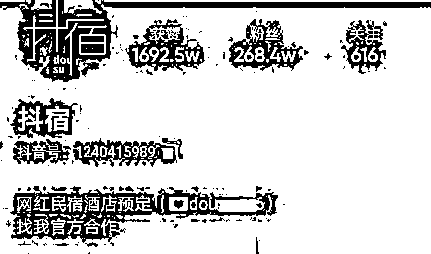

三、怎么变现？

**1.**官方合作

通过星图接广告合作

**2.**微信接单

这种账号的内容就是探店型，酒店给钱出视频。这样的号，内容高度垂直，报价1-3W一个视频。

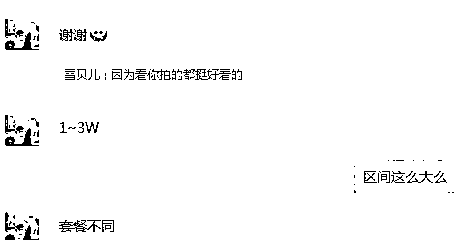

#  

**3.**视频团购分佣

视频里面挂了团购小程序链接，有成交就有分佣，卖得越多，赚得越多。

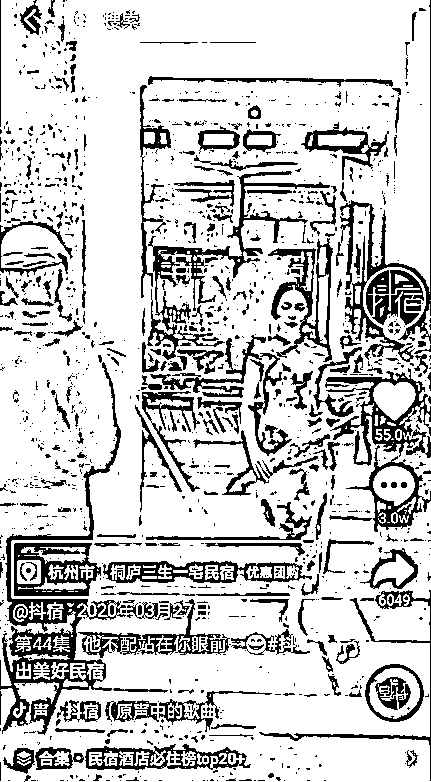

#  

**4.**微信朋友圈成交分佣

微信朋友圈会发酒店的信息，后面带团购链接，客户下单完成订单后就有分佣

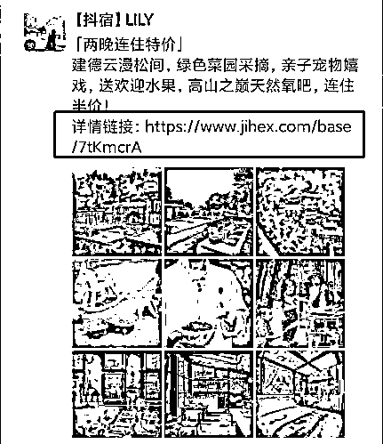

**5.**卖房子

在微信上，卖房子。有粉丝后，这些粉丝又是喜欢住民宿的，所以卖旅游房产，客户群体比较精准。

#  

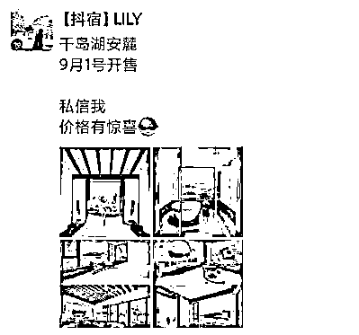

评论区：

侯海锋 : 可以挂风向标

大江 : 谢谢圈友

亦仁 : 中标，术值+1。

点击最上方 #中标  专栏，可查看所有中标风向标。

南京房东杨老板 : 这种号看上去好做，但是起号很难

大江 : 是啊，万事都开头难

大江 : 谢谢🥳

南京房东杨老板 : 我在南京有一些精装修的房子，我刚才看了你的内容也在想，能不能去把它给做起来。他那个的账号是一种清新的自然风景的，我们城里的精装修好的房子，拍的效果肯定没这个好

大江 : 是的，他们的对标主要是旅游景点吧。毕竟住的内景只是一个方面，主要还是外景，是否怡人

#  

# 【细分行业】**11**篇

# **# ****(**精华帖**)(222**赞**)3 **公里内最少有** 500 **人看

# 到，抖音同城号做到热榜第一，**132W **播放

作者：  大芽

日期：2022-04-01

生财的小伙伴们大家好，我是大芽。去年参加了 2 次生财活动的志愿者，确实收获很多，年底也有了小成果，在这里先感谢一下商业 IP 小航海跟生财大航海的各位台前幕后的小伙伴。

我是 2018 年开始接触的抖音，当时囤了一批账号，2019 年靠带货赚到了第一桶金。就是很简单的产品展示挂淘宝链接，2 个人一年做到了 300 多万销售额，毛利在 50% 左右。后面也做过不少其他类型的账号，做过一个搞笑类账号，单视频最高播放 4000 多万。

后面疫情来了，各式大佬下场，带货流量真的是骤减，我开始苦寻转型。同时我很明确，抖音就是未来，所以我考虑的转型也是在抖音内。

去年 4 月份加入了生财也是为了找到更好的方向，刚好就赶上了商业 IP 小航海，为了更好地参与，我选择去报名志愿者，在这里不得不夸一下生财的机制，你是能够很清晰地感觉到他在进步，一步步地完善。

在小航海的过程中，我做了自己的第一个商业 IP 号，主要是做抖音的相关知识和网赚项目，孤狼老师的那一套很有效，我很快就粉丝过千了，但那时抖音对账号的管控比较严，我的这个号由于说了太多诱导词就被限制了。

#  

目录：

⒈** **项目背景** **

⒉** **账号定位** / **账号规划

⒊** **账号如何运营

⒋** **账号如何变现

⒌** **给想入局的普通人一些建议

当时孤狼老师有给到建议，换新号重新来。但我考虑到抖音已经有很多这样的账号，对比下来，我的优势并不明显，就没有做了。

但我没有因此放弃抖音，而是在找与抖音可以匹配的项目，同时扩充自己对抖音的认识，于是我又报名大航海的志愿者，在帮别人的同时也帮帮自己。

现在主要精力是放在实体餐饮门店上面，同时，我也通过做抖音的同城门店号成功把自己的门店做成了我们当地的热榜第一。接下来给大家分享的也是我这几个月做同城门店号的一些经验。

**—01—**

项目背景

#  

我在 2019 年是做短视频带货的，那个时候，抖音的免费流量很可观，即使挂在购物车，也可以拿到千万级的免费流量，那段时期是真正的红利期，也是在那个时候，对抖音有了更深刻的了解。

后来，带货视频的流量就越来越少了，这边刚好又有朋友推荐了一个实体餐饮的项目。

这个餐饮店铺是我投资且参与经营的项目，不是自创的，我本人从来没有做过餐饮。

在这里就跟大家说一下，我自己评判餐饮项目的一些浅见。大家可以参考一下，也可以给我一些意见。

好吃。这个不用多说，正常人的评判标准，这样才会有复购，能持续经营。

能不能与我的经验相结合。这个简单来说就是能不能拍抖音，它是否具备拍抖音的条件，这里我引用蛋蛋老师的** 3 **个可视化元素，就是** —— **产品可视化、装修可视化、服务可视化。

可复制性。这个店的产品是不是很看重大厨，或者说人人都可以当大厨，当我

这个店逐渐成型，我是否能快速复制第** 2 **家、第** 3 **家。

因为本身品类不错，再加上我自己有抖音的经验，想着用抖音给实体店引流的方式，应该不错，就转而来开店了。

**—02—**

账号定位**/**账号规划

#  

抖音始终是一个内容平台，在这个基础上才衍生出电商、广告、本地生活等等。想要把抖音号做好，前期的规划还是很有必要的。

在筹备店铺的同时，我找了一些做抖音的朋友咨询交流。我开的是实体餐饮店，如果内容仅仅是拍摄产品相关，就过于单一重复了，大概率会卡在 500 播放。

考虑到我是第一次开店，所以我们最终采用了「创业日记」的方式，在抖音同步记录自己的开店过程。店铺还没开业，我的抖音号就开始先启动了。

说到做抖音号，我们一开始肯定会说，一定要想好定位，一定要做垂类内容，一定要垂直人群。

从我们的经验来看，做抖音的同城号曝光，其实并不需要一开始就定垂直人群。

拿我这个账号来举例，像我的门店，面向的客群是 18-30 岁的年轻群体。但我做的内容不一定是围绕着这群人来做的，我需要的是更大范围的本地曝光。这个逻辑，和我们把实体店开在热门街区是一样的，只要流量大，总是能吸引到对应的消费群体。

所以，我们做抖音同城号，不用纠结内容是否要垂直，更多的要关注本地曝光。在内容上去思考哪些内容能吸引本地人的目光，从而获得更多本地推荐流量。

我这边用的是新号，第一条作品的内容讲的是终于下定决心开一家小店，为我加油吧。

就是这样的文案。

#  

前期策划比较给力，所以开头还挺顺利的，新号第一条作品，用户互动评论挺好，第一条视频就破万播放了。后续就是沿着第一天、第二天这样的方式进行连载记录，基本都能突破基础流量池。到试业那天，在本地已经有了 20 多万的曝光。

我第一条破 10 万播放的视频，是讲我和装修师傅合作的内容。这条视频，后台显示人群是男性为主，而且从评论区和私信可以看到，更多的是装修相关的各个业务方，都是想找我推广各种业务的。但这个并不会影响到我整体的账号推荐，相反，因为有了几次小热门，账号的数据是越来越好的。

#  

#  

一开始我发布的是门店装修，以及创业相关的内容，所以吸引到的用户是男性用户比较多。

但门店开业之后，我发布的内容，就是门店的产品以及门店相关了。那这时候系统又会把我的内容推送给女性用户。而这个时候的用户，就和我们想要的客群一致了。

我们要做的就是，持续在本地做曝光，让更多的用户知道我们的门店和业务。

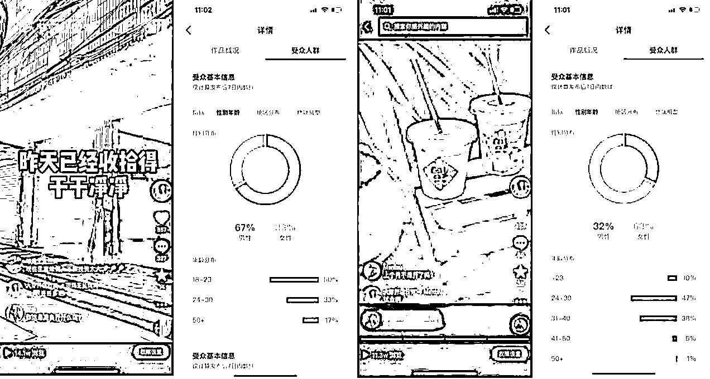

**—03—**

账号如何运营？

#  

我在 10 月份拿了店，就发了我的第一个抖音视频，后面就是把我们的这个店，从装修到开业的整个过程都拍摄记录下来。

这类就是有延续性的内容，我们可以很明显地观察到，这种内容在抖音上是比较受用户欢迎的，类似于住家装修、店铺装修。这类内容能够吸引一部分的人群，而且我更希望吸引的是，以我的店铺为点周边 3 公里的用户。

我只需要保证我每发一个视频，就我周围这 3 公里内最少有 500 个人看到，就没什么大问题了。

那要怎么做呢？结合我的经验总结出以下 4 点：

**1. **拍摄素材

因为我们做的是本地服务，需要让观看的人觉得就是自己附近的人发的，所以我们在拍摄素材的时候，可以尽量多拍一些街道、店铺增加熟悉感，还有一些我们日常的画面，不需要太精致，想到什么都可以拍，但是不可太长太繁琐。

**2. **剪辑

抖音是个短视频平台，没有任何名气的我们，内容不适宜太多。

#  

我的视频基本不会超过一分钟，其实一天发生了很多事情，但是我们不需要每一件事都表现出来，像我刚刚起号，基本就一个视频突出一件事，最好十几秒交待完，再通过剪映拼接在一起。

另外，在封面上直接突出在惠州创业第几天这样的字眼，这样在同城页面，如果用户看到惠州的本地字眼，也会感兴趣点进来观看视频。

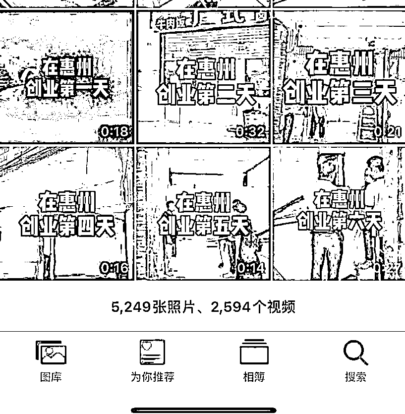

#  

**3. **发布前的几个小细节

⑴**. **带** POI **位置信息：一开始做号一定要带地标，如果店铺还没有地址，可以先蹭热点，店铺周边的小区，酒店等都可以挂上。我一开始就是挂上了附近的一个酒店，其实这个酒店离我们店有 500m，但是没有关系。带上地标，才有更精准的本地流量推荐。

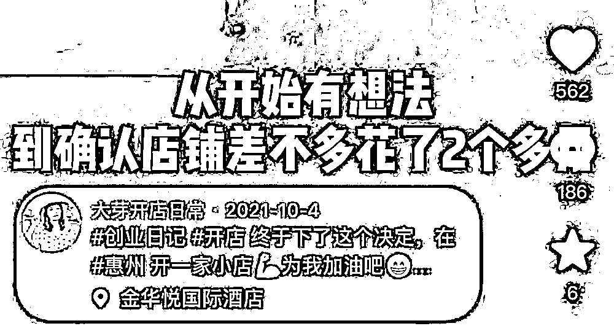

⑵**. **恰当的热门** BGM**：跟其他短视频发布一样，音乐跟话题也是比较重要的，这个其实也是之前积累下来的「网感」，这个我在大航海的日更群有分享过，我是靠刷自己的账号视频，标重点音乐！！

如果某段时间一直刷到同一个视 BGM，大概率这个就是当下的热门 BGM，那我一般就会就点进去看看，使用这个 BGM 的人多不多，有几十万人用，我就会尝试一下。

在发第一个视频时，我就是靠这个小技巧，选到了这个在上升期的 BGM，并一直使用着。持续使用某个 BGM，对于用户来说，也可以当成一个记忆点。

#  

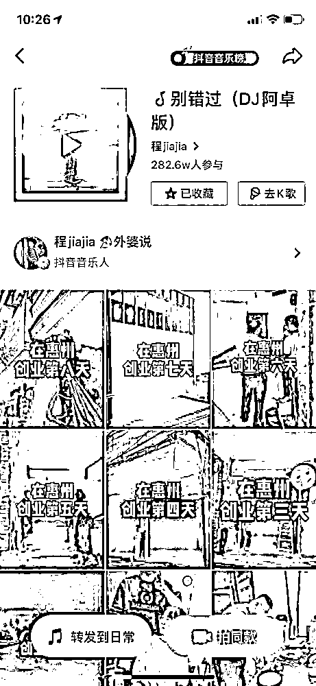

#  

⑶**. **话题：我们做同城账号，肯定要带上当地的话题，像我在惠州，做的是餐饮，我的视频一般都会带上  **#**惠州** #**惠州美食** **这样的相关话题。

⑷**. **标题：在标题里，我会加入一些提问，例如「能想象出来是什么样的吗？」「大家知道惠州哪里有冻品市场吗」「我们要招人啦，大家要来吗」这样的互动话题。从评论区，是可以明显感受到只要你有提问，用户就会来评论与你互动。而这样，也会让视频的互动数据变好，从而获得更多推荐。

**4. **视频发布后的操作

前期如果有用户评论，我都是尽量做到每条都回复，更多地关注与用户的互动和交流，这样呢，才能吸引更多的顾客到店消费。

此外，个别视频我也会适当投 Dou+，不过整个账号到目前为止，我只投放了 250 块钱。

只要有投放的，基本都有几万播放。但是我那些十几万播放的视频，都是自然流量，并没有投 Dou+。**Dou+ **只是锦上添花，核心还是视频内容，只要互动数据好，还是能够获得系统推荐。

#  

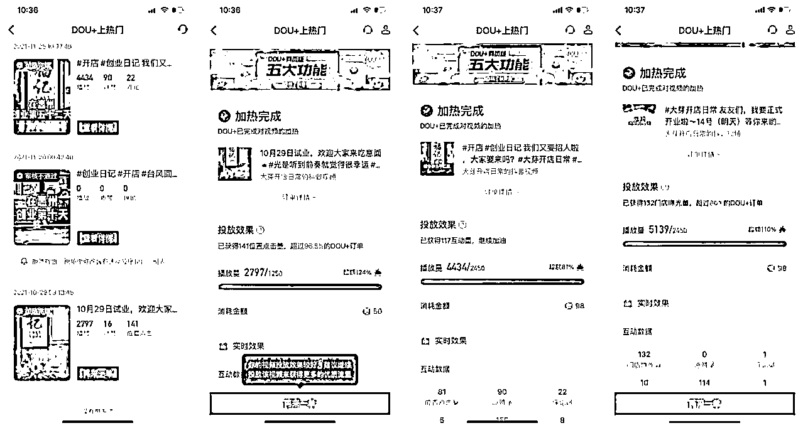

**—04—**

账号如何变现

通过以上的这些小技巧，确实给我们门店做了不少的曝光，累计到现在，已经有 150 多万的曝光了。而我只是花了 250 块的 Dou + 费用而已。通过做抖音门店号，我就节省了大部分的营销费用。

做抖音同城门店号，目的还是为了吸引顾客到店消费，我现在门店堂食和外卖的生意都挺好。

那我们开店之后，到店的客人都会说，我是从一个月前看到你的视频啊。通过视频的方式，确实给用户种草了。

#  

因为我这个店本身离他们不远，所以他们在刷到之后就埋下了这个种子，后续他们呢，可能会挑一天到门店来尝试一下。

在做好基础细节的同时，我都是尽量做到每天更新一条，把自己的门店持续在抖音上曝光。一天两天，甚至三五天，周边用户都能刷到我的门店。

用户自己在抖音上看到呢，有些人他可能有大众点评的习惯，他就会去大众点评看一下我们的一个评分啊，还有菜品是怎么样的。那他的这个动作呢，就让我们在大众点评上保持着一个热度。

在我们当地的大众点评西餐热门榜，连续两个多月霸榜第一。

#  

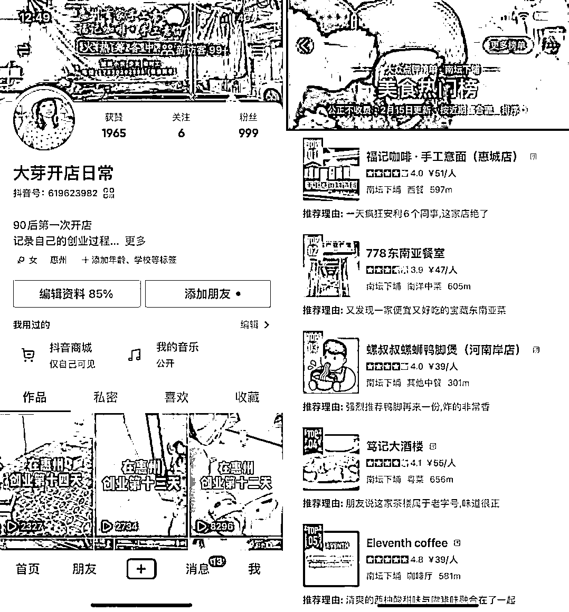

#  

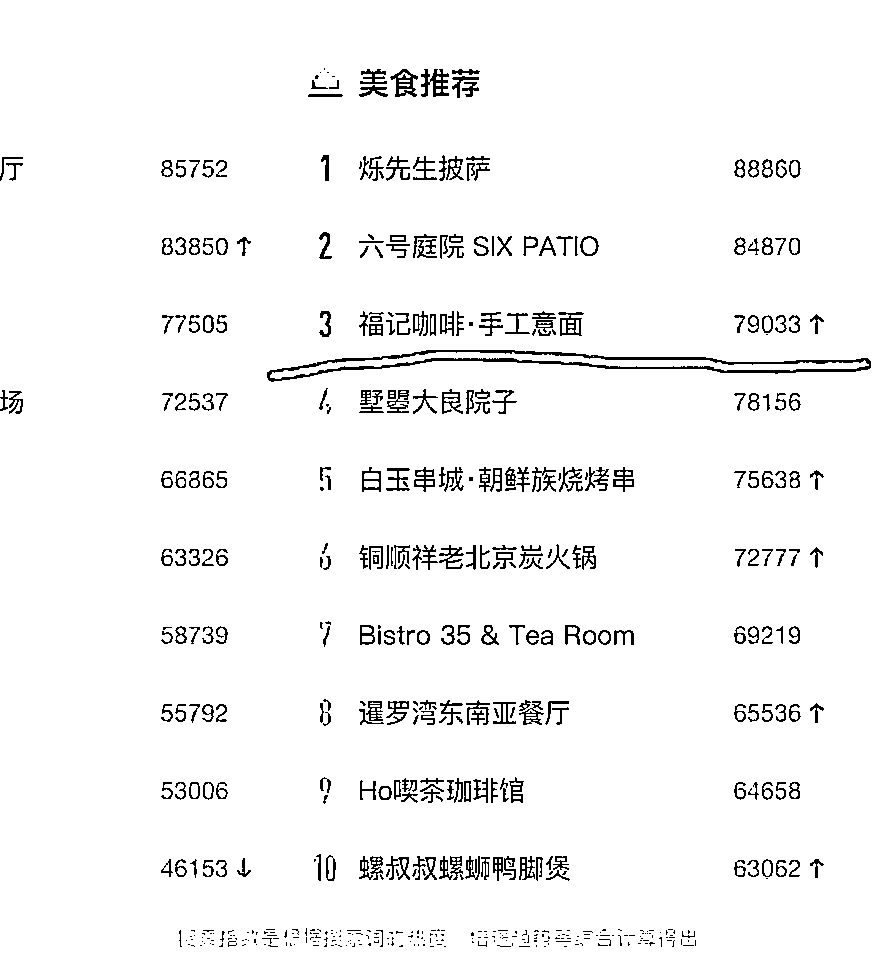

后来抖音团购上线，我们 12 月 14 号上的抖音团购，当月就区域销售第一了。我是 12 月 14 号上线的，有一张月底截图，15 天售 300+ 份，核销了 200+。

#  

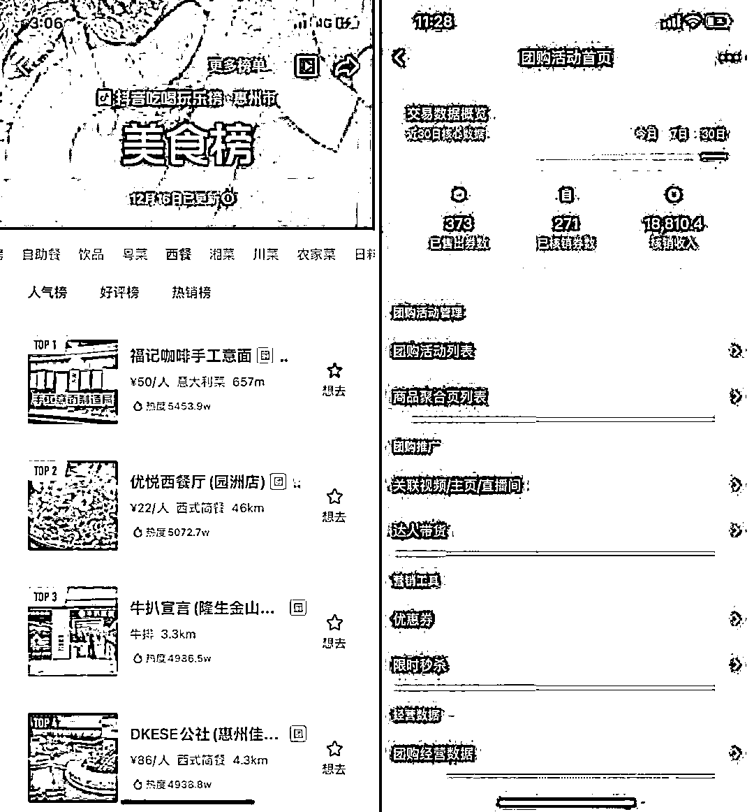

直到今天，店里生意都还不错，我已经在筹备第二家店铺了。

有时候出去外面吃饭，都会被用户认出来，这不是福记老板娘吗？持续的经营账号，用户也会记得你，生意自然不会差。

下一步，打算开直播卖店里的团购套餐了。现在抖音的基础设施还是挺完善的，对于实体商家来说，做营销和做营收都很方便。

#  

**—05—**

给想入局的普通人一些建议

**1. **做有持续性的事情

大家可以看到，我第一条视频一开始发布出去播放是有几千，后来随着视频一直更新，后续有更多的新用户进来，他们也会一路刷，一直刷到我第一条视频，现在这条视频已经有 9.6 万的播放了。

这就是我一开始想做创业账号的原因，相比于其他餐饮账号的产品展示，这个账号其实是在成长的。内容有延续性，账号数据会越做越好，可操作性也更多。

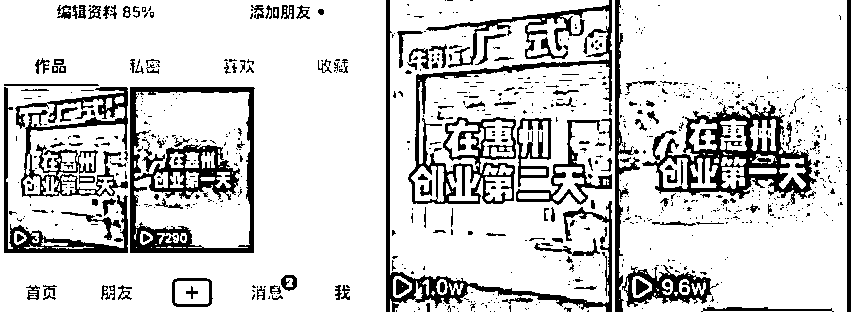

**2. **拥抱抖音

#  

我这几年下来，我在抖音尝试的项目还挺多的。总体感受，抖音确实是值得投入的一个生态。大资本有大资本的玩法，但我们普通人也能在里面有自己的一席之地。

如果你有实体门店，非常建议你开始做抖音，这个渠道的性价比很高，值得长期投入。如果你还不知道该干什么，那我建议，可以先给自己规划一个小生意，卖什么都可以，先定变现，然后进来拥抱抖音吧。

评论区：

黄锦豪 : 好久没有回惠州了！没想到惠州出了一个网红店来自生财圈友！学习了，这周回去打卡！

兜兜 : 牛啊牛啊[嘿哈][嘿哈]

掌柜 : 非常好

大芽 : 来来来，来吃面哈[呲牙][呲牙]

谢奇遇 : 原来是惠州的圈友，我也算是半个惠州人了哈哈

周先生 : 感谢分享

林 : 同惠州的，改天过去捧场

龙文 : 在惠州，改天去捧场[呲牙]

# **# ****(**精华帖**)(134**赞**)**从亏损** 8000 **到盈收** 3W+**，

# 轰趴别墅通过精细化运营实现转介绍率** 70%**

作者： Mage

日期：2022-03-31

大家好，我是 Mage，很高兴能够来到生财分享。

#  

目录：

⒈** **背景：职业发展遇到瓶颈，积极寻求副业

⒉** **过程：别墅整改以及引流运营

⒊** **总结：定位产品** + **搞流量** + **促转化** + **拉复购

⒋** **最后复盘及建议

和多数创业小白一样，我在没有任何市场调研的情况下，接手了别墅轰趴项目，直接亏损了 8000 房租。之后，我开始进行竞品调研，通过「自身定位+自身产品改造+线上线下双管齐下」去搞流量，最后扭亏为盈，实现盈收 3W+，转介绍率 70%。

这篇文章希望能对想做线下实体的小白提供一些思路或帮助，本文章大概字 6600 字，阅读完需 8-10 分钟。

**—01—**

背景：

职业发展遇到瓶颈，积极寻求副业

当时个人职业发展遇到瓶颈期，想着有空余时间做个副业，机缘巧合就转手了这一家轰趴。时间是 2020 年 4 月初，当时国内第一波疫情刚过去没多久，以 10W 的价格月租金 8000/月接手了一家 3 层带院子 300 平的别墅一栋。

#  

当时是职业发展瓶颈期，工作又比较闲（自己是管理层），就想着干点啥搞点副业增入，后面在微信朋友圈看到之前去玩过的一个墅轰趴老板因为疫情扛不住想转手（2020 年 1 月爆发疫情，他扛了三四个月)。

我记得很清楚，当时是微信上聊的，他发了之前经营的每个月流水，我一看随便都是三四万，一场接两三千，一个月接八场十场也有一两万的额外收入，而且又没什么成本，只有房租，也不用天天待在别墅里，有订单来了再过去，再不济接个三四单保本肯定没问题，就一股脑签了合同接手了这个别墅轰趴。当时完全没有想过如何去宣传和经营，也可以说想得比较简单。

接过来之后，发现和我想象的并不一样，5-7 月总共只出过零散几单，团购平台也基本无人问津，刚开始以为是疫情刚结束，线下实体还没慢慢恢复，也不认识同行，以为大家都差不多，属于处在自我麻痹中。

其实 5 月份就已经开始恢复了，因为房租是 3 个月一交，到了第二次交房租的时候，才发现过去了 3 个月，算下来房租 + 物业费 + 水电费亏本 2.6W。

恰巧当时 6 月底在朋友圈看到有人宣传生财有术的训练营，就好奇点了进去，一开始没加入，后面去网上搜一下在某鱼看到有人卖生财的精华帖，买了之后看了一些贴子觉得干货满满，特别是其中一篇：https://t.zsxq.com/jmEYNNR对我的启发很大，很多都是参考借鉴里面的，这里也要感谢生财，有一个这样的平台为我们这些跨行业的小白提供思路。

**—02—**

过程：别墅整改以及引流运营

#  

⑴. 转来之前，没有任何市场调研基础，以为发发朋友圈入驻美团 / 大众就有订单可以坐享其成捧手分钱，到每月亏 8000 房租 (5-7 月)。

⑵. 痛定思痛，为什么会没生意，竞品调研 + 自身定位 + 自身产品改造 + 线上线下双管齐下去搞流量 (8-10 月) 开始盈利。

⑶. 差异化服务带来好的口碑转介，美团小红书等平台也开始发力 (11-2 月)，开始爆单。

一、别墅整改

我开始对别墅内部进行改造，把一直闲置的院子重新粉刷，并购买安装秋千和一些好看的灯饰，用于拍照使用，把别墅内老旧的机器更换，三层别墅大扫除。

下面是部分改造的前后照片对比：

#  

二、引流运营

**1. **团购平台开通引流套餐

原先只有两个套餐，并且没什么吸引力，就加了几个引流套餐：

49/2 小时私人影院

中包 KTV 199 套餐（不含酒水饮料）

4 人麻将 3 小时 58 套餐

698 生日聚会套餐 3-5 小时  （赠送拍摄制作视频）

部分图片展示如下：

#  

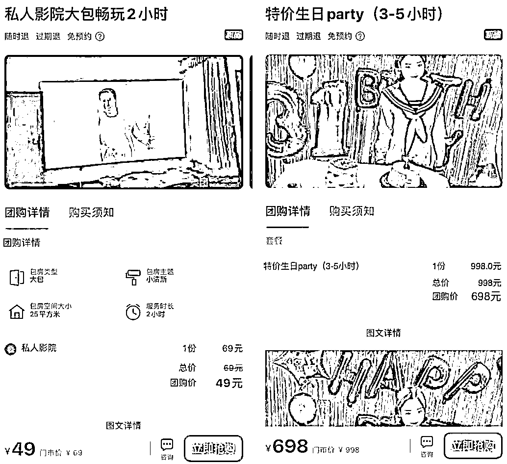

因为房租是固定的，平时生意主要在周五至周日，周一到周四别墅基于处于闲置浪费状态，设置这几个套餐的目的是为了在平台上引流。

来的客户转发朋友圈可以享受 6 折，基本上来的客户都会愿意发朋友圈，这样我就逐渐积累了一批比较精准的客户。

发一次朋友圈，少的有几个人，多的有十几个人添加，会添加的大部分都是有意向的客户，当然以上这些套餐基本是不挣钱的，纯属为了引流，不让别墅闲置。

#  

**2. **在小红书找本地探店达人置换

我会免费请他们过来玩，要求就是帮我在小红书发一篇帖子。

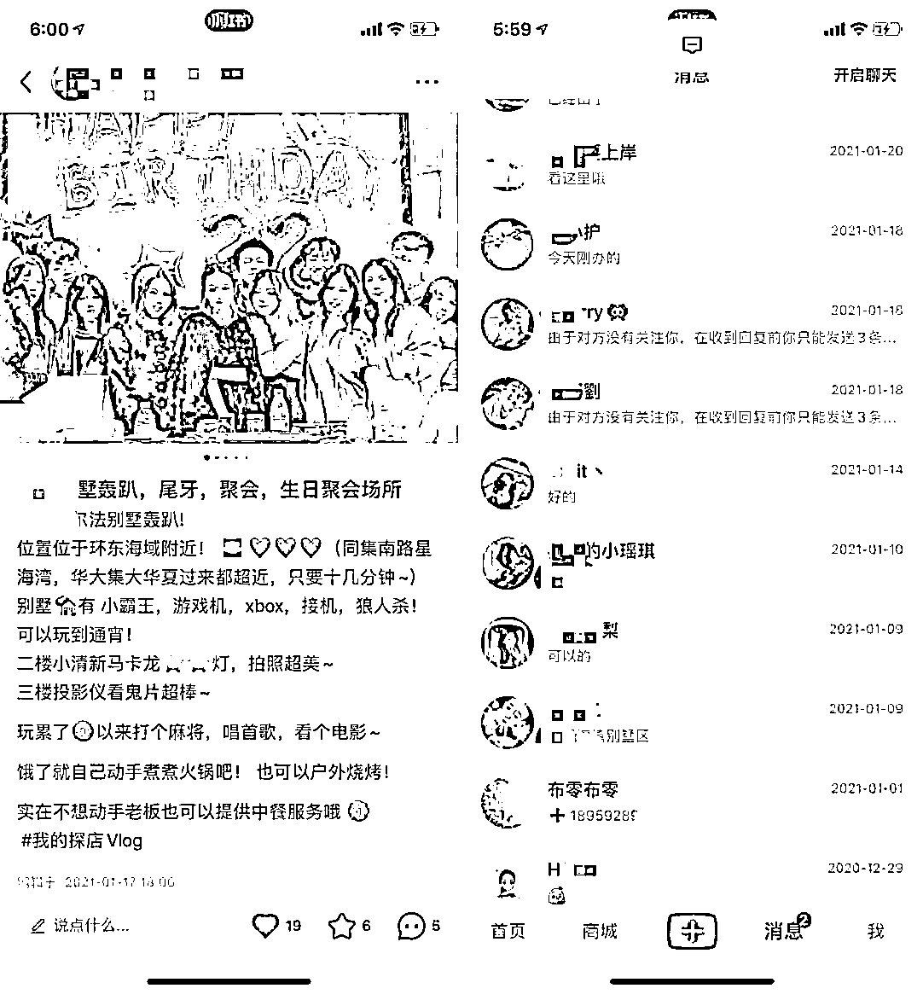

**3. **线下制作海报张贴

#  

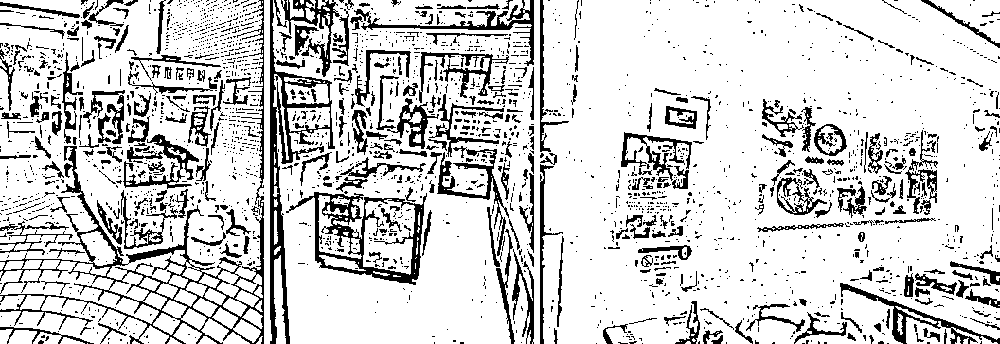

在距离周边 0-8 公里的写字楼楼下 / 高校张贴海报，一般和老板谈的是 100-150 元 / 3 个月，好的位置一周被动添加 3-5 个人，会主动扫码添加的用户，意向度也是比较高的。然后根据添加的客户位置进行优化，好的位置继续续费。

**4. **与旅行团、场地布置、户外团建异业合作

和户外团建合作的效果会比较好，有时候一个月可以推 2-3 单，因为很多小公司报了团建不会去考虑内容，是由拓展公司推荐的，和他们合作一般给的是场地费 10-15% 佣金。

**5. **高校校内代理

当时通过海报张贴，在附近的一个高校内招聘到了一名代理，恰巧这个代理在校内也有一些资源，仅仅那一两个月前后，就陆续推了 10 个订单。高校资源是可以积累的，一届带一届，所以不要小看校园资源。

薪酬模式有两种：

第一种是给他底价，他自己报价。

#  

第二种是固定 10% 提成。

**6. **民宿网站入驻

我在节假日的时候会接到旅行的团单，而且一般都是 2-3 起的。

针对游客主要入驻了市面上的平台，比如途家 / 美团民宿 / 爱彼迎 / 小猪民宿等，流量比较大的是前 3 家，另外每个平台都多开了 2 个以上房源，可以理解为多了一份曝光。

**7. **微信转发裂变

上面几种方式获客最终都可以引导转发朋友圈，这也我认为最好的一种宣传方式，如果强行要求客户转发，其实他们会比较抗拒。

一般会有两种情况：

第一种，客户预订的时候要优惠，那这个时候就会事先谈好，比如所有人转发朋友圈 12 小时且不屏蔽就给与优惠打折，这种最直接也最省事。

第二种，我会给每场来玩的客户拍短视频记录，在最后带上我的宣传二维码。

根据运营下来的整体数据显示：

#  

平台上的用户忠诚度不高，他们选择性比较多，私域的效果是最好的，平均复购率可达到 10-15%，我这里指的是二次复购，部分客人很喜欢我们的风格，自己来过 3 次以上的也有。

三、小红书置换流程及注意事项

下面，我着重讲一下小红书置换的流程和注意事项。

**1. **首先打开小红书，定位所在城市，开始刷。目标主要是置换 18-35 岁爱在小红书分享  / 打卡的这一群体，点进他们的主页后做以下动作。

第一，看粉丝数，粉丝数量太少的，置换没什么意思，纯属我们亏本，粉丝量太高的一般都不接受置换，需要广告费，大概 500-10000 元，我一般是选粉丝数在 5000-3W 这个区间的进行筛选。

第二，看这个置换的达人发的是否是这个城市相关的吃喝玩乐，如果发的都是美妆 / 护肤类，这种就是泛粉，当地城市的精准粉丝较少。

第三，看这个达人的拍照和文案功底，起码看起来如果我刷到是有兴趣点进去看的，而不是过于随手拍类型。

第四，这是最重要的一步，看粉赞比，一般 5000 粉至少要达到 10W 以上的获赞和收藏，这样的达人就算比较优质（比例大致是「粉丝：获赞与收藏」在 1 : 20 以上) 

**2. **接下来就是打招呼的过程，一般我会说：哈喽博主你好，关注你很久了，我这边是位于 XX 地区的 XX 别墅轰趴馆，觉得你在小红书上发表的内容和拍的照片都不错，想诚邀你和你的朋友到我们这边体验一下，不收费～要求就是你帮我们在小红书上写一篇文章帮我家宣传一下哈～～～

这样拿着账号批量去和小红书的达人打招呼，在有意向的博主回复之后，就把场地的照片位置和可以体验的时间发过去，再就是加上微信等他们过来探店。一般发 10 个博主会有 3-4 个同意，最后会过来的有 1-2 个，其他的可能说没时间，或者等下次朋友过生日等。

在达人来到门店的时候，我会做一个横幅，欢迎 XXX 前来探店，成本就是 10 元，虽然是一个简单的操作，但达人到了之后会有完全不一样的感觉，打心里会觉得这个商家很尊重我，我一定要好好帮它拍照宣传一下。

**3. **当达人体验完置换之后，要尽快对他们进行催稿，最好是 1-2 天内完成，然后发到小红书上面，我们的要求是尽量让达人一个月之内不要删除。而且，如果你手中掌握了大量的当地小红书的达人资源，也可以走其他的变现模式，比如品牌推广、店铺营销等等。

另外，美团 /大众入驻以后，是可以直接发手机号或微信号引流的，虽然平台会提示不要使用第三方交易，但基本没什么问题，没被罚款过。

美团 / 大众入驻收费是根据所在行业城市来评定的，我当时入驻是 7800 / 年，另外加了 3000 元推广通，就是 10800。推广通就是直通车，在美团上成交也是要抽佣的，一般都是直接引流到微信上进行成交。

途家 / 小猪民宿 / 爱彼迎这些平台入驻也很简单，提供租房合同和基本信息就可以，这些平台统一扣点也是 10%，有时候一单 3000 元的单子就要抽 300，还是很多的。

#  

这几个平台是不能发微信和电话号码的，审核比较严格，被查到会进行罚款处理，不管你这一单是否成交都是一次罚款 50，严重的可能会降权，为了规避平台的检测，也试过各种稀奇古怪的方式给客户发联系方式。这一种被查出的概率会比较低：我们地址是在  135 街道 660 路 138 号 XXX，类似这样，把微信 / 电话掺杂在里面，也会检测到，但概率比较低。

小红书打招呼过于频繁也会封号，我一般一天打 10-20 个左右，控制好数量，可以多个账号操作，当认识的达人多了以后，在当地都会有一些群 / 组织，  想办法进群，就会更方便做置换了。

预订的房客都会让他们填写入住信息  ，这样做一是为了收集信息，二是增加合规性。

亲爱的房客，我们需要您的以下这些信息：

姓名:

电话:

身份证号：

入住时间：月  日  点 - 次日下午  点

聚会类型：

入住人数：人左右

别墅租金：

定金：

*下单后关房，方便入住当天店长配合房客！主理人电话:

*退订规则：

入住前：房客单方面非不可抗因素违约，定金概不退还。

入住当天：定金转为房租一部分，支付剩下尾款，另预留押金。

离店当天：查房后确定是否有其他消费，定金多退少补。

#  

生意比较好的是周五到周日，房源紧张的时候 24 小时要接 2 场，白天场 10:00—17:00，晚场 18:00 - 次日 09:30。中间只预留了 1 个小时搞卫生，其实是不够的，但一般会提前和客户说好，大部分客户也可以理解，有些客户不一定会呆满预订时间，提前走就可以提前安排打扫卫生的阿姨，时间紧张的时候自己也要上场。

以上就是所有的获客渠道，和同行有所不同的可能是我在线下接待这方面做得比较细。

比如夏天的时候，我会提前 1-2 个小时开好空调，并且准备切好的冰西瓜放在桌子上，客人从室外 35-36 度到别墅里有空调，还有冰西瓜，感觉上是挺不一样的。

另外，我会免费帮他们记录团建的短片 + 图片，客人团建过后发给他们，如果是过夜的客人，晚上会提前帮客户调节好热水，以及房间插好驱蚊灯，并且会在每个房间里放上鲜花，做的是一些细节上的东西。

#  

实际上，做这些事情额外增加的成本并不高，但是给客户的感受会完全不一样，客户离场后我还会给客户发一份满意度答卷，根据需求再实时调整服务状态和策略。

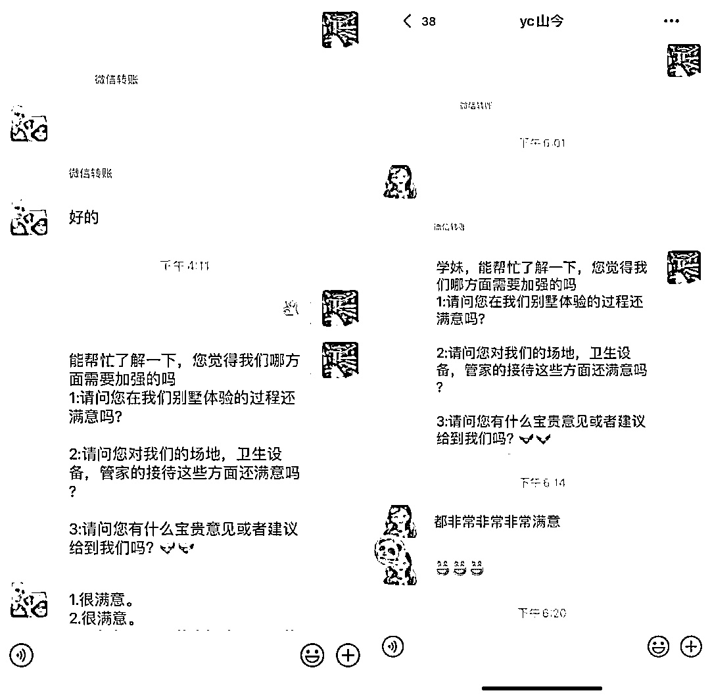

在客户运营上，我会建立客户微信群，把有咨询未成单的客户拉进群，每天固定在群里发红包问好，每次大概是 10-20 元，发 20-30 个包，红包个数不要发太多，太多只能抢到几分钱，大家都不爱抢，导致群不活跃。

#  

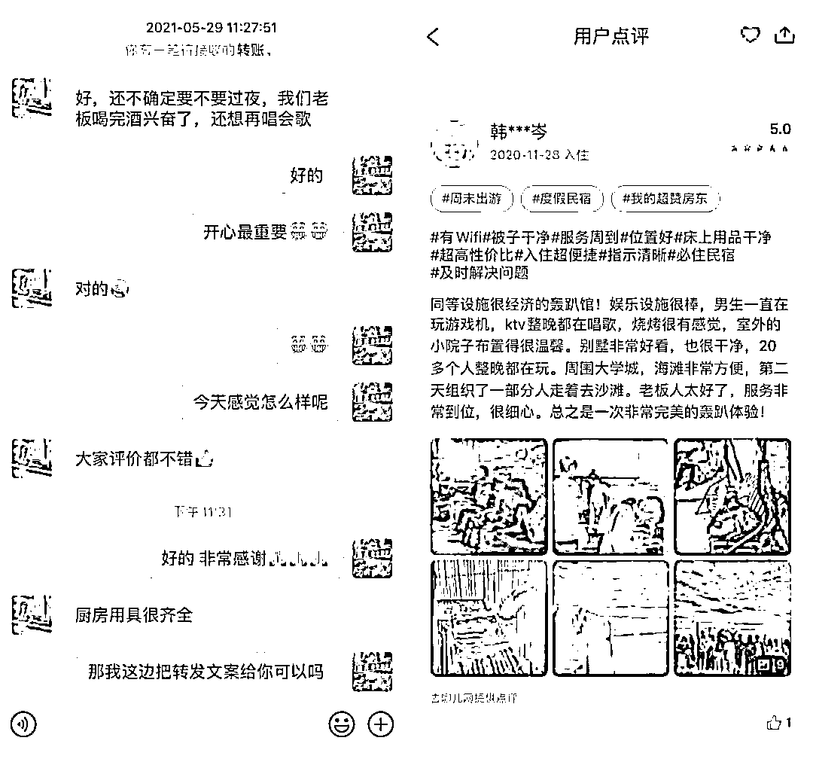

然后一周发 1-2 次其他客户团建的视频（一般会发聚会和生日这两种类型），  每周固定做一场定时秒杀，一般在周三和周四左右，把后面还没有预订出去的档期拿来做秒杀，秒杀的价格一般是原价的 5-7.5 折。

除了咨询未成单的客户外，已经来过的客户也会建一个微信群，这个群里面都是已经来过的客户，每周大概在群里轻度营销 1-2 次即可，太多了客户容易反感退群，这些客户已经来过且知道，你的微信群聊存在他的聊天列表中，如果有需要肯定会想到你。

#  

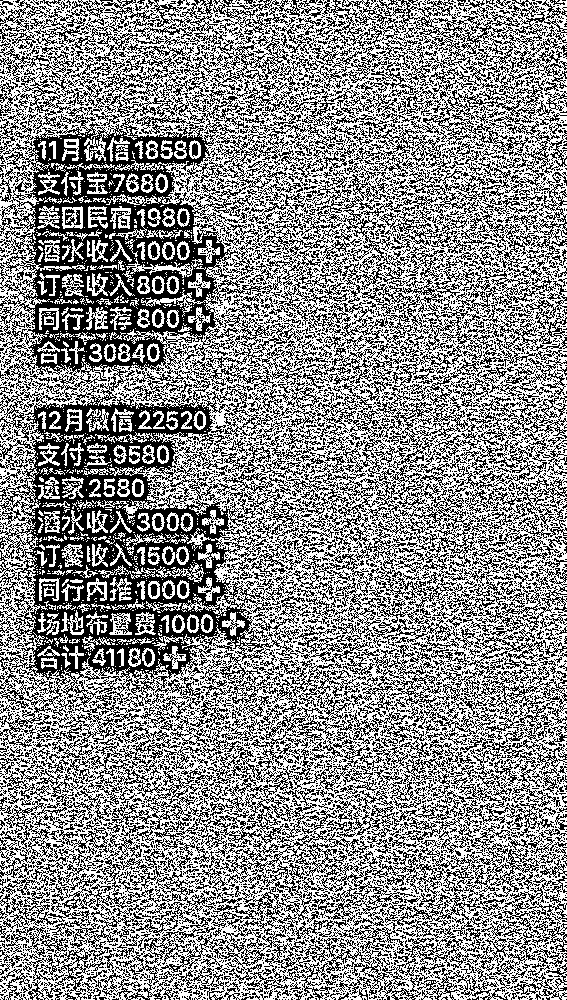

#  

上图是 2020 年 12 月份的账单，这里微信收入 22520，支付宝 9580，途家平台  2580，  另外还有酒水和订餐收入 4500，还有同行内推和场地布置是 2000，合计是  41180，扣除房租水电物业费卫生费 11050，最后盈利是 30130。

**—03—**

总结：

定位产品** + **搞流量** + **促转化** + **拉复购

轰趴也有大中小类型，所以客群定位也会不同，不同的客群定位所对应的流量来源也会有所不同，主要分为以下几种，公司部门团建 / 家庭朋友聚会 / 学生部门聚会 / 节假日游客。

针对不同的客群制定不同的推广方案，雨露均沾  。

公司部门团建主要是** hr **或老板来找场地，当时进了一些** hr **招聘群还有场地周边一些办公楼的物业群，偶尔在群里发发广告配合红包。

家庭聚会没找到很好的切入方式，主要还是靠团购平台和转介绍。

针对游客主要入驻了市面上的平台并且多开房源增加曝光，学生在校内设置了

代理和部门进行合作。

#  

利用多种渠道获取流量，利用细节做好存量和复购，到目前接近 2/3 左右的订单是来源于微信转介绍。

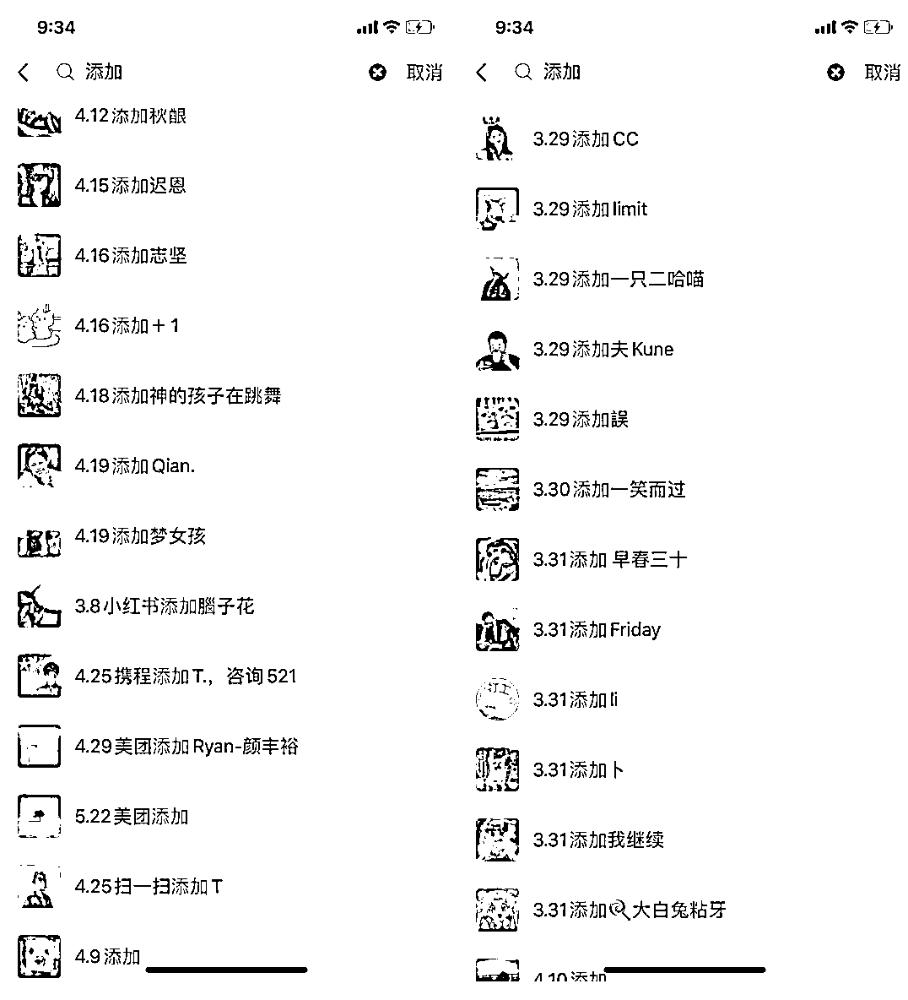

另外轰趴属于服务行业，挣的也是服务的钱，除了传统的场地预订之外，还有提供订餐服务，像这样一份套餐，利润就有 15%-20% 左右，有时候一场场地费可能才两千多，但是客人在别墅让我提供预订 + 酒水消费可以达到一千多的利润。

#  

#  

后续能提供的服务取决于你对客服了解的情况，例如今天是什么类型的聚会，有没有准备食材酒水，没有就可以推荐自己的套餐和酒水。

还有就是同行互相推荐和布置场地，比如我这边周六场地已经布置好了，现在客户又急需周六想订，这时候可以把客户推荐给同行，一般有 10%-15% 的返佣。

**—04—**

最后复盘及建议

做轰趴也有很多棘手的问题，比如在别墅区内会扰民，有时候就会碰到举报，情况轻一点的是到物业，严重一点的会报到 110，然后日常需要修缮的问题也很多，比如停电跳闸、设备突然损坏、更换电灯泡门锁之类。

2021 年的时候把这个别墅转给了一个朋友，主要有几个原因：

虽然当时经营的还可以，但是近几年国内小规模疫情频发，虽然人们已经不恐

慌了，但是聚集性的活动会受到限制，而且一爆发就是基本一两个月才能恢

复，意味着这一两个月肯定是没有生意的而且实打实要亏房租，疫情过后的一

两个月基本也就是保本为主。

别墅区内和业主物业的关系比较难处理，因为这栋别墅位于的小区间距都不

宽，虽然别墅内做了隔音处理，但是晚上** 10 **点以后稍微嗨一些旁边的居民就会有意见，动不动就是投诉物业，严重的报** 110**，所在片区的片警马上就会过来，严重的马上让客人散场甚至我要去局里喝茶，轻微点的就是警告一下不要扰

民，这样对在场的客人影响还是很不好的，因为出来玩还要被派出所警告。

#  

从长远性来看，轰趴这个行业目前属于法律监管还不严格的阶段，如果要留宿

轰趴是要办酒店经营许可的，但不是商住两用的办不了，所以在法律层面如果

没有相关证件是算** **「违规经营」。

可复制性不强，没有很大的品牌支撑，知名度不好扩大，如果投入大量资金在

装修设备上下功夫目前国内这样的形式回本周期也不确定，属未知。

外部竞争变大，一些民俗** / **客栈也改成轰趴馆，以极低的价格抢客源。

最后也想和想做实体的小白朋友说几句：

实体真的没有那么简单，不是开个店就有钱送上门的。

技术** / **口碑** / **品牌** / **差异化这些才是你在这个市场上的竞争优势。

你手上的现金流能否支撑你支付至少一个季度的房租和人工成本，这是必须要

有的抗风险能力，如果这一点都没有，那一但碰上不可抗拒的因素会很快崩

盘，甚至负债。

如果你还想铁了心的做实体，那么一定要运营好私域客户，加微信这是必不可少的动作。

另外，文章尾部再次感谢一下生财的邀请分享，很庆幸遇到生财！  祝大家生财有术！

评论区：

#  

文林 : 厉害

轻描😈淡写 : 分享的很细，

NO哥 : [强]很牛逼，受用！

Mage : 谢谢[抱拳]

Mage : [抱拳]

Mage : [抱拳]

小牛 : 666

入海 : 厉害

# **# ****(**精华帖**)(120**赞**)**同城号蓝海领域如何半个月

# 获** 500 **个精准客户，成功变现** 15 **万

作者：  井九

日期：2023-06-13

做同城号蓝海领域，如何半个月获取500个精准客户，成功变现15万

各位朋友好，我叫井九，目前在操作同城商业转店招商号，作为一个蹲了好几年的小透明，准备做分享一个目前算是比较蓝海的项目，我们通过这个项目半个月时间内成功变现了十五万，其实不止这个数，免得人说标题党，当然我们目前的线索后期还会有转化，关键是我们从起号到成交，只投入了500元。详细内容前移步飞书

https://r4d3nnajkk.feishu.cn/docx/OBjId2g9Goz997xr9dccrL4Annf评论区：

羔羊不会迷失 : 飞书权限没开  看不了

井九 : 稍等

井九 : 可以了

加英 : 好厉害的样子，我只对15w感兴趣但是看不下去[抓狂]

井九 : 主要不知道咋表达，只能将就看看

阿强 : 自己带客户吗？还是直接推微信给现场招商？

井九 : 签合同了，他们会安排一个人和我们对接，一起带客户之后到签合同，之后就是 

他们的事了

阿强 : 不是，我的意思是，你加到了微信是直接推给招商看盘还是自己带着去看盘**# ****(97**赞**)**通过** 1700 **万的搜索关键词，看抖音** **

# **SEO **蓝海机会

作者：  令狐峰

日期：2022-11-21

通过1700万的搜索关键词，看抖音SEO蓝海机会。

前两天给一批生财圈友分享了一下，怎么切入抖音SEO的千万级流量蓝海机会，低成本、源源不断地为生意引流。

今天把文字稿整理出来，感兴趣的圈友，特别是这几类老板可以关注一下：

本地生活服务（同城装修、买房咨询、全屋定制、住宅家具、家电维修、旅游报团、美发、车改装、婚纱照、植发等、二手车）

连锁加盟（洗鞋、收纳师、洗衣、小吃加盟等）

知识付费（职业培训、电商培训、考研考证、项目培训、兴趣爱好培训等）

高客单价生意（品牌鞋、疗养、二手奢侈品、保险、留学等）

https://bchje44bsl.feishu.cn/docx/HzEKd8PYsovBq0x6noAcv9kOnde评论区：

白杨SEO : 很赞[强]

东山老师 : 用seo的思维去铺关键字，是一个长线的生意。我去年做的几个寒假招生的视频，现在每天都有人翻出来，私信我

令狐峰 : 抖音SEO是一个被忽略的流量洼地，如果能够挖到一些蓝海词，并且获取到排名，流量会源源不断持续半年以上。

东山老师 : 其实小红书和知乎更好铺SEO关键字。

令狐峰 : 抖音的搜索人数是小红书和知乎的5-10倍，市场空间要大很多，并且蓝海词也更多

#  

Good luck : 大家都很好奇你用的什么工具？

令狐峰 : 自己研发的哈

Good luck : 建议推广

# 【小红书引流】**3**篇

# **# ****(**精华帖**)(222**赞**)**小红书** 10 **大传统行业，引流

# 获客模板

作者：  温州土老板

日期：2023-03-01

小红书10大行业，引流获客模板

看星球关于小红书的内容慢慢多起来了，有种喷井式爆发的架势，这感觉还是蛮好的。

我做小红书比较早，这2年带过上千位圈友一起去小红书搞过流量，自己大号上也有200多篇爆款笔记，在生财也分享过几篇，关于在小红书赚钱的思路。

最近我写了10个传统行业，在小红书引流获客的玩法。内容围绕一个一个商业案例展开，简单易懂，同时总结了他们爆款笔记的模板。

有案例，有拆解，有公式，有思路，有引流渠道，有爆款细节！

希望可以给大家带来启发啊！  小红书

https://k3vtw0va9w.feishu.cn/docx/Y6iedn1R1otk4ax9uUZcIdbsn2g评论区：

#  

老彭 : 多谢分享，现在在小红书做职称服务[呲牙]

金多多 : 土老板的超级干货鸭[强]

温州土老板 : 希望能给大家带来启发

温州土老板 : 谢谢

亦仁 : 感谢分享，已加精华。

温州土老板 : 多谢老板鼓励[胜利]

秋 : 超级干货，谢谢[微笑]

麦格雷皮 : 有房产的账号推荐吗？谢过了先

# **# ****(**精华帖**)(142**赞**)**利用商场优惠活动，**3 **天引流

# 私域** 2000+ **人，变现五位数

作者：  小明同学 

日期：2023-01-19

《利用商场优惠活动，3天引流私域2000+人，变现五位数》

大家好，我是小明同学，生财第六期新圈友，马上过年啦，终于开始陆续有时间进行复盘，新人首帖，按照圈友老规矩，先上结果，元旦期间，利用家附近的商场优惠活动（满800-600，第二件起参与优惠），3天左右时间通过小红书发帖，引流私域2000+人，通过收取固定的代购费用，变现五位数。以下是详细信息。

这篇文档主要详细讲述了整个流程，可供有需要的圈友参考

主要分为以下几部分

1、整体流程保姆级讲述

2、小红书引流方法与思考

3、引导私域动作思考

4、一些踩坑点

5、可迁移复制的地方

https://aiyoahk3lr.feishu.cn/docx/UrTGdXi2JoJJfkxMvcucM8PMn3e评论区：

#  

小明同学  : 新人第一次发帖，如果圈友们觉得有帮助，可以动动小手给我点个赞鼓励下[嘿哈]，提前祝大家新年快乐，2023生财有术呀

时，势，人 : 很棒

Lyna喵 : 我昨天也被封号了，封号后再起号，需要刷手机和换手机号吗？用同一个手机号会不会被限制？

小明同学  : 小红书不需要，直接起就可以

小明同学  : 谢谢圈友鼓励！

鲸鱼🐳 : [奸笑]小明同学第一次分享，必须赞

亦仁 : 机智

亦仁 : 感谢分享，已加精华。

# **# ****(85**赞**)**同城高客单在小红书玩法分享

作者：  西猫仁

日期：2023-06-15

最近在小红书操作同城高客单的引流，目前跑通了整个流程，分享给大家。

首先要说明的是：同城高客单不是涨粉逻辑，是吃评论、私信逻辑，只要关注一个点：加到微信的用户有多少。粉丝量没有意义，所以我们所有的操作都是围绕这个点来进行。

第一步** **注册养号

注册养号，生财的帖子很多，说说我的方法

用数据流量注册，前期不连WiFi，注册时候只选择自己行业相关的标签话题，注册好后刷大约20分钟，关掉。

我这里用长沙高端月子中心举例。

隔几个小时再打开，搜索行业关键词：长沙月子中心、长沙月嫂、长沙产后护理等，只看不互动，刷半小时。注意：做本地同城的，搜索关键词一定要带上城市名。

#  

第二天，继续搜索行业关键词，开始互动，点赞、收藏、评论，互动几个帖子就行，多刷多看，尽量模拟真人用户操作。

第三天，看账号推送的内容是否大多是自己行业的内容，如果是，就养号差不多了，再继续养1-2天，账号就成了，可以准备发帖。

第二步** **打标签

其实养号也是在打标签，只不过打的是用户端的标签，还没有打上内容端的账号标签。

目前这个账号在系统那边会认为是关注这个行业的真人用户，但是还没打上内容端的标签，如果你直接发行业内容，其实系统是不知道怎么给你推荐的。只能给你瞎分发，这样数据就很差，流量起不来，因为系统推不到你的目标客户。

所以这个时候要借助同行以及热心群众的力量！！！

这个是真干货，要记住!

首先，一定要发问问题贴，什么意思？就是要发行业相关的问题，目的是让同行和热心用户来帮你解答，达到打账号标签的目的。

还是用月子中心来举例子。

标题：长沙哪家月子中心好啊？

内容：一张手写的图片就行。如图

#  

文案：宝子们，7月的预产期，最近打算去看下月子中心，长沙哪家月子中心好啊，价格不错服务好的，求推荐求介绍啊。

如果你之前的操作没问题的话，发了这种帖子，会有同行主动过来留言，还有就是热心用户过来留言说哪家不错，哪家不好等，也会有真实目标用户过来收藏点赞。

这样你的内容端标签就慢慢打上去了，然后看账号情况决定下一步，如果互动数据很少，第二天继续发，内容标题类似就行，可以换一个区，比如长沙开福区哪家月子中心靠谱，求推荐。注意，封面图重新写一张，不要用相同的图。

这样，你发的帖子数据就会很好看，系统把你的标签打上，系统会判断这是一个真实的用户而不是营销号。打好标签后，你的内容就会推到目标客户那边，这时候，就要发针对目标客户的帖子，举个例子：集美们，最近有打算找月子中心的吗？我们可以抱团取暖，交流一下，针对性考察。

这时候观察你的帖子下面有没有目标用户过来留言，如果有，那账号就成了~

第三步** **干货分享

#  

这时候你的账号标签没问题了，你随便发啥系统都会帮你推给目标客户，当然不能乱发，要进一步提升信任度，开始发行业干货了。还是以月子中心举例，内容素材直接在小红书上搜，比如：月子中心和自己在家坐月子的区别，月子中心要注意什么，怎么挑选月子中心等，把内容整合一下发出去，观察一下赞藏数据，数据不错的话，账号就大成，可以引流了~

第四步** **引流

引流笔记有2种思路。

第一种是维持之前的人设。

我们打标签发的帖子都是模拟真实用户来发的笔记，所以引流笔记还是用真实用户的人设，发布的帖子可以是对比同行、实地考察等从价格、环境、售后服务、口碑等角度植入我们的门店信息。

举个例子：

姐妹们，今天我去考察了4家月子中心，第一家在河西，环境不错，就是价格太高端了，我不配。

第二家在河东，环境、服务不错，价格不错，目前偏向这家balalala

第三家balabala...

第四家balabala...

就这样发，发完这种帖子后，一般就会有目标客户评论or私信你，求推荐第二家，这样就可以私信用户给用户推荐，留自己家的微信，给销售去邀约、到店转化就成了。

后续再发帖思路就是姐妹们我定好哪家了，姐妹们我入住月子中心了，姐妹们今天在月子中心吃的月子餐等等等

#  

这种人设的笔记，完全模拟真实用户，代入感强，信任感强，且这种高客单价的项目不会大规模爆量，私信直接发微信号都没什么问题，我做的一个号，发了1个多月微信号了，也没被屏蔽啥的，平均每天3-5个流量，一个月100多个目标用户加到微信，关注的粉丝也才30多个，所以不要看粉丝量，最重要的是评论和私信。

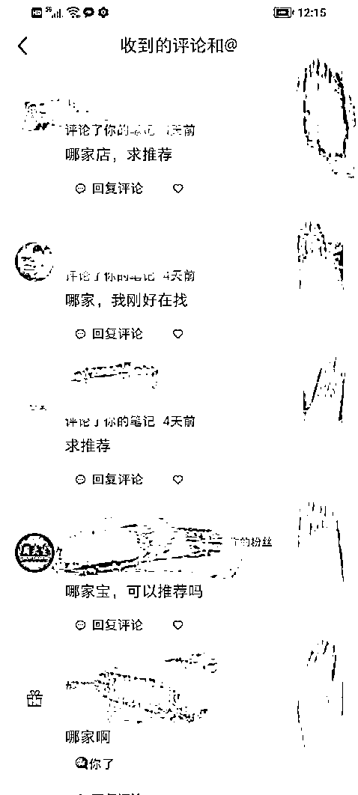

这种真实人设账号的缺点是账号周期短，比如月子中心，从准备找月子中心到最后坐完月子，账号周期就完了。好在完全不需要担心素材问题，可以重新起账号，再走一遍这个流程，这种账号权重极高，即使不更新了在话题标签里面也有很高的排名，引流能力极强。我有个账号，2个月没更新了，还不断有用户私信过来求推荐。

#  

引流笔记还有第二种思路，直接用商家人设。

前面说到账号打好标签了，除了模拟真实用户还有就是直接用商家的角度写，因为打好标签后，发的内容会推到目标用户那里去，所以直接发硬广，注意：骚操作来了，把关注我们的同行全部拉黑，防止举报。发布笔记可以是硬广+行业干货，大约1:2的比例去发，然后慢慢把前面为了起号打标签发的帖子隐藏起来。

这种账号周期长，引流没那么快，但是精准。

以上就是我做的同城高客单小红书玩法全分享，有不懂的地方可以找我交流。这套打法可以用在任何高客单的项目上面，月子中心、美业、家装定制、月嫂、培训、驾校等。

评论区：

天使陷落 : 问个问题，为什么把关注你的同行拉黑了，它就无法举报你？

西猫仁 : 系统不会把我们的笔记推流给拉黑用户，你更新啥的他不会知道，当然如果他开小号还是可以举报的，这种就没办法了。

Andy : 搜索里面搜到笔记还是可以看见笔记的

龙斯克 : 问个问题，在小红书上做“上海落户”这块好像和你说的这种有点像，我尝试了2周，发了十几篇笔记，但阅读量、点赞数都很少，想向您请教。

西猫仁 : 不看阅读量和点赞，私信和评论怎么样？没有的话，就是账号标签没有打好，按照我的方法全部走一遍

龙斯克 : 评论很少，就五个人私信过，其中2个是求合作的，3个简单沟通了，也没有加成微信。我不是以客户的口吻来写的，而是已专业知识分享的方式写的，好像效果不行，我看再起个好，用您说的客户的口吻写是不是好点，新开号，需要用另外一个手机来做，是吧？

龙斯克 : 到有几个收藏了笔记，估计觉得我说的对他有用，所以收藏了。

干饭人！到饭点啦！ : 能否请教一下真实人设的引流环节的模式跟话术呢？[抱拳]其他的部分大受启发，就是这个引流环节，我没能想好怎么样的模式跟话术能顺利过渡让客户加上微信

#  

# 【美团运营】**2**篇

# **# ****(**精华帖**)(82**赞**)**区域排名第一的美团店铺是如

# 何运营的

作者：  周先生

日期：2023-05-31

大家好，我是周先生。

前几天分享了棋牌室的案例很多伙伴看到后问我，美团到底要怎么样操作才能把评分和排名拉上去，5.0评分是怎么做到的，能不能分享下具体操作细节。

今天就给大家分享一篇我总结的美团提升排名和评分的技巧。

https://t.zsxq.com/0eTU0EhbT https://q6rpgbg9y1.feishu.cn/docx/EdTrd7M82oEZ1QxUOh2cKYJgnIi?from=from_copylin

评论区：

  杰克船长  🍼 : 太牛了

莱茵 : 保姆式分享，这个系列不要停，向优秀的人学习[强]

攀子 : good

亦仁 : 感谢分享，已加精华。

周先生 : 感谢亦仁[抱拳]

无匠心，不设计 : 感谢分享，太牛逼了

子豪 : 太赞了！

子豪 : 想请教下老师，新店如果匿名差评过多的话我，比如现在58条评价，7条中差评，在整改后还有提星希望了吗

#  

# **# ****(17**赞**)**如何在美团上靠卖这个运营思路迅速实

# 现月入过万！真正的实操分享！纯正的干活！这

# 个方式可延申很多项目、领域

作者： safe

日期：2023-05-16

哈喽！大家好！

先做个自我介绍

我是做互联网10年的一名小白。为什么这么说呢！因为我什么行业都做过，只要是跟互联网能掺和上的能赚钱我就去干，从没深耕一个行业。包括本项目的分享也是因为朋友在做，现在已经月入5万左右，因为这个项目适合本地，他自己想独吞也独吞不了。所以拿出来分享了。

现在我的主业，做流量卡，供个人，工作室，代理售卖，月佣金1W左右。每个月也就够生活费。

今年开始做婴幼儿服装直接对接的工厂。（有上面需求的可以链接连接）自己主做拼多多，淘宝，小红书这些平台卖货。

好了正文开始。

首先简单的介绍下美团，然后和这个行业的优势。

现在的生活步伐越来越快，生活工作的压力很大。当下班不想做饭的时候，谁不想直接点份外卖。当不想出门吃饭的时候，谁不想直接就能吃到自己想吃的。当你对成人用品有需求的时候，还可以直接在美团外卖平台上买到急需的产品。美团外卖的出现确实便捷了大家。

美团外卖关于这个项目的优势：

#  

1、无房租投资小。无需高昂房租千元投资创业。（在哪都行）

2、易操作收益快。专业指导，即时下单，即时创收

3、覆盖大客户广。覆盖面积广，一键搜索，自动推送

4、流量大速度快。平台自带流量，同城快速送达

5、很多酒店现在不允许配备这种产品了。

在美团外卖开店对美团的标准一定要有所了解，这种店铺经营相对于餐饮行业要简便很多。产品要求本身就没有那么大，像餐饮业那样充分营销推广没多大效果，美团也不会让你像餐饮业那么多的曝光。

在美团上开这种店铺你只要加强店面提升，包含照片提升，关键字优化，适度的一点点营销推广就可以了。这里边关键字又是最重要的，消费者上美团买这些产品一般都是搜索关键字。在美团上卖这种产品你一定要把消费者搜索率高的商品销量放上来，并且最少保证1到2款是爆品，爆款的销量务必保证同行业前面。

这个行业正在高速发展，只要有成年人就有需求，现在单身男女都多了。这类产品已归入医疗板块，促进了行业的发展。在2020年10月的时候，某集团外卖平台注册用户已达2.5亿人次。

关于这类产品利润：利润还是偏高的，美团外卖这类产品因为销售渠道比实体店广阔。价格会比实体店价格低，价格优势明显。还附带外卖的功能，有了外卖功能，人们的选项就多了一块。尽管一个星期只能出个几单，利润也是很可观的。这还是比较保守的估计，当美团店铺真正运营起来，一个星期几单起来利润就慢慢来了。

这个行业被称为6大隐形行业之一，一般利润能达到300%-1000%甚至更高。单品有几千种，挑选范围广。不同类型的产品利润也不一样，一线品牌的用品利润较低一般2-3倍利润；  三四线品牌利润5-10倍左右利润空间。其它类别的产品都是暴利，一般都有10倍左右的利润空间。

人们对这类的需求越来越大，市场规模不断的扩大，销量不断的上涨。在2019年的时候，京东的这类产品营业收入就已经达到了108亿元。不单单是京东的收入，淘宝上开的这类产品店已经达到了3.7万家以上，数据统计也在不断的上涨。人们对这类产品的接受度越来越高，借助美团外卖平台，这类产品得到了进一步的发展。这类产品的发展前景十分可观的，在美团外卖上开店也是很不错的！

#  

上面啰嗦了这么多！虽然很多人也知道这个行业，但是没有这么具体了解，所以我整理了一些资料跟大家更详细的阐述了以下！

正文实操开始：

1：搜索本区域范围查看商家

打开美团在本地查看搜索看看同区域，大概有多少商家。

例：

#  

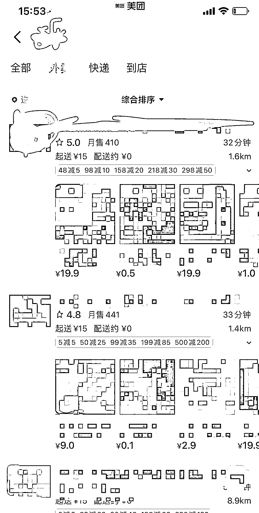

#  

可以看到距离自己最近大概有多少家店销量如何！

然后数一下大概多少家店，像距离我最近大概有20家店，不超过30分钟我能配送过去的范围。

只要不同区域不超过50家即可。

由于限制问题所有都打码了！

好了大概看完了以后，说明这个区域可以做，这时候我们需要准备。

营业执照开店，一个人可以开5个个体营业执照。本地开不收费。我们找身边朋友一个人开5个一共开100家店铺。

所有的营业执照开在同区域不同范围。例：不能超过自己所在地区配送时间的地区范围，即可。

开100家店铺：同城有30家，你自己开100家店铺，大部分的客户选择都会在你这里。

#  

注册营业执照位置，选择商场，等一些集中流量的位置。

然后在美团申请店铺，进行开店。

线下准备，找到货源，存一部分货。上架到店铺。

每天晚上6点开始进行营业。到12点左右就可以关店了。

店铺选择配送的时候选择自配送。  适合自己家人或者朋友一起做。

大家有兴趣的可以用过上面的方法  延申到其他领域。

以前  我们通过这种方法做过，蛋糕配送  。

有兴趣的小伙伴可以研究下！  低投入成本高利润回报！

评论区：

safe : 不太会吹牛逼，只能告诉大家怎么玩[呲牙][呲牙][呲牙]有执行力的可干  zb : 请教大佬，这种店上美团外卖需要实体店铺吧，门面图片ps上传吗？

safe : 不用，虚拟地址，就可以

# 【小众渠道】**1**篇

#  

劝退说明：

1.如果你期望百万级爆发式增长，请停止阅读，下面的内容不适合你

2.如果你的搜索流量比较小众，请停止阅读，下面的内容可能不适合你

3.如果你其他渠道的增长已经不错了，请停止阅读，下面的内容对你来说可能帮助不大

# **# ****(19**赞**)**被忽略的公转私阵地，搞透它，无论实

# 体还是线上同样稳定地获客

作者：  封伟-自动化变现

日期：2022-11-01

因为接下来我要分享的是详细的，可复制持续稳定的支付宝被动获客攻略，针对线上线下的业态都适合：支付宝生态被动引流攻略。

注：

不同行业支付宝能做的推广程度不一样，下面我展示的效果，仅为特定咨询领域故数据仅供参考，重要的是方法和关键步骤。

如涉及一些表格排版和超链接，或者图片抽风，点击查看

https://p9rxk6ovll.feishu.cn/docx/Tu7uda7qWoKCj1xvMlmcbtfBnqh 

# **# ****1.**支付宝被动引流经历

因为项目需要增加额外流量入口，尝试了支付宝的引流

**1.  7**月份开通支付宝生活号和小程序，放着没管，有一定效果；

**2.  1**个月前开始系统研究支付宝流量优化，做了一些基于品牌，搜索，优惠券，生活号等系统优化，平时没做其他运营（除了生活号每周发一篇文章），一个月

新增用户**4550**，下单**394**笔，订单虽然不多，但比起公众号，这个数据算是又佛系又稳定了

**3. ** 搜索流量占比极高，搜索占比**82.5%**，导致转化率远超微信抖音，很容易做出**SEO**的效果（具体优化步骤我将在**4.1-**搜索推荐分享）

以下为各阶段数据

#  

为了方便展开具体细节，先系统说2点，好在优化前有一定的系统性认知

# **# ****2.**支付宝流量类目

#  

服务类目，1000多项数字化服务，涵盖出行政务民生及生活服务，特别是生活服务无论是平台类玩家还是线下实体都有机会获得流量

结合官方数据，其中占比比较高类目的有零售、餐饮、城市服务、交通出行、共享租赁、医疗健康等

流量来源包含线下扫码（同比去年增长100%）和线上搜索（同比去年增长87%）。

看下面几个占比比较低的类目，数据表现也挺不错（所以我在最开始强调，我运营的数据有对应行业限制仅供参考，主要是方法和关键步骤）

回收  洗空调  白酒批发

#  

# **# ****3.**支付宝流量布局

分为内部流量及外部流量

内部为支付宝商家平台及支付宝开放平台后台可以操作及运营的功能

外部为阿里的其他生态产品，可以打通的流量渠道，比如常见的uc、夸克、高德，打通后，将获得成倍的流量，具体需依赖于技术开发实现。

#  

# **# ****4.**支付宝被动流量优化攻略

# **4.1**内部流量

不懂平台的公域谈私域运营都是扯淡，同理，做支付宝要先明白公域流量的入口。

和微信不同，支付宝的流量更多是入口布局+小程序承载，小程序不懂技术的可以找服务商，懂技术的可以直接开干。我研究跨平台的打法，也是以小程序为承载，比如多平台内容同步，跨平台公转私。

#  

公域引流，私域沉淀转化激活复购裂变，这是主要的打法图示

# 公域：

包括首页推荐、搜索推荐、消费券推广、支付成功页、生活频道、会员频道、繁星计划投放、商业化投放等

**1.**首页推荐

**H5**

首页推荐，会针对不同的人群进行千人千面首页推荐，若符合准入规范，且素材审核通过后将有机会到首页进行展示。

#  

#  

**2.**搜索推荐

**H5**

#  

#  

人人都能做的**SEO**

1.搜索关键词

有些搜索有类目限制，这里分享下实现搜索曝光最快的方式——搜索关键词

1.进入“运营中心”-“小程序”-对应小程序“搜索”-“搜索关键词”-“添加关键词”一个小程序可最多配置15个关键词

2.查看同类目，热榜词和飙升词，提交

#  

3.审核通过后，有机会被展示

4.重点来了，关键词维护，一定要定期去看数据并维护，也是SEO的关键

数据中心-小程序分析-搜索-用户搜索词-曝光用户数（倒序），查看一段时间内，高频搜索词，把这些词补到上面的搜索关键词里去

定期查看，更新并替换搜索量小的词，直至上线的15个搜索词在一段时间内搜索量都是靠前的

#  

2.品牌直达

运营中心-小程序-搜索-搜索直达，配置基础模块，banner，券推广等内容可以同时展示服务，小程序，生活号，优惠券

#  

3.小程序直达

位置在搜索关键词旁边，服务推广，每个服务可以创建3个服务关键词，增加命中机会 

 

#  

创建服务，按照要求填写即可，一般隔天出结果，审核通过率比微信搜一搜高多了，而且支持多平台服务创建（高德、uc、夸克等，这块在外部流量部分分享）

**3.**消费券推广

**H5**

通过营销权益，帮助商家获客转化。

配置：运营中心-公域推广-优惠券推广、会员卡推广

#  

展示路径支持：支付成功页**(**支付有福利**)**、消费券频道**feeds**推荐、首页超值特惠、搜索推荐

营销形式支持：活动营销（获客-直领券、获客-团购券、复购-券包）、会员营销（拉新-入会礼、安心充-会员留存、付费会员卡-会员特权）

推广模式支持：附近发券（门店周围3-5km），全城发券（指定城市）

#  

**4.**支付成功页

**H5**

支付成功页可领取优惠券，可显示本店优惠券，也能在其他商家支付页面显示自己的优惠券，复购与拉新并存

 

#  

**5.**生活频道

**H5**

基于生活号的内容（视频笔记直播图文）展示及挂载（服务、小程序、POI），和抖音很相似，这块没有深耕，感兴趣的可以研究

**6.**会员频道

**H5**

结合上面的推荐、搜索各种玩法，结合线下，实现会员生命周期运营

会员卡和微信的也比较类似，不同的是可以很好的实现付费和储值，减少开发

#  

常见的一些打法：

会员拉新：公域投放，搜索展示，接入lot支付、支付推荐等方式，实现公域拉新会员留存：配置会员权益，入会有礼（支付券、商家券），充值即会员，付费即会员等会员促活：在首页及消息里推送类似微信模板消息，推送支付消息、会员消息、优惠券等消息，实现促活；会员卡跳转小程序等

**7.**繁星计划投放

**H5**

商家公域投放激励政策，商家消耗激励点数在投放位进行推广，包括不限于首页、消费券、搜搜页、搜索结果页、支付成功页等，详见搜索推荐相应内容

报名地址https://b.alipay.com/page/policyCenter/policyContent?policyCode=20211229294532574&policyType=FLOW_POLICY&policyVersion=0 

**8.**商业化投放

**H5**

类似微信广点通，可按照cpc、cpa和cpm计费

后台：https://adpub.alipay.com/

#  

# 私域：

包括收藏引导、生活号、订阅消息、群用户、小程序、商家会员、门店、线下物料、LOT、多平台（社交、内容、电商、O2O）等

重点说下生活号

**H5**

1.可设置默认显示品牌信息，包含服务、优惠券、小程序、商品，用户进来实现第一时间流量转化，有点像抖音蓝V；可设置首页推荐官方小程序

设置：运营中心-生活号+-主页设置

#  

2.直播

目前无人直播限制不多，做无人直播的可以尝试同步这个平台

3.主页装修

支持优惠券，咨询，小程序的灵活跳转，对小程序转化极为友好，可以结合生活号的运营，拉升小程序服务和优惠券的数据表现，提升推荐和搜索展现

支持图片菜单、广告banner、营销组件、商品组件、pk投票、服务组件、生活圈、自定义菜单、外链等配置形式

#  

#  

4.外链直发

和公众号不同，无需第三方开发对接，即可实现群发直接跳转小程序、卡券，可通过关注、菜单、关键词回复触达目标落地页，并支持群发

配置：生活号+-素材管理-新建图文消息-跳转到网页

#  

5.几个运营工具

抽奖活动、关注有礼（相当于公众号的关注送优惠券，也是无需第三方对接的，直接后台创建）、关注组件（小程序、H5一键关注生活号）、生活号服务、卡券

灵活运用好，对私域运营帮助不小

# **4.2**外部流量

还记得前面说的流量布局吗，打通了很多支付宝生态的渠道

#  

以小程序为例

1.登陆支付宝开放平台https://open.alipay.com/，小程序可在多个平台进行发布展示，实现一鱼多吃

2.创建小程序服务时，可以在多个平台提交服务（不能重复），通过其他产品的搜索流量，躺获用户

#  

3.平台生态深度对接，以高德为例，有相应的接口，把小程序数据直接通过POi展示。

比如你做了个家政服务的平台型小程序，通过高德对接，可以在高德地图每个入驻的家政公司，展示商家小程序商品，坐庄抽水不干活

个体/商家，我之前在实体店如何有效互联网化中分享过，开通口碑之类的就行了，自动同步高德，地图转化为lbs订单

如涉及一些表格排版和超链接，或者图片抽风，点击查看

https://p9rxk6ovll.feishu.cn/docx/Tu7uda7qWoKCj1xvMlmcbtfBnqh评论区：

#  

糯米糕 : 支付宝小程序和生活号被动引流的数据真的很不错，妥妥的就是钱，实体店太需要了[强]

封伟-自动化变现 : 感谢支持，营销的玩法确实多，可能深度运营的不多吧，竞争不算太大

潮州痞子蔡 : 请教下这个下单是在小程序直接下吗？你做的是什么方向的类目？

封伟-自动化变现 : 小程序下单，商业咨询类目

# 【导流技巧】**1**篇

# **# ****(24**赞**)**教大家几招快速从抖音上导微信进私域

作者：  同城百晓生

日期：2023-01-20

同城流量小妙招——怎么快速从抖音上去导流进私域

今天教大家几招快速从抖音上导微信进私域，基本上按照这个流程操作绝对不会封号  1.通过粉丝群加微信进私域，在粉丝群用助理号发自己的微信进去

（1)每天发两个日常视频，然后引导粉丝如果想找自己的，进粉丝群链接，或者说想学习我自己这边有一个什么资料可以通过进粉丝群链接

（2）在自己发布每一个短视频结尾处引导，直接说想链接我的进粉丝群链接，这种情况操作可能会导致整个视频会限流，建议新手选择第一种

（3）在评论区直接发粉丝群链接，置顶评论

（4）直接通过发送链接通过小程序添加好友，如果你每天加人至少几十个，可以找我，我这边可以提供这个技术，人少不建议使用

（5）人少的话，直接发自己的微信也没事

除此之外，在直播中也同样可以去导流

（1）挂同城小房子一样可以挂

（2）去通过小风车然后导入表单加微信

（3）引导用户去添加粉丝群导流

#  

评论区：

许义 : 请教下，发链接不会被限制吗。

同城百晓生 : 不会

cm : 怎么联系

# 【引流细节】**1**篇

# **# ****(**精华帖**)(160**赞**)**实体店如何有效互联网化，

# **90% **的老板容易忽略的细节

作者：  封伟-自动化变现

日期：2022-10-20

不说废话，直接展示

# 信息化建设

这块有很多细节容易被忽略，分别从最初的注册到物料筹备

#  

# **# ****1.**工商注册：

这个虽然不涉及互联网工具使用，但为了SEO，最好加上行业关键词，无论你认证抖音还是公众号小程序还是上美团，对SEO都有帮助

举例：公众号排名

红包公众号，用公司名称认证红包这个敏感词，获得大量免费流量

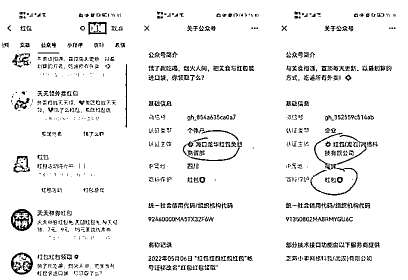

#  

# **# ****2.**商标授权：

如果你是加盟商或者特许经营，拿到品牌授权书去认证账号，借助官方的影响力或者搜索流量

举例：某品牌抖音排名，一个体户，全国排名第三

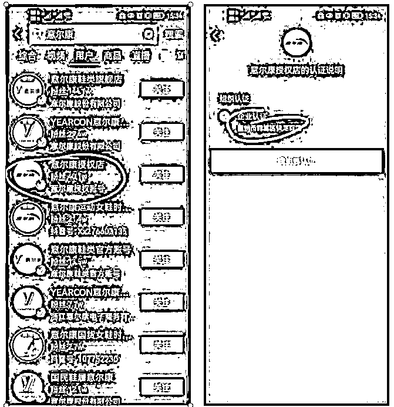

#  

# **# ****3.**地图：

常见平台：百度地图（百度地图app标注）、腾讯地图（腾讯位置服务公众号）、高德地图（高德app标注），一般申请这3个够用了

全网平台：包括高德地图+百度地图 + 腾讯地图+ 微信位置 + 苹果地图 + 朋友圈位置 + 企业微信位置 + QQ地图+ QQ空间 +TM + 滴滴出行+ 咸鱼+西瓜app+携程旅游+高铁管家+花小猪打车 + 货拉拉 + 陌陌 + 哈喽出行 + 饿了么+快手+微博+小红书+大众点评+曹操专车+快狗打车+哈罗顺风车+58同城+T3出行+凯立德+阿里巴巴，【抖音位置(有行业限制，部分行业不收录)】

#  

提前准备资料到对应平台，提交申请即可

①门头照片左中右3个角度各1张

②标注名称【名称和门头名称尽量一致】

③详细文字地址【XX省(市)XX区(县)XX街XX号)】

④营业电话/联系手机

⑤具体位置

自己动手只要资料准确，工作日当天就能下来。

#  

# **# ****4.**电话：

# 来电标记：呼叫时在对方手机显示来电信息，如企业门店业

# 务等

标记平台：

腾讯手机管家号码公众平台https://yun.m.qq.com/，

360来电通http://dian.360.cn/，

百度号码认证（付费）https://haoma.baidu.com/home

#  

举个反面例子，装修的时候接到过家具厂家售后电话，来电显示的却是月饼配送，直接挂掉。如果这个电话用来做电销，即使呼叫的是精准名单，得丢失多少客户。

# 彩铃**/400**电话：

自定义等待提示音，特别是客服电话可根据时间点及不同渠道采用不同话术，比如下班后铃声切换为提示加微信/关注公众号等

挂机短信：挂机后自动发送短信，可以咨询相关服务商。抖音有免费的挂机提示，开了蓝v的可以用这个功能。

# 微信通话**/**视频铃声：通话等待期间自动播放，设置的广告

# 铃声，适合企业宣传，**ip**植入

设置方法：视频号上传指定铃声视频，微信我的-新消息通知-提示音与铃声-来电铃声-更换-搜索指定视频号视频

#  

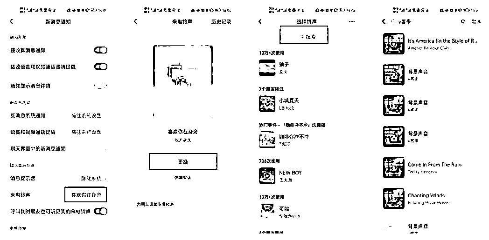

针对各实体行业，我们专门做了一个广告铃声生成的小程序，有各个行业广告文案，稍微修改就能用，生成视频直接上传视频号，方便快捷

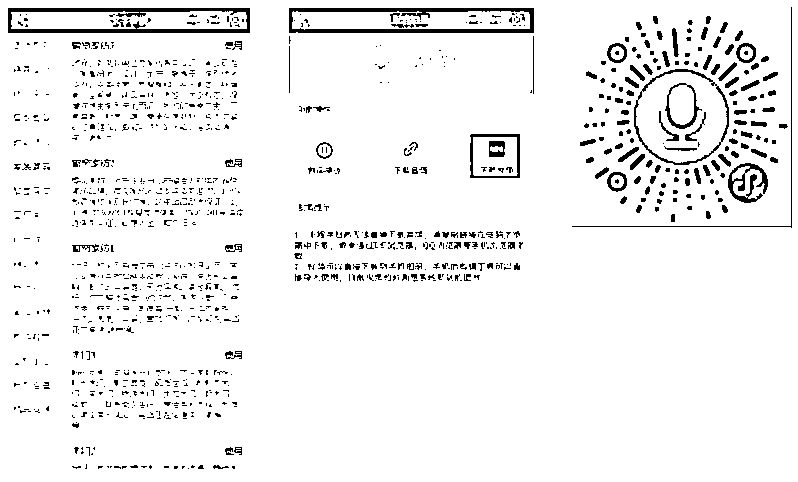

#  

# **# ****5.**物料：

包装、物料、车贴冰箱贴、广告牌、灯箱、DM单、票据、展架、大屏

常见的解决方案：

动销抽奖、产品溯源、扫码抽奖、签到抽奖、大屏幕抽奖/签到墙

如果你有自己的产品或能影响包装，可以采用动销抽奖、产品溯源、扫码抽奖沉淀客户如果没有自己的产品，单据这些物料也可以转化，让用户线上下单线上服务。

举个例子：

某品牌螺蛳粉

包装附卡片，扫码积分兑换。不足的是积分要求太高，达不到营销目的。这方面可以学学蒙牛

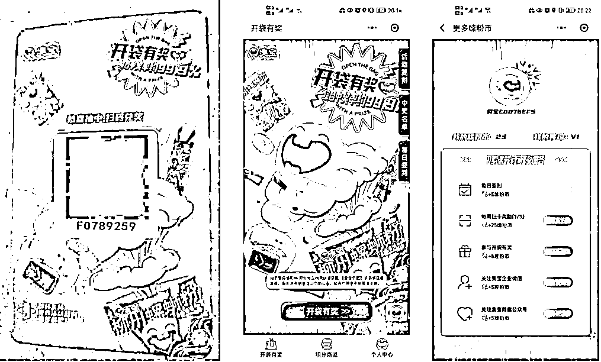

#  

注意：包装二维码最好用活码，可在后台改落地链接，避免出问题物料报废

我们自己做产品，也借用了类似玩法，和战略合作厂家包装二维码互推，形成套餐组合打市场。

说到物料，提一下免费的海报设计工具，微信“收款小账本”小程序点击海报中心，简单实用，吊打那些动不动就要付费的“妖艳贱货”，要是嫌模板少上美图秀秀

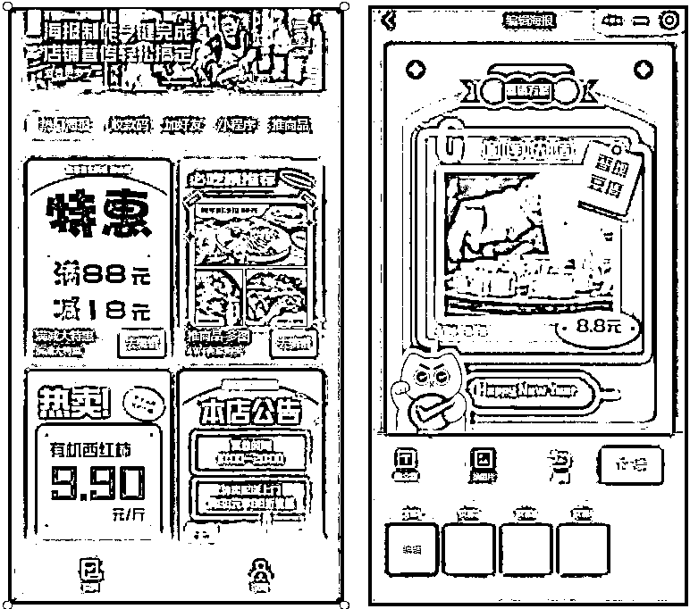

#  

# 公转私：

# **# ****1.**同城社群：

最多的就是企微群、qq群、豆瓣群组了，找到进去引流

QQ群之前有分享，重点说下开放式的同城微信群，可以直接找到并100%进群常见的有：银行（如招商银行）、出行平台（如高德、滴滴）、连锁门店（如瑞幸、唯品会）、本地生活（如罗森、哈罗）、商超（如沃尔玛、永辉）商场公众号、社区团购（如美团）、快递驿站、餐厅点餐码（有些会设置关注进群）、业主群等

找到符合你用户画像的社群

如何一个码加多个群：企微群大部分用的是活码，你用多个号多次扫码会扫出不同的当地群出来，这样获得的群数量远远大于二维码数量

举例：滴滴同城群

#  

举例：瑞幸同城群

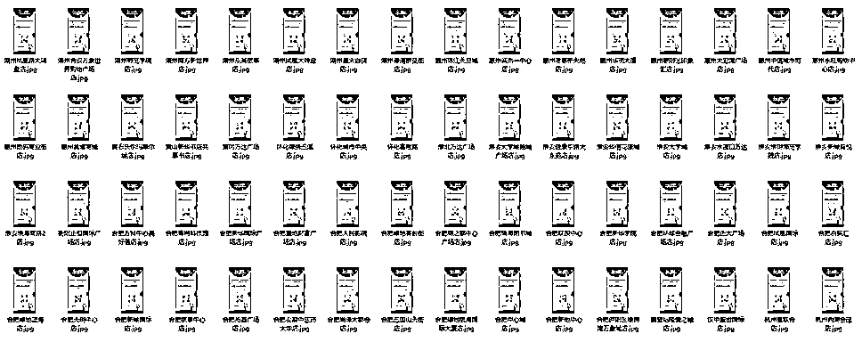

举例：永辉同城群

# **# ****2.**同城活动平台：

#  

豆瓣、QQ、本地论坛（特别三四线城市，虽然用户时间碎片化了，但当地论坛及社群的人气还是不错的）、本地生活团购平台（一般都是本地站长结合本地平台衍生出来，上线成本比美团低很多）、物业社区、垂直平台同城站点（如妈妈网重庆站）

特别提一下：

豆瓣同城活动，创建活动后可以更新活动时间刷访问量，很容易排到前面

本地生活团购平台，比如之前帮做理疗店线上引流，直接跟当地的企鹅生活汇对接，免费上线爆款活动（平台免费入驻抽点），辅助其他优化当月业绩直接翻10倍，老板从忧心忡忡到见我笑嘻嘻。

说到这了，顺便提一下免费团购平台

除了美团和抖音，说一个免费的，支付宝口碑，好处在于开通后会同步到高德地图，可以在高德上直接付费

这个月接了个电话，是之前服务过的康复理疗的门店在高德上接了单，用户主动找上门核销，又惊喜又疑惑地问我怎么做的推广

类似的还有飞猪同程等也会同步到高德，做酒店住宿的不要放过，其他的业态也可以去高德上搜搜

#  

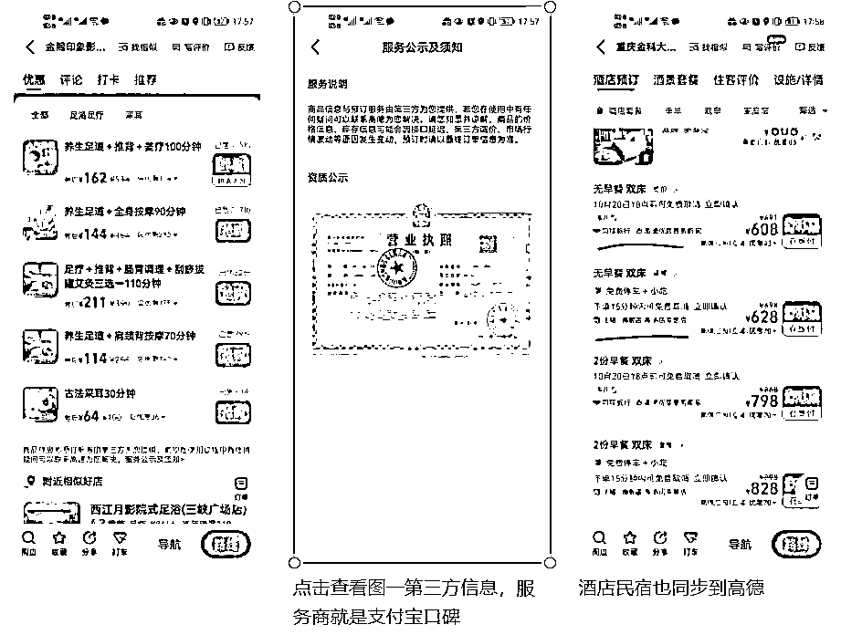

# **# ****3.**自媒体

不能转私域的自媒体不是好平台。

投放就不说了，这个有预算再测试，结合门店活动投放，一般投放本地公众号、本地团购平台

重点说2点

#  

# 自媒体如何导流线下

支付宝生活号/小程序：打通口碑，及收银，全平台公域发券，目前只有支付宝平台能免费做到，做品牌连锁的建议重视

附近的小程序：支付宝、微信

百家号、抖音、快手、小红书：门店、团购、电话一键直达

百家号这个很多人不知道，地域名+关键期认证后直接快速上首页，SEO效果不错，找我们认证有优惠

举例：支付宝优惠券玩法很多，做高频复购的老板不要忽略，首页发券，品牌区发券，支付发券，生活号发券，小程序发券.....

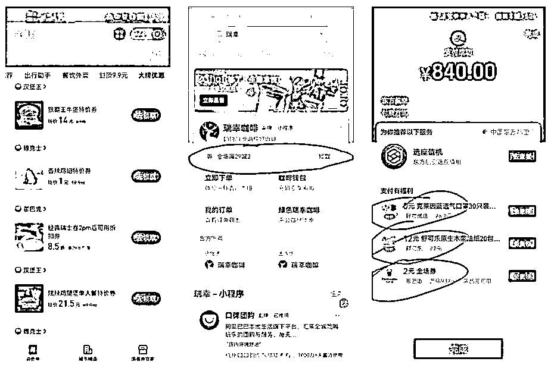

#  

举例：百家号认证，百度移动+PC首页显示。不过这个优化在我看来并不完整，菜单，品宣区，自动回复等能跳转私域的都没设置，也算是个反面教材

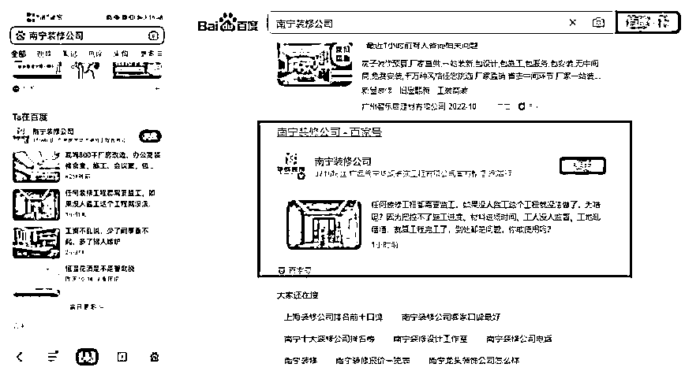

# 自媒体如何一键丝滑转私域

关于自媒体引流的很多文章都有分享，简介引流的方法很多，既然我们是做自动化转化的，当然要分享一些丝滑的转化方式，一键跳转个微、企微、公众号、文章、H5、微信群、视频号、微信客服等

抖音：菜单、抖音群、私信、抖店、团购、门店、电话、APP

头条号：菜单、电话、私信、自动回复、关键词回复

百家号：电话、门店、菜单、私信、自动回复、关键词回复

快手：私信、电话、小程序、APP

微信：视频号、小程序、公众号、搜一搜服务

支付宝：口碑、生活号、优惠券、小程序

#  

小红书：门店、电话

微博：私信，文章，关键词回复

比如电话，参考上面的挂机短信和铃声

比如抖音、头条、百家号、快手、视频号、支付宝的自动回复，可以直接跳转加微信比如抖音我们做了多种工具，比如卡片方式转化率高，比如私信自动回复实现自动化演示视频看文档吧

https://p9rxk6ovll.feishu.cn/docx/B7QvdusuHo9IyoxDal2c6n7Gnkb#BUoWdIqCso8wuixuWSGc4bTUnJb

比如微信搜一搜服务，本地服务上线直接转化，比如本地装修，本地搬家，本地培训等，具体攻略见我之前发的《躺获20多万用户后，细谈微信搜一搜服务通关攻略》，类似的还有支付宝、百度

举例：

没有人会想到，一个上门维修的服务能在支付宝有9万+点击。

#  

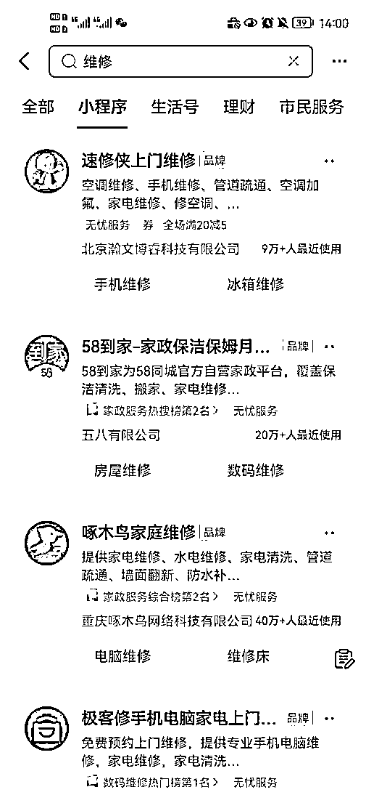

我们在支付宝通过2周的优化，支付宝流量也实现了从0到1万的免费周曝光，后续专题分享

#  

# 活动运营：

# **# **活动运营

常见的方式有红包拓客、阶梯拼团、报名拓客、联盟商家等

以红包拓客为例，发动员工及合作商家销售活动卡产生1级裂变，分销金额自动微信钱包；顾客老带新产生2级裂变，分销金额自动微信钱包

我们服务的餐饮、美业、休闲娱乐多个行业用这类方案每天轻松获客30-80+，很多是三四线城市的小店

#  

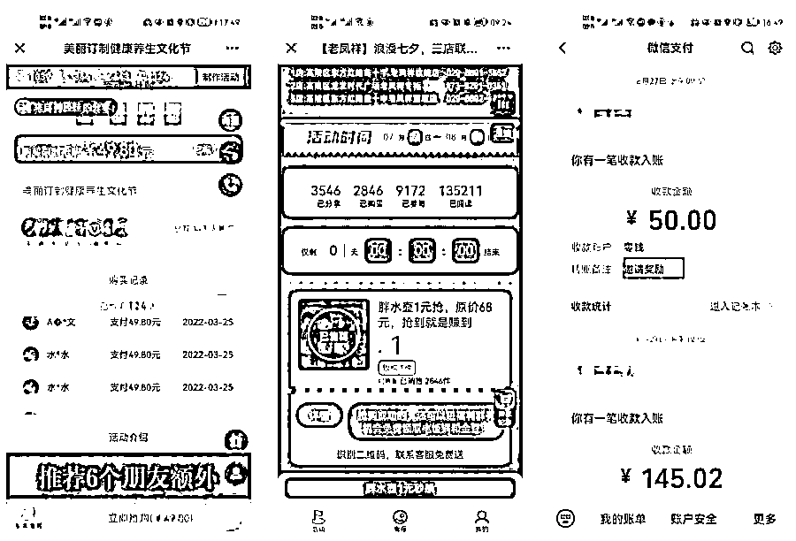

# **# **场景构建

# 进店**/**询价

个微：加好友享会员价

这个是微信"收款小账本"小程序的一个功能，开启朋友会员，设置对应福利即可 

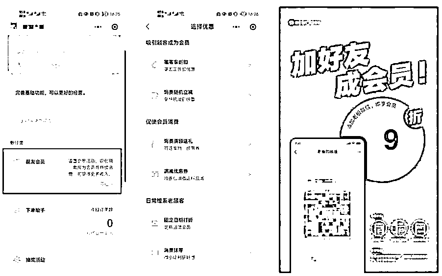

企微：自动回复，领福利、拉群

# 在线下单

支付宝免费的用口碑就够了

微信免费的用官方"收款小账本"小程序，收款直接到零钱，傻瓜式开通操作

#  

建议前期先用免费的工具收单，模式跑通了再考虑开发小程序，虽然这类小程序开发费用也不贵，不过我认为如果是小店前期没必要。

后面如果要花钱了，结合运营需求提供能，是为了引流，锁客，裂变还是全员营销还是做复购还是老带新...

# 付款场景

付款后加微信、加群

付款后显示视频号/视频号直播预告/小程序

#  

付款后显示广告/跳转营销页

付款后自动推优惠券/赠品，用不完的券拿不完的奖

我们是支付服务商，需要开通可以联系，以微信为例：

支付后推荐小程序

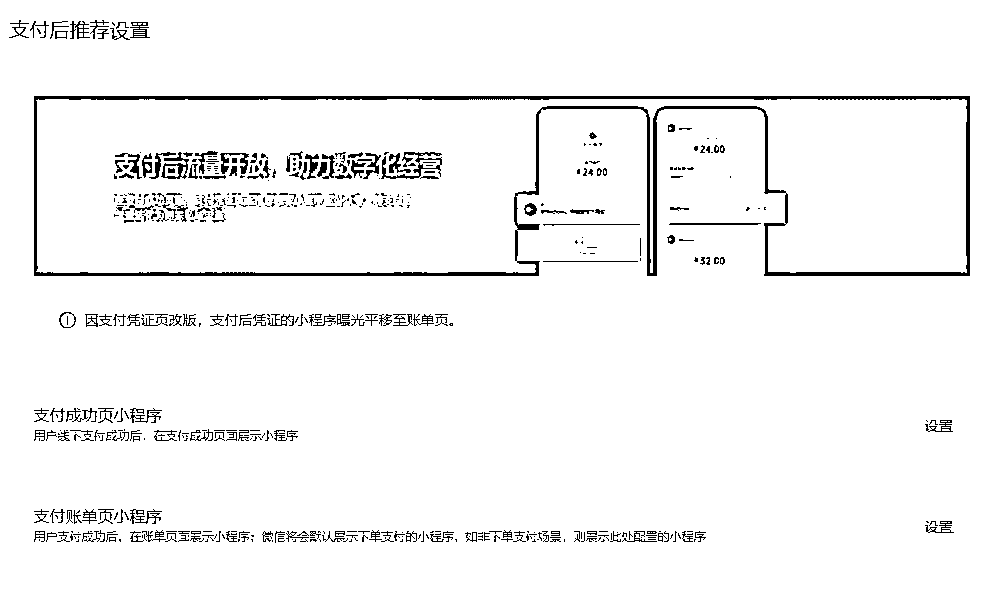

支付后显示视频号、视频、直播

#  

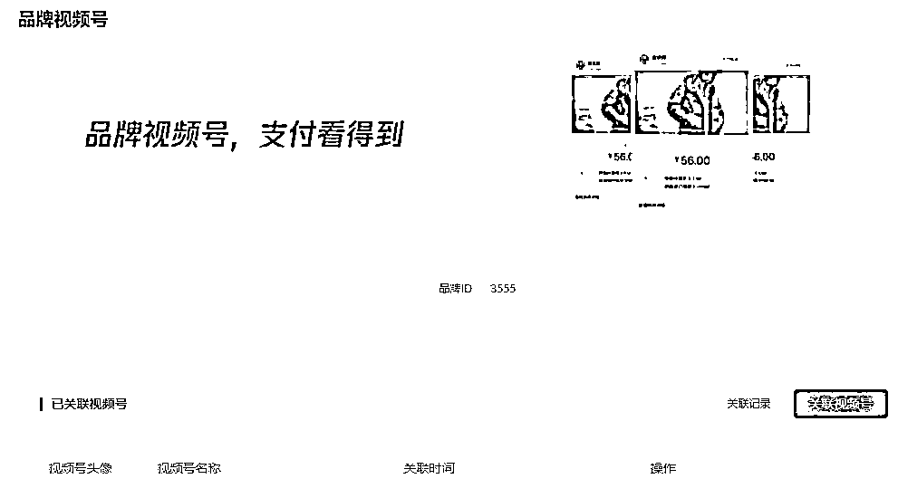 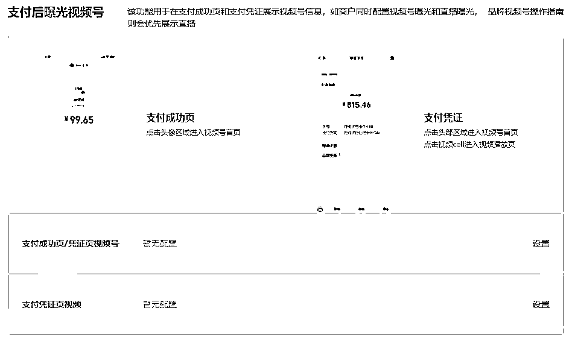

# 扫码点餐

#  

扫码自动识别是否加私域，没有加了自动回复点餐链接

适合餐饮等

案例：新客扫码点餐流程，转化企微，自动回复点餐码

# 连**wifi**

扫码小程序/公众号等自动连wif，用这个入口去做服务和沉淀

适合酒店宾馆民宿农家乐医院商场等

#  

# 领福利**/**抽奖

发朋友圈这里就不说了

主要分享2个

扫码自动发视频号抽奖/领福利（带位置+关键词，结合SEO）

扫码自动发抖音抽奖/领福利（带团购+位置+关键词，结合SEO）

在这个基础上可以延伸集赞等活动，借助公域流量裂变

比如抖音活动，通过爆款活动直接做到当地品类前3，听着不新鲜，关键在于细节和执行 

案例：

蛋糕店3天销量1001，1场活动引流线上5000人到店

脆皮鸡饭1周小吃快餐榜第1，成为当地知名网红店

# 公域锁客

#  

借助多端小程序，渗透抖音、快手、微信、百度、支付宝等多个公域渠道，通过内容及活动领取会员转化到店

案例：

之前帮火锅连锁做的全网获客方案，不知道怎么获客裂变，综合了一部分玩法，做成了工具

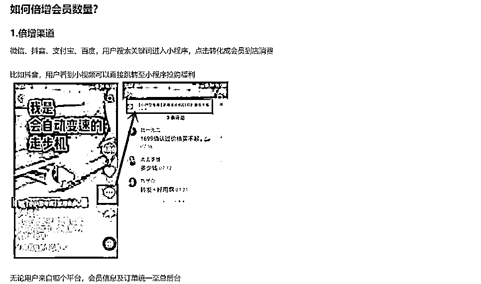

#  

#  

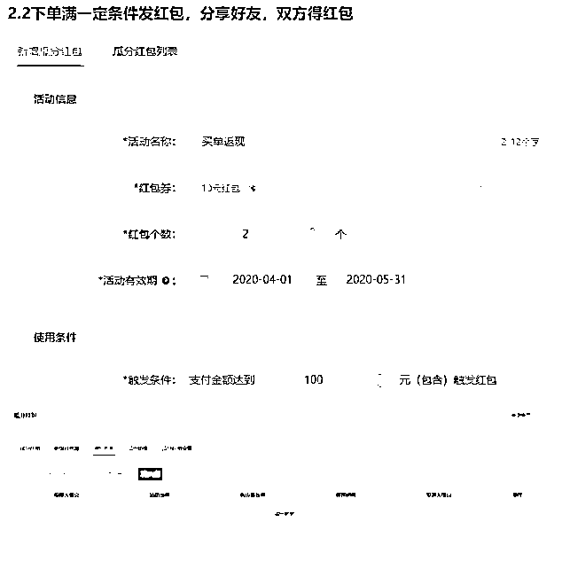

#  

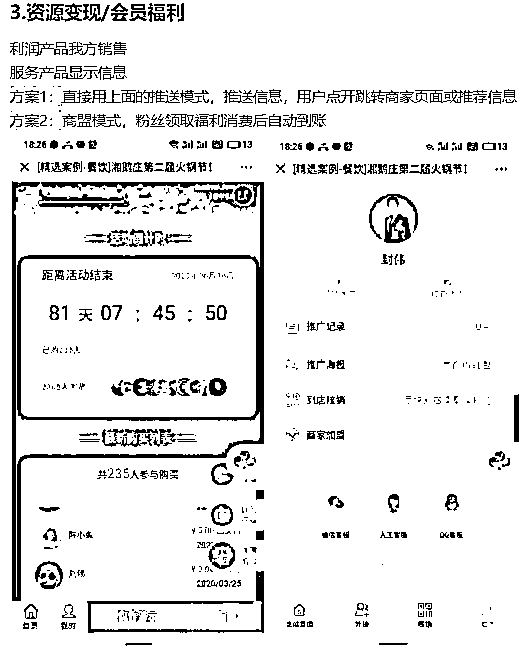

#  

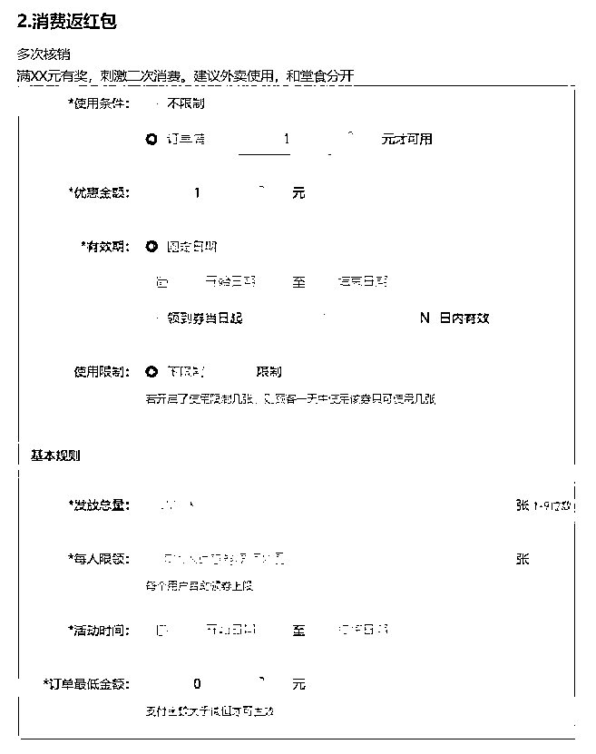

#  

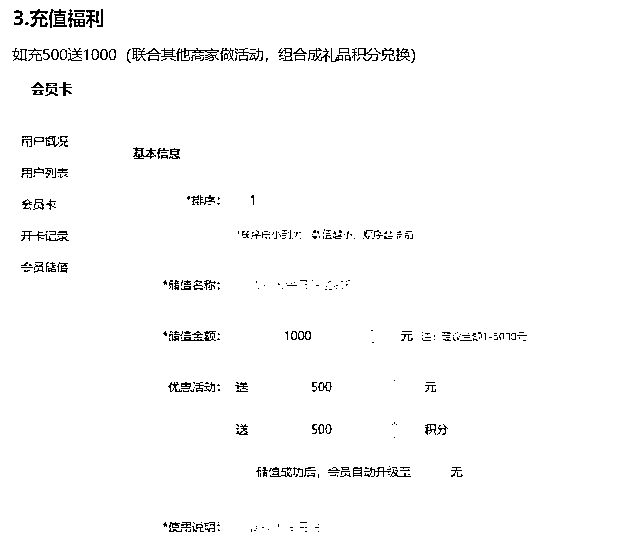

#  

# **2B**营销

#  

# 数据库营销

一般2B的数据库来源：平台商家、地图、企业数据库、垂直网站等

平台商家：

如美团点评，抖音，口碑等，数据比较新，推荐美团，抖音，点评和口碑很多关店了数据没更新

不足：获取到的是客服联系方式，非负责人

地图：

如百度，高德，搜狗等

不足：关店了，数据没更新，建议作为补充数据库

企业数据库：

如天眼查，企查查，启信宝，爱企查等，可以直接找到法人，推荐选个体，直接负责人；

不足：看不到销量，不知道精准类目

垂直网站：如携程，同程，慧聪，阿里巴巴等，不足需要专门的采集软件，或者针对性的采集脚本

个人用的企业数据库+美团的较多

举例：

比如亦仁说的政务申报项目

https://wx.zsxq.com/dweb2/index/topic_detail/585118482242144围绕业务一般这几步就够了

#  

选平台：系统对比过天眼查，企查查，启信宝，爱企查等，数据量和性价比最高的还是爱企查，60元/月，一天可导20万联系方式

https://aiqicha.baidu.com/m/usercenter/memberspread?cq=xlTM-TogKuTw2dXN7vO2-dFYEu5HwYinjQmd&VNK=65c2add9

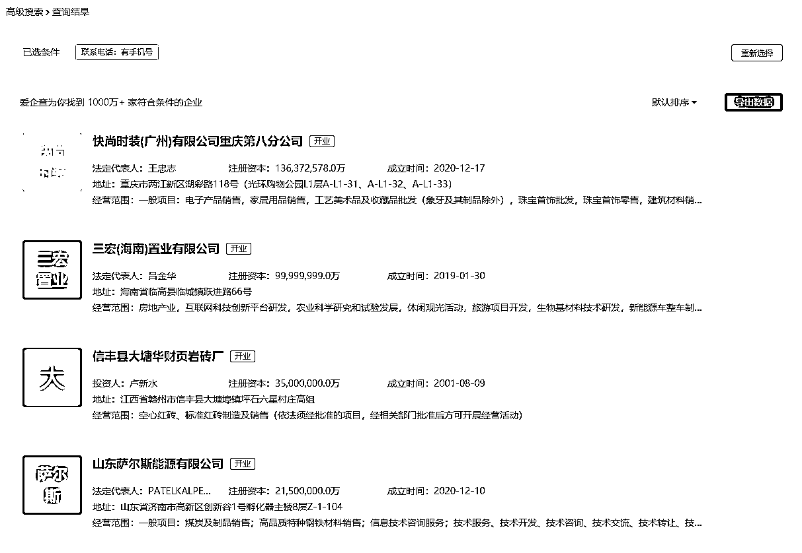

导数据：

1.设置搜索条件：如杭州市，开业状态，非个体企业类型，有手机号，高新企业选择否，导出385122家数据

数据筛选过滤：

1.利用软件批量过滤没开通微信的

2.没无效手机号的

#  

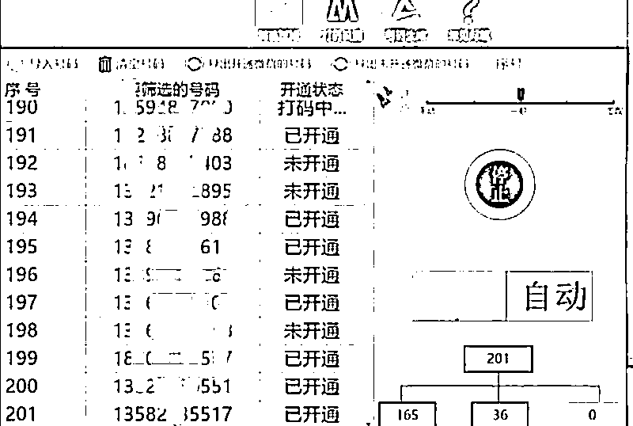

信息触达：

1.短信群发，通过模板短信群发，用户名称为企业名（1天搞定）

2.企业微信批量导入通讯录或上下游，自动邀请成为好友（1天搞定）

3.精准名单电话营销，加负责人（周期性突击）

业务发散：

1.针对可筛选的内容（有无高新证书只是其中的一项），作项目细分

2.针对已有业务的相关延伸

3.针对数据库匹配对应服务

# 抖音数据库营销

#  

抖音大家运营得比较多，这块就单独一块分享

抖音数据抓取一般包括几种方式：抖音简介、关键词截流、直播截流、抖音小店（热销商品、小店）抖音门店（分区域，类目）

# 抖音账号信息抓取：

一般通过抖音数据平台抓取抖音简介，抖音号，整理成文档。测试过目前市面上所有的数据平台，数据量最大的居然不是蝉妈妈。

这个方式的缺陷是，如果对方没留信息，你是获取不到的。

# 关键词截流：

1年前的工具，目前仍然有效，能持续动态监测找到目标用户。

比较精准的2种方式，竞品账号关键词截流和爆款视频截流，获取用户抖音号去私信 

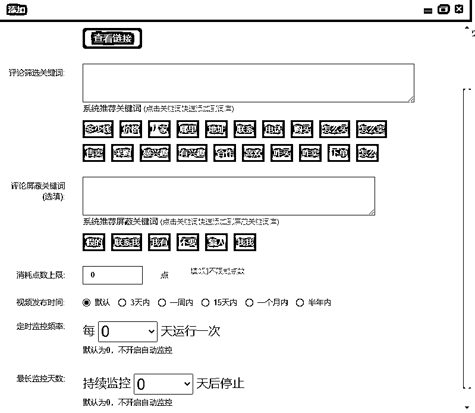 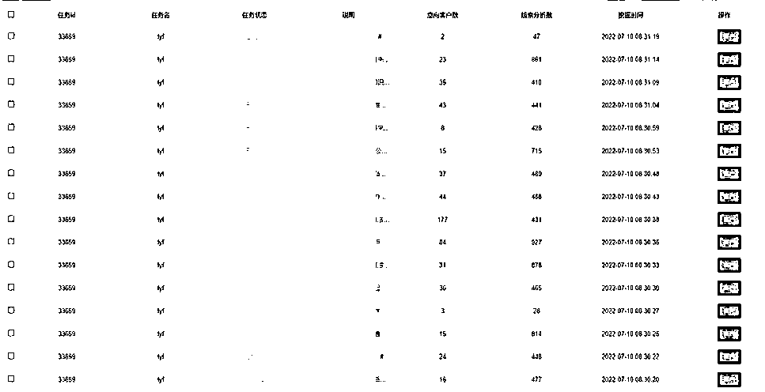

#  

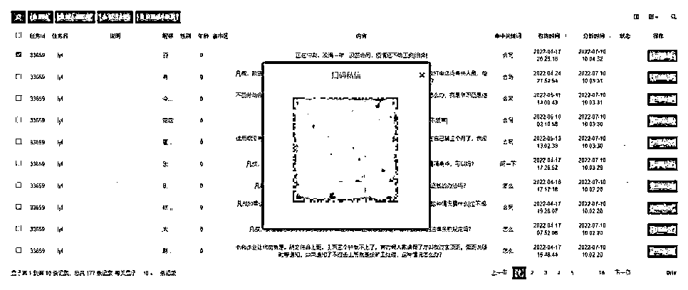

# 直播截流：

和关键词截流类似，针对直播间进行监测

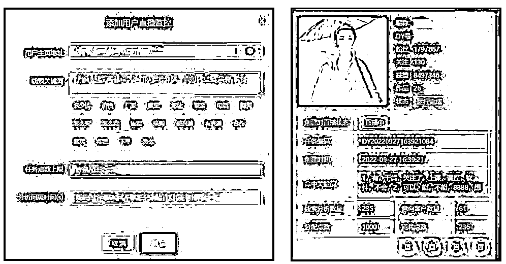

#  

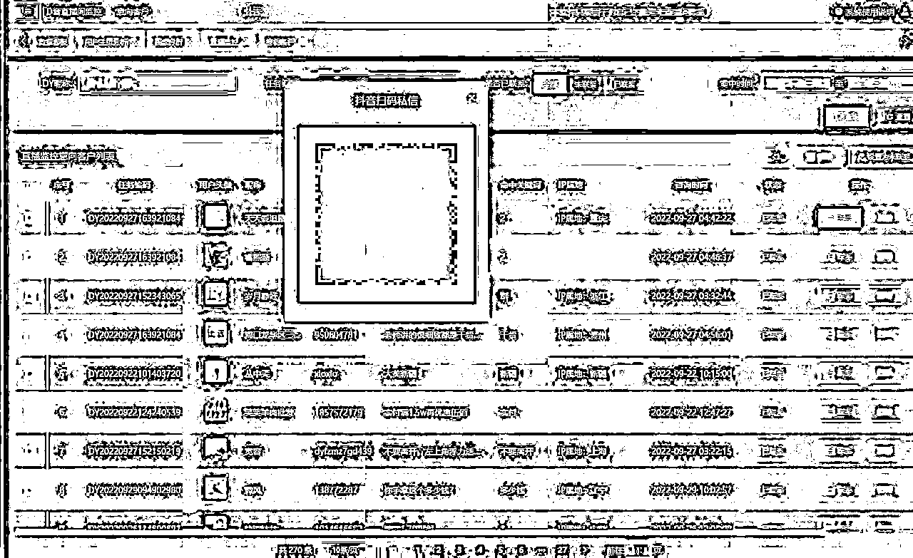

以上两种方案关键在于私信的触达，常见解决方案有3种

1.多个号手动扫码  免费

2.脚本定时粘贴-工具

3.app自动私信+主页留痕迹，中断后继续-工具（推荐）

#  

# 抖音小店（热销商品、小店）、抖音门店（分区域，类目）抓取

#  

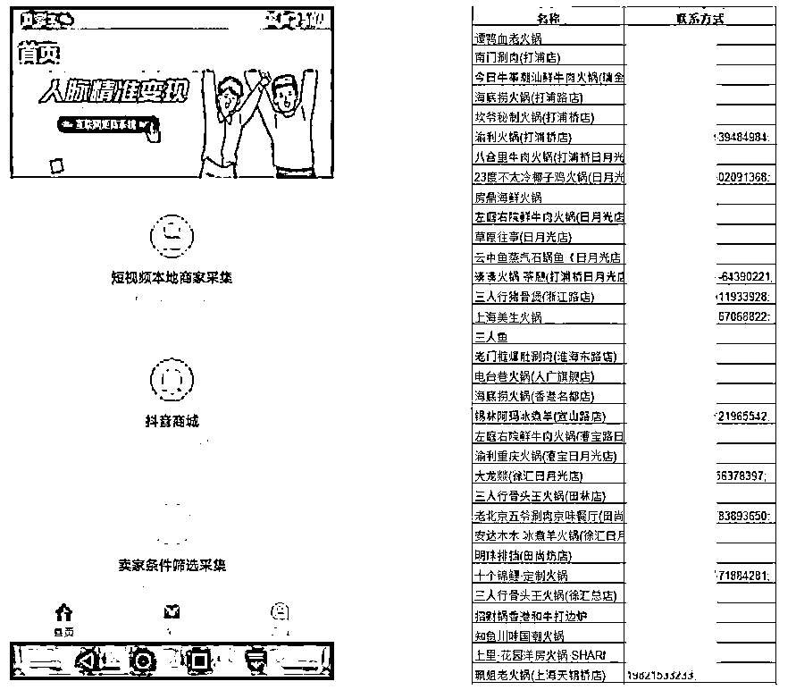

演示效果见视频

https://p9rxk6ovll.feishu.cn/docx/B7QvdusuHo9IyoxDal2c6n7Gnkb#LYOwd6IW2ooM2kxuu0lceKOmnFc

# 报价单营销

报价单变为订单

2B下单系统

#  

主要有3类解决方案

1.普通产品，顾客看到产品报价下单后（类似阿里巴巴，支持阶梯价），消息直接推送给相关人员，进行跟进

2.经销产品，设置经销商权限，不同等级看到的价格不同，经销商登录后可见价格，下单，支持授信及账期管理

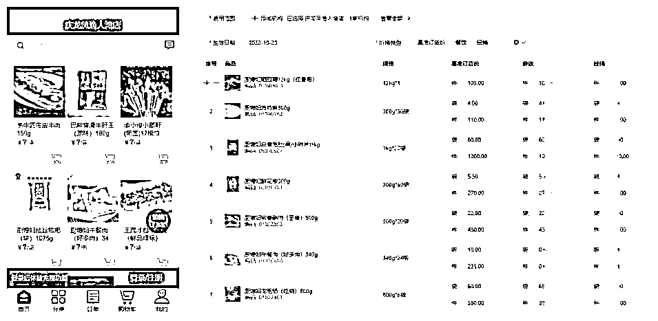

前端，未登录价格不可见  后台，价格等级管理

3.常购清单，不同客户常购产品变为提前设定的常购清单，下次购买直接一个页面快速采购，拉升复购提高下单效率。支持常购清单维护更新

#  

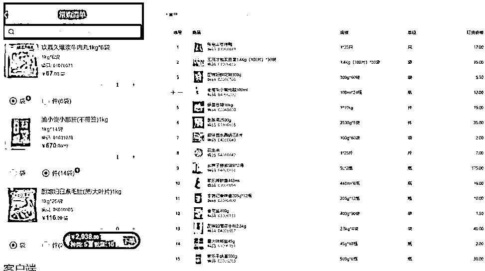

客户端常购清单快速下单  后台采购清单维护

我们用以上方案整合了本地经销商，平台销量突破1.5亿，详见我之前食材供应链的帖子平台营销

借助平台，把平台客户转化为私域

主流平台大家都清楚，说一些垂直细分的

比如2B餐饮食材批发的：大厨网、快驴、美菜等

比如2B/2C社区团购的：联联、本地团购平台等，比如之前帮做理疗店线上引流，直接跟当地的企鹅生活汇对接，免费上线爆款活动（平台免费入驻抽点），当月业绩直接翻倍

#  

比如2C外卖类的：美团、饿了没，不仅仅针对餐饮版块，便利店、小百货、小超市、服装等等都可以送

比如2C银行类：每周优惠活动，买单活动等

祝各位实体老板扛过疫情，一起生财有术。

如果图片又抽风，链接访问

https://p9rxk6ovll.feishu.cn/docx/B7QvdusuHo9IyoxDal2c6n7Gnkb评论区：

Aimmon : 涨知识了

封伟-自动化变现 : [握手]

田十五 : 筛选过滤没开通微信的软件，可以推荐一下吗

跳跳 : 厉害了

七只鱼 : 很全面的门店数字化转型教科书

梁欣 : 很全面了，感谢分享！飞书链接需要权限打不开[可怜]

戴巍 : 太优秀了，咋有这么广的知识面

封伟-自动化变现 : 权限已全部开放[握手]

# 【视频创作】**1**篇

# **# ****(7**赞**)**实体店越来越难做，**2023 **年如何抓住同

# 城流量红利，用抖音引流获客？

#  

作者：  杨思思

日期：2023-03-17

最近在和实体企业老板们聊天时发现，线下门店生意越来越难做。

自己的产品有多好，品质多高，价格多实惠，但是消费者并不买单。

其实这不能怨消费者，因为现在选择实在太多了。

在京东、淘宝、拼多多，随便搜一个关键词就有几百上千页的产品。

出门想吃个火锅，也有老北京涮肉、冰煮羊、老火锅、楠火锅、凑凑火锅、蛐蛐火锅……产能过剩，产品雷同，商家越来越内卷，消费者也被整的眼花缭乱。

现在开实体店，如果还像过去那样坐在店里等着顾客上门消费，就像在用旧石器时代的打法PK飞机大炮。

对于实体商家来说，拥抱线上，布局短视频和直播，已经不是yes或no的问题了，而是生存必须。

产品好，不会卖，是很吃亏的。

如何用好线上流量，拓宽获客渠道，是所有实体店老板必须要掌握的一项硬技能。

#  

今天和大家分享一套实体商家如何用抖音引流获客的方法论，希望可以帮助你用好抖音这个流量放大器，突破获客瓶颈，让你的生意逆势增长。

**1. **闭环思维做账号：如何做一个能赚钱的抖音账号？

普通人做短视频账号的最大误区，就是一开始没想好怎么变现，吭哧吭哧拍了几条视频，没播放没点赞没涨粉，就觉得此路不通，匆忙开始，草率结束。

这种做法又浪费时间，又消磨信心。

企业老板、实体店主，做抖音一开始就要有闭环思维，要打造一个从第一天开始就能变现的账号。

#  

企业和个人做短视频是完全不同的逻辑。

个人做短视频是要打造网红，要先涨粉，有了粉丝才能变现。

而企业不一样。你是企业老板，你本来就有产品。

你的视频只需要满足两点：1.简单，2.粗暴。

简单，就是视频的制作不用太复杂，最好可以批量化生产。

粗暴，就是突出卖点，你做内容的目的，就是围绕用户的痛点，和自己产品的卖点。通过流量形成转化，完成变现。

企业做短视频的逻辑，一定不是追求涨粉，而是直接变现。

#  

做抖音的顺序是先产品，后流量，先形成0-1的小闭环，然后再通过抖音的流量进行放大。

对于实体店老板来说，这反倒更容易，因为你本身就有产品，只需要思考如何排列、组合、包装，让自己的产品以更适合这个平台的方式呈现在消费者面前，从而形成购买转化。

**2. **简单高效拍视频：如何快速拍出能获客的短视频？

前面提到，商家拍短视频只需要思考：

如何让自己的产品以最适合这个平台的方式呈现在消费者面前。

那什么样的产品适合在抖音平台呢？

给你三个关键词：超级实惠，超级好看，超级专业。

**2.1 **超级实惠

比如Tims咖啡39.9元的“Tims什么都有”套餐，1元、9.9元特惠单品，低价引流到店，销售话术升单。

#  

#  

**2.2 **超级好看

好看有两个维度：

一是短视频呈现效果好，不一定非要美，很丑，丑得很别致也可以。这一点建议实体店老板多刷刷探店达人的视频，学习他们拍摄的画面、构图、角度、声音。

#  

二是让消费者拍出来好看，稀奇独特，让人见到就想拍下来发朋友圈。让用户有晒的欲望，激发分享，传播裂变。比如楠火锅、荣记的海鲜海盗船：

#  

**2.3 **超级专业

你需要让消费者感知到你在这个行业里很专业，比如“我在郑州修车20年”，“我卖茶叶15年了”，“顾客开车2个小时到我店里”等等。

短视频无非是“画面+声音+文字”。

你的用户有什么痛点？你的产品有什么卖点？你需要放大用户需求，用你产品的好处来满足这种需求。

#  

卖点有哪些？比如性价比高，服务好，品质高，老板很实在。

在视频结尾需要加上行动引导，发布视频时加上门店位置，引导用户到店消费，形成闭环。

做短视频一定不是自嗨，获取客户、让用户到店消费才是核心目的。

做成交，而不是做内容。

**3. **记录而不是创作：如何打造高转化直播间？

直播其实是个非常消耗人的工作，好的直播间对主播的依赖非常高，好的主播可遇而不可求，相应的成本也会很高。

普通实体店其实并不适合这种高开高举的直播间打法，而是要尽量做到低成本，可复制。有个比较讨巧的做法，就是记录：

1.记录生产过程

2.记录使用过程

比如天津的“小齐四个菜”，直播就是厨师炒菜、聊天，安徽的“小胖卤味”，就是把手机架在柜台上，拍顾客排队买单。

#  

同城直播间并不追求流量有多大，很多实体店老板抱怨开直播没多少人，但是你线下门店每小时能来多少人？这个逻辑其实是相通的。让顾客能在平台上看到你，有停留和互动，感觉你的产品不错、付费下单、然后划走，和线下其实没什么区别，就是多一个销售渠道。

#  

**4. **用付费撬动免费：简单粗暴投产比游戏

形成0-1的闭环之后，可以通过投放，用付费流量来撬动免费流量。

投放的核心其实不是花钱的多少，而是素材。

好的素材可以事半功倍，只有你的素材本身能带来转化，才值得花钱投放，放大收益。

目前同城的投放更适合在全国有连锁店的品牌商家，本地商家可以在短视频做好的基础上少量测试，逐步放大。

#  

投放没有唯一正确的做法，基本逻辑就是，只要ROI是正的，就可以继续投。

如果大家有需要，后面我也可以专门写一篇如何做投放的攻略。

2023年是实体商家借势同城流量的黄金期，希望大家可以抓住风口，用好抖音这个流量放大器，突破获客瓶颈，让你的生意实现逆势增长。

评论区：

暂无评论

# 【踩坑经验】**2**篇

# **# ****(99**赞**)**价值百万的抖音本地生活创业血泪史

作者：  老胡

#  

日期：2022-08-11

一、前言

先和大家说声抱歉，前几天在我生财星球发的那篇文章《揭秘100元话费背后牛逼的“骗钱”新套路》一文在我发出来2个小时后给删除了。

原因当天晚上我接到了一个老朋友的电话，那个业务居然是他们公司做的。还真是不凑巧，居然被我发现并写出来了，由于那个业务有点敏感，同时和他们又是多年的老友关系，所以在沟通完以后，我就安排给删除了。

于是我看到很多朋友给我私信说，当时只是收藏了，还没来得及看，当然也有一些眼快的在我发出来以后他们就第一时间看过了，只能说这些眼快的都是生财老铁粉啊。没看过的朋友们以后等合适的时间我再安排发出来，到时候我还会一并列举2个差不多逻辑的例子给到大家。

今天这篇文章主要是和大家聊聊抖音本地生活这方面的话题。

其实我对于这个话题的好奇点产生是因为在7月份我看到有媒体报道，说抖音2022年上半年本地生活的GMV大约为220亿元；其中第一季度GMV超过100亿元，第二季度在110亿~120亿元之间。

仅用了半年时间，抖音本地生活业务就超越了去年2021年一整年未能达到GMV目标。

（去年全年目标为200亿元），增长速度如此之快，着实给我震惊了，我今年刷抖音也确实感受到了经常给我推送本生活相关的吃喝玩乐信息，我还下单过几次。

#  

今年初还有一次我刷抖音看到一个做锅巴饭的店，这个店在安吉。而我住在杭州余杭区，于是我找了个周末专门开车一小时去那家店吃锅巴饭，确实味道还可以。

大家知道我为什么比较胖了吧，就是完全一个吃货呀，我年初的时候还专门写过一篇文章，没看过的可以看看我的公众号之前写过的一篇《讲一个抖音本地生活的创业例子》。

我在想如果抖音本地生活持续发力，后续很有可能会抢占掉美团的一些市场份额呀，最近抖音对外已经开始说要插进美团的心脏了，哈哈。正好我们本身也有个小社群“老胡电商圈子”，目前会员在400多人，很多圈友也对这个话题很感兴趣，但其实我对这块没什么研究。

于是我就想找找身边的一些牛人朋友，让他们来分享。

最早我想到的是找化龙巷的创始人钱钰来分享的，因为他们之前做本地相关业务比较多，应该现在也有切入抖音本地生活这块业务，但是他告诉他们目前还没有拿到抖音本地生活服务商的资质，但是他给我推荐了一个更牛逼的人，再次感谢钱大。

这个牛人叫楚川，现在是湖南云视界科技的创始人，在抖音本地生活领域算是个老兵了，曾服务过4000家企业，一年创造2.5亿+的GMV，正好他现在的合伙人也是我认识多年的一位老朋友。

他也是抖音本地生活最早的一批参与者，经历过完整的发展阶段，同时在多个业务模式中拿到过结果，经验多、踩的坑也多。

这次分享楚川从抖音本地生活的起源、发展、踩坑、转型方向、入门建议、达人做法、多重变现等几个方向做了长达1.5小时的分享，整场直播下来真是干货满满、意犹未尽。

#  

咱们社群里当晚看过这场直播的圈友都说非常精彩，绝对价值百万，干货满满。

所以今天这篇文章，并不全是我的原创和思考，更多的是我和楚川在对我们社群直播分享内容的一个归纳和梳理，同时也会加入一些我的理解在里面。

希望本文能够对生财社群里正在进入或者准备进入抖音本地生活领域创业的圈友们提供一些经验参考和借鉴，以下enjoy:

二、抖音本地生活业务的起源、发展阶段和现状

抖音本地生活有几个大的时间节点，到现在为止发展了近两年时间。

**1**、抖音**POI**引发爆店码技术，抖音本地生活业务全面爆发

抖音本地生活的起源，来自于抖音在2018年9月，第一次测试推出POI，瞬间把一个餐饮门店推火了。

很多朋友包括我自己其实刚开始都不知道这个POI到底是什么，这是一个很专业的术语，听起来很高级。

其实POI（Point Of Interest）就是兴趣点，具体体现为抖音视频上显示的地理位置，也是抖音同城生活的流量入口，当创作者发布视频时挂上门店的POI时，其他人刷到这个视频后，对这个地方感兴趣的用户可点击视频下方的链接直接进入门店信息页，了解门店的地址、营业信息、优惠券领取等，这个现在已经很常见了。

#  

对于商家来说，POI这个功能可以帮助自己的视频增加展示店铺地址、联系电话、营业时间等相关信息，也就是相当于商家在美团和点评上的详情页。视频带上POI，抖音会给你一些免费的本地流量，就是在方圆多少公里的本地用户可以被刷到，从而帮助商家获取更多潜在的消费用户。

在2020年楚川他们操盘品牌和IP账号的时候，发现视频当中带POI和不带POI在流量方面会有很大的差距。即使是一个新号，在当地热门地区或者景点下发布作品带POI，流量也会比平时更快突破抖音1级流量池，获得更多曝光数。

基于这样的发现，他们就在这个时候开始萌生出转型做本地生活的念头。多年的创业中，我也特别喜欢这种感觉，就是那种你自己发现并测试出来的小方向，然后开始深入的挖掘，这种创业项目大部分都会成功。

而什么样的项目成功率不高呢，就是那种基于大方向的分析或者从外面听说某个项目能赚钱，然后就去招人来做的项目失败的概率是非常高的。

所以创业做项目最好的就是躬身入局，把你发现的一个小点不断的验证，不断的去做深做透，最后你会发现这才是一个新的机会，一片新的大陆。所以楚川在说到这个点时我是高度的认同，也希望这个经验大家都能借鉴，平时多做测试和发现，同时不断地去做验证。

咱们继续说，当楚川他们发现在视频中加上POI以后可以获得抖音分配的大量本地免费流量。同时，他合伙人中有一个是专注互联网野路子玩法的技术宅，知道当时视频号里有人在做这种霸屏技术，借助自身私域的优势，拿视频号矩阵进行分发，从而可以在视频号中获得足够多的曝光流量。

于是他们开始研究这种技术是否能在抖音中实现，后来发现不仅能实现，居然还能够挂地址，于是2020年10月，他们开发的抖音爆店码技术就开始面向市场推出了。

#  

这个爆店码技术前两年是真的火呀，我清晰的记得当时大量的是商家和达人入局来做，后面估计做的太大，薅了抖音大量的流量，一方面影响他们的广告收入，另外一方面也是影响内容生态，所以后面给限制了。

可能很多朋友对抖音爆店码到底是什么东西，是个啥样的逻辑还不太了解，这里还是简单普及下。

抖音爆店码大概的意思就是顾客扫描一个抖音二维码之后，会自动转发相关短视频到顾客自己的抖音账户上，并带上固定的商家poi地址，相当于用户自己发布的视频一样。此时ta的抖音好友就会看到这条视频，说白了就是利用顾客自己的好友关系链进行视频分发传播，给短视频增加大量曝光，给商家带来大量顾客。

说到这里老互联网人是不是特别熟悉这种套路，偷偷说一句我们以前就操作过类似的事情，并且获得了非常好的效果。

2011年我从返利网离职出来创业做返利邦的时候，我们当时通过微博做推广效果极好，成本非常低，低到多少呢？今天说起来大家可能都不相信，一个注册用户的成本是2毛钱，一个购买用户的成本是2块钱，基本上当天投放当天就可以回本，那真是一个搞流量的好时代，遍地都是低成本的流量。

顺便给大家说下我们当时的操作微博投放的一个秘密，要是在以前我是绝对不会轻易对外透露的，因为这个套路是价值百万、千万的。虽然今天已经过时了，但是我也还是可以给大家展开讲讲，毕竟模式虽然已经过时，但是思路永远不会过时，学会了这个思路，大家未来搞流量可以借鉴。

#  

我们那时候先通过微博大V进行网站广告投放，当用户点击来到我们的落地页以后，通过微博来的用户让他们默认勾选使用微博账户登录。在用户授权登录后，自动通过授权在他的微博上发一条我们的软广，这条软广的尾部同样继续带上注册链接，就这样可以实现用户层面的免费传播和裂变，效果特别好，哈哈哈。

如果你们觉得我们上面这个操作比较骚，那我再给大家说个更骚的操作套路，这个才是更牛逼的，也是一直在我心中封神的一家公司。

具体这个网站叫啥名字不方便透露，我权且称呼他们为T网站，接下来我给大家说说T网站的套路。T网站也是一个做淘宝返利的网站，一直到现在规模都很大，一年利润上亿的。

当年他们是咋个操作获取海量用户的呢？因为我们做淘宝返利，说白了最精准、最有质量的用户当然就是在淘宝上常购物的用户，淘宝站内才是大家都愿意去发掘和探索的流量洼地，前些年淘宝刚做开放平台，实话说他们自己也没想清楚咋个做，于是开放了大量的技术接口。

而这家T网站发现淘宝有一个开放的评价接口，于是他们在自己的网站上做了个功能，那就是让所有通过他们网站购物拿过返利的用户，可以通过T网站进行商品的评价，这些评价是可以同步到淘宝商品评价内的。

然后他们给用户一些积分奖励，鼓励用户通过T网站进行购物评价，在用户写完评价提交以后，T网站同时在评价的结尾自动加上一条 “我是通过T网站进行购买的，还能拿返利哦”。

就这样获取了淘宝大量的用户来T网站注册拿返利，因为每个买家在淘宝购物的时候都会看看其他用户对于该商品的评价，所以这个时候看到有用户大量的推荐T网站，就会去百度搜T网站，然后来注册使用。

#  

哈哈，大家说这个T网站的操作骚不骚，牛不牛逼？反正我到现在还是很服气的。

那么抖音这个基于POI的爆店码技术，和我们当年的网站推广有异曲同工之妙的。只不过我们当年是把用户从淘宝拉出来，拉到自己的网站注册使用，而抖音爆店码是在抖音内免费薅流量而已。

当然还有一点区别，那就是我们当年的操作，对于使用者来说是不知情的情况下被动发出来的，而抖音爆店码对于用户来说在知情的情况下主动发的而已。

那么后来有了抖音POI爆店码这个技术能够免费获取抖音流量了，首先闻到钱味的是哪一批人呢？

肯定是很多做本地探店达人的KOL和KOC们啊，他们开始去帮商家拍视频并附加上POI信息，接着把数据刷上去，就能给商家带来很多本地流量。接着就可以找商家收钱了，那时候一条视频收费几千上万块是很常见的。

由于有效果商家也乐意支付，现在想想这对当时做本地探店的KOL和KOC们来说真是个捡钱的生意呀。

当时50~100万之间粉丝量的本地KOL达人一条视频的收费基本是8000以上，其实不保任何效果的，整个利润空间基本有70%-80%（除去人工成本），所以这个生意还是蛮舒服的。当时的商家其实都认可抖音引流，抖音探店从18年就开始发展，18年-20年的两年间，不少商家被割韭菜，所以市场很需要真正能带来效果的团队。

#  

所以从2020年11月，楚川他们公司搞定爆店码技术，一个星期卖了90个商家，每家收6800的服务费，其中能推爆的商家有30%，商家的满意度可以做到80%，服务回购能够达到50%。

他们最开始都是用同一条视频进行分发，后来发现同一条视频会被判定为搬运，搬运的视频在抖音分发的时候就会限制流量，于是他们就开发了AI混剪模型，最开始用阿里云算法，能够做到30分钟的素材，分发5000条以上的去重视频，每一条都能够独立投DOU+。

于是通过“爆店码+AI云混剪+营销事件策划”这样的组合操作，楚川他们4个BD+4个创始人，总共就8个人在两个月的时间内拓展到400个合作商家。

以上这就是抖音本地生活发展的第一阶段，其实核心就还是有效利用了抖音POI和用户分发的逻辑来为商家做曝光，带去潜在客户。

**2**、抖音小程序**+POI**融合，热门**POI**疯狂增长

2021年1月，抖音放出信息说开放抖音本地生活的SASS服务商，也就是内容小程序开发商，同期有20个左右的团队在申请这个事情，相当于竞标，让外部去开发基于抖音的本地生活小程序。

可能大家会有疑问，为什么抖音自己不开发，而是让外部团队去开发呢？其实这种情况很常见，很多大厂在做一些新业务探索的时候，根本不知道这个业务能不能干，是否能干成，能干到多大，他们自己的各种资源包括人力资源都有限，所以这个时候开放一些权限让外部团队来开发是最好的一种选择。

#  

外部团队开发不需要占用内部成本和资源，同时如果验证成功就大公司自己开始组织人力、调集资源来下场收割，如果测试验证不成功，那么就放弃掉，这也是大厂做项目的MVP方法论了。

之前第一阶段的验证只是能够给商家带去大量的曝光和线下成交，但是到底带去多少人，成交了多少，不管是商家还是抖音都是无法统计到的，虽然商家看到来的客户在增加，但是多少是通过抖音来的，根本不清楚，总不能去问每一位来店里消费的客户，你是通过抖音来的麽？对不对。

所以这个时候开发一个基于本地生活的SASS交易平台出来是非常关键的，说起来是一个SASS，其实刚开始也就是简单的一套闭环交易工具。

具体操作就是抖音小程序可以与抖音POI进行融合，即地址可以带团购套餐，相当于用自营小程序，这套小程序的后台接携程、美团这种第三方应用接口自动下单，然后用户到店核销即可。

这意味着抖音本地生活进入到团购阶段，所有的曝光可以跟销售结果匹配，也能让服务商做到更高的GMV。

举个简单的例子，如果是帮助某个景点进行推广，那么就是在利用这个景点的POI发布相关短视频，短视频的下方挂一个团购链接，用户看到并购买后，这个SASS系统的后台是可以直接帮助用户去携程上下一个订单，然后用户自主进行核销即可，这样就能实现整个订单的闭环和保证用户服务的履约。

在这个过程中，作为SASS服务商就可以自主进行加价也可以CPS抽佣，同时还可以找其他外部达人进行分销，说白了就是一个嫁接在抖音平台上的第三方分销系统，有点类似快手早期和魔筷、有赞的合作模式。

#  

楚川说他们当时经过2个月市场历练，非常明白抖音团购已经走到正确的路上，势能会高过美团团购，因为：

第一、流量在哪里，消费就在哪里。抖音DAU仅次于微信，最大的短视频社交平台，开辟新的赛道来做新的增长是顺手推舟。

第二、“短视频&兴趣电商”是对“图案&文字”的降维打击。场景化是最好的消费引导，千言万语不及视频一句：卧槽，真香！

第三、本地生活流量是抖音待开发的流量洼地。因为那个阶段没有人在做这件事，线上团队都在开发电商带货，相同的逻辑也可以用于本地生活服务，但从业者稀少。

第四、这是抖音的红利空窗。风口上的力量，谁都无法阻挡。因为我们在做的过程非常清楚抖音不断在完善本地生活的各项工具，POI视频有流量加持，这是千载难逢的机会。

2021年4-5月，那个时候抖音真的是服务商闷声捡钱的阶段，所有的旅游景区都可以直接挂载团购商品。所有带POI的视频都能免费为我们做推广，直接驱动GMV。

最疯狂的时候，他们五一的期间直接在上海迪士尼利用POI发视频挂携程接口的门票，赚10块钱一张门票，当时一毛钱推广费用都没有发，就是挂poi上去就有流量，然后一直到迪士尼打电话报警，薅了许多抖音的羊毛。

不过红利期在2021年5月中旬就宣布结束，当抖音发现这样的漏洞之后，外加一些商家的投诉，后来所有的团购套餐，都必须要提供跟商家的合同或者上架许可了。

#  

当时5月份的热门景区点击非常夸张，他们上架的岳麓山、凤凰古城、天门山三个景点，凌晨一点上架，点击数量一小时就可以到3万次。因为用户到一个地方旅游以后，他要刷抖音，抖音就自然推送本地视频，下面挂有购买链接，很自然的带来相关成交。

**3**、抖音官方亲自下场**&**团购商家卡审

上面我说了，很多大厂在商业模式还没验证的时候，他们是不愿意亲自下场去做这些脏活、重活和苦活的，能交给外部团队的，就让他们去验证，一旦验证OK，这时候就是官方亲自下场的时候了。

毕竟本地生活是一块巨大的肥肉，参考美团就知道了，抖音咋可能让外部的第三方长期霸占呢？

从快手早期跟有赞、魔筷的合作，后来转为快手小店；从抖音电商早期跟京东、淘宝的合作现在转为抖音小店；包括最近视频号最近推出视频号小商店都是一样的逻辑。

所以在2021年年末，抖音官方终于在本地生活领域开干了，官方一旦出马干直营，市场上的第三方就会很难受，甚至是倒闭。

据楚川介绍，2021年11月份是他们最惨的时候。当时字节跳动宣布在主要的城市开城，长沙就是其中之一，团队架构跟他们90%相似，他们之前合作的重点客户都收到了官方的合作邀约。

抖音官方的合作方案就是：商家给到极限性价比套餐，再让出10%佣金即可，而且官方不从交易中拿一分钱提成，这10%的佣金全部分给带货达人，这一招对90%的原抖音本地生活服务商就是降维打击啊。

#  

不仅仅是商家这边收到官方合作邀约，同时抖音把区域的带货达人都用官方插件进行私信提醒，加到私域后集中进行派单，拿到商家10%的佣金全部给到达人，这一招把剩下的还在坚持的服务商（靠达人服务费和佣金赚差价）又打蒙了，简直是釜底抽薪啊。

到了2021年11月抖音差不多在33个城市主要城市，直接官方下场做直营中心，在12月份，抖音直接对服务商卡审，无限拉长套餐上架时间，此时市场上之前大量做本地生活服务商的团队原地解散，没解散的也开始进行裁员和业务调整，甚至是很多拿了VC投资的团队也是一样的下场。

不过从我个人的角度来说想想也能理解，不管是上游的商家，还是下游的带货达人，都是更愿意跟抖音官方直接合作的，最简单的就是更放心，官方也不会轻易坑商家和达人，毕竟这么大的公司在背后，脸还是要的，同时对于用户购买后的履约服务来说，也是更有保障。

对于抖音平台来说本地生活这一块巨大的蛋糕肯定是要自己吃的，因为这是继广告、电商后的第三块非常巨大的市场，卷完阿里接着卷美团就是了。

可能我是没有参与到这个业务当中去，是个局外人看的更明白点，当然也是站着说话不腰疼。楚川他们作为其中的从业者，应该体会的更深刻、更痛。不管是服务商还是平台，其实都是从自己这一方的角度考虑出发的，大家都没有错，只是立场不同而已。

**4**、抖音本地生活服务商们的现状

接着咱们在聊聊抖音本地生活当今的现状，自从抖音开始自营本地生活的业务之后，之前市场上的第三方服务商团队开始被官方整合，帮助抖音去做商家拓展，主要还是做招商团长的角色，帮商家落地，收取交易抽佣，据说抽佣的上限比例为19%。

#  

从平台的角度来说，限制服务商的抽佣比例可以有效的保护商家的利润，让商家能够更健康的在抖音平台上发展，从而可以对美团形成一定的冲击。

但是从众多服务商的角度来说，平台限制服务商们的最高抽佣比例，就是限制了他们的利润和操作空间，服务商没有更多的利润了，没有更多利润就很难在市场进行大力的拓展，只能充当平台的一个小马仔而已。

服务商们希望抖音给他们更多空间去发挥，就像原来的美团一样，把生态搭建好，不要去做更多的干扰，但是平台还是希望进行规范，双方也一直都在发展中博弈，听说抖音内部对于本地生活的管理也比较乱，好几个不同的部门在参与，相关决策也是在左右摇摆不定。

不过就在这样的情况下，在2022年上半年抖音本地生活还能做到220亿GMV，确实说明了短视频平台是可以进军本地生活业务的，最近我们也看到抖音在不断发力，到底对美团能不能形成巨大的挑战，拭目以待吧。

听说在抖音公布的220亿的本地生活GMV当中直播占了30%，短视频占70%。在核销方面的数据是去年抖音本地生活的核销数据只做到了32%，今年推测核销率是

35%~40%，只有被核销的才算真正完成交易的，没有被核销的就相当于咱们做电商的退货率。目前看抖音本地生活的退货率是60~65%，至于这220亿GMV的统计口径是怎样的，咱们不得而知。

退货率高，真的是只有超级高客单、高毛利的产品才能做，但是本地生活全是低客单，这是相悖的，所以当下参与其中的服务商们就很痛苦，所以今天在这个领域真是没多少人敢站出来说自己赚到了钱。

三、入局抖音本地生活业务，要避免踩哪些坑？

#  

最后我还特别邀请楚川给即将入局或者正在参与抖音本地生活其中的朋友们讲一些避坑建议，有些坑他们已经走过，大家能借鉴一下更好，这样可以更少的踩坑，他分别从以下7个方向给出了建议：

**1**、一定不要去铺量做**BD**

这是他们公司去年血的教训，他们去年招了30多个BD，BD的逻辑是运营不同的商家，每个商家的内容需求是不同的，所以服务就会很重。

商家量越高，付出的代价越大，所以一定不要大量铺BD人员，市场上有些拿了资本投资的服务商，平均一个月公司至少有三个卧底，卧底们学话术，学服务手册，天天来，包括10月份官方下场了之后，很多人还通过BD来打听他们下一步的策略，真的心累。

今年他们一部分BD做商家特别猛，抓住了几个风口，比如足浴。足浴是今年上半年湖南最火的，当时3个BD一天可以拓店6家，整个湖南省可能一个星期一个区域就是几十家。

如果你也想找本地的大量有商家资源的BD，可以招募不同行业的协会会长，以兼职的方式来合作，各个商会，各种协会太多了，大家都有资源本地生活，所以BD真的就是个伪需求，大家一定不要踩这个坑。

**2**、好好选品，做好细分赛道

好的产品真的很重要，凡是推爆的商家，不是商家牛逼，而是产品牛逼，产品在抖音里面有天然的流量优势，品是爆品，达人和服务商都是次要的，一推就能火。所以选品非常重要，这也是楚川团队的核心机密，他们有自己的一套方法论，基本上能够看中了一个品，八九不离十就能火。

#  

在本地生活选品上，最简单的事情无非就是看别人做了什么品，就是什么品能火，效率又高，抄就行了，然后看官方公布的数据。

第二个就是跟着那种头部品牌走，一定是没有错的。还有季节性产品也有很大火的空间，比如说夏天的小龙虾，5月、6月小龙虾挺爽的，一天2000斤，然后像冬天的羊肉火锅这种全是供应链非常成熟，其实我们只要按照原来的电商的思维去做选品一定没问题的。

**3**、不要轻易去比稿

如果去做全案抖音服务商，不要轻易去比稿，服务商现在鱼龙混杂，这其中有大佬也有刚毕业的团队或兼职团队，整个赛道还是挺卷的。

**4**、不要去轻易去加盟服务商

如果有团队说拿到了官方服务商的身份，想挂靠的话就需要交纳保证金，来获得服务商身份，这种不要轻易去。

**5**、谨慎选择合伙人

选择赛道的合伙人真的要非常谨慎，也是非常重要，我们有一些合伙人，基本上现在都走了，他们发现做服务商很赚钱，门槛也不高，就自己出去干了。

#  

当整个行业走下坡路的话，吃相比谁都难看，所以一定要选择跟自己的思维同频的人，选合伙人的话不要选做过实体行业的，他们的履约能力和格局都差一点。他对金钱观是一看你一个月能挣100万就眼红，他没想到以后能干更大的事情，他在你这学会了一套运作体系，相当于免费培训了，自己去干。

**6**、关于爆店码的一些经验

不要找顾客分发

其实刚说的爆店码时间也快差不多两年了，现在还是有人拿着这个东西割韭菜，拿最新的技术去做这个事情。

如果你没有分发能力，不要找顾客发，因为顾客发完了就删掉了，这个事情是不成立的，一定要有自己的稳定的素人，愿意帮你去发视频。

一定要有自己的生产能力

没有自己的生产能力就会发现商业生意不好做，这个是大家一定要切记的。

我们通过四五个月左右的时间培养出来的本地生活达人，比如说我们的成本是1000块钱，他的GMV基本上可以带货达到到三四万，ROI是在10以上，还是挺高的。

但是你要有一些方法，先发素人还是先发达人，它有逻辑，要根据平台的特点去有先后顺序去决定先发素人或是先发达人，做一些技术的运营，其实跑出来ROI还是挺香的。

#  

包括现在自己开的那种店，在抖音赛道里面，不管是文和友还是徐记海鲜这种头部品牌，在我前面也是小盘菜，同样的品我绝对能卖过你，他们的整个团队都干不过，掌握这样的体系做品牌是蛮香的，所以我们现在今年就开始做投资一些品牌，直接做线下店。

**7**、如果大家去做服务商的话，还是要坚持收费，不要做纯佣

比如去年拿到融资的几个公司，他们到现在都没有生意，虽然他们可能在下半年也会发力，但是当然他们也沉寂了差不多一年了。

他们就是纯佣资本的玩法，之后就是不成立的。因为退货率和核销率低，还容易出现问题，做这个事情的确要付点钱做出效果，没有预算的话，真的会亏死，团队小可能会赚一点钱，但是这种几率不大。如果是白牌一定会提前收坑位费，没有前置收费不接。

四、给服务商、品牌方、流量主的入局建议

对于品牌方的建议：

1、品牌门店商家的主要需求是客流，要想办法获取流量，品牌方选品的时候，一定要去选流量产品，不会选品的就直接像素级抄头部品牌就好了，他们推啥你就跟着推啥，100%能喝到汤。

2、抖音现在虽然外卖没有真正跑起来，但是可以通过外卖去触达用户，可以通过这种方式帮助品牌做私域，比如顾客团购套餐之后，会电话询问到店吃还是送货上门，送货上门必须得加你微信获取收货地址，用这种方式把粉丝圈到私域里，后续持续运营。

#  

3、可以帮品牌或者做商家做创始人IP，做IP就可以后续做加盟、门店引流、吸引投资，还有技能培训都能赚钱，其实也挺香的，楚川公司帮好多做粉店的商家，每天拍拍抖音发自己赚多少钱，一天就有两家加盟，后来就发现加盟费供应链一个月赚的钱比以前多了，然后这些店主就每天这么发。

4、作为品牌方一定要学会去白嫖服务商和官方，我觉得这可能就是商业上的一种博弈，既然是纯佣的合作关系，就白嫖多一点跟官方和服务商也好去周旋。

其实是因为服务商就是你的运营团队了，我觉得这是非常香的，在这个点上你可以通过这种方式去完成增长。

5、电商消费品品牌与本地商家合作，曝光自己的品牌，做品牌露出

电商消费品品牌是有很大的机会，真的很多机会，你只要在抖音里面形成闭环，然后想靠自己供应链怎么打，比如说你跟本地化的品牌合作绑定套餐，来曝光自己的品牌，做品牌露出。

比如说你做咖啡的，你可以跟酒店或者是相关场景的行业做绑定套餐，就会有流量到电商里面去。

包括还有很多种产品，比如一款饮料可以直接补贴到所有的小龙虾烧烤店，比如说一份小龙虾配三四瓶水，让大家去喝去做曝光，拍视频露出品牌。

最后结合你要做广告的话，比如说你要电商完成增量的话，无非就是重点城市去打一打，比如说重点是铺一部电梯广告，铺一部写字楼广告，让大家知道这些人我在抖音也刷到，我在电梯广告也刷到了。

#  

广告无非就是下钩子，告诉你去我的小程序里面下单，或者去天猫下单有优惠，这种方式100%是有复购机会。

对于服务商的建议：

1、服务商一定要做好矩阵，做矩阵比什么都重要

矩阵分为素人矩阵、koc矩阵、kol矩阵就看你怎么组合，必须做矩阵的一个很重要的原因是，因为抖音的流量底层逻辑它有一些变化，它本地生活的流量，就是在二级流量企业就5000以内，流量是占到50%~80%了。

当视频超了5000播放量以上之后，占比会越来越小，都是外地的流量，做本地生活一定是要有效的流量本地生活为主，所以你就得通过做矩阵得到更多的有效曝光，就是窗口分散，所以矩阵是一定要做的。

2、学会多维度拆解

抖音本地生活的团购逻辑有很多维度，比如收藏数量、gmv数据、核销率、视频数量，需要多维度去考虑，需要一一分析拆解逻辑，逐个打破，做好服务，像楚川他们去年就是精确到一块钱GMV对应是100的热度，然后他们就算得很准，和商家说想上榜的话交给他，他们收多少钱，然后帮你上榜。

3、深耕本地生活细分赛道

#  

这个点很关键，可能初期启动会轻松一点，比如我们三个BD可以打那么多商家，服务了那么多商家的话，其实一年赚的钱也蛮多的。所以赛道深耕让你冷启动会很快，然后同时成本控制的足够好。

去做第二个赛道会很更快，尤其做电商的话，是很会需要做方法论sop，所以切入整个大赛道就会轻松很多。

建议大家不要切入一个赛道之后，然后很多朋友给你推业务，后面五花八门的业务都在做，一会做餐饮，一会做足浴，一会做电影票，一会做景区，这可不行，一定要选择一个垂直细分的赛道里面去深根。

4、渠道多元化，比如大众点评、美团

要学习别人怎么做全案的，不要把鸡蛋都放在抖音里面，像美团、大众点评逻辑很简单，就是刷刷单供货量就可以实现闭环，可以并入自己的服务里面去，包括小红书做电商的话肯定会比较快，然后还有像那种微信本地公众号和视频号推私域也可以同步做一下，渠道要多元。

包括地推，去年有个150万的案子，楚川公司当时一天请20个学生，兼职100块钱一天，他们就去附近三公里的地铁站发传单，直接地推销售，然后一单给他20，很多一天赚几百块钱。

还是得要做深做透，这样才有可能帮商家全平台运营，也能收得起钱。现在抖音的生态，比如商家给你1万块钱，他会觉得超级多了，但是帮他做全案收20万-30万，他会很乐意出，他觉得很值，因为你可以深度的服务他。

#  

5、抱紧官方，跟官方要方法论，要资源要案例，但是不要他成为他的狗腿子，要去学会利用他。

6、多方位变现，其实刚刚有说到像电商品牌的本地化，其实线上卖酒的品牌，比如卖化妆品护肤品这种太多就是愿意贴钱来做这个事情的品牌。

作为服务商就可以薅他们的羊毛，比如给你100万的曝光兑现产品或是流量费给我，我帮你铺渠道，获取用户，这种方式是可以多元的。

还比如你拉了一个大的KA渠道，像便利店这种，你把一个产品拿到便利店里面去，1000多个便利店流量入口就超级大，通过你的引流效果是很大的。

其实大家可以多思考，电商里面挖掘到本地生活里面的东西真的很多，比如楚川他们去年收一家精品化妆店服务费是8万块钱，在长沙有6家店。

当时他们帮化妆店上了一个19块9的化妆服务，外送一个128的护肤套装，差不多半个月就帮它卖了6万多份，商家说那一单他们赚了不少钱，因为让很多人转化成了私域。

本地生活跟私域结合起来，本地生活跟电商的消费品结合起来，都是有很大机会的。

对于流量主（**kol**）的建议

1、策划能力很重要，学习各行各业的案例

其实这种案例特别多，各大咨询的平台有，淘宝也有买不完的策划案例，然后学习，其实做营销底层都一样，但是到抖音里面稍微创新一下就是不一样的。

#  

你只要建立起来自己的策划能力，营销策划、流量策划、Kol策划。策划能力能让流量爆发，所以需要分析掌握学习策划和营销。

当时楚川他们做小龙虾商家时，其他的服务商曝光可能就几百万，他们是直接让KOL去龙虾店突然间穿上红色便装，然后一下就爆了几千万的曝光。

2、不要为了探店而去探店

你可能走马观花，一家探店收个一两千块钱，可能刷点数据投个一两百块钱，其实这种口碑会比较差。

因为在抖音里面，尤其本地生活摊子很少，如果没有效果，品牌方都是有群的他们会传播说这个人不行，一下名声就臭了。这几年商家已经被教育了太多了，很多商家都拒绝达人探店的。

做流量主这一块一定要想清楚，跟电商完全不一样，电商里面其实有个点，比如像李佳琦这种，大家都会买，无脑下单。

但是本地生活的流量没有那种忠诚度，大家是觉得我刷到谁的视频觉得拍的好，可能去买一下。因为本地生活大家对线下的门店都是有认知的，可能或多或少会路过，知道在哪个区域，有基本的信任背书，大概能猜到这家店好不好吃，合不合我口味，有心理的预期，所以对Kol的依附没有那么强，大家忠诚度会直线下降。

尤其是前期很多达人推很多难吃的店，大众信任感又在下降，所以这个是很关键的，大家要摆正自己的心态，不要想着你的粉丝会无脑买单。

#  

3、做流量，团队越小越好，不要超过10个人

团队真的越小越好，也不要去签约机构，机构都没饭吃，比如说你作为一个达人，收个3000块钱，但如果是你跟机构合作，人家可能最低收个1000块，你可能只有2000块了，所以你的收入是直线下降的。

做实体的这些人都鬼精鬼精的，能省一毛钱他们都会省，所以大家还是要注意一下。

4、流量主一定不要接纯佣

你作为一个达人，比如说你有10万粉丝，20万粉丝，你在本地是有身价的，一接纯佣你就掉价了，大家就会知道，生意没法做了。

基本上你只要打出声量了，大家都会来主动私信你，主动找你的那些人100%是有预算的，他一定是有认知愿意付费的，但他只会装穷。

好了，到这里全文已经1.25万字了，算是我自写公众号以来最长的一篇文章，当你有耐心看到这里的时候，相信你对抖音本地生活的全貌和未来都有了清晰的认识。

其实这里面我还看到一个更大的机会，那就是先从服务商家开始切入，如果在入局当中你发现某个细分领域大有可为，完全可以自己开个线下店，接着通过抖音投放获客，最后运营起来，未来还可以发展加盟、培训等都是完整的一套打法。

毕竟自己有能力带货，是可以赚大钱的，为什么要给别人做导购呢，这也是我们做电商导购这么多年下来的一点心得。

#  

以上就是为大家整理和分享关于抖音本地生活的干货，仅供参考。

全文有1.2万字，很多都令人大开眼界，这是真正付出真金白银的学费后得出的宝贵实战经验和教训，说价值百万不为过。

补充观点

本文是先在我的公众号“老胡地盘”中发出来的，今天我看到评论，有些正在参与其中的人说抖音本地生活又修改了一些政策，之前设定服务商最高只能有19%的抽佣，现在更改为80%了，另外2021年政策确实让服务商很血泪，但是2022年又发生了很多变化的，是积极向好的政策，同时爆店码的逻辑依然可以使用。

最后祝参与其中或者准备参与抖音本地生活相关业务的圈友赚到大钱，一起生财有术。

评论区：

✨小老虎-Mia✨ : 爆店码没啥用，流量超级差[猪头]

老胡 : 最早很管用

✨小老虎-Mia✨ : 这玩意儿的逻辑就不符合抖音的内容逻辑，垃圾内容无限混剪，抖音要的是优质内容保命

明月 : 关于kol哪块真的是深有体会。

之前在三四线小城市做探店达人的时候，一个人单打独斗也拍了不少店。最后总结出来我的视频能爆跟我的视频质量是没啥关系的，原因在于，对于用户来说性价比高不高，有没有需求和当地人的喜好。

像火锅这类，只要性价比高随便怎么拍流量都不会差。

换成牛杂煲，你性价比再高都很难拍爆。

后来做的人越来越多，我本来是收费探店的，被他们卷的只能纯佣，一个个商家鬼精鬼精的。

我觉得在小城市做不下去了，就跑广州了，当然也没有在做探店了。

#  

老胡 : 你看文章的速度真快啊

明月 : 正好刷到[呲牙]

明月 : 早期在小城市收割不少店家，后来确实没啥用了。

波哥 : 爆店码在去年年初还有人收割，一套系统4980/年，很多人跑信息流广告成本30%，系统几百块，一套系统爆赚3000，一天卖10几套，只要能买量就拼命投。

# **# ****(38**赞**)7 **年实体门店引流得出** 3 **个经验教训

作者：  东山老师

日期：2023-02-06

我从2016年起做少儿艺术机构招生引流至今刚好7个年头了，这期间，因为帮帮忙的原因，也做了十来个美业（美容院）门店的招生引流是三五个餐饮业（火锅店、椰子鸡）的引流。我对于实体门店的引流变现也有一些自己的经验。

今天借助这个帖子，简单分享7年来我的3个经验教训，顺便揭露一点点行业的内幕，希望做教培的你和开实体门店的老板别踩坑！

尤其现在是艺术培训机构春季招生的旺季，好不容易迎来了开学季，不用再受停课的煎熬了，这时可千万不要病急乱投医，把自己的机构带坑了去了。

第一个教训：引流前一定要明确引流目的

很多老板和机构校长看到这么说时，总会一愣：引流还要啥目的？引流不就是引流吗？

我经常问那些校长：你这次做招生的目的是什么？

#  

他们总会说：屁话，招生就是招生呀，还要什么目的？

正是这样的回答，让很多招生团队和引流团队看到：哇，好一根绿油油的韭菜！所以这些老板才会不知不觉的跳下这些坑里，还兴高采烈的帮他们数钱！

对于实体店来说：引流的目的是什么？

引流的目的当然是成交呀！如果引流的目的不是为了成交，你干嘛来呢？

对少儿艺术培训机构来说，你招生的目的是为了什么？

当然是为了转化后面正式的课程呀！如果招生的目的不是为了转化，你那么辛苦折腾干什么？

对于实体门店老板来说，搞一万几千人来添加微信或者到店，是需要成本的：礼品需要成本，激励需要成本，承载这批流量的接待需要成本，筛选需要成本.....

对于少儿艺术培训机构来说，招生是需要成本的：礼品是要成本的，激励团队是需要成本的，后面给这几百个新生上完体验课，需要更大的成本。如果你是请招生团队来帮你做招生，那成本就更大了，不但体验课的费用给他们收走了，你还要承担他们的差旅费和吃饭的钱。

我们有统计过：一般来说，艺术培训机构请招生团队来招100个体验课新生，前后花掉的成本要3-4万元，平均一个新生的招生成本是300-400元！

花这么大的成本，如果这100人不能转化为常规班学员的话，你就亏到姥姥家了！

#  

因此，从一开始，你就要明白：引流的目的就是为了成交，招生的目的就是为了转化。

这么一个简单而朴素的道理，但是很多老板往往真的不能理解，他们天真的以为，只要把人给我引流来，把新生给我招来，老娘总有办法成交他们的！

最后的结果呢？成交了吗？你在深夜哭的时候，有人给你递纸巾了吗？

如果你真的理解：引流的目的就是为了成交，招生的目的就是为了转化，你就不会掉进以下这些坑了。

1：联合招生的坑

所谓联合招生就是：1个家长只要交199元或者299元可以任选4-5家机构的4-5个科目体验。甚至9门课！

#  

 

#  

 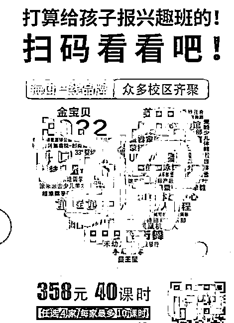

#  

这是当下绝大部分招生团队的招生套路，因为招生团队为单个机构做招生的成功率越来越低，所以他们不太愿意为单个校区做招生，就会采用联合招生的方法去做，这样一次在一个地区组织10家，20家，甚至上百家机构轰轰烈烈的搞招生，一次能招到大几百人甚至一两千人，收入十多万到几十万，多好呀！

甚至更有互联网团队，在一个城市里搞几十上百家机构和门店，搞一卡通霸王卡，69元，可以享受几十家机构和门店所有福利。

#  

 

#  

一个家长只要花69元，可以报读以上所有机构的所有科目，而且有效期1年，甚至2年，能转化吗？

你想想，任何家长只要他的脑袋不是被驴踢了，她都愿意花199元给孩子报名4-5个科目来体验，多好呀，就算让孩子去玩也划算嘛，甚至有些机构还送礼物，太划算了。

但是几乎没有1个家长会在孩子学完4-5门体验课后给孩子报名4-5门常规班，一来，家长没那么多钱，二来，就算真的有这么多钱，孩子也没有那么多时间呀！

因此，这样的方案，你最大的转化率只有20-25%，如果计算一些家长全部学完后一个都不报的呢（这是大概率事件），整体转化率会更低，你花了3-4万元招了100人，最后苦哈哈的上了1个月2个月的体验课，才转化了10来个家长，赚的还没有亏的多，你做个招生干嘛呢？

69元抢了一大堆方案，有效期1-2年，你要是家长买了，你会什么时候带孩子去上课？

#  

必须寒暑假呀？那么多体验课，这下爸妈再也不用担心孩子没地方去了？

能转化吗？

才怪呢！

**2**：参加**299**元**/24**次课，**48**次课的招生活动

去年有很多招生团队都用这一个招生方案全国巡回跑，狠狠的搂了一大笔钱，我知道有团队靠这个方案赚了2000多万，这都是艺术机构的血汗钱呀。

#  

 

#  

#  

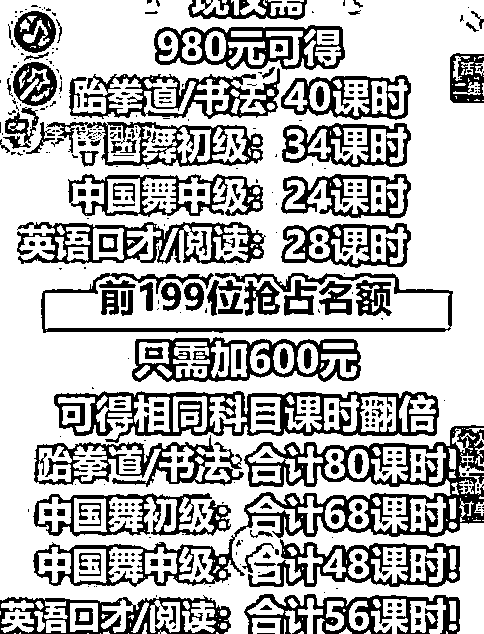 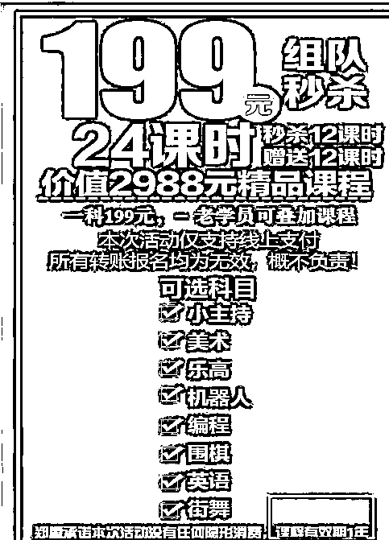

#  

我看到大概有200多个机构做了这个方案后，没2个月就倒闭了。

你想想：任何的家长，只要他的脑袋不是被门夹坏了，看到199元/299元48次课这样的招生方案，都会给孩子报名的！

48次课，按照1周1次课就是绝大部分艺术培训机构1年的课时了，平时要5000元甚至8000元/年的课程，现在299元就卖了，你报不报？

所以这样的方案，很多家长都会报名，虽然招生团队有一点返点，有一些承担了一些礼品，但这个跟你的损失比起来，简直小巫见大大巫了，因为这样的招生根本上是很难转化的。

你想想，你现在299元就有48次体验课了，家长上完体验课后，你怎么转化？

你的常规班也是48次-60次课，现在你要卖5000-8000元？家长的落差得有多大？

你愿意报名吗？

所以前端把巨大的利益让出来后，你后面是很难转化的。这样的招生纯粹就是为招生团队赚钱的。这样的机构做了一次招生活动后，未来的2-3年都会喘不过气来，而且以后的招生会越来越难，神仙都救不了你！

#  

**3**：实体店引流和互联网引流

你会说，这都是你那个行业的，我们做其他行当的，或者是做小红书引流，抖音引流的，没这回事！

那我再给你举个例子：

有个互联网大咖帮厦门一个做婚纱摄影的机构，用一个超超超级无敌有吸引力的引流品给这个摄影机构引流了几万个用户。

牛逼吧？

但是这次引流却让这个婚纱摄影的机构苦不堪言，因为他们的客户都比较高端，价格还是比较贵的。

这些贪便宜而来的用户，1%的转化都做不到，反而把他们团队的人员忙的团团转，光是筛选，沟通，过滤，兑换产品就忙了好几个月。

这一点点的收入完全抵消不了背后浪费的巨大成本，而且据他们的业务和摄影师反馈说，他们团队没有一个人喜欢对接这些客户，影响他们的业绩和收入，想想，老板做这样的活动，真不划算呀！

然而，这个老板不知道的是，这个大咖到处拿着这个案例去吹牛逼：你看，我给一个摄影机构引流了几万精准用户，就问你牛逼不牛逼？

#  

再讲一个小红书引流的案例，我去年因为艺术机构培训实在是停课太久了，我就研发了一个《101个小红书变现案例库》，就是教一些机构校长如何通过小红书去引流，变现自己的课程课件，或者带点货什么的。

我的《101个小红书变现案例库》，精挑细选了各种变现仿抄就能直接引流或者赚钱的笔记和账号，我让她们直接去模仿就可以了。

结果有几个校长愣是不听，偏要听那些互联网大咖的话，去搞什么爆款笔记，追什么热点新闻。每天都哇哇哇，99+赞和收藏，好牛逼呀！但是关注极少，评论极少，能引流到微信变现的极少！

倒不如部分听话照做的校长，直接仿照成功的笔记模板，去变现，虽然点赞不多，但是评论和引流到微信的都可以，每天能赚1000多块，多好呀！追什么空虚的爆款呢？

#  

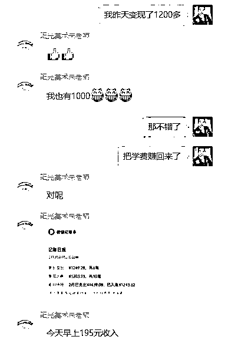

所以，要做引流，第一步就是一定要清晰引流的目的是什么？

记住凡是不以**“**成交转化**”**为导向的引流都是自嗨，瞎折腾！

第二个教训就是：清晰的用户画像

每次有人找我咨询引流或者招生时，我总是要问：你的用户画像是什么样的呀？

#  

她们会瞪大眼睛说：呀？什么画像？

我就知道她们没有清晰的用户画像的，也就是：是个人都要，有奶就是娘！

做引流和做招生，在设计引流和招生方案时，第一步就是：以转化为导向，筛选精准的用户人群。

因为精准的用户是提升成交率和转化率的重要前提，其次才是设计合理的成交转化方案。

如果不是这样，你试着对着一头牛去给它超级无敌美味的海鲜，你看它感兴趣不？

很多做实体门店的老板，觉得周边的人都是我的客户呀，很多开艺术机构的校长就觉得：家里有小孩的父母都是我的客户呀？

所以，他们就会上当受骗！

绝大部分的实体门店和少儿艺术培训机构都有一个特点：就是都靠周围**3-5**公里的街坊养活的。就算周围3-5公里有1万户人，你其实也只是靠其中的几百个家庭养活而已。

并非是个人都是你的菜，你想要提升后续的转化率和利润，从一开始就针对特别精准的人群，围绕他们的痛点和需求去做引流和招生的方案，这样才是正确的路线。

但很多大咖去帮实体门店引流不是这样的，一看方案就是没有特别的针对性，或者没有做各种限定。

#  

去年有一段时间，一帮做抖音同城的互联网大咖纷纷跑过去给艺培机构做招生引流，结果2个月就不干了。

为啥？

引流来的10个人里有8个都是不精准的。

例如我在广州白云区，你在番禺做同城引流，你的方案是很有吸引力，可能我报名了，但是我不会送孩子过去体验，我去2趟来回的钱都远远超出你的体验课费用了。再者，就算这帮人去体验了，也不见的会报名常规班，因为光是几次体验课接送就够烦的了，未来1年每个星期都要接送一次，你倒贴钱给我我都不去。

所以这种引流活动，后续处理起来退款率贼高，而且沟通过滤的成本很大，艺术机构就是靠周围几个小区和学校吃饭的，其他远远的家长，零零星星的几个，赚不到几毛钱，续费率又低。

就算是限定了周围3-5公里的，你也要限定年龄，例如少儿艺术教培，都是4-6岁是黄金年龄，因为这样的孩子不但好转化，关键是转化后还有几年的黄金续费期，如果招一个11岁的来，估计学1-2年就要升学了，哪里有时间继续学，这样也是不划算的。

除了年龄，经济实力也是很重要的，人群划分也是很重要的。

很多地推招生团队去帮机构做招生时候，就喜欢拿着礼物去让老奶奶给孩子报名，把课程说的天花乱坠的，而且报名还送玩具和礼物，很多老奶奶就报名了，就当花几十块钱给孩子买个礼物呗。这样的人后期不会转化的呀？

#  

还有些地推团队就喜欢扫街，找那些开餐饮店的，开便利店的，开五金店的老板去给孩子报名，这些老板一天18个小时守着店里，平时带孩子就比较少，他们往往会给孩子报名学体验课，反正还有礼物送，就当心理补偿了，但是由于他们很难抽时间去接送，老师在上课的过程中很难见到家长，怎么跟她转化几千元的学费呢？所以这类人群也是转化率很低的。

就算实体店做引流也也一样要根据你的环境去做精准的人群画像。然后针对性的设计引流方案！

我以前帮东莞的一家椰子鸡火锅连锁店做引流，每个店的引流方案都不同，老板就很好奇问：为什么要设计不同的方案？

我说很简单呀，你每个店的位置都不同，人群都不同，用一样的引流方案，你觉得靠谱吗？

例如，我帮厚街的一家椰子鸡店去引流，他们周围都是写字楼，工厂居多，没啥居民的！我就设计了：企业会客招待套餐，引导这些企业主把这里当成他们招待客人的饭堂。这样的人群不用很多，能引流几十家企业稳定的上门，就已经很不错了。

另一家万江的椰子鸡店，周围有8个成熟的小区，我就引导他们做家庭聚餐，周末和老婆孩子吃顿好的。

人群不一样，需求不一样，方案当然也要不一样。

#  

因此我帮少儿艺术机构做招生，每个机构的方案都是不一样的，美术机构的和阅读机构的方案不同，少儿篮球的方案和机器人编程的不同。广州深圳的和广西贵州的县城方案不同，这些都是要具体问题具体分析的。

而大部分的招生团队和互联网引流团队都是一套方案打天下的，  例如很多招生团队就是299元/48次课，管你是深圳上海的机构还是广西贵州的小县城机构，管你是大机构还是小机构，管你是单科目机构还是综合体机构，管你做美术的还是做围棋的，就是这么一套方案打遍天下。

这就意味着：你要用你的机构来适应她们的方案，我常常说这样的招生：成功是偶然是，失败是必然的！

举一个例子：在一家医院里，一个医生不管你来的是小孩还是大人，统统来到她面前，她也无需望闻问切，直接给你一副标准的药方，请问你敢吃这个药吗？

这同样也是需要你的病情和身体适应这个药方，而不是医生通过望闻问切的针对去开药方来适应你的病情呀？

因此，我们在做引流和招生方案之前，一定要做精准的人群画像，目的就是做到针对性的私人订制引流招生方案，真正的做到药到病除。

可惜，绝大部分的引流招生团队的良心都被狗吃了，用一套固定的招生方案打遍天下，害死了一批又一批善良的机构老板。

第三个经验教训：精准制定引流目标

#  

关于这一点，这也是一个笑话。

我每次问校长和老板：你们这次引流和招生的目标是多少呢？

他们回答说：当然是多多益善，越多越好呀！

每次我听到机构老板这么回答，我就知道这样的老板就是一条绿油油的韭菜！

有时候真的不是招生团队和引流团队太坏，而是实体店老板和机构校长真的太傻，无脑的傻子太多了，骗子都不够用呀！

引流和招生目标真的是越多越好吗？

你的机构只有4个老师，200平方米，你已经有了150个在学的老生了，我再给你招500人，招1000人，你那么贪心，你吃得下吗？你有那么大的胃口，也得先有一副好牙吧？

别噎着自己了！

你的奶茶店就只有10平方，三五张桌子，我给你的店引流来几万人围的你水泄不通，要警察来维持秩序，你忙得过来吗？

这么显浅的道理，但是很多老板是真的不懂，所以才有：招生越多越好，引流多多益善的说法。

错！

#  

招生引流不是越多越好，而是够用就好！

所以，我们在招生之前，就要精确的评估你机构的空置率，容纳量，老师的时间安排，提前把转化的流程步骤想清楚，判断出你这个机构在近期还需要多少个常规班学员？

然后再根据你往常的转化率去倒推，得出你本次的招生目标，然后再根据这样的招生目标去设计招生方案。

例如你通过精确计算，你还需要50个常规班学员，你往常的批量转化率是50%，那么你这次的招生目标就定在100人，最多不超过120人就够了。

那么你就围绕如何实现招120人去设计本次招生目标就OK了，搞那么多干嘛呢？

所以，我每次带机构做招生，常常在完成了招生目标后，就不断地喊停，够了，够了，不要招了！（敢于喊停，我们这个做法在全国都找不到第**2**家！）这是因为我坚持我们：不贪心、不夸大、不害人的价值观！

很多机构原本要用3天来招120人的，结果才第二天晚上就超额完成了招生。这要是放到其他招生团队身上，他们才不管你那么多，狠狠的招，招的越多越好。

因为**99.99%**的招生团队收入模型都是靠收取体验课的费用为报酬的，只要多招1个新生，他们就多赚199元或者299元，招的越多赚的越多。

我就见过一个机构，明明只要100人就够了，结果给招生团队招了500多个新生，最后搞得机构鸡飞狗跳的，差点没把机构搞倒闭。

#  

还是前面那个婚纱摄影的案例，他们一个小小的婚纱摄影机构，要得着几万个引流用户吗？

其实如果足够精准的话，估计几百个，几千个都够他们忙活一两年了，多余的都是浪费！但是别人不管你那么多，不招个几万个怎么显得我们做大咖的牛逼呢？所以，这个互联网大咖后面到处拿着这个案例去吹牛逼，殊不知这个老板已经哭晕在厕所里了！

我们招生行当也是这样，很多所谓的互联网大咖帮机构做招生，莫名其妙的给机构招了2000多人，然后到处群发吹牛逼，你看我们多牛逼，一个机构招了2000多人。唉，在现实的情况下，有那个机构吃得了2000人的体验课呢？这些都是忽悠那些脑袋被驴踢傻了的校长的。

也有一些招生团队特别有能耐，不但帮机构做招生赚一笔钱，还帮她们去做转化，赚更大一笔钱。天天都群发一些：7天收款50万，七天收款100万，七天收款200万的见证，好牛逼呀，搞得很多小机构老板口水哗哗的流。

我想说的是：不要看账面收了多少钱，那些都只是负债，对于艺术机构来说，你收的这些只是预付款而已，只有课消后才是你的钱！课程没有消耗掉，那些都是负债！

你不懂招生，找招生团队去帮你做引流招生，这勉强还说得过去，但是你居然依赖他们帮你做转化，这就很不靠谱了。

请问他作为一个外地来的招生团队，他懂你的课程吗？他懂你的本地的客户吗？他懂教学吗？

他懂个屁！

#  

你自己是本地的校长老师，你自己都做不了的转化，你让招生团队怎么帮你做？

他们要赚这个提成，很简单：打折，送礼，送大礼，然后再百分百抽奖！

原价8000元的课程，现在5800元，还送大冰箱一台，还百分百抽奖！

原价8000元的课程，现在报一门送一门或者报1年送1年，还百分百抽奖！

这样力度的促销大甩卖，还有一点做“艺术培训”的调子吗？这样力度的大甩卖，还得着找招生团队吗？自己一个一个聊不香吗？还要给他们15-20%的提成。

转化100人，不但没钱赚，每一个还要亏掉1000元，你一次收款收的越多，你亏掉的钱就会越多。你的机构是做公益的吗？

你是一次性收了三五十万，但是你转身就花的七七八八了，你后面怎么过？在机构没有利润，甚至亏本的前提下，你用什么来增加老师的福利？你用什么来招更好的老师提供更好的服务？

转身他们拿着7天收款50万的案例到处去忽悠下一家，而你依然没钱花！

而像我的一些学员，例如江西南昌爱育幼童的肖老师，一次性招生就招50人，数量不牛逼，但是这50人就收入20万，这20万都是自己按接近于原价收的，每一个都是有钱赚的。

像这样的案例我们有几百个，每一个数据都不会特别出彩，都是招50-200人，但是体验课费用自己收，转化按照正常流程去做，没有一个不赚钱的！

#  

因此，实体店和教培等机构真的要引流，一定要想清楚：

你做这一场活动的目的是什么？

** **

你的用户画像是谁？

** **

你究竟要引流招生多少人？

想清楚了这三点，然后再去琢磨什么方案，方法，技巧的问题。没有想清楚这些，越是牛逼的方案，越是让你掉进万劫不复的深渊！

谨记，谨记！

评论区：

九克er : 学习了  可以vx交流吗

耀神 : [强]

赤兔马里奥 : 实战出真章[强]

Huang : 讲的很好👍👍👍

#  