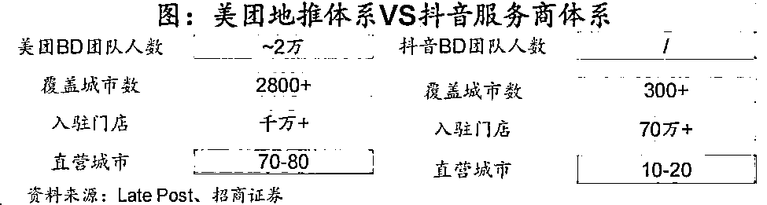
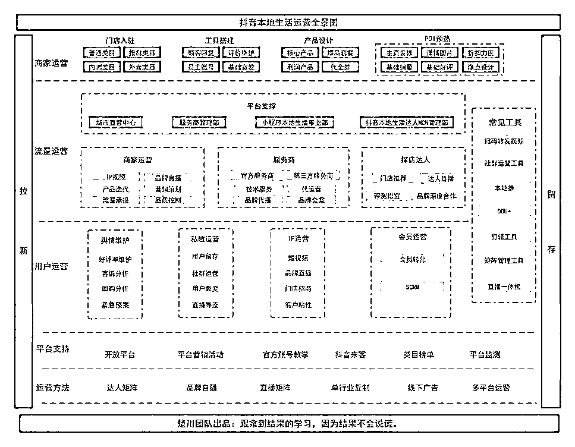
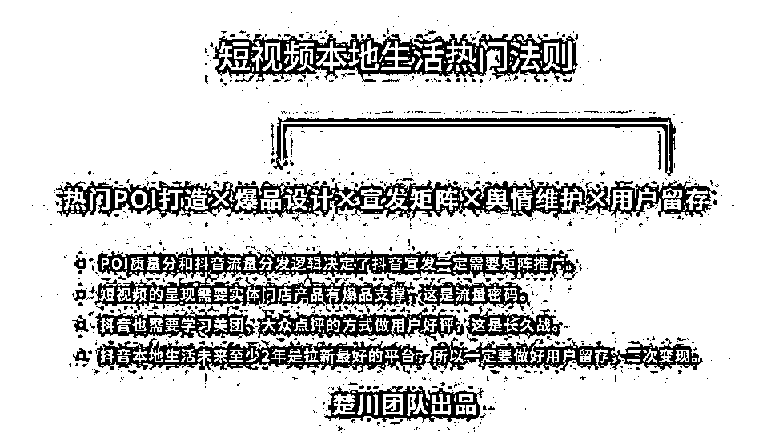
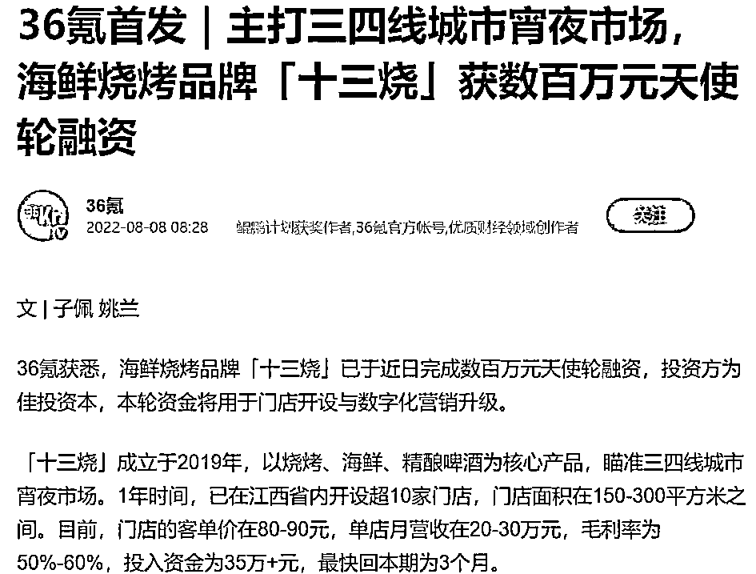

# (40 赞)楚川：2023 年如何获得抖音本地生活的十倍增长的红利

作者：  楚川

日期：2023-01-09

**2022**年年末，我们终于迎来了共存时代，搞钱成了每个人的生存基调。当下实体门店价值降到波谷，抖音本地流量性价比接近波峰，赛道将迎来最大增速的一年。不管你有没有入局，还是正在这个赛道里厮杀，都不能错过这最好的机会，在**2023**年放开马力跑。

**——**楚川

**Part 1 **本地生活成长的一年

**1**、自我介绍

大家好，我是楚川。

一个 10 年的连续创业者，3 年本地生活创业经历，先后分别服务过 4700 个实体商家，覆盖了吃喝玩乐衣食住行的细分类目。

经过 3 年的摸爬打滚，终于建立起”不管平台的变化、市场的恶化，也必须盈利”的能力，团队也在 2022 年实现净利润破千万。

**2**、分享的原因和初衷

我们团队经历了本地生活的加盟 IP 和信息流投放、达人孵化、品牌孵化、供应链、官方服务商、技术服务商等阶段，基本上大家每个过程遇到的问题、踩过的坑都有经历，所以也算是有底气能够给到同行、即将要入局的人一些中肯的建议。

2020-2021 年的两年，我个人也基本上在一线实战，没有任何时间去思考外出做分享。经历了 2021 年的至暗时刻，我调整了公司的运营体系和结构，把自己释放出来了，逐渐对外做一些个人的行业经验和方法论分享。

我想说一件事就是：当下阶段，本地生活最大的坑就是信息差！

我**2022**年**2**月的分享，不少内容到现在过去一年了，整个市场和平台已经迭代了**n**次，已经跟我年初描述的极不一样。

# 3、2023 年所有人需要达成的共识点

**1. ** IP 内容、电商品牌内容不等于本地生活内容。

**1. ** 本地生活的人群大部分都是对本区域的吃喝玩乐（轻决策且高频，超级高客单除外）有基本上的认知，所以只需要内容能够做好团购产品信息传播出去就

好。

很长一段时间探店视频被喷的体无完肤，但是这些看似 low 的视频往往能卖出产品。因此原来的内容刻板印象，牛逼的电商和 IP 内容都没有那么适用，这一块一定需要认清。

**1. ** 短视频的呈现和传播效果高于图文。

当下阶段做本地生活一定是需要做好抖音，拉新和流量成本最低的平台，传播速度和广度都高于图文平台。那为啥不做好，就先不用去考虑其他平台太多的布局了。

我们团队过去 3 年，各个平台都有尝试，发现还是抖音香，坑已经替大家踩过了。

**1. ** 本地生活存在一天，视频矩阵就一直在

抖音本地生活还是基于 3-5 公里的优先推荐，所以传统一条视频流量打满的时代已经过去了。我们现在就是需要 100 条甚至更多的视频，用 1-2 级流量池反复触达 5 公里以内的用户。

所以只要抖音不完全颠覆算法，改变同城的流量推荐，那矩阵就必须存在。玩矩阵也就意味着是玩本地生活的基本技能！

**1. ** 做抖音就一定要有抖感。

很多人找我要做好抖音本地生活，我基本上要这些人先培养自己的抖感。对从没有做过抖音的小伙伴经常说，没有抖感不要焦虑，去学习，去培养，一切都来得及。

那要怎么做，每天花 2 小时，了解抖音，去刷视频，去别人直播间学，低于这个时间长度大概率是失败的。等到你真的能说出抖音当下的生态组成，抖音本地生活的商业闭环就说明初步具备抖感了。没有必败！

**1. ** 本地生活就是做又脏又累的活，用实操保持体感。

本地生活实操大于一切，当长期没有实操，你会很陌生，因为更新太快了，千万不能因为其他诱惑脱离实际，脱离实操！

同时大家要清醒的认识到吃喝玩乐的门槛低，红利大，要想在里面真正掘金，那最后比的是谁愿意去做又脏又累的活，躬身入局的人一定是可以吃到肉的，习惯赚快钱的人很难接受这种节奏。

# Part2 2023 年如何破局搞到钱

# 1、抖音本地生活还有 10 倍增长空间

**1. ** 本地生活图文和短视频平台的竞争刚刚开始：据美团**2021**年年报披露，美团平台活跃商家数量达到**880**万家，基本覆盖全国全部地级市，而抖音本地生活仅覆盖了一线及新一线全部城市，但在二三线城市覆盖率较低，还有巨大的增长空

间。因此并不用担心商家不够做的问题，市场足够大，另外视频号和快手都在

虎视眈眈。

**1. ** 投放入口全面调为本地推，意味着：直播必须有，GMV 要疯狂爆发。

年底了，现在抖音本地生活的投放入口会逐渐全部收缩在本地推，最大加持的地方一定是直播。所以接下来是考验团队投放效率和单场产出，因此短视频的辅助至关重要，直播运营决定最终 ROI。

同时外卖也会在 2023 年彻底打开，客单价 100 以上的外卖也会疯涨，两大块的组合才能完成 10 倍以上的增长。

# 2、用更加系统的思维去理解抖音本地生活

**1. ** 2023 年的抖音本地生活慢慢会开始比拼精细化操作，那必须要清楚生态的组成。

**1. ** 培养和保持抖感是第一步，其次最重要的是对本地生活生态的了解。

**1.    **因为抖音本地生活经过**2**年多的发展，商家、达人、服务商的认知都已经完成了**2**轮以上的教育，再次按照初期单纯的收割市场，怼商家数量，纯怼**GMV**的方式已经过时了。

**1.    **现在本地生活的商业模式，初期就必须盈利，不然后期不可能维持，因此就需要对生态有足够多的了解。

**1. ** 在 2022 年 11 月我基于前面 3 年的经历，公司运转和经营 SOP 画出了抖音本地生活运营全景图，个人认为这是接下来从业者需要非常熟悉的一张图，并且在从业一段时间后结合自己的特点，再进行调整和优化。

**1.    **我会认为这是一个优秀的从业者必须具备的能力，只有充分了解生态每个组成部分，才会知道行业和赛道中的钱在哪里，团队的发展在哪里。

**1. ** 抖音平台现在就是所有大平台当中流量成本最低的平台，所以我们需要把自己的流量获取入口放在这里。这就是在全景图当中，强调：拉新**-**留存的概念。

**1.    **本地生活团队现在跑的最凶的服务商是联联周边游、千千惠，这是因为他们具有私域流量，因此我们在起盘的过程是不能忽略本地生活流量的留存。未来谁

能抓住这次机会，完成流量转化，谁就是爸爸。

**1. ** 在流量运营端，2023 年一定是要学会短视频和直播的组合拳。

**1.    **当下阶段，我接触到**90%**以上的服务商要么只做短视频，要么只做直播，其实这一块是不能完全割裂的。短视频是直播的基础，电商的发展过程，前面的阶

段也是通过短视频种草或挂车的方式完成增长。

**1.    **因此本地生活中，一样也是需要做好短视频的前期，再做直播，在服务客户的过程是需要组合一起去交付。**2023**年，算法会无限加大这一块的化学反应，具体的短视频和直播的组合打法，铁子们可以私下交流。

**1. ** 不要神话工具的作用，也不要妖魔化现有的工具。

**1.    **从爆店码、抖音小程序，再到现在的外卖小程序，无论是商家还是服务商都被割到体无完肤。但是我还是想说，做抖音本地生活，终究是一件讲：商家运

营、流量运营、用户运营和平台运营的事情，工具只是很少一部分。

**1.    **没有工具的加持，并不会让生意停止了，也没有什么工具能让你一本万利实现赚大钱。当下阶段能行之有效的工具依旧是我列举的这几类，爆店码目前就是

适用于服务商，不太建议去给商家单独使用；在未来的时间，比拼运营细节就

需要大家好好掌握本地推、矩阵管理工具。

**1. ** 在本地生活的平台运营层面上看，主阵地一定是抖音，其次就需要整合线上其他平台，以及实体广告。

**1.    **虽然有大半年我们没有做过整合营销的全案，但是我们依旧是建议小团队可以尝试做这件事，我们当时在这一块是盈利的状态。一个全案是能够造价百万以

上，超出团队能力的部分做外包。

**1.    **一个团队入局一定也需要了解所有的平台特点和价值，并不是对团队要求高，而是因为本地生活掌握的技能和方法就那么多，多出的时间和精力是需要大家

去了解全貌的。谁先走的早，谁就能提前吃到这一块的红利。

**1. ** 4700 个商家的服务经历，让我总结出短视频本地生活的热门法则，5 步打爆门店。

**1. ** 我今年反复在自己和朋友的社群反复提到这个热门法则，因为这是我们做的过程一直遵循的 SOP。现在有很多人拿去抄，在直播间卖，但是能够帮助到人就好，这张图的**1.0**版本其实是我**2022**年**6**月创作出来的。

**1.    **现在我在整个流程中加了**4**点说明，帮助大家更深的理解。 一个门店的从 0 到 1 打爆，保证这个方式，再按照我之前分享到的推广流程，基本上就没太大问题。

**1.    **接下来的一年，也会持续把这些做下去，第一是为初入者指明方向，第二是为入局者及时了解自己做的事情，第三是让我自己随时保持清醒，当然我也会持

续在这个赛道保持实操，维持这种体感。

**1. ** POI 加热是从业者的第一课。大家可以理解为我们开一个实体店，开张当天都会邀请朋友过去捧场，充当人气，而**POI**也是一样。当我们开通地址认证，上架产品，也是需要把**POI**烘托成繁荣的场景，这就是**POI**加热，做成热门地址后，转化一切都上来了。

**1. ** 没有爆品就别做推广。前面有说到，爆品就是生命，选对品成功**80%**。那前期的动作就是选出门店的爆品，做事就事半功倍。

**1.    **一定不能做逆流而上的事情，没有爆品去做强推，转化会一言难尽，甚至适得其反。铁子们这一块就遵循一个原则，没有爆品就不做抖音推广的动作，否则

一切动作就是在赌博。

**1. ** 玩转短视频矩阵和直播运营就能发财。在这里还是会强调：短视频矩阵是第一位，一定要学会整套落地流程，再去搞直播。我在**2022**年上半年以前都不会推荐大家做直播，因为行业的生态还处于要先做好短视频的阶段。但是现在已经

需要双管齐下，做**”1+1**＞**2”**的事情。

**1. ** 好评率的维护极其重要。抖音流量的速度快，一天可以打出百万级的流量，那一定会面临好评率下降，以及差评，那就需要做好舆情维护，这是持久战。动

作路径就是去学习美团和点评的方式，不做转化率会直线下降，退单率成倍增

长。

**1. ** 这**2**张图就是我站在当下抖音本地生活的视角考虑到的各个流程和环节，大家要做的事情，做了每个环节的拆解，大家可以放心学习。我个人觉得实操久了，

能够把这两张图复述出来，一定是真正理解这个生态，并且能拿到结果。

# 3、楚川视角下的 8 个必赚的小方向

我现在已经有很多次成功预测抖音本地生活必火的行业，成功率做到了 90%。所以每次分享大家都会期待我这样的预测，一些团队有心就会真正去落地，提前部署，然后拿到结果。以下我就站在 2023 年整年的角度来做分析。

**1. ** 文旅，不要问我怎么爆，组品**+**大力出奇迹。共存时代来了，明年上半年发酵一下，下半年会疯涨，**100**倍增长都有可能。

**1. ** 交友，**2023**年依旧是疯狂爆发。**3**年的社交封闭，已经让人太渴望交友的感觉了。**IP**打造、矩阵推广、私域承接，比较看好，高客单能搞到爆炸。

**1. ** 同城零售，结合达达、顺丰同城、饿了么的运力，做高客单，一切新奇特组合，我们今年已经验证成功，明年系统丝滑后，会给所有团队福音。

**1. ** 演出，包括脱口秀，演唱会和电影院。素材质量高并且可以多，混剪可能性多，分发账号多，就是大力出奇迹。

**1.  live house**。长沙在**2022**年已经给所有城市打版了，现场好的歌手，热歌**+**视频切片传播，基本上就能起飞。

**1. ** 小模型的社区店，满足居民的高频刚需餐饮品牌。这也是做到了验证的模式，大有可为，最好的私域入口。

**1. ** 实力强劲的服务考虑品牌孵化。目前我已经孵化出**4**个千万级以上的品牌，其中餐饮品牌十三烧跑的最好，已经在**36**氪发文天使轮，年后将完成**A**轮。所以我也希望**2023**年能乘势而为，孵化**2**个以上的品牌。

**1. ** 垂直类目服务商。一套吃下抖音整块的流量，如鲜花、美业、家政、便利店等，认领**1000**家以上的门店，研究爆品和垂直打法，是能快速搞钱。

# 4、我会做什么：复制 70 分的楚川

今年分别在群响、淘客公园、生财有术、中国区域互联网大会、航加、猪八戒网、美团核心高层有做过分享，收到的反馈都是正向的，所以一直想去让一些团队复制我的能力，那就是复制 70 分的楚川。

**1. ** 目前本地生活最大的限制是：信息差。

**2. ** 最大的制约就是：缺乏实操经验。

所以我会今年跟团队互相选择，把我们的经验和能力嫁接到对方身上，从而加速在本地生活的大赛中拿到结果。让有能力的团队尽量在初期减少信息差带来的时间和资金损失，以及实操经验缺乏导致的战略失误。

以上，就是楚川关于**2023**年本地生活的预测和建议，希望大家都有能力去迎接赛道大爆发！

有需要链接的团队和个人，可以加我个人微信。【跟对的人，一起在**2023**年拿结果！】

评论区：

张焕谷 : 怎么联系

楚川 : 微信：chuchuan2020

rd : 引流分享？

楚川 : ？？

济州服装定制狮 Ben : [强]

