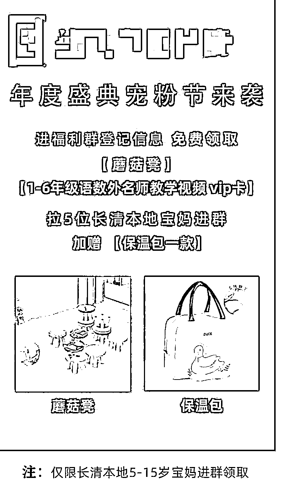
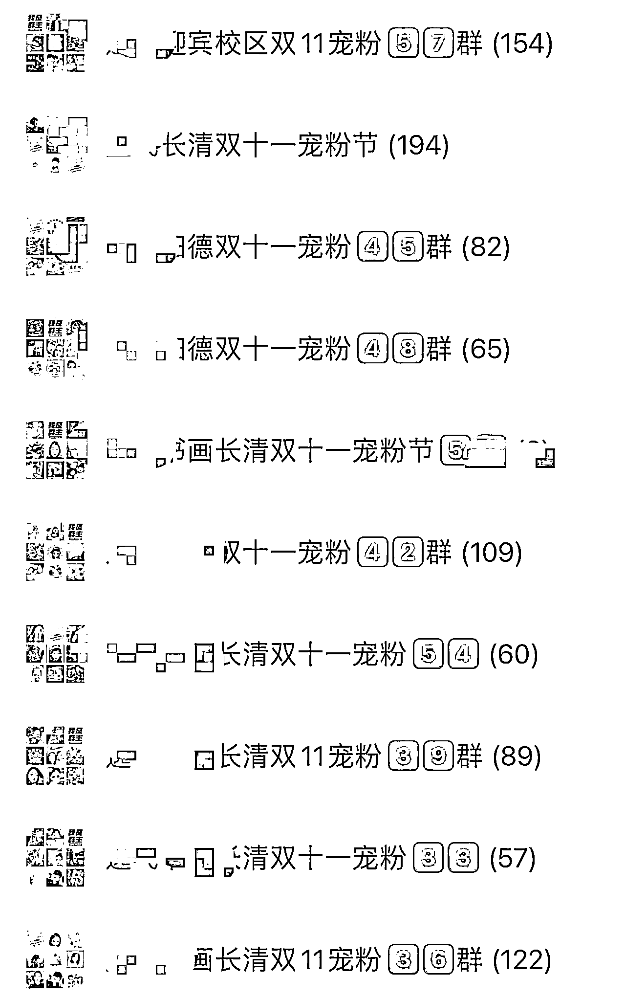
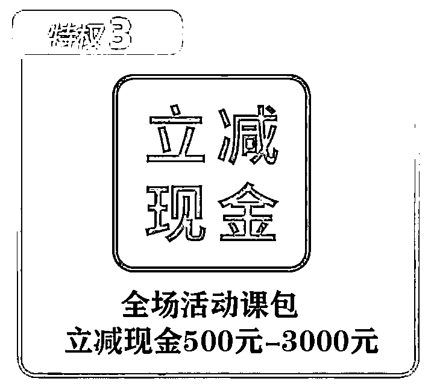
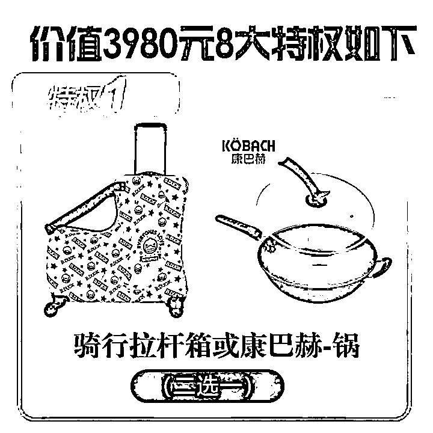
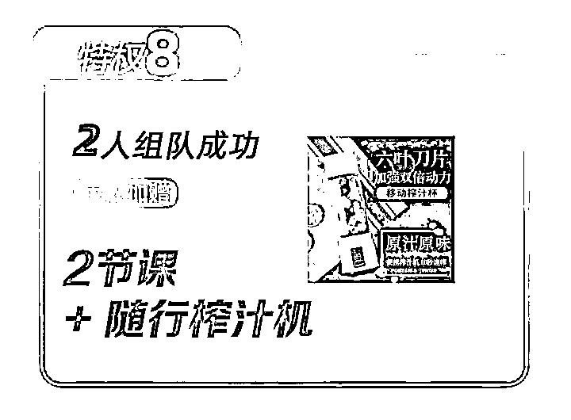
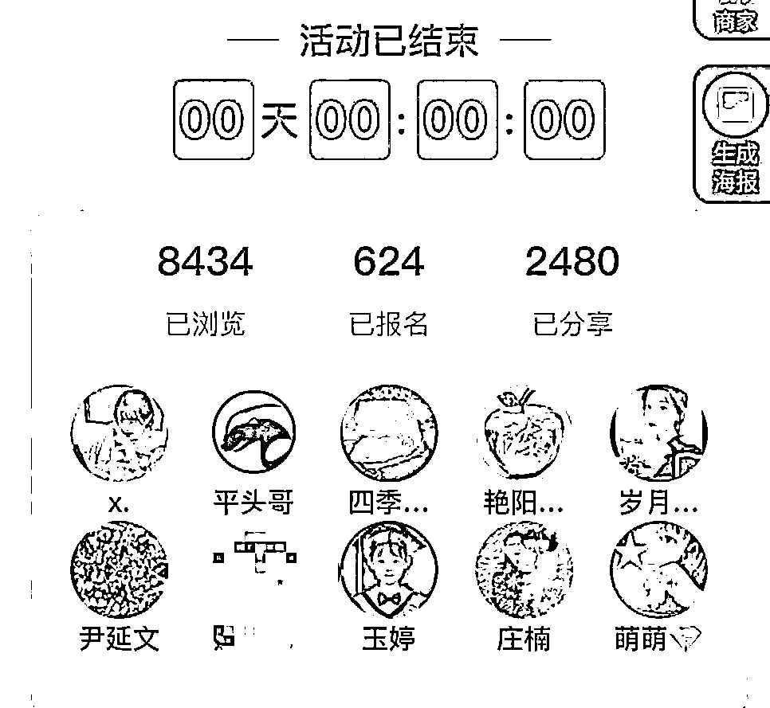
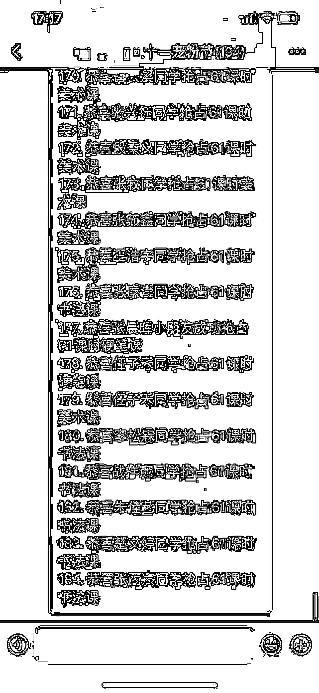
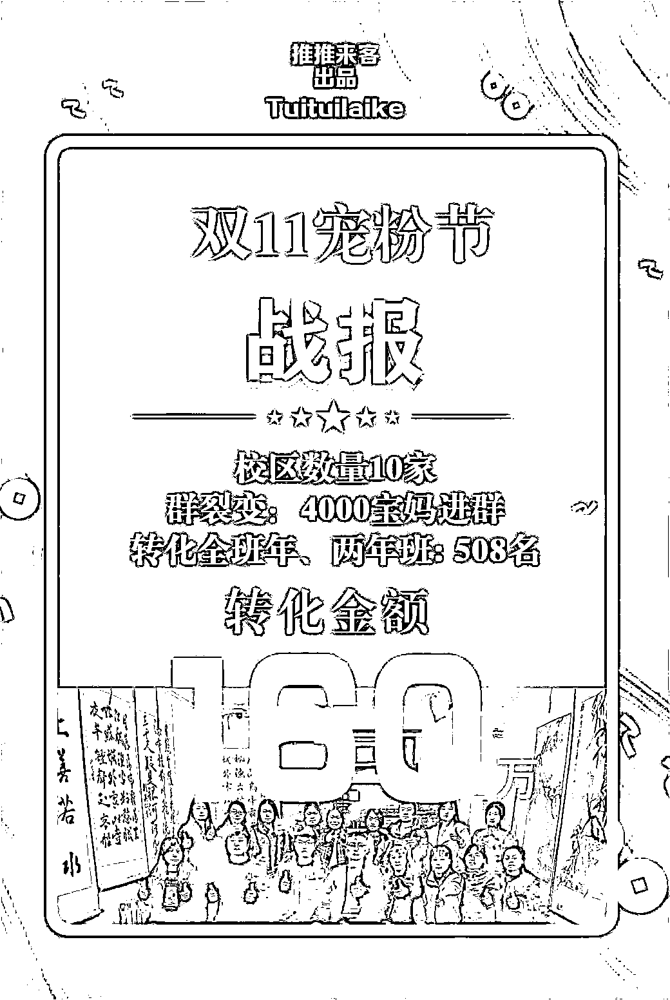

# (精华帖)(121 赞)20 天帮助实体书画门店收款 160 万

作者：  孙策

日期：2023-01-12

在双十一的时候，我们团队帮助一个之前服务过的老客户，设计了一套转化流程，在 20 天时间，帮助这个济南长清的书画校区做了 160 万的一个收款，在当时口罩那个环境下，在长清彻底把这个机构引爆掉，收款做到当地天花板

接下来，给大家复盘一下整个的细节流程，

现在很多做门店服务的，上来就是帮助门店做多少粉丝、做多少播放量，个人认为如果不给实体门店带去销售额都是耍流氓，要给实体门店带去销售额来倒推服务，

这个 20 天做 160 万的业绩，其主要环节主要分为这几块，

1、引爆同城流量

2、裂变自有流量

3、转化到店流量

**1、引爆同城流量**

当时那一家是书画的少儿培训机构，实体门店很清晰，就是需要自己的产品，能持续的触达本城市的精准人群，实体门店的流量重心是在同城，

同城流量的主阵地主要有两个：

1、微信，微信我们快速触达用户的渠道是在同城群，

2、抖音，抖音我们快速触达用户的渠道是在抖音同城，

**1、对于同城微信群**

一个城市打开率最高是在业主群、村居群、商家群、团购群这三类，这是城市私域流量主阵地，我们在活动开始前，带着门店的员工先去线下直接加一波同城的微信群，积累 1000 个左右的同城微信群，

积累了 1000 个左右的同城微信群，接下来做了这两个动作，

1、沉淀同城群的宝妈到自己的群，

我们可以设置只要宝妈进群，即可送一个小凳子，再设计邀请 5 个人进群，再送一个保温包；

通过这样的方式，裂变了 4000 人左右的微信群，95%以上的都是宝妈，也就是说沉淀了将近 4000 多个家庭，但领取礼品有一个要求，需要登记手机号、姓名信息，也就是说一个礼品，不仅完成了微信个人号沉淀、也获得了一个家长的信息；

2、推送活动链接到这 1000 个同城群，前一阶段已经沉淀了一波宝妈流量，因此我们需要推送我们的活动，完成一波的活动的曝光，推送活动要进行持续的推送，不用担心被 t 的问题，

**2、对于抖音**

常态化的输出是没问题的，打造 ip 也是没问题的，但是如果一个实体门店没有成熟的抖音，我们是无法借助他引爆同城流量的，我们可以利用涓涓细流汇聚成大江大河，前面讲到送了大量的小凳子以及保温包，进群的宝妈要到店领礼品，

因此，我们可以利用抖音爆店码，让所有的宝妈进行抖音视频的分发，1000 个宝妈来领礼品，就有 1000 多个视频分发出去，1000 多个宝妈的抖音相对来说权重会高那么一些，看视频的也是身边朋友圈多，

1000 多条素人视频发出去了，这个位置就加热了，如果再提升一下，还可以找 v3-v4 的博主过来再加热一下，

再挂上引流的团购品，基础团购品，刷刷，短时间内的会在本地形成一定的流量基础，**# ****2**、裂变自有流量

**2.1 裂变自有流量**

外部公域流量已经第一波曝光，还需要进行自有流量的曝光，自有流量价值最大还是个人微信号，在自有流量推送我们的产品下，对于自有的私域流量，其实每一次的推送可以说是一次消耗，如果持续的消耗，其实就是在耗尽我们的用户资产，

因此，我们在推送产品的情况下，我们要进行一定的裂变，裂变的鼻祖是拼多多，拼团是最好的裂变方式，没有之一

因此我们需要进行私域流量的裂变，私域流量的裂变就需要设计裂变品，

这次是设计了一个 66 元的宠粉节的定金卡裂变品，用户支付 66 元可以抢订价值 3980 的优惠名额，

课时福利：全场可以立减 500-3000 元，就是为了在现场进行高价的转化，

礼品福利：礼品也是送的价值比较高的康巴赫锅、骑行拉杆箱等，

裂变方面设置 2 人团，拉一个人支付 66 元，得几节课以及礼品

通过让老用户购买 66 元定金卡，再通过去裂变的方式，完成私域流量的裂变，**2.2 **裂变新流量

前面讲了我们有 4000 多位宝妈进群，1000 多名宝妈加微信，符合领礼品的到店领礼品，因此，

1、在群内我们要进行售卖 66 元定金卡，再让购买定金卡的去做裂变；

2、新添加微信的进行售卖 66 元定金卡，再让购买定金卡的去做裂变；

3、到店领小凳子的售卖 66 元定金卡，再让购买定金卡的去做裂变；

**3、转化到店流量**

前面讲了，我们通过公域流量的同城群流量以及抖音流量，还有自有的私域流量以及私域流量的裂变，带动了 66 元定金卡销售，定金卡的数量在 624 张，

接下来就是把 624 张卡转化掉，把到店流量转化掉

这时候，门店要进行造节促销，

1、在现场氛围方面，现场要制作的相对来说，要有节日的气氛，

2、在成单速度方面，要设计紧迫的支付速度，用老用户带动新用户，所以设计群接龙，也就是说，只要成单的就进行群接龙，然后相互影响；

3、方案方面，要设计阶梯成交方案，价格阶梯、礼品阶梯，提前买的客户，优先选择礼品、享受更低的价格，通过这样的方式

最终，通过这三步走，转化了 160 万，整个周期 20 多天，其实这套方案比较适合瑜伽呀、水育呀、教培呀、医美呀，复制这套逻辑，做个几十万问题不大。

评论区：

-末末。 : 请问您是在哪里做这个招生引流呀？

孙策 : 山东

家蒙 : 引流转化能力才是硬实力，落袋为安，这也太强了，说一句呼风唤雨不过分吧  孙策 : [抱拳]

灵动 : 感谢精彩分享，有个疑问，1000 多个同城微信群是怎么来的？感谢  孙策 : 带着员工去线下加就好了，社区群、商家群、美团优选群，使劲加，耐住性子加，数量能上来的

Elizabeth : 这是有 10 家店吗

孙策 : 10 家
