# (19 赞)被忽略的公转私阵地，搞透它，无论实体还是线上同样稳定地获客

作者：  封伟-自动化变现

日期：2022-11-01

因为接下来我要分享的是详细的，可复制持续稳定的支付宝被动获客攻略，针对线上线下的业态都适合：支付宝生态被动引流攻略。

注：

不同行业支付宝能做的推广程度不一样，下面我展示的效果，仅为特定咨询领域故数据仅供参考，重要的是方法和关键步骤。

如涉及一些表格排版和超链接，或者图片抽风，点击查看

https://p9rxk6ovll.feishu.cn/docx/Tu7uda7qWoKCj1xvMlmcbtfBnqh 

# 1.支付宝被动引流经历

因为项目需要增加额外流量入口，尝试了支付宝的引流

**1.  7**月份开通支付宝生活号和小程序，放着没管，有一定效果；

**2.  1**个月前开始系统研究支付宝流量优化，做了一些基于品牌，搜索，优惠券，生活号等系统优化，平时没做其他运营（除了生活号每周发一篇文章），一个月

新增用户**4550**，下单**394**笔，订单虽然不多，但比起公众号，这个数据算是又佛系又稳定了

**3. ** 搜索流量占比极高，搜索占比**82.5%**，导致转化率远超微信抖音，很容易做出**SEO**的效果（具体优化步骤我将在**4.1-**搜索推荐分享）

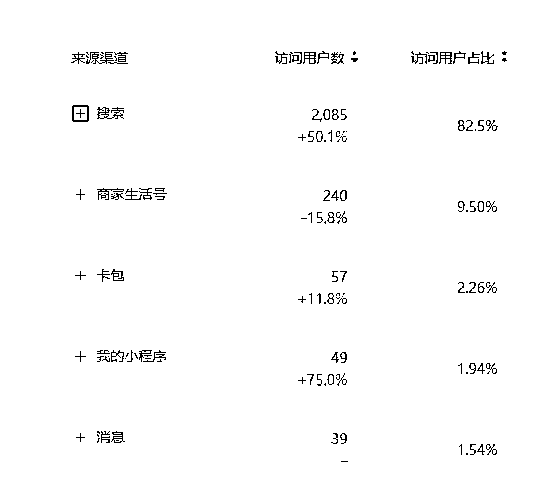

以下为各阶段数据

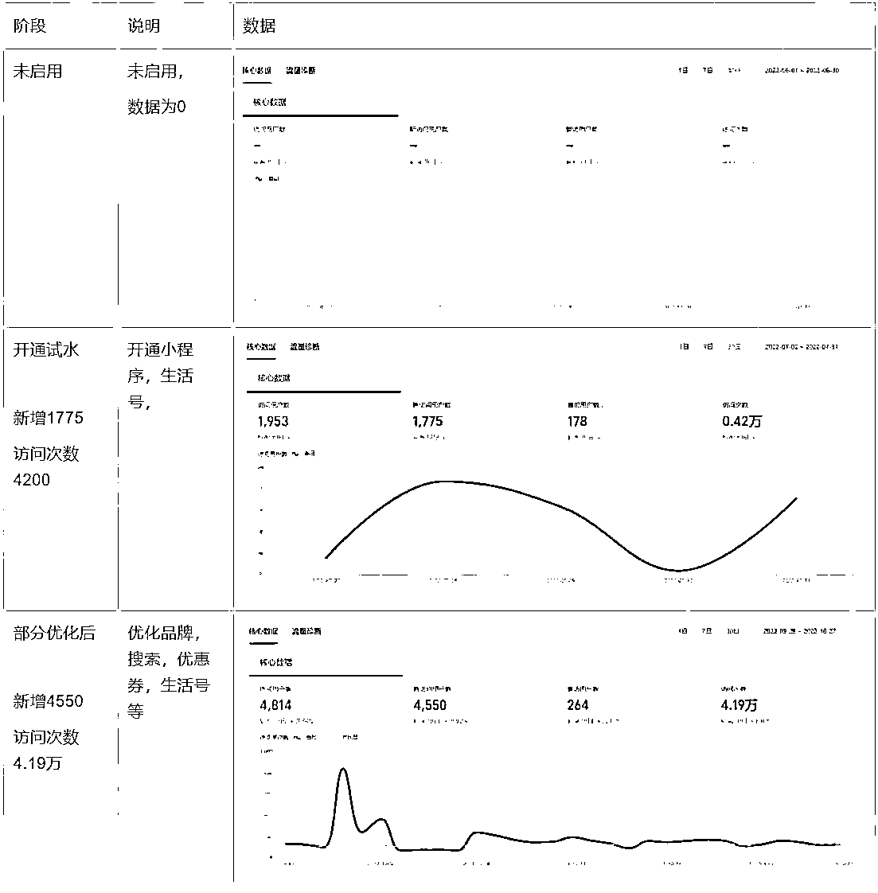

为了方便展开具体细节，先系统说 2 点，好在优化前有一定的系统性认知

# 2.支付宝流量类目

服务类目，1000 多项数字化服务，涵盖出行政务民生及生活服务，特别是生活服务无论是平台类玩家还是线下实体都有机会获得流量

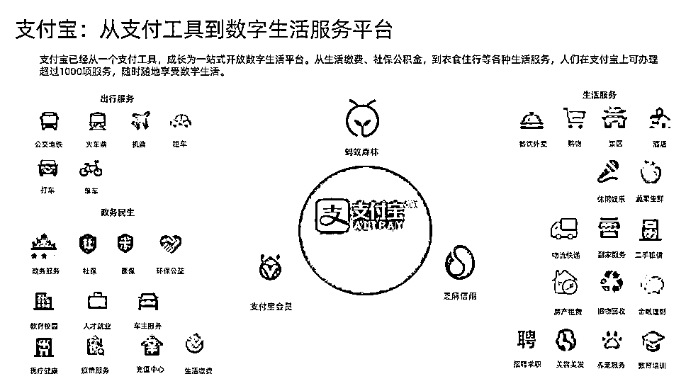

结合官方数据，其中占比比较高类目的有零售、餐饮、城市服务、交通出行、共享租赁、医疗健康等

流量来源包含线下扫码（同比去年增长 100%）和线上搜索（同比去年增长 87%）。

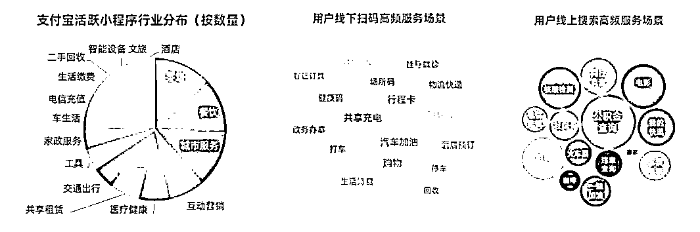

看下面几个占比比较低的类目，数据表现也挺不错（所以我在最开始强调，我运营的数据有对应行业限制仅供参考，主要是方法和关键步骤）

回收  洗空调  白酒批发

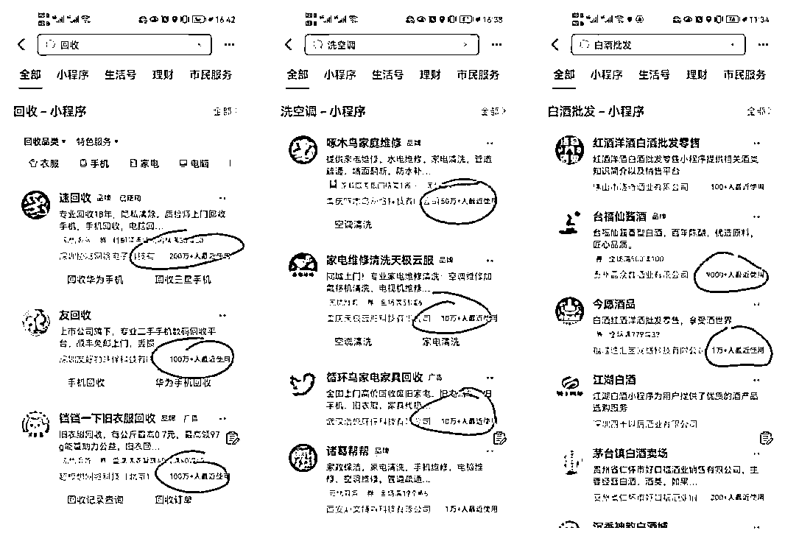

# 3.支付宝流量布局

分为内部流量及外部流量

内部为支付宝商家平台及支付宝开放平台后台可以操作及运营的功能

外部为阿里的其他生态产品，可以打通的流量渠道，比如常见的 uc、夸克、高德，打通后，将获得成倍的流量，具体需依赖于技术开发实现。

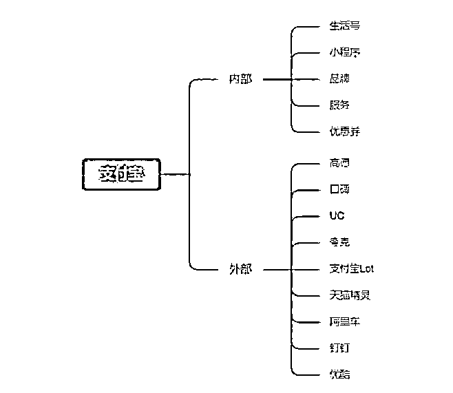

# 4.支付宝被动流量优化攻略

# 4.1 内部流量

不懂平台的公域谈私域运营都是扯淡，同理，做支付宝要先明白公域流量的入口。

和微信不同，支付宝的流量更多是入口布局+小程序承载，小程序不懂技术的可以找服务商，懂技术的可以直接开干。我研究跨平台的打法，也是以小程序为承载，比如多平台内容同步，跨平台公转私。

公域引流，私域沉淀转化激活复购裂变，这是主要的打法图示

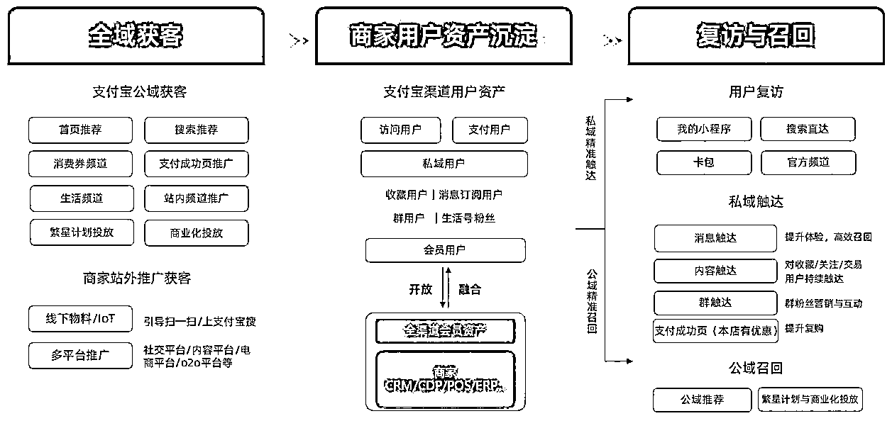

# 公域：

包括首页推荐、搜索推荐、消费券推广、支付成功页、生活频道、会员频道、繁星计划投放、商业化投放等

**1.**首页推荐

**H5**

首页推荐，会针对不同的人群进行千人千面首页推荐，若符合准入规范，且素材审核通过后将有机会到首页进行展示。

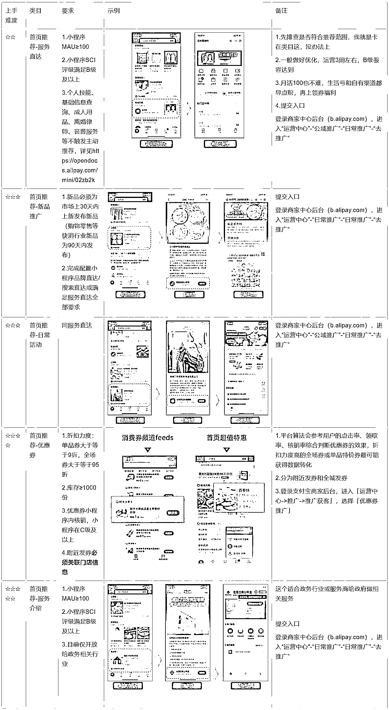

**2.**搜索推荐

**H5**

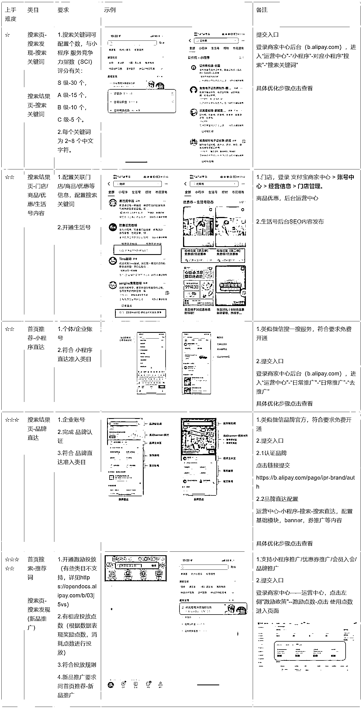

人人都能做的**SEO**

1.搜索关键词

有些搜索有类目限制，这里分享下实现搜索曝光最快的方式——搜索关键词

1.进入“运营中心”-“小程序”-对应小程序“搜索”-“搜索关键词”-“添加关键词”一个小程序可最多配置 15 个关键词

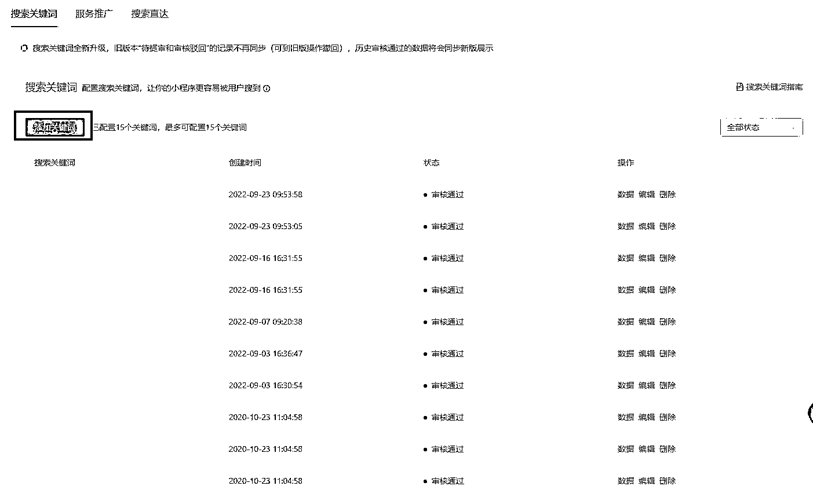

2.查看同类目，热榜词和飙升词，提交

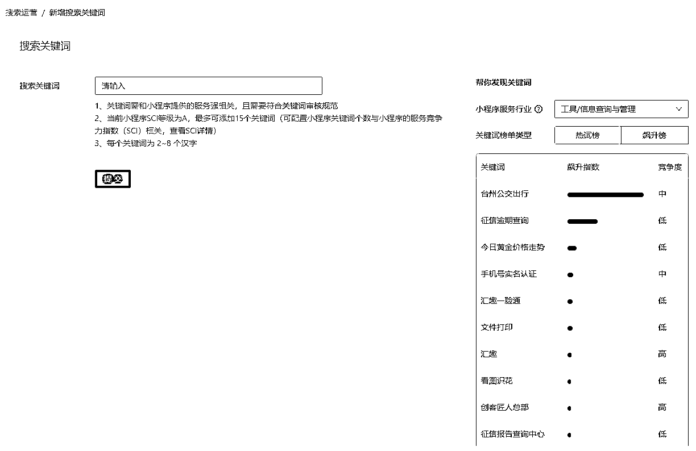

3.审核通过后，有机会被展示

4.重点来了，关键词维护，一定要定期去看数据并维护，也是 SEO 的关键

数据中心-小程序分析-搜索-用户搜索词-曝光用户数（倒序），查看一段时间内，高频搜索词，把这些词补到上面的搜索关键词里去

定期查看，更新并替换搜索量小的词，直至上线的 15 个搜索词在一段时间内搜索量都是靠前的

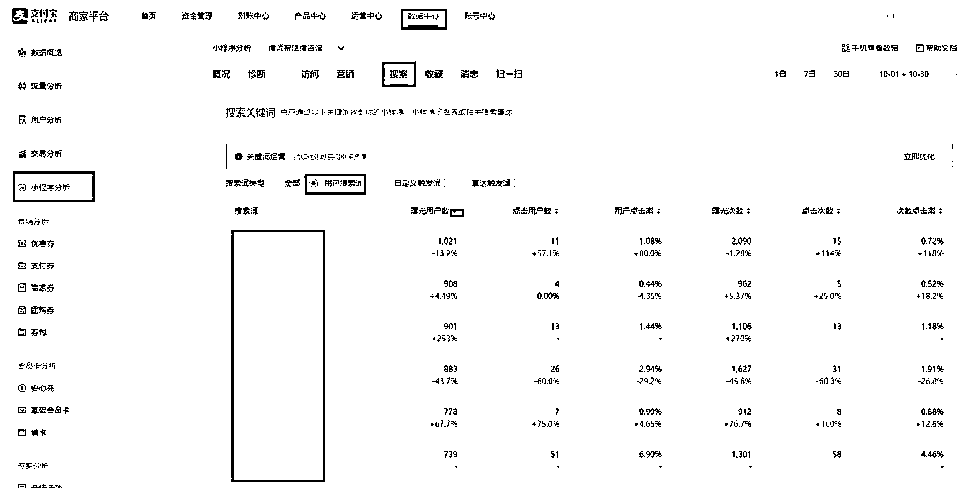

2.品牌直达

运营中心-小程序-搜索-搜索直达，配置基础模块，banner，券推广等内容可以同时展示服务，小程序，生活号，优惠券

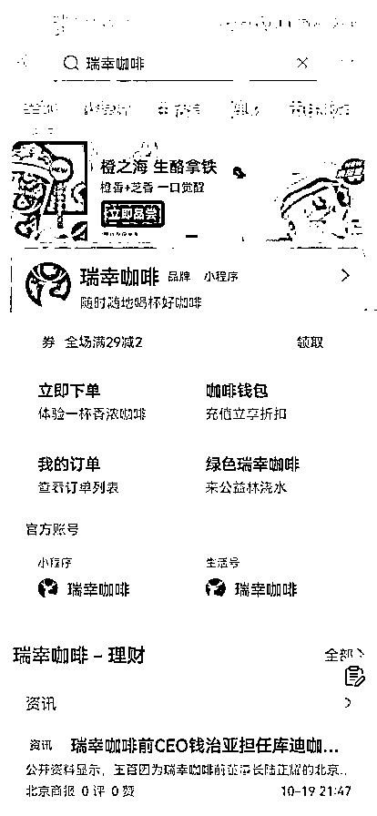

3.小程序直达

位置在搜索关键词旁边，服务推广，每个服务可以创建 3 个服务关键词，增加命中机会 

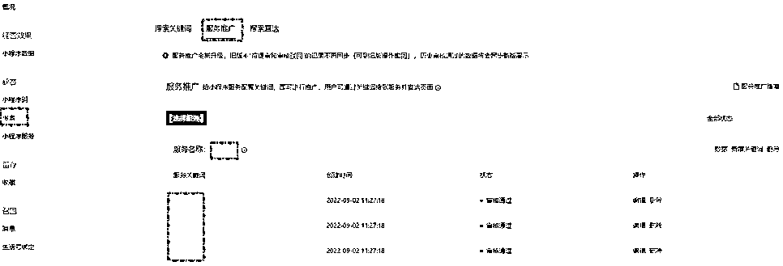 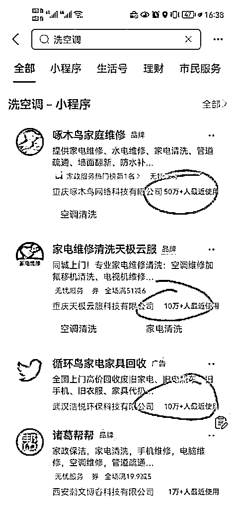

创建服务，按照要求填写即可，一般隔天出结果，审核通过率比微信搜一搜高多了，而且支持多平台服务创建（高德、uc、夸克等，这块在外部流量部分分享）

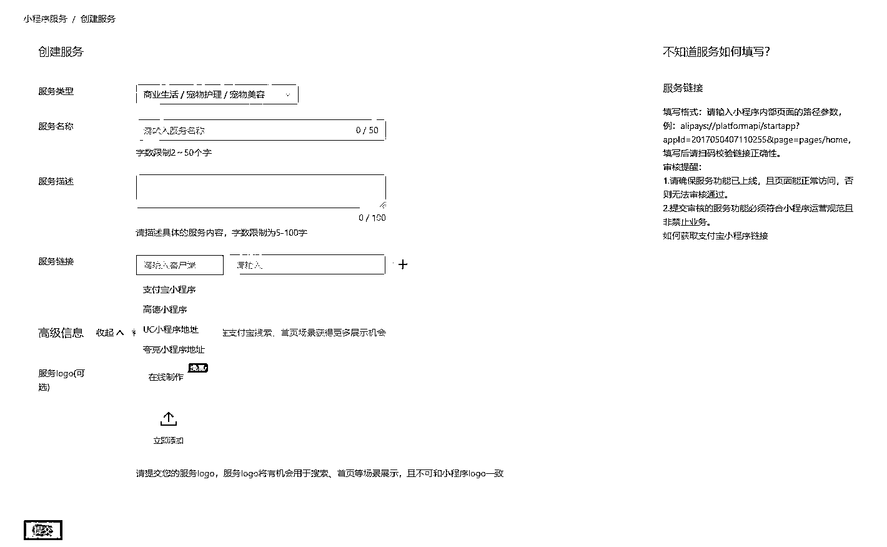

**3.**消费券推广

**H5**

通过营销权益，帮助商家获客转化。

配置：运营中心-公域推广-优惠券推广、会员卡推广

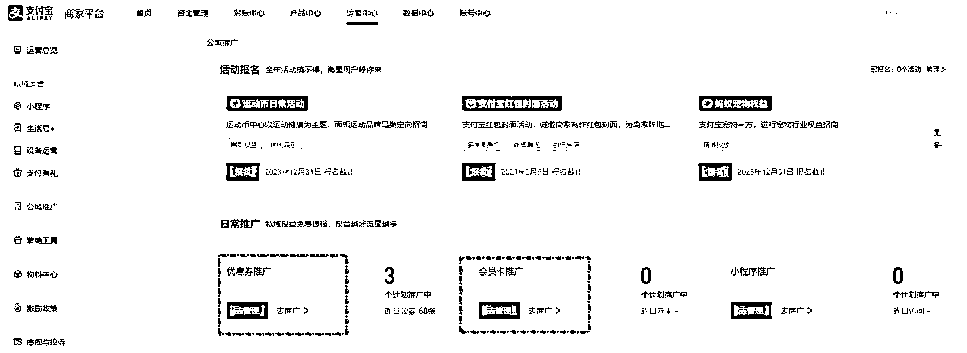

展示路径支持：支付成功页**(**支付有福利**)**、消费券频道**feeds**推荐、首页超值特惠、搜索推荐

营销形式支持：活动营销（获客-直领券、获客-团购券、复购-券包）、会员营销（拉新-入会礼、安心充-会员留存、付费会员卡-会员特权）

推广模式支持：附近发券（门店周围 3-5km），全城发券（指定城市）

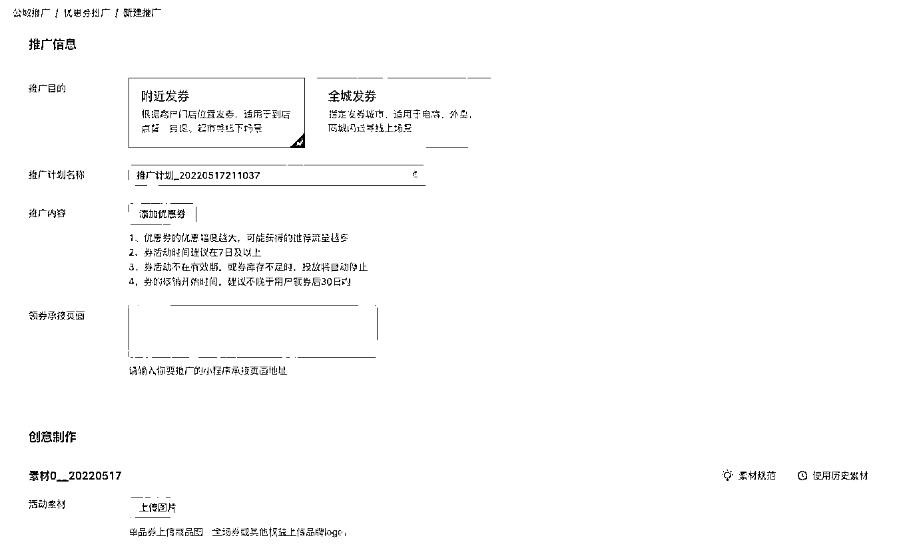

**4.**支付成功页

**H5**

支付成功页可领取优惠券，可显示本店优惠券，也能在其他商家支付页面显示自己的优惠券，复购与拉新并存

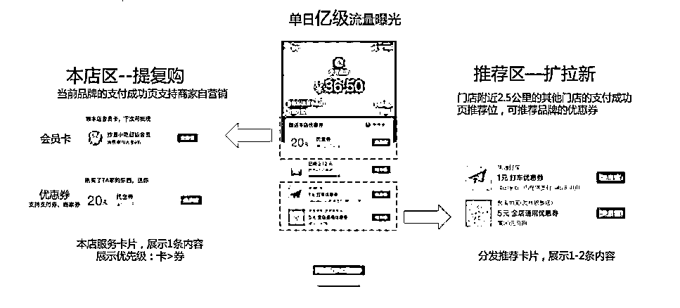 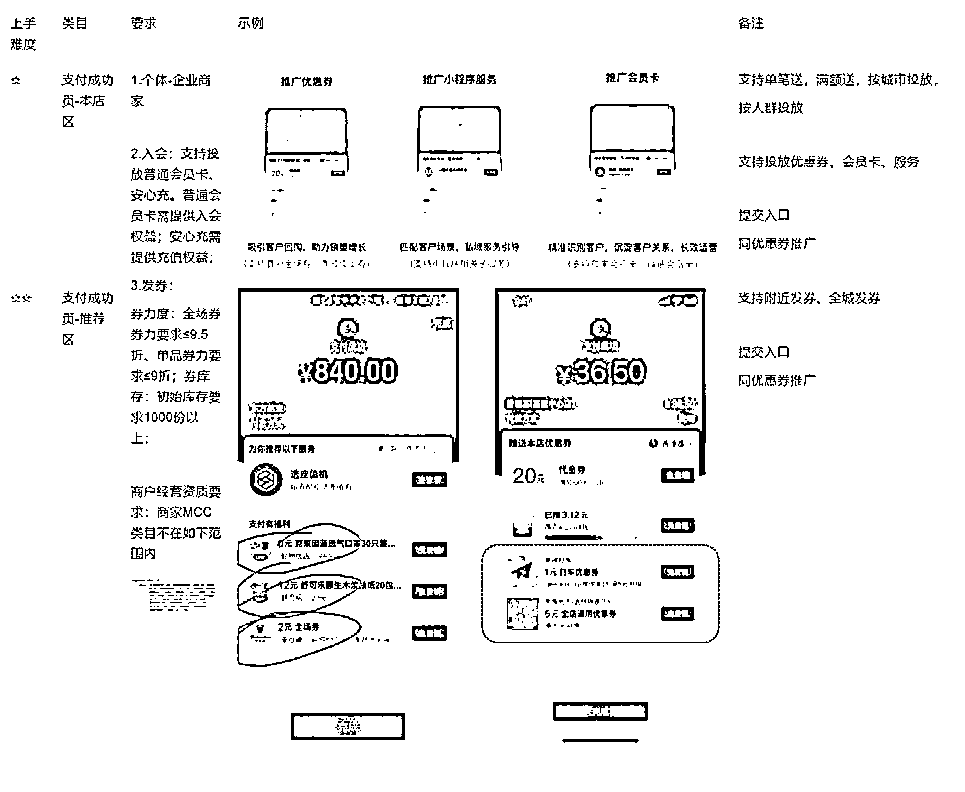

**5.**生活频道

**H5**

基于生活号的内容（视频笔记直播图文）展示及挂载（服务、小程序、POI），和抖音很相似，这块没有深耕，感兴趣的可以研究

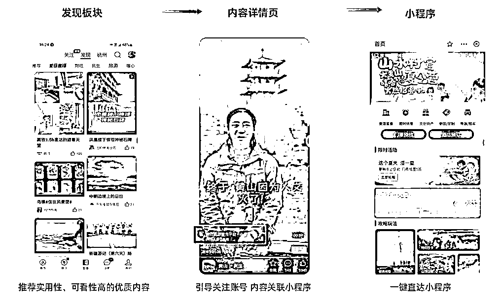

**6.**会员频道

**H5**

结合上面的推荐、搜索各种玩法，结合线下，实现会员生命周期运营

会员卡和微信的也比较类似，不同的是可以很好的实现付费和储值，减少开发

常见的一些打法：

会员拉新：公域投放，搜索展示，接入 lot 支付、支付推荐等方式，实现公域拉新会员留存：配置会员权益，入会有礼（支付券、商家券），充值即会员，付费即会员等会员促活：在首页及消息里推送类似微信模板消息，推送支付消息、会员消息、优惠券等消息，实现促活；会员卡跳转小程序等

**7.**繁星计划投放

**H5**

商家公域投放激励政策，商家消耗激励点数在投放位进行推广，包括不限于首页、消费券、搜搜页、搜索结果页、支付成功页等，详见搜索推荐相应内容

报名地址 https://b.alipay.com/page/policyCenter/policyContent?policyCode=20211229294532574&policyType=FLOW_POLICY&policyVersion=0 

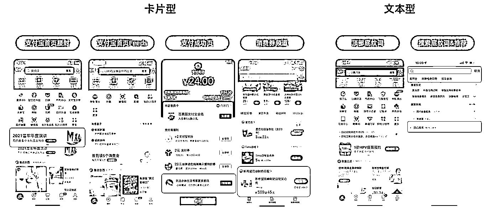

**8.**商业化投放

**H5**

类似微信广点通，可按照 cpc、cpa 和 cpm 计费

后台：https://adpub.alipay.com/

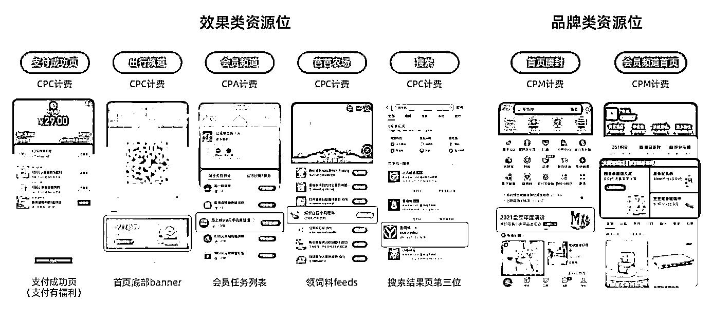

# 私域：

包括收藏引导、生活号、订阅消息、群用户、小程序、商家会员、门店、线下物料、LOT、多平台（社交、内容、电商、O2O）等

重点说下生活号

**H5**

1.可设置默认显示品牌信息，包含服务、优惠券、小程序、商品，用户进来实现第一时间流量转化，有点像抖音蓝 V；可设置首页推荐官方小程序

设置：运营中心-生活号+-主页设置

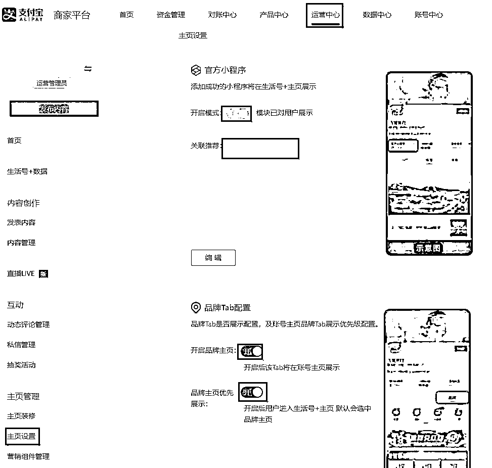

2.直播

目前无人直播限制不多，做无人直播的可以尝试同步这个平台

3.主页装修

支持优惠券，咨询，小程序的灵活跳转，对小程序转化极为友好，可以结合生活号的运营，拉升小程序服务和优惠券的数据表现，提升推荐和搜索展现

支持图片菜单、广告 banner、营销组件、商品组件、pk 投票、服务组件、生活圈、自定义菜单、外链等配置形式

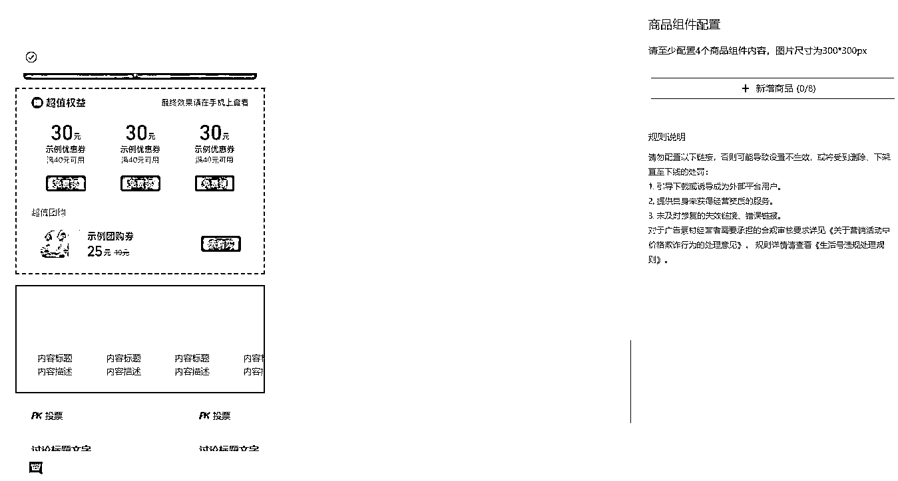

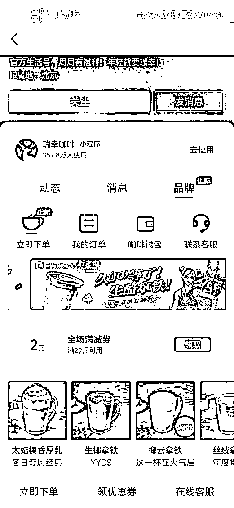

4.外链直发

和公众号不同，无需第三方开发对接，即可实现群发直接跳转小程序、卡券，可通过关注、菜单、关键词回复触达目标落地页，并支持群发

配置：生活号+-素材管理-新建图文消息-跳转到网页

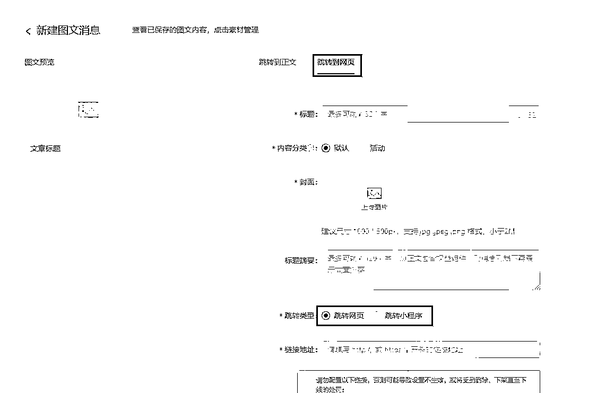

5.几个运营工具

抽奖活动、关注有礼（相当于公众号的关注送优惠券，也是无需第三方对接的，直接后台创建）、关注组件（小程序、H5 一键关注生活号）、生活号服务、卡券

灵活运用好，对私域运营帮助不小

# 4.2 外部流量

还记得前面说的流量布局吗，打通了很多支付宝生态的渠道

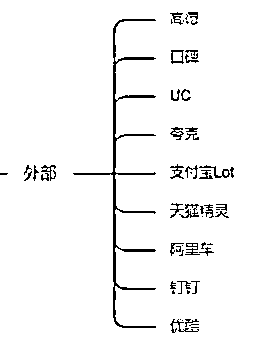

以小程序为例

1.登陆支付宝开放平台 https://open.alipay.com/，小程序可在多个平台进行发布展示，实现一鱼多吃

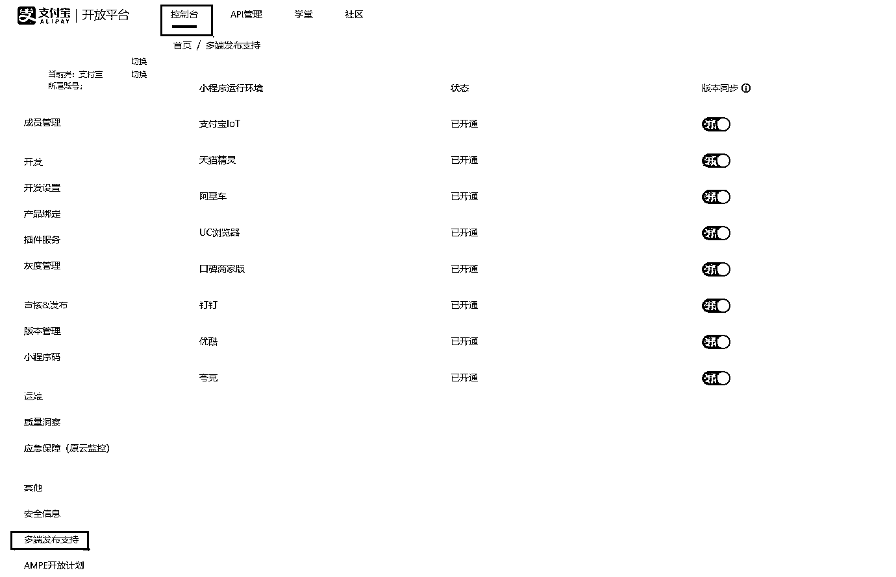

2.创建小程序服务时，可以在多个平台提交服务（不能重复），通过其他产品的搜索流量，躺获用户

3.平台生态深度对接，以高德为例，有相应的接口，把小程序数据直接通过 POi 展示。

比如你做了个家政服务的平台型小程序，通过高德对接，可以在高德地图每个入驻的家政公司，展示商家小程序商品，坐庄抽水不干活

个体/商家，我之前在实体店如何有效互联网化中分享过，开通口碑之类的就行了，自动同步高德，地图转化为 lbs 订单

如涉及一些表格排版和超链接，或者图片抽风，点击查看

https://p9rxk6ovll.feishu.cn/docx/Tu7uda7qWoKCj1xvMlmcbtfBnqh 评论区：

糯米糕 : 支付宝小程序和生活号被动引流的数据真的很不错，妥妥的就是钱，实体店太需要了[强]

封伟-自动化变现 : 感谢支持，营销的玩法确实多，可能深度运营的不多吧，竞争不算太大

潮州痞子蔡 : 请教下这个下单是在小程序直接下吗？你做的是什么方向的类目？

封伟-自动化变现 : 小程序下单，商业咨询类目
