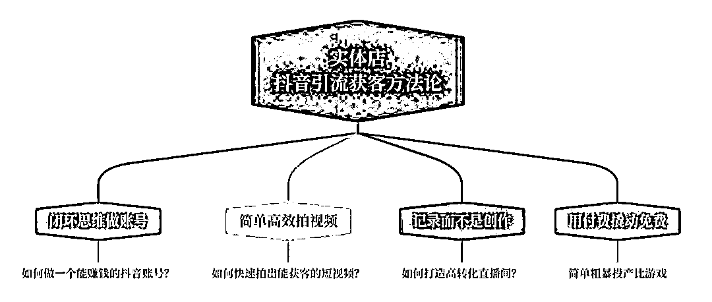

# (7 赞)实体店越来越难做，2023 年如何抓住同城流量红利，用抖音引流获客？

作者：  杨思思

日期：2023-03-17

最近在和实体企业老板们聊天时发现，线下门店生意越来越难做。

自己的产品有多好，品质多高，价格多实惠，但是消费者并不买单。

其实这不能怨消费者，因为现在选择实在太多了。

在京东、淘宝、拼多多，随便搜一个关键词就有几百上千页的产品。

出门想吃个火锅，也有老北京涮肉、冰煮羊、老火锅、楠火锅、凑凑火锅、蛐蛐火锅……产能过剩，产品雷同，商家越来越内卷，消费者也被整的眼花缭乱。

现在开实体店，如果还像过去那样坐在店里等着顾客上门消费，就像在用旧石器时代的打法 PK 飞机大炮。

对于实体商家来说，拥抱线上，布局短视频和直播，已经不是 yes 或 no 的问题了，而是生存必须。

产品好，不会卖，是很吃亏的。

如何用好线上流量，拓宽获客渠道，是所有实体店老板必须要掌握的一项硬技能。

今天和大家分享一套实体商家如何用抖音引流获客的方法论，希望可以帮助你用好抖音这个流量放大器，突破获客瓶颈，让你的生意逆势增长。

**1. **闭环思维做账号：如何做一个能赚钱的抖音账号？

普通人做短视频账号的最大误区，就是一开始没想好怎么变现，吭哧吭哧拍了几条视频，没播放没点赞没涨粉，就觉得此路不通，匆忙开始，草率结束。

这种做法又浪费时间，又消磨信心。

企业老板、实体店主，做抖音一开始就要有闭环思维，要打造一个从第一天开始就能变现的账号。

企业和个人做短视频是完全不同的逻辑。

个人做短视频是要打造网红，要先涨粉，有了粉丝才能变现。

而企业不一样。你是企业老板，你本来就有产品。

你的视频只需要满足两点：1.简单，2.粗暴。

简单，就是视频的制作不用太复杂，最好可以批量化生产。

粗暴，就是突出卖点，你做内容的目的，就是围绕用户的痛点，和自己产品的卖点。通过流量形成转化，完成变现。

企业做短视频的逻辑，一定不是追求涨粉，而是直接变现。

做抖音的顺序是先产品，后流量，先形成 0-1 的小闭环，然后再通过抖音的流量进行放大。

对于实体店老板来说，这反倒更容易，因为你本身就有产品，只需要思考如何排列、组合、包装，让自己的产品以更适合这个平台的方式呈现在消费者面前，从而形成购买转化。

**2. **简单高效拍视频：如何快速拍出能获客的短视频？

前面提到，商家拍短视频只需要思考：

如何让自己的产品以最适合这个平台的方式呈现在消费者面前。

那什么样的产品适合在抖音平台呢？

给你三个关键词：超级实惠，超级好看，超级专业。

**2.1 **超级实惠

比如 Tims 咖啡 39.9 元的“Tims 什么都有”套餐，1 元、9.9 元特惠单品，低价引流到店，销售话术升单。

**2.2 **超级好看

好看有两个维度：

一是短视频呈现效果好，不一定非要美，很丑，丑得很别致也可以。这一点建议实体店老板多刷刷探店达人的视频，学习他们拍摄的画面、构图、角度、声音。

二是让消费者拍出来好看，稀奇独特，让人见到就想拍下来发朋友圈。让用户有晒的欲望，激发分享，传播裂变。比如楠火锅、荣记的海鲜海盗船：

**2.3 **超级专业

你需要让消费者感知到你在这个行业里很专业，比如“我在郑州修车 20 年”，“我卖茶叶 15 年了”，“顾客开车 2 个小时到我店里”等等。

短视频无非是“画面+声音+文字”。

你的用户有什么痛点？你的产品有什么卖点？你需要放大用户需求，用你产品的好处来满足这种需求。

卖点有哪些？比如性价比高，服务好，品质高，老板很实在。

在视频结尾需要加上行动引导，发布视频时加上门店位置，引导用户到店消费，形成闭环。

做短视频一定不是自嗨，获取客户、让用户到店消费才是核心目的。

做成交，而不是做内容。

**3. **记录而不是创作：如何打造高转化直播间？

直播其实是个非常消耗人的工作，好的直播间对主播的依赖非常高，好的主播可遇而不可求，相应的成本也会很高。

普通实体店其实并不适合这种高开高举的直播间打法，而是要尽量做到低成本，可复制。有个比较讨巧的做法，就是记录：

1.记录生产过程

2.记录使用过程

比如天津的“小齐四个菜”，直播就是厨师炒菜、聊天，安徽的“小胖卤味”，就是把手机架在柜台上，拍顾客排队买单。

同城直播间并不追求流量有多大，很多实体店老板抱怨开直播没多少人，但是你线下门店每小时能来多少人？这个逻辑其实是相通的。让顾客能在平台上看到你，有停留和互动，感觉你的产品不错、付费下单、然后划走，和线下其实没什么区别，就是多一个销售渠道。

**4. **用付费撬动免费：简单粗暴投产比游戏

形成 0-1 的闭环之后，可以通过投放，用付费流量来撬动免费流量。

投放的核心其实不是花钱的多少，而是素材。

好的素材可以事半功倍，只有你的素材本身能带来转化，才值得花钱投放，放大收益。

目前同城的投放更适合在全国有连锁店的品牌商家，本地商家可以在短视频做好的基础上少量测试，逐步放大。

投放没有唯一正确的做法，基本逻辑就是，只要 ROI 是正的，就可以继续投。

如果大家有需要，后面我也可以专门写一篇如何做投放的攻略。

2023 年是实体商家借势同城流量的黄金期，希望大家可以抓住风口，用好抖音这个流量放大器，突破获客瓶颈，让你的生意实现逆势增长。

评论区：

暂无评论
