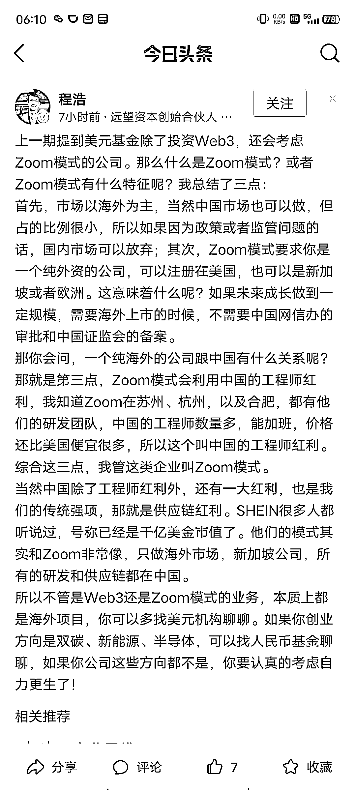

# 1.1.2 创业者的蓝海赛道

马斯克曾在一个采访中说：

我在大学时，思考的第一个问题是：什么可以影响人类的未来。

得到的答案是：互联网、人工智能、可再生能源、太空探索和地外生命、基因工程。

如果你是一个想做大的互联网创业者，最好看看目前 VC 的判断，VC 看赛道，创业者做经营。专业的人做专业的事。

VC 视角，现在的几个大赛道：国内看双碳、新能源、半导体等硬科技。海外看 Web3 。

