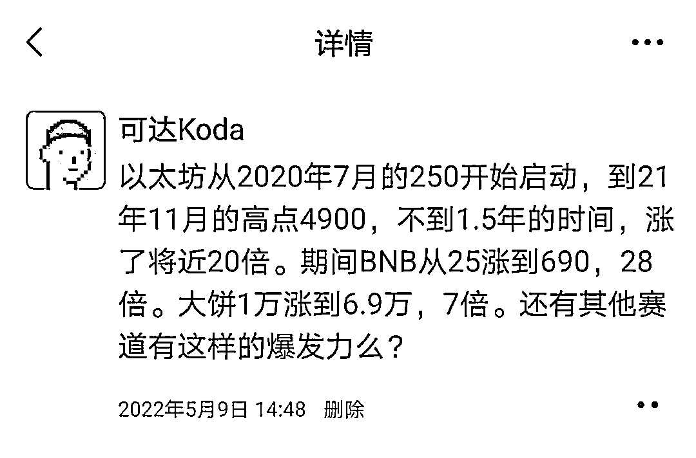
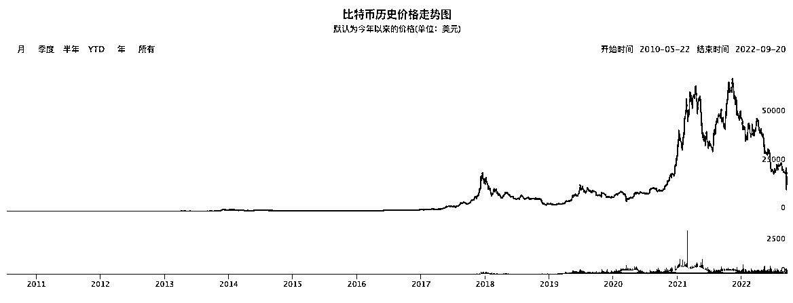

# 1.1.3 投资者的新渠道

我们自己经历了股票、房产的投资以后，看到了 Web3 相关的投资，形成了鲜明的对比。这是看过去两年的历史。

如果看过去十年的历史，全球涨幅最大的资产是什么？毫无疑问是数字资产比特币。这些是数据，是客观发生的事实。

期间美股龙头：苹果 90 到 150，1.7 倍；谷歌：1460 到 2900，2 倍。A 和港，负增长。

正如我们在开篇时提到的，本手册不构成任何投资建议。这里只是提供给了我们一个投资理财配置的新渠道可能。

记得当年 BTC China 的 CEO 当时和还是 Web3 小白的赵长鹏的介绍数字资产时的对话挺有趣。拿出 10% 的资产换成 bitcoin，归 0 的可能性非常低，更可能的是翻 10 倍，如果 10 倍了，你的资产就翻倍了。

赵长鹏听到以后先是卖了自己上海的房子买了比特币，然后又开始了 Web3 创业。

现在，赵长鹏成为了 Web3 世界最有钱的男人。福布斯全球富豪榜 TOP 20。

