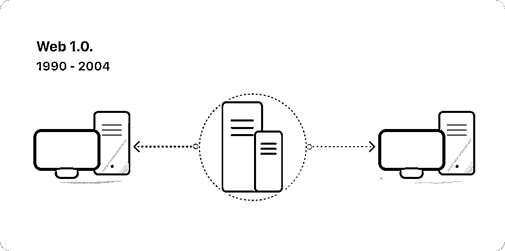
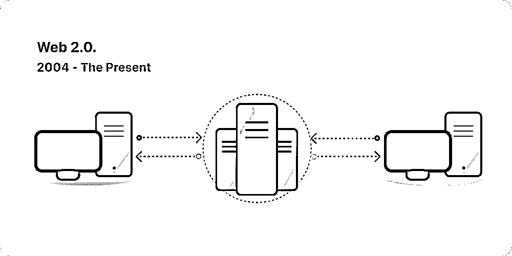
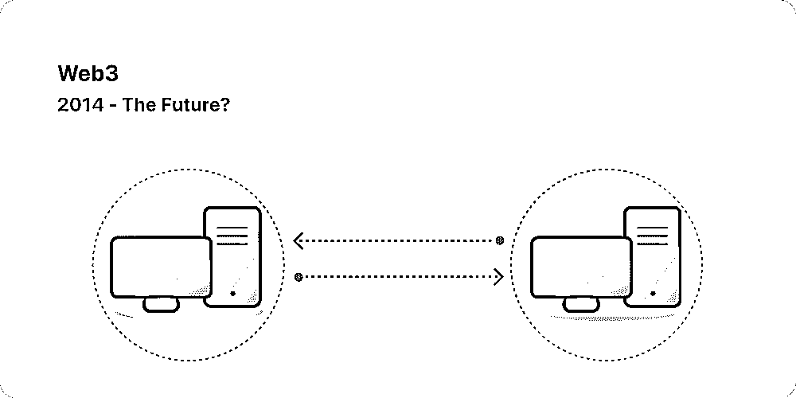

# 1.2 Web3 是什么？

Web3 理念：去中心化、无需许可、原生支付、无需信任

时至今日，Web3 已成为一个包罗万象的术语，代表了一个新的、更好的互联网的愿景。Web3 的核心是使用区块链、加密货币和 NFT， 以所有权的形式将权力交还给用户。

因为行业处于非常早期，尽管目前对 Web3 是什么，进行严格定义依然具有挑战，但仍然有一些核心原则指导着它的创建，主要包含以下四点：去中心化、无需许可、原生支付、无需信任

•Web3 是去中心化的：Web3 网络不是由中心化实体控制和拥有的，其所有权属于构建者和用户。

•Web3 是无需许可的：每个人都拥有有平等参与 Web3 的权限，没有人被排除在外。

•Web3 具有原生支付功能：它使用加密货币在线消费和汇款，不依赖于传统银行或者其他有着类似于银行功能的第三方机构。

•Web3 是无需信任的：它使用激励和经济机制运行，不依赖于受信任的第三方。

说到这里，大家可能还是比较蒙，不要紧，下面继续带大家抽丝剥茧，追本溯源。

为了更好的理解 Web3 是什么，我们可以先来看下 Web3 相对于 Web1 和 Web2 的定义对比。

Web1：只读网络

Web2：读写网络

Web3：读、写、拥有（价值网络）

按照目前的定义，概括来说，Web1 是只读网络，Web2 是既能读，又能写的网络；而 Web3 是既能读写，又能拥有网络信息产权的网络，也有很多人因此将 Web3 称为：价值网络。

展开来看从 Web1 到 Web3 的网络演进。

1989 年，在日内瓦的 CERN，Tim Berners-Lee 正忙于开发后来成为万维网的协议。他的想法是创建开放的、分散的协议，允许从地球上的任何地方共享信息。

Berners-Lee 的创造，现在被称为 “Web 1.0”，大约发生在 1990 年到 2004 年之间。Web 1.0 主要是公司拥有的静态网站，用户之间的互动接近于零 —— 个人很少产生内容 —— 它被称为只读网络。

随着社交媒体平台的出现，Web 2.0 时期开始于 2004 年。Web 不再是只读的，而是演变为可读写的。他们不再是公司向用户提供内容，而是开始提供平台来共享用户生成的内容并参与用户与用户的交互。

随着越来越多的人上网，少数顶级公司开始控制网络上产生的不成比例的流量和价值。Web 2.0 也催生了广告驱动的收入模式。虽然用户可以创建内容，但他们并不拥有它或从它的货币化中受益。

Web3 这个概念，是在 2014 年由两家头部的区块链公司，Polkadot 的创始人以及以太坊的联合创始人 Gavin Wood 在 2014 年提出的。他们提出的问题是：现在的 Web2 网络需要太多的信任。也就是说，今天人们所知道和使用的大多数网络，都依赖于信任少数的私营公司。希望通过 Web3 解决用户拥有网络信息所有权的问题。

所以 Web3 是什么？——价值网络，用户真正拥有其信息的所有权。

下面我们通过一些实例来理解 Web1、Web2、Web3 的区别。

1）Web1 代表性的互联网产品，也就是在 PC 互联网时代的巨头，像海外雅虎、谷歌，国内的门户网站，搜狐、网易。这些网站的作用是用来聚合信息，然后用户可以在网站上点击浏览信息。

2）移动互联网的出现，让信息的产出不仅限于门户网站，全球数亿的用户成为了信息生产的节点，用户不仅能在互联网上获取信息，还可以自己生成信息。比较有代表性的产品，国外的 Facebook、Twitter，国内的微信、抖音，都是 Web2 时代的互联网产品。这些巨头平台，一端承载了足够多的用户，另一端对接商家通过广告实现商业化闭环。典型的平台型经济模型。本质上是平台通过给用户提供免费的服务获取海量用户，然后未经用户允许，卖把用户的信息卖给商家赚钱。

3）那 Web3 是什么呢？Web3 的核心在于用户拥有自己在互联网上的信息产权。信息从用户产出的那一刻起，就确权给了用户。Web3 是所有者的经济。现阶段，用户不需要依存于各大平台中自己注册账号。用户生成了自己钱包以后，就可以使用钱包在 Web3 世界的各类应用中畅游。钱包的概念和使用我们后面会解释。理论上来说，你的钱包只属于你自己，不属于任何的公司和组织。如果在 Web2，你玩的游戏被封号了，或者游戏公司倒闭了，那么你的虚拟资产也就损失了。但是在 Web3 不会，是你的就是你的，公司倒闭了，各类信息资产还是在你的钱包中。这，就是 Web3 的特点，核心是强调用户的信息所有权，原生的价值网络。

