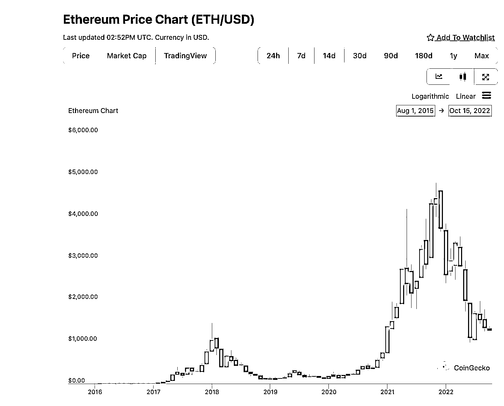

# 1.4 案例分析：Web2 vs Web3

上节，我们讲到了 Web3 解决了什么样的问题，从 Web3 的视角看目前 Web2 有什么问题，并提出了 4 个问题留给大家思考。

这节，我们聊下 Web2 和 Web3 的经典公司，以具体公司作为案例对 Web2 和 Web3 进行对比帮助大家来理解 Web2 和 Web3 有什么不同？

Web2 我们用的公司是谷歌，旗下有安卓操作系统、谷歌搜索引擎、YouTube 视频网站等系列产品，可以说是 Web2 世界的巨无霸。目前市值 1.3 万亿美金，在全球科技公司中，市值仅次于苹果和微软。

Web3 的公司，我们选取的是以太坊。是目前 Web3 最大的生态公司，市值 1600 亿美金，仅次于比特币，排在第二位。

为什么选这两家公司作为案例进行对比呢？因为这两家公司在一定程度上可以做类比，都是非常有代表性的生态公司。

之前经常有人问我，以太坊是什么？我如果说，以太坊是一家去中心化的开源的，使用智能合约的区块链平台大家肯定听不懂。所以我想来想去，用下面这种方式来解释，虽然不是最恰当的，但是很容易帮助不了解 Web3 的人理解：

以太坊是 Web3 的安卓。当然，在网络的架构上会有区别，这点在区块链技术和 Web3 基建这一章节上我们会详细讲解。大家可以先这样简单理解。

我们主要从下面的这个框架去看 Web2 和 Web3 的公司：

•商业模式

•扩张方式

•融资方式

•投资人获得什么？风险是什么？

1.先来看商业模式

任何一家商业公司，其商业模式无外乎回答下面这个简单的问题：为什么人提供什么产品或服务，解决什么问题？出售什么？收多少钱？注意，这里面的要素缺一不可。

对商业没概念的同学，可以尝试自己套用下这个框架里的要素，问问是不是所有的商业公司都按照这个框架套进去。

有的同学可能会问，不对啊，我用谷歌、百度、抖音、微信这些，商家都没收我钱呀？那他们是不是在免费给我提供服务，没有收钱呢？答案是不是的。这是用户的视角。

任何一家商业公司，都是一定要盈利的。即使，他阶段性的免费，最后肯定也是要从你身上获取点什么的。

如果从平台的视角来看，我们以抖音为例：他的商业模式是，为用户提供短视频内容，然后出售用户的精力给商家，通过赚商家的广告费来变现。

这几乎是所有平台型互联网的商业模式。

回到谷歌，谷歌的安卓系统，也是一样的。用户虽然可以免费使用使用安卓操作系统，但是谷歌是要从商家收费的。本质还是把你的精力或者数字资产出售给商家变现。

那以太坊的商业模式是什么呢？简单来说，为商家和用户提供一个安全可信的网络。然后，以太坊不像 Web2 的公司那么鸡贼，挂羊头卖狗肉。而是在最开始的时候就说好收费规则，而且写到合同里，说好了就不改。

用户要使用我的网络，你就要支付手续费，商家要使用，也要支付手续费。就是这么简单。

拓展阅读：[《区块链盈利模式（解读以太坊将是第一条盈利的区块链）》](https://www.yuanyuzhouneican.com/article-142940.html)

2.然后看扩张方式

无论是谷歌还是以太坊，都是有规模效应的。所谓的规模效应就是，你越强，用的人越多，平台越大，用户和商家都无法离开，进而形成垄断。或者说，使用的用户越多，平台能聚合的商家就越多，商家越多，用户体验越好，最后形成垄断。是非常好飞轮模型。

两家公司的增长方式，我觉得本质上没区别，都是花钱去优化产品，花钱做用户增长。前者用的是美元，我们通常将国家发行的货币叫法币。后者多数时候用的是自己发行的货币。

主要的区别在于理念。Web3 的用户，是心中有去中心化理想的。

3.融资方式

我觉得 Web2 和 Web3 的最大形式上不同，就是在融资方式。这是我的观点。大家可以自己思考下。

这里需要先给大家介绍两个概念。IPO 和 ICO 。

IPO 是首次公开募股的缩写，Initial Public Offerings。简单解释下就是，一个 Web2 的公司，向普通的投资者发行股票的过程。股票发行以后，普通投资者觉得这个公司的股票未来有增值空间，就可以花钱买了。虽然叫首次公开募股，但实际是发行之前，公司的股票就已经有一部分出售了机构。

普通的个人投资者在购买股票时，多数是在接机构的盘。这几个词的关键我觉得不在首次，而是在公开，公开募股意味着之前非公开卖给了机构。个人投资者是很难获得在股票交易市场上市前的公司股权的。尤其在 Web2 融资烧钱搞规模的商业模式下，都是以超高的估值上市，上市即割。

ICO，是 Web3 专有的名词。首次代币发行 (Initial coin offering)。这里的 coin，既是货币，又是股票。和 Web2 还是非常不同的。这是第一个不同点。

第二个不同点是，如果你把代币当作股票，这个首次是真的首次，直接面向 Web3 的普通用户发行。与其说是首次发行，不如翻译成众筹，这样可能会更好的理解。

第三点不同是，ICO 不需要牌照。目前 ICO 在国内是不被允许的，这里我们先不做展开，会在监管合规的部分详细说。

谷歌融资上市的模式没什么好说的。这里重点给大家讲下以太坊当年 ICO 的故事。

2013 年，那时 19 岁的以太坊创始人 Vitalik 去美国加州圣何塞参加了一个比特币相关的会议，听完了以后他觉得，自己的一个 idea 有得搞，回来就辍学了。

然后他花了 6 个月的时间，去世界各地见去那时候叫区块链，现在叫 Web3 和他有类似想法的团队，以色列、加州、伦敦、洛杉矶、拉斯维加斯、阿姆斯特丹，他觉得大家目前的想法都没有解决比特币当前的缺陷，还是把区块链技术和应用限制在了金融领域。他认为，比特币加上图灵完备的编程语言，这样任何人就都能在上面开发去中心化应用了，而不是仅仅限于金融领域。

当时他把他的 idea 和大家说了以后，没有人理会他。最后他决定自己干，回到家用了 1 个月的时间，就把他的想法写成了白皮书，起名叫以太坊，Ethereum。

白皮书写好了后，他就给身边圈子里的朋友们看，也通过这个白皮书找到了他早期团队的合伙人。

又过了几个月，V 神在 Web3 的全球顶级会议之一：迈阿密的比特币大会上给参会者介绍了以太坊，引起了不小的轰动。然后开始 ICO，最终，为期 42 天的 ICO 募资 31000 枚比特币，售出以太币 60,102,216，以当时的汇率，募集资金约合 1840 万美元。

如果按照现在的比特币价格计算，大概是 6 亿美金，可以说是天价 ICO 了。

当然，早期买入了以太坊的并且长期持有的，现在都获得了超级丰厚的回报。以太坊 ICO 的价格不到 0.5 美金。现在的价格是 1300 美金。不到 10 年的时间，上涨了几千倍。

下面这是以太坊的历史价格走势。大家可以看下。是不是拍大腿。这种涨幅，你当时就算买个 1000 块，现在也有几百万了。Web3 就是经常有这样的机会。

这里给大家个小的工具，大家因为还没有交易所，所以可以用这个网站去看加密资产的价格：coingeko：[`www.coingecko.com/`](https://www.coingecko.com/)

不过在 similar Web3 第三方网站排名更好，全球访问量更多的是下面这个网站，也付上给大家：

coinmarketcap：[`coinmarketcap.com`](https://coinmarketcap.com/)/

4.说到这里，剩下的一个问题，大家应该比较也比较清楚了。可以作为这一节的思考作业留给大家。

Web2 的投资机构和普通投资者获得什么？风险是什么？

