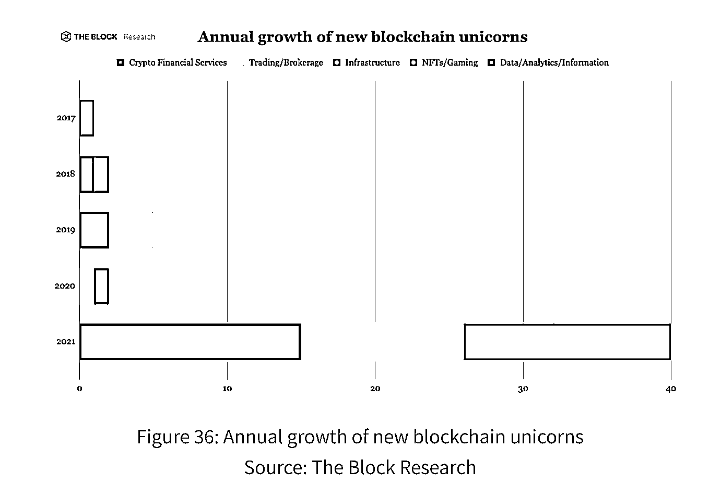
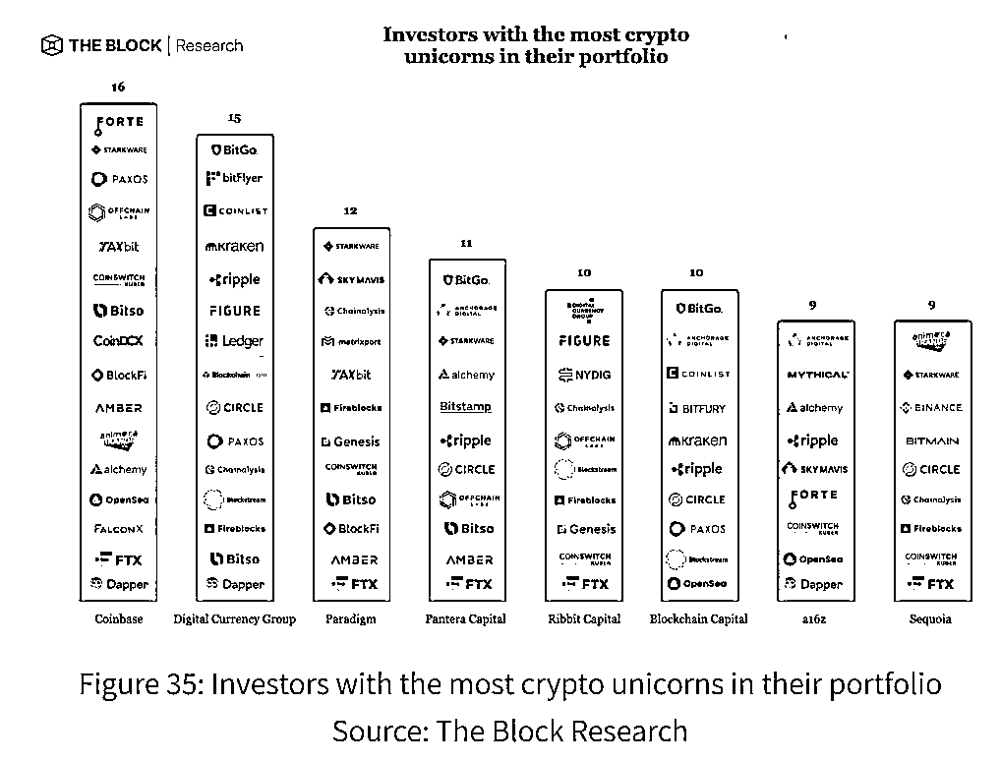

# 1.5 「方法」从资本看 Web3

术业有专攻，专业的人做专业的事情。在看赛道、看公司方面，资本是最专业的。

这里，提供给大家一个方法或者说视角，来看看资本怎么看 Web3，都做了什么？我们如何知道一家 Web3 的公司都被哪些资本投资了？这是一个非常好的辅助我们去判断一家 Web3 公司质量的方法。

从有 Web3 这个赛道以来，2021 年，可以说是资本出手最为阔绰的一年。

根据 galaxy Digital 2021 年 12 月的报告，截止 2021 年 12 月底，风险投资公司对 Web3 相关企业投资规模高达 330 亿美元。

2021 年一整年的投资规模超过了往年对该领域的投资规模总和。

The Block 的这篇研究报告我们看到，整个 Web3 行业的独角兽公司也在 2021 年迎来了井喷式增长。各类 Web3 公司百花齐放，金融服务、交易所、基础设施、NFT、GameFi、数据分析等等。

之前我在做股票投资时，找优质的投资标的，有一个辅助的方法是用烯牛数据去看腾讯战略投资了哪些公司？这些专业机构的筛选，在一定程度上，给二级市场的投资带来了安全垫。

在 Web3 领域中，想要验证什么方向，什么公司更有潜力，我想这种辅助方法也是适用的。看看知名的 Web3 投资机构都投了什么项目？从这张图中，都是在 Web3 非常知名的资本以及他们投资的成功项目。

这些资本包括：Coinbase、Digital Currency、 Paradigm、 a16z、 红杉等等

如果你新知道了一家 Web3 的公司，想看下这家公司是否靠谱，可以用下面这个辅助的方法。

有一个网站叫 Cypherhunter，大家可以在上面看到，都有哪些资本投了这个项目：[`www.cypherhunter.com/en/`](https://www.cypherhunter.com/en/)

举个例子，比如我们上文提到的以太坊，你可以在搜索栏这里输入 Ethereum，然后就可以看到这里介绍说，以太坊是一个去中心化的平台，可以在上面使用智能合约和 Dapp。

再往下，是以太坊的团队以及他们的 Twitter 链接，我们往下翻，可以看到之前提到的 V 神，Vitalik。

然后是 portfolio，portfolio 是以太坊的投资组合，这家公司都投了哪些。

在最下面，我们就可以看到哪些投资人或机构投了以太坊了。

可以再看下最大的 NFT 交易平台，opensea，可以看到 opensea 的投资人和投资机构就非常多了，都是知名机构和投资人。NBA 小牛队的老板库班也投了 opensea。

今年以来，币安的投资公司 BinanceLabs 的投资质量也不错，看 Binance 都投了哪些公司，对我们判断 Web3 公司或者项目，是很有帮助的。

我们看 BinanceLab 的 Portfolio。包括我们前阵子说的 bnb 域名项目 SPACEID，今年的百倍投资项目跑鞋 STEPN 等等。

总结下，今天给大家提供了一个新的视角去看 Web3，从资本的视角去看。

概括来说就是，Web3 的那些知名投资机构，最近投了哪些类型的项目？或者一个新的 Web3 项目，被哪些机构投资了？

以上两点，都可以作为我们判断一个 Web3 项目质量的参考。如果自己要参与其投资，我想可以作为一比较好的安全垫。

