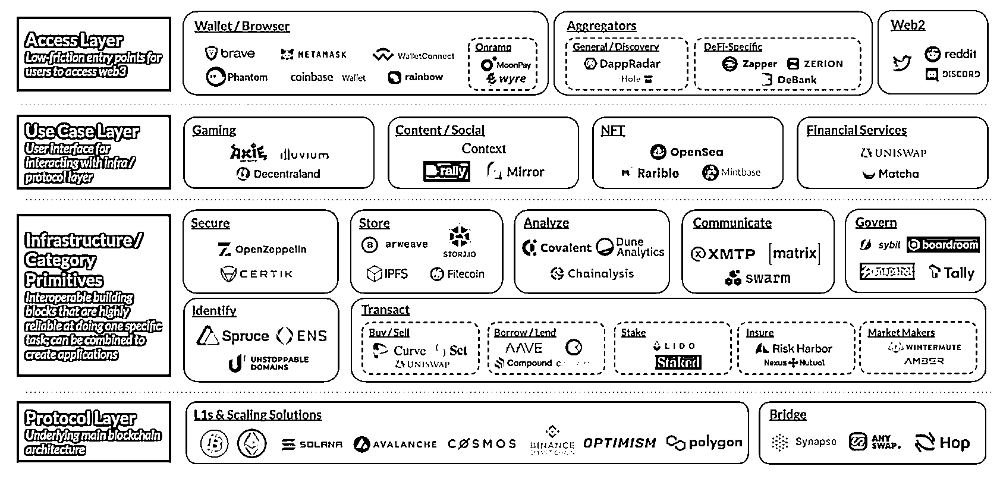

# 2.1 了解 Web3 的框架结构

先来一张图理解 Web3 的框架结构：

[`www.coinbase.com/blog/a-simple-guide-to-the-web3-stack`](https://www.coinbase.com/blog/a-simple-guide-to-the-web3-stack)

前面的内容中，我们提到了很多对大家来说可能比较陌生的概念，比如区块链、基建、智能合约、比特币、以太坊、DeFi、交易所、NFT、GameFi、DAO 等等。

这些都是构成 Web3 的要素。

这章节，我们就用这张结构图，先帮助大家对这些概念做个分层。这样大家在学习 Web3 时，就有了一个整体的框架。遇到一个新的概念，更容易对号入座。

简单来看，Web3 可以分为 4 层：自下而上，分别是协议层、基础设施层、应用层和接入层。这四层的结构，就和建筑物一样，每一层都建立在其下一层之上。

下面用类比法，帮助大家更好的理解这个分层。

我们还是用 Web2 中大家比较熟悉的产品腾讯系来做说明，不够精确，但是有助于理解。

1.协议层

大家使用各类的互联网产品，实际上都是建立在互联网的协议基础之上的。什么是互联网协议呢？我理解它是一种大家有共识的语言标准。

为什么互联网可以连接全世界？因为全世界用的是这一套标准在交流。如同我们无法同一个不懂中文的人对话一样，能够连接和对话的前提是，大家都共识并且使用一套交流标准。这就是协议层。

2.基建层

基础建设层。我们平时在使用腾讯旗下的微信、微信支付、QQ、游戏时，大家有没有想过其背后是怎么运转的？这就是基建层的作用。

我们的使用微信支付，需要后端的记账和处理，同时，我们的支付账户，也需要一套安全的体系去做保障，我们在这些应用上产生的数据要存在这家公司的服务中，数据不仅要存储，还要处理，这就涉及到一系列的工作。

这一类，我们统统将其归为基建层。没有这一层，我们就无法很好的使用我们平时的 APP 和网站。

3.应用层

这一层是最容易理解的，因为离我们的生活最近。我们平时使用的腾讯生态的各类应用都可以算在这一层，无论是微信、QQ、还是游戏王者荣耀。

同理，我们使用的各类互联网产品，也都是按照这样的架构生产出来并给我们提供服务的。

4.接入层

接入层，可以简单理解为，如果使用微信，你需要注册一个微信账号；使用淘宝，需要注册一个淘宝账号。总之，你需要有个身份来去使用各类应用，在 Web2 的世界，或是手机号，或是邮箱。

理解了上面的架构以后，我们再来对号入座 Web3 的各类产品。从架构的分层和演进来看，Web3 和 Web2 并无明显区别。但在具体的理念以及形式上有一定区别。

先来看协议层。协议层这里，我觉得是有一个明显的区别的。

在 Web3 目前有多张网络，每个网络都有自己的一套协议。我们前面提到的以太坊是一张网络，比特币也是一张网络，还有很多其他网络，比如图中的 solana、cosmos、币安，都有自己的一张网络。

Web3 的协议层，如果用多张网络来想不好理解，你也可以这样想：Web2 现在的两大移动端操作系统生态 IOS 和安卓，那 Web3 目前有很多这种生态。头部的是以太坊，币安这两年的币安生态发展的也很快。

Web3 中，我们把这种生态系统叫做链。这个链来源于区块链。分类可以为分为公链、私链、联盟链。这个我们后面的章节会展开讲解。以太坊是以太坊链。币安是币安链。

当然，每个网络也都需要自己基础建设层和应用层。于是，我们就看到 Web3 这张图中基建层和应用层的各类产品。基建层包括安全、存储、身份系统等，应用层目前主要包括游戏、社交、数字藏品、金融服务等。

在接入层，Web2 是我刚才说的你在各 Web2 平台注册的手机、邮箱，注册以后你的数字身份属于各个平台。但在 Web3，每个网络，只需要一个钱包地址，就可以访问全部的应用。

这一点和 Web2 是不一样的，你不需要使用微信的时候注册一个、使用淘宝的时候再注册一个、使用网上银行再注册一个。

有了钱包，你的钱就存在这里，可以用这个钱包地址访问这个网络中的所有应用。

总结下，Web3 的协议层，就像是我们地球的土地，基建层，相当于我们在地上盖了一座楼。

为什么要盖楼呢？因为楼里面要给人们提供各类的服务，比如游戏、建设、购物等等。对应的这些服务，就是应用层。

除此，这个楼还设置了门禁，需要验证下你的身份才能进入。这个身份，在 Web3 就是你的钱包地址。

这个分层架构图，应该可以帮助大家更好把 Web3 的各产品做归类了。以后我们遇到 Web3 的各类产品，就可以用这张图对号入座。

我们接下来的内容，也会按照这个架构，把其中代表性的产品给大家拆开讲解。

