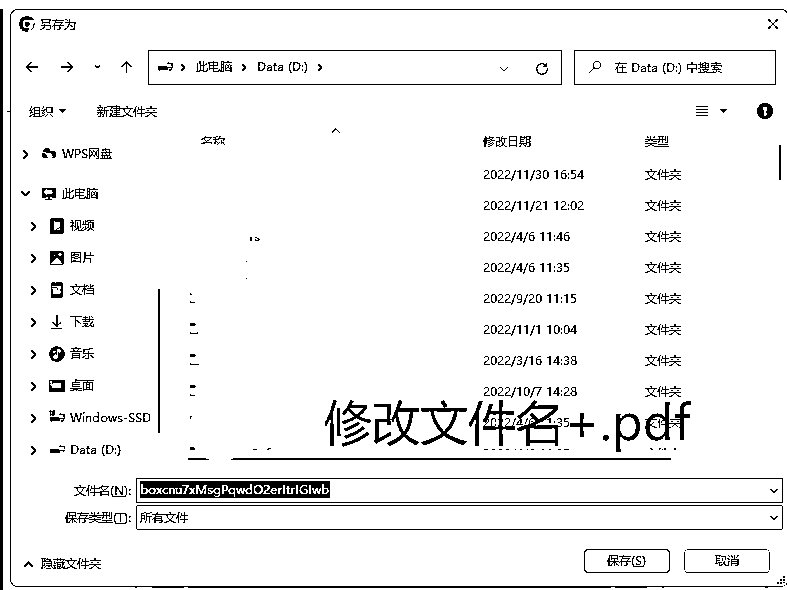
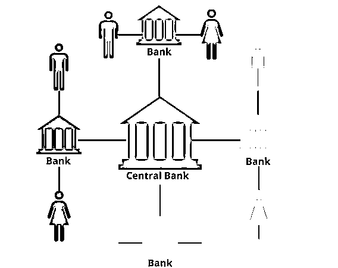
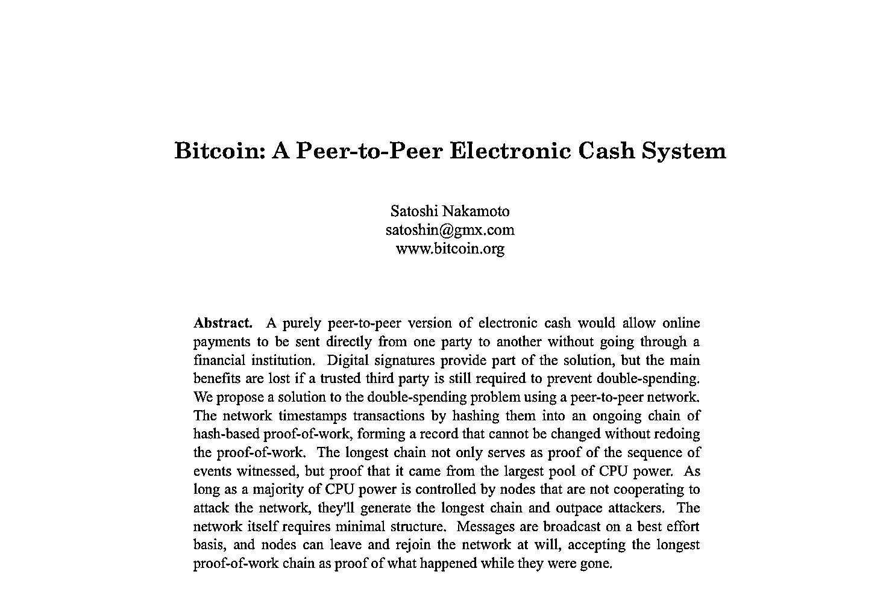
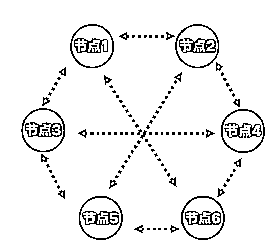
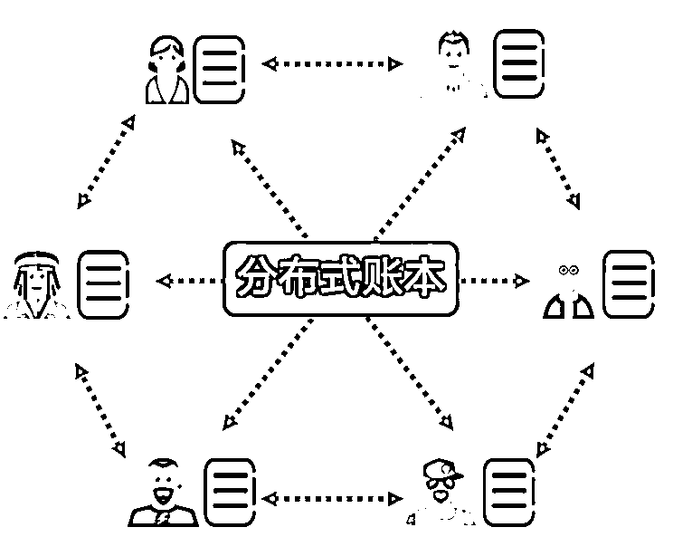
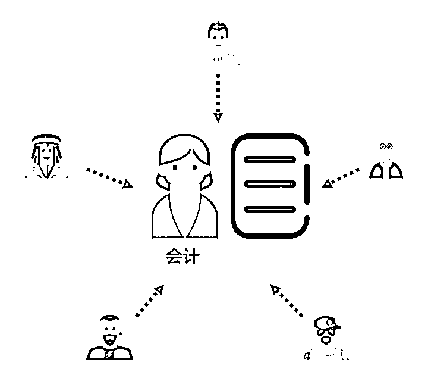

# 2.2 案例分析：区块链技术产生及应用

要了解 Web3，首先要知道 Web3 的关键技术，区块链是什么？

鉴于这是入门内容，这里不会讲具体的技术细节，大家想要深入学习了解的，我们给大家提供了深度阅读的材料，大家可以自行阅读，有问题我们可以在群中交流。

这个视频，会侧重于从该技术到底解决了什么问题以及解决问题的方式去给大家介绍。

区块链技术源于 Bitcoin 比特币，这篇文论是一个网名叫中本聪的极客，在 2008 年发表的。从其标题可以看出，这是一篇定义了一个新概念的文章。Bitcoin 比特币，一种点对点的电子货币系统。区块链的技术就是从这篇文章开始为人们所熟知。

这里附上《比特币白皮书》，作为大家的深度阅读作业，建议大家可以多读一读：

[《比特币白皮书》英文版.pdf](https://search01.shengcaiyoushu.com/upload/doc/KS1WdDWSDogQNmxGRDNc1gXRnEb/WDaobFf44o4V6Nxp8n8cVspcnTD)[《比特币白皮书》中文版.pdf](https://search01.shengcaiyoushu.com/upload/doc/KS1WdDWSDogQNmxGRDNc1gXRnEb/Jfs9bYicCoRNj4xMkQHcMHOQn6e)

注：如果下载后无法打开，或文件名为乱码，请自己修改文件名，并添加后缀「.pdf」，并将「保存类型」选择为「所有文件」:

一遍读不懂很正常，可以多读几遍，慢慢就懂了。

这里会我们尝试回答下面几个问题：

•比特币，区块链技术的提出想要解决什么问题？为什么需要区块链技术？

•解决方案是什么？

•区块链技术有哪些特点？

1.首先来回答第一个问题：区块链的提出想要解决什么问题？

如果你去耐心阅读了比特币的白皮书，其实可以发现，中本聪当时提出比特币这个概念，想要解决是，一笔钱同时花到两个地方的问题。我们叫“双花”。为什么会出现这种情况？

首先，我们需要了解下，我们现有的货币体系是什么样的？

上面这张图，就是我们现有的货币体系，一个中心化的交易系统。这个系统中，有很多的用户和银行，背后大家都是通过一个记账、清算系统来完成的。

银行最核心的业务，如果用两个字概括来说就是：“记账”，不能记错，也不能记假账。

但在数字时代，中心化管理的数据库，是有各种可能被篡改的。

有哪些种可能呢？我们可以想象下下面的场景。

第一：中心化的银行真的可信么？我们的钱，在银行的记账系统中无非是一个数据。且这个数据对我们是不公开的。实际情况是什么，对个体来说是未知的。

第二：中心化银行真的足够安全么？为什么在经济危机时，一些国家的银行取不出钱了？

第三：guo/家背书靠谱么？银行的背后是 guo/家背书，像美国和中国这种强国，guo/家背书相对靠谱。但在一些第三世界的 guo/家，guo/家的局势很不稳定，他们 guo 家的货币的汇率波动可能比我们 guo/家的股市波动幅度还要大。或者有些 guo 家，直接破产了。那这样的背书还有意义么？这是现实存在的问题。

以上是我能想到的一些情况，当然还有其他更多的情况，大家也可以发散思考下。

于是，中本聪提出了，跨过中心化机构，直接在用户之间点对点支付的去中心化的货币系统的解决方案。

2.接下来看，区块链技术到底是怎么解决这个问题的？

区块链这个词不太好理解。是直接从英文 blockchain 翻译过来的。

我们把他拆开。block 区块和 chain 链。block 可以理解为信息块。区块链，就是由前后连在一起的信息块构成。

替换成和大家生活有关联的词。区块就是一个不断生成的子账本。这些账本通过一种特定的算法（哈希算法）前后连起来，形成了一个总账本。通俗的讲，区块链技术并不神秘，就是一种不可篡改的新的记账技术而已。

简单概括来说，解决方案如下：

•既然由中心化机构管理存在这种问题不靠谱，那么就不用他去管了

•我把这个数据库的管理权交给所有人，大家一起记账维护这个账本

•每个人手中的账本必须和其他人的一样才算有效账本

•所以，网络中的每个账本都是一样的

•且，没有人可以私自篡改账本

如果说中心化的方式是由一个人或者一个系统记账。那么区块链技术，就是用所有参与到这个网络中的人一起记账。发生了一笔交易，大家就全部都记录一次。记账的人可以分布在世界各地。

这种账本，需要吸引到足够多人来记账，也是可以形成规模效应的一种模式，来记账的人越多，网络就越安全健康。

接下来，需要解决的核心问题是：

一个普通人，为什么要做这个网络的建设者，参与记账？

无利不起早，比特币这个系统，吸引大家来参与网络建设的方式是，每 10 分钟给左右发一次红包。

因为这个分布式的记账网络，需要每 10 分钟完成一个子账簿，然后再把这个子账簿加到原来的总账本之中。生成、校验子账本，并确认无误的加入到原来的总账本的过程，需要网络中的计算机贡献算力。大家干了活以后，就有机会可以抢到比特币的红包。

比特币这个系统，通过不断的发红包，完成了他的货币发行。按照白皮书的中的设定，红包要持续发 142 年，开始每 10 分钟发 50 个比特币作为奖励，以后每 4 年减半一次，每个红包的比特币数量从 50 减少到 25 个，然后再减成 12.5，以此类推。

比特币的总量恒定为 2100 万个。红包发完了也不要紧，参与网络建设和维护的节点，依然可以通过网络使用者的交易手续费获益。

参与抢红包的过程，在 Web3 被形象的称为“挖矿”，参与网络建设的那些人被称为矿工。因为抢红包是个概率事件，所以矿工们会集中到一起去挖，集中到一起的计算节点，称为矿池。

这里就顺带把挖矿、矿工、矿池这三个概念给大家解释清楚了。

在比特币网络刚运行的时候，参与的人很少，总算力也很低，那时候随便一台笔记本电脑就可以挖出很多比特币。第一笔的比特币交易是，一个大兄弟用了 1 万个比特币买了 2 个披萨。现在 1 万个比特币的价值：2 亿美金，峰值是 7 亿美金，这两个披萨，可以堪称史上最贵的披萨了。

3.有哪些特点

基于以上，如果我们非要概括下区块链的特征，我觉得只有两点：

•分布式解决方案

•不可篡改

至于去中心化，公开透明，我觉得都是分布式解决方案的结果。

这个技术的诞生，是为了解决中心化的问题，而采用了去中心化的解决方案，而不是为了在去中心化，而产生了区块链技术。

公开透明，所有人都参与记账了，自然是公开的。但完全公开透明就真的比部分公开透明要好么？我觉得有待商榷，大家可以各抒己见。

