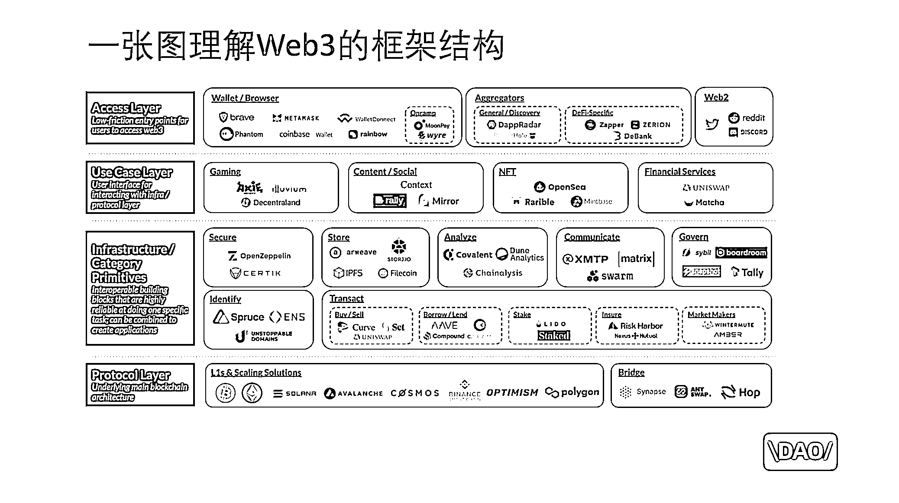

# 2.4 多链生态格局

这节我们来聊下 Web3 底层区块链的多链格局。

以太坊这三个字，我们可以这么理解：

首先，以太坊是一个公司或组织。这个组织的诞生，希望提高去中心化应用的开发问题，让区块链技术不仅限于比特币交易。为了解决这个问题，他们搭建了以太坊这个平台，用于服务开发者，类似于安卓和 IOS 。这个平台可以叫做以太坊。这是第二层含义。然后，和 Web2 的平台不同的是，这个平台是从协议层就注入了自己的金融体系，流通在以太坊生态体系中的代币，叫以太坊或者以太币，或者英文简写 ETH 。这是第三层含义。

代币是中文的翻译，我认为是不准确的。英文把这种流通在 Web3 平台中的代币，统称为 token ，通证，或者令牌，这种是更有助于大家理解的。

因为这种流通在 Web3 网络体系中的代币，既有货币功能，也有债券、股票的功能，把它翻译成代币，会让很多人以为仅仅是货币的一种，不够准确。

当然， 因为这个平台或者叫系统，从底层协议就开始发挥作用，并且各类基建应用也都运行在这个系统之中，所以也可以把以太坊这个平台理解成一张 Web3 的网络，因为这种网络是基于区块链技术开发的，所以 Web3 和区块链行业将其称之为公链，公链，即大家都可以使用的链。

这种大格局的底层平台商业模式，肯定是在商业世界的必争之地。其他公司组织和资本自然是不甘心让以太坊一家独大，于是就出现了很多其他的链，竞相针对以太坊存在的一些问题，提出自己的解决方案。

我们可以再来回顾下在这一节最开始时我们看的这张架构图。

在最下层，实际是有很多链的的选择的。这章节，我们就来展开聊聊目前公链的格局。

从区块链的不可能三角，看公链生态的发展历史，大致了解各公链分别解决什么问题？怎么解决？