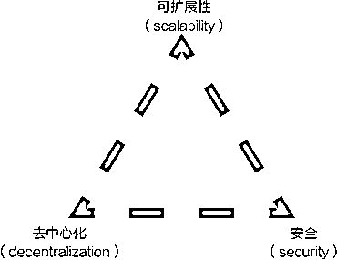

# 2.4.1 区块链的不可能三角

区块链的不可能三角指的就是一个区块链网络，无法同时满足下面这三个特性：可扩展性、去中心化、安全。

其中可扩展性，我认为也可以理解为效率。

比如我们之前提到的比特币这种经典网络，有较好的去中心化和安全属性，但是其牺牲了效率，转账的速度是比较慢的，慢的时候甚至需要多小时。

以太坊网络的发展，实际也遇到了不可能三角的问题。今年推出的以太坊二层的解决方案，就是为了解决以太坊网络发展遇到的算力瓶颈问题。

我们现在使用的 Web2 网络，可扩展性和安全性，可以说非常好了，这两者做做到了极致的同时，网络也变成了中心化的网络，用户失去了自己对网络的所有权。

包括现在对区块链的一种分类方式，就是按照去中心化程度，将区块链分成了公链、联盟链、私链。这个我们后面会讲到。

在区块链技术产生以后，各类公链网络，基本都是围绕着这三个属性，进行优化提效的，下面我们展开来看。

