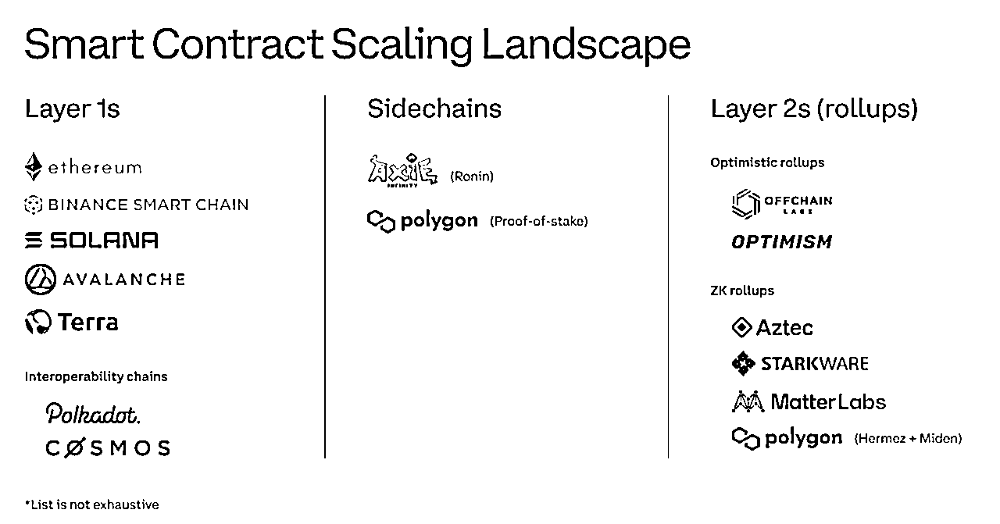

# 2.4.4 Layer1、Layer2

为了帮助大家理解，我们将各公链网络选出最具代表性的网络，进行分类解释来帮助大家理解：

我觉得这张图其背后的解决方案简单来说可以只分成两种即：自营和外包。

L1：网络不好用，我自己做一个用户体验更好的网络替代你。

L2：侧链和 L2 的思路本质是一样的，可以理解为外包。我做以太坊的小弟，和你对接，脏活累活我来做，你继续做贵族链。把费用低，速度慢的网络在我这边解决，解决完了以后，把关键的数据回传给以太坊验证。

在 L1 这一层，比如，

Binance Smart Chain：币安智能链，全球最大的加密货币交易所打造的区块链网络。币安智能链，适度的牺牲了去中心化，在保证安全的前提下，大幅增加了网络的性能。用户使用该网络的交易手续费几乎为 0，且速度极快。

Solana：创新的使用了 PoH（Proof of History）的共识机制，交易速度大幅提升，交易手续费相比于以太坊大幅降低。

比如以太坊的联合创始人，也是 Web3 概念的提出人之一 Gavin wood 就出来自己创办了波卡 Polkdot 这个网络，这个网络旨在解决区块链架构中的可拓展问题。希望通过这个网络把各个链连接在一起。

举个例子，在没有波卡之前，各链可以类比成中国三大运营商，移动、联通、电信，但是这三家之间并不能进行通话。但是波卡的出现，就解决了这个问题。解决所有区块链网络的互通问题，同时提升用户体验。

类似的有 cosmos，都是希望实现万链互联这一区块链的愿景。

L2 这一层，

AXIE 侧链是为了一款经典链游而诞生的网络，当时这个游戏的用户太多了，以太坊网络根本无法满足这个游戏的需求，于是，做了一个新链然后和以太坊对接。

包括今年火热的以太坊网络自己推出的二层解决方案，OP 和 ZK，都是类似的思路，只不过是数据打包和认证的机制不同而已。

这里我们不做具体机制的分析，大家感兴趣可以自己查阅相关资料了解。

