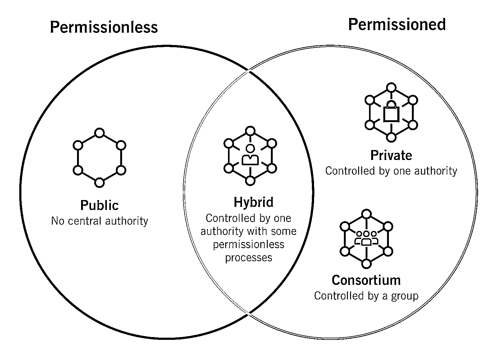
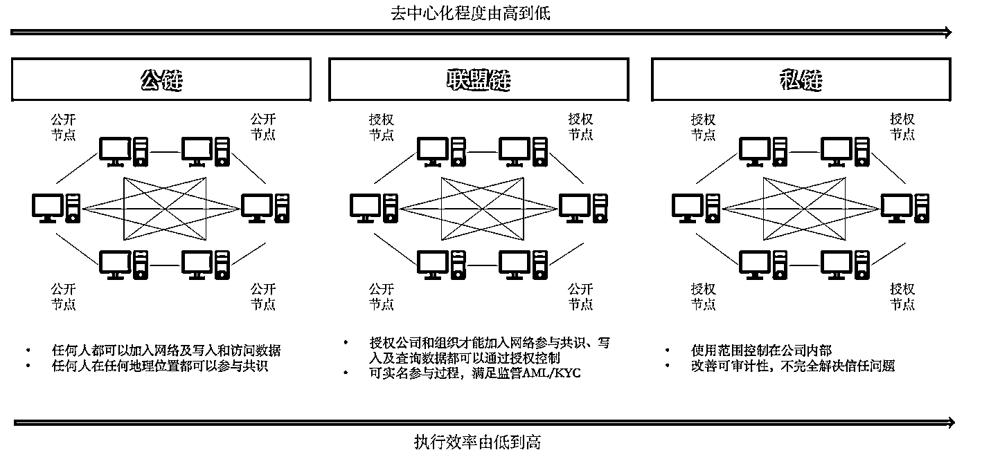

# 2.5 公链、私链、联盟链

之前我们提到过，区块链网络，按照去中心化程度可以为分为公链、联盟链和私链。这章节，我们给大家具体提的解释下这三个概念。

公链，理论来说我们认为是完全去中心化的，任何人都可以随意参加到公链的网络中。最具代表性的就是比特币网络，这个世界上的第一个公链网络。任何人都可以参与到网络的使用和建设中去，链上的数据一旦生成就不可篡改，且对网络上的所有人公开。

受到比特币和区块链技术的启发。一些组织和机构，对这项技术做了自己的理解和改造。比如私链，和公链相比，私链是完全中心化的，仅用于某个组织机构的内容使用，其只使用了区块链当中的记账技术，但是保留了其中心化的权利。

还有一种介于公链和私链之间的链，我们称为联盟链。联盟链顾名思义，是由若干个组织或者机构组成的一个联盟共同来维护的区块链。联盟内的成员可以被允许维护该网络。也就是部分允许。

举个例子来帮助大家理解私链和联盟链。如果说比特币是一家去中心化的银行。那么私链就是现在的工商银行内部用的记账网络，而联盟链，就是工商银行和全世界各银行比如花旗、德意志银行、北欧银行等共同组成的银行联网网络。

数字人民币网络，实际上就可以归类于联盟链的范畴。

我们对公链、私链、联盟链做一个总结：

从去中心化程度上，公链是完全去中心化的，联盟链是多中心组合，私链是中心化。准入条件上，公链无需许可自由进出，联盟链由联盟决定，私链仅限组织内部。记账人，公链是所有参与者，联盟链和私链由联盟和组织定义激励机制方面，公链使用代币进行激励，联盟链和私链用工资或者其他形式共识机制方面，公链使用工作量证明、质押证明等机制，联盟链和私链使用其自制算法公链的典型场景是比特币、以太坊网络等，联盟链是数字人民币，私链是各公司内的记账审计系统等。

