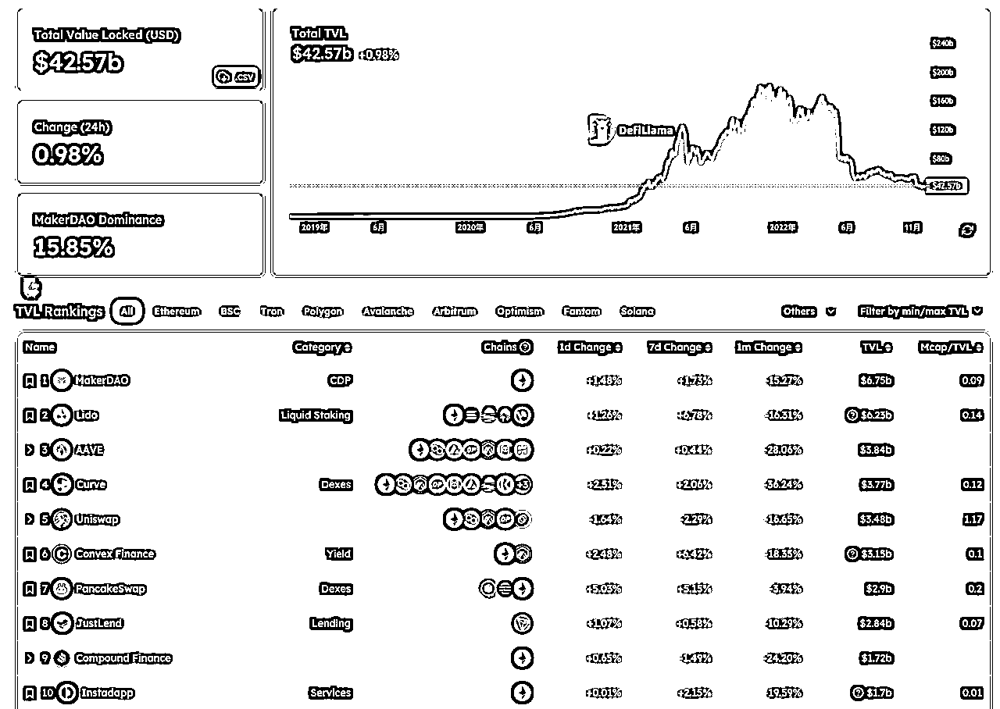
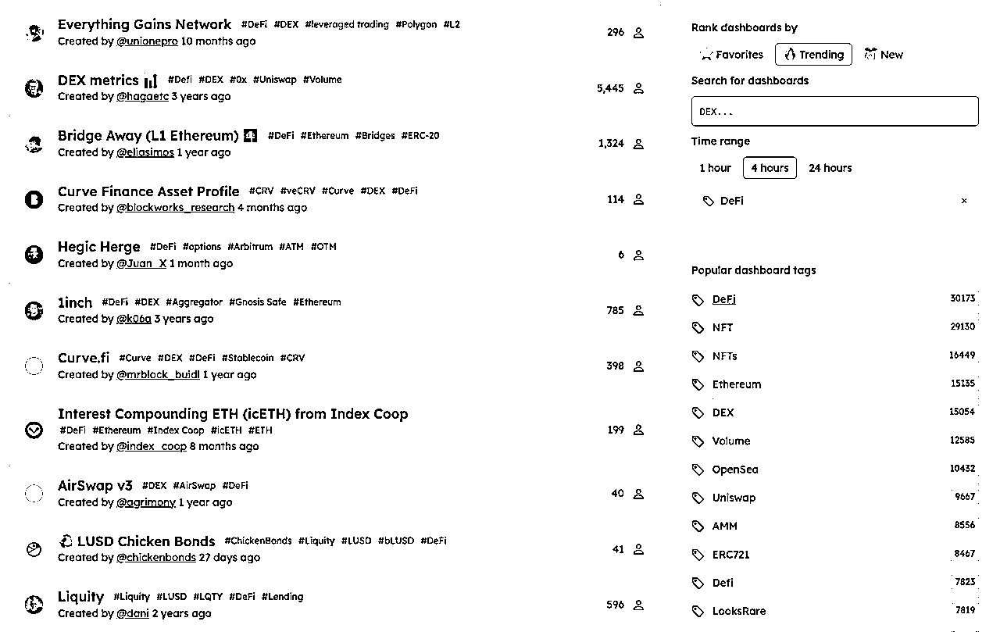
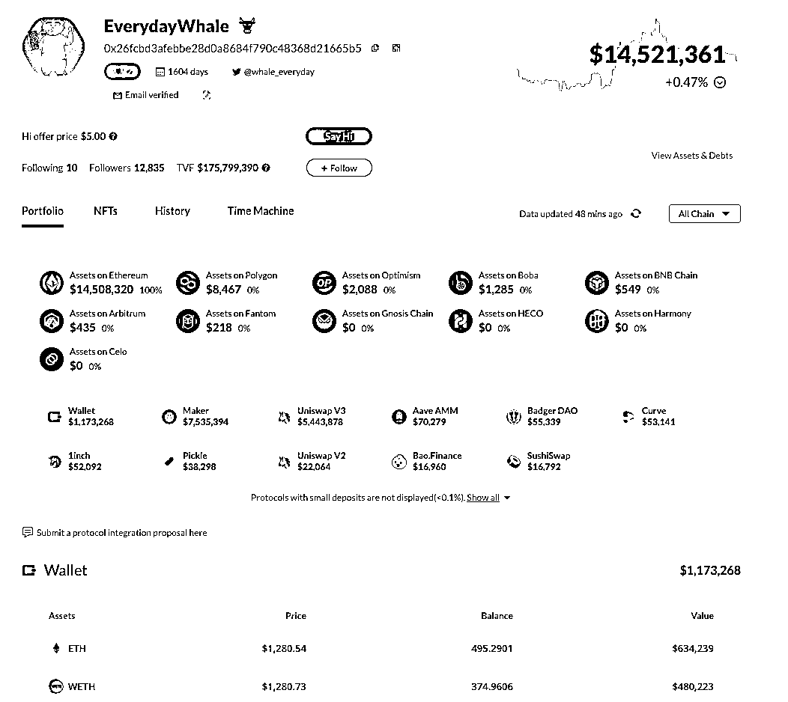

# 4.1.5.3 【拓展】DeFi 数据网站

最后，推荐几个 DeFi 相关的数据网站，从这几个网站，大家可以看看 DeFi 都在做什么，有哪些龙头项目，以及在 DeFi 里面的这些人在怎么赚钱。这是 Web3 的好处，目前隐私计算还没发展起来， 数据基本上都是公开透明的，大家有兴趣可以去仔细挖掘。

DeFiLlama https://defillama.com/

Dune https://dune.com/browse/dashboards?tags=DeFi

DeFi 巨鲸跟踪网站：Nansen 在巨鲸追踪这块非常厉害，不过收费也非常高，如果浅浅了解的话，更推荐 Debank。

Debank https://debank.com/

内容来源：12 月 2 日《聊聊 Web3 世界最重要的应用——DeFi》@馋嘴猫

