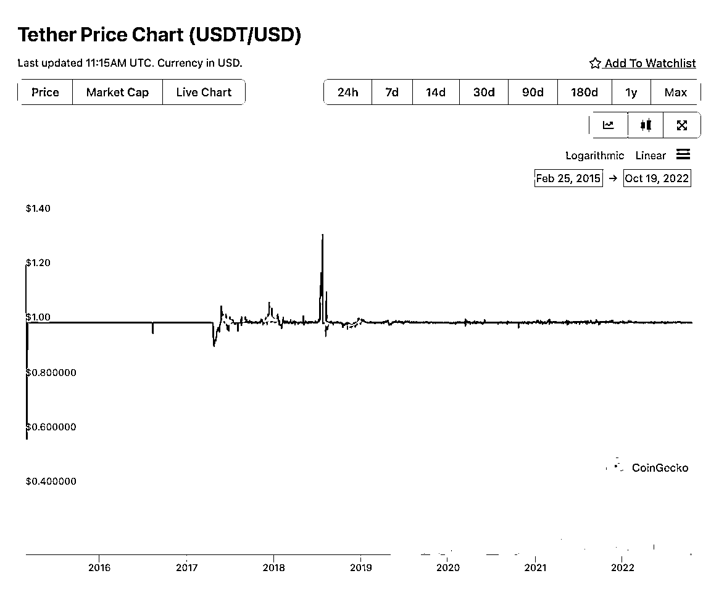
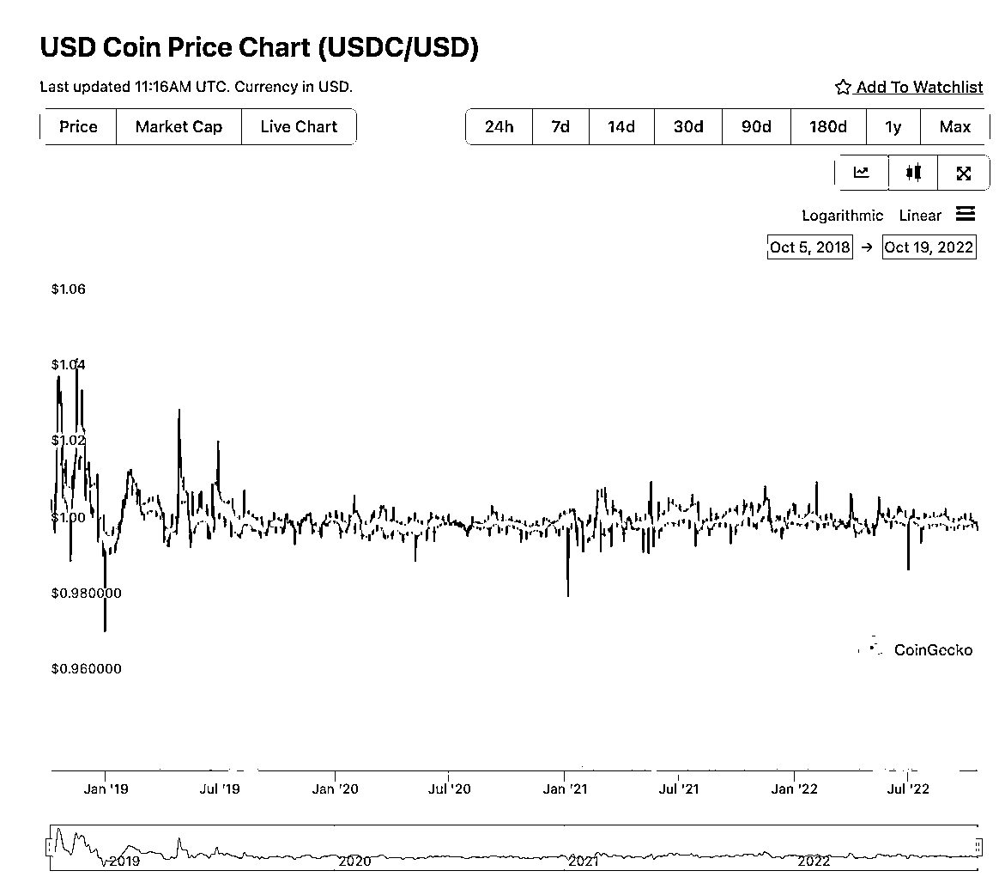

# 4.2.3 如何选择稳定币？主流稳定币对比

稳定币对于个人来说，最重要的是稳定。

其实这种加密货币的出现，本身就是一种中心化和去中心化的接口。行业的这个阶段，就是需要信用来做背书的。基于此，我们可以看看，和美元 1:1 抵押的稳定币中，那个最好？

实际，这类的稳定币，只要考察一点，就是其承诺的抵押是否受到监管。目前市值前三大的稳定币分别是 USDT、USDC 以及 BUSD。分别由三家中心化交易所发行。

其中 USDT 泰达公司储备的是现金和商业票据、企业债券、数字资产等。

USDC 的背后是美国最大的加密货币交易所 coinbase，储备的是现金、现金等价、储蓄、以及短期债券

BUSD，全球最大的交易所币安，抵押的是现金和国债

USDC 和 BUSD，是受到美国监管的。

虽然目前 USDT 的使用人数最多，但从交易所的可靠度，以及是否有监管做第三方背书来看，显然 USDC 和 BUSD 是更好的选择。

下面是这三个市值最高的稳定币的历史价格走势，显然 USDC 和 BUSD 的市场表现也是好于 USDT 的。

本章节中涉及到的内容，不构成任何投资建议。

拓展阅读：[《从真金白银的资金易手，看 Luna 崩盘的底层数学规律》](https://www.tuoluo.cn/article/detail-10097921.html)

[Sector_Terra Ecosystem_Tony_PC_CN-39217846 (1).pdf](https://search01.shengcaiyoushu.com/upload/doc/KS1WdDWSDogQNmxGRDNc1gXRnEb/DjtIbX8qUoyKeox7HaWcnhIpnvd)

