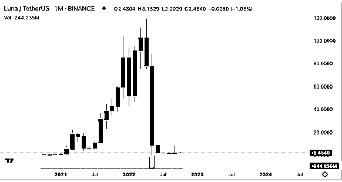
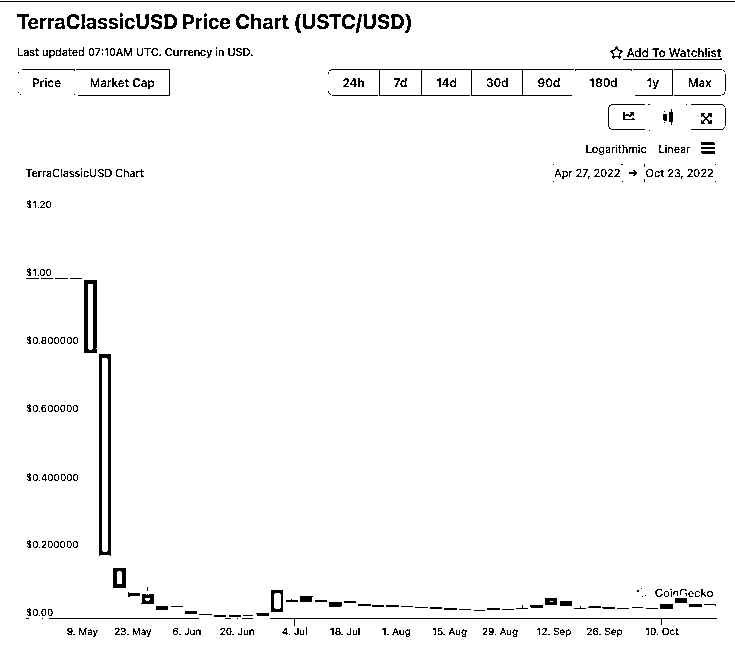

# 4.3.1 历史回顾

上一节稳定币的分类中，我们提到了法币稳定币、质押稳定币和算法稳定币。

其中，算法稳定币的潜在问题在于，不稳定。

下面我们就来看看，算法稳定币不稳定的案例。

这章节和大家一起分析的案例，发生在今年 5 月，是可以写入 Web3 历史的一个重大事件，UST 稳定币归零事件。一个 400 多亿美金市值的公链项目，在 3 天之内灰飞烟灭。

2021 年是公链爆发的一年，各类公链的市值少则几十倍，多则上千倍的涨幅，在这些公链生态中，有这样一个独特公链叫，Terra。

使用算法稳定币的机制配合双币模型，市值一度到达 Web3 世界的前 10 名。

这个网络使用了生态代币 LUNA 和稳定币 UST。

Luna 的价格从 2021 年 1 美金左右涨至 100 多美金。在今年 5 月达到峰值后，3 天内崩盘。Luna 和 UST，两个生态代币加起来将近 400 亿美金几乎灰飞烟灭。

稳定币 UST，5 月 10 日开始托铆，5 月 14 日跌至 0.17 美元，之后开始阴跌归 0。

这里要注意，LUNA 归 0，波动大可以理解。但 UST，是一个稳定币，大家使用 UST 是把它当作美元用的。换句话说，如果这几天没关注加密货币市场的人，以为自己账户里存了 1000 万美金，但是 5 天之内就变成了 100 多万。这是非常夸张的。

币价崩盘现象的背后，我们看看到底发生了？为什么会崩？