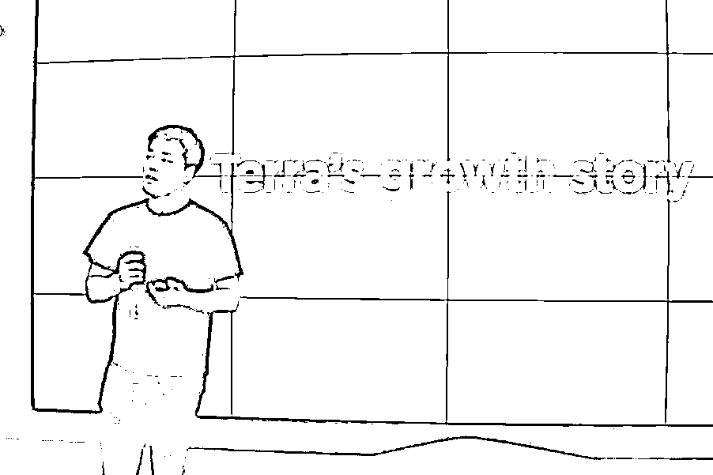
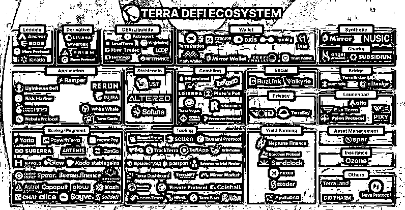
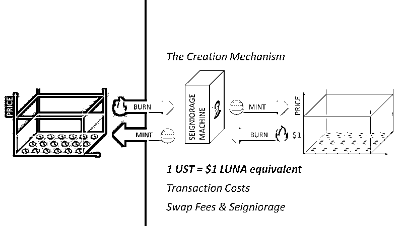

# 4.3.2 起源：福布斯 30 under 30 商业精英再创业剑指 Web3 基建

Terra 成立于 2018 年，创始人是韩国 90 后精英创业者 Do Kwon，毕业于斯坦福大学，入选福布斯 30 位 30 岁以下商业精英榜。最初项目的定位是通过和一系列的法币挂钩，提供区块链的算法稳定币支付方案。

发展之初，terra 的方向是围绕韩国市场搭建稳定币支付业务，并向东南亚地区进军。

一度成为韩国国民稳定币平台，移动支付应用程序 chai 可以理解为支付宝，在韩国的监管下，连接了 15 家大型银行。

在一系列运作之下，Terra 生态的市值排名一度进入 Web3 世界的市值前 10 名。链上锁定的资金达到了 181 亿美金。

Terra 生态中，最核心的代币是 UST，一种稳定币。

围绕这个稳定币，开发了支付应用程序 chai，类似于支付宝；储蓄协议 Anchor，类似于银行，合成股票市场 Mirror 对标股市，以及在这些金融基础上衍生出来的各类应用，可以说是一家超级金融公司，这些应用，都将使用 UST 作为生态中的流通货币。

Terra 生态是怎么做到在一年之内市值增长 100 多倍的呢？

市场运作层面，创始人精英背景，且之前有成功的创业经历，很容易拿到大的资源。这是一方面。

除此，在整个生态系统的机制设计中，充分的利用人性贪婪。

我们打开来看这个生态的机制设计。

上节内容我们和大家讲过，算法稳定币的核心思路是通过供需来调节价格保持其维持在 1 美元。我们来看下 Terra 用的是什么机制。

UST 是一个目标锚定 1 美元的算法稳定币。锚定机制是：双币销毁铸造。

•Luna 是 UST 的项目币，自由涨跌。不需要稳定。

•UST 通过和 Luna 的 “双向销毁铸造” 来锚定 1 美元。

如何理解双向铸造？

•当 UST 价格大于 1 时（例如 1.01 美元），可以通过销毁价值 1 美元 Luna，来得到 1 个 UST，然后卖出 1 UST 得到 1.01 美元，获利 0.01 美元。

•反过来，当 UST 价格小于 1 时（例如 0.99 美元），可以用 0.99 美元买入 1 UST，销毁 1 个 UST，来得到价值 1 美元的 Luna，然后卖出 Luna 得到 1 美元，获利 0.01 美元。

因此，通过套利者的不断套利，只要 Luna 的总市值正常，UST 就能稳定在 1 美元。

而 UST 生态的发展，又会将交易费手续费等利润，反哺给 Luna（ Luna 本质上是这套系统的股权），提高 Luna 的总市值。

UST 生态怎么能快速发展呢？UST 的存款利率 20%。一个稳定币的存款利率 20%，这在 Web2 是不可想象的。

人们争先恐后的将自己的真金白银兑换成这个算法稳定币。当时，我身边很多人都把自己的钱抵押在里面，老韭菜，一般可以提前拿到一些消息，见势不好，第一时间跑。