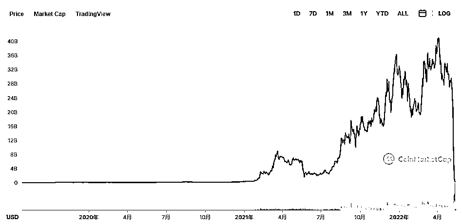
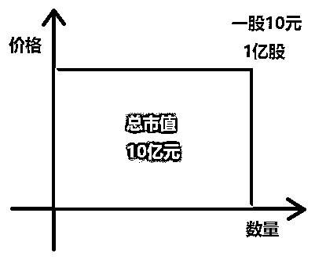
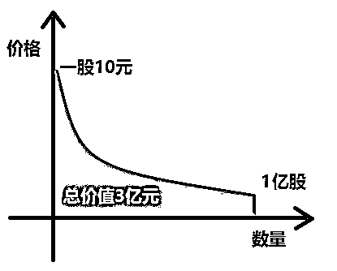

# 4.3.3 经过：为什么会崩盘？

随着 UST 使用的人数越来越多，Luna 的币价也水涨船高，在脱锚前，最高到过 400 亿美元的总市值。

在 5 月 9 日脱锚前，UST 总市值为 187 亿美元，Luna 总市值为 204 亿美元。

看到这里，其实大家有没有发现，这种双币模型的一个 BUG，LUNA 的市值，并不是真的有这么多现金，但 UST 是和美金挂钩的，可以 1:1 兑换美金。

204 亿的 LUNA，实际能能套出来多少钱？在快速上涨的市场，可能全部都能套出来，但是在快速下跌的市场，可能只能套出来两亿。

这个原理和股市、房产的市值都是一个道理。

一个小区 100 套房，有 10 套在卖，第一套卖了 1000 万，然后整个小区的业主觉得自己的也都能卖 1000 万，于是市值是 10 个亿。但要真的实现这 10 个亿的交易，要整个小区所有的业务都卖到 1000 万的价格完成换手。

在行情好的时候，可能是这样，第二套卖了 1100 万，买家一看，1 周就涨了 100 万，我也要买。极端情况，100 套全部卖出，价格不断上升。

但是在行情不好的时候。1000 万即巅峰。剩下的 9 套想卖的人，挂 900 万，挂了 1 个月没人买，然后 800 , 700 , 600，可能，最终的成交价是 500 万，于是整个小区的市值变成了 5 个亿。

房子的流通数量比较少，流动性比较差，更好理解。股票和加密货币也是一样。把一个小区里面房子的套数换成股的数量或者币的数量就可以理解了。

当 UST 和 LUNA 达到这样的比例，显然 LUNA 是无法填坑 UST 的。行情一旦开始转差，204 亿的 LUNA，实际可能只能套出来 20 亿甚至更少的真金白银来买 UST，但 UST 的市值可是 187 亿。

别人把你这里当银行了，但是取不出钱了，信用坍塌，UST 大量卖出，价格脱锚。

而这期间，Terra 的创始人，在 LUNA 市值高点时，用假币换真币，套出了 40 亿美金，买了硬通货比特币，以及兑换成了其他稳定币。