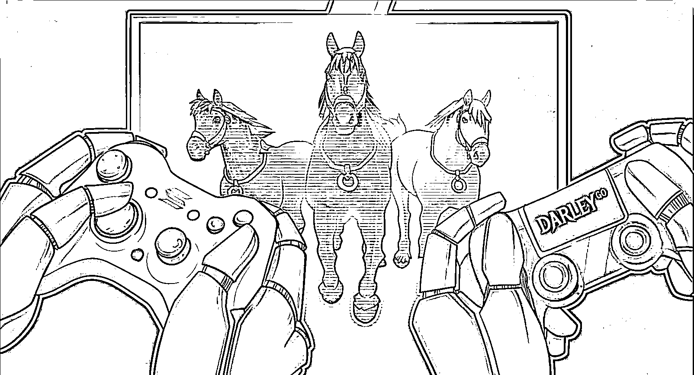
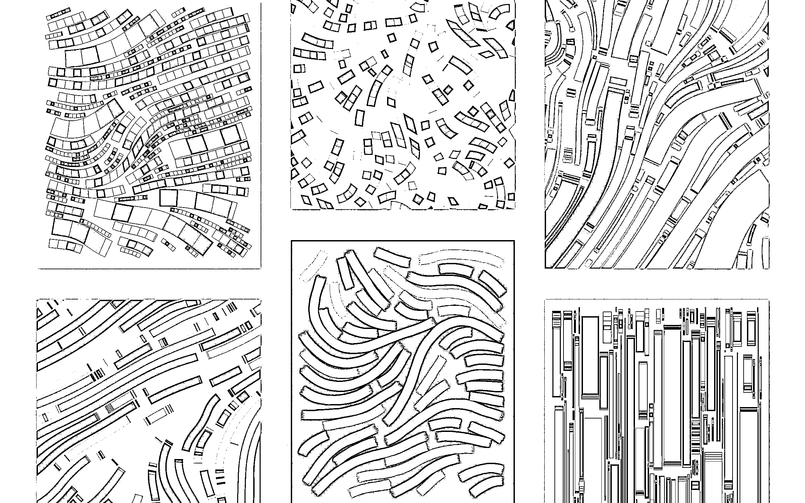

# 5.3 NFT 的应用场景

NFT 最广为人知的表现形式就是头像，俗称 PFP（Profile Picture），也就是你可以把 NFT 当成自己的头像，展示在各种社交页面上。但是除了换头像之外，NFT 还可以做什么，你知道吗？

1）首先是游戏

NFT 最早的落地尝试是游戏。基于区块链技术的 NFT 能够记录玩家在游戏内的状态和成就，保存游戏中获得的物品清单。NFT 能够确保记录不可篡改且无缝转移，保证游戏物品的所有权验证和真实性。同时，游戏物品也可以经过设计进行跨游戏使用，或使其具有一定兑换价值。传统游戏的问题在于不允许将这些物品进行转让，很少有游戏允许交易或出售收集物品，更不用说跨游戏使用。NFT 为这个问题提供了解决方案，允许游戏内资产转移到其他游戏中去。

2）然后是艺术品

NFT 另一越来越受欢迎的用例是艺术（数字艺术）。这种形式下，艺术家可以拥有自己艺术作品的版权，买家可以确保自己购买的艺术品真实权威，杜绝盗版造假。区块链可以解决所有权证明问题。艺术家不必再依赖第三方来获得作品保护，省去了中间人的媒介，确保艺术家能获得更多的收入。数字艺术的代币化使得创作、交易和从 NFT 获得版税变得更加容易。 原生加密艺术品 NFT 这部分目前海外最著名的平台是 Art Blocks。

3）接下来是音乐

在这个时代，音乐艺术家遇到的最大阻碍之一就是歌曲被播放时难以得到应有的报酬。在过去的几年里，非法下载最为猖狂，流媒体播放变得极为容易，整个音乐产业每年损失数百万。艺术家的主要收入来源是现场演出的门票销售，但疫情使音乐行业比以往任何时候都更加困难。随着区块链在音乐行业的引入，使用或聆听艺人在区块链上发布的音乐，将通过加密的、安全、不可更改的智能合约支付。 区块链可以看作一个透明的账本，显示了一首歌的每一笔交易和动向。在公共区块链上，艺术家和粉丝都可以查看一首歌在哪里和何时被播放。

4）门票

门票伪造和大量囤票是一个亟需解决的大问题。NFT 在分布式账本上保存的记录具有不可更改性，使得票据可以在区块链上进行独立验证和认证，避免了作弊方法。此外，为了防止大规模囤积，可以将门票购买与基于区块链的特定身份进行绑定，以实现销售限制。

5）域名

以太坊名称服务 (Ethereum Name Service) 将可读的名称映射到区块链和非区块链资源机器可以辨识的标识，如以太坊地址等。简单来说，ENS 是把 .eth 域名解析为以太坊地址。ENS 可以让以太坊地址更容易记忆，ENS 域名可以在二级市场上买卖。 现在也衍生了很多的 DID 赛道，类似 .bnb .bit .sol .nft 等等。

6）身份验证

NFT 包含特定商品或资产的独特信息，这使得 NFT 成为区块链上用于识别和认证的一个很好的用例。每个人都拥有独特属性和身份信息，所以 NFT 可以使病例、个人档案、教育信息、地址等信息数字化，让数据由用户自己轻松操控。随着区块链的应用越来越多，越来越多人将会使用 NFT 存储个人数据。

7）实体资产和文件记录

NFT 可以将现实世界中的资产、证明，如房产、股票、文件、资质、执照、病历、出生和死亡证明等，进行代币化。以房地产为例。传统的房地产行业记录所有的土地所有权和财产登记的文书十分繁杂。而 NFT 可以把整个流程数字化。房产可以在区块链网络上被代币化，成为可交易的代币，在二级市场中轻松交易。如此一来，便省去了经纪人、银行、代理商和律师等中间商。

8）DAO 组织和社群权益

随着社区的不断发展，许多传统运营模式正在向着成为一个完全去中心化的自治组织 （Decentralized Autonomous Organization 也就是 DAO） 转变。NFT 可以作为 DAO 组织或者社群的唯一证明，并且可以享受到社群私密信息、互动，以及可能的收益分红。

