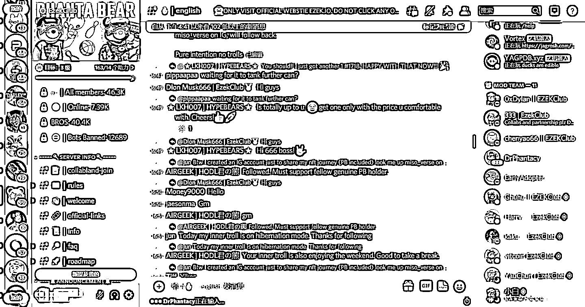

# 5.6 玩 NFT 的工具配备和操作流程

工具配备：

首先是钱包，一般玩以太坊或者 BSC 链的主要用小狐狸钱包。

其次是 Discord 账号，这也是玩 NFT 必须配备的。然后是推特账号和邮箱账号：

这些基础配备后，可以称为完成一组的账号。不过如果想获得更多收益的话，一般是配备数十组甚至数百组的账号。

操作流程：

1）通过 Discord 或者 Premint、推特参与到官方的白名单获取任务；2）获取白名单后，在预售阶段确认市场情况。如果有确定性收益，则铸造出来（使用对应的钱包支付铸造费用和 GAS 费用），在二级市场观望价格到高点后售出；3）如果是参与公售，一般以太坊的项目，需要支付超额的 GAS 费用给予矿工，让自己有机会更早成功地铸造出 NFT。

这里分享一篇 @陳拾柒｜Roy 在航行期做过的群内分享，模拟了 NFT 交易实战的流程，大家可以加强下理解：

12 月 9 日《NFT 交易在模拟环境下实战操作》@陳拾柒｜Roy

