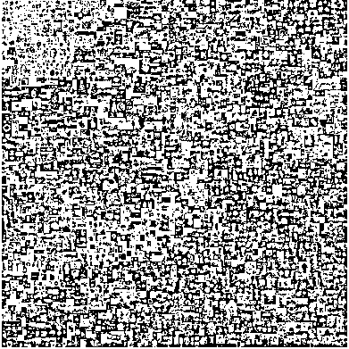
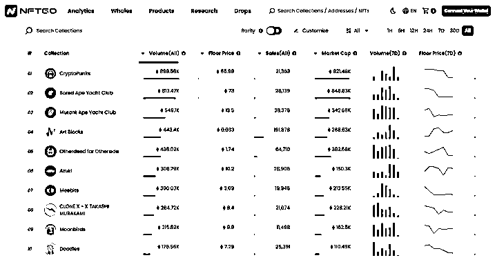

# 5.10 经典 NFT 项目一览

这一节，我们挑出一些经典的 NFT 项目，给大家做个简单介绍。看过这些项目，大家就能对 NFT 项目建立起一个初步的感知。

说 NFT，首先就绕不过《Everydays: The First 5000 Days》。从 2007 年 5 月起，艺术家 Beeple 每天在网上创作和发布一件新的艺术作品。最终，耗费 5000 多天，用 5000 张作品图拼接成了这一幅作品。

2021 年 3 月，这幅作品在佳士得拍卖行以 6934 万美金的价格成交，约合人民币 4.5 亿。这是世界上第一件在传统拍卖行出售的纯数字作品，也是 NFT 历史上一个具有里程碑意义的作品，引发了之后的 NFT 热潮。

这是截至 2022 年 10 月 15 号，权威网站 NFTGO 列出的 NFT 市场 Top10 项目，排名依据是 NFT 历史累计交易额。

我们知道，在股票市场上有所谓的蓝筹股，指的是那些业绩良好、长期稳定增长、占据行业领先地位的公司股票。投资者通常认为这些公司的股票更有价值。

实际上，在 NFT 市场上也有类似的蓝筹 NFT，这些 NFT 通常价格坚挺、经过相对长时间的考验、被投资者广泛认可。

下面，我们挑出了 2 个非常有代表性的蓝筹 NFT 项目，给大家分享一下。