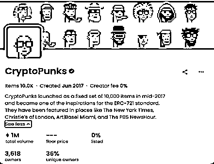
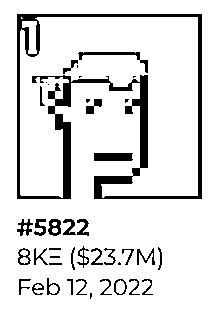

# 5.10.1 案例一：CryptoPunks

这也是一个具有里程碑意义的 NFT。

实际上，Punks 被认为是世界上第一个真正意义上的 NFT 系列。下图是 Punks 在 OpenSea 平台的首页，可以看到图片里有很多像素小头像。

这个系列 2017 年 6 月在以太坊链上发布，由 1 万个不规则像素头像组成，每个头像都有独一无二的特征属性。Punks 有男性/女性/僵尸/猿猴/外星人等不同类别，按类别和特征搭建起了一套稀缺性层级体系。

由于其“历史第一”的特殊历史意义，受到 NFT 市场的追捧，持有者被认为是加密世界的 OG 老炮。

Punks 在巅峰时期来到了 100 以太的地板价格，其中最便宜的一个 NFT 头像，价值高达 40 万美元，也就是 200 多万人民币。成交价最高的为 CryptoPunk #3100，达到了 4200 以太，约合美元 1600 万左右，人民币接近亿级别的水准，令人咂舌。能买得起这个 NFT 的群体非富即贵。

下图的这个 5822 号 Punk，就是是目前为止历史成交价最高的一个外星人 Punk。

2022 年 2 月 12 日，它被人以 8 千个以太坊的价格被买走，相当于 2300 万美金。而五年前 Punk 的首次交易价格是 8 个以太坊，按美金计算涨了 14000 多倍。

