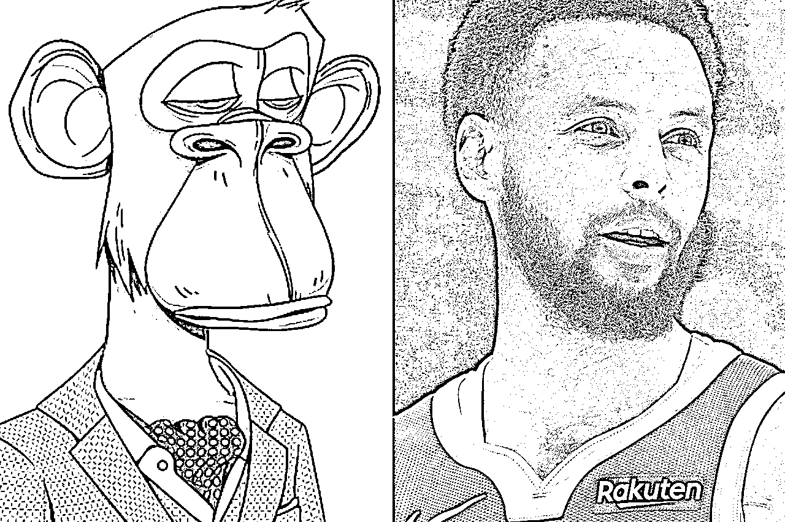
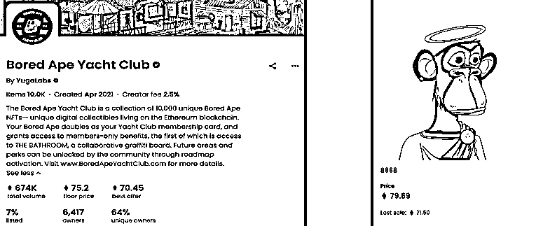

# 5.10.2 案例二：Bored Ape Yacht Club 无聊猿

Bored Ape Yacht Club，简称 BAYC，也就是著名的无聊猿。无聊猿的母公司 Yuga Labs 目前是 NFT 市场上最顶级的公司，前面提到的 CryptoPunks 也已经被他们收购。

无聊猿 2017 年 4 月发布在以太坊链上，由 10000 个猿猴 NFT 组成。猿猴有 7 种类别特征，不同特征组合构成了不同的稀有度：

自从发行以来，无聊猿已经不仅是一个 NFT 收藏，而是围绕 NFT 形成了一个庞大的社区——无聊猿游艇俱乐部，而 NFT 就相当于俱乐部的 VIP 门票。

例如，

NBA 球星斯蒂芬・库里早些时候以 55 以太（约合 18 万美元）的价格购买了一个穿着粗花西装的无聊猿；著名的美国电视主持人吉米・法伦去年 11 月以近 22 万美元的价格，购买了一只穿着条纹 T 恤和心形墨镜的无聊猿的形象；就在最近，获得奥斯卡奖的说唱歌手 Eminem 花了近 46 万美元买下了一只有点像他的猿猴。

还有大家熟知的一些明星，库里、内马尔、贾斯丁·比伯、麦当娜、周杰伦、林俊杰、余文乐、陈柏霖、吴建豪等都是无聊猿的持有者。

持有无聊猿还能持续不断收到新的价值赋能。比如 2022 年 3 月，无聊猿母公司发行了代币 APE，一发行就获得了几十亿美金的流通市值。在代币发行时，无聊猿的持有者都能收到空投代币，而这些代币都可以直接在市场上售出。当时有无聊猿的持有者就开玩笑说，一辆保时捷从天而降。

BAYC 还和阿迪达斯联名发布了元宇宙入场券，探索各种类型新的媒体机会，包括电影、电视剧、音乐和游戏。环球音乐也成立了 Kingship 虚拟乐队，其中乐队就是由一个变异猿和三个无聊猿角色组成。而且在大部分新的 NFT 项目，持有 BAYC 可以直接获得白名单权益，凸显了这个 NFT 的价值。

还有一件有意思的事儿。今年 4 月，李宁公司购买了 4102 号无聊猿，价格 120 个以太坊，大约人民币 240 万左右。李宁围绕这只无聊猿，进行了一系列的产品设计和宣传活动，这成为了一种全新的 IP 发展方式。NFT 绝不仅仅是一个简单的小图片收藏。

2021 年最初发布时，无聊猿的价格是 0.08 个以太坊，大概 190 美金。现在的地板价大概 80 个以太坊，作为一项资产，它的价格已经涨了超过 500 倍。

BAYC 为什么如此火爆？

一方面是形成了社群共识。随着 BAYC 的火爆，在互联网上形成了独特的猿猴社群文化。拥有 BAYC NFT 的玩家会将自己的无聊猿当成社交网络头像，用于标识身份。而其他拥有无聊猿的玩家则会迅速关注自己的「家人」，这也是为什么网络上有那么多人突然开始用猴子头像。拥有这种 NFT 本身就意味着你的身份和地位，另外同样档次的群体聚集在一起，也总能碰撞出火花。

拥有不同属性的猴子们都会组成自己的小团体，在 BAYC 的 Discord 社区里面有着众多不同分类的频道。在非官方群组中，他们也会建立自己独有的社区。一个活跃的、旺盛的社区是每一位加密世界居民都梦寐以求的，而无聊猿社区几乎能满足人们对社区的所有幻想，尤其在 NFT 领域。

更特别的是，BAYC 团队愿意将无聊猿的版权全部交给社区成员。无聊猿的持有者可以用自己拥有的 NFT 创作各种周边，比如二次创作的艺术品、衣服、扑克牌等等，而且销售收入完全归本人所有，无需返还给项目方。