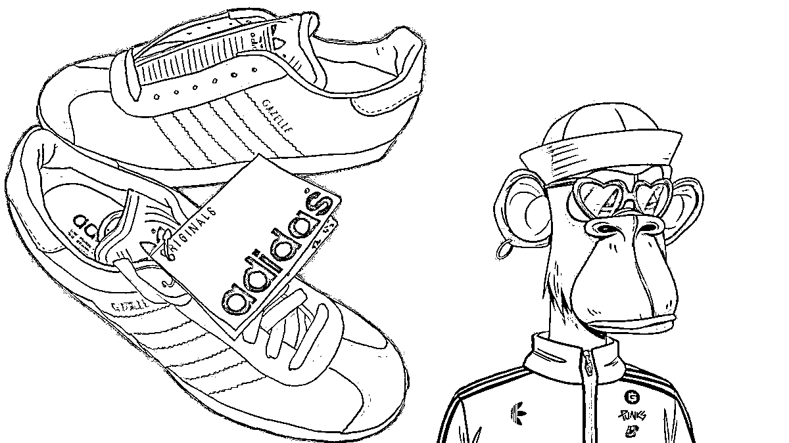

# 5.10.3 其他主流公认蓝筹 NFT

目前主流公认的的蓝筹 NFT，除了以上两个，还有红豆 Azuki（圈友 @温虾米的头像就是红豆中的稀有款，价值不菲），MAYC（变异猿，是无聊猿衍生的系列），CLONEX（RTFKT 旗下的 3D NFT，被耐克收购），Doodles（卡通风格），Moonbirds（像素风格，俗称月鸟）等：

还有越来越多的海外大品牌都逐步布局 NFT 领域：

刚才提到的 CLONEX 系列就是耐克收购的，拓展他们在 Web3.0 运动品牌的布局；阿迪达斯则推出了三万个 「Into the metaverse」的 NFT，即使售价不菲也是迅速被抢购一空；Gucci 宣布和 Crypto Janky NFT 合作，销售限量系列的 NFT；星巴克宣布旗下会员机制会跟 NFT 做深度的结合，以 Web3.0 的方式来拓展品牌价值；保时捷、雷诺等汽车品牌的 NFT 项目也在启动中，即将揭开神秘面纱……

目前也有一些国内的 Web2.0 公司品牌出海进军 Web3.0，就是以 NFT 为起点，例如最早的 B 站、映客，后面还有王老吉以及近期的百度（Crypto Simeji、Dudulabs）、爱奇艺等。

还有明星为主题的 NFT，例如周杰伦的 Phanta Bear，伊能静的 Theirsverse 等。

有人说，NFT 市场充满着泡沫，泡沫总有一天会破灭。NFT 市场确实因为短暂过热，而产生了大量的泡沫。但是想想当初的互联网时代、移动互联网时代，是不是也有同样的言论出现呢？

只有高速发展的领域，才有可能产生泡沫，而在一轮又一轮挤泡沫的过程中，NFT 市场的价值，会越来越凸显。一些只赚快钱没有形成共识的 NFT 会被淘汰，而有长久价值的蓝筹 NFT 则会被保留下来，形成一个又一个的共识群体。

截至 2022 年，全球加密货币持有比例平均为 4.2%，全球拥有超过 3.2 亿加密用户。而这 4.2% 的人里，目前也只有 1% 的人有接触过 NFT。而 NFT 天生的特性，就比加密货币本身更容易出圈，而且更好地承载更多的价值。所以当前还存在非常大的市场增量，接下来的几年，一定是 NFT 市场飞速发展的时期。

同样的，作为大家最近经常讨论的元宇宙，说起来还是太虚无缥缈。但是 NFT 作为元宇宙的基础和核心元素，是毋庸置疑的了。因为 NFT 代表着你的数字资产所有权，谁也无法剥夺，只有这样的资产，才有可能成为你遨游各个平行元宇宙的通行证。

各大公司、品牌，也都在加速通过 NFT 的手段，提升自身的知名度、影响力，形成社群共识。NFT 的发行运营能力，会成为大部分公司/组织的常规配备。

另外很多 Web3.0 项目，包括一些公链、DAPP 等，也会通过 NFT 来吸引初期的用户，这样后期项目发空投时，NFT 的用户同样也会获得空投收益，就比如近期的 GAL 银河女孩 NFT，Aptos 的测试网 NFT，Hashflow 的 NFT 等，都给了不错的收益。这也是我们会重点探索的机会。

部分内容来源：12 月 7 日《聊聊 Web3.0 里 NFT 的机会》@焦波｜水镜

