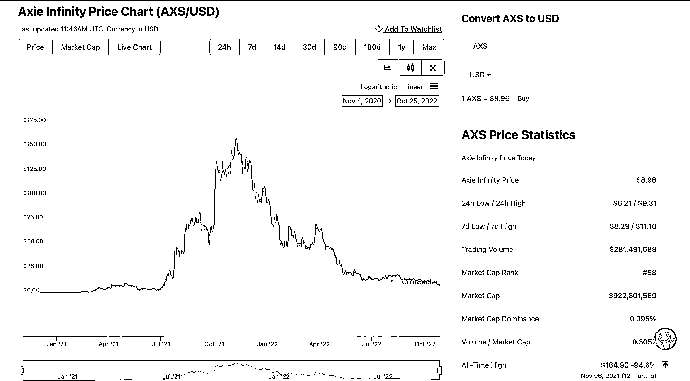
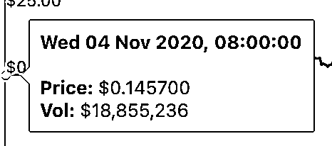
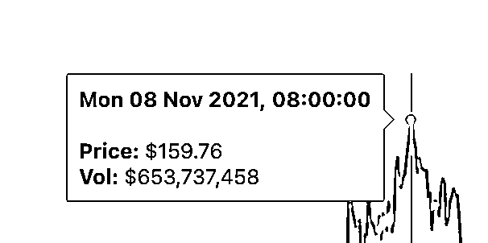

# 6.4.1.1 历史走势

这一节，我们一起来看一个 2021 年经典的链游，且存活至今的 GameFi 链游项目 AXIE（中文叫阿谢）

这张图中我们可以看到，这个项目在 2020 年 4 月的价格是 0.146 美金，到 2021 年 11 月，达到峰值 160 美金，1 年多的时间，涨幅在 1000 倍以上。非常夸张的一个项目。虽然币价跌成了峰值的 1/20，但项目至今还在运营。

但就价格走势，我觉得比中概股要好。就算都是泡沫，加密 1 年多就走完了周期，涨幅 1000 多倍，跌幅和中概股也差不多。而且龙头没有中概股跌的多。

侧面体现出了，Web3，这个 7 * 24 小时的金融市场，效率非常的高。