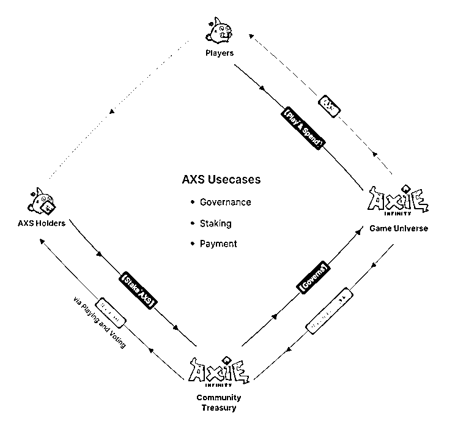
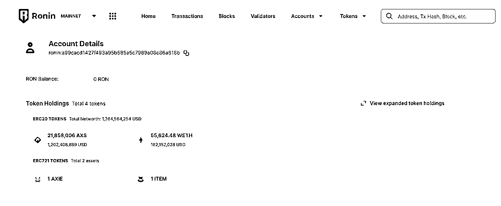

# 6.4.1.2 AXIE 是什么？

官方的介绍：Axie 是一款玩家可以用自己宠物 NFT，宠物可以成长、繁殖、战斗、建立王国的链游，具有开放的社区和边玩边赚钱的经济模型。

该游戏的使命是以社区和 player-owned 为基础，打造精彩的游戏体验。愿景是希望这里可以成为一个全世界都来玩、赚钱、生活的数字国家。

简单概括：QQ 宠物、神奇宝贝游戏

商业模型概括来说就是：先花钱买宠物才能参与游戏，然后，宠物可以帮你在游戏里打工赚钱。

这里给大家详细介绍下这个游戏的治理代币模型：整个系统的成分包含游戏、游戏玩家、游戏社区、代币持有者。可以用国家、百姓、政治家、资本家来类比。

政府制定规则：进入这个国家要先花代币买 3 只宠物作为入场券，生孩子繁殖也需要交钱，在国家里买卖交易要缴纳 4.25% 的税。代币用来激励百姓在国家里劳动，资本家锁仓可以获得代币的利息用来提高代币价格，形成价值正循环。

强调资产所有权归属于百姓，社区治理权归属于百姓。

国库数据是公开透明的，到截图的日期，使用上面的经济模型，Axie 国库已经创造了 13.6 亿美金的持仓的账面价值！

技术侧，是通过自己的以太坊侧链 Ronin 提升游戏的体验，这个侧链在之前的章节中有和大家讲过。就是为了解决当时以太坊网络能力不足以支撑游戏的问题。

上面的这些内容，我都是从项目的官方白皮书整理的。这里介绍给大家一个方法，想要了解 Web3 的项目，项目方的白皮书值得大家去看下，尤其是经典的项目。好的项目的白皮书，通常写的非常清晰。比如阿谢的白皮书有一点我印象深刻，其将自己的玩法设计灵感来源写了出来，可以看出团队的风格还是很坦诚的。

大家可以自己透过白皮书的文字感受项目方的质地。