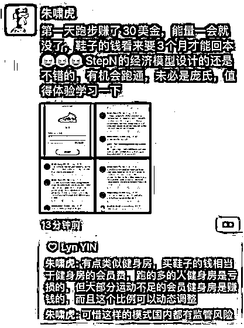

# 6.4.2.1 背景

上一节我们介绍了开创了链游，涨幅 1000 倍的项目 AXIE，这节再简单给大家介绍一个今年上半年火爆的链游项目 Stpen。

这个项目主打的是 Move to Earn 概念，风靡一时，带入了很多新人进入到了 Web3。

什么是 move to earn 呢？简单来说就是，这个游戏在你手机里装了一款应用。能监测到你每天走路的步数。你要先花钱买虚拟的 NFT 鞋子，然后每天走路就能赚钱。这个游戏在刚开始推出的时候，买一双鞋子，一周就能走回本金。

知名风险投资人朱啸虎，也参与了一下这个项目。这是当时他对这个项目的评价：经济模型的设计还是不错的，有机会跑通，未必是旁氏，值得体验学习下。有点类似于健身房，买鞋子的钱相当于健身房的会员费，跑的多的人健身房是亏的，但大部分运动不足的健身房是赚的，而且这个比例可以动态调整。

可惜这样的模式国内都有监管风险。

在朱啸虎买了不久后，这个项目就崩盘了。崩盘的导火索，确实也是这个项目在国内被禁。

