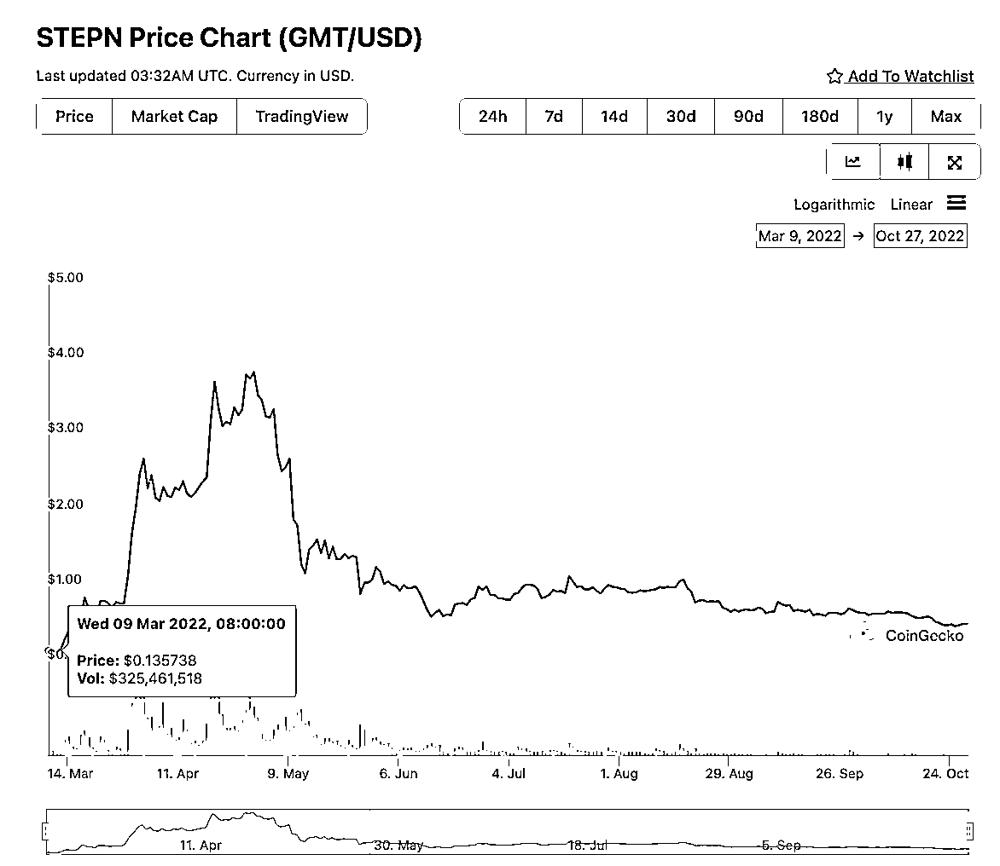
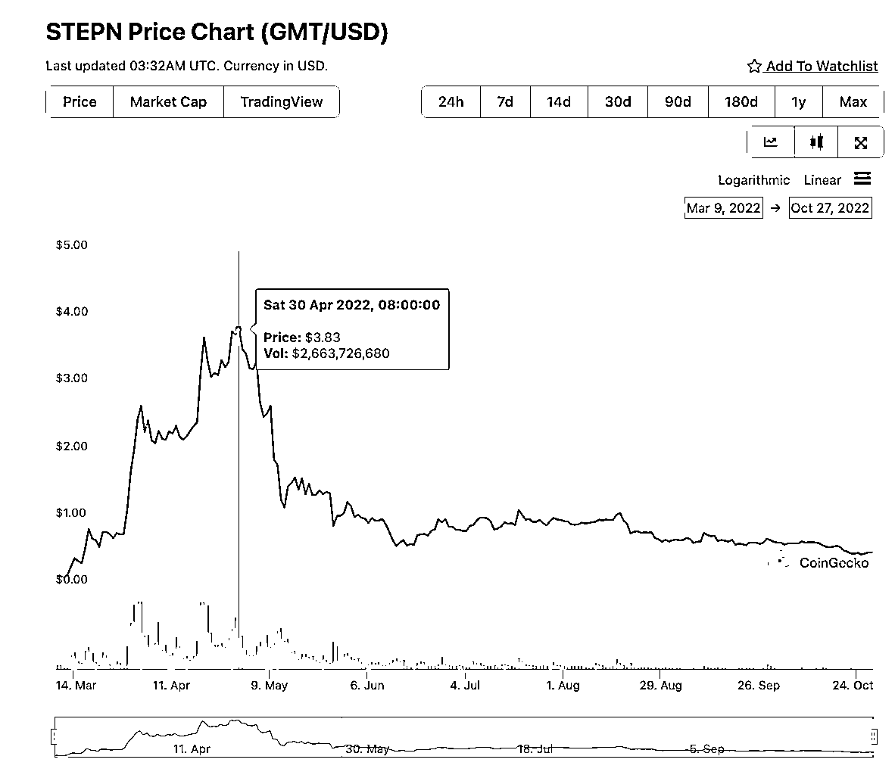

# 6.4.2.2 历史价格

不过，这个项目确实产生了巨大的造富效应。我们可以看下这个项目的历史价格走势。代币价格从 2022 年 3 月，0.15 美金左右，仅 3 个月的时间，就飙升至了将近 4 美金。代币上涨了几十倍。这是二级市场的价格。

一级市场在币安的开盘价是 0.01 美金。除了代币，鞋子的价格也一路飙升。一双 NFT 鞋的价格上万。

快的时候，买一双鞋子，几天就可以回本。人们疯狂的涌入，一些之前对 Web3 没有了解的老板上来就直接砸几十万上百万，还因此衍生出了带走的产业，专门有人像美团小哥一样，每天帮别人走，一天可以赚几百块。

不过，这些在市场最疯狂时涌入的人的结果最后可想而知，进场后就变成了，给你利息，要你本金的模式。开始是 1 周回本，2 天后变成了 1 个月回本。想着再坚持 1 个月就回本了，然后变成了 1 年回本，回本周期越来越长。

