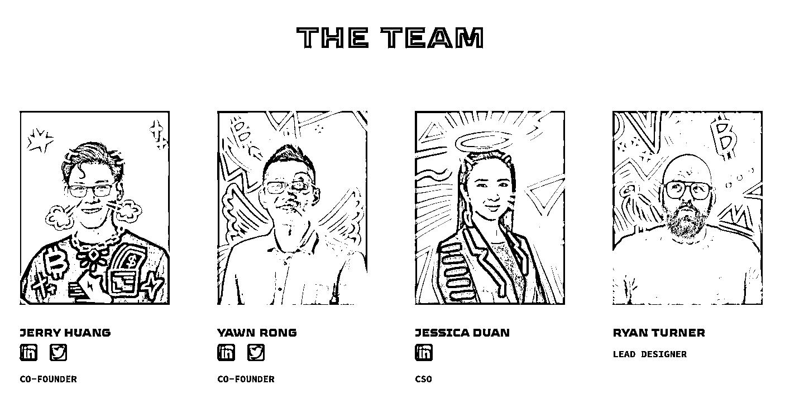
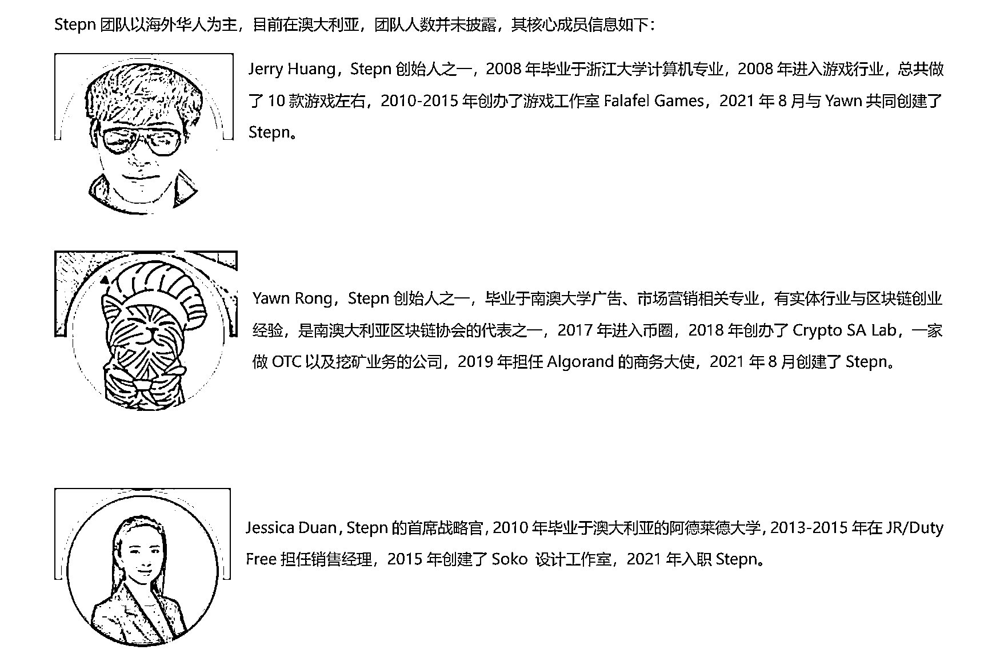

# 6.4.2.3 团队与项目运作

实际，我们认为 stepn 这个项目的成功并非偶然。如果从筛选项目的角度来看。这个项目的创始人 Jerry，之前是一个在游戏领域的持续创业者，已经拿到了一定结果。移民澳洲，基本财务自由。

但是又开始二次创业，这种项目的成功率会非常的高。

当时他们为什么会做 stepn 这个项目呢？团队的另外一个创始人 Yawn 在一次采访中透露：

创始人 Jerry 在 20 年左右搬到了和 Yawn 一条街上，成了他的邻居。Yawn 看到了 Jerry 车牌上写的 crypto，就知道 Jerry 是做币的，然后就认识了。这时候 Jerry 的游戏公司，已经自己跑起来，不大需要他操心。
这两个基本财务自由的哥俩，每天就是喝喝酒，晒晒太阳，没事扯淡，一起做做 Web3 的投资，过了一年多比较惬意的生活。
结果有有一天，Jerry 和 Yawn 聊 Axie 这个 2020 年的大热项目时，两个人聊出了 STEPN，找到了当年创业初期的激情，激动涌上心头。
两个一拍即合。2021 年 8 月左右产生想法，9 月立项，10 月就出了内测版本。

这里我们可以发现，如果没有两个之前在游戏和 Web3 的丰富积累，是不可能这么快的推进项目的。

有了产品以后，他们是怎么获取第一批用户的呢？参加公链的创业大赛。帮助他们吸引到了第一批不到 3000 人的用户。然后他们不断的给用户发福利、做活动，送 STEPN 的代币，抽 iphone 这些都做，通过一系列的福利来做用户留存。

从这一点，我们也可以看到，Web3 目前人数还非常少。

深度的 Web3 的用户，更像是散户投资人 + 产品体验官的角色。遇到好的项目，花时间参与，用钱投票支持。

这里还可以印证一点，我们在上次的章节中讲到的，加入社区体验。一个有格局的 Web3 项目，在最开始的时候，一定会让他的第一批用户，赚得体满钵满。

拓展阅读：[《朱啸虎买的虚拟球鞋 StepN，是不是庞氏骗局？》](https://www.tmtpost.com/6130141.html)[《朱啸虎买了一双鞋》](https://www.chinaventure.com.cn/news/80-20220526-369070.html)

