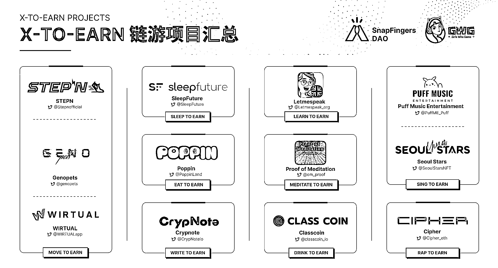

# 6.5.2 思考：未来还有哪些可能的链游形式？

先给到大家几种目前在 Web3 世界正在发展的链游形式：

1.一种是 DEFI 的包装

2.一类是主打游戏性，只是把资产和游戏币 NFT 和代币化。但目前这类游戏同 Web2 游戏的差距较大

3.还有就是像 STEPN 这种的 X to earn，在 stepn 火爆以后，陆续推出了汽车 to earn，跳绳 to earn，唱歌 to earn，甚至还有睡觉 to earn 等一系列的概念。不过均未取得成功。

大家可以思考下为什么？另外未来还有哪些可能的链游形式？

