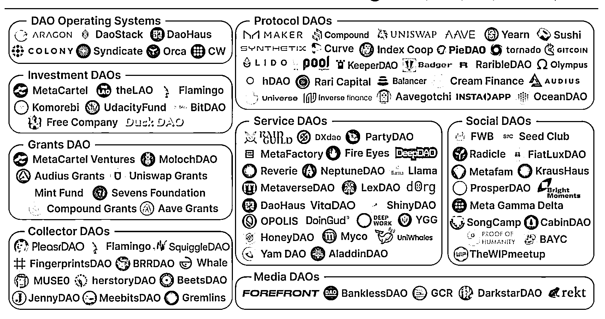

# 7.5 DAO 的生态和分类

Web3 发展至今，基于不同目的，出现了很多形式的 DAO。

下面这张图做了一个整理。通过这张图我们可以看到，有运营 DAO，有投资 DAO，有社交 DAO，媒体 DAO、有收集 NFT 的 DAO，还有服务 DAO。

理论上，Web2 的各类组织都可以通过区块链技术演变成我们所说的 DAO，去中心化组织。

目前各类 DAO，多是为了解决某一具体问题而聚拢的一个群体。只不过在 DAO 中，把这个框架用自动化的程序代替了。另外这里的钱，替换成了加密货币。

越简单的规则，越容易程序化，越复杂的规则，程序化问题越多。

我们一起来看看，Web3 当中，现在有哪些 DAO 的经典项目？