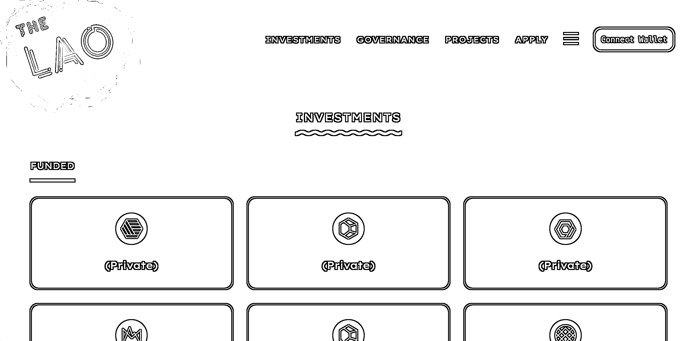

# 7.5.1 The LAO - 投融资

网址：[`www.thelao.io/`](https://www.thelao.io/)

The LAO 这个项目，可以理解一个小型私募，提供对 Web3 项目的投资、融资服务。

这个项目实际是由美国特拉华州的一家公司在运营，虽然是 Web3 的所谓去中心化组织，但实际上，这家公司的运营是受到该州的监管和合规的。

这个 DAO 具体怎么运转的呢？

这个 DAO 上限只能有 99 人，加入这个 DAO 的人，需要提供 310 个 ETH，大约是 300 多万美金的资金进入投资的资金池，才能成为会员。可以提案项目并对项目有投票权。

310 个 ETH 对应 0.9% 的项目治理权或者股权，存的越多，权重越高。投的项目赚到的钱了，分的也越多。

对于需要资金的项目，也可以填写自己的项目信息，让这个 DAO 中的成员发起投票，是否对齐进行投资：[`docs.thelao.io/`](https://docs.thelao.io/)

