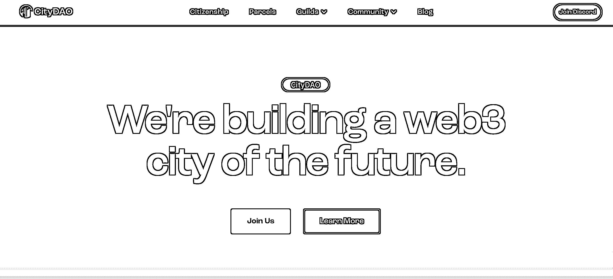

# 7.5.3 CityDAO - 买地

网址：[`www.citydao.io/`](https://www.citydao.io/)

CityDAO 的成立目的是众筹买点，然后在买的地上建一座 Web3 的城市。

这件事情的背景是，美国怀俄明周在 2021 年 4 月通过了地方法律，承认了 DAO 可以作为一个合法的有限责任公司存在。

然后，一个互联网公司的创始人，在 twitter 上发布了自己的想法，建立一个 DAO，实现在这个州买地，然后把这个地上链，NFT 化。

随之有很多人加入，以售卖 NFT 的方式筹集买地的资金。不到 1 个月就筹集了超过 25 万美金。2 个月后，完成了第一块土地购买。

