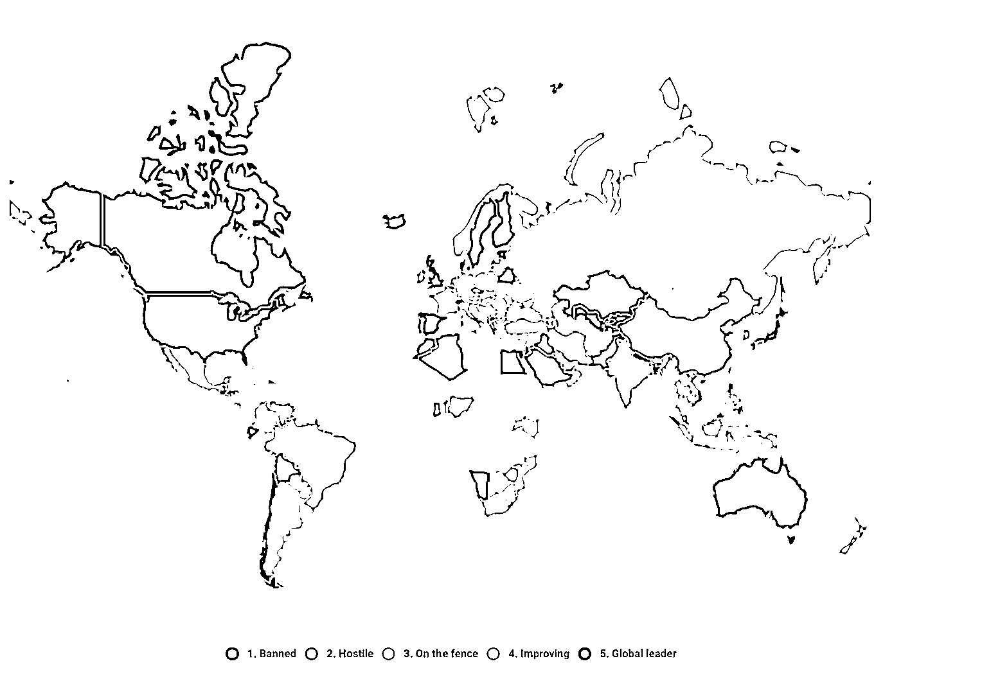

# 8.1 Web3 的监管逻辑

监管合规，是任何一个行业都不能回避的问题，尤其是 Web3 这样在金融领域进行革新，同时快速增长的行业。这章节，我们来一起了解下 Web3 的监管逻辑以及各国的监管政策以及目前监管相关的 Web3 公司。

首先我们尝试从国家政府的角度去理解，为什么要有监管？我觉得主要出于以下三点：

1.金融管控

2.民众维权

3.税收

金融管控，我们知道比特币区块链技术的诞生，解决的就是去中心化，点对点支付的问题。

在现在的世界，一旦点对点支付，那么就必然会涉及到一些政府监管的盲区，比如洗钱、赌博、黑市交易、传销等问题。这类问题本来就属于传统的金融监管范畴，不管是在 web 几，都应该受到政府的监管。

对于这类问题，在 Web3 中目前也有两派，一派认为，完全的去中心化就是任何都可以交易流转，个人产权和隐私更重要，另外一派就是合规派，认为去中心化需要收到监管合规的约束。

因为 Web3 自带金融货币系统，参与到项目中的民众，自然就会有资产安全的问题。

比如我们之前举例的 UST 这个稳定币，民众把 UST 当作了美元，但是这种所谓的美元价值归 0 了，这时候就会有大量的民众开始找政府维权。我们也看到，Luna 崩盘事件后，韩国政府也开展了对 Terra 公司的调查。

所以一些 Web3 的公司，从最开始就做合规，比如 USDC，在政府监管背书的基础上，开展 Web3 相关业务。

Web3 的组织形式是 DAO，组织中通常流通的货币是加密货币，这也会涉及到很多税收问题。因为税收基于法币体系。不同国家，也开始建立相关的法律法规，有的国家要对 Web3 行业收税，有的国家免税，不同国家政策不同。

我们可以先来看下全球对加密货币的监管政策。红色是禁止，橙色是敌对、黄色是中立、浅绿色是支持、深绿色是全球领导者。这样我们就有了一个全局的视野。

