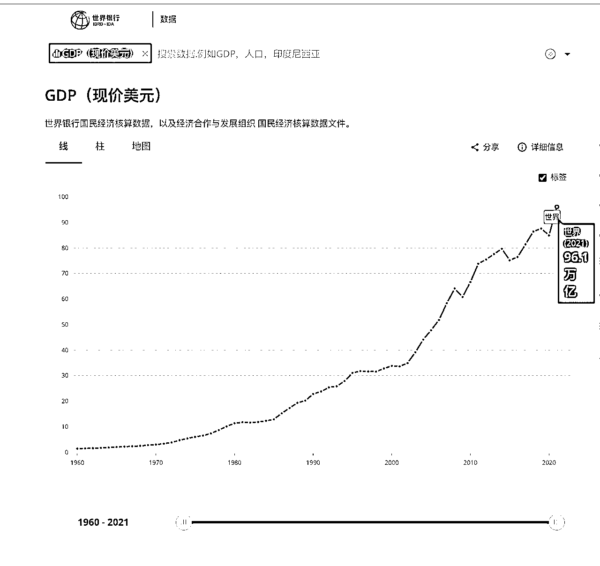

# 9.1 了解机遇

一个生意或投资，如果不清楚自己赚的是什么钱，那么韭菜就是自己。

基于上述，我觉得参与 web3 赚的钱主要可以分为两部分：

1）纯金融层面，我们在这个赛道赚的是先发优势

很多人不理解比特币、以太坊这些的价值，本质原因是对价值和金融的概念不清晰。想要把这些概念搞清楚，可以通过回答下面几个问题找到答案：

1.货币解决的是什么问题？

2.黄金为什么会有价值？

3.金融解决的是什么问题？

4.当今世界的货币有哪些用途？解决的是什么问题？

5.web2 的发展，我们赚的是什么钱？

6.比特币解决的是什么问题？以太坊解决的是什么问题？

这里我简单分享下我对上面几个问题的理解。

解答问题一：

在没有货币以前，事物的价值是没有量化标准的。在货币将事物进行定价后，事物就有了价值。这里的事物，既可以是有形的，也可以是无形。可以是有用的，可以是无用的。人类通常对无形、无用的事物更容易形成统一的共识。

解答问题二：

在几千年前，那时候还没有货币，这时候充当货币的是黄金。黄金的出现解决的是什么问题？ 当一个人想和另外一个人以物易物的时候。最原始的方式是：我 10 个斧子，你有 10 头牛。我有 2 个不用的斧子，要和你换两头牛。于是达成交易。如果这个拥有斧子的人想要换更多的资源，就出现了一个问题，并不是所有的人都需要斧子。这时候，慢慢黄金就杀出来了。人们都能接受各类物品对这种金属的兑换。于是，黄金就这样有了价值。为什么黄金能从众多事物中杀出来成为价值标的物？因为黄金具备的下列属性符合人性：稀有 / 数量有限、稳定、恒久、便于携带、可分割。

解答问题三：

资产本质是什么？货币本身成为一种商品，这就是资本。如果把货币当作一种稀缺资源，那货币也可以生产出各种金融产品。货币给风险定价叫做保险和期货，货币给企业定价叫做股票或债券，货币给房子定价叫房产。在被货币定价以后，这些稀缺资源，就变成了我们一般人理解的资产。这些金融产品，通过借本生息的商业模式，提高了整个社会的资源配置效率。某人的钱不用了，放在金融机构，金融机构把钱以一定的利息借出去，借本生息。这个商业模式非常厉害，一旦出现，很难消失。

解答问题四：

货币的铸造权在被中心化政府掌控以后，除了给事物定价外，执政时长有限决定了，大概率会使用通货膨胀来刺激经济。于是，新货币的产生，总是使得最初的货币使用者受益，而最后使用者受损。只是不被普通人察觉而已。通货膨胀是一把双刃剑。好处是经济繁荣速度加快。弊端是普通人的劳动价值被稀释。

解答问题五：

按照货币的定义，本来你有 1000 元，现在印钱，多送给你 100 元，那么你是赚了还是亏了？人的直觉会以为自己赚了，实际恰恰相反。上一波互联网，钱从美联储印出来，到各大华尔街金融机构，分发到全世界。为什么很多互联网公司不赚钱，最终也能多倍估值上市变现？因为市场钱多，本质是在做货币的击鼓传花。这是过去两年垃圾互联网概念股暴跌的本质原因。

解答问题六：

web3.0 概念的源头，比特币和区块链技术的出现，点对点的电子支付系统，解决的就是主权货币带来的弊端问题，仅此而已。而以太坊是将这种金融理念运用到其他体系的平台工具。详细的大家可以看手册，这里不展开。

如果将比特币类比于黄金，那么当比特币总市值等于黄金总市值的时候，比特币的价格是多少？

[《当比特币总市值等于黄金总市值的时候，比特币的价格是多少？》](https://www.1234xl.com/archives/3420)， 这篇文章做了个简单的估算，大概是 50 万美金一个，现在的价格不到 2 万美金，25 倍空间。

如果把加密资产按照货币美元 M2 进行类比估算。下面是世界银行 2021 年统计的全球 GDP，将近 100 万亿美金。

各国政府广义发放的货币，在 2020 年，大概是 GDP 的 1.4 倍，我估计这两年疫情大放水，实际的数据可能是 GPD 的 2 倍。假设是 200 万亿美金。

如果最终加密货币占据广义货币的 30% 的市场份额，现在加密资产市值是 1 万亿美金，大盘还有 60 倍的空间。

这部分，我们赚得就是认知的先发优势的钱。先形成共识的人赚后形成共识人的钱。web3 和 crypto 的出现，让普通人有了成为最初货币使用者机会。

说完了金融部分，我们再来看纯商业活动。

2）在商业创造价值层面，我们赚的是：web3 生态中，那些快速增长，且能源源不断产生利润的公司的增长回报。

什么样的商业活动能创造价值？生产可以，创造可以，为什么生产和创造可以创造价值？因为这些活动解决了人类的问题，提高了生产效率。

我们要看 web3 解决的是什么问题？

互联网解决的是什么问题？把信息流动的成本降到几乎为 0。

web3.0 解决的是什么问题？把资产信息的成本降到几乎为 0，是互联网变革中最后的一个板块。

截止目前，互联网只提高了信息网络效率，没有提高价值网络效率。在这样赛道的背景下，我想细分领域一定会有百倍 + 增长的机会出现。

创造价值以后，货币会对此价值进行标记。体现出来的表征概括来说就是两个字：盈利。

如果一个公司能回答清楚下面的几个问题，我认为无论在 web 几都是非常好的。回答不清楚，无论在 web 几，都是垃圾公司。

为什么人，提供什么产品服务，收谁的钱，收多少钱？

在客单价、人群规模、转化率、复购率、转介绍率、毛利率这些指标上是否有长期优势？

比如币安，虽然是交易所，本质上和腾讯没有任何区别（赌场和游戏的运营本质没有区别，这类商业模式的结果就是高毛利润）。

毛利润高，做个平台，更多的用户使用，进而有更多的项目在平台发售，形成生态垄断，并投资更多的生态初创企业。但它的商业模式是典型的双边市场商业模式。

上次我去参加活动，得到这样一组数据，web3 目前全球开发者月活不到 2 万。web3 的国内投资活跃用户群体估计不到 20 万。全球用户在几百万的样子（从关注以太坊创始人 V 神的粉丝数也可以看出）。对于全球互联网用户来说，还是有巨大的增长空间。

像币安这类商业模式跑通的公司，以后一定会出现。这类公司是不发股票的，只有 web3 世界自己共识 token，就是我们所说的加密资产。

目前 web3 世界还处在非常早期。

