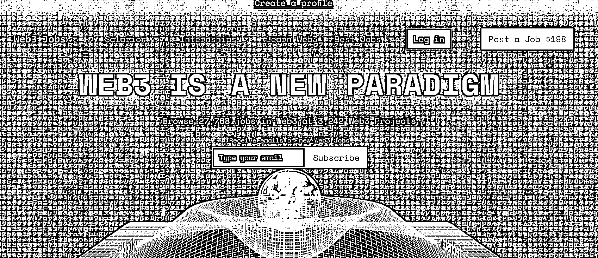

# 9.3.2 渠道 2：Web3 招聘网站

聚合类的 Web3 网站，也是一个高效的获取 Web3 招聘信息的渠道。

以 Web3.career（网址：[`Web3.career/`](https://web3.career/)）这个招聘网站为例，在主页可以看到最新发布的工作信息，我们可以看到，很多工作都是支持远程办公的。

岗位上，分为技术岗和非技术岗，以及兼职岗位，可以看到一些工资高或者很受欢迎的工作岗位。比如第一个开发岗位的薪资，可以达到 70 万 - 75 万美金一年。这是很高的一个薪资水平。

我们再来看下非技术的岗位：

包括市场拓展、社群运营、增长、HR、战略、营销等岗位，薪资在每年 10 几万美金到几十万美金不等。设计师包含了产品设计，基金设计等岗位，很多也都是支持远程办公的。薪资在一年几万美金到 20 万美金不等。

具体的岗位要求可以概括为两点：岗位能力和行业能力。

岗位能力是一个人的底层工作能力，这个能力和在 web 几无关，无论你是做商业拓展、增长还是产品、运营、营销，这类底层能力是可以直接迁移的。

另外一部分就是行业能力，相信通过本手册的学习，你已经对这个行业有了初步的认知。Web3 因为整个行业还处在早期，行业门槛没有大家想象的那么高。如果你的学习能力很强，应该可以快速入行。

我身边的朋友，就有 21 年入行，22 年他所在的 Web3 项目就上市了，这是快速发展的行业带来的个体机会。后面大家可以通过加入相关团队，实践相关项目，持续学习，进而不断提升自己的行业认知。