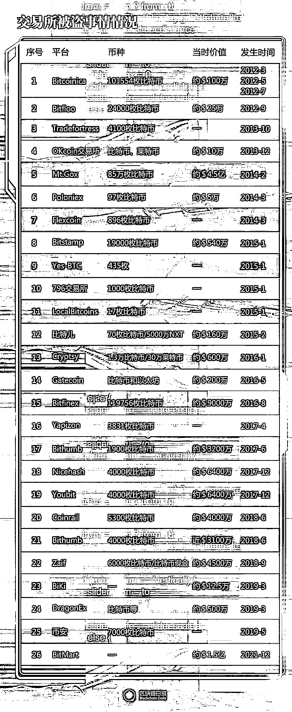

# 10.1 资产安全的重要性

据《区块链日报》记者不完全统计，截止 2022 年仅交易所已经发生的 28 起比特币被盗事件，损失就高达 120 万枚比特币，按照比特币 2 万美元结算，被盗金额达到 240 亿美元以上。这还没有计算个人钱包被盗。

除了被盗，还有因为管理不当造成的资产遗失。

区块链分析公司 Chainalysis 在 2020 年发布的一份报告称，至少有 370 万 BTC 至少有五年没有被触及。加密数据公司 Glassnode 估计，大约有 300 万比特币将永远丢失了（拓展阅读：[《加密交易所历年被盗情况：超 120 万枚比特币、530 亿美元被盗》](https://finance.sina.com.cn/world/gjcj/2022-02-15/doc-ikyakumy5939238.shtml)）。

丢失的原因包括遗忘了自己的钱包私钥，或者私钥物理丢失，造成资产永久无法召回，变成了沉默资产。

Web3 的历史上，每隔一段时间，就会出现一次大型的黑客盗窃事件。如门头沟事件、以太坊 DAO 硬分叉事件。

我身边很多人，都出现过因为操作不规范或失误，出现了资产被盗的情况，少则几千上万，多则几千万。

如果把资产比作 10000 这一串数字，那么安全，就是这一串数字中的那个 1，任何没有安全保障的投资，都有竹篮打水一场空的风险。

我经常举的一个例子就是有一个老板，在价格很低的时候囤了几十个比特币，囤了好几年。到去年，一颗比特币涨到了 6 万美金，约 40 多万人民币，但是因为把助记词放在线上笔记中，造成资产的丢失。几千万资产瞬间归 0。让人惋惜。

这一节，我们和大家一起学习下，如何尽量规避在 Web3 的资产风险问题，降低自己蒙受损失的可能性。

