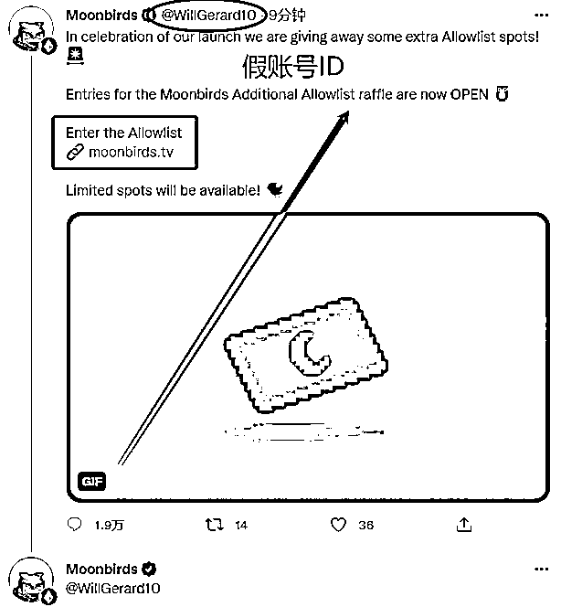
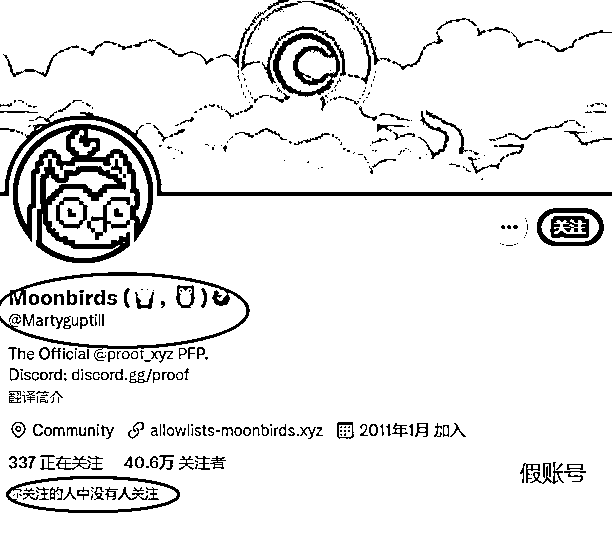

# 10.2.1 案例一：假冒蓝 V 钓鱼

人们容易对权威产生迷信，这是底层的心理学原理。这种心理，在 Web3 就体现在，面对大 V 失去独立思考和判断的能力。比如下面这个案例：

这个骗子，通过买假粉，把自己包装成了一个 Twitter 大 V，然后在他发布的内容中嵌入了钓鱼网站。很多人因此被盗，自己的钱包资产被转移走。

这里需要大家警示的点：

1.有蓝 V 不一定可靠

2.粉丝数和是否是骗子无关。Twitter 的粉丝数量非常容易造假，且成本非常低。我们看一个账号，要重点他的历史内容和和互动量。粉丝数，不重要。

3.不要点击任何来源不明的网站