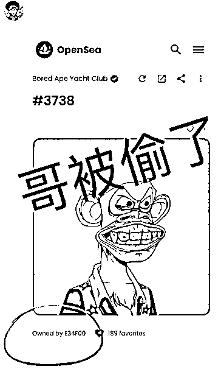
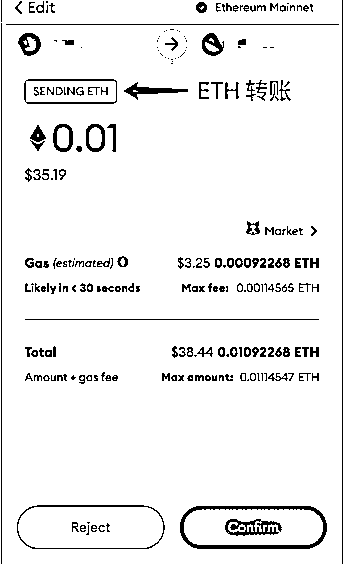
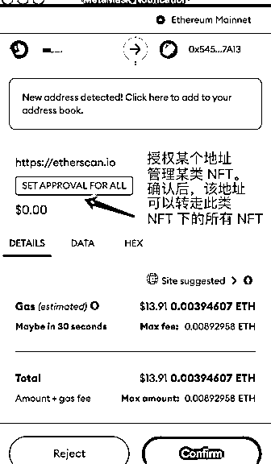
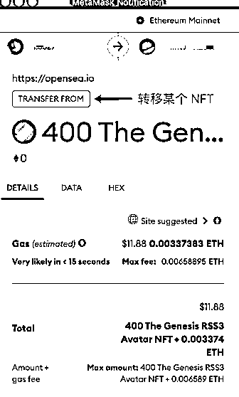
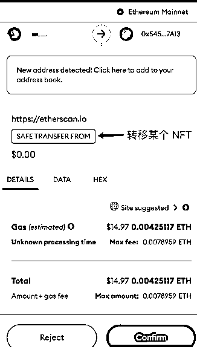

# 10.2.2 案例二：周杰伦的无聊猿被盗

2022 年 4 月，周杰伦发了一条 INS，哥被偷了。他的好友赠予其的无聊猿 BAYC #3738 被盗。

过程是这样的，4 月 1 日，周杰伦，将自己的钱包交给别人去参与新的热门项目交互，但是因为朋友遇到了钓鱼链接，最后导致了钱包中的资产损失。

经过专业团队分析，此次被盗，其中关键就在于，周杰伦的这个朋友，在操作钱包时，点击了 set approval for all 这一步的授权。

这个授权是什么意思呢？就是，在确认以后，被授权的人就有了转移你钱包所有资产的权限，就像拿到了你的保险柜钥匙一样。

我们在 opensea 上进行交易，也是需要这样的授权的，这样买卖双方才能更好的通过平台进行交易。

所以，对于不想让自己被盗的同学，可以在使用钱时，仔细看钱包交易时这里的小框框提示。如果遇到了这种授权转移走你全部资产的指令授权。那就要格外小心了。

除了 set approval to all 这类指令，还有其他的指令，也带大家一起学习了解下。

MINT：铸造一个 NFT

发送代币指令，sending ETH 就是发送 ETH：

授权某个地址管理某类 NFT，确认后，该地址可以转走此类 NFT 的所有 NFT。骗子经常会有这种指令，如果你不小心点了。你的资产就可能被全部转移走。

转移某个 NFT，确认后，你钱包的某个 NFT 会被转走：

