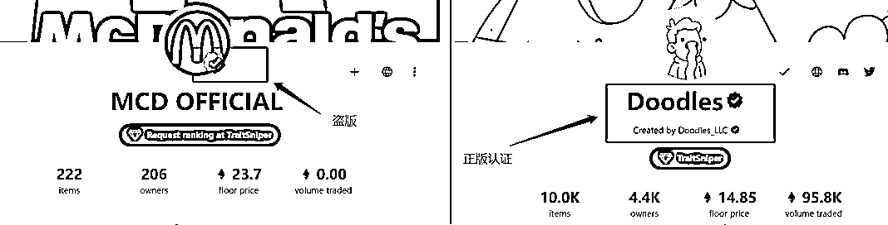
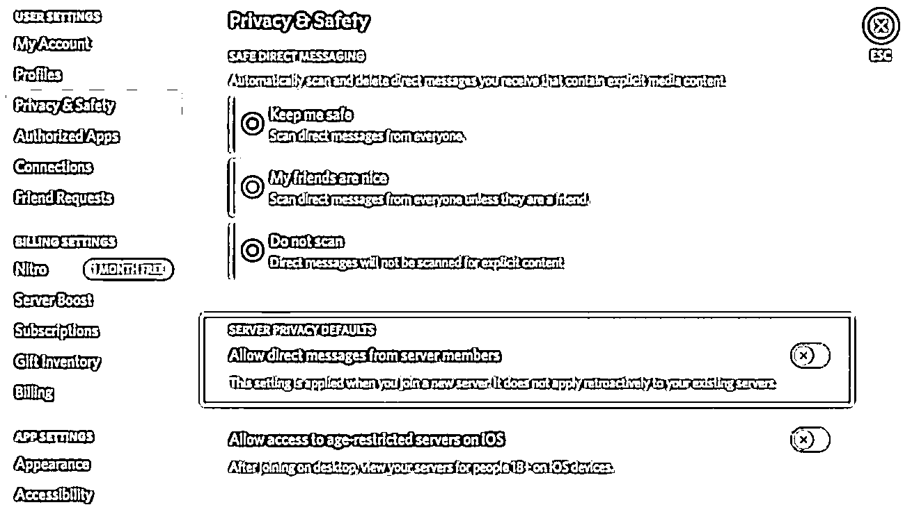

# 10.2.3 案例三：Discord 骗局

在 discord 中有非常多的骗子，专骗 Web3 小白。常用的方式有两种。

第一种是，你加入的 discord 群，本来就是假冒的项目方，里面的内容都是为了骗你。曾经有人，花了很多钱，买了一堆假的 NFT，就是落入了这种假项目方的圈套。

第二种是，你加入了一个真的 discord 群，但是，会有人冒充群管理员来私信你

对于这两种场景，大家要做的：从官方渠道获取 discord 链接，确保自己进的是真的群。

在获取官方渠道时候也要小心。骗子冒充官方的方法非常多，比如假的官网，或者假的 opensea 官方认证。比如这个图中的图 1，这个蓝 V 认证，是在头像上自己 P 的，而不是真的获得了官方认证。

对于第二种，大家可以这样和自己说，主动来私信的，都是骗子。

在 discord 里有个安全私信设置，大家可以设置下，这样就能屏蔽掉那部分主动和你私信的骗子。

