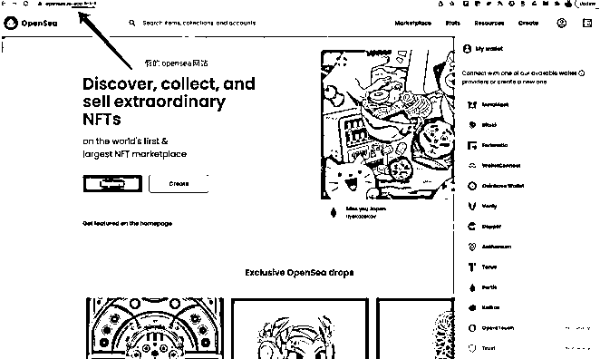

# 10.2.4 案例四：假官网，优化搜索排名，骗你输助记词

这个场景我就被骗过，好在，我当时的钱包里是没有资产的。

大家平时经常通过搜索引擎搜索各类信息，比如通过 Google 来找 opensea，排在第一的搜索结果直接进入。

进入网站之后，网站就要求你输入助记词，很多人受到话术的引导，想都没想就输入了。我们知道，助记词，就是你的资产，别人拿到了你的助记词，就可以转移走你的全部资产。很多人就是因为中了这个套路，自己的加密资产就全部被盗走了。

市场上有各种假冒网站，对官方进行高度模仿，然后通过谷歌广告投放，优化排名等方式，诱导新手掉坑。

这里大家要记住这样一个要点：任何网站，都不会让你去输入你的助记词。

