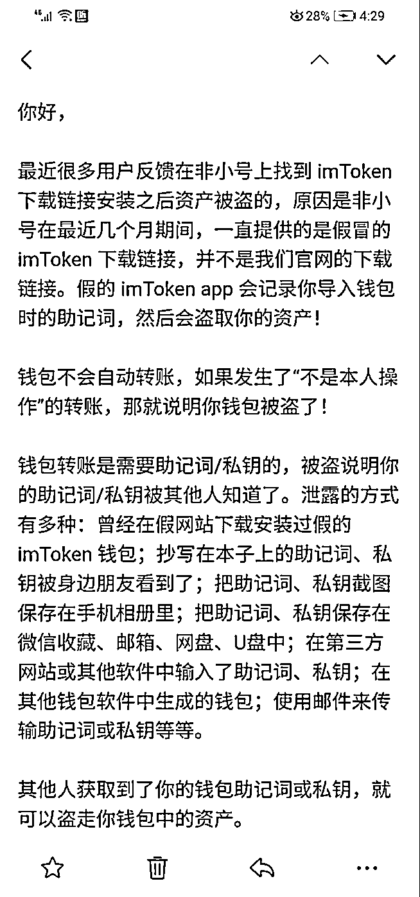
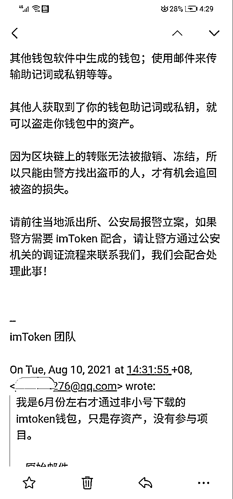
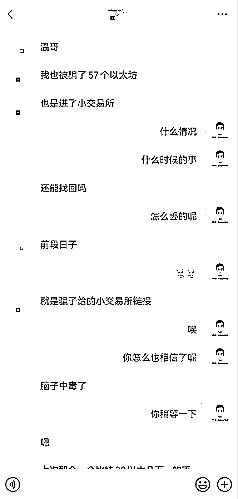

# 第⼀条：官网下载，安全前提

web3 应用，⼀定要到官网去下载。

说到这里，你可能会想，这不是⼀句废话么？但是我身边从去年到今年就有好几个⼈因为没有去官网下载而出现资产被盗事件。

这里我举个例子：

在去年 8 月份的某⼀天，社群的⼀个学员给我发信息，说他的三个钱包，从来没有领取过空投，也从来没有授权过任何应用，怎么无缘无故地在 8/5 日被盗走了 15 个 ETH 和 0.1 个 BTC (当时价值 34 万⼈民币左右) 问我是什么原因。

我说，会不会是之前你有将私钥或者助记词的截图保存到相册中，或者在社交工具有传输过私钥和助记词之类的行为。

他说，不可能的，他说自从上⼀次丢了以太坊之后 (上次丢币是因为他将他的钱包导入了⼀个很偏僻的小钱包，后来被盗了)，他就非常小心了，而且专门下载了⼀个新钱包保存自己的资产。

我当时也感觉到很奇怪，我说，那你把被盗钱包的转出地址发给我看看。总共有两个以太坊地址和⼀个比特币地址，我打开了以太坊浏览器，查看后发现基本都是在 8/5 日这⼀天钱包有多次的转入，随后骗子将转入的资产全部通过 Uniswap 兑换成了以太坊。两个地址分别有 134 个 ETH 和 96 个 ETH，还有⼀个是比特币的地址，里面资产已经全部转移了。

如果说钱包是真的，没有问题，也没有做个任何授权，私钥助记词也没有泄露，那么怎么可能无缘无故地被盗呢？我当时也百思不得其解，我就建议这位学员你先把你的情况给 imtoken 客服发封邮件吧，看看 imtoken 怎么说。

结果邮件回来后，才真相大白。

原因还真是他使用了第三方渠道下载的 imtokenapp。当邮件发过来的时候，他才记起来了，的确是在 6 月份的时候又重新下载了⼀次 imtokenapp。当时就是在非小号上下载。

后来这件事，我尝试让他报警（虽然我内心知道报警追回的成功概率很小，但是还是让他去试试），他也去了，结果还是不出我所料，当地警方根本都不接，也不立案。

非小号是什么平台？是加密中文市场最大的行情数据查询平台。这样的平台都出现了这样的⺓蛾子。很多人起初是因为相信了非小号，所以直接在其上进行下载，结果没想到还是假的，最终还是没有逃脱掉虎口。

除了这个活生生的案例之外，还有好几个，比如下方这个，已经都是 4 年的老司机了，依然犯了⼀个不该犯的错误。丢失 57 个以太坊，当时价值 148 万。

