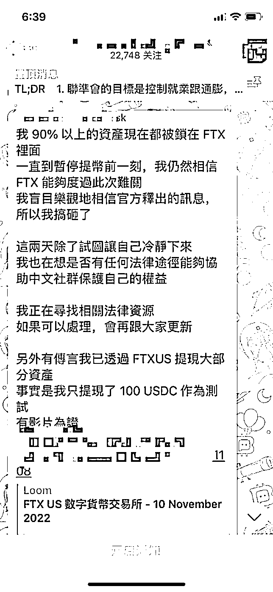

# 第二条：分散存放，重视风控

这⼀条，我分享出来，凡是在这个圈子的应该都知道。11 月份这个圈子发生最大的事件就是全球排名前 3 的交易所 FTX 交易所暴雷了。暴雷的原因有多个方面，但是核心原因还是因创始⼈ SBF 挪用了用户资⾦造成的。

这件事起初被报料出来是因为 coindesk 上的⼀篇文章，当时这篇文章分析了 FTX 交易所和 alameda 的资产负债表有些异常，于是就开始了大厦将倾的发酵前奏。后来全球第⼀大所 binance 创始⼈ cz 也知道了这个情况之后，于是发推要全部售出其持有的 FTX 平台代币 FTT 以规避风险。

结果本来就有问题的 FTX，在 CZ 发推后，市场再次陷入恐慌。FTX 平台代币 2 天时间直接从 20 美⾦跌到了 2 美⾦。当然这中间还有⼀波三折，这里就不详述了。

而这个过程中，风控意识很到位的，可能第⼀时间听到这种消息，就早早提币了。风控意识差的，或者反应慢的可能就被埋了。我自己本⼈也是被埋的⼀个。当时也是大意，因为里面只有不到 1000 美⾦的山寨币资产了，所以也没放心上，当我觉得事情很不妙的时候，已经来不及了，不能提币了。

而和我⼀样的，就更多了，从金额上来看，我这⼀点什么都不算，身边几个其他社群我知道被埋不低于 50 万的就好⼀些。

而这些被埋的朋友中，当初没有提币的原因大概可以归纳为下面几条：

•当初在 FTX 打新赚了小几⼗万，觉得这个交易所很不错，倒的概率很小；•当初在几美⾦买的 FTT 也赚了不少，所以觉得交易所很不错，倒的概率很小；•是美国两党爱护有佳的交易所，怎么可能倒呢 (创始⼈给两党捐了不少钱)•……

总之以上的原因就归纳为⼀点即：以为这个交易所不会出问题的。

可是最后的结果是不仅出问题了，而且还出大问题了。下方这个截图是电报群的某个群主的截图，很令人惋惜。

这件事给到我们最大的启示就是当交易所遇到数据⼀丁点异常的时候，这个时候我们的第⼀反应是提币！而不是本能以为「这么大交易所不可能吧、别被 FUD、创始人很厉害」等等。

因为这些都不是⼀个平台不倒的充分条件。而提币也就是几分钟而已，哪怕最后验证该平台没有问题了，再提过来，又有什么损失呢？

另外，还有⼀个非常重要的就是可以把资产大部分放入到钱包，小部分可以放到你常用的交易所 (大所)，这样也方便也分散了。我的个人原则中，交易所存放的资产⼀般不会超过 1/3。