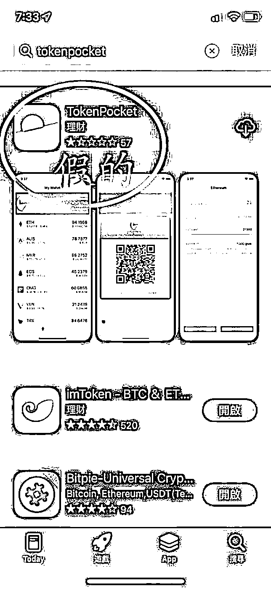
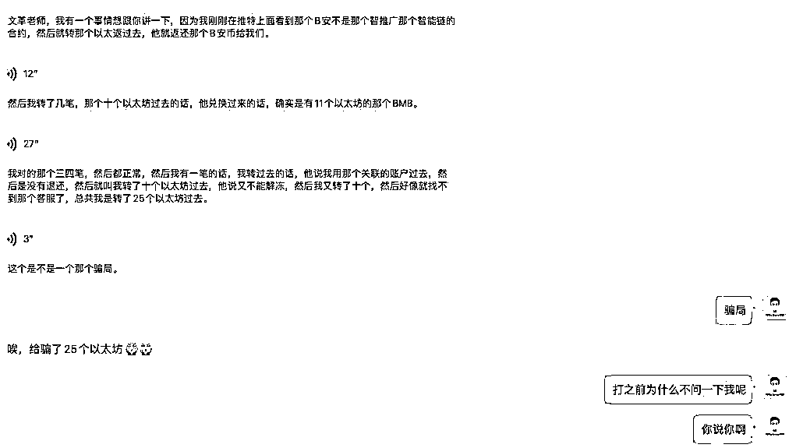

# 第三条：授权过后，及时取消

钱包若有过链上交互及时取消授权。

从 2020 年开始，链上生态越来越丰富，自然链上交易行为也越来越多。而在这个过程中，为了避免某些协议出现合约漏洞造成的资产风险，因此，建议有在链上参与⼀些活动的，及时进行授权的取消。

这里分享 2 个取消授权的网址，大家收藏：

[`revoke.cash/`](https://revoke.cash/)

[`etherscan.io/tokenapprovalchecker`](https://etherscan.io/tokenapprovalchecker)

当然除了以上我们最常见的安全高频发的，还有⼀些其他的安全注意事项，比如：

用钱包不要扫陌生二维码陌生的不了解的空投不要领取 appstore 也有可能有假钱包

很多人以为 applestore 应该不存在这种假 app 吧，但是加密领域中，⼀个著名的 tokenpocket 钱包假的比真的做工还精良。大家可以看下图：

最要命的是，在当前这个阶段，真的 tokenpocket 竟然在 applestore 上搜索不到…

还有 YouTube 上的⼀些骗局，类资金盘的骗局，比如前几日我的⼀个社群成员遇到的：

