# 小红书爆款选品** **合集

最新的小红书爆款选品风向与方法

整理日期：**230807**

懒人专属群的群友大家好。小懒继续给大家带来一份小红书爆款选品** **合集

本文档为懒人专属群内部分享，懒人手动整理。

生财风向标和周报系列另外用文档分享，地址见专属群q群消息。

往期的生财周报合集（含在线版和离线版），见专属群Q群文件和群公告。

希望大家有收获~

标题加了(精华)的表示精华贴，前面为截至今日的点赞数。

以下是目录，内容有些多。大家可以挑兴趣的内容阅读。

懒人专属群更新记录（点此跳转）

 

 

# **# **目录

小红书爆款选品** **合集

目录

【最新风向标】**16**篇

(194赞)小红书创意实用好物博主，是一个选品思路

(160赞)小红书选品：章鱼哥的墓碑成为热门话题

(154赞)抖音卖“九连环”小玩具，销量达到了 9W+，可用到小红书店铺(146赞)小红书定位功能性女生用品的账号，2年左右，累计卖了26.8万单(113赞)挖掘小红书小而美店铺（4）爆单的小清新手机壳店铺藏都藏不住(107赞)小红书无货源电商选品参考案例

(75赞)巧妙选品的水杯设计账号，成功转化客户并大量销售

(69赞)小红书章小蕙的选品非常不错，不是大众货+高客单价，瞄准贵妇人群(66赞)小红书女性用户购买男士私处护理液，拓宽选品思路

(81赞)博主通过惊喜福袋创造了高销量和粉丝数量

(60赞)闲鱼热销游戏卡带，每天 20-30 单，利润可观

(106赞)可爱驾驶证皮夹，销量 7000+，利润超过 200%

(39赞)电商选品，热裤搜索量飙升

(86赞)小红书电商的单品思维：选择热门或小众产品

(31赞)拆解抖音账号优趣优品

(30赞)小红书颜值测评变现保姆级教程

【从** 0 **到** 1**】**12**篇

(精华帖)(1111赞)从小红书电商小白到两周单店变现 78W GMV，付费流打法实战单周投放 Roi 10+

(精华帖)(464赞)地表最强的小红书无货源电商（保姆级教程）

(精华帖)(387赞)我是如何通过小红书，两个月带货营收 30 万＋

(349赞)我是如何通过小红书无货源电商三个月营收 50w 的？

(精华帖)(325赞)小红书无货源电商实战分享

(精华帖)(281赞)小红书店铺靠笔记带货破百万营收，我做对了什么？

(精华帖)(193赞)千粉不到月入 10W ，我如何通过小红书救回濒临倒闭的艺术体验门店？

(精华帖)(191赞)新手在小红书上做水果团购项目，半年利润近 10W ，我是如何从0 到 1 的？

 

 

(精华帖)(183赞)我如何自建小红书运营团队，通过矩阵引流月变现 20W ？

(精华帖)(140赞)从女鞋企业号矩阵开始，我如何规模化地在小红书选品、引流并变现？

(106赞)操作小红书店铺无货源，单品如何从0做到月销30万？

(86赞)小红书店铺航海  半月GMV破 10W

【选品方法】**13**篇

(精华帖)(261赞)小红书单店铺单月6000+利润选品保姆级教程

(精华帖)(252赞)小红书店铺如何 1 个月做到月流水破 50W

(190赞)能提高40%销量的小红书选品思路

(精华帖)(182赞)小红书自动引流系统淘客月佣 9W

(144赞)按照圈层选品非常精准

(137赞)小红书用户热衷的产品，对选品和挖需求有借鉴作用

(138赞)小红书选品可参考禅小红

(104赞)小红书电商从选品到出单全套经验分享

(79赞)小红书无货源电商做女装如何选品？

(57赞)小红书店铺项目关于驱动算法的选品方式分享

(14赞)小红书店铺选品技巧：社区热搜词揭示高曝光、高点击、高成交笔记(9赞)小红书店铺管理下拉，会有笔记搜索热度及笔记缺乏程度

【选品方法**-**技术流】**4**篇

(精华帖)(373赞)如何从小红书千条带货笔记深度挖掘，找到适合普通人的蓝海爆品(157赞)用后羿采集器在蝉小红采集行业信息的教程

(精华帖)(115赞)如何利用数据分析进行小红书电商选品？

(20赞)批量提取小红书笔记，可以提高选品效率

总结

# 【最新风向标】**16**篇

 

 

# **# ****(194**赞**)**小红书创意实用好物博主，是一个选

# 品思路

作者：  半阙酒

日期：2023-05-16

小红书创意实用好物博主。

我看了一下，沉迷其中无法自拔。

感觉有好看又实用。

如果有开店铺的小伙伴去刷一刷，也是一个选品思路，然后去别的平台搜这个类型。

 

 

 

 

 

 

 

 

 

 

 

 

 

 

 

 

 

 

 

 

 

 

评论区：

田小田的甜 : 我也很喜欢看这种哎

亦仁 : 中标，术值+1。

在上方专栏点击 #中标，可查看所有中标风向标。

随想 : 很漂亮

速影 : 这种搜什么关键词可以匹配到？

半阙酒 : 创意室友好物

半阙酒 : 创业实用好物，打错字啦

半阙酒 : 又打错了，创意实用好物，搜这个

速影 : 谢谢[抱拳]

# **# ****(160**赞**)**小红书选品：章鱼哥的墓碑成为热门

# 话题

作者：  金九渊

 

 

日期：2023-07-07

小红书选品

章鱼哥的墓碑很火呀，博主就靠这个品卖了快10w了，笔记点赞都有单篇5w+的。

 

 

 

 

 

 

评论区：

lydia : 第一次听说这玩意[憨笑]

陈真 : 不太懂，有大佬解释一下吗？

南意 : 海绵宝宝？

亦仁 : 中标，术值+1。

在上方专栏点击 #中标，可查看所有中标风向标

Jie : 小玩具  ，更是大梦想

胖大魔 : 恭喜中标，已催写精华帖[呲牙]

黄增添Tony : 感谢分享[微笑]动漫衍生品，不错[强][强]可以联想其他生态  黄增添Tony : 先了解一下章鱼哥，哈

# **# ****(154**赞**)**抖音卖**“**九连环**”**小玩具，销量达到了** **

# **9W+**，可用到小红书店铺

作者：  疯狂小Z

 

 

日期：2023-05-17

抖音卖益智玩具，很好的选品思路

可用到小红书店铺

短视频带货“九连环”这个小玩具，销量达到了9w+，我们可以看到这个品的售价是9.9元，卖一单的佣金是近4元。

也就是说，这个人通过这一条视频赚了30多万，并且这条视频还在继续跑数据，继续带来收益。

 

 

评论区：

亦仁 : 中标，术值+1。

在上方专栏点击 #中标，可查看所有中标风向标。

Luke王子 : 投流的，要看千川烧几个W

堂 : 我今天也刷到这个

布衣 : 益智类玩具，容易专利侵权

不老什人 : 销量是这个品的总销量吧，还是只是这个视频的销量？

九帆 : 可以找那种过了专利保护期的产品

 

 

布衣 : 这个确实可以，有一家做鞋子的厂家，就是只抄过期专利的鞋子

元气锦鲤😍😍 : 视频的销量

# **# ****(146**赞**)**小红书定位功能性女生用品的账号，**2**

# 年左右，累计卖了**26.8**万单

作者：  陆哲超

日期：2023-05-23

今天小红书店铺航海起航了，刷到一个小红书帐号，我觉得是小红书电商天花板级的帐号，帐号应该做了2年左右，累计卖了26.8万单，单小红书累计的营业额2000万应该是有的，产品定价都在50-100元，定位是类功能性的女生用品，以光腿神器，丝袜，冰袖，内衣，安全裤，抹胸，吊带，打底裤这类产品，成本都低，大部分都不超过10元，而售价都是50+以上，这个选品非常好，我觉得这些选品可以参考。

笔记内容目前以视频为主，帐号的拍摄内容，不管是视频还是图片，都是围绕产品实用来，不是展示女生好不好看，脸不重要，围绕能不能穿，好不好用，视频内容女生出境，用男生配音，很多视频都是不同的女生出境，不同的场景拍的，我感觉像实拍的，但是里面场景和人都不一样，好多视频都不一样，这个不知道有没有圈友知道怎么实 

 

现。

 

 

评论区：

陆哲超 : 这个帐号案例我觉得非常经典，不管是选品，选品，还是带货成绩，有没有有刷到过这个帐号，或者做过这类的，包括帐号的选品，笔记的内容，一起交流一下[奸笑]

亦仁 : 中标，术值+1。

在上方专栏点击 #中标，可查看所有中标风向标。

lydia : 这是个品牌店

lydia : 最开始做倒流淘宝的

陆哲超 : 对的  是品牌店  选的品很好

 

 

陆哲超 : 我看淘宝确实也有店

章果老 : 这家店在淘宝小而美时期就是比较有名的代表之一

# **# ****(113**赞**)**挖掘小红书小而美店铺（**4**）爆单的小

# 清新手机壳店铺藏都藏不住

作者：  落落

日期：2023-05-10

挖掘小红书小而美店铺（4）- 爆单的小清新手机壳店铺藏都藏不住

入选标准：粉不多但销量超高，选品优秀，无带货技巧，无需露脸。

带货表现：不到 2w 粉丝，销量有 10 几万，让我惊叹❗  店铺客单价 15- 30 元之间。

pdd 上零售价可低到 5-10 元。

选品特点：  主打 iphone 手机壳和 airpod 硅胶立体保护壳，清新可爱时尚的风格，客单价比安卓手机要高不少，毕竟花得了买手机和耳机的钱，值得配一个品质好点的保护壳。

带货方式：

视频，一只装饰好看的手来动态显示产品，提高质感。精致的视频封面，看一眼就会被吸引。

特点：  氛围感营造的很好，店铺风格，视频风格和布景很统一，心思藏在细节里。

标题文案：标准的适用机型+风格描述，全靠视频封面。

 

 

 

 

 

 

 

 

 

 

 

 

评论区：

亦仁 : 中标，术值+1。

在上方专栏点击 #中标，可查看所有中标风向标。

落落 : 感谢

groot : 有没有可能是补单呢

SOHO佳文 : 下午刚和一个朋友聊天，他们手机壳厂家做抖音直播，每天也有几千出货量**# ****(107**赞**)**小红书无货源电商选品参考案例

作者：  曜文

日期：2023-02-13

大家好，我是曜文

上周分享了小红书无货源实战流程

 

 

发现很多人对选品感兴趣所以就花了一天的时间整理了部分案例加选品参考和输出内容的方式，希望能对大家有所帮助。

小红书能卖的品实在是太多了但目前基本是以女性小孩为主的产品

目前在小红书做电商，你不需要很多的粉丝

你可能0粉就能出单

更不需要去花大量的心思装修店铺

只需要选好产品，上架产品，布局好关键词，每天输出内容就可以出单

由于内容涉及多图片加视频，所以整理到飞书分享：

https://t.zsxq.com/0bfVshrgs https://go6xq64elg.feishu.cn/docx/JmfRdTyKZouw6nx3xI7cL4hUnpb

评论区：

卢志敏 : 哈哈，看完思路开阔了许多！！！

Liu : 怎么联系

水深无形 : 大佬朋友圈方便围观吗？  最近在操作小红书

曜文 : 欢迎！

Yummy : 想围观朋友圈可以吗？怎么联系你呀~

莫等闲 : 大佬  怎么联系您

斐娜 : 可以加VX交流吗大佬？

顽石上的温度 : 大佬可以加V吗？

# **# ****(75**赞**)**巧妙选品的水杯设计账号，成功转化客

# 户并大量销售

作者：  凌州

日期：2023-07-05

 

 

这是一个水杯设计账号，

选品非常巧妙

二月份可能对水的需求不大

用设计内容来预热积累客户

六七月份正好夏天大量需要水杯

此时将之前积累的客户迅速转化

杯子主色调以撞色为主

从起号就一直在提醒“蹲蹲”

二月起号到现在五个月时间

更新了30+条笔记，涨粉2.2万

评论下方都是好看、怎么买等优质评论

十个粉丝群拉满

已售出一万余件

 

 

有相应设计能力的朋友可以考虑一下这个套路

 

 

评论区：

 

 

那又如何 : 这种是不是发现这个设计火了就得迅速开模做，万一你一直在积累客户等量够了再开模，但是别人看你的设计好直接开模做现成品开卖那就坑了😂

凌州 : 他这个已经申请专利了

亦仁 : 中标，术值+1。

在上方专栏点击 #中标，可查看所有中标风向标

团哥 : 水杯的模具很贵，大几十万，有一定门槛。

团哥 : 国内外观专利也不太好用。

Brewnut : 这个去问了下，是厂家自己的号，有工厂有设计师

菲菲 : 所以的有工厂，由设计师能订做才可以～

Alex : 恭喜中标[呲牙]

# **# ****(69**赞**)**小红书章小蕙的选品非常不错，不是大

# 众货**+**高客单价，瞄准贵妇人群

作者：  孤狼#买量江湖

日期：2023-05-23

董洁模式让小红书尝到了甜头，越来越多主播在小红书直播卖得不错。据小红书用户说，章小蕙的选品非常不错，不是大众货+高客单价，瞄准贵妇人群。

她人格魅力也很强，文笔很好有才华，年纪到了内核也稳定，说话娓娓道来温柔有力量。粉丝说，章小蕙卖的不是货，是一种品味、追梦，一种生活方式。

可以说是小红书非常喜欢的主播了，和小红书主打的生活方式社区非常吻合。

 

 

 

 

评论区：

亦仁 : 中标，术值+1。

在上方专栏点击 #中标，可查看所有中标风向标。

孤狼#买量江湖 : 开心😃

 

 

# **# ****(66**赞**)**小红书女性用户购买男士私处护理液，

# 拓宽选品思路

作者：  大梁

日期：2023-06-24

小红书选品男士私处护理液，没想到这种品也有销量还挺高，这是男生不太可能关注和购买的产品，说明小红书上女性用户也会给男朋友老公买产品，针对这个案例可以拓宽我们的选品思路

 

 

 

 

 

 

评论区：

胖大魔 : 从男的全身一块肥皂，到制造消费需求[呲牙]

王益友 : 不买这玩意，几元钱的硫磺皂比这好用吧

Jun : 感觉这玩意是真智商税

胖大魔 : 有精致的猪猪男孩需要的

亦仁 : 中标，术值+1。

在上方专栏点击 #中标，可查看所有中标风向标。

王炯 : 我就买过[捂脸]

爱张女士爱冰墩墩 : b站很多这种视频  都是女性主镜头进行推荐  关键词  护理  男朋友  爽  等爆点词

欢如平生 : 学到了学到了

# **# ****(81**赞**)**博主通过惊喜福袋创造了高销量和粉丝

# 数量

 

 

作者：  转下脖子

日期：2023-07-25

博主：惊喜福袋  销量：6w+ 粉丝：1.4w 销售额：30w+

商品：惊喜盲盒福袋|主打未知的

账号今年3月份开始发笔记，每天发布的笔记数量10篇左右，每一篇的形式都是与客户的聊天记录，记录客户的盲盒商品以及顾客的反应。主打一个销售未知的惊喜，可以把这套玩法用在其他商品领域，笔记内容介绍售卖的商品类型，唯一售品就是盲盒。

 

 

 

 

 

 

评论区：

豆豆 : 哈哈哈，这个可以，前期没客源的话还可以自己找人伪装下

亦仁 : 中标，术值+1。

在上方专栏点击 #中标，可查看所有中标风向标

# **# ****(60**赞**)**闲鱼热销游戏卡带，每天** 20-30 **单，利

# 润可观

作者：  远方

日期：2023-07-03

编号 02

分享一个闲鱼挺火的产品，游戏卡带，

在闲鱼卖的挺火的，每天20～30单

 

 

有些门槛，但很好做，竞争少

把门槛研究透，就是赚钱

【简单分析下】

商品是挂着卖，同时也是挂着寻回收

我认为大概率

有玩家出售找到他，他会说帮忙挂着卖

由买家找到他之后，直接让玩家发货过去

同时

有人买了

把这游戏要通关之后

可能会再卖给商家

名称:switch游戏卡带

价格:235-280

想要数:394

总销量:1832

近3天销量:65

利润:9-20左右

店铺名称:藤原的店

点评:卡带利润不等  这个类目可持续发展前景不错

 

 

 

 

 

 

 

 

 

 

 

 

评论区：

大圣大老师 : 哪里能拿到货，我找很久也没找到

Irene : 求货源

闰土 : 小红书抖音起号  收  或者拼多多  淘宝  找商家谈

还是得自己收  但是这玩意  前期学  得教不少学费  说道挺多  我从来不敢买二手卡带  都是买新的  怕出问题  小红书这玩意流量挺大的

小橘子 : 我买过，顾客也是他的货源，就他也负责回收

远方 : 商品是挂着卖，同时也是挂着寻回收

我认为大概率

有玩家出售找到他，他会说帮忙挂着卖

由买家找到他之后，直接让玩家发货过去

同时

有人买了

把这游戏要通关之后

可能会再卖给商家

远方 : 二手的，卡带，都是玩家流通

售后不大，几乎0

不会像手机翻新扩容门道太多

亦仁 : 中标，术值+1。

 

 

在上方专栏点击 #中标，可查看所有中标风向标

首页作者 : 这种一般都是去闲鱼淘宝自己收自己卖，卡带二手交易

# **# ****(106**赞**)**可爱驾驶证皮夹，销量** 7000+**，利润

# 超过** 200%**

作者： Believer

日期：2023-07-26

刷到一个小红书很有意思的品

一个可爱的驾驶证皮夹

如图销量7000+

售价14块，搜了一下成本4块

一单超过200%的利润

点进去店铺看风格，整体都是可可爱爱的

果然小红书颜值就是溢价

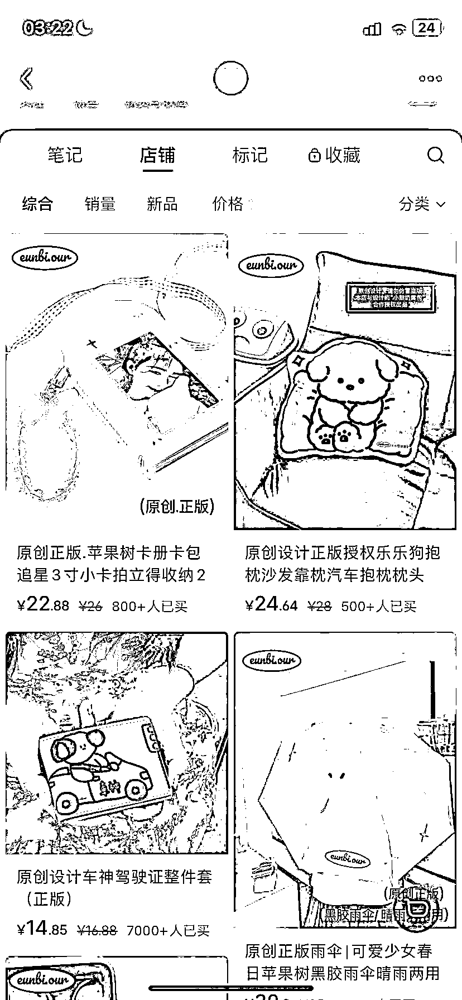

 

 

 

 

评论区：

亦仁 : 中标，术值+1。

在上方专栏点击 #中标，可查看所有中标风向标

零星ちゃん : 这个看着好像是有原创的

# **# ****(39**赞**)**电商选品，热裤搜索量飙升

作者：  令狐峰

日期：2023-02-03

异常值，「热裤」这个关键词，移动端从几乎0搜索量，突然飙升到16万。

 

 

 

 

 

 

评论区：

亦仁 : 中标，术值+1。

在上方 #星球栏目  专栏中，点击 #中标，可查看所有中标风向标。

一登 : 请问这个异常值，是用软件随时监控的吗！

令狐峰 : 是的，用软件监控出来的

一登 : 老师用的什么软件，可否推荐个软件，我也用用

令狐峰 : 自己研发的，还在内测中

封伟-自动化变现 : 测试过一些关键词，微信指数彪升同时排名靠前，搜索关注差异不大。

所以现在都结合微信广告的搜索数据同步参考

易博 : 请问看关键词数据是哪个小程序？

封伟-自动化变现 : 微信指数

# **# ****(86**赞**)**小红书电商的单品思维：选择热门或小

# 众产品

 

 

作者： GS

日期：2023-07-26

做小红书电商，可以试试单品思维，筛选电商平台热门或小众销量还可以的产品，产品能解决用户某一个小需求。在小红书一个账号就做一个产品，持续输出视频或笔记（视频更容易转化），用量来提高爆款概率，一个视频爆了，就不断重复该视频模板。

原创产品更容易做爆，小红书用户对原创产品更愿意付费，产品利润空间也大，红利周期也长，别人模仿也要时间。如：小众挂件，饰品，手链手串。纯原创产品有点难度，伪原创也可以，主要是好看，可爱，特别。

 

 

 

 

 

 

 

 

 

 

 

 

 

 

 

 

 

 

 

 

 

 

 

 

 

 

评论区：

亦仁 : 中标，术值+1。

在上方专栏点击 #中标，可查看所有中标风向标

FF_23531 : 这个卖洗脚袋的我关了的，是那个小学老师吧？2万粉了，她其他养生用品都是几万销量。但是她是做珍珠饰品的😂也卖的很好

GS : 不少闷声赚钱的，销量也夸张

安俊 : 不懂就问，什么叫原创产品[发呆]

草木青（勇猛精进版） : 说的应该是发的小红书帖子，或者视频，做二创，去重。

哆米科技 : 应该是diy之类的，自己设计出来的原创产品

哆米科技 : 应该是diy之类的，自己设计出来的原创产品

草木青（勇猛精进版） : 也许是的，哈哈哈哈哈

# **# ****(31**赞**)**拆解抖音账号优趣优品

作者：  昊东.Lee

日期：2023-02-23

（1）为什么拆解此案例：

 

 

围绕网络热词，然后做成毛绒产品，评论区粉丝给样图，商家帮实现，然后根据点赞量做产品上橱窗。

【流量--产品--转化】三者打通，产品做到了新奇特，而且竞争对手少，有定价权。

（2）这个案例是什么?

A、账号：优趣优品（抖音号：Iffydino）

B、定位：专注布艺家居，绒布玩偶。

C、竞争壁垒：旧要素新组合，同一原材料创新生产出不同产品，原料成本低，物流成本低，反向定制库存问题少。

D、选品：布艺家居，绒布玩偶。一葱多用，蹭热点创新，新奇特覆盖用户广，自带吸粉，反向定制更易跑通MVP小闭环。一方面有形象意义，彰显个性；另一方面有实际用途。

E、配乐：可爱，搞怪类配音

F、视频文案：评论区挑选样图，然后拿出成品展示，展示产品意义和细节功能，最后引导橱窗下单。

直播话术:根据粉丝要求展示产品，讲述产品尺寸和功能，引导点亮灯牌和关注。

G、封面图：图2

H、标题和话题：#毛绒玩具 #谐音梗玩偶 #创意礼物

（3）如何复制案例？

A、人群：20-40岁女性，上班族，宝妈

B、选品：布艺家居，绒布玩偶。激光雕刻绘画、女性手机钥匙单肩斜挎包、各种创意造型指甲。

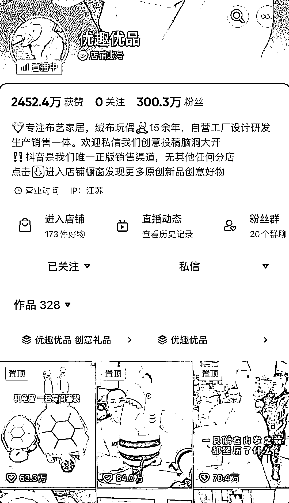

 

 

 

 

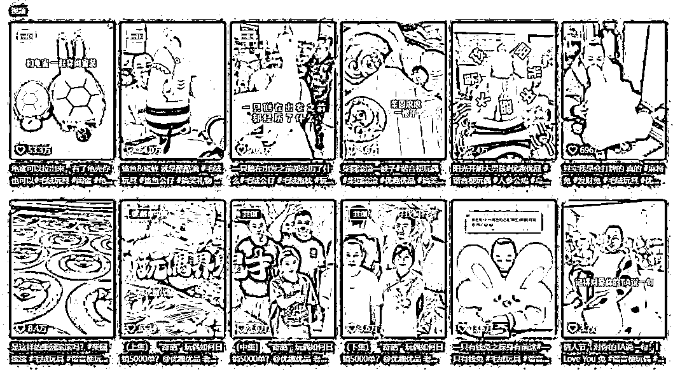

评论区：

昊东.Lee : 这个案例是我比较喜欢的商业模式，有种预感这号半年粉丝能破千万。

小张 : 这个有点牛逼

亦仁 : 中标，术值+1。

在上方 #星球栏目  专栏中，点击 #中标，可查看所有中标风向标。

# **# ****(30**赞**)**小红书颜值测评变现保姆级教程

作者：  书豪

日期：2023-07-10

各位朋友好，我是在杭州的圈友书豪，一个连续创业四年的 95 后，目前连续四年都年入百万。

今天分享一个通过在小红书上做颜值测评引流私域去变现的玩法。

 

 

直接上案例：

 

 

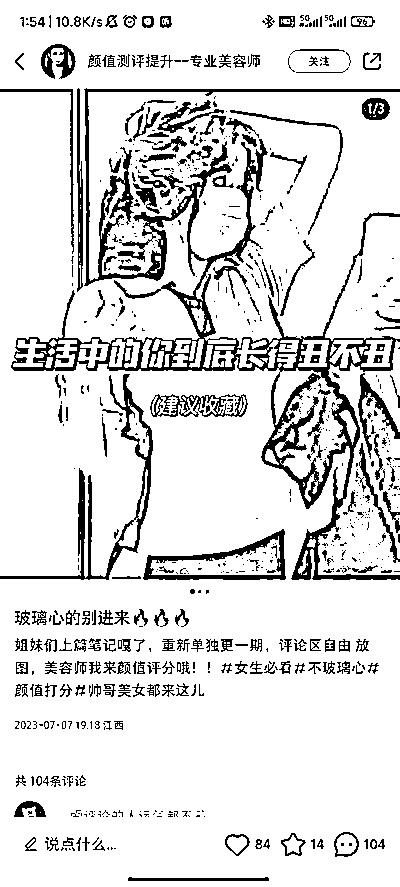 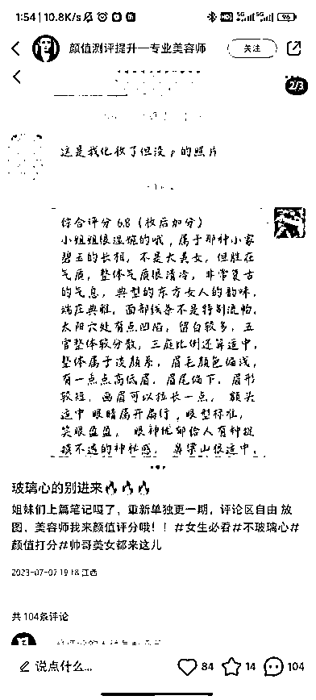 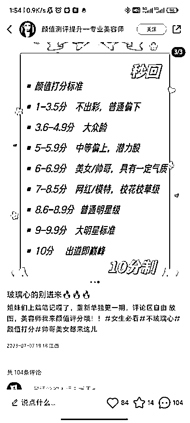

 

 

方法就是做一个化妆师/美容师的人设，通过做颜值测评，免费给网友的颜值打分，如果网友想要更为具体的颜值分析和穿搭风格建议，那就引流微信去付费咨询。

# 本质是利用容貌焦虑

# **# **小红薯设置

名称：颜值测评/颜值打分/颜值分析/颜值评分，后面可再加（专业美容师/化妆师）介绍：专业美容师/化妆师

颜值打分，敢说大实话，提升建议

分析包括：穿搭化妆发型

点赞+关注  可优先打分

建议加文评直接后抬我

性别设置女

年龄设置满18周以上，职业选择美容师和化妆师

 

 

# 怎么做图

其实这种类型很简单，首页拿一张美女的图当底图，然后加点会引起容貌焦虑的文字当作图中标题

比如“别人眼里的你到底好不好看”“如何认清自己的真实长相””玻璃心别来，陌生人颜值打分，“等，就可以当作封面了

内容图就可以直接用手机的备忘录去做，这种图容易爆，看几个案例：

 

 

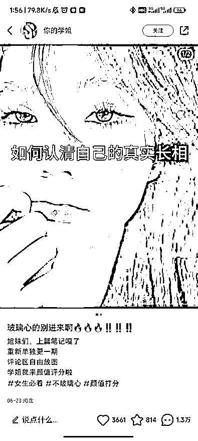 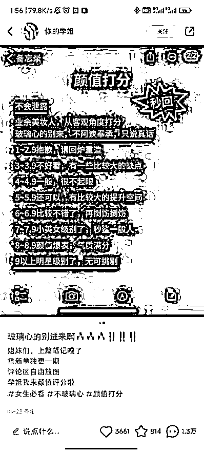 

 

 

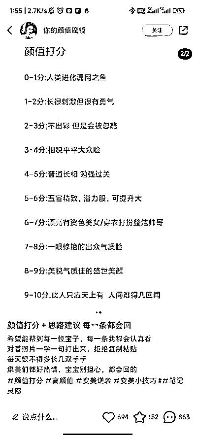 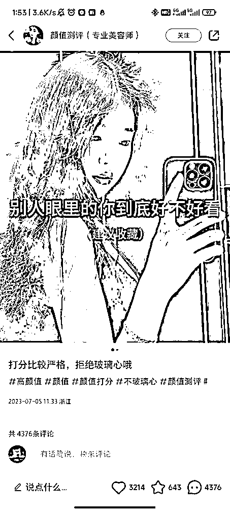 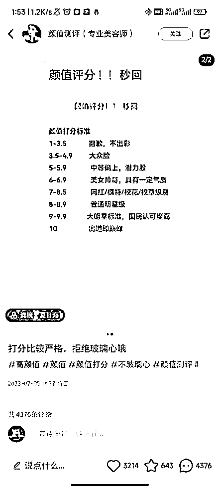

几点建议：

 

 

1、文案不会写可以借助同行的爆款文案，但最关键的还是模板，回答的模板最好是自己原创，里面的内容可以借鉴同行，这样的流量高。

2、去模仿做上述内容的图就可以了，要是流量不好就去换图，笔记标题就用颜值打分＋提升建议，来给你的颜值打分等等，首图文字就用能引起容貌焦虑，诱导用户点击的文字就行，可以去参考同类别的账号。

3、话题一般都是#颜值 #颜值打分 #神仙颜值 #颜值测评 #颜值分享  等等。

4、需要打造一个人设朋友圈，每天都要发一下客户的评价，可以是夸赞的，可以是批评但是你会一直努力完善的，无所谓是啥内容，但一定是相关的，要么能秀肌肉要么积极向上的，去证明你自己一直在做，而且很专业，值得信赖。

5、如果笔记有流量，但是没人评论的话，找几个小号自己内部评论，去让用户看到有评论从而去点击评论区，提高用户的评论区互动量。

6、用户没有反馈，或者自己不会P图的，自己就去同行那边搬运，拿小号模仿着发，造成每天都有人咨询的假象，总之一定要包装好朋友圈。

# **# **** **

# **# **文评文案

以下内容是从同行那边拔下来的内容，如果有侵权，可联系删除。

1、综合评分 x.x小哥哥属于帅哥级别的颜值类型，脸型轮廓清晰，给人感觉比较斯文的类型，眉形完整浓密，眼睛属于双，褶皱窄，瞳孔黑亮，鼻梁山根高度适中，鼻翼两侧偏宽，中庭距离长。上唇厚度适中，下唇适中，唇峰比较明显，线条感弯曲优质唇色偏淡了一些。脸上无明显的瑕疵，从照片上看，眼睛走向呈平行，瞳孔黑亮恰当眼神带点 

 

朦胧色彩，眼间距微宽，眉毛浓密度较浓，条走势较平。，五官比较柔和，皮肤状态不错，就是稍微有点豆印，发型的话当前发型就很适合，有点偏韩系的感觉，比较适合休闲风，学院风，或者韩系风格，日常也可以走简约风，还有偏运动风格也不错的哦2、综合评分 x.x分。小姐姐很漂亮的哦,属于那种清纯的长相，脸型偏椭圆脸，面部线条还算流畅，三庭比例适中，整体属于淡颜系，您的面部线条及轮廓流畅，眉毛颜色浓度适中，眉间距较远，眉形眉尾偏下，左右眉型线条基本对称，眉型略浅，自然稍微有点弧线有错落感，眼睑、眼白比例恰当。

额头适中,下巴比较尖，皮肤状态很好，白皙,眼睛属平扇行,又大又圆，眼型娇美，眼神明亮灵动,化妆了着重眼睛部份。鼻梁山根挺拔，鼻头坚挺,鼻头稍微尖。唇形自然，上下嘴唇厚度适中,人中距离适中，日常涂一些淡色的口红就很OK了，五官比例及五官立体感不错，整体面容适配度 ok，第一眼看去属于比较甜美温柔的邻家姐姐感觉，休闲运动风，慵懒风，日系宽松裙子这些都可以驾驭喔。发型方面，我们觉得头发。一侧留点长刘海的话会显得更加精致有气质喔，你超级好看的哦"

3、综合x.x小哥哥长相硬汉风格属于日常生活中帅哥级别颜值呢，五官结构看起来较为立体，面部轮廓分明。鼻翼较宽，鼻头圆润有肉感，在整个面部五官占中适中，整个面部立体感不错。整体皮肤状态不算很好，但是也没有很大问题，有一丝暗沉，注意日常脸部清洁需要做到位，整体与面容的适配度不错。第一眼看去属干比较稳重阳光的感觉，小哥哥沉稳干练，城市潮牌休闲风，日系工装街头风那些就挺合适，发型方面，我们觉得目前的发型就很合适有一种兵哥哥的即视感，显得有精神有魅力。正面看偏椭圆形脸多点，额头在五官占比适中，上唇厚度适中，下唇偏厚，唇峰比较明显，线条感弯曲优质唇色偏淡了一些。脸上无明显的瑕疵，从照片上看，眼睛走向呈平行，瞳孔黑亮恰当眼神带点朦胧色彩，眼间距适中，眉毛浓密度适中线条走势也不错。

4、综合分数是x.x分，小姐姐的颜值属于中上等级别，从面部分析来看，面部是标准中式窄面，偏向于秀气瓜子脸，下颌小巧精致。眉形太呆板僵硬，棱角过于清晰僵硬，显凶显愁。面部尖线条比较多，内眼角明显，鼻子高挺秀直皇尖锐感较强，锋利感+冷感比较强。颌面标准，无凸嘴情况存在改造思路:不适合太现代太网感的妆容，太抹杀个人特 

 

质，眉毛修细修淡，弱化眉毛边缘，画柳叶弯眉，更温柔更具古典气质。口红不要涂太艳，容易风尘，裸色，淡粉色风格路线:中式清冷风!!!

5、综合评分 x.x分，小姐姐属于网红美女偏清纯风的长相，皮肤状态非常好，属于淡颜系。眉距适中，鼻子比较属于标准，人中距离适中，嘴唇属于标准，唇峰比较明显。下颚线条圆滑无顿挫感同时线条分明视觉上有冲击力。肤色自然白皙，皮肤状态ok，无明显暗沉、基本无瑕疵肤若凝脂，日常需要做好脸部清洁即可。五官比例及五官立体感不错，整体面容适配度 ok，第一眼看去属于比较温婉清冷的邻家大姐姐感觉，总体来说算是中等偏上的美女级别了，目前风格也很适合，建议可以走纯欲风格或者甜酷风格哦。

发现没有，其实这些回复案例中都是有模板的，先给出等级属性，然后讲皮肤保养，讲五官样式，讲肤色状态，讲适合妆造，讲适合路线。配上一些比较专业但是完全可以去学习掌握的词汇，中式窄面、唇峰、人中、眉距、下颌、鼻翼、鼻头等等，说白了就是拆解五官，拆得越细越给人专业的感觉。又因为虽然每个中国人都长不一样，但特征也就那么些个特征，把专业名词套一套就八九不离十了。一通分析完后，最后再赞美一下，通过什么风格就能找到更好的自己。红脸白脸一起唱，基本上就可以了。

# **# **引流到微信成交步骤

刷多了同行的账号，你就会发现，其实这个项目大约分为两个

第一种就是对自己颜值有自信，也就是符合大部分人审美的，想让别人继续夸夸他。

 

 

第二种是长相一般的，他们对自己的颜值有点焦虑，想让你帮他指导一下。

1、有用户直接在评论区发图，就先回打的分数，然后再加上“具体详情丝”之类引导私信的话术，注意，一定要用后抬，丝我等等这种谐音字，不然会被判定违规

2、有客户私信你，你就回复：集美（帅哥）你好，作为一名专业化妆师/美容师，我的打分比较严格哦，不会奉承而乱吹彩虹屁的，能接受的请发三五张原相机原图照片给我，打分完全免费哦，一定是没有美颜过的，不然没有意义！

3、打完分之后就引导他，“是否需要具体分析”，如果需要的话，就引导他加微信4、发送微信号是个技术活，不然极其容易违规限流。如果你的微信号有数字，可以将数字用汉字代替；在微信号码中加上“（河蟹）”标识；将微信号藏在图片里，让用户通过图片提供的微信号去加好友；小红书置顶笔记中有微信号码，然后在评论区引导用户进首页看置顶笔记去添加微信；让用户留微信，自己去加用户等等。这些方法不能一直用，需要三五天就换一种引流方式，比较保险，不然很容易被查。

5、如果消息多的情况下，可以直接评完分，就把引流图片抛出去。如果消息比较少的话，就做精细化一对一的服务，多引导，比如打完分后可以说，“小姐姐、小哥哥五官很精致需要建议和文评吗”，这个时候用户大概率会说要，这个时候你就让他留V你加他，然后再微信引导成交。

 

 

6、评分的话一般都5分以上吧，这个多少跟情商有点关系，人都是喜欢听好话的，忠言虽然是好的，但是它逆耳啊，但我们要做的是让用户胆战心惊花钱，满脸笑意离开，所以多多少少的还是以客户满意度为准，当然，评分免费，分析和建议就要收费了，天下没有免费的午餐。

7、用户引到微信后，可以去看看同行是怎么引导用户付费的，以及同行是怎么打造朋友圈人设的。

8、如果通过颜值评分引流出一个6000人左右的微信女粉，后期的变现维度可以长期跟进同行的变现动作。

9、建议多备几个引流微信，爆了的笔记，单个微信一天不要超过50个好友的添加，单天如果两三百个好友，建议粉为三四个微信去沉淀。

以上，一起生财有术！欢迎各位圈友前来交流，微信 wshinvest1

往期文章：

# **# **人生的第一个100万，我是怎么赚到

# 的？！

# **# **小红书单店铺单月6000+利润选品保姆级

# 教程

 

 

# **# **小红书无货源电商，单品4w+利润，我做

# 了什么？

# **# **抖音直播间月消耗过百万的千川投流经

# 验分享

# **# **2023小红书幼教考编保姆级教程

小红书低粉爆款案例拆解教程

小红书新人入局月入100-1000元保姆级教程

抖音单品短视频带货1000万GMV，我是怎么做到的？！

如何拆解一个小红书爆款视频

小红书无货源电商做女装如何选品？

评论区：

 

 

陈真 : 大佬带我。

纪玮 : 怎么变现呢

书豪 : 引流到微信，穿搭建议，一般是9.9

书豪 : 互相学习！

半生瓜 : 9.9元给穿搭建议？

书豪 : 是的

# 【从** 0 **到** 1**】**12**篇

# **# ****(**精华帖**)(1111**赞**)**从小红书电商小白到两周单

# 店变现** 78W GMV**，付费流打法实战** **单周投放** **

# **Roi 10+**

作者：  鲸鱼🐳

日期：2023-05-12

《从小红书电商小白到两周单店变现78w gmv，付费流打法实战  单周投放roi 10+ 》大家好，我是鲸鱼，前大厂广告算法产品经理，一个商业流量操盘手，擅长抖音、小红书等平台投流带货、投流精准获客及SEO。

在2月份受生财小航海启发，小红书电商零基础小白，我觉得小红书电商是个机会，提前进行内卷，在2月22号2小时内出单。

在出单后，结合生财给我带来的认知，决定研究自然流+付费流打法，进行整整2个月的实战。两周内一店变现78w gmv，二店变现14w gmv，单周投放roi10以上，最高roi 56。

在这里感谢生财有术给我带来认知的改变，还有感谢我的贵人  老师。

 

 

同时，为保证分享输出玩法的可行性，已协助学员进行自然流实战，并实现单店突破30w gmv，目前在协助付费放大。

本篇实战帖会对小红书电商带货项目进行自然流和付费流两个不同维度拆解，自然流玩法包含目前主流搬运混剪玩法，无论是新手小白还是想玩付费的玩家，均可放心食用。

为方便排版，具体文档请移步飞书：

https://ra0vtgukn5c.feishu.cn/docx/F3BjdXRJFoPmE3xPsxgcZGLDnZb

 

 

  

 

 

 

 

 

 

 

评论区：

云珞YunL : 太厉害了，先赞后看

鲸鱼🐳 : [呲牙]一起搞钱

星尘丶 : 太强了哥

林深 : 鲸鱼YYDS

浅笑 : 先赞后看，养成习惯

鲸鱼🐳 : [呲牙]过奖啦，一起搞钱

鲸鱼🐳 : [呲牙]一起冲

鲸鱼🐳 : 一起搞钱

# **# ****(**精华帖**)(464**赞**)**地表最强的小红书无货源电

# 商（保姆级教程）

作者：  蓝狐

日期：2023-03-30

大家好，我是蓝狐，感谢能在生财上分享。

小红书无货源电商项目，目前属于蓝海中的蓝海，小红书跟抖音不一样，本身是种草平台，种草行为本身就附带电商属性。

 

 

另外小红书的算法机制极为优质，它的去中心化算法，可以说是互联网平台里的翘楚，一篇笔记爆了之后，可以吃长尾流量。

最关键的是全程不用刷单，也不需要开车，全部都是自然免费流量。

可以说是除了保证金外和发货的成本，其他全部都是不用花钱，总的来说开店成本不高，投入低。

其次，小红书平台的人群较为优质，付费意识强，转化高。

平台90%用户是女性，30岁左右人群占比高达83%，都市女白领和职场女精英是主要群体。

从蓝狐第一次接触小红薯平台，就一直认为小红书平台，绝对是最适合普通人操作的。

它对新手非常友好，适合学生党，宝妈，所有的互联网小白，简单可复制，收益无上限！

今天蓝狐就对项目的实操步骤进行详细的拆解，干货满满，即便你是互联网小白，没有任何无货源经验，也能够看得懂。那我们开始吧！（长文警告）

下面是目录。

1、小红书无货源电商优势

2、开店准备

3、开店流程

 

 

4、店铺基础设置

5、选品（重点）

6、养号

7、找货源

8、店铺上品

9、笔记发布

10、产品优化

具体请查看飞书云：

https://n28vbku1px.feishu.cn/docx/JJQ0dfe6ho2qh7xalBXc3AG6nAb评论区：

北斗 : 请问下，女装退货率高嘛

小小羊 : 我看到退货地址的内容后下面就空白了，请问大家有这个情况吗

Yuti : 好全面，谢谢，我是个体户，可是开了第一家店后，第二家的法人认证那里说我的证件已经被认证过了。

华龙 : 我是小白，我只要2w+即可

钢哲 : 感谢大佬无私分享

雯雯 : 我一个号只上产品，不发笔记，几乎每天能出单，一个号天天发十几篇笔记，选品，连续发了一个月，只出了一单。选到爆款，没那么容易。同样的笔记，有些能爆，有些爆不了。

蓝狐 : 不是啊，刷新一下

蓝狐 : 具体情况具体分析呗

 

 

“从今年3月份开始矩阵化小红书带货，2个多月的时间，沉淀了3000多的精准客户，全程单人操作”今天我就来复盘一下这段时间做小红书带货的玩法，长文预警~“**# ****(**精华帖**)(387**赞**)**我是如何通过小红书，两个

# 月带货营收** 30 **万＋

作者：  杉木

日期：2022-06-08

（淘宝某天店铺数据，还有大部分在微信成交）

知乎转战小红书，从**0**开始小红书征程

大家好，我是杉木，坐标山东，99年生人，大学期间一直在知乎平台比较活跃，之前做过知乎带货，有一个3W粉丝的大学生领域账号，一个2W粉丝的美妆账号，也做过带货，最佳战绩是在知乎好物蜜月期的时候，操盘过某品牌的推广项目，两个月内在知乎GMV做到了80W＋

 

 

第一次开始接触小红书是在22年的年初，在之前我甚至都没下载过这个平台，说明一下，我是一男的，我之前的认知里小红书是女生玩的玩意儿，原谅我的偏见，但其实到现在小红书平台的男女比例仍然处于非常不均衡的状态，这其实之中蕴藏了很多机会，下面我会讲到

初尝甜头，继续深挖小红书

我第一个小红书账号，还是延承了我做知乎的很多东西，做了一个大学生领域和一个美妆领域的账号，让我感到神奇的事是，这两个账号都在第一周变现了，一个4000多粉丝的美妆账号，接一条合作价格2000左右。美妆账号在小红书很容易变现。但要知道，我在知乎赚到的第一笔钱，是做了知乎快半年之后的事...

账号展示给大家，这两个账号还是朝着个人IP的方向去做的，走的专业路线，可以说是有点知乎风的小红书账号，这类账号如果大家有稳定的内容输出能力，而且对某一领域又比较专业的话，还是比较建议大家去尝试的

 

 

 

 

当然，这不是今天的重点，而且我认为做个人IP，并不是适合每个人，有一定门槛，收入是“看流量吃饭”但是每个普通人都值得去尝试，任何成功都离不开传播，自媒体是普通人实现阶级跨越的捷径。

个人**IP**的打造我在**@**花爷**@**那里学到很多，我也是他**IP**实战俱乐部的一员。上个月在花爷内部分享这个小红书带货后，有几个人很快就有了反馈

 

 

 

 

今天主要分享的主题就是小红书带货的玩法，从做到现在也就两个月的时间，做出过曝光50万＋的内容，0投流的情况下，私域精准引流3000＋客户，营收超过30万（我这个产品的利润能做到60%）

我带货的这个产品在之前完全是0认知，全程单人操作，所以这个玩法我认为具备普适性，低成本，可复制等优势

我给这个项目起个名就叫小红书矩阵化带货吧，一句话概括就是通过低成本的图文内容制作，直接展示想要卖的产品（或服务），通过你的内容，引流最精准的流量，从而实现带货变现的目的

流量有多精准？我随便截一个后台的私信图片，都是直接问怎么买的强烈购买意向客户，消息回到手软那种...

 

 

 

 

我拆解一个项目玩法的全部，喜欢从道、术、法、器、势五个方向，今天做复盘，自己拆解，也从这五个维度来吧，文章读完后大家也可以自己往这五个方向套，这样会加深印象~

道：基本原理  ；术：方法论  ；法：具体操作方法；  器：辅助工具  ；势：机遇

先把我操盘的账号展示给大家

（打码主要是担心过多人搜索给账号造成影响，我会告诉大家我做的产品，也会在下面展示一个账号）

 

 

一：**/**小红书矩阵化带货的**“**道**”/**

从我上面分享自己的一批账号大家首先能观察到的共通点就是：

 

 

都开通了小红书企业号，且为矩阵化运营

为什么要开通企业号？

小红书用户的目的就是狩猎好物，企业号可以直接通过展示产品来吸引目标客户，就可以把企业号理解成一个虚拟线上店铺，这个店铺可以直接摆放产品，直接叫卖，是交了入住（baohu)费的。

而个人账号就像没有执照的小商贩，是要被城管（官方）随时赶走的...更别说叫卖了

总结下小红书企业号的优势：

内容创作更加直接，缩短变现链路，开通即可投流，营销工具多，运营成本低，引流很精准

PS：企业号并不是必需的，如果有营销需要，建议开通

什么是矩阵号，为啥要做矩阵？

矩阵号带货说人话，就是一批货通过多账号运营，比如这样子的

 

 

 

 

二：**/**小红书矩阵化带货的**“**术**”/**

矩阵式运营是建立在你单账号搞明白的基础上，所以建议大家先从一个账号开始练手，在这个过程中，熟悉流程和内容，尽早生产出第一篇数据好的内容后，开始往矩阵方向发展

矩阵主要是为了对抗平台的不确定性，降低内容运营成本（因为图文内容生产的边际成本很低，多开账号确实均摊到每个内容上，成本会降低）

更大的优势在于：大力出奇迹，在你内容技巧达到及格线后，剩下的爆文因素很大取决于：运气是一个概率游戏了（当然，在你第一篇爆文出来前，就是能力层面的，主修内功）假设你可以做到20%的内容可以达到“爆文”标准，那100偏内容和1000篇内容产出，对应的是20和200篇爆文。可以类比做电商的店群思维。

在实际运营中，80%的意向客户基本都来自于“爆文”所以我们应该想办法尽量早的产出第一篇“爆文”找到感觉后再尽量多的产出“爆文”

** **

适合普通人操作的小红书带货玩法

关于选品

如果我们把这个项目拆分为两块，一块是内容，一块就是电商

 

 

每个电商人都知道，选品是很重要的一环，什么样的产品适合在小红书做带货呢？

先说明，没有十全十美的产品，不要在选品这一环节犹豫太久，优先选择自己现有的靠谱供应资源，很多产品只有你试了才知道行不行

大家可以从以下几个方向选品，比较容易快速得到反馈：

①：功能性半标品，代表有：瑜伽服（我带的产品就是），防晒服，这一类一般满足人某一需求，防晒，减肥，都是真实强需求。

②：红海市场中的蓝海：一般是只满足于特定人群的红海产品，例如专注于大罩杯or小胸的内衣，专注于小个子的女鞋。

③：美妆护肤品，护肤产品大家有货源且资质齐全，非常建议在小红书上带货

④：自带流量的产品：例如，情侣内衣，JK服，汉服等

⑤：某大牌平替：帮用户省钱，但又能买到质量差不多的产品

⑥：新奇特且有真实需求的产品：光新奇特支撑不了转化率，有真实需求才行

⑦：知识付费类：具体到一个明确的项目，但又不是其他平台培训的（你在小红书写抖音赚钱肯定官方不给你流量的），或咨询服务类。

除此之外产品尽量满足其下几个原则中的其三

 

 

除了常规的选品思路外，再提供一个方向：蓝海产品，这点@陈铭老师文章在之前的文章中讲到过，蓝海思维@盗坤老师多次提及，我受益颇多。蓝海也就是竞争相对没有那么激烈的市场，比如开头我说道小红书男生比例少，但这也是一机会，太多品牌争夺女生的市场，但对于男生市场忽略，但比例再少基数也在这摆着，也有千万流量的级别，一些男生用品反而没有那么多的竞争，可以考虑一下。

再比如一些小众领域但又客单高的产品，定位于高端客户的服务也属于蓝海，像前几天我刷到过一个产品叫焚火台，属于户外露营用的，这个产品做的人也很少，得益于露营的热度近期流量不错。也是一个不错的选品。

还有一条大原则是不管做啥类目，我建议产品在小红书上都要走中高端路线，要敢于给你的产品开高价（当然高价前提是有比较突出的卖点，不能无缘无故的贵，这个需要精准挖掘到用户痛点）

如何寻找货源？

我们这里说的普通人指的是没有货源的朋友，像我一样，一定要走无货源一件代发模式，不要囤货，你可以选择自己在网上找供应商，或身边朋友的资源，比如生财社群里就有很多老板，自有供应的资源。

 

 

再就是与线下店合作，比如我在做瑜伽服之前还尝试过眼镜，我就找我附近的一个眼镜店，给老板娘说明来意，我说我需要的是你的产品，用于拍摄素材，用完就归还，多次少拿，不影响你做生意。而我可以给到你的是我拍摄的素材，老板你可以直接发朋友圈，另外我可以在内容上挂上你的店铺位置，可以帮你引流。

我当时就找了一个眼镜店，老板非常乐意合作，并没有收任何押金，后面因为瑜伽服这个品类明显跑的比眼镜快一些，我砍掉了眼镜。

找供应资源的核心在于：万物不为我所有，但万物皆为我所用

** **

开始带货之前，我们还要准备什么？

到这里，我们已经准备好账号，找好供应渠道，就要考虑内容了

在开始内容生产之前我们还要做这三件事：

 

 

**1.**确定内容展现方式，找到相对低成本的内容形式

**2.**确定内容制作基础模板

**3.**搭建好私域或淘宝店铺

我来一个个说，先说内容展现形式，这个非常重要，关键在于如何找到真正能赚钱的笔记，再强调一遍，是能赚钱的笔记，而不是数据好的笔记

我很喜欢马斯克的第一性原理模型：回溯事物本质，重新思考该怎么做。

而找到真正能赚钱的笔记，并做对标，这就是我们做小红书的核心

再例如电商的核心就是选品，做自媒体的核心就是内容。核心只占系统的20%，但是解决了它就是解决了80%的问题，找赚钱笔记这点@徐冬冬大佬这篇文章对我的启发很大https://articles.zsxq.com/id_61nswd110ikb.html

在大家认知里出爆文＝能赚钱，这是错误的，比如我下面这篇笔记，数据上看只有80个点赞，绝对算不上数据好，但看评论区有快200多个直接问“怎么买？”“有链接么”的精准客户

这一篇笔记可以带来至少500多精准流量，转化掉一半不成问题

 

 

再强调一遍，我们做内容带货，终极目标不是为了出爆款，而是为了精准客户，不要把两者划等号。那些爆款如果带来不了精准流量，是完全没有任何意义的数字

 

 

我们再来看一个下图的反例，同样是瑜伽服，这个也是企业账号，这篇笔记单看主图好像比上面举例的好，模特身材很棒，数据看起来也不错，点赞171，但评论区只有8个评论，而且这8个都不是冲着产品来的。我注意了下这8个评论全是男的，冲啥大家应该也明白。。。

 

 

 

 

为什么会产生如此大的差距？

内容中，用户需求与痛点是否能准确把握是关键

拿上面举得两个例子说，瑜伽服的购买群体主要是女性，他们更关注的是瑜伽服上身效果，包裹性如何？弹性如何？面料怎么样？等，而不是你的模特白不白，屁股大不大，性感不性感，这是LSP关注的东西，所以做带货内容不要内容上用力过度，你只需要把你的产品卖点在内容中兼顾到就可以了，不要你觉得，要让用户觉得，这样才能吸引最精准的流量

如何找到真正有价值的笔记作为对标？

我们最应该关注的点在于：评论区，这是真正能反馈出用户对内容的态度的

用户点赞，收藏你的动作只能说明：我认可，我喜欢，对我有用

而评论是带有明确目的性的，尤其是直接带货的内容，一般评论都是有强烈购买倾向的：我要买

来看下真正带货，能引流带货的笔记评论区长什么样

 

 

如果是引流，知识付费咨询类，评论一半长这样：

 

 

 

 

如何挖掘出这类笔记呢？

刚才我说要看评论区，第一个评判标准是赞评比（赞同数：评论数），我一般找那种比例比例接近1：1，甚至于1：2，总之就是评论数越多越好，而且评论内容直接表明购买意向的内容，这种我建议大家用最笨的方法去找，看你要做领域内容的大量笔记，然后不断挖掘

不建议大家上来就借助工具走捷径，因为这个过程值得我们花时间

而且你在找这种笔记的过程中，就会逐渐感知到你要做的产品的卖点，从而对内容方向更有把控，还可能会有很多意外发现

我们把这些笔记全部搜集下来，注意在挖掘这种笔记的时候，最好点开主页看下账号其他内容，因为一般一个账号他一篇笔记好，还会有别的类似内容，如果是他篇篇笔记都是如此

恭喜你，发现宝藏，建议你把这个账号的全部内容认真搜集下来，这个可以借助工具爬下来，淘宝上有类似工具。

也可以借助小红书数据分析工具：蝉妈妈，新红，我以新红举例吧

 

 

在热门内容选项键入你要做的类目大关键词，然后按评论数排序

不要按照赞藏数，赞藏只是糖衣炮弹，对于带货笔记来说没有参考意义，而评论数据可以，找那些评论多，且直接问产品链接的笔记

 

 

借助数据工具，我们也可以找到真正的热度词，在文案中植入，增加内容的搜索曝光

说白了就是蹭热度，主动Search的用户会高频次地使用小红书的搜索功能，特别是在品牌集中增加营销投放或是有新产品发布等较大事件时，小红书内关于该品牌的搜索量会明显上升。“大家在把小红书当搜索引擎用”，这是众多小红书用户的心声。

那我要做的就是借力，比如今年瑜伽服品牌lululemon热度很高，甚至于lululemon这个关键词的热度，要高于瑜伽服这个品类词，那我们就可以在文案中多次植入

我们找到这类笔记后，全部搜集下来分析他们的文案，除了发现这些笔记展示到的核心需求外，主要体会高询单内容的情绪价值。

 

 

说实话，这个需求如果光靠感觉去找的话，就算你在这个行业浸润了多年，你也很容易误判。所以一切要以实际笔记的反馈为主，而不是你的直觉，凡是评论区一堆人在问链接问怎么买的，那一定在内容中涉及到目标客户最关心的点。凡是评论区七嘴八舌的，就算再高赞，也是瞎热闹罢了，切记：

找到能赚钱的笔记，而非看热闹的

终极目标不是出爆款，而是精准客户

我做小红书是为了赚钱的，而不是为了高赞内容

也可以把这个当成一个选品标准，比如这个T恤这个品类，属于红海市场，竞争很激烈了，但是我们看到这篇笔记有4000多个精准询单，完美符合我们要找的高质内容笔记

 

 

 

 

那你肯定要问个为什么，通过分析他的文案和产品，我们可以得到结论，之所以有如此大的询单量，就是因为这个衣服：高克重，专属定制的卖点

说明市场急切渴望一款这样的T恤，所以我们也可以在找这类笔记的时候，发现一些值得做的产品。

除此之外，也要考虑内容制作成本，矩阵做号的要量化好每篇内容的生产成本，对成本有个清晰的概念，其实我们在找赚钱笔记的时候，也是在对比成本，专业的布景，玩味的文案，讲究的图片构图一定对应高成本，但高成本一定对应高询单么，未必！刚才我举的瑜伽裤就是鲜明案例

（我的内容成本是不到20块钱一篇...）

我们不论在小红书还是抖音，都能看到很多低成本高产出的经典案例，内容营销的魅力就在于此。如果你想效率更高一些，其中很多环节其实都可以做SOP流程化，压低时间成本，拿拍摄和写内容举例

 

 

我一般会在周六日把下一周要发布的素材全部准备好，拍摄如果找模特去拍，最好是在同城找，提前把拍摄注意事项和案例整理好发给模特，免得拍一堆废片浪费时间，另外完全没必要找专业模特去拍，也没必要后期处理照片，这不是拍淘宝主图详情页。小红书无论是平台还是用户，都更喜欢真实分享，效果反而更好

**/**三：小红书矩阵化带货的**“**法**”/**

 

 

流量当道，内容为王：这样做内容，低粉也能高变现

其实刚才我们做的一系列工作，都是为了内容这一步在做准备

内容生产也可以流程化，这样可以大大提升内容制作的效率。比如我的内容，图片是有共性的，基本每篇笔记的一组图里，都会有产品整体展示图，细节展示图，客户反馈图。文案上也有大量共性。我一天可以生产这种内容10篇以上。

我们前期在确定内容模板的时候可以多试几个，某篇笔记高的话就一直用这个就行。不要觉得是不是发多了就限流了，不会，这点放心好了，只要你内容不完全重复就行。

小红书图文内容可以分为：标题，图片，文案

先说标题：分享一个企业号起标题简单粗暴好用的方式，直接套用数据比较高的带货标题，比如我现在去小红书随便找一个标题

“挖到宝了！！这颜值实用双在线的婴儿车真香”

我们要做的是套用这个模板，填充上我们的产品关键词和卖点关键词

所以我要用这个标题就是：“挖到宝了！！这lulu（热度词）同面料（需求词）瑜伽服（产品词）真香”

再来说文案和图片：

 

 

企业号的文案是比较灵活的，可以直接写产品，也可以从创始人的身份，写自己的创业心得，从故事引出产品，我建议大家可以多试试后者，文案中除产品介绍外，加上自己的价值观分享，对行业的思考，或者与客户的趣事，客户的真实反馈等.

注意：企业号是不可以用第一人称“我”的口吻去写产品使用感受的，否则平台会给笔记限流

下面是我总结的一些图文制作小tips：

内容这块核心还是对标赚钱笔记写，这也是为啥我在找对标赚钱笔记花了如此多笔墨，因为这真的很重要。这里分享一个我认为最能调动人情绪的，最容易产生询单的：故事体文案

 

 

爱听故事是人的天性，尤其是在女性用户比例如此高的小红书平台，故事是调动你文案情绪的催化剂，一个好的故事可以既能引发讨论吸引流量，又能对你新人吸引精准流量导向付费

下面这几个点，是我总结出来的一些高询单内容的秘密，另外整理了几套内容模板供各位参考

一切都要围绕：让用户感觉到你是为他好，替他考虑，牵着用户的情绪走，再强调一遍：

感觉很重要！！

**①**：说出用户最深的痛或（喜），比如这个行业市场价格不透明，比如某知名品牌溢价太多，很多人消费不起，我这是厂家直销，同质量的东西。

再比如我从某厂辞职创业，某厂剥削严重，出来独立创业巴拉巴拉。当然也可以说“喜”也就是大家都认可的观点。

写这些是为了引发强烈共鸣，一般放在开头，你要让用户读完后有：的确如此！那就达到目的了，这样你就和看客统一“战线”了，咱们是一伙的，下面我再说啥都是为了你好，形成了基础信任。上次分享种大家做市场调查其实就是为了做这一层铺垫，抓住用户真正的痛点

比如：

 

 

 

 

**②**：顾客证言：客服和顾客的趣事对话。这个故事最好一波三折，用对话式让情景再现，可以从中穿插客户对于产品的好评反馈。案例：

PS：挑选出顾客证言并不难，关键是证言是否击中用户核心需求

 

 

 

 

**③**：写自己的价值观：可以提出一条脍炙人口且表明你产品价值观的slogan，聊初心并在不同内容中反复提及（注意slogan别整的跟大牌一样喊口号，像什么just do it，来点实际的）

 

 

**④**写销量

 

 

“利⽤⼈们的从众⼼理，明⽰或暗⽰产品‘畅销’，不但能激发购买欲望，还能赢得读者信任。”有基础销量的直接写卖了多少，没有的就写高回购率，卖的快，注意要量化到具体的数据。

**⑤**语言上：多用小排比，押韵的手法，

 

 

小学语文这里就用起来了，我们都知道排比句的作用就是：情绪递进，而且文案会有一种和谐节奏美，情绪递进，读起来更丝滑一些，尤其是在小红书这样的短文案中效果奇好举例：

 

 

 

 

**⑥ **用沟通的口吻而不是你自说自话，单向表达

情绪得让读者感受到，才是成功的，别把自己写嗨了别人看完一脸懵逼，哪来的感觉？

虽然不能用第一人称（消费者角度）直接描写产品，但是在写这类内容的时候，还是要以一个具体的人，比如公司客服，创始人的角度去写。

**⑦ **真诚，要贯穿你文案内容的每一个字词。

真诚的文案是是能感受出来的，你不需要多么华丽的辞藻，但是一定要走心，不要死套模板。

**⑧ **找到合适的机会介绍你的产品，引导下单

 

 

企业号是可以直截了当，不拐弯抹角的直接写产品和服务的，但是你要确保你的产品相对于同行，要么价格更低，要么东西更多，要么比市场的之外有其他额外的服务，如果没有明显的差异化，还是建议从故事角度切入。

再来说下排版，这也很重要，再好的内容阅读体验差，别人都读不下去，效果肯定不好

 

 

排版要干净，利索，善用小表情符号，多用短句代替长句，整个文案写完后自己再读一遍

逻辑要顺，阅读体验流畅。切忌大量文字堆砌，我一般都是一个句子一行，文案字数不宜过长。

展现类笔记可以无文案，或100字左右的短文案介绍产品卖点

故事类笔记文案字数建议控制在600字左右

最后来说下企业号安全引流和成交

① 先引导关注，私信，在私信里回复图片

示例：

 

 

 

 

话术参考：

  +关，底下扣1.撕你们入口哈

点/囋+关/注之后，给薄/主发个肖/息，系统会自动回复[飞吻R][飞吻R]想要的小仙女们，点👍＋关🐖底下评论：111 銯信我怎么买，自动获的入口~

私信回复模板案例：

 

 

目前这种乱码图片的，监测到的风险相对会小一些。

注意同一内容如果频繁回复，就会触发系统的监测，所以回复图片要多准备几套，换着图发

②第二种引流方式是准备一个小号，企业号和小号打配合的方式

 

 

 

 

 

 

如何提高私域转化率？

提前搭建好你的私域，这在你内容生产之前就已经开始做了，所谓晴天修屋顶

私域沟通技巧

加到我们的微信后，通过好友（如果流量较大建议直接设置为加我好友时无需验证，否则容易显示添加好友频繁）欢迎语要固定下来，欢迎语建议以问题开头

问句可以有效破冰，从而很自然的引出你要推荐的产品

提问还有个好处就是：先提问，战略制高点，变被动为主动，后面是顾客跟着你来走

 

 

 

 

成交建议

营销的学问很多，这里就不班门弄斧了，我个人觉得不要去迷恋那些话术技巧，因为你面对的是一个个人，他们的情况都不一样，灵活应对就好。

一些的营销技巧都抵不过真诚二字

另外要好好经营好你的朋友圈，把微信商店的产品介绍好，用户加后尽快通过，因为加你的时候购买欲是最强的，最容易成交。

朋友圈运营

顾客加上你后，最先去看的就是你朋友圈，朋友圈运营是一个很大的话题，我个人在这方面还有很多不足，也是我学习的方向，就简单说下我的看法吧

**1.**每天都要发朋友圈，保持更新频率，建议一天两更

**2.**发什么？发你的专业知识；发产品展示，发个人生活方式等

不要像微商一样纯产品堆砌，这样来发让你的朋友圈更有血肉和温度

 

 

 

 

**3.**还是用户思维，要懂你的用户，他们爱听什么，爱看什么

如果你的客户是年轻人居多，一些有意思的表情包，一些网络梗可以迅速拉近距离

私域这块我这里讲的比较少，但非常重要，流量进了微信，其实玩法很丰富，如何提高单个粉丝的uv，如何维持粉丝粘性，同样的产品有人1000私域可以创造1万gmv，有人甚至可以千万

这块我一直在学习，后面有啥心得再来分享吧~

**/**四：小红书矩阵化带货的**“**器**”/**

其实在上文很多辅助工具都已经提及到了，这里再汇总一下吧

作图软件：www.canva.cn  创客贴  （我一般都是原创自己拍图，用不着作图，如果做知识付费的需要图片展示，可以用）

小红书笔记批量下载助手：（文件上传不了，有需要自己摸索一下，淘宝也有相关业务）

 

 

小红书数据分析平台：蝉妈妈，千瓜，新红

小红书笔记内容排期表（我自己的，大家参考就可）

https://hnzx3q4p4a.feishu.cn/sheets/shtcn2TLlyip1OnjZ0Ech54hDBd

OK，啰嗦了挺多，结尾放一个思维导图吧

 

 

** **

**/**五：小红书矩阵化带货的**“**势**”/**

先说企业号与个人号相比，他的势在哪？

下面这段引自我加入的小红书群里一位大佬，概括的很精辟，我直接搬来

 

 

从流量赛道上来看，个人号竞争大，目前平台已经有4000多万个人博主，意味着你是跟他们一起竞争的，对内容的把控要求更大

从账号运营角度来看，个人号偏IP打造，变现周期更长，需要形成一定的影响力和粉丝基础，才能达到变现的目的

从变现角度来看，个人号的变现主要是接商业广告、私域引流，前者需要有粉丝量的积累，后者引流的风险比较大。企业号的变现周期更短，主要以卖产品和服务为主。

从内容角度来看，个人号更多是软植入，不能过多讲产品，内容容易限流违规；企业号的内容主要以产品为导向，讲产品卖点，文案更直接。

再来聊聊小红书平台的势，其实很多人都忽视了小红书的价值，这句话是我做小红书以来发自内心的感慨，如果你还在犹豫要不要尝试，先卖出第一步再说，相信我，不会错付的：）

做个大总结，适合普通人的小红书卖货姿势：

1、发布纯突出产品的图文，挖掘最痛的点，吸引最精准的流量

2、找到内容生产成本最低的方式，核算每篇内容生产成本

 

 

3、挖掘最能激发人询单欲望的内容形式并模仿

4、用矩阵模式对抗不确定性

写在最后：

真的非常感谢生财有术这个社群，和各位老师分享的优质内容，虽然很多并没深度链接，但是很多老师的分享真的受益良多，我在项目推进中多次受到启发。感谢！也希望我的分享能给大家一些启发和帮助。永远谦虚，永远相信过程！

评论区：

何点解 : 杉木棒棒哒~

刘洋sama : 有避免被检测到导流的办法嘛，最近小红书一件检测我说有导流行为  梦洁 : 可实操性很强，非常干货[呲牙]

Zoe : 杉木棒棒哒

小浔溪💛 : 杉木优秀，学到很多，赞赞赞~

桃酥 : 这也太干了！讲的很详细，杉木哥牛

幸运鹅小Au : 杉木超优秀！！

幸运鹅小Au : 这BD能力、文案能力、销售能力都太强了吧！！

# **# ****(349**赞**)**我是如何通过小红书无货源电商三个

# 月营收** 50w **的？

 

 

作者：  卧龙先生

日期：2023-05-09

《我是如何通过小红书无货源电商三个月营收 50w 的？》

各位圈友大家好，我是卧龙，一个 00 后网创博主，今天就来拆解我是如何在三个月时间里通过小红书店铺变现 50w+。

本文将从基础-选品-货源-内容-流量-私域，这几个维度全方位的拆解小红书无货源电商这个项目，全程只讲实操，没有废话！！！

请移步飞书：（推荐电脑阅读）

本文目录：

一、基础篇

1.1 资金门槛：

1.1.1 保证金：

1.1.2 垫付资金：

1.1.3 工具费用：

1.2 开店：

1.2.1 个人店开通流程：

1.2.2 五种店铺的区别：

1.3 后台配置：

1.3.1 信息公示：

1.3.2 运费宝：

1.3.3 物流配置：

1.3.4 资金配置：

1.3.5 客服配置：

1.4 商品上架：

二、选品篇

2.1 赛道选择：

2.2 产品选择：

2.2.1 同行选品法：

2.2.2 电商爆款洗品法：

 

 

2.2.3 热度词选品法：

2.3 货源选择：

三、内容篇

3.1 素材：

3.1.1 素材要求：

3.1.2 素材处理：

3.2 文案：

3.2.1 如何收集优质笔记？

3.3 标题：

3.4 封面：

3.4.1 第一招：放大

3.4.2 第二招：制造视觉冲击力

3.4.3 第三招：色彩对比

3.4.4 第四招：色彩饱和度

3.4.5 第五招：增加色块

3.4.6 第六招：重复排列

3.5 笔记发布注意事项：

四、流量篇

4.1商城诚推荐流量：

4.2商城诚搜索流量：

4.3笔记推荐流量：

4.4笔记搜索流量：

4.4.1关建词选择：

4.4.2排名因素解析：

五、补充篇

5.1私域：

5.2笔记维护：

六、避坑篇

6.1.1笔记：

6.1.2客服：

6.1.2开店：

 

 

6.1.3发货：

6.1.4数据平台：

七、完结https://retjc9p6wl.feishu.cn/docx/AVx7dEXmpoRJazx3nH8cceBOnhd评论区：

老胡 : 怎么联系您？

Yoga : 三个月利润 50 万？

卧龙先生 : 营业额

卧龙先生 : 主页有哈

崔立明 : 牛逼

苓枫 : 容我喝口水先，太干了，收藏下来慢慢看[强]

Jok : [色]

贝影 : 请教个问题，想重新起号，原先已经开的号直接注销，然后店铺的定金会直接退吗

# **# ****(**精华帖**)(325**赞**)**小红书无货源电商实战分享

作者：  曜文

日期：2023-02-09

大家好，我是曜文

最近实操了小红书电商取得了不错的成绩所以就马上来和大家分享小红书电商无货源的实操流程

目前来讲小红书电商还在发展中，但在发展中提前入局往往能够得到平台的扶持和流量的激励

 

 

我在上个月底开始每天实测小红书电商的数据和内容，近期也开始每个店铺都持续的在出单，所以，把我的经验来分享给大家让大家少掉坑，让想要做小红书的宝子能够通过这篇内容减少时间成本和试错成本。

如果有做过闲鱼无货源电商的你那么你看完这篇内容你会觉得我得赶紧入局

如果你对于无货源电商还不是那么理解相信看完这篇内容你会有所启发

先和大家聊聊无货源是什么

无货源指的是：

你可以这么理解为无货源从A平台的产品拿到B平台卖赚个差价。

你不需要发货你只需要找到靠谱的商家帮你代发产品，最为显著的供货平台就是拼夕夕，因为最具有价格优势，所以在这几年非常多的无货源商家基本都是从拼夕夕下单找供应链，当然如果有好的供应链的老板也欢迎和我对接。

当然如果你本身就具有货源的源头拥有价格优势那也是非常适合小红书电商的，就比如我有学生他是做滋补产品的在本地有档口价格有优势，他直接在小红书上架产品，就能直接出单。

接下来方便大家阅读我分为几个板块详细和大家聊聊实操

 

 

# 一、小红书开店实操

小红书店铺一个身份证可以开通一个个人店，一个营业执照可以认证3个专业号，一个身份证能开通3家店铺。

个人店不需要认证费，个体店需要600元的专业号认证再开店铺

如果刚接触小红书店铺建议先从个人店开始，因为目前个人店不用交保证金，你需要提现的时候才需要交保证金，也就是你能通过小红书店铺变现之后你再去交这个保证金，如果你变现不了就不用交，以前是先交保证金才能顺利开店，所以现在平台也是很扶持电商这块业务。

值得注意的是：

个人店开通时昵称不能和其他已经开过个人店的用户重复，如果重复后改名还重复那只能等七天在申请

想要做好小红书那必须得了解商品的流量从哪里来

1.笔记流量

笔记流量最大的曝光来源于首页的推荐，和用户通过关键词的搜索

所以想要做好小红书曝光需要做好吸引人的图片和标题关键词的布局以及文案的引导如图：

 

 

 

 

如果是做垂直产品可以布局长尾关键词来让自己的笔记和店铺都有源源不断的流量这个在小红书的实战手册中有讲到，对于小红书不规则不了解的宝子可以深入阅读2.商城曝光

产品链接通过后台上架之后会出现在商城中，用户通过关键词搜索会进入到商品页面，关键词被用户搜到

主图吸引用户点击就会有购买的行为，小红书根据用户习惯来跳转入口，如果一个用户喜欢经常在小红书购物

则搜索关键词就会跳转到商品页面，如果不是经常看商城的产品则会跳转到笔记页面。

如图：

 

 

通过后台小红书参与活动提升排名

注：小红书新店铺本身就有4.5分的店铺分能直接参加活动

3.薯条曝光

 

 

通过参与新店成长任务来获得商品流量卡，获得之后可直接用于薯条的营销推广投放

了解了流量来源之后就可以上架产品了，如果做的无货源可以直接从电商平台直接搬运过来很多工具都有免费的试用

 

 

小红书的后台有着电商的工具可以使用，同步过来然后去后台改价

 

 

 

具体步骤：

1.注册小红书店铺

2.选择要做的垂直产品找对标账号挖掘爆款笔记

3.上架产品，通过货源平台找高清图片链接

4.参与小红书营销活动

5.开始输出笔记，建议一天2-3篇

# 二、小红书选品实操

目前小红书平台还处于高溢价阶段拼夕夕几块钱的产品能在小红书卖十几二十几块有一定的价格差所以操作空间很大

例如：

 

 

 

 

那如何选品呢？

1.其他平台火过的产品

如果在其他平台有选品经验并且已经能够跑通销售，那么拿来小红书开店一定也是适合的，比如我们在操作闲鱼无货源的时候把以往的产品拿来小红书销售也照样能出单。

2.热点周边及时选品

比如，近期热门的电视剧就带动了很多周边，比如同款的穿搭，同款的饰品同款的鞋子等等..一系列的产品。

3.细分垂直领域选品

比如，我卖母婴产品这个范围很大，要输出内容的范围很广，如果做合集推荐不容易出单，我换成婴儿推车这个就是细分领域出单就容易了。

4.小红书用户属性热门赛道

小红书目前热门的赛道有：饰品、服装、家居、美妆、护肤、食品...

女性喜欢什么只要研究一下就可以了，如果还不知道就打开5118数据平台搜索一下吧！

而且做女性赛道产品基本利润都会比较高可以选择一单50以上一天出个几单偶尔还会爆单美滋滋

 

 

# 三、小红书店铺运营

小红书开店账号垂直度很重要

不要当天注册就开始直接发笔记建议养号2-3天先把产品选好的产品上架之后在开始发笔记

顺序是这样的：开店-上架-发内容

小红书输出形式很重要

如果选择视频尽量自己拍视频，目前也是视频展示的流量会比较大，如果是混剪的话过不了薯条

只能靠系统自动去推流，最好是原创，一般商家也很愿意提供样品你提供运费就可以了有了实物你可以拍几十上百个视频这样内容输出就不会断了

小红书上架后台的成长任务一定要做的因为会送推广券相当于可以不花钱就投薯条获得更大的流量和爆文的几率

我推广都是只花1薯币

 

 

这也是平台送了流量不要白不要，而且前期用的好能爆单，可以这样找到爆款内容参考，找到超越爆款内容的细节或者结合热点细节，一直用免费的薯条券推这个笔记（爆款内容就是那种评论区都是问怎么买的）

一般我的推广会选择12-24小时，选择垂直类目选择女性根据店铺产品属性选择人群，如果选择只能投放的话没2小时就消耗光了，这时候没出单推广基本白给。

我每天会花上1个小时的时间选品找近期爆款笔记然后建立素材库

会花半个小时时间比价改价优化标题上架产品

再花半个小时查看其他平台的商品和近期热点

花1-2个小时写笔记优化内容

现在已经开了五家店给助理在运营

有几个赛道：服装、潮玩、家居、数码配件、鞋子

 

 

# 四、小红书批量引流

我把我做私域的思路搬过来做小红书店铺

找兼职来发笔记然后往店铺导流实现店铺的曝光和关键词的优化

只要用户搜索某个关键词看到的都是在推荐我的店铺

每天文案兼职产出文案通过助理分发给代发兼职并在笔记当中推荐店铺评论引导另外在成交之后会做一个动作就是往自己的私域去导流做售后，因为平台的流量如果不做到私域

复购的几率很低，所以这也是我做小红书店铺的原因通过更大的曝光来壮大我的私域流量池

至于，如何找兼职如何找代发，我之前有说过这里就不再详细描述。

还可以建立选品库与合伙人批量开店

 

 

# 五、小红书建议思考

小红书电商目前来讲很多电商头部都还没大量的进入，所以竞争不是太激烈，可以参考2年前的闲鱼无货源

上架一个产品根本不需要维护就能出单，小红书目前的情况也是如此，门槛相对比较低，能够提升自己对于图片的网感和文案的能力。

如果能在平台给到扶持的时候入局实战，一定会得到不错的反馈。

如今电商平台都在往内容种草的方式发展，而小红书本身就是一个内容种草平台，用户的信任度会更高质量也会更高。

但是我认为一个动作始终要做，就是往自己的私域流量池来积累客户，我发现很多人做电商做了2-3年可能店铺是红利过了也可能是竞争更激烈了，店铺不出单就断了自己收入来源了，那如果把客户做到私域用心的去维护客户能够裂变不说还能一直获得收入，所以我也一直坚持在私域这个领域一做就是8年。

以上，就是关于小红书无货源的实操分享，有问题欢迎在评论留言

欢迎交流，一起进步！

 

 

评论区：

重楼 : 看后面提到的批量玩法，有点像以前的拼夕夕店群玩法。

郑经 : 感谢分享

亦仁 : 感谢分享，已加精华。

亦仁 : 建议再补充一些具体的看见到的案例。

曜文 : 就是类似店群

曜文 : 感谢亦仁哥

曜文 : 这就整理

招财喵 : 微信号能发下吗？交流学习

# **# ****(**精华帖**)(281**赞**)**小红书店铺靠笔记带货破百

# 万营收，我做对了什么？

作者：  陶金金（阎老板）

日期：2023-06-27

《小红书店铺靠笔记带货破百万营收，我做对了什么？》

大家好，我是金金，加入生财有3年多了，老朋友都知道我玩抖音视频号，今年小红书的风口真的大，深耕互联网的我肯定不能错过。

过去的几个月，我在小红书店铺卖女装、家居、女鞋、水果等类目0投流0直播的情况下单月皆突破百万营收。

今天跟大家分享一些我的运营干货，有结果的数据总是能证明一些对的事情。如果你也在做小红书电商，这篇文章或许能给你一些运营方向和思路，希望对你有帮助，一起在互联网继续淘金下去！

为了有更好的阅读体验，我整理到飞书文档上，大家可以直接点击阅读：

https://eulbg0ph20.feishu.cn/docx/W9XadHymEozXKqxtJU8c3bbpnix评论区：

 

 

盗梦人 : 请问账号被判断为原创性较弱，大佬遇到过吗，如果遇到，是怎么解决的  杨敢敢 : 想问下做鞋服类目是直接站内对标跟品效果比较好，还是跟抖音爆款效果好？

左超 : 利润大概是多少？

芷蓝 : 水果的利润高吗？很快多个领域啊！赞

陶金金（阎老板） : 女装利润会高一点，像T恤的话20%-40%，连衣裙系列40%-80% 陶金金（阎老板） : 水果利润不高，10%-30%，但有两个优势，一个是容易出单，一个是复购率高

陶金金（阎老板） : 对标站内

陶金金（阎老板） : 这个没有哎，如果你遇到这种情况1.你的素材被太多人站内搬运了，你要挑挑别的。2.可以上一些实拍素材。3.把搬运和实拍混一起也行，视频会比图片过原创度更高一些

# **# ****(**精华帖**)(193**赞**)**千粉不到月入** 10W **，我如何

# 通过小红书救回濒临倒闭的艺术体验门店？

作者：  怡伶78667

日期：2022-03-22

大家好，我是怡伶，是上海一家艺术店的老板，我主要做 Tufting 等线下艺术体验项目。

直到发文，我都还有点不敢相信，几个月前濒临倒闭的手工 DIY 体验店，凭着一个只有  700 粉的小红书账号，一跃成为网红打卡店，吸引国际品牌方、明星博主、电视台、小红书官方纷纷来体验和办活动。更神奇的是，由于生意太火爆，我还被同行恶意差评了。

目前我的门店 90% 客源都来自于小红书，月营收超过 10W。虽然这个成绩跟很多千万级别的生财大佬相比不算什么，但这段经历收获实在太多，我还是忍不住想分享出来～ 

 

通过这篇文章，我想给大家揭秘市面上号称「近乎 0 门槛、回本快」「7 天开家店」的小众艺术项目 Tufting 到底怎么玩、开店运营需要投入什么以及有哪些注意事项。

此外，我还会聊聊我是怎么把一个千粉不到的小红书账号运营到月入 10W 的，有经验分享也有踩坑总结。如果你是实体老板且门店生意不佳，或者是正在为客源犯愁的艺术领域同行，那这部分应该会对你们有一些帮助。

初次分享，我会努力把这个小众项目的全貌和玩法描述得清晰一些，可能会有思考不成熟或表达不当的地方，欢迎指正交流～

 

 

目录：

**1. **投** 2W **月赚** 10W **：风靡小红书的** Tufting **到底是啥？

**2. **网红店风那么大，开店或加盟有哪些注意事项？

**3. **如何通过线上运营获取源源不断的流量？（大众** & **小红书）

**4. **秒杀同行的关键：产品交付与用户维护

**—Part 1—**

投** 2W **月赚** 10W **：

风靡小红书的** Tufting **到底是啥？

我原本是做油画体验的，去年 3 月在上海田子坊开了自己的「梦中情店」，主要在线下成交。一开始我靠着企业 B 端客户的团建合作以及商圈流量勉强维持经营。

后来疫情限流，再加上油画体验已是红海，同行恶意低价竞争愈发激烈，门店生意愈发惨淡、入不敷出，逼得我差点把店给关了。

 

 

但天无绝人之路，我挖掘到了新方向 —— 国外早就爆火但国内还刚起步的小众艺术体验项目 Tufting。

Tufting 国内中文名一般叫簇绒、织毛线、戳戳绣等。其实就是在地毯上画画，用毛线  DIY 编织地毯、镜框、杯垫、抱枕套、手机壳、包包等，万物皆可突，每次耗时 2-3 小时左右。

这种 DIY 手作沉浸式体验极佳，深受小年轻的喜爱，现在不少中老年人也乐意来体验。

它最早在欧美兴起，ins 上都火了好几年了，但国内知道的人还少，门店数量相比泛滥的油画体验店还不算特别多。

 

 

Tufting 在小红书上一开始也不是很火。去年 10 月调研时，小红书上也才 2-3 万篇笔记，但现在一看已经 6 万多篇了，相应的话题浏览量也是暴增。我预计今年会爆发式增长，小红书官方已经搞了全国专场活动，去年年底去了我店里拍宣传片。

前段时间，我还收到了小红书工作人员给我发的 Tufting 店铺入驻手册。当然，不止  Tufting，小红书对手工、艺术类博主的扶持一直都不错。

 

 

归总下来，Tufting 还属于潜力十足的蓝海市场，这点就足够吸引我了。而且，Tufting 虽然小众但网红元素满满，对于国内用户来说足够新颖、热度够高，社交分享传播属性很强。因此只要精准运营，就能把生意做爆。

当身处红海市场，要么不停内卷外卷，搏杀而出；要么挖掘小众蓝海市场，专注于小而美的领域，在不经意间突围而起。

我更倾向于选择后者。

除了蓝海、小众、网红等元素，Tufting 身上还有其他优点吸引我快速布局：

 

 

投入少回报快：不包含我的店铺租金，前期投入不多，我也就花了 2 万多块买了设备物料，比如毛线、工具枪、毛毯、画架、投影仪等。在本身有开店经验的情况下，约 7-8 天就能营业，让资金回流（没经验的至少 1 个月起步）。

沉浸式体验：现在打工人压力太大了，「治愈」「解压」成为了他们的两大需求，手作类体验刚好可以满足需求。

技术低、一教就会：Tufting 不难操作，勾好线稿、选好毛线颜色，简单指导下就可以拿起工具枪「突突突」，覆盖的用户群较广。

复购率不低：很多客户都不是一次性消费体验，今天编织不满意改天再来，我有些客户还会拖家带口或者带闺蜜闺男、同事一起来玩。

整体来看，开店门槛确实挺低的，我见过网上有同行一下子就开了 8-9 家。

**—Part 2—**

网红店风那么大，

开店或加盟有哪些注意事项？

当然，肯定不是随便开个店就能赚钱，你的选址、产品服务体验、环境都很重要。

同行群其实每天都会有人说要关门倒闭，倒闭的要么是喜欢玩恶意低价竞争，要么是自己也不太懂，产品服务质量不太行，指导做出来的成品比较丑。

 

 

在提供服务的过程中其实会出现很多问题，比如客户作品打破了怎么处理？客户要做包怎么处理？怎么样的店铺氛围体验更好？什么毛线让作品效果更好？设备多久维护一次、怎么维护等等。

很多人开店以后才发现客户不满意、抱怨很多，都是因为急着开店的人前期根本没有做好这些准备。

所以别只看到网红店的表象就脑子一热，立刻疯狂投钱开店，最后关门不说可能还要倒贴钱。很多成功的例子都是「幸存者偏差」。开店前要做好调研，也要考虑下自己的实力是否接得住这样的产品和服务，能不能建立起「护城河」。

 

 

以我自己为例。我合伙人是有三十几年功底的手艺人，熟悉高定、各类 DIY 体验；而我则是艺术专业毕业，有几次创业经验，重视产品服务交付，开店选址方面也有一定经验。普通上班族、不懂行的不一定能交付得好。

另外，线下门店其实很容易遇到流量瓶颈，即便在商圈也是如此。因此，在互联网时代一定要学会借力于线上运营。

自从小红书笔记爆了，我的门店生意迎来了前所未有的大爆发，有时候上厕所都在接预约电话。别人是每天求客户来，但我真的每天都在「劝退」客户，因为接待不过来了。

不是凡尔赛，有截图有真相。

 

 

从试运营的第二个月起，我就月入 10W+ 了。现在准备开第二家场地更大的分店，制定加盟铺店计划；另外，我还筹备着拓展线上产品业务，丰富 SKU。

所以，接下来我想分享我是如何通过线上运营获取流量，引爆门店生意的。真的有很多踩坑点，新手一定要看完。

**—Part 3—**

 

 

如何通过线上运营获取源源不断的流量？

我精力有限，线上流量获取渠道只做了大众和小红书两个平台，后者是我的主战场。

运营初期我先做的大众点评，但没做起来就转战小红书了。在这部分内容里，我想先分享下我在小红书的运营经验，再总结我在大众踩过的各种坑。

一、如何用小红书引爆门店生意？

一开始也是各种踩坑，跟着小红书实战营的谢无敌和喵小C 老师学了一整套玩法才有起色。很多思维和技能实战层面的提升，都是她俩带给我的，真心特别感恩。

言归正传。从去年 10 月运营到现在，我的小红书个人号也就 700 粉，询单爆发时才  500 粉不到。目前 90% 门店客源都来自于小红书，其中不乏单价 1W+、2W + 的企业单。

我的闭环设计很简单：从小红书等公域引流到私域，客户在微信预约后到线下店后消费成交。小红书客户基本都很精准，来一个成交一个，私域没有过多维护，我甚至连朋友圈都没咋发。

生财里教大家怎么注册账号、定位、设计主页、私域维护的分享已经很多了，我就不班门弄斧。这部分我主要想聊聊我对小红书内容种草引流的思考，有成功经验也有雷区踩坑。

 

 

先分享我亲自实战过，非常有效的种草笔记写作经验吧。我把主营业务优化为 Tufting 类目后，主要发了两类引流种草笔记：

个人引流名片

案例作品种草笔记

这两种都给我的账号、门店带来了不错的曝光，也吸引到了超多精准成交的目标客户，是高转化种草笔记。实战营同学测试过的，基本都出了效果，适用于很多类目。因此我觉得值得分享下经验。

我的评论区词云图（高频词：预约）

**1.  **置顶个人引流名片

置顶个人名片是我写的第一篇 Tufting 笔记，也是询单、客户预约最多的一篇。

 

 

在小红书里搜索「上海 Tufting」或「Tufting 上海」这篇基本都排在前十名（每个人的搜索呈现结果不一，会有些偏差）。

引流名片笔记，是软性植入自家产品或服务的「神器」。那这类笔记怎么写呢？

我分两部分说：「笔记类型」**+**「写作技巧」。

从笔记类型来看，引流名片主要包含故事经历型、硬广介绍型和伪真实体验型三种。

故事经历型：自我介绍和故事经历描述。

但这个描述不是流水式的，一定要重点说自己的工作部分，方便软植入产品和服务。在不明确导流的情况下暗示用户「在我这里可以买 XXX」。我拿实战营同学栗子姐的千赞笔记作为例子给你们展示下（这篇是无敌亲自指导写的，1 篇涨粉两三千呐）: 

 

真实体验型：我的笔记就是这种类型。

一开始写得比较硬广，后面做了优化调整，模仿常见的探店笔记写了一篇置顶到主页，直接放了门店地址都没被系统判导流违规。如果你也有店，可以试试这种伪探店口吻；

如果没有也可以模仿下素人体验口吻，有时候系统还真识别不出来你在打广告，非常好用。

 

 

 

 

硬广介绍型：简单粗暴介绍自己是谁，提供什么产品服务，什么流程、理念等等，偏硬广一些。

这种更适合企业号，个人号写不好的话可能踩雷违规。

 

 

 

 

这 3 种你们可根据自身情况测试，将笔记一直置顶在主页（发布 20 篇笔记即可解锁置顶功能）。

我这篇笔记的互动数据都源于自然流量，因此下面询单比较多。如果前期互动不够好的话，可以人工控制冷启动，错开布局「怎么联系」「怎么预约」「店在哪」等询单型的评论，会有不错的效果。

 

 

 

 

每个新用户过来第一眼就能看到你的自我介绍和下方评论，有需求自然会来询单。

写作技巧方面：

图片只要跟你的工作、产品或服务有关的就可以，最好能真人出镜，不想露脸就侧脸或者真实场景露出也可以。

文字部分没啥技巧，用大白话就成，就那种我跟你聊天的感觉，越接地气，小红书用户戒备心就越弱，更愿意来询单。

**2. **案例作品种草笔记

对于定制、客定、设计类商家 IP 来说，少不了要用到客户作品来做种草的。比如我肯定要发客户的 Tufting 成品才能吸引到对这个体验感兴趣的目标人群。

但这里就容易遇到两个问题：

很容易把案例作品种草写出干巴巴的硬广，对个人号来说效果不是那么好。

爆款种草笔记大多是素人体验口吻，商家也不好一直说是自己来亲自体验的，

角色切换有难度。

调研了比较多做得不错的企业号和商家个人号后，再结合自己实战，我觉得可以这么解决：

 

 

第一，大大方方告诉用户你就是老板，从老板的角度描述客户来体验的过程，描述他们的作品；或者打造一个公司**/**工作室里的员工人设也可以。

比如我这篇，就是老板视角的笔记（赞藏一般但评论和私信询单不少）：

比如小浔溪这篇，就是踢脚线工厂打工妹的角色（又爆又精准的代表！）：

 

 

第二，无论是老板还是员工视角，口吻也要聊天式，街坊邻居唠嗑的感觉。文字内容不用太长，语气可以适当俏皮一点。举两个例子给你们感受下：

生硬种草：冬日上新** **这款实木餐桌真的很值得买买买

聊天种草：客户全家都夸爆的实木餐桌！姐妹们快给我冲！

种草笔记的口吻真的挺重要的，就算明说你是企业、老板，只要够接地气，用户还是不会太反感，反而可能会因为你的「可爱」「真实」「坦率」而种草你家产品。

 

 

**3. **种草笔记的其他注意事项

**3.1.**首图

用户第一眼看到的就是首图，前期必须好好打磨。

我观察下来，小红书的爆款首图要么特别美好精致，要么真实接地气，主要看类目和 IP 人设。我的产品比较网红时尚，好看精致更圈粉，所以我的图都不会太丑，每张都处理美化一下。

美好精致型：

 

 

接地气型：

 

 

首图制作推荐美图秀秀、黄油相机，有比较多好看的文字和贴纸。稿定设计也有现场的小红书模板，很适合小白。

 

 

**3.2.**关键词

关键词用对了真的 YYDS，下面这套方法还适用于其他平台，逻辑都差不多。

首先你要挖掘到自己行业的高流量产品关键词。

在小红书搜索关键词如「画画」，看到图中画圈位置出现了很多相关关键词，从中找到适合你的去添加在你日常文案中。继续往下滑，就可以看到这个画圈位置出现了更多细分关键词，也可以参考使用。

 

 

 

 

在同行对标帐号里收集，他们的爆款文案中有哪些关键词，你也用小本本记下来。

看企业号的关键词投放、买量、搜索情况。这个专属功能还挺好使的，我刚升级了企业号，回头有新的经验总结再分享出来。

收集完就可以开始铺词。我一般会在笔记标题、正文、末尾都打上关键词，尤其是本地关键词（比如上海 Tufting）。

起号阶段最好是泛词** + **精准词组合放。泛词是指更大众一点的热词，比如探店、上海探店、周末探店；而精准词跟你的产品细分词有关，比如 Tufting、上海 Tufting、戳戳绣。

 

 

刚开始我就只放精准词，其实流量一般般。但加上泛词的强曝光，整体效果就不一样了。当然，前提还是你的笔记内容要吸引用户。

这个玩法用在大众上也吃香，把你的店铺名 + 团购都加上关键词，流量效果谁试谁知道。

以上就是亲测有效的经验总结了，接下来简单聊聊避坑。

刚开始做小红书的时候，其实我也踩了不少雷区的。有些问题，相信很多新手都会遇到或者已经遇到过。

踩坑一：盲目追逐爆款

初期我做油画体验那会，其实在小红书写了好几篇爆款笔记，都是干货分享为主，比如绘画接单 App 大合集、油画棒选购攻略、绘画教程等等。

互动数据不错，1 篇千赞、1 篇 800 赞。但这类笔记吸引过来的都是白嫖党或者来交流的，都不是来我这消费的，基本没有意向客户。

 

 

虽然我也能留钩子引流到私域，但很像广撒网，不那么精准，种草转化路径比较长。

后面我改成写 Tufting 种草笔记，互动量爆款不多，但询单成单立马激增。

因此，做产品种草的没必要盲目追逐爆款，精准转化更重要。在选题、选笔记类型的时候，就要思考清楚，用户看到这篇笔记后会采取什么操作，来交流还是来询单消费。

踩坑二：缺乏闭环思维

 

 

小红书等公域引流只是一种流量获取手段，但能不能成交还是取决于你产品或服务本身的质量。

比如我一开始做的油画体验，早就身处红海，同行恶意低价竞争激烈，而且我也没差异化优势。就算客户通过小红书引流过来，也基本不会成交。

当时，我还把重心放在内容优化上，但实际上是整个闭环有问题，尤其是变现端。产品本身不行，内容做得再好也是白费力气。

因此我觉得做任何平台的 IP，都要有闭环思维，在运营过程中审视和优化调整「定位** - **内容** - **引流** - **变现」每个环节。它真的是环环相扣的，错一环满盘皆输。

以上就是关于小红书内容种草、运营的全部经验总结，最后一部分想聊聊大众点评。

二、大众点评运营踩坑总结

这部分踩坑总结是我花了一万块买来的经验。

去年第一次做线上运营，其实我先做的大众，后面效果不好才转向小红书。可以说，我把各种坑都踩遍了，这里总结下帮大家避避雷。

避坑点** 1**：产品套餐设置不吸引，一来就烧钱

 

 

刚开始上架的都是油画体验类产品套餐，初期访客量真心惨淡，每天只有 30-40。急病乱投医，当时我就听了大众工作人员的推荐充值开了推广通。

平均每小时烧掉不少钱，一共花了一万多，但转化率几乎都是 0，要么就是非精准用户，要么就是对我店铺产品不感兴趣。

现在自己回看，在产品套餐不吸引、店铺初期评分低的时候，烧多少钱都没用。大众它是一个帮助大家找到好吃好喝好玩好去处的平台，还提供各种优惠套餐和活动价格。大众用户主要看谁价格更低、哪家店用户好评多。

如果你上架的产品或套餐不吸引，无论做什么运营手段都可能没啥客户。

避坑点** 2**：重视用户好评差评的评价维护

刚才我也提到了大众用户做消费决策前会看这店评分高不高。

我一开始没怎么管这事，因为基本都在私域或到店成交，平时客户来消费也没有让他们在大众写点评的习惯。

但随着生意越来越火爆，我好多同行都来恶意做差评，大众平台还帮我拦截过几次。可评分还是明显下滑，这有点影响我店铺的形象，因此我接下来会采取运营手段做优化调整。

避坑点** 3**：图片过于精致反而劝退客户

 

 

小红书对艺术类的精致程度要求比较高，所以图片一定要高颜值。但大众需要的是更真实的用户体验封面，过于精致美好，别人会觉得是广告。因此，发大众的图片尽量不要修，保留真实感，文案要再软一点、更客观一些，就会有机会爆。

我自己实战下来，小红书的流量比大众更持久，客户也更加优质。无论从内容还是流量获取来看，前者对新手来说都更加友好、更易上手。

当然，大众运营我才刚入门，还有很多要学习的地方，这里不过多指点啦。接下来我还要和生财圈友们多多请教，今年努力把大众平台也运营好，争取早日把被同行恶意差评拉低的分数提上去。

**—Part 4—**

秒杀同行的关键：

产品交付与用户维护

看到这里，可能很多人还是会疑惑，我到底是怎么超越同行，把店铺快速做出网红店的？

除了找到快速曝光和获取流量的渠道，我想可能还有两个比较核心的原因：

**1. **重视交付体验

 

 

从开始做油画体验到现在做 Tufting，我的初心都是不变的：让更多人享受艺术的快乐。

我时常会思考怎样才能让用户体验远超他们预期，注重到店交付中的每个细节，比如店铺氛围布置、指导流程、工具好不好用、体验作品的质量等各个方面，做好口碑。看到客户能沉浸其中，对我来说其实是一种享受和愉悦。

来我店里拍摄的明星经纪人也说，探过那么多家店，还是我家氛围最好、指导最专业，出来的成品审美也特别好。

我想，这应该是我的店能受到小红书官方、明星甚至电视台青睐的原因之一吧。而这些，都是需要专业经验积累的，并非一蹴而就的事。

**2. **和客户交朋友

我到现在都还没跟芒果台敲定双方都满意的档期时间，因为邀请的日期正好很多客户预约，我觉得临时取消很不厚道，体验感差。

有人说我傻哈哈，但我其实是很珍惜每一位客户，因为很多人都特意从外地赶过来店里体验，我不敢辜负每一份期待。

我喜欢和客户交朋友，无论在店里还是微信里，我一有空就会和客户唠唠嗑，关注他们的喜好并咨询体验反馈，送点小礼物。

 

 

从去年开店到现在，我真的积累了一批优质的客户好友。我没开口要求，私域也没怎么维护和运营，他们纷纷给我转介绍客户，其中还有不少是大客户。感恩，惜缘，继续努力做好服务。

以上就是我开店和线上运营经验的全部分享了。最后的最后，再简单总结一下：

身处竞争激烈、内卷严重的红海，学会挖掘蓝海机会， 小众不代表 0 需求，专注于小而美的领域也能成功突围。

产品服务质量是根基，我认为这是干事业最核心的一点。同行眼红我写恶意差

评，其实都用错力气了，还不如专注于打磨好产品和服务交付，和客户交朋

友。

艺术梦很美好但现实很骨感。 不要轻易开店，尤其是线下艺术体验店。选址、选品、服务体验、环境等一系列问题，都要筹备规划好。脑子一热就开店、加

盟，不是倒闭就是亏钱。

借力于线上运营，可以成功突破门店流量瓶颈。拓展新的客户源的同时，还能提升品牌影响力，甚至吸引到更深度的合作机会。小红书是真的** YYDS**，谁做谁香，强推～

未来我的开店创业之路可能还会遇到各种难题、困境，希望大家能一起多多交流，抱团前进！

最后，特别感谢生财有术！感谢一路上给我诸多帮助的谢无敌、喵小 C、刘杰和叶叶等优秀圈友～

评论区：

 

 

何友澜 : 好赞，福州有一家，可能地段不太好，还没去体验就倒闭了。

肖叮当🌟 : 太棒了！

怡伶78667 : 地段不好也有做的特别好的店，还是要看怎么去运营

怡伶78667 : 一起加油

青芦 : 优秀

小浔溪💛 : 优秀啊~一起打造小红书提款机~

怡伶78667 : 好～  一起打造小红书提款机～

杨一 : 这篇文章在小红书刷到过，没想到是圈友的，太优秀了

# **# ****(**精华帖**)(191**赞**)**新手在小红书上做水果团购

# 项目，半年利润近** 10W **，我是如何从** 0 **到** 1 **

# 的？

作者：  许老师

日期：2022-07-27

多听盗坤老师言，新手也能赚到钱。

这个项目缘起是盗坤老师去年11月份在生财里提到的一个蓝海项目 ----批发市场水果团购项目，链接：https://articles.zsxq.com/id_rsdp0lrfz4mp.html，这个项目0投入，易模仿，很适合我这种之前还没从工作之外赚到钱的新手。

实战到现在，半年多总营收40多万，利润近10万，其中5月份营业额16万，项目开始变成一个稳定的副业。成绩和大佬没法比，但好歹新手跌跌撞撞迈出了赚钱的第一步。

 

 

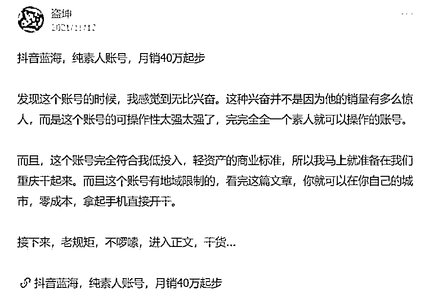

 

 

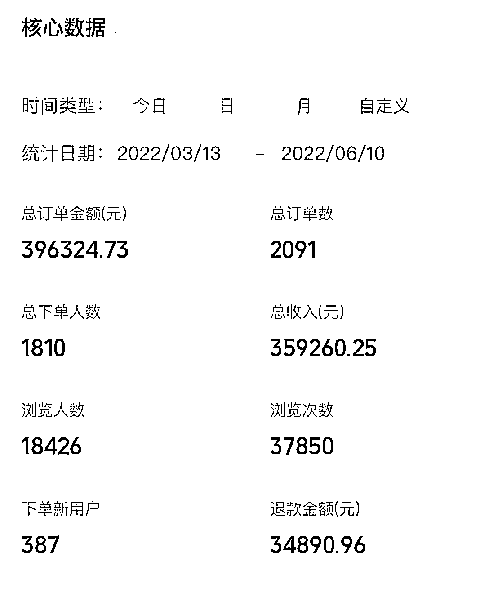

快团团只能截取3个月范围的数据

下面我会花8000字，大概15分钟的时间，分享这个项目的启动，0-1的过程，坑点，还有我后续方向上的一些困惑。

 

 

如果你是项目新手，我的经历可能会给你一点参照，你在实践一个项目的时候可能也会碰到和我一样的  艰难起步、调整、小成就、纠结困惑，也欢迎你在其他城市（尽量不要在北京）实践这个项目，大家一起交流；如果你是经验丰富的大佬，很期待能不吝赐教，针对我最后的困惑给我一些建议。

背景

先做个自我介绍，我是一个在少儿编程行业做了6年的教育人，经历了少儿编程行业从一个概念变成一个细分市场，陪伴了一个创业公司从20人规模做到年营收近10亿的行业头部，我自己也旁观了创业0-1，收获了很多职场上的回报。

可惜21年双减后，教育行业的前景就很不乐观了，公司还能维持但增长极其困难，我自己开始探索下一步路要怎么走。从加入生财以来，我就一直在留意是否有可以尝试的副业，以及如果幸运的话，最好有一个小业务能让我赚到钱，并去逐步做大。

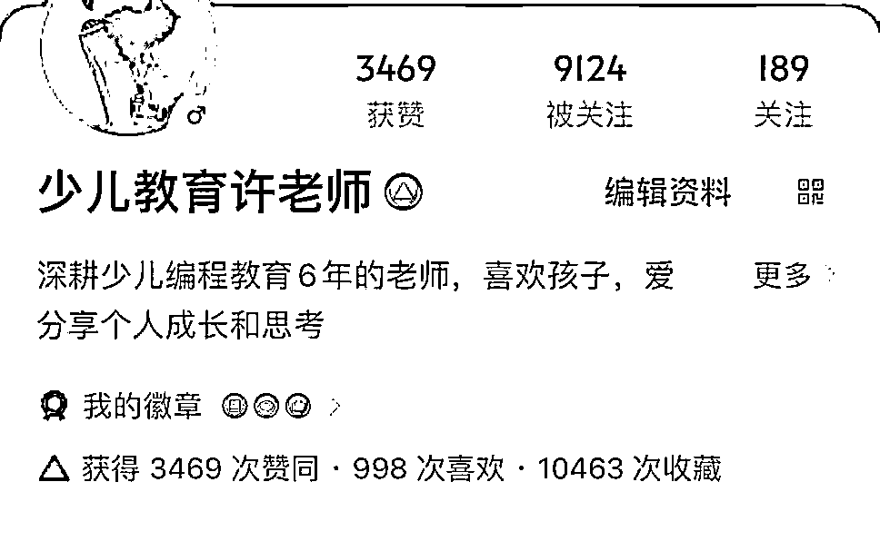

 

 

在生财看了很多帖子，中间也短暂实践过知乎好物，想过尝试小红书IP，但都不了了之。

看到盗坤老师的帖子后，说实话很激动，素人0门槛起步，蓝海项目，很快能变现，太适合我这种新手了，尤其帖子下面的评论区也有很多建设性的讨论，把项目关键点也点出来了。

我正好在北京，有亚洲最大的批发市场~新发地，做这个事情是不是可行？我开始一边调研一边跑批发市场，动起来再说。

【项目调研阶段】

我在小红书搜索“新发地”“批发市场”“草莓”（11月的当季水果）“车厘子”等关键词，有很多卖水果的号粉丝不多，但帖子互动数据很不错，点进去一看，评论区一溜的“怎么买”“求团购群”这样的评论，这一来说明需求很强劲，二来从小红书导流是个靠谱的途径。

 

 

 

 

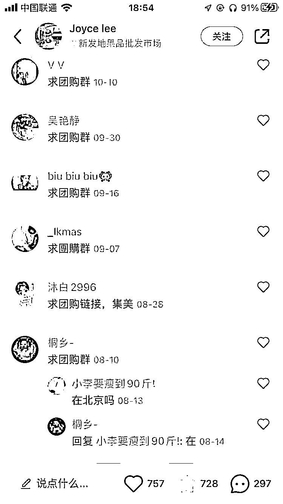

在这些号里面，很多都留了微信号，我看到就加，发现其中一个人从20年4月份就开始做（新发地出疫情之后），到现在每天开团，每次开团稳定100单以上，预估每单平均客单价100元，一个月营业额二三十万，而且她的私域量不大，就3000人就支撑起这个营业额了，既然有人做起来了，那更靠谱了，而且有了抄作业的对象。

 

 

在网上调研的同时，我开始跑新发地批发市场。11月中下旬的时候，丹东99红颜草莓刚上市，新发地48元一斤，同期水果店或抖音普遍80多一斤，这个价差有利润空间。

而且由于草莓很娇嫩的特性，网上不好买，而水果店又太贵，小红书上想买草莓的呼声很高，所以它很适合做批发市场的团购，就这样经过一个礼拜的调研，我决定从团购草莓开始这个项目。

 

 

在调研阶段，我更加确认这个项目的可行性，找到了可对标的优秀同行，也选定了草莓作为批发市场水果团的第一个品。

 

 

【项目起步阶段】

准备开始搞了，流量从哪来，这是首要碰到的问题。

按照原帖里的讨论，一定不能只有朋友、邻居那点可怜的小流量，所以一定要从外部引流，我直接放弃了社区里宣传的方式，另外由于我不熟悉视频剪辑，同时也有主业，没时间做直播，所以把抖音pass掉了。

在调研时发现小红书上问水果的很多，所以我很快选择了用小红书引流私域来获取流量。

关于小红书上怎么发帖，造人设，取标题，找对标，打造爆款等等技巧，生财里相关精华帖很多，我自己把大部分文章都看完了，然后就是每天刷小红书，浏览水果相关帖子，模仿着发帖，到现在我还是很入门的水平，这里就不班门弄斧了。

很幸运的是，在我发到第三篇帖子的时候，那篇帖子有了1万的观看，第一次99+，前前后后加了  两三百个微信，建了第一个群，而且那篇帖子非常直接，内容是我要从批发市场团购草莓，想要跟团的快上车，所以来的流量很精准，都是想买草莓的。

 

 

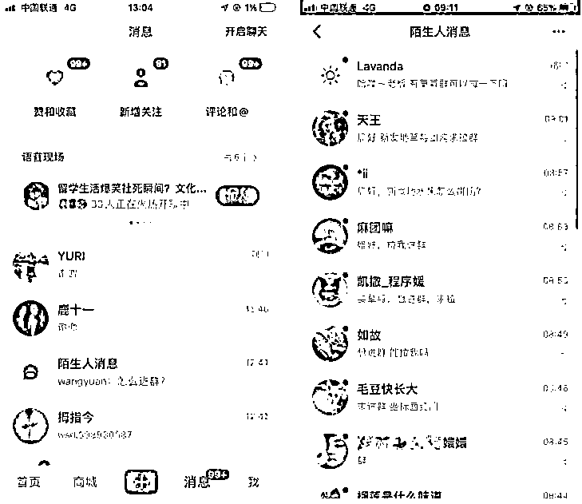

有了这第一个群，我就开始发布团购，这里也吸取了帖子下面的讨论，要把水果尽量卖成标品，不给客户选择的机会。

所以我们第一次开团就卖 2斤装的丹东99红颜草莓，标价120元（进价48一斤）。第一次团购就有50单，流量到购买的转化率20%左右，营业额7000，毛利润1000，很兴奋，从流量到转化，走出了一大步。

 

 

 

 

但团完发完货很快麻烦也来了，碰到水果生意最常见的问题了 —— 售后。

草莓太娇嫩了，有快递完后草莓磕碰坏掉一部分的，也有说缺斤短两要补差价的（批发市场算毛重2斤，我们没特别标注，顾客要按照净重2斤算），还有的直接整盒草莓被暴力快递摔全坏的，总之我们本着做回头生意的原则，都赔到位了，最后这1000的利润赔了一半。

这是第一次我们感受到水果行业的不容易。

副业就这么开始了，一周开1-2次草莓团，然后隔天去批发市场发货，第一个月卖了300多盒草莓，4万的营业额，利润7千块左右，小红书引流的私域四五百人，快团团的转化率也稳定在10%左右。

 

 

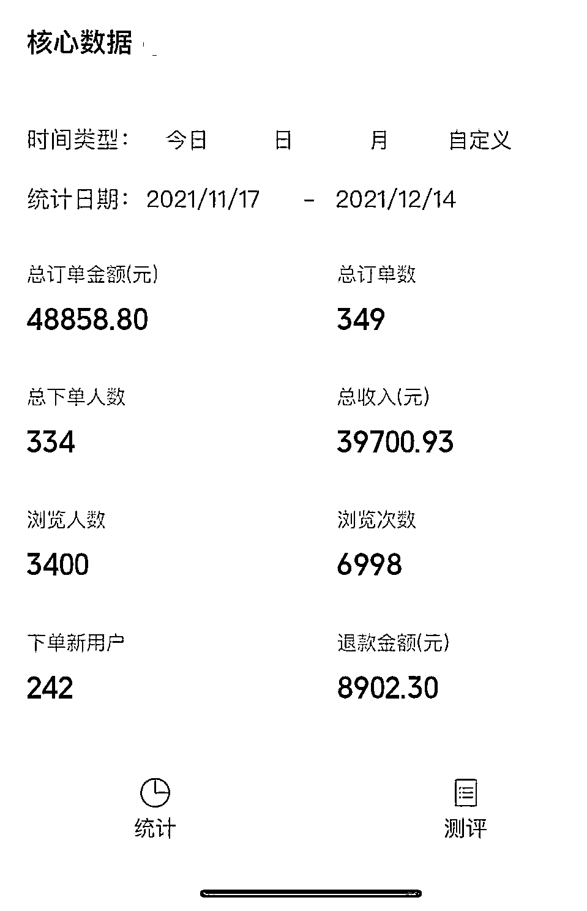

 

 

团了好几次后，客户问有没有其他水果，蓝莓车厘子啥的，当时我们对新发地还很不熟悉，对水果行情也完全蒙圈，哪些水果什么时候应季，怎么和批发商打交道，一点经验没有，批发商看我们面生且外行，询价时把我们当散客对待，报出来的水果价格和零售价价差并不高，导致我们迟迟上不了其他水果，品类太单一，顾客开始流失。

屋漏偏逢连夜雨，在品类太单一的情况下，我的小红书由于引流的时候回复私信直接问客户微信号，可能触发了小红书的审核机制，或者被竞品举报，直接被限流了一个月，最后在12月中旬到1月底期间，一方面老客户流失，另一方面没有新客户来源，我们的经营非常惨淡，营业额才一万多，基本没利润，转化率也明显下降，这一度让我想放弃。

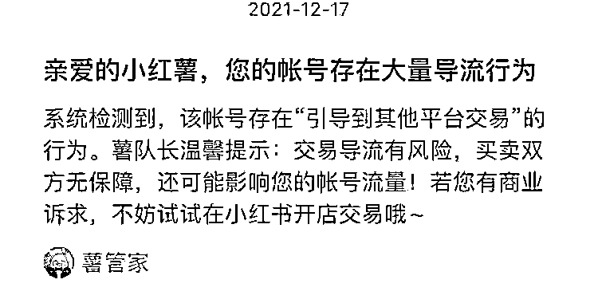

 

 

 

 

【调整阶段】

但确实当时手上也没有什么其他项目，同时这个项目还没整明白，如果放弃了下次再搞其他项目，还是会碰到波折，总不能每次都浅尝辄止。

所以过年期间痛定思痛，开始想着怎么调整。

主要问题就2个，一端是后端的供应链，我们还没搞好，供应商资源太少，品类太单一；另一端是流量端，需要持续地，有更多新流量进来。

货源方面，我们仔细研究了其他同行的快团团链接，然后根据他们上架的品“反编译”，去批发市场对应的找供货商，既然同行上了这个品，证明提供这个/些品的商家对社群/社区团购的这种模式是比较认可的，想通了这个我们找货源就比较有的放矢了，不再是无头苍蝇，一家家问有什么货，价格多少；而是拿着这个货去找到对应的商家，然后问她怎么供货。

打交道的过程中我发现有个小窍门能避免被当成散客，我去了会直接问老板“有没有快团团链接”，一般听懂这句话的老板就知道你是团长，直接拉群甩链接看货，订货也是快团团下单。

如果没有链接但是供货，就让老板拉入群。这相当于是一句暗号，让老板知道你是拿货的而不是散客来问价，省了很多口舌。

就这样，经过一个月密集的跑，我们把货源整得差不多了，基本上同行有的我们也都有。当然，这里面有一些供货商比较坑，后面再说说怎么避坑。

 

 

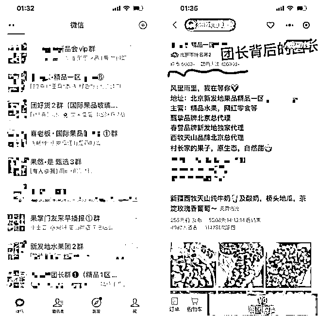

另一端就是流量，前面说到我们的坑就是引流的时候被小红书关禁闭，所以不能再私信了，一定要在主页上放联系方式。

后面我采用了置顶笔记放微信号的方式（这种方式从1月份用到了6月份），中间有几次被关7天禁闭但影响不大，但前段时间这篇置顶帖子被小红书判定违规被隐藏了。

 

 

所以小红书要引流私域，怎么有更安全可靠的办法，我还在探索，这次参加了小红书航海，里面提到了 11种方法，我还会再尝试，但这个注定是在和小红书平台打游击，方法需要常换常新。

 

 

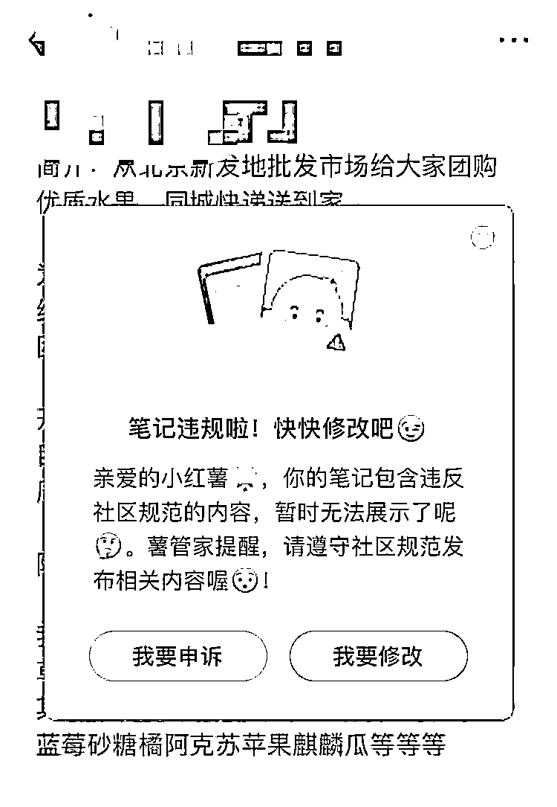

 

 

引流的方式稍微安全点了，剩下的就是怎么发帖搞到更多流量了，这里我感觉自己没发过质量太高的笔记，都是简单直接粗暴，告诉大家我从新发地给大家团水果，后面的帖子最多的时候1万多的小眼睛，几百个互动，陆陆续续发了十几篇帖子，总体浏览量加起来可能在5万左右，引流了 1500个新流量到私域，不过就是这2000个的私域流量，由于我们定价还比较实在，售后也比较靠谱，所以复购还可以，营业额逐渐上升，5月份做了16万的营业额。

所以小红书的流量一来很精准，都是冲着买水果来的，另一方面消费能力确实很不错。

 

 

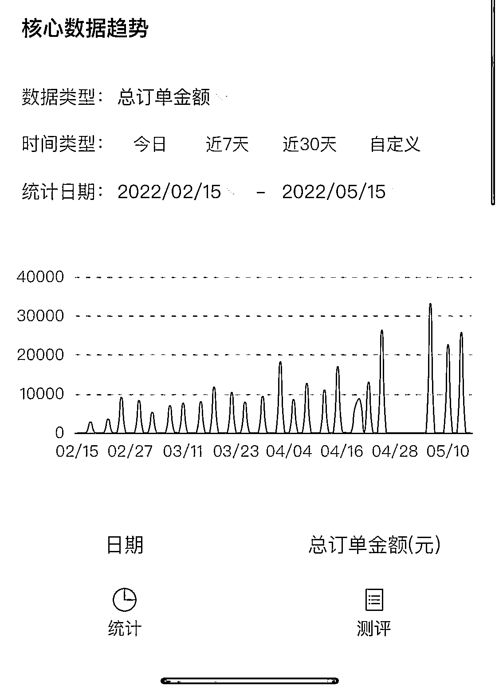

小红书引流私域，实话说我还是很初阶，虽然把关于小红书的精华帖都看了，但纸上得来终觉浅，还需要在实战中积累更多经验，这里就不多说了。

 

 

这里我想提的一点是，坚持发，根据反馈去调整发帖方向，一定会有突破的，如果还是没有提升，那把小红书精华帖再看一遍照着做。

另外算是一个好消息，我自己是稀里糊涂的有了一些流量，而且是本地同城的精准流量，帖子质量也不咋高，但就是有人加你，可能说明这个路子还是有一定对的地方，我一直相信的就是  在你觉得还没怎么做好就有成效的情况下，说明路子走对了，如果你已经做得很优秀但是还不来流量，那可能这个方向就不太对。

流量和货源一前一后两个环节调整完了，最后讲讲中间的转化环节，这里面我们的经验不多，因为我们在这里花的精力和做的工作最少，副业毕竟精力有限，我们的大头工作都花在了流量、选品和交付上。

我们目前在转化方面做的工作就是  每次开团时在群里面营造一种大家都在跟团的氛围，开团第二天引导晒图发好评，然后日常发一下朋友圈，包含新品预告，我们吃的好的水果安利，客户好评等，这些工作在这个项目花的精力还不到 5%。

可能和我认为当前这个阶段我们这个环节不宜过重有关，我认为如果选品不好，质量把关不严，售后不行，大家买完一次后就不会再跟团了，即使你的运营做得再出色。

这里值得一提的是，一定要怼住一个优秀竞品抄她的各种运营细节，比如什么时间点开团，群里发什么内容，怎么发朋友圈，选品选什么，包括用什么快递，水果都是怎么包装的；只要自己能做到的先抄，这个我们也是踩了坑的，前面自己做了很多所谓“探索”，最后发现竞品的才是最优解，做到后面动作又和竞品保持一致了。

 

 

我认为这个项目前期启动的核心一个是流量，一定要有找流量的能力；另一个是交付，一定要把售后率降下来，一定要能找到好水果，要能做好交付，这样自然而然会有好的复购，即使有些客户一开始不下单，后面看大家持续在买，看你越做越好，他也会慢慢对你产生信任，去下单尝试一下。

目前我们的转化率大概在10%左右，应该存在不小的提升空间。但在此之前，我们会持续优化交付环节。

【交付的几个坑点】

下面花比较大篇幅讲讲交付，因为这个项目和其他生财里的轻量化项目不太一样，其他项目只要解决了流量和转化，基本就跑通了，而水果团购的项目是一个后端交付很重的项目，又累又难标准化，各环节都有坑点。

交付环节有很多琐碎的日常运营，包括经常跑批发市场，找更多货源，每天关注价格行情，把控好选品，和客户售后等等，但就是这些琐碎，构成了客户是否复购的关键因素。

而水果这个生意，复购极其高，留住一个流量，比去找一个流量要重要得多，只要留存做得好，几千个私域也可以活得很滋润。

这里说一说在这些日常运营中最容易碰到的坑吧，而且每个坑踩到了都是得用钱去填。

水果这个行业看着毛利润高，但不咋赚钱，最大的问题是损耗和售后。

 

 

损耗这块，一旦有库存就有损耗，所以我们坚持预订制，客户先下单再去找批发商订货，这也是很多团长价格能优于水果店的原因，毕竟店租和损耗这两个成本大头没了；

除此之外，我们目前只做整箱发货，不做分装，虽然这样会劝退一些客户（那些水果消耗量小的小女生基本都被pass掉了），但由于我们是副业，所以必须作取舍。

这样做一方面减轻我们发货环节的流程，另一方面也能减少损耗，毕竟批发市场都是整件拿货，如果你拆开卖，总会有一些零的被剩下，要么自己吃要么就得有地方保存。

目前我们的损耗率可以忽略不计，这里不多提。主要说说售后。

做水果生意，售后真是心累啊，这里感叹一句，什么样的客户都会碰到，什么样的售后也都会碰到，尤其我们一开始做经验不足，售后概率更大（下面是大量细节，不感兴趣可以跳过，不影响阅读）。

第一种售后最致命，拿到了烂货，也就是拿货的时候水果品质就不行。你可能会好奇，为啥会拿到烂货，检查不出来吗？

批发市场里面有一句话，就是没有卖不出去的水果，只有卖不出去的价格。什么意思呢，就是再烂的货只要价格够低，都能卖出去。

比如怡科莓蓝莓限量版，大家平时买三四十元一盒，批发市场正常货的价格是一箱12盒  240元（3-5月），有些大团长的供货价是一箱150元，觉得捡到便宜了是吧，其实这个货品质不行，很多时候是蓝莓放久了有部分已经发霉了，然后大团长低价收回去，找几个工人把发霉坏果挑出来，然后把好的重新整合成一箱当着好货接着卖，这个从外表不太容易看出来坏，但是客户吃的时候会觉得硬度不够或者新鲜度不够。

 

 

新团长经验不足，也分辨不出好货坏货，一看这价格拿回去卖，然后一些注重品质的客户可能就找来售后了，即使你售后到位，这个客户大概率也流失了，因为你的水果没达到她想要的品质标准。

上面还是轻一点的拿到烂货，毕竟很多客户也吃不出来好坏，只有经常买该种水果的才能对比出来。

还有另一种情况就是本身水果已经快到腐烂临界点了，批发商直接低价倾销，由于水果都是整箱封好的，拿货的时候我们只能抽检，正好抽检出的那几箱是好的，我们就直接把货发出去了。

但是这些快坏掉的水果经过快递在常温下一折腾，到客户手上都烂了，这种情况我们发生了一两次，售后全赔的同时，还流失了很多口碑。

这种情况一定要尽量避免，那怎么做呢？

1\. 对水果行情一定要很熟悉，对便宜货本身就抱有警惕，一分钱一分货在批发市场是非常硬的道理，这里一定要多加几家供货商，对同一货源的价格多方对比，一般来讲差不多品质的货，几个大团长的供货价不会差太多（5%以内），如果明显低价尽量避开；

2\. 对出烂货的批发商坚决剔除，因为出了一次后还会再出，他不会只卖一次烂货，我售后频繁的几次，都是在同一个大团长那边，但由于那个大团长水果品类非常全，价格也比其他家低一点，所以是我初期很重要的拿货渠道，出了烂货的售后后，没下定决心换掉，后面果然又出了事情。

 

 

这里关键点也是要有多家供货商，只有手上有足够可替代的供货商，你把她剔除的时候才不会犹  豫，不然没有足够的货源，剔除一个供货商可能很多水果就得下架了。另外就是看平时的售后态  度，如果售后推诿的，一般出问题概率也大，要多加留心。

3\. 最后就是一定要检查了，即使再熟悉的批发商，也一定要当他面检查水果，尤其是对新鲜度要求高的水果，比如樱桃蓝莓，都是每天新到货，一定当面检查看看新鲜度，如果货不好宁愿退款给客户也不要拿，这样磨合下来批发商也知道你要什么样的货。

第二种售后就是运损，发出时是好的，客户收到时是坏的。这种售后只有像我们做同城快递发货的才会碰到，那些做社区团购模式的不存在这个问题。

目前的生鲜快递运输还是很初级的阶段，没有冷链，快递员也很少轻拿轻放。很多水果是很娇嫩的，不适合快递运输，比如草莓、蓝莓、桃子、葡萄，运输过程的磕碰、晃动，很容易导致水果受伤；另外就是快递配送延迟导致的水果腐烂。

要避免这个问题，一定在选品的时候就考虑是否适合快递运输，或者能不能通过包装改进让他适配快递运输，如果不行坚决不要上，不然最后客户收到一堆被摔烂的水果，后果还是得你承担，而且这个成本大多数只能自己扛，因为快递只看外包装是否破损去定是否售后，很多时候是表面包装很完整，但里面被摔得稀烂。

这里我以自己的惨痛经验劝告大家，不要对快递抱有侥幸心理，一定要想象他们拿着这箱水果是各种扔，看看你的包装能不能扛得住。

还是以怡科莓蓝莓举例，它本身的包装是不适合快递运输的，我们前期抱有侥幸心理，只在上面加盖纸壳就发出了，没出大问题。

 

 

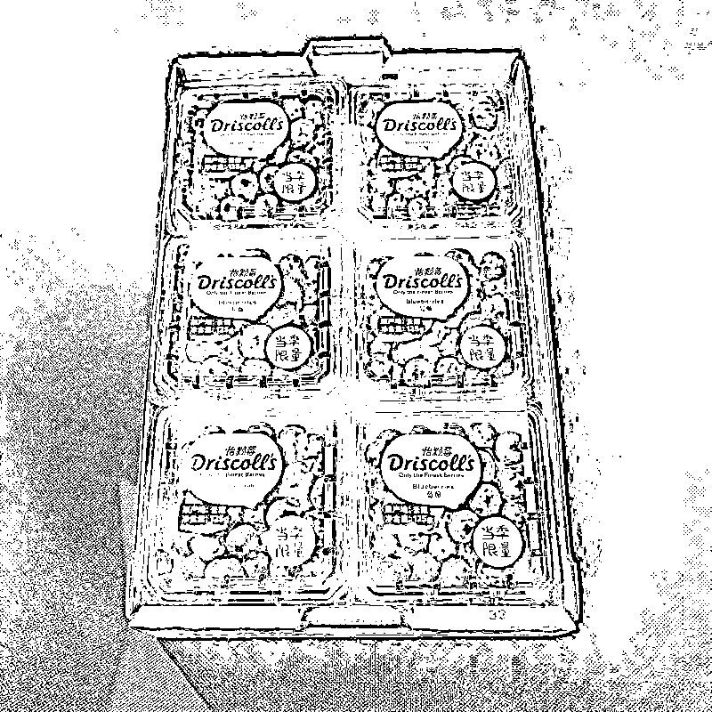

但有一次做活动，正赶上北京疫情爆发快递爆单，由于包装不到位，我们发出去的60箱蓝莓最后35盒蓝莓都有不同程度的损伤，有的全被摔烂，有的烂的加起来2-3盒。

总之那次光售后赔了 3000多块，把我们的利润全赔进去了，还对我们的口碑和信心打击很大，差点emo了，你想想一天30几个人来找你售后，语气都不会太好，真的很考验心态。

 

 

这里的解法也很简单，改进包装，把怡科莓里面的每一小盒蓝莓都垫上海绵垫，让蓝莓在小盒里面不要来回动；然后把这12箱蓝莓从原包装拿出来，放到泡沫箱里面再发货，这样能避免蓝莓受到外部的挤压。

举这个例子只是和大家说明，拿货的时候一定要考虑怎么发货，要么本身水果适合发快递，要么想办法改进包装，不然这个水果宁可不上。

第三种售后就是  缺货发不出货。

由于我们是预订制，客户先下单我们再去找批发商订货，所以很难避免缺货情况。

大部分批发商以批发为主，很多时候走货很快，上午这货还有下午就没了。

还有批发商给很多团长供货，有些批发商库存管理不行，货经常卖出超量的，然后先到先得，后面的就退款处理，批发商是100%保险了，但团长就尴尬了，得和客户解释为什么又缺货了，还有安排退款。

这个问题我们到现在还没完全解决，只能说一下我们怎么做，一来我们开团时会再和各个供货商重新确认一遍库存，尽量选库存多的上架；二来我们的团购页面会写清楚，如遇个别缺货会默认退款，让客户也有心理预期，三者如果是缺货量比较大，我们也会安排下次补发，然后给客户补偿一次运费，这样下次客户如果跟团可以省一点运费，心理稍微好受一点。

第四种情况也不算售后，但是也提一下，就是快递时效问题，一般快递的话，上午12点前你把货装车，北京五环内可以当天到，这样能保证水果的新鲜度，如果超过12点，就要第二天到了。

 

 

所以如果大家发货流程还没捋顺，尽量控制一下流量，不要一下子爆单，那不是什么好事，爆单了但是后端发货跟不上，各种售后都会出来。

所以当你能在规定时效内发出50单的时候，就匹配差不多的流量；当你能发出100单的时候，可以在流量上再更进一步。

上面啰里吧嗦说了这么多，其实影响复购的因素都在这些细节里面了，你想想现在买水果的渠道这么多，如果你连基本的交付都做不好，老出  烂货/运损/缺货  这样的问题，即使价格有优势，客户的留存一定不好，那再多的流量也留不住。

所以这个项目的交付环节是比较重的，这也是花这么大篇幅去讲的原因，一定对售后做好心理准备，一定要能够忍受这些琐碎。

【总结】

最后我总结一下这个项目，也说出我的纠结困惑。

我个人感觉这个项目比较适合一二线城市做，价差比较大的基本都是精品水果，也才存在批发市场团购的基础，客户要么奔着相同的水果价格更低，要么奔着买水果店买不着的水果来找你，这都偏精品水果消费的逻辑。

从项目特点上来看，水果刚需，高频，复购强，决策成本低，所以服务好一些流量就能有稳定变现。

 

 

不用一直焦虑去找新流量，这是优点；缺点是利润低，交付环节很重，很消耗精力，如果想有好的体验，需要对各个环节都有把控，还要忍受各种售后，不能玻璃心，本身门槛低，谁都可以做，规模化难度也高。

这里也顺便提一下模式相近的另外两种模式，一种是社区团购；另一种是一件代发（产地或者批发市场）。

社区团购，也是去批发市场拿货，不同的是客户去小区自提，省去了快递方面的运损，不用考虑怎么包装发货，交付环节简单很多，可以上架的水果选择也多，也能很快地拓展其他相关品类（蔬菜，海鲜，零食等），但是服务范围有限，一般只能服务附近几个小区，扩展性差。

批发市场有很多团长都是这个模式，反而像我们发同城快递的团长并不多。

另一种一件代发，要么联系产地做一件代发，要么做大团长的帮卖团长，只需要做引流和转化的工作，所有发货售后交由批发老板/产地负责，优点是  交付很轻，占用精力少；缺点是利润相对更低，对后端基本无把控，很难避免踩坑。

最后说一下我的困惑点。

在做这个项目的时候，有很多难受的点，因为它交付太重，会挤占主业的很多精力，还要应对各种售后，实话说幸福感挺差的，非常能体会水果行业的不容易。

我记得有一次我在评论区提到我在实践这个项目作为练手，盗坤老师回复说，等练得差不多了，尽早换项目，太累了。所以这也是我很纠结的地方。

 

 

我明显感觉，作为副业，我们只能做到把项目勉强跑起来，没有精力做很多提升改进，把这个项目再放大。

比如，我们能不能做小红书矩阵号，大批量的获取同城流量，能不能开拓小红书之外的流量渠道，比如探索视频号/抖音直播；流量如果跑起来了，我们的后端交付怎么能规模化，不再是一次只能应付100单，而是能支撑流量快速扩张；货源方面能不能拿到更有优势的价格。能不能做更精细的私域运营，把转化率从10%提升到20%以上。

这些问题都只停留在想法方面，一直没有精力去落地。

但是让我现阶段放弃主业完全投入这个项目我又有点信心不足，一来我的主业收入还比较高；二来这个项目门槛低，谁都能做，我的差异化优势在哪里，项目能不能做大，比如做到10倍规模，还有比较大的不确定性。

虽然我的主业没有增长空间了，但我也担心这个项目最后做不大，最后收入可能和我主业差不多，但辛苦程度是至少好几倍，那就得不偿失了。

所以把这个项目分享出来，一来是秉承生财“真诚利他”的原则，二来我也想听听各位大佬的建议。

这个项目未来有规模化的潜力吗（做到一个月100万营业额），我下一步该在哪个点发力，我感觉现在放弃主业去做应该不是个好的选择，那在什么样的情况下，是可以放弃主业去投入这个项目？如果想做大，需要攻克哪些方面的难关？

 

 

还是说，这个项目只是适合练手，长期来看不是好项目，因为我眼界受限所以目前还只能做这样的项目，那我是该调整模式，改成更轻量化的模式，比如一件代发；还是该在某个时间点去尝试其他项目，比如小红书带货，带其他标准化程度高的货，而不是水果这种非标品。

最近确实是在这两种状态中反复横跳，一会雄心壮志，想着扩大10倍比打工强太多了，一会又想太累门槛太低了，是不是该趁早试试其他项目。

所以很希望听到大家的建议，就像盗坤老师当初的那篇帖子，评论区和帖子一样精彩。

感谢大家看到最后！

————————————————

帖子写于6月中旬，所以文章中主要放了到5月份的营业额，现在更新一下六七月份的营业额。

6月份由于北京天堂酒吧疫情，我们公司有一例确诊，我变成了密接，在家隔离了14天，没办法去市场选品发货，严重影响了我这个水果副业，半个月没开张，最后营业额只有5万多，还好我们基本是零成本副业，不然在家干坐的14天心态肯定受影响。

7月份开始了水果人最难熬的淡季，听批发老板说，基本上从6月底到9月中旬前都是水果淡季，这几个月天气热，水果容易坏，所以不敢多进货。

另外夏天水果种类很单一，主要就是瓜、桃，单价高的水果比如蓝莓草莓、樱桃、各种进口水果基本都没了，大家吃瓜最多，瓜才几块钱一斤，严重影响了对其他水果的需求。

 

 

所以这阶段主要靠熬，我们的营业额也很明显的下降了，之前开团时平均一次100单，现在只有四五十单，营业额也降到了一个月6万左右，看了一下同行的快团团链接，还有和快递小哥交流，基本上大家的单量都明显下滑了，以前新发地直播基地一天三五千单，现在只剩一两千单了；另一个做得好的同行以前一天1000单，现在500多单。

所以这两三个月只能靠熬过去，淡季时你不在，旺季时赚钱就没你份了。

补充这个信息，一个是让大家有更全面的信息，这个副业的营业额并不是一直不断增长，二是提醒大家如果你想起步做这个项目，这两三个月不一定是好时机，有可能一上来没啥正反馈，缺乏一个特别好能快速启动的品类（除非你敢做榴莲，劝你不要，很容易亏），反而去年冬天那个时间点，我误打误撞的赶上了草莓这个品类和项目起步比较好的时间点。

评论区：

万里 : 很真实的经历

许老师 : 文章里提出了我自己的困惑，是副业更进一步加大投入，想办法发展成主业，还是到某个时间点换个交付轻一点的项目，希望各位大佬不吝赐教

亦仁 : 主要是与主业相比，看副业的空间和机会。副业空间大、机会大、可以发展成主业，那是可以考虑更多投入。

许老师 : 主业教育行业没有增长空间了，但现在收入还行，不过有可能哪天被裁员。

副业水果目前来看转化和复购还不错，只要把流量做到一定的量，按现在淡季的情况，需要把流量扩大5倍就能和我主业收入差不多；如果到了旺季，大概两三倍流量就行；但我担心这个项目门槛低，非标属性比较强，不清楚是不是能规模化运作，所以这是比较矛盾的点。

现在是主业还不是很忙，所以还能兼顾，但也只是维持副业，还缺少精力去想办法扩大。

高建中-扬州-婚礼庆* : 有个问题要问球友：你这发货是自己拖回家发货还是批发商代发？

 

 

盗坤的提议：个人觉得这个比较难以放大，交付和售后方面太重。个人建议做到一定程度，有固定客源可以作为引流，做一些其它产品。

你说的社区团购，我们以前做过，当时利润还可以，有平台供货，后来美团等入场后，做的都是客单价比较低的，而且都是一斤两斤卖，太累人利润还低就不做了。

一件代发的也做，也是平台供货，因为价格比较高，在三四线做的不太好。

石头头 : 方便留个v交流吗

许老师 : 目前还是在批发市场自己直接当场发货，所以比较重

Tony : 我做食品行业深有体会，水果这个品，复购率很高，只要好吃会一直买。就是售后非常难，还要有一个非常强大的团队支撑，不然一个人售后会哭。

# **# ****(**精华帖**)(183**赞**)**我如何自建小红书运营团

# 队，通过矩阵引流月变现** 20W **？

作者：  是黄Sir呀

日期：2022-08-17

零、前言

大家好呀，我是至川，小红书官方MCN落鲸文化主理人。

目前我的运营团队在小红书做出了接近10个企业号，平均每天能稳定引流150人左右，高峰期每天能引流接近400人，月平均变现20万＋。

去年暑假在@谢无敌老师  团队实习开始接触家居号小红书运营，两个月的时间里，无敌老师的线下家具店通过小红书变现400万+。实习结束后，我开始在学校做小红书企业号矩阵，基本上每天都能引流超过150人到微信，高峰的时候每天400余人。

 

 

一：经历介绍

二：变现模式选择（我将对比目前小红书两种主流的变现方式，说明我为什么选择小红书企业号方向）

三：如何打造引流账号（我将详细复盘我是怎么把从0到1把账号做起来的，细节满满）

四：如何低成本扩大项目（我将站在一个小团队的主理人角度，讲一下该怎么把项目放大，包括如何扩大团队、分工、以及低成本批量制作小红书图文笔记。）

今天分享的这篇万字长文，也是基于这些账号运营的总结与思考。这篇文章的结构如下：

最后，是我给的一些新人入场建议。

如果您用电脑，可以进入飞书文档

https://cg2n3p7rvr.feishu.cn/docx/doxcnr1oqIrIs5Q76bCl2RJtfMb，左侧目录更适合阅读

正文如下：

一、经历介绍

大一时，偶然间加入了生财有术，三年的时间里一直向社群里的前辈们取经、做做小项目，我的经历也绝对是很多小白初入生财的缩影。

最开始，因为看不懂文章，产生焦虑；后来跟着一些文章里的项目去做，但始终没做出成果，变得更加焦虑；再到后来，认准了一件事情，每天坚持进步一点点，终于我也有了一点的小成绩。

 

 

在遇到生财之前，我做过淘宝，高峰时还组建了百人团队，但也跌得很惨。

刚入大学后不久，我就在淘宝店铺做兼职PPT设计师，每天赚点饭钱；在大一下学期，我开了自己的淘宝店铺，主要做PPT设计，刚好赶上那一年的订单高峰期，莫名其妙就做起来了，每天GMV大概在500多元。

我也是那时在知识星球入手了某头部的PPT设计星球，然后通过推荐页加入了生财有术。

那时我就和我舍友们分工，组建了接近百人的线上设计师兼职接单团队。但是好景不长，随着市场淡季以及每天干预的预算过少，排名就被财大气粗的天猫店们挤下去了。

后来我尝试过不少次重新起链接，不仅店铺没有做起来，还把之前赚的钱都亏回去了。

也是在这个时候参加了生财有术的小航海，参加了盗坤老师的淘宝蓝海训练营，才算是把淘宝底层逻辑恶补了一番，然后我们就开始运营一个小类目“音乐人”申请。

那个时候音乐人申请单价都在150以上，而且卖家比较少，而且他们水平有点堪忧，一下子就把他们干翻了。在接近三个月的时间里，我们三个店铺都稳居前三，每月GMV都在10万＋。

好景也不长，虚拟类目经常违规，小赚了三个月后我们不仅所有的店铺都被封，而且新来的同行们一个比一个专业，价格一个比一个低。这个类目就没有做下去了。

后续我们选了小众的茶类目、编曲，都没有做起来，加上去年平台的一些变动，反倒是同样亏了不少。

 

 

电商平台真的是需要很大的成本撬动，而小红书完全没有什么成本，这也是后来我们觉得小红书真香的原因之一。

在我大二的下学期，我就一直在生财有术寻找项目，看到什么就试一试，不仅什么事情都没有干成，心也一直处于浮躁的状态。

这一切的转折都在大二的暑期，我在生财社群里认识了@谢无敌老师，然后很幸运地加入了闪亮猫团队，成为她的贴身助理（喵呜一代），也参与了无敌姐姐的家居矩阵号搭建，在我们的操作下，无敌老师的线下家具店变现增加1000万。

去年暑假实习结束后，我开始在学校做小红书企业号矩阵，基本上每天都能引流150+人到微信，高峰的时候每天400余人。

后端变现我们接的都是客单比较高的咨询服务业：签证咨询、机票代理、出入境相关、音乐教学、设计......单粉价值相对比较高。

以下是部分案例展示：

每天都是满满的咨询

 

 

精准粉丝咨询展示

 

 

 

 

付款变现展示

 

 

二、变现模式选择

其实，在小红书变现主要有两种方式：

**1.**一定粉丝量的博主，通过接广告变现

我们班有位女生，平日里买了衣服之后，非常乐于在小红书分享穿搭，凭借不错的颜值➕穿搭分享，确实圈了一波粉丝

 

 

据她所说，在她几十粉丝的时候，就陆陆续续有店家找上来，愿意免费给她提供衣服，只需要她在发小红书的时候，带上店铺名字。

 

 

在空余的时间动动小手发个小红书，短短半年的时间，她已经实现了"穿衣自由"，衣橱里满满的都是商家寄给她的衣服，多到穿不完。现在她的闲置衣服转卖到闲鱼，每个月又是一笔可观的收入！

 

 

这其实就是第一种方式，想要获得更高报价的广告，就需要更多“粉丝”，所以核心就是围绕着涨粉来做。这也是经典的变现路径：涨粉→接广告→变现。

 

 

 

 

我看到我同学把小红书做得风生水起，也心动了。

于是我和朋友开了一个“个人成长号”，分享鸡汤、个人成长语录等等。

没过多久，我们就做到了10万赞藏，6000+粉丝，正当我以为我们要“财富自由”的时候。

 

 

我才发现事情并没有那么简单，因为即使我们已经6000多粉丝了，依然没有品牌找到我们投放！

后来我才明白，我们这种是“泛粉”账号，粉丝都不精准，而且成长号的粉丝偏低龄化，付费能力比较差。

就算我们靠着这种方法做到了10万粉，账号依然是没有多大的价值。于是我们心灰意冷，账号就没有继续再更新了。

 

 

可见，这种涨粉→接广告→变现的模式，如果一开始的定位选错，后续即使账号做起来了，也无法得到变现，而大多数人包括我又急于得到正反馈，所以很难坚持下去。

后来我来到了无敌姐的团队实习，成为了她的贴身助理，在无敌姐的指导下，我也开始参与公司的家居矩阵号运营。

在公司新中式家居账号不到5000粉的时候，就引流到了一位别墅大客户，后来客户直接去了无敌姐的线下家居店，买了全套家居，还把装修交给了我们做！

这种变现方式简直打开了我的新世界！后来实习结束我回到学校，再自己慢慢摸索，终于领悟到了这套变现模式，这也是今天我们要说的第二种变现方法：

**2.**有成熟的产品**/**服务，通过小红书获得客户，然后引流去微信**/**淘宝店铺下单。

当时我淘宝店开的是ppt设计的店铺，每日的营业额也稳定在三千元左右，但是电商平台的获客成本超级高，所以也导致了我们并不怎么赚钱。

后来在谢无敌的红书宝社群，认识了一位同样做设计的宝友——黎不甜，从她的分享中得知设计业务在小红书的流量成本很低，而且客户质量高。

在掌握了小红书运营知识后，她做出了自己的第一篇爆款，仅仅一篇笔记就涨粉1400多。此后，她的内容输出更精准，基本每篇笔记都能给他带来两三个客户。

她的烦恼也从“接不到单”转变成了“单子做不过来”

 

 

于是，她成立了属于自己的工作室，招募了几位设计师，成功转型为设计工作室主理人。现在的黎不甜，每月稳定收入3w+。

在这个变现方式里，我们从第一个粉丝就要开始变现，虽然可能每篇文章阅读量只有三四百，但都是有强需求的粉丝，每天总是有源源不断的人来咨询、下单。

再举一些例子吧

 

 

这是一家旅行社，发布小红书笔记后，就有游客想找它成团，评论区直接问起价！

这是一个留学博主，也是一个网红留学公司了，他们就靠十几个小红书账号做到了留学行业的头部公司，客户都非常精准直接咨询具体的留学项目。

 

 

这是一个保险博主，平时就在小红书分享买保险的干货，帮助用户避坑，用户看到了就咨询如何在他那里买保险。

 

 

可见，在商业化IP的领域里，很多线下商家直接把服务搬到了线上，总的来说就是：根据自身的变现模式摸清楚定位，通过在小红书发布内容去吸引有付费意愿的精准粉丝，再通过引流到微信去做转化变现

三、如何打造引流账号

接下来我会从五个方面，详细说明引流账号的打造方法。

 

 

**1.**找准定位：

如果你已经有自己的产品和服务，可以直接跳过定位部分，从确定内容方向开始看。

如果你没有自己产品、货源，或者你刚刚接触小红书，还在迷茫中，可以跟着步骤一步步来。

定位是在整个操作过程中，最重要的一环。

就像做电商，选品永远是最重要的，选到一个好产品，就算是普通的运营也能做起来，在小红书也是一样的逻辑。

定位也就是解决我们"做什么"的问题，归根结底就是确定出一个变现模式

作为个体，我们拥有的技能、或者是熟悉的代理的产品都可以作为我们的变现模式我的ppt做得不错，通过帮助别人做ppt设计变现，就是一项技能变现。我前几次创业的项目也是围绕着ppt设计。

我的舍友会写歌作曲编曲，通过帮助别人写歌变现，就是一项技能变现。这也是我们目前在小红书做的其中一个矩阵号。

 

 

比如我是留学生，那帮助其他人申请写文书、或者辅导英语等都可以是一项技能变现；

比如我是律师，帮助当事人做咨询，也是一项技能变现。

 

 

那肯定有人会说，我感觉啥也不会该怎么办。那我建议你尝试去代理一种你熟悉的产品。

比如说，小红书有很多卖花茶的，基本都是代理商；比如可以做小程序建站，可以找商家拿案例，你帮助推广；比如你熟悉的日常用的产品，都可以直接进行带货。

 

 

只要事先与商家谈好分销比例，基本很多商家都会同意你帮忙做分销的，这是一件双赢的事情。

 

 

如果你本身就是一个商家，那就更简单了，直接把你的产品服务搬到线上来，让线上也成为你获客的渠道之一。

可是我们如何辨别，这个产品或服务在小红书是有没有市场的呢？

我们不能看到做的人少，就认为这是一片蓝海，可以吃掉整个市场。因为你的这个产品可能就是一片死海，根本不适合小红书。

 

 

我一般是通过这个方法辨别的。

1.通过千瓜等数据平台，查看关键词搜索量。首先挖掘出你的产品/服务的三个左右关键词，在数据平台或者是小红书的下拉词，查看热度。

2.通过查找同行账号，去分析市场。一般来说，就算是再细分的市场都是会有人比你先发现的，如果有3个以上的账号连续更新超过了一年，那这个市场基本上是没问题的。

 

 

为什么呢？我们可以换位思考一下，如果你连续更新1个月，完全看不到一个愿意为你付费的粉丝，你还会继续坚持吗？如果你的同行连续更新几年了，一分钱都不赚，那他是打算做慈善吗？

我们确定好定位之后，就要去制作笔记，吸引精准粉丝啦！

**2.**确定内容方向

 

 

很多人都陷入了一个误区，浏览越多就说明做得越好。

这句话看似没问题，但也不完全对，特别是在小红书企业号ip领域

我写过很多10万➕的爆文，但是一分钱都没有看到；我也写过很多只有两三百浏览的文章，但是每篇笔记都有几位粉丝咨询，最终有一半的人下了单，而我做的业务客单价都在5000+

所以能持续写出可以吸引强需求粉丝的笔记，十分重要

那我们如何把握好笔记内容方向呢？

（**1**）如果你是做知识付费业务（比如咨询、教学），那我建议你可以主发干货、配合发部分案例。

比如这位做唱歌教学的博主，干货笔记、案例笔记均有涉及

 

 

 

 

比如这位做法律咨询的博主，干货笔记、案例笔记同样均有涉及

 

 

 

 

比如这位做运营咨询的博主，大部分发干货笔记、其他的都是自家的广告。

 

 

 

 

（**2**）如果你是做带货业务的（含技能服务、卖实体物品），那我建议你直接发案例

比如这位做小程序的博主，全部笔记都是自家小程序展示

 

 

 

 

比如这位设计师的博主，大部分笔记都是自家小程序展示，每十条笔记中只有一条干货笔记。

 

 

 

 

比如这位养生博主，大部分笔记也都是产品展示，每四条笔记中只有一条干货笔记。

 

 

 

 

当然，这只是我建议的大方向，具体类目可能会有细微差别

（**3**）做视频还是图文

在企业号IP领域，我个人更倾向于前期做图文

小红书本质上是图文平台，评论的权重占比更高，而图文用户更容易产生互动

 

 

不可否认的是平台对视频内容有一定的倾斜，我做的第一篇视频就小爆了，总共5000+的互动，但是我发现我们生产出一条视频需要一整天

而同样的时间做图文，可以产出10余条，所以新手建议先做图文账号。

目前我的图文账号团队已经稳定了下来，每天都在输出原创内容，所以我又找了一个表演天赋比较强的伙伴，让他把我们的图文账号里面的干货内容“口播”出来。

他就看着提词器，生动形象地把内容读出来，这种视频一天可以拍出十几条，然后再发到另外几个账号上，在我看来这也是性价比很高的一种内容输出方式。

也有很多口播大神，靠着精湛的表演能力，引流都做得不错

而且口播类视频可以同步快手抖音小红书视频号等几个平台，单条视频的价值还是很高的，以下是我认为做得比较好的几个同行~

 

 

现在我们知道发什么笔记了，确定了内容的大方向之后，那如何快速批量生成优质内容呢？

**3.**批量生产内容

（**1**）寻找对标博主：

 

 

首先，在确定好了定位之后，我们就要去寻找对标博主，看看有没有同行做得好的地方可以借鉴。

有了10-20个对标账号后，我们就可以拆解、模仿、然后再创新。

建议新手前期都可以参考对标账号的内容选题和输出，自己进行修改优化即可，因为新手选题容易“跑偏”，等有了一定的经验后再自己去创新也不迟！

寻找对标博主我一般用这三种办法：

**①**搜索关键词

比如我是做音乐制作的，我会把客户可能搜索用得到的词汇总出来。比如：作词、作曲、编曲、音乐制作、混音、修音等等。

在搜索栏进行搜索之后，然后点进主页进行筛选。只要目标账号每周坚持更新、评论区经常有精准粉丝询问、笔记数据稳定偶尔几篇小爆款，就可以成为我们的对标账号。

 

 

**②**在频道里，找到对应类目

这是一个很多人都会忽略的好方法！

首先你要平时就多搜索你对应领域的内容，假设你是做澳洲留学服务的，平时经常刷澳洲留学的笔记

那么你在“学习”频道里，发现页刷出来的笔记都十分精准！全都是有关于澳洲留学的。

 

 

如果是新号尝试用这种方式找对标博主的话，可能就会出现不精准的现象。

**③**坚持记录，遇到好的博主就关注

平时我们刷小红书的时候，在发现页经常会刷到优秀同行的博主/笔记，我们不妨点个关注、收藏，下次就可以直接找到啦。

 

 

（**2**）选题：

选题就是笔记的“灵魂”

一篇文章能不能成为爆款，取决于我们的选题。同样的，一个人有没有持续做出爆款的能力，也取决于能不能持续找到优秀的选题。

我们在选题的时候，千万不能“自嗨”！要根据数据去分析锁定用户感兴趣的内容。

 

 

我们团队是固定每周日前，每个人需要提交最近刷到的5个新选题，然后我再从选题里挑选出比较好的，完善进我们的选题库，我们负责内容制作的小伙伴就会从选题库里面制作选题

我们团队一般是用以下两种方法进行选题。

**①**从对标博主挖掘

刚刚有讲到如何寻找对标博主，在确定好10-20个对标博主后，就可以对他们的笔记进行分析，把数据从高到低排列。

优先做数据高的选题！坚持做小红书一段时间后，你刷到的每一篇笔记，你都可以看到它有没有爆的潜力。

 

 

**②**从热门笔记挖掘

在选题之前，不妨我们把自己代入为用户，从需求、人群、问题场景等方面去挖掘用户需要什么。

然后列出用户可能会搜索的关键词，具体方法和上文提到的：寻找对标博主中的关键词搜索法是一样的

这些选题都是经过用户和平台的验证，都是爆过的笔记，他们的选题会非常有参考价值 

 

（**3**）首图：

在小红书内容创作中，首图极其极其重要，因为小红书是一个信息流平台，首先映入眼帘的是一张张的首图，用户看到吸晴的首图，才会有点进去的冲动。

只有点进去了，才可能会有接下来的点赞收藏评论等互动，进而产生爆款

 

 

而我们做企业号引流，要的是制作速度够快，同时图片质量也要高。这好像是一个伪命题，不过我给你分享我们团队的做法，做到速度快的同时质量相对比较高。

首先需要明确小红书首图尺寸，小红书建议首图都用3：4的比例，在主页展示的面积比其他比例都大。

 

 

第一步：在20个对标博主中，搜集出几个爆款封面，并进行改善模仿

第二步：因为我ppt用的比较多，所以我们团队的固定模版都是用ppt制作的，我们把爆款首图拉进去ppt里面

 

 

根据对标的图片，打好板式确定自己的风格，以后每一次制作笔记首图，就只需要更改里面的"文字"和"图片底图"，一个新的封面就出来了

 

 

 

 

因为我所在的类目比较小众，同行做得比较的普通。所以图文首图我会参考成长类目的账号，视频封面我会参考美妆类目的账号，适当的跨类目参考也是可以的。

 

 

如果你实在不想自己设计，可以去稿定设计等网站去找小红书配图，再进行修改，或者请专业的设计师给你打好版式，以后每次制作就只需要更改文字和底图

 

 

掌握好这个方法，以后每张首图30秒就可以搞定。

（**4**）标题

最开始写小红书的时候，我也不会写标题，直到有一天想起作为一个资深学渣，每次写英语作文都要依靠模板

 

 

比如提前背诵好推荐信模板，每次遇到类似写作内容，就把提前背好的句子稍微修改下，然后往上写

而我们写标题也可以找出万能公式，然后往里套!举几个例子：

公式**1**：**①**文**XXXX**

留学：①文看懂英国学校段位，别把青铜当王者！

运营：①文教会你详细拆解10W＋书评

公式**2**：**XX**个万能**XXX**！手残党福音！新手抄作业！

运营：99个万能标题！手残党福音！新手抄作业！

留学：被牛津大学秒录的文书原来这样写！手残党福音，新手抄作业！

公式**3**：人人都能学！带你深扒**XXX**的小心机

运营：人人都能学！带你深扒一秒提升首图点击率的小心机

留学：人人都能学！带你深扒被牛津大学秒录文书的小心机

如何找到这些公式呢？

 

 

1.知识星球【谢无敌的红书宝】

在星球的标题文案库里，有无敌姐整理的300+标题模板，全类目通用！

2.小红书搜索万能标题

 

 

再根据万能标题，整理建立属于自己的标题库

 

 

每次写标题前，我都会进标题库瞅一眼，脑子里立马就会浮现出好几个标题啦

（**5**）文案

小红书的文案其实并不是特别的重要，不需要特别华丽的表达

只需要清楚的表达出自己的观点即可；跟写作文一样，我会先列出要写的文章的主题，分成哪几个部分写，想要表达什么样的思想

 

 

然后就根据列出来的大纲，进行语句的完善

如果新手不知道怎样写的话，可以去根据主题找出几篇类似的文章，先模仿着。等到写出了几篇文章，你会发现文案的写作会越来越快！

**4.**引流变现

小红书一直想做站内转化，给知识付费的商家开通了专栏，给带货商家开通了店铺。

 

 

但是转化率真的是太太太低了，高客单价产品还是要想办法引流到微信去做成交。

（**1**）引流

小红书对于私信引流一直都有一个阈值，只要不超过一个量，引流操作还是可以进行的。

 

 

目前我所有的引流账号都认证了企业号，认证完企业号后，每天的私信人数控制在30人以下，目前还没有大规模出现问题。

如果当日咨询的人数不够，就私信粉丝以及点赞和收藏笔记的人，凑够30人。

如果你的账号是个人号，就不要大规模去私信，只需要回复粉丝的咨询就可以啦！当心隔天会受到引流的违规提示。

（**2**）朋友圈变现

引流和转化是完全两个事情，我们从小红书吸引了用户加我们微信之后，他可能不会立即付费

特别是做高客单的，用户一般会观察一段时间，觉得靠谱之后再付费，所以我们的朋友圈一定要经营好，利用好朋友圈展示自己的产品和服务

我以前也挤不出字，经常不知道怎么发朋友圈，后来和圈友柠柠讨论之后，我也总结了一套发朋友圈的方法

 

 

好的朋友圈到底长什么样

首先，朋友圈一定要美观，看上去很舒服，只要美观而且可读性很强，发再多的量也是有人看的。

 

 

反之，如果是直接产品刷屏，不仅会被用户拉黑，而且也会被微信系统屏蔽。

如何做到朋友圈美观呢？我认为有以下几点

1.排版

2.主题

3.文案内容

 

 

①排版

我不太喜欢看起来密密麻麻都是文字的朋友圈，看起来特别挤

所以我建议先写两句话的开头，然后中间再空出写正文部分，当然这和个人喜好也有关系

 

 

②主题

也就是解决“发什么”的问题，朋友圈一定是把生活和营销结合起来

但是生活又不完全是生活，每一条朋友圈都需要表达出自己想被人看到的方面

这样说可能有点抽象，给大家举个例子吧

 

 

说实话，看完柠柠的每条朋友圈我都有付费的冲动

她其实也是一名大学生，在朋友圈中也会分享自己的学习、旅游、创业点点滴滴她微信的好友很多都是同龄人，可以产生情感的共鸣，一下子一种追逐梦想，不拘束自己的创始人IP就凸显了出来，也从侧面凸出了“我很会赚钱”，“跟着我做你也可以有向往的生活”

 

 

③文案

我一般是想好了主题之后，先想一个标题

然后把主题用大白话写出来，因为朋友圈不像是写文章，只需要用平常的语言把想表达的东西表达清楚就可以了

四、如何低成本扩大项目

**1.**打造矩阵

在一个号能够持续引流变现之后，建议你可以继续放大，做第二个号第三个号，通过堆账号数量去放大

因为一个账号是有瓶颈的，就算是企业号，一天私信也最好不要超过40条，多了就很可能会被检测违规。

目前一张营业执照可以开3个账号，建议大家前期都注册成个体工商户，后期维护成本比较低。而个体工商户和公司主体认证的蓝V功能都是一样的。

甚至我在入驻小红书官方MCN的时候，都不需要签约博主，提交的都是自己公司的账号。

 

 

同时，我会把我在小红书的图文内容发到知乎平台和公众号

把视频内容同步抖音和视频号，一下子就多了N条获客渠道

知乎也是一个宝藏平台，用户质量都很高，建议做小红书图文的小伙伴都重视这几个平台的内容分发

如果分发平台较多，建议可以使用账号分发平台

 

 

**2.**扩张团队

在跑通了闭环，获得了第一笔金钱反馈之后，我们就开始扩大团队规模了。

因为一个人想要负责那么多账号，真的是忙不过来。

 

 

作为大学生，说起扩张团队我首先就想起了大学生兼职。因为大学生网感普遍不错，很多人也都是抖音小红书的重度使用者，培训起来也相对容易。

相比于线下全职，成本也相对比较低

那么如何找到大学生兼职呢？有几个小方法可以提供给你：

（**1**）找各个学校的墙发广告

可以去各大学校的百度贴吧、或者非官方的公众号，就可以看到很多校园墙/师兄师姐在发广告、介绍学校，可以先用普通学生的身份去添加他们

 

 

一般来说，5000活跃好友的账号插播个小广告一般50元左右，因为我长期跟他们合作，所以收的都会便宜一些，具体话术如下

 

 

不要找公众号发送，找个人微信号那种发送！效果会好很多而且便宜！

（**2**）大学生服务相关群

我以前是做淘宝PPT设计的，每天都有很多学生主动私信应聘设计师。

他们会把学生加到一个群里审核，你可以找一个比较小的店铺体验下流程，和店铺老板聊聊能不能有偿让他帮你发广告。

 

 

我们设计师不够的时候，也会到其他店铺的群里发单的（需要提前给老板联系好）或者自己就购买PPT初级制作的服务，遇到的设计师都会是学生，如果制作效果好也可以长期进行合作。

加到一个学生之后，让他拉你进相关的群，或者推荐好友，一个群或者好友给他1元，立马你就裂变出几十个群了。

（**3**）闲鱼等平台找兼职

实话说闲鱼还是一个很优质的平台，你可以去一些技能服务相关的卖家留言

比如剪辑视频、画画、代做XX、PPT设计等等，只要是你觉得人群相匹配就可以 

 

然后就引流到微信去，同样的只要加到了一个学生之后，就可以让他拉你进相关的群，或者推荐好友

（**4**）我自己的团队

因为我也是大学生，和我一起做的大多数是身边认识的人，平时待在一起久了，也更容易知道这个人做事风格、靠不靠谱。

 

 

如果你也有朋友、家人是大学生，不妨好好利用好这波资源，同时也带动大学生赚赚零花钱

同时我也要感谢我们学校的创业孵化基地收留了我们一群人

让我们在学校内就有一个比较好的工作环境，说实话线下的工作效率要比线上高很多很多倍

 

 

如果你也是大学生，也可以向自己学校申请一件办公室什么的，对于后续业务的开展也很重要！

**3.**完善**SOP**

（**1**）完善工作手册

招人之前其实就要明确好，设置好什么岗位

我们是把选题、文案、图片、视频几项业务分开，每个人只需要负责好其中的一个部分 

 

每个人招募进来后，都需要给他们培训，我一般是现场演示一遍给他们看，然后分发一份他岗位的工作手册

因为新人还不是特别能明白我们具体是干什么的，所以需要有一份明确的工作手册指引他们，下一步需要干嘛干嘛

那工作手册该如何做呢？

①自己跑一遍业务，然后从头到尾记录下来

 

 

②尽可能把所有工作流程化，就像生产线一样

如果说你的工作手册，扔给任何一个人都能看得懂并且按照内容一步两步进行操作，那这就是一份合格的工作手册

（**2**）设置好**KPI**，淘汰机制

同一件事情，不同的人做会产生天差地别的效果

我们一定要学会筛选出靠谱的人，其实咱们这些事情只要肯用心，每个人都可以做得很好

以前我总是认为“教”很重要，毕竟没有人一开始就会，碍于朋友面子，也没有什么淘汰机制

这样子的团队必定是懒散的！现在我都给大家列出了每天需要做的事情，每个人做完后就在对应的位置打勾＋附上链接，一目了然。

 

 

如果有人一直持续不能完成自己的工作，那没办法只能换人了，而且我们数据透明，被淘汰的人也不会有什么异议

只要把这些内容安排好，我们团队就是一台高效率的生产线，每天都在源源不断生产优质内容。

四、写在最后

 

 

有人会觉得，爆款都是靠的运气，现在做自媒体真的太晚了。

只有经历过的人才知道：抛开运气，没有捷径。偶尔一篇爆文可能真的是运气，但是持续输出爆文的能力绝对不止靠运气。

在我和家人朋友们说起我在做小红书的时候，他们都会以为我是写文案的或者拍视频的。

但其实在自媒体如此商业化的时代，文案或者视频只是一种表现形式，更重要的是对账号内容方向和定位的把控能力。这也是我这篇文章内附这么多举例和图片最主要的原因之一，希望你们看完之后能有收获呀！

小红书是我接触到的这么多的项目之中，上手难度比较低，且收益是长久的。

我最开始也只是做一个音乐制作的账号，在跑通了一个类目后，我迅速把成长类目、留学、设计的账号做了起来，还接到了机票和签证咨询的代运营。

所以在跑通一个类目之后，可以迅速把能力迁移到其他的类目中去。真的具有无限的可能！

如果你没有更好的副业选择，小红书是一个很不错的项目，一开始或许会有点煎熬，但是坚持下去效果绝对会远超预期。

这一路上的成长皆遇良人，真的很感谢@谢无敌@喵小C@K哥@欧歌圈友们的信任，也在生财结交到了很多志同道合的朋友，感谢你们的一路相伴，也让我这个普通人的大学生活有了一些不一样的经历，让我看到了这个世界更多的可能。

 

 

人生的意义就在于折腾嘛，不慌不忙，我们一起成长。

评论区：

辛亥 : 很厉害！

橙子 : 每天能稳定持续的引流变现，值得学习

Sherry💎谢无敌 : 呜呜呜，看着成长起来的孩子[流泪][流泪][流泪]老母亲一样开心  金彩 : 好厉害分享的也好详细！

X : 优秀

小浔溪💛 : 初代喵呜，过于优秀[强][强][强]

是黄Sir呀 : 嘻嘻，一起加油

是黄Sir呀 : 谢谢姐姐，真的很幸运可以遇到你们！

# **# ****(**精华帖**)(140**赞**)**从女鞋企业号矩阵开始，我

# 如何规模化地在小红书选品、引流并变现？

作者： Ben

日期：2022-08-19

大家好，我是Ben，去年加入生财，今年5月份起，做了6个小红书企业号，通过低成本可复用的内容分发，单日最多引流300+微信好友。

今天给大家分享如何通过小红书实现低成本私域引流，此方法适合知识付费，卖货，招商加盟，微商，实体店引流等领域，希望能对大家有所帮助。

这个玩法的核心：

 

 

小红书私域获客的核心，是企业号矩阵低成本生产优质内容，同时缩短私域后端的转化路径，实现高效获客和转化闭环。

前端获客和后端转化可以拆开，新人建议先从前端获客玩法入手，只负责引流，找后端CPS合作。

企业号矩阵目的：

① 可复制，可规模化

② 发布营销内容不易违规

③ 离钱近，更容易变现

④ 增强信任，提高专业度背书

内容框架：

① 选择：经历了传统电商到抖音电商，发现小红书做为流量渠道更香

② 执行：  具体运营(从个人号-单个企业号-企业号矩阵，从0-1，到放大)③ 复盘优化：玩法经验分享和新人建议

整体框架按照以下逻辑来梳理：

第一部分

 

 

我以前做的都是很重的模式，不论是淘宝女装，还是抖音直播卖货，都对供应链和团队有很大的要求。

之所以选择了从小红书重新出发，一是小红书竞争相比其他平台要小，二是平台流量也足够大，三是商业化气氛好，用户对产品和服务需求强。

其他平台打不过，来一个虽然看起来比淘宝抖音要小的平台，但竞争也小，一样能做大。

第二部分

执行层面，先从定位开始，怎样选好变现的赛道至关重要，再到怎样执行能出结果，分享的是术。

从前端获客到后端变现，如何设计好流程更高效，个人或小团队也能运转起来。

第三部分

对想做的新人一些建议，总的投入很低，天花板也够高，不用太犹豫，方法论也不复杂，拼的是执行力，还有链接资源的能力。

一、自我介绍** **

**1. **十年电商人，重新出发 ** **

 

 

2010年大学期间接触淘宝，开始了电商之路。

毕业后去了一家女装淘品牌公司，主要负责运营，年投放过千万。

16年初以运营合伙人身份加入朋友的淘宝女装团队，三年时间实现了营业额从百万到亿的突破，

 

 

 

 

20年初YQ原因停摆，没撑到618，团队解散，自己不死心，又一头扎进去做女装，开了一家淘宝店，从此噩梦开始，中间不表，懂的都懂，21年前后创业做女装的等于找死。

折腾了半年又在618前夕遇到广州yq，全公司被隔离一个月，解封后就把公司关了，前后亏了70w。

这之后又看好直播卖货，那时候流行凌晨起号，组建了小团队租了新场地，每天凌晨1点直播2小时，下播再复盘，回到家4点多，洗漱一下5点躺床上，第二天白天搞货、策划活动、对话术、拍剪视频，到了凌晨再播。

折腾了3个月，销量起伏很大，加上供应链的不可控（发货效率），在年前忍痛解散团队，小亏20w。

 

 

 

 

 

 

 

 

这个时候遇到了木易那篇神贴，进了生财，也是跟很多圈友一样，一整个愣住了，原来有这么多小项目能赚钱，每天就是浏览精华帖，开始了我的生财之路。

**2. **生财之路，不断试错

去年12月进的生财，开始从精华帖里面找项目，年后报了抖音IP大航海2.0，开船后按着要求开始打卡直播。对于那时的我，没项目没产品，直播讲什么内容其实也是困扰了一段时间。

从卖专注力工具书拿佣金到直播生财日历，虽然没成绩，还是顺利下了船。

 

 

 

 

 

 

 

 

在大航海期间留意到一篇介绍小红书的生财帖子，同期刚好有小红书的小航海，就把小航海和生财的所有文章都看了一遍，开始每天研究小红书。

**3. **抓住机会，专注放大

开始做了一个小红书个人号，分享如何复盘的内容，做了半个月涨粉1千+，觉得小红书对新人还是很友好的。

因为复盘号没产品变现，就想试试用女鞋做一个带货号。

发现女鞋同行都是用企业号矩阵在做，我也注册了一个企业账号，发了一个星期，阅读量只有几十一百，对比我做知识分享的个人号，数据差了很多，经过不断的测试，一周后女鞋终于有起色，每天私信有几百人。

 

 

 

 

 

 

 

 

女鞋企业号每天发最少5篇，一天四五百的私信，加到私域3百人。因为私信流量太猛，收到警告限流7天。终于有机会静下来思考，狂奔了一个月，私域加了1500+。

限流期间，通过链接生财圈友，尝试知识付费的引流。我负责前端引流，圈友负责后端承接，买了6部手机就开干。

 

 

 

 

 

 

 

通过低成本生产内容，快速复制，配以轻度投放，算是跑通了小红书私域引流闭环，最高单日加微信好友300+，反复验证了一个月左右，引流效率稳定，方法可复用，今天就把完整的路径分享出来，还请各位老师指点。

二、怎么选择能变现的内容，如果不会这个业务就没办法做吗？

想通过为知识付费业务引流变现，你只要学会下面几招也能轻松上手，不需要对业务太了解。

**1. **判断行业的流量规模

当我们在选择业务的时候，先看这个行业在小红书的流量规模：

第一步：确定行业关键词，如果不确认行业的主要关键词，可以搜多几个；

第二步：在小红书上搜索这些行业关键词，看有多少条笔记，基本在1万+条的都是可以做的；

第三步：借助第三方软件(千瓜，新红，蝉小红)，确定行业关键词热度和单月笔记发布量，查看最近一个月是否有爆文，爆文点赞数。如果有几千赞以上的爆文，基本上这个关键词的流量不会太差。

**2. **寻找高评论的内容

 

 

小红书有很多高赞藏的爆文，会发现很多爆文都是高赞藏但是低评论，甚至出现几千赞的笔记0评论的。

这个说明了什么呢?

就是这条笔记大家觉得有意思，有帮助，但只停留在这个层面，但不能解决痛点或满足需求。

那什么才是带货型的笔记评论区呢?

是那种在评论区齐刷刷"求链接"、"求分享"、"想了解"、"求带"，看出来了吧，这些都是需求型的评论，这种的笔记就是带货型笔记，这个"货"可以指代一切付费产品和服务。

那应该怎么找高评论的笔记内容呢**?**

查找高评论数的笔记，可以用小红书下载助手软件。

导出类目关键词的笔记Excel表格，然后按点赞数和时间排序。

我们把导出表格的近期高赞笔记都打开，看有没有高评论数的笔记，登记起来。一般高评论数的笔记评论区，评论都是需求型内容。

所以这种笔记内容的引流效果就非常不错，内容选题和类型方向就值得你去研究学习。

 

 

查找高评论数的爆文，还可以用第三方的新红数据。

需要开通豪华商务版，新注册账号可以试用一天，淘宝闲鱼上卖大概2百/月。

激活后，在软件左边栏的流量分析-趋势查询，输入类目词，查看到最近每天评论数top3的笔记，再点开笔记链接，看看内容形式和评论类型，符合条件的就记录起来。

 

 

 

 

 

**3. **用交付外包的形式找后端合作

如果目前手上没有产品没有业务的，可以用交付外包的形式找后端合作，那应该怎么入手呢**?**

先从身边的资源入手，看下身边有没有在卖货或做知识付费的朋友，跟他说你帮他引流，他负责转化和交付，谈好分润比例就行。

前期双方多沟通，在互相信任的基础上再展开合作。

建议和生财的圈友合作，现在不论卖货还是卖课，都需要引流获客，可以先找你感兴趣的类目，再去生财的资源区发帖求合作。

先看下他的类目在小红书上的数据，再试下谈合作。

你的投入其实就是前期的硬件投入，比如手机、个体户执照、手机卡、企业认证费，大概一个号的成本在1千左右。

三、怎么用矩阵号批量获取流量

**1. **低成本生产优质内容

低成本生产优质内容的关键是要找到对标**,**模仿封面形式**,**收集爆文选题和标题**,**形成一个选题标题库

 

 

第一步：找爆文图片模板

方法一：在小红书搜你这个类目的关键词，可以多搜几个，点最热，再点图文，浏览点赞量高的笔记。

收集几个你能模仿的封面模板，看下笔记的发布时间，尽量选最近的，再点开主页，看下是不是整个账号都是同一类封面模板。

如果是就保存下来，算做一个对标模板，分配给一个企业号测试。接着用同样的方法给其他几个企业号找封面模板。

如果你的类目词很小，最热tab那里的笔记数据都不太好，可以试下其他类似行业的词去找，这里卡的不是很严，类似行业下面的爆文封面，都有参考价值，同样选一个数据优秀的你又能模仿的，把它当做你的封面模板去测试。

 

 

 

 

方法二：用小红书下载助手软件(上文提过)，导出类目关键词的笔记Excel表格，按点赞数和时间排序，选近期点赞高的笔记，打开链接收集封面，用前面的方法找对标模板。

方法三：  在小红书搜类目词，点开用户tab，只看那些粉丝高的企业号。

点开主页浏览，看下有没有规律性封面模板，没有也没关系，看高赞笔记，如果有好几篇高赞笔记都是类似的封面，那这个封面模板也是可以借鉴的。

 

 

 

 

 

 

 

 

第二步：收集爆文选题和标题

这里就用我在上面介绍的"寻找高评论的内容"的方法，找到爆文选题和标题，形成一个自己随时调用的选题和标题库。

 

 

(标题库)

(选题创作表)

**2. **矩阵式复制内容提高爆文概率

建议一开始就注册3个企业号。

当选好一个账号的封面模板之后，用同样方法选另外2个号的封面模板，这样一来同选题可以给3个号共用。

每个号单独做封面和选标题，平台对图片内容的查重审核没那么严格。只要标题和正文稍微调整一下，一般都不会有没什么问题。

这样就等于一个内容复制3个号，做到低成本复制的矩阵操作，提高爆文概率。

这里提醒一下，务必坚持一机一卡一网络原则，避免账号关联，导致一个号违规，全军覆没。

 

 

矩阵号之间也不要互相点赞，尽量做好隔离。

**3. **怼量，大力出奇迹

等所有企业号都选用了各自的爆文封面模板，用近期的爆文选题制作封面，再用标题库里的参考写标题。这条笔记的基础数据就不会太差,有爆文的潜力。

只要坚持发笔记，一天2-3条，不出几天大概率有一个账号会出爆文，引流数据应该也会不错。

所以，这个阶段就是做好前面2个步骤后，坚持每天铺量不断更，不断根据每天每篇笔记的数据反馈，调整优化笔记封面和内容。

还可以在原封面的基础上吸取其他优秀封面的优点进行改进，再根据数据的反馈和近期平台热门内容去调整跟进选题。

企业号起号也是有成功率的，同行经验在50%，供参考。

所以不必追求每个号的数据都好，3个号有1个数据不错的号就算不错了。

数据好的账号就可以放多点精力去优化，每天发布的笔记数量也可以增加，其他数据较差的账号，就保持更新，持续优化就好。

如果1-2个月数据还是起不来，就注销再来，重新注册新的企业号，继续上面的操作。

 

 

所以，一个运作良好的企业号矩阵，就是在不断起号，测试新号，注销再来，不断循环的过程，不断的积累成功的账号。

只要起号流程顺畅，不断有新号跑出来，也就不怕违规封号和数据不稳定了。

四、怎么从小红书上引流私域

**1. **笔记学会留钩子

方法一：图文留钩子

用小红书下载助手软件找出高评论的笔记，分析同行都用什么做钩子。

针对目标人群的痛点，设置诱饵，让他主动联系你的就是有效钩子。

钩子解决的问题是让用户找你，能不能转化，更多的是看私域能力。

所以，确定好钩子就是帮你带人的作用，那我们就要想好用什么钩子才，能最大化的吸引目标用户的注意，让他忍不住要主动联系你。

举例：

我是做记忆力培训的老师，产品是记忆力课程，需要吸引对提升记忆力感兴趣的用户。

 

 

那我可以分享记忆法的干货，在笔记中留下记忆法资料作为钩子，加v无偿分享资料，是不是想提高记忆力的用户就会加我领取。

同样，你有一个免费资料，整理的行业干货电子版，免费咨询服务，这些都可以作为钩子。

 

 

 

 

方法二：评论区留钩子

除了可以在图片和正文里留钩子，还可以在评论区留钩子。

当你分享了行业干货，可以在评论区置顶一条钩子评论，这样做不但可以引流，还能增加笔记和账号权重，提升笔记的阅读量。

了解一下小红书算法的评分体系，简称CES。

简单理解就是，笔记的点赞收藏都是打1分，评论和转发是打4分，关注打8分。

 

 

要提高我们的笔记权重，就是要更多的去引导评论和关注，点赞收藏的权重是很低的。

所以我们可以在评论区引导(点赞+评论+关注)，这样就可以做到权重最大化。

结合我们引流的需求，可以让用户点赞关注后在评论区扣关键词，关键词可以设置成有引导作用的词，比如求带、想了、求分享等等。

还可以用水军评论几个，做领头羊带节奏，后面来的人就知道发生了什么事，也会跟风评论。

当评论区越来越热闹的时候，笔记的热度也会越来越高。

例如: "👍+关㊗  ，底下扣"1"，發记忆法资料给你呀~"

 

 

 

 

**2. **总结几个安全有效的私域引流方式

① 主页简介@小号，小号的主页发带有微信信息的笔记；

② 评论区@小号，或小号评论，大号去置顶；

③ 评论区发群聊口令，或引导去主页进群聊，在群聊用小号发微信信息；

④ 私信用乱码图片，不要直接发账号，不要用微信字母缩写；

 

 

五、从意向用户怎么变成成交用户的私域转化流程

**1. **私域转化流程设计

总结一个适合个人 or 小团队的公域引流、私域转化流程：

 

 

公域-微信-直播快闪群-视频号直播-私聊催单跟进-朋友圈内容运营-视频号直播① 小红书公域引流、通过私信、群聊、主页简介、小号等引流方式引导加微信。

② 用 WeTool 之类的群控软件，自动通过好友申请，再自动发送欢迎语，询问一些基本情况方便打标签做人群筛选。

③ 机器人客服引导进直播群拿钩子资料，进群后再用群公告引导预约视频号直播，点明直播主题和福利。

④ 开播前，一般当天再群发一次通知直播内容和时间，提高直播预约数。

⑤ 视频号直播卖课 or 卖服务转化。视频号直播类似于私域直播，更适合用会销的模式来设计 sop 流程，例如:

(线上会销=锁客+谈判+气氛+流程+嘉宾+案例+数据+成交+福利)，有会销经验的圈友可以交流。

⑥ 下播后再针对直播群的粉丝群发催单内容，询问观看直播的情况，如果是没时间看直播的，会引导预约下一次直播，催单群发后看回复情况再一对一跟进。

⑦ 日常朋友圈发案例，发金句，发人设内容，再做直播的预告通知，引导预约直播进新一期的快闪群。这里如果你是每天直播的话，可以不用快闪群这种模式，直接引导预约视频号直播就行。

经过一轮的流程优化后，前端引流到后端接待转化就很顺畅了，没转化的私域用户再不断的做触达。

 

 

只要他不拉黑删掉你，就可以一直触达他，注意测试好频率就行。

提醒一下，不要频繁对同一用户做群发，容易被举报骚扰或系统提示违规，导致账号封禁。

**2. **微信接待，询问需求，打标签

如果你做的是高客单的知识付费，一般转化周期会比较长。

所以除了做多次的触达之外，我会用群控软件在加好友时，就给每个用户打标签改昵称。

一般会标记加好友时间，再通过聊天记录给他再打上年龄性别、意向程度(A，B，C)等，在后期的群发或沟通时，方便发送对应话术。

**3. **引导直播快闪群提高直播预约量

视频号直播，很注重开播前的预约引导，预约数据做的好，开播在线人数会比较好。

所以要在各个环节优化预约动作，你为用户想得更多，提供更多方便，你的点击率才会高。

① 朋友圈 or 群聊话术都加上#视频号: xxxx，方便点击视频号主页预约；

 

 

② 群发预约话术时加上图片引导。

**4. **对变现产品的建议

① 高客单产品，可以准备一个低客单的引流产品，做好超预期交付，再做低转高。例如：99元的短期训练营，加盟产品可以设置低客单的短时咨询服务，等等；

② 逐步提高价格档位，测试转化率，达到利润最大化的平衡点；

 

 

③ 宣传物料很重要，课程海报要准备一个朋友圈转发的版本，一个详细介绍版本，多参考优秀同行，取长补短，还可以把学员或老顾客发展成分销员，为他们设计佣金玩法，准备专门的物料文案，让他们为你引流。

**5. **关于虚拟类产品**(**知识付费，招商加盟**)**视频号直播

关于视频号直播，理论上我们的这套玩法是通过私域引流，用视频号直播来承接转化，做的是私域直播。

但这个过程是能撬动公域流量的，所以我们要做的是扩大私域流量池，再通过私域流量做好视频号直播的初始数据，再来撬动视频号推流，完成私域直播到公域直播的跨越。

我用到跨越这个词，因为视频号近来的商业化速度加快，视频号流量背靠微信是不亚于抖音的，所以视频号直播的潜力很大，能拿到系统推流，可能给你的数据带来跨越式增长，所以我们是始于私域引流，终于公域放大。

六、新人想做的一些门槛和建议

**1. **不要死磕一个号，营销内容直接用企业号

个人号在引流上更容易违规的，而且需要养号，起号的成功率也只有大概30%，所以小红书私域引流建议直接用企业号。

建议先干一组企业号小矩阵，用一张营业执照认证3个企业号，3个号同时输出内容，提高营销笔记的总流量，不断测选题和封面，直到第一篇爆文出现。

 

 

**2. **从第一个粉丝开始变现

很多朋友在做个人号的时候，往往会陷入一个误区，就是先涨粉，想着等粉丝多一点再引流变现。

往往的结果是涨了很多粉，每篇笔记的赞藏都很漂亮，但没人私信，评论可能也很少，更别说引流私域变现了。

我们以变现为目的的做账号，就应该从第一个粉丝就开始变现。

小红书的粉丝不值钱，私域粉丝才值钱。

从开始注册账号，发布第一篇笔记，你就要想好怎么吸引目标用户，怎么把目标用户引导到私域，到了私域才有变现的可能。

**3. **矩阵思维做流量，该放大就放大

当一个账号的内容数据不错的时候，就应该想办法复制到其他账号上面。

方法是通用的，形式是多样的。

这个账号爆的选题方向，换一个图片表现形式，换一个标题，是不是也有很大概率爆。

 

 

所以，好的内容形式要学会复制，矩阵式铺开，批量铺优质的笔记内容获取流量，这样的效率才高。

**4. **多链接，多交流，会引流，不怕没产品，生财就是一个资源库

项目业务的选择固然重要，但方法思维更能让你在变化的市场中找到机会和突破口。

所以，不要陷于没有项目没有产品的思维里面。

你有能力引流，或者说有掌握新技能的能力，就能找到很多为你所用的资源。

生财有来自各行各业优秀的创业者和实干家，你还怕找不到资源合作吗?

只要你真诚的表达你能提供的服务和技能，自然有会需要的人联系你。

利他思维，不论在哪个地方都是适用的，你先真诚利他付出，然会链接上好运气。

七、写在最后

关于小红书企业号矩阵，还想过其他玩法，例如：

① RPA操作内容生产到网页端自动发布笔记；

② 最近也在测试小红书投流玩法。

 

 

感谢一路过来的贵人

首先感谢生财有术，提供了这个利他氛围的平台，让我在这里尽情吸收养分。

另外感谢@星城，@涛神，@建议哥，@杉木，@无敌，@良辰美，还有其他帮助过我的大佬们。

涛神的魅力我不用多说了，我坚信涛哥说过的"凸性探索"，只要不下牌桌，就不算输，也送给正在探索路上的各位。

还有一句名言，"想不明白，就干明白"，希望明白老师不要生气~

感谢其他大佬也同样在我疑惑，自我怀疑，探索的过程中，给予我很大的帮助。

最后的最后

我没想到我能写这么长，自从毕业后就没写过长文了，也是时候倒逼自己输出了。

回顾这2年的经历，更多是前面几年太舒服了，呆在舒适圈久了，就失去了向上生长的动力。

就像有位大佬说的，如果在小地方，几百万就能让你废了。

 

 

人还是要有更远大的目标，感谢生活给予的打击，让我在低谷中强化自己，向上攀爬。

最后，再借一句话送给大家。

有目的的学习，针对性总结，跟优秀的人，干正确的事，咱们顶峰见。

欢迎交流~

评论区：

高有才 : 优秀

小花 : 向不断突破、无私分享的楼主致敬[玫瑰]

老黄牛 : 保姆级干货[强]

mk : 向优秀的大佬学习

自行车108◌ོ : [玫瑰]

水水 : 很有帮助，感谢！能给个联系方式吗

仙贝 : 对我很有帮助，之前做过内容也取得了一定的粉丝。但是并没有引流到私域，感谢提供思路。

银行edc : 想加个联系方式，兄弟

# **# ****(106**赞**)**操作小红书店铺无货源，单品如何从**0**

# 做到月销**30**万？

作者：  宅男，（周恩俊）

日期：2023-07-04

 

 

1.2023年小红书直播趋势数据分析。

2.小红书的消费人群画像分析以及平台优势有哪些？

3.小红书运营实操的前期准备工作流程？

4.账号如何定位以及对标同行？

5.如何选品，以家居日用品为例拆解：

6.怎么找到适合的货源以及快速上架？

7.小红书如何编辑爆款笔记，图文好还是视频好？

8.小红书的售后问题以及常见的客服话术分享？

生财的圈友们大家好，我是周恩俊，在5月时分享了一篇文章，有幸获得了一枚龙珠，原文链接是：https://articles.zsxq.com/id_czskjwr8nbd5.html，加入生财有术两年多了，也是第一次获奖，非常感谢大家的认可，在生财这里也学习到了很多超出认知的内容，给我带来了很多提升，感谢各位圈友的用心分享。

上一篇是给大家分享小红书店铺全流程的玩法，今天给大家详细拆解单品如何从0做到月销30万的思路玩法，除此之外也分享我对小红书平台的趋势以及数据感知，希望我的分享对各位圈友带来帮助。

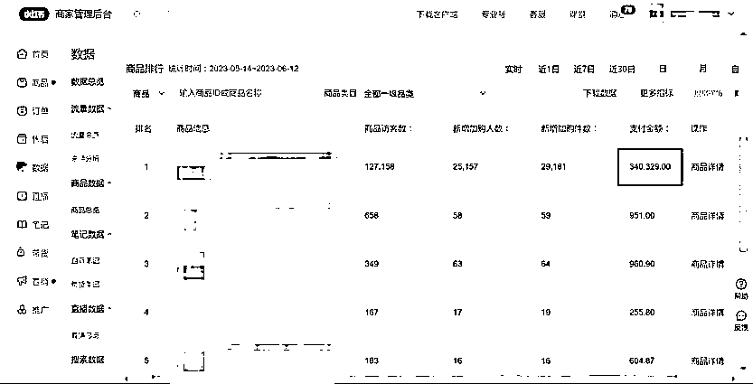

本次主要围绕这几点内容去分享：

 

 

1.2023年小红书直播趋势数据分析

说起直播，很多人或许都会第一时间想到淘宝的李佳琦，快手的辛巴，以及抖音的大狼狗广东夫妇，那小红书的直播，你最先会想到谁？

今年1月，董洁第一次在小红书带货，GMV为300万元，第二场GMV直接翻了10倍，第三场直播GMV超6000万元。

618大促前夕，售价上万元的美容仪在香港名媛章小蕙小红书首场直播中迅速售罄。当天，直播间交易额突破了5000万元。

从中可以看出，小红书巨大可观的消费潜力，正在无限增长中。

而且在董洁之前，姜思达的小红书直播间早已出现了LV、戴森、始祖鸟等大牌身影。根据数据统计，董洁前三场直播的场均客单价均达到了约677元，章小蕙直播间客单价也超过了500元。

 

 

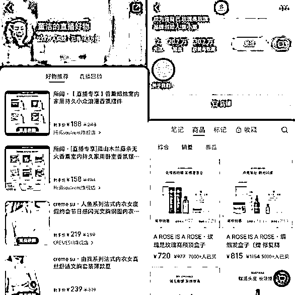

相反，在抖音，赵雅芝直播间最新一场直播的客单价仅15.44元；柴碧云直播间客单价为94.97元；贾乃亮最近一场直播带货客单价也仅为124.35元。

小红书走了一条区别于淘宝、抖音、快手的路径，它选择了中高端品牌和高客单价的商品。这也是为什么小红书很多产品能够溢价的原因，对数字敏感的朋友应该也知道，如果可以溢价，那么在小红书做电商利润肯定不会差，甚至可能会高于传统的电商平台。

2.小红书的消费人群画像分析以及平台优势有哪些？

无论是董洁，还是章小蕙，在选品的人群定位上与平台用户群体的消费调性是符合的。

小红书平台月活用户2.6亿，其中50%都在一、二线城市，90后占比70%，女性占比7成。这部分人群消费更加理性，但更看重生活品质，是中高端消费的重要力量。因此，在2023年，小红书无论是直播带货还是笔记带货都具有极高的增长势头。

 

 

而且小红书的用户群体主要是年轻女性，其中大部分集中在年龄段为18到35岁之间，其中以20到30岁的年轻女性为主，这个年龄段的女性消费者通常具有较高的消费能力和消费意愿，她们关注时尚、美妆、生活方式等领域的内容，并喜欢分享自己的时尚穿搭和美妆技巧等。

此外，小红书的用户群体也对生活方式和旅行感兴趣。他们关注健康、健身、美食、旅行等领域的内容，喜欢了解各种生活方式的分享和体验，追求高品质的生活。

这类数据分析，对于想要开店卖货的商家来讲，无疑是极佳的选品思路推荐。鉴于这类人群特殊，所以我们实测并且推荐的热门选品类目有：饰品，防晒类，水果，家居日用品，厨房好物，宠物用品，零食，美妆护肤，女性用品（内衣，内裤，丝袜这些），女装，各类花茶养生茶类等。

目前的小红书其实就相当于两年前的抖音小店，但是在用户属性方便又比抖店更加精准高效。一方面，小红书的用户是优质的消费人群，本身就是种草平台，而另一方面，今年被称为小红书电商元年，以前小红书电商门槛很高，而现在0粉丝就能开店，最低1000元保证金，并且只需一张身份证就能开店了。

对于之前没有经验的朋友，建议详细看一下这篇项目拆解的文章，因为我会全面的把这个项目实操流程，完整的给你拆解一遍。

所谓的无货源，其实本质上就是低买高卖+一件代发的模式。简言之就是客户通过小红书下单，然后我们去找一件代发的平台，让他直接给客户发货，赚取中间的差价。说白了，就是一个流量信息差的电商玩法。

再加上小红书本身是一个兴趣电商的平台，只要你的笔记流量可以，那么带货的效果也不会差。接下来一步步的给你拆解一下，小红书无货源电商，应该怎么操作。

 

 

3.小红书运营实操的前期准备工作流程

01.前期准备以及注册流程：

在做小红书电商之前，最好先准备一台手机和一台电脑。新号和老号都可以用来开店，不过开店之前要先进行养号操作。店铺名字这里有个注意事项为了方便搜索和传播，建议使用简单明了的名称，避免使用繁体字或生僻字。

头像建议以账号定位为准，并保持整洁简洁美观，名字最好有特色一点，这样的名称更容易被人记住，不可太过随意。

小红书店铺分为四种，包括个人、个体、企业和旗舰店。对于刚开始尝试的朋友，建议先选择个人店，因为目前不需要交保证金。过去需要先交保证金才能开店，但现在平台重视电商业务的发展。个人店开店速度很快，并且很多类目只需1000元左右的保证金。

我建议初学者从个人店铺开始操作，个人店成本不高，方便运营，是目前性价比最高的店铺。不过，如果经济实力稍微好一点的小伙伴，可以尝试开个体店，因为一张身份信息只能够开一家店铺，而一张个体营业执照可以开三家店铺。

001.账号注册：

小红书账号注册和抖音一样，要遵循一机一卡一号原则，前期开个人店，只需要准备一个身份证，后期如果想要矩阵，可以用家人身份证，或者注册个体营业执照开店。一个营业执照可以开三家店，第一家店铺免认证费用，但是第2-3家需要缴纳600认证费，一共1200元。

注册个人店前一定要准备好自己账号的名称，提前在小红书搜索看看有没有重名，因为小红书个人店重名要7天才能修改一次，如果你的名字和别人重复，那需要7天之后才能再重新申请，所以一定要提前查好没有重名的，再去提交注册。

002.开店流程：

 

 

点击小红书——我——点击左上角三条杠——点击创作中心——点击更多服务——点击开通店铺，接下来根据系统提示，输入相关信息以及上传相关证件就可以了，这就是一个个人店基本的开店流程。一旦我们的店铺开店成功，这个时候就可以根据提示去完善相关的信息，这些信息包括物流模板、发货地址以及退货地址（发货地址可以选择自己的真实地址，退货地址可以选择国外的地址，参考下图模板），以及公示类型（一般选择前三个选项）这些。

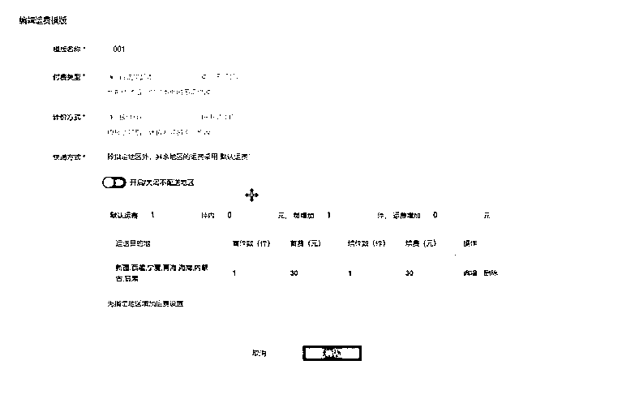 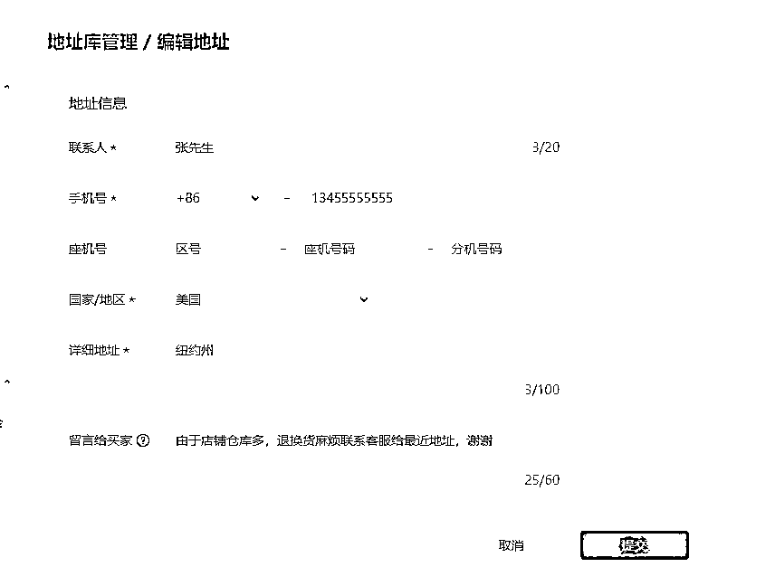

 

 

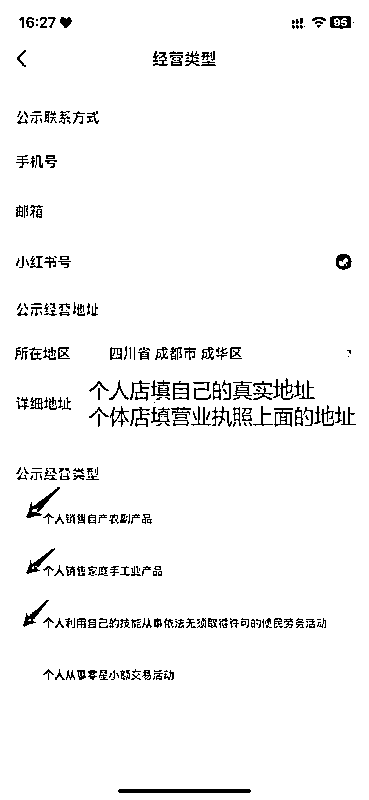

02.养号流程

注册号的账号需要养3天，这个时间段不着急改昵称，而是集中看对标，选赛道，等到3天后，发一个笔记看看流量是不是正常，一般50左右就是正常的账号。那么我们就可以开店了，切记小红书账号开店前要进行养号。

001.养号前3天注意事项：

第一天：账号刚注册下来，不要改头像改名字，不要动。

第二天：开始养号，模仿真人去操作，刷你要做的那个领域笔记。

比如我打算做服装店铺，就多刷服装同行笔记，适量点赞收藏评论，一定要在30秒后才操作。

第三天：继续养号，刷到这个账号首页发现页都是你的领域笔记，就算是养成了垂直号。

 

 

如果着急的话：上午继续养号，下午包装小红书号，发干货笔记/普通笔记测试流量，流量大于50以上算正常。

002.干货笔记类型：

服装干货笔记：衣服清洁小技巧，衣服保存小技巧。

普通笔记：风景、生活、争议型话题笔记。

如果不着急的话，第四天：上午改头像改昵称，发笔记测流量。

003.养号期间的注意事项：

每天早中晚刷小红书，每天刷2-3个小时，同行账号，图文/视频都可以。

养号细节：

每天关注3-5个权威账号或对标账号都可以，对于喜欢的内容点赞+收藏+评论，养成一个真人操作状态。

提升账号级别：

小红书官方设置有自己的账号等级制度，可以依照官方的等级任务，依次完成来提升账号级别。

注意事项：

建议是一机一卡一号，同一个设备不要频繁切换账号，不然会被系统检测到有问题。

账号权重越高，平台推荐的流量就会越多。

4.小红书账号如何定位以及对标同行？

 

 

一个账号最好服务一类人群的某一类需求，因为小红书的用户画像比较集中，大多数都是年轻女性，所以，从他们身上找到某一种需求，就是你这一个账号的定位，比如水果、内衣、美甲、手机挂饰等等，总之，想要做什么，就只做什么。还有一个小细节，就是这个工作应该在养号看对标的阶段，就要进行定位了。

当然，除了前面的用户人群分析，如果你自己对某一个领域的深入了解，也可以作为账号定位的重要参考。

比如，你本身就喜欢种草某一类产品的话，并且，对这一类产品非常的了解，也可以作为你的账号定位。

01.确定定位，如何找对标同行：

新手做任何项目，最简单粗暴的方法，就是模仿，但很多人不会模仿，很多人的模仿仅仅停留在表层，经不起深扒。

其实，想要模仿好，就一句话的事情：就是把对方的内容看明白，每个细节留意到位，然后用自己的话说出来。秉承这个原则，你再去找对标，去参考他们的笔记、选品、封面图、详情页等等，就知道该怎么做了。

首先，小红书找对标同行有三种方法：

第一.通过笔记找店铺：

搜索你要做的产品关键词，去寻找那些近期点赞比较多的，一般短期点赞能到100以上的，都算是不错的笔记。先不管他们有没有挂车，最起码，他们的爆款笔记，是值得借鉴的。如果他们挂车了，直接去看他们的店铺，按照销量排序，把销量过千的产品也都记录下来，这就是你要选的爆品备选。

第二.通过产品找笔记：

 

 

通过一个产品，可能会找到一个关联的店铺，再通过这个店铺，可能会发现好几个爆款产品，再通过新的爆款产品去寻找新的店铺，如此循环往复，其实我们是可以挖掘到很多不错的选品的。每一个店铺背后都有一堆优质的笔记，尤其是爆款产品背后，一定会有至少一篇以上的爆款笔记，这些就足以满足我们的对标内容库了。

第三.通过发现页找同行：

当我们用这个账号，经常性去刷某个领域后，就会养成垂直账号，在首页发现页会推出同领域的笔记出来，首页推出的笔记质量会比较高，而且低粉爆文的账号也会有很多，在这里面找到优质的同行，可以用小号去关注，去参考他的发文方式和爆款产品。

5.小红书如何选品，以家居日用品为例拆解：

01.多平台选品：

找好对标，建好产品库，接下来就要去各个平台去选品了，选品平台一般是：拼多多，淘宝，京东，抖音，快手，因为这些平台都是针对C端用户的，所以这个销量是值得参考的。就以拼多多为例，同品类10W+销量的商品，也都可以进入我们的选品库，同时，小红书建立起来的选品库，也都建议挨个在电商平台搜索一遍，找到销量最好的品和产品链接，一方面要作为备选产品，另一方面，后面还要参考他们产品的主图、标题和详情页，现在各个平台都支持以图识图，所以找同行还是很轻松的。

02.分析能够迅速得到正反馈的类目：

001、功能性半标品，比如：瑜伽服，防晒服，这一类一般满足人某一需求，防晒，减肥，都是真实强需求。

002、红海市场中的蓝海思路：一般是只满足于特定人群的红海产品，例如专注于大胸显小或者小胸显大的内衣，专注于小个子的女鞋。

003、美妆护肤品，护肤产品，如有货源且资质齐全，非常建议在小红书上笔记带货。

004、自带流量的产品：例如，情侣内衣，JK服，汉服等。

 

 

03.选品注意笔记和商品颜值权重：

作为女性为主的社区，很多商家更倾向于上架适合拍照发笔记的高颜值商品，消费者也对这类商品更感兴趣。这甚至形成了一种趋势，一位拼多多商家表示，拼多多的流量规则是“按价格分配”，谁价格低推谁。而小红书电商正在出现“按颜值分配”的迹象，所以在选品时，商品的颜值以及高颜值的商品也可作为选品的参考对象。这并非空穴来风，深入刷过小红书的朋友们都知道小红书的风格普遍偏向于好看的网红风格，或者ins风。

04.以家居日用品为例子，拆解选对品带来的正反馈。

小红书能做的类目非常多，目前给大家推荐的这几个类目，是我们这边实操过并且有效果的，有饰品，防晒帽，水果，家居日用品，宠物用品，零食，女性用品（内衣，内裤，女装等）这些类目都是目前比较容易出效果的类目。

接下来就以家居日用品给大家举例子，我们在定了家居日用这个类目之后，可以先去小红书或者拼多多搜索家居日用，或者百货类的关键词，例如，先在小红书搜索家居用品，我们可以看到排名在前面的，并且销量不错的是一个收纳盒。我特意在拼多多也进行了搜索，排在前面的收纳整理栏目中，也是收纳盒，那么这个收纳盒就是一个不错的选品。

紧接着，我们再去1688识图搜索，看看这个收纳盒的进货价，成本价如何。我们找了一家支持一家代发的，然后点击一件代发，选择代发下单，4个收纳盒的成本价是51.2元，它在小红书的定价是4个收纳盒98.9元，其中618活动期间是89.9元，这其中的差价和利润，我们可以简单估算一下，这一个单品总利润在28-34万这个区间浮动。就光凭一个品，简简单单，30万到手了，选对品，在小红书绝对大有可为。

 

 

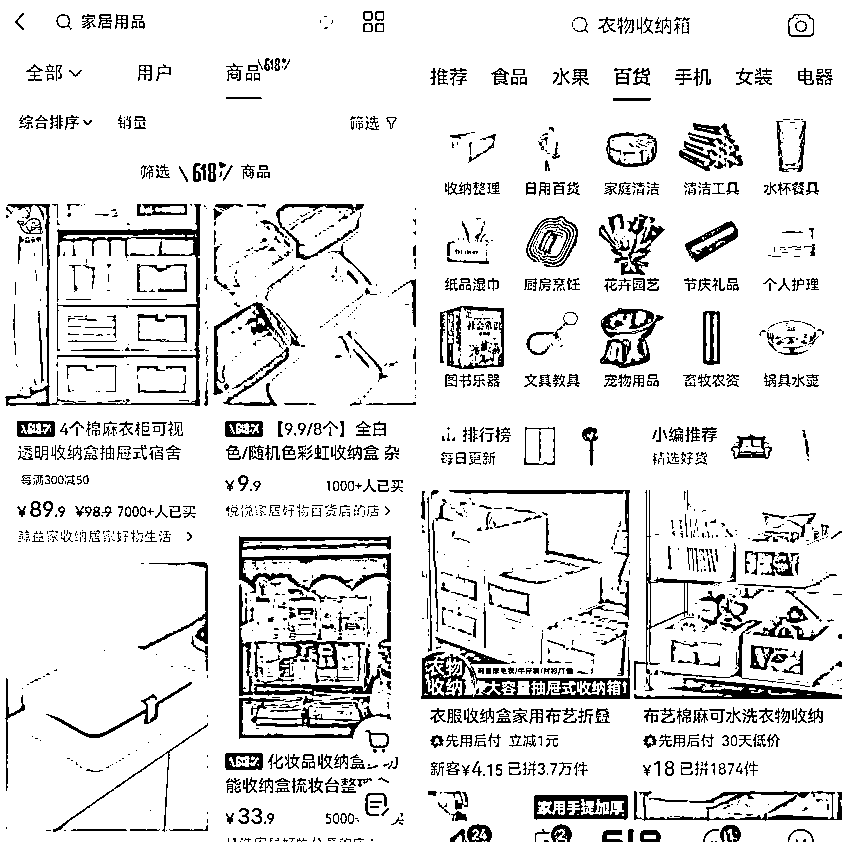

 

 

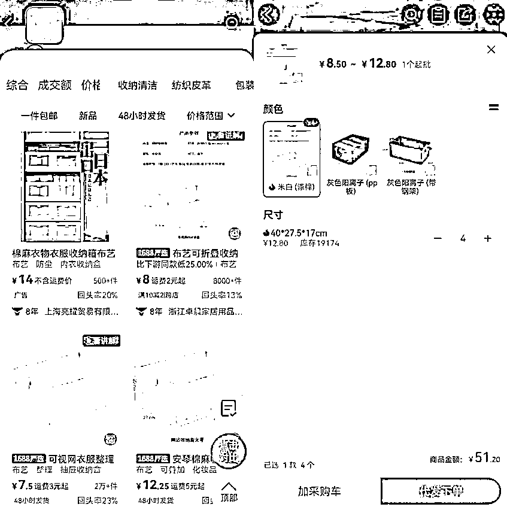

因为小红书的人群质量比较高端，所以在追求生活品质这一块，亦是比较讲究的，所以好的生活用品，家居日用品，以及一些刚需品，都是可以考虑往上面布局的。

接下来，再给大家拓展分析一下，佐证我前面这个说法。以水杯为例子，在小红书进行搜索，排名在前面的笔记以及销量高的水杯，基本都是带有吸管的那一种，这种杯子就比平时大家用的普通杯子颜值要高。这种杯子不仅外形美观，最主要的是平时也适合拍照，特别满足当下一些女性喜欢拍照发朋友圈的心理。

我们再看这一款杯子的价格，它在小红书的定价为10元，我们通过1688识图搜索，这样一个杯子的进货价为5.01元，小红书的销量显示为4.6万件，它的一单利润为：10-5.01=4.99元，粗略估算了一下，这一款杯子的利润大约为23万，收益也是非常可观的。

 

 

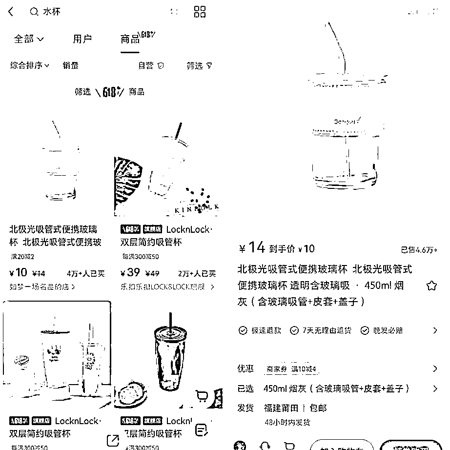

 

 

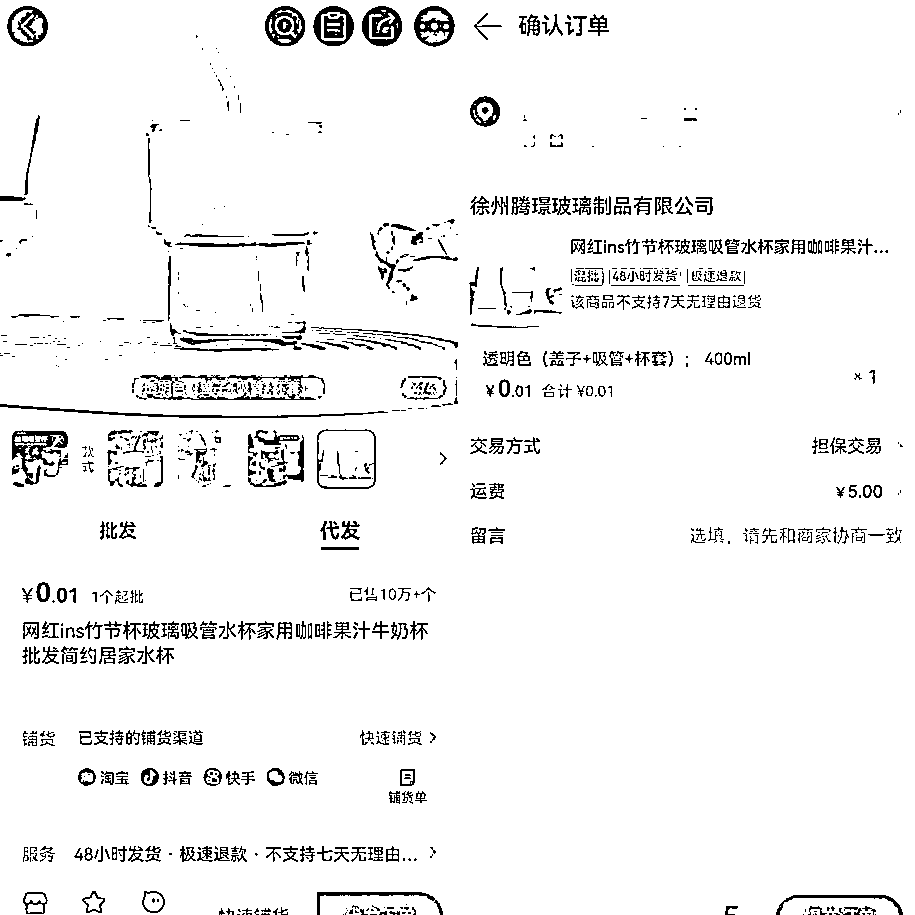

6.小红书怎么找到适合的货源以及快速上架？

前面分享完选品，接着讲解一下怎么找到适合的货源？我们这里说的普通人指的是没有货源的朋友，像我一样，一定要走无货源一件代发模式，不用囤货，你可以选择自己在网上找供应商。比如，1688就是一个不错的渠道。

01.我们怎么筛选1688的优质上家呢？这里有几点建议参考：

001.在1688上怎么区分真假货源？

 

 

相关生产许可证和授权证书、商品的质量保证等多方面来判断货源是否真实可靠。此外，在选择供应商时，可以点进去他店铺里查看其信用评价，了解其信誉状况，尽量避免选择未经验证的商品。

002.在1688上如何找到更适合自己的商品？

可以根据自己经营的品类和目标受众，使用1688搜索栏中的“筛选”模块，选择对应的类别、品牌、价格、评价等条件，缩小搜索范围。

003.在和供应商接洽时，如何判断价格和货源的可谈性？

可以收集一定数量的报价信息，进行比较和协商。坚持自己的原则，但是更要适度灵活，多思考，借助优势算力，翻阅大量历史数据，分析供应商对市场的看法等，从而得出自己最合理的谈判策略。同样，根据市场的需求量，可以预测对方的谈判底线，在合理的价格范围内展开谈判。

004.1688上的供应商是否可信，应该选择哪些？

在选择供应商时，要查看其资质、信誉评价、交易记录、阅读买家好评等多个“维度”，注意排除各类不良供应商，选择实力雄厚的顶级供应商和从长远角度合作的稳定供应商，可以极大提高合作的质量和效益。

02.批量上架产品工具推荐：

打开小红书商家管理后台，点击“服务市场”"，用“摸鱼铺货、蚂蚁搬家，欢乐逛"等铺货工具，在1688、拼多多、淘宝采集产品，进行商品批量上传，单店可上架500+产品。

一键发货工具推荐:

还是在小红书商家管理后台的“服务市场”，用“逸淘、爱推"等一键下单工具，进行订单核对，并—键下单发货。这些工具都不贵，且有免费的体验期，过了之后一个月也就二三十元钱，且多平台适用，能极大的解放你的双手。

 

 

7.小红书如何编辑爆款笔记，图文好还是视频好？

小红书图文笔记好，但是视频笔记在带货功能上优势更大，且选品不是单独选一个商品，更重要的是选择相关的带货视频，二者密不可分。

当你选定一个商品的时候，把同类这些视频从别的平台给搬下来，前期刚开始做可以视频混剪，后期直接拿样品自己拍摄。

首先我们寻找视频来源：

在抖音、快手甚至视频号里面搜索：连衣裙，看看是否有相关视频（尽量不要真人露脸的）。

我们需要观察的内容是：

001.专门做单一品类的达人

是否有，决定我们是否有视频来源；

是否多，决定我们是否可以筛选最好的。

002.某达人的视频数量是否够多

决定我们能参考多长时间，如果只有 10 条，那不用一个星期就发布完了！

003.达人的点赞数据、销量数据，研究他们在抖音平台做的如何。

选择视频很重要，要找符合小红书人群调性的视频。同样的品，不同的视频去带，效果是完全不一样的，差距十分巨大。

 

 

就拿连衣裙来说，不同的话术、场景、剧情、人物，带来的购物转化效果完全不同的，一定记得去选取（混剪）更适合小红书平台的视频内容。更极端一点的例子是，你发同一个品的 ABCD 四个账号，产品、话术都相同，只是场景不同，去测试哪一个场景更适合在小红书出单！

量当道，内容为王：这样做内容，低粉也能高变现，其实刚才我们做的一系列工作，都是为了内容这一步在做准备内容生产也可以流程化，比如我的内容，图片是有共性的，基本每篇笔记的一组图里，都会有产品整体展示图，细节展示图，客户反馈图。

文案上也有大量共性，我一天可以生产这种内容10篇以上的笔记文案，我们前期在确定内容模板的时候可以多试几个，不要觉得是不是发多了就限流了，不会的，这点放心好了，只要你内容不完全重复就行。

先说标题，分享一个起标题简单粗暴好用的方式，直接套用数据比较高的带货标题：

小红书标题可带：

被问了x遍

我要安利给所有

今年最火

私藏

我又挖到宝啦

无限回购

我后悔了

直接炸裂

每天都

被问爆了的

 

 

还可以这样

这也太好看了吧

真想把这个

我发现了

啊啊啊啊

yyds

绝绝子

宝藏

神器！

天呐！

真香

拯救我的

这是文案标题的通用语气词汇总。

接下来给大家分享小红书图片的细节，前面给大家分享了视频以及文案框架，但是图片也是笔记最重要的元素之一,在发图片时，有很多细节需要考虑，下面让我们来看看应该注意哪些事项。

01\. 图片美观度

首先，我们需要注意图片的美观度。美丽的图片可以让人眼前一亮，而丑陋或者不清晰的图片则会让人产生逆反心理。所以，在发表图片之前，一定要选择清晰、有质感、美观的照片。此外，在拍照时也要注意光线和角度，让照片更立体、自然和艺术感。

02\. 图片大小和格式

 

 

图片的大小和格式也需要注意。小红书对于上传的图片有严格的大小和格式要求，一般来说，图片最大不超过15MB，文件格式只支持 jpg、jpeg、png、gif、bmp、tif、tiff等几种。如果您的图片不符合要求，上传会失败或者图像质量会严重受损。

03\. 图片的水印和版权

当然，在发表图片时，我们还需要注意图片上的水印和版权问题。水印可以保护自己的照片不被盗用，但是如果满篇都是水印，那么用户就会感觉很烦躁，所以还是要照顾用户的心情。另外，对于盗用别人的图片，必须事先获得作者的授权，如果不遵守版权规定，可能会面临重罚款甚至被起诉的风险。

04\. 图片的标题和描述

标题和描述在小红书发图片时也非常重要。一个精彩的标题和生动的描述可以吸引更多用户阅读和点赞。在选择标题时，可以考虑使用一些有趣的词汇、炫酷的表达、或者话题热点，同时也要适当引导用户阅读和互动，而对于描述，可以采用生动有趣的故事叙述方式，或者从图片角度出发进行详实描述，但是请不要过于冗长或者饶舌，让读者失去阅读兴趣。

以上就是在小红书发图片时需要注意的几个细节，如果想要做好小红书店铺无货源，一定要重视每一个环节，精心筛选每一张图片，才能取得更多的正反馈。

8.小红书的售后问题以及常见的客服话术分享？

当出现售后纠纷时，如何妥善解决，将损失最小化?

过来人都知道，电商本身就是一个不容易的行业，有出单，有爆单，就有退货退款，商品不可能每一件都是完美无缺的，当出现售后问题，怎么处理，才能够将损失降到最小呢？

 

 

一般有售后的情况，我们要按照承诺给买家售后，同时也要及时跟上家沟通，了解上家的退货退款流程，跟上家说明了缘由之后，上家提供退货地址，我们这边再发给客户，客户按照地址退回之后，有了退货单号，我们再补充填到上家那边，这样两边都退，我们也没有什么损失。如果上家有运费险，那就更加方便了。

小红书的商品也是可以开通运费险的，不过，它的名字在平台叫运费宝，在物流工具那里可以开通。一般像有尺寸的商品，比如女装，鞋子这些商品都建议开通，因为不开通的话，如果客户因为尺寸不合适要退货，但是他们那边又不想出运费的话，就比较麻烦了。

开通了运费宝，其实在一定的程度上也是可以提高转化率的，或许别人就是看有运费险才放心大胆购买的。

顺便提一下这个7天无理由退货，可以在上架的时候，就进行选择是否支持支持七天无理由退货，一般像水果生鲜类或者农产品可以不选择7天无理由退货，但是像女装这种退货率本身就很高的，后台是一定要选择支持7天无理由退货，这种也是可以提高店铺转化率。

小红书平台电商也是跟其他平台电商一样，可以设置自动回复以及关键词，设置流程为：登录小红书商家版后台，在客服-智能客服-欢迎语设置-自动回复问题设置这里进行设置。

常见的客服话术+促单话术给大家分享参考一下，需要的可以直接搬运或者收藏，谢谢：

欢迎语

“亲，您好！在的哦，请问您看中本店的哪个宝贝了呢?我可以为您介绍的呢？”

 

 

“亲，您好！请问有什么可以帮助您的吗？”

尺码问题

“亲，您好，本店的XX物品所标注的尺码都是标准码，亲可以按照自己的平时穿的尺码购买，如果方便的话您也可以把您的身高体重告诉我们，我们帮您选择最合适您的款式。”

色差问题

“您好,亲,我们的产品都是百分百实物拍摄的,但是由于光线及显示器的原因,可能会跟实物稍有差别,但是请您放心,我们已尽量把色差降到最低,也请您谅解！”

质量问题

“亲，您好！请您放心，本店的产品在发货之前都是有做检查的，保证质量是没有问题的哦，如果您还是不放心的话，可以看看评价里面都是买家对我们家的肯定的。如果之后我们的宝贝还是出现了质量问题的话，本店是支持7天内无理由退货的哦。”

发货时间

“亲，我们一般每天4点半前完成支付的订单，当天可以发货，4点半之后就要第二天发货了  但是都会尽快给您发的  这个请您放心”

“亲，24-48个小时左右发货的哦，这边亲放心，我们会尽快的给您安排发货的。”

物流问题

“您好，亲，我们是默认申通快递的，您看申通快递您那里能到吗？”

 

 

“快递一般均2-3天左右到达。节假日，自然灾害，交通意外，较偏远地区等，均有可能到货时间延迟！”

利用“怕买不到”的心理

“这款是我们最畅销的了，经常脱销，现在这批又只剩3个了，估计一两天之后又会没了，喜欢的话别错过了哦”

“今天是优惠价的截止日，请把握良机，明天你就买不到这种折扣价了哦。”

利用顾客希望快点拿到商品的心理

“如果真的喜欢的话就赶紧拍下吧，快递公司的人再过10分钟就要来了，如果现在支付成功的话，马上就能为你寄出了。”

当顾客一再出现购买信号，却又犹豫不决拿不定主意时，可采用“二选其一”的技巧来促成交易。

“请问您需要第6款还是第11款？”

“请问要平邮给您还是快递给您?”。

这种“二选其一”的问话技巧，只要准顾客选中一个，其实就是你帮他拿主意，下决心购买了。

帮助准顾客挑选，促成交易

 

 

许多准顾客即使有意购买，也不喜欢迅速签下订单，他总要东挑西拣，在产品颜色、规格、式样上不停地打转。这时候你就要改变策略，暂时不谈订单的问题，转而热情地帮对方挑选颜色、规格、式样等，一旦上述问题解决，你的订单也就落实了。

巧妙反问，促成订单

当顾客问到某种产品，不巧正好没有时，就得运用反问来促成订单。

举例来说，顾客问：“这款有红色的吗?”

这时，你不可回答没有，而应该反问道：“不好意思我们没有进货，不过我们有黑色、紫色、蓝色的，在这几种颜色里，您比较喜欢哪一种呢?

积极的推荐，促成交易

当顾客拿不定主意，需要你推荐的时候，你可以尽可能多的推荐符合他的要求的款式，在每个链接后附上推荐的理由，而不要找到一个推荐一个。

“这款是刚到的新款，目前市面上还很少见”

“这款是我们最受欢迎的款式之一”

“这款是我们最畅销的了，经常脱销”等等，以此来尽量促成交易。

以上则是今天分享的内容，希望我的分享对你有帮助，有问题也欢迎一起交流，谢谢。

写在最后，我想表达的是~

 

 

每个人的成长都是能力和想要得到的东西，不断匹配的过程，当你的才华和欲望不匹配时，就该静下心来学习了。

坚持下去，一定会有一个不错的结果，感谢正在看的你，一起生财有术！

评论区：

低调创业说 : 男哥，牛逼！

静水 : 男哥666[强][强][强]

3先生 : 我咋感觉在这篇文章里看到很多我看到过的文章呢[擦汗]

Lion : 牛逼

Lion : 这个才是最近浏览这么多小红书店铺分享最好的最详细最具体的，其它的分享看是不错都比较空

宅男，（周恩俊） : 谢谢，一起加油[玫瑰]

宅男，（周恩俊） : 感谢认可，一起加油[奋斗]

宅男，（周恩俊） : 我们这边的玩法分享是比较早出来的，不过有些内容确实被许多博主拆分过多次了

# **# ****(86**赞**)**小红书店铺航海** **半月**GMV**破** 10W**

作者： V小刀

日期：2023-06-13

🪐  小红书店铺航海  半月GMV破10万

跟百万大佬们是没有办法比的，但是也算是在小红书这个项目上给自己了一个小小的“交代[OK]”～  趁今天中午有空，简短的分享一下自己在从0-1上的几点经验～注：非操作流程文档，更多在于经验分享，操作和基础知识相信航海给到的内容已经用之不尽了～

https://hi428l7bh89.feishu.cn/docx/Rxr2dIdWBok4fexbSlIcwIG5n5d 

 

评论区：

泡面. : 请教一下小刀，单个号测的品要属于同个赛道下的么？还是不同赛道都可以怼上去？比如做宠物赛道的，是不是最好不要上其他赛道的品去测？

V小刀 : 建议垂直，所以我是3个号3个赛道➕一个乱测的号～

泡面. : 好的，谢谢圈友回复

世界倒着看 : 请问下啥叫1V1复制，要自己入手拍摄嘛？

Frano : 请问3个店，是3个手机一机一号隔离开的吗？电脑操作店铺后台的时候有分开网络吗？

V小刀 : 就是  即使是混剪每一秒别人用的什么类型的素材你也找同样类型的混，更精细一点

V小刀 : 一机一号感觉已经被说烂了吧～这种问题就不用纠结了～后台没有分开～这么点体量还没到平台要风控你网络的程度～

晨晓 : 请教一下小刀，视频剪辑模板就是根据爆款视频一比一复制吗？素材需要找爆款素材吗？感觉我剪辑没有啥思路，都是被素材牵着走，账号风格不太统一

# 【选品方法】**13**篇

# **# ****(**精华帖**)(261**赞**)**小红书单店铺单月**6000+**利

# 润选品保姆级教程

作者：  书豪

日期：2023-06-26

各位朋友好，我是在杭州的圈友书豪，一个连续创业四年的 95 后，目前连续四年都年入百万。

 

 

从三月份到六月份，我们团队总计在运营**30**家小红书店铺，做的全是无货源，目前一个月利润在**20**万左右，平均下来我们单店铺单月的利润在**6000**元左右。

# 小红书**VS**视频号**/**抖音短视频带货

很多老朋友都知道，我的第一桶金是靠公众号矩阵赚来的，而二次创业靠的是抖音短视频带货的红利。

我强烈建议，所有做过抖音短视频带货和视频号带货的朋友，都能快速入局小红书无货源电商赛道。不要觉得小红书平台没做过，就不去做，人都有畏难心理，人都会在面对新平台新事物的时候难以开始。但真正想要赚到钱，就要多多尝试，更要把前期在视频号/抖音带货积累的经验和技能迁移到小红书平台。

因为目前小红书无货源电商带货，吃的都是纯自然流。

一方面有流量红利，不用担心流量被大头吃掉，因为小红书本质还是一个内容平台，完全是靠笔记去吸引流量，投流没有多大用处；另一方面，当年入局抖音短视频和视频号带货的兄弟们，对选品和素材视频混剪的技能肯定是强于新入局小红书平台的电商新人们。

为什么我会强调选品和素材视频混剪的技能呢？

 

 

因为实话说，小红书无货源带货当前并不是初期红利，靠纯搬运这个方法的路已经走不通了，并且小红书无货源电商，无论哪种选品方法，它的本质都是去跟别人的爆品，也就是跟品。

很多人都说，只要选品选对了，你就能爆单，也不尽然，选品固然重要，但并不是选品正确0粉发笔记就能爆单，而是要选品正确＋视频素材优质。

现在爆单相比２月３月的时候，难度大了至少一倍，现在做的人多，跟进的人多。能想到的选品基本都被人选过了，这时候再用一样的视频素材去发一样的品，爆单的几率其实就跟别人五五开了，只能听天由命。

所以在讲选品方法之前，我想告诉大家，做好小红书电商，最核心的并不只是选品，不要神话选品的作用，选品其实很简单，最核心的是符合时效性的选品＋熟练的混剪能力。

在小红书上想要卖货出单，选品需要年轻化、女性化。因为小红书大部分都是１８～３５岁的年轻女生。

那么在小红书上选品难吗？！其实一点都不难，接下来就来说说我们总结出来的方法论。

# 我们是怎么选品的呢！？

 

 

首先方法有很多，但是殊途同归，有三个重要的原则

第一：**0**到**200**粉账号，别人最近7天爆的单品你也能爆，除非你素材混剪能力太差了。

第二：剔除掉女装这类高度竞争的红海赛道，包括聚拢内衣这个品类我们在4月5月小赚，但是6月流量下滑明显。聚拢内衣也不建议大家去做了。那么做什么呢！？做百货类目！

第三：做百货类目的同时去做客单价低于**50**的商品，低价带功效性的产品是最好的，比如搓澡神器、头皮上药器、赵露思同款檀木梳、手持小拖把等单品，从3月份一直火到现在。

# **# **方法一：低粉爆款法

低粉爆款  ：去选品其实就是跟品

跟品，按照低粉爆款的思路去跟品，原则是

对标模仿的小红书账号低于**200**粉丝，同时最近**7**天发的单篇带货笔记点赞过**100**，同时该带货笔记商品销量大于**100**。

 

 

这种爆款方法，本质就是找没多少粉丝但已经有品在爆的对手，去跟品！

低粉爆款四个字等价于六个字，那就是粉丝少成交多！

利用低粉爆款法去选品，你可以不依赖于灰豚数据、考古加等第三方工具软件去寻找当前刚起的号当中，有哪些人最近7天带的品在爆。仅仅通过小红书发现页去刷就可以，不要怕麻烦！耐心一点，每天寻找三个品去测试。

另外，即使是低粉爆款的品，如果你抄的时候没有抄到低粉爆款的笔记的封面，这个品也会出不了单。选品正确代表走完了**70%**的路，还有**30%**的路是封面**+**视频要抄的精准。

# **# **方法二：抖音精选联盟排行榜法

做小红书无货源电商，怎样利用抖音去选品呢！？

首先说明一下，为什么我们要利用抖音去选品呢！？

第一：抖音的用户群体和小红书的用户群体有重合。

第二：抖音上面的商品是以视频为主，素材比较多，方便我们进行混剪。

那怎么样通过抖音去给小红书店铺选品呢？

 

 

第一，如果你在抖音上有开通商品橱窗，那么可以进入选品中心，搜索你选好的品类，找月销量排名前几名的商品去跟款。这是最高效的方法。

但是，卖女装的话，这个方法不一定绝对正确，因为一件衣服能否被一个用户喜欢，跟个人的审美有关，有一些销量不高，但是你喜欢的款，你觉得好看的款，也可以跟，一般也能出单，但是能否成为爆款就难说了。

第二：可以直接在抖音的搜索栏里直接去搜索对应的品类，再利用抖音的筛选功能去选择一天内最多点赞的内容，去进行跟款和搜集素材。

# **# **** **

# **# **方法三：灰豚数据选品

如何利用灰豚数据去找对标账号

第一步：打开灰豚数据

第二步：点击笔记查找，选择笔记搜索

第三步  ：勾选上【带货笔记：是】

 

 

第四步  ：勾选上【低粉爆文】

搜索你要的对标，比如想要做连衣裙，则搜索连衣裙

灰豚数据的低粉爆文跟品成功概率很低了，因为现在做小红书店铺的人越来越多了。用灰豚数据的人也多了起来，因此一个品会被很多人同时跟进，这时你的出单成功率就降低了。

但即使是用灰豚数据，我认为你找的对标账号也应该选择粉丝在**200**以下的，点赞在**7**天内大于**100**以上的笔记，同时该带货笔记商品需要销量大于**100**，才可以选这个品。同样使用低分爆款法。

** **

# 三、选品确定后如何测品呢！

我们做无货源电商，测品只就记住一个字，抄！

测试你选好的品，重要的是抄得精准，抄到极致。把对标账号的爆款笔记的视频素材的每一秒都抄到位。

 

 

1、素材视频和封面必须抄到位，一点懒都不能偷的，标题+文案的像素级模仿其实是最简单的。

2、一个品**8-9**条视频，没爆换下一个，素材功效性明显有反差的，会测试30个左右的视频，把流量薅光，素材从抖音上找爆款视频，点赞破500的视频素材下载到本地。

3、一个爆品能持续两三天或者一周，反复用这个爆款素材框架，替换该视频素材的中间部分视频画面，多张图片或者视频素材替换都可以，吃干净这个爆品的流量为止。

4、单品测试８～９条视频素材不出单立马换下一个商品去测试。继续低粉爆款的思路去选品。

5、如果是爆品，一定要多收集素材，把全网的同款素材吃干净，分门别类地归类该爆品的黄金三秒，中间转化部分，结尾引导购买部分的素材，搜集多样化素材去做混剪。

要记住，一个爆品，用一两百个笔记去打，都是值得的！

6、在小红书开店当前是红利期中期，但是不能像今年2月那样直接从抖音/淘宝搬运图片和爆款视频，不需要去重就能出上百单。现在我们的笔记视频至少需要去重，至少需要混剪。不建议大家去自己买回来产品去实拍，一个非专业选手，对商品的拍摄角度，拍摄风格都是没认知的。除非你参照对标账号的爆款视频一分一秒都模仿着来拍，但这样精力消耗太大，是否可行自行取舍。

7、多在抖音、淘宝买家秀和商品主图视频区找素材，抖音火山版、快手也会有一些补充的素材能用，可作为替补。

8、测试视频期间如果笔记超过**500**个小眼睛，找人去该笔记下面补10个评论，评论可以去淘宝买家秀评价区去复制粘贴即可。笔记如果出第一单也立马补10个评论。

 

 

# 一些开店中的经验

# **# ****1**、实名问题直接找家人和朋友明确说明用途

多开店铺必然要更多的实名资源，个人店铺的实名其实很简单，家人都找了一遍之后，就找朋友，可以和朋友明确说明用途，朋友帮忙人脸识别的时候远程手机登录就可以。

这里和大家说一下，平时就需要积累好的信誉，如果你在朋友心目中的形象是靠谱的，诚信的，都不需要打电话沟通，直接微信语音说一声朋友答应了立马帮你实名就可以了。

这里强调一个个人店铺帮忙实名的问题，提现的朋友必须信的过，不会提钱不认人，这点很重要。

# **# ****2**、个人管理多少店铺

 

 

单店铺成功概率最小，因为即使你笔记爆了，如果一切都很顺，在该单品转化悬崖下跌后，店铺又需要重新测品，又进入到单店铺收入吃面期，所以至少去做两个店铺，个人管理3到5个店铺最好。因为你单店铺不可能是那么顺风顺水的，选用低粉爆款策略本质是一个跟品策略，决定了笔记大爆之后会导致被对手举报，单店铺单品都会面临店铺或者笔记流量下滑限制。

# **# ****3**、如何发笔记

大力出奇迹，单天至少**3**个笔记。需要保证你单天能测完一个品，针对还在职的同学，我的建议是以小红书店铺为副业，至少单天发三个笔记，以三个视频素材为一个测品周期。

如果时间多的同学，可以每天发10个笔记，单天测试3到5个商品，比如  发A商品、B商品、C商品、需要交替发笔记，如A1视频、B1视频、C1视频、A2视频、B2视频、C3视频交替发送。

每个笔记需要间隔40~60分钟左右发送，可以用定时发送功能。

大力出奇迹，执行力决定一切。

# **# ****4**、如何提高视频素材混剪效率

 

 

1、确定好一个品的剪辑模板，然后在抖音/快手/抖音火山版/淘宝/拼多多上多攒一些视频素材，再把剪辑模板里的视频素材换一换顺序，或者换一换其他视频素材，就是一个新的视频，可以导出直接使用，测品阶段不用固定封面，哪个视频转化率好再固定用哪一个封面。

2、保留爆款起量素材的前后三秒，替换中间的转化画面，以图片和视频替换都可以

3、归类每个视频画面的素材到本地，以单个文件夹命名，开头前三秒，如悬疑、反差、痛点等等，开头前三秒分别归类到不同的文件夹，转化画面同理。

4、抖音上多看看混剪教程，提高剪映的熟练使用能力。

5、多记录爆款视频的视频内容标题（不是小红书标题），巧用悬疑标题，提升打开率和完播率。

6、善于利用工具，稿定设计、美图秀秀、醒图这些app有很多小红书相关的功能模块，学会用起来，事半功倍，还有剪映工具立马学起来，你选好品以后不代表就能成功，还需要利用剪映做剪辑，利用稿定设计做封面，利用至尊宝插件下载视频素材，种草能力也是必须的，学会了选品，总得落地封面视频素材等内容，再去落地种草转化。

# **# ****5**、如何养号

 

 

我们主要的选品方法是低粉爆款，直接在小红书发现页，刷低粉爆款账号（粉丝数小于200，最近7天某笔记点赞超过100，带货笔记商品销量大于100），不断地往下滑寻找低粉爆款爆品，在往下滑或者刷新的时候，找到了低粉爆款商品进行点赞收藏，记录该低粉爆款商品，选品的过程中本身就是在养号。

# 写在最后：

好了，写这么多，如果你因为我写的小红书选品教程出单了，可以在本文小小赞赏一元钱，让我知道本文对大家确实有实际帮助。

现在小红书无货源电商的百货赛道自然视频流量依然很大，实操一遍之后你会发现，做起来真的很简单，和做抖音视频号短视频带货没有本质区别，你看完我这套选品方法流程的可以立马去测试低粉爆款选品的出单效果了，如果遇到卡住的问题欢迎找我交流哈！

感谢大家的耐心收看，希望能对大家有所帮助，也希望看到更多优秀的朋友真的走通小红书无货源电商这条路，一起生财有术！

# **# **** **

以上，一起生财有术！欢迎各位圈友前来交流，微信 wshinvest1

 

 

评论区：

黛色翩翩 : 真保姆级教程  感谢书豪大佬分享！

梦宸 : 感谢豪哥分享，对我确实很有帮助

月起星九 : 选品这块解决了我很多疑问，好详细，感谢书豪分享啊

谢安生 : 详细到具体选哪些品都有举例，真保姆级教程，感谢分享～[强][强][强] 书豪 : 谢谢支持，一起生财有术[拳头][拳头][拳头]

书豪 : 感谢黛色，还想向你请教微信搜一搜问一问的玩法

书豪 : 一起生财有术[呲牙][呲牙][呲牙]

书豪 : 一起生财有术，月起星九美女

# **# ****(**精华帖**)(252**赞**)**小红书店铺如何** 1 **个月做到

# 月流水破** 50W**

作者： Jessy👾

日期：2023-05-04

大家好，我是佳希Jessy，从2020年开始做电商，淘宝、抖音、视频号都有开店，专注在女装和饰品类目。

去年10月开始在小红书开店，不到一个月时间，2个员工把店铺月流水做到破50w。目前公司主要精力都转移到了做小红书电商上。

不同于淘宝/拼多多大部分来自精准的搜索流量，或是抖音/视频号的庞大的直播兴趣流量，小红书绝大部分的流量都来自于笔记。

 

 

可以看到我们后台数据，“笔记支付金额”占到了总支付金额的85%，相当于用户仅仅只是花了不到1分钟时间看了一篇笔记就直接付款了，转化率非常高！

详细内容可以下方文档查看哦：

3月8日《小红书店铺如何1个月做到月流水破50w+》 - 飞书云文档 ( feishu.cn )评论区：

帮主 : 1）符合小红书的真实风格。2）水军运营好笔记、评论。3）限时折扣。。。阿妈，我要发达了！

国昌 : 圈友们太棒了，看完一篇马上就有圈友给续上新的一篇。[拥抱][拥抱][拥抱] 万青 : 您好！大学生水群资源怎么联系呀

dxy : 准备试水，lz可以介绍一下水军群资源吗！

雄 : 水军群能否进一下

张武 : 厉害，学习了

明光 : 同问水菌群怎么认识一下

biubiu六月 : 想问一下你的女装退货率现在多少

# **# ****(190**赞**)**能提高**40%**销量的小红书选品思路

作者：  艾小飞

日期：2023-05-25

【能提高40%销量的选品思路】

人群关联选品法

这是什么意思呢？我简单举个例子，你就大概懂了

就以我之前开过的小红书店铺来举例吧

比如之前我有一家小红书店铺是卖女鞋的，为什么我店铺袜子的销量，基本上都跟鞋子销量是差不多的呢？

 

 

还有我的一家小红书钓鱼用品店。为什么我的饵料销量会比鱼竿的销量更多呢？

我再举个例子吧，因为考虑到夏天来了，上个月刚开有一家露营店，为什么露营桌椅的销量，也能带动跟露营没有啥关系的氛围灯销量呢？

这就是选品能力的魅力！其实选品就是考验人的观察力和理解能力！

如果你选品没有往人群强关联性的方向去选的话，那么你费尽心思的去推广这个产品，结果你的产品销量却不如隔壁老王的

这个选品玩法有个好处是，他们都是同一类型的人群，转化率是非常高的，只要你主推一个产品，他们基本上都会在你的店铺里面，再去买其他的产品

虽然每件产品的单价都不高，但是客单价是非常的高，基本上一个人只要来店铺里，都能买两单以上的产品，所以这就影响到了，只要你主推一款产品，就能带动其他周边的产品，能理解这个意思吗？

基本上我也是靠这一个选品的方法，我的店铺只要主推一款产品有流量后，就会带动我其他产品的销量，所以我的每家店铺，基本上每个月都能给我带来很多额外的收益最主要是，成本低，还省力！

思路总结：

1.思考有哪些产品是需要搭配其他产品给用户感到会更完美的

2.先主推一款产品，带来的流量会带动其他产品的销量

小红书店铺

评论区：

亦仁 : 中标，术值+1。

在上方专栏点击 #中标，可查看所有中标风向标。

悦佬 : [强]

Joanna : 你小红书店铺是哪个呀[呲牙]

晨哥 : 做的无货源嘛

艾小飞 : 对的

 

 

谬误剑士 : 谢谢啊，有用

陈真 : 刘小排，烤红薯原理

星空 : 有点像刘小排大佬分享的【烤红薯】的方法啊

# **# ****(**精华帖**)(182**赞**)**小红书自动引流系统淘客月

# 佣** 9W**

作者：  老严干货CPS

日期：2023-01-31

生财有术的圈友好，我是老严。

我群有位朋友，他这边一直是在做返利、社群这两块业务。这两块业务目前已经运营2，3年了，最多佣金的月份有100多万。这块相对稳定，但跟大部分人一样也有很大的下滑。

由于以前的引流方式比较杂，也没有太固定的套路，更多的是吃老本和东搞搞西搞搞，另外感觉社群比较费人力，业务量波动时不好管理。

所以2022年他就想着另起炉灶，打造一个从引流到变现的闭环流程的固定流程和套路。

我把他的分享共享出来。

说到这里先说个小故事。

一、机会无处不在

 

 

前几天听了一下罗胖的跨年演讲，罗胖有讲到一个人的故事与我想表达的意思正好契合，所以这里先简单说一下这个故事。

里面讲到一个龙华哥的故事，这个龙华哥是深圳一个工厂老板，工厂倒闭破产了，他陷入了自己的人生低谷。

有一天，他发现深圳很多电动单车的座椅上面都会破一个洞。于是他带一点胶水和皮革材料，路上遇到有破洞电动单车就给人修好。

然后留个二维码和一句话：座椅已帮你修好，扫码支付，金额随意。回到家以后，真的开始有人给他付钱了。

第一天收到了31笔，收了184块钱。第二天收款562元，刨去皮革和地铁日票25元，挣了大概有500元。

一个新的生计就这么诞生了。

龙华哥擅于在线下寻找机会，而线上其实一样的有大把的机会。只要愿意多尝试，找到一样的一个生计机会并不太难。

再聚焦淘客业务，也在这一年里发生了相当大的变化，淘客业务呈现越来越多的全域化、多样化、复杂化。不断的有新人闻讯加入淘客这个行业，也有人悄然退场，或者变换赛道。

听惯了很多月佣100万，日进万粉的故事。可能会给很多人产生一个错觉，感觉周边的人都很厉害，个个都是日进斗金。

 

 

不得不承认，确实山外有山，楼外有楼。但每个人自己有能力可以掌控的事情其实并不多。大部分人从年头到年尾做的还是相同事。

绝大部分的人不是听故事就是传故事的人，注定了自己只是普普通通的一个人。

我知道对大部分人来说不走弯路就是快，很多“大手笔”的玩法也不适合自己。所以任凭外面潮起潮落，我自巍然不动，从2022年6月份开始，我用了半年的时间打造一套半自动淘客业务引流落地流程。目前这块业务一个月佣金8-10W，扣除返利和兼职成本，最后利润40%左右。

**6**月到**12**月业务变化

当然这个数据其实并不算太好，我对这块业务最终结果并不算非常满意。只是感觉这个模式是可以放大的，流程理顺以后，完全可以交付给公司有一定的经验的人主导或者全员分头负责。

 

 

这个过程对于来自己来说是最真实的，所以借今天这个机会在老严群里分享一下，多聚焦一些同频或有兴趣的朋友一起进步提升。

回头来看，之前做得过于谨慎、投入太小，总想着迭代前进，不要投入太大。导致前面摸索了很长时间，半年的时间里有2/3的时间进展都是比较慢的，甚至在10月份的佣金还只有4万，后面11和12两月每月增长2，3万。

2022年年底有了9、10W这个基础，我相信这块业务明年的增长才是真正值得自己期待的。

由于这个业务本来就是从0开始的，虽然目前总体佣金并没有几十、上百万。但由于每个月都维持了50-100%的增长，而后续放大和增长主要取决于更多的商品和更多的兼职即可。所以虽然基数不大，但是这个增长率给了自己很大的信心鼓舞着自己从一开始就坚持了下来。

 

 

 

前面说了那么多，下面就来简单说一下这个业务流程吧。

二、核心业务流程

找兼职，发笔记，引导到公众号查返利下单。

说起来很简单是不是？！确实也就是这么简单。简单到可能有些人一看是这么玩的都没兴趣往下看了。

发布后笔记的样子：

兼职取笔记的样子：

 

 

三、每天要做的事

从各大渠道挑选10-20款商品加入到待发清单中。等系统自动导入些评语和图片，检查是不是有瑕疵。

其实基本上也不用怎么管了，有自动AI打分和评语过滤功能，人工检查只是例行看看。

 

 

 

 

 

 

 

 

看看哪些款有品出单，该加码的加码，该控量控量。

看看兼职们在群里都聊些啥，有没有需要回复的给他们回复一下。

 

 

基本上就这么些事，每天真正在引流上面花的时间只有2、3小时左右。所以我前面说是半自动引流变现。实际上这些工作经过自己的摸索优化形成流程和规范以后，后期我已经把这些工作移交给同事负责了，每天投入30%左右的时间处理上面的一些提示。

四、哪些主要成本

 

 

兼职的笔记费用是最主要的直接费用，但这一块投放可以自由决定，根据引流效果及时的调整即可。

因为做到了精准的转化反馈，所以这方面的控制也可以做到非常精细化。这半年多以来，最多的一天投入800多元，最少的一天投入只有几十元。

五、选款经验

小红书引流选款是最后的重中之重，很多人在小红书上面引流失败或者效果不佳的原因主要出在选款上面。这方面我们也是从0开始，没有积累，慢慢摸索的，所以这方面前期有一些投入，现在基本上理顺了一些。

 

 

这个优化的过程其实有个好几个版本

**5.1**大淘客版

直接采集和大淘客的商品图片和文案。发现有很多营销文案，比如买三送一，券后78元，一次拍3份到手22元。这些内容与低价引流的价格不匹配，处理起来有点麻烦，这是一方面原因。

最主要的原因是大淘客上面的优惠价格变化太频繁，今天一个优惠价格，明天可能就没有券了，而笔记有很长的长尾流量。

我统计到半年前的笔记还有引流效果（顺便说一下，有些人要求笔记发完7天就可以删除，说没有流量了，我不知道他们有没有数据支撑。反正不留白不留，我要求都留着，不能删除。）

 

 

虽然正常我们标价本身也是比正常价低一些，但如果再加上优惠券失效双重因素，会导致价格严重不符，影响用户的感受和下单积极性。

**5.2**商品库管理

初期的版本是为了省事，直接配置一个从大淘客获取文案的模板就可以不用管了，系统会每天更新大淘客商品。可以省掉很多人力。

 

 

后面发现有些款根本不能出单，比如A货，而有一些款开始出单以后，想大量的发布笔记进一步提升效果，比如某个商品一天想发100篇笔记，大淘客每个商品只有一份介绍文案，会造成大量的内容重复，效果显然不后。那么大淘客的文案，这样显然就不够用了。

所以后面就基于商品库来维护，将评语和晒图作为文案内容。为了减少文案的审核工作量，这些基本上是全自动导入和打分过滤。比如评论中的差评会去掉，图片长宽不成比例、图片模糊等。

其实大淘客之外，还有很多长期高佣、品牌的商品可以去推广。

**5.3**采集爆文笔记

比如用某款扫地机器人引流，发现有很多关于这个品牌这个型号的其他爆文文案。别人可能是真正的分享者，或者商家的营销团队发的，也有可能是别的原因发的，总之爆了，点赞留言几百上千。

象这种文案，我们只需要采集并稍作修改，加入引流元素就可以使用了。并作不同的伪原创修改，弄出几份类似的文案出来。

 

 

这个模式也一直在使用。

我们用来引流变现的商品并不是固定的，每一月商品都在以往的基础上增加和删除一些，但总体上商品根据赢利状一直呈现这样的分布：

60%不能出单，测试10笔左右就放弃了。

40%能出单但不一定赚钱，其中又8%赢亏平衡，其中又1%的能赚钱。真好像一堆沙子里面挑金子。

以半年时间我们一共发过的2550款商品为例：出过单的为1036款，210款赢亏平衡，30款可以赚钱。

而这30款商品才是我们最后终于需要关注的。有的款一个月能达到1万多的佣金、有的7000、有的1000、2000元。

 

 

每个月只要有10个这样款，就基本上可以维持住几W的佣金收入，确保投入产出的平衡，甚至在引流的过程中赚钱。

如果有选款经验丰富，我感觉还可以节省50%以上的选款、测款成本。没有经验的话也可以慢慢积累好款，比如2022年5月开始的款我们明年就可以继续翻出来再推广。

 

 

说到这里，还需要强调一点的是，其实我们最初只是为了引流的，图的是用户的留存和后续变现，并没有想着马上赚钱，而实际情况是我们在引流的过程中新粉就已经赢利了。

 

 

我们在10月份就观察这个现象，并在内部调整选款和引流的侧重点。即：在确保任务足够多，养着大量兼职的情况下，还要着重商品选款和优化引爆商品的操作。

整个引流模式的ROI能否跑正，主要取决于尽早发现和测试出这1%的好款款。

 

 

5.4、选款要求：

 

高佣：价格有80元以上，500元以内均可，佣金10%以上，佣金稳定在一个月以上。

应季：应季款和常年款各占50%左右。

人群：20-35岁女性人群。美妆、户名、孕童。

品牌：品牌词自带流量，一定要含有品牌词，且小红书笔记在100笔以上的。

**5.5**、选款举例：

 

 

6月开始操作，1-5月暂时没有经验。

6、7月的泳裤、防晒衣/帽、渔夫帽、墨镜、冰袖、一次性内裤、脱毛仪

8、9月的月饼、学生行李箱、书包、学习桌、娇姿带

10、11月的露营装备、卫衣、靴子

12、1月保温杯、婴儿睡袋

常年款：项链、手链、破壁机、空气炸锅、电动牙刷、筋膜枪、女包、网络摄像头、蓝牙耳机、手表、待产包。

这些都是大致的类目，但是品牌与品牌之间差别依然很大。最好是借商家宣传之势，在直播间、大淘客、联盟首页寻找一些正在大力宣传和推广的商家。有时候我甚至可以电梯间也可以发现一些好的品牌机会，总之寻找一些有可能流量的机会。比如泰兰尼斯这个名牌不知大家听过没有，反正我之前是没有听说过的。

 

 

这样的品牌有线下推广，厂家自己在投入推广，这个时候流量肯定会比平时要多。而笔记数量的“供需”相对会稀缺一点。

 

 

最后可以用5118等工具查看搜索流量

 

 

六、细节是魔鬼

有些人一听说发笔记引流，可能就会有完全不同的两种结论。我知道有少部分人做得很不错，通过小红书每天引流几百、上千粉丝。有些人每天发上万条笔记。

 

 

 

 

 

而且他们各种业务都玩，什么粉都尝试。比如外卖、电影。最近蒋晖也有介绍过每天1万条笔记的玩法。不论他的效果是不是真实的，但是也可以说明确实有人通过大量的发笔记引流。

而另一部分人的结论都是：太难搞了，没有效果。

但是仔细一沟通细节，发现他们的做法注定是很难搞。

**6.1**、删除笔记现象

比如：有人反馈说兼职今天发的笔记，领完钱，明天就删除了，哪里会有流量，难搞！！！

解决办法：系统自动抽查的，每人每周自动抽2条笔记，删除了就禁号，想继续再做，先免费把删除笔记的补上相同数量再说。

**6.2**、招不到人？

有人反馈说招不到人发笔记，做了一个月了，每天就10个人发20-30条笔记，从哪里招那么多人哦，难搞！！！

解决办法：有钱能使鬼推磨，我一条笔记给1.5元，徒弟每做一笔师傅得1块，人来得超快，最多的时候每天400，500人在提交笔记任务。随便怎么挑来挑来去的用。再通过设置奖励上限额度，最后算下来，其实并不会花那么多钱。

**6.3**、兼职拉自己小号？

 

 

有人说自己的兼职大号拉小号，撸奖励，一条笔记成本太高了，真难搞！！！我说：我的笔记发现有填支付宝相同或 IP相同的人，自动断开关系。

6.4、 我知道我有一半的广告费浪费了 ，但我不知道是哪一半。

这句话来自百货业之父约翰·沃纳梅克(John Wanamaker)。

 

 

有同行说，有些人的笔记有效果，有些人笔记没效果，都给1.5元吗？有些人每条笔记都只有十几个浏览，感觉好多钱浪费了，没有效果，真难搞！

解决办法：是按效果付费的浮动报酬。

浮动报酬是指根据小红书笔记的周报数据，或者引流下单数据调整报酬。

 

 

开局1.5元，效果不好的浮动到0.5元，0.2元。效果好的涨到2.0元，3.0元，并天天在群里拿这一二个3.0元的当榜样，不停的截他的奖励图，鼓励那些报酬少的坚持下去。综合算下来，其实平均一条笔记才几毛钱。

太多细节，就不一一说得那么具体了，有些规则我自己都忘记了。。。。

七、关于风号

做公众号的返利的都担心一个问题--就是风号，确实这个问题一直困扰着大家。

其实2022年情况还算比较宽松，很多人反馈以前发模板消息动不动就处罚，2022年好像没有管这一块了。也确实发现很多模板消息又开始多起来了。

 

 

我们也没有什么办法彻底避免这个问题，只能发挥主观能动性，积极的想办法就应付。

目前能处理的措施主要有以下几种办法：

**1. **多公众号操作

当你只有1个公众号的时候会比较焦虑，当你有2个公众号时感觉有个备份焦虑会少一些，当你有5个公众号每个公众号只占20%的业务量时，基本上这种焦虑就不存在了。

**2. **引导进群备份。

公众号留粉丝进群二维码，引导进群查看最新爆款、享受粉丝福利等。

**3. **引导加好友备份。

 

 

通过菜单提示加客服有福利，并及时给用户打标签。如果再在5单以上的用户提现时，偶尔设置一些莫名奇妙的“故障”，让联系客服处理后，基本上80%的用户可以得到多重备份。以往有风号时也基本上能挽回80%。

备注格式：

【公众号简称+最新订单年月+会员编号+多少订单+原昵称】

比如：有券-2212-187279-100D-胖妞，

表示：公众号“XX有券”(举例,实际不存在)的会员，22年12月最后下单，会员编号187279，累计下过100单(D)，原昵称为胖妞。

 

 

今天要分享的内容主要就这些了，希望对大家有用！

另外，附上提问环节：

提问：笔记内容是兼职自己去获取，还是你获取好了发给兼职？

回答：兼职获取内容和提交链接都是从公众号获取的，我再补充一个图。

 

 

提问：系统是如何确定这个单子已经完成的？是不是根据给兼职的文案**  **和兼职发出去的文案之间的内容对比？

回答：兼职提交笔记链接以后，系统会抓取笔记的详情，有图片、标题等内容。可以用来判断是不是咱们的内容。甚至图片是不是漏发了，有没有加话题。都会检查。

提问：太厉害了，连漏发都查得出来。

提问：具体是如何引导到公众号查返利呢？是客户留言后，私聊发公众号的名字给客户吗？客户关注了公众号后，客户是如何下单笔记发的那个商品呢？

回答：兼职的方式，不太适合留言或者回复。他们很懒的，根本不管你这些。所以直接在文案中用水印图片。

提问：每天这么多一笔一笔的钱要转，你是如何提升效率的，使用商户转账到微信么？

回答：系统可以抓取笔记的详情，然后给笔记打分。自动入帐。用户自己提现。除了准备文案的前期工作，后续，整个过程几乎不用人工干预。

 

 

提问：对兼职的小红书账号有什么要求吗

回答：没有要求，提了要求也不好操作。所以看效果说话。先给1-1.5，让他们发几条再看。

提问**:**这套工具太牛了，既能生产不错的文案，又能兼顾效率，还能自动检查笔记是否正确，是否漏发，我想问下工具是自己开发的，还是找人开发 的？

回答：这个系统是我自己开发的，也是5，6月份的的时候，听到这个这么发笔记。但是每天跟兼职对帐，检查笔记，很费事，经常打错钱，少算多少。说，根本不是人干的。

自己懂开发，所以就慢慢迭代着完善了。

提问：赚钱的时候把引流给解决了，牛逼，那你接下来准备如何放大，如果放大**10**倍，你整个**SOP **需要调整什么？

回答：目前已经实现0-1，确实已经在考虑1-10的事情。主要就两个因素，1是兼职，2是商品。兼职的问题，好解决，给钱就行。钱多不怕没人。主要是roi是正的，还有涨价空间。

另一个就是选款，测款。需要大量的测款。只要扩大这方面的投入和经验就可以了。

 

 

提问：你说的系统自动抽查，那看来也不需要人工干预了，直接系统来抓取链接，看链接是否正常访问，是吧？

回答：嗯，每人每天抽查一次。老人就抽查少一点。不能删除，删除就要求补回来。

提问：查询**IP**然后解除上下级关系** **那个功能也是你自己开发的了，也是自动的？

回答：嗯，除了ip相当，还有填相当支付宝的。也取消关系，但是前台不作任何提示。

找过来才告诉他为什么没有下级奖励了。一般都知趣，不会找你麻烦了。

提问：浮动薪酬制度太厉害，估计也是系统自动完成的，如果全部用系统自动化，那一切都解释的通了

回答：是的，浮动报酬也是自动的。刚开始也手动的，后面感觉麻烦。就弄成自动的了。按一定的出单率，或者笔记的平均流量给钱。比如1.5元一条，要求每条笔记有200个流量。否则相比降价，或者涨价。

提问：这那个【莫名其妙的故障】简直了，佩服，几乎可以备份所有头部客户

回答：是的，就比如说提现时说：公司余额不足，您可通知客服充值。及时帮您处理。

提问：之所以你这整套自动化走得通，就是这套经验转化而成的系统，就像飞轮效应一样。接下来搞定一位超级选品官，然后不停地对接兼职，能爆发很强的力量回答：是的，边搞边改改。想偷懒的时候就加点功能。就慢慢这样走了半年。

评论区：

翊鸿 : 太干了，太厉害了[强][强]

我要打印下来仔细研读[玫瑰][玫瑰]

老严干货CPS : 谢谢，最核心的是思路，再加上开发能力，不断优化

阿星 : 厉害

 

 

老严干货CPS : 谢谢，越分享，越成长

詹伟平 : 老严厉害

老严干货CPS : 谢谢

极客深蓝 : 求教，小红书笔记可以直接留公众号吗？

三林 : 文章逻辑写的够乱的  。。

# **# ****(144**赞**)**按照圈层选品非常精准

作者：  大王

日期：2023-04-05

按照圈层选品非常精准

评论区：

 

 

丘水伊 : 律师或者法律有吗[呲牙]

若尘404 : 这张图价值千万

草木青（勇猛精进版） : 这个很好，谢谢。

蛋蛋。 : 这个东西怎么筛选出来的呢

渔翁 : 价值非常大

万律师 : 兄弟找到了接洽一下

大王 : [呲牙]

陆霖好汉 : 年轻、女，居然没有大气泡？可信度待考究

# **# ****(137**赞**)**小红书用户热衷的产品，对选品和挖

# 需求有借鉴作用

作者：  大勇非勇

日期：2023-07-13

经常在小红书看到这样的笔记，点赞评论很多。

但今天重点不在这里…

下拉到评论区，注意比较靠前的引发热度的讨论。

我看到了一些我意识不到，但实际上小红书用户却很感兴趣的产品。

对选品和挖需求有一定的借鉴作用…

或者干脆简单粗暴在小红书店铺做这个品，从拼多多拿货…

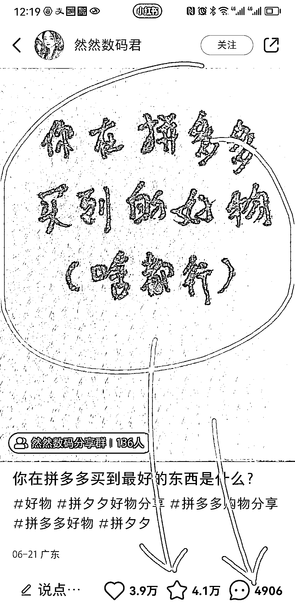

 

 

 

 

 

 

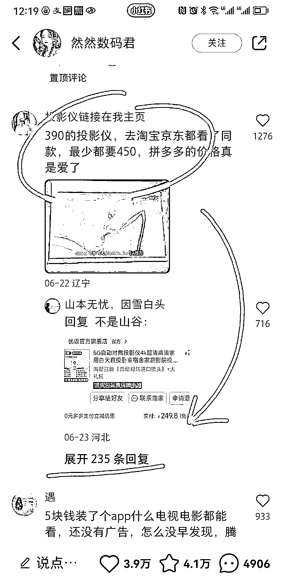

 

 

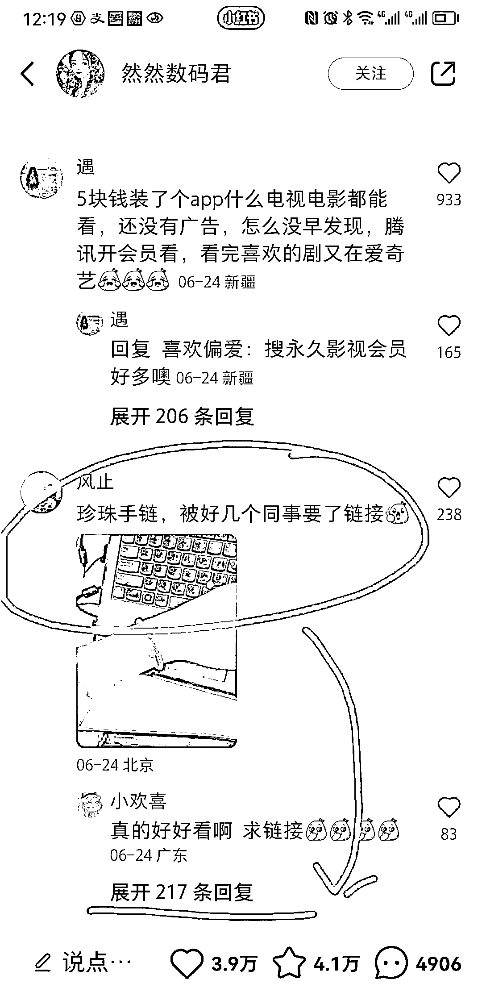

 

 

评论区：

亦仁 : 中标，术值+1。

在上方专栏点击 #中标，可查看所有中标风向标

星空 : 一个选品思路哦🤓

# **# ****(138**赞**)**小红书选品可参考禅小红

作者：  渔歌

日期：2023-04-14

小红书禅小红选品

点击商品栏，随意选择想要的类目。

价格和销量自己关联的笔记数都可以自行选择。

销售额高，对应的笔记数少的，就可以冲

销量高，笔记高的，不冲

 

 

选品可以参考，包括上品的时候也可以对照看竞争强度，减少决策失误

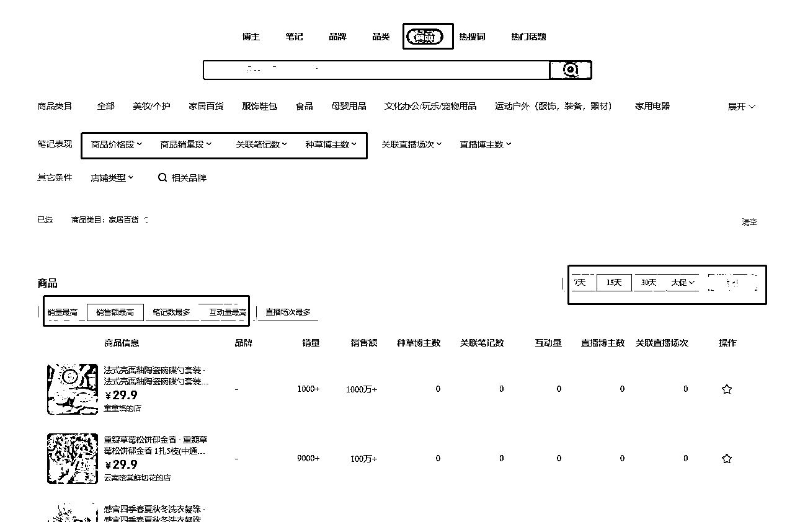

评论区：

渔歌 : 要不我再出个小红书找近期爆品，如何搜索更多的同行？

豆哥 : 可以可以[色]

white jade : 期待，顺便请教下，这个是哪个网站呢，方便告知下么  豆豆 : 期待期待

Mr. 胡添翼 : 蝉小红  搜索三个字就出来了

white jade : 我搜搜看，感谢分享

亦仁 : 中标，术值 +1。

点击最上方 #中标  专栏，可查看所有中标风向标。

一颗杏仁 : 期待！

# **# ****(104**赞**)**小红书电商从选品到出单全套经验分

# 享

 

 

作者：  小毛老师

日期：2023-06-01

大家好，我是小毛

之前也在生财发了几次贴，每次都有自我介绍，这次就不做太多自我介绍了

我们团队是今年才开始做小红书电商的，很幸运趁着红利做出了一定成绩

我这里先说下，我们做这个业务的真实感受

第一：确实有一定的红利效应，不用质疑

第二：操作确实不难

第三：执行力不强，不懂随机应变的有点难干好

小红书电商，我们的操作方式，简单说来，重要流程就三个环节，**1.**选品** 2.**测品** 3.**怼爆品

接下来，我把我们每个环节的操作方式都分享下，大家可以结合其他老师分享的自行参考

为了方便阅读，请各位移步飞书

https://fcf4a0devm.feishu.cn/docx/I4tBdhtiEoffmRxhFdqcB8X0niC 

 

评论区：

biubiu六月 : 非常详细  谢谢小毛老师

思洱 : 感谢

lydia : 感谢分享！关于多品测试，请教一下：每天上5个新品，第二天再上新的5个品，那相当于每个品只测一天么？会不会时间太短？很多时候是不是也可能是素材不行，而不是品不行～

凡尘 : 感谢分享，请问小毛老师，一个号上5个品铺10篇笔记吗！大概一个人运营几个号！

文质彬彬的文 : 干货干货，看了就懂的顶级货！

# **# ****(79**赞**)**小红书无货源电商做女装如何选品？

作者：  书豪

日期：2023-07-07

各位朋友好，我是在杭州的圈友书豪，一个连续创业四年的 95 后，目前连续四年都年入百万。

前面的文章分享了我们关于小红书无货源电商低价百货的选品方法，今天我们来说说我们自己的店铺关于女装的选品方法。

其实女装选品的本质也是跟款，只不过对标的平台变了。

低价百货是在小红书上找粉丝两百以下，近七天带货笔记点赞**100**以上，带货商品销量**100**以上的品去跟。

 

 

而女装我们基本上不在小红书上找对标商品，而是在淘宝上找对标商品，原则是每天去关注淘宝天猫排名前五十的规模较大的女装店铺，他们的新品销量超过**500**单的品。（进入店铺后，不要直接选择【新品】，要选择【全部】栏目下方的【新

品】，就可以查看销量了）

当然，通过之前的低粉爆文法在小红书上找到的女装，我们也是可以去跟的。

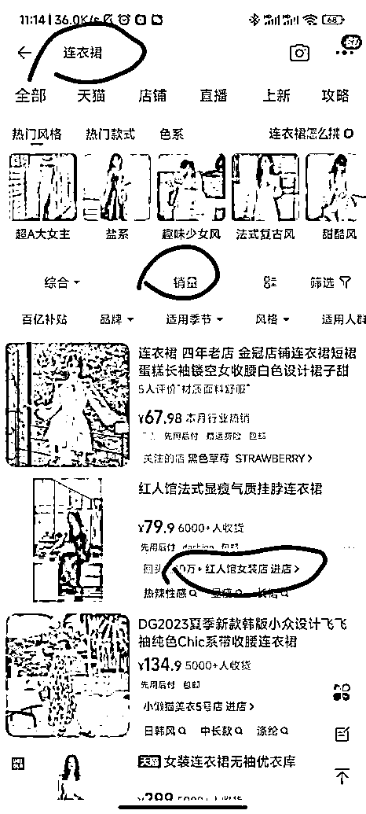 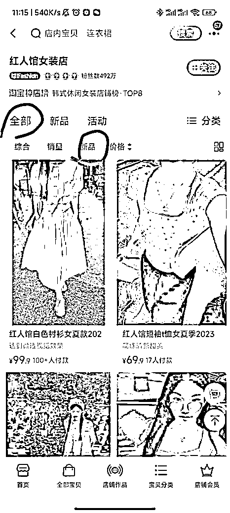

为什么要这样选品呢？

 

 

# 一、选品能力

你要相信，这些女装店铺，他能够在淘宝做到头部腰部，他们的选品能力肯定是比一般卖家，比一般人要好不少的，特别是对于我们这种大部分员工是男性的团队来说，他们是一个非常非常值得借鉴跟款的方向。

所以可以借助淘宝天猫的选品能力，在搜索关键词后，按照销量排名，关注前30家50家左右的店铺，然后每天去看这些店铺的新品情况，一般来说新品都是他们的主推款，而且可能一个新品昨天刚上没流量没销量，但是明天一看已经爆单了，因此需要每天都去关注这些店铺又上了什么新品，最近的新品销量如何。

当然，如果你有精力，也可以去关注那些腰部的卖家，把50家店铺扩大到100家，都是没问题的。不要被一些条条框框束缚住，我们的方法可以是一个方向，具体实践时依照自己的情况去进行就可以。

# 二、选品素材

 

 

做无货源女装最头疼的就是视频混剪素材问题。

一般来说，在小红书上有爆款潜力的百货商品，在淘宝/抖音都是已经爆过的，所以混剪素材资源丰富，有利于我们去批量制作带货视频。

但是女装由于成本、模特、拍摄等等原因，它的视频素材是十分有限的。这时我们如果通过小红书平台去选品的话，很可能跟其他博主撞素材，影响流量就不划算了。

那么通过淘宝天猫选品可以在一定程度上解决这个问题。

大部分女装店铺（非批发）在全网，都会选择在淘宝上上新品，然后再在其他平台分发，所以淘宝天猫上的女装新品的视频，一般都是最新的，甚至在抖音上都是找不到的，所以这种视频素材，我们做做去重，就能拿来直接用了，省时省力。

也可以扒商品主图和买家秀的图片去做图文笔记，百货很多需要通过视频去展示商品的功能性，但是女装可以通过图片去展示产品，不过做图文笔记一定要做二次原创，不能直接搬运图片！

# 三、爆款潜力

通过这种选品方式，很容易发现潜力大爆款，前面说过淘宝天猫的新品，除了一些在小红书上也有旗舰店的店铺，基本上是在小红书都是没有上过的，那么当你第一个上这个品，第一个用新品的素材时，极有可能会大爆特爆。

 

 

但是需要明白的一点是，会不会爆单是概率问题，淘宝上的爆品，小红书不一定爆，也要做好心理准备。

我们之前就通过这个方法，在春夏换季的时候找到一个爆款，就因为第一个在小红书上发了这个品，几天就爆单了，所以一定要找30家50家店铺，去每天看它的新品内容，看最近几天新品的销量情况，都是潜在的大爆款。

有一个可以比较简单地看这个品是否合适的方法，就是看用户评价，一件品销量大几百几千，结果评价寥寥无几，或者都是一些默认好评，那么极大可能这个品是刷单的，这种需不需要上品到小红书，就看你自己了。

我建议是能上就上，就算这个品不爆，也没什么大不了，就当测品了，换个品接着发，接着测就行。

# 四、大词长尾

虽然女装是个大类目，但如果我们一直只搜索【连衣裙】这种大词，会发现按销量排名后，基本上前几十名的商品都是不变的，这样对我们选品的局限性就大了，无法找到一些新的店铺去看品测品。

因此我们需要用大词长尾的搜索方法去找到源源不断的店铺供我们选品测品。

 

 

什么是大词长尾呢？跟大家解释一下，比如说连衣裙这个品，连衣裙就是个大词，那么这时候我们搭配一个【夏季】，这就是一个长尾词。

长尾词可以自行更换的，比如【连衣裙  瘦身】、【连衣裙  沙滩】等等都可以，稍微换一个长尾词，搜索的关键词不一样，出来的结果也会不同，然后我们再根据销量排名去找店铺，这样我们可以选择关注的店铺也就丰富了起来。

然后就按前面的方法，点进商品店铺去看新品，销量不错的我们就可以发到小红书上测一下，销量不行的我们就换一家。

做个总结，做小红书无货源女装，可以通过淘宝天猫去搜索对应的女装类目，按照销量进行排名，选择前**30**家**/50**家**/100**家的店铺，每天关注这些店铺的上新情况，和最近新品的销量情况，如果有销量超过**500**单的，马上跟款。

以上方法，把淘宝天猫换成拼多多/抖音精选联盟也同样适用，选择几家店铺，销量超过多少依自己情况而定。希望对大家能有帮助。

以上，一起生财有术！欢迎各位圈友前来交流，微信 wshinvest1

往期文章：

# **# **人生的第一个100万，我是怎么赚到

# 的？！

 

 

# **# **小红书单店铺单月6000+利润选品保姆级

# 教程

# **# **小红书无货源电商，单品4w+利润，我做

# 了什么？

# **# **抖音直播间月消耗过百万的千川投流经

# 验分享

# **# **2023小红书幼教考编保姆级教程

小红书低粉爆款案例拆解教程

小红书新人入局月入100-1000元保姆级教程

抖音单品短视频带货1000万GMV，我是怎么做到的？！

如何拆解一个小红书爆款视频

评论区：

谢安生 : 实用的知识get，感谢豪哥分享～[强][强][强]

ps：大词长尾真是一个总是忘记的冷知识。

书豪 : [呲牙][呲牙][呲牙]

大蜂 : 豪哥yyds

书豪 : 感谢认可，一起生财有术！

 

 

Kyle : 谢谢，这个选品方式可以使用到别的平台

书豪 : 也是跟品的思路，我们小卖家选品肯定不如天猫大卖家

盗梦人 : 请问下，视频里面的模特是露脸的，这个需要处理一下吗

书豪 : 加一个贴纸就好，不是特别火的模特没事

# **# ****(57**赞**)**小红书店铺项目关于驱动算法的选品方

# 式分享

作者：  老彭

日期：2023-04-07

小红书店铺项目最近很火，分享驱动算法的一种选品方式，

「给男/女朋友买的某某商品」，吸引一方看到后主动艾特另一方，评论区一下子就火起来了，帖子也就火起来了

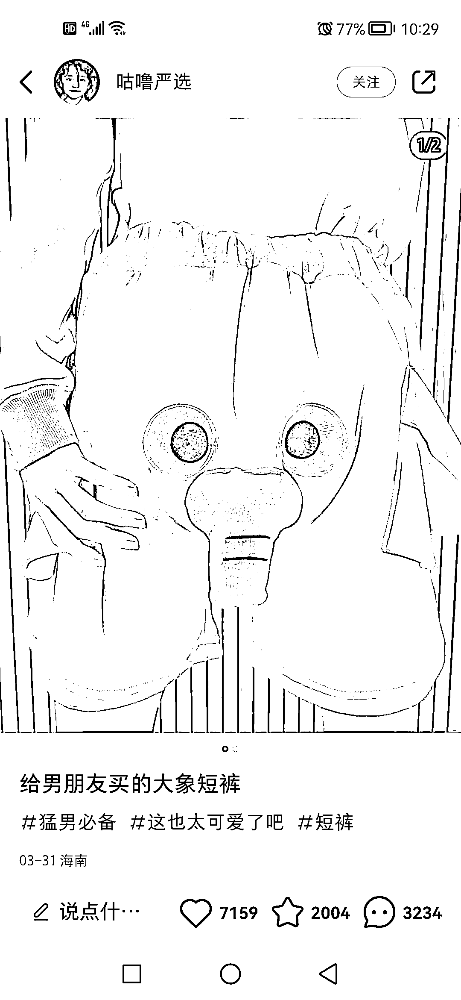

 

 

 

 

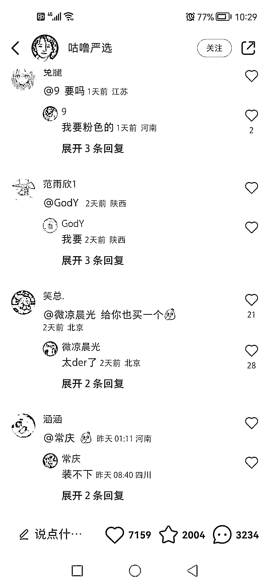

 

 

评论区：

Aaron  : 挂商品链接，流量是不是会减少啊

亦仁 : 中标，术值 +1。

点击最上方 #中标  专栏，可查看所有中标风向标。

# **# ****(14**赞**)**小红书店铺选品技巧：社区热搜词揭示

# 高曝光、高点击、高成交笔记

作者： MD

日期：2023-06-28

关于小红书店铺选品

除了使用蝉小红等付费工具找灵感外，

可以使用商家版APP的社区热搜词功能，

查看热搜词排行以及高曝光、高点击、高成交笔记，

 

 

 

 

 

 

 

 

 

 

 

 

 

 

 

 

 

 

评论区：

暂无评论

# **# ****(9**赞**)**小红书店铺管理下拉，会有笔记搜索热

# 度及笔记缺乏程度

作者：  朱小茜同志

日期：2023-05-24

小红书店铺管理下拉，会有笔记搜索热度及笔记缺乏程度，标记了笔记的中度缺乏、重度缺乏、搜索量及飙升度，可按照供需关系选品

 

 

评论区：

暂无评论

 

 

# 【选品方法**-**技术流】**4**篇

# **# ****(**精华帖**)(373**赞**)**如何从小红书千条带货笔记

# 深度挖掘，找到适合普通人的蓝海爆品

作者：  梨云

日期：2023-06-09

生财圈友们好，我是梨云。

小红书电商，是这几个月，甚至是这一年的热点风口。

无货源被圈友们玩的风生水起，同时，小红书站内商业化也在稳步推进，逐渐开放选品带货功能，有不少知乎玩家惊呼：这莫非是知乎好物2.0！

看了 @家蒙  的风向标直播，我深受启发，于是，也向亦仁大大申请，发起风向标小红书专场领读。

 

 

在做了近10小时的直播，拆解了几十个产品后，我发现，小红书电商的红利期，是真的有太多机会了。

首先，它没有形成品牌垄断，其次，没有形成固定打法，正处于玩法的百花齐放状态，最后，没有进入规范期，稽查也比较宽松。这三个点加起来，意味着普通人现在入场，有大把的肉可以吃。

虽有风口加持，但依然有大量玩家发出相同的问题：卖什么好？

是的，选品定生死，而且，当大家都知道这个品好卖的时候，它的红利已经被吃掉一大半了。

 

 

就像我挖掘到的内衣品，当时2月1号入局，真的特别好做，新号发了2篇笔记，别看个位数点赞，但它就是当天开始出单了，再看别人5月底入局，就难受了。

 

 

这就是选品的红利优势，随着时间推移，没有足够的矩阵号，或者内容创作的时间投入，后期是很难竞争赢别人的。

所以，这就需要我们拥有提前挖掘爆品抢占先机的方法。

是的，在没有资源加持的情况下，普通人的选品策略就是：先下手为强。

上一次，告诉了你在小红书上，如何挖掘出1000个适合普通人的赚钱项目。

这一次，我和你分享，怎么让小红书电商里的爆品先机，把握在自己手上。

蛮荒领域的批量搜集

小红书电商，相对于其他平台的电商项目来说，依然是一个新事物。

在这样的蛮荒领域，刚入场，谁也不知道哪个才是正确方向，只有足够多的成功案例，才能帮助你在小红书上快速获取选品灵感。

所以，按照从无数案例中精拆的思路，第一步，我们需要搜集大量小红书商品笔记。

 

 

刚开始，我是在小红书上输入关键词，手动收集案例，做着做着，突然发现，这有问题！它存在信息茧房！

我只能检索自己认知内的品类关键词，系统也只会做我可能感兴趣的相关推荐，那些我认知外的品类，岂不是直接被筛选掉了？

而商机、蓝海产品，往往就在那些你想不到的地方呀！

怎么办呢，这时候，想到了万能的数据平台，它上面就有商品笔记的筛选。

于是，我把4月的2000条带货笔记导了出来，打开表格，连商品链接这一列都没有！

我需要它，因为可以更直观的获取价格、销量等数据，只有这样，才能支撑我做更深度的分析。

 

 

我便用八爪鱼采集器，爬取灰豚的数据，过程涉及太多细节，和消磨耐心的调整，就不占用太多篇幅展开了，一问程序员朋友，他用python + selenium 20分钟就搞定了……

拿到商品链接，顺势批量爬下了对应产品的【销量】【价格】，然后用表格计算出它们的【GMV】。

小红书4月带货数据源

 

 

ok，后宫佳丽三千，已经在你面前了，接下来，就是刺激的选品环节了。

正所谓选品一时爽，选错火葬场。这么多品，我咋知道哪个好做，哪个不好做，这时候，就要有分析筛选能力，等着别人告诉你，汤都要没了！

先于选品的赛道选择

拿到如此详细的表格，想必你的问题终于更明确了，从“卖啥好”到“做女装咋样”这个问题问得好，下次不许再问了，我们选品最后是具体到某一个产品，不是一个大类，这种宽泛的问题，是得不到可执行的答案的。

 

 

所以我们去思考、做分析，要从宏观出发，到微观落脚。

宏观，就是开启上帝视角，从GMV窥探赛道天花板，可以分为三档：百万赛道（100w+）、十万赛道（10w-99w），和万级赛道（1w-9w）。

先来看看这些赛道的粉丝量分布，这是成本和门槛的一个判断维度，如果粉丝5000以上居多，那么对新手就不友好了。

散点图看了个寂寞，数据太多，点连成一团浆糊，那换一个方式。

按照小红书对博主的分类，把三档赛道的粉丝比例做了出来，这样就很清晰了。

 

 

百万赛道：5000粉以下的博主没有，其中有一半的博主集中在1w-5w粉，不做IP，没有粉丝量积累，你做这个品，可能会带不动。

十万赛道：5000粉以下占了三成多，和万粉以下共同占据半壁江山，门槛大大降低了。

万级赛道：5000粉以下占了快一半，刚入场不要眼高手低，可以来这个赛道做选品，相比前面，难度就是新手村。

粉丝量本质上，反映的是一个账号内容吸粉能力，能倒推出内容质量，进而初略判断笔记制作成本。

同时，粉丝量越大，账号权重越大，初始流量推的也越高，就比如我18w粉的梨云绿，在用户画像同行比例飙升，扰乱了推荐人群，导致没什么点赞的情况下，基础曝光随便都能进入千级流量池。

 

 

如此，对标大博主的带货，开新号来说，难度也是直线上涨的。

答应梨云，你的目标，要和你的能力匹配，不然又要喊怀才不遇了。

接着，分析三档赛道的价格分布，看赛道消费力，有利于圈定选品的价格区间。

 

 

百万赛道：50-100占了4成，200-500占了2成，50块以下只占了0.5成（这得多大的销量才能拉到百万GMV）

十万赛道：50块以下占了一半，50-100块占了3成。

万级赛道：50块以下占了7成！50-100块占了1成多。

发现趋势没，想要突破十几万、上百万，客单价必须往高里走，但是与此相对的，就是带货难度更大。

不管你是选品中心，还是做无货源，选品的价格区间，控制到0-100块，尤其是50块以下，对新人新号会友好一些。

俯瞰三档赛道，最后还是选择进入相对简单的万级赛道，来看看它分布着哪些大品类赛道，有没有你喜欢的，或者，刚好你和朋友，有货源。

 

 

密集恐惧症……就不费你眼了，直接上结论，占比前十的大品类：

到这里就结束了吗？不是的，首饰有很多种啊，比如戒指、吊坠等等。

所以，我们取前5名，来看具体是什么品类。

 

 

取笔记关键词放词云，知道为什么不取标题吗？因为取了分类失败……原因是带货笔记某个特点，后面告诉你。

分类后，整理得到这个表，因为整体造型，和上衣重合度极高，所以我整合在了一起。

 

 

通过这个表格，就发现，手机壳的笔记也很多呀，款式花里胡哨的，咋整，不慌，那就再进一步以价格区间来缩小范围。

用一个透视表，揭示价格、GMV、销量，和互动量之间的内在联系。

 

 

在手机壳这一块，按照10元为间隔，分为了三档：7.9-17.9的1档，17.9-27.9的2档，27.9-37.9的3档。

打分规则一出，高下立判：GMV、互动量越大，得分越高；销量越大，得分越低。

恭喜2档以2分的差距脱颖而出，那么，接下来，就直接在里面选笔记的品了，选了就可以上货开干了！

且慢！

 

 

刚刚完成的，是宏观分析，帮助我们快速锁定一个小区间，方便做选择。

但是！即便是层层筛选，也会有我们做不来的产品，所以，需要进一步，对选中笔记的品，在进一步分析。

只有把微观分析也整明白了，才能彻底确定，这个品，适不适合自己做。

做商品笔记微观分析的宗旨：一切回归到成本计算上来。

带货笔记的成本分析

在上面筛选的区间里，挑了一个粉丝量只有100多，却带出了1.2wGMV的手机壳来分析。

 

 

当我们拿到一个商品笔记链接，该怎么计算投入产出比呢？

首先，点开链接，你会怎么分析？白色牛仔也很酷💭☁  🤍⚪  ⬜

 

 

你看到的，不应该是：啥玩意啊，一个破手机壳，就千赞，这么多人看。

你必须透过笔记看到它整个呈现形式，这是第一个：笔记制作成本

 

 

这个制作成本，还是可以接受的吧，用手机拍摄，还不用剪辑不露面，从链接类型看，它极大可能是无货源素人号，极小可能是自有厂家企业号，绝不可能是选品中心带货。

你要是不能做，那就pass，能做，就会顺势点开主页，来到第二个：账号运营成本 

 

来到主页，就要看简介、看基础数据、刷笔记，逛店铺。

 

 

从上面数据反馈来看，可以知道，启动资金，起码准备6000+，其中的5000是有备无患，因为是无货源，爆单了，是需要你先垫付的。

这个店铺，有41个品，主要是手机壳不同花纹，走的是单品类打爆，而不是单款打爆。

单款，就是一个产品一直发，她是不同的款都发笔记，并且是固定场景，这就意味着，她是自己买产品来拍的，好处是完全避开查重，毕竟是原创，要注意的是，每个款你都要自己买回来，又多了一笔投入。

 

 

翻到最早笔记，可以看到她入场时间，做了多久，45天发了68篇笔记，平均每天发1-2篇，发布量压力不大。

从流量表现来看，笔记大多数就几个赞，靠一两个千赞大爆款拉起来的销量。

你可能会问这个怎么快速分析，简单，数据平台直接导出这个博主全部笔记，然后上表格。

以上分析，你看起来很多、很复杂，其实，一边看一边分析一边学习，2分钟就能完成，主要是熟悉，起码练习10遍以上。

在小红书上分析完，付出成本能接受，然后才是跨app，来到拼多多，看利润。

 

 

一个半月4700，赚的多不多，每个人心里都有一把称，这个自己去判断。

接下来，分析成功概率，它是一个账号跑出4700，还是矩阵跑，搏概率，一将功成万骨枯。

直接检索产品关键词，点店铺，看IP地址是否一致，看这些账号主页的内容是否有批量化痕迹。

 

 

可以看出，不是矩阵，对个人玩家友好。

 

 

最后，结合上面的店铺分析，和关键词检索笔记，看这个款的竞争激烈程度，同款笔记数量极少。

这就是正在赚钱，并且同行少的一个手机壳款式了。

这么分析下来，你只需要对这个问题，给我一个字的回答：

有这么一个品，不混剪自己卖产品拍，要会拍视频剪视频、不用露脸，日更1-2个月，等一个爆款拉爆单，利润三四千，流动资金6000+，无货源。

你做不做？

为了方便大家对带货笔记进行分析，我把这个表格整理好了：

 

 

你可能会说，宏观的赛道分析，光是收集数据就已经太费劲了，能不能通过一条笔记，就把宏微观结合起来分析。

哈哈，当然可以，宏观分析让我们对三个档位有了具体的认知，拿到前面的结论，结合微观分析即可。

我们直接跳过赛道分析，随便选个品，来感受一下这个拆解过程。

比如，你找了这个商品笔记：没了没啦！没想到把脏东西都挖走了？？

建议先点开把视频看完，再看分析。

 

 

 

 

发现没，直接抓笔记分析，遇到普通人可做的品的概率，突然就大大降低了，那怎么提高这个概率呢？

用常识！比如现在是6月，衣食住行方面，有哪些是6月特有的？夏天的女装，是不是切这个赛道，去找款了？

夏天的水果，盲选成功概率，是不是也更大，有荔枝、桃子、杨梅、樱桃……

那我就挑个不喜欢的桃子来分析一下，直接小红书检索桃子，往下翻，找一个数据比较好的笔记，点进去。

卖出十几单  我妈让我跟大家说谢谢

 

 

 

 

那么，根据自己的情况，就可以判断，这个桃子，适不适合自己搞了。

结合前面的宏观+微观，从赛道到产品，这一套操作下来，我把它叫做：漏斗式选品法。

 

 

 

 

这是梨云第二篇小红书挖掘拆解类文章，前期主要分享小红书实操玩法，尤其经过风向标拆解直播后，我发现，与之相比，这种文章能带给大家更多商业启发。

很多人不知道自己要做什么项目，其实还是挖掘得太少，每日挖5个案例试试，一个月就蜕变了。

只要一直深挖，思路就会被打开。

今天的小红书分享就到这里，内容很干，希望能给到大家一些启发和帮助，坚持下去，你一定会有所收获。有帮助的话，记得点个赞哦~也欢迎交流+v：lyy520061更多小红书干货，可以关注公众号：梨云读书

往期精华文章推荐：

《小红书三个月涨粉17w，变现10w+，我做对什么？》

https://t.zsxq.com/07Fqr3jQ7

《小红书60天用原创拿下20多篇10w+，如何流程化创作爆款内容？》

https://t.zsxq.com/09ev8Jjgj

《在小红书上，如何挖掘出1000个适合普通人的赚钱项目》

https://t.zsxq.com/0eRD32jY6

评论区：

 

 

晴朗☀  : 梨云出品，必属精品[强][强][强]

跨境老兵聊电商 : 感谢分享

Jia : 爬虫软件能分享吗

蛋蛋。 : 梨云老师yyds[色]

陈小溪 : 云云出品，全是精品！！！！！

阿釘。 : 很赞 

小小博士申泰白 : 讲的太透彻清晰了，实操性强👍

梨云 : [玫瑰][玫瑰][玫瑰]

# **# ****(157**赞**)**用后羿采集器在蝉小红采集行业信息

# 的教程

作者：  沙丘笔记

日期：2023-06-24

用后羿采集器在蝉小红采集行业信息的保姆级教程

最近跑通了用后羿采集器采集蝉小红数据的整个流程，可以用于小红书的品类分析和商品分析，这里奉上保姆级教程，供圈友参考。详细使用方法，请移步飞书：

https://mxlvpvhrxlt.feishu.cn/docx/DdLvdWpB9o0D0cxXOjSc1YdznPd评论区：

小章鱼 : 太棒了  正想要呢

沙丘笔记 : [呲牙]

千穹 : 大佬6

沙丘笔记 : [呲牙]不敢当，还是新人小白，刚参加完一次航海

李彬 : 正想学习就看到您的分享，谢谢[抱拳][强]

沙丘笔记 : [呲牙][呲牙]

正海 : 666

新月 : 多谢分享～请问类目详情页（点击类目名称跳转的页面）的数据可以爬吗 

 

# **# ****(**精华帖**)(115**赞**)**如何利用数据分析进行小红

# 书电商选品？

作者：  沐风

日期：2023-04-12

《如何利用数据分析进行小红书电商选品？》

大家好，我是沐风，最近应该有很多同学在尝试做小红书电商项目，对于大多数自身没有货源，而且是刚开始接触电商的同学来讲，可能一开始都会面临一个问题：面临这么多行业类目和品类，到底该如何进行选择呢？

这个时候，稍微有点经验的同学可能都会想到借助一些类似蝉小红、新红这样的小红书三方数据平台来辅助自己选品，而不是全凭自己的感觉，毕竟感觉可能会有偏差，但是数据不会骗人。不过，获取数据只是第一步，更重要的是，我们该如何对这些数据进行分析，并利用它们来辅助我们选择行业类目和品类呢？这里，我就给大家分享一下我的一些思路和探索。

为了提升阅读体验，请大家移步飞书阅读：

https://rlp3cigezs.feishu.cn/docx/IwUDdGvHhojaL2xwtUzc6YyZnHh评论区：

witon : 很赞  不过有个点没看太懂：综合评分中  为什么是 30-需求排名和电商价值排名  沐风 : 30就是一个常数值，其实设置成多少都可以，总的行业类目是29，所以我就取了个30，减去需求排名和电商价值排名是为了评分，排名越靠前，得分就越高，例如，排名第1，（30-排名）之后，分值就越高，大概这个逻辑。

witon : 学习了  方便加VX链接嘛

沐风 : 这里不能发微信，私信吧

若昧平生 : 会编程、懂经营、文章写得还好[强]

沐风 : 圈友过奖了  😄，我也在不断学习摸索中

财女小马达 : 全能

沐风 : 过奖过奖

 

 

# **# ****(20**赞**)**批量提取小红书笔记，可以提高选品效

# 率

作者：  西哥

日期：2023-04-11

哈哈哈，乐于分享生财精神，最近一直研究小红书，选品学文案，我比较喜欢提高效率，分享一个

批量提取笔记的方法

1.比如手机支架你想要抓取这个相关笔记的话可以点开比较热门的笔记话题比如手机支架，那边有个分享按钮就可以复制链接了

2然后可以用后奕抓取工具打开智能模式就可以抓取

3如果软件使用不明白的哈，我分享一个插件给大家，就是需要手动去滑就可以获取了  4.如果大家需要去提取笔记内容我这边有找到一个提取软件，你们把链接复制进去就可以批量提取笔记图片和文件了用的时候呢尽量去把杀毒软件关掉哈

链接放在下面了

【超级会员V5】通过百度网盘分享的文件：小红书批量PLU....exe 链接：

提取码：c6c9

复制这段内容打开「百度网盘APP 即可获取」

【超级会员V5】通过百度网盘分享的文件：链接批量提取插件

链接：

提取码：1629

复制这段内容打开「百度网盘APP 即可获取」

https://pan.baidu.com/s/1eaVgq1yK597asjo4pBMPtA?pwd=c6c9 https://pan.baidu.com/s/1omxGuQx5k_Sdah5LNngnyQ?pwd=1629

 

 

 

 

   

 

 

评论区：

西哥 : 有做小红书的可以一起交流，正在学习阶段嘻嘻DUM321➕备注生财哈  亿安 : 两个链接内容是一样的，都是plus

西哥 : 【超级会员V5】通过百度网盘分享的文件：链接批量提取插件

链接：

提取码：7BW9

复制这段内容打开「百度网盘APP 即可获取」

https://pan.baidu.com/s/1k3bO7YhbGpPHas5JAfoMLQ?pwd=7BW9  SayNothing : 这个链接失效了欸

boarding : 链接失效了

# 总结

大家可以根据目录里点击直达跳转。

风向标小懒也都如数整理给大家了，到咱们专属群的消息就可以看到。

 

 

希望大家从中找到商机，赚到钱~

本周生财周报除了离线版，小懒也会整理到在线版合集里，方便大家检索和手机上查看。

更多内容，见咱们懒人专属群的群文件和群公告！

懒人专属群介绍：https://lazybook.fun/#/blog/group专属群更新记录：https://lazybook.fun/#/blog/record2懒人通才计划：https://lazybook.fun/#/data/13_course懒人手册：https://lazybook.fun/#/

 

 