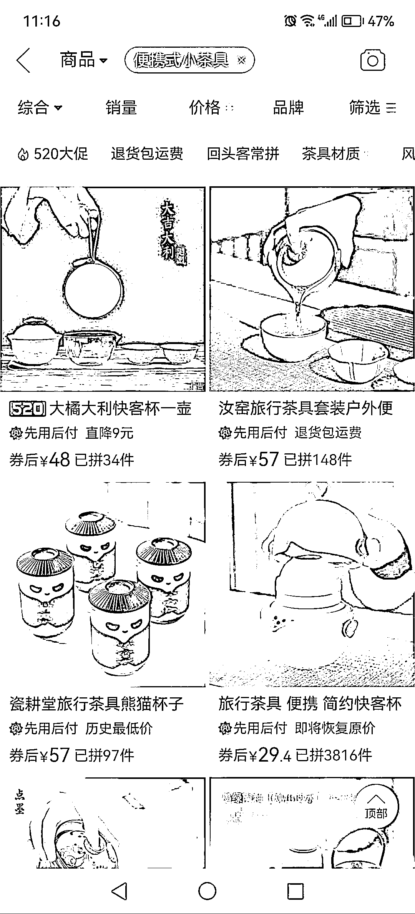
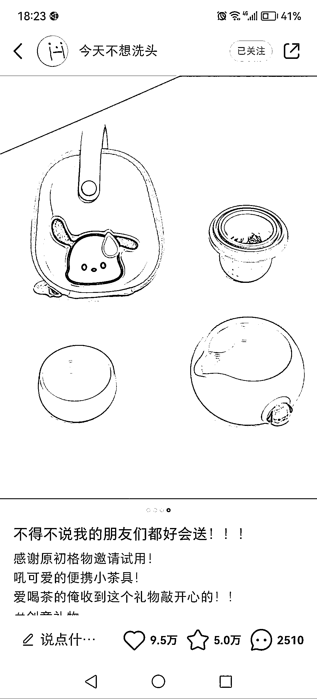
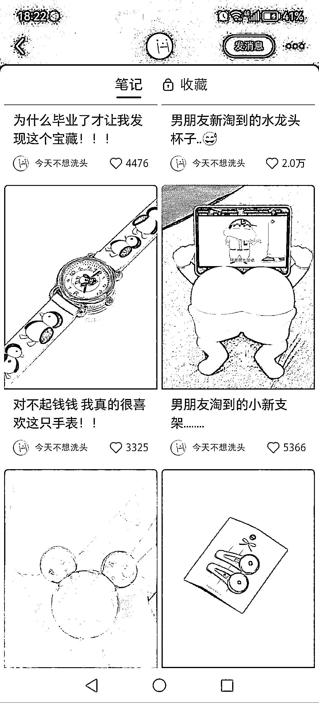
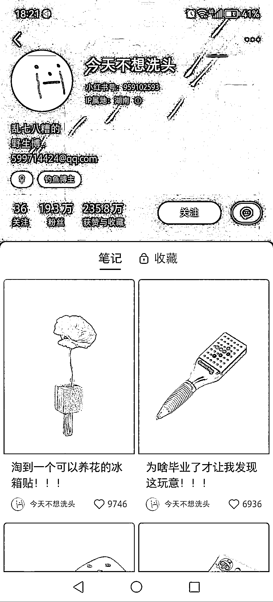
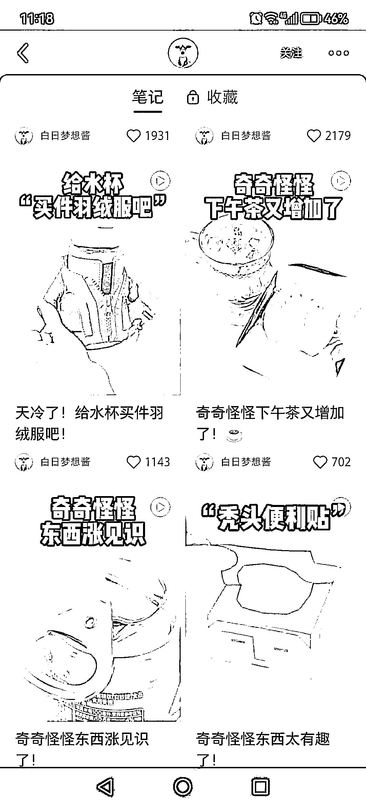
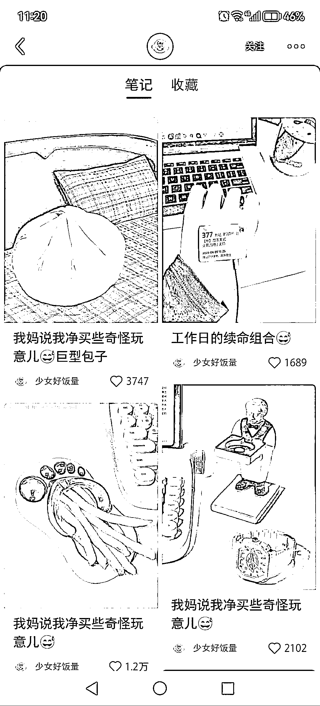

# (194 赞)小红书创意实用好物博主，是一个选品思路

作者：  半阙酒

日期：2023-05-16

小红书创意实用好物博主。

我看了一下，沉迷其中无法自拔。

感觉有好看又实用。

如果有开店铺的小伙伴去刷一刷，也是一个选品思路，然后去别的平台搜这个类型。

 

 

 

 

 

 

 

 

 

 

 

 

 

 

 

 

 

 

 

 

 

 

评论区：

田小田的甜 : 我也很喜欢看这种哎

亦仁 : 中标，术值+1。

在上方专栏点击 #中标，可查看所有中标风向标。

随想 : 很漂亮

速影 : 这种搜什么关键词可以匹配到？

半阙酒 : 创意室友好物

半阙酒 : 创业实用好物，打错字啦

半阙酒 : 又打错了，创意实用好物，搜这个

速影 : 谢谢[抱拳]
